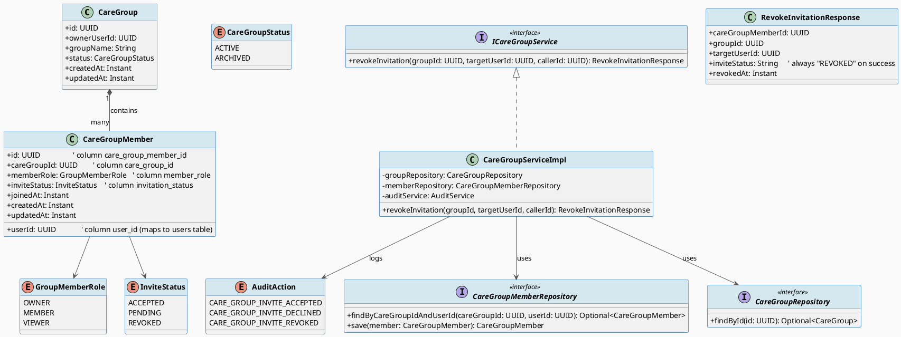
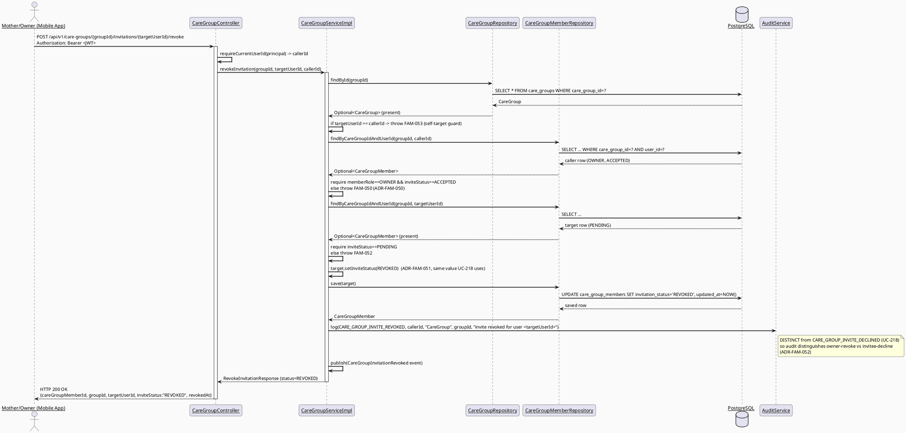
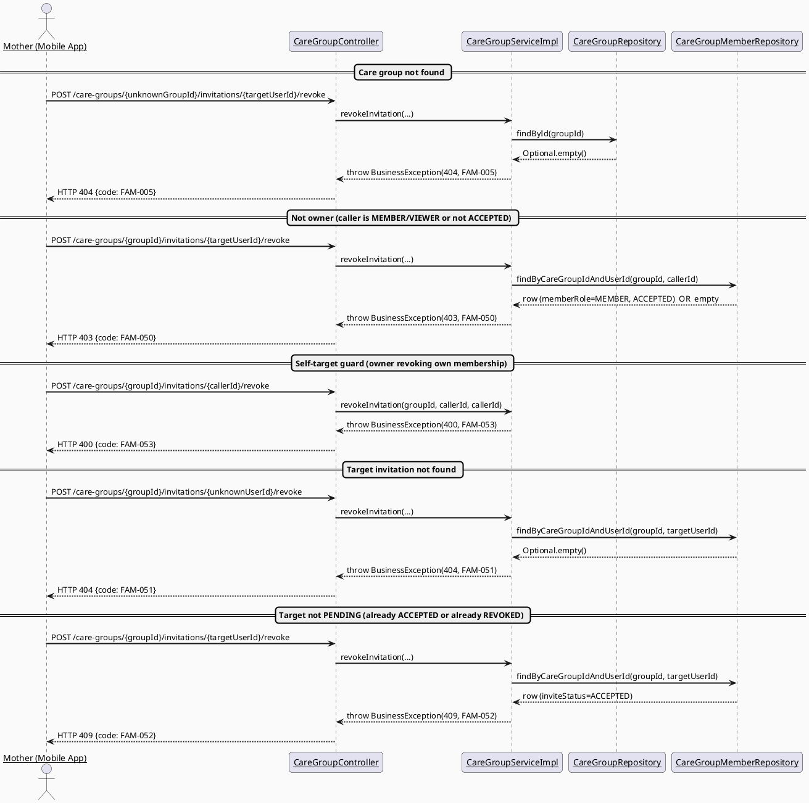
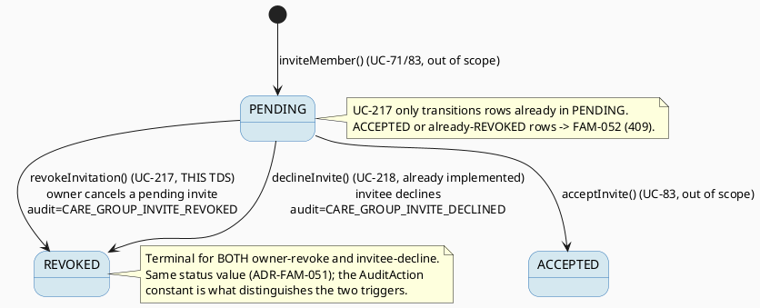

# ENGINEERING DOCUMENTATION STANDARD (EDS) v2.0
# Technical Design Specification — UC-217 Revoke Family Invitation

| Field | Value |
|-------|-------|
| **Document ID** | `CB-FAM-IMP-217` |
| **Version** | `1.0` |
| **Date** | `2026-07-03` |
| **Status** | `Draft` |
| **Document Owner** | `TV2-Bách` |
| **Author** | `AI Agent (Technical Architect + Test Designer role)` |
| **Reviewed by** | `[ ] Pending` |
| **DPO Sign-off** | `[ ] Pending` *(module touches family membership / PII — see §1)* |
| **Approved by** | `[ ] Pending` |
| **Last Review** | `2026-07-03` |
| **Based on EDS** | `v2.0` |

---

## CHANGELOG

> **Policy 4.4 — Immutable History:** Never delete prior entries. All changes are appended below.

| Ngày | Người thực hiện | Nội dung thay đổi |
|------|-----------------|-------------------|
| 2026-07-03 | AI Agent — Technical Architect | Initial draft — TDS for UC-217 Revoke Family Invitation |

---

## MỤC LỤC

1. [Tổng quan Module](#1-tổng-quan-module)
2. [Ma trận Truy vết (Traceability Matrix)](#2-ma-trận-truy-vết-traceability-matrix)
3. [Architecture Decision Records (ADR)](#3-architecture-decision-records-adr)
4. [Non-Functional Requirements & SLA](#4-non-functional-requirements--sla)
5. [Static Modeling (Mô hình Tĩnh)](#5-static-modeling-mô-hình-tĩnh)
6. [Dynamic Modeling (Mô hình Động)](#6-dynamic-modeling-mô-hình-động)
7. [Domain Event Catalog](#7-domain-event-catalog)
8. [Interface Specification (Đặc tả Giao diện)](#8-interface-specification-đặc-tả-giao-diện)
9. [API Specification](#9-api-specification)
10. [Bảng mã lỗi (Error Codes)](#10-bảng-mã-lỗi-error-codes)
11. [Quy trình Triển khai (Step-by-Step)](#11-quy-trình-triển-khai-step-by-step)
12. [Rollback & Incident Runbook](#12-rollback--incident-runbook)
13. [Kịch bản Kiểm thử Chi tiết](#13-kịch-bản-kiểm-thử-chi-tiết)
14. [Phương pháp Xác minh](#14-phương-pháp-xác-minh)
15. [Mẫu thử thực tế (API Verification Samples)](#15-mẫu-thử-thực-tế-api-verification-samples)
16. [Bảng tổng hợp phân quyền (Authorization Matrix)](#16-bảng-tổng-hợp-phân-quyền-authorization-matrix)
17. [AI Prompt Constraints (CASE 2.0)](#17-ai-prompt-constraints-case-20)

---

## 1. Tổng quan Module

UC-217 "Revoke Family Invitation" lets a Mother — specifically the **OWNER** of a `CareGroup` —
cancel a family invitation she previously issued **before the invited person accepts it**. The
action targets another member's `care_group_members` row (the invitee, NOT the caller) whose
`invitation_status` is `PENDING`, and transitions that row's status to `REVOKED`. This is a
single-call, server-side state transition; no schema change and no new enum value are required
(see ADR-FAM-050). This TDS covers ONLY the owner-initiated revoke of a still-pending invite. It
does NOT cover: the invitee's own decline flow (already implemented as UC-218
`declineInvite()`), resending an invite (UI shows a "Gửi lại"/resend button — out of scope,
belongs to a separate UC), or hard-deleting membership rows.

| Field | Value |
|-------|-------|
| **Module Name** | `Family Sync — Revoke Care Group Invitation` |
| **Bounded Context** | `family` (package `com.carebridge.backend.family`) |
| **UC ID** | `UC-217` |
| **SRS Reference** | `§3.3.17.2 Revoke Family Invitation` (`02_Requirements/SRS/3_Functional_Specification.md`) |
| **Primary Actor** | `Mother (must be group OWNER)` |
| **Secondary Actors** | `None` (per SRS) |
| **Platform** | `Mobile App` (screen CB-169 Pending Invitations) |
| **Priority / Frequency** | `Medium` / `Occasional` (per SRS) |
| **Data Classification** | `PII` (care-group family membership) |
| **Compliance Scope** | `BR-RBAC, BR-PRIVACY, PDPA` (Vietnam) — no GDPR/CCPA scope asserted (VN-market product) |
| **Upstream Dependencies** | `CareGroupRepository`, `CareGroupMemberRepository` (reused as-is), `AuditService` |
| **Downstream Consumers** | Audit log; UC-216 View Care Group Members (a `REVOKED` row is filtered out of the member list, existing behavior) |

**Mô tả:** Owner mở màn hình "Lời mời chờ xử lý" (CB-169), thấy danh sách lời mời `PENDING`, nhấn
"Hủy lời mời" (biểu tượng `cancel`) trên một lời mời. Hệ thống chuyển `invitation_status` của
hàng thành viên tương ứng sang `REVOKED` và ghi audit. Chỉ OWNER (đã `ACCEPTED`) mới được thực
hiện; chỉ lời mời còn `PENDING` mới được thu hồi.

---

## 2. Ma trận Truy vết (Traceability Matrix)

| Requirement ID | Loại (BR/ADR/US) | Mô tả yêu cầu | Thành phần Code | Compliance Target | ADR liên quan |
|----------------|------------------|---------------|-----------------|-------------------|---------------|
| SRS-UC217-PRE-1 | Precondition | System/services available | `CareGroupServiceImpl.revokeInvitation()` (fails fast via repository) | — | — |
| SRS-UC217-PRE-2 | Precondition | Actor on Pending Invitations screen (mobile) | `pending_invitations_screen.dart` (CB-169) | — | — |
| SRS-UC217-PRE-3 | Precondition | Actor authenticated as group OWNER | `@PreAuthorize("hasRole('MOTHER')")` + inline owner check | BR-RBAC | ADR-FAM-050 |
| SRS-UC217-PRE-4 | Precondition | Target invitation exists and is `PENDING` | `memberRepository.findByCareGroupIdAndUserId()` + status guard | — | ADR-FAM-050 |
| SRS-UC217-POST-1 | Postcondition | Clear result shown to owner | `RevokeInvitationResponse` (200) | — | — |
| SRS-UC217-POST-2 | Postcondition | Target invitation status updated | Target row `invitation_status → REVOKED` | — | ADR-FAM-051 |
| SRS-UC217-POST-3 | Postcondition | Sensitive action recorded for audit | `AuditService.log(CARE_GROUP_INVITE_REVOKED, ...)` | PDPA audit trail | ADR-FAM-052 |
| SRS-UC217-NF1 | Normal Flow | Open screen, validate owner context | Controller `@PreAuthorize` + inline owner check | BR-RBAC | ADR-FAM-050 |
| SRS-UC217-NF2 | Normal Flow | Confirm revoke, apply business rule | `revokeInvitation()` service method | — | ADR-FAM-051 |
| SRS-UC217-NF3 | Normal Flow | Display result + update record | Response DTO + `CareGroupInvitationRevoked` event | — | ADR-FAM-052 |
| SRS-UC217-AF1 | Alt Flow | Cancel-safe (owner dismisses confirm) | Mobile confirm dialog — no server call, no side effect | — | — |
| SRS-UC217-E1 | Exception | Access denied (not owner) | `FAM-050` (403) | BR-RBAC | ADR-FAM-050 |
| SRS-UC217-E2 | Exception | Target invitation not found | `FAM-051` (404) | — | — |
| SRS-UC217-E3 | Exception | Target not in `PENDING` (already accepted/revoked) | `FAM-052` (409) | — | ADR-FAM-051 |
| SRS-UC217-E4 | Exception | Owner targets own membership row | `FAM-053` (400 self-target guard) | — | ADR-FAM-050 |
| SRS-UC217-E5 | Exception | Care group not found | `FAM-005` (404, reused from UC-70/UC-216 — not redefined) | — | — |
| BR-RBAC | Business Rule | Role/permission scope only — owner-only revoke | `@PreAuthorize` + inline `memberRole==OWNER && inviteStatus==ACCEPTED` check | BR-RBAC | ADR-FAM-050 |
| BR-PRIVACY | Business Rule | Family data minimum-necessary; response never leaks other members' contact info | `RevokeInvitationResponse` returns IDs/status only, no email/phone | PDPA | — |
| OPEN-1 | Open Item | Whether the revoked invitee is notified (push/SMS) | Not specified in SRS — see §7 note | — | — |
| OPEN-2 | Open Item | Numeric SLA targets (latency/availability) | Not sourced — §4 placeholders | — | — |

---

## 3. Architecture Decision Records (ADR)

### ADR-FAM-050 — Owner-Only Revoke Authorization (inline check, reusing the ADR-FAM-011 ownership pattern)

| Field | Value |
|-------|-------|
| **Status** | `Proposed` (Open — pending user/Tech Lead confirmation) |
| **Deciders** | `AI Agent (proposed)` — pending Product/Tech Lead |
| **Date** | `2026-07-03` |
| **Supersedes** | — |

#### Bối cảnh (Context)
SRS BR-RBAC states "role/permission scope only" generically. Revoking a pending invite is a
membership-management action that must be restricted to the person who controls the group. The
sibling UC-71 draft proposed this exact "owner-only" pattern as `ADR-FAM-011`
(`memberRole == OWNER && inviteStatus == ACCEPTED` on the caller's OWN row). The already-shipped
`CareGroupServiceImpl.inviteMember()` (lines ~155-162) encodes this pattern inline (no policy
class). `family/policy/` is empty (`.gitkeep` only), so there is no `CareGroupAccessPolicy`/
authorization-policy class to reuse — the check must be done inline in the service method,
consistent with the existing convention.

#### Các phương án đã xem xét (Options Considered)

| Phương án | Mô tả | Ưu điểm | Nhược điểm |
|-----------|-------|----------|------------|
| A | Any `ACCEPTED` member may revoke any pending invite | Flexible for large families | Uncontrolled; a non-owner could cancel invites the owner sent; conflicts with the existing owner-only invite gate |
| B | Only caller whose OWN row is `memberRole == OWNER && inviteStatus == ACCEPTED` may revoke | Matches existing `inviteMember()` gate exactly; minimal authorization surface; symmetric with who can invite | Co-parents with `MEMBER` role cannot revoke (deferred to a future delegated-permission UC) |
| C | Introduce a new `CareGroupAccessPolicy` class to centralize the check | Cleaner long-term | Invents an unbuilt class; `family/policy/` is empty; deviates from the current inline convention; larger scope than warranted |

#### Quyết định (Decision)
Chọn **Phương án B** — inline owner-only, ACCEPTED-only. The service loads the caller's own
membership via `memberRepository.findByCareGroupIdAndUserId(groupId, callerId)` and requires
`memberRole == OWNER && inviteStatus == ACCEPTED`, throwing `FAM-050` (403) otherwise. This is a
byte-for-byte reuse of the ownership pattern already present in `inviteMember()` and the concept
formalized as `ADR-FAM-011` in the UC-71 draft. No policy class is introduced (matches the real
inline convention).

**⚠️ Open — requires explicit user confirmation** that revoke is OWNER-only (not
any-accepted-member). If delegated permissions are later allowed, this ADR must be superseded,
not silently reinterpreted.

#### Hệ quả (Consequences)

**Tích cực:**
- Single-boolean authorization surface; symmetric with the invite gate (Least Privilege, §16).
- Zero new classes; consistent with the existing inline convention.

**Tiêu cực / Trade-offs:**
- Non-owner members cannot revoke — deferred to a future permission-delegation UC.

**Compliance Impact:**
- Limits who can alter family-membership state — favorable for BR-PRIVACY/BR-RBAC.

---

### ADR-FAM-051 — Reuse the existing `REVOKED` terminal value (no new enum value, no migration)

| Field | Value |
|-------|-------|
| **Status** | `Proposed` (Accepted by batch decision — confirmed by user for the family-sync batch) |
| **Deciders** | `User (batch decision)` + AI Agent |
| **Date** | `2026-07-03` |

#### Bối cảnh (Context)
The real `InviteStatus` enum (`family/entity/InviteStatus.java`) has exactly three values:
`ACCEPTED, PENDING, REVOKED` — no `REJECTED`, no `EXPIRED`. UC-218's already-implemented
`declineInvite()` sets a declined invite to `REVOKED`. UC-217 needs a terminal state for an
owner-cancelled pending invite. A naive design would add a new enum value (e.g. `CANCELLED`),
which would require an enum change and risk a schema/CHECK mismatch.

#### Các phương án đã xem xét (Options Considered)

| Phương án | Mô tả | Ưu điểm | Nhược điểm |
|-----------|-------|----------|------------|
| A | Add a new `CANCELLED` (or `REVOKED_BY_OWNER`) enum value | Distinguishes owner-revoke from invitee-decline at the status level | Enum change + risk of DB value drift; UC-216 filter (`ACCEPTED, PENDING`) would need updating to exclude the new value too; larger blast radius; violates the batch "no new enum values, no migration" decision |
| B | Write `invitation_status = REVOKED` on the target row (same terminal value UC-218 uses), and differentiate the *trigger* purely via a distinct `AuditAction` constant (`CARE_GROUP_INVITE_REVOKED`) | No enum change, no migration; UC-216's existing `IN ('ACCEPTED','PENDING')` filter already excludes `REVOKED`, so the revoked invite disappears from the member list automatically; audit log still distinguishes owner-revoke vs invitee-decline | The membership row alone cannot tell "who revoked" without consulting the audit log |

#### Quyết định (Decision)
Chọn **Phương án B**. The revoke action sets the target row's `invitation_status` to `REVOKED`
(the same terminal value UC-218's `declineInvite()` already writes for a different trigger).
The two triggers are differentiated **only** by the audit action constant:
`CARE_GROUP_INVITE_REVOKED` (this UC, owner-initiated) vs the existing
`CARE_GROUP_INVITE_DECLINED` (UC-218, invitee-initiated). This is a confirmed batch decision:
**`invitation_status` stays exactly `{ACCEPTED, PENDING, REVOKED}` — no new enum values, no
migration.**

#### Hệ quả (Consequences)

**Tích cực:**
- Zero schema/enum change; UC-216 member-list filter needs no update.
- Audit trail still answers "owner revoked" vs "invitee declined" via distinct action constants.

**Tiêu cực / Trade-offs:**
- Reading the membership row alone does not reveal the revoke *reason*; the audit log is the
  source of truth for that distinction (acceptable — audit is the correct place for trigger
  provenance).

**Compliance Impact:**
- Append-only status transition (no row delete) — preserves auditability (PDPA).

---

### ADR-FAM-052 — New distinct `AuditAction` constant `CARE_GROUP_INVITE_REVOKED`

| Field | Value |
|-------|-------|
| **Status** | `Proposed` (Accepted by batch decision) |
| **Deciders** | `User (batch decision)` + AI Agent |
| **Date** | `2026-07-03` |

#### Bối cảnh (Context)
Because ADR-FAM-051 reuses the `REVOKED` status value shared with UC-218's decline flow, the
ONLY way audit logs can distinguish an owner-initiated revoke from an invitee-initiated decline
is a distinct audit action constant. The current `AuditAction` enum
(`audit/entity/AuditAction.java`) contains `CARE_GROUP_INVITE_ACCEPTED` and
`CARE_GROUP_INVITE_DECLINED` but **no** revoke constant.

#### Quyết định (Decision)
Add a new enum constant **`CARE_GROUP_INVITE_REVOKED`** to `AuditAction`, distinct from the
existing `CARE_GROUP_INVITE_DECLINED`. `revokeInvitation()` logs with this new constant. **This
TDS only specifies the constant; the actual enum-file edit is an implementation task (§11), not
performed by this document.**

#### Hệ quả (Consequences)

**Tích cực:** Audit logs cleanly separate "owner revoked" from "invitee declined."
**Tiêu cực / Trade-offs:** One additional enum constant to maintain (negligible).
**Compliance Impact:** Strengthens the PDPA audit trail (accurate action provenance).

---

## 4. Non-Functional Requirements & SLA

> No source in SRS or existing TDS docs specifies numeric SLAs for this feature. All targets
> below are **Open — placeholder defaults** (reused CareBridge platform defaults), not sourced
> commitments, and must be confirmed by Tech Lead before being treated as binding (OPEN-2).

### 4.1. Performance & Availability

| Category | Requirement | Target SLA | Measurement Method | Compliance Basis |
|----------|-------------|------------|---------------------|------------------|
| Latency | `POST /care-groups/{groupId}/invitations/{targetUserId}/revoke` (p99) | `< 300ms` (Open — platform default) | k6 load test | — |
| Availability | Uptime (monthly) | `99.9%` (Open — platform default) | Uptime monitor | — |
| Throughput | Concurrent requests | Not benchmarked — Open (Occasional frequency per SRS) | — | — |

### 4.2. Data Integrity & Retention

| Category | Requirement | Target | Verification Method | Compliance Basis |
|----------|-------------|--------|---------------------|------------------|
| Durability | Status transition committed atomically | RPO = 0 (transactional) | Transaction log | — |
| Retention | Audit log retention | Platform default (Open — no feature-specific period in SRS) | DB backup policy | PDPA |
| Consistency | Only `PENDING → REVOKED` allowed; append-only (no delete) | 100% | Service guard + §14 SQL check | — |

### 4.3. Security

| Category | Requirement | Target | Verification Method | Compliance Basis |
|----------|-------------|--------|---------------------|------------------|
| Access control | Owner-only revoke | Least privilege | Auth Matrix (§16) | BR-RBAC |
| Data minimization | Response contains no email/phone | 0 PII fields in response | Response schema review | BR-PRIVACY |
| Encryption in transit | All endpoints | TLS 1.3+ | SSL scan | PDPA |

### 4.4. Scalability & Capacity Planning

Revoke is an `Occasional`-frequency, single-row `UPDATE` with no fan-out. Worst-case load is
bounded by the number of pending invites per group (already small). No caching or
horizontal-scaling strategy is warranted. **Open** — no load projection exists in current docs.

---

## 5. Static Modeling (Mô hình Tĩnh)

### 5.1. Class Diagram (PlantUML)

> **Schema fidelity note:** Field/column names below reflect the REAL entity
> `CareGroupMember.java` — `userId` → column `user_id`, `inviteStatus` → column
> `invitation_status`, mapped against the `users` table. The `account_id` / `invite_status` /
> `accounts` names that appear in some sibling TDS prose are **incorrect** and are NOT used here.



### 5.2. Data Structure (Flyway SQL Migration)

> **CareBridge rule:** `V1__init_schema.sql` is the schema baseline. Never modify an applied
> migration.

**No migration is required for UC-217.** The feature only performs an `UPDATE` of an existing
column (`care_group_members.invitation_status`) to an existing enum value (`REVOKED`). No new
column, table, index, enum value, or CHECK constraint is introduced (ADR-FAM-051).

```sql
-- Reference only (existing table — DO NOT recreate):
-- care_group_members(
--   care_group_member_id UUID PK,
--   care_group_id        UUID NOT NULL,
--   user_id              UUID NOT NULL,     -- maps to users(id)
--   member_role          VARCHAR(50),
--   invitation_status    VARCHAR(20) NOT NULL,  -- ACCEPTED | PENDING | REVOKED
--   joined_at            TIMESTAMPTZ,
--   created_at           TIMESTAMPTZ NOT NULL,
--   updated_at           TIMESTAMPTZ NOT NULL
-- )

-- The runtime effect of revokeInvitation() (illustrative — executed via JPA save(), not raw SQL):
UPDATE care_group_members
SET invitation_status = 'REVOKED',
    updated_at        = NOW()
WHERE care_group_id = :groupId
  AND user_id       = :targetUserId
  AND invitation_status = 'PENDING';
```

> **Quy tắc đặt tên:** All columns are `snake_case` in DDL. The JPA entity uses camelCase
> (`userId`, `inviteStatus`) mapped to `user_id` / `invitation_status` via `@Column` — verified
> against `CareGroupMember.java`.

---

## 6. Dynamic Modeling (Mô hình Động)

### 6.1. Sequence Diagram — Happy Path (PlantUML)



### 6.2. Sequence Diagram — Error Paths (PlantUML)



### 6.3. State Machine — `InviteStatus` (revoke transition only)



**⚠️ Invariant bất biến:**
- No transition deletes a `CareGroupMember` row (append-only status change).
- UC-217 performs ONLY the `PENDING → REVOKED` transition; it never touches `ACCEPTED` rows
  (those hit `FAM-052`).
- `invitation_status` value set is unchanged: `{ACCEPTED, PENDING, REVOKED}` — no new value.

---

## 7. Domain Event Catalog

### 7.1. Events Published (Phát ra)

| Event Name | Trigger | Publisher | Subscriber(s) | Payload Schema | Async? |
|------------|---------|-----------|---------------|----------------|--------|
| `CareGroupInvitationRevoked` | Successful `revokeInvitation()` (target row set to `REVOKED`) | `CareGroupServiceImpl` | Audit/log listener only (Open — no FCM push defined; SRS secondary actor = None) | `CareGroupInvitationRevoked.java` | Yes |

**Note on notification (OPEN-1):** SRS lists no secondary actor for UC-217. Whether the revoked
invitee receives any push/SMS notification of the cancellation is **Open** — not specified in
SRS. This TDS assumes NO outbound notification to the invitee (the pending invite simply
disappears from any list they might see). Flag for product sign-off if a "your invite was
cancelled" notification is desired.

### 7.2. Events Consumed (Tiêu thụ)

| Event Name | Source | Handler | Action thực hiện |
|------------|--------|---------|------------------|
| _(none)_ | — | — | UC-217 does not consume any domain event. |

### 7.3. Payload Schema

```java
// CareGroupInvitationRevoked.java
public record CareGroupInvitationRevoked(
    UUID    eventId,          // UUID.randomUUID() — used to deduplicate
    String  eventType,        // "CareGroupInvitationRevoked"
    Instant occurredAt,       // Instant.now()
    String  version,          // "1.0"
    Payload payload,
    Metadata metadata
) implements ApplicationEvent {

    public record Payload(
        UUID careGroupId,
        UUID careGroupMemberId,   // the revoked target's membership row id
        UUID targetUserId,        // the invitee whose invite was revoked
        UUID revokedByUserId      // the owner who performed the revoke (= caller)
    ) {}

    public record Metadata(
        UUID   correlationId,
        String causedBy           // callerId as string
    ) {}
}
```

---

## 8. Interface Specification (Đặc tả Giao diện)

### 8.1. Service Interface

```java
// RevokeInvitationResponse.java — Output DTO
// @version 1.0
public class RevokeInvitationResponse {
    private UUID careGroupMemberId;   // target's care_group_members.care_group_member_id
    private UUID groupId;             // care_group_id
    private UUID targetUserId;        // the invitee whose invite was revoked
    private String inviteStatus;      // always "REVOKED" on success
    private Instant revokedAt;        // target.updatedAt after the status change
    // getters / setters (Lombok @Data @Builder in practice, matching sibling DTOs)
}

// ICareGroupService.java — Service Contract (EXTENDS existing interface, additive)
// @version 1.1
// @breaking-change None — additive method only
public interface ICareGroupService {

    // --- existing methods (unchanged, shown for context) ---
    // CreateCareGroupResponse createCareGroup(CreateCareGroupRequest request, UUID callerId);
    // CareGroupMembersResponse listMembers(UUID groupId, UUID callerId);
    // CareGroupMemberDto inviteMember(UUID groupId, InviteCareGroupMemberRequest request, UUID callerId);
    // void declineInvite(UUID groupId, UUID callerId);   // UC-218 — sets REVOKED via CARE_GROUP_INVITE_DECLINED

    /**
     * UC-217 — Owner revokes a still-PENDING family invitation.
     * Sets the target member's invitation_status to REVOKED (same terminal value UC-218 uses),
     * differentiated by AuditAction.CARE_GROUP_INVITE_REVOKED.
     *
     * @param groupId       the care group
     * @param targetUserId  the invited user whose PENDING invite is being revoked (NOT the caller)
     * @param callerId      the authenticated caller (must be OWNER + ACCEPTED of the group)
     * @throws com.carebridge.backend.common.exception.BusinessException (FAM-005/404) if care group not found
     * @throws BusinessException (FAM-050/403) if caller is not the OWNER (ACCEPTED) of the group
     * @throws BusinessException (FAM-051/404) if no invitation row exists for targetUserId in the group
     * @throws BusinessException (FAM-052/409) if the target invitation is not in PENDING state
     * @throws BusinessException (FAM-053/400) if targetUserId == callerId (cannot revoke own membership)
     */
    RevokeInvitationResponse revokeInvitation(UUID groupId, UUID targetUserId, UUID callerId);
}
```

### 8.2. Repository Interface

```java
// CareGroupMemberRepository.java — NO CHANGE NEEDED (reused as-is)
// @version 1.0
public interface CareGroupMemberRepository extends JpaRepository<CareGroupMember, UUID> {

    // Reused for BOTH the caller-owner lookup AND the target-invite lookup:
    Optional<CareGroupMember> findByCareGroupIdAndUserId(UUID careGroupId, UUID userId);

    // (other existing methods unchanged: existsByCareGroupIdAndUserIdAndInviteStatus,
    //  findByCareGroupIdAndInviteStatusIn, countByCareGroupId, findByUserIdAndInviteStatus)
    // Note: save() from JpaRepository performs the PENDING -> REVOKED UPDATE.
}
```

> **Contract-existence note (anti AP-AI-005):** `findByCareGroupIdAndUserId` and `save` already
> exist on the real `CareGroupMemberRepository` (verified). `revokeInvitation` does NOT require
> any new repository method — the feature is greenfield only at controller/service/DTO/event
> level.

---

## 9. API Specification

### 9.1. Endpoints Table

| Method | Path | Auth Level | Required Roles | Rate Limit | Idempotent? |
|--------|------|------------|----------------|------------|-------------|
| `POST` | `/api/v1/care-groups/{groupId}/invitations/{targetUserId}/revoke` | JWT Bearer | `MOTHER` (+ must be group OWNER, checked in service) | Not specified — Open, propose platform default 60/min | Yes* |

*Idempotent in effect: a second call on an already-`REVOKED` row returns `FAM-052` (409), so the
first revoke is the only state change; the operation is naturally at-most-once per pending invite.

**Endpoint-shape decision (see ADR context):** `POST .../{targetUserId}/revoke` is chosen over
`DELETE .../{targetUserId}` because:
1. It is a **state transition** to `REVOKED` (append-only status change), NOT a hard delete —
   the row persists. Modeling it as `DELETE` would wrongly imply row removal.
2. It stays consistent with the existing self-action verbs already in `CareGroupController`:
   `POST /{groupId}/invitations/accept` and `POST /{groupId}/invitations/decline` (both POST
   state transitions). UC-217 differs only in that it acts on **another** user's row, made
   explicit by the `{targetUserId}` path segment (vs the implicit-self accept/decline).

### 9.2. Request / Response Schemas

#### `POST /api/v1/care-groups/{groupId}/invitations/{targetUserId}/revoke`

**Request Body:** _(none — target identified by path; caller identified by JWT)_

**Response — 200 OK (Happy Path):**
```json
{
  "success": true,
  "data": {
    "careGroupMemberId": "550e8400-e29b-41d4-a716-446655440000",
    "groupId": "11111111-1111-1111-1111-111111111111",
    "targetUserId": "22222222-2222-2222-2222-222222222222",
    "inviteStatus": "REVOKED",
    "revokedAt": "2026-07-03T09:00:00.000Z"
  },
  "message": "Invitation revoked",
  "timestamp": "2026-07-03T09:00:00.000Z"
}
```

**Response — 403 Forbidden (Not owner):**
```json
{ "error": { "code": "FAM-050", "message": "Only the care group owner can revoke invitations" } }
```

**Response — 404 Not Found (Target invitation not found):**
```json
{ "error": { "code": "FAM-051", "message": "No invitation found for this user in this group" } }
```

**Response — 409 Conflict (Target not PENDING):**
```json
{ "error": { "code": "FAM-052", "message": "Invitation is not pending and cannot be revoked" } }
```

**Response — 400 Bad Request (Self-target guard):**
```json
{ "error": { "code": "FAM-053", "message": "You cannot revoke your own membership via this action" } }
```

**Response — 404 Not Found (Care group not found):**
```json
{ "error": { "code": "FAM-005", "message": "Care group not found" } }
```

---

## 10. Bảng mã lỗi (Error Codes)

> `FAM-` prefix reused from existing family module codes. UC-217 allocates the NEW range
> **`FAM-050` … `FAM-053`** (plus `FAM-054` reserved) to avoid collision with parallel sibling
> agents in this batch. `FAM-005` is REUSED (not redefined) for care-group-not-found, consistent
> with UC-70/UC-216.

| Code | HTTP Status | Message (EN) | Message (VI) | Trigger Condition |
|------|-------------|--------------|--------------|-------------------|
| `FAM-005` | 404 | Care group not found | Không tìm thấy nhóm chăm sóc | `groupId` does not match any `CareGroup` (reused, not redefined) |
| `FAM-050` | 403 | Only the care group owner can revoke invitations | Chỉ chủ nhóm mới được thu hồi lời mời | Caller's own row is not `memberRole==OWNER && inviteStatus==ACCEPTED` (ADR-FAM-050) |
| `FAM-051` | 404 | No invitation found for this user in this group | Không tìm thấy lời mời cho người dùng này | `findByCareGroupIdAndUserId(groupId, targetUserId)` is empty |
| `FAM-052` | 409 | Invitation is not pending and cannot be revoked | Lời mời không ở trạng thái chờ nên không thể thu hồi | Target row `invitation_status != PENDING` (already `ACCEPTED` or `REVOKED`) (ADR-FAM-051) |
| `FAM-053` | 400 | You cannot revoke your own membership via this action | Không thể tự thu hồi tư cách thành viên của chính mình | `targetUserId == callerId` (self-target guard) |
| `FAM-054` | 500 | Internal error | Lỗi hệ thống | Reserved — unexpected DB/persistence error |

---

## 11. Quy trình Triển khai (Step-by-Step)

### 11.1. Prerequisites

- [ ] ADR-FAM-050, ADR-FAM-051, ADR-FAM-052 reviewed and confirmed (currently `Proposed`/Open in this draft)
- [ ] No DPO migration sign-off needed (no schema change) — DPO note only for audit-content review
- [ ] Existing tables `care_groups`, `care_group_members`, `users` present (baseline `V1`)
- [ ] `InviteStatus` enum already contains `REVOKED` (verified — no change)

### 11.2. Pre-Migration Checklist

**Not applicable — UC-217 introduces NO Flyway migration** (ADR-FAM-051: reuse `REVOKED`, no
new column/enum value).

### 11.3. Implementation Steps

#### Chặng 1 — Add the new `AuditAction` constant (code change, not DDL)

```java
// com.carebridge.backend.audit.entity.AuditAction — APPEND new constant
// (append-only enum edit; do NOT reorder existing constants)
public enum AuditAction {
    // ... existing ...
    CARE_GROUP_INVITE_ACCEPTED,
    CARE_GROUP_INVITE_DECLINED,
    CARE_GROUP_INVITE_REVOKED,   // NEW — UC-217 (ADR-FAM-052), distinct from _DECLINED
    // ... existing ...
}
```

#### Chặng 2 — Add DTO + domain event

- `family/dto/RevokeInvitationResponse.java` (§8.1)
- `family/event/CareGroupInvitationRevoked.java` (§7.3)

#### Chặng 3 — Service method (inline owner check — no policy class)

```java
@Override
public RevokeInvitationResponse revokeInvitation(UUID groupId, UUID targetUserId, UUID callerId) {
    CareGroup group = groupRepository.findById(groupId)
        .orElseThrow(() -> new BusinessException(HttpStatus.NOT_FOUND, "FAM-005",
            "Care group not found: " + groupId));

    if (targetUserId.equals(callerId)) {
        throw new BusinessException(HttpStatus.BAD_REQUEST, "FAM-053",
            "You cannot revoke your own membership via this action");
    }

    // Owner-only gate — reuse the exact inviteMember() ownership pattern (ADR-FAM-050)
    CareGroupMember caller = memberRepository.findByCareGroupIdAndUserId(groupId, callerId)
        .orElseThrow(() -> new BusinessException(HttpStatus.FORBIDDEN, "FAM-050",
            "Only the care group owner can revoke invitations"));
    if (caller.getMemberRole() != GroupMemberRole.OWNER
            || caller.getInviteStatus() != InviteStatus.ACCEPTED) {
        throw new BusinessException(HttpStatus.FORBIDDEN, "FAM-050",
            "Only the care group owner can revoke invitations");
    }

    CareGroupMember target = memberRepository.findByCareGroupIdAndUserId(groupId, targetUserId)
        .orElseThrow(() -> new BusinessException(HttpStatus.NOT_FOUND, "FAM-051",
            "No invitation found for this user in this group"));
    if (target.getInviteStatus() != InviteStatus.PENDING) {
        throw new BusinessException(HttpStatus.CONFLICT, "FAM-052",
            "Invitation is not pending and cannot be revoked");
    }

    target.setInviteStatus(InviteStatus.REVOKED);   // ADR-FAM-051 — same value UC-218 uses
    CareGroupMember saved = memberRepository.save(target);

    auditService.log(AuditAction.CARE_GROUP_INVITE_REVOKED, callerId,
        "CareGroup", groupId.toString(), "invite revoked for user " + targetUserId);
    // eventPublisher.publishEvent(new CareGroupInvitationRevoked(...));  // if event bus wired

    return RevokeInvitationResponse.builder()
        .careGroupMemberId(saved.getId())
        .groupId(groupId)
        .targetUserId(targetUserId)
        .inviteStatus(saved.getInviteStatus().name())
        .revokedAt(saved.getUpdatedAt())
        .build();
}
```

#### Chặng 4 — Controller endpoint

```java
// UC-217: Owner revokes a pending invitation for a target user
@PostMapping("/{groupId}/invitations/{targetUserId}/revoke")
@PreAuthorize("hasRole('MOTHER')")
public ResponseEntity<ApiResponse<RevokeInvitationResponse>> revokeInvitation(
        @PathVariable UUID groupId,
        @PathVariable UUID targetUserId,
        Principal principal) {
    var callerId = SecurityUtils.requireCurrentUserId(principal);
    var response = careGroupService.revokeInvitation(groupId, targetUserId, callerId);
    return ResponseEntity.ok(ApiResponse.success(response, "Invitation revoked"));
}
```

#### Chặng 5 — Verification sau deploy

```bash
curl -X GET https://[host]/api/v1/health
# Expected: {"status": "ok"}
```

### 11.4. Deployment Checklist

- [ ] No Flyway migration to run (schema unchanged)
- [ ] Health check endpoint returns 200
- [ ] Audit log emits `CARE_GROUP_INVITE_REVOKED` (distinct from `_DECLINED`)
- [ ] Revoke of a non-owner caller returns 403 `FAM-050`
- [ ] Revoke of an already-`ACCEPTED` invite returns 409 `FAM-052`

---

## 12. Rollback & Incident Runbook

### 12.1. Điều kiện kích hoạt Rollback

| Điều kiện | Ngưỡng | Người quyết định |
|-----------|--------|------------------|
| Error rate tăng đột biến | > 5% trong 5 phút | On-call Engineer |
| Latency p99 vượt ngưỡng | > 2x baseline | On-call Engineer |
| Wrong row revoked / data inconsistency | Bất kỳ case nào | Tech Lead + DPO |
| Audit log ngừng ghi `CARE_GROUP_INVITE_REVOKED` | > 1 phút | On-call Engineer |

### 12.2. Rollback Procedure

UC-217 has **no DB migration** — rollback is code-only. No data backfill needed. Any invite
erroneously set to `REVOKED` can be manually corrected back to `PENDING` (dev/staging only) since
the transition is a simple status flip:

```bash
# Bước 1: Re-deploy previous version
kubectl rollout undo deployment/carebridge-api

# Bước 2: Verify rollback
kubectl rollout status deployment/carebridge-api
curl -X GET https://[host]/api/v1/health

# Bước 3 (dev/staging ONLY — never run blindly on prod): repair a wrongly-revoked invite
psql -h $DB_HOST -U $DB_USER -d $DB_NAME \
  -c "UPDATE care_group_members SET invitation_status='PENDING', updated_at=NOW() \
      WHERE care_group_id='<groupId>' AND user_id='<targetUserId>' AND invitation_status='REVOKED';"
```

> Note: the new `AuditAction.CARE_GROUP_INVITE_REVOKED` enum constant is additive and harmless to
> leave in place even after a code rollback (no consumer breaks if unused).

### 12.3. Notification Protocol

| Thời điểm | Người nhận | Kênh | Template |
|-----------|------------|------|----------|
| Ngay khi phát hiện | On-call team | Slack `#incident` | "🚨 UC-217 revoke incident: [mô tả]" |
| Nếu sai dữ liệu thành viên | Tech Lead + DPO | Email | Bắt buộc — PDPA |

### 12.4. Post-Incident Review (PIR)

> Bắt buộc hoàn thành trong vòng 48 giờ sau khi resolve incident.

- **Timeline:** Diễn biến chi tiết theo thời gian
- **Root Cause:** 5 Whys
- **Impact:** Số invites bị revoke sai, có ảnh hưởng thành viên đã ACCEPTED không?
- **Prevention:** Action items tránh tái diễn

---

## 13. Kịch bản Kiểm thử Chi tiết

> **Policy (EDS v2.0):** Mọi test scenario dùng dữ liệu `SYNTHETIC`. Không dùng Production PII.

### 13.1. Unit Tests

#### TC-UNIT-001 — Owner revokes a PENDING invite → REVOKED

```gherkin
Feature: Revoke Family Invitation
  Background:
    Given test data classification: SYNTHETIC
    And care group CG-001 exists
    And OWNER-001 has row {memberRole=OWNER, invitation_status=ACCEPTED} in CG-001
    And INVITEE-002 has row {invitation_status=PENDING} in CG-001

  Scenario: Owner revokes a pending invite → REVOKED
    When revokeInvitation(CG-001, INVITEE-002, OWNER-001) is called
    Then INVITEE-002 row invitation_status becomes REVOKED
    And audit log contains CARE_GROUP_INVITE_REVOKED (NOT CARE_GROUP_INVITE_DECLINED)
    And response.inviteStatus == "REVOKED"
```

**Hàm được test:** `CareGroupServiceImpl.revokeInvitation()`
**Invariant:** target row updated (not deleted); status set to `REVOKED`.

#### TC-UNIT-002 — Non-owner caller → FAM-050 (403)

```gherkin
  Scenario: A MEMBER (not OWNER) attempts revoke → 403
    Given MEMBER-003 has row {memberRole=MEMBER, invitation_status=ACCEPTED} in CG-001
    And INVITEE-002 has a PENDING invite in CG-001
    When revokeInvitation(CG-001, INVITEE-002, MEMBER-003) is called
    Then throws BusinessException with code FAM-050 (403)
    And INVITEE-002 row remains PENDING (no side effect)
```

#### TC-UNIT-003 — Target invitation not found → FAM-051 (404)

```gherkin
  Scenario: Target user has no row in the group → 404
    When revokeInvitation(CG-001, UNKNOWN-999, OWNER-001) is called
    Then throws BusinessException with code FAM-051 (404)
```

#### TC-UNIT-004 — Target not PENDING (already ACCEPTED) → FAM-052 (409)

```gherkin
  Scenario: Target invite already accepted → 409
    Given MEMBER-004 has row {invitation_status=ACCEPTED} in CG-001
    When revokeInvitation(CG-001, MEMBER-004, OWNER-001) is called
    Then throws BusinessException with code FAM-052 (409)
    And MEMBER-004 row remains ACCEPTED (no side effect)
```

#### TC-UNIT-005 — Target already REVOKED → FAM-052 (409, idempotency guard)

```gherkin
  Scenario: Revoke an already-revoked invite → 409
    Given INVITEE-005 has row {invitation_status=REVOKED} in CG-001
    When revokeInvitation(CG-001, INVITEE-005, OWNER-001) is called
    Then throws BusinessException with code FAM-052 (409)
```

#### TC-UNIT-006 — Self-target guard → FAM-053 (400)

```gherkin
  Scenario: Owner tries to revoke own membership → 400
    When revokeInvitation(CG-001, OWNER-001, OWNER-001) is called
    Then throws BusinessException with code FAM-053 (400)
    And OWNER-001 row remains ACCEPTED
```

#### TC-UNIT-007 — Care group not found → FAM-005 (404)

```gherkin
  Scenario: Unknown group → 404
    When revokeInvitation(UNKNOWN-GROUP, INVITEE-002, OWNER-001) is called
    Then throws BusinessException with code FAM-005 (404)
```

### 13.2. Integration Tests

#### TC-INT-001 — Full flow with DB, and REVOKED disappears from UC-216 member list

```gherkin
  Scenario: Service + Repository persist REVOKED and UC-216 filter excludes it
    Given test data classification: SYNTHETIC
    And database has CG-001 with OWNER-001 (ACCEPTED) and INVITEE-002 (PENDING)
    When CareGroupServiceImpl.revokeInvitation(CG-001, INVITEE-002, OWNER-001) is called
    Then care_group_members row for INVITEE-002 has invitation_status='REVOKED' in DB
    And listMembers(CG-001, OWNER-001) result does NOT include INVITEE-002
        (existing IN ('ACCEPTED','PENDING') filter excludes REVOKED)
```

**External dependencies:** PostgreSQL (Testcontainers), Flyway baseline.
**Mock strategy:** Testcontainers PostgreSQL; no mocked repository.

### 13.3. E2E / Security Tests

#### TC-E2E-001 — Owner revoke via API → 200

```gherkin
  Scenario: OWNER calls revoke endpoint → 200
    Given OWNER-001 has a valid JWT, is OWNER+ACCEPTED in CG-001
    And INVITEE-002 has a PENDING invite in CG-001
    When POST /api/v1/care-groups/CG-001/invitations/INVITEE-002/revoke with:
      | Header        | Value              |
      | Authorization | Bearer <owner_jwt> |
    Then response status is 200
    And response.data.inviteStatus == "REVOKED"
    And response contains NO email/phone of any member (BR-PRIVACY)

  Scenario: Missing JWT → 401
    When POST .../revoke without Authorization header
    Then response status is 401
```

#### TC-E2E-002 (Security) — Non-owner ACCEPTED member cannot revoke (IDOR/privilege check)

```gherkin
  Scenario: MEMBER role attempts to revoke another user's invite → 403
    Given MEMBER-003 (memberRole=MEMBER, ACCEPTED) has a valid JWT
    When POST /api/v1/care-groups/CG-001/invitations/INVITEE-002/revoke with MEMBER-003 JWT
    Then response status is 403 with code FAM-050
    And INVITEE-002 row remains PENDING (no unauthorized state change)
```

---

## 14. Phương pháp Xác minh

### 14.1. Database Inspection

> **Oracle rule:** Every column/constraint assertion traces to `V1__init_schema.sql` (real
> `care_group_members` with `user_id` / `invitation_status`), not to ERD or sibling-TDS prose.

```sql
-- Verify the target invite was set to REVOKED (append-only status change, row not deleted)
SELECT care_group_member_id, care_group_id, user_id, invitation_status, updated_at
FROM care_group_members
WHERE care_group_id = '<groupId>' AND user_id = '<targetUserId>';
-- Expected: invitation_status = 'REVOKED', row still present

-- Verify no ACCEPTED row was affected
SELECT user_id, invitation_status FROM care_group_members
WHERE care_group_id = '<groupId>' AND invitation_status = 'ACCEPTED';
-- Expected: OWNER + any accepted members unchanged
```

### 14.2. Log / Audit Verification

```bash
# Verify the DISTINCT revoke audit action was written (not the decline action)
kubectl logs -l app=carebridge-api | grep 'CARE_GROUP_INVITE_REVOKED' | head -5
# Expected: one entry per successful revoke

# Verify NO decline action was mistakenly logged for a revoke
kubectl logs -l app=carebridge-api | grep 'CARE_GROUP_INVITE_DECLINED'
# Expected: only genuine UC-218 declines, never for a UC-217 revoke

# Verify no PII (email/phone) in revoke logs
kubectl logs -l app=carebridge-api | grep -i 'email\|phone\|@'
# Expected: no member contact info leaked
```

### 14.3. Tool-based Verification

```bash
# Verify JWT claims (caller identity comes from token, not body)
echo "<JWT_TOKEN>" | cut -d'.' -f2 | base64 -d | jq '.sub, .roles'

# Verify TLS
openssl s_client -connect [host]:443 -tls1_3 2>&1 | grep "Protocol"
# Expected: Protocol : TLSv1.3
```

---

## 15. Mẫu thử thực tế (API Verification Samples)

### 15.1. Happy Path

```bash
# Owner revokes INVITEE-002's pending invite in CG-001
curl -X POST "https://[host]/api/v1/care-groups/11111111-1111-1111-1111-111111111111/invitations/22222222-2222-2222-2222-222222222222/revoke" \
  -H "Authorization: Bearer <OWNER_JWT>" \
  -H "X-Correlation-Id: $(uuidgen)"
```

**Expected Response (200):**
```json
{
  "success": true,
  "data": {
    "careGroupMemberId": "550e8400-e29b-41d4-a716-446655440000",
    "groupId": "11111111-1111-1111-1111-111111111111",
    "targetUserId": "22222222-2222-2222-2222-222222222222",
    "inviteStatus": "REVOKED",
    "revokedAt": "2026-07-03T09:00:00.000Z"
  },
  "message": "Invitation revoked",
  "timestamp": "2026-07-03T09:00:00.000Z"
}
```

### 15.2. Error Paths

```bash
# Non-owner member → 403 FAM-050
curl -X POST "https://[host]/api/v1/care-groups/CG-001/invitations/INVITEE-002/revoke" \
  -H "Authorization: Bearer <MEMBER_JWT>"
```
```json
{ "error": { "code": "FAM-050", "message": "Only the care group owner can revoke invitations" } }
```

```bash
# Target already accepted → 409 FAM-052
curl -X POST "https://[host]/api/v1/care-groups/CG-001/invitations/ACCEPTED-MEMBER/revoke" \
  -H "Authorization: Bearer <OWNER_JWT>"
```
```json
{ "error": { "code": "FAM-052", "message": "Invitation is not pending and cannot be revoked" } }
```

```bash
# No JWT → 401
curl -X POST "https://[host]/api/v1/care-groups/CG-001/invitations/INVITEE-002/revoke"
```
```json
{ "error": { "code": "IAM-001", "message": "Authentication required" } }
```

---

## 16. Bảng tổng hợp phân quyền (Authorization Matrix)

> Nguyên tắc **Least Privilege**: Chỉ OWNER (ACCEPTED) của group mới được thu hồi lời mời.

| Endpoint | `GUEST` | `MOTHER (OWNER, ACCEPTED)` | `MOTHER (MEMBER, ACCEPTED)` | `MOTHER (PENDING)` | `EXPERT` | `ADMIN` |
|----------|---------|---------------------------|-----------------------------|--------------------|----------|---------|
| `POST /api/v1/care-groups/{groupId}/invitations/{targetUserId}/revoke` | ❌ | ✅ Own group | ❌ (FAM-050) | ❌ (FAM-050) | ❌ | ✅ All* |

**Chú thích:**
- ✅ = Được phép · ❌ = Bị từ chối (403)
- `Own group` = group mà caller là OWNER + ACCEPTED
- *ADMIN "All" is the platform-wide administrative capability implied by existing role model; not
  a UC-217-specific grant. Open — confirm whether ADMIN should bypass the owner check for support
  scenarios; default assumption is the service enforces owner-only and ADMIN uses a separate
  admin path (out of scope).

---

## 17. AI Prompt Constraints (CASE 2.0)

### 17.1 Constraint Summary Table

| # | Constraint | Source (ADR/BR) | Last Verified |
|---|-----------|-----------------|---------------|
| C1 | Owner gate: load caller's OWN row via `findByCareGroupIdAndUserId(groupId, callerId)` and require `memberRole==OWNER && inviteStatus==ACCEPTED`; else `FAM-050` (403). Do NOT invent a policy class — check inline (family/policy/ is empty). | ADR-FAM-050 | 2026-07-03 |
| C2 | Set target row `invitation_status = REVOKED` (the EXISTING enum value UC-218 uses) — do NOT add a new enum value, do NOT create a migration. | ADR-FAM-051 | 2026-07-03 |
| C3 | Log with the NEW `AuditAction.CARE_GROUP_INVITE_REVOKED` constant — MUST be distinct from `CARE_GROUP_INVITE_DECLINED`. | ADR-FAM-052 | 2026-07-03 |
| C4 | Target must be in `PENDING`; else `FAM-052` (409). Target row identified by path `{targetUserId}`, NOT by request body. `callerId` from JWT via `SecurityUtils.requireCurrentUserId`. | ADR-FAM-050 / BR-RBAC | 2026-07-03 |
| C5 | Response (`RevokeInvitationResponse`) exposes IDs + status + timestamp only — NO email/phone of any member (BR-PRIVACY). Entity field names are `userId`/`inviteStatus` (columns `user_id`/`invitation_status`), NOT `account_id`/`invite_status`. | BR-PRIVACY | 2026-07-03 |

### 17.2 Constraint Injection Block (Copy-Paste vào AI Prompt)

```
[CONSTRAINT BLOCK — Module: RevokeFamilyInvitation (CB-FAM-IMP-217)]
Theo TDS CB-FAM-IMP-217 và các ADR liên quan:

1. (C1 — ADR-FAM-050) Owner-only: load caller's own membership via
   findByCareGroupIdAndUserId(groupId, callerId); require memberRole==OWNER && inviteStatus==ACCEPTED;
   else throw BusinessException FAM-050 (403). Check INLINE — do NOT create a policy class.
2. (C2 — ADR-FAM-051) Set target.invitationStatus = REVOKED (existing enum value). NO new enum
   value, NO Flyway migration.
3. (C3 — ADR-FAM-052) auditService.log(AuditAction.CARE_GROUP_INVITE_REVOKED, ...) — distinct
   from CARE_GROUP_INVITE_DECLINED.
4. (C4 — BR-RBAC) Target = path {targetUserId} (NOT body). Caller = JWT via
   SecurityUtils.requireCurrentUserId(principal). Target must be PENDING else FAM-052 (409);
   targetUserId==callerId -> FAM-053 (400); target not found -> FAM-051 (404); group not found ->
   FAM-005 (404).
5. (C5 — BR-PRIVACY) RevokeInvitationResponse contains only IDs/status/timestamp — no email/phone.
   Use entity fields userId/inviteStatus (columns user_id/invitation_status), NOT account_id/invite_status.

[CONTEXT BLOCK]
- Bounded Context: family (com.carebridge.backend.family)
- Data Classification: PII
- Compliance: PDPA, BR-RBAC, BR-PRIVACY
- Existing interfaces: §8 Service Interface + §8.2 Repository Interface (reused, no new repo method)
- Error codes: FAM-050 (403), FAM-051 (404), FAM-052 (409), FAM-053 (400), FAM-005 (404 reused)
- Auth matrix: §16

[TASK BLOCK]
Implement CareGroupServiceImpl.revokeInvitation() + controller endpoint per §8/§9/§11.
Output must satisfy §8 Interface Specification. Tests must cover §13.
```

### 17.3 Constraint Quality Checklist

- [x] Mỗi constraint traceable về ADR hoặc BR cụ thể
- [x] Không có constraint generic
- [x] Mỗi constraint có `Last Verified` date ≤ 2 sprints
- [x] Constraint block có ≥ 5 constraints cụ thể
- [x] Constraint block reference §8 Interface
- [x] Constraint block reference §16 Auth Matrix

### 17.4 Anti-Pattern Detection (cho AI-Generated Code từ Block này)

| AP-ID | Anti-Pattern | Dấu hiệu | Hành động |
|-------|-------------|-----------|----------|
| AP-AI-001 | Unconstrained Gen | Code không thực hiện owner gate (C1) hoặc không set REVOKED (C2) | Reject — inject lại constraints |
| AP-AI-002 | Green-from-Birth | Test PASS với empty/throw stub | Reject — xem Red Gate (Test-Spec §5.1) |
| AP-AI-003 | Implicit Decision | Code thêm enum value mới hoặc tạo migration (vi phạm ADR-FAM-051) | Reject — viết/xem lại ADR trước |
| AP-AI-005 | Hallucinated Contract | Code invents a new repo method / a `CareGroupAccessPolicy` class / `account_id`/`invite_status` fields | Reject — verify against §8 + real entity |

---

## PHỤ LỤC

### A. Glossary (Thuật ngữ)

| Thuật ngữ | Định nghĩa |
|-----------|------------|
| Revoke (Thu hồi) | Owner-initiated cancellation of a still-PENDING invitation (`PENDING → REVOKED`) |
| Decline (Từ chối) | Invitee-initiated rejection of their own PENDING invite (UC-218, also `→ REVOKED`, different audit action) |
| InviteStatus | Trạng thái lời mời: `ACCEPTED`, `PENDING`, `REVOKED` (real enum — no REJECTED/EXPIRED) |
| Owner gate | Inline check `memberRole==OWNER && inviteStatus==ACCEPTED` on caller's own row |
| Append-only | Status transitions only; rows are never DELETEd |
| PII | Personally Identifiable Information |

### B. Tài liệu tham chiếu

| Document | Path |
|----------|------|
| SRS §3.3.17.2 Revoke Family Invitation | `02_Requirements/SRS/3_Functional_Specification.md` |
| Real entity (schema truth) | `05_Development/CareBridgeAPI/.../family/entity/CareGroupMember.java` |
| Real service (owner pattern reuse) | `05_Development/CareBridgeAPI/.../family/service/impl/CareGroupServiceImpl.java` |
| Real audit enum | `05_Development/CareBridgeAPI/.../audit/entity/AuditAction.java` |
| UI mockup | `03_Design/UI_UX/MobileAppScreen/CB-169 Pending Invitations (UC-217)/code.html` |
| Sibling UC-70 TDS | `04_Implement/UC70_CreateCareGroup/UC70_CreateCareGroup_TDS.md` |
| Sibling UC-216 TDS | `04_Implement/UC216_ViewCareGroupMembers/UC216_ViewCareGroupMembers_TDS.md` |
| Sibling UC-71 TDS (ADR-FAM-011 pattern) | `04_Implement/UC71_InviteFamilyMember/UC71_InviteFamilyMember_TDS.md` |
| EDS v2.0 Template | `08_References/Template/PHASE-3_TDS.md` |

---

*EDS v2.1 — Tích hợp CASE 2.0 AI Prompt Constraints (§17).*
