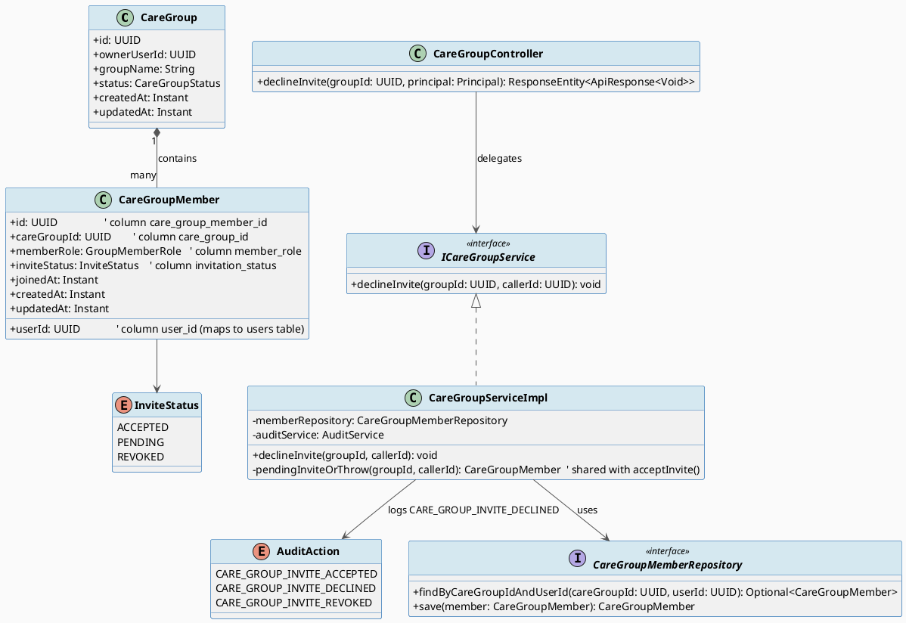
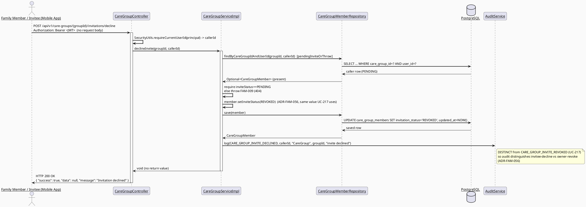
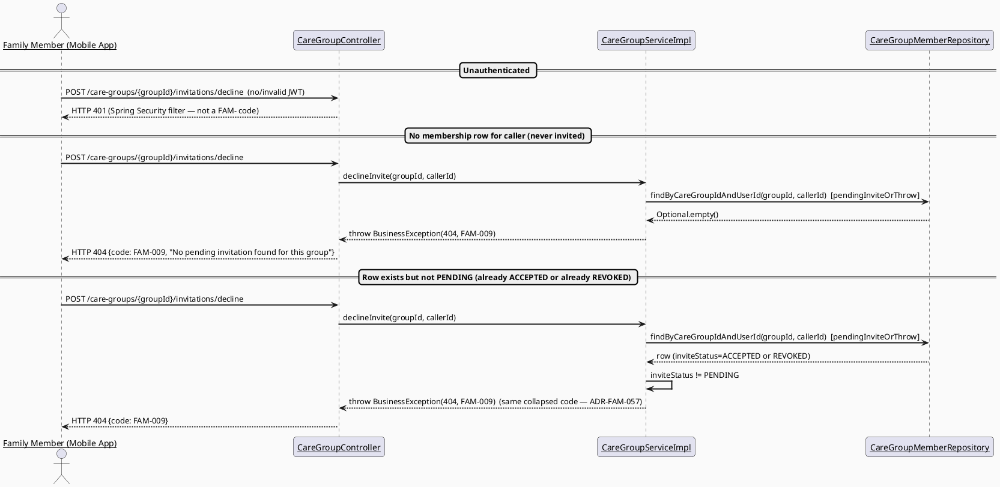
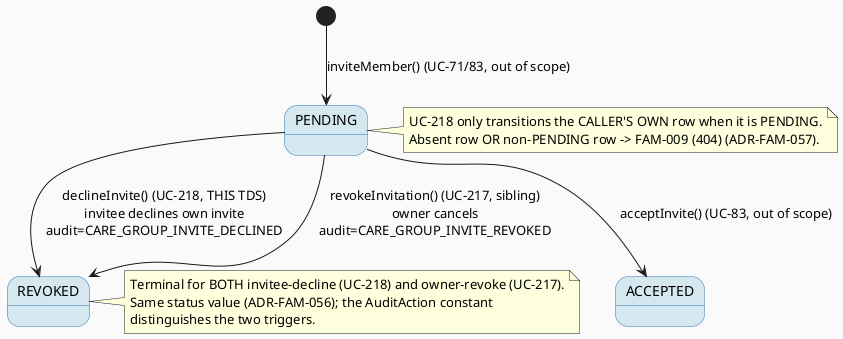

# ENGINEERING DOCUMENTATION STANDARD (EDS) v2.0
# Technical Design Specification — UC-218 Reject Care Group Invitation

| Field | Value |
|-------|-------|
| **Document ID** | `CB-FAM-IMP-218` |
| **Version** | `1.0` |
| **Date** | `2026-07-03` |
| **Status** | `Draft` |
| **Document Owner** | `TV2-Bách` |
| **Author** | `AI Agent (Technical Architect + Test Designer role)` |
| **Reviewed by** | `[ ] Pending` |
| **DPO Sign-off** | `[ ] Pending` *(module touches family membership / PII — see §1)* |
| **Approved by** | `[ ] Pending` |
| **Last Review** | `2026-07-03` |
| **Based on EDS** | `v2.0` |

> **⚠️ Documentation-of-existing-implementation notice.** UC-218 is **already implemented and
> shipped** in `CareGroupServiceImpl.declineInvite()` + `CareGroupController` (endpoint
> `POST /api/v1/care-groups/{groupId}/invitations/decline`). This TDS **formalizes and documents
> the REAL existing contract** — it does not design a greenfield feature. Every API, error code,
> signature, and side-effect below was read from the live source, not invented. No production code
> is created by this document.

---

## CHANGELOG

> **Policy 4.4 — Immutable History:** Never delete prior entries. All changes are appended below.

| Ngày | Người thực hiện | Nội dung thay đổi |
|------|-----------------|-------------------|
| 2026-07-03 | AI Agent — Technical Architect | Initial draft — TDS formalizing the already-implemented UC-218 Reject/Decline Care Group Invitation |

---

## MỤC LỤC

1. [Tổng quan Module](#1-tổng-quan-module)
2. [Ma trận Truy vết (Traceability Matrix)](#2-ma-trận-truy-vết-traceability-matrix)
3. [Architecture Decision Records (ADR)](#3-architecture-decision-records-adr)
4. [Non-Functional Requirements & SLA](#4-non-functional-requirements--sla)
5. [Static Modeling (Mô hình Tĩnh)](#5-static-modeling-mô-hình-tĩnh)
6. [Dynamic Modeling (Mô hình Động)](#6-dynamic-modeling-mô-hình-động)
7. [Domain Event Catalog](#7-domain-event-catalog)
8. [Interface Specification (Đặc tả Giao diện)](#8-interface-specification-đặc-tả-giao-diện)
9. [API Specification](#9-api-specification)
10. [Bảng mã lỗi (Error Codes)](#10-bảng-mã-lỗi-error-codes)
11. [Quy trình Triển khai (Step-by-Step)](#11-quy-trình-triển-khai-step-by-step)
12. [Rollback & Incident Runbook](#12-rollback--incident-runbook)
13. [Kịch bản Kiểm thử Chi tiết](#13-kịch-bản-kiểm-thử-chi-tiết)
14. [Phương pháp Xác minh](#14-phương-pháp-xác-minh)
15. [Mẫu thử thực tế (API Verification Samples)](#15-mẫu-thử-thực-tế-api-verification-samples)
16. [Bảng tổng hợp phân quyền (Authorization Matrix)](#16-bảng-tổng-hợp-phân-quyền-authorization-matrix)
17. [AI Prompt Constraints (CASE 2.0)](#17-ai-prompt-constraints-case-20)

---

## 1. Tổng quan Module

UC-218 "Reject Care Group Invitation" lets a **Family Member — the invitee themselves** — decline
a care group invitation that was sent to them, **before they accept it**. The action targets the
**caller's OWN** `care_group_members` row (identified purely from the JWT `callerId`, never from a
path/body parameter) whose `invitation_status` is `PENDING`, and transitions that row's status to
`REVOKED`. This is a single-call, server-side state transition; no schema change, no new enum
value, and — because the feature is already implemented — **no new production code** is required.

**This use case is already implemented.** In the live codebase the method is code-commented as
"UC83", but its actual behavior — *the invitee declining their own pending invite* — is exactly
SRS **UC-218 Reject Care Group Invitation**. UC-83 (Accept) and UC-218 (Reject/Decline) are twin
actions on the same invitation; the existing comment attribution is simply incomplete and should
reference both (see §11 housekeeping note). This TDS documents the behavior under its correct
UC-218 identity.

**Scope boundary (vs sibling UC-217).** UC-218 is the **invitee's self-service decline**
(`declineInvite`, actor = the invited Family Member, target = caller's own row, audit =
`CARE_GROUP_INVITE_DECLINED`). It is **distinct** from **UC-217 Revoke Family Invitation**
(`revokeInvitation`, actor = group OWNER/Mother, target = *another* user's row, audit =
`CARE_GROUP_INVITE_REVOKED`). Both transitions land on the same terminal `REVOKED` status value;
the two triggers are distinguished **only** by their `AuditAction` constant. This document does not
cover accepting an invite (UC-83), owner-side revoke (UC-217), or hard-deleting membership rows.

| Field | Value |
|-------|-------|
| **Module Name** | `Family Sync — Reject Care Group Invitation` |
| **Bounded Context** | `family` (package `com.carebridge.backend.family`) |
| **UC ID** | `UC-218` |
| **SRS Reference** | `§3.3.17.3 Reject Care Group Invitation` (`02_Requirements/SRS/3_Functional_Specification.md`) |
| **Implementation Status** | `Already implemented` — `CareGroupServiceImpl.declineInvite()` (lines ~227-234), `pendingInviteOrThrow()` (lines ~236-245), `CareGroupController.declineInvite()` (lines ~95-103) |
| **Primary Actor** | `Family Member (the invitee — acts on own row)` |
| **Secondary Actors** | `Firebase Cloud Messaging` (per SRS; no push is emitted by the current code — see §7 OPEN-1) |
| **Platform** | `Mobile App` (screen CB-177 Reject Invitation Confirmation) |
| **Priority / Frequency** | `Medium` / `Regular` (per SRS) |
| **Data Classification** | `PII` (care-group family membership) |
| **Compliance Scope** | `BR-RBAC, BR-PRIVACY, PDPA` (Vietnam) — no GDPR/CCPA scope asserted (VN-market product) |
| **Upstream Dependencies** | `CareGroupMemberRepository` (reused as-is), `AuditService` |
| **Downstream Consumers** | Audit log; UC-216 View Care Group Members (a `REVOKED` row is filtered out of the member list — existing behavior) |

**Mô tả:** Family Member mở màn hình xác nhận từ chối (CB-177), thấy nội dung "Từ chối lời mời?"
với tên người mời, nhấn "Xác nhận từ chối". Hệ thống chuyển `invitation_status` của **chính hàng
thành viên của người dùng** sang `REVOKED` và ghi audit `CARE_GROUP_INVITE_DECLINED`. Chỉ lời mời
còn `PENDING` của chính người gọi mới được từ chối; không cấp bất kỳ quyền truy cập dữ liệu nào
(hàng không bao giờ đạt trạng thái `ACCEPTED`).

---

## 2. Ma trận Truy vết (Traceability Matrix)

| Requirement ID | Loại (BR/ADR/US) | Mô tả yêu cầu | Thành phần Code (REAL) | Compliance Target | ADR liên quan |
|----------------|------------------|---------------|------------------------|-------------------|---------------|
| SRS-UC218-PRE-1 | Precondition | System/services available | `CareGroupServiceImpl.declineInvite()` (fails fast via repository) | — | — |
| SRS-UC218-PRE-2 | Precondition | Actor on Reject Invitation screen (mobile) | `CB-177` confirmation dialog | — | — |
| SRS-UC218-PRE-3 | Precondition | Actor authenticated (holds a pending invite) | `@PreAuthorize("isAuthenticated()")` on controller | BR-RBAC | ADR-FAM-055 |
| SRS-UC218-PRE-4 | Precondition | Caller's own invitation exists and is `PENDING` | `pendingInviteOrThrow(groupId, callerId)` | — | ADR-FAM-055 |
| SRS-UC218-POST-1 | Postcondition | Clear result shown to invitee | `ApiResponse<Void>` (200, message "Invitation declined") | — | — |
| SRS-UC218-POST-2 | Postcondition | Caller's invitation status updated | Caller row `invitation_status → REVOKED` | — | ADR-FAM-056 |
| SRS-UC218-POST-3 | Postcondition | Sensitive action recorded for audit | `AuditService.log(CARE_GROUP_INVITE_DECLINED, ...)` | PDPA audit trail | ADR-FAM-056 |
| SRS-UC218-DESC | Description | "does not create data access permission" | `declineInvite()` only sets `REVOKED`; row never reaches `ACCEPTED`; `permission_json` never written (entity does not map it) | BR-PRIVACY | ADR-FAM-056 |
| SRS-UC218-NF | Normal Flow | Confirm reject → apply rule → show result | `declineInvite()` service method + `ApiResponse<Void>` | — | ADR-FAM-055/056 |
| SRS-UC218-AF1 | Alt Flow | Cancel-safe (invitee taps "Quay lại") | Mobile confirm dialog — no server call, no side effect | — | — |
| SRS-UC218-E1 | Exception | Access denied (unauthenticated) | `401` from security filter (not a `FAM-` code) | BR-RBAC | ADR-FAM-055 |
| SRS-UC218-E2 | Exception | No pending invite for caller (absent row OR not `PENDING`) | `FAM-009` (404) via `pendingInviteOrThrow` | — | ADR-FAM-057 |
| BR-RBAC | Business Rule | Role/permission scope only — caller acts only on own row | Caller identity from JWT (`callerId`); no cross-user targeting possible | BR-RBAC | ADR-FAM-055 |
| BR-PRIVACY | Business Rule | Decline grants no data access; response leaks no other members' data | `ApiResponse<Void>` (empty payload) | PDPA | ADR-FAM-056 |
| OPEN-1 | Open Item | Whether FCM push is sent on decline (SRS lists FCM secondary actor) | Not emitted by current code — see §7 | — | — |
| OPEN-2 | Open Item | Inviter display name needed by CB-177 dialog is not returned by any current endpoint | `PendingInvitationDto` has no inviter-name field — see §9.3 | — | — |
| OPEN-3 | Open Item | Numeric SLA targets (latency/availability) | Not sourced — §4 placeholders | — | — |

---

## 3. Architecture Decision Records (ADR)

> The ADRs below document decisions **already embodied in the shipped code**. They are recorded
> here for auditor/DPO traceability, not proposed anew. ADR identifiers use the `ADR-FAM-055..057`
> numbers (distinct from sibling UC-217's `ADR-FAM-050..052`). **No new error CODE is allocated by
> UC-218** — the `FAM-055..057` numeric range remains available as error codes for genuinely-new
> needs elsewhere in the batch; here 055-057 are used only as ADR identifiers.

### ADR-FAM-055 — Self-service decline authorization (caller acts on own row, `isAuthenticated()` only)

| Field | Value |
|-------|-------|
| **Status** | `Accepted` (already implemented) |
| **Deciders** | `Implemented by dev team` — documented by AI Agent |
| **Date** | `2026-07-03` (documentation date; code predates it) |
| **Supersedes** | — |

#### Bối cảnh (Context)
Declining an invitation is a **self-action**: only the invited person may decline their own
invite. Unlike owner-side revoke (UC-217), there is no "target another user" dimension, so no
owner check and no path/body target parameter are needed. The invitee is identified solely from
the authenticated JWT.

#### Các phương án đã xem xét (Options Considered)

| Phương án | Mô tả | Ưu điểm | Nhược điểm |
|-----------|-------|----------|------------|
| A | Endpoint takes a `targetUserId` and lets a privileged role decline on someone's behalf | Flexible | Wrong actor model; enables IDOR; contradicts "self-decline" semantics |
| B | `@PreAuthorize("isAuthenticated()")`; caller id from JWT; service loads the **caller's own** row via `findByCareGroupIdAndUserId(groupId, callerId)` | No cross-user targeting is even expressible; minimal auth surface; matches the twin `acceptInvite()` | Co-members cannot decline on another's behalf (correct — that is not this UC) |

#### Quyết định (Decision)
**Phương án B (as shipped).** The controller uses `@PreAuthorize("isAuthenticated()")`; the service
`declineInvite(UUID groupId, UUID callerId)` derives the row **only** from `callerId` (the JWT
subject) via `pendingInviteOrThrow(groupId, callerId)`. Because the target row is keyed on
`callerId`, a caller can **only** decline their own invite — IDOR is structurally impossible.

#### Hệ quả (Consequences)
**Tích cực:** Structurally IDOR-safe; symmetric with `acceptInvite()`; no role gate needed.
**Tiêu cực / Trade-offs:** No delegated/on-behalf decline (out of scope, correct).
**Compliance Impact:** Favorable for BR-RBAC/BR-PRIVACY — a user can act only on their own membership.

---

### ADR-FAM-056 — Reuse `REVOKED` terminal value + distinct `CARE_GROUP_INVITE_DECLINED` audit action; grant no permission

| Field | Value |
|-------|-------|
| **Status** | `Accepted` (already implemented; confirmed by family-sync batch decision) |
| **Deciders** | `User (batch decision)` + dev team — documented by AI Agent |
| **Date** | `2026-07-03` |

#### Bối cảnh (Context)
The real `InviteStatus` enum (`family/entity/InviteStatus.java`) has exactly three values:
`ACCEPTED, PENDING, REVOKED` — no `REJECTED`, no `EXPIRED`. A decline needs a terminal state. The
sibling owner-revoke (UC-217) also lands on `REVOKED`; the two must remain distinguishable in the
audit trail.

#### Các phương án đã xem xét (Options Considered)

| Phương án | Mô tả | Ưu điểm | Nhược điểm |
|-----------|-------|----------|------------|
| A | Add a new `REJECTED` enum value for decline | Distinguishes decline at status level | Enum + schema/CHECK drift; UC-216 filter would need updating; violates batch "no new enum values, no migration" |
| B | Set `invitation_status = REVOKED` (same value UC-217 uses) and differentiate via the distinct audit action `CARE_GROUP_INVITE_DECLINED` | No enum/migration change; UC-216 filter already excludes `REVOKED`; audit still separates decline vs owner-revoke | Row alone cannot say "who declined vs who revoked" — audit log is the source of truth |

#### Quyết định (Decision)
**Phương án B (as shipped).** `declineInvite()` sets the caller's row to `InviteStatus.REVOKED` and
logs `AuditAction.CARE_GROUP_INVITE_DECLINED` (an **already-existing** enum constant, distinct from
UC-217's `CARE_GROUP_INVITE_REVOKED`). **This confirms the existing `CARE_GROUP_INVITE_DECLINED`
constant is correct as-is — no change needed.**

**"Does not create data access permission" (verified invariant).** `declineInvite()` performs only
`member.setInviteStatus(REVOKED)` + `save()`. The row never transitions to `ACCEPTED`, and the
`care_group_members.permission_json` column is **not even mapped** by `CareGroupMember.java` (no
field exists), so it is never written — it remains `NULL`. Downstream access gates
(`listMyGroups`, `listMembers`) require `InviteStatus.ACCEPTED`, so a `REVOKED` invitee obtains no
care-group data access. The SRS wording "does not create data access permission" is therefore
trivially and verifiably satisfied.

#### Hệ quả (Consequences)
**Tích cực:** Zero schema/enum change; audit distinguishes decline vs owner-revoke; provably no permission grant.
**Tiêu cực / Trade-offs:** Row-level reason requires reading the audit log (acceptable).
**Compliance Impact:** Append-only status transition (no row delete) preserves auditability (PDPA).

---

### ADR-FAM-057 — Collapsed `FAM-009 / 404` semantics for all "no pending invite" cases

| Field | Value |
|-------|-------|
| **Status** | `Accepted` (already implemented) |
| **Deciders** | `Implemented by dev team` — documented by AI Agent |
| **Date** | `2026-07-03` |

#### Bối cảnh (Context)
`pendingInviteOrThrow(groupId, callerId)` treats **two** distinct situations identically:
(a) no membership row exists for the caller in the group, and (b) a row exists but its
`invitation_status != PENDING` (i.e. already `ACCEPTED` or already `REVOKED`). Both throw the same
`BusinessException(HttpStatus.NOT_FOUND, "FAM-009", "No pending invitation found for this group")`.

#### Quyết định (Decision)
**As shipped:** both cases map to **`FAM-009 / 404`** with the identical message. This is a
deliberate, privacy-preserving collapse — the response never reveals whether an invitation exists
in some other state, and never distinguishes "already accepted" from "already revoked" from
"never invited". UC-218 therefore introduces **no new error code**; it reuses the existing
`FAM-009`.

#### Hệ quả (Consequences)
**Tích cực:** Uniform, non-enumerating error surface (harder to probe membership state); zero new codes.
**Tiêu cực / Trade-offs:** A client cannot tell *why* the decline was rejected beyond "no pending invite" (acceptable for this UC).
**Compliance Impact:** Aligns with BR-PRIVACY minimum-necessary disclosure.

---

## 4. Non-Functional Requirements & SLA

> No source in SRS or existing docs specifies numeric SLAs for this feature. All targets below are
> **Open — placeholder defaults** (CareBridge platform defaults), not sourced commitments (OPEN-3).

### 4.1. Performance & Availability

| Category | Requirement | Target SLA | Measurement Method | Compliance Basis |
|----------|-------------|------------|---------------------|------------------|
| Latency | `POST /care-groups/{groupId}/invitations/decline` (p99) | `< 300ms` (Open — platform default) | k6 load test | — |
| Availability | Uptime (monthly) | `99.9%` (Open — platform default) | Uptime monitor | — |
| Throughput | Concurrent requests | Not benchmarked — Open (Regular frequency per SRS) | — | — |

### 4.2. Data Integrity & Retention

| Category | Requirement | Target | Verification Method | Compliance Basis |
|----------|-------------|--------|---------------------|------------------|
| Durability | Status transition committed atomically | RPO = 0 (transactional; class `@Transactional`) | Transaction log | — |
| Retention | Audit log retention | Platform default (Open — no feature-specific period in SRS) | DB backup policy | PDPA |
| Consistency | Only `PENDING → REVOKED`; append-only (no delete); `permission_json` untouched | 100% | Service guard + §14 SQL check | BR-PRIVACY |

### 4.3. Security

| Category | Requirement | Target | Verification Method | Compliance Basis |
|----------|-------------|--------|---------------------|------------------|
| Access control | Self-service only (caller's own row via JWT) | Least privilege; IDOR-impossible | Auth Matrix (§16), ADR-FAM-055 | BR-RBAC |
| Data minimization | Response is an empty payload (`ApiResponse<Void>`) | 0 PII fields in response | Response schema review | BR-PRIVACY |
| Encryption in transit | All endpoints | TLS 1.3+ | SSL scan | PDPA |

### 4.4. Scalability & Capacity Planning

Decline is a `Regular`-frequency, single-row `UPDATE` with no fan-out. Worst-case load is bounded
by pending invites per user (small). No caching or horizontal-scaling strategy is warranted.
**Open** — no load projection exists in current docs.

---

## 5. Static Modeling (Mô hình Tĩnh)

### 5.1. Class Diagram (PlantUML)

> **Schema fidelity note:** Field/column names below reflect the REAL entity `CareGroupMember.java`
> — `userId` → column `user_id`, `inviteStatus` → column `invitation_status`, mapped against the
> `users` table. The `account_id` / `invite_status` / `accounts` names that appear in some sibling
> TDS prose are **incorrect** and are NOT used here.



### 5.2. Data Structure (Flyway SQL Migration)

> **CareBridge rule:** `V1__init_schema.sql` is the schema baseline. Never modify an applied
> migration.

**No migration is required for UC-218.** The feature only performs an `UPDATE` of an existing
column (`care_group_members.invitation_status`) to an existing enum value (`REVOKED`). No new
column, table, index, enum value, or CHECK constraint is introduced (ADR-FAM-056).

```sql
-- Reference only (existing table from V1 — DO NOT recreate):
-- care_group_members(
--   care_group_member_id uuid        PK,
--   care_group_id        uuid        NOT NULL,
--   user_id              uuid        NOT NULL,     -- maps to users(id)
--   member_role          varchar(50),
--   invitation_status    varchar(20) NOT NULL DEFAULT 'PENDING',  -- ACCEPTED | PENDING | REVOKED
--   permission_json      jsonb,                    -- NOT mapped by entity; stays NULL on decline
--   joined_at            timestamptz,
--   created_at           timestamptz NOT NULL DEFAULT now(),
--   updated_at           timestamptz NOT NULL DEFAULT now()
-- )

-- The runtime effect of declineInvite() (illustrative — executed via JPA save(), not raw SQL):
UPDATE care_group_members
SET invitation_status = 'REVOKED',
    updated_at        = NOW()
WHERE care_group_id     = :groupId
  AND user_id           = :callerId       -- caller's OWN row (from JWT)
  AND invitation_status = 'PENDING';
-- permission_json is left untouched (NULL) — no data-access permission is created.
```

> **Quy tắc đặt tên:** All columns are `snake_case` in DDL. The JPA entity uses camelCase
> (`userId`, `inviteStatus`) mapped to `user_id` / `invitation_status` via `@Column` — verified
> against `CareGroupMember.java`.

---

## 6. Dynamic Modeling (Mô hình Động)

### 6.1. Sequence Diagram — Happy Path (PlantUML)



### 6.2. Sequence Diagram — Error Paths (PlantUML)



### 6.3. State Machine — `InviteStatus` (decline transition only)



**⚠️ Invariant bất biến:**
- No transition deletes a `CareGroupMember` row (append-only status change).
- UC-218 performs ONLY the `PENDING → REVOKED` transition on the **caller's own** row.
- `invitation_status` value set is unchanged: `{ACCEPTED, PENDING, REVOKED}` — no new value.
- `permission_json` is never written by decline (entity does not map it) — no data access created.

---

## 7. Domain Event Catalog

### 7.1. Events Published (Phát ra)

| Event Name | Trigger | Publisher | Subscriber(s) | Payload Schema | Async? |
|------------|---------|-----------|---------------|----------------|--------|
| _(none — no domain event object is published)_ | — | — | — | — | — |
| `AuditAction.CARE_GROUP_INVITE_DECLINED` (audit record, not an `ApplicationEvent`) | Successful `declineInvite()` | `CareGroupServiceImpl` → `AuditService.log(...)` | audit-log row `{action, userId=callerId, resourceType="CareGroup", resourceId=groupId, details="invite declined"}` | No (synchronous log call) |

> **Verified:** the real `declineInvite()` does **not** publish any `ApplicationEvent` / domain
> event object (unlike UC-217's proposed `CareGroupInvitationRevoked`). It only writes an audit
> record via `auditService.log(...)`. This TDS does not invent an event that the code does not emit.

**Note on notification (OPEN-1):** SRS lists **Firebase Cloud Messaging** as a secondary actor for
UC-218, but the current `declineInvite()` emits **no** push/FCM notification (e.g. informing the
inviter that the invite was declined). Whether such a notification is desired is **Open** — flag
for product sign-off. This TDS documents the code as-is (no push).

### 7.2. Events Consumed (Tiêu thụ)

| Event Name | Source | Handler | Action thực hiện |
|------------|--------|---------|------------------|
| _(none)_ | — | — | UC-218 does not consume any domain event. |

### 7.3. Payload Schema

Not applicable — no domain event object is published (see §7.1). The only persisted trace is the
audit-log row written through `AuditService.log(AuditAction, UUID, String, String, Object)`.

---

## 8. Interface Specification (Đặc tả Giao diện)

> All signatures below are the **REAL** shipped contracts (verified against source), not proposed.

### 8.1. Service Interface

```java
// ICareGroupService.java — Service Contract (EXISTING — shown for context)
// @version 1.0
public interface ICareGroupService {

    // --- existing sibling methods (unchanged, shown for context) ---
    // CareGroupMemberDto acceptInvite(UUID groupId, UUID callerId);   // UC-83 — twin action

    /**
     * UC-218 — The invitee declines their OWN pending care group invitation.
     * Loads the caller's own membership row (keyed on callerId from JWT), requires it to be
     * PENDING, sets invitation_status to REVOKED, and logs AuditAction.CARE_GROUP_INVITE_DECLINED.
     * Returns void (the controller wraps an empty ApiResponse<Void>).
     *
     * @param groupId   the care group whose invitation is being declined
     * @param callerId  the authenticated caller (the invitee) — from the JWT, NOT a path/body param
     * @throws com.carebridge.backend.common.exception.BusinessException (FAM-009/404)
     *         if the caller has no membership row in the group, OR the row is not in PENDING state
     */
    void declineInvite(UUID groupId, UUID callerId);
}
```

```java
// CareGroupServiceImpl.java — REAL implementation (verified; excerpt for reference only)
@Override
public void declineInvite(UUID groupId, UUID callerId) {
    CareGroupMember member = pendingInviteOrThrow(groupId, callerId);
    member.setInviteStatus(InviteStatus.REVOKED);
    memberRepository.save(member);

    auditService.log(AuditAction.CARE_GROUP_INVITE_DECLINED, callerId,
            "CareGroup", groupId.toString(), "invite declined");
}

// Shared guard (also used by acceptInvite()) — the single source of the FAM-009 semantics:
private CareGroupMember pendingInviteOrThrow(UUID groupId, UUID callerId) {
    CareGroupMember member = memberRepository.findByCareGroupIdAndUserId(groupId, callerId)
            .orElseThrow(() -> new BusinessException(HttpStatus.NOT_FOUND, "FAM-009",
                    "No pending invitation found for this group"));
    if (member.getInviteStatus() != InviteStatus.PENDING) {
        throw new BusinessException(HttpStatus.NOT_FOUND, "FAM-009",
                "No pending invitation found for this group");
    }
    return member;
}
```

### 8.2. Repository Interface

```java
// CareGroupMemberRepository.java — NO CHANGE NEEDED (reused as-is)
// @version 1.0
public interface CareGroupMemberRepository extends JpaRepository<CareGroupMember, UUID> {

    // Used by pendingInviteOrThrow to load the caller's OWN row:
    Optional<CareGroupMember> findByCareGroupIdAndUserId(UUID careGroupId, UUID userId);

    // (other existing methods unchanged: existsByCareGroupIdAndUserIdAndInviteStatus,
    //  findByCareGroupIdAndInviteStatusIn, countByCareGroupId, findByUserIdAndInviteStatus)
    // Note: save() from JpaRepository performs the PENDING -> REVOKED UPDATE.
}
```

> **Contract-existence note (anti AP-AI-005):** `findByCareGroupIdAndUserId` and `save` already
> exist on the real `CareGroupMemberRepository` (verified). UC-218 requires **no** new repository
> method, DTO, error code, enum value, or event — it is fully implemented already.

---

## 9. API Specification

### 9.1. Endpoints Table

| Method | Path | Auth Level | Required Roles | Rate Limit | Idempotent? |
|--------|------|------------|----------------|------------|-------------|
| `POST` | `/api/v1/care-groups/{groupId}/invitations/decline` | JWT Bearer | Any authenticated user (`isAuthenticated()`) holding a PENDING invite | Not specified — Open, propose platform default 60/min | Yes* |

*Idempotent in effect: a second call on an already-`REVOKED` row returns `FAM-009` (404), so the
first decline is the only state change; the operation is naturally at-most-once per pending invite.

**Endpoint-shape note (as shipped):** `POST .../invitations/decline` (no `targetUserId` in the
path, no request body) is consistent with the twin self-actions already in `CareGroupController`:
`POST /{groupId}/invitations/accept` and `POST /{groupId}/invitations/decline`. The invitee is
identified from the JWT, so a caller can only ever act on their own invite (contrast UC-217, which
carries `{targetUserId}` because it acts on another user's row).

### 9.2. Request / Response Schemas

#### `POST /api/v1/care-groups/{groupId}/invitations/decline`

**Request Body:** _(none — the invited caller is identified by the JWT; the group by the path)_

**Response — 200 OK (Happy Path):** — `ApiResponse<Void>`, `data` is `null`
```json
{
  "success": true,
  "data": null,
  "message": "Invitation declined",
  "timestamp": "2026-07-03T09:00:00.000Z"
}
```

**Response — 404 Not Found (No pending invite — absent row OR not PENDING):**
```json
{
  "error": {
    "code": "FAM-009",
    "message": "No pending invitation found for this group"
  }
}
```

**Response — 401 Unauthorized (missing/invalid JWT):** produced by the Spring Security filter chain
(not a `FAM-` business code).

### 9.3. Note — CB-177 confirmation dialog data (OPEN-2)

The CB-177 mockup renders "Bạn đang từ chối tham gia nhóm chăm sóc của **{inviter}**" (e.g.
"Bà Nguyễn Thị B"), i.e. it needs the **inviter's display name**. The `/decline` endpoint returns
an **empty** `ApiResponse<Void>` and therefore cannot drive that text. The pre-decline listing
endpoint `GET /api/v1/care-groups/invitations/me` returns `PendingInvitationDto{ groupId, groupName,
memberRole, invitedAt }` — which contains `groupName` but **no inviter name**. Consequently, no
current endpoint supplies the inviter display name shown in the dialog. **Open** — either the
dialog should be driven by `groupName` only, or a future enhancement must add an inviter-name field
to `PendingInvitationDto` (or a dedicated invite-detail endpoint). Not resolved by this TDS; the
decline contract itself is complete and correct.

---

## 10. Bảng mã lỗi (Error Codes)

> UC-218 introduces **NO new error code**. It reuses the existing `FAM-009` for all "no pending
> invite" cases (ADR-FAM-057). `401` is emitted by Spring Security, not by the family module.

| Code | HTTP Status | Message (EN) | Message (VI) | Trigger Condition |
|------|-------------|--------------|--------------|-------------------|
| `FAM-009` | 404 | No pending invitation found for this group | Không tìm thấy lời mời đang chờ cho nhóm này | Caller has no membership row in the group **OR** the row's `invitation_status != PENDING` (already `ACCEPTED` or already `REVOKED`) — both collapse to this code (ADR-FAM-057) |
| _(401)_ | 401 | Authentication required | Yêu cầu xác thực | Missing/invalid JWT — handled by Spring Security filter chain, not a `FAM-` code |

> **Reserved-but-unused:** the batch reserved `FAM-055..057` as error codes for genuinely-new
> needs. UC-218 needs none of them (it reuses `FAM-009`), so that numeric range remains free for
> other features. (055-057 appear in this doc only as **ADR identifiers**, which is a separate
> namespace.)

---

## 11. Quy trình Triển khai (Step-by-Step)

> **Already implemented.** This section records the *as-built* reality rather than prescribing new
> work. No code is written by this document.

### 11.1. Prerequisites

- [x] `InviteStatus` enum already contains `REVOKED` (verified — no change)
- [x] `AuditAction.CARE_GROUP_INVITE_DECLINED` already exists (verified — no change, and confirmed distinct from `CARE_GROUP_INVITE_REVOKED`)
- [x] Existing tables `care_groups`, `care_group_members`, `users` present (baseline `V1`)
- [x] Endpoint + service + shared guard already shipped (`CareGroupController` / `CareGroupServiceImpl`)
- [ ] No DPO migration sign-off needed (no schema change) — DPO note only for audit-content review

### 11.2. Pre-Migration Checklist

**Not applicable — UC-218 introduces NO Flyway migration** (ADR-FAM-056: reuse `REVOKED`, no new
column/enum value).

### 11.3. Implementation Steps (as-built reference)

The following already exist in the codebase (no action required — listed for traceability):

- **Controller** — `CareGroupController.declineInvite()` (lines ~95-103):
  ```java
  // Currently code-commented "// UC83: Decline a pending invitation" — see housekeeping note below
  @PostMapping("/{groupId}/invitations/decline")
  @PreAuthorize("isAuthenticated()")
  public ResponseEntity<ApiResponse<Void>> declineInvite(
          @PathVariable UUID groupId, Principal principal) {
      var callerId = SecurityUtils.requireCurrentUserId(principal);
      careGroupService.declineInvite(groupId, callerId);
      return ResponseEntity.ok(ApiResponse.success(null, "Invitation declined"));
  }
  ```
- **Service** — `CareGroupServiceImpl.declineInvite()` + `pendingInviteOrThrow()` (see §8.1).
- **Audit** — `AuditAction.CARE_GROUP_INVITE_DECLINED` (already in the enum).

> **📌 Housekeeping suggestion (NOT performed by this TDS):** the `declineInvite()` method and its
> controller endpoint are code-commented "UC83". Their behavior is actually **UC-218** (invitee
> reject/decline). Recommend updating the comments to reference **both UC-83 (accept twin) and
> UC-218 (decline)** for clarity. This is a comment-only change; flag for a follow-up housekeeping
> commit — it does not alter behavior and is out of scope for this documentation task.

### 11.4. Deployment Checklist (verification of existing deploy)

- [x] No Flyway migration to run (schema unchanged)
- [ ] Health check endpoint returns 200
- [ ] Decline of a PENDING invite returns 200 + `invitation_status='REVOKED'` in DB
- [ ] Audit log emits `CARE_GROUP_INVITE_DECLINED` (distinct from `_REVOKED`)
- [ ] Decline with no pending invite returns 404 `FAM-009`
- [ ] `permission_json` remains `NULL` for the declined row

---

## 12. Rollback & Incident Runbook

### 12.1. Điều kiện kích hoạt Rollback

| Điều kiện | Ngưỡng | Người quyết định |
|-----------|--------|------------------|
| Error rate tăng đột biến | > 5% trong 5 phút | On-call Engineer |
| Latency p99 vượt ngưỡng | > 2x baseline | On-call Engineer |
| Wrong row declined / data inconsistency | Bất kỳ case nào | Tech Lead + DPO |
| Audit log ngừng ghi `CARE_GROUP_INVITE_DECLINED` | > 1 phút | On-call Engineer |

### 12.2. Rollback Procedure

UC-218 has **no DB migration** — since it is already implemented, "rollback" means **reverting the
commit(s)** that introduced the decline endpoint/service (code-only). No data backfill needed. A
membership row erroneously set to `REVOKED` can be manually corrected back to `PENDING`
(dev/staging only) since the transition is a simple status flip:

```bash
# Bước 1: Revert the implementing commit(s) (code-only — identify via `git log` for the decline endpoint)
git revert <commit-that-added-declineInvite>

# Bước 2: Re-deploy previous version
kubectl rollout undo deployment/carebridge-api

# Bước 3: Verify rollback
kubectl rollout status deployment/carebridge-api
curl -X GET https://[host]/api/v1/health

# Bước 4 (dev/staging ONLY — never run blindly on prod): repair a wrongly-declined invite
psql -h $DB_HOST -U $DB_USER -d $DB_NAME \
  -c "UPDATE care_group_members SET invitation_status='PENDING', updated_at=NOW() \
      WHERE care_group_id='<groupId>' AND user_id='<callerId>' AND invitation_status='REVOKED';"
```

> Note: no additive enum/schema object is introduced by UC-218, so a code rollback leaves no
> orphaned DB artifact.

### 12.3. Notification Protocol

| Thời điểm | Người nhận | Kênh | Template |
|-----------|------------|------|----------|
| Ngay khi phát hiện | On-call team | Slack `#incident` | "🚨 UC-218 decline incident: [mô tả]" |
| Nếu sai dữ liệu thành viên | Tech Lead + DPO | Email | Bắt buộc — PDPA |

### 12.4. Post-Incident Review (PIR)

> Bắt buộc hoàn thành trong vòng 48 giờ sau khi resolve incident.

- **Timeline:** Diễn biến chi tiết theo thời gian
- **Root Cause:** 5 Whys
- **Impact:** Số invites bị decline sai; có ảnh hưởng thành viên đã ACCEPTED không?
- **Prevention:** Action items tránh tái diễn

---

## 13. Kịch bản Kiểm thử Chi tiết

> **Policy (EDS v2.0):** Mọi test scenario dùng dữ liệu `SYNTHETIC`. Không dùng Production PII.
> Detailed test cases are in the companion Test-Spec `CB-FAM-TDD-218`.

### 13.1. Unit Tests

#### TC-UNIT-001 — Invitee declines own PENDING invite → REVOKED

```gherkin
Feature: Reject Care Group Invitation
  Background:
    Given test data classification: SYNTHETIC
    And care group CG-001 exists
    And INVITEE-001 has row {userId=INVITEE-001, invitation_status=PENDING} in CG-001

  Scenario: Invitee declines a pending invite → REVOKED
    When declineInvite(CG-001, INVITEE-001) is called
    Then INVITEE-001 row invitation_status becomes REVOKED
    And audit log contains CARE_GROUP_INVITE_DECLINED (NOT CARE_GROUP_INVITE_REVOKED)
    And permission_json for the row remains NULL (no data access granted)
```

**Hàm được test:** `CareGroupServiceImpl.declineInvite()`
**Invariant:** caller's row updated (not deleted); status set to `REVOKED`; no permission granted.

#### TC-UNIT-002 — No pending invite (absent row) → FAM-009 (404)

```gherkin
  Scenario: Caller has no membership row in the group → 404
    When declineInvite(CG-001, STRANGER-999) is called
    Then throws BusinessException with code FAM-009 (404)
```

#### TC-UNIT-003 — Already ACCEPTED → FAM-009 (404)

```gherkin
  Scenario: Caller already accepted the invite → 404
    Given INVITEE-002 has row {invitation_status=ACCEPTED} in CG-001
    When declineInvite(CG-001, INVITEE-002) is called
    Then throws BusinessException with code FAM-009 (404)
    And INVITEE-002 row remains ACCEPTED (no side effect)
```

#### TC-UNIT-004 — Already REVOKED (double-decline) → FAM-009 (404)

```gherkin
  Scenario: Caller already declined/was revoked → 404 (idempotency guard)
    Given INVITEE-003 has row {invitation_status=REVOKED} in CG-001
    When declineInvite(CG-001, INVITEE-003) is called
    Then throws BusinessException with code FAM-009 (404)
```

### 13.2. Integration Tests

#### TC-INT-001 — Persist REVOKED + REVOKED disappears from UC-216 member list

```gherkin
  Scenario: Service + Repository persist REVOKED and UC-216 filter excludes it
    Given test data classification: SYNTHETIC
    And database has CG-001 with INVITEE-001 (PENDING)
    When declineInvite(CG-001, INVITEE-001) is called
    Then DB row for INVITEE-001 has invitation_status='REVOKED'
    And permission_json remains NULL
    And listMembers(CG-001, OWNER) does NOT contain INVITEE-001
```

### 13.3. E2E / Security Tests

#### TC-E2E-001 — Decline via API → 200; missing JWT → 401

```gherkin
  Scenario: Authenticated invitee declines → 200
    Given INVITEE-001 has a PENDING invite in CG-001 and a valid JWT
    When POST /api/v1/care-groups/CG-001/invitations/decline is called with the JWT
    Then response status is 200 and message == "Invitation declined"

  Scenario: Unauthenticated request → 401
    When POST /api/v1/care-groups/CG-001/invitations/decline is called without JWT
    Then response status is 401
```

---

## 14. Phương pháp Xác minh

### 14.1. Database Inspection

```sql
-- Verify the declined invite transitioned to REVOKED and granted NO permission
SELECT care_group_member_id, invitation_status, permission_json, updated_at
FROM care_group_members
WHERE care_group_id = '<groupId>' AND user_id = '<callerId>';
-- Expected: invitation_status = 'REVOKED'  AND  permission_json IS NULL

-- Verify append-only (row still exists — not deleted)
SELECT count(*) FROM care_group_members
WHERE care_group_id = '<groupId>' AND user_id = '<callerId>';
-- Expected: 1
```

### 14.2. Log / Audit Verification

```bash
# Audit log emits the DECLINED action (not REVOKED)
kubectl logs -l app=carebridge-api | grep 'CARE_GROUP_INVITE_DECLINED' | head -5

# Confirm no email/phone leaked in the decline path (empty response payload)
kubectl logs -l app=carebridge-api | grep -i "password\|email\|phone" 
# Expected: no PII from the decline flow
```

### 14.3. Tool-based Verification

```bash
# Verify JWT subject == caller acting on own row
echo "[JWT_TOKEN]" | cut -d'.' -f2 | base64 -d | jq .sub

# Verify TLS version
openssl s_client -connect [host]:443 -tls1_3 2>&1 | grep "Protocol"
# Expected: Protocol  : TLSv1.3
```

---

## 15. Mẫu thử thực tế (API Verification Samples)

### 15.1. Happy Path

```bash
# [POST] Decline own pending invite (no request body)
curl -X POST https://[host]/api/v1/care-groups/11111111-1111-1111-1111-111111111111/invitations/decline \
  -H "Authorization: Bearer [INVITEE_JWT]" \
  -H "X-Correlation-Id: $(uuidgen)"
```

**Expected Response (200):**
```json
{
  "success": true,
  "data": null,
  "message": "Invitation declined",
  "timestamp": "2026-07-03T09:00:00.000Z"
}
```

### 15.2. Error Paths

```bash
# [POST] No pending invite (never invited, or already accepted/revoked) → 404 FAM-009
curl -X POST https://[host]/api/v1/care-groups/11111111-1111-1111-1111-111111111111/invitations/decline \
  -H "Authorization: Bearer [JWT_WITHOUT_PENDING_INVITE]"
```

**Expected Response (404):**
```json
{ "error": { "code": "FAM-009", "message": "No pending invitation found for this group" } }
```

```bash
# [POST] Missing JWT → 401
curl -X POST https://[host]/api/v1/care-groups/11111111-1111-1111-1111-111111111111/invitations/decline
```

**Expected Response (401):** Spring Security authentication-required response (no `FAM-` code).

---

## 16. Bảng tổng hợp phân quyền (Authorization Matrix)

> Endpoint: `POST /api/v1/care-groups/{groupId}/invitations/decline`. Auth = `isAuthenticated()`.
> The caller can act ONLY on their own membership row (identity from JWT) — there is no way to
> target another user, so no `Own` vs `All` distinction is even expressible.

| Endpoint | `GUEST` (no JWT) | Authenticated user WITH a PENDING invite in the group | Authenticated user WITHOUT a pending invite (or already accepted/revoked) |
|----------|------------------|-------------------------------------------------------|--------------------------------------------------------------------------|
| `POST /{groupId}/invitations/decline` | ❌ 401 | ✅ 200 (declines own invite → `REVOKED`) | ❌ 404 `FAM-009` |

**Chú thích:**
- ✅ = Được phép (acts on own row only)
- ❌ = Bị từ chối
- Không có vector nào cho phép decline lời mời của người khác (IDOR structurally impossible — ADR-FAM-055).

---

## 17. AI Prompt Constraints (CASE 2.0)

> ⭐⭐ These constraints describe the **already-implemented** contract. For UC-218 the primary use
> of this block is to constrain any *future regeneration/refactor* so it does not drift from the
> shipped behavior.

### 17.1 Constraint Summary Table

| # | Constraint | Source (ADR/BR) | Last Verified |
|---|-----------|-----------------|---------------|
| C1 | Caller identity MUST come from the JWT (`callerId`); the endpoint MUST NOT accept a target user id — decline is a self-action only | `ADR-FAM-055` | `2026-07-03` |
| C2 | Decline MUST set `invitation_status = REVOKED` (existing value); MUST NOT add a new enum value (`REJECTED`) or a migration | `ADR-FAM-056`, `BR (batch decision)` | `2026-07-03` |
| C3 | MUST log `AuditAction.CARE_GROUP_INVITE_DECLINED` (distinct from `CARE_GROUP_INVITE_REVOKED`) | `ADR-FAM-056` | `2026-07-03` |
| C4 | Both "no row" and "row not PENDING" MUST throw `FAM-009 / 404` with the same message (no new error code) | `ADR-FAM-057` | `2026-07-03` |
| C5 | Decline MUST NOT write `permission_json` / grant any data access; the row must never reach `ACCEPTED` | `BR-PRIVACY`, `ADR-FAM-056` | `2026-07-03` |

> ⚠️ **`Last Verified` > 2 sprints → re-verify against source before regenerating.**

### 17.2 Constraint Injection Block (Copy-Paste vào AI Prompt)

```
[CONSTRAINT BLOCK — Module: Family Sync — Reject Care Group Invitation (UC-218)]
Per TDS CB-FAM-IMP-218 and ADR-FAM-055/056/057:

1. Identify the invitee ONLY from the JWT callerId; do NOT add a targetUserId path/body param (self-action).
2. Set invitation_status = REVOKED (existing enum value); NEVER add REJECTED or a migration.
3. Log AuditAction.CARE_GROUP_INVITE_DECLINED (distinct from CARE_GROUP_INVITE_REVOKED).
4. Throw FAM-009 / 404 for BOTH "no row" and "row not PENDING"; do NOT invent a new error code.
5. Never write permission_json / grant data access on decline; the row must never become ACCEPTED.

[CONTEXT BLOCK]
- Bounded Context: family
- Data Classification: PII
- Compliance: BR-RBAC, BR-PRIVACY, PDPA
- Existing interfaces: §8 (ICareGroupService.declineInvite + CareGroupMemberRepository)
- Error codes: §10 (FAM-009 only)
- Auth matrix: §16

[TASK BLOCK]
Preserve the shipped declineInvite() behavior exactly; any refactor must satisfy §8 + §13.
```

### 17.3 Constraint Quality Checklist

- [x] Mỗi constraint traceable về ADR/BR cụ thể
- [x] Không có constraint generic
- [x] Mỗi constraint có `Last Verified` date ≤ 2 sprints
- [x] Constraint block có ≥ 3 constraints cụ thể
- [x] Constraint block reference §8 Interface
- [x] Constraint block reference §16 Auth Matrix

### 17.4 Anti-Pattern Detection (cho AI-Generated Code từ Block này)

| AP-ID | Anti-Pattern | Dấu hiệu | Hành động |
|-------|-------------|-----------|----------|
| AP-AI-001 | Unconstrained Gen | Code không match C1-C5 | Reject — inject lại constraints |
| AP-AI-003 | Implicit Decision | Code adds a `REJECTED` enum / migration not in §3 | Reject — violates ADR-FAM-056 |
| AP-AI-005 | Hallucinated Contract | Code imports a target-user param, a new error code, or `account_id`/`invite_status` naming | Reject — verify against §8 real contract |

---

## PHỤ LỤC

### A. Glossary (Thuật ngữ)

| Thuật ngữ | Định nghĩa |
|-----------|------------|
| Decline / Reject | The invitee cancelling their own pending care-group invitation (UC-218) |
| Revoke | The group owner cancelling another user's pending invitation (UC-217 — different actor) |
| REVOKED | Terminal `invitation_status` shared by both decline and owner-revoke; the audit action distinguishes them |
| `pendingInviteOrThrow` | Shared service guard: loads caller's own row, requires PENDING, else `FAM-009` |
| PII | Personally Identifiable Information |
| Append-only | Status transitions never DELETE the row — only flip `invitation_status` |
| PDPA | Personal Data Protection Act (Vietnam) |

### B. Tài liệu tham chiếu

| Document | Link / Path |
|----------|-------------|
| SRS §3.3.17.3 Reject Care Group Invitation | `02_Requirements/SRS/3_Functional_Specification.md` |
| Real controller | `05_Development/CareBridgeAPI/.../family/controller/CareGroupController.java` |
| Real service | `05_Development/CareBridgeAPI/.../family/service/impl/CareGroupServiceImpl.java` |
| Real entity / enum | `.../family/entity/CareGroupMember.java`, `.../family/entity/InviteStatus.java` |
| Audit action enum | `.../audit/entity/AuditAction.java` |
| Schema baseline | `05_Development/CareBridgeAPI/src/main/resources/db/migration/V1__init_schema.sql` |
| Sibling TDS (owner revoke) | `04_Implement/UC217_RevokeFamilyInvitation/UC217_RevokeFamilyInvitation_TDS.md` |
| UI mockup (CB-177) | `03_Design/UI_UX/MobileAppScreen/CB-177 Reject Invitation Confirmation (UC-218)/code.html` |

---

*EDS v2.1 — UC-218 documents an already-implemented feature; no production code is created by this document.*
