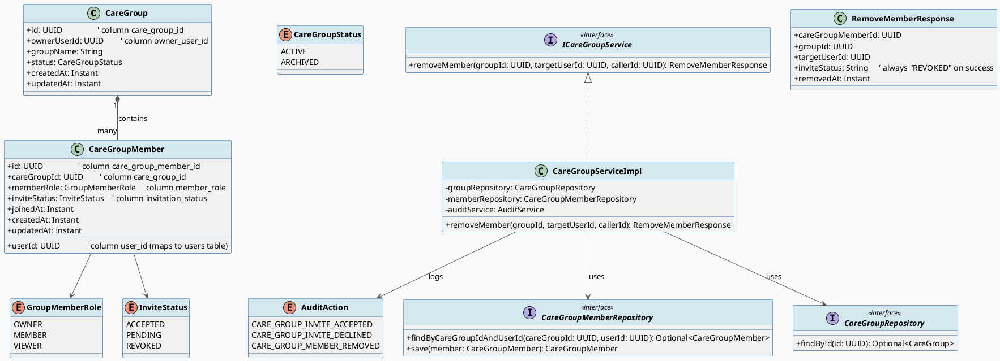
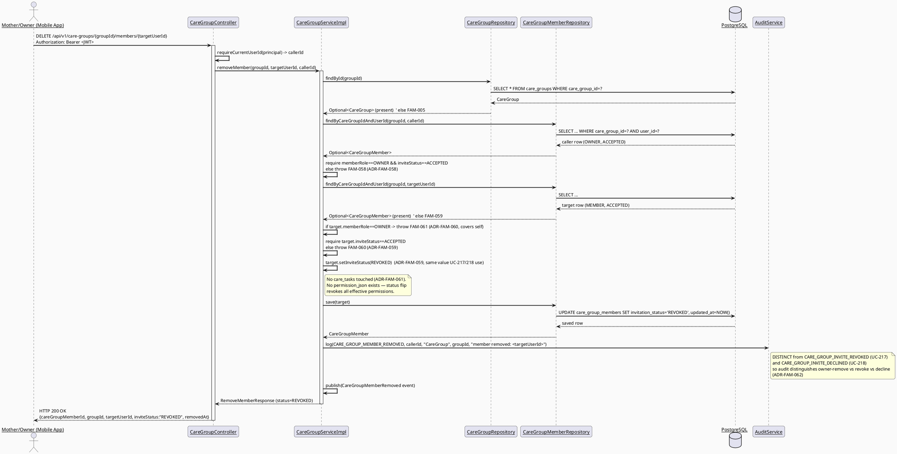
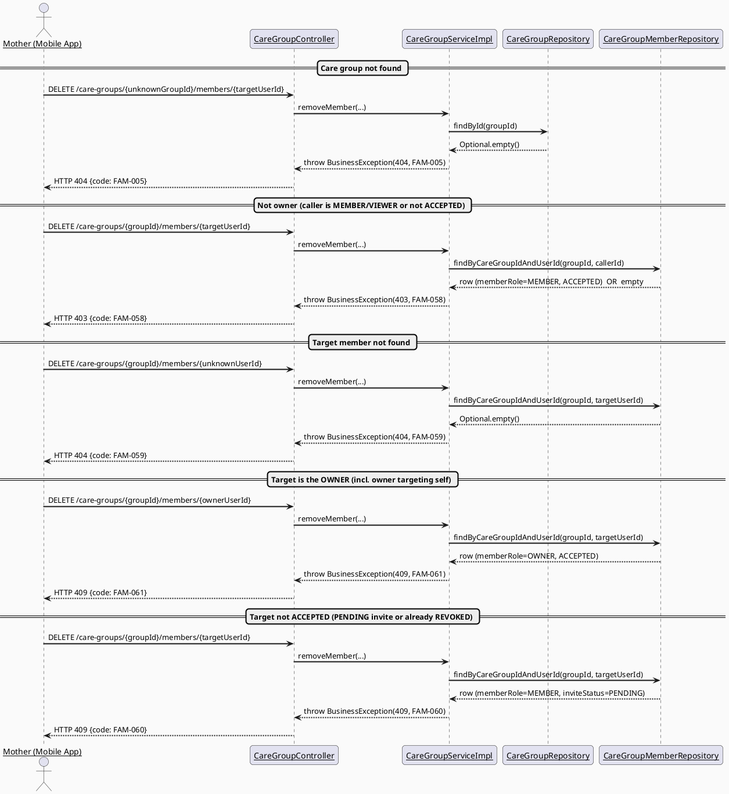
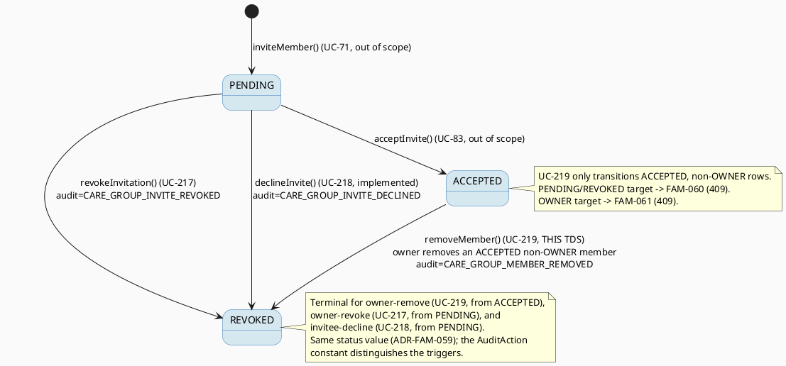

# ENGINEERING DOCUMENTATION STANDARD (EDS) v2.0
# Technical Design Specification — UC-219 Remove Family Member

| Field | Value |
|-------|-------|
| **Document ID** | `CB-FAM-IMP-219` |
| **Version** | `1.0` |
| **Date** | `2026-07-03` |
| **Status** | `Draft` |
| **Document Owner** | `TV2-Bách` |
| **Author** | `AI Agent (Technical Architect + Test Designer role)` |
| **Reviewed by** | `[ ] Pending` |
| **DPO Sign-off** | `[ ] Pending` *(module touches family membership / PII — see §1)* |
| **Approved by** | `[ ] Pending` |
| **Last Review** | `2026-07-03` |
| **Based on EDS** | `v2.0` |

---

## CHANGELOG

> **Policy 4.4 — Immutable History:** Never delete prior entries. All changes are appended below.

| Ngày | Người thực hiện | Nội dung thay đổi |
|------|-----------------|-------------------|
| 2026-07-03 | AI Agent — Technical Architect | Initial draft — TDS for UC-219 Remove Family Member |

---

## MỤC LỤC

1. [Tổng quan Module](#1-tổng-quan-module)
2. [Ma trận Truy vết (Traceability Matrix)](#2-ma-trận-truy-vết-traceability-matrix)
3. [Architecture Decision Records (ADR)](#3-architecture-decision-records-adr)
4. [Non-Functional Requirements & SLA](#4-non-functional-requirements--sla)
5. [Static Modeling (Mô hình Tĩnh)](#5-static-modeling-mô-hình-tĩnh)
6. [Dynamic Modeling (Mô hình Động)](#6-dynamic-modeling-mô-hình-động)
7. [Domain Event Catalog](#7-domain-event-catalog)
8. [Interface Specification (Đặc tả Giao diện)](#8-interface-specification-đặc-tả-giao-diện)
9. [API Specification](#9-api-specification)
10. [Bảng mã lỗi (Error Codes)](#10-bảng-mã-lỗi-error-codes)
11. [Quy trình Triển khai (Step-by-Step)](#11-quy-trình-triển-khai-step-by-step)
12. [Rollback & Incident Runbook](#12-rollback--incident-runbook)
13. [Kịch bản Kiểm thử Chi tiết](#13-kịch-bản-kiểm-thử-chi-tiết)
14. [Phương pháp Xác minh](#14-phương-pháp-xác-minh)
15. [Mẫu thử thực tế (API Verification Samples)](#15-mẫu-thử-thực-tế-api-verification-samples)
16. [Bảng tổng hợp phân quyền (Authorization Matrix)](#16-bảng-tổng-hợp-phân-quyền-authorization-matrix)
17. [AI Prompt Constraints (CASE 2.0)](#17-ai-prompt-constraints-case-20)

---

## 1. Tổng quan Module

UC-219 "Remove Family Member" lets a Mother — specifically the **OWNER** of a `CareGroup` —
remove an existing, already-joined family member from the group. The action targets another
member's `care_group_members` row (the member, NOT the caller) whose `invitation_status` is
`ACCEPTED`, and transitions that row's status to `REVOKED`. Per SRS this "revokes active
permissions"; because every care-group access gate in the codebase already requires
`invitation_status == ACCEPTED` (see the existing `listMembers()` `isMember` check and UC-216
`ADR-FAM-002`), the single status flip to `REVOKED` is sufficient to revoke all effective
permissions — no separate revocation mechanism is introduced (see ADR-FAM-059). This is a
single-call, server-side state transition; no schema change and no new enum value are required
(ADR-FAM-059).

This TDS covers ONLY the owner-initiated removal of an already-`ACCEPTED` member. It does NOT
cover: revoking a still-`PENDING` invitation (that is UC-217 `revokeInvitation()`), the invitee's
own decline flow (UC-218 `declineInvite()`), a member voluntarily leaving the group (UC-220 Leave
Care Group), or hard-deleting membership rows. It also explicitly does NOT auto-reassign the
removed member's care tasks (ADR-FAM-061 — scope boundary vs UC-220).

| Field | Value |
|-------|-------|
| **Module Name** | `Family Sync — Remove Care Group Member` |
| **Bounded Context** | `family` (package `com.carebridge.backend.family`) |
| **UC ID** | `UC-219` |
| **SRS Reference** | `§3.3.17.4 Remove Family Member` (`02_Requirements/SRS/3_Functional_Specification.md`, ~line 4712) |
| **Primary Actor** | `Mother (must be group OWNER)` |
| **Secondary Actors** | `None` (per SRS) |
| **Platform** | `Mobile App` (screen CB-168 Care Group Members) |
| **Priority / Frequency** | `Medium` / `Regular` (per SRS) |
| **Data Classification** | `PII` (care-group family membership) |
| **Compliance Scope** | `BR-RBAC, BR-PRIVACY, PDPA` (Vietnam) — no GDPR/CCPA scope asserted (VN-market product) |
| **Upstream Dependencies** | `CareGroupRepository`, `CareGroupMemberRepository` (reused as-is), `AuditService` |
| **Downstream Consumers** | Audit log; UC-216 View Care Group Members (a `REVOKED` row is filtered out of the member list — existing behavior, `ADR-FAM-002`) |

**Mô tả:** Owner mở màn hình "Thành viên nhóm" (CB-168), thấy danh sách thành viên đã tham gia
(`ACCEPTED`) với vai trò ("Quản trị" = OWNER, "Chỉ xem" = VIEWER, ...), chọn hành động xóa một
thành viên (qua confirm chung/native). Hệ thống chuyển `invitation_status` của hàng thành viên
mục tiêu sang `REVOKED` và ghi audit `CARE_GROUP_MEMBER_REMOVED`. Chỉ OWNER (đã `ACCEPTED`) mới
được thực hiện; chỉ thành viên còn `ACCEPTED` mới bị xóa; **không thể xóa chính chủ nhóm (OWNER)**.

---

## 2. Ma trận Truy vết (Traceability Matrix)

| Requirement ID | Loại (BR/ADR/US) | Mô tả yêu cầu | Thành phần Code | Compliance Target | ADR liên quan |
|----------------|------------------|---------------|-----------------|-------------------|---------------|
| SRS-UC219-PRE-1 | Precondition | System/services available | `CareGroupServiceImpl.removeMember()` (fails fast via repository) | — | — |
| SRS-UC219-PRE-2 | Precondition | Actor on Care Group Members screen (mobile CB-168) | `care_group_members_screen.dart` | — | — |
| SRS-UC219-PRE-3 | Precondition | Actor authenticated as group OWNER | `@PreAuthorize("hasRole('MOTHER')")` + inline owner check | BR-RBAC | ADR-FAM-058 |
| SRS-UC219-PRE-4 | Precondition | Target is an existing `ACCEPTED` member, not the OWNER | `memberRepository.findByCareGroupIdAndUserId()` + role/status guards | — | ADR-FAM-058, ADR-FAM-060 |
| SRS-UC219-POST-1 | Postcondition | Clear result shown to owner | `RemoveMemberResponse` (200) | — | — |
| SRS-UC219-POST-2 | Postcondition | Target member status updated; active permissions revoked | Target row `invitation_status → REVOKED` (all access gates require `ACCEPTED`) | — | ADR-FAM-059 |
| SRS-UC219-POST-3 | Postcondition | Sensitive action recorded for audit | `AuditService.log(CARE_GROUP_MEMBER_REMOVED, ...)` | PDPA audit trail | ADR-FAM-062 |
| SRS-UC219-NF1 | Normal Flow | Open screen, validate owner context | Controller `@PreAuthorize` + inline owner check | BR-RBAC | ADR-FAM-058 |
| SRS-UC219-NF2 | Normal Flow | Confirm removal, apply business rules | `removeMember()` service method | — | ADR-FAM-059, ADR-FAM-060 |
| SRS-UC219-NF3 | Normal Flow | Display result + update record | Response DTO + `CareGroupMemberRemoved` event | — | ADR-FAM-062 |
| SRS-UC219-AF1 | Alt Flow | Cancel-safe (owner dismisses confirm) | Mobile confirm dialog — no server call, no side effect | — | — |
| SRS-UC219-E1 | Exception | Access denied (not owner) | `FAM-058` (403) | BR-RBAC | ADR-FAM-058 |
| SRS-UC219-E2 | Exception | Target member not found | `FAM-059` (404) | — | — |
| SRS-UC219-E3 | Exception | Target not an `ACCEPTED` member (PENDING/REVOKED) | `FAM-060` (409) | — | ADR-FAM-059 |
| SRS-UC219-E4 | Exception | Target is the group OWNER (incl. self) | `FAM-061` (409) | — | ADR-FAM-060 |
| SRS-UC219-E5 | Exception | Care group not found | `FAM-005` (404, reused from UC-70/UC-216/UC-217 — not redefined) | — | — |
| BR-RBAC | Business Rule | Role/permission scope only — owner-only removal | `@PreAuthorize` + inline `memberRole==OWNER && inviteStatus==ACCEPTED` check | BR-RBAC | ADR-FAM-058 |
| BR-PRIVACY | Business Rule | Family data minimum-necessary; response never leaks other members' contact info | `RemoveMemberResponse` returns IDs/status only, no email/phone | PDPA | — |
| OPEN-1 | Open Item | Whether the removed member is notified (push/SMS) | Not specified in SRS — see §7 note | — | — |
| OPEN-2 | Open Item | Auto-reassignment of the removed member's `care_tasks` | Deliberately deferred — no SRS/UX evidence for UC-219; belongs to UC-220 scope | — | ADR-FAM-061 |
| OPEN-3 | Open Item | Numeric SLA targets (latency/availability) | Not sourced — §4 placeholders | — | — |

---

## 3. Architecture Decision Records (ADR)

### ADR-FAM-058 — Owner-Only Remove Authorization (inline check, reusing the ADR-FAM-011 / ADR-FAM-050 ownership pattern)

| Field | Value |
|-------|-------|
| **Status** | `Proposed` (Open — pending user/Tech Lead confirmation) |
| **Deciders** | `AI Agent (proposed)` — pending Product/Tech Lead |
| **Date** | `2026-07-03` |
| **Supersedes** | — |

#### Bối cảnh (Context)
SRS BR-RBAC states "role/permission scope only" generically. Removing an established member is a
membership-management action that must be restricted to the person who controls the group. The
already-shipped `CareGroupServiceImpl.inviteMember()` (lines ~155-162) encodes the owner check
inline (`memberRole == OWNER && inviteStatus == ACCEPTED` on the caller's OWN row → `FAM-008`),
and the sibling UC-217 draft formalized the same pattern as `ADR-FAM-050`. `family/policy/` is
empty (`.gitkeep` only), so there is no authorization-policy class to reuse — the check must be
done inline in the service method, consistent with the existing convention.

#### Các phương án đã xem xét (Options Considered)

| Phương án | Mô tả | Ưu điểm | Nhược điểm |
|-----------|-------|----------|------------|
| A | Any `ACCEPTED` member may remove any other member | Flexible for large families | Uncontrolled; a non-owner could evict members; conflicts with the existing owner-only invite gate |
| B | Only caller whose OWN row is `memberRole == OWNER && inviteStatus == ACCEPTED` may remove | Matches existing `inviteMember()` gate exactly; minimal authorization surface; symmetric with who can invite/revoke | Co-parents with `MEMBER` role cannot remove (deferred to a future delegated-permission UC) |
| C | Introduce a new `CareGroupAccessPolicy` class to centralize the check | Cleaner long-term | Invents an unbuilt class; `family/policy/` is empty; deviates from the current inline convention; larger scope than warranted |

#### Quyết định (Decision)
Chọn **Phương án B** — inline owner-only, `ACCEPTED`-only. The service loads the caller's own
membership via `memberRepository.findByCareGroupIdAndUserId(groupId, callerId)` and requires
`memberRole == OWNER && inviteStatus == ACCEPTED`, throwing `FAM-058` (403) otherwise. This is a
byte-for-byte reuse of the ownership pattern already present in `inviteMember()` and formalized
as `ADR-FAM-011` (UC-71) / `ADR-FAM-050` (UC-217). No policy class is introduced (matches the
real inline convention).

**⚠️ Open — requires explicit user confirmation** that removal is OWNER-only (not
any-accepted-member). If delegated permissions are later allowed, this ADR must be superseded,
not silently reinterpreted.

#### Hệ quả (Consequences)

**Tích cực:**
- Single-boolean authorization surface; symmetric with the invite/revoke gates (Least Privilege, §16).
- Zero new classes; consistent with the existing inline convention.

**Tiêu cực / Trade-offs:**
- Non-owner members cannot remove anyone — deferred to a future permission-delegation UC.

**Compliance Impact:**
- Limits who can alter family-membership state — favorable for BR-PRIVACY/BR-RBAC.

---

### ADR-FAM-059 — Reuse the existing `REVOKED` terminal value; differentiate by a distinct `AuditAction` (no new enum value, no migration)

| Field | Value |
|-------|-------|
| **Status** | `Proposed` (Accepted by batch decision — confirmed by user for the family-sync batch) |
| **Deciders** | `User (batch decision)` + AI Agent |
| **Date** | `2026-07-03` |

#### Bối cảnh (Context)
The real `InviteStatus` enum (`family/entity/InviteStatus.java`) has exactly three values:
`ACCEPTED, PENDING, REVOKED` — no `REMOVED`, `CANCELLED`, `REJECTED`, or `EXPIRED`. UC-217's
owner-revoke and UC-218's `declineInvite()` both already write `REVOKED` for their respective
(different) triggers. UC-219 needs a terminal state for an owner-removed **ACCEPTED** member. A
naive design would add a new enum value (e.g. `REMOVED`), which would require an enum change and
risk a schema/CHECK mismatch, and would force UC-216's member-list filter
(`IN ('ACCEPTED','PENDING')`) to be updated to exclude the new value too.

Additionally, the SRS postcondition "revokes active permissions" implies the removed member must
lose access. **Schema-fidelity note:** the real `CareGroupMember` entity has **no**
`permission_json`/permissions column — access is governed entirely by `invitation_status ==
ACCEPTED` at every gate (e.g. `listMembers()`'s `existsByCareGroupIdAndUserIdAndInviteStatus(...,
ACCEPTED)`; UC-216 `ADR-FAM-002`). Therefore flipping the row to `REVOKED` already revokes ALL
effective permissions; no separate permission-revocation mechanism is needed or exists.

#### Các phương án đã xem xét (Options Considered)

| Phương án | Mô tả | Ưu điểm | Nhược điểm |
|-----------|-------|----------|------------|
| A | Add a new `REMOVED` enum value | Distinguishes owner-remove from decline/revoke at the status level | Enum change + risk of DB value drift; UC-216 filter would need updating; larger blast radius; violates the batch "no new enum values, no migration" decision |
| B | Write `invitation_status = REVOKED` on the target row (same terminal value UC-217/UC-218 use), and differentiate the *trigger* purely via a distinct `AuditAction` constant `CARE_GROUP_MEMBER_REMOVED` | No enum change, no migration; UC-216's existing `IN ('ACCEPTED','PENDING')` filter already excludes `REVOKED`, so the removed member disappears from the member list automatically; audit log distinguishes owner-remove vs revoke vs decline | The membership row alone cannot tell "how it became REVOKED" without consulting the audit log |

#### Quyết định (Decision)
Chọn **Phương án B**. The remove action sets the target row's `invitation_status` to `REVOKED`
(the same terminal value UC-217/UC-218 already write for different triggers). The three triggers
are differentiated **only** by the audit action constant: `CARE_GROUP_MEMBER_REMOVED` (this UC,
owner removes an ACCEPTED member) vs `CARE_GROUP_INVITE_REVOKED` (UC-217, owner cancels a PENDING
invite) vs the existing `CARE_GROUP_INVITE_DECLINED` (UC-218, invitee declines). This is a
confirmed batch decision: **`invitation_status` stays exactly `{ACCEPTED, PENDING, REVOKED}` — no
new enum values, no migration.**

#### Hệ quả (Consequences)

**Tích cực:**
- Zero schema/enum change; UC-216 member-list filter needs no update.
- The single status flip revokes all effective permissions (no `permission_json` exists to clear).
- Audit trail still answers "owner removed member" vs "owner revoked invite" vs "invitee declined"
  via distinct action constants.

**Tiêu cực / Trade-offs:**
- Reading the membership row alone does not reveal *why* it is `REVOKED`; the audit log is the
  source of truth for that distinction (acceptable — audit is the correct place for trigger
  provenance).

**Compliance Impact:**
- Append-only status transition (no row delete) — preserves auditability (PDPA).

---

### ADR-FAM-060 — Cannot remove the group OWNER (ownership transfer out of scope; self-removal → UC-220)

| Field | Value |
|-------|-------|
| **Status** | `Proposed` (Open — pending user confirmation) |
| **Deciders** | `AI Agent (proposed)` — pending Product/Tech Lead |
| **Date** | `2026-07-03` |

#### Bối cảnh (Context)
UC-70 `ADR-FAM-001` establishes that the creator is the sole `OWNER` of a group (one OWNER row
per group). If UC-219 allowed the OWNER row to be set to `REVOKED`, the group would be orphaned
(no controlling member), and — because the caller must themselves be the OWNER (ADR-FAM-058) —
"removing the OWNER" is equivalent to the owner removing themselves (self-removal). Neither
orphaning nor self-removal is in scope for UC-219; a member voluntarily leaving is the separate
UC-220 (Leave Care Group), and transferring ownership is not specified anywhere in the SRS.

#### Các phương án đã xem xét (Options Considered)

| Phương án | Mô tả | Ưu điểm | Nhược điểm |
|-----------|-------|----------|------------|
| A | Allow removing the OWNER (and auto-transfer or orphan the group) | Flexible | Orphans the group or requires an unspecified ownership-transfer mechanism; no SRS support |
| B | Reject any attempt to remove a target whose `memberRole == OWNER` with a dedicated error (`FAM-061`, 409), and document that ownership transfer + self-leave are out of scope (UC-220) | Prevents orphaning; single explicit guard; naturally also blocks self-removal (owner is the caller) | Owner cannot leave via this action — must use UC-220; ownership transfer deferred |

#### Quyết định (Decision)
Chọn **Phương án B**. Before flipping status, the service checks `target.memberRole == OWNER`; if
so it throws `FAM-061` (409 Conflict). Because the single OWNER row is the caller's own row under
UC-70's model, this guard **also covers the self-removal case** (`targetUserId == callerId`) —
the owner attempting to remove themselves hits `FAM-061` and is directed to UC-220 (Leave Care
Group) instead. Ownership transfer is explicitly out of scope (no SRS source; flagged for a
future UC).

**Chosen HTTP status = 409 Conflict (not 403).** Justification: the caller IS authorized (they
are the OWNER, so this is not an authorization failure of the caller); the operation is rejected
because it conflicts with an invariant of the target resource's current state (an OWNER row
cannot be removed). 409 "conflict with the current state of the resource" models this more
accurately than 403 "caller forbidden." (Contrast UC-217's self-target guard, which used 400
because it was a malformed self-directed request on a *pending invite* lifecycle; here the target
is a valid ACCEPTED OWNER and the rejection is a state-invariant conflict.)

#### Hệ quả (Consequences)

**Tích cực:** Group can never be orphaned by UC-219; self-leave and ownership transfer are cleanly
separated into their own scopes.
**Tiêu cực / Trade-offs:** Owner cannot use this endpoint to leave; must use UC-220. No
ownership-transfer path exists yet (Open).
**Compliance Impact:** None beyond preserving a valid controlling member for every group.

---

### ADR-FAM-061 — No automatic care-task reassignment on removal (scope boundary vs UC-220)

| Field | Value |
|-------|-------|
| **Status** | `Proposed` (Open — deliberately deferred, pending product confirmation) |
| **Deciders** | `AI Agent (proposed)` — pending Product/Tech Lead |
| **Date** | `2026-07-03` |

#### Bối cảnh (Context)
The sibling UC-220 (Leave Care Group) has an explicit UX mockup showing a task-reassignment
warning, so task reassignment is clearly within UC-220's scope. For UC-219, there is **no**
equivalent UX evidence and **no** SRS text requiring automatic reassignment of the removed
member's tasks. Furthermore, **no `CareTask` entity/repository/service/controller exists anywhere
in the codebase yet** (the `care_tasks` sub-domain is entirely unbuilt), so there is nothing for
UC-219 to reassign against. The canonical `care_tasks.status` enum for this batch (per UC-221/222
and `UC73_AssignFamilyTask` `ADR-FAM-030`) is `{OPEN, IN_PROGRESS, DONE, CANCELLED}` — cited here
only for completeness; UC-219 does not read or write any task row.

#### Các phương án đã xem xét (Options Considered)

| Phương án | Mô tả | Ưu điểm | Nhược điểm |
|-----------|-------|----------|------------|
| A | Auto-reassign the removed member's `care_tasks.assigned_to` rows during removal | "Cleans up" dangling assignments | No SRS/UX source for UC-219; invents behavior; couples UC-219 to an unbuilt sub-domain; overlaps/contradicts UC-220's scope |
| B | Do NOT touch any task on removal; leave reassignment to the owner's manual action (or to UC-220 where the UX explicitly warns about it) | Smallest scoped change (CLAUDE.md); no dependency on the unbuilt `care_tasks` sub-domain; no scope overlap with UC-220 | The removed member's tasks (if the sub-domain later ships) may be left assigned to a now-REVOKED member until the owner reassigns manually |

#### Quyết định (Decision)
Chọn **Phương án B** — UC-219 performs the membership status flip ONLY and does NOT auto-reassign
tasks. This is a **deliberately deferred (`Open`) decision**: the owner may prefer to manually
reassign after removal, and automatic reassignment (with its warning UX) is explicitly UC-220's
scope. UC-219's Test-Spec asserts **no** interaction with any task repository/service.

**⚠️ Open — deliberately deferred.** If product later decides UC-219 must also reassign/cancel the
removed member's tasks, this ADR must be superseded and UC-219 re-opened; that change would also
need the `care_tasks` sub-domain to exist first.

#### Hệ quả (Consequences)

**Tích cực:** No coupling to unbuilt code; no scope overlap/contradiction with UC-220; smallest change.
**Tiêu cực / Trade-offs:** Possible future "orphaned assignment" of tasks to a REVOKED member —
acceptable and explicitly out of scope; the member's REVOKED status already blocks their access.
**Compliance Impact:** None.

---

### ADR-FAM-062 — New distinct `AuditAction` constant `CARE_GROUP_MEMBER_REMOVED`

| Field | Value |
|-------|-------|
| **Status** | `Proposed` (Accepted by batch decision) |
| **Deciders** | `User (batch decision)` + AI Agent |
| **Date** | `2026-07-03` |

#### Bối cảnh (Context)
Because ADR-FAM-059 reuses the `REVOKED` status value shared with UC-217's revoke and UC-218's
decline flows, the ONLY way audit logs can distinguish an owner-initiated **member removal** from
a **pending-invite revoke** or an **invitee decline** is a distinct audit action constant. The
current `AuditAction` enum (`audit/entity/AuditAction.java`, verified) contains
`CARE_GROUP_INVITE_ACCEPTED` and `CARE_GROUP_INVITE_DECLINED` but **no** member-removal constant
(and, at the time this TDS is written, no `CARE_GROUP_INVITE_REVOKED` yet either — that is added
by sibling UC-217).

#### Quyết định (Decision)
Add a new enum constant **`CARE_GROUP_MEMBER_REMOVED`** to `AuditAction`, distinct from
`CARE_GROUP_INVITE_REVOKED` (UC-217), `CARE_GROUP_INVITE_DECLINED` (UC-218), and
`CARE_GROUP_MEMBER_LEFT` (UC-220). `removeMember()` logs with this new constant. **This TDS only
specifies the constant; the actual enum-file edit is an implementation task (§11), not performed
by this document.** The enum edit is append-only (do not reorder existing constants).

#### Hệ quả (Consequences)

**Tích cực:** Audit logs cleanly separate "owner removed member" from "owner revoked invite",
"invitee declined", and "member left".
**Tiêu cực / Trade-offs:** One additional enum constant to maintain (negligible).
**Compliance Impact:** Strengthens the PDPA audit trail (accurate action provenance).

---

## 4. Non-Functional Requirements & SLA

> No source in SRS or existing TDS docs specifies numeric SLAs for this feature. All targets
> below are **Open — placeholder defaults** (reused CareBridge platform defaults), not sourced
> commitments, and must be confirmed by Tech Lead before being treated as binding (OPEN-3).

### 4.1. Performance & Availability

| Category | Requirement | Target SLA | Measurement Method | Compliance Basis |
|----------|-------------|------------|---------------------|------------------|
| Latency | `DELETE /care-groups/{groupId}/members/{targetUserId}` (p99) | `< 300ms` (Open — platform default) | k6 load test | — |
| Availability | Uptime (monthly) | `99.9%` (Open — platform default) | Uptime monitor | — |
| Throughput | Concurrent requests | Not benchmarked — Open (Regular frequency per SRS) | — | — |

### 4.2. Data Integrity & Retention

| Category | Requirement | Target | Verification Method | Compliance Basis |
|----------|-------------|--------|---------------------|------------------|
| Durability | Status transition committed atomically | RPO = 0 (transactional) | Transaction log | — |
| Retention | Audit log retention | Platform default (Open — no feature-specific period in SRS) | DB backup policy | PDPA |
| Consistency | Only `ACCEPTED → REVOKED` allowed for non-OWNER; append-only (no delete) | 100% | Service guard + §14 SQL check | — |

### 4.3. Security

| Category | Requirement | Target | Verification Method | Compliance Basis |
|----------|-------------|--------|---------------------|------------------|
| Access control | Owner-only removal | Least privilege | Auth Matrix (§16) | BR-RBAC |
| Data minimization | Response contains no email/phone | 0 PII fields in response | Response schema review | BR-PRIVACY |
| Encryption in transit | All endpoints | TLS 1.3+ | SSL scan | PDPA |

### 4.4. Scalability & Capacity Planning

Remove is a `Regular`-frequency, single-row `UPDATE` with no fan-out (no task reassignment —
ADR-FAM-061). Worst-case load is bounded by the number of members per group (already small — 20
max per UC-216 note). No caching or horizontal-scaling strategy is warranted. **Open** — no load
projection exists in current docs.

---

## 5. Static Modeling (Mô hình Tĩnh)

### 5.1. Class Diagram (PlantUML)

> **Schema fidelity note:** Field/column names below reflect the REAL entity
> `CareGroupMember.java` — `userId` → column `user_id`, `inviteStatus` → column
> `invitation_status`, mapped against the `users` table. The `account_id` / `invite_status` /
> `accounts` names that appear in some sibling TDS prose (e.g. UC-216) are **incorrect** and are
> NOT used here. The real entity has **no** `permission_json`/permissions column (see ADR-FAM-059).



### 5.2. Data Structure (Flyway SQL Migration)

> **CareBridge rule:** `V1__init_schema.sql` is the schema baseline. Never modify an applied
> migration.

**No migration is required for UC-219.** The feature only performs an `UPDATE` of an existing
column (`care_group_members.invitation_status`) to an existing enum value (`REVOKED`). No new
column, table, index, enum value, or CHECK constraint is introduced (ADR-FAM-059).

```sql
-- Reference only (existing table — DO NOT recreate):
-- care_group_members(
--   care_group_member_id UUID PK,
--   care_group_id        UUID NOT NULL,
--   user_id              UUID NOT NULL,          -- maps to users(id)
--   member_role          VARCHAR(50),
--   invitation_status    VARCHAR(20) NOT NULL,   -- ACCEPTED | PENDING | REVOKED
--   joined_at            TIMESTAMPTZ,
--   created_at           TIMESTAMPTZ NOT NULL,
--   updated_at           TIMESTAMPTZ NOT NULL
-- )   -- NOTE: no permission_json column exists (ADR-FAM-059)

-- The runtime effect of removeMember() (illustrative — executed via JPA save(), not raw SQL):
UPDATE care_group_members
SET invitation_status = 'REVOKED',
    updated_at        = NOW()
WHERE care_group_id = :groupId
  AND user_id       = :targetUserId
  AND invitation_status = 'ACCEPTED'
  AND member_role   <> 'OWNER';
```

> **Quy tắc đặt tên:** All columns are `snake_case` in DDL. The JPA entity uses camelCase
> (`userId`, `inviteStatus`) mapped to `user_id` / `invitation_status` via `@Column` — verified
> against `CareGroupMember.java`.

---

## 6. Dynamic Modeling (Mô hình Động)

### 6.1. Sequence Diagram — Happy Path (PlantUML)



### 6.2. Sequence Diagram — Error Paths (PlantUML)



### 6.3. State Machine — `InviteStatus` (remove transition only)



**⚠️ Invariant bất biến:**
- No transition deletes a `CareGroupMember` row (append-only status change).
- UC-219 performs ONLY the `ACCEPTED → REVOKED` transition for a **non-OWNER** target; it never
  touches an OWNER row (→ `FAM-061`) nor a PENDING/REVOKED row (→ `FAM-060`).
- `invitation_status` value set is unchanged: `{ACCEPTED, PENDING, REVOKED}` — no new value.

---

## 7. Domain Event Catalog

### 7.1. Events Published (Phát ra)

| Event Name | Trigger | Publisher | Subscriber(s) | Payload Schema | Async? |
|------------|---------|-----------|---------------|----------------|--------|
| `CareGroupMemberRemoved` | Successful `removeMember()` (target row set to `REVOKED`) | `CareGroupServiceImpl` | Audit/log listener only (Open — no FCM push defined; SRS secondary actor = None) | `CareGroupMemberRemoved.java` | Yes |

**Note on notification (OPEN-1):** SRS lists no secondary actor for UC-219. Whether the removed
member receives any push/SMS notification of the removal is **Open** — not specified in SRS. This
TDS assumes NO outbound notification to the removed member (they simply lose access; the group
disappears from any list they might see). Flag for product sign-off if a "you were removed"
notification is desired.

### 7.2. Events Consumed (Tiêu thụ)

| Event Name | Source | Handler | Action thực hiện |
|------------|--------|---------|------------------|
| _(none)_ | — | — | UC-219 does not consume any domain event. |

### 7.3. Payload Schema

```java
// CareGroupMemberRemoved.java
public record CareGroupMemberRemoved(
    UUID    eventId,          // UUID.randomUUID() — used to deduplicate
    String  eventType,        // "CareGroupMemberRemoved"
    Instant occurredAt,       // Instant.now()
    String  version,          // "1.0"
    Payload payload,
    Metadata metadata
) implements ApplicationEvent {

    public record Payload(
        UUID careGroupId,
        UUID careGroupMemberId,   // the removed target's membership row id
        UUID targetUserId,        // the member who was removed
        UUID removedByUserId      // the owner who performed the removal (= caller)
    ) {}

    public record Metadata(
        UUID   correlationId,
        String causedBy           // callerId as string
    ) {}
}
```

---

## 8. Interface Specification (Đặc tả Giao diện)

### 8.1. Service Interface

```java
// RemoveMemberResponse.java — Output DTO
// @version 1.0
public class RemoveMemberResponse {
    private UUID careGroupMemberId;   // target's care_group_members.care_group_member_id
    private UUID groupId;             // care_group_id
    private UUID targetUserId;        // the member who was removed
    private String inviteStatus;      // always "REVOKED" on success
    private Instant removedAt;        // target.updatedAt after the status change
    // getters / setters (Lombok @Data @Builder in practice, matching sibling DTOs)
}

// ICareGroupService.java — Service Contract (EXTENDS existing interface, additive)
// @version 1.1
// @breaking-change None — additive method only
public interface ICareGroupService {

    // --- existing methods (unchanged, shown for context) ---
    // CreateCareGroupResponse createCareGroup(CreateCareGroupRequest request, UUID callerId);
    // CareGroupMembersResponse listMembers(UUID groupId, UUID callerId);
    // CareGroupMemberDto inviteMember(UUID groupId, InviteCareGroupMemberRequest request, UUID callerId);
    // CareGroupMemberDto acceptInvite(UUID groupId, UUID callerId);
    // void declineInvite(UUID groupId, UUID callerId);   // UC-218 — sets REVOKED via CARE_GROUP_INVITE_DECLINED

    /**
     * UC-219 — Owner removes an already-ACCEPTED family member from the group.
     * Sets the target member's invitation_status to REVOKED (same terminal value UC-217/UC-218 use),
     * differentiated by AuditAction.CARE_GROUP_MEMBER_REMOVED. Does NOT reassign the member's tasks
     * (ADR-FAM-061). Cannot remove the OWNER (ADR-FAM-060).
     *
     * @param groupId       the care group
     * @param targetUserId  the member being removed (NOT the caller; must be ACCEPTED and non-OWNER)
     * @param callerId      the authenticated caller (must be OWNER + ACCEPTED of the group)
     * @throws com.carebridge.backend.common.exception.BusinessException (FAM-005/404) if care group not found
     * @throws BusinessException (FAM-058/403) if caller is not the OWNER (ACCEPTED) of the group
     * @throws BusinessException (FAM-059/404) if no membership row exists for targetUserId in the group
     * @throws BusinessException (FAM-061/409) if the target's memberRole == OWNER (incl. targetUserId == callerId)
     * @throws BusinessException (FAM-060/409) if the target member is not in ACCEPTED state (PENDING/REVOKED)
     */
    RemoveMemberResponse removeMember(UUID groupId, UUID targetUserId, UUID callerId);
}
```

### 8.2. Repository Interface

```java
// CareGroupMemberRepository.java — NO CHANGE NEEDED (reused as-is)
// @version 1.0
public interface CareGroupMemberRepository extends JpaRepository<CareGroupMember, UUID> {

    // Reused for BOTH the caller-owner lookup AND the target-member lookup:
    Optional<CareGroupMember> findByCareGroupIdAndUserId(UUID careGroupId, UUID userId);

    // (other existing methods unchanged: existsByCareGroupIdAndUserIdAndInviteStatus,
    //  findByCareGroupIdAndInviteStatusIn, countByCareGroupId, findByUserIdAndInviteStatus)
    // Note: save() from JpaRepository performs the ACCEPTED -> REVOKED UPDATE.
}
```

> **Contract-existence note (anti AP-AI-005):** `findByCareGroupIdAndUserId` and `save` already
> exist on the real `CareGroupMemberRepository` (verified — lines 19 and JpaRepository). `removeMember`
> does NOT require any new repository method — the feature is greenfield only at
> controller/service/DTO/event level. No `CareTaskRepository` is referenced (does not exist —
> ADR-FAM-061).

---

## 9. API Specification

### 9.1. Endpoints Table

| Method | Path | Auth Level | Required Roles | Rate Limit | Idempotent? |
|--------|------|------------|----------------|------------|-------------|
| `DELETE` | `/api/v1/care-groups/{groupId}/members/{targetUserId}` | JWT Bearer | `MOTHER` (+ must be group OWNER, checked in service) | Not specified — Open, propose platform default 60/min | Yes* |

*Idempotent in effect: a second call on an already-`REVOKED` row returns `FAM-060` (409), so the
first removal is the only state change; the operation is naturally at-most-once per member.

**Endpoint-shape decision (`DELETE .../members/{targetUserId}` vs `POST .../remove`):**
`DELETE` on the `members` sub-resource is chosen because:
1. It is the idiomatic REST verb for "remove this member from the members collection" and mirrors
   the existing collection endpoint `GET /api/v1/care-groups/{groupId}/members` (UC-216) — the
   member is a member of that collection; `DELETE .../{targetUserId}` removes them from it.
2. Server-side the row is soft-revoked (append-only status flip to `REVOKED`, NOT a hard row
   delete); this is an internal persistence detail and does not change the resource-level
   semantics that the member is being removed from the group's membership.

> **Contrast with UC-217** (which chose `POST .../invitations/{targetUserId}/revoke` over
> `DELETE`): UC-217 acts on a **pending-invite lifecycle** (a verb-like state transition on an
> invitation), so a lifecycle POST verb fit better. UC-219 acts on an **established member of the
> members collection**, so `DELETE` on that collection sub-resource is the more accurate mapping.
> Both remain append-only status flips under the hood.

### 9.2. Request / Response Schemas

#### `DELETE /api/v1/care-groups/{groupId}/members/{targetUserId}`

**Request Body:** _(none — target identified by path; caller identified by JWT)_

**Response — 200 OK (Happy Path):**
```json
{
  "success": true,
  "data": {
    "careGroupMemberId": "550e8400-e29b-41d4-a716-446655440000",
    "groupId": "11111111-1111-1111-1111-111111111111",
    "targetUserId": "33333333-3333-3333-3333-333333333333",
    "inviteStatus": "REVOKED",
    "removedAt": "2026-07-03T09:00:00.000Z"
  },
  "message": "Member removed",
  "timestamp": "2026-07-03T09:00:00.000Z"
}
```

**Response — 403 Forbidden (Not owner):**
```json
{ "error": { "code": "FAM-058", "message": "Only the care group owner can remove members" } }
```

**Response — 404 Not Found (Target member not found):**
```json
{ "error": { "code": "FAM-059", "message": "No membership found for this user in this group" } }
```

**Response — 409 Conflict (Target not an ACCEPTED member):**
```json
{ "error": { "code": "FAM-060", "message": "This user is not an active member and cannot be removed" } }
```

**Response — 409 Conflict (Target is the owner):**
```json
{ "error": { "code": "FAM-061", "message": "The group owner cannot be removed. Use Leave Care Group or transfer ownership (not yet supported)." } }
```

**Response — 404 Not Found (Care group not found):**
```json
{ "error": { "code": "FAM-005", "message": "Care group not found" } }
```

---

## 10. Bảng mã lỗi (Error Codes)

> `FAM-` prefix reused from existing family module codes. UC-219 allocates the NEW range
> **`FAM-058` … `FAM-062`** (per batch allocation, to avoid collision with parallel sibling
> agents: UC-217 = FAM-050..054, UC-218 = FAM-055..057, UC-220 = FAM-063..067). `FAM-005` is
> REUSED (not redefined) for care-group-not-found, consistent with UC-70/UC-216/UC-217.

| Code | HTTP Status | Message (EN) | Message (VI) | Trigger Condition |
|------|-------------|--------------|--------------|-------------------|
| `FAM-005` | 404 | Care group not found | Không tìm thấy nhóm chăm sóc | `groupId` does not match any `CareGroup` (reused, not redefined) |
| `FAM-058` | 403 | Only the care group owner can remove members | Chỉ chủ nhóm mới được xóa thành viên | Caller's own row is not `memberRole==OWNER && inviteStatus==ACCEPTED` (ADR-FAM-058) |
| `FAM-059` | 404 | No membership found for this user in this group | Không tìm thấy tư cách thành viên của người dùng này | `findByCareGroupIdAndUserId(groupId, targetUserId)` is empty |
| `FAM-060` | 409 | This user is not an active member and cannot be removed | Người dùng không phải thành viên đang hoạt động nên không thể xóa | Target row `invitation_status != ACCEPTED` (PENDING invite → use UC-217; already REVOKED) (ADR-FAM-059) |
| `FAM-061` | 409 | The group owner cannot be removed | Không thể xóa chủ nhóm | Target row `member_role == OWNER` (includes owner targeting self); ownership transfer / self-leave out of scope (ADR-FAM-060) |
| `FAM-062` | 500 | Internal error | Lỗi hệ thống | Reserved — unexpected DB/persistence error |

---

## 11. Quy trình Triển khai (Step-by-Step)

### 11.1. Prerequisites

- [ ] ADR-FAM-058, ADR-FAM-059, ADR-FAM-060, ADR-FAM-061, ADR-FAM-062 reviewed and confirmed (currently `Proposed`/Open in this draft)
- [ ] No DPO migration sign-off needed (no schema change) — DPO note only for audit-content review
- [ ] Existing tables `care_groups`, `care_group_members`, `users` present (baseline `V1`)
- [ ] `InviteStatus` enum already contains `REVOKED` (verified — no change)

### 11.2. Pre-Migration Checklist

**Not applicable — UC-219 introduces NO Flyway migration** (ADR-FAM-059: reuse `REVOKED`, no new
column/enum value).

### 11.3. Implementation Steps

#### Chặng 1 — Add the new `AuditAction` constant (code change, not DDL)

```java
// com.carebridge.backend.audit.entity.AuditAction — APPEND new constant
// (append-only enum edit; do NOT reorder existing constants)
public enum AuditAction {
    // ... existing ...
    CARE_GROUP_INVITE_ACCEPTED,
    CARE_GROUP_INVITE_DECLINED,
    CARE_GROUP_MEMBER_REMOVED,   // NEW — UC-219 (ADR-FAM-062), distinct from _INVITE_REVOKED / _INVITE_DECLINED / _MEMBER_LEFT
    // ... existing ...
}
```

#### Chặng 2 — Add DTO + domain event

- `family/dto/RemoveMemberResponse.java` (§8.1)
- `family/event/CareGroupMemberRemoved.java` (§7.3)

#### Chặng 3 — Service method (inline owner check — no policy class)

```java
@Override
public RemoveMemberResponse removeMember(UUID groupId, UUID targetUserId, UUID callerId) {
    CareGroup group = groupRepository.findById(groupId)
        .orElseThrow(() -> new BusinessException(HttpStatus.NOT_FOUND, "FAM-005",
            "Care group not found: " + groupId));

    // Owner-only gate — reuse the exact inviteMember() ownership pattern (ADR-FAM-058)
    CareGroupMember caller = memberRepository.findByCareGroupIdAndUserId(groupId, callerId)
        .orElseThrow(() -> new BusinessException(HttpStatus.FORBIDDEN, "FAM-058",
            "Only the care group owner can remove members"));
    if (caller.getMemberRole() != GroupMemberRole.OWNER
            || caller.getInviteStatus() != InviteStatus.ACCEPTED) {
        throw new BusinessException(HttpStatus.FORBIDDEN, "FAM-058",
            "Only the care group owner can remove members");
    }

    CareGroupMember target = memberRepository.findByCareGroupIdAndUserId(groupId, targetUserId)
        .orElseThrow(() -> new BusinessException(HttpStatus.NOT_FOUND, "FAM-059",
            "No membership found for this user in this group"));

    // Cannot remove the OWNER (also blocks owner-targets-self) (ADR-FAM-060)
    if (target.getMemberRole() == GroupMemberRole.OWNER) {
        throw new BusinessException(HttpStatus.CONFLICT, "FAM-061",
            "The group owner cannot be removed");
    }
    // Only an ACCEPTED member can be removed (PENDING invite -> UC-217; already REVOKED) (ADR-FAM-059)
    if (target.getInviteStatus() != InviteStatus.ACCEPTED) {
        throw new BusinessException(HttpStatus.CONFLICT, "FAM-060",
            "This user is not an active member and cannot be removed");
    }

    target.setInviteStatus(InviteStatus.REVOKED);   // ADR-FAM-059 — same value UC-217/UC-218 use
    CareGroupMember saved = memberRepository.save(target);
    // NOTE: no care_tasks reassignment (ADR-FAM-061); no permission_json to clear (none exists)

    auditService.log(AuditAction.CARE_GROUP_MEMBER_REMOVED, callerId,
        "CareGroup", groupId.toString(), "member removed: " + targetUserId);
    // eventPublisher.publishEvent(new CareGroupMemberRemoved(...));  // if event bus wired

    return RemoveMemberResponse.builder()
        .careGroupMemberId(saved.getId())
        .groupId(groupId)
        .targetUserId(targetUserId)
        .inviteStatus(saved.getInviteStatus().name())
        .removedAt(saved.getUpdatedAt())
        .build();
}
```

> **Guard order (normative):** group → owner(caller) → target lookup → target-is-OWNER → target-status.
> The owner-target guard MUST precede the status guard so an ACCEPTED OWNER target yields `FAM-061`
> (not `FAM-060`).

#### Chặng 4 — Controller endpoint

```java
// UC-219: Owner removes an accepted member from the group
@DeleteMapping("/{groupId}/members/{targetUserId}")
@PreAuthorize("hasRole('MOTHER')")
public ResponseEntity<ApiResponse<RemoveMemberResponse>> removeMember(
        @PathVariable UUID groupId,
        @PathVariable UUID targetUserId,
        Principal principal) {
    var callerId = SecurityUtils.requireCurrentUserId(principal);
    var response = careGroupService.removeMember(groupId, targetUserId, callerId);
    return ResponseEntity.ok(ApiResponse.success(response, "Member removed"));
}
```

#### Chặng 5 — Verification sau deploy

```bash
curl -X GET https://[host]/api/v1/health
# Expected: {"status": "ok"}
```

### 11.4. Deployment Checklist

- [ ] No Flyway migration to run (schema unchanged)
- [ ] Health check endpoint returns 200
- [ ] Audit log emits `CARE_GROUP_MEMBER_REMOVED` (distinct from `_INVITE_REVOKED` / `_INVITE_DECLINED`)
- [ ] Remove by a non-owner caller returns 403 `FAM-058`
- [ ] Remove of the OWNER (incl. self) returns 409 `FAM-061`
- [ ] Remove of a PENDING/already-REVOKED target returns 409 `FAM-060`

---

## 12. Rollback & Incident Runbook

### 12.1. Điều kiện kích hoạt Rollback

| Điều kiện | Ngưỡng | Người quyết định |
|-----------|--------|------------------|
| Error rate tăng đột biến | > 5% trong 5 phút | On-call Engineer |
| Latency p99 vượt ngưỡng | > 2x baseline | On-call Engineer |
| Wrong member removed / owner orphaned | Bất kỳ case nào | Tech Lead + DPO |
| Audit log ngừng ghi `CARE_GROUP_MEMBER_REMOVED` | > 1 phút | On-call Engineer |

### 12.2. Rollback Procedure

UC-219 has **no DB migration** — rollback is code-only. No data backfill needed. Any member
erroneously set to `REVOKED` can be manually corrected back to `ACCEPTED` (dev/staging only) since
the transition is a simple status flip:

```bash
# Bước 1: Re-deploy previous version
kubectl rollout undo deployment/carebridge-api

# Bước 2: Verify rollback
kubectl rollout status deployment/carebridge-api
curl -X GET https://[host]/api/v1/health

# Bước 3 (dev/staging ONLY — never run blindly on prod): repair a wrongly-removed member
psql -h $DB_HOST -U $DB_USER -d $DB_NAME \
  -c "UPDATE care_group_members SET invitation_status='ACCEPTED', updated_at=NOW() \
      WHERE care_group_id='<groupId>' AND user_id='<targetUserId>' AND invitation_status='REVOKED';"
```

> Note: the new `AuditAction.CARE_GROUP_MEMBER_REMOVED` enum constant is additive and harmless to
> leave in place even after a code rollback (no consumer breaks if unused).

### 12.3. Notification Protocol

| Thời điểm | Người nhận | Kênh | Template |
|-----------|------------|------|----------|
| Ngay khi phát hiện | On-call team | Slack `#incident` | "🚨 UC-219 remove-member incident: [mô tả]" |
| Nếu sai dữ liệu thành viên | Tech Lead + DPO | Email | Bắt buộc — PDPA |

### 12.4. Post-Incident Review (PIR)

> Bắt buộc hoàn thành trong vòng 48 giờ sau khi resolve incident.

- **Timeline:** Diễn biến chi tiết theo thời gian
- **Root Cause:** 5 Whys
- **Impact:** Số members bị remove sai, có owner nào bị orphan không?
- **Prevention:** Action items tránh tái diễn

---

## 13. Kịch bản Kiểm thử Chi tiết

> **Policy (EDS v2.0):** Mọi test scenario dùng dữ liệu `SYNTHETIC`. Không dùng Production PII.

### 13.1. Unit Tests

#### TC-UNIT-001 — Owner removes an ACCEPTED member → REVOKED

```gherkin
Feature: Remove Family Member
  Background:
    Given test data classification: SYNTHETIC
    And care group CG-001 exists
    And OWNER-001 has row {memberRole=OWNER, invitation_status=ACCEPTED} in CG-001
    And MEMBER-003 has row {memberRole=MEMBER, invitation_status=ACCEPTED} in CG-001

  Scenario: Owner removes an accepted member → REVOKED
    When removeMember(CG-001, MEMBER-003, OWNER-001) is called
    Then MEMBER-003 row invitation_status becomes REVOKED
    And audit log contains CARE_GROUP_MEMBER_REMOVED (NOT CARE_GROUP_INVITE_REVOKED/DECLINED)
    And response.inviteStatus == "REVOKED"
    And no care_tasks repository/service is invoked (ADR-FAM-061)
```

**Hàm được test:** `CareGroupServiceImpl.removeMember()`
**Invariant:** target row updated (not deleted); status set to `REVOKED`; no task side effect.

#### TC-UNIT-002 — Non-owner caller → FAM-058 (403)

```gherkin
  Scenario: A MEMBER (not OWNER) attempts removal → 403
    Given MEMBER-004 has row {memberRole=MEMBER, invitation_status=ACCEPTED} in CG-001
    And MEMBER-003 is an ACCEPTED member in CG-001
    When removeMember(CG-001, MEMBER-003, MEMBER-004) is called
    Then throws BusinessException with code FAM-058 (403)
    And MEMBER-003 row remains ACCEPTED (no side effect)
```

#### TC-UNIT-003 — Target member not found → FAM-059 (404)

```gherkin
  Scenario: Target user has no row in the group → 404
    When removeMember(CG-001, UNKNOWN-999, OWNER-001) is called
    Then throws BusinessException with code FAM-059 (404)
```

#### TC-UNIT-004 — Target is the OWNER → FAM-061 (409)

```gherkin
  Scenario: Owner is targeted for removal → 409
    Given OWNER-001 has row {memberRole=OWNER, invitation_status=ACCEPTED} in CG-001
    When removeMember(CG-001, OWNER-001, OWNER-001) is called
    Then throws BusinessException with code FAM-061 (409)
    And OWNER-001 row remains ACCEPTED (no side effect, group not orphaned)
```

#### TC-UNIT-005 — Target is PENDING (not ACCEPTED) → FAM-060 (409)

```gherkin
  Scenario: Target is a still-pending invite → 409 (use UC-217 revoke instead)
    Given INVITEE-005 has row {memberRole=MEMBER, invitation_status=PENDING} in CG-001
    When removeMember(CG-001, INVITEE-005, OWNER-001) is called
    Then throws BusinessException with code FAM-060 (409)
    And INVITEE-005 row remains PENDING
```

#### TC-UNIT-006 — Target already REVOKED → FAM-060 (409, idempotency)

```gherkin
  Scenario: Remove an already-removed member → 409
    Given MEMBER-006 has row {memberRole=MEMBER, invitation_status=REVOKED} in CG-001
    When removeMember(CG-001, MEMBER-006, OWNER-001) is called
    Then throws BusinessException with code FAM-060 (409)
```

#### TC-UNIT-007 — Care group not found → FAM-005 (404)

```gherkin
  Scenario: Unknown group → 404
    When removeMember(UNKNOWN-GROUP, MEMBER-003, OWNER-001) is called
    Then throws BusinessException with code FAM-005 (404)
```

#### TC-UNIT-008 — Audit action is MEMBER_REMOVED, NOT INVITE_REVOKED/DECLINED

```gherkin
  Scenario: Removal logs the distinct audit action
    Given happy-path mocks (as TC-UNIT-001)
    When removeMember(CG-001, MEMBER-003, OWNER-001) is called
    Then the AuditAction passed to auditService.log is CARE_GROUP_MEMBER_REMOVED
    And CARE_GROUP_INVITE_REVOKED / CARE_GROUP_INVITE_DECLINED are NEVER passed
```

#### TC-UNIT-009 — Response contains no PII; uses real field names

```gherkin
  Scenario: Response shows IDs/status only
    Given happy-path fixtures
    When removeMember(CG-001, MEMBER-003, OWNER-001) is called
    Then response fields are exactly {careGroupMemberId, groupId, targetUserId, inviteStatus, removedAt}
    And serialized JSON contains no "email", no "phone", no "@"
    And no field named account_id / invite_status appears (real names user_id / invitation_status)
```

### 13.2. Integration Tests

#### TC-INT-001 — Full flow with DB, and REVOKED disappears from UC-216 member list

```gherkin
  Scenario: Service + Repository persist REVOKED and UC-216 filter excludes it
    Given test data classification: SYNTHETIC
    And database has CG-001 with OWNER-001 (OWNER, ACCEPTED) and MEMBER-003 (MEMBER, ACCEPTED)
    When CareGroupServiceImpl.removeMember(CG-001, MEMBER-003, OWNER-001) is called
    Then DB invitation_status for MEMBER-003 is 'REVOKED'
    And listMembers(CG-001, OWNER-001) does NOT contain MEMBER-003 (existing IN ('ACCEPTED','PENDING') filter)
```

### 13.3. E2E / Security Tests

#### TC-E2E-001 — Owner remove via API → 200; missing JWT → 401

```gherkin
  Scenario: Owner removes a member end-to-end
    Given test data classification: SYNTHETIC
    And OWNER-001 has a valid JWT (role MOTHER, ACCEPTED OWNER of CG-001)
    And MEMBER-003 is an ACCEPTED member of CG-001
    When DELETE /api/v1/care-groups/CG-001/members/MEMBER-003 with Authorization: Bearer <owner_jwt>
    Then response status is 200
    And response data.inviteStatus == "REVOKED"
    And response contains no email/phone

  Scenario: Missing JWT → 401
    When DELETE /api/v1/care-groups/CG-001/members/MEMBER-003 with no Authorization header
    Then response status is 401
```

#### TC-E2E-002 — Non-owner ACCEPTED member cannot remove (IDOR / privilege escalation)

```gherkin
  Scenario: Accepted non-owner member attempts removal → 403 (safe)
    Given MEMBER-004 (ACCEPTED, role MEMBER) has a valid JWT
    And MEMBER-003 is an ACCEPTED member of CG-001
    When DELETE /api/v1/care-groups/CG-001/members/MEMBER-003 as MEMBER-004
    Then response status is 403 with code FAM-058
    And DB row for MEMBER-003 remains ACCEPTED
```

---

## 14. Phương pháp Xác minh

### 14.1. Database Inspection

```sql
-- Verify the removed member is REVOKED (append-only — row NOT deleted)
SELECT user_id, member_role, invitation_status, updated_at
FROM care_group_members
WHERE care_group_id = '<groupId>' AND user_id = '<targetUserId>';
-- Expected: invitation_status = 'REVOKED'

-- Verify the OWNER row is untouched (group not orphaned)
SELECT user_id, member_role, invitation_status
FROM care_group_members
WHERE care_group_id = '<groupId>' AND member_role = 'OWNER';
-- Expected: exactly one row, invitation_status = 'ACCEPTED'

-- Verify REVOKED excluded from member list (UC-216 filter parity)
SELECT user_id, invitation_status
FROM care_group_members
WHERE care_group_id = '<groupId>' AND invitation_status IN ('ACCEPTED','PENDING');
-- Expected: removed member NOT present
```

### 14.2. Log / Audit Verification

```bash
# Verify the distinct audit action is emitted
kubectl logs -l app=carebridge-api | grep 'CARE_GROUP_MEMBER_REMOVED' | head -5

# Verify NO email/phone leaked in the response/log path
kubectl logs -l app=carebridge-api | grep -iE 'email|phone|@'
# Expected: no member contact data

# Verify the audit action is NOT the wrong one
kubectl logs -l app=carebridge-api | grep 'CARE_GROUP_INVITE_DECLINED'
# Expected: no output for a remove operation
```

### 14.3. Tool-based Verification

```bash
# Verify JWT claims (caller identity from token, not body)
echo "<JWT_TOKEN>" | cut -d'.' -f2 | base64 -d | jq '.sub, .roles'
# Expected: OWNER-001 sub and ROLE_MOTHER

# Verify TLS
openssl s_client -connect [host]:443 -tls1_3 2>&1 | grep "Protocol"
# Expected: Protocol : TLSv1.3
```

---

## 15. Mẫu thử thực tế (API Verification Samples)

### 15.1. Happy Path

```bash
# Owner removes an accepted member
curl -X DELETE https://[host]/api/v1/care-groups/CG-001/members/MEMBER-003 \
  -H "Authorization: Bearer <OWNER_JWT>" \
  -H "X-Correlation-Id: $(uuidgen)"
```

**Expected Response (200):**
```json
{
  "success": true,
  "data": {
    "careGroupMemberId": "550e8400-e29b-41d4-a716-446655440000",
    "groupId": "CG-001",
    "targetUserId": "MEMBER-003",
    "inviteStatus": "REVOKED",
    "removedAt": "2026-07-03T09:00:00.000Z"
  },
  "message": "Member removed",
  "timestamp": "2026-07-03T09:00:00.000Z"
}
```

### 15.2. Error Paths

```bash
# Non-owner attempts removal → 403
curl -X DELETE https://[host]/api/v1/care-groups/CG-001/members/MEMBER-003 \
  -H "Authorization: Bearer <NON_OWNER_JWT>"
```

**Expected Response (403):**
```json
{ "error": { "code": "FAM-058", "message": "Only the care group owner can remove members" } }
```

```bash
# Attempt to remove the owner → 409
curl -X DELETE https://[host]/api/v1/care-groups/CG-001/members/OWNER-001 \
  -H "Authorization: Bearer <OWNER_JWT>"
```

**Expected Response (409):**
```json
{ "error": { "code": "FAM-061", "message": "The group owner cannot be removed" } }
```

```bash
# Missing JWT → 401
curl -X DELETE https://[host]/api/v1/care-groups/CG-001/members/MEMBER-003
```

**Expected Response (401):**
```json
{ "error": { "code": "IAM-001", "message": "Authentication required" } }
```

---

## 16. Bảng tổng hợp phân quyền (Authorization Matrix)

> Nguyên tắc **Least Privilege**: Chỉ OWNER (đã ACCEPTED) mới được xóa thành viên. OWNER không
> thể bị xóa (kể cả tự xóa) — dùng UC-220 Leave Care Group.

| Endpoint | `GUEST` | `MOTHER (OWNER, ACCEPTED)` | `MOTHER (MEMBER/VIEWER, ACCEPTED)` | `MOTHER (PENDING)` | `EXPERT` | `ADMIN` |
|----------|---------|----------------------------|-------------------------------------|---------------------|----------|---------|
| `DELETE /api/v1/care-groups/:id/members/:targetUserId` | ❌ 401 | ✅ own group, non-OWNER target | ❌ 403 FAM-058 | ❌ 403 FAM-058 | ❌ | ✅ All (platform admin) |

**Chú thích:**
- ✅ = Được phép
- ❌ = Bị từ chối (401 nếu không auth, 403 FAM-058 nếu auth nhưng không phải OWNER)
- Target là OWNER → 409 `FAM-061` ngay cả khi caller là OWNER (không thể xóa chủ nhóm).
- Target `PENDING`/`REVOKED` → 409 `FAM-060`.

---

## 17. AI Prompt Constraints (CASE 2.0)

### 17.1 Constraint Summary Table

| # | Constraint | Source (ADR/BR) | Last Verified |
|---|-----------|-----------------|---------------|
| C1 | Owner gate INLINE: load caller row via `findByCareGroupIdAndUserId`, require `memberRole==OWNER && inviteStatus==ACCEPTED`, else `FAM-058` (403). NO policy class (`family/policy/` empty) | ADR-FAM-058 | 2026-07-03 |
| C2 | Set target `invitation_status = REVOKED` (existing enum value) — do NOT add a new enum value / migration; differentiate via `AuditAction.CARE_GROUP_MEMBER_REMOVED` | ADR-FAM-059, ADR-FAM-062 | 2026-07-03 |
| C3 | Reject target whose `memberRole == OWNER` with `FAM-061` (409) BEFORE the status check (covers owner-targets-self); reject non-`ACCEPTED` target with `FAM-060` (409) | ADR-FAM-060, ADR-FAM-059 | 2026-07-03 |
| C4 | `callerId` from JWT `Principal` (`SecurityUtils.requireCurrentUserId`); `targetUserId`/`groupId` from path — never from body | BR-RBAC | 2026-07-03 |
| C5 | Do NOT touch any `care_tasks` / `CareTask*` (sub-domain does not exist); no auto-reassignment; response exposes IDs/status only (no email/phone) | ADR-FAM-061, BR-PRIVACY | 2026-07-03 |

> ⚠️ `Last Verified` > 2 sprints → re-verify before injecting.

### 17.2 Constraint Injection Block (Copy-Paste vào AI Prompt)

```
[CONSTRAINT BLOCK — Module: RemoveFamilyMember (CB-FAM-IMP-219)]
Theo TDS CB-FAM-IMP-219 và các ADR-FAM-058..062:

1. (C1 — ADR-FAM-058) Owner gate INLINE trong CareGroupServiceImpl.removeMember: load caller's own
   row bằng memberRepository.findByCareGroupIdAndUserId(groupId, callerId); require
   memberRole==OWNER && inviteStatus==ACCEPTED, else throw BusinessException(403, "FAM-058").
   KHÔNG tạo policy class (family/policy/ trống — dùng inline như inviteMember()).
2. (C2 — ADR-FAM-059/062) Set target.setInviteStatus(InviteStatus.REVOKED) — GIÁ TRỊ ĐÃ CÓ; KHÔNG
   thêm enum value mới, KHÔNG migration. Ghi audit với AuditAction.CARE_GROUP_MEMBER_REMOVED (hằng
   số MỚI, phân biệt với _INVITE_REVOKED/_INVITE_DECLINED/_MEMBER_LEFT).
3. (C3 — ADR-FAM-060/059) Guard order: group(FAM-005) → owner-caller(FAM-058) → target lookup
   (FAM-059) → target.memberRole==OWNER → FAM-061(409) → target.inviteStatus!=ACCEPTED → FAM-060(409).
   Owner-target check PHẢI trước status check.
4. (C4 — BR-RBAC) callerId từ JWT Principal; targetUserId & groupId từ @PathVariable; KHÔNG từ body.
5. (C5 — ADR-FAM-061/BR-PRIVACY) KHÔNG đụng tới care_tasks (chưa tồn tại); KHÔNG auto-reassign;
   RemoveMemberResponse chỉ chứa {careGroupMemberId, groupId, targetUserId, inviteStatus, removedAt}
   — KHÔNG email/phone. Dùng đúng tên field user_id/invitation_status (KHÔNG account_id/invite_status).

[CONTEXT BLOCK]
- Bounded Context: family
- Data Classification: PII
- Compliance: PDPA, BR-RBAC, BR-PRIVACY
- Existing interfaces: §8 Service Interface + §8.2 Repository (findByCareGroupIdAndUserId + save — no new repo method)
- Error codes: §10 (FAM-058..062, FAM-005 reused)
- Auth matrix: §16

[TASK BLOCK]
Implement CareGroupServiceImpl.removeMember() + DELETE /api/v1/care-groups/{groupId}/members/{targetUserId}
thỏa mãn constraints trên. Output phải tuân thủ §8. Tests phải cover §13.
```

### 17.3 Constraint Quality Checklist

- [x] Mỗi constraint traceable về ADR hoặc BR cụ thể
- [x] Không có constraint generic
- [x] Mỗi constraint có `Last Verified` date
- [x] Constraint block có ≥ 5 constraints cụ thể
- [x] Constraint block reference §8 Interface
- [x] Constraint block reference §16 Auth Matrix

### 17.4 Anti-Pattern Detection

| AP-ID | Anti-Pattern | Dấu hiệu | Hành động |
|-------|-------------|-----------|----------|
| AP-AI-001 | Unconstrained Gen | Code không match constraint C1-C5 | Reject — inject lại constraints |
| AP-AI-003 | Implicit Decision | Code thêm enum value mới / migration / auto-reassign tasks không có ADR | Reject — viết ADR trước |
| AP-AI-005 | Hallucinated Contract | Code import `CareTaskRepository`, policy class, hay field `account_id`/`invite_status` không tồn tại | Reject — verify contract (real fields user_id/invitation_status) |

---

## PHỤ LỤC

### A. Glossary (Thuật ngữ)

| Thuật ngữ | Định nghĩa |
|-----------|------------|
| Care Group | Nhóm gia đình gồm mẹ và các thành viên hỗ trợ |
| Remove Member | Owner xóa một thành viên đã tham gia (ACCEPTED) khỏi nhóm — flip `invitation_status → REVOKED` |
| InviteStatus | Trạng thái: `ACCEPTED`, `PENDING`, `REVOKED` (không có giá trị mới) |
| Owner-only | Chỉ thành viên `memberRole==OWNER && inviteStatus==ACCEPTED` mới thực hiện được (ADR-FAM-058) |
| Append-only | Không UPDATE/DELETE dữ liệu lịch sử; chỉ INSERT và đổi status |
| Scope boundary (vs UC-220) | UC-219 KHÔNG reassign task; UC-220 (Leave) mới xử lý reassignment (ADR-FAM-061) |

### B. Tài liệu tham chiếu

| Document | Link / Path |
|----------|-------------|
| SRS §3.3.17.4 Remove Family Member | `02_Requirements/SRS/3_Functional_Specification.md` (~line 4712) |
| Real entity `CareGroupMember.java` | `05_Development/CareBridgeAPI/.../family/entity/CareGroupMember.java` |
| Real enum `InviteStatus.java` | `05_Development/CareBridgeAPI/.../family/entity/InviteStatus.java` (`{ACCEPTED, PENDING, REVOKED}`) |
| Real service `CareGroupServiceImpl.java` | `.../family/service/impl/CareGroupServiceImpl.java` (owner pattern lines ~155-162) |
| Real `AuditAction.java` | `.../audit/entity/AuditAction.java` |
| UC-70 Create Care Group TDS | `04_Implement/UC70_CreateCareGroup/UC70_CreateCareGroup_TDS.md` (ADR-FAM-001 single OWNER) |
| UC-216 View Members TDS | `04_Implement/UC216_ViewCareGroupMembers/UC216_ViewCareGroupMembers_TDS.md` (ADR-FAM-002 REVOKED excluded) |
| UC-71 Invite Family Member TDS | `04_Implement/UC71_InviteFamilyMember/UC71_InviteFamilyMember_TDS.md` (ADR-FAM-011 owner pattern) |
| UC-217 Revoke Invitation TDS | `04_Implement/UC217_RevokeFamilyInvitation/UC217_RevokeFamilyInvitation_TDS.md` (sibling — PENDING revoke) |
| UI/UX mockup CB-168 | `03_Design/UI_UX/MobileAppScreen/CB-168 Care Group Members (UC-216, UC-219)/code.html` |
| EDS v2.0 Template | `08_References/Template/PHASE-3_TDS.md` |

---

*EDS v2.1 — Tích hợp CASE 2.0 AI Prompt Constraints (§17).*
