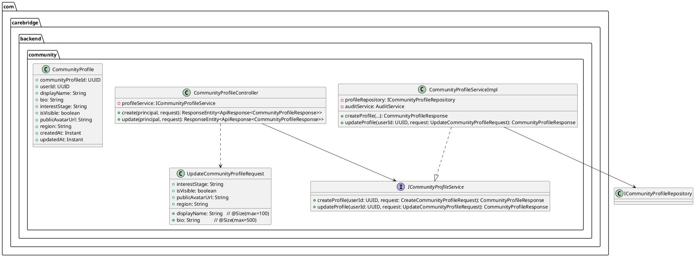
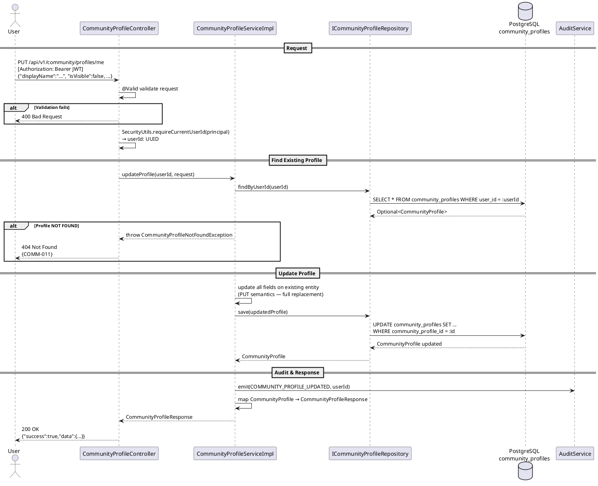

# Technical Design Specification (TDS)
## UC21 — Update Community Profile

| Field | Value |
|---|---|
| **Document ID** | CB-COMMUNITY-IMP-021 |
| **Version** | 1.0 |
| **Date** | 2026-06-26 |
| **Status** | Approved |
| **Document Owner** | PhuongNT |
| **Author** | AI Agent |
| **Based on EDS** | v2.0 |
| **SRS Reference** | SRS 3.1.1.21 |
| **Related UC** | UC21 — Update Community Profile |
| **Depends on** | UC20 — Create Community Profile (profile must exist first) |

---

## CHANGELOG

| Ngày | Người thực hiện | Nội dung thay đổi |
|---|---|---|
| 2026-06-26 | AI Agent | Tạo tài liệu lần đầu cho UC21 Update Community Profile |
| 2026-07-04 | AI Agent | Approved by user — proceeding to implementation |

---

## 1. Tổng Quan (Overview)

### 1.1 Mục Tiêu (Objective)

UC21 cho phép người dùng đã xác thực cập nhật hoặc ẩn hồ sơ cộng đồng của họ. Người dùng có thể thay đổi display name, bio, avatar, interest stage, region, và trạng thái hiển thị. Ẩn profile được thực hiện bằng cách set `is_visible = false` — không xóa dữ liệu.

**SRS 3.1.1.21**: "Update Community Profile — Updates or hides public community profile information."

### 1.2 Bounded Context

- **Domain**: `community`
- **Package root**: `com.carebridge.backend.community`

### 1.3 Phạm Vi (Scope)

| Item | Trạng thái |
|---|---|
| Endpoint PUT /api/v1/community/profiles/me | **MỚI** — cần tạo |
| UpdateCommunityProfileRequest DTO | **MỚI** — cần tạo |
| ICommunityProfileService.updateProfile() | **MỚI** — thêm vào service |
| CommunityProfileServiceImpl.updateProfile() | **MỚI** — implement |
| CommunityProfileController (PUT mapping) | **MỚI** — thêm endpoint |
| DB Table `community_profiles` | **ĐÃ TỒN TẠI** |
| CommunityProfile entity | **ĐÃ TẠO** (UC20) |

### 1.4 Actors

| Actor | Platform | Vai trò |
|---|---|---|
| User (authenticated) | App / Web | Cập nhật profile cộng đồng của chính mình |

---

## 2. Traceability

| Business Rule ID | Nội dung | Ràng buộc triển khai |
|---|---|---|
| BR-COMM-011 | Profile phải tồn tại | `findByUserId(userId)` → 404 COMM-011 nếu không tìm thấy |
| BR-COMM-012 | Ownership — chỉ có thể update profile của chính mình | `userId` từ JWT, không từ URL path hay request body |
| BR-COMM-013 | `display_name` vẫn max 100 chars | `@Size(max=100)` trên `displayName` field |
| BR-COMM-014 | Emit COMMUNITY_PROFILE_UPDATED audit | `AuditService.emit(COMMUNITY_PROFILE_UPDATED, userId)` |

---

## 3. Architectural Decision Records (ADRs)

### ADR-COMM-021-001: Dùng PUT (Full Replacement) thay vì PATCH

**Ngữ cảnh**: PATCH cho phép partial update (chỉ gửi fields cần thay đổi), PUT thay thế toàn bộ resource.

**Quyết định**: Dùng PUT với full replacement semantics.

**Lý do**: Simpler state management — client luôn gửi toàn bộ state mong muốn, server không cần merge logic. Tránh edge cases khi partial update gây ra inconsistent state. Profile fields đủ nhỏ (< 2KB) để gửi toàn bộ không tốn kém.

**Hệ quả**: Client phải gửi tất cả fields — field không gửi sẽ bị set null/default. Cần warning rõ ràng trong API docs về behavior này.

---

### ADR-COMM-021-002: Ẩn Profile = set `is_visible = false`, không xóa

**Ngữ cảnh**: Có thể xóa profile khi user muốn ẩn.

**Quyết định**: Ẩn profile = `is_visible = false`, không DELETE row.

**Lý do**: Tính liên tục của dữ liệu — comment, answer, và các tham chiếu khác trong cộng đồng vẫn giữ nguyên. Cho phép user khôi phục visibility sau. Audit trail không bị mất. Deletion phức tạp hơn nhiều về cascade và foreign key.

**Hệ quả**: Cần filter `is_visible = true` khi hiển thị profile trong feed cộng đồng. GET profile của chính mình vẫn hoạt động kể cả khi `is_visible = false`.

---

## 4. Non-Functional Requirements (NFR)

| NFR | Giá trị | Ghi chú |
|---|---|---|
| Latency P95 | < 300ms | Write operation — find + update |
| Operation type | Write + Audit | Transaction required |
| Idempotency | Idempotent | Cùng request nhiều lần → cùng kết quả |
| PII | `bio` có thể chứa PII | Không log bio |

---

## 5. Static Modeling

### 5.1 Class Diagram



---

## 6. Dynamic Modeling

### 6.1 Sequence Diagram — PUT /api/v1/community/profiles/me



---

## 7. Domain Events

| Event | Published | Trigger |
|---|---|---|
| `COMMUNITY_PROFILE_UPDATED` | Audit log via `AuditService` | Khi profile được cập nhật thành công |

```java
// Audit emission example:
auditService.emit(AuditEventType.COMMUNITY_PROFILE_UPDATED, userId,
    Map.of(
        "communityProfileId", profile.getCommunityProfileId().toString(),
        "isVisible", String.valueOf(request.isVisible())
    ));
```

---

## 8. Interface Definitions

### 8.1 UpdateCommunityProfileRequest DTO

```java
package com.carebridge.backend.community.dto;

import jakarta.validation.constraints.Size;

/**
 * Request DTO cho UC21 — Update Community Profile.
 * PUT semantics: tất cả fields được replace. Field không gửi → null/default.
 * displayName không có @NotBlank vì có thể giữ nguyên giá trị cũ
 * nhưng nếu gửi thì không được blank và không vượt 100 chars.
 */
public class UpdateCommunityProfileRequest {

    @Size(max = 100, message = "Display name must not exceed 100 characters")
    private String displayName;

    @Size(max = 500, message = "Bio must not exceed 500 characters")
    private String bio;

    /** Nullable — giai đoạn thai kỳ */
    private String interestStage;

    /** true = visible trong community, false = ẩn */
    private boolean isVisible;

    @Size(max = 500)
    private String publicAvatarUrl;

    @Size(max = 120)
    private String region;

    // Getters + setters
}
```

### 8.2 Service Interface (Updated)

```java
package com.carebridge.backend.community.service;

import java.util.UUID;

public interface ICommunityProfileService {

    CommunityProfileResponse createProfile(UUID userId, CreateCommunityProfileRequest request);

    /**
     * Cập nhật toàn bộ community profile của userId.
     * Ném CommunityProfileNotFoundException nếu profile chưa tồn tại (404).
     * Ownership được đảm bảo qua userId từ JWT.
     *
     * @param userId  UUID từ JWT Principal
     * @param request Dữ liệu mới — tất cả fields được replace (PUT semantics)
     * @return CommunityProfileResponse profile đã được cập nhật
     */
    CommunityProfileResponse updateProfile(UUID userId, UpdateCommunityProfileRequest request);
}
```

### 8.3 Service Implementation — updateProfile

```java
@Override
@Transactional
public CommunityProfileResponse updateProfile(UUID userId,
                                               UpdateCommunityProfileRequest request) {
    CommunityProfile profile = profileRepository.findByUserId(userId)
        .orElseThrow(() -> new CommunityProfileNotFoundException(
            "Community profile not found for user: " + userId));

    // PUT semantics — replace all fields
    profile.setDisplayName(request.getDisplayName());
    profile.setBio(request.getBio());
    profile.setInterestStage(request.getInterestStage());
    profile.setVisible(request.isVisible());
    profile.setPublicAvatarUrl(request.getPublicAvatarUrl());
    profile.setRegion(request.getRegion());
    profile.setUpdatedAt(Instant.now());

    CommunityProfile saved = profileRepository.save(profile);
    auditService.emit(AuditEventType.COMMUNITY_PROFILE_UPDATED, userId);

    return toResponse(saved);
}
```

### 8.4 Controller — PUT Endpoint

```java
@PutMapping("/me")
public ResponseEntity<ApiResponse<CommunityProfileResponse>> update(
        Principal principal,
        @Valid @RequestBody UpdateCommunityProfileRequest request) {

    UUID userId = SecurityUtils.requireCurrentUserId(principal);
    CommunityProfileResponse response = profileService.updateProfile(userId, request);
    return ResponseEntity.ok(ApiResponse.success(response));
}
```

---

## 9. API Specification

### 9.1 Endpoint

| Property | Value |
|---|---|
| **Method** | `PUT` |
| **Path** | `/api/v1/community/profiles/me` |
| **Auth** | Bearer JWT (required) |
| **Content-Type** | `application/json` |
| **Response** | `200 OK` với `ApiResponse<CommunityProfileResponse>` |

### 9.2 Request Body — Update Display Name

```json
{
  "displayName": "MẹBầuUpdated",
  "bio": "Đã cập nhật bio",
  "interestStage": "POSTPARTUM",
  "isVisible": true,
  "publicAvatarUrl": "https://storage.carebridge.vn/avatars/user-20-new.jpg",
  "region": "TP. Hồ Chí Minh"
}
```

### 9.3 Request Body — Hide Profile

```json
{
  "displayName": "MẹBầuHạnhPhúc",
  "bio": "Mẹ bầu 26 tuần",
  "interestStage": "PREGNANCY",
  "isVisible": false,
  "publicAvatarUrl": "https://storage.carebridge.vn/avatars/user-20.jpg",
  "region": "Hà Nội, Việt Nam"
}
```

### 9.4 Response — 200 OK

```json
{
  "success": true,
  "message": "Community profile updated successfully",
  "data": {
    "communityProfileId": "a1b2c3d4-e5f6-7890-abcd-ef1234567890",
    "userId": "00000000-0000-0000-0000-000000000020",
    "displayName": "MẹBầuUpdated",
    "bio": "Đã cập nhật bio",
    "interestStage": "POSTPARTUM",
    "isVisible": true,
    "publicAvatarUrl": "https://storage.carebridge.vn/avatars/user-20-new.jpg",
    "region": "TP. Hồ Chí Minh",
    "createdAt": "2026-06-26T10:00:00Z"
  }
}
```

---

## 10. Error Codes

| Error Code | HTTP Status | Điều kiện | Response |
|---|---|---|---|
| `COMM-011` | 404 Not Found | Profile không tồn tại cho userId | `{"success":false,"code":"COMM-011","message":"Community profile not found"}` |
| `COMM-012` | 400 Bad Request | `displayName` vượt 100 chars hoặc blank | `{"success":false,"code":"COMM-012","message":"Display name must not exceed 100 characters"}` |
| `IAM-001` | 401 Unauthorized | Không có JWT | `{"success":false,"code":"IAM-001","message":"Authentication required"}` |

---

## 11. Implementation Plan

### 11.1 Files Cần Thay Đổi

```
com.carebridge.backend.community/
├── dto/
│   └── UpdateCommunityProfileRequest.java   (MỚI)
├── service/
│   ├── ICommunityProfileService.java         (THÊM updateProfile method)
│   └── impl/
│       └── CommunityProfileServiceImpl.java  (THÊM updateProfile impl)
├── controller/
│   └── CommunityProfileController.java       (THÊM @PutMapping("/me"))
└── exception/
    └── CommunityProfileNotFoundException.java (MỚI)
```

### 11.2 Exception

```java
@ResponseStatus(HttpStatus.NOT_FOUND)
public class CommunityProfileNotFoundException extends RuntimeException {
    public CommunityProfileNotFoundException(String message) {
        super(message);
    }
}
```

---

## 12. Rollback Plan

| Scenario | Action |
|---|---|
| Bug sau deploy | `git revert <commit-hash>` và redeploy |
| Data bị corrupt | Restore từ backup hoặc manual SQL correction |
| DB | Không có migration mới — chỉ code changes |

---

## 13. Test Scenarios Summary

| TC ID | Loại | Mô tả | Kết quả mong đợi |
|---|---|---|---|
| COMM-TC-021-001 | Unit | Update displayName → 200 | 200 với updated profile |
| COMM-TC-021-002 | Unit | Hide profile (isVisible=false) → 200 | 200, is_visible=false |
| COMM-TC-021-003 | Unit | Profile chưa tồn tại → 404 | 404 COMM-011 |
| COMM-TC-021-004 | Unit | Không có JWT → 401 | 401 IAM-001 |
| COMM-TC-021-INT-001 | Integration | DB updated_at thay đổi | updated_at > created_at |

---

## 14. Verification

### 14.1 SQL Verification

```sql
-- Xác minh updated_at thay đổi sau update
SELECT created_at, updated_at
FROM community_profiles
WHERE user_id = '<test-user-uuid>';
-- Expected: updated_at > created_at

-- Xác minh is_visible sau khi hide
SELECT is_visible FROM community_profiles WHERE user_id = '<test-user-uuid>';
-- Expected: false (sau khi hide)

-- Xác minh profile vẫn còn tồn tại sau khi hide (không bị xóa)
SELECT COUNT(*) FROM community_profiles WHERE user_id = '<test-user-uuid>';
-- Expected: 1 (không phải 0)
```

### 14.2 Acceptance Criteria

- [ ] PUT `/api/v1/community/profiles/me` với valid data → 200 với updated profile
- [ ] `is_visible = false` sau khi hide → profile vẫn còn trong DB
- [ ] `updated_at` thay đổi sau mỗi update
- [ ] Profile không tồn tại → 404 COMM-011
- [ ] No JWT → 401
- [ ] `userId` luôn từ JWT, không từ URL

---

## 15. API Samples

### 15.1 cURL — Update Display Name

```bash
curl -X PUT "https://api.carebridge.vn/api/v1/community/profiles/me" \
  -H "Authorization: Bearer <JWT_TOKEN>" \
  -H "Content-Type: application/json" \
  -d '{
    "displayName": "MẹBầuUpdated",
    "bio": "Đã cập nhật bio",
    "interestStage": "POSTPARTUM",
    "isVisible": true
  }'
```

### 15.2 cURL — Hide Profile

```bash
curl -X PUT "https://api.carebridge.vn/api/v1/community/profiles/me" \
  -H "Authorization: Bearer <JWT_TOKEN>" \
  -H "Content-Type: application/json" \
  -d '{
    "displayName": "MẹBầuHạnhPhúc",
    "isVisible": false
  }'
# Response: 200 với is_visible: false
```

### 15.3 cURL — Profile Not Found

```bash
curl -X PUT "https://api.carebridge.vn/api/v1/community/profiles/me" \
  -H "Authorization: Bearer <JWT_OF_USER_WITHOUT_PROFILE>" \
  -H "Content-Type: application/json" \
  -d '{"displayName": "Test"}'
# Response: 404 {"code":"COMM-011",...}
```

---

## 16. Authorization Matrix

| Role | Access | Ghi chú |
|---|---|---|
| Profile owner (any authenticated role) | ✅ Allowed | Chỉ update profile của chính mình |
| GUEST (no JWT) | ❌ Denied | 401 IAM-001 |
| Update profile của user khác | ❌ Denied | userId luôn từ JWT, không có path variable userId |
| ADMIN | ✅ Allowed | Chỉ update profile của chính ADMIN (không thể update của user khác qua endpoint này) |

---

## 17. CASE 2.0 Critical Constraints

| Constraint ID | Mô tả | Cách kiểm tra |
|---|---|---|
| C1 | Check profile tồn tại trước khi update — `findByUserId(userId)` → 404 nếu absent | Unit test COMM-TC-021-003 |
| C2 | Ownership qua JWT — userId từ `SecurityUtils.requireCurrentUserId()`, không từ URL hay body | Inspect controller: không có `@PathVariable userId` |
| C3 | Emit audit event `COMMUNITY_PROFILE_UPDATED` | Verify `auditService.emit()` call trong unit test |
| C4 | Ẩn profile = set `is_visible = false`, KHÔNG xóa row | Unit test COMM-TC-021-002 + SQL verify COUNT=1 sau hide |

---

*End of UC21 TDS — CB-COMMUNITY-IMP-021 v1.0*
