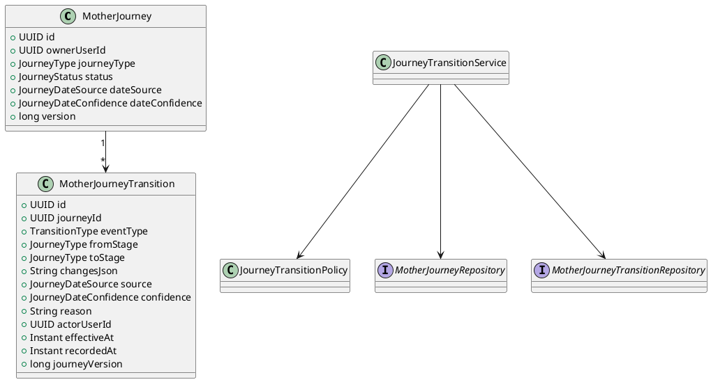
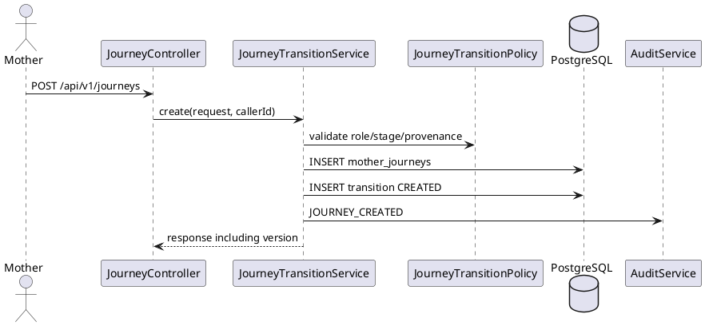
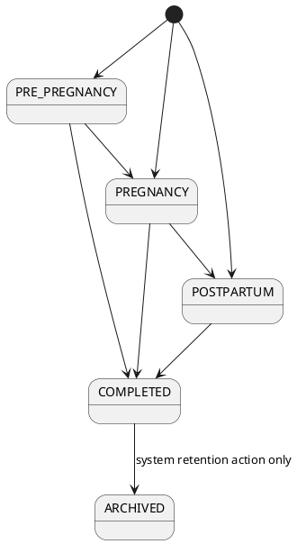

# TECHNICAL DESIGN SPECIFICATION
# UC22 — Canonical Mother Lifecycle and Transition History

| Field | Value |
| --- | --- |
| **Document ID** | `CB-JOURNEY-IMP-006-01` |
| **Version** | `1.0` |
| **Date** | `2026-07-18` |
| **Status** | `Implemented — Done (Story gate)` |
| **Document Owner** | `Open — Product/Engineering owner not named` |
| **Author** | `Codex — Technical Specification Support` |
| **Reviewed by** | `User approval recorded in Codex session` |
| **DPO Sign-off** | `[ ] Pending — health-context metadata is Sensitive-PII` |
| **Approved by** | `User — Project Approver` |
| **Last Review** | `2026-07-18` |
| **Based on EDS** | `v2.0` |

---

## CHANGELOG

| Date | Author | Change |
| --- | --- | --- |
| 2026-07-18 | Codex — Technical Specification Support | Initial Story 6.1 design derived from approved Epic 6 and brownfield evidence. |
| 2026-07-18 | User — Project Approver | Approved Story 6.1 TDS and proposed ADR-JOURNEY-006-01..03. |
| 2026-07-18 | Codex — Implementation Support | Implemented the canonical lifecycle migration, transition policy/history, concurrency controls, API changes, and test evidence; moved Story 6.1 to review. |
| 2026-07-18 | Codex — Mobile Gap-Fix Support | Added the downstream Flutter integration for canonical routing, provenance, PRE transition, BABY_CARE boundary, history display, and accessibility regression coverage. |
| 2026-07-18 | Codex — Review Remediation | Closed all 21 approved review patches, added paginated history and database immutability enforcement, and verified backend/mobile quality gates. |

---

## TABLE OF CONTENTS

1. Module Overview
2. Traceability Matrix
3. Architecture Decision Records
4. Non-Functional Requirements & SLA
5. Static Modeling
6. Dynamic Modeling
7. Domain Event Catalog
8. Interface Specification
9. API Specification
10. Error Codes
11. Implementation Procedure
12. Rollback & Incident Runbook
13. Detailed Test Scenarios
14. Verification Methods
15. API Verification Samples
16. Authorization Matrix
17. AI Prompt Constraints

---

## 1. Module Overview

| Field | Value |
| --- | --- |
| **Function identity** | Story 6.1 — Establish Canonical Mother Lifecycle and Transition History |
| **Primary UC** | Legacy/current implementation: `UC-22 Create Mother Journey` |
| **Secondary UC** | Legacy/current implementation: `UC-23 Update Mother Journey` |
| **Approved aliases** | 121-UC scope: `UC-19 Initialize Mother Care Journey`, `UC-20 Update Mother Journey Stage and Dates` |
| **Module Name** | Canonical Mother Lifecycle |
| **Bounded Context** | `journey` |
| **Primary Actor** | Mother |
| **Trigger** | Mother creates a journey or saves an allowed stage/date change. |
| **User outcome** | One authoritative current mother lifecycle with auditable stage/date history. |
| **Platforms** | Backend API and PostgreSQL. Mobile is a downstream consumer; UI changes are outside Story 6.1. |
| **Priority** | P0 lifecycle-integrity foundation |
| **Data Classification** | Sensitive-PII |
| **Compliance Scope** | Project privacy, consent, ownership, minimum-necessary access, and immutable audit rules. No external statutory claim is introduced by this TDS. |
| **Upstream Dependencies** | JWT identity, `users`, `AuditService`, Flyway/PostgreSQL |
| **Downstream Consumers** | Mother dashboard, postpartum logs, baby linkage, reminders, health records, checklist/content, safety timeline |

### 1.1 Scope

In scope:

- Enforce at most one canonical ACTIVE mother lifecycle per owner.
- Preserve append-only history for create, stage, date/provenance, and status changes.
- Detect concurrent updates and return a stable conflict.
- Preserve ownership and Mother-role controls.
- Add current date provenance/confidence and entity version.
- Keep existing POST/PUT routes compatible at the transport level.

Out of scope:

- Baseline/consent onboarding UI (Story 6.2).
- Pregnancy outcome/loss semantics (Story 6.3).
- Direct postpartum mobile entry (Story 6.4).
- Baby-link validation (Story 6.5).
- Safety orchestration and timeline projection (Stories 6.6–6.7).
- Global UC renumbering (Story 6.10).

### 1.2 Current State

- `mother_journeys` stores only the latest stage/dates/status.
- Duplicate prevention is scoped to owner + journey type + ACTIVE, allowing multiple ACTIVE journey types.
- Dashboard selects the newest ACTIVE row.
- Updates overwrite values without a transition/history record.
- No database unique constraint protects concurrent creation.
- `BABY_CARE` is used by current mobile behavior but is not an OV-01 mother lifecycle stage.

### 1.3 Target State

- One ACTIVE row among `PRE_PREGNANCY`, `PREGNANCY`, and `POSTPARTUM` per owner.
- `BABY_CARE` remains readable as a temporary legacy compatibility value and is excluded from the canonical unique predicate until Stories 6.4/6.5 remove the dependency.
- Every accepted mutation writes one immutable `mother_journey_transitions` record in the same transaction.
- JPA optimistic versioning rejects lost updates.
- Dashboard queries the canonical ACTIVE lifecycle directly, not “latest ACTIVE”.

---

## 2. Traceability Matrix

| Requirement | Type | Required behavior | Planned component | Test conditions |
| --- | --- | --- | --- | --- |
| `FR43` | PRD | One canonical current lifecycle and stage/date history | DB partial unique index, `JourneyTransitionService`, history repository | `JRN-COND-001..008` |
| Story 6.1 AC1 | Story AC | At most one canonical lifecycle | Migration constraint, create policy | `JRN-COND-001`, `JRN-COND-002` |
| Story 6.1 AC2 | Story AC | Explicit transition policy | `JourneyTransitionPolicy` | `JRN-COND-003`, `JRN-COND-004` |
| Story 6.1 AC3 | Story AC | Record actor/source/reason/previous/new/effective time | `MotherJourneyTransition` | `JRN-COND-005` |
| Story 6.1 AC4 | Story AC | Forward-only migration; preserve current data | new Flyway migration and preflight | `JRN-COND-006` |
| Story 6.1 AC5 | Story AC | Concurrency and ownership tests | `@Version`, DB index, service ownership check | `JRN-COND-002`, `JRN-COND-007` |
| `BR-OWNERSHIP` | Business rule | Journey data private by default | service ownership policy | `JRN-COND-007` |
| `BR-JOURNEY-01` | Business rule | Dates are supportive, not diagnosis | DTO/API wording; no clinical inference | `JRN-COND-008` |
| `BR-JOURNEY-02` | Business rule | Refresh stage-dependent data after valid change | transition event for consumers | `JRN-COND-005` |
| `BR-HEALTH-BOUNDARY` | Business rule | No diagnosis/prescription | API contains factual lifecycle state only | `JRN-COND-008` |

Traceability decision: UC22/UC23 remain the implementation identifiers because current SRS, code comments, tests, and legacy Function artifacts use them. UC19/UC20 are recorded as approved aliases; renumbering is deferred to Story 6.10.

---

## 3. Architecture Decision Records

### ADR-JOURNEY-006-01 — Canonical lifecycle is one mutable current row plus append-only history

| Field | Value |
| --- | --- |
| **Status** | `Accepted` |
| **Deciders** | User — Project Approver |
| **Date** | 2026-07-18 |
| **Supersedes** | Legacy “one ACTIVE journey per type” behavior |

#### Context

Separate independently active stage rows let downstream modules disagree about the current lifecycle. History is still required when the current row changes.

#### Options Considered

| Option | Benefits | Trade-offs |
| --- | --- | --- |
| A. One current row + append-only transitions | Small brownfield change; fast current reads; complete audit trail | Current row remains mutable; history must be transactionally coupled |
| B. Append-only lifecycle versions with a current pointer | Pure temporal model | Larger rewrite across all journey foreign keys and consumers |

#### Decision

Choose Option A. `mother_journeys` owns current state; `mother_journey_transitions` owns immutable history.

#### Consequences

- Every service mutation must persist current state and history in one transaction.
- Direct repository saves outside the orchestration service are prohibited.
- History rows never update or delete.

### ADR-JOURNEY-006-02 — Enforce lifecycle concurrency in database and JPA

| Field | Value |
| --- | --- |
| **Status** | `Accepted` |
| **Deciders** | User — Project Approver |
| **Date** | 2026-07-18 |

#### Decision

- PostgreSQL partial unique index prevents concurrent canonical ACTIVE creation.
- `@Version` on `MotherJourney.version` prevents lost updates.
- Optimistic lock and unique violations map to explicit HTTP 409 codes.

### ADR-JOURNEY-006-03 — Keep BABY_CARE as a legacy compatibility exception

| Field | Value |
| --- | --- |
| **Status** | `Accepted` |
| **Deciders** | User — Project Approver |
| **Date** | 2026-07-18 |

#### Decision

The canonical index covers `PRE_PREGNANCY`, `PREGNANCY`, and `POSTPARTUM`. `BABY_CARE` remains readable and outside the predicate until Stories 6.4/6.5 migrate current mobile behavior. New lifecycle services must not treat it as a mother recovery stage.

---

## 4. Non-Functional Requirements & SLA

### 4.1 Performance & Availability

No approved journey-specific latency, availability, or throughput SLA exists. This is an open product/operations decision and must not be invented. Verification will compare query plans and latency against the current journey endpoints in the same environment.

### 4.2 Data Integrity & Retention

| Requirement | Target | Verification |
| --- | --- | --- |
| Canonical active lifecycle | 0 or 1 canonical ACTIVE row per owner | PostgreSQL constraint and concurrency test |
| Mutation/history atomicity | 100%: both commit or both roll back | transaction integration tests |
| History immutability | No application update/delete methods | repository/API review and DB tests |
| Existing-data preservation | No automatic archive/delete during migration | preflight failure on duplicate owners |
| Retention | Open; inherit approved health/audit retention when established | DPO review required |

### 4.3 Security

- JWT authentication required for all routes.
- Only the owner with Mother role may create/update.
- Actor identity comes from the security context, never request JSON.
- History payload excludes notes and unrelated health data.
- Logs include identifiers/error codes but not date values or notes.

### 4.4 Scalability & Capacity Planning

No approved 12-month capacity target exists. Required indexes are owner/status on current state and journey/version plus journey/recorded-time on history.

---

## 5. Static Modeling

### 5.1 Class Diagram



### 5.2 Data Structure and Migration

Create a forward migration such as:

`05_Development/CareBridgeAPI/src/main/resources/db/migration/V20260718090000__canonical_mother_lifecycle_history.sql`

Required delta:

```sql
ALTER TABLE public.mother_journeys
    ADD COLUMN version bigint NOT NULL DEFAULT 0,
    ADD COLUMN date_source varchar(30),
    ADD COLUMN date_confidence varchar(20);

DO $$
BEGIN
  IF EXISTS (
    SELECT owner_user_id
    FROM public.mother_journeys
    WHERE status = 'ACTIVE'
      AND journey_type IN ('PRE_PREGNANCY', 'PREGNANCY', 'POSTPARTUM')
    GROUP BY owner_user_id
    HAVING count(*) > 1
  ) THEN
    RAISE EXCEPTION 'Canonical journey migration blocked: duplicate ACTIVE lifecycle rows';
  END IF;
END $$;

CREATE UNIQUE INDEX uq_mother_journeys_one_canonical_active
ON public.mother_journeys(owner_user_id)
WHERE status = 'ACTIVE'
  AND journey_type IN ('PRE_PREGNANCY', 'PREGNANCY', 'POSTPARTUM');

CREATE TABLE public.mother_journey_transitions (
    transition_id uuid PRIMARY KEY DEFAULT gen_random_uuid(),
    journey_id uuid NOT NULL REFERENCES public.mother_journeys(journey_id),
    event_type varchar(30) NOT NULL,
    from_stage varchar(20),
    to_stage varchar(20),
    changes_json jsonb NOT NULL DEFAULT '{}'::jsonb,
    source varchar(30) NOT NULL,
    confidence varchar(20),
    reason varchar(500),
    actor_user_id uuid REFERENCES public.users(user_id),
    effective_at timestamptz NOT NULL,
    recorded_at timestamptz NOT NULL DEFAULT now(),
    journey_version bigint NOT NULL,
    CONSTRAINT uq_mother_journey_transition_version UNIQUE (journey_id, journey_version)
);

CREATE INDEX idx_mother_journey_transitions_journey_time
ON public.mother_journey_transitions(journey_id, recorded_at DESC);
```

Allowed values must be enforced by Java enums and matching database CHECK constraints:

- event type: `CREATED`, `STAGE_CHANGED`, `DATES_CHANGED`, `DETAILS_CHANGED`, `STATUS_CHANGED`, `MIGRATED`
- source: `SELF_REPORTED`, `CLINICIAN_CONFIRMED`, `ULTRASOUND`, `SYSTEM_DERIVED`, `MIGRATION`, `UNKNOWN`
- confidence: `CONFIRMED`, `ESTIMATED`, `UNKNOWN`

`changes_json` contains only changed field names with `{previous,new}` values. It must not contain notes, tokens, contact data, or unrelated health metrics.

#### Existing-data migration

- Backfill one `MIGRATED` transition per existing canonical journey at version 0.
- Use `actor_user_id = NULL`, `source = MIGRATION`, `effective_at = created_at`.
- Abort rather than automatically archive when duplicate canonical ACTIVE rows exist.
- Product/operations must reconcile duplicates before retrying migration.

#### Append-only enforcement delta

`V20260718091000__enforce_mother_journey_transition_immutability.sql` adds `DETAILS_CHANGED` to the event constraint and installs a PostgreSQL trigger that rejects transition UPDATE/DELETE operations. A transaction-local maintenance flag is reserved for controlled migration/test cleanup; the application repository exposes insert and paginated read operations only.

#### V1 baseline synchronization

The workflow requires an explicit baseline sync decision. Directly editing applied `V1__init_schema.sql` is superseded by the repository critical rule “never edit an applied migration.” Therefore:

- deployed/fresh databases receive the delta through the new forward migration;
- `V1__init_schema.sql` remains unchanged;
- any future consolidated baseline must incorporate these columns/table/indexes only through an explicitly approved baseline-regeneration process.

---

## 6. Dynamic Modeling

### 6.1 Create Happy Path



### 6.2 Conflict Path

Two concurrent creates may both pass an application pre-check. The partial unique index is authoritative; one commits and the other maps to `JOURNEY-015` without a history row.

### 6.3 State Machine



Story 6.1 does not define pregnancy outcome semantics. `PREGNANCY -> POSTPARTUM` remains disabled until Story 6.3 supplies an approved outcome contract; the diagram shows the intended dependency, not an immediately enabled transition.

### 6.4 Invariants

1. At most one canonical ACTIVE lifecycle per owner.
2. Current mutation and history append are atomic.
3. History is append-only.
4. Actor is security-context derived.
5. Only ACTIVE journeys can change.
6. Stale concurrent writes fail with 409.
7. `BABY_CARE` cannot be interpreted as canonical maternal recovery state.

---

## 7. Domain Event Catalog

### 7.1 Events Published

| Event | Trigger | Publisher | Consumers | Async |
| --- | --- | --- | --- | --- |
| `MotherJourneyCreated` | current row + CREATED history committed | Journey service | dashboard/content refresh consumers | Spring after-commit |
| `MotherJourneyTransitioned` | accepted stage/date/status mutation | Journey service | dashboard/reminder/checklist consumers | Spring after-commit |

Payload contains event ID, journey ID, owner ID, event type, resulting stage/status, journey version, occurred time, and correlation ID. It excludes notes and raw date-history JSON.

### 7.2 Events Consumed

None in Story 6.1.

---

## 8. Interface Specification

### 8.1 Service Interfaces

Planned paths:

- `journey/service/IJourneyTransitionService.java`
- `journey/service/impl/JourneyTransitionServiceImpl.java`
- `journey/policy/JourneyTransitionPolicy.java`
- `journey/entity/MotherJourneyTransition.java`
- `journey/repository/MotherJourneyTransitionRepository.java`

```java
public interface IJourneyTransitionService {
    CreateJourneyResponse createJourney(CreateJourneyRequest request, UUID callerId);
    JourneyResponse updateJourney(UUID ownerId, UUID journeyId, UpdateJourneyRequest request);
    List<JourneyTransitionResponse> getHistory(UUID ownerId, UUID journeyId);
}
```

`JourneyServiceImpl` may delegate create/update to this service. Controllers remain transport-only.

### 8.2 Repository Interfaces

`MotherJourneyRepository` adds:

- `Optional<MotherJourney> findByOwnerUserIdAndStatusAndJourneyTypeIn(...)`
- no “latest ACTIVE” selection for canonical dashboard behavior

`MotherJourneyTransitionRepository` supports insert and owner-scoped paginated read only. No application update/delete method is exposed.

---

## 9. API Specification

### 9.1 Endpoints

| Method | Path | Auth | Role | Idempotent |
| --- | --- | --- | --- | --- |
| POST | `/api/v1/journeys` | JWT | MOTHER | No; duplicate canonical create returns 409 |
| PUT | `/api/v1/journeys/{journeyId}` | JWT | MOTHER owner | No; optimistic conflicts return 409 |
| GET | `/api/v1/journeys/{journeyId}/history?page=0&size=20` | JWT | MOTHER owner | Yes |
| GET | `/api/v1/journeys/me/dashboard` | JWT | MOTHER | Yes |

No journey-specific rate limit is approved; authenticated platform defaults apply.

### 9.2 Request/Response Changes

Create/update requests add optional provenance fields when no date changes are present and require them when a date changes:

```json
{
  "journeyType": "PREGNANCY",
  "lastMenstrualDate": "2026-06-01",
  "dateSource": "SELF_REPORTED",
  "dateConfidence": "ESTIMATED",
  "changeReason": "INITIAL_SETUP",
  "effectiveAt": "2026-07-18T03:00:00Z"
}
```

Responses add:

```json
{
  "journeyId": "uuid",
  "journeyType": "PREGNANCY",
  "status": "ACTIVE",
  "version": 0,
  "dateSource": "SELF_REPORTED",
  "dateConfidence": "ESTIMATED"
}
```

History responses are paginated and omit notes:

```json
{
  "items": [{
    "transitionId": "uuid",
    "eventType": "DATES_CHANGED",
    "fromStage": "PRE_PREGNANCY",
    "toStage": "PREGNANCY",
    "changedFields": ["journeyType", "lastMenstrualDate", "estimatedDueDate"],
    "source": "SELF_REPORTED",
    "confidence": "ESTIMATED",
    "reason": "PREGNANCY_CONFIRMED",
    "effectiveAt": "2026-07-18T03:00:00Z",
    "recordedAt": "2026-07-18T03:00:01Z",
    "journeyVersion": 1
  }],
  "page": 0,
  "size": 20,
  "totalElements": 1,
  "totalPages": 1
}
```

Compatibility:

- Existing request fields and paths remain.
- New response fields are additive.
- Existing callers that omit provenance may update notes only; any changed date requires provenance.
- Existing `BABY_CARE` records remain readable during the compatibility window.

---

## 10. Error Codes

| Code | HTTP | EN message | VI message | Trigger |
| --- | --- | --- | --- | --- |
| `JOURNEY-001` | 404 | User not found | Không tìm thấy người dùng | caller missing |
| `JOURNEY-003` | 403 | Mother role required | Yêu cầu vai trò Mother | wrong role |
| `JOURNEY-010` | 404 | Journey not found | Không tìm thấy hành trình | ID missing |
| `JOURNEY-011` | 403 | Access denied | Không có quyền truy cập | non-owner |
| `JOURNEY-012` | 400 | Journey is not active | Hành trình không còn hoạt động | mutation of terminal row |
| `JOURNEY-013` | 400 | Delivery date is required | Cần ngày sinh | completion without delivery date |
| `JOURNEY-014` | 400 | ARCHIVED can only be set by the system | Chỉ hệ thống được lưu trữ hành trình | client requests ARCHIVED |
| `JOURNEY-015` | 409 | An active mother lifecycle already exists | Đã tồn tại hành trình mẹ đang hoạt động | canonical unique conflict |
| `JOURNEY-016` | 409 | Invalid lifecycle transition | Chuyển giai đoạn không hợp lệ | transition policy rejection |
| `JOURNEY-017` | 409 | Journey was modified concurrently | Hành trình đã được cập nhật đồng thời | optimistic lock conflict |
| `JOURNEY-018` | 400 | Date source and confidence are required | Cần nguồn và độ tin cậy của ngày | date changed without provenance |
| `JOURNEY-019` | 400 | effectiveAt cannot be more than five minutes in the future | Thời điểm hiệu lực vượt giới hạn tương lai | client time is beyond server + 5 minutes |
| `JOURNEY-020` | 400 | Journey update does not contain a meaningful change | Cập nhật không có thay đổi thực tế | semantic no-op |
| `JOURNEY-021` | 400 | Unsupported journey status | Trạng thái hành trình không được hỗ trợ | unknown status value |

Legacy `JOURNEY-002` remains mapped to `JOURNEY-015` during compatibility and is removed only after clients/tests are migrated.

---

## 11. Implementation Procedure

### 11.1 Prerequisites

- [x] TDS and Test-Spec approved by the project approver.
- [ ] DPO/privacy review completed.
- [ ] Duplicate-active preflight query executed in the target environment. The real migration succeeds and fails safely against isolated PostgreSQL fixtures; deployment-target execution remains pending.
- [x] Story 6.1 test stubs demonstrate RED; evidence is retained under `06_Testing/TestResults/epic-6/story-6-1/`.

### 11.2 Ordered Steps

1. Add migration and preflight failure.
2. Add enums, `MotherJourneyTransition`, version/provenance fields, repositories.
3. Add transition policy and orchestration service.
4. Delegate existing create/update service methods.
5. Add history endpoint and additive response fields.
6. Change dashboard repository query to canonical ACTIVE.
7. Add after-commit domain events.
8. Run targeted and full backend tests.
9. Deploy migration before compatible application release.

### 11.3 Implementation Verification

| Gate | Result | Evidence |
| --- | --- | --- |
| Story 6.1 review suite | PASS — 45/45 | JaCoCo review run covering service, controller, PostgreSQL/Flyway integration, dashboard, delegation, and audit policy |
| Changed service/policy coverage | PASS — 90.83% line; 60.53% branch | `06_Testing/TestResults/epic-6/story-6-1/backend-coverage-2026-07-18.md` |
| Backend package | PASS | Maven `-DskipTests package` run on 2026-07-18 |
| Full backend suite | WAIVED FOR STORY ONLY — 2238 run, 1 failure, 109 errors, 1 skipped | No Journey failure; controlled disposition in `backend-baseline-waiver-2026-07-18.md` |
| Target database preflight/deployment | PENDING | Isolated PostgreSQL Flyway migration and duplicate-abort tests pass; target environment has not been mutated |

#### Downstream mobile gap-fix addendum — 2026-07-18

The original Story 6.1 backend/database scope remains unchanged. With project approval, the downstream Flutter consumer was updated in the same review cycle to remove the mobile gaps found by manual testing:

- route an existing Mother with no lifecycle through the journey landing gate;
- send `dateSource`, `dateConfidence`, `changeReason`, and `effectiveAt` for create/update;
- transition `PRE_PREGNANCY` through the canonical update route;
- route baby-care onboarding to baby profile creation without creating `BABY_CARE`;
- consume and render canonical transition history with user-facing reason labels;
- preserve readability at 150% text scale and expose an accessible back control.

Verification after review remediation: 15/15 targeted mobile behavior tests, 187/187 full Flutter tests, clean targeted analysis, debug APK build/install, and device smoke evidence under `06_Testing/TestResults/epic-6/story-6-1/mobile-fix-verification-2026-07-18/`.

### 11.4 Deployment Checklist

- [ ] No duplicate canonical ACTIVE owners.
- [ ] Migration and backfill complete.
- [ ] Unique index exists and is valid.
- [ ] Existing journey endpoints return compatible responses.
- [ ] No `JOURNEY-015/017` spike beyond expected conflict traffic.

---

## 12. Rollback & Incident Runbook

Forward migration is not automatically rolled back in production. If application behavior fails but schema is healthy, roll back the application while leaving additive columns/table/index in place.

Trigger incident handling for:

- any owner with more than one canonical ACTIVE row;
- a current-state mutation without matching history;
- history containing notes or unrelated PII;
- elevated 409 conflicts caused by implementation defects.

The unique index must not be dropped merely to restore traffic. Database rollback requires Tech Lead and privacy/data-owner approval plus reconciliation evidence.

---

## 13. Detailed Test Scenarios

Detailed executable contracts live in the companion Test-Spec.

| Scenario | Condition |
| --- | --- |
| create first canonical journey | `JRN-COND-001` |
| sequential/concurrent duplicate create | `JRN-COND-002` |
| valid and invalid stage transitions | `JRN-COND-003..004` |
| atomic history and audit | `JRN-COND-005` |
| migration/backfill/preflight | `JRN-COND-006` |
| ownership and authentication | `JRN-COND-007` |
| provenance and minimum-necessary data | `JRN-COND-008` |

Test data classification is SYNTHETIC only.

---

## 14. Verification Methods

- PostgreSQL catalog inspection for columns, CHECK/FK/unique/index definitions.
- Repository integration tests against PostgreSQL behavior.
- Service unit tests for transition and ownership policy.
- MockMvc tests for auth, contract, and errors.
- Transaction test proving rollback removes both current mutation and transition.
- Log scan proving no notes/date values are emitted.

Commands:

```powershell
cd 05_Development/CareBridgeAPI
.\mvnw.cmd -Dtest="Journey*Test" test
.\mvnw.cmd test
.\mvnw.cmd clean package
```

---

## 15. API Verification Samples

```bash
curl -X POST https://HOST/api/v1/journeys \
  -H "Authorization: Bearer TOKEN" \
  -H "Content-Type: application/json" \
  -d '{"journeyType":"PREGNANCY","lastMenstrualDate":"2026-06-01","dateSource":"SELF_REPORTED","dateConfidence":"ESTIMATED","changeReason":"INITIAL_SETUP"}'
```

Expected: 201 with `version: 0`; one current row and one CREATED transition.

```bash
curl https://HOST/api/v1/journeys/JOURNEY_ID/history?page=0&size=20 \
  -H "Authorization: Bearer TOKEN"
```

Expected: 200 for owner; 403 for a different authenticated owner; 401 without JWT.

---

## 16. Authorization Matrix

| Endpoint | Guest | Mother owner | Mother non-owner | Expert | Admin/System |
| --- | --- | --- | --- | --- | --- |
| POST `/journeys` | 401 | Allowed | N/A | 403 | Not through user endpoint |
| PUT `/journeys/{id}` | 401 | Allowed | 403 | 403 | Not through user endpoint |
| GET `/journeys/{id}/history` | 401 | Allowed | 403 | 403 | Separate audited admin capability required |
| GET `/journeys/me/dashboard` | 401 | Allowed | N/A | 403 | Not through user endpoint |

---

## 17. AI Prompt Constraints

### 17.1 Constraint Summary

| ID | Constraint | Source | Verified |
| --- | --- | --- | --- |
| C1 | Enforce one canonical ACTIVE PRE_PREGNANCY/PREGNANCY/POSTPARTUM row per owner with a PostgreSQL partial unique index. | ADR-JOURNEY-006-02 | 2026-07-18 |
| C2 | Persist current mutation and one append-only transition in the same transaction. | ADR-JOURNEY-006-01 | 2026-07-18 |
| C3 | Derive actor/owner from JWT context; never trust request ownership fields. | BR-OWNERSHIP | 2026-07-18 |
| C4 | Use `@Version` and map optimistic conflicts to `JOURNEY-017`; do not implement silent last-write-wins. | ADR-JOURNEY-006-02 | 2026-07-18 |
| C5 | Do not edit applied `V1__init_schema.sql`; implement schema changes in a forward migration. | Project context | 2026-07-18 |
| C6 | Keep `BABY_CARE` readable but outside canonical lifecycle until Stories 6.4/6.5. | ADR-JOURNEY-006-03 | 2026-07-18 |

### 17.2 Constraint Injection Block

```text
[CONSTRAINT BLOCK — Canonical Mother Lifecycle]
Implement only the contracts in CB-JOURNEY-IMP-006-01:
1. One canonical ACTIVE maternal lifecycle is database-enforced.
2. Every accepted mutation and its immutable transition commit atomically.
3. Actor and owner come from authenticated context.
4. Concurrent writes fail with JOURNEY-017.
5. Use a forward Flyway migration; do not edit applied V1.
6. Preserve temporary BABY_CARE read compatibility.

Use §8 interfaces, §9 API contract, §10 errors, and §16 authorization.
Tests must satisfy the companion Test-Spec and demonstrate RED before implementation.
```

### 17.3 Quality Checklist

- [x] Constraints are specific and traceable.
- [x] Interface and authorization sections are referenced.
- [x] No new library or external service is introduced.
- [x] Reviewer approves proposed ADRs.

---

## APPENDIX

### A. Glossary

| Term | Meaning |
| --- | --- |
| Canonical lifecycle | The single authoritative ACTIVE maternal stage row for an owner |
| Transition | Immutable record of an accepted lifecycle mutation |
| Provenance | Source and confidence of stage/date information |
| Legacy alias | Existing UC identifier retained until Story 6.10 reconciles numbering |

### B. References

- `_bmad-output/planning-artifacts/prd.md` — FR43
- `_bmad-output/planning-artifacts/epics.md` — Story 6.1
- `_bmad-output/planning-artifacts/architecture.md` — Mother Lifecycle Orchestration
- `02_Requirements/SRS/3_Functional_Specification.md` — legacy UC22/UC23
- `02_Requirements/SRS/3_Functional_Specification_Detailed_Scope_121UC.md` — approved aliases UC19/UC20 and business rules
- `03_Design/ActivityDiagram/CareBridge-Main-Workflows.drawio` — OV-01
- `05_Development/CareBridgeAPI/src/main/resources/db/migration/V1__init_schema.sql` — current schema evidence
- Legacy `04_Implement/UC22_CreateMotherJourney/` and `04_Implement/UC23_UpdateMotherJourney/` — input/evidence only
