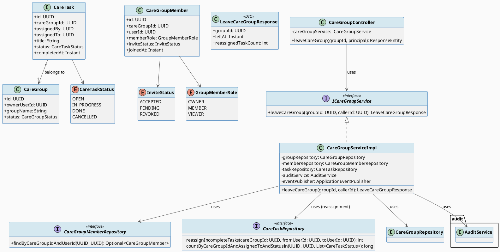
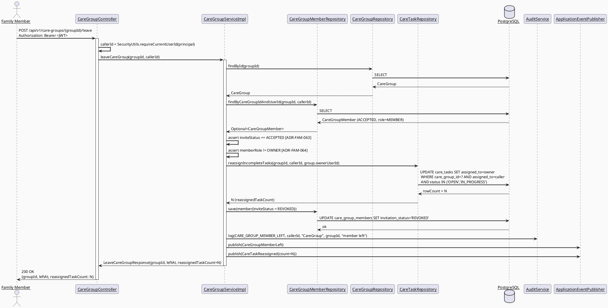
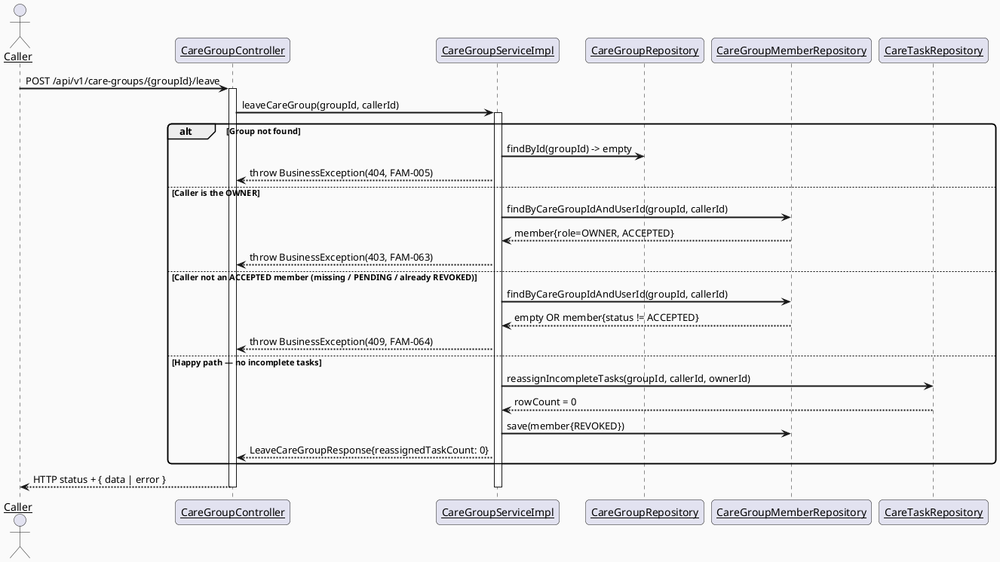
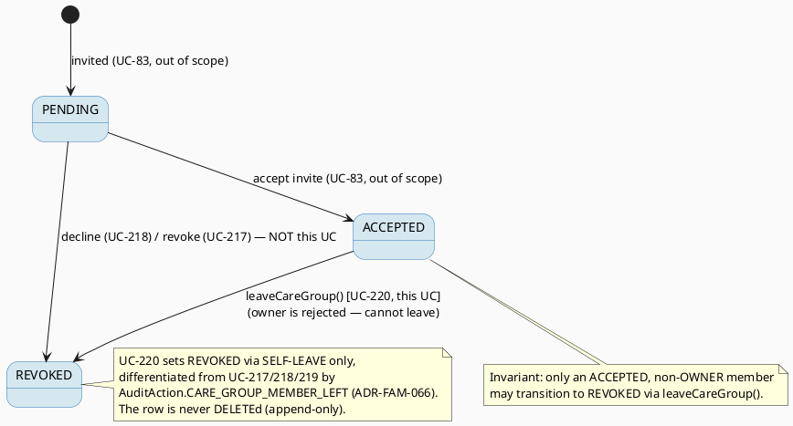

# ENGINEERING DOCUMENTATION STANDARD (EDS) v2.0
# UC220 — Leave Care Group — Technical Design Specification

| Field | Value |
|-------|-------|
| **Document ID** | `CB-FAM-IMP-220` |
| **Version** | `1.0` |
| **Date** | `2026-07-03` |
| **Status** | `Draft` |
| **Document Owner** | `PhuongNT` |
| **Author** | `AI Agent — Technical Architect` |
| **Reviewed by** | `[Tech Lead — Pending]` |
| **DPO Sign-off** | `[ ] Pending` *(module touches family membership + assigned-task data; see §1 Data Classification)* |
| **Approved by** | `[Principal Architect — Pending]` |
| **Last Review** | `2026-07-03` |
| **Based on EDS** | `v2.0` |

---

## CHANGELOG

> **Policy 4.4 — Immutable History:** Không bao giờ xóa thông tin cũ. Mọi thay đổi phải ghi vào bảng này.

| Ngày | Người thực hiện | Nội dung thay đổi |
|------|-----------------|-------------------|
| 2026-07-03 | AI Agent — Technical Architect | Tạo tài liệu lần đầu — TDS cho UC-220 Leave Care Group |

---

## MỤC LỤC

1. [Tổng quan Module](#1-tổng-quan-module)
2. [Ma trận Truy vết (Traceability Matrix)](#2-ma-trận-truy-vết-traceability-matrix)
3. [Architecture Decision Records (ADR)](#3-architecture-decision-records-adr)
4. [Non-Functional Requirements & SLA](#4-non-functional-requirements--sla)
5. [Static Modeling (Mô hình Tĩnh)](#5-static-modeling-mô-hình-tĩnh)
6. [Dynamic Modeling (Mô hình Động)](#6-dynamic-modeling-mô-hình-động)
7. [Domain Event Catalog](#7-domain-event-catalog)
8. [Interface Specification (Đặc tả Giao diện)](#8-interface-specification-đặc-tả-giao-diện)
9. [API Specification](#9-api-specification)
10. [Bảng mã lỗi (Error Codes)](#10-bảng-mã-lỗi-error-codes)
11. [Quy trình Triển khai (Step-by-Step)](#11-quy-trình-triển-khai-step-by-step)
12. [Rollback & Incident Runbook](#12-rollback--incident-runbook)
13. [Kịch bản Kiểm thử Chi tiết](#13-kịch-bản-kiểm-thử-chi-tiết)
14. [Phương pháp Xác minh](#14-phương-pháp-xác-minh)
15. [Mẫu thử thực tế (API Verification Samples)](#15-mẫu-thử-thực-tế-api-verification-samples)
16. [Bảng tổng hợp phân quyền (Authorization Matrix)](#16-bảng-tổng-hợp-phân-quyền-authorization-matrix)
17. [AI Prompt Constraints (CASE 2.0)](#17-ai-prompt-constraints-case-20)

---

## 1. Tổng quan Module

UC-220 "Leave Care Group" lets an **existing Family Member** voluntarily leave a care group they
have already joined. The action operates on the **caller's own** `care_group_members` row: it flips
that row's `invitation_status` from `ACCEPTED` to `REVOKED` (the same terminal value already used
by UC-217 revoke / UC-218 decline / UC-219 remove, differentiated by a new distinct audit action —
see ADR-FAM-066). "Stops access to shared data" is achieved for free: a `REVOKED` row is already
excluded from all membership/visibility listings by UC-216's `ADR-FAM-002` (ACCEPTED-only
membership), so no separate access-teardown mechanism is invented here.

In addition — and unlike UC-219 Remove Family Member, which explicitly defers task handling — UC-220
performs a **task-reassignment side effect** in the same transaction: every `care_tasks` row in this
group that is still assigned to the leaving member and still **incomplete** (`status IN (OPEN,
IN_PROGRESS)`) is reassigned to the group **Owner** (`care_groups.owner_user_id`). Tasks already
`DONE` or `CANCELLED` are left untouched as historical record. This behavior is confirmed by the
UI/UX mockup (`03_Design/UI_UX/MobileAppScreen/CB-178 Leave Care Group Confirmation (UC-220)/
code.html`), which warns the leaving member: *"Công việc chưa hoàn thành — Bạn đang có 2 công việc
được giao. Chúng sẽ được chuyển lại cho trưởng nhóm."* (You have unfinished assigned tasks; they will
be transferred back to the group leader/owner). See ADR-FAM-065.

| Field | Value |
|-------|-------|
| **Module Name** | Family Sync — Leave Care Group |
| **Bounded Context** | `family` (same bounded context as UC-70 Create Care Group, UC-216 View Members, UC-73 Assign Family Task, UC-217/218/219 invitation/membership lifecycle) |
| **UC ID** | `UC-220` |
| **SRS Reference** | `3.3.17.5` (`02_Requirements/SRS/3_Functional_Specification.md` lines ~4731-4750) |
| **Primary Actor** | `Family Member` (acting on their OWN membership) |
| **Secondary Actors** | `None` (per SRS) |
| **Platform** | `Mobile App` |
| **Data Classification** | `PII` / family-scoped — membership relationship + assigned-task ownership are family data under BR-PRIVACY. Not `Sensitive-PII` (no health diagnosis, no payment data). |
| **Compliance Scope** | `BR-RBAC`, `BR-PRIVACY`, `PDPA` (Vietnam) — minimum-necessary access; GDPR `N/A` (CareBridge is VN-scoped; GDPR citations from the generic EDS template are kept only where the template structurally requires them, marked accordingly). |
| **Upstream Dependencies** | `family` module (`CareGroup`, `CareGroupMember` — UC-70/216), `care_tasks` table (schema exists; JPA `CareTask` entity/repository greenfield per UC-73), `common` (`ApiResponse`, `SecurityUtils`, `BusinessException`), `audit` module (`AuditService`, `AuditAction`) |
| **Downstream Consumers** | Mobile app "Rời nhóm" confirmation screen (CB-178); care-group member listing (UC-216, which now excludes the departed member); assigned-task list (owner sees the reassigned tasks) |

### Scope

**IN SCOPE:**
- Flipping the caller's own `care_group_members.invitation_status` from `ACCEPTED` to `REVOKED`
  (self-leave — ADR-FAM-063).
- Rejecting a leave attempt by the group **Owner** (would orphan the group) with a dedicated error
  code `FAM-063` (ADR-FAM-064).
- Rejecting a leave attempt by a caller who is not an active (`ACCEPTED`) member (not-a-member /
  already-left / still-`PENDING`) with `FAM-064`.
- **Task-reassignment-on-leave** (confirmed in-scope, ADR-FAM-065): a single bulk `UPDATE` that
  reassigns every `care_tasks` row where `care_group_id = groupId AND assigned_to =
  leavingUserId AND status IN (OPEN, IN_PROGRESS)` to the group owner's `user_id`. `DONE`/`CANCELLED`
  tasks are untouched.
- Writing a new audit action `CARE_GROUP_MEMBER_LEFT` (ADR-FAM-066).
- Publishing domain events `CareGroupMemberLeft` and `CareTaskReassigned`.
- Returning a success response including the count of reassigned tasks (for a confirmation toast —
  ADR-FAM-067).

**OUT OF SCOPE (explicitly deferred — do NOT implement here):**
- **Ownership transfer** before leaving, and **group deletion/archival** — the escape hatch an owner
  would need in order to leave. Same boundary UC-219 Remove notes for its "cannot remove the owner"
  rule; documented as Open follow-up, not built here.
- The **pre-leave warning task-count read** shown in the mockup (the "2 công việc" figure). The leave
  endpoint itself performs the reassignment atomically and returns the final count; how the client
  fetches the *pre*-leave count for the confirmation screen is marked **Open (OPEN-1)** — no assigned-
  task listing endpoint is confirmed implemented yet (`CareTask` code is greenfield per UC-73).
- The `CareTask` create/assign path (UC-73), task status updates (UC-3.3.3.3), task detail/update/
  cancel (UC-221/222/…) — separate TDS files. UC-220 only *reassigns* the `assigned_to` column of
  already-existing incomplete tasks; it never creates, completes, or cancels a task.
- UC-217 Revoke Invitation, UC-218 Reject Invitation, UC-219 Remove Family Member — sibling
  membership-lifecycle UCs in this same batch; each owns its own distinct `AuditAction` constant and
  error-code lane (see ADR-FAM-066 and §10).

---

## 2. Ma trận Truy vết (Traceability Matrix)

| Requirement ID | Loại (BR/ADR/US) | Mô tả yêu cầu | Thành phần Code | Compliance Target | ADR liên quan |
|----------------|------------------|---------------|-----------------|-------------------|---------------|
| SRS §3.3.17.5 (UC-220) | Use Case | Family Member leaves the care group and stops access to shared data | `CareGroupController.leaveCareGroup()`, `CareGroupServiceImpl.leaveCareGroup()` | BR-RBAC, BR-PRIVACY | ADR-FAM-063, ADR-FAM-064, ADR-FAM-065 |
| BR-RBAC | Business Rule | Users may access only functions allowed by their role/permission scope; a member acts only on their own membership | `SecurityUtils.requireCurrentUserId()` → `callerId`; caller-own-row lookup | PDPA minimum-necessary access | ADR-FAM-063 |
| BR-PRIVACY | Business Rule | Family data follows consent/purpose/minimum-necessary; a departed member loses access to shared data | `invitation_status = REVOKED` → excluded by UC-216 `ADR-FAM-002` listing filter | PDPA | ADR-FAM-063 |
| PRE-3 | Precondition | Actor authenticated with required role/permission | `@PreAuthorize("isAuthenticated()")` + own-membership `ACCEPTED` check | BR-RBAC | ADR-FAM-063 |
| PRE-4 | Precondition | Required reference data exists (group + caller's ACCEPTED membership) | `CareGroupRepository.findById`, `CareGroupMemberRepository.findByCareGroupIdAndUserId` | — | — |
| POST-1 | Postcondition | Operation completed / clear result state shown | `LeaveCareGroupResponse{ reassignedTaskCount }` for confirmation toast | — | ADR-FAM-067 |
| POST-2 | Postcondition | Related records/notifications updated | Task reassignment bulk `UPDATE`; `CareTaskReassigned` event | — | ADR-FAM-065 |
| POST-3 | Postcondition | Sensitive actions recorded for audit | `AuditService.log(CARE_GROUP_MEMBER_LEFT, ...)` | PDPA | ADR-FAM-066 |
| E1 | Exception | Access denied when unauthorized / outside scope | `FAM-063` (owner cannot leave), `FAM-064` (not an active member) | BR-RBAC | ADR-FAM-064 |
| E2 | Exception | Invalid/conflicting data rejected with action-level message | `FAM-064` (already-left / not-ACCEPTED), `FAM-005` (group not found, reused) | — | — |
| UI/UX CB-178 | Oracle (mockup) | Unfinished assigned tasks are transferred back to the group owner on leave | `CareTaskRepository.reassignIncompleteTasks()` | — | ADR-FAM-065 |
| ADR-FAM-063 | Decision | Self-leave writes `REVOKED` on the caller's own row | `CareGroupServiceImpl.leaveCareGroup()` | — | — |
| ADR-FAM-064 | Decision | Group Owner cannot leave (dedicated `FAM-063`) | owner check in service | — | — |
| ADR-FAM-065 | Decision | Reassign incomplete tasks (`OPEN`/`IN_PROGRESS`) to owner | `CareTaskRepository.reassignIncompleteTasks()` | — | — |
| ADR-FAM-066 | Decision | Shared `REVOKED` value differentiated by new `AuditAction.CARE_GROUP_MEMBER_LEFT` | `AuditAction` enum + audit call | PDPA | — |
| ADR-FAM-067 | Decision | Leave response returns reassigned-task count; pre-leave read is Open | `LeaveCareGroupResponse` | — | — |

---

## 3. Architecture Decision Records (ADR)

### ADR-FAM-063 — Self-leave semantics (caller flips their OWN row to REVOKED)

| Field | Value |
|-------|-------|
| **Status** | `Accepted` |
| **Deciders** | `AI Agent (Technical Architect)`, `PhuongNT` |
| **Date** | `2026-07-03` |
| **Supersedes** | — |

#### Bối cảnh (Context)
The actor is the Family Member themselves (SRS Primary Actor = Family Member, Secondary = None),
acting on their own membership — not an owner acting on someone else's row (that is UC-219 Remove).
The system must identify "which row" purely from the authenticated caller identity, never from a
client-supplied member id, to satisfy BR-RBAC. `care_group_members` already has a unique
`(care_group_id, user_id)` shape, and `CareGroupMemberRepository.findByCareGroupIdAndUserId(groupId,
userId)` already exists in the codebase (verified).

#### Các phương án đã xem xét (Options Considered)

| Phương án | Mô tả | Ưu điểm | Nhược điểm |
|-----------|-------|----------|------------|
| A | Client sends the `careGroupMemberId` to leave | Explicit | Lets a caller pass someone else's member id → privilege-escalation risk; violates BR-RBAC |
| B | Resolve the caller's own row via `findByCareGroupIdAndUserId(groupId, callerId)`; require its `invitation_status == ACCEPTED`; set it to `REVOKED` | No client-supplied identity; reuses existing repository method; precondition matches SRS PRE-3 | Requires the caller to already be an ACCEPTED member (a PENDING invitee cannot "leave" — they decline via UC-218) |

#### Quyết định (Decision)
Chọn **Phương án B** — the service resolves the caller's own `care_group_members` row from
`groupId + callerId` (callerId from JWT via `SecurityUtils.requireCurrentUserId`), asserts its
`invitation_status == ACCEPTED`, and sets it to `REVOKED`. A caller whose row is missing, `PENDING`,
or already `REVOKED` is rejected with `FAM-064` (see ADR-FAM-064/§10). No client-supplied member id
is accepted.

#### Hệ quả (Consequences)
**Tích cực:** Impossible to leave on behalf of another member; consistent with the existing
accept/decline pattern (`CareGroupServiceImpl.acceptInvite/declineInvite` also key off `callerId`).

**Tiêu cực / Trade-offs:** A PENDING invitee cannot use this endpoint to "leave" — that is by design
(they use UC-218 Reject). Documented in §10 (`FAM-064` covers PENDING).

**Compliance Impact:** BR-RBAC / BR-PRIVACY — least-privilege, self-service only.

---

### ADR-FAM-064 — The group Owner cannot leave via this action

| Field | Value |
|-------|-------|
| **Status** | `Accepted` |
| **Deciders** | `AI Agent (Technical Architect)`, `PhuongNT` |
| **Date** | `2026-07-03` |

#### Bối cảnh (Context)
Every care group is created (UC-70) with the Mother as its `OWNER` member; `care_groups.owner_user_id`
points to that user. If the owner left, the group would be **orphaned** — no one could manage members,
and the `owner_user_id` FK target would still reference a now-`REVOKED` member. This is exactly the
boundary UC-219 Remove Family Member draws for its "the OWNER cannot be removed/targeted" rule. For
consistency across the batch, UC-220 draws the same line from the self-leave direction.

#### Các phương án đã xem xét (Options Considered)

| Phương án | Mô tả | Ưu điểm | Nhược điểm |
|-----------|-------|----------|------------|
| A | Allow the owner to leave; auto-promote the next member to OWNER | "Nice" UX | No SRS/mockup support; ownership-transfer election rules are undefined; large scope creep |
| B | Reject an owner's leave with a dedicated `FAM-063` (403); ownership-transfer / group-deletion are the (out-of-scope) escape hatches | Prevents orphaned groups; consistent with UC-219's "cannot target the owner" wording; smallest scoped change | An owner who truly wants out must wait for the (future) ownership-transfer or group-delete feature |

#### Quyết định (Decision)
Chọn **Phương án B** — if the caller's own row has `memberRole == OWNER`, reject with `FAM-063` (403)
**before** any state change or task reassignment. **Wording kept consistent with UC-219 Remove Family
Member's "the group OWNER cannot be removed/targeted" rule** — here phrased as "the group owner cannot
leave the care group; transfer ownership or delete the group instead." Ownership transfer and group
deletion are explicitly **Open follow-ups (OPEN-2)**, not implemented in this UC.

#### Hệ quả (Consequences)
**Tích cực:** No orphaned groups; `owner_user_id` always references an `ACCEPTED` owner; symmetric with
UC-219.

**Tiêu cực / Trade-offs:** Owner has no self-service exit until the transfer/delete features land.

**Compliance Impact:** BR-RBAC — the owner check is an authorization boundary, not a privacy one.

---

### ADR-FAM-065 — Task-reassignment-on-leave (incomplete tasks → owner)

| Field | Value |
|-------|-------|
| **Status** | `Accepted` |
| **Deciders** | `AI Agent (Technical Architect)`, `PhuongNT` |
| **Date** | `2026-07-03` |

#### Bối cảnh (Context)
**Oracle:** the UI/UX mockup `03_Design/UI_UX/MobileAppScreen/CB-178 Leave Care Group Confirmation
(UC-220)/code.html` explicitly warns the leaving member: *"Công việc chưa hoàn thành — Bạn đang có 2
công việc được giao. Chúng sẽ được chuyển lại cho trưởng nhóm."* — i.e. unfinished assigned tasks are
transferred **back to the group leader/owner**. This makes reassignment a confirmed in-scope
behavior for UC-220 (not Open), differentiating it from UC-219 Remove, which defers task handling.
The `care_tasks` table already exists (`V1__init_schema.sql`, columns `care_task_id, care_group_id,
assigned_by, assigned_to, title, description, due_at, status DEFAULT 'OPEN', completed_at, created_at,
updated_at`), but **no JPA code touches it yet** — the `CareTask` entity / `CareTaskRepository` are
greenfield (same finding as UC-73 `ADR-FAM-030`). "Incomplete" = `status IN (OPEN, IN_PROGRESS)` per
the canonical batch enum `CareTaskStatus { OPEN, IN_PROGRESS, DONE, CANCELLED }` defined in UC-73
`ADR-FAM-030` (the `NEEDS_SUPPORT` variant from UC-85 is explicitly NOT used).

#### Các phương án đã xem xét (Options Considered)

| Phương án | Mô tả | Ưu điểm | Nhược điểm |
|-----------|-------|----------|------------|
| A | Load each incomplete task as an entity, set `assignedTo` in a loop, save one-by-one | Emits per-entity JPA events; simple to unit test with mocks | N round-trips; not atomic-by-default; heavier |
| B | Single bulk `@Modifying @Query` UPDATE filtering `care_group_id + assigned_to + status IN (OPEN, IN_PROGRESS)`, returning the affected row count | One atomic statement; returns the reassigned count directly (used in the response); matches the confirmed "single UPDATE query" mechanism | Bulk update bypasses JPA lifecycle callbacks / `@UpdateTimestamp` (mitigated: set `updated_at = now()` explicitly in the query) |
| C | Delegate to `ICareTaskService.reassignOnLeave(...)` (cross-service call) | Keeps `CareTask` aggregate logic in its own service | UC-73's `ICareTaskService` is itself greenfield/Draft; cross-service transaction coupling with no confirmed contract; heavier for a single UPDATE |

#### Quyết định (Decision)
Chọn **Phương án B** — a single bulk update `CareTaskRepository.reassignIncompleteTasks(UUID
careGroupId, UUID fromUserId, UUID toUserId)`:
```
UPDATE CareTask t
   SET t.assignedTo = :toUserId, t.updatedAt = CURRENT_TIMESTAMP
 WHERE t.careGroupId = :careGroupId
   AND t.assignedTo  = :fromUserId
   AND t.status IN (OPEN, IN_PROGRESS)
```
executed **inside the same `@Transactional` boundary** as the membership flip, so either both the
`REVOKED` write and the reassignment commit together or neither does. The method returns the affected
row count, which becomes `LeaveCareGroupResponse.reassignedTaskCount`. `DONE`/`CANCELLED` tasks are
excluded by the `status IN (...)` filter and remain historical record. The target `toUserId` is
`care_groups.owner_user_id` (the surviving owner). Only the minimal `CareTask` entity +
`CareTaskRepository` needed for this query are introduced (greenfield, atop the existing table, no
migration).

#### Hệ quả (Consequences)
**Tích cực:** Atomic, single statement, returns the count the mockup needs for its confirmation copy;
no orphaned "assigned to a departed member" tasks; matches the mockup oracle exactly.

**Tiêu cực / Trade-offs:** Bulk UPDATE bypasses `@UpdateTimestamp` — mitigated by explicitly setting
`updated_at = CURRENT_TIMESTAMP` in the JPQL. If UC-73 later lands its own richer `CareTask` entity,
the two greenfield definitions must be reconciled (they map the same table — coordinate at merge).

**Compliance Impact:** BR-PRIVACY — the departed member no longer "owns" any live task; the owner
regains responsibility (minimum-necessary access preserved).

---

### ADR-FAM-066 — Shared `REVOKED` value, differentiated by a new AuditAction

| Field | Value |
|-------|-------|
| **Status** | `Accepted` |
| **Deciders** | `AI Agent (Technical Architect)`, `PhuongNT` |
| **Date** | `2026-07-03` |

#### Bối cảnh (Context)
Confirmed batch decision: `invitation_status` stays exactly `{ACCEPTED, PENDING, REVOKED}` — no new
enum value, no migration. Four different membership-teardown actions all land on the same terminal
value `REVOKED`: UC-217 revoke-invitation, UC-218 decline-invitation, UC-219 remove-member, and
UC-220 **leave** (this UC). The stored value alone therefore cannot distinguish *why* a row became
`REVOKED`. The `AuditAction` enum (verified) currently has `CARE_GROUP_INVITE_ACCEPTED` and
`CARE_GROUP_INVITE_DECLINED`, but **no** constant for revoke/remove/leave.

#### Các phương án đã xem xét (Options Considered)

| Phương án | Mô tả | Ưu điểm | Nhược điểm |
|-----------|-------|----------|------------|
| A | Add a new `invitation_status` value like `LEFT` | Self-describing status | Breaks the confirmed "no new enum value / no migration" decision; UC-216's ACCEPTED-only filter would need re-audit |
| B | Keep `REVOKED`; add a new distinct `AuditAction.CARE_GROUP_MEMBER_LEFT` to record the *reason* in the audit trail | No schema/migration change; audit trail cleanly distinguishes leave from revoke/decline/remove | The `care_group_members` row itself does not encode "left vs removed" — must join the audit log to tell them apart |

#### Quyết định (Decision)
Chọn **Phương án B** — write `invitation_status = REVOKED` on the caller's own row, and record a new
`AuditAction.CARE_GROUP_MEMBER_LEFT` (distinct from UC-217's `CARE_GROUP_INVITE_REVOKED`, UC-218's
`CARE_GROUP_INVITE_DECLINED`, and UC-219's `CARE_GROUP_MEMBER_REMOVED`). This is a code-only enum
addition, no Flyway migration.

#### Hệ quả (Consequences)
**Tích cực:** Zero schema change; the audit log is the single source of truth for *why* a membership
ended; consistent with how sibling UCs differentiate identical `REVOKED` writes.

**Tiêu cực / Trade-offs:** Distinguishing "left" from "removed" requires reading the audit log, not the
membership row. Acceptable — the row's job is access control, the audit log's job is history.

**Compliance Impact:** PDPA — sensitive membership change is auditable (POST-3).

---

### ADR-FAM-067 — Leave response shape (reassigned count) & the pre-leave read

| Field | Value |
|-------|-------|
| **Status** | `Accepted` |
| **Deciders** | `AI Agent (Technical Architect)`, `PhuongNT` |
| **Date** | `2026-07-03` |

#### Bối cảnh (Context)
The mockup shows the count of unfinished tasks ("2 công việc") on the **confirmation screen**, i.e.
*before* the user taps "Rời nhóm". The design question: must the leave call return the count/list of
reassigned tasks so the client can render a follow-up confirmation, or is a simple success enough
because the client already showed the count via a separate pre-check read?

#### Các phương án đã xem xét (Options Considered)

| Phương án | Mô tả | Ưu điểm | Nhược điểm |
|-----------|-------|----------|------------|
| A | Leave returns `204 No Content`; client relies solely on its pre-leave count | Minimal payload | Client's pre-count could be stale (a task finished between the read and the leave); no server-confirmed number for the success toast |
| B | Leave performs the reassignment atomically and returns `200 OK` with `reassignedTaskCount` (the server-authoritative affected-row count); the *pre*-leave warning count is fetched separately via a lightweight read | Server-authoritative count for the confirmation toast; atomic; no dependency on client freshness | Requires a small response DTO; the pre-leave read mechanism is a separate concern |

#### Quyết định (Decision)
Chọn **Phương án B** — the leave endpoint reassigns atomically and returns `200 OK` with
`LeaveCareGroupResponse{ groupId, leftAt, reassignedTaskCount }` for the success-toast confirmation.
The **pre-leave warning count** shown on CB-178 is a *separate* lightweight read (e.g. an assigned-task
listing filtered client-side by the caller's own id). **No such assigned-task listing endpoint is
confirmed implemented yet** (`CareTask` code is greenfield per UC-73), so the exact pre-check read
mechanism is marked **Open (OPEN-1)** and is NOT built by this UC.

#### Hệ quả (Consequences)
**Tích cực:** The toast shows a server-confirmed number; no reliance on a possibly-stale client count.

**Tiêu cực / Trade-offs:** Two round-trips for the full UX (pre-count read + leave). The pre-count read
is Open and may need UC-73's list endpoint to land first.

**Compliance Impact:** None.

---

## 4. Non-Functional Requirements & SLA

### 4.1. Performance & Availability

| Category | Requirement | Target SLA | Measurement Method | Compliance Basis |
|----------|-------------|------------|---------------------|------------------|
| Latency | `POST /api/v1/care-groups/{groupId}/leave` (p99) | `< 300ms` (membership flip + single bulk UPDATE) | Manual timing / future k6 | — |
| Availability | Uptime (monthly) | Inherits API-wide `99.9%` target | Uptime monitor | — |
| Throughput | Concurrent leaves | Low volume (a member leaves a group rarely) — no dedicated throughput target | — | — |

### 4.2. Data Integrity & Retention

| Category | Requirement | Target | Verification Method | Compliance Basis |
|----------|-------------|--------|---------------------|------------------|
| Atomicity | Membership flip + task reassignment + audit write are one `@Transactional` unit | All-or-nothing (RPO within the txn) | Integration test: force reassignment failure → assert membership NOT flipped | POST-1/POST-2 |
| Append-only history | The membership row is never DELETEd — only `invitation_status` set to `REVOKED` | 100% (no hard delete) | Code review + DB inspection | PDPA retention |
| Retention | Audit log retention | Inherits project-wide policy (no new rule) | DB backup policy | PDPA |

### 4.3. Security

| Category | Requirement | Target | Verification Method | Compliance Basis |
|----------|-------------|--------|---------------------|------------------|
| Access control | Caller can only leave on their own behalf; owner cannot leave | 100% (callerId from JWT; owner check) | Auth Matrix §16, authorization tests | BR-RBAC |
| Encryption in transit | All endpoints | TLS 1.3+ (inherited platform config) | SSL scan | *(GDPR Art. 32 cited by template — treated as inherited platform control; PDPA-equivalent)* |
| No PII in logs | Audit passes only `groupId`/`callerId`, not free-text | 100% | Log grep | BR-PRIVACY |

### 4.4. Scalability & Capacity Planning

Leaving a group is an infrequent, per-user action; the reassignment is a single indexed bulk UPDATE
(`idx_care_tasks_care_group_id` already exists per `V1__init_schema.sql`). *Not applicable* to further
capacity planning at current CareBridge scale.

---

## 5. Static Modeling (Mô hình Tĩnh)

### 5.1. Class Diagram (PlantUML)



### 5.2. Data Structure (Flyway SQL Migration)

**No migration required.** Both tables already exist and are sufficient for UC-220. The membership
flip touches an existing column; the reassignment touches an existing column. `AuditAction` gains a
new enum constant — a **code change, not DDL** (the audit action is stored as a string; verified: the
`AuditAction` Java enum has no DB CHECK constraint tied to it in the family scope).

```sql
-- EXISTING TABLE — care_group_members (V1 baseline / V24). NOT modified by this feature.
-- care_group_member_id, care_group_id, user_id, member_role,
-- invitation_status (ACCEPTED|PENDING|REVOKED), joined_at, created_at, updated_at
-- UC-220 writes: invitation_status = 'REVOKED' on the caller's OWN row.

-- EXISTING TABLE — care_tasks (V1__init_schema.sql ~lines 750-762). NOT modified by this feature.
-- care_task_id, care_group_id, assigned_by, assigned_to, title, description,
-- due_at, status varchar(20) DEFAULT 'OPEN', completed_at, created_at, updated_at
-- No CHECK constraint on status. UC-220 writes: assigned_to = <owner user_id>
--   WHERE care_group_id = :groupId AND assigned_to = :leavingUserId
--     AND status IN ('OPEN','IN_PROGRESS').
-- Existing index idx_care_tasks_care_group_id supports the WHERE clause.
```

> **Quy tắc đặt tên:** all columns are `snake_case` in DDL; the JPA entities map to them via
> `@Column(name = "...")` exactly as the existing `CareGroupMember` entity does (`user_id`,
> `invitation_status`).

---

## 6. Dynamic Modeling (Mô hình Động)

### 6.1. Sequence Diagram — Happy Path (leave with task reassignment)



### 6.2. Sequence Diagram — Happy Path (no incomplete tasks) & Error Paths



### 6.3. State Machine (member's invitation_status, from this UC's perspective)



> **⚠️ Invariant bất biến:** `leaveCareGroup()` MUST (1) act only on the caller's own row, (2) refuse
> if that row is the OWNER, (3) refuse if that row is not `ACCEPTED`, (4) never hard-delete the row,
> and (5) reassign incomplete tasks to the owner within the same transaction as the `REVOKED` write.

---

## 7. Domain Event Catalog

### 7.1. Events Published (Phát ra)

| Event Name | Trigger | Publisher | Subscriber(s) | Payload Schema | Async? |
|------------|---------|-----------|---------------|----------------|--------|
| `CareGroupMemberLeft` | Successful `leaveCareGroup()` | `CareGroupServiceImpl` | Audit/observability listeners; future notification listener (notify owner) | `CareGroupMemberLeft.java` (§7.3) | Yes (Spring `ApplicationEventPublisher`; same-transaction publish, async listener) |
| `CareTaskReassigned` | Reassignment affected ≥ 0 tasks during leave | `CareGroupServiceImpl` | Future task-notification listener (notify owner of newly-owned tasks) | `CareTaskReassigned.java` (§7.3) | Yes |

> Note: The audit write (`CARE_GROUP_MEMBER_LEFT`) is performed **synchronously inline** in the
> service so it is part of the same transaction; the events above are for observability/future
> listeners and are not the sole trigger of the audit record.

### 7.2. Events Consumed (Tiêu thụ)

*Not applicable — UC-220 does not consume any domain event from other modules in this scope.*

### 7.3. Payload Schema

```java
// CareGroupMemberLeft.java
public record CareGroupMemberLeft(
    UUID    eventId,          // UUID.randomUUID() — dùng để deduplicate
    String  eventType,        // "CareGroupMemberLeft"
    Instant occurredAt,       // Instant.now()
    String  version,          // "1.0"
    Payload payload,
    Metadata metadata
) {
    public record Payload(
        UUID careGroupId,
        UUID leavingUserId,    // == callerId
        int  reassignedTaskCount
    ) {}

    public record Metadata(
        UUID   correlationId,
        String causedBy        // callerId as string
    ) {}
}

// CareTaskReassigned.java
public record CareTaskReassigned(
    UUID    eventId,
    String  eventType,        // "CareTaskReassigned"
    Instant occurredAt,
    String  version,          // "1.0"
    Payload payload,
    Metadata metadata
) {
    public record Payload(
        UUID careGroupId,
        UUID fromUserId,       // departed member
        UUID toUserId,         // group owner
        int  reassignedCount   // affected-row count of the bulk UPDATE
    ) {}

    public record Metadata(
        UUID   correlationId,
        String causedBy
    ) {}
}
```

---

## 8. Interface Specification (Đặc tả Giao diện)

### 8.1. Service Interface

```java
// LeaveCareGroupResponse.java — Output DTO
// @version 1.0
public class LeaveCareGroupResponse {
    private UUID    groupId;
    private Instant leftAt;              // server timestamp of the REVOKED write
    private int     reassignedTaskCount; // affected-row count of the reassignment UPDATE
    // @Data @Builder, matching existing family.dto response style
}

// ICareGroupService.java — ADD to the EXISTING interface (same class as UC-70/216/83)
// @version 1.1 (adds leaveCareGroup)
public interface ICareGroupService {
    // ... existing methods (createCareGroup, listMembers, listMyGroups,
    //     inviteMember, listMyInvitations, acceptInvite, declineInvite) unchanged ...

    /**
     * UC-220: The authenticated caller leaves the care group (self-service).
     * Sets the caller's OWN care_group_members row to invitation_status = REVOKED,
     * and reassigns their incomplete (OPEN/IN_PROGRESS) tasks in this group to the group owner.
     * @throws com.carebridge.backend.common.exception.BusinessException
     *         (FAM-005/404) if the care group does not exist;
     *         (FAM-063/403) if the caller is the group OWNER (owner cannot leave);
     *         (FAM-064/409) if the caller is not an ACCEPTED member (missing / PENDING / already REVOKED)
     */
    LeaveCareGroupResponse leaveCareGroup(UUID groupId, UUID callerId);
}
```

### 8.2. Repository Interface

```java
// CareGroupMemberRepository.java — REUSES existing method (no change needed)
public interface CareGroupMemberRepository extends JpaRepository<CareGroupMember, UUID> {
    // ... existing ...
    Optional<CareGroupMember> findByCareGroupIdAndUserId(UUID careGroupId, UUID userId); // EXISTS ALREADY
}

// CareTaskRepository.java — NEW file (greenfield; no repository exists for care_tasks yet).
// Minimal surface needed by UC-220 only. If UC-73 lands its own CareTaskRepository first,
// reconcile — both map the same table (see ADR-FAM-065 Consequences).
// @version 1.0
public interface CareTaskRepository extends JpaRepository<CareTask, UUID> {

    /**
     * Bulk-reassign every INCOMPLETE task (status OPEN or IN_PROGRESS) in the given group
     * currently assigned to {@code fromUserId}, over to {@code toUserId} (the group owner).
     * @return number of rows updated (used as reassignedTaskCount).
     */
    @Modifying
    @Query("""
           UPDATE CareTask t
              SET t.assignedTo = :toUserId, t.updatedAt = CURRENT_TIMESTAMP
            WHERE t.careGroupId = :careGroupId
              AND t.assignedTo  = :fromUserId
              AND t.status IN (com.carebridge.backend.family.entity.CareTaskStatus.OPEN,
                               com.carebridge.backend.family.entity.CareTaskStatus.IN_PROGRESS)
           """)
    int reassignIncompleteTasks(UUID careGroupId, UUID fromUserId, UUID toUserId);

    /** OPEN-1 helper for a possible pre-leave warning count (not wired to an endpoint by this UC). */
    long countByCareGroupIdAndAssignedToAndStatusIn(UUID careGroupId, UUID assignedTo,
                                                    List<CareTaskStatus> statuses);
}

// CareTask.java — NEW minimal entity mapping the existing care_tasks table (greenfield).
// CareTaskStatus.java — NEW enum { OPEN, IN_PROGRESS, DONE, CANCELLED } per UC-73 ADR-FAM-030.
```

---

## 9. API Specification

### 9.1. Endpoints Table

| Method | Path | Auth Level | Required Roles | Rate Limit | Idempotent? |
|--------|------|------------|----------------|------------|-------------|
| `POST` | `/api/v1/care-groups/{groupId}/leave` | JWT Bearer | Any authenticated `ACCEPTED` non-owner member of the group | 30/min | Yes* |

> *Idempotent in effect: a second leave call by the same (now-`REVOKED`) caller returns `409 FAM-064`
> and makes no further change — the first successful leave already reached the terminal state.
> Rate limit is a proposed default (Open — no project-wide rate-limit policy found in the existing
> `CareGroupController`).

### 9.2. Request / Response Schemas

#### `POST /api/v1/care-groups/{groupId}/leave` — Leave the care group

**Request Body:** *(none — the caller and target row are derived from the JWT + path `groupId`)*

**Response — 200 OK (Happy Path, with reassignment):**
```json
{
  "data": {
    "groupId": "a0a0a0a0-0000-4b1b-9a3d-000000000001",
    "leftAt": "2026-07-03T10:15:00Z",
    "reassignedTaskCount": 2
  },
  "message": "You have left the care group"
}
```

**Response — 200 OK (Happy Path, no incomplete tasks):**
```json
{
  "data": {
    "groupId": "a0a0a0a0-0000-4b1b-9a3d-000000000001",
    "leftAt": "2026-07-03T10:15:00Z",
    "reassignedTaskCount": 0
  },
  "message": "You have left the care group"
}
```

**Response — 403 Forbidden (caller is the group owner):**
```json
{
  "error": {
    "code": "FAM-063",
    "message": "The group owner cannot leave the care group. Transfer ownership or delete the group instead."
  }
}
```

**Response — 409 Conflict (not an active member / already left / still pending):**
```json
{
  "error": {
    "code": "FAM-064",
    "message": "You are not an active member of this care group"
  }
}
```

**Response — 404 Not Found (group not found):**
```json
{
  "error": {
    "code": "FAM-005",
    "message": "Care group not found: a0a0a0a0-0000-4b1b-9a3d-000000000001"
  }
}
```

---

## 10. Bảng mã lỗi (Error Codes)

> Tiền tố `FAM-` (family module). `FAM-063..067` are **UC-220's own reserved lane** (avoids collision
> with UC-217 `FAM-050..054`, UC-218 `FAM-055..057`, UC-219 `FAM-058..062`, UC-221 `FAM-033`+`068..071`,
> UC-222 `FAM-033`+`072..076`). `FAM-005` is **reused** (defined originally by UC-70/216, cited — not
> redefined) for group-not-found, consistent with `CareGroupServiceImpl` existing behavior.

| Code | HTTP Status | Message (EN) | Message (VI) | Trigger Condition |
|------|-------------|--------------|--------------|-------------------|
| `FAM-005` | 404 | Care group not found | Không tìm thấy nhóm chăm sóc | *(reused from UC-70/216)* `groupId` does not exist |
| `FAM-063` | 403 | The group owner cannot leave the care group | Trưởng nhóm không thể rời nhóm | Caller's own row has `memberRole == OWNER` (ADR-FAM-064) |
| `FAM-064` | 409 | You are not an active member of this care group | Bạn không phải thành viên đang hoạt động của nhóm | Caller has no row in the group, OR row `invitation_status != ACCEPTED` (PENDING / already REVOKED) (ADR-FAM-063) |
| `FAM-065` | 500 | Failed to complete leave operation | Không thể hoàn tất thao tác rời nhóm | **Reserved** — internal error if the atomic membership-flip + task-reassignment transaction fails; surfaced only on unexpected DB error |
| `FAM-066` | 404 | Pre-leave task summary not available | Không lấy được tóm tắt công việc trước khi rời | **Reserved** — pre-allocated for the future OPEN-1 pre-leave warning-count read endpoint (not used by this feature's code paths) |
| `FAM-067` | 409 | Ownership must be transferred before leaving | Phải chuyển quyền trưởng nhóm trước khi rời | **Reserved** — pre-allocated for the future ownership-transfer-before-leave flow (OPEN-2; not used by this feature) |

---

## 11. Quy trình Triển khai (Step-by-Step)

### 11.1. Prerequisites

- [ ] ADR-FAM-063/064/065/066/067 reviewed and Accepted (currently `Accepted` in this Draft TDS,
      pending Principal Architect sign-off)
- [ ] DPO sign-off — Open item; family membership + task-ownership data is `PII` (not Sensitive-PII)
- [ ] `CareTaskStatus { OPEN, IN_PROGRESS, DONE, CANCELLED }` enum available (from UC-73 `ADR-FAM-030`,
      or introduced here if UC-73 not yet landed — reconcile per ADR-FAM-065)
- [ ] Staging environment ready (no new migration to apply — see §11.2)

### 11.2. Pre-Migration Checklist

*Not applicable — no migration is introduced by this feature (see §5.2). Both `care_group_members`
and `care_tasks` already exist; `AuditAction.CARE_GROUP_MEMBER_LEFT` is a code-only enum addition.*

### 11.3. Implementation Steps

#### Chặng 1 — AuditAction enum + greenfield CareTask entity/repository (no migration)

```java
// AuditAction.java — ADD one constant (code change, no DDL)
CARE_GROUP_MEMBER_LEFT,

// CareTask.java — new file, package com.carebridge.backend.family.entity
@Entity @Table(name = "care_tasks")
@Getter @Setter @Builder @NoArgsConstructor @AllArgsConstructor
public class CareTask {
    @Id @GeneratedValue(strategy = GenerationType.UUID)
    @Column(name = "care_task_id", updatable = false, nullable = false)
    private UUID id;
    @Column(name = "care_group_id", nullable = false) private UUID careGroupId;
    @Column(name = "assigned_by") private UUID assignedBy;
    @Column(name = "assigned_to") private UUID assignedTo;
    @Column(name = "title", nullable = false, length = 255) private String title;
    @Column(name = "description", columnDefinition = "text") private String description;
    @Column(name = "due_at") private Instant dueAt;
    @Builder.Default @Enumerated(EnumType.STRING)
    @Column(name = "status", nullable = false, length = 20) private CareTaskStatus status = CareTaskStatus.OPEN;
    @Column(name = "completed_at") private Instant completedAt;
    @CreationTimestamp @Column(name = "created_at", nullable = false, updatable = false) private Instant createdAt;
    @UpdateTimestamp @Column(name = "updated_at", nullable = false) private Instant updatedAt;
}
```

#### Chặng 2 — Service method (extend CareGroupServiceImpl)

```java
@Override
public LeaveCareGroupResponse leaveCareGroup(UUID groupId, UUID callerId) {
    CareGroup group = groupRepository.findById(groupId)
        .orElseThrow(() -> new BusinessException(HttpStatus.NOT_FOUND, "FAM-005",
            "Care group not found: " + groupId));

    CareGroupMember own = memberRepository.findByCareGroupIdAndUserId(groupId, callerId)
        .filter(m -> m.getInviteStatus() == InviteStatus.ACCEPTED)
        .orElseThrow(() -> new BusinessException(HttpStatus.CONFLICT, "FAM-064",
            "You are not an active member of this care group"));

    if (own.getMemberRole() == GroupMemberRole.OWNER) {
        throw new BusinessException(HttpStatus.FORBIDDEN, "FAM-063",
            "The group owner cannot leave the care group. "
            + "Transfer ownership or delete the group instead.");
    }

    // ADR-FAM-065: reassign incomplete tasks to the owner (single bulk UPDATE)
    int reassigned = taskRepository.reassignIncompleteTasks(groupId, callerId, group.getOwnerUserId());

    // ADR-FAM-063: flip own row to REVOKED (append-only, never delete)
    own.setInviteStatus(InviteStatus.REVOKED);
    memberRepository.save(own);
    Instant leftAt = Instant.now();

    // ADR-FAM-066: distinct audit action
    auditService.log(AuditAction.CARE_GROUP_MEMBER_LEFT, callerId,
        "CareGroup", groupId.toString(), "member left");
    // events for observability / future listeners
    // eventPublisher.publishEvent(CareGroupMemberLeft ...);
    // eventPublisher.publishEvent(CareTaskReassigned ...);

    return LeaveCareGroupResponse.builder()
        .groupId(groupId).leftAt(leftAt).reassignedTaskCount(reassigned).build();
}
```

#### Chặng 3 — Controller endpoint (extend CareGroupController)

```java
// UC-220: Leave a care group
@PostMapping("/{groupId}/leave")
@PreAuthorize("isAuthenticated()")
public ResponseEntity<ApiResponse<LeaveCareGroupResponse>> leaveCareGroup(
        @PathVariable UUID groupId, Principal principal) {
    var callerId = SecurityUtils.requireCurrentUserId(principal);
    var response = careGroupService.leaveCareGroup(groupId, callerId);
    return ResponseEntity.ok(ApiResponse.success(response, "You have left the care group"));
}
```

#### Chặng 4 — Verification sau deploy

```bash
./mvnw test -Dtest=CareGroupServiceLeaveTest,CareGroupControllerLeaveTest
curl -X GET https://[host]/api/v1/health
# Expected: {"status": "ok"}
```

### 11.4. Deployment Checklist

- [ ] No migration to run (confirmed §5.2/§11.2)
- [ ] `./mvnw test` green for new `family` leave tests
- [ ] Health check endpoint returns 200
- [ ] Error rate < 1% in first 10 minutes post-deploy
- [ ] Audit log shows `CARE_GROUP_MEMBER_LEFT` entries correctly
- [ ] Spot-check: a departed member no longer appears in `GET /care-groups/{id}/members` (UC-216)

---

## 12. Rollback & Incident Runbook

### 12.1. Điều kiện kích hoạt Rollback (Trigger Conditions)

| Điều kiện | Ngưỡng | Người quyết định |
|-----------|--------|------------------|
| Error rate on `/leave` | > 5% trong 5 phút | On-call Engineer |
| Latency p99 vượt ngưỡng | > 2x baseline (§4.1) | On-call Engineer |
| Reassignment writes to the wrong group/user (data integrity) | Bất kỳ case nào | Tech Lead + DPO |
| Owner incorrectly allowed to leave (orphaned group) | Bất kỳ case nào | Tech Lead |

### 12.2. Rollback Procedure

```bash
# No DB migration was introduced — code-only rollback.
# Step 1: Revert code deploy.
kubectl rollout undo deployment/carebridge-api

# Step 2: Verify rollback
kubectl rollout status deployment/carebridge-api
curl -X GET https://[host]/api/v1/health

# Step 3: Smoke test existing family endpoints still function
curl -X GET https://[host]/api/v1/care-groups/{groupId}/members -H "Authorization: Bearer [token]"

# Step 4 (data remediation, if a bad leave shipped): a wrongly-REVOKED member can be restored by
#   setting invitation_status back to ACCEPTED for that (care_group_id, user_id); a mis-reassigned
#   task's assigned_to can be corrected from the audit/event trail. NO hard deletes occurred.
```

### 12.3. Notification Protocol

| Thời điểm | Người nhận | Kênh | Template |
|-----------|------------|------|----------|
| Ngay khi phát hiện | On-call team | Slack `#incident` | "🚨 UC-220 Leave incident: [mô tả]" |
| Trong 30 phút | Tech Lead / DPO | Email/Slack | *(DPO only if membership/task ownership was corrupted across groups — PII integrity; otherwise N/A)* |

### 12.4. Post-Incident Review (PIR)

Standard PIR template applies (Timeline / Root Cause / Impact / Remediation / Prevention) — *Not
applicable to fill in now*; only required if an actual incident occurs post-deploy.

---

## 13. Kịch bản Kiểm thử Chi tiết

*See companion file `UC220_LeaveCareGroup_Test-Spec.md` for the full test design, test cases, and
Red-Green-Refactor tracker — this TDS section defers to that document per project convention (TDS
defines "what/why", Test-Spec defines "how tested").*

Key scenarios covered there: happy-leave-with-task-reassignment (oracle = CB-178 mockup),
happy-leave-no-incomplete-tasks, owner-cannot-leave-rejected (`FAM-063`), not-a-member-rejected
(`FAM-064`), DONE/CANCELLED tasks NOT reassigned, and the full integration flow.

---

## 14. Phương pháp Xác minh

### 14.1. Database Inspection

```sql
-- Verify the caller's own row flipped to REVOKED (append-only — row still present)
SELECT care_group_member_id, user_id, member_role, invitation_status
FROM care_group_members
WHERE care_group_id = '<groupId>' AND user_id = '<callerId>';
-- Expected: invitation_status = 'REVOKED', row NOT deleted

-- Verify incomplete tasks were reassigned to the owner; DONE/CANCELLED untouched
SELECT care_task_id, assigned_to, status
FROM care_tasks
WHERE care_group_id = '<groupId>'
ORDER BY status;
-- Expected: rows with status OPEN/IN_PROGRESS now have assigned_to = <owner user_id>;
--           rows with status DONE/CANCELLED keep their original assigned_to

-- Verify the departed member is excluded from the members listing (UC-216 ADR-FAM-002 filter)
SELECT user_id, invitation_status FROM care_group_members
WHERE care_group_id = '<groupId>' AND invitation_status IN ('ACCEPTED','PENDING');
-- Expected: departed member's user_id absent (it is REVOKED)
```

### 14.2. Log / Audit Verification

```bash
# Confirm audit entry for CARE_GROUP_MEMBER_LEFT (distinct from remove/decline/revoke)
kubectl logs -l app=carebridge-api | grep '"action":"CARE_GROUP_MEMBER_LEFT"' | head -5

# Confirm no free-text task title/description leaked into logs
kubectl logs -l app=carebridge-api | grep -i "title\|description"
# Expected: no raw task free-text dumps
```

### 14.3. Tool-based Verification

```bash
# Verify JWT claims used for callerId resolution
echo "[JWT_TOKEN]" | cut -d'.' -f2 | base64 -d | jq '.sub'
# Expected: the caller's user_id — never a client-supplied member id
```

---

## 15. Mẫu thử thực tế (API Verification Samples)

### 15.1. Happy Path

```bash
# Member leaves — 2 incomplete tasks reassigned to owner
curl -X POST https://[host]/api/v1/care-groups/a0a0a0a0-0000-4b1b-9a3d-000000000001/leave \
  -H "Authorization: Bearer [JWT_TOKEN_MEMBER]" \
  -H "X-Correlation-Id: $(uuidgen)"
```

**Expected Response (200):** see §9.2 (`reassignedTaskCount: 2`).

### 15.2. Error Paths

```bash
# Owner tries to leave -> 403 FAM-063
curl -X POST https://[host]/api/v1/care-groups/a0a0a0a0-0000-4b1b-9a3d-000000000001/leave \
  -H "Authorization: Bearer [JWT_TOKEN_OWNER]"
```

```bash
# Non-member (or already-left) tries to leave -> 409 FAM-064
curl -X POST https://[host]/api/v1/care-groups/a0a0a0a0-0000-4b1b-9a3d-000000000001/leave \
  -H "Authorization: Bearer [JWT_TOKEN_NONMEMBER]"
```

```bash
# No JWT -> 401
curl -X POST https://[host]/api/v1/care-groups/a0a0a0a0-0000-4b1b-9a3d-000000000001/leave
```

**Expected Response (401):**
```json
{ "error": { "code": "IAM-001", "message": "Authentication required" } }
```

---

## 16. Bảng tổng hợp phân quyền (Authorization Matrix)

> Nguyên tắc **Least Privilege**. `GUEST`/`SYSTEM_ADMIN` columns retained from EDS template shape;
> CareBridge-specific membership columns added.

| Endpoint | `GUEST` (no JWT) | Non-member (authenticated) | `ACCEPTED` member (non-owner) | `ACCEPTED` OWNER member | `PENDING` invitee | `SYSTEM_ADMIN` |
|----------|------------------|----------------------------|-------------------------------|-------------------------|-------------------|----------------|
| `POST /api/v1/care-groups/{groupId}/leave` | ❌ 401 | ❌ 409 `FAM-064` | ✅ (self-leave, tasks reassigned) | ❌ 403 `FAM-063` (owner cannot leave) | ❌ 409 `FAM-064` (must decline via UC-218, not leave) | ❌ *(not modeled — no admin bypass defined; Open if platform-wide override desired)* |

**Chú thích:**
- ✅ = Được phép (acts only on the caller's OWN row)
- ❌ = Bị từ chối (401 nếu chưa xác thực; 403/409/404 theo bảng §10)
- `SYSTEM_ADMIN` bypass is intentionally **not** implemented — Open item, no SRS evidence that admins
  should self-leave family groups on a member's behalf (that would be UC-219 Remove, owner-driven).

---

## 17. AI Prompt Constraints (CASE 2.0)

### 17.1 Constraint Summary Table

| # | Constraint | Source (ADR/BR) | Last Verified |
|---|-----------|-----------------|---------------|
| C1 | Resolve the caller's OWN row via `findByCareGroupIdAndUserId(groupId, callerId)`; NEVER accept a client-supplied member id | `ADR-FAM-063` | `2026-07-03` |
| C2 | Reject the OWNER with `FAM-063` (403) BEFORE any state change or reassignment | `ADR-FAM-064` | `2026-07-03` |
| C3 | Reject a caller whose own row is missing / not `ACCEPTED` with `FAM-064` (409) | `ADR-FAM-063` | `2026-07-03` |
| C4 | Reassign incomplete tasks via ONE bulk `reassignIncompleteTasks(groupId, callerId, owner)` query filtering `status IN (OPEN, IN_PROGRESS)`; `DONE`/`CANCELLED` untouched; run in the SAME `@Transactional` as the REVOKED write | `ADR-FAM-065` + CB-178 mockup | `2026-07-03` |
| C5 | Set `invitation_status = REVOKED` on the own row — NEVER hard-delete; record `AuditAction.CARE_GROUP_MEMBER_LEFT` (new constant, not `CARE_GROUP_INVITE_DECLINED`/`_REVOKED`/`MEMBER_REMOVED`) | `ADR-FAM-066` | `2026-07-03` |
| C6 | `callerId` from `SecurityUtils.requireCurrentUserId(principal)` in the controller; controller does validation/mapping only, all rules in `CareGroupServiceImpl` | existing `CareGroupController` pattern + CLAUDE.md layering | `2026-07-03` |
| C7 | No new Flyway migration — both tables exist; `AuditAction` addition is code-only; `CareTaskStatus` uses UC-73 `ADR-FAM-030` values (NOT the `NEEDS_SUPPORT` variant) | Verified schema + UC-73 ADR-FAM-030 | `2026-07-03` |

> ⚠️ `Last Verified` dates are all `2026-07-03` (this TDS's creation date) — re-verify if implemented
> more than 2 sprints later.

### 17.2 Constraint Injection Block (Copy-Paste vào AI Prompt)

```
[CONSTRAINT BLOCK — Module: Family Sync / Leave Care Group (UC-220, CB-FAM-IMP-220)]
Theo TDS CB-FAM-IMP-220 và các ADR liên quan:

1. Resolve the caller's OWN care_group_members row via findByCareGroupIdAndUserId(groupId, callerId).
   Never accept a client-supplied member id. (ADR-FAM-063)
2. If the caller's own row is memberRole == OWNER, throw BusinessException(403, "FAM-063") BEFORE any
   write or task reassignment. (ADR-FAM-064)
3. If the caller has no row, or invitation_status != ACCEPTED, throw BusinessException(409, "FAM-064").
   (ADR-FAM-063)
4. Reassign incomplete tasks with ONE bulk query CareTaskRepository.reassignIncompleteTasks(
   groupId, callerId, group.ownerUserId) filtering status IN (OPEN, IN_PROGRESS); leave DONE/CANCELLED
   untouched; run inside the SAME @Transactional as the REVOKED write; use the returned count as
   reassignedTaskCount. (ADR-FAM-065; oracle = CB-178 mockup)
5. Set invitation_status = REVOKED on the caller's own row (never delete); log
   AuditAction.CARE_GROUP_MEMBER_LEFT (a NEW enum constant, distinct from invite-declined/revoked and
   member-removed). (ADR-FAM-066)
6. callerId comes from SecurityUtils.requireCurrentUserId(principal); controller does validation +
   mapping only; all business rules live in CareGroupServiceImpl.
7. Do NOT create a Flyway migration. care_group_members and care_tasks already exist; adding
   CARE_GROUP_MEMBER_LEFT to the AuditAction enum is a code change. CareTaskStatus = {OPEN,
   IN_PROGRESS, DONE, CANCELLED} per UC-73 ADR-FAM-030 (do NOT use NEEDS_SUPPORT). (ADR-FAM-065)

[CONTEXT BLOCK]
- Bounded Context: family
- Data Classification: PII (family membership + task ownership; not Sensitive-PII)
- Compliance: BR-RBAC, BR-PRIVACY, PDPA; GDPR N/A (VN-scoped)
- Existing interfaces: §8 Service Interface + §8.2 Repository Interface
- Error codes: §10 (FAM-005 reused; FAM-063/064 new; FAM-065/066/067 reserved)
- Auth matrix: §16 Authorization Matrix

[TASK BLOCK]
Implement ICareGroupService.leaveCareGroup() + the new CareGroupController POST /{groupId}/leave
endpoint, plus the greenfield CareTask entity / CareTaskStatus enum / CareTaskRepository
(reassignIncompleteTasks), satisfying the constraints above.
Output phải tuân thủ §8 Interface Specification.
Tests phải cover Test-Spec §4 test cases (companion file UC220_LeaveCareGroup_Test-Spec.md).
```

### 17.3 Constraint Quality Checklist

- [x] Mỗi constraint traceable về ADR hoặc BR cụ thể
- [x] Không có constraint generic
- [x] Mỗi constraint có `Last Verified` date ≤ 2 sprints (as of TDS creation date)
- [x] Constraint block có ≥ 3 constraints cụ thể (7 total)
- [x] Constraint block reference §8 Interface
- [x] Constraint block reference §16 Auth Matrix

### 17.4 Anti-Pattern Detection (cho AI-Generated Code từ Block này)

| AP-ID | Anti-Pattern | Dấu hiệu | Hành động |
|-------|-------------|-----------|----------|
| AP-AI-001 | Unconstrained Gen | Code không match bất kỳ constraint C1-C7 nào | Reject — inject lại constraints |
| AP-AI-003 | Implicit Decision | Code lets the owner leave, or hard-deletes the row, or reassigns DONE tasks — contradicting §3 ADRs | Reject — re-read ADR-FAM-064/065 |
| AP-AI-005 | Hallucinated Contract | Code accepts a client-supplied member id, or invents a new `invitation_status` value like `LEFT`, or imports a non-existent `ICareTaskService.reassignOnLeave` | Reject — verify contract against §8 |

---

## PHỤ LỤC

### A. Glossary (Thuật ngữ)

| Thuật ngữ | Định nghĩa |
|-----------|------------|
| Care Group | A family/caregiver group (UC-70) containing an Owner (Mother) and Members |
| Leave (self-leave) | A member voluntarily ends their own membership (`invitation_status` → `REVOKED`) — UC-220 |
| REVOKED | Terminal `invitation_status` shared by revoke/decline/remove/leave; excluded from ACCEPTED-only listings (UC-216 ADR-FAM-002) |
| Incomplete task | A `care_tasks` row with `status IN (OPEN, IN_PROGRESS)` per UC-73 `CareTaskStatus` (ADR-FAM-030) |
| Task reassignment | Bulk moving a departing member's incomplete tasks to the group owner (ADR-FAM-065) |
| CARE_GROUP_MEMBER_LEFT | New `AuditAction` constant distinguishing leave from revoke/decline/remove (ADR-FAM-066) |
| Append-only | Storage strategy that never DELETEs — only flips status |

### B. Tài liệu tham chiếu

| Document | Link / Path |
|----------|-------------|
| SRS §3.3.17.5 Leave Care Group | `02_Requirements/SRS/3_Functional_Specification.md` (~lines 4731-4750) |
| UI/UX mockup (oracle for reassignment) | `03_Design/UI_UX/MobileAppScreen/CB-178 Leave Care Group Confirmation (UC-220)/code.html` |
| V1 schema (`care_group_members`, `care_tasks`) | `05_Development/CareBridgeAPI/src/main/resources/db/migration/V1__init_schema.sql` |
| UC-70 Create Care Group (owner model, FAM-002) | `04_Implement/UC70_CreateCareGroup/UC70_CreateCareGroup_TDS.md` |
| UC-216 View Members (ADR-FAM-002 REVOKED-excluded) | `04_Implement/UC216_ViewCareGroupMembers/UC216_ViewCareGroupMembers_TDS.md` |
| UC-73 Assign Family Task (CareTaskStatus / ADR-FAM-030) | `04_Implement/UC73_AssignFamilyTask/UC73_AssignFamilyTask_TDS.md` |
| Companion Test-Spec | `04_Implement/UC220_LeaveCareGroup/UC220_LeaveCareGroup_Test-Spec.md` |

---

*EDS v2.1 — Tích hợp CASE 2.0 AI Prompt Constraints (§17). Status: Draft — pending review.*
