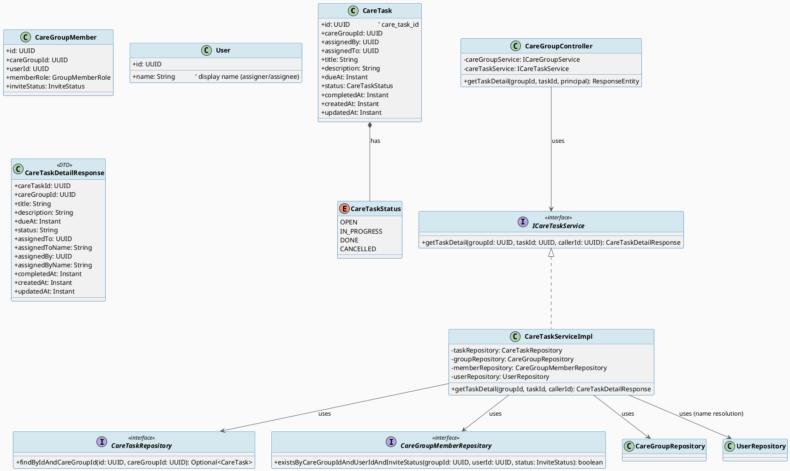
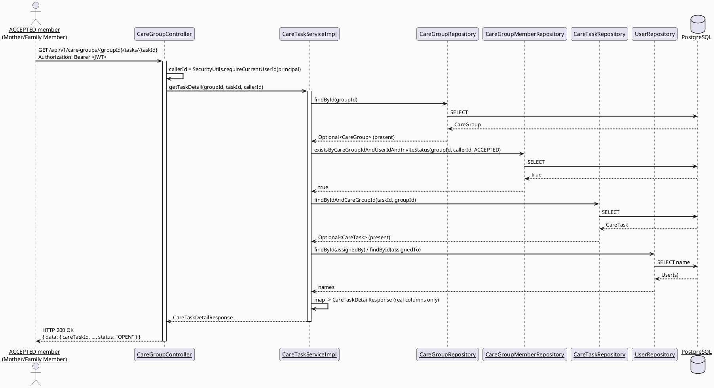
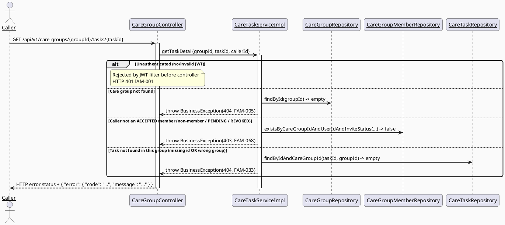

# ENGINEERING DOCUMENTATION STANDARD (EDS) v2.0
# UC-221 — View Assigned Task Detail — Technical Design Specification

| Field | Value |
|-------|-------|
| **Document ID** | `CB-FAM-IMP-221` |
| **Version** | `1.0` |
| **Date** | `2026-07-03` |
| **Status** | `Partially Implemented` |
| **Document Owner** | `PhuongNT` |
| **Author** | `AI Agent — Technical Architect` |
| **Reviewed by** | `[Tech Lead — Pending]` |
| **DPO Sign-off** | `[ ] Pending` *(module reads family task data: title/description free-text "notes" + assigner/assignee identities; see §1 Data Classification and BR-SAFETY note in §3)* |
| **Approved by** | `[Principal Architect — Pending]` |
| **Last Review** | `2026-07-03` |
| **Based on EDS** | `v2.0` |

---

## CHANGELOG

> **Policy 4.4 — Immutable History:** Không bao giờ xóa thông tin cũ. Mọi thay đổi phải ghi vào bảng này.

| Ngày | Người thực hiện | Nội dung thay đổi |
|------|-----------------|-------------------|
| 2026-07-10 | AI Agent | Phase 3: Implementation — 20/24 tests PASS; unit/service coverage green, controller/INT/E2E pending |
| 2026-07-03 | AI Agent — Technical Architect | Tạo tài liệu lần đầu — TDS cho UC-221 View Assigned Task Detail |

---

## MỤC LỤC

1. [Tổng quan Module](#1-tổng-quan-module)
2. [Ma trận Truy vết (Traceability Matrix)](#2-ma-trận-truy-vết-traceability-matrix)
3. [Architecture Decision Records (ADR)](#3-architecture-decision-records-adr)
4. [Non-Functional Requirements & SLA](#4-non-functional-requirements--sla)
5. [Static Modeling (Mô hình Tĩnh)](#5-static-modeling-mô-hình-tĩnh)
6. [Dynamic Modeling (Mô hình Động)](#6-dynamic-modeling-mô-hình-động)
7. [Domain Event Catalog](#7-domain-event-catalog)
8. [Interface Specification (Đặc tả Giao diện)](#8-interface-specification-đặc-tả-giao-diện)
9. [API Specification](#9-api-specification)
10. [Bảng mã lỗi (Error Codes)](#10-bảng-mã-lỗi-error-codes)
11. [Quy trình Triển khai (Step-by-Step)](#11-quy-trình-triển-khai-step-by-step)
12. [Rollback & Incident Runbook](#12-rollback--incident-runbook)
13. [Kịch bản Kiểm thử Chi tiết](#13-kịch-bản-kiểm-thử-chi-tiết)
14. [Phương pháp Xác minh](#14-phương-pháp-xác-minh)
15. [Mẫu thử thực tế (API Verification Samples)](#15-mẫu-thử-thực-tế-api-verification-samples)
16. [Bảng tổng hợp phân quyền (Authorization Matrix)](#16-bảng-tổng-hợp-phân-quyền-authorization-matrix)
17. [AI Prompt Constraints (CASE 2.0)](#17-ai-prompt-constraints-case-20)

---

## 1. Tổng quan Module

UC-221 "View Assigned Task Detail" is a **read-only** use case that returns the full detail of a
single `care_tasks` row: task content (title, description/notes), due date, assigner, assignee,
status, completion timestamp, and care-group context. Per SRS §3.3.17.6 the Primary Actors are
**Mother** and **Family Member** (Secondary: None), and the feature is used **Frequently**. This
TDS is one of a family-sync batch of use cases that lay the FIRST real JPA design over the
pre-existing `care_tasks` table (co-designed alongside UC-73 Assign Family Task and the sibling
UC-222 Update Family Task). No create/update/delete/status-transition behaviour is in scope here.

| Field | Value |
|-------|-------|
| **Module Name** | Family Sync — View Assigned Task Detail |
| **Bounded Context** | `family` (same bounded context as UC-70 Create Care Group, UC-216 View Members, UC-73 Assign Family Task, UC-222 Update Family Task) |
| **Data Classification** | `PII` / family-scoped — the response exposes assigner + assignee **display names** (personal data) and free-text task title/description ("notes") that may reference caregiving/health-adjacent instructions. Not `Sensitive-PII` (no diagnosis, payment, or clinical record), but governed by BR-PRIVACY and BR-SAFETY (see §3, ADR-FAM-072). |
| **Compliance Scope** | `PDPA` (Vietnam) — minimum-necessary access: only ACCEPTED members of the task's care group may read it. `N/A` for GDPR (CareBridge is VN-scoped; GDPR citations inherited from the generic EDS template are Not applicable and are kept only where the template structurally requires them, marked accordingly). |
| **Upstream Dependencies** | `family` module (`CareGroup`, `CareGroupMember`, `CareGroupRepository`, `CareGroupMemberRepository` — existing/implemented), the new `CareTask` entity + `CareTaskRepository` (co-designed with UC-73), `security` module (`User`, `UserRepository` for name resolution), `common` (`ApiResponse`, `SecurityUtils`, `BusinessException`) |
| **Downstream Consumers** | Mobile app "Chi tiết công việc" screen (CB-170) — read surface only. No module consumes an event from this UC (pure read). |

### Scope

**IN SCOPE:**
- Read a single `care_tasks` row by `taskId`, scoped to its `care_group_id`, and return it as a
  DTO (`CareTaskDetailResponse`) using **only real schema columns**.
- Authorization: caller must be an `ACCEPTED` member (any role: `OWNER`/`MEMBER`/`VIEWER`) of the
  task's care group — read visibility is broader than write (ADR-FAM-068, reusing the
  member-visibility pattern ADR-FAM-002 from UC-216).
- Resolve assigner (`assigned_by`) and assignee (`assigned_to`) display names via
  `UserRepository` (`User.name`), consistent with the family module's name-resolution intent.
- Map `care_tasks.status` through the canonical `CareTaskStatus { OPEN, IN_PROGRESS, DONE, CANCELLED }`
  enum (ADR-FAM-030, adopted from UC-73 — **not redefined here**).
- Not-found handling for missing group / missing task / task-not-in-group.

**OUT OF SCOPE (explicitly deferred — do NOT implement here):**
- Task **priority / "MỨC ĐỘ"** shown in the CB-170 mockup — **no column exists** in `care_tasks`
  for priority; excluded from the response (ADR-FAM-071).
- Task **checklist / sub-items ("Hạng mục chi tiết")** shown in the mockup — no table/column
  supports sub-items; excluded (ADR-FAM-071).
- Task **activity/audit history ("LỊCH SỬ HOẠT ĐỘNG", e.g. "Mẹ Hoa đã tạo công việc")** shown in
  the mockup — the flat `care_tasks` row cannot express a history log; a richer history view would
  require a separate `AuditAction`-style task-history table, which is **out of scope** (ADR-FAM-071).
- Creating/assigning a task (UC-73), updating a task (UC-222), cancelling a task (UC-223),
  assignee updating own task status (UC-3.3.3.3) — all separate TDS files.
- Any write, event publish, or scheduled notification — this UC is a pure read.

---

## 2. Ma trận Truy vết (Traceability Matrix)

| Requirement ID | Loại (BR/ADR/US) | Mô tả yêu cầu | Thành phần Code | Compliance Target | ADR liên quan |
|----------------|------------------|---------------|-----------------|-------------------|---------------|
| SRS §3.3.17.6 (UC-221) | User Story | Display task content, due date, assigner, status, and notes for one assigned task | `CareGroupController.getTaskDetail()`, `CareTaskServiceImpl.getTaskDetail()` | — | ADR-FAM-030, ADR-FAM-068, ADR-FAM-069, ADR-FAM-070, ADR-FAM-071 |
| BR-RBAC | Business Rule | Users may access only functions allowed by their role/permission scope | `existsByCareGroupIdAndUserIdAndInviteStatus(...)` membership check | PDPA minimum-necessary | ADR-FAM-068 |
| BR-PRIVACY | Business Rule | Health/family data requires consent/purpose/minimum-necessary access | Membership gate before read; DTO mapping (no raw entity exposure) | PDPA | ADR-FAM-068, ADR-FAM-002 (reuse) |
| BR-SAFETY | Business Rule | Medical guidance must be non-diagnostic, escalation-aware, red-flag safe | *(No AI/guidance generated by this read UC; free-text "notes" are stored user content returned as-is — no existing moderation mechanism for care-task notes; see ADR-FAM-072 — Open)* | Safety (Open) | ADR-FAM-072 |
| PRE-4 | Precondition | Required reference data exists (care group + care task) | `CareGroupRepository.findById`, `CareTaskRepository.findByIdAndCareGroupId` | — | — |
| E1 | Exception | Access denied when unauthenticated / unauthorized / out of scope | 401 (JWT filter) / 403 `FAM-068` (non-member) | PDPA | ADR-FAM-068 |
| E2 | Exception | Invalid/missing/conflicting data rejected with a message | 404 `FAM-005` (group) / 404 `FAM-033` (task) | — | — |
| POST-1 | Postcondition | A clear result state is shown | 200 `CareTaskDetailResponse` or typed error | — | — |
| POST-3 | Postcondition | Sensitive actions recorded for audit where required | *(Read is not audited — consistent with UC-216 read-only; view-audit is Open, see §7/OPEN-2)* | PDPA (Open) | — |
| ADR-FAM-030 | Decision *(reused)* | `CareTaskStatus { OPEN, IN_PROGRESS, DONE, CANCELLED }` | `CareTask.status` | — | — |
| ADR-FAM-002 | Decision *(reused)* | Member-only (`ACCEPTED`) visibility for care-group data | membership gate | PDPA | — |
| ADR-FAM-068 | Decision | Read visibility = any ACCEPTED member of the task's group (not assignee-only) | `CareTaskServiceImpl.getTaskDetail()` | BR-RBAC | — |
| ADR-FAM-069 | Decision | Endpoint nested under `CareGroupController` at `/{groupId}/tasks/{taskId}` | `CareGroupController.getTaskDetail()` | — | — |
| ADR-FAM-070 | Decision | Entity/service naming (`CareTask` / `ICareTaskService`) co-designed with UC-73/UC-222 | `CareTask`, `ICareTaskService`, `CareTaskRepository` | — | — |
| ADR-FAM-071 | Decision | Priority / checklist / activity-history are out of scope (no schema support) | `CareTaskDetailResponse` (real columns only) | — | — |
| ADR-FAM-072 | Decision | BR-SAFETY for free-text notes — no new moderation logic; flagged Open | `CareTaskServiceImpl` (returns stored text as-is) | Safety (Open) | — |

---

## 3. Architecture Decision Records (ADR)

> This UC **reuses** two ADRs from sibling specs without redefining them:
> - **ADR-FAM-002** (`Accepted`, UC-216) — member-only (`ACCEPTED`) visibility for care-group data.
> - **ADR-FAM-030** (`Proposed`, UC-73) — canonical `CareTaskStatus { OPEN, IN_PROGRESS, DONE, CANCELLED }`.
>
> **Project-wide reconciliation item (OPEN-RECON):** `UC85_UpdateAssignedTaskStatus` (Draft)
> proposes a *conflicting* enum `CareTaskStatus { OPEN, IN_PROGRESS, COMPLETED, NEEDS_SUPPORT }`.
> This TDS commits to the **UC-73 ADR-FAM-030 variant** (`…DONE, CANCELLED`) per the confirmed
> family-sync batch decision. The UC-85 variant is **not** used here. Tech Lead must reconcile the
> two Drafts before either is implemented — flagged as an open, project-wide item (not resolved by
> this document).

### ADR-FAM-068 — Read visibility scope: any ACCEPTED member (not assignee-only)

| Field | Value |
|-------|-------|
| **Status** | `Proposed` |
| **Deciders** | `AI Agent (Technical Architect)` |
| **Date** | `2026-07-03` |

#### Bối cảnh (Context)
SRS §3.3.17.6 names **both** "Mother" and "Family Member" as Primary Actors, with no further
restriction that only the assignee may view. CareBridge's shared-care-coordination model (UC-216
member list, UC-73 task list visible to group members) implies any active group member can see a
task's detail. The question is whether read access is restricted to the assignee (`assigned_to`)
or extended to all `ACCEPTED` members of the task's care group.

#### Các phương án đã xem xét (Options Considered)

| Phương án | Mô tả | Ưu điểm | Nhược điểm |
|-----------|-------|----------|------------|
| A | Only the assignee (`assigned_to == callerId`) may view the task | Narrowest exposure | Contradicts SRS naming both actors; the assigner (Mother) could not view a task she created; breaks the coordination model (UC-73 already lists tasks to all members) |
| B | Any `ACCEPTED` member (`OWNER`/`MEMBER`/`VIEWER`) of the task's care group may view detail | Matches SRS Primary Actors (Mother + Family Member); consistent with UC-216 member-visibility (ADR-FAM-002) and UC-73's group-scoped task list; read broader than write is a standard least-surprise rule | Slightly broader than assignee-only; mitigated by the group boundary (never cross-group) |

#### Quyết định (Decision)
Chọn **Phương án B** — the caller must be an `ACCEPTED` member of the task's `care_group_id`
(any `memberRole`). Enforced by the **existing** repository method
`CareGroupMemberRepository.existsByCareGroupIdAndUserIdAndInviteStatus(groupId, callerId, ACCEPTED)`
— the same primitive UC-216 uses (ADR-FAM-002). Read access is intentionally broader than the
Owner-only *write* rule (ADR-FAM-032, UC-73). This aligns with SRS naming both Mother and Family
Member as actors with no assignee-only wording.

#### Hệ quả (Consequences)

**Tích cực:** Consistent with UC-216/UC-73 member-scoped visibility; no new authorization
primitive needed; assigner and assignee both can view.

**Tiêu cực / Trade-offs:** A `VIEWER`-role member can read task notes; acceptable under
minimum-necessary since they are already an accepted participant in the same care group. If
Product later wants assignee-only detail, that is a one-line change in the service, not a new
endpoint (**Open — OPEN-1**, no SRS evidence for a tighter rule today).

**Compliance Impact:** BR-RBAC / BR-PRIVACY — access bounded to the care group; no cross-group leakage.

---

### ADR-FAM-069 — Endpoint placement (nested GET under CareGroupController)

| Field | Value |
|-------|-------|
| **Status** | `Proposed` |
| **Deciders** | `AI Agent (Technical Architect)` |
| **Date** | `2026-07-03` |

#### Bối cảnh (Context)
The existing `CareGroupController` (`@RequestMapping("/api/v1/care-groups")`) already hosts all
family-sync endpoints, and UC-73 places the task **list** at `GET /api/v1/care-groups/{groupId}/tasks`.
Authorization for UC-221 requires the task's `care_group_id` to run the membership check, so the
group id is naturally part of the request context.

#### Các phương án đã xem xét (Options Considered)

| Phương án | Mô tả | Ưu điểm | Nhược điểm |
|-----------|-------|----------|------------|
| A | Flat `GET /api/v1/care-tasks/{taskId}` (new controller / resource root) | Shorter URL | Must first load the task to discover its group before authorizing (extra fetch before the 403 gate → can leak task existence to non-members via timing); introduces a parallel controller against the "reuse CareGroupController" convention |
| B | Nested `GET /api/v1/care-groups/{groupId}/tasks/{taskId}` on the existing `CareGroupController` | Reuses the controller + base path (shared-context convention); group id present for the membership gate before any task fetch; consistent with UC-73's `/{groupId}/tasks` list path | `groupId` is redundant with the task's own `care_group_id` — resolved by verifying the task belongs to that group (`findByIdAndCareGroupId`), returning `FAM-033` on mismatch |

#### Quyết định (Decision)
Chọn **Phương án B** — `GET /api/v1/care-groups/{groupId}/tasks/{taskId}` added to the existing
`CareGroupController`, delegating to `ICareTaskService.getTaskDetail(groupId, taskId, callerId)`.
The service authorizes membership on `{groupId}` **before** fetching the task, then loads the task
scoped to that group via `CareTaskRepository.findByIdAndCareGroupId(taskId, groupId)`.

#### Hệ quả (Consequences)

**Tích cực:** Membership gate runs before task existence is revealed (non-members get `403`, never
a `404` that leaks whether a task id exists). Consistent with UC-73's nested list path.

**Tiêu cực / Trade-offs:** A task requested under the wrong `{groupId}` returns `404 FAM-033`
(scoped-not-found) rather than a distinct "wrong group" code — intentional, to avoid leaking
cross-group existence.

**Compliance Impact:** Reduces information disclosure to non-members.

---

### ADR-FAM-070 — Entity/service naming (co-designed with UC-73 / UC-222)

| Field | Value |
|-------|-------|
| **Status** | `Proposed` |
| **Deciders** | `AI Agent (Technical Architect)` |
| **Date** | `2026-07-03` |

#### Bối cảnh (Context)
No JPA entity/repository/service exists yet for `care_tasks`; UC-221 and its siblings (UC-73,
UC-222) are laying the first real design. UC-73 (the designated **primary reference for the
`care_tasks` entity design** for this batch) names the entity `CareTask` (`@Entity @Table(name = "care_tasks")`)
and the service `ICareTaskService` / `CareTaskServiceImpl`, with repository `CareTaskRepository`
exposing `findByIdAndCareGroupId(UUID, UUID)`. The parent orchestration also suggested a default
class name `CareTaskEntity` if the sibling naming were unreadable.

#### Các phương án đã xem xét (Options Considered)

| Phương án | Mô tả | Ưu điểm | Nhược điểm |
|-----------|-------|----------|------------|
| A | Entity class `CareTaskEntity` (parent-suggested default) | Explicit "-Entity" suffix | Diverges from UC-73's already-drafted `CareTask`; would create two entity classes for one table across the batch |
| B | Entity class `CareTask` (match UC-73, the primary entity-design reference) | Single canonical entity for `care_tasks` across UC-73/221/222; matches CareBridge's existing no-suffix convention (`CareGroup`, `CareGroupMember`) | Parent's suggested `CareTaskEntity` name not used verbatim |

#### Quyết định (Decision)
Chọn **Phương án B** — entity `CareTask`, service `ICareTaskService`/`CareTaskServiceImpl`,
repository `CareTaskRepository` — matching UC-73, the batch's primary `care_tasks` entity-design
reference, and CareBridge's existing no-suffix entity convention (`CareGroup`, `CareGroupMember`).
Two specs greenfielding the **same** table must share **one** entity class; UC-73 already named
it `CareTask`, so this spec adopts that.

#### Hệ quả (Consequences)

**Tích cực:** One entity per table across the batch; no duplicate-class risk; consistent naming.

**Tiêu cực / Trade-offs:** Parent-suggested default `CareTaskEntity` is superseded by consistency
with UC-73. **OPEN-NAMING:** if sibling UC-222 lands with a different entity name, Tech Lead must
reconcile to a single class — this spec's position is `CareTask`.

**Compliance Impact:** None.

---

### ADR-FAM-071 — Priority / checklist / activity-history are out of scope (no schema support)

| Field | Value |
|-------|-------|
| **Status** | `Proposed` |
| **Deciders** | `AI Agent (Technical Architect)` |
| **Date** | `2026-07-03` |

#### Bối cảnh (Context)
The CB-170 mockup (shared across UC-221/222/223) renders **priority ("MỨC ĐỘ", flag icon)**, a
**checklist of sub-items ("Hạng mục chi tiết")**, and an **activity/audit history timeline
("LỊCH SỬ HOẠT ĐỘNG")**. None of these are expressible from the flat `care_tasks` row
(`care_task_id, care_group_id, assigned_by, assigned_to, title, description, due_at, status,
completed_at, created_at, updated_at` — verified `V1__init_schema.sql` lines 753-765). There is no
`priority` column, no sub-item table, and no task-history table.

#### Quyết định (Decision)
The `CareTaskDetailResponse` returns **only** real schema columns. Priority, checklist, and
activity-history are **out-of-scope UI aspirations** and are **not** invented as new
columns/tables in this TDS. A richer history view would need a dedicated `AuditAction`-style
task-history table (a separate future design). The mockup's "status" chip ("Đang thực hiện") maps
to `CareTaskStatus.IN_PROGRESS`; "Chưa bắt đầu" maps to `OPEN`.

#### Hệ quả (Consequences)

**Tích cực:** Response is fully backed by the schema; no speculative DDL; no migration.

**Tiêu cực / Trade-offs:** Mobile cannot render priority/checklist/history from this API. **Open —
OPEN-3:** if Product wants these, they require a separate schema design + TDS (not this one).

**Compliance Impact:** None.

---

### ADR-FAM-072 — BR-SAFETY handling for free-text task notes (no new moderation logic)

| Field | Value |
|-------|-------|
| **Status** | `Proposed` |
| **Deciders** | `AI Agent (Technical Architect)` |
| **Date** | `2026-07-03` |

#### Bối cảnh (Context)
SRS §3.3.17.6 cites **BR-SAFETY** ("medical guidance must be non-diagnostic, escalation-aware,
red-flag safe") for this UC — likely because a task's `description` ("notes") could reference
health-related care instructions. This is a **read** UC: it stores nothing and generates no AI
guidance. No existing moderation mechanism for free-text `care_tasks` notes was found in the
repository (moderation exists for community content, not for family task notes).

#### Quyết định (Decision)
This UC returns the stored `title`/`description` **as-is**; it neither diagnoses, prescribes, nor
generates guidance, so BR-SAFETY's non-diagnostic/red-flag rules are **not triggered by any system
behaviour here**. No new content-moderation logic for task notes is introduced. Whether
free-text task notes should be moderated at **write** time (UC-73/UC-222) against BR-SAFETY is an
**Open** cross-UC item (**OPEN-4**) — there is currently no such enforcement mechanism in the repo,
and inventing one is out of scope for a read UC.

#### Hệ quả (Consequences)

**Tích cực:** No scope creep; the read path stays a pure projection of stored data.

**Tiêu cực / Trade-offs:** Unmoderated notes could theoretically contain unsafe content — but that
risk is owned by the write-side UCs, not this read. Flagged OPEN-4 for Product/Safety review.

**Compliance Impact:** BR-SAFETY — marked `Open`; no enforcement mechanism exists for care-task
free text today.

---

## 4. Non-Functional Requirements & SLA

### 4.1. Performance & Availability

| Category | Requirement | Target SLA | Measurement Method | Compliance Basis |
|----------|-------------|------------|---------------------|------------------|
| Latency | `GET /api/v1/care-groups/{groupId}/tasks/{taskId}` (p99) | `< 200ms` (single-row read + ≤2 name lookups) | Manual timing / future k6 test | — |
| Availability | Uptime (monthly) | Inherits API-wide `99.9%` target | Uptime monitor | — |

> Latency target mirrors UC-216 (`< 200ms` for a read endpoint). This is a **proposed** default —
> no project-wide SLA doc was found (Open).

### 4.2. Data Integrity & Retention

| Category | Requirement | Target | Verification Method | Compliance Basis |
|----------|-------------|--------|---------------------|------------------|
| Durability | Read-only endpoint — no write | N/A (`@Transactional(readOnly = true)`) | Code review | — |
| Retention | No new retention rule introduced | Inherits project-wide policy | — | — |

### 4.3. Security

| Category | Requirement | Target | Verification Method | Compliance Basis |
|----------|-------------|--------|---------------------|------------------|
| Access control | Membership-based (ACCEPTED member of the task's group) | 100% — non-members get `403 FAM-068` before task existence is revealed | Auth Matrix (§16), authorization test cases | BR-RBAC, ADR-FAM-068 |
| Cross-group isolation | Task requested under wrong group → `404 FAM-033`, never cross-group data | 100% | `findByIdAndCareGroupId` scoping; integration test | BR-PRIVACY |
| Minimal exposure | Response exposes only display names + task fields — never email/phone of assigner/assignee | 100% | Response schema; test asserts no `@`/`phone`/`email` | BR-PRIVACY |

### 4.4. Scalability & Capacity Planning

Single-row primary-key read plus at most two `users` lookups (assigner, assignee). Backed by the
existing PK on `care_task_id` and `idx_care_tasks_care_group_id`. *Not applicable* to further
capacity planning — CareBridge scale at this stage does not require dedicated scaling work for a
point read.

---

## 5. Static Modeling (Mô hình Tĩnh)

### 5.1. Class Diagram (PlantUML)



### 5.2. Data Structure (Flyway SQL Migration)

**No migration required.** UC-221 is read-only over the pre-existing `care_tasks` table
(`V1__init_schema.sql` lines 753-765, verified ground truth). The `CareTask` JPA entity is the
first mapping of this table and is co-designed with UC-73 (ADR-FAM-070).

```sql
-- EXISTING TABLE — V1__init_schema.sql (lines 753-765). NOT modified by this feature.
CREATE TABLE public.care_tasks (
    care_task_id  uuid         NOT NULL DEFAULT gen_random_uuid(),
    care_group_id uuid         NOT NULL,
    assigned_by   uuid,
    assigned_to   uuid,
    title         varchar(255) NOT NULL,
    description   text,
    due_at        timestamptz,
    status        varchar(20)  NOT NULL DEFAULT 'OPEN',
    completed_at  timestamptz,
    created_at    timestamptz  NOT NULL DEFAULT now(),
    updated_at    timestamptz  NOT NULL DEFAULT now()
);
-- Indexes present: idx_care_tasks_care_group_id, idx_care_tasks_status.
-- No CHECK constraint on `status` — CareTaskStatus enum is a code-level decision (ADR-FAM-030, UC-73).
-- No `priority` column, no sub-item table, no task-history table (see ADR-FAM-071).
```

**Current vs Target State:** Current = table exists, no JPA entity/repository maps it yet (unless
UC-73/UC-222 land first — this entity/repo is shared). Target = a point-read code path
(`getTaskDetail`) wired end-to-end, backed by the same table with **zero DDL**.

---

## 6. Dynamic Modeling (Mô hình Động)

### 6.1. Sequence Diagram — Happy Path: member views task (PlantUML)



### 6.2. Sequence Diagram — Error Paths (PlantUML)



> **Gate ordering invariant:** group-exists → membership → task-fetch. Membership (`403 FAM-068`)
> is evaluated **before** the task is fetched, so a non-member never learns whether a task id
> exists (ADR-FAM-069).

### 6.3. State Machine

*Not applicable in this UC's scope.* UC-221 performs **no** state transition — it only reads and
projects the current `status`. The `CareTask` lifecycle FSM (`OPEN → IN_PROGRESS → DONE / CANCELLED`)
is owned by the write UCs (UC-73 create → `OPEN`; UC-3.3.3.3 status updates; UC-223 cancel). This
read may observe any of the four `CareTaskStatus` values and returns them verbatim as a string.

---

## 7. Domain Event Catalog

### 7.1. Events Published (Phát ra)

| Event Name | Trigger | Publisher | Subscriber(s) | Payload Schema | Async? |
|------------|---------|-----------|---------------|----------------|--------|
| — | *Not applicable — read-only endpoint publishes no domain event* | — | — | — | — |

### 7.2. Events Consumed (Tiêu thụ)

*Not applicable — UC-221 consumes no domain event.*

### 7.3. Payload Schema

*Not applicable — no events (pure read).*

> **Audit (POST-3):** Consistent with UC-216 (an approved read-only sibling), UC-221 does **not**
> write an audit log for the read. **OPEN-2:** the codebase has `VIEW_HEALTH_RECORD`/`PROFILE_VIEWED`
> audit actions, suggesting some reads of sensitive data are audited; whether care-task detail
> views warrant a `CARE_TASK_VIEWED`-style audit action (not currently in `AuditAction`) is an
> open Product/DPO decision. No audit action is invented by this TDS.

---

## 8. Interface Specification (Đặc tả Giao diện)

### 8.1. Service Interface

```java
// CareTaskDetailResponse.java — Output DTO (real schema columns only — ADR-FAM-071)
// @version 1.0
public class CareTaskDetailResponse {
    private UUID    careTaskId;      // care_tasks.care_task_id
    private UUID    careGroupId;     // care_tasks.care_group_id
    private String  title;           // care_tasks.title
    private String  description;     // care_tasks.description ("notes")
    private Instant dueAt;           // care_tasks.due_at
    private String  status;          // CareTaskStatus.name() — OPEN/IN_PROGRESS/DONE/CANCELLED
    private UUID    assignedTo;      // care_tasks.assigned_to
    private String  assignedToName;  // User.name of assignee (null if assigned_to is null/unknown)
    private UUID    assignedBy;      // care_tasks.assigned_by
    private String  assignedByName;  // User.name of assigner (null if assigned_by is null/unknown)
    private Instant completedAt;     // care_tasks.completed_at (null unless DONE)
    private Instant createdAt;       // care_tasks.created_at
    private Instant updatedAt;       // care_tasks.updated_at
    // @Data @Builder — matches existing family.dto response style
    // NOTE: intentionally NO priority / checklist / activityHistory fields (ADR-FAM-071)
}

// ICareTaskService.java — Service Contract (shared with UC-73/UC-222; this UC adds getTaskDetail)
// @version 1.0
public interface ICareTaskService {

    /**
     * Returns the full detail of one care task, scoped to its care group.
     * Caller must be an ACCEPTED member (any role) of the task's care group (ADR-FAM-068).
     * @throws BusinessException (FAM-005/404) if the care group does not exist
     * @throws BusinessException (FAM-068/403) if the caller is not an ACCEPTED member of the group
     * @throws BusinessException (FAM-033/404) if no task with taskId exists in that group
     */
    CareTaskDetailResponse getTaskDetail(UUID groupId, UUID taskId, UUID callerId);

    // (UC-73 assignFamilyTask / listTasks and UC-222 update methods live on the same interface —
    //  not restated here; this TDS only defines getTaskDetail.)
}
```

### 8.2. Repository Interface

```java
// CareTaskRepository.java — co-designed with UC-73 (ADR-FAM-070); UC-221 uses findByIdAndCareGroupId
// @version 1.0
public interface CareTaskRepository extends JpaRepository<CareTask, UUID> {

    /** Group-scoped point read — returns empty if the id does not exist OR belongs to another group. */
    Optional<CareTask> findByIdAndCareGroupId(UUID id, UUID careGroupId);
}

// CareGroupMemberRepository.java — EXISTING interface, method already present (verified):
//   boolean existsByCareGroupIdAndUserIdAndInviteStatus(UUID careGroupId, UUID userId, InviteStatus status);
//   -> reused as-is for the membership gate; no new method needed.

// UserRepository.java — EXISTING (extends JpaRepository<User, UUID>): findById(UUID) reused for name resolution.
```

---

## 9. API Specification

### 9.1. Endpoints Table

| Method | Path | Auth Level | Required Roles | Rate Limit | Idempotent? |
|--------|------|------------|----------------|------------|-------------|
| `GET` | `/api/v1/care-groups/{groupId}/tasks/{taskId}` | JWT Bearer (`isAuthenticated()`) | Any authenticated user who is an `ACCEPTED` member of the group (business check, ADR-FAM-068) | 300/min | Yes |

> Rate limit is a proposed default (Open — no project-wide rate-limit policy found in
> `CareGroupController`; mirrors UC-73's read split of 300/min).

### 9.2. Request / Response Schemas

#### `GET /api/v1/care-groups/{groupId}/tasks/{taskId}` — View one assigned task

**Response — 200 OK (Happy Path):**
```json
{
  "data": {
    "careTaskId": "c1a2b3c4-1111-4b1b-9a3d-000000000010",
    "careGroupId": "a0a0a0a0-0000-4b1b-9a3d-000000000001",
    "title": "Chuẩn bị đồ dùng đi sinh cho mẹ và bé",
    "description": "Mua tã bỉm, quần áo sơ sinh, giấy tờ tùy thân của mẹ",
    "dueAt": "2026-10-15T09:00:00Z",
    "status": "OPEN",
    "assignedTo": "b16a8f9e-2222-4b1b-9a3d-000000000002",
    "assignedToName": "Bố Tuấn",
    "assignedBy": "9f9f9f9f-3333-4b1b-9a3d-000000000003",
    "assignedByName": "Mẹ Hoa",
    "completedAt": null,
    "createdAt": "2026-10-10T09:00:00Z",
    "updatedAt": "2026-10-10T09:00:00Z"
  }
}
```

**Response — 403 Forbidden (caller not an accepted member):**
```json
{
  "error": {
    "code": "FAM-068",
    "message": "You are not an accepted member of this care group"
  }
}
```

**Response — 404 Not Found (task not found in this group):**
```json
{
  "error": {
    "code": "FAM-033",
    "message": "Care task not found"
  }
}
```

**Response — 404 Not Found (care group not found):**
```json
{
  "error": {
    "code": "FAM-005",
    "message": "Care group not found: a0a0a0a0-0000-4b1b-9a3d-000000000001"
  }
}
```

**Response — 401 Unauthorized (no/invalid JWT):**
```json
{
  "error": {
    "code": "IAM-001",
    "message": "Authentication required"
  }
}
```

---

## 10. Bảng mã lỗi (Error Codes)

> Tiền tố `FAM-` (family module). `FAM-005` reused (UC-70/216, not redefined). `FAM-033` reused
> per UC-73's explicit reservation for "care task not found". `FAM-068` is this UC's new code.
> `FAM-069..071` are pre-allocated to UC-221 (per the batch error-code map) and reserved for
> future additions to this UC, to avoid collision with sibling UC-217..220/222 ranges.

| Code | HTTP Status | Message (EN) | Message (VI) | Trigger Condition |
|------|-------------|--------------|--------------|-------------------|
| `FAM-005` | 404 | Care group not found | Không tìm thấy nhóm chăm sóc | *(reused UC-70/216)* `groupId` does not exist |
| `FAM-033` | 404 | Care task not found | Không tìm thấy công việc | *(reused per UC-73 reservation)* No task with `taskId` exists in `groupId` (missing id OR belongs to another group — `findByIdAndCareGroupId` empty) |
| `FAM-068` | 403 | You are not an accepted member of this care group | Bạn không phải thành viên đã chấp nhận của nhóm | Caller has no `care_group_members` row with `invitation_status = ACCEPTED` for `groupId` (non-member / PENDING / REVOKED) — ADR-FAM-068 |
| `FAM-069` | — | *(Reserved — UC-221 future use)* | *(Dự phòng)* | Pre-allocated to UC-221; not used by current code paths |
| `FAM-070` | — | *(Reserved — UC-221 future use)* | *(Dự phòng)* | Pre-allocated to UC-221; not used by current code paths |
| `FAM-071` | — | *(Reserved — UC-221 future use)* | *(Dự phòng)* | Pre-allocated to UC-221; not used by current code paths |

> `IAM-001` (401, unauthenticated) is produced by the platform JWT filter, not this feature's code.

---

## 11. Quy trình Triển khai (Step-by-Step)

### 11.1. Prerequisites

- [ ] ADR-FAM-068/069/070/071/072 reviewed and Accepted (currently `Proposed`)
- [ ] Reused ADR-FAM-002 (`Accepted`) and ADR-FAM-030 (`Proposed`, UC-73) confirmed for this batch
- [ ] OPEN-RECON (UC-73 vs UC-85 enum conflict) resolved or explicitly deferred by Tech Lead
- [ ] Shared `CareTask` entity + `CareTaskRepository` design agreed across UC-73/221/222 (ADR-FAM-070)
- [ ] DPO note reviewed — response exposes display names (PII), no email/phone
- [ ] Staging environment ready (no new migration to apply — §11.2)

### 11.2. Pre-Migration Checklist

*Not applicable — no migration is introduced by this feature (see §5.2). `care_tasks` already
exists (`V1__init_schema.sql`).*

### 11.3. Implementation Steps

#### Chặng 1 — Shared entity/enum/repository (if not already created by UC-73/UC-222)

```java
// CareTask.java — package com.carebridge.backend.family.entity (co-designed; ADR-FAM-070)
// (Same mapping proposed by UC-73 — create only if not already present.)
@Entity @Table(name = "care_tasks")
@Getter @Setter @Builder @NoArgsConstructor @AllArgsConstructor
public class CareTask {
    @Id @GeneratedValue(strategy = GenerationType.UUID)
    @Column(name = "care_task_id", updatable = false, nullable = false)
    private UUID id;
    @Column(name = "care_group_id", nullable = false) private UUID careGroupId;
    @Column(name = "assigned_by") private UUID assignedBy;
    @Column(name = "assigned_to") private UUID assignedTo;
    @Column(name = "title", nullable = false, length = 255) private String title;
    @Column(name = "description", columnDefinition = "text") private String description;
    @Column(name = "due_at") private Instant dueAt;
    @Builder.Default @Enumerated(EnumType.STRING)
    @Column(name = "status", nullable = false, length = 20)
    private CareTaskStatus status = CareTaskStatus.OPEN;
    @Column(name = "completed_at") private Instant completedAt;
    @CreationTimestamp @Column(name = "created_at", nullable = false, updatable = false)
    private Instant createdAt;
    @UpdateTimestamp @Column(name = "updated_at", nullable = false) private Instant updatedAt;
}

// CareTaskRepository.java — package com.carebridge.backend.family.repository
public interface CareTaskRepository extends JpaRepository<CareTask, UUID> {
    Optional<CareTask> findByIdAndCareGroupId(UUID id, UUID careGroupId);
}
```

#### Chặng 2 — Service method (read-only)

```java
// CareTaskServiceImpl.getTaskDetail — family.service.impl
@Transactional(readOnly = true)
public CareTaskDetailResponse getTaskDetail(UUID groupId, UUID taskId, UUID callerId) {
    groupRepository.findById(groupId)
        .orElseThrow(() -> new BusinessException(HttpStatus.NOT_FOUND, "FAM-005",
            "Care group not found: " + groupId));

    boolean isMember = memberRepository.existsByCareGroupIdAndUserIdAndInviteStatus(
        groupId, callerId, InviteStatus.ACCEPTED);
    if (!isMember) {
        throw new BusinessException(HttpStatus.FORBIDDEN, "FAM-068",
            "You are not an accepted member of this care group");
    }

    CareTask task = taskRepository.findByIdAndCareGroupId(taskId, groupId)
        .orElseThrow(() -> new BusinessException(HttpStatus.NOT_FOUND, "FAM-033",
            "Care task not found"));

    String assignedByName = resolveName(task.getAssignedBy());
    String assignedToName = resolveName(task.getAssignedTo());
    return /* map task + names -> CareTaskDetailResponse (real columns only) */;
}

private String resolveName(UUID userId) {
    return userId == null ? null
        : userRepository.findById(userId).map(User::getName).orElse(null);
}
```

#### Chặng 3 — Controller endpoint (existing CareGroupController)

```java
// UC-221: View one assigned task detail
@GetMapping("/{groupId}/tasks/{taskId}")
@PreAuthorize("isAuthenticated()")
public ResponseEntity<ApiResponse<CareTaskDetailResponse>> getTaskDetail(
        @PathVariable UUID groupId,
        @PathVariable UUID taskId,
        Principal principal) {
    var callerId = SecurityUtils.requireCurrentUserId(principal);
    return ResponseEntity.ok(ApiResponse.success(
        careTaskService.getTaskDetail(groupId, taskId, callerId)));
}
```

#### Chặng 4 — Verification sau deploy

```bash
./mvnw test -Dtest=CareTaskServiceGetDetailTest,CareGroupControllerGetTaskDetailTest
curl -X GET https://[host]/api/v1/health
# Expected: {"status": "ok"}
```

### 11.4. Deployment Checklist

- [ ] No migration to run (confirmed §5.2/§11.2)
- [ ] `./mvnw test` green for new `family` read tests
- [ ] Health check endpoint returns 200
- [ ] Non-member GET returns `403 FAM-068` (not `404`) — no task-existence leak
- [ ] Response contains display names only (no email/phone)

---

## 12. Rollback & Incident Runbook

### 12.1. Điều kiện kích hoạt Rollback (Trigger Conditions)

| Điều kiện | Ngưỡng | Người quyết định |
|-----------|--------|------------------|
| Error rate tăng đột biến trên endpoint mới | > 5% trong 5 phút | On-call Engineer |
| Latency p99 vượt ngưỡng | > 2x baseline (§4.1) | On-call Engineer |
| Cross-group task data leak (task from another group returned) | Bất kỳ case nào | Tech Lead + DPO |
| Non-member able to read a task (403 gate bypassed) | Bất kỳ case nào | Tech Lead + DPO |

### 12.2. Rollback Procedure

```bash
# No DB rollback needed — no migration was introduced.
# Step 1: Revert code deploy only.
kubectl rollout undo deployment/carebridge-api

# Step 2: Verify rollback
kubectl rollout status deployment/carebridge-api
curl -X GET https://[host]/api/v1/health

# Step 3: Smoke test — confirm existing UC-216 members endpoint still functions
curl -X GET https://[host]/api/v1/care-groups/{groupId}/members -H "Authorization: Bearer [token]"
```

### 12.3. Notification Protocol

| Thời điểm | Người nhận | Kênh | Template |
|-----------|------------|------|----------|
| Ngay khi phát hiện | On-call team | Slack `#incident` | "🚨 UC-221 task-detail incident: [mô tả]" |
| Nếu cross-group/PII leak | DPO | Email | *(Bắt buộc — PDPA; task notes + member names exposed cross-group)* |

### 12.4. Post-Incident Review (PIR)

Standard PIR template applies (Timeline / Root Cause / Impact / Remediation / Prevention) —
*Not applicable to fill in now*; only required if an actual incident occurs post-deploy.

---

## 13. Kịch bản Kiểm thử Chi tiết

*See companion file `UC221_ViewAssignedTaskDetail_Test-Spec.md` for the full test design, test
cases, oracle citations, and Red-Green-Refactor tracker. Per project convention the TDS defines
"what/why"; the Test-Spec defines "how tested".*

Coverage summary (detailed in Test-Spec §3/§4):
- Happy read by OWNER / MEMBER / VIEWER / assignee members.
- Non-member, PENDING, and REVOKED callers → `403 FAM-068` (security).
- Unauthenticated → `401`.
- Group not found → `404 FAM-005`; task not found / wrong group → `404 FAM-033`.
- Response never includes priority / checklist / activityHistory (ADR-FAM-071).
- Status verbatim mapping; `completedAt` null unless `DONE`; names resolved; no email/phone.

---

## 14. Phương pháp Xác minh

### 14.1. Database Inspection

```sql
-- Verify the task exists in the expected group (scoped read basis for FAM-033)
SELECT care_task_id, care_group_id, assigned_by, assigned_to, title, status, completed_at
FROM care_tasks
WHERE care_task_id = '[taskId]' AND care_group_id = '[groupId]';

-- Verify the caller's ACCEPTED membership (basis for FAM-068 gate)
SELECT user_id, invitation_status, member_role
FROM care_group_members
WHERE care_group_id = '[groupId]' AND user_id = '[callerId]';
-- Expected for 200: exactly one row with invitation_status = 'ACCEPTED'
```

### 14.2. Log / Audit Verification

```bash
# Read UC — confirm NO write/audit side effect is emitted for a view
kubectl logs -l app=carebridge-api | grep '"action":"CARE_TASK' | head -5
# Expected: no CARE_TASK_* audit action for a read (OPEN-2 — view-audit not implemented)

# Confirm no PII (email/phone) leaks into logs or response bodies
kubectl logs -l app=carebridge-api | grep -i "email\|phone\|@"
# Expected: no member email/phone in task-detail flow
```

### 14.3. Tool-based Verification

```bash
# Verify JWT claims used for callerId resolution
echo "[JWT_TOKEN]" | cut -d'.' -f2 | base64 -d | jq '.sub'
```

---

## 15. Mẫu thử thực tế (API Verification Samples)

### 15.1. Happy Path

```bash
curl -X GET https://[host]/api/v1/care-groups/a0a0a0a0-0000-4b1b-9a3d-000000000001/tasks/c1a2b3c4-1111-4b1b-9a3d-000000000010 \
  -H "Authorization: Bearer [JWT_TOKEN_MEMBER]" \
  -H "X-Correlation-Id: $(uuidgen)"
```

**Expected Response (200):** see §9.2.

### 15.2. Error Paths

```bash
# Non-member caller -> 403 FAM-068
curl -X GET https://[host]/api/v1/care-groups/a0a0a0a0-.../tasks/c1a2b3c4-... \
  -H "Authorization: Bearer [JWT_TOKEN_NONMEMBER]"

# Task id not in this group -> 404 FAM-033
curl -X GET https://[host]/api/v1/care-groups/a0a0a0a0-.../tasks/00000000-0000-0000-0000-0000000000ff \
  -H "Authorization: Bearer [JWT_TOKEN_MEMBER]"

# No JWT -> 401
curl -X GET https://[host]/api/v1/care-groups/a0a0a0a0-.../tasks/c1a2b3c4-...
```

**Expected Response (401):**
```json
{ "error": { "code": "IAM-001", "message": "Authentication required" } }
```

---

## 16. Bảng tổng hợp phân quyền (Authorization Matrix)

> Nguyên tắc **Least Privilege**. `GUEST`/`SYSTEM_ADMIN` columns retained from EDS template shape;
> CareBridge-specific columns added for member roles/statuses. Read visibility = any `ACCEPTED`
> member of the task's group (ADR-FAM-068), broader than the Owner-only *write* rule.

| Endpoint | `GUEST` (no JWT) | Non-member (authenticated, not in group) | `PENDING`/`REVOKED` member | `ACCEPTED` VIEWER/MEMBER | `ACCEPTED` OWNER | `SYSTEM_ADMIN` |
|----------|---------|---------|---------|---------|-------|----------|
| `GET /api/v1/care-groups/{groupId}/tasks/{taskId}` | ❌ 401 | ❌ 403 `FAM-068` | ❌ 403 `FAM-068` | ✅ | ✅ | ❌ *(not modeled — no admin bypass defined for family-group RBAC in this UC; Open)* |

**Chú thích:**
- ✅ = Được phép (200 nếu group + task tồn tại; 404 `FAM-005`/`FAM-033` nếu không)
- ❌ = Bị từ chối (401 nếu chưa xác thực; 403 `FAM-068` nếu không phải ACCEPTED member)
- `SYSTEM_ADMIN` bypass is intentionally **not** implemented — Open item, no SRS/shared-context
  evidence that admins should bypass family-group RBAC for this specific read UC.

---

## 17. AI Prompt Constraints (CASE 2.0)

### 17.1 Constraint Summary Table

| # | Constraint | Source (ADR/BR) | Last Verified |
|---|-----------|-----------------|---------------|
| C1 | MUST add the endpoint to the existing `CareGroupController` at `/{groupId}/tasks/{taskId}` — do NOT create a parallel controller | `ADR-FAM-069` | `2026-07-03` |
| C2 | MUST NOT expose the `CareTask` JPA entity directly — map through `CareTaskDetailResponse` only | CLAUDE.md "Never expose JPA entities in API responses" | `2026-07-03` |
| C3 | Authorization MUST use `memberRepository.existsByCareGroupIdAndUserIdAndInviteStatus(groupId, callerId, ACCEPTED)`; any `ACCEPTED` role passes (not assignee-only) | `ADR-FAM-068`, `ADR-FAM-002` | `2026-07-03` |
| C4 | Caller identity MUST come from `SecurityUtils.requireCurrentUserId(principal)`; never trust a client-supplied user id | Existing `CareGroupController` pattern | `2026-07-03` |
| C5 | Gate order MUST be group-exists (`FAM-005`) → membership (`FAM-068`) → task fetch (`FAM-033`); task is fetched only AFTER the membership gate passes | `ADR-FAM-069` | `2026-07-03` |
| C6 | Task fetch MUST use `CareTaskRepository.findByIdAndCareGroupId(taskId, groupId)`; a wrong-group id returns `FAM-033`, never cross-group data | `ADR-FAM-069`, BR-PRIVACY | `2026-07-03` |
| C7 | Response MUST contain ONLY real `care_tasks` columns + resolved display names — NO `priority`, `checklist`, or `activityHistory` fields | `ADR-FAM-071` | `2026-07-03` |
| C8 | `status` MUST map through `CareTaskStatus { OPEN, IN_PROGRESS, DONE, CANCELLED }` (UC-73 ADR-FAM-030); do NOT use the UC-85 `COMPLETED/NEEDS_SUPPORT` variant | `ADR-FAM-030` | `2026-07-03` |
| C9 | Method MUST be `@Transactional(readOnly = true)`; NO write, event publish, or audit side effect | §7, CLAUDE.md layering | `2026-07-03` |

> ⚠️ `Last Verified` dates are all `2026-07-03` (this TDS's creation date) — re-verify if
> implemented more than 2 sprints later.

### 17.2 Constraint Injection Block (Copy-Paste vào AI Prompt)

```
[CONSTRAINT BLOCK — Module: Family Sync / View Assigned Task Detail (UC-221)]
Theo TDS CB-FAM-IMP-221 và các ADR liên quan:

1. Add GET /{groupId}/tasks/{taskId} to the existing CareGroupController — no parallel controller.
2. Never return the CareTask JPA entity — map through CareTaskDetailResponse only.
3. Authorize via memberRepository.existsByCareGroupIdAndUserIdAndInviteStatus(groupId, callerId, ACCEPTED); any ACCEPTED role passes (not assignee-only).
4. Resolve callerId from SecurityUtils.requireCurrentUserId(principal); never trust client-supplied ids.
5. Gate order: group-exists (FAM-005) -> membership (FAM-068) -> task fetch (FAM-033); fetch the task only after membership passes.
6. Fetch via CareTaskRepository.findByIdAndCareGroupId(taskId, groupId); wrong-group id -> FAM-033, never cross-group data.
7. Response contains ONLY real care_tasks columns + assigner/assignee display names — NO priority/checklist/activityHistory.
8. Map status through CareTaskStatus { OPEN, IN_PROGRESS, DONE, CANCELLED } (ADR-FAM-030); do NOT use UC-85's COMPLETED/NEEDS_SUPPORT variant.
9. @Transactional(readOnly = true) — no write, event, or audit side effect.

[CONTEXT BLOCK]
- Bounded Context: family
- Data Classification: PII (display names + free-text task notes)
- Compliance: PDPA (minimum-necessary access); GDPR N/A (VN-scoped project)
- Existing interfaces: §8 Service Interface + §8.2 Repository Interface
- Error codes: §10 (FAM-005/FAM-033 reused, FAM-068 new, FAM-069..071 reserved)
- Auth matrix: §16 Authorization Matrix

[TASK BLOCK]
Implement ICareTaskService.getTaskDetail() and the CareGroupController GET endpoint,
satisfying constraints above.
Output phải tuân thủ §8 Interface Specification.
Tests phải cover companion file UC221_ViewAssignedTaskDetail_Test-Spec.md §4.
```

### 17.3 Constraint Quality Checklist

- [x] Mỗi constraint traceable về ADR hoặc BR cụ thể
- [x] Không có constraint generic
- [x] Mỗi constraint có `Last Verified` date ≤ 2 sprints (as of TDS creation date)
- [x] Constraint block có ≥ 3 constraints cụ thể (9 total)
- [x] Constraint block reference §8 Interface
- [x] Constraint block reference §16 Auth Matrix

### 17.4 Anti-Pattern Detection (cho AI-Generated Code từ Block này)

| AP-ID | Anti-Pattern | Dấu hiệu | Hành động |
|-------|-------------|-----------|----------|
| AP-AI-001 | Unconstrained Gen | Code không match bất kỳ constraint C1-C9 nào | Reject — inject lại constraints |
| AP-AI-003 | Implicit Decision | Code assumes assignee-only visibility (contradicts ADR-FAM-068) or adds a `priority`/`checklist` field (contradicts ADR-FAM-071) | Reject — re-check §3 ADRs |
| AP-AI-005 | Hallucinated Contract | Code invents a `priority`/`checklist` column, a task-history table, or imports the UC-85 enum variant | Reject — verify schema (§5.2) and ADR-FAM-030/071 |

---

## PHỤ LỤC

### A. Glossary (Thuật ngữ)

| Thuật ngữ | Định nghĩa |
|-----------|------------|
| Care Group | A family/caregiver group (UC-70) containing an Owner (Mother) and Members |
| Care Task | A `care_tasks` row assigned within a care group (created by UC-73) |
| ACCEPTED member | A `care_group_members` row with `invitation_status = 'ACCEPTED'` — the only status that counts as active membership for access (ADR-FAM-002, existing code) |
| Assigner | `care_tasks.assigned_by` — the user who created/assigned the task ("NGƯỜI TẠO" in CB-170) |
| Assignee | `care_tasks.assigned_to` — the user responsible for the task ("NGƯỜI THỰC HIỆN" in CB-170) |
| Notes | The task's free-text `description` column (SRS "notes") |
| PII | Personally Identifiable Information |
| DPO | Data Protection Officer |

### B. Tài liệu tham chiếu

| Document | Link / Path |
|----------|-------------|
| SRS §3.3.17.6 View Assigned Task Detail (UC-221) | `02_Requirements/SRS/3_Functional_Specification.md` lines ~4752-4771 |
| V1 schema (`care_tasks`, `care_groups`, `care_group_members`) | `05_Development/CareBridgeAPI/src/main/resources/db/migration/V1__init_schema.sql` lines 753-765 |
| UC-73 Assign Family Task (primary entity/enum reference) | `04_Implement/UC73_AssignFamilyTask/UC73_AssignFamilyTask_TDS.md` |
| UC-216 View Care Group Members (member-visibility ADR-FAM-002) | `04_Implement/UC216_ViewCareGroupMembers/UC216_ViewCareGroupMembers_TDS.md` |
| UC-85 Update Assigned Task Status (conflicting enum — OPEN-RECON) | `04_Implement/UC85_UpdateAssignedTaskStatus/UC85_UpdateAssignedTaskStatus_TDS.md` |
| CB-170 mockup (UC-221/222/223) | `03_Design/UI_UX/MobileAppScreen/CB-170 Family Task Detail (UC-221, UC-222, UC-223)/code.html` |
| Companion Test-Spec | `04_Implement/UC221_ViewAssignedTaskDetail/UC221_ViewAssignedTaskDetail_Test-Spec.md` |

---

*EDS v2.1 — Tích hợp CASE 2.0 AI Prompt Constraints (§17). Status: Draft — pending review.*

