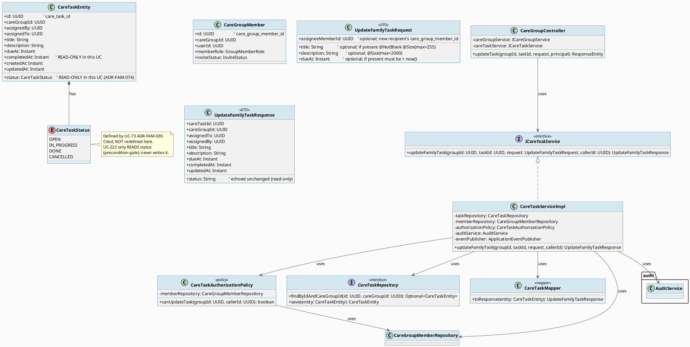
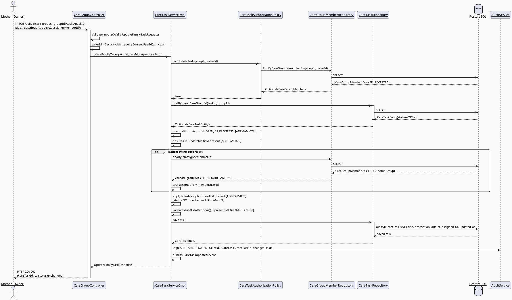
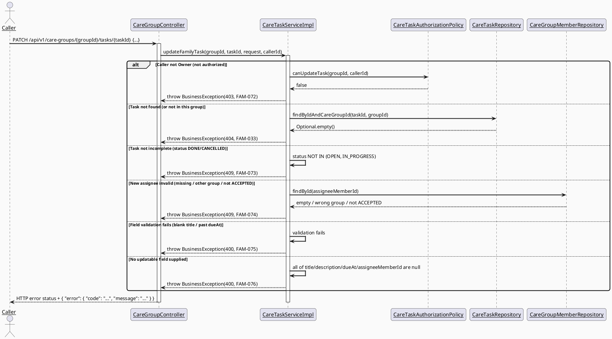
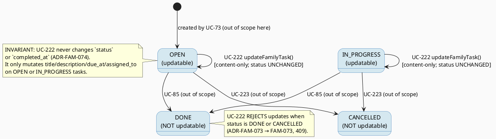

# ENGINEERING DOCUMENTATION STANDARD (EDS) v2.0
# UC222 — Update Family Task — Technical Design Specification

| Field | Value |
|-------|-------|
| **Document ID** | `CB-FAM-IMP-222` |
| **Version** | `1.0` |
| **Date** | `2026-07-03` |
| **Status** | `Draft` |
| **Document Owner** | `TV2-Bách` |
| **Author** | `AI Agent — Technical Architect` |
| **Reviewed by** | `[Tech Lead — Pending]` |
| **DPO Sign-off** | `[ ] Pending` *(module touches family data — task title/description + assignee identity are family-scoped data; see §1 Data Classification)* |
| **Approved by** | `[Principal Architect — Pending]` |
| **Last Review** | `2026-07-03` |
| **Based on EDS** | `v2.0` |

---

## CHANGELOG

> **Policy 4.4 — Immutable History:** Không bao giờ xóa thông tin cũ. Mọi thay đổi phải ghi vào bảng này.

| Ngày | Người thực hiện | Nội dung thay đổi |
|------|-----------------|-------------------|
| 2026-07-03 | AI Agent — Technical Architect | Tạo tài liệu lần đầu — TDS cho UC-222 Update Family Task |

---

## MỤC LỤC

1. [Tổng quan Module](#1-tổng-quan-module)
2. [Ma trận Truy vết (Traceability Matrix)](#2-ma-trận-truy-vết-traceability-matrix)
3. [Architecture Decision Records (ADR)](#3-architecture-decision-records-adr)
4. [Non-Functional Requirements & SLA](#4-non-functional-requirements--sla)
5. [Static Modeling (Mô hình Tĩnh)](#5-static-modeling-mô-hình-tĩnh)
6. [Dynamic Modeling (Mô hình Động)](#6-dynamic-modeling-mô-hình-động)
7. [Domain Event Catalog](#7-domain-event-catalog)
8. [Interface Specification (Đặc tả Giao diện)](#8-interface-specification-đặc-tả-giao-diện)
9. [API Specification](#9-api-specification)
10. [Bảng mã lỗi (Error Codes)](#10-bảng-mã-lỗi-error-codes)
11. [Quy trình Triển khai (Step-by-Step)](#11-quy-trình-triển-khai-step-by-step)
12. [Rollback & Incident Runbook](#12-rollback--incident-runbook)
13. [Kịch bản Kiểm thử Chi tiết](#13-kịch-bản-kiểm-thử-chi-tiết)
14. [Phương pháp Xác minh](#14-phương-pháp-xác-minh)
15. [Mẫu thử thực tế (API Verification Samples)](#15-mẫu-thử-thực-tế-api-verification-samples)
16. [Bảng tổng hợp phân quyền (Authorization Matrix)](#16-bảng-tổng-hợp-phân-quyền-authorization-matrix)
17. [AI Prompt Constraints (CASE 2.0)](#17-ai-prompt-constraints-case-20)

---

## 1. Tổng quan Module

UC-222 "Update Family Task" lets the care-group Owner (Mother, per SRS Primary Actor) edit the
**content** of an existing, still-incomplete care task — its title, description (notes), due date
(`due_at`), and recipient (`assigned_to`). This is a **content-only mutation**: the task's
lifecycle `status` is explicitly **not** changed by this use case (state transitions belong to
UC-85 "Update Assigned Task Status" and the cancel-side UC-223). Only a task whose current
`status IN (OPEN, IN_PROGRESS)` (i.e. "incomplete" per SRS Description) may be updated; `DONE` and
`CANCELLED` tasks are rejected.

This TDS is co-designed alongside the read-side sibling **UC-221 View Assigned Task Detail** (same
family-sync batch, same `care_tasks` aggregate). At authoring time the UC-221 folder
(`04_Implement/UC221_ViewAssignedTaskDetail/`) is **empty** (sibling not yet drafted), so this TDS
**defaults the JPA entity name to `CareTaskEntity`** and records that choice as ADR-FAM-077 so the
sibling can align. The canonical status enum is `CareTaskStatus { OPEN, IN_PROGRESS, DONE,
CANCELLED }` per **ADR-FAM-030** (UC-73) — cited, **not** redefined here. (UC-85's
`NEEDS_SUPPORT` variant is explicitly NOT used in this batch.)

| Field | Value |
|-------|-------|
| **Module Name** | Family Sync — Care Task Update |
| **Bounded Context** | `family` (same bounded context as UC-70 Create Care Group, UC-73 Assign Family Task, UC-216 View Members, UC-85 Update Assigned Task Status; package `com.carebridge.backend.family`) |
| **UC ID** | `UC-222` (SRS §3.3.17.7, Table 244) |
| **Primary Actor** | `Mother` |
| **Secondary Actors** | `None` (per SRS) |
| **Data Classification** | `Internal` / family-scoped — task title/description are user-authored free text about caregiving activities; assignee/assigner are real user IDs. Not `Sensitive-PII` (no health diagnosis, no payment data), but still family/relationship data under BR-PRIVACY. |
| **Compliance Scope** | `PDPA` (Vietnam) — minimum-necessary access, family-scoped visibility. `BR-RBAC`, `BR-PRIVACY` (both named in SRS §3.3.17.7). GDPR citations from the generic EDS template are **N/A** (CareBridge is VN-scoped) — kept only where the template structurally requires them, marked accordingly. |
| **Upstream Dependencies** | `family` module (`CareGroup`, `CareGroupMember`, `InviteStatus`, `GroupMemberRole` — UC-70/216, already implemented), `common` (`ApiResponse`, `SecurityUtils`, `BusinessException`), `care_tasks` table rows created by **UC-73 Assign Family Task** (sibling workstream — UC-222 never creates tasks) |
| **Downstream Consumers** | Mobile app "Cập nhật nhiệm vụ" screen (CB-275); read-side sibling UC-221 (View Assigned Task Detail); shared care calendar / task-list views that read `care_tasks` |

### Scope

**IN SCOPE:**
- Updating an existing `care_tasks` row's **content** fields: `title`, `description`, `due_at`,
  `assigned_to` (see ADR-FAM-074 for the field set and PATCH semantics).
- Precondition gate: only tasks with `status IN (OPEN, IN_PROGRESS)` may be updated (ADR-FAM-073).
- Authorization: only the care-group **Owner** (ACCEPTED `OWNER` member) may update a task
  (ADR-FAM-072, reusing UC-73's owner-only pattern ADR-FAM-032).
- When `assigned_to` changes: the new assignee must be an `ACCEPTED` member of the **same**
  `care_group_id` (ADR-FAM-075, reusing the membership-lookup pattern of ADR-FAM-002/UC-73).
- Reusing the canonical `CareTaskStatus` enum (ADR-FAM-030) — **not** redefined here.
- Audit logging (`CARE_TASK_UPDATED`) and publishing the `CareTaskUpdated` domain event.

**OUT OF SCOPE (explicitly deferred / not implemented here):**
- Changing the task `status` (lifecycle transitions) — belongs to **UC-85 Update Assigned Task
  Status** and UC-223 Cancel Family Task. UC-222 is content-only (ADR-FAM-074).
- Creating tasks (UC-73), viewing a task's detail (UC-221), cancelling a task (UC-223), the
  assignee updating their own status (UC-85).
- **"Danh mục" (Category, e.g. "Y tế"/Medical)** and **"Nhắc nhở" (reminder lead-time, e.g.
  "Trước 1 ngày")** shown on the CB-275 mockup — these have **no backing column** in
  `care_tasks`; marked **Open / deferred** (ADR-FAM-076). The request DTO accepts only
  `title` / `dueAt` / `assigneeMemberId` / `description`.
- Scheduled pre-due-date reminders (deferred consistently with UC-73 ADR-FAM-031).
- Any Flyway schema change (no DDL — see §5.2).

---

## 2. Ma trận Truy vết (Traceability Matrix)

| Requirement ID | Loại (BR/ADR/US) | Mô tả yêu cầu | Thành phần Code | Compliance Target | ADR liên quan |
|----------------|------------------|---------------|-----------------|-------------------|---------------|
| SRS §3.3.17.7 (UC-222) | User Story | "Updates content, due date, or recipient for an incomplete task." | `CareGroupController.updateTask()`, `CareTaskServiceImpl.updateFamilyTask()` | — | ADR-FAM-072/073/074/075 |
| BR-RBAC | Business Rule | Users may access only functions allowed by their role/permission scope | `CareTaskAuthorizationPolicy.canUpdateTask()`, `@PreAuthorize("hasRole('MOTHER')")` | PDPA minimum-necessary access | ADR-FAM-072 |
| BR-PRIVACY | Business Rule | Family data requires consent/purpose/minimum-necessary access | `CareTaskServiceImpl` (membership + owner check before write), DTO mapping (no raw entity exposure) | PDPA | ADR-FAM-072, ADR-FAM-075 |
| PRE-4 | Precondition | Required reference data exists (task + care group + new assignee membership) | `CareTaskRepository.findByIdAndCareGroupId`, `CareGroupMemberRepository.findByCareGroupIdAndUserId` | — | — |
| E2 | Exception | Invalid/missing/expired/conflicting data rejected with field/action-level message | `CareTaskServiceImpl` validation → `FAM-073/074/075` | — | ADR-FAM-073, ADR-FAM-075 |
| Description ("incomplete task") | Constraint | Only OPEN/IN_PROGRESS tasks may be updated | `CareTaskServiceImpl` precondition check → `FAM-073` | — | ADR-FAM-073 |
| POST-2/POST-3 | Postcondition | Related records/notifications updated; sensitive actions audited | `AuditService.log(CARE_TASK_UPDATED, ...)`, `CareTaskUpdated` event | — | ADR-FAM-074 |
| ADR-FAM-030 | Decision (reused) | `CareTaskStatus` enum values `{OPEN, IN_PROGRESS, DONE, CANCELLED}` | `CareTaskStatus` (defined by UC-73) | — | — |
| ADR-FAM-002 | Decision (reused) | Membership/access lookup pattern (`user_id`/`invitation_status`) | `CareGroupMemberRepository.findByCareGroupIdAndUserId` | PDPA | — |
| ADR-FAM-032 | Decision (reused) | Owner-only write pattern | `CareTaskAuthorizationPolicy.canUpdateTask()` | BR-RBAC | ADR-FAM-072 |
| ADR-FAM-072 | Decision | Authorization = Owner-only task update | `CareTaskAuthorizationPolicy.canUpdateTask()` | BR-RBAC | — |
| ADR-FAM-073 | Decision | Incomplete-task precondition (`status IN OPEN/IN_PROGRESS`) | `CareTaskServiceImpl` | — | — |
| ADR-FAM-074 | Decision | Content-only mutation; `status` immutable in this UC (ignore status field) | `UpdateFamilyTaskRequest`, `CareTaskServiceImpl` | — | — |
| ADR-FAM-075 | Decision | New assignee must be ACCEPTED member of same group | `CareTaskServiceImpl` | BR-PRIVACY | — |
| ADR-FAM-076 | Decision | Category + reminder lead-time out of scope (no DB column) | *(none — deferred)* | — | — |
| ADR-FAM-077 | Decision | Entity name `CareTaskEntity` + service/repository placement | `CareTaskEntity`, `CareTaskRepository`, `ICareTaskService` | — | — |
| ADR-FAM-078 | Decision | PATCH partial-update semantics (null field = leave unchanged) | `CareTaskServiceImpl` | — | — |

---

## 3. Architecture Decision Records (ADR)

> This UC **reuses** three prior ADRs without redefining them: **ADR-FAM-030** (`CareTaskStatus`
> enum, defined by UC-73), **ADR-FAM-032** (owner-only write pattern, UC-73), and **ADR-FAM-002**
> (membership/access lookup, UC-216). The ADRs below (FAM-072..078) are new decisions for UC-222.

### ADR-FAM-072 — Authorization: Owner-only task update

| Field | Value |
|-------|-------|
| **Status** | `Accepted` |
| **Deciders** | `AI Agent (Technical Architect)` |
| **Date** | `2026-07-03` |
| **Supersedes** | — |

#### Bối cảnh (Context)
SRS §3.3.17.7 names only **"Mother"** as Primary Actor and cites BR-RBAC without spelling out
whether the updater must be the task's original `assigned_by` or any group `OWNER`. UC-73
established (ADR-FAM-032) that only the ACCEPTED `OWNER` member may **assign** tasks, and UC-70
establishes the Mother as the group creator = `OWNER` by construction. "Whoever can assign a task
can also edit it" is the natural least-surprise rule.

#### Các phương án đã xem xét (Options Considered)

| Phương án | Mô tả | Ưu điểm | Nhược điểm |
|-----------|-------|----------|------------|
| A | Only the original `assigned_by` may update | Narrow | No SRS support; breaks if a different owner needs to correct a task; `assigned_by` may differ from current owner |
| B | Only the ACCEPTED `OWNER` member of the group may update (reuse ADR-FAM-032) | Consistent with UC-73 owner-only assign; matches SRS "Mother" actor; least-privilege | Non-owner caregivers cannot edit tasks until a future permission-delegation UC |
| C | Any ACCEPTED member may update | Flexible | No SRS support; over-broad; risk of edit abuse |

#### Quyết định (Decision)
Chọn **Phương án B** — Owner-only. This is a **firm decision** (not `Open`), because it follows
directly from the already-approved owner-only rule of UC-73's ADR-FAM-032 (same actor, same
aggregate, symmetric write capability). Implemented via
`CareTaskAuthorizationPolicy.canUpdateTask(UUID groupId, UUID callerId)`, which checks
`memberRole == OWNER AND inviteStatus == ACCEPTED` for the caller (identical predicate to
`canAssignTasks`).

#### Hệ quả (Consequences)
**Tích cực:** Least-privilege default; consistent with sibling UC-73; reuses the exact membership
predicate.
**Tiêu cực / Trade-offs:** Non-owner caregivers cannot edit tasks in this iteration — a future
UC-72 permission-flag read would relax this without a new endpoint.
**Compliance Impact:** BR-RBAC — reduces over-broad access by default.

---

### ADR-FAM-073 — Incomplete-task precondition (status gate)

| Field | Value |
|-------|-------|
| **Status** | `Accepted` |
| **Deciders** | `AI Agent (Technical Architect)` |
| **Date** | `2026-07-03` |

#### Bối cảnh (Context)
SRS Description reads: "Updates content, due date, or recipient **for an incomplete task**." The
canonical enum (ADR-FAM-030) is `{OPEN, IN_PROGRESS, DONE, CANCELLED}`. "Incomplete" maps to the
non-terminal states `OPEN` and `IN_PROGRESS`; `DONE` (completed) and `CANCELLED` are terminal and
must not be editable via this action.

#### Các phương án đã xem xét (Options Considered)

| Phương án | Mô tả | Ưu điểm | Nhược điểm |
|-----------|-------|----------|------------|
| A | Allow update in any status | Simpler | Contradicts SRS "for an incomplete task"; lets users mutate completed/cancelled history |
| B | Reject unless `status IN (OPEN, IN_PROGRESS)` → `FAM-073` (409) | Directly satisfies SRS wording; protects terminal-state integrity | Requires a status read before the write (already needed to load the entity) |

#### Quyết định (Decision)
Chọn **Phương án B** — the service loads the task and, before applying any change, verifies
`status == OPEN || status == IN_PROGRESS`; otherwise it throws `BusinessException(409, FAM-073)`.
This is an **interpretation of the SRS "incomplete task" wording** (the schema itself has no CHECK
constraint on `status`, verified §5.2), called out explicitly.

#### Hệ quả (Consequences)
**Tích cực:** Terminal-state tasks (`DONE`/`CANCELLED`) are immutable via this UC; testable gate.
**Tiêu cực / Trade-offs:** An owner who wants to "reopen" a completed task must use a status-
transition UC (UC-85), not this one — consistent with the content-only boundary (ADR-FAM-074).
**Compliance Impact:** None.

---

### ADR-FAM-074 — Content-only mutation; `status` is immutable in UC-222

| Field | Value |
|-------|-------|
| **Status** | `Accepted` |
| **Deciders** | `AI Agent (Technical Architect)` |
| **Date** | `2026-07-03` |

#### Bối cảnh (Context)
The CB-275 mockup and SRS both frame UC-222 as editing **content/due date/recipient**. Task
lifecycle `status` transitions are a separate concern owned by UC-85 (assignee marks
IN_PROGRESS/DONE) and UC-223 (owner cancels). Allowing UC-222 to also write `status` would blur
the boundary and duplicate FSM logic. The question: if a client nonetheless sends a `status` field
in the update payload, do we **ignore** it or **reject** it?

#### Các phương án đã xem xét (Options Considered)

| Phương án | Mô tả | Ưu điểm | Nhược điểm |
|-----------|-------|----------|------------|
| A | Reject any request containing a `status` field → 400 | Explicit; forces clients to use the right UC | Requires capturing unknown JSON properties; brittle; punishes benign clients that echo the current status back |
| B | The request DTO **has no `status` field**; any `status` key in the JSON body is silently ignored (Jackson default `FAIL_ON_UNKNOWN_PROPERTIES=false`), and the persisted `status` is left untouched | Robustness principle (Postel's law); simplest; contract explicitly excludes status; still fully testable (assert content changed, status unchanged) | Client gets no error telling them status was ignored |

#### Quyết định (Decision)
Chọn **Phương án B** — UC-222 is a **content-only mutation**. The `UpdateFamilyTaskRequest` DTO
contains only `title`, `description`, `dueAt`, `assigneeMemberId`; it has **no** `status` field.
The service never reads or writes `status` (beyond the read-only precondition gate of
ADR-FAM-073). A `status` value present in the raw JSON body is ignored. State transitions are
out of scope: "Update Family Task is a content-only mutation; state transitions belong to UC-85 /
UC-223." This is testable via `FAM222-TC-008` (status-in-body-ignored).

#### Hệ quả (Consequences)
**Tích cực:** Clean separation from UC-85/UC-223; no FSM logic duplicated; smaller DTO.
**Tiêu cực / Trade-offs:** No explicit error when a client mistakenly sends `status` — mitigated
by documenting the content-only contract in §8/§9 and the Test-Spec.
**Compliance Impact:** None.

---

### ADR-FAM-075 — New assignee must be an ACCEPTED member of the same group

| Field | Value |
|-------|-------|
| **Status** | `Accepted` |
| **Deciders** | `AI Agent (Technical Architect)` |
| **Date** | `2026-07-03` |

#### Bối cảnh (Context)
SRS lists "recipient" as an updatable field. If `assigned_to` is changed to a new user, that user
must be a legitimate member of the care group — reusing the same validation UC-73 applies on
assignment and the membership-lookup pattern of ADR-FAM-002 (UC-216). Real code exposes
`CareGroupMemberRepository.findByCareGroupIdAndUserId(...)` and
`findById(...)`, and `CareGroupMember.getInviteStatus()` / `getMemberRole()` (verified against
`family/entity/CareGroupMember.java`, `family/repository/CareGroupMemberRepository.java`).

#### Các phương án đã xem xét (Options Considered)

| Phương án | Mô tả | Ưu điểm | Nhược điểm |
|-----------|-------|----------|------------|
| A | Accept any user ID as new assignee | Simple | Allows assigning to non-members; violates BR-PRIVACY minimum-necessary |
| B | New assignee's `CareGroupMember` must exist in the same `care_group_id` with `inviteStatus == ACCEPTED`; else `FAM-074` (409) | Consistent with UC-73 assign-validation; enforces family-scoped access | Requires a membership lookup on assignee change |

#### Quyết định (Decision)
Chọn **Phương án B** — when the request supplies `assigneeMemberId`, the service resolves the
`CareGroupMember` by id, verifies its `careGroupId` matches the path `groupId` **and**
`inviteStatus == ACCEPTED`, then sets `care_tasks.assigned_to = member.userId`. If the member is
missing, belongs to another group, or is not ACCEPTED → `BusinessException(409, FAM-074)`. If
`assigneeMemberId` is absent/null, `assigned_to` is left unchanged (ADR-FAM-078).

#### Hệ quả (Consequences)
**Tích cực:** No task can be reassigned outside the group; reuses proven membership logic.
**Tiêu cực / Trade-offs:** Reassigning to a PENDING/REVOKED member is blocked — correct per
BR-PRIVACY.
**Compliance Impact:** BR-PRIVACY — minimum-necessary access.

---

### ADR-FAM-076 — Category and reminder lead-time are out of scope (no DB column)

| Field | Value |
|-------|-------|
| **Status** | `Accepted` (scope decision) — underlying feature request marked **Open / deferred** |
| **Deciders** | `AI Agent (Technical Architect)` |
| **Date** | `2026-07-03` |

#### Bối cảnh (Context)
The CB-275 mockup (`03_Design/UI_UX/MobileAppScreen/CB-275 Update Family Care Task (UC-222)/code.html`)
shows two editable controls that have **no backing column** in `care_tasks`
(verified against `V1__init_schema.sql` — the table has only `care_task_id, care_group_id,
assigned_by, assigned_to, title, description, due_at, status, completed_at, created_at,
updated_at`):
- **"Danh mục" (Category, e.g. "Y tế" / Medical)** — no `category` column.
- **"Nhắc nhở" (reminder lead-time, e.g. "Trước 1 ngày")** — no reminder-offset column;
  consistent with UC-73 ADR-FAM-031 which already deferred scheduled reminders for `care_tasks`.

#### Quyết định (Decision)
**Do NOT invent new columns.** Both fields are **out of scope** for UC-222. The API request DTO
accepts only `title` / `dueAt` / `assigneeMemberId` / `description`. Adding `category` and
`reminderLeadTime` persistence is deferred to a future, separately-approved schema change
(**Open — OPEN-1** for Product/Tech Lead: confirm whether these become real columns, are stored as
client-only UI state, or are dropped). Per CLAUDE.md "make the smallest scoped change" and "never
invent schema columns not in sources."

#### Hệ quả (Consequences)
**Tích cực:** No unapproved DDL; DTO stays aligned with the real schema.
**Tiêu cực / Trade-offs:** The mockup's Category/Reminder controls have no backend effect in this
iteration — the mobile team must treat them as non-persisted until OPEN-1 is resolved.
**Compliance Impact:** None.

---

### ADR-FAM-077 — Entity naming (`CareTaskEntity`) + service/repository placement

| Field | Value |
|-------|-------|
| **Status** | `Accepted` |
| **Deciders** | `AI Agent (Technical Architect)` |
| **Date** | `2026-07-03` |

#### Bối cảnh (Context)
No `CareTask` Java entity/repository/service/controller exists yet — `care_tasks` is greenfield on
the Java side (verified: `family/` contains only `CareGroup*`/`CareGroupMember*` code). This UC is
co-designed with the read-side sibling **UC-221**, whose folder is currently **empty**, so no
sibling naming exists to inherit. UC-73's draft used the bare name `CareTask`; UC-85's draft also
used `CareTask`. To disambiguate the JPA entity from the DTO family and to give the sibling a
single explicit anchor, this TDS chooses **`CareTaskEntity`** as the entity class name and records
it here.

#### Các phương án đã xem xét (Options Considered)

| Phương án | Mô tả | Ưu điểm | Nhược điểm |
|-----------|-------|----------|------------|
| A | Entity `CareTask` (as UC-73/UC-85 drafts) | Matches sibling drafts' informal name | Collides conceptually with DTO naming; less explicit |
| B | Entity `CareTaskEntity`, repo `CareTaskRepository`, service `ICareTaskService`/`CareTaskServiceImpl`, policy `CareTaskAuthorizationPolicy`, all under `com.carebridge.backend.family.*`; endpoint added to existing `CareGroupController` | Explicit; single anchor for UC-221 to align to; matches CareBridge "package by domain then layer" | Diverges from the informal `CareTask` used in UC-73/UC-85 drafts (both still Draft) |

#### Quyết định (Decision)
Chọn **Phương án B** — entity `CareTaskEntity`. **Coordination note:** because UC-73/UC-85 drafts
say `CareTask`, the actual class name must be **reconciled once one of the batch UCs is
implemented first** (whichever lands first fixes the name; the others rename to match). This is a
naming reconciliation item, **not** a behavioural decision. Package layout follows the confirmed
batch convention: `family.{controller,service,service.impl,repository,entity,dto.request,
dto.response,mapper,policy}`. The `PATCH` endpoint is added to the **existing** `CareGroupController`
(same base path `/api/v1/care-groups`), consistent with UC-73's ADR-FAM-034.

#### Hệ quả (Consequences)
**Tích cực:** Explicit, single source for entity naming across the batch.
**Tiêu cực / Trade-offs:** Possible one-line rename when reconciling with UC-73/UC-85 at
implementation — trivial, IDE-assisted.
**Compliance Impact:** None.

---

### ADR-FAM-078 — PATCH partial-update semantics

| Field | Value |
|-------|-------|
| **Status** | `Accepted` |
| **Deciders** | `AI Agent (Technical Architect)` |
| **Date** | `2026-07-03` |

#### Bối cảnh (Context)
UC-222 updates "content, due date, or recipient" — the actor may change one field or several. The
verb must define what an absent/null field means, and what an all-empty payload means.

#### Quyết định (Decision)
Use **PATCH partial-update** semantics: for each of `title`, `description`, `dueAt`,
`assigneeMemberId`, **`null`/absent = leave the existing value unchanged**; a supplied non-null
value replaces it. `description` clearing (to empty) is done by sending an explicit empty string
(`description` is nullable `text`; an empty string is stored as-is — not treated as "unchanged").
Validation still applies to supplied values: `title` if present must be non-blank and ≤ 255 chars;
`dueAt` if present must be strictly after `Instant.now()` (consistent with UC-73 ADR-FAM-033).
If **no** updatable field is supplied (all four null) → `BusinessException(400, FAM-076)`
("no updatable fields provided") to avoid a meaningless no-op write. `status` is never part of the
payload (ADR-FAM-074).

#### Hệ quả (Consequences)
**Tích cực:** Predictable partial edits; prevents empty no-op writes; reuses UC-73's future-due
rule.
**Tiêu cực / Trade-offs:** Distinguishing "clear description" (empty string) from "leave
unchanged" (null/absent) is a documented convention the mobile client must follow.
**Compliance Impact:** None.

---

## 4. Non-Functional Requirements & SLA

### 4.1. Performance & Availability

| Category | Requirement | Target SLA | Measurement Method | Compliance Basis |
|----------|-------------|------------|---------------------|------------------|
| Latency | `PATCH /api/v1/care-groups/{groupId}/tasks/{taskId}` (p99) | `< 300ms` (inherits API-wide target; single-row read + conditional update + audit) | Manual timing / future k6 test | — |
| Availability | Uptime (monthly) | Inherits API-wide `99.9%` target | Uptime monitor | — |

> No project-wide numeric SLA specific to this endpoint was found in sources; the `< 300ms` /
> `99.9%` figures mirror the sibling UC-73 TDS defaults and are **proposed**, not sourced from an
> approved SLA doc (marked accordingly).

### 4.2. Data Integrity & Concurrency

| Category | Requirement | Target | Verification Method | Compliance Basis |
|----------|-------------|--------|---------------------|------------------|
| Durability | Update + audit write within one `@Transactional` boundary | Zero partial writes | Integration test asserting both `care_tasks` row change and audit row exist | — |
| Concurrency | Two concurrent updates to the same task | **Last-write-wins**; the precondition status-gate is re-read inside the transaction. Optimistic `@Version` locking is **OUT of scope for v1** (would require a schema change colliding with sibling UC-73/85 work). | Integration test (best-effort) | ADR-FAM-073 |
| Consistency | `status` and `completed_at` are never modified by this UC | 100% | Unit test asserting `status`/`completedAt` unchanged after update | ADR-FAM-074 |

### 4.3. Security

| Category | Requirement | Target | Verification Method | Compliance Basis |
|----------|-------------|--------|---------------------|------------------|
| Access control | Role `MOTHER` + Owner-of-group business check | Owner-only update | Auth Matrix (§16), authorization test cases | BR-RBAC |
| Authorization source | `callerId` from JWT via `SecurityUtils.requireCurrentUserId(principal)` only | 100% | Code review + test | BR-RBAC |
| Input validation | `title` non-blank/≤255 if present; `dueAt` future-only if present; new assignee must be ACCEPTED member | Reject with `FAM-073/074/075/076` / Bean Validation 400 | Test-Spec boundary/error cases | E2, BR-PRIVACY |
| No PII in logs | Audit description passes only `careTaskId` + changed-field names, never full title/description body | Code review + log grep | — | BR-PRIVACY |

### 4.4. Scalability & Capacity Planning

Expected load is proportional to care-group activity (low volume — occasional task edits per group
per week). No dedicated scaling work is required beyond existing indexes
(`idx_care_tasks_care_group_id`, `idx_care_tasks_status`, already present per `V1__init_schema.sql`).
*Not applicable* to project further at current CareBridge scale.

---

## 5. Static Modeling (Mô hình Tĩnh)

### 5.1. Class Diagram (PlantUML)



### 5.2. Data Structure (Flyway SQL Migration)

**No migration required.** The `care_tasks` table already exists and is fully sufficient for
UC-222, per `V1__init_schema.sql` (verified ground truth, re-confirmed against the schema during
this TDS's research):

```sql
-- EXISTING TABLE — V1__init_schema.sql (care_tasks). NOT modified by this feature.
CREATE TABLE public.care_tasks (
    care_task_id  uuid         NOT NULL DEFAULT gen_random_uuid(),
    care_group_id uuid         NOT NULL,
    assigned_by   uuid,
    assigned_to   uuid,
    title         varchar(255) NOT NULL,
    description   text,
    due_at        timestamptz,
    status        varchar(20)  NOT NULL DEFAULT 'OPEN',
    completed_at  timestamptz,
    created_at    timestamptz  NOT NULL DEFAULT now(),
    updated_at    timestamptz  NOT NULL DEFAULT now()
);
-- Indexes: idx_care_tasks_care_group_id, idx_care_tasks_status.
-- No CHECK constraint on `status` — CareTaskStatus enum values are a code-level decision (ADR-FAM-030).
-- No `category` column, no reminder-offset column (ADR-FAM-076 — Category/Reminder are out of scope).
```

**Schema-change conclusion:** UC-222 introduces **zero DDL**. All updated fields (`title`,
`description`, `due_at`, `assigned_to`) map to existing columns. `status`/`completed_at` are
read-only for this UC. Category and reminder-lead-time are **not** persisted (ADR-FAM-076). The
JPA `CareTaskEntity` mapping is greenfield (no entity exists yet) but requires no table change.

---

## 6. Dynamic Modeling (Mô hình Động)

### 6.1. Sequence Diagram — Happy Path (PlantUML)



### 6.2. Sequence Diagram — Error Paths (PlantUML)



### 6.3. State Machine



> **⚠️ Invariant bất biến (this UC's scope):**
> 1. `updateFamilyTask()` MUST leave `status` and `completed_at` **unchanged** (ADR-FAM-074).
> 2. Update is permitted **only** when the current `status IN (OPEN, IN_PROGRESS)` (ADR-FAM-073).
> 3. `assigned_to`, if changed, MUST resolve to an ACCEPTED member of the **same** group
>    (ADR-FAM-075).

---

## 7. Domain Event Catalog

### 7.1. Events Published (Phát ra)

| Event Name | Trigger | Publisher | Subscriber(s) | Payload Schema | Async? |
|------------|---------|-----------|---------------|----------------|--------|
| `CareTaskUpdated` | Successful `updateFamilyTask()` (≥1 field actually changed) | `CareTaskServiceImpl` | Audit listener (log), future notification listener (notify affected assignees — Open Item, see §7.2) | `CareTaskUpdated.java` (§7.3) | Yes (Spring `ApplicationEventPublisher`, same-transaction publish) |

### 7.2. Events Consumed (Tiêu thụ)

*Not applicable — UC-222 does not consume any domain event.* Depends on `care_tasks` rows already
existing (written by UC-73) — a DB-level dependency, not event-driven.

> **Open Item (OPEN-2):** Notifying the previous and new assignee when `assigned_to` changes is a
> plausible consumer of `CareTaskUpdated`, mirroring UC-73's FCM confirmation pattern. A dedicated
> notification-consumer wiring is deferred to the notification module owner; UC-222's scope ends at
> publishing the event.

### 7.3. Payload Schema

```java
// CareTaskUpdated.java
public record CareTaskUpdated(
    UUID    eventId,          // UUID.randomUUID() — dùng để deduplicate
    String  eventType,        // "CareTaskUpdated"
    Instant occurredAt,       // Instant.now()
    String  version,          // "1.0"
    Payload payload,
    Metadata metadata
) {

    public record Payload(
        UUID         careTaskId,
        UUID         careGroupId,
        UUID         updatedBy,        // callerId (the owner)
        UUID         previousAssignee, // assigned_to before update (null if unchanged/absent)
        UUID         newAssignee,      // assigned_to after update
        List<String> changedFields     // e.g. ["title","dueAt","assignedTo"] — never includes "status"
    ) {}

    public record Metadata(
        UUID   correlationId,
        String causedBy       // callerId as string, or "system"
    ) {}
}
```

---

## 8. Interface Specification (Đặc tả Giao diện)

### 8.1. Service Interface

```java
// UpdateFamilyTaskRequest.java — Input DTO (package family.dto.request)
// @version 1.0
public class UpdateFamilyTaskRequest {
    // All fields optional (PATCH partial-update, ADR-FAM-078). null/absent = leave unchanged.

    @Size(max = 255)
    private String title;              // if present, must be non-blank (validated in service) — ADR-FAM-078

    @Size(max = 2000)
    private String description;        // nullable text; empty string = clear (ADR-FAM-078)

    private Instant dueAt;             // if present, must be strictly after now() — ADR-FAM-033 reuse

    private UUID assigneeMemberId;     // if present, care_group_member_id of the new ACCEPTED recipient — ADR-FAM-075

    // NOTE: NO `status` field — content-only mutation (ADR-FAM-074). A `status` key in the raw
    // JSON body is ignored (Jackson FAIL_ON_UNKNOWN_PROPERTIES=false).
    // getters / setters (Lombok @Data, matching existing family.dto style)
}

// UpdateFamilyTaskResponse.java — Output DTO (package family.dto.response)
// @version 1.0
public class UpdateFamilyTaskResponse {
    private UUID careTaskId;
    private UUID careGroupId;
    private UUID assignedTo;
    private UUID assignedBy;
    private String title;
    private String description;
    private Instant dueAt;
    private String status;             // CareTaskStatus.name() — echoed UNCHANGED (read-only)
    private Instant completedAt;       // echoed unchanged
    private Instant updatedAt;
    // @Data @Builder, matching existing family.dto response style
}

// ICareTaskService.java — Service Contract (package family.service)
// @version 1.0
public interface ICareTaskService {

    /**
     * Updates the content of an incomplete care task (title/description/dueAt/assignee).
     * Caller must be the ACCEPTED OWNER of the group (ADR-FAM-072). Task must exist in the group
     * and be OPEN or IN_PROGRESS (ADR-FAM-073). If assignee changes, the new member must be an
     * ACCEPTED member of the same group (ADR-FAM-075). `status`/`completedAt` are never modified
     * (ADR-FAM-074).
     * @throws BusinessException (FAM-072/403) if caller is not the group Owner
     * @throws BusinessException (FAM-033/404) if the task does not exist in this group
     * @throws BusinessException (FAM-073/409) if the task is not incomplete (status DONE/CANCELLED)
     * @throws BusinessException (FAM-074/409) if the new assignee is not an ACCEPTED member of this group
     * @throws BusinessException (FAM-075/400) if a supplied field is invalid (blank title / past dueAt)
     * @throws BusinessException (FAM-076/400) if no updatable field is supplied
     */
    UpdateFamilyTaskResponse updateFamilyTask(UUID groupId, UUID taskId,
                                              UpdateFamilyTaskRequest request, UUID callerId);
}
```

### 8.2. Repository Interface

```java
// CareTaskRepository.java — NEW file (no repository exists yet for care_tasks)
// @version 1.0
public interface CareTaskRepository extends JpaRepository<CareTaskEntity, UUID> {

    /** Load a task scoped to its group (path-consistent lookup for UC-222). */
    Optional<CareTaskEntity> findByIdAndCareGroupId(UUID id, UUID careGroupId);
}

// CareGroupMemberRepository.java — REUSED as-is (NO change needed)
// Existing methods used by UC-222:
//   Optional<CareGroupMember> findByCareGroupIdAndUserId(UUID careGroupId, UUID userId); // owner check
//   Optional<CareGroupMember> findById(UUID id);                                          // new-assignee lookup
```

### 8.3. Authorization Policy Interface

```java
// CareTaskAuthorizationPolicy.java — NEW file (package family.policy)
// @version 1.0
@Component
@RequiredArgsConstructor
public class CareTaskAuthorizationPolicy {
    private final CareGroupMemberRepository memberRepository;

    /**
     * ADR-FAM-072 (reuses ADR-FAM-032 predicate): only the ACCEPTED OWNER member may update tasks.
     */
    public boolean canUpdateTask(UUID groupId, UUID callerId) {
        return memberRepository.findByCareGroupIdAndUserId(groupId, callerId)
                .filter(m -> m.getInviteStatus() == InviteStatus.ACCEPTED)
                .filter(m -> m.getMemberRole() == GroupMemberRole.OWNER)
                .isPresent();
    }
}
```

---

## 9. API Specification

### 9.1. Endpoints Table

| Method | Path | Auth Level | Required Roles | Rate Limit | Idempotent? |
|--------|------|------------|----------------|------------|-------------|
| `PATCH` | `/api/v1/care-groups/{groupId}/tasks/{taskId}` | JWT Bearer | `MOTHER` (role) + Owner-of-group (business check, ADR-FAM-072) | 60/min | Yes (repeating the same field values yields the same state) |

> **Verb choice:** `PATCH` (partial update per ADR-FAM-078) rather than `PUT` (full replace),
> because UC-222 supports editing a subset of fields. Rate limit is a proposed default (Open — no
> project-wide rate-limit policy found in `CareGroupController`; mirrors UC-73's write default).

### 9.2. Request / Response Schemas

#### `PATCH /api/v1/care-groups/{groupId}/tasks/{taskId}` — Update a care task's content

**Request Body (all fields optional; example changes title + due date + recipient):**
```json
{
  "title": "Mua thuốc định kỳ cho Bà Nội",
  "description": "Mua tại nhà thuốc gần nhà, 2 hộp",
  "dueAt": "2026-07-10T09:00:00Z",
  "assigneeMemberId": "b16a8f9e-2222-4b1b-9a3d-000000000002"
}
```

**Response — 200 OK (Happy Path):**
```json
{
  "data": {
    "careTaskId": "c1a2b3c4-1111-4b1b-9a3d-000000000010",
    "careGroupId": "a0a0a0a0-0000-4b1b-9a3d-000000000001",
    "assignedTo": "b16a8f9e-2222-4b1b-9a3d-000000000002",
    "assignedBy": "9f9f9f9f-3333-4b1b-9a3d-000000000003",
    "title": "Mua thuốc định kỳ cho Bà Nội",
    "description": "Mua tại nhà thuốc gần nhà, 2 hộp",
    "dueAt": "2026-07-10T09:00:00Z",
    "status": "OPEN",
    "completedAt": null,
    "updatedAt": "2026-07-03T10:15:00Z"
  },
  "message": "Care task updated successfully"
}
```

**Response — 403 Forbidden (caller not the group Owner):**
```json
{
  "error": {
    "code": "FAM-072",
    "message": "Only the care group owner can update tasks"
  }
}
```

**Response — 404 Not Found (task not in this group):**
```json
{
  "error": {
    "code": "FAM-033",
    "message": "Care task not found"
  }
}
```

**Response — 409 Conflict (task already DONE/CANCELLED — not incomplete):**
```json
{
  "error": {
    "code": "FAM-073",
    "message": "Only incomplete tasks (OPEN or IN_PROGRESS) can be updated"
  }
}
```

**Response — 409 Conflict (new assignee not an accepted member):**
```json
{
  "error": {
    "code": "FAM-074",
    "message": "New assignee is not an accepted member of this care group"
  }
}
```

**Response — 400 Bad Request (invalid field — past due date):**
```json
{
  "error": {
    "code": "FAM-075",
    "message": "Due date must be in the future",
    "details": [
      { "field": "dueAt", "message": "dueAt must be after the current time" }
    ]
  }
}
```

**Response — 400 Bad Request (no updatable field supplied):**
```json
{
  "error": {
    "code": "FAM-076",
    "message": "No updatable fields provided"
  }
}
```

---

## 10. Bảng mã lỗi (Error Codes)

> Tiền tố `FAM-` (reuses `family` module prefix). `FAM-033` is **reused** (pre-reserved by UC-73's
> ADR/§10 for "care task not found" across UC-221/222/223 — reused here for the identical
> semantic). `FAM-072..076` are this feature's own new codes (allocated to avoid collision with
> parallel siblings: UC-217 FAM-050..054, UC-218 FAM-055..057, UC-219 FAM-058..062, UC-220
> FAM-063..067, UC-221 FAM-033+FAM-068..071).

| Code | HTTP Status | Message (EN) | Message (VI) | Trigger Condition |
|------|-------------|--------------|--------------|-------------------|
| `FAM-033` | 404 | Care task not found | Không tìm thấy công việc | *(reused, per UC-73 reservation)* `taskId` not found, or `care_group_id` mismatch with path `groupId` |
| `FAM-072` | 403 | Only the care group owner can update tasks | Chỉ chủ nhóm mới có quyền cập nhật công việc | Caller is not `memberRole == OWNER` with `inviteStatus == ACCEPTED` (ADR-FAM-072) |
| `FAM-073` | 409 | Only incomplete tasks (OPEN or IN_PROGRESS) can be updated | Chỉ có thể cập nhật công việc chưa hoàn thành | Target task `status` is `DONE` or `CANCELLED` (ADR-FAM-073) |
| `FAM-074` | 409 | New assignee is not an accepted member of this care group | Người thực hiện mới không phải thành viên đã chấp nhận của nhóm | Supplied `assigneeMemberId` is missing, belongs to another group, or `inviteStatus != ACCEPTED` (ADR-FAM-075) |
| `FAM-075` | 400 | Validation failed (invalid field value) | Dữ liệu không hợp lệ | `title` present but blank/>255, or `dueAt` present but ≤ `Instant.now()` (ADR-FAM-078 / ADR-FAM-033 reuse) |
| `FAM-076` | 400 | No updatable fields provided | Không có trường nào để cập nhật | All of `title`/`description`/`dueAt`/`assigneeMemberId` are null/absent (ADR-FAM-078) |

> `FAM-005` (404 Care group not found, defined by UC-70/216) may also surface if the endpoint is
> extended to validate group existence separately; the primary path uses `findByIdAndCareGroupId`
> → `FAM-033`, so `FAM-005` is **not** newly introduced by this UC.

---

## 11. Quy trình Triển khai (Step-by-Step)

### 11.1. Prerequisites

- [ ] ADR-FAM-072..078 reviewed and Accepted; ADR-FAM-030/032/002 reused (already Proposed/Accepted in UC-73/216)
- [ ] `CareTaskStatus` enum and `CareTaskEntity` class-name reconciled with sibling UC-73/UC-85/UC-221 (ADR-FAM-077)
- [ ] DPO sign-off — Open item; family/task data is Internal, not Sensitive-PII, tracked per header
- [ ] Blueprint (this TDS) approved by Principal Architect
- [ ] Staging ready (no new migration to apply — see §11.2)

### 11.2. Pre-Migration Checklist

*Not applicable — no migration is introduced by this feature (see §5.2). `care_tasks` already
exists (created by `V1__init_schema.sql`).*

### 11.3. Implementation Steps

#### Chặng 1 — Entity + repository (no migration)

```java
// CareTaskEntity.java — new file, package com.carebridge.backend.family.entity
@Entity @Table(name = "care_tasks")
@Getter @Setter @Builder @NoArgsConstructor @AllArgsConstructor
public class CareTaskEntity {
    @Id @GeneratedValue(strategy = GenerationType.UUID)
    @Column(name = "care_task_id", updatable = false, nullable = false)
    private UUID id;

    @Column(name = "care_group_id", nullable = false)
    private UUID careGroupId;

    @Column(name = "assigned_by")   private UUID assignedBy;
    @Column(name = "assigned_to")   private UUID assignedTo;

    @Column(name = "title", nullable = false, length = 255)
    private String title;

    @Column(name = "description", columnDefinition = "text")
    private String description;

    @Column(name = "due_at")        private Instant dueAt;

    @Enumerated(EnumType.STRING)
    @Column(name = "status", nullable = false, length = 20)
    private CareTaskStatus status;              // READ-ONLY in UC-222 (ADR-FAM-074)

    @Column(name = "completed_at")  private Instant completedAt;   // READ-ONLY in UC-222

    @CreationTimestamp @Column(name = "created_at", nullable = false, updatable = false)
    private Instant createdAt;

    @UpdateTimestamp @Column(name = "updated_at", nullable = false)
    private Instant updatedAt;
}
```
> `CareTaskRepository.findByIdAndCareGroupId` per §8.2. `CareTaskStatus` is reused from UC-73
> (ADR-FAM-030) — do NOT redefine.

#### Chặng 2 — Policy + service + DTO mapper

```java
// CareTaskServiceImpl.updateFamilyTask (core logic — ADR-FAM-072/073/074/075/078)
@Override
@Transactional
public UpdateFamilyTaskResponse updateFamilyTask(UUID groupId, UUID taskId,
                                                 UpdateFamilyTaskRequest req, UUID callerId) {
    if (!authorizationPolicy.canUpdateTask(groupId, callerId))
        throw new BusinessException(HttpStatus.FORBIDDEN, "FAM-072");

    CareTaskEntity task = taskRepository.findByIdAndCareGroupId(taskId, groupId)
        .orElseThrow(() -> new BusinessException(HttpStatus.NOT_FOUND, "FAM-033"));

    if (task.getStatus() != CareTaskStatus.OPEN && task.getStatus() != CareTaskStatus.IN_PROGRESS)
        throw new BusinessException(HttpStatus.CONFLICT, "FAM-073");

    boolean any = req.getTitle() != null || req.getDescription() != null
               || req.getDueAt() != null || req.getAssigneeMemberId() != null;
    if (!any) throw new BusinessException(HttpStatus.BAD_REQUEST, "FAM-076");

    if (req.getTitle() != null) {
        if (req.getTitle().isBlank()) throw new BusinessException(HttpStatus.BAD_REQUEST, "FAM-075");
        task.setTitle(req.getTitle());
    }
    if (req.getDescription() != null) task.setDescription(req.getDescription());
    if (req.getDueAt() != null) {
        if (!req.getDueAt().isAfter(Instant.now()))
            throw new BusinessException(HttpStatus.BAD_REQUEST, "FAM-075");
        task.setDueAt(req.getDueAt());
    }
    if (req.getAssigneeMemberId() != null) {
        CareGroupMember m = memberRepository.findById(req.getAssigneeMemberId())
            .filter(x -> x.getCareGroupId().equals(groupId))
            .filter(x -> x.getInviteStatus() == InviteStatus.ACCEPTED)
            .orElseThrow(() -> new BusinessException(HttpStatus.CONFLICT, "FAM-074"));
        task.setAssignedTo(m.getUserId());
    }
    // status / completedAt intentionally NOT touched (ADR-FAM-074)

    CareTaskEntity saved = taskRepository.save(task);
    auditService.log(AuditAction.CARE_TASK_UPDATED, callerId, "CareTask", saved.getId());
    eventPublisher.publishEvent(/* CareTaskUpdated per §7.3 */);
    return careTaskMapper.toResponse(saved);
}
```

#### Chặng 3 — Controller endpoint (add to existing CareGroupController)

```java
// UC-222: Update a care task's content (Owner only)
@PatchMapping("/{groupId}/tasks/{taskId}")
@PreAuthorize("hasRole('MOTHER')")
public ResponseEntity<ApiResponse<UpdateFamilyTaskResponse>> updateTask(
        @PathVariable UUID groupId,
        @PathVariable UUID taskId,
        @Valid @RequestBody UpdateFamilyTaskRequest request,
        Principal principal) {
    var callerId = SecurityUtils.requireCurrentUserId(principal);
    var response = careTaskService.updateFamilyTask(groupId, taskId, request, callerId);
    return ResponseEntity.ok(ApiResponse.success(response, "Care task updated successfully"));
}
```

#### Chặng 4 — Verification sau deploy

```bash
./mvnw test -Dtest=CareTaskServiceImplUpdateTest,CareGroupControllerUpdateTaskTest
curl -X GET https://[host]/api/v1/health
# Expected: {"status": "ok"}
```

### 11.4. Deployment Checklist

- [ ] No migration to run (confirmed §5.2/§11.2)
- [ ] `./mvnw test` green for new `family` UC-222 tests
- [ ] Health check endpoint returns 200
- [ ] Error rate < 1% in first 10 minutes post-deploy
- [ ] Audit log shows `CARE_TASK_UPDATED` entries correctly (no full title/description body logged)

---

## 12. Rollback & Incident Runbook

### 12.1. Điều kiện kích hoạt Rollback (Trigger Conditions)

| Điều kiện | Ngưỡng | Người quyết định |
|-----------|--------|------------------|
| Error rate tăng đột biến | > 5% trong 5 phút | On-call Engineer |
| Latency p99 vượt ngưỡng | > 2x baseline | On-call Engineer |
| `status`/`completed_at` bị thay đổi bởi UC-222 (invariant vi phạm) | Bất kỳ case nào phát hiện qua DB audit | Tech Lead |
| Task DONE/CANCELLED bị chỉnh sửa (gate FAM-073 thất bại) | > 0 case | Tech Lead |

### 12.2. Rollback Procedure

No migration is introduced → rollback is code-only:

```bash
# Bước 1: Re-deploy phiên bản cũ
kubectl rollout undo deployment/carebridge-api

# Bước 2: Verify
kubectl rollout status deployment/carebridge-api
curl -X GET https://[host]/api/v1/health

# Bước 3: Smoke test — owner updates an OPEN task
curl -X PATCH https://[host]/api/v1/care-groups/{groupId}/tasks/{taskId} \
  -H "Authorization: Bearer <owner_jwt>" -H "Content-Type: application/json" \
  -d '{"title":"Rollback smoke"}'
# Expected: 200 OK or previous-version-consistent behavior
```

### 12.3. Notification Protocol

| Thời điểm | Người nhận | Kênh | Template |
|-----------|------------|------|----------|
| Ngay khi phát hiện | On-call team | Slack `#incident` | "🚨 UC-222 incident: [mô tả]" |
| Trong 30 phút nếu ảnh hưởng dữ liệu | Tech Lead | Email/Slack | Impact + rollback status |

### 12.4. Post-Incident Review (PIR)

> Bắt buộc hoàn thành trong vòng **48 giờ** sau khi resolve.
- **Timeline / Root Cause (5 Whys) / Impact (số task bị ảnh hưởng) / Remediation / Prevention.**

---

## 13. Kịch bản Kiểm thử Chi tiết

> **Policy (EDS v2.0):** Mọi test scenario dùng dữ liệu `SYNTHETIC`. Full test-case list, oracle
> citations, and Red-Green-Refactor tracking live in the companion Test-Spec
> (`04_Implement/UC222_UpdateFamilyTask/UC222_UpdateFamilyTask_Test-Spec.md`). This section
> summarises the key scenarios for traceability.

### 13.1. Unit Tests (tóm tắt)

- Happy path: owner updates title / dueAt / description / assignee on an OPEN task → 200, fields
  changed, `status`/`completedAt` unchanged.
- Owner updates a task in `IN_PROGRESS` → 200 (still incomplete).
- Reject update when status = `DONE` → `FAM-073`; when status = `CANCELLED` → `FAM-073`.
- Non-owner (MEMBER/VIEWER/non-member) → `FAM-072`.
- New assignee not ACCEPTED / other group / missing → `FAM-074`.
- Blank title / past dueAt → `FAM-075`.
- Empty payload (all null) → `FAM-076`.
- `status` present in raw body → ignored; persisted `status` unchanged (ADR-FAM-074).
- Task not found / wrong group → `FAM-033`.

### 13.2. Integration Tests (tóm tắt)

- Full flow through real `CareTaskRepository` + `CareGroupMemberRepository` (Testcontainers
  PostgreSQL): seed group + owner + member + OPEN task, PATCH, assert row's `title`/`due_at`/
  `assigned_to` changed and `status`/`completed_at` unchanged; audit row present.

### 13.3. E2E / Security Tests (tóm tắt)

- PATCH via API with owner JWT → 200; with non-owner JWT → 403 `FAM-072`; without JWT → 401.
- Injection attempt in `title` (SQL-like string) → stored safely as text, no DB side effect.

---

## 14. Phương pháp Xác minh

### 14.1. Database Inspection

> **Oracle rule:** Every expected column/type/constraint traces back to `V1__init_schema.sql`.

```sql
-- Verify content changed but status/completed_at untouched
SELECT care_task_id, title, description, due_at, assigned_to, status, completed_at, updated_at
FROM care_tasks
WHERE care_task_id = '[uuid]';
-- Expected: title/description/due_at/assigned_to reflect the update; status + completed_at same as before

-- Verify a DONE/CANCELLED task was NOT modified (gate FAM-073)
SELECT status, updated_at FROM care_tasks WHERE care_task_id = '[uuid]';
```

### 14.2. Log / Audit Verification

```bash
# Audit log contains CARE_TASK_UPDATED with only IDs/changed-field names (no full body)
kubectl logs -l app=carebridge-api | grep 'CARE_TASK_UPDATED' | head -5
# Ensure no PII/full description leaked
kubectl logs -l app=carebridge-api | grep -i "description" 
# Expected: no full free-text task description in audit lines
```

### 14.3. Tool-based Verification

```bash
# Verify JWT subject == callerId used for owner check
echo "[JWT_TOKEN]" | cut -d'.' -f2 | base64 -d | jq .
```

---

## 15. Mẫu thử thực tế (API Verification Samples)

### 15.1. Happy Path

```bash
# [PATCH] Owner updates title + due date + recipient of an OPEN task
curl -X PATCH https://[host]/api/v1/care-groups/{groupId}/tasks/{taskId} \
  -H "Authorization: Bearer [OWNER_JWT]" \
  -H "Content-Type: application/json" \
  -H "X-Correlation-Id: $(uuidgen)" \
  -d '{
    "title": "Mua thuốc định kỳ cho Bà Nội",
    "dueAt": "2026-07-10T09:00:00Z",
    "assigneeMemberId": "b16a8f9e-2222-4b1b-9a3d-000000000002"
  }'
```
**Expected (200):** `data.title` updated, `data.status` unchanged (e.g. `"OPEN"`), `message: "Care task updated successfully"`.

### 15.2. Error Paths

```bash
# [PATCH] Non-owner → 403 FAM-072
curl -X PATCH https://[host]/api/v1/care-groups/{groupId}/tasks/{taskId} \
  -H "Authorization: Bearer [MEMBER_JWT]" -H "Content-Type: application/json" \
  -d '{"title":"hack"}'

# [PATCH] Task already DONE → 409 FAM-073
curl -X PATCH https://[host]/api/v1/care-groups/{groupId}/tasks/{doneTaskId} \
  -H "Authorization: Bearer [OWNER_JWT]" -H "Content-Type: application/json" \
  -d '{"title":"too late"}'

# [PATCH] Empty payload → 400 FAM-076
curl -X PATCH https://[host]/api/v1/care-groups/{groupId}/tasks/{taskId} \
  -H "Authorization: Bearer [OWNER_JWT]" -H "Content-Type: application/json" \
  -d '{}'

# [PATCH] No JWT → 401
curl -X PATCH https://[host]/api/v1/care-groups/{groupId}/tasks/{taskId} \
  -H "Content-Type: application/json" -d '{"title":"x"}'
```

---

## 16. Bảng tổng hợp phân quyền (Authorization Matrix)

> Nguyên tắc **Least Privilege**. Roles below are CareBridge app roles; "Owner" / "Member" refer to
> the caller's `CareGroupMember` role within the target group.

| Endpoint | `GUEST` | Group `VIEWER`/`MEMBER` (ACCEPTED) | Group `OWNER` (ACCEPTED, = MOTHER) | Non-member | `SYSTEM_ADMIN` |
|----------|---------|-------------------------------------|-------------------------------------|------------|----------------|
| `PATCH /api/v1/care-groups/{groupId}/tasks/{taskId}` | ❌ 401 | ❌ 403 `FAM-072` | ✅ (own group's tasks) | ❌ 403 `FAM-072` | ❌ 403 `FAM-072` *(not owner; admin override out of scope)* |

**Chú thích:**
- ✅ = Được phép; ❌ = Bị từ chối.
- Authorization is **membership-based** (`memberRole == OWNER AND inviteStatus == ACCEPTED`), not
  purely app-role-based. The `@PreAuthorize("hasRole('MOTHER')")` guard is a coarse first gate; the
  fine-grained owner check is in `CareTaskAuthorizationPolicy.canUpdateTask()` (ADR-FAM-072).

---

## 17. AI Prompt Constraints (CASE 2.0)

### 17.1 Constraint Summary Table

| # | Constraint | Source (ADR/BR) | Last Verified |
|---|-----------|-----------------|---------------|
| C1 | Add the `PATCH /{groupId}/tasks/{taskId}` endpoint to the **existing** `CareGroupController`; do NOT create a parallel controller | `ADR-FAM-077` (reuses ADR-FAM-034) | `2026-07-03` |
| C2 | Never expose `CareTaskEntity` in responses; return only `UpdateFamilyTaskResponse` via `CareTaskMapper` | CLAUDE.md (no entity leakage), `ADR-FAM-077` | `2026-07-03` |
| C3 | Reuse `CareTaskStatus {OPEN, IN_PROGRESS, DONE, CANCELLED}` (ADR-FAM-030); do NOT redefine it and do NOT add `NEEDS_SUPPORT` | `ADR-FAM-030` | `2026-07-03` |
| C4 | `status` and `completed_at` are **read-only** in this UC — never write them; request DTO has no `status` field | `ADR-FAM-074` | `2026-07-03` |
| C5 | Owner check + incomplete-task gate + assignee-membership check MUST live in the Service/Policy layer, never the Controller | `ADR-FAM-072/073/075`, CLAUDE.md layering | `2026-07-03` |
| C6 | Identity comes from `SecurityUtils.requireCurrentUserId(principal)`; never trust a client-supplied caller id | `BR-RBAC` | `2026-07-03` |
| C7 | No Flyway migration; no new columns for Category/Reminder (out of scope) | `ADR-FAM-076`, §5.2 | `2026-07-03` |

> ⚠️ **`Last Verified` > 2 sprints → re-verify before injecting.**

### 17.2 Constraint Injection Block (Copy-Paste vào AI Prompt)

```
[CONSTRAINT BLOCK — Module: Family Sync — Update Family Task (UC-222)]
Theo TDS CB-FAM-IMP-222 và các ADR liên quan:

1. Add PATCH /api/v1/care-groups/{groupId}/tasks/{taskId} to the EXISTING CareGroupController (ADR-FAM-077). No parallel controller.
2. Never expose CareTaskEntity; map to UpdateFamilyTaskResponse via CareTaskMapper (no entity leakage).
3. Reuse CareTaskStatus {OPEN, IN_PROGRESS, DONE, CANCELLED} (ADR-FAM-030). Do NOT redefine; do NOT add NEEDS_SUPPORT.
4. status and completed_at are READ-ONLY in this UC (ADR-FAM-074). The request DTO has no status field.
5. Owner check (canUpdateTask), incomplete-task gate (status IN OPEN/IN_PROGRESS), and new-assignee membership check MUST be in Service/Policy, never Controller.
6. Identity from SecurityUtils.requireCurrentUserId(principal) only.
7. No Flyway migration; do NOT add Category/Reminder columns (ADR-FAM-076).

[CONTEXT BLOCK]
- Bounded Context: family
- Data Classification: Internal (family-scoped)
- Compliance: PDPA, BR-RBAC, BR-PRIVACY
- Existing interfaces: §8 Service Interface + §8.2 Repository + §8.3 Policy
- Error codes: §10 (FAM-033 reused; FAM-072..076 new)
- Auth matrix: §16

[TASK BLOCK]
Implement updateFamilyTask satisfying the constraints above.
Output must conform to §8 Interface Specification.
Tests must cover §13 scenarios and the companion Test-Spec.
```

### 17.3 Constraint Quality Checklist

- [x] Mỗi constraint traceable về ADR/BR cụ thể
- [x] Không có constraint generic
- [x] Mỗi constraint có `Last Verified` ≤ 2 sprints
- [x] Constraint block có ≥ 3 constraints cụ thể (7 present)
- [x] Constraint block reference §8 Interface
- [x] Constraint block reference §16 Auth Matrix

### 17.4 Anti-Pattern Detection (cho AI-Generated Code từ Block này)

| AP-ID | Anti-Pattern | Dấu hiệu | Hành động |
|-------|-------------|-----------|----------|
| AP-AI-001 | Unconstrained Gen | Code không match C1–C7 | Reject — inject lại constraints |
| AP-AI-003 | Implicit Decision | Code writes `status`/`completed_at` (no ADR authorizes it) | Reject — violates ADR-FAM-074 |
| AP-AI-005 | Hallucinated Contract | Code imports a `CareTaskService`/enum value not in §8 (e.g. `NEEDS_SUPPORT`) | Reject — verify against §8/ADR-FAM-030 |

---

## PHỤ LỤC

### A. Glossary (Thuật ngữ)

| Thuật ngữ | Định nghĩa |
|-----------|------------|
| Incomplete task | A `care_tasks` row whose `status` is `OPEN` or `IN_PROGRESS` (ADR-FAM-073) |
| Content-only mutation | An update that changes title/description/due date/recipient but never the lifecycle `status` (ADR-FAM-074) |
| PII | Personally Identifiable Information |
| DPO | Data Protection Officer |
| Open item | A decision requiring Product/Tech-Lead confirmation, flagged rather than invented |

### B. Tài liệu tham chiếu

| Document | Link / Path |
|----------|-------------|
| SRS §3.3.17.7 (UC-222 Update Family Task) | `02_Requirements/SRS/3_Functional_Specification.md` (Table 244) |
| UC-73 Assign Family Task TDS (ADR-FAM-030/032/033/034; FAM-033 reservation) | `04_Implement/UC73_AssignFamilyTask/UC73_AssignFamilyTask_TDS.md` |
| UC-85 Update Assigned Task Status TDS (status-transition scope; enum NOT reused) | `04_Implement/UC85_UpdateAssignedTaskStatus/UC85_UpdateAssignedTaskStatus_TDS.md` |
| UC-216 View Care Group Members TDS (ADR-FAM-002 membership lookup) | `04_Implement/UC216_ViewCareGroupMembers/UC216_ViewCareGroupMembers_TDS.md` |
| UC-221 View Assigned Task Detail (sibling, read side) | `04_Implement/UC221_ViewAssignedTaskDetail/` *(empty at authoring time)* |
| CB-275 UI mockup | `03_Design/UI_UX/MobileAppScreen/CB-275 Update Family Care Task (UC-222)/code.html` |
| DB schema | `05_Development/CareBridgeAPI/src/main/resources/db/migration/V1__init_schema.sql` (`care_tasks`) |

---

*EDS v2.1 — Tích hợp CASE 2.0 AI Prompt Constraints (§17). Status: `Draft`.*
