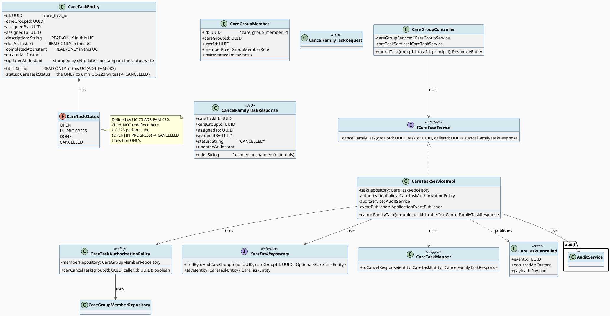
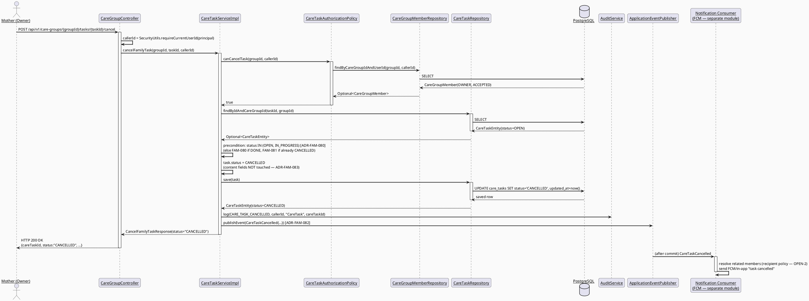
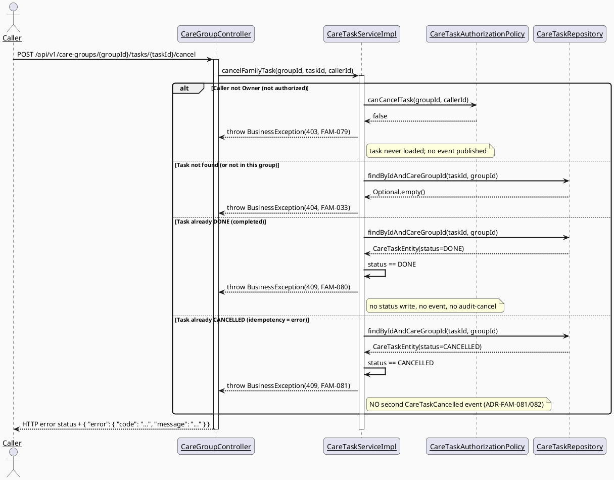
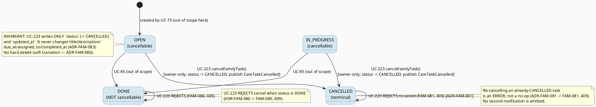

# ENGINEERING DOCUMENTATION STANDARD (EDS) v2.0
# UC223 — Cancel Family Task — Technical Design Specification

| Field | Value |
|-------|-------|
| **Document ID** | `CB-FAM-IMP-223` |
| **Version** | `1.0` |
| **Date** | `2026-07-03` |
| **Status** | `Partially Implemented` |
| **Document Owner** | `TV2-Bách` |
| **Author** | `AI Agent — Technical Architect` |
| **Reviewed by** | `[Tech Lead — Pending]` |
| **DPO Sign-off** | `[ ] Pending` *(module touches family data — task identity + assignee/assigner user IDs are family-scoped; the cancel action also triggers member notifications; see §1 Data Classification)* |
| **Approved by** | `[Principal Architect — Pending]` |
| **Last Review** | `2026-07-03` |
| **Based on EDS** | `v2.0` |

---

## CHANGELOG

> **Policy 4.4 — Immutable History:** Không bao giờ xóa thông tin cũ. Mọi thay đổi phải ghi vào bảng này.

| Ngày | Người thực hiện | Nội dung thay đổi |
|------|-----------------|-------------------|
| 2026-07-10 | AI Agent | Phase 3: Implementation — 17/21 tests PASS; unit/service coverage green, controller/INT/E2E pending |
| 2026-07-03 | AI Agent — Technical Architect | Tạo tài liệu lần đầu — TDS cho UC-223 Cancel Family Task |

---

## MỤC LỤC

1. [Tổng quan Module](#1-tổng-quan-module)
2. [Ma trận Truy vết (Traceability Matrix)](#2-ma-trận-truy-vết-traceability-matrix)
3. [Architecture Decision Records (ADR)](#3-architecture-decision-records-adr)
4. [Non-Functional Requirements & SLA](#4-non-functional-requirements--sla)
5. [Static Modeling (Mô hình Tĩnh)](#5-static-modeling-mô-hình-tĩnh)
6. [Dynamic Modeling (Mô hình Động)](#6-dynamic-modeling-mô-hình-động)
7. [Domain Event Catalog](#7-domain-event-catalog)
8. [Interface Specification (Đặc tả Giao diện)](#8-interface-specification-đặc-tả-giao-diện)
9. [API Specification](#9-api-specification)
10. [Bảng mã lỗi (Error Codes)](#10-bảng-mã-lỗi-error-codes)
11. [Quy trình Triển khai (Step-by-Step)](#11-quy-trình-triển-khai-step-by-step)
12. [Rollback & Incident Runbook](#12-rollback--incident-runbook)
13. [Kịch bản Kiểm thử Chi tiết](#13-kịch-bản-kiểm-thử-chi-tiết)
14. [Phương pháp Xác minh](#14-phương-pháp-xác-minh)
15. [Mẫu thử thực tế (API Verification Samples)](#15-mẫu-thử-thực-tế-api-verification-samples)
16. [Bảng tổng hợp phân quyền (Authorization Matrix)](#16-bảng-tổng-hợp-phân-quyền-authorization-matrix)
17. [AI Prompt Constraints (CASE 2.0)](#17-ai-prompt-constraints-case-20)

---

## 1. Tổng quan Module

UC-223 "Cancel Family Task" lets the care-group Owner (Mother, per SRS Primary Actor) **cancel** an
existing, still-incomplete care task — transitioning its lifecycle `status` from `OPEN` or
`IN_PROGRESS` to `CANCELLED` — and **notifies related members** of the cancellation (SRS
Description: *"Cancels a task and notifies related members."*). This is a **status-transition
action**: it changes **only** the task's `status` (and stamps `updated_at`); it does **not** touch
the task's content fields (`title`, `description`, `due_at`, `assigned_to`) — content editing is
the exclusive scope of **UC-222 Update Family Task**, which explicitly deferred cancellation to
this UC (UC-222 §1 "OUT OF SCOPE": *"Changing the task `status` (lifecycle transitions) — belongs
to UC-85 Update Assigned Task Status and UC-223 Cancel Family Task"*). This TDS is the natural
counterpart that **implements** that deferred `{OPEN|IN_PROGRESS} → CANCELLED` transition.

This UC is co-designed within the same family-sync batch (`care_tasks` aggregate) as UC-73 Assign
Family Task, UC-85 Update Assigned Task Status, UC-221 View Assigned Task Detail, and UC-222 Update
Family Task. The canonical status enum is `CareTaskStatus { OPEN, IN_PROGRESS, DONE, CANCELLED }`
per **ADR-FAM-030** (UC-73) — cited, **not** redefined here. UC-223 owns the `→ CANCELLED`
transition of that enum. The JPA entity is named **`CareTaskEntity`** per **ADR-FAM-077** (UC-222);
UC-221's earlier draft used the informal name `CareTask` (ADR-FAM-070) — the two are reconciled
at implementation time (see ADR-FAM-083).

| Field | Value |
|-------|-------|
| **Module Name** | Family Sync — Care Task Cancellation |
| **Bounded Context** | `family` (same bounded context as UC-70/73/85/216/221/222; package `com.carebridge.backend.family`) |
| **UC ID** | `UC-223` (SRS §3.3.17.8, Table 245) |
| **Primary Actor** | `Mother` |
| **Secondary Actors** | `None` (per SRS) |
| **Data Classification** | `Internal` / family-scoped — the cancel action reads a task's identity and assignee/assigner user IDs and emits a notification to related members. No health diagnosis or payment data. Not `Sensitive-PII`, but family/relationship data under BR-PRIVACY. |
| **Compliance Scope** | `PDPA` (Vietnam) — minimum-necessary access, family-scoped visibility. `BR-RBAC`, `BR-PRIVACY` (both named in SRS §3.3.17.8, Table 245). GDPR citations from the generic EDS template are **N/A** (CareBridge is VN-scoped); kept only where the template structurally requires them, marked accordingly. |
| **Upstream Dependencies** | `family` module (`CareGroup`, `CareGroupMember`, `InviteStatus`, `GroupMemberRole` — UC-70/216, already implemented), `common` (`ApiResponse`, `SecurityUtils`, `BusinessException`, `AuditService`), the notification module (FCM sender — consumer of `CareTaskCancelled`, ADR-FAM-082), and `care_tasks` rows created by **UC-73 Assign Family Task** (sibling workstream — UC-223 never creates tasks) |
| **Downstream Consumers** | Notification module (sends the "task cancelled" FCM/in-app notice to related members — ADR-FAM-082); read-side siblings UC-221 (View Assigned Task Detail) and the shared task-list / care-calendar views that read `care_tasks.status` |

### Scope

**IN SCOPE:**
- Transitioning an existing `care_tasks` row's lifecycle `status` from `OPEN` or `IN_PROGRESS` to
  `CANCELLED` (ADR-FAM-080).
- Authorization: only the care-group **Owner** (ACCEPTED `OWNER` member) may cancel a task
  (ADR-FAM-079, reusing UC-73's owner-only pattern ADR-FAM-032 and UC-222's ADR-FAM-072).
- Precondition gate: only tasks with `status IN (OPEN, IN_PROGRESS)` may be cancelled; a `DONE`
  task is rejected (ADR-FAM-080), and an already-`CANCELLED` task is rejected as an idempotency
  design choice (ADR-FAM-081 — error, **not** a silent no-op).
- Emitting the `CareTaskCancelled` domain event so the notification module can notify related
  members (ADR-FAM-082) — satisfying the SRS "notifies related members" requirement.
- Audit logging (`CARE_TASK_CANCELLED`).
- Reusing the canonical `CareTaskStatus` enum (ADR-FAM-030) and the `CareTaskEntity` class name
  (ADR-FAM-077) — **not** redefined here.

**OUT OF SCOPE (explicitly deferred / not implemented here):**
- Editing any **content** field (`title`, `description`, `due_at`, `assigned_to`) — that is the
  exclusive, reciprocal scope of **UC-222 Update Family Task** (UC-222 ADR-FAM-074); UC-223 never
  writes those columns (ADR-FAM-083).
- The assignee marking their own status `IN_PROGRESS`/`DONE` — that is **UC-85** (uses a different
  transition set and its own `NEEDS_SUPPORT` variant, which is **not** used in this batch).
- Creating tasks (UC-73), viewing a task's detail (UC-221).
- **Deleting** the task row (hard delete). Cancellation is a **soft** lifecycle transition to
  `CANCELLED`; the row is retained (ADR-FAM-080) — consistent with the append-only spirit of the
  batch. No `DELETE` endpoint is introduced.
- A **cancellation reason / note**. The `care_tasks` table has no `cancellation_reason` column
  (verified §5.2); capturing a reason is **Open / deferred** (OPEN-1), not invented here.
  **Re-verified 2026-07-04:** none of the three UC-223-tagged mockups (`CB-021`, `CB-029`, `CB-170`)
  contain a reason/note input field for cancellation (case-insensitive search for `lý do`/`reason`
  returned no matches, consistent with the UI-gap finding below) — there is no UI evidence either
  way that a reason was ever intended to be captured. **NEEDS-DECISION (Product/Tech Lead, one-line
  answer):** *"Should cancelling a family task capture an optional free-text reason (requiring a
  new `care_tasks.cancellation_reason` column + Flyway migration), or is reason-less cancellation
  acceptable for v1?"*
- The **exact recipient list** of the cancellation notification (assignee only? assigner? whole
  group?) — SRS says only "related members" without enumerating them; marked **Open** (OPEN-2,
  ADR-FAM-082). The event payload is designed to carry enough context for the consumer to decide.
- Any Flyway schema change (no DDL — see §5.2).

---

## 2. Ma trận Truy vết (Traceability Matrix)

| Requirement ID | Loại (BR/ADR/US) | Mô tả yêu cầu | Thành phần Code | Compliance Target | ADR liên quan |
|----------------|------------------|---------------|-----------------|-------------------|---------------|
| SRS §3.3.17.8 (UC-223) | User Story | "Cancels a task and notifies related members." | `CareGroupController.cancelTask()`, `CareTaskServiceImpl.cancelFamilyTask()` | — | ADR-FAM-079/080/081/082 |
| BR-RBAC | Business Rule | Users may access only functions allowed by their role/permission scope | `CareTaskAuthorizationPolicy.canCancelTask()`, `@PreAuthorize("hasRole('MOTHER')")` | PDPA minimum-necessary access | ADR-FAM-079 |
| BR-PRIVACY | Business Rule | Family data requires consent/purpose/minimum-necessary access | `CareTaskServiceImpl` (owner check before write), DTO mapping (no raw entity exposure), notification scoped to related members | PDPA | ADR-FAM-079, ADR-FAM-082 |
| PRE-4 | Precondition | Required reference data exists (task + care group) | `CareTaskRepository.findByIdAndCareGroupId` | — | — |
| E1 | Exception | Access denied when unauthenticated / unauthorized / out of scope | 401 (JWT filter) / 403 `FAM-079` (non-owner) | PDPA | ADR-FAM-079 |
| E2 | Exception | Invalid/conflicting data rejected with action-level message | `CareTaskServiceImpl` precondition/idempotency check → `FAM-080` / `FAM-081` | — | ADR-FAM-080, ADR-FAM-081 |
| POST-1 | Postcondition | Operation completes with a clear result state (`status = CANCELLED`) | `CareTaskServiceImpl.cancelFamilyTask()` | — | ADR-FAM-080 |
| POST-2 | Postcondition | Related records/notifications updated | `CareTaskCancelled` event → notification module | — | ADR-FAM-082 |
| POST-3 | Postcondition | Sensitive actions audited | `AuditService.log(CARE_TASK_CANCELLED, ...)` | — | ADR-FAM-080 |
| ADR-FAM-030 | Decision (reused) | `CareTaskStatus` enum values `{OPEN, IN_PROGRESS, DONE, CANCELLED}` | `CareTaskStatus` (defined by UC-73) | — | — |
| ADR-FAM-002 | Decision (reused) | Membership/access lookup pattern (`care_group_id`/`user_id`/`invitation_status`) | `CareGroupMemberRepository.findByCareGroupIdAndUserId` | PDPA | — |
| ADR-FAM-032 | Decision (reused) | Owner-only write pattern (UC-73) | `CareTaskAuthorizationPolicy.canCancelTask()` | BR-RBAC | ADR-FAM-079 |
| ADR-FAM-072 | Decision (reused) | Owner-only task mutation predicate (UC-222) | `CareTaskAuthorizationPolicy` (same predicate) | BR-RBAC | ADR-FAM-079 |
| ADR-FAM-077 | Decision (reused) | Entity name `CareTaskEntity`, service/repo placement (UC-222) | `CareTaskEntity`, `CareTaskRepository`, `ICareTaskService` | — | ADR-FAM-083 |
| ADR-FAM-079 | Decision | Authorization = Owner-only task cancel | `CareTaskAuthorizationPolicy.canCancelTask()` | BR-RBAC | — |
| ADR-FAM-080 | Decision | Cancel precondition (`status IN OPEN/IN_PROGRESS`); DONE rejected; soft transition, no hard delete | `CareTaskServiceImpl` → `FAM-080` | — | — |
| ADR-FAM-081 | Decision | Idempotency: re-cancelling an already-CANCELLED task is an error (409), not a no-op | `CareTaskServiceImpl` → `FAM-081` | — | — |
| ADR-FAM-082 | Decision | "Notifies related members" via `CareTaskCancelled` event → FCM; exact recipient list `Open` | `CareTaskCancelled`, notification consumer | BR-PRIVACY | — |
| ADR-FAM-083 | Decision | Content-immutability (UC-222 reciprocal boundary) + entity-name reuse + UI-gap note | `CareTaskServiceImpl`, `CancelFamilyTaskResponse` | — | — |

---

## 3. Architecture Decision Records (ADR)

> This UC **reuses** four prior ADRs without redefining them: **ADR-FAM-030** (`CareTaskStatus`
> enum, defined by UC-73), **ADR-FAM-032** (owner-only write pattern, UC-73), **ADR-FAM-072**
> (owner-only task-mutation predicate, UC-222), and **ADR-FAM-077** (`CareTaskEntity` naming +
> placement, UC-222). The ADRs below (FAM-079..083) are new decisions for UC-223. The 5-number
> block `FAM-079..083` is allocated to UC-223 (siblings used: UC-221 = FAM-068..072; UC-222 =
> FAM-072..078) — no collision. Where an ADR maps to a runtime rejection it shares its number with
> the matching error code (e.g. ADR-FAM-079 ↔ `FAM-079`), following the batch convention.

### ADR-FAM-079 — Authorization: Owner-only task cancel

| Field | Value |
|-------|-------|
| **Status** | `Accepted` |
| **Deciders** | `AI Agent (Technical Architect)` |
| **Date** | `2026-07-03` |
| **Supersedes** | — |

#### Bối cảnh (Context)
SRS §3.3.17.8 names only **"Mother"** as Primary Actor and cites BR-RBAC without spelling out
whether the canceller must be the task's original `assigned_by`, the current assignee, or any group
`OWNER`. UC-73 established (ADR-FAM-032) that only the ACCEPTED `OWNER` member may **assign** tasks;
UC-222 extended this symmetrically to **update** (ADR-FAM-072). Cancellation is a stronger mutation
(it ends the task's actionable life), so the same owner-only rule applies — "whoever can create and
edit a task can also cancel it."

#### Các phương án đã xem xét (Options Considered)

| Phương án | Mô tả | Ưu điểm | Nhược điểm |
|-----------|-------|----------|------------|
| A | Only the original `assigned_by` may cancel | Narrow | No SRS support; breaks if a different owner must clean up; `assigned_by` may differ from current owner |
| B | The **assignee** may cancel their own task | Convenient for the person doing the work | Conflates "I can't/won't do it" (a status concern owned by UC-85) with "this task is void" (owner's decision); no SRS support; risk of members voiding owner-set tasks |
| C | Only the ACCEPTED `OWNER` member of the group may cancel (reuse ADR-FAM-032 / ADR-FAM-072 predicate) | Consistent with UC-73 assign + UC-222 update; matches SRS "Mother" actor; least-privilege | Non-owner caregivers cannot cancel tasks until a future permission-delegation UC |

#### Quyết định (Decision)
Chọn **Phương án C** — Owner-only cancel. This is a **firm decision** (not `Open`), because it
follows directly from the already-approved owner-only rules of UC-73 (ADR-FAM-032) and UC-222
(ADR-FAM-072) for the same actor and aggregate. Implemented via
`CareTaskAuthorizationPolicy.canCancelTask(UUID groupId, UUID callerId)`, checking
`memberRole == OWNER AND inviteStatus == ACCEPTED` for the caller (identical predicate to
`canUpdateTask` / `canAssignTasks`). Non-owner ACCEPTED members (MEMBER/VIEWER) and non-members are
both rejected with `FAM-079` (403).

#### Hệ quả (Consequences)
**Tích cực:** Least-privilege default; consistent with siblings; reuses the exact membership
predicate.
**Tiêu cực / Trade-offs:** Non-owner caregivers cannot cancel tasks in this iteration — a future
permission-delegation UC would relax this without a new endpoint.
**Compliance Impact:** BR-RBAC — reduces over-broad access by default.

---

### ADR-FAM-080 — Cancel precondition (status gate) + soft transition, no hard delete

| Field | Value |
|-------|-------|
| **Status** | `Accepted` |
| **Deciders** | `AI Agent (Technical Architect)` |
| **Date** | `2026-07-03` |

#### Bối cảnh (Context)
Cancellation only makes sense for a task that is still actionable. The canonical enum
(ADR-FAM-030) is `{OPEN, IN_PROGRESS, DONE, CANCELLED}`; the actionable / "incomplete" states are
`OPEN` and `IN_PROGRESS`. A `DONE` task is already completed — cancelling it would rewrite finished
history. Two further questions arise: (a) what happens for a `DONE` task, and (b) is cancellation a
**hard delete** of the row or a **soft** transition to `CANCELLED`?

#### Các phương án đã xem xét (Options Considered)

| Phương án | Mô tả | Ưu điểm | Nhược điểm |
|-----------|-------|----------|------------|
| A | Allow cancel from any status; hard-DELETE the row | Simplest for clients | Destroys audit/history; breaks read-side siblings (UC-221) and shared calendar rows; contradicts append-only spirit |
| B | Reject unless `status IN (OPEN, IN_PROGRESS)`; on success **SET** `status = CANCELLED` (soft, row retained). A `DONE` task → `FAM-080` (409) | Preserves history; testable gate; consistent with UC-222's incomplete-task precondition (ADR-FAM-073) and enum semantics | Requires a status read before the write (already needed to load the entity) |

#### Quyết định (Decision)
Chọn **Phương án B** — the service loads the task and, before applying the transition, verifies
`status == OPEN || status == IN_PROGRESS`; a `DONE` task throws `BusinessException(409, FAM-080)`.
On success it **sets** `status = CANCELLED` (a soft lifecycle transition; the row and all its
content columns are retained — **no hard delete**). `completed_at` is left untouched (it applies to
`DONE`, not `CANCELLED`; there is no `cancelled_at` column — verified §5.2, not invented). The
already-`CANCELLED` case is handled separately by ADR-FAM-081.

#### Hệ quả (Consequences)
**Tích cực:** Completed tasks are immutable via this UC; row history retained; read-side siblings
keep working.
**Tiêu cực / Trade-offs:** No dedicated `cancelled_at` timestamp (only `updated_at` reflects the
transition time) — acceptable; adding one is a future schema change, not invented here.
**Compliance Impact:** None.

---

### ADR-FAM-081 — Idempotency: re-cancelling an already-CANCELLED task is an error (409)

| Field | Value |
|-------|-------|
| **Status** | `Accepted` |
| **Deciders** | `AI Agent (Technical Architect)` |
| **Date** | `2026-07-03` |

#### Bối cảnh (Context)
A client may fire the cancel action twice (double-tap, retry after timeout, stale UI). The task is
already in the terminal `CANCELLED` state. The question: is the second call a **no-op success**
(idempotent 200) or an **error** (409)?

#### Các phương án đã xem xét (Options Considered)

| Phương án | Mô tả | Ưu điểm | Nhược điểm |
|-----------|-------|----------|------------|
| A | Re-cancel is a silent no-op → 200 (idempotent) | Retry-friendly; matches strict REST idempotency ideals | Masks a client/state bug; would fire (or awkwardly suppress) a **second** "task cancelled" notification to members (ADR-FAM-082) — noisy and confusing |
| B | Re-cancel is rejected → `FAM-081` (409 Conflict) | Explicit; consistent with UC-222's already-terminal-rejected pattern (ADR-FAM-073 rejects DONE/CANCELLED with 409); prevents duplicate cancellation notifications | Client must treat 409 on a stale re-cancel as "already done" rather than a hard failure |

#### Quyết định (Decision)
Chọn **Phương án B** — re-cancelling an already-`CANCELLED` task throws
`BusinessException(409, FAM-081)`. This is a **firm design choice**, chosen for **consistency with
the precedent** set by UC-222 (ADR-FAM-073), which already rejects any mutation of a
`DONE`/`CANCELLED` task with a 409 rather than silently succeeding. It also protects the
notification contract (ADR-FAM-082): a rejected re-cancel does **not** re-emit `CareTaskCancelled`,
so members are never double-notified. `FAM-080` (DONE) and `FAM-081` (already CANCELLED) are kept
as **distinct** codes (rather than one shared code as UC-222 did) so the UI can show a precise,
non-alarming message on a stale re-cancel — appropriate for a notify-triggering action.

#### Hệ quả (Consequences)
**Tích cực:** No duplicate notifications; explicit, testable terminal-state behaviour; distinct,
user-friendly messaging per terminal state.
**Tiêu cực / Trade-offs:** Clients that assumed idempotent 200 must handle 409 as "already
cancelled" — documented in §9/§10 and the Test-Spec.
**Compliance Impact:** None.

---

### ADR-FAM-082 — "Notifies related members" via `CareTaskCancelled` domain event → FCM

| Field | Value |
|-------|-------|
| **Status** | `Accepted` (event design) — **exact recipient list marked `Open` (OPEN-2)** |
| **Deciders** | `AI Agent (Technical Architect)` |
| **Date** | `2026-07-03` |

#### Bối cảnh (Context)
The SRS Description is the oracle for a notification requirement: *"Cancels a task and **notifies
related members**."* (SRS §3.3.17.8, Table 245). This is the **only** UC in the care-task batch
whose SRS text mandates a member notification on the action itself. UC-73 already established an
FCM-based confirmation/notification pattern for the assignment side (its ADR-FAM-031 deferred
*scheduled* reminders but the FCM sender exists). SRS does **not** enumerate *which* members are
"related" (assignee only? original assigner? all ACCEPTED members of the group?).

#### Các phương án đã xem xét (Options Considered)

| Phương án | Mô tả | Ưu điểm | Nhược điểm |
|-----------|-------|----------|------------|
| A | Send FCM inline inside `cancelFamilyTask()` (synchronous) | Simple | Couples the transaction to the FCM call; a notification failure could roll back the cancel; wrong layering |
| B | Publish a `CareTaskCancelled` **domain event** (Spring `ApplicationEventPublisher`); a notification listener (owned by the notification module) consumes it and sends FCM/in-app notices | Decouples cancel from delivery; matches the batch's event pattern (UC-222 `CareTaskUpdated`); the consumer owns recipient policy and retry | Requires the notification consumer to be wired (a separate module concern) |
| C | Hard-code the recipient list now (e.g. assignee only) | Deterministic | SRS does not specify recipients — would be **inventing** a requirement; premature |

#### Quyết định (Decision)
Chọn **Phương án B** for the mechanism — UC-223 publishes a `CareTaskCancelled` domain event
(§7.3) after the transaction commits the `status = CANCELLED` write; a notification listener
consumes it and sends the member notification, satisfying the SRS "notifies related members"
requirement. **The exact recipient list is marked `Open` (OPEN-2)** — SRS says only "related
members" without enumerating them. Rather than invent a policy, the **event payload is designed to
carry enough context** (`careGroupId`, `assignedTo`, `assignedBy`, `careTaskId`, `title`,
`cancelledBy`) for the notification consumer to decide the audience once Product confirms it.
UC-223's scope **ends at publishing the event**; the consumer's recipient policy is owned by the
notification module.

> **Researched — no established batch convention exists (confirms this must stay Open, Category
> B):** checked all three sibling UCs that touch `care_tasks` notifications. UC-73's ADR-FAM-031
> sends FCM to the **assignee only** at *assignment* time (a different trigger — task creation, not
> cancellation). UC-85 (`UC85_UpdateAssignedTaskStatus_TDS.md` §7.2) explicitly leaves its own
> `TaskStatusUpdated` consumer as an **Open Item**, tentatively guessing the `assigned_by` (assigner)
> as "the most plausible consumer... not yet confirmed." UC-222 (`UC222_UpdateFamilyTask_TDS.md`
> §7.2, its own OPEN-2) likewise defers "notifying the previous and new assignee" as an unresolved
> Open Item. **No sibling UC has a finalized, implemented recipient-resolution policy for any
> `care_tasks` event** — there is no precedent to reuse. This is confirmed as a genuine,
> batch-wide, unresolved product decision, not something this TDS failed to look up.

#### Hệ quả (Consequences)
**Tích cực:** SRS notification requirement satisfied without over-committing to an unspecified
recipient list; consistent with the batch event pattern; delivery decoupled from the DB
transaction.
**Tiêu cực / Trade-offs:** Actual member delivery depends on the notification consumer being wired
(tracked as a downstream dependency, not a UC-223 blocker for the state transition itself).
**Compliance Impact:** BR-PRIVACY — the notification must be scoped to legitimate group members
only; the payload carries IDs, not free-text task bodies, to minimise data exposure.

---

### ADR-FAM-083 — Content-immutability boundary + entity-name reuse + UI-gap note

| Field | Value |
|-------|-------|
| **Status** | `Accepted` |
| **Deciders** | `AI Agent (Technical Architect)` |
| **Date** | `2026-07-03` |

#### Bối cảnh (Context)
Three coordination facts must be recorded: (1) UC-223 must **not** touch content fields (that is
UC-222's reciprocal scope); (2) the entity naming across the greenfield `care_tasks` batch; (3) the
UI/UX design status for the cancel action.

**(1) Content-immutability (reciprocal boundary with UC-222).** UC-222 §1 "OUT OF SCOPE" states
that status transitions "belong to UC-85 ... and UC-223 Cancel Family Task", and its ADR-FAM-074
makes `status` read-only for UC-222. UC-223 is the mirror image: it writes **only** `status` (→
`CANCELLED`) and `updated_at`, and never writes `title`/`description`/`due_at`/`assigned_to`. The
two UCs partition the mutable surface of `care_tasks` cleanly and disjointly.

**(2) Entity naming.** No `CareTask*` Java class exists yet — `care_tasks` is greenfield on the
Java side (verified: `family/` contains only `CareGroup*` / `CareGroupMember*` code). UC-221's draft
used the informal name `CareTask` (ADR-FAM-070); UC-222 chose the explicit **`CareTaskEntity`**
(ADR-FAM-077). UC-223 **reuses `CareTaskEntity`** (per instruction and to align with the latest
sibling decision). Because sibling drafts differ (`CareTask` vs `CareTaskEntity`), the actual class
name is a **naming reconciliation item** — whichever batch UC is implemented first fixes the name;
the others rename to match (a trivial IDE-assisted rename, not a behavioural change).

**(3) UI/UX gap.** Research finding, **re-verified 2026-07-04**: the three mockups tagged with
UC-223 in their folder names — `CB-021 Care Groups (...)/code.html` (238 lines), `CB-029 Assigned
Tasks (...)/code.html` (243 lines), and `CB-170 Family Task Detail (UC-221, UC-222, UC-223)/code.html`
(230 lines) — contain **zero** cancel affordance. A case-insensitive re-search for `cancel` / `hủy` /
`huỷ` / `lý do` / `reason` returned **no matches** in any of the three files. Manual inspection of
every `<button>`/`material-symbols-outlined` icon in all three confirms the same: CB-170's only
actions are `arrow_back`, `edit` (header) and a bottom "Cập nhật trạng thái" (Update status) button;
CB-029's task cards offer only `check_circle` (mark done) and `play_arrow` (start); CB-021 offers
only `add`, `person_add`, and an unlabelled `more_vert` overflow icon with no rendered menu items
(so it cannot be confirmed to contain a cancel action either). **There is no cancel-confirmation
dialog design for this action anywhere in the mockup set** — a confirmed, real design gap, not a
spec ambiguity.

#### Quyết định (Decision)
- **Content-immutability:** UC-223 writes only `status` + `updated_at`; content columns are
  untouched. This is asserted by an invariant test (other-fields-unchanged).
- **Entity naming:** use `CareTaskEntity` (ADR-FAM-077); reconcile with siblings at implementation.
- **UI gap:** explicitly **flag** that the cancel-confirmation UI does not yet exist. The API is
  designed for a **generic confirm-then-call** pattern (mobile shows a confirmation dialog, then
  calls the cancel endpoint). Because no mockup provides an oracle for the confirmation copy, the
  **exact confirmation dialog text is marked `Open` (OPEN-3)** — not invented here. **OPEN-3 is a
  design-backlog item for the UI/UX team, not a spec ambiguity for Product/Tech Lead**: *"Design a
  cancel-confirmation dialog/affordance for CB-021/CB-029/CB-170 (entry point + confirm copy +
  optional reason field per OPEN-1) before mobile can wire the confirm-then-call flow."* The backend
  API contract (§8/§9) does not depend on this being resolved first.

#### Hệ quả (Consequences)
**Tích cực:** Clean disjoint mutation boundary with UC-222; single explicit entity name; the UI gap
is surfaced for the design team rather than silently assumed.
**Tiêu cực / Trade-offs:** Mobile cannot build the final confirmation screen until OPEN-3 is
resolved; possible one-line entity rename at implementation.
**Compliance Impact:** None.

---

## 4. Non-Functional Requirements & SLA

### 4.1. Performance & Availability

| Category | Requirement | Target SLA | Measurement Method | Compliance Basis |
|----------|-------------|------------|---------------------|------------------|
| Latency | `POST /api/v1/care-groups/{groupId}/tasks/{taskId}/cancel` (p99) | `< 300ms` (single-row read + status update + audit + async event publish) | Manual timing / future k6 test | — |
| Availability | Uptime (monthly) | Inherits API-wide `99.9%` target | Uptime monitor | — |

> No project-wide numeric SLA specific to this endpoint was found in sources; the `< 300ms` /
> `99.9%` figures mirror the sibling UC-73/UC-222 TDS defaults and are **proposed**, not sourced
> from an approved SLA doc (marked accordingly — Open). Notification **delivery** latency is owned
> by the notification module and is **not** part of UC-223's synchronous SLA (the event is
> published, delivery is asynchronous).

### 4.2. Data Integrity & Concurrency

| Category | Requirement | Target | Verification Method | Compliance Basis |
|----------|-------------|--------|---------------------|------------------|
| Durability | Status write + audit within one `@Transactional` boundary; event published after commit | Zero partial writes | Integration test asserting both the `care_tasks` status change and audit row exist | — |
| Concurrency | Two concurrent cancels of the same task | The precondition/idempotency gate is re-read inside the transaction; the **second** committed cancel observes `CANCELLED` and is rejected `FAM-081`. Optimistic `@Version` locking is **OUT of scope for v1** (would require a schema change colliding with sibling batch work). | Integration test (best-effort) | ADR-FAM-081 |
| Consistency | `title`/`description`/`due_at`/`assigned_to`/`completed_at` never modified by this UC | 100% | Unit test asserting content + `completedAt` unchanged after cancel | ADR-FAM-083, ADR-FAM-080 |
| Notification exactly-once-ish | `CareTaskCancelled` emitted only on a **successful** transition (never on a rejected re-cancel) | 1 event per successful cancel | Test asserting no event on `FAM-081`/`FAM-080` paths | ADR-FAM-081, ADR-FAM-082 |

### 4.3. Security

| Category | Requirement | Target | Verification Method | Compliance Basis |
|----------|-------------|--------|---------------------|------------------|
| Access control | Role `MOTHER` + Owner-of-group business check | Owner-only cancel | Auth Matrix (§16), authorization test cases | BR-RBAC |
| Authorization source | `callerId` from JWT via `SecurityUtils.requireCurrentUserId(principal)` only | 100% | Code review + test | BR-RBAC |
| No PII in logs / events | Audit + event carry `careTaskId` + IDs + `title` only; never health/free-text bodies beyond the title | Code review + log grep | — | BR-PRIVACY |
| Notification scoping | Cancellation notice scoped to legitimate group members (consumer responsibility, payload carries IDs) | Related members only | Consumer design review (OPEN-2) | BR-PRIVACY |

### 4.4. Scalability & Capacity Planning

Expected load is proportional to care-group activity (low volume — occasional task cancellations
per group). No dedicated scaling work is required beyond existing indexes
(`idx_care_tasks_care_group_id`, `idx_care_tasks_status`, already present per `V1__init_schema.sql`).
*Not applicable* to project further at current CareBridge scale.

---

## 5. Static Modeling (Mô hình Tĩnh)

### 5.1. Class Diagram (PlantUML)



**Planned file paths (all under `05_Development/CareBridgeAPI/src/main/java/com/carebridge/backend/family/`):**

| Artifact | Path | New / Reused |
|----------|------|--------------|
| `CareTaskEntity` | `entity/CareTaskEntity.java` | Reused (ADR-FAM-077; created by whichever batch UC lands first) |
| `CareTaskStatus` | `entity/CareTaskStatus.java` (or `enums/`) | Reused (ADR-FAM-030, UC-73) |
| `CareTaskRepository` | `repository/CareTaskRepository.java` | Reused (adds nothing new — `findByIdAndCareGroupId` already needed by UC-221/222) |
| `CareTaskAuthorizationPolicy` | `policy/CareTaskAuthorizationPolicy.java` | Reused/extended — add `canCancelTask()` (same predicate as `canUpdateTask`) |
| `ICareTaskService` | `service/ICareTaskService.java` | Reused/extended — add `cancelFamilyTask(...)` |
| `CareTaskServiceImpl` | `service/impl/CareTaskServiceImpl.java` | Reused/extended — add `cancelFamilyTask(...)` |
| `CancelFamilyTaskRequest` | `dto/request/CancelFamilyTaskRequest.java` | New (empty/no-body DTO for v1) |
| `CancelFamilyTaskResponse` | `dto/response/CancelFamilyTaskResponse.java` | New |
| `CareTaskMapper` | `mapper/CareTaskMapper.java` | Reused/extended — add `toCancelResponse(...)` |
| `CareTaskCancelled` | `event/CareTaskCancelled.java` (or `family.event`) | New domain event |
| Endpoint | `controller/CareGroupController.java` (`cancelTask`) | Reused controller (ADR-FAM-034/069/077 placement) |

### 5.2. Data Structure (Flyway SQL Migration)

**No migration required.** The `care_tasks` table already exists and is fully sufficient for
UC-223, per `V1__init_schema.sql` (verified ground truth):

```sql
-- EXISTING TABLE — V1__init_schema.sql (care_tasks). NOT modified by this feature.
CREATE TABLE public.care_tasks (
    care_task_id  uuid         NOT NULL DEFAULT gen_random_uuid(),
    care_group_id uuid         NOT NULL,
    assigned_by   uuid,
    assigned_to   uuid,
    title         varchar(255) NOT NULL,
    description   text,
    due_at        timestamptz,
    status        varchar(20)  NOT NULL DEFAULT 'OPEN',
    completed_at  timestamptz,
    created_at    timestamptz  NOT NULL DEFAULT now(),
    updated_at    timestamptz  NOT NULL DEFAULT now()
);
-- Indexes: idx_care_tasks_care_group_id, idx_care_tasks_status.
-- No CHECK constraint on `status` — CareTaskStatus enum values are a code-level decision (ADR-FAM-030).
-- No `cancelled_at` column and no `cancellation_reason` column — cancel stamps only `status` + `updated_at`
--   (ADR-FAM-080); a reason/timestamp would be a future, separately-approved schema change (OPEN-1).
--   Re-verified: no UC-223-tagged mockup (CB-021/CB-029/CB-170) shows a reason-capture field either
--   (see §1 OUT OF SCOPE) — this remains a genuine Product decision, not a schema oversight.
```

**Schema-change conclusion:** UC-223 introduces **zero DDL**. The cancellation writes only the
existing `status` column (→ `CANCELLED`) and relies on `@UpdateTimestamp` for `updated_at`. No
`cancelled_at`, no `cancellation_reason`, no `DELETE`. The JPA `CareTaskEntity` mapping is
greenfield (shared across the batch) but requires no table change.

---

## 6. Dynamic Modeling (Mô hình Động)

### 6.1. Sequence Diagram — Happy Path (PlantUML)



### 6.2. Sequence Diagram — Error Paths (PlantUML)



### 6.3. State Machine



> **⚠️ Invariant bất biến (this UC's scope):**
> 1. `cancelFamilyTask()` writes **only** `status` (→ `CANCELLED`) and `updated_at`; content fields
>    and `completed_at` are **unchanged** (ADR-FAM-083).
> 2. Cancel is permitted **only** when the current `status IN (OPEN, IN_PROGRESS)` (ADR-FAM-080);
>    `DONE` → `FAM-080`, already-`CANCELLED` → `FAM-081`.
> 3. `CareTaskCancelled` is published **only** on a successful transition — never on a rejected
>    re-cancel (ADR-FAM-081/082); members are never double-notified.
> 4. Cancellation is a **soft** transition — the row is retained, never hard-deleted (ADR-FAM-080).

---

## 7. Domain Event Catalog

### 7.1. Events Published (Phát ra)

| Event Name | Trigger | Publisher | Subscriber(s) | Payload Schema | Async? |
|------------|---------|-----------|---------------|----------------|--------|
| `CareTaskCancelled` | Successful `cancelFamilyTask()` (`status` transitioned to `CANCELLED`) | `CareTaskServiceImpl` | Notification listener (sends "task cancelled" FCM/in-app to related members — **recipient policy Open, OPEN-2**); Audit listener (log) | `CareTaskCancelled.java` (§7.3) | Yes (Spring `ApplicationEventPublisher`; recommend `@TransactionalEventListener(phase = AFTER_COMMIT)` so no notice fires on rollback) |

### 7.2. Events Consumed (Tiêu thụ)

*Not applicable — UC-223 does not consume any domain event.* It depends on `care_tasks` rows
already existing (written by UC-73) — a DB-level dependency, not event-driven.

> **Open Item (OPEN-2) — NEEDS-DECISION (Product/Tech Lead, one-line answer):** *"For the
> `CareTaskCancelled` notification, should the recipient set be (a) the assignee only, (b) the
> assignee + the original assigner, or (c) all ACCEPTED members of the care group?"* No sibling UC
> in the `care_tasks` batch (UC-73/UC-85/UC-222) has resolved an equivalent question for its own
> event — confirmed by direct inspection, not assumed (see ADR-FAM-082 note above). The event
> payload (§7.3) carries `careGroupId`, `assignedTo`, `assignedBy`, and `cancelledBy` so the
> notification consumer can resolve the audience once this is answered. UC-223's scope ends at
> publishing the event.

### 7.3. Payload Schema

```java
// CareTaskCancelled.java  (package com.carebridge.backend.family.event)
public record CareTaskCancelled(
    UUID    eventId,          // UUID.randomUUID() — dùng để deduplicate
    String  eventType,        // "CareTaskCancelled"
    Instant occurredAt,       // Instant.now()
    String  version,          // "1.0"
    Payload payload,
    Metadata metadata
) {

    public record Payload(
        UUID   careTaskId,
        UUID   careGroupId,
        UUID   assignedTo,     // current assignee (may be null) — candidate recipient
        UUID   assignedBy,     // original assigner — candidate recipient
        UUID   cancelledBy,    // callerId (the owner who cancelled)
        String title           // task title, for the notification body (no other free-text)
    ) {}

    public record Metadata(
        UUID   correlationId,  // trace the request end-to-end
        String causedBy        // cancelledBy as string, or "system"
    ) {}
}
```

> The payload deliberately carries only IDs plus the task `title` (needed for a human-readable
> notice), never the full `description` free-text — BR-PRIVACY minimum-necessary (ADR-FAM-082).

---

## 8. Interface Specification (Đặc tả Giao diện)

### 8.1. Service Interface

```java
// CancelFamilyTaskRequest.java — Input DTO (package family.dto.request)
// @version 1.0
public class CancelFamilyTaskRequest {
    // No fields required for v1. Cancellation carries no reason (no care_tasks column —
    // ADR-FAM-082 / OPEN-1). Kept as a typed placeholder so a future `reason` can be added
    // without changing the endpoint signature. The endpoint MAY accept an empty/absent body.
}

// CancelFamilyTaskResponse.java — Output DTO (package family.dto.response)
// @version 1.0
public class CancelFamilyTaskResponse {
    private UUID careTaskId;
    private UUID careGroupId;
    private UUID assignedTo;
    private UUID assignedBy;
    private String title;              // echoed UNCHANGED (read-only)
    private String status;             // "CANCELLED"
    private Instant updatedAt;
    // @Data @Builder, matching existing family.dto response style
}

// ICareTaskService.java — Service Contract (package family.service) — method ADDED to the shared interface
// @version 1.0
public interface ICareTaskService {

    /**
     * Cancels an incomplete care task: transitions status {OPEN|IN_PROGRESS} -> CANCELLED and
     * publishes CareTaskCancelled so related members are notified (ADR-FAM-082). Caller must be the
     * ACCEPTED OWNER of the group (ADR-FAM-079). Task must exist in the group (ADR-FAM-080). Writes
     * ONLY `status`; content fields are never touched (ADR-FAM-083).
     * @throws BusinessException (FAM-079/403) if caller is not the group Owner
     * @throws BusinessException (FAM-033/404) if the task does not exist in this group
     * @throws BusinessException (FAM-080/409) if the task is already DONE (completed)
     * @throws BusinessException (FAM-081/409) if the task is already CANCELLED (re-cancel rejected)
     */
    CancelFamilyTaskResponse cancelFamilyTask(UUID groupId, UUID taskId, UUID callerId);
}
```

### 8.2. Repository Interface

```java
// CareTaskRepository.java — REUSED (co-designed across UC-221/222/223); UC-223 adds NO new method
// @version 1.0
public interface CareTaskRepository extends JpaRepository<CareTaskEntity, UUID> {

    /** Load a task scoped to its group (path-consistent lookup, reused from UC-221/222). */
    Optional<CareTaskEntity> findByIdAndCareGroupId(UUID id, UUID careGroupId);
}

// CareGroupMemberRepository.java — REUSED as-is (NO change needed)
//   Optional<CareGroupMember> findByCareGroupIdAndUserId(UUID careGroupId, UUID userId); // owner check
```

### 8.3. Authorization Policy Interface

```java
// CareTaskAuthorizationPolicy.java — REUSED/EXTENDED (package family.policy) — add canCancelTask()
// @version 1.0
@Component
@RequiredArgsConstructor
public class CareTaskAuthorizationPolicy {
    private final CareGroupMemberRepository memberRepository;

    /**
     * ADR-FAM-079 (reuses ADR-FAM-032 / ADR-FAM-072 predicate): only the ACCEPTED OWNER member may
     * cancel tasks. Identical predicate to canUpdateTask() / canAssignTasks().
     */
    public boolean canCancelTask(UUID groupId, UUID callerId) {
        return memberRepository.findByCareGroupIdAndUserId(groupId, callerId)
                .filter(m -> m.getInviteStatus() == InviteStatus.ACCEPTED)
                .filter(m -> m.getMemberRole() == GroupMemberRole.OWNER)
                .isPresent();
    }
}
```

---

## 9. API Specification

### 9.1. Endpoints Table

| Method | Path | Auth Level | Required Roles | Rate Limit | Idempotent? |
|--------|------|------------|----------------|------------|-------------|
| `POST` | `/api/v1/care-groups/{groupId}/tasks/{taskId}/cancel` | JWT Bearer | `MOTHER` (role) + Owner-of-group (business check, ADR-FAM-079) | 60/min | **No** — a second cancel of an already-CANCELLED task returns `409 FAM-081` (ADR-FAM-081), not a repeated 200 |

> **Verb & path choice:** `POST .../cancel` (an explicit **action sub-resource**) rather than a
> `PATCH` on the task itself. Rationale: (1) it avoids overloading UC-222's
> `PATCH /{groupId}/tasks/{taskId}` (content update) and UC-85's status endpoint; (2) cancellation
> is a distinct, notification-triggering lifecycle command, well modelled as a named action; (3) it
> reads unambiguously in the Auth Matrix and audit log. A `PATCH {status:"CANCELLED"}` alternative
> was considered but rejected to keep the content-vs-lifecycle boundary crisp (ADR-FAM-083). The
> endpoint is added to the **existing** `CareGroupController` (base path `/api/v1/care-groups`),
> consistent with UC-73 (ADR-FAM-034), UC-221 (ADR-FAM-069), UC-222 (ADR-FAM-077). Rate limit is a
> proposed default (Open — no project-wide rate-limit policy found; mirrors the sibling write
> default).

### 9.2. Request / Response Schemas

#### `POST /api/v1/care-groups/{groupId}/tasks/{taskId}/cancel` — Cancel a care task

**Request Body:** *(none required — empty body accepted; no reason field, ADR-FAM-082 / OPEN-1)*
```json
{}
```

**Response — 200 OK (Happy Path):**
```json
{
  "data": {
    "careTaskId": "c1a2b3c4-1111-4b1b-9a3d-000000000010",
    "careGroupId": "a0a0a0a0-0000-4b1b-9a3d-000000000001",
    "assignedTo": "b16a8f9e-2222-4b1b-9a3d-000000000002",
    "assignedBy": "9f9f9f9f-3333-4b1b-9a3d-000000000003",
    "title": "Mua thuốc định kỳ cho Bà Nội",
    "status": "CANCELLED",
    "updatedAt": "2026-07-03T10:20:00Z"
  },
  "message": "Care task cancelled successfully"
}
```

**Response — 403 Forbidden (caller not the group Owner):**
```json
{
  "error": {
    "code": "FAM-079",
    "message": "Only the care group owner can cancel tasks"
  }
}
```

**Response — 404 Not Found (task not in this group):**
```json
{
  "error": {
    "code": "FAM-033",
    "message": "Care task not found"
  }
}
```

**Response — 409 Conflict (task already completed — DONE):**
```json
{
  "error": {
    "code": "FAM-080",
    "message": "A completed task cannot be cancelled"
  }
}
```

**Response — 409 Conflict (task already cancelled — idempotency):**
```json
{
  "error": {
    "code": "FAM-081",
    "message": "This task is already cancelled"
  }
}
```

---

## 10. Bảng mã lỗi (Error Codes)

> Tiền tố `FAM-` (reuses `family` module prefix). `FAM-033` is **reused** (pre-reserved by UC-73's
> §10 for "care task not found" across UC-221/222/223 — reused here for the identical semantic).
> `FAM-079..081` are this feature's own new codes; `FAM-082..083` are allocated to this UC's ADR
> decisions (event design / naming+UI-gap) and have **no HTTP error mapping** — mirroring how
> UC-222's ADR-FAM-074/077/078 carried no error code. Block allocation avoids collision with
> siblings (UC-221 FAM-033+068..071; UC-222 FAM-033+072..076).

| Code | HTTP Status | Message (EN) | Message (VI) | Trigger Condition |
|------|-------------|--------------|--------------|-------------------|
| `FAM-033` | 404 | Care task not found | Không tìm thấy công việc | *(reused, per UC-73 reservation)* `taskId` not found, or `care_group_id` mismatch with path `groupId` |
| `FAM-079` | 403 | Only the care group owner can cancel tasks | Chỉ chủ nhóm mới có quyền hủy công việc | Caller is not `memberRole == OWNER` with `inviteStatus == ACCEPTED` (ADR-FAM-079) |
| `FAM-080` | 409 | A completed task cannot be cancelled | Không thể hủy công việc đã hoàn thành | Target task `status` is `DONE` (ADR-FAM-080) |
| `FAM-081` | 409 | This task is already cancelled | Công việc này đã bị hủy trước đó | Target task `status` is already `CANCELLED` — re-cancel rejected (ADR-FAM-081) |
| `FAM-082` | — | *(no HTTP mapping)* | — | Allocated to ADR-FAM-082 (`CareTaskCancelled` event design); not a runtime rejection |
| `FAM-083` | — | *(no HTTP mapping)* | — | Allocated to ADR-FAM-083 (content-immutability + naming + UI-gap); not a runtime rejection |

> `FAM-005` (404 Care group not found, defined by UC-70/216) may surface if the endpoint is
> extended to validate group existence separately; the primary path uses `findByIdAndCareGroupId`
> → `FAM-033`, so `FAM-005` is **not** newly introduced by this UC.

---

## 11. Quy trình Triển khai (Step-by-Step)

### 11.1. Prerequisites

- [ ] ADR-FAM-079..083 reviewed and Accepted; ADR-FAM-030/032/072/077 reused (already Accepted/Proposed in UC-73/222)
- [ ] `CareTaskStatus` enum, `CareTaskEntity` class name, and `CareTaskRepository` reconciled with sibling UC-73/UC-85/UC-221/UC-222 (ADR-FAM-083)
- [x] `AuditAction.CARE_TASK_CANCELLED` — **RESOLVED**: verified against the real enum at
  `05_Development/CareBridgeAPI/src/main/java/com/carebridge/backend/audit/entity/AuditAction.java`
  (63 constants, lines 3-64) — it contains **zero** `CARE_TASK_*` values today (no
  `CARE_TASK_ASSIGNED`/`CARE_TASK_UPDATED`/`CARE_TASK_CANCELLED` yet exist; the whole `care_tasks`
  batch is greenfield on the audit side too, so UC-222's "as UC-222 added `CARE_TASK_UPDATED`" was
  aspirational, not yet true). Adding `CARE_TASK_CANCELLED` is a **routine, non-blocking** one-line
  enum addition (same pattern as the existing `CARE_GROUP_*`/`CONTENT_*` entries) — not a design
  question, just an implementation-time step.
- [ ] Notification consumer for `CareTaskCancelled` owned by the notification module; recipient policy (OPEN-2) confirmed by Product (not a hard blocker for the status transition)
- [ ] DPO sign-off — Open item; family/task data is Internal, not Sensitive-PII, tracked per header
- [ ] Blueprint (this TDS) approved by Principal Architect
- [ ] Staging ready (no new migration to apply — see §11.2)

### 11.2. Pre-Migration Checklist

*Not applicable — no migration is introduced by this feature (see §5.2). `care_tasks` already
exists (created by `V1__init_schema.sql`).*

### 11.3. Implementation Steps

#### Chặng 1 — Reuse entity + repository (no migration)

The `CareTaskEntity` (`@Table("care_tasks")`) and `CareTaskRepository.findByIdAndCareGroupId` are
shared with UC-221/222 (ADR-FAM-077) — no new persistence artifact is created by UC-223. If a
sibling UC has not yet landed them, create per UC-222 §11.3 Chặng 1. `CareTaskStatus` is reused from
UC-73 (ADR-FAM-030) — do NOT redefine.

#### Chặng 2 — Policy + service + event

```java
// CareTaskServiceImpl.cancelFamilyTask (core logic — ADR-FAM-079/080/081/082/083)
@Override
@Transactional
public CancelFamilyTaskResponse cancelFamilyTask(UUID groupId, UUID taskId, UUID callerId) {
    if (!authorizationPolicy.canCancelTask(groupId, callerId))
        throw new BusinessException(HttpStatus.FORBIDDEN, "FAM-079");

    CareTaskEntity task = taskRepository.findByIdAndCareGroupId(taskId, groupId)
        .orElseThrow(() -> new BusinessException(HttpStatus.NOT_FOUND, "FAM-033"));

    // Precondition + idempotency (ADR-FAM-080 / ADR-FAM-081)
    switch (task.getStatus()) {
        case DONE      -> throw new BusinessException(HttpStatus.CONFLICT, "FAM-080");
        case CANCELLED -> throw new BusinessException(HttpStatus.CONFLICT, "FAM-081");
        case OPEN, IN_PROGRESS -> { /* cancellable — proceed */ }
    }

    task.setStatus(CareTaskStatus.CANCELLED);   // ONLY status is written (ADR-FAM-083)
    // content fields (title/description/dueAt/assignedTo) and completedAt intentionally untouched

    CareTaskEntity saved = taskRepository.save(task);
    auditService.log(AuditAction.CARE_TASK_CANCELLED, callerId, "CareTask", saved.getId());
    eventPublisher.publishEvent(/* CareTaskCancelled per §7.3 */);
    return careTaskMapper.toCancelResponse(saved);
}
```

#### Chặng 3 — Controller endpoint (add to existing CareGroupController)

```java
// UC-223: Cancel a care task (Owner only) — action sub-resource
@PostMapping("/{groupId}/tasks/{taskId}/cancel")
@PreAuthorize("hasRole('MOTHER')")
public ResponseEntity<ApiResponse<CancelFamilyTaskResponse>> cancelTask(
        @PathVariable UUID groupId,
        @PathVariable UUID taskId,
        Principal principal) {
    var callerId = SecurityUtils.requireCurrentUserId(principal);
    var response = careTaskService.cancelFamilyTask(groupId, taskId, callerId);
    return ResponseEntity.ok(ApiResponse.success(response, "Care task cancelled successfully"));
}
```

#### Chặng 4 — Verification sau deploy

```bash
./mvnw test -Dtest=CareTaskServiceImplCancelTest,CareGroupControllerCancelTaskTest
curl -X GET https://[host]/api/v1/health
# Expected: {"status": "ok"}
```

### 11.4. Deployment Checklist

- [ ] No migration to run (confirmed §5.2/§11.2)
- [ ] `./mvnw test` green for new `family` UC-223 tests
- [ ] Health check endpoint returns 200
- [ ] Error rate < 1% in first 10 minutes post-deploy
- [ ] Audit log shows `CARE_TASK_CANCELLED` entries correctly (IDs only, no free-text body)
- [ ] `CareTaskCancelled` events observed exactly once per successful cancel (none on rejected re-cancel)

---

## 12. Rollback & Incident Runbook

### 12.1. Điều kiện kích hoạt Rollback (Trigger Conditions)

| Điều kiện | Ngưỡng | Người quyết định |
|-----------|--------|------------------|
| Error rate tăng đột biến | > 5% trong 5 phút | On-call Engineer |
| Latency p99 vượt ngưỡng | > 2x baseline | On-call Engineer |
| Content fields bị thay đổi bởi UC-223 (invariant vi phạm — ADR-FAM-083) | Bất kỳ case nào phát hiện qua DB audit | Tech Lead |
| Task DONE bị hủy (gate FAM-080 thất bại) hoặc double-notification | > 0 case | Tech Lead |
| Duplicate `CareTaskCancelled` events (re-cancel not rejected) | > 0 case | Tech Lead |

### 12.2. Rollback Procedure

No migration is introduced → rollback is code-only:

```bash
# Bước 1: Re-deploy phiên bản cũ
kubectl rollout undo deployment/carebridge-api

# Bước 2: Verify
kubectl rollout status deployment/carebridge-api
curl -X GET https://[host]/api/v1/health

# Bước 3: Smoke test — owner cancels an OPEN task
curl -X POST https://[host]/api/v1/care-groups/{groupId}/tasks/{taskId}/cancel \
  -H "Authorization: Bearer <owner_jwt>" -H "Content-Type: application/json" -d '{}'
# Expected: 200 OK with status:"CANCELLED", or previous-version-consistent behavior
```

### 12.3. Notification Protocol

| Thời điểm | Người nhận | Kênh | Template |
|-----------|------------|------|----------|
| Ngay khi phát hiện | On-call team | Slack `#incident` | "🚨 UC-223 incident: [mô tả]" |
| Trong 30 phút nếu ảnh hưởng dữ liệu hoặc gửi nhầm thông báo | Tech Lead | Email/Slack | Impact + rollback status |

### 12.4. Post-Incident Review (PIR)

> Bắt buộc hoàn thành trong vòng **48 giờ** sau khi resolve.
- **Timeline / Root Cause (5 Whys) / Impact (số task bị ảnh hưởng, số thông báo gửi nhầm) / Remediation / Prevention.**

---

## 13. Kịch bản Kiểm thử Chi tiết

> **Policy (EDS v2.0):** Mọi test scenario dùng dữ liệu `SYNTHETIC`. Full test-case list, oracle
> citations, and Red-Green-Refactor tracking live in the companion Test-Spec
> (`04_Implement/UC223_CancelFamilyTask/UC223_CancelFamilyTask_Test-Spec.md`). This section
> summarises the key scenarios for traceability.

### 13.1. Unit Tests (tóm tắt)

- Happy cancel: owner cancels an `OPEN` task → 200, `status = CANCELLED`, content fields unchanged,
  `CareTaskCancelled` published once, `CARE_TASK_CANCELLED` audited.
- Owner cancels an `IN_PROGRESS` task → 200 (still cancellable).
- Reject cancel when status = `DONE` → `FAM-080` (409); no status write, no event.
- Reject re-cancel when status = `CANCELLED` → `FAM-081` (409); **no second event** (ADR-FAM-081).
- Non-owner (MEMBER/VIEWER/non-member) → `FAM-079` (403); task never loaded, no event.
- Task not found / wrong group → `FAM-033` (404).
- Event-payload correctness: `CareTaskCancelled.payload` carries `careTaskId`, `careGroupId`,
  `assignedTo`, `assignedBy`, `cancelledBy`, `title` (ADR-FAM-082).
- Content-immutability invariant: after cancel, `title`/`description`/`dueAt`/`assignedTo`/
  `completedAt` all unchanged (ADR-FAM-083).

### 13.2. Integration Tests (tóm tắt)

- Full flow through real `CareTaskRepository` + `CareGroupMemberRepository` (Testcontainers
  PostgreSQL): seed group + owner + OPEN task, POST cancel, assert row `status = CANCELLED`,
  content columns unchanged, audit row present.
- Concurrent double-cancel: exactly one succeeds; the second observes `CANCELLED` → `FAM-081`; only
  one `CareTaskCancelled` emitted.

### 13.3. E2E / Security Tests (tóm tắt)

- POST cancel via API with owner JWT → 200; with non-owner JWT → 403 `FAM-079`; without JWT → 401.

---

## 14. Phương pháp Xác minh

### 14.1. Database Inspection

> **Oracle rule:** Every expected column/type/constraint traces back to `V1__init_schema.sql`.

```sql
-- Verify status transitioned to CANCELLED but content untouched
SELECT care_task_id, title, description, due_at, assigned_to, status, completed_at, updated_at
FROM care_tasks
WHERE care_task_id = '[uuid]';
-- Expected: status='CANCELLED'; title/description/due_at/assigned_to/completed_at identical to pre-cancel

-- Verify a DONE task was NOT cancelled (gate FAM-080)
SELECT status, updated_at FROM care_tasks WHERE care_task_id = '[done-uuid]';
-- Expected: status='DONE', unchanged
```

### 14.2. Log / Audit Verification

```bash
# Audit log contains CARE_TASK_CANCELLED with only IDs (no full body)
kubectl logs -l app=carebridge-api | grep 'CARE_TASK_CANCELLED' | head -5

# Verify exactly one CareTaskCancelled per successful cancel; none on rejected re-cancel
kubectl logs -l app=carebridge-api | grep '"eventType":"CareTaskCancelled"' | head -5

# Ensure no free-text description leaked in the event/audit lines
kubectl logs -l app=carebridge-api | grep -i "description"
# Expected: no full task description in cancel-related log lines
```

### 14.3. Tool-based Verification

```bash
# Verify JWT subject == callerId used for the owner check
echo "[JWT_TOKEN]" | cut -d'.' -f2 | base64 -d | jq .
```

---

## 15. Mẫu thử thực tế (API Verification Samples)

### 15.1. Happy Path

```bash
# [POST] Owner cancels an OPEN task
curl -X POST https://[host]/api/v1/care-groups/{groupId}/tasks/{taskId}/cancel \
  -H "Authorization: Bearer [OWNER_JWT]" \
  -H "Content-Type: application/json" \
  -H "X-Correlation-Id: $(uuidgen)" \
  -d '{}'
```
**Expected (200):** `data.status == "CANCELLED"`, `data.title` unchanged, `message: "Care task cancelled successfully"`.

### 15.2. Error Paths

```bash
# [POST] Non-owner → 403 FAM-079
curl -X POST https://[host]/api/v1/care-groups/{groupId}/tasks/{taskId}/cancel \
  -H "Authorization: Bearer [MEMBER_JWT]" -H "Content-Type: application/json" -d '{}'

# [POST] Task already DONE → 409 FAM-080
curl -X POST https://[host]/api/v1/care-groups/{groupId}/tasks/{doneTaskId}/cancel \
  -H "Authorization: Bearer [OWNER_JWT]" -H "Content-Type: application/json" -d '{}'

# [POST] Task already CANCELLED (re-cancel) → 409 FAM-081
curl -X POST https://[host]/api/v1/care-groups/{groupId}/tasks/{cancelledTaskId}/cancel \
  -H "Authorization: Bearer [OWNER_JWT]" -H "Content-Type: application/json" -d '{}'

# [POST] No JWT → 401
curl -X POST https://[host]/api/v1/care-groups/{groupId}/tasks/{taskId}/cancel \
  -H "Content-Type: application/json" -d '{}'
```

---

## 16. Bảng tổng hợp phân quyền (Authorization Matrix)

> Nguyên tắc **Least Privilege**. Roles below are CareBridge app roles; "Owner" / "Member" refer to
> the caller's `CareGroupMember` role within the target group.

| Endpoint | `GUEST` | Group `VIEWER`/`MEMBER` (ACCEPTED) | Group `OWNER` (ACCEPTED, = MOTHER) | Non-member | `SYSTEM_ADMIN` |
|----------|---------|-------------------------------------|-------------------------------------|------------|----------------|
| `POST /api/v1/care-groups/{groupId}/tasks/{taskId}/cancel` | ❌ 401 | ❌ 403 `FAM-079` | ✅ (own group's tasks) | ❌ 403 `FAM-079` | ❌ 403 `FAM-079` *(not owner; no admin override)* |

**Chú thích:**
- ✅ = Được phép; ❌ = Bị từ chối.
- Authorization is **membership-based** (`memberRole == OWNER AND inviteStatus == ACCEPTED`), not
  purely app-role-based. The `@PreAuthorize("hasRole('MOTHER')")` guard is a coarse first gate; the
  fine-grained owner check is in `CareTaskAuthorizationPolicy.canCancelTask()` (ADR-FAM-079).
- **`SYSTEM_ADMIN` override — RESOLVED (not a UC-223-specific gap):** verified this is a
  **consistent, deliberate batch-wide convention**, not an item unique to this UC: UC-73's Auth
  Matrix has the identical note ("`SYSTEM_ADMIN` bypass is intentionally **not** implemented in this
  feature — Open item", `UC73_AssignFamilyTask_TDS.md` §16) and UC-222's Auth Matrix likewise shows
  `❌ 403 FAM-072 (not owner; admin override out of scope)` (`UC222_UpdateFamilyTask_TDS.md` §16). No
  sibling in the `care_tasks` batch has implemented an admin bypass. UC-223 correctly follows the
  same convention for consistency — this is intentional scope, not an unresolved ambiguity of this
  feature. Whether the platform should ever introduce a cross-cutting `SYSTEM_ADMIN` override for
  family-task actions remains a genuine, batch-wide product question (see NEEDS-DECISION), but it is
  explicitly **out of scope for UC-223 alone** to decide or implement.

---

## 17. AI Prompt Constraints (CASE 2.0)

### 17.1 Constraint Summary Table

| # | Constraint | Source (ADR/BR) | Last Verified |
|---|-----------|-----------------|---------------|
| C1 | Add the `POST /{groupId}/tasks/{taskId}/cancel` endpoint to the **existing** `CareGroupController`; do NOT create a parallel controller | `ADR-FAM-083` (reuses ADR-FAM-034/069/077) | `2026-07-03` |
| C2 | Never expose `CareTaskEntity` in responses; return only `CancelFamilyTaskResponse` via `CareTaskMapper` | CLAUDE.md (no entity leakage), `ADR-FAM-077` | `2026-07-03` |
| C3 | Reuse `CareTaskStatus {OPEN, IN_PROGRESS, DONE, CANCELLED}` (ADR-FAM-030); do NOT redefine it and do NOT add `NEEDS_SUPPORT` | `ADR-FAM-030` | `2026-07-03` |
| C4 | Write **only** `status` (→ `CANCELLED`); NEVER write `title`/`description`/`due_at`/`assigned_to`/`completed_at` (that surface is UC-222's) | `ADR-FAM-083`, `ADR-FAM-080` | `2026-07-03` |
| C5 | Owner check (canCancelTask) + status precondition (OPEN/IN_PROGRESS) + idempotency (already-CANCELLED → error) MUST live in the Service/Policy layer, never the Controller | `ADR-FAM-079/080/081`, CLAUDE.md layering | `2026-07-03` |
| C6 | Identity comes from `SecurityUtils.requireCurrentUserId(principal)`; never trust a client-supplied caller id | `BR-RBAC` | `2026-07-03` |
| C7 | Publish `CareTaskCancelled` **only on a successful transition** (never on a rejected re-cancel); do NOT hard-code the recipient list (OPEN-2); do NOT send FCM inline in the service | `ADR-FAM-082`, `ADR-FAM-081` | `2026-07-03` |
| C8 | No Flyway migration; no `cancelled_at` / `cancellation_reason` column; soft transition only, no hard `DELETE` | `ADR-FAM-080`, §5.2 | `2026-07-03` |

> ⚠️ **`Last Verified` > 2 sprints → re-verify before injecting.**

### 17.2 Constraint Injection Block (Copy-Paste vào AI Prompt)

```
[CONSTRAINT BLOCK — Module: Family Sync — Cancel Family Task (UC-223)]
Theo TDS CB-FAM-IMP-223 và các ADR liên quan:

1. Add POST /api/v1/care-groups/{groupId}/tasks/{taskId}/cancel to the EXISTING CareGroupController (ADR-FAM-083). No parallel controller.
2. Never expose CareTaskEntity; map to CancelFamilyTaskResponse via CareTaskMapper (no entity leakage).
3. Reuse CareTaskStatus {OPEN, IN_PROGRESS, DONE, CANCELLED} (ADR-FAM-030). Do NOT redefine; do NOT add NEEDS_SUPPORT.
4. Write ONLY status (-> CANCELLED). NEVER touch title/description/due_at/assigned_to/completed_at (ADR-FAM-083) — that is UC-222's scope.
5. Owner check (canCancelTask), status precondition (OPEN/IN_PROGRESS), and idempotency (already-CANCELLED -> FAM-081, DONE -> FAM-080) MUST be in Service/Policy, never Controller.
6. Identity from SecurityUtils.requireCurrentUserId(principal) only.
7. Publish CareTaskCancelled ONLY on a successful cancel (ADR-FAM-082). Do NOT hard-code recipients (OPEN-2). Do NOT call FCM inline in the service.
8. No Flyway migration; no cancelled_at/cancellation_reason column; soft transition only, no hard DELETE (ADR-FAM-080).

[CONTEXT BLOCK]
- Bounded Context: family
- Data Classification: Internal (family-scoped)
- Compliance: PDPA, BR-RBAC, BR-PRIVACY
- Existing interfaces: §8 Service Interface + §8.2 Repository + §8.3 Policy
- Error codes: §10 (FAM-033 reused; FAM-079..081 new; FAM-082..083 = ADR decisions, no HTTP mapping)
- Auth matrix: §16

[TASK BLOCK]
Implement cancelFamilyTask satisfying the constraints above.
Output must conform to §8 Interface Specification.
Tests must cover §13 scenarios and the companion Test-Spec.
```

### 17.3 Constraint Quality Checklist

- [x] Mỗi constraint traceable về ADR/BR cụ thể
- [x] Không có constraint generic
- [x] Mỗi constraint có `Last Verified` ≤ 2 sprints
- [x] Constraint block có ≥ 3 constraints cụ thể (8 present)
- [x] Constraint block reference §8 Interface
- [x] Constraint block reference §16 Auth Matrix

### 17.4 Anti-Pattern Detection (cho AI-Generated Code từ Block này)

| AP-ID | Anti-Pattern | Dấu hiệu | Hành động |
|-------|-------------|-----------|----------|
| AP-AI-001 | Unconstrained Gen | Code không match C1–C8 | Reject — inject lại constraints |
| AP-AI-003 | Implicit Decision | Code writes a content field, hard-deletes the row, or treats re-cancel as a no-op 200 (no ADR authorizes it) | Reject — violates ADR-FAM-080/081/083 |
| AP-AI-005 | Hallucinated Contract | Code imports a `CareTaskService`/enum value not in §8 (e.g. `NEEDS_SUPPORT`), or references a `cancelled_at`/`cancellation_reason` column | Reject — verify against §8/§5.2/ADR-FAM-030 |

---

## PHỤ LỤC

### A. Glossary (Thuật ngữ)

| Thuật ngữ | Định nghĩa |
|-----------|------------|
| Cancellable task | A `care_tasks` row whose `status` is `OPEN` or `IN_PROGRESS` (ADR-FAM-080) |
| Status-transition action | An action that changes only the lifecycle `status`, never content (the reciprocal of UC-222's content-only mutation — ADR-FAM-083) |
| Soft transition | Setting `status = CANCELLED` while retaining the row (no hard `DELETE`) — ADR-FAM-080 |
| Related members | The members notified on cancellation; exact set is `Open` (OPEN-2, ADR-FAM-082) |
| Idempotency-as-error | Design choice to reject a repeated cancel with 409 rather than a silent no-op success (ADR-FAM-081) |
| Open item | A decision requiring Product/Tech-Lead confirmation, flagged rather than invented |

### B. Tài liệu tham chiếu

| Document | Link / Path |
|----------|-------------|
| SRS §3.3.17.8 (UC-223 Cancel Family Task, Table 245) | `02_Requirements/SRS/3_Functional_Specification.md` (line ~4794) |
| UC-73 Assign Family Task TDS (ADR-FAM-030 enum; ADR-FAM-032 owner-only; FAM-033 reservation) | `04_Implement/UC73_AssignFamilyTask/UC73_AssignFamilyTask_TDS.md` |
| UC-221 View Assigned Task Detail TDS (ADR-FAM-070 `CareTask` naming; read side) | `04_Implement/UC221_ViewAssignedTaskDetail/UC221_ViewAssignedTaskDetail_TDS.md` |
| UC-222 Update Family Task TDS (ADR-FAM-072 owner-only; ADR-FAM-073 incomplete gate; ADR-FAM-074 content-only; ADR-FAM-077 `CareTaskEntity`; reciprocal cancel scope) | `04_Implement/UC222_UpdateFamilyTask/UC222_UpdateFamilyTask_TDS.md` |
| UC-216 View Care Group Members TDS (ADR-FAM-002 membership lookup) | `04_Implement/UC216_ViewCareGroupMembers/UC216_ViewCareGroupMembers_TDS.md` |
| UI mockups tagged UC-223 (no cancel affordance found — ADR-FAM-083 UI-gap) | `03_Design/UI_UX/MobileAppScreen/CB-021 Care Groups (...)/code.html`, `CB-029 Assigned Tasks (...)/code.html`, `CB-170 Family Task Detail (UC-221, UC-222, UC-223)/code.html` |
| DB schema | `05_Development/CareBridgeAPI/src/main/resources/db/migration/V1__init_schema.sql` (`care_tasks`) |

---

*EDS v2.1 — CASE 2.0 AI Prompt Constraints (§17). Status: `Partially Implemented`.*

