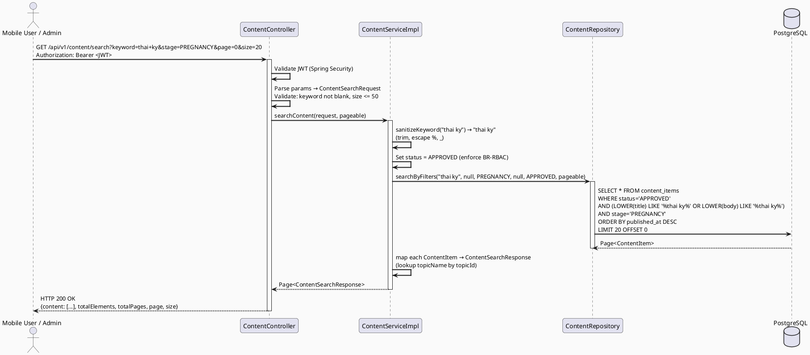
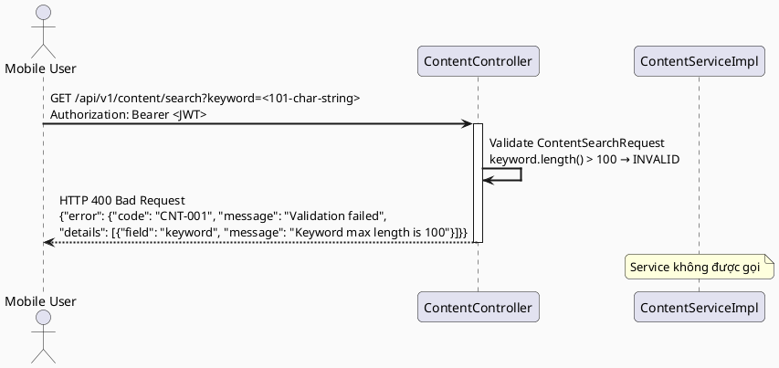
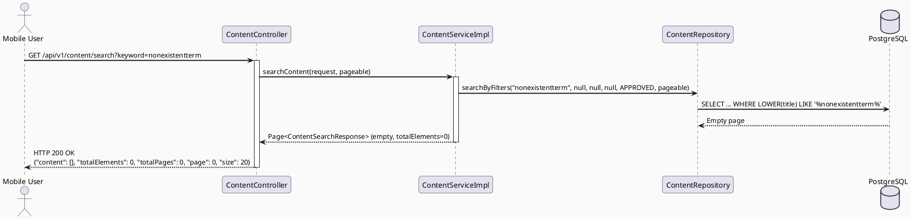

# ENGINEERING DOCUMENTATION STANDARD (EDS) v2.0
# Technical Design Specification — UC-224 Search Verified Content

| Field              | Value                                   |
| ------------------ | --------------------------------------- |
| **Document ID**    | `CB-CONTENT-IMP-002`                    |
| **Version**        | `1.0`                                   |
| **Date**           | `2026-06-23`                            |
| **Status**         | `Approved`                              |
| **Document Owner** | `HuyND`                                 |
| **Author**         | `AI Agent — Winston (System Architect)` |
| **Reviewed by**    | `[ ] Pending`                           |
| **DPO Sign-off**   | `[ ] Pending`                           |
| **Approved by**    | `[ ] Pending`                           |
| **Last Review**    | `2026-06-23`                            |
| **Based on EDS**   | `v2.0`                                  |

---

## CHANGELOG

| Ngày       | Người thực hiện                       | Nội dung thay đổi                                       |
| ---------- | ------------------------------------- | ------------------------------------------------------- |
| 2026-06-23 | AI Agent — Winston (System Architect) | Tạo tài liệu lần đầu cho UC-224 Search Verified Content |

---

## MỤC LỤC

1. [Tổng quan Module](#1-tổng-quan-module)
2. [Ma trận Truy vết (Traceability Matrix)](#2-ma-trận-truy-vết-traceability-matrix)
3. [Architecture Decision Records (ADR)](#3-architecture-decision-records-adr)
4. [Non-Functional Requirements & SLA](#4-non-functional-requirements--sla)
5. [Static Modeling (Mô hình Tĩnh)](#5-static-modeling-mô-hình-tĩnh)
6. [Dynamic Modeling (Mô hình Động)](#6-dynamic-modeling-mô-hình-động)
7. [Domain Event Catalog](#7-domain-event-catalog)
8. [Interface Specification (Đặc tả Giao diện)](#8-interface-specification-đặc-tả-giao-diện)
9. [API Specification](#9-api-specification)
10. [Bảng mã lỗi (Error Codes)](#10-bảng-mã-lỗi-error-codes)
11. [Quy trình Triển khai (Step-by-Step)](#11-quy-trình-triển-khai-step-by-step)
12. [Rollback & Incident Runbook](#12-rollback--incident-runbook)
13. [Kịch bản Kiểm thử Chi tiết](#13-kịch-bản-kiểm-thử-chi-tiết)
14. [Phương pháp Xác minh](#14-phương-pháp-xác-minh)
15. [Mẫu thử thực tế (API Verification Samples)](#15-mẫu-thử-thực-tế-api-verification-samples)
16. [Bảng tổng hợp phân quyền (Authorization Matrix)](#16-bảng-tổng-hợp-phân-quyền-authorization-matrix)
17. [AI Prompt Constraints (CASE 2.0)](#17-ai-prompt-constraints-case-20)

---

## 1. Tổng quan Module

> UC-224 cho phép người dùng tìm kiếm nội dung đã được xác minh (status=APPROVED) gồm bài viết, FAQ và checklist, theo từ khóa, giai đoạn chăm sóc và chủ đề. Chức năng này phục vụ cả Mobile App và Admin Web Portal với kết quả trả về phân trang.

| Field                     | Value                                                                                |
| ------------------------- | ------------------------------------------------------------------------------------ |
| **Module Name**           | `Search Verified Content`                                                            |
| **Bounded Context**       | `content`                                                                            |
| **UC ID**                 | `UC-224`                                                                             |
| **SRS Reference**         | `3.3.18.1`                                                                           |
| **Platform**              | `Mobile App (Flutter) / Admin Web Portal (React)`                                    |
| **Data Classification**   | `Internal`                                                                           |
| **Compliance Scope**      | `BR-RBAC`                                                                            |
| **Upstream Dependencies** | `security (JWT Auth)`, `identity (User, Role)`, `community (Topic — topicName join)` |
| **Downstream Consumers**  | `Mobile App — SearchScreen`, `Admin Web — ContentManagementPage`                     |

---

## 2. Ma trận Truy vết (Traceability Matrix)

| Requirement ID | Loại           | Mô tả yêu cầu                                                   | Thành phần Code                                                | Compliance Target | ADR liên quan |
| -------------- | -------------- | --------------------------------------------------------------- | -------------------------------------------------------------- | ----------------- | ------------- |
| UC-224         | User Story     | Người dùng tìm kiếm nội dung theo keyword, stage, topicId, type | `ContentController.searchContent()`                            | BR-RBAC           | ADR-003       |
| BR-RBAC-SEARCH | Business Rule  | Chỉ nội dung status=APPROVED được trả về trong kết quả tìm kiếm | `ContentServiceImpl.searchContent()` — enforce APPROVED        | BR-RBAC           | ADR-003       |
| SRS-3.3.18.1   | Functional     | Tìm kiếm full-text theo keyword trong title và body             | `ContentRepository.searchByFilters()` — ILIKE hoặc to_tsvector | —                 | ADR-004       |
| PERF-SEARCH    | Non-Functional | Tìm kiếm phải trả về kết quả trong < 500ms cho 1000 records     | GIN index trên PostgreSQL full-text search                     | —                 | ADR-004       |

---

## 3. Architecture Decision Records (ADR)

### ADR-003 — Dùng PostgreSQL Full-Text Search (ILIKE) cho MVP, không dùng Elasticsearch

| Field          | Value               |
| -------------- | ------------------- |
| **Status**     | `Accepted`          |
| **Deciders**   | `HuyND — Tech Lead` |
| **Date**       | `2026-06-23`        |
| **Supersedes** | `—`                 |

#### Bối cảnh (Context)
UC-224 yêu cầu tìm kiếm full-text theo keyword trong title và body của ContentItem. Với MVP scope (~5.000 MAU, ~10.000 content items), cần quyết định giải pháp tìm kiếm phù hợp.

#### Các phương án đã xem xét (Options Considered)

| Phương án | Mô tả                                | Ưu điểm                                     | Nhược điểm                                       |
| --------- | ------------------------------------ | ------------------------------------------- | ------------------------------------------------ |
| A         | PostgreSQL `ILIKE '%keyword%'`       | Không cần infrastructure thêm, dễ implement | Chậm trên data lớn, không support tiếng Việt tốt |
| B         | PostgreSQL `to_tsvector` + GIN index | Hiệu năng tốt hơn ILIKE, native PostgreSQL  | Cấu hình phức tạp hơn, tiếng Việt cần extension  |
| C         | Elasticsearch                        | Full-featured search, tiếng Việt tốt        | Infrastructure phức tạp, overkill cho MVP        |

#### Quyết định (Decision)
Chọn **Phương án A (ILIKE)** cho MVP với điều kiện: keyword được sanitize trước khi query để tránh SQL injection; chuyển sang Phương án B khi data > 50.000 records.

#### Hệ quả (Consequences)

**Tích cực:**
- Nhanh implement, không cần infrastructure mới
- Đủ hiệu năng cho MVP scope

**Tiêu cực / Trade-offs:**
- Chậm khi data lớn — mitigate bằng index trên title column và pagination

---

### ADR-004 — Search keyword phải được sanitize tại Service Layer

| Field          | Value               |
| -------------- | ------------------- |
| **Status**     | `Accepted`          |
| **Deciders**   | `HuyND — Tech Lead` |
| **Date**       | `2026-06-23`        |
| **Supersedes** | `—`                 |

#### Bối cảnh (Context)
Keyword từ người dùng đầu vào trực tiếp và cần tránh SQL injection. Spring Data JPA với named parameters đã có protection, nhưng cần thống nhất về input sanitization.

#### Quyết định (Decision)
Keyword phải được trim và escape `%` và `_` trước khi truyền vào `ILIKE` query. Validation tối thiểu: keyword không được rỗng sau trim, max length 100 ký tự.

---

## 4. Non-Functional Requirements & SLA

### 4.1. Performance & Availability

| Category     | Requirement                | Target SLA  | Measurement Method              | Compliance Basis |
| ------------ | -------------------------- | ----------- | ------------------------------- | ---------------- |
| Latency      | Search API (p99)           | `< 500ms`   | k6 load test với 10.000 records | ADR-003          |
| Availability | Uptime (monthly)           | `99.9%`     | Uptime monitor                  | —                |
| Throughput   | Concurrent search requests | `100 req/s` | Load test                       | —                |

### 4.2. Data Integrity & Retention

| Category     | Requirement                               | Target | Verification Method         | Compliance Basis |
| ------------ | ----------------------------------------- | ------ | --------------------------- | ---------------- |
| BR-RBAC      | Chỉ APPROVED content trong search results | 100%   | Integration test TC-INT-001 | BR-RBAC          |
| Input safety | Keyword injection prevention              | 100%   | Security test TC-SEC-001    | —                |

### 4.3. Security

| Category              | Requirement                             | Target | Verification Method      | Compliance Basis |
| --------------------- | --------------------------------------- | ------ | ------------------------ | ---------------- |
| Authentication        | JWT required cho tất cả search requests | 100%   | Security test TC-SEC-002 | BR-RBAC          |
| Input validation      | Keyword max 100 chars, sanitized        | 100%   | Unit test TC-UNIT-002    | ADR-004          |
| Encryption in transit | TLS 1.3+                                | 100%   | SSL Labs scan            | —                |

### 4.4. Scalability & Capacity Planning

Dự kiến tải: 5.000 MAU, 50 search queries/user/day = 250.000 queries/day. Giải pháp scale: pagination (default 20, max 50), index trên `title` column, Redis cache cho popular queries (TTL = 1 phút).

---

## 5. Static Modeling (Mô hình Tĩnh)

### 5.1. Class Diagram (PlantUML)

```plantuml
@startuml UC224_SearchContent_ClassDiagram
skinparam classAttributeIconSize 0
skinparam classFontStyle bold
skinparam backgroundColor #FAFAFA
skinparam ArrowColor #555555
skinparam ClassBorderColor #2E75B6
skinparam ClassHeaderBackgroundColor #D5E8F0

' === REQUEST DTO ===
class ContentSearchRequest {
  + keyword: String          // max 100 chars, trimmed
  + stage: ContentStage      // optional
  + topicId: UUID            // optional
  + type: ContentType        // optional
  + page: Integer            // default 0
  + size: Integer            // default 20, max 50
}

' === RESPONSE DTO ===
class ContentSearchResponse {
  + id: UUID
  + type: ContentType
  + title: String
  + stage: ContentStage
  + topicName: String        // join từ community.topic
  + publishedAt: LocalDateTime
}

class PagedContentSearchResponse {
  + content: List<ContentSearchResponse>
  + totalElements: Long
  + totalPages: Integer
  + page: Integer
  + size: Integer
}

' === CONTROLLER ===
class ContentController {
  - contentService: ContentService
  + searchContent(request: ContentSearchRequest): PagedContentSearchResponse
}

' === SERVICE ===
interface ContentService {
  + searchContent(request: ContentSearchRequest, pageable: Pageable): Page<ContentSearchResponse>
}

class ContentServiceImpl {
  - contentRepository: ContentRepository
  - contentMapper: ContentMapper
  + searchContent(request, pageable): Page<ContentSearchResponse>
  - sanitizeKeyword(keyword: String): String
  - buildSearchTerm(keyword: String): String
}

' === REPOSITORY ===
interface ContentRepository {
  + searchByFilters(keyword, type, stage, topicId, status, pageable): Page<ContentItem>
}

' === MAPPER ===
class ContentMapper {
  + toSearchResponse(item: ContentItem, topicName: String): ContentSearchResponse
}

' === RELATIONSHIPS ===
ContentController --> ContentService : uses
ContentServiceImpl ..|> ContentService : implements
ContentServiceImpl --> ContentRepository : uses
ContentServiceImpl --> ContentMapper : uses

@enduml
```



### 5.2. JPA Query (Java)

```java
// ContentRepository.java — search query
@Repository
public interface ContentRepository extends JpaRepository<ContentItem, UUID> {

    @Query("SELECT c FROM ContentItem c WHERE " +
           "c.status = :status AND " +
           "(:keyword IS NULL OR LOWER(c.title) LIKE LOWER(CONCAT('%', :keyword, '%')) " +
           "   OR LOWER(c.body) LIKE LOWER(CONCAT('%', :keyword, '%'))) AND " +
           "(:type IS NULL OR c.type = :type) AND " +
           "(:stage IS NULL OR c.stage = :stage) AND " +
           "(:topicId IS NULL OR c.topicId = :topicId) " +
           "ORDER BY c.publishedAt DESC")
    Page<ContentItem> searchByFilters(
        @Param("keyword") String keyword,
        @Param("type") ContentType type,
        @Param("stage") ContentStage stage,
        @Param("topicId") UUID topicId,
        @Param("status") ContentStatus status,
        Pageable pageable
    );
}
```

---

## 6. Dynamic Modeling (Mô hình Động)

### 6.1. Sequence Diagram — Happy Path (PlantUML)



### 6.2. Sequence Diagram — Error Path: Keyword quá dài (PlantUML)



### 6.3. Sequence Diagram — Error Path: Không có kết quả (PlantUML)



---

## 7. Domain Event Catalog

### 7.1. Events Published (Phát ra)

| Event Name        | Trigger                       | Publisher            | Subscriber(s)                           | Payload Schema | Async? |
| ----------------- | ----------------------------- | -------------------- | --------------------------------------- | -------------- | ------ |
| `ContentSearched` | Người dùng thực hiện tìm kiếm | `ContentServiceImpl` | `AuditService` (optional, low priority) | Xem §7.3       | No     |

### 7.2. Events Consumed (Tiêu thụ)

| Event Name        | Source                | Handler                                        | Action thực hiện |
| ----------------- | --------------------- | ---------------------------------------------- | ---------------- |
| `ContentApproved` | `AdminContentService` | Không cần consume — search luôn query DB fresh | —                |

### 7.3. Payload Schema

```java
// ContentSearchedEvent.java (lightweight, không store — chỉ cho audit)
public record ContentSearchedEvent(
    String eventId,
    String eventType,       // "ContentSearched"
    LocalDateTime occurredAt,
    String version,         // "1.0"
    Payload payload,
    Metadata metadata
) {
    public record Payload(
        String keyword,
        ContentStage stage,
        ContentType type,
        Integer resultCount
    ) {}

    public record Metadata(
        String correlationId,
        String causedBy    // userId
    ) {}
}
```

---

## 8. Interface Specification (Đặc tả Giao diện)

### 8.1. Service Interface

```java
// ContentService.java (bổ sung method searchContent) — com.carebridge.backend.content.service
// @version 1.0

package com.carebridge.backend.content.service;

public interface ContentService {

    /**
     * Tìm kiếm nội dung đã được xác minh (status=APPROVED) theo keyword, stage, topicId, type.
     * Keyword được sanitize trước khi query (ADR-004).
     * Chỉ trả về content status=APPROVED (BR-RBAC).
     * topicName được resolve từ topicId.
     *
     * @throws ContentException(CNT-001) Nếu keyword > 100 chars hoặc size > 50
     * @param request ContentSearchRequest — keyword, stage, topicId, type, page, size
     * @param pageable Spring Pageable
     */
    Page<ContentSearchResponse> searchContent(ContentSearchRequest request, Pageable pageable);
}
```

### 8.2. Repository Interface

```java
// ContentRepository.java (bổ sung search method) — com.carebridge.backend.content.repository
// @version 1.0

@Repository
public interface ContentRepository extends JpaRepository<ContentItem, UUID> {

    /**
     * Tìm kiếm ContentItem theo nhiều tiêu chí.
     * Tất cả params ngoài status đều optional (IS NULL = không filter theo param đó).
     * keyword được match với LOWER(title) LIKE và LOWER(body) LIKE.
     */
    @Query("SELECT c FROM ContentItem c WHERE " +
           "c.status = :status AND " +
           "(:keyword IS NULL OR LOWER(c.title) LIKE LOWER(CONCAT('%', :keyword, '%')) " +
           "   OR LOWER(c.body) LIKE LOWER(CONCAT('%', :keyword, '%'))) AND " +
           "(:type IS NULL OR c.type = :type) AND " +
           "(:stage IS NULL OR c.stage = :stage) AND " +
           "(:topicId IS NULL OR c.topicId = :topicId) " +
           "ORDER BY c.publishedAt DESC")
    Page<ContentItem> searchByFilters(
        @Param("keyword") String keyword,
        @Param("type") ContentType type,
        @Param("stage") ContentStage stage,
        @Param("topicId") UUID topicId,
        @Param("status") ContentStatus status,
        Pageable pageable
    );
}
```

---

## 9. API Specification

### 9.1. Endpoints Table

| Method | Path                     | Auth Level | Required Roles                       | Rate Limit | Idempotent? |
| ------ | ------------------------ | ---------- | ------------------------------------ | ---------- | ----------- |
| `GET`  | `/api/v1/content/search` | JWT Bearer | `USER`, `CONTENT_ADMIN`, `MODERATOR` | 100/min    | Yes         |

### 9.2. Request / Response Schemas

#### `GET /api/v1/content/search` — Tìm kiếm nội dung

**Query Parameters:**

| Parameter | Type                | Required | Validation                     | Description                           |
| --------- | ------------------- | -------- | ------------------------------ | ------------------------------------- |
| `keyword` | `String`            | Yes      | max 100 chars, trim whitespace | Từ khóa tìm kiếm                      |
| `stage`   | `ContentStage enum` | No       | —                              | Lọc theo giai đoạn                    |
| `topicId` | `UUID`              | No       | —                              | Lọc theo chủ đề                       |
| `type`    | `ContentType enum`  | No       | —                              | Lọc theo loại (ARTICLE/FAQ/CHECKLIST) |
| `page`    | `Integer`           | No       | default 0, >= 0                | Số trang                              |
| `size`    | `Integer`           | No       | default 20, max 50             | Số phần tử mỗi trang                  |

**Response — 200 OK:**
```json
{
  "content": [
    {
      "id": "550e8400-e29b-41d4-a716-446655440000",
      "type": "ARTICLE",
      "title": "Chăm sóc sức khỏe thai kỳ tuần 12",
      "stage": "PREGNANCY",
      "topicName": "Thai kỳ",
      "publishedAt": "2026-06-01T08:00:00.000Z"
    },
    {
      "id": "661f9511-f3ac-52e5-b827-557766551111",
      "type": "FAQ",
      "title": "Thai kỳ tuần 12 cần khám gì?",
      "stage": "PREGNANCY",
      "topicName": "Khám thai",
      "publishedAt": "2026-05-15T10:30:00.000Z"
    }
  ],
  "totalElements": 12,
  "totalPages": 1,
  "page": 0,
  "size": 20
}
```

**Response — 200 OK (Không có kết quả):**
```json
{
  "content": [],
  "totalElements": 0,
  "totalPages": 0,
  "page": 0,
  "size": 20
}
```

**Response — 400 Bad Request (Validation):**
```json
{
  "error": {
    "code": "CNT-001",
    "message": "Validation failed",
    "details": [
      { "field": "keyword", "message": "Keyword is required" },
      { "field": "size", "message": "Size must not exceed 50" }
    ]
  }
}
```

**Response — 401 Unauthorized:**
```json
{
  "error": {
    "code": "IAM-001",
    "message": "Authentication required"
  }
}
```

---

## 10. Bảng mã lỗi (Error Codes)

| Code      | HTTP Status | Message (EN)             | Message (VI)            | Trigger Condition                                                              |
| --------- | ----------- | ------------------------ | ----------------------- | ------------------------------------------------------------------------------ |
| `CNT-001` | 400         | Validation failed        | Dữ liệu không hợp lệ    | keyword rỗng sau trim; keyword > 100 chars; size > 50; enum value không hợp lệ |
| `CNT-004` | 403         | Insufficient permissions | Không đủ quyền truy cập | User không có role USER/CONTENT_ADMIN/MODERATOR                                |
| `CNT-005` | 500         | Internal server error    | Lỗi hệ thống            | Database connection error, unexpected exception                                |
| `IAM-001` | 401         | Authentication required  | Yêu cầu xác thực        | Không có JWT hoặc JWT hết hạn/không hợp lệ                                     |

> **Lưu ý:** Search trả về empty list (200) khi không có kết quả — KHÔNG trả về 404.

---

## 11. Quy trình Triển khai (Step-by-Step)

### 11.1. Prerequisites

- [ ] UC-82 đã được triển khai (bảng `content_items` đã tồn tại)
- [ ] ADR-003 và ADR-004 đã được Accepted
- [ ] Index trên `title` column đã được thêm

### 11.2. Pre-Migration Checklist

- [ ] Đã verify index `idx_content_items_title` chưa tồn tại trên staging
- [ ] Migration thêm index đã chạy trên staging ≥ 24 giờ

### 11.3. Implementation Steps

#### Chặng 1 — Database Index

```sql
-- V002__add_search_indexes.sql (chạy sau V001 của UC-82)
-- Index cho keyword search trên title
CREATE INDEX CONCURRENTLY idx_content_items_title_search
ON content_items USING btree (LOWER(title));

-- Index tổng hợp cho filter phổ biến
CREATE INDEX CONCURRENTLY idx_content_items_stage_type_status
ON content_items(stage, type, status)
WHERE status = 'APPROVED';
```

> ⚠️ **Chú ý:** Dùng `CREATE INDEX CONCURRENTLY` để không lock bảng trên production.

#### Chặng 2 — Backend Implementation

Thứ tự implement (sử dụng lại entities từ UC-82):
1. DTO: `ContentSearchRequest` (validation annotations), `ContentSearchResponse`, `PagedContentSearchResponse`
2. Repository: Thêm method `searchByFilters()` vào `ContentRepository`
3. Mapper: Thêm `toSearchResponse()` vào `ContentMapper`
4. Service: Thêm `searchContent()` vào `ContentServiceImpl`
   - `sanitizeKeyword()`: trim + escape `%` và `_`
   - Enforce `ContentStatus.APPROVED`
5. Controller: Thêm `GET /api/v1/content/search` vào `ContentController`

#### Chặng 3 — Verification

```bash
curl -X GET "https://carebridge-api/api/v1/content/search?keyword=thai+ky" \
  -H "Authorization: Bearer $JWT_TOKEN"
# Expected: 200 OK với danh sách kết quả
```

### 11.4. Deployment Checklist

- [ ] Index đã tạo thành công (`\d content_items` → thấy index mới)
- [ ] Search API trả về 200 với keyword hợp lệ
- [ ] Search với keyword > 100 chars → 400 với CNT-001
- [ ] Search không có JWT → 401 với IAM-001

---

## 12. Rollback & Incident Runbook

### 12.1. Điều kiện kích hoạt Rollback

| Điều kiện                          | Ngưỡng            | Người quyết định     |
| ---------------------------------- | ----------------- | -------------------- |
| Search API latency                 | > 1s (p99)        | On-call Engineer     |
| Error rate                         | > 5% trong 5 phút | On-call Engineer     |
| DRAFT content trong search results | Bất kỳ case       | Tech Lead            |
| SQL injection detected             | Bất kỳ case       | Tech Lead + Security |

### 12.2. Rollback Procedure

```bash
# Bước 1: Re-deploy phiên bản cũ
kubectl rollout undo deployment/carebridge-api

# Bước 2: Verify rollback
kubectl rollout status deployment/carebridge-api
curl -X GET https://carebridge-api/api/v1/health

# Bước 3: Drop index nếu index gây vấn đề
psql -h $DB_HOST -U $DB_USER -d $DB_NAME -c \
  "DROP INDEX CONCURRENTLY IF EXISTS idx_content_items_title_search;"
```

### 12.3. Notification Protocol

| Thời điểm          | Người nhận   | Kênh              | Template                                                             |
| ------------------ | ------------ | ----------------- | -------------------------------------------------------------------- |
| Ngay khi phát hiện | On-call team | Slack `#incident` | "INCIDENT [CONTENT-SEARCH]: DRAFT content exposed in search results" |
| Trong 30 phút      | Tech Lead    | Email             | Chi tiết incident                                                    |

### 12.4. Post-Incident Review (PIR)

- **Root Cause Analysis:** Kiểm tra `status = APPROVED` filter trong repository query
- **Prevention:** Thêm integration test kiểm tra DRAFT không xuất hiện trong search results

---

## 13. Kịch bản Kiểm thử Chi tiết

### 13.1. Unit Tests

#### TC-UNIT-001 — searchContent chỉ trả về APPROVED content

```gherkin
Feature: Search Verified Content
  Background:
    Given test data classification: SYNTHETIC
    And ContentRepository được mock

  Scenario: Tìm kiếm với keyword hợp lệ
    Given ContentRepository.searchByFilters trả về 2 ContentItem với status=APPROVED
    When ContentServiceImpl.searchContent(request{keyword="thai ky"}, pageable) được gọi
    Then ContentRepository.searchByFilters được gọi với status=APPROVED
    And kết quả trả về 2 ContentSearchResponse
    And mỗi ContentSearchResponse có id, type, title, stage, topicName, publishedAt

  Scenario: Tìm kiếm không có kết quả
    Given ContentRepository.searchByFilters trả về empty page
    When ContentServiceImpl.searchContent(request{keyword="nonexistent"}, pageable) được gọi
    Then kết quả là Page rỗng với totalElements=0
    And không có exception được ném
```

#### TC-UNIT-002 — Keyword sanitization

```gherkin
  Scenario: Keyword được trim trước khi query
    Given keyword = "  thai ky  " (có leading/trailing spaces)
    When ContentServiceImpl.sanitizeKeyword("  thai ky  ") được gọi
    Then kết quả là "thai ky" (đã trim)

  Scenario: Keyword có ký tự LIKE wildcard được escape
    Given keyword = "100% tốt"
    When ContentServiceImpl.sanitizeKeyword("100% tốt") được gọi
    Then ký tự % được escape thành \%
    And ContentRepository được gọi với keyword đã escape
```

#### TC-UNIT-003 — Validation size tối đa 50

```gherkin
  Scenario: size > 50 bị từ chối tại controller
    Given request với size=100
    When GET /api/v1/content/search?keyword=test&size=100 được gọi
    Then response status 400
    And response chứa error code CNT-001
    And error details chứa field="size" message="Size must not exceed 50"
```

### 13.2. Integration Tests

#### TC-INT-001 — DRAFT content không xuất hiện trong search results

```gherkin
  Scenario: Search results chỉ chứa APPROVED content
    Given test data classification: SYNTHETIC
    And database có:
      | title | status |
      | "Thai kỳ APPROVED" | APPROVED |
      | "Thai kỳ DRAFT" | DRAFT |
      | "Thai kỳ ARCHIVED" | ARCHIVED |
    When GET /api/v1/content/search?keyword=Thai+ky được gọi với JWT hợp lệ
    Then response.content.length = 1
    And response.content[0].title = "Thai kỳ APPROVED"
    And response.content không chứa "Thai kỳ DRAFT"
    And response.content không chứa "Thai kỳ ARCHIVED"
```

#### TC-INT-002 — Tìm kiếm case-insensitive

```gherkin
  Scenario: Keyword matching không phân biệt hoa thường
    Given test data classification: SYNTHETIC
    And ContentItem với title="THAI KỲ TUẦN 12" và status=APPROVED
    When GET /api/v1/content/search?keyword=thai+ky được gọi
    Then response.content.length >= 1
    And response.content có phần tử với title chứa "THAI KỲ"
```

### 13.3. Security Tests

#### TC-SEC-001 — SQL injection prevention

```gherkin
  Scenario: Keyword chứa SQL injection payload bị xử lý an toàn
    Given test data classification: SYNTHETIC
    When GET /api/v1/content/search?keyword='; DROP TABLE content_items; -- được gọi
    Then response status 200 (không phải error)
    And bảng content_items vẫn tồn tại trong database
    And không có SQL error trong logs
    And kết quả trả về empty list hoặc kết quả bình thường (không crash)
```

#### TC-SEC-002 — Unauthenticated search bị từ chối

```gherkin
  Scenario: Không có JWT
    Given user không có Authorization header
    When GET /api/v1/content/search?keyword=test được gọi
    Then response status 401
    And response chứa error code IAM-001
```

---

## 14. Phương pháp Xác minh

### 14.1. Database Inspection

```sql
-- Verify index tồn tại
SELECT indexname, indexdef
FROM pg_indexes
WHERE tablename = 'content_items'
AND indexname LIKE '%search%';

-- Verify chỉ APPROVED content có thể match search
SELECT COUNT(*) FROM content_items WHERE status != 'APPROVED';
-- Số này phải > 0 để test có ý nghĩa (có DRAFT/ARCHIVED data để kiểm tra)

-- Explain plan cho search query
EXPLAIN ANALYZE
SELECT * FROM content_items
WHERE status = 'APPROVED'
AND LOWER(title) LIKE '%thai ky%'
LIMIT 20;
```

### 14.2. Log / Audit Verification

```bash
# Verify search không log keyword dưới dạng PII-sensitive
kubectl logs -l app=carebridge-api | grep '"eventType":"ContentSearched"' | head -3

# Verify không có SQL query log chứa raw keyword injection
kubectl logs -l app=carebridge-api | grep -i "drop table\|union select\|--"
# Expected: No output
```

---

## 15. Mẫu thử thực tế (API Verification Samples)

### 15.1. Happy Path

```bash
# Tìm kiếm theo keyword + stage
curl -X GET "https://carebridge-api/api/v1/content/search?keyword=thai+ky&stage=PREGNANCY&page=0&size=20" \
  -H "Authorization: Bearer $JWT_TOKEN" \
  -H "X-Correlation-Id: $(uuidgen)"
```

**Expected Response (200):**
```json
{
  "content": [
    {
      "id": "550e8400-e29b-41d4-a716-446655440000",
      "type": "ARTICLE",
      "title": "Chăm sóc sức khỏe thai kỳ tuần 12",
      "stage": "PREGNANCY",
      "topicName": "Thai kỳ",
      "publishedAt": "2026-06-01T08:00:00.000Z"
    }
  ],
  "totalElements": 1,
  "totalPages": 1,
  "page": 0,
  "size": 20
}
```

```bash
# Tìm kiếm không có kết quả → 200 với empty list
curl -X GET "https://carebridge-api/api/v1/content/search?keyword=nonexistentterm123" \
  -H "Authorization: Bearer $JWT_TOKEN"
```

### 15.2. Error Paths

```bash
# Keyword rỗng → 400
curl -X GET "https://carebridge-api/api/v1/content/search?keyword=" \
  -H "Authorization: Bearer $JWT_TOKEN"
```

**Expected Response (400):**
```json
{
  "error": {
    "code": "CNT-001",
    "message": "Validation failed",
    "details": [{ "field": "keyword", "message": "Keyword is required" }]
  }
}
```

```bash
# size > 50 → 400
curl -X GET "https://carebridge-api/api/v1/content/search?keyword=test&size=100" \
  -H "Authorization: Bearer $JWT_TOKEN"
```

```bash
# Không có JWT → 401
curl -X GET "https://carebridge-api/api/v1/content/search?keyword=test"
```

---

## 16. Bảng tổng hợp phân quyền (Authorization Matrix)

| Endpoint                     | `GUEST` | `USER` | `CONTENT_ADMIN` | `MODERATOR` | `SYSTEM_ADMIN` |
| ---------------------------- | ------- | ------ | --------------- | ----------- | -------------- |
| `GET /api/v1/content/search` | ❌       | ✅      | ✅               | ✅           | ✅              |

**Chú thích:**
- ✅ = Được phép (chỉ nhận APPROVED content trong kết quả)
- ❌ = Bị từ chối — 401 nếu không có JWT; 403 nếu role không hợp lệ

---

## 17. AI Prompt Constraints (CASE 2.0)

### 17.1 Constraint Summary Table

| #   | Constraint                                                                                                                               | Source (ADR/BR)          | Last Verified |
| --- | ---------------------------------------------------------------------------------------------------------------------------------------- | ------------------------ | ------------- |
| C1  | `searchContent()` PHẢI luôn truyền `ContentStatus.APPROVED` vào `searchByFilters()` — không để user tìm thấy DRAFT hoặc ARCHIVED content | `ADR-003`, `BR-RBAC`     | `2026-06-23`  |
| C2  | Keyword PHẢI được sanitize qua `sanitizeKeyword()` trước khi truyền vào repository — trim whitespace, escape `%` và `_`                  | `ADR-004`                | `2026-06-23`  |
| C3  | `ContentSearchRequest` PHẢI có validation: keyword required, keyword max length 100, size max 50 — vi phạm → `CNT-001`                   | `ADR-004`                | `2026-06-23`  |
| C4  | Search trả về empty list (HTTP 200) khi không có kết quả — KHÔNG trả về 404                                                              | `§9.2`                   | `2026-06-23`  |
| C5  | `topicName` trong `ContentSearchResponse` được resolve từ `topicId` — không để null nếu topicId hợp lệ                                   | `§8.1 Service Interface` | `2026-06-23`  |
| C6  | Controller dùng `@PreAuthorize("hasAnyRole('USER','CONTENT_ADMIN','MODERATOR')")` — không viết auth logic thủ công                       | `ADR-001`                | `2026-06-23`  |

### 17.2 Constraint Injection Block (Copy-Paste vào AI Prompt)

```
[CONSTRAINT BLOCK — Module: Search Verified Content — CB-CONTENT-IMP-002]
Theo TDS CB-CONTENT-IMP-002 và các ADR liên quan:

1. searchContent() PHẢI truyền ContentStatus.APPROVED vào searchByFilters() — không expose DRAFT/ARCHIVED (ADR-003, BR-RBAC).
2. Keyword PHẢI được sanitize trước khi query: trim whitespace, escape ký tự % và _ (ADR-004).
3. ContentSearchRequest validation: keyword required + max 100 chars; size max 50 → vi phạm throws CNT-001.
4. Empty search results → HTTP 200 với content:[] — KHÔNG phải 404.
5. topicName phải được resolve từ topicId — không để null cho topicId hợp lệ.
6. Controller dùng @PreAuthorize annotation, không viết authorization logic trong method body.

[CONTEXT BLOCK]
- Bounded Context: content
- Data Classification: Internal
- Compliance: BR-RBAC
- Existing interfaces: §8 Service Interface + §8.2 Repository Interface
- Error codes: §10 (CNT-001, CNT-004, CNT-005, IAM-001)
- Auth matrix: §16

[TASK BLOCK]
Implement searchContent() trong ContentServiceImpl và GET /api/v1/content/search trong ContentController.
Reuse ContentRepository, ContentItem entity và ContentMapper từ UC-82 (CB-CONTENT-IMP-001).
Tests phải cover §13: TC-UNIT-001, TC-UNIT-002, TC-UNIT-003, TC-INT-001, TC-SEC-001.
```

### 17.3 Constraint Quality Checklist

- [x] Mỗi constraint traceable về ADR hoặc BR cụ thể
- [x] Không có constraint generic
- [x] Mỗi constraint có `Last Verified` date ≤ 2 sprints
- [x] Constraint block có ≥ 3 constraints cụ thể (có 6)
- [x] Constraint block reference §8 Interface
- [x] Constraint block reference §16 Auth Matrix

### 17.4 Anti-Pattern Detection

| AP-ID     | Anti-Pattern          | Dấu hiệu                                 | Hành động                               |
| --------- | --------------------- | ---------------------------------------- | --------------------------------------- |
| AP-AI-001 | Unconstrained Gen     | searchByFilters không có status=APPROVED | Reject — inject C1                      |
| AP-AI-003 | Implicit Decision     | Code trả về 404 khi search empty         | Reject — enforce C4                     |
| AP-AI-004 | Layer Violation       | Service chứa @Query annotation           | Reject — query thuộc Repository         |
| AP-AI-005 | Hallucinated Contract | Code import ElasticsearchRepository      | Reject — dùng JpaRepository per ADR-003 |

---

## PHỤ LỤC

### A. Glossary

| Thuật ngữ            | Định nghĩa                                                                  |
| -------------------- | --------------------------------------------------------------------------- |
| Keyword sanitization | Xử lý input từ user: trim, escape ký tự đặc biệt của LIKE query             |
| ILIKE                | Case-insensitive LIKE trong PostgreSQL                                      |
| GIN Index            | Generalized Inverted Index — phù hợp cho full-text search trong PostgreSQL  |
| `topicName`          | Tên chủ đề được resolve từ `topicId` — join hoặc lookup từ community module |

### B. Tài liệu tham chiếu

| Document                                  | Path                                                                        |
| ----------------------------------------- | --------------------------------------------------------------------------- |
| UC-82 TDS (ContentItem entity definition) | `04_Implement/implement_artifacts/UC82_ViewContentAndChecklist_TDS.md`      |
| CLAUDE.md — Architecture Rules            | `/CareBridge_SEP490_G79/CLAUDE.md`                                          |
| SRS UC-224                                | `02_Requirements/SRS/`                                                      |
| Test-Spec                                 | `04_Implement/implement_artifacts/UC224_SearchVerifiedContent_Test-Spec.md` |
