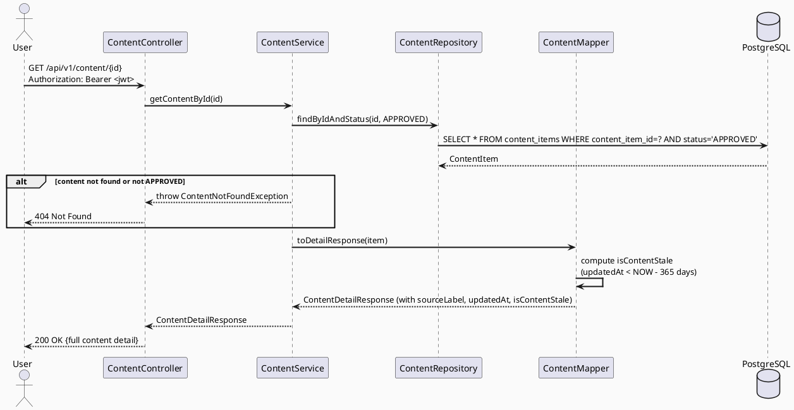

# ENGINEERING DOCUMENTATION STANDARD (EDS) v2.0
# Technical Design Specification — UC-225 View Verified Content Detail

| Field              | Value                                       |
| ------------------ | ------------------------------------------- |
| **Document ID**    | `CB-CONTENT-IMP-003`                        |
| **Version**        | `1.0`                                       |
| **Date**           | `2026-07-01`                                |
| **Status**         | `Implemented`                               |
| **Document Owner** | `HuyND`                                     |
| **Author**         | `AI Agent — Winston (System Architect)`     |
| **Reviewed by**    | `[ ] HuyND — Pending`                       |
| **DPO Sign-off**   | `[ ] Pending`                               |
| **Approved by**    | `[ ] Pending`                               |
| **Last Review**    | `2026-07-01`                                |
| **Based on EDS**   | `v2.0`                                      |

---

## CHANGELOG

| Ngày       | Người thực hiện                       | Nội dung thay đổi                                          |
| ---------- | ------------------------------------- | ---------------------------------------------------------- |
| 2026-07-01 | AI Agent — Winston (System Architect) | Tạo tài liệu lần đầu cho UC-225 View Verified Content Detail |
| 2026-07-02 | AI Agent — Claude (Audit Pass)         | Sửa sai lệch thực tế: ContentStatus enum ghi sai (`PENDING`/`HIDDEN` không tồn tại — đúng là `DRAFT, PENDING_REVIEW, APPROVED, ARCHIVED`, verified `ContentStatus.java`); §9/§10/§15 sửa mã lỗi bịa `AUTH_REQUIRED`/`CONTENT_NOT_FOUND` thành thực tế (401 = bare status không code; 404 = `CNT-003` từ `ContentException.contentNotFound()` có sẵn). Gap analysis (§1, §5.3, §8) đã verify khớp code hiện tại — không cần sửa. Status giữ nguyên `Draft` theo quy ước audit — không tự approve. |
| 2026-07-03 | AI Agent — Claude (Audit Pass 2) | **Follow-up finds this UC was never actually wired to any screen**: `ContentService.getContentDetail()` and the `ContentDetail` model existed end-to-end, but zero widget/route anywhere called them — confirmed dead code, not a design gap. Built `VerifiedContentDetailScreen` (mobile, plain `Navigator.push`, no new go_router path — consistent with how sibling community screens navigate) and wired it from `VerifiedContentSearchScreen` (UC-224) result cards and `ViewContentScreen` (UC-82) article/FAQ tap handlers, which were previously `// TODO` stubs. `flutter analyze`/`dart analyze` clean, no compile errors. |
| 2026-07-11 | AI Agent — Codex | Implemented source attribution, updated timestamp and 365-day stale-content indicator in the detail contract; privacy exclusion retained. Focused backend gate passes 26/26. |

---

## MỤC LỤC

1. [Tổng quan Module](#1-tổng-quan-module)
2. [Ma trận Truy vết (Traceability Matrix)](#2-ma-trận-truy-vết-traceability-matrix)
3. [Architecture Decision Records (ADR)](#3-architecture-decision-records-adr)
4. [Non-Functional Requirements & SLA](#4-non-functional-requirements--sla)
5. [Static Modeling (Mô hình Tĩnh)](#5-static-modeling-mô-hình-tĩnh)
6. [Dynamic Modeling (Mô hình Động)](#6-dynamic-modeling-mô-hình-động)
7. [Domain Event Catalog](#7-domain-event-catalog)
8. [Interface Specification (Đặc tả Giao diện)](#8-interface-specification-đặc-tả-giao-diện)
9. [API Specification](#9-api-specification)
10. [Bảng mã lỗi (Error Codes)](#10-bảng-mã-lỗi-error-codes)
11. [Quy trình Triển khai (Step-by-Step)](#11-quy-trình-triển-khai-step-by-step)
12. [Rollback & Incident Runbook](#12-rollback--incident-runbook)
13. [Kịch bản Kiểm thử Chi tiết](#13-kịch-bản-kiểm-thử-chi-tiết)
14. [Phương pháp Xác minh](#14-phương-pháp-xác-minh)
15. [Mẫu thử thực tế (API Verification Samples)](#15-mẫu-thử-thực-tế-api-verification-samples)
16. [Bảng tổng hợp phân quyền (Authorization Matrix)](#16-bảng-tổng-hợp-phân-quyền-authorization-matrix)
17. [AI Prompt Constraints (CASE 2.0)](#17-ai-prompt-constraints-case-20)

---

## 1. Tổng quan Module

| Field                     | Value                                                                    |
| ------------------------- | ------------------------------------------------------------------------ |
| **Module Name**           | `ViewVerifiedContentDetail`                                              |
| **Bounded Context**       | `content`                                                                |
| **UC ID**                 | `UC-225`                                                                 |
| **SRS Reference**         | `3.3.18.2`                                                               |
| **Primary Actor**         | `Authenticated User (MOTHER, FAMILY, EXPERT, PARTNER) + Admin Web (CONTENT_ADMIN, MODERATOR)` |
| **Platform**              | `Mobile App (Flutter) + Admin Web (React TypeScript) + Backend`         |
| **Data Classification**   | `Internal`                                                               |
| **Compliance Scope**      | `BR-RBAC, BR-SAFETY`                                                     |
| **Upstream Dependencies** | `security (JWT), content (ContentItem entity, UC-224 search)`           |
| **Downstream Consumers**  | `Mobile content detail screen, checklist screen`                         |

**Mô tả:** Hiển thị chi tiết một bài viết đã được xác minh (APPROVED), bao gồm: nội dung bài viết (body), nguồn tham khảo (source), phiên bản (version), ngày cập nhật (updatedAt), và cảnh báo nếu nội dung đã cũ (BR-SAFETY).

**Current state:** Endpoint `GET /api/v1/content/{id}` đã tồn tại trong `ContentController.getContentById()`. Tuy nhiên `ContentDetailResponse` và `ContentMapper.toDetailResponse()` chưa trả về các fields: `sourceLabel`, `updatedAt`, và `isContentStale`. Đây là **DTO extension spec** — backend logic cơ bản đã hoạt động, cần bổ sung fields còn thiếu.

**Gap analysis:**
| Field Required by UC-225 | In DB (`content_items`) | In `ContentDetailResponse` | Gap |
|--------------------------|------------------------|---------------------------|-----|
| `content (body)` | ✅ `body TEXT` | ✅ mapped | None |
| `source (source_label)` | ✅ `source_label varchar(255)` | ❌ Not in DTO | **Missing** |
| `version (version_no)` | ✅ `version_no INTEGER` | ✅ mapped as `version` | None |
| `updatedAt (updated_at)` | ✅ `updated_at TIMESTAMPTZ` | ❌ Not in DTO | **Missing** |
| `related warnings` | ❌ No DB column — computed | ❌ Not in DTO | **Computed field** |

---

## 2. Ma trận Truy vết (Traceability Matrix)

| Requirement ID | Loại          | Mô tả yêu cầu                                                    | Thành phần Code                                              | Compliance Target | ADR liên quan |
| -------------- | ------------- | ----------------------------------------------------------------- | ------------------------------------------------------------ | ----------------- | ------------- |
| UC-225         | Use Case      | Hiển thị chi tiết nội dung, nguồn, phiên bản, ngày cập nhật, cảnh báo | `ContentController.getContentById()` + `ContentDetailResponse` | BR-RBAC, BR-SAFETY | ADR-CON-225-1 |
| BR-RBAC        | Business Rule | Chỉ authenticated user mới được xem content detail               | JWT required on endpoint                                     | RBAC              | ADR-CON-225-1 |
| BR-SAFETY      | Business Rule | Hiển thị cảnh báo nếu nội dung chưa được cập nhật trong 12 tháng | `isContentStale` computed field (updatedAt > 12 months)      | Healthcare safety | ADR-CON-225-2 |
| BR-CON-225-1   | Business Rule | Chỉ trả về content có status = APPROVED với regular user         | ContentService filter `status = APPROVED`                    | Data integrity    | ADR-CON-225-1 |
| BR-CON-225-2   | Business Rule | CONTENT_ADMIN và MODERATOR có thể xem mọi status                 | Admin endpoint hoặc role-based filter                        | RBAC              | ADR-CON-225-1 |
| BR-CON-225-3   | Business Rule | `source_label` phải hiển thị để user đánh giá tính tin cậy của nguồn | `sourceLabel` field trong response                           | Healthcare safety | ADR-CON-225-2 |

---

## 3. Architecture Decision Records (ADR)

### ADR-CON-225-1 — APPROVED-only filter cho regular user; Admin thấy mọi status

| Field      | Value        |
| ---------- | ------------ |
| **Status** | `Accepted`   |
| **Date**   | `2026-07-01` |

#### Bối cảnh (Context)
Content có nhiều status: `DRAFT, PENDING_REVIEW, APPROVED, ARCHIVED` (verified — `ContentStatus.java`, không có `HIDDEN`, và giá trị đúng là `PENDING_REVIEW` chứ không phải `PENDING`; corrected 2026-07-02). Regular user chỉ nên thấy APPROVED content. Admin (CONTENT_ADMIN, MODERATOR) cần xem tất cả để quản lý.

#### Quyết định (Decision)
`ContentService.getContentById()` hiện tại đã filter `status = APPROVED` (cần verify). Admin access đã có qua `AdminContentController`. Spec này chỉ bổ sung fields còn thiếu trên public endpoint — không thay đổi status filter.

---

### ADR-CON-225-2 — isContentStale là computed field, không có DB column

| Field      | Value        |
| ---------- | ------------ |
| **Status** | `Accepted`   |
| **Date**   | `2026-07-01` |

#### Bối cảnh (Context)
UC-225 yêu cầu "related warnings" khi content có thể outdated. Không có `warning_note` column trong DB. Có 3 options: (A) thêm DB column, (B) computed từ `updated_at`, (C) bỏ qua.

#### Các phương án đã xem xét (Options Considered)

| Phương án | Mô tả | Ưu điểm | Nhược điểm |
|-----------|-------|----------|------------|
| A | Thêm `warning_note TEXT` column | Flexible, cho phép custom warning message | Cần migration, content editors phải set manually |
| B | Computed: `isContentStale = (updatedAt < NOW() - INTERVAL '12 months')` | Tự động, không cần migration | Warning message cố định |
| C | Bỏ qua warnings | Đơn giản | Vi phạm BR-SAFETY |

#### Quyết định (Decision)
**Phương án B — Computed field** từ `updated_at`. Không cần migration. `isContentStale = true` khi `updated_at < NOW() - 12 months`. Stale threshold: 12 months. Message hiển thị trên mobile: "Nội dung này có thể chưa được cập nhật gần đây. Hãy tham khảo bác sĩ."

---

## 4. Non-Functional Requirements & SLA

### 4.1. Performance & Availability

| Category | Requirement            | Target SLA |
| -------- | ---------------------- | ---------- |
| Latency  | GET content/{id} (p99) | `< 200ms`  |

### 4.2. Security

| Category      | Requirement                              | Verification             |
| ------------- | ---------------------------------------- | ------------------------ |
| Authorization | Authentication required                  | 401 test case            |
| Data filter   | Non-APPROVED content hidden from users   | Integration test         |
| Author PII    | `author_user_id` excluded from response  | BR-PRIVACY (already in existing DTO comment) |

---

## 5. Static Modeling (Mô hình Tĩnh)

### 5.1. Planned File Paths

| File | Change Type | Notes |
|------|-------------|-------|
| `content/dto/response/ContentDetailResponse.java` | Modify | Add `sourceLabel`, `updatedAt`, `isContentStale` fields |
| `content/mapper/ContentMapper.java` | Modify | Update `toDetailResponse()` to map new fields |
| `content/service/ContentServiceImpl.java` | Verify | Confirm stale check logic is added |

> **No migration required.** `source_label` and `updated_at` already exist in `content_items` table. `isContentStale` is a computed boolean in the mapper/service.

### 5.2. Class Diagram (PlantUML)

```plantuml
@startuml UC225_ViewContentDetail_ClassDiagram
skinparam classAttributeIconSize 0
skinparam classFontStyle bold
skinparam backgroundColor #FAFAFA

class ContentDetailResponse {
  + id: UUID
  + type: ContentType
  + title: String
  + body: String
  + stage: ContentStage
  + topicId: UUID
  + version: Integer
  + publishedAt: Instant
  + sourceLabel: String       -- NEW: from source_label
  + updatedAt: Instant        -- NEW: from updated_at
  + isContentStale: boolean   -- NEW: computed (updatedAt < 12 months ago)
}

class ContentItem {
  + id: UUID
  + type: ContentType
  + title: String
  + body: String
  + stage: ContentStage
  + topicId: UUID
  + status: ContentStatus
  + versionNo: Integer
  + publishedAt: Instant
  + sourceLabel: String
  + createdAt: Instant
  + updatedAt: Instant
}

class ContentMapper {
  + toDetailResponse(item: ContentItem): ContentDetailResponse
}

note on link ContentMapper::toDetailResponse
  isContentStale = item.updatedAt != null &&
    item.updatedAt.isBefore(Instant.now().minus(365, DAYS))
end note

class ContentController {
  + getContentById(id: UUID): ResponseEntity<ApiResponse<ContentDetailResponse>>
}

ContentController --> ContentMapper : uses
ContentMapper --> ContentItem : reads

@enduml
```

### 5.3. Schema / Migration Delta

**No migration required.** All required fields (`source_label`, `updated_at`) already exist in `content_items` as per V1__init_schema.sql. The `isContentStale` flag is computed at the mapper level from the `updatedAt` value.

---

## 6. Dynamic Modeling (Mô hình Động)

### 6.1. Sequence Diagram — Get Content Detail



---

## 7. Domain Event Catalog

Not applicable. This is a read-only operation — no domain events published.

---

## 8. Interface Specification (Đặc tả Giao diện)

```java
// ContentDetailResponse.java — added fields
package com.carebridge.backend.content.dto.response;

import com.carebridge.backend.content.entity.ContentStage;
import com.carebridge.backend.content.entity.ContentType;
import java.time.Instant;
import java.util.UUID;
import lombok.*;

@Getter @Setter @Builder @NoArgsConstructor @AllArgsConstructor
public class ContentDetailResponse {
    private UUID id;
    private ContentType type;
    private String title;
    private String body;
    private ContentStage stage;
    private UUID topicId;
    private Integer version;
    private Instant publishedAt;
    private String sourceLabel;      // NEW — UC-225: source attribution
    private Instant updatedAt;       // NEW — UC-225: last update date
    private boolean isContentStale;  // NEW — UC-225 BR-SAFETY: computed warning flag
}

// ContentMapper.java — toDetailResponse update
public ContentDetailResponse toDetailResponse(ContentItem item) {
    boolean stale = item.getUpdatedAt() != null &&
        item.getUpdatedAt().isBefore(Instant.now().minus(365, ChronoUnit.DAYS));

    return ContentDetailResponse.builder()
        .id(item.getId())
        .type(item.getType())
        .title(item.getTitle())
        .body(item.getBody())
        .stage(item.getStage())
        .topicId(item.getTopicId())
        .version(item.getVersionNo())
        .publishedAt(item.getPublishedAt())
        .sourceLabel(item.getSourceLabel())    // NEW
        .updatedAt(item.getUpdatedAt())         // NEW
        .isContentStale(stale)                  // NEW
        .build();
}
```

---

## 9. API Specification

### GET /api/v1/content/{id}

| Field       | Value                                          |
| ----------- | ---------------------------------------------- |
| **Method**  | `GET`                                          |
| **Path**    | `/api/v1/content/{id}`                         |
| **Auth**    | `Bearer JWT` (required)                        |
| **Roles**   | Any authenticated user (returns APPROVED only) |

**Path Parameters:**

| Parameter | Type   | Required | Description         |
| --------- | ------ | -------- | ------------------- |
| `id`      | `UUID` | Yes      | ID of the content item |

**Success Response:** `200 OK`

```json
{
  "success": true,
  "data": {
    "id": "uuid",
    "type": "ARTICLE",
    "title": "Dinh dưỡng trong tam cá nguyệt đầu",
    "body": "Trong tam cá nguyệt đầu...",
    "stage": "PREGNANCY",
    "topicId": "uuid",
    "version": 2,
    "publishedAt": "2026-01-01T00:00:00Z",
    "sourceLabel": "WHO Guidelines 2024",
    "updatedAt": "2026-01-15T00:00:00Z",
    "isContentStale": false
  }
}
```

**Error Responses:**

| HTTP Status | Error Code          | Condition                                       |
| ----------- | ------------------- | ----------------------------------------------- |
| `401`       | *(none — bare status)* | No JWT token (corrected 2026-07-02: `SecurityConfig`'s `HttpStatusEntryPoint` returns status only, no JSON body/code — there is no `AUTH_REQUIRED` code in the codebase) |
| `404`       | `CNT-003`            | Content ID does not exist or status != APPROVED (corrected 2026-07-02: existing `ContentException.contentNotFound()` uses `CNT-003`, matching UC-224's `CNT-xxx` convention — not `CONTENT_NOT_FOUND`) |

**BR-SAFETY — Mobile Display Rule:**
When `isContentStale = true`, mobile app MUST display warning banner: `"Nội dung này có thể chưa được cập nhật gần đây. Hãy tham khảo ý kiến bác sĩ."` This is a mobile-side rendering rule, not backend.

---

## 10. Bảng mã lỗi (Error Codes)

| Error Code          | HTTP Status | Message (EN)                   | Condition                      |
| ------------------- | ----------- | ------------------------------ | ------------------------------ |
| `CNT-003` (was `CONTENT_NOT_FOUND` — corrected 2026-07-02) | `404`       | Content item not found         | No APPROVED content with given ID |

---

## 11. Quy trình Triển khai (Step-by-Step)

1. **DTO:** Add `sourceLabel: String`, `updatedAt: Instant`, `isContentStale: boolean` to `ContentDetailResponse.java`
2. **Mapper:** Update `ContentMapper.toDetailResponse()` to map `sourceLabel`, `updatedAt`, and compute `isContentStale` (threshold: 365 days)
3. **Verify:** Confirm `ContentService.getContentById()` already filters `status = APPROVED` — add filter if not
4. **Tests:** Write unit + integration tests as per Test-Spec
5. **Mobile:** Update `getContentDetail()` in `content_service.dart` to parse new fields; add stale warning banner in content detail screen

---

## 12. Rollback & Incident Runbook

### Rollback Procedure
Git revert the DTO and mapper changes. No schema migration to rollback.

### Incident Triggers
- `sourceLabel` returns null for content with source → verify ContentItem has `sourceLabel` populated in DB
- `isContentStale` always false → verify `updatedAt` is being populated in DB (not null)
- 404 on APPROVED content → verify ContentService filter logic

---

## 13. Kịch bản Kiểm thử Chi tiết

> Detailed test cases are in `UC225_ViewVerifiedContentDetail_Test-Spec.md`.

| TC ID    | Scenario                                              | Expected Result                              |
| -------- | ----------------------------------------------------- | -------------------------------------------- |
| TC-225-1 | Get APPROVED content with all fields present          | 200, sourceLabel + updatedAt + isContentStale=false |
| TC-225-2 | Get content updated 13 months ago                     | 200, isContentStale=true                     |
| TC-225-3 | Get PENDING_REVIEW/DRAFT content as regular user      | 404 Not Found                                |
| TC-225-4 | Get non-existent content ID                           | 404 Not Found                                |
| TC-225-5 | Unauthenticated request                               | 401 Unauthorized                             |
| TC-225-6 | Content with null sourceLabel                         | 200, sourceLabel=null (nullable field)       |
| TC-225-7 | Content with null updatedAt                           | 200, isContentStale=false (null-safe)        |
| TC-225-8 | author_user_id excluded from response                 | 200, no authorId field in response (BR-PRIVACY) |

---

## 14. Phương pháp Xác minh

| Verification Method   | Tool                     | Target                                     |
| --------------------- | ------------------------ | ------------------------------------------ |
| Unit test (mapper)    | JUnit 5                  | isContentStale computation, null-safety    |
| Controller test       | @WebMvcTest + MockMvc    | HTTP 200/401/404 responses + field presence |
| Integration test      | Testcontainers + @SpringBootTest | APPROVED filter, DB-to-DTO mapping |
| Mobile widget test    | flutter_test             | Stale warning banner visibility            |

---

## 15. Mẫu thử thực tế (API Verification Samples)

```bash
# Get approved content detail
curl http://localhost:8080/api/v1/content/{id} \
  -H "Authorization: Bearer $MOTHER_TOKEN"
# Expected: 200 {"data":{"sourceLabel":"...","updatedAt":"...","isContentStale":false,...}}

# Verify PENDING_REVIEW content returns 404
curl http://localhost:8080/api/v1/content/{pending_content_id} \
  -H "Authorization: Bearer $MOTHER_TOKEN"
# Expected: 404 {"error":"CNT-003", ...} (corrected 2026-07-02 — was CONTENT_NOT_FOUND)
```

---

## 16. Bảng tổng hợp phân quyền (Authorization Matrix)

| Role            | View APPROVED content | View non-APPROVED content | Notes                           |
| --------------- | --------------------- | ------------------------- | ------------------------------- |
| `MOTHER`        | ✅ Yes                | ❌ 404                    |                                 |
| `EXPERT`        | ✅ Yes                | ❌ 404                    |                                 |
| `PARTNER`       | ✅ Yes                | ❌ 404                    |                                 |
| `FAMILY`        | ✅ Yes                | ❌ 404                    |                                 |
| `MODERATOR`     | ✅ Yes                | ✅ Via AdminContentController | Admin endpoint for full access |
| `CONTENT_ADMIN` | ✅ Yes                | ✅ Via AdminContentController | Admin endpoint for full access |
| Unauthenticated | ❌ 401                | ❌ 401                    |                                 |

---

## 17. AI Prompt Constraints (CASE 2.0)

### Constraint Summary Table

| ID   | Constraint                                                   | Source           |
| ---- | ------------------------------------------------------------ | ---------------- |
| C1   | Never auto-approve this TDS                                  | EDS v2.0 §1      |
| C2   | `author_user_id` must never appear in ContentDetailResponse  | BR-PRIVACY (existing comment in DTO) |
| C3   | `isContentStale` must be computed, not stored in DB          | ADR-CON-225-2    |
| C4   | Stale threshold = 365 days from `updated_at`                 | ADR-CON-225-2    |
| C5   | Regular user only sees status = APPROVED content             | BR-CON-225-1     |
| C6   | No new migration — only DTO + mapper change                  | ADR-CON-225-2    |

### Anti-Pattern Detection

| AP-ID | Anti-Pattern                              | Signal                                  | Check | Gate  |
| ----- | ----------------------------------------- | --------------------------------------- | ----- | ----- |
| AP-1  | authorId exposed in response              | `authorUserId` field in DTO             | [ ]   | C2    |
| AP-2  | isContentStale stored in DB               | New DB column for stale flag            | [ ]   | C3    |
| AP-3  | Non-APPROVED content visible to users     | Missing status filter in service        | [ ]   | CG-2  |
| AP-4  | NullPointerException when updatedAt null  | No null check before comparison         | [ ]   | CG-2  |
