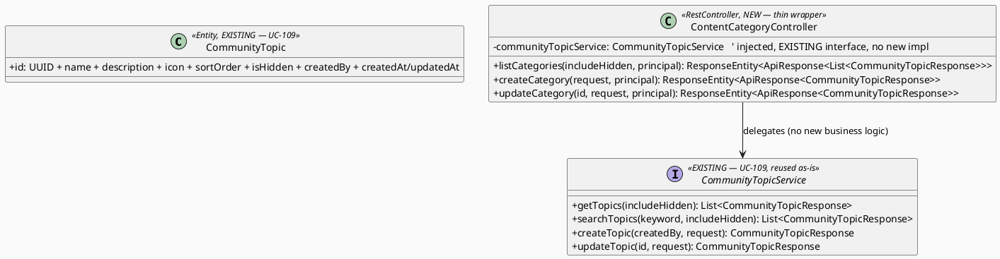
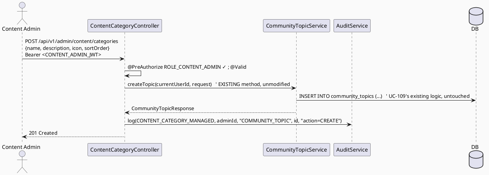

# ENGINEERING DOCUMENTATION STANDARD (EDS) v2.0
# Technical Design Specification — UC-226: Manage Content Categories

| Field              | Value                                   |
| ------------------ | ---------------------------------------- |
| **Document ID**    | `CB-CONTENT-IMP-006`                    |
| **Version**        | `1.0`                                   |
| **Status**         | `Partially Implemented`                 |
| **Date**           | `2026-07-01`                            |
| **Document Owner** | `HuyND`                                 |
| **Author**         | `AI Agent — Winston (System Architect)` |
| **Reviewed by**    | `[ ] Pending`                           |
| **DPO Sign-off**   | `[ ] Pending` *(N/A — taxonomy metadata, no PII)* |
| **Approved by**    | `[ ] Pending`                           |
| **Last Review**    | `2026-07-01`                            |
| **Based on EDS**   | `v2.0`                                  |

---

## CHANGELOG

| Ngày       | Người thực hiện    | Nội dung thay đổi                                                              |
| ---------- | -------------------- | ------------------------------------------------------------------------------- |
| 2026-07-01 | AI Agent — Winston  | Tạo tài liệu lần đầu — TDS cho UC-226 Manage Content Categories (Status=Draft)  |
| 2026-07-02 | AI Agent — Claude (Audit Pass) | Audit: xác nhận ADR-001 (tái dùng `community_topics`/`CommunityTopicService`, không tạo bảng `content_categories` mới) khớp hoàn toàn với code hiện tại (`CommunityTopicService`/`CommunityTopicController` verified — method signatures, routes, RBAC MODERATOR đều đúng). Sửa 1 lỗi nhỏ: §16 header role `PARTNER_REP` → `PARTNER` (giá trị `Role` enum thật, verified `security.rbac.Role`). Status giữ nguyên `Draft` — không tự approve. |
| 2026-07-11 | AI Agent — Amelia | Added the CONTENT_ADMIN thin wrapper, audit and RBAC without changing UC-109; 9/11 conditions verified. PostgreSQL cross-route integration remains blocked by unavailable container runtime. |

---

## MỤC LỤC

1. [Tổng quan Module](#1-tổng-quan-module)
2. [Ma trận Truy vết](#2-ma-trận-truy-vết)
3. [Architecture Decision Records (ADR)](#3-architecture-decision-records-adr)
4. [Non-Functional Requirements & SLA](#4-non-functional-requirements--sla)
5. [Static Modeling](#5-static-modeling)
6. [Dynamic Modeling](#6-dynamic-modeling)
7. [Domain Event Catalog](#7-domain-event-catalog)
8. [Interface Specification](#8-interface-specification)
9. [API Specification](#9-api-specification)
10. [Bảng mã lỗi](#10-bảng-mã-lỗi)
11. [Quy trình Triển khai](#11-quy-trình-triển-khai)
12. [Rollback & Incident Runbook](#12-rollback--incident-runbook)
13. [Kịch bản Kiểm thử Chi tiết](#13-kịch-bản-kiểm-thử-chi-tiết)
14. [Phương pháp Xác minh](#14-phương-pháp-xác-minh)
15. [API Verification Samples](#15-api-verification-samples)
16. [Authorization Matrix](#16-authorization-matrix)
17. [AI Prompt Constraints (CASE 2.0)](#17-ai-prompt-constraints-case-20)

---

## 1. Tổng quan Module

| Field                     | Value                                                                                                                                  |
| ------------------------- | --------------------------------------------------------------------------------------------------------------------------------------- |
| **UC ID**                 | `UC-226`                                                                                                                                |
| **FS Reference**          | `3.3.18.3 Manage Content Categories`                                                                                                    |
| **Module Name**           | `Manage Content Categories`                                                                                                            |
| **Bounded Context**       | `content` (thin controller) delegating to **existing** `community.CommunityTopicService` (UC-109) — see ADR-001 (central decision)     |
| **Primary Actor**         | `Content Admin (ROLE_CONTENT_ADMIN)` — distinct FS actor from UC-109's Community Moderator                                             |
| **Platform**              | `Admin Web Portal`                                                                                                                       |
| **Priority**              | `Medium` (per FS)                                                                                                                       |
| **Frequency of Use**      | `Occasional`                                                                                                                             |
| **Data Classification**   | `Internal` (taxonomy metadata, no PII)                                                                                                  |
| **Compliance Scope**      | `N/A`                                                                                                                                    |
| **Upstream Dependencies** | `community (CommunityTopic, CommunityTopicService/Repository — UC-109, fully built & Approved-adjacent)`, `security`, `audit`           |
| **Downstream Consumers**  | `content` (`ContentItem.topicId` informally reuses this same UUID space, no FK), `community` (question/answer categorization, UC-109's own consumers) |

**Mô tả:**
FS chỉ định UC-226 "Manage Content Categories" (3.3.18.3, actor Content Admin) như một use case **khác biệt** với UC-109 "Manage Community Topics" (3.2.2.11, actor Community Moderator, đã build đầy đủ). **Mâu thuẫn cần surface (ADR-001, RG-5):** cả hai đều thao tác trên cùng khái niệm "chủ đề/danh mục", và schema **chỉ có MỘT bảng taxonomy** (`community_topics`) — không có bảng `content_categories` riêng. `ContentItem.topicId` (không FK) đã ngầm dùng chung UUID space với `community_topics`.

**Quyết định (ADR-001):** UC-226 là một **wrapper mỏng** cho CONTENT_ADMIN, expose CRUD trên **CÙNG** `community_topics` table/`CommunityTopicService` (UC-109) qua một route mới có `@PreAuthorize("hasRole('CONTENT_ADMIN')")` (thay vì `MODERATOR`). KHÔNG tạo bảng `content_categories` riêng biệt. Đây là smallest-scoped-change (CLAUDE.md Delivery Rules), nhưng làm mờ ranh giới sở hữu Moderator/Content-Admin mà CLAUDE.md package-by-domain ngụ ý — flag rõ, không lặng lẽ chọn.

---

## 2. Ma trận Truy vết

| Requirement ID | Loại          | Mô tả yêu cầu                                                       | Thành phần Code                              | Compliance Target | ADR liên quan |
| --------------- | -------------- | ------------------------------------------------------------------------| ---------------------------------------------- | ------------------- | --------------- |
| UC-226          | Use Case      | Content Admin manages content categories (= community topics, shared)   | `ContentCategoryController` (thin wrapper)     | —                  | ADR-001         |
| FS-3.3.18.3     | Functional    | "Manages content categories (create/edit/hide)"                        | delegates to `CommunityTopicService` (UC-109)  | —                  | ADR-001         |
| BR-RBAC         | Business Rule | Chỉ CONTENT_ADMIN (route mới), khác `MODERATOR` của UC-109's route      | `@PreAuthorize("hasRole('CONTENT_ADMIN')")`    | —                  | ADR-002         |
| BR-CNT-013      | Business Rule | KHÔNG tạo bảng content_categories mới — dùng chung community_topics    | (design constraint)                            | —                  | ADR-001         |
| BR-CNT-014      | Business Rule | FK gap (`ContentItem.topicId` không FK tới `community_topics.id`) được ghi nhận, không tự sửa | (finding, not action)              | —                  | ADR-003         |
| BR-AUDIT-001    | Business Rule | Create/update/hide category qua route CONTENT_ADMIN được audit riêng   | `AuditService.log(...)`                        | —                  | ADR-002         |

---

## 3. Architecture Decision Records (ADR)

### ADR-001 — Thin CONTENT_ADMIN Wrapper Over Existing `community_topics`/`CommunityTopicService` (Central Decision)
| Field | Value |
| ---- | ----- |
| **Status** | `Accepted (Option A) — boundary tension explicitly surfaced` |
| **Deciders** | `HuyND — System Architect` |
| **Date** | `2026-07-01` |

**Bối cảnh:** UC-109 (Manage Community Topics, actor Community Moderator, FS 3.2.2.11) đã build đầy đủ CRUD
trên `community_topics` (`CommunityTopicService`: `getTopics`, `searchTopics`, `createTopic`, `updateTopic`;
`CommunityTopicController`: `GET /api/v1/community/topics` public, `POST`/`PATCH .../{id}` MODERATOR-only).
FS liệt kê UC-226 (Manage Content Categories, actor Content Admin, FS 3.3.18.3) như một use case riêng.
`ContentItem.topicId` (dossier §6.2: UUID, KHÔNG FK constraint) đã dùng chung không gian giá trị với
`community_topics.id` một cách phi chính thức (`ContentController` filter theo `topicId` này).

**Hai lựa chọn:**
- **(a)** Wrapper mỏng cho Content Admin, tái dùng NGUYÊN `community_topics` table + `CommunityTopicService` — chỉ thêm route/`@PreAuthorize` mới.
- **(b)** Bảng `content_categories` riêng, tách khỏi `community_topics`, và migrate `ContentItem.topicId` sang trỏ vào đó (cần FK mới + có thể đổi tên cột).

**Quyết định:** Chọn **(a)** — theo CLAUDE.md Delivery Rules "make the smallest scoped change", tránh trùng lặp một bảng taxonomy thứ hai. **Hệ quả tiêu cực được ghi nhận rõ, không lặng lẽ bỏ qua:** ranh giới sở hữu package-by-domain giữa `community` (Moderator quản) và `content` (Content Admin quản) bị mờ — CÙNG một bảng, CÙNG một service, được điều khiển bởi HAI route với HAI role khác nhau. Nếu Product/Tech Lead sau này muốn tách bạch thật sự (một content-category taxonomy độc lập với topic thảo luận cộng đồng), đó là (b) — một schema-delta migration lớn hơn nhiều, flag `Open`.

### ADR-002 — New Route, Same Service; RBAC = CONTENT_ADMIN (not MODERATOR)
| Field | Value |
| ---- | ----- |
| **Status** | `Accepted` |

**Quyết định:** Thêm `ContentCategoryController` mới tại `/api/v1/admin/content/categories` (nhất quán base path `content` admin, khác `/api/v1/community/topics` của UC-109), với `@PreAuthorize("hasRole('CONTENT_ADMIN')")`. Controller **inject `CommunityTopicService` có sẵn** (KHÔNG copy logic, KHÔNG tạo `ContentCategoryService` mới trùng lặp) — chỉ là một routing/RBAC layer khác cho CÙNG service. Audit action riêng (`CONTENT_CATEGORY_MANAGED` hoặc tái dùng generic) để phân biệt hành động qua route Content-Admin với route Moderator (UC-109 không audit hiện tại — verify; nếu UC-109 không audit, UC-226 thêm audit là một cải tiến, ghi nhận rõ không phải regression).

### ADR-003 — FK Gap Surfaced, Not Fixed (Out of Scope)
| Field | Value |
| ---- | ----- |
| **Status** | `Accepted — finding recorded, not actioned` |

**Bối cảnh:** `ContentItem.topicId` không có FK constraint tới `community_topics.id` (verified, dossier §6.2). Một `topicId` "mồ côi" (trỏ tới topic đã bị xóa/không tồn tại) không bị chặn ở tầng DB.
**Quyết định:** UC-226 KHÔNG thêm FK constraint này (out of scope — thay đổi behavior của `content_items`, một bảng UC-226 không sở hữu chính). Ghi nhận như một finding cho Tech Lead xem xét riêng (migration độc lập nếu muốn), KHÔNG tự thêm trong phạm vi UC-226.

---

## 4. Non-Functional Requirements & SLA

| Category | Requirement | Target | Measurement | Basis |
| --- | --- | --- | --- | --- |
| Latency | p99 CRUD via CONTENT_ADMIN route | `Open` — reuse UC-109 baseline if any | k6 | — |
| Access control | CONTENT_ADMIN via new route; MODERATOR via UC-109's existing route (both valid, different RBAC) | Least privilege per route | §16 | ADR-002 |
| Consistency | Both routes operate on the SAME rows — no data divergence possible (single table) | 100% by construction | code review | ADR-001 |

---

## 5. Static Modeling

### 5.1. Class Diagram (PlantUML)



### 5.2. Data Structure — NO Schema Delta (Reuse `community_topics`)

> **No migration.** UC-226 introduces NO new table/column. It reuses `community_topics`
> (`V1__init_schema.sql` line 147) and `CommunityTopicService`/`Repository` (UC-109) as-is. The FK gap
> (`ContentItem.topicId` → no FK to `community_topics.id`) is surfaced (ADR-003) but NOT fixed here.

---

## 6. Dynamic Modeling

### 6.1. Sequence — Happy Path (Content Admin creates a category)



### 6.2. Error Paths
- validation fail → whatever UC-109's `createTopic`/`updateTopic` already throws (reuse, do NOT redefine); wrong role (non-CONTENT_ADMIN) → 403 on the NEW route (MODERATOR-only users still use UC-109's OWN route, unaffected).

---

## 7. Domain Event Catalog

| Event | Trigger | Publisher | Subscriber | Payload | Async? |
| --- | --- | --- | --- | --- | --- |
| (none) | — | — | — | — | — |

> **N/A** — thin wrapper, no new events; reuses UC-109's existing (event-free) synchronous pattern.

---

## 8. Interface Specification

### 8.1. Service Interface — REUSED AS-IS (no changes)

```java
// com.carebridge.backend.community.service.CommunityTopicService — EXISTING, UC-109, unmodified
public interface CommunityTopicService {
    List<CommunityTopicResponse> getTopics(boolean includeHidden);
    List<CommunityTopicResponse> searchTopics(String keyword, boolean includeHidden);
    CommunityTopicResponse createTopic(UUID createdBy, CreateCommunityTopicRequest request);
    CommunityTopicResponse updateTopic(UUID id, UpdateCommunityTopicRequest request);
}
```

### 8.2. New Controller (thin wrapper only — no new Service/Repository)

```java
// com.carebridge.backend.content.controller.ContentCategoryController — NEW
@RestController
@RequestMapping("/api/v1/admin/content/categories")
@PreAuthorize("hasRole('CONTENT_ADMIN')")
public class ContentCategoryController {
    private final CommunityTopicService communityTopicService;   // reused, community package
    private final AuditService auditService;

    // GET (list), POST (create), PATCH /{id} (update) — each a thin delegate + audit call.
    // NO new DTOs beyond what CommunityTopicService already returns/accepts (reuse
    // CreateCommunityTopicRequest/UpdateCommunityTopicRequest/CommunityTopicResponse as-is).
}
```

### 8.3. DTOs — REUSED AS-IS

```java
// CreateCommunityTopicRequest, UpdateCommunityTopicRequest, CommunityTopicResponse — all EXISTING (UC-109).
// UC-226 introduces NO new DTO — this is the defining characteristic of "thin wrapper" (ADR-001).
```

---

## 9. API Specification

### 9.1. Endpoints Table

| Method  | Path                                       | Auth Level | Required Roles       | Rate Limit | Idempotent? |
| ------- | --------------------------------------------- | ------------ | ----------------------- | ------------ | -------------- |
| `GET`   | `/api/v1/admin/content/categories`            | JWT Bearer   | `ROLE_CONTENT_ADMIN`   | `Open`       | Yes |
| `POST`  | `/api/v1/admin/content/categories`            | JWT Bearer   | `ROLE_CONTENT_ADMIN`   | `Open`       | No |
| `PATCH` | `/api/v1/admin/content/categories/{id}`       | JWT Bearer   | `ROLE_CONTENT_ADMIN`   | `Open`       | Effectively |

> **Note:** These are ADDITIONAL routes alongside UC-109's existing `/api/v1/community/topics` (MODERATOR)
> and public `GET`. Both route sets operate on the identical `community_topics` table (ADR-001) — a category
> created via UC-226's route is immediately visible via UC-109's route and vice versa (single source of truth).

### 9.2. Request / Response — Same Shape as UC-109 (reused, not redefined here)

See `04_Implement/UC109_ManageCommunityTopics/` (if a Test-Spec/TDS exists) or `CommunityTopicController`/
`CommunityTopicService` directly for the authoritative request/response shapes — UC-226 does not redefine them.

---

## 10. Bảng mã lỗi

| Code       | HTTP Status | Message (EN)                          | Trigger Condition                          | Status in code |
| ----------- | ------------- | ---------------------------------------- | ---------------------------------------------- | ----------------- |
| *(reused)* | *(as UC-109)* | Whatever `CommunityTopicService.createTopic`/`updateTopic` already throws | field validation, duplicate name, etc. (UC-109's own error contract) | Reused — UC-226 does NOT define new error codes |
| `CNT-004`  | 403           | Insufficient permissions                  | Non-CONTENT_ADMIN on the NEW route             | Reused (UC-105 convention, applied to this new controller) |

> **No new `CNT-xxx` codes claimed by UC-226.** This is a deliberate consequence of ADR-001 — a thin wrapper
> introduces no new business logic, hence no new domain errors. If `CommunityTopicService` throws an
> exception type from the `community` package, UC-226's controller lets it propagate through the existing
> `GlobalExceptionHandler` mapping (verify exact codes/status against UC-109's actual behavior when implementing).

---

## 11. Quy trình Triển khai

### 11.1. Prerequisites
- [ ] UC-109 deployed (`CommunityTopic`, `CommunityTopicService`/`Repository`, `CommunityTopicController`)
- [ ] **ADR-001 (reuse community_topics vs separate content_categories table) confirmed by Product/Tech Lead** — this is a genuine architecture-boundary decision, not purely technical
- [x] `@EnableMethodSecurity`
- [ ] No migration — confirm

### 11.2. Pre-Migration Checklist
- [ ] **Không cần migration** — tái dùng `community_topics`. CG-9: no schema delta. FK gap (ADR-003) ghi nhận, không action.

### 11.3. Implementation Steps
```
1. ContentCategoryController — NEW, thin wrapper, @RequestMapping("/api/v1/admin/content/categories"),
   @PreAuthorize("hasRole('CONTENT_ADMIN')") class-level (matching AdminContentController's pattern, UC-105)
2. Inject EXISTING CommunityTopicService — no new Service/ServiceImpl/Repository
3. 3 endpoints: GET (list), POST (create), PATCH /{id} (update) — each: @Valid + delegate + audit call
4. SecurityConfig rule for the new route
5. (Optional) AuditAction.CONTENT_CATEGORY_MANAGED enum addition — verify if UC-109 already audits; if so,
   reuse that action value instead of adding a new one
```

### 11.4. Deployment Checklist
- [ ] CONTENT_ADMIN can create/list/update via new route
- [ ] MODERATOR still works via UC-109's existing, UNCHANGED route (regression check)
- [ ] Category created via either route visible via the other (single source of truth verified)
- [ ] Non-CONTENT_ADMIN → 403 on the NEW route specifically

---

## 12. Rollback & Incident Runbook

| Điều kiện | Ngưỡng | Người quyết định |
| ------------ | --------- | ------------------- |
| UC-109's existing MODERATOR route bị regress bởi thay đổi UC-226 | Bất kỳ case nào | Tech Lead (CRITICAL — must not touch existing UC-109 code) |
| CONTENT_ADMIN route vô tình cho phép MODERATOR-only actions không nên có | Bất kỳ case nào | Tech Lead |

```bash
kubectl rollout undo deployment/carebridge-api
# No migration to revert. UC-109's own code/tests must remain 100% green after this rollback too.
```

---

## 13. Kịch bản Kiểm thử Chi tiết

> Chi tiết trong `UC226_ManageContentCategories_Test-Spec.md` (`CB-CONTENT-TEST-006`).

### 13.1. Unit / Service
- Controller delegates to `CommunityTopicService` methods correctly (verify mock interactions — no new business logic to unit test, since Service is reused verbatim)
- Audit called once per create/update via the NEW route

### 13.2. Integration
- Full CRUD via new CONTENT_ADMIN route (Testcontainers, no new migration)
- Regression: UC-109's existing MODERATOR route + public GET still function identically after this change
- Cross-route consistency: category created via UC-226's route visible via UC-109's route

### 13.3. Security
- Non-CONTENT_ADMIN → 403 on NEW route; MODERATOR-only (not CONTENT_ADMIN) → 403 on NEW route (even though
  they can use UC-109's OWN route — the two routes have deliberately different, non-overlapping role gates)
- No JWT → 401

---

## 14. Phương pháp Xác minh

```sql
SELECT id, name, is_hidden, sort_order FROM community_topics ORDER BY sort_order LIMIT 10;
-- rows created via EITHER route appear identically here (single table)
```

---

## 15. API Verification Samples

```bash
curl -X POST "https://api.carebridge.vn/api/v1/admin/content/categories" \
  -H "Authorization: Bearer $CONTENT_ADMIN_TOKEN" -H "Content-Type: application/json" \
  -d '{"name":"Dinh dưỡng","description":"Chủ đề dinh dưỡng"}'
# Expected: 201, same shape as UC-109's createTopic response
```

---

## 16. Authorization Matrix

| Endpoint                                       | `MOTHER` | `FAMILY` | `EXPERT` | `MODERATOR` | `CONTENT_ADMIN` | `PARTNER` | `SYSTEM_ADMIN` |
| --------------------------------------------------| ---------- | ---------- | ---------- | -------------- | ------------------ | --------------- | ----------------- |
| `POST/PATCH /api/v1/admin/content/categories(/{id})` | ❌     | ❌        | ❌        | ❌ *(note)*     | ✅                | ❌              | ❌ *(note)*        |

**Chú thích:** MODERATOR = ❌ trên route MỚI này (họ dùng route CỦA HỌ, `/api/v1/community/topics`, không đổi).
SYSTEM_ADMIN = ❌ (không có `RoleHierarchy`; nếu cần superuser access, đó là thay đổi tường minh khác, Open).
Đây là điểm khác biệt cố ý: hai route, hai role-gate, một bảng dữ liệu (ADR-001/002).

---

## 17. AI Prompt Constraints (CASE 2.0)

### 17.1 Constraint Summary Table

| #   | Constraint                                                                    | Source            | Last Verified |
| --- | ------------------------------------------------------------------------------| ------------------- | --------------- |
| C1  | Controller mới `@PreAuthorize("hasRole('CONTENT_ADMIN')")` — chỉ @Valid + delegate | `ADR-002`        | `2026-07-01`     |
| C2  | TUYỆT ĐỐI KHÔNG tạo bảng/entity `content_categories` mới — tái dùng `community_topics`/`CommunityTopicService` NGUYÊN VẸN | `ADR-001` | `2026-07-01` |
| C3  | TUYỆT ĐỐI KHÔNG sửa `CommunityTopicService`/`CommunityTopicController` hiện có (UC-109) — chỉ thêm route mới | `ADR-001` | `2026-07-01` |
| C4  | KHÔNG thêm FK constraint cho `ContentItem.topicId` trong UC này (out of scope, ghi nhận ADR-003) | `ADR-003` | `2026-07-01` |
| C5  | KHÔNG định nghĩa error code CNT-xxx mới (thin wrapper không có business logic mới) | `§10`          | `2026-07-01`     |

### 17.2 Constraint Injection Block

```
[CONSTRAINT BLOCK — Module: Manage Content Categories (UC-226)]
Theo TDS CB-CONTENT-IMP-006:
1. [C1] ContentCategoryController (MỚI) PHẢI @PreAuthorize("hasRole('CONTENT_ADMIN')") — class-level,
   giống pattern AdminContentController (UC-105).
2. [C2] TUYỆT ĐỐI KHÔNG tạo entity/table content_categories mới. Dùng CommunityTopic/community_topics
   NGUYÊN VẸN.
3. [C3] TUYỆT ĐỐI KHÔNG sửa CommunityTopicService/Impl hoặc CommunityTopicController hiện có (UC-109) —
   chỉ inject và gọi service đó từ controller MỚI.
4. [C4] KHÔNG thêm FK constraint content_items.topic_id → community_topics.id trong UC này.
5. [C5] KHÔNG định nghĩa CNT-xxx code mới — để exception từ CommunityTopicService lan truyền qua
   GlobalExceptionHandler hiện có.

[CONTEXT BLOCK]
- Bounded Context: content (thin controller) delegating to community (existing service, UC-109)
- Data: Internal; Compliance: N/A
- Interfaces: §8 (REUSED interfaces, no new Service); Error codes: §10 (none new); Auth: §16
- Schema delta: NONE
- OPEN: ADR-001 architecture-boundary decision needs Product/Tech Lead sign-off (thin wrapper vs separate table)

[TASK BLOCK]
Implement ONLY ContentCategoryController (thin wrapper, 3 endpoints) injecting the EXISTING
CommunityTopicService — thỏa mãn C1-C5. Do NOT touch community package's UC-109 files.
Tests cover §13 (Test-Spec CB-CONTENT-TEST-006), including a regression check that UC-109 is untouched.
```

### 17.3 Constraint Quality Checklist
- [x] Traceable; [x] không generic; [x] Last Verified; [x] reference §8/§16

### 17.4 Anti-Pattern Detection

| AP-ID     | Anti-Pattern          | Dấu hiệu                                                              | Hành động                |
| --------- | ---------------------- | --------------------------------------------------------------------------| --------------------------- |
| AP-AI-001 | Unconstrained Gen     | Bỏ RBAC trên route mới                                                    | Reject — C1 |
| AP-AI-002 | Schema Duplication    | Tạo bảng content_categories mới trùng lặp community_topics                | Reject — C2, BLOCKING (đúng anti-pattern ADR-001 cảnh báo) |
| AP-AI-003 | Regression on UC-109  | Sửa CommunityTopicService/Controller hiện có                             | Reject — C3, BLOCKING |
| AP-AI-004 | Layer Violation       | Controller mới gọi CommunityTopicRepository trực tiếp thay vì Service    | Reject |
| AP-AI-005 | Hallucinated Contract | Định nghĩa DTO/error code mới không cần thiết cho một thin wrapper       | Reject — C5 |

**Kết quả review:**
- [x] Không phát hiện anti-pattern nào trong bản thân spec này → approved-for-RED-phase

---

## PHỤ LỤC

### A. Glossary
| Thuật ngữ | Định nghĩa |
| ------------ | ------------- |
| Thin Wrapper | Controller mới không chứa business logic, chỉ thêm RBAC/route khác cho service đã tồn tại |
| FK Gap | `content_items.topic_id` không có foreign key constraint tới `community_topics.id` (finding, không action trong UC này) |

### B. Tài liệu tham chiếu
| Document | Path |
| ------------ | ------- |
| `community/service/CommunityTopicService.java` (reused as-is) | `05_Development/CareBridgeAPI/src/main/java/com/carebridge/backend/community/service/CommunityTopicService.java` |
| `community/controller/CommunityTopicController.java` (UC-109, unmodified) | `05_Development/CareBridgeAPI/.../community/controller/CommunityTopicController.java` |
| Schema `community_topics` (line 147) | `05_Development/CareBridgeAPI/src/main/resources/db/migration/V1__init_schema.sql` |
| UC-105 TDS (AdminContentController pattern precedent) | `04_Implement/UC105_CreateContentFAQChecklist/UC105_CreateContentFAQChecklist_TDS.md` |

---

*EDS v2.1 — Thin CONTENT_ADMIN wrapper over UC-109's existing `community_topics`/`CommunityTopicService`; no
schema delta, no new business logic. Status: Draft. ADR-001 (reuse vs separate table) is a genuine
architecture-boundary decision surfaced for Product/Tech Lead — NOT silently resolved. The two CRITICAL
constraints are: never duplicate the taxonomy table (C2) and never modify UC-109's existing code (C3).*
