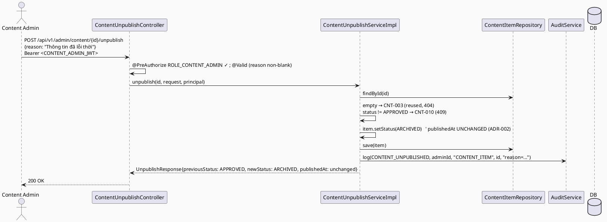

# ENGINEERING DOCUMENTATION STANDARD (EDS) v2.0
# Technical Design Specification — UC-227: Unpublish Content

| Field              | Value                                   |
| ------------------ | ---------------------------------------- |
| **Document ID**    | `CB-CONTENT-IMP-007`                    |
| **Version**        | `1.0`                                   |
| **Status**         | `Partially Implemented`                 |
| **Date**           | `2026-07-01`                            |
| **Document Owner** | `HuyND`                                 |
| **Author**         | `AI Agent — Winston (System Architect)` |
| **Reviewed by**    | `[ ] Pending`                           |
| **DPO Sign-off**   | `[ ] Pending` *(N/A — editorial content, no PII)* |
| **Approved by**    | `[ ] Pending`                           |
| **Last Review**    | `2026-07-01`                            |
| **Based on EDS**   | `v2.0`                                  |

---

## CHANGELOG

| Ngày       | Người thực hiện    | Nội dung thay đổi                                                              |
| ---------- | -------------------- | ------------------------------------------------------------------------------- |
| 2026-07-01 | AI Agent — Winston  | Tạo tài liệu lần đầu — TDS cho UC-227 Unpublish Content (Status=Draft)          |
| 2026-07-02 | AI Agent — Claude (Audit Pass) | **Cross-doc note (no status change):** UC-107's TDS (`CB-CONTENT-IMP-006`, Implemented, dated 2026-07-02 — after this doc), §ADR-003, proposes that `POST /api/v1/admin/content/{id}/archive` (already built for UC-107) subsumes this UC's `POST /api/v1/admin/content/{id}/unpublish` for the `APPROVED→ARCHIVED` case, and recommends UC-227 be updated to "satisfied by UC-107" rather than implemented as a separate endpoint when its turn comes. UC-107's own ADR-003 is explicitly marked `Proposed — needs Tech Lead confirmation`, not a decided merge. This TDS is left as-is (still describing a standalone `/unpublish` endpoint) pending that human decision — implementers should check UC-107's ADR-003 status before starting UC-227 work. Also reconciled §10's `CNT-006/007` numbering note: those codes were claimed by UC-107, not left as an open gap. |
| 2026-07-11 | AI Agent — Amelia | Implemented the standalone APPROVED→ARCHIVED unpublish contract, publishedAt preservation, audit and CONTENT_ADMIN RBAC. 9/11 conditions verified; DB visibility integration blocked by unavailable container runtime. |

---

## MỤC LỤC

1. [Tổng quan Module](#1-tổng-quan-module)
2. [Ma trận Truy vết](#2-ma-trận-truy-vết)
3. [Architecture Decision Records (ADR)](#3-architecture-decision-records-adr)
4. [Non-Functional Requirements & SLA](#4-non-functional-requirements--sla)
5. [Static Modeling](#5-static-modeling)
6. [Dynamic Modeling](#6-dynamic-modeling)
7. [Domain Event Catalog](#7-domain-event-catalog)
8. [Interface Specification](#8-interface-specification)
9. [API Specification](#9-api-specification)
10. [Bảng mã lỗi](#10-bảng-mã-lỗi)
11. [Quy trình Triển khai](#11-quy-trình-triển-khai)
12. [Rollback & Incident Runbook](#12-rollback--incident-runbook)
13. [Kịch bản Kiểm thử Chi tiết](#13-kịch-bản-kiểm-thử-chi-tiết)
14. [Phương pháp Xác minh](#14-phương-pháp-xác-minh)
15. [API Verification Samples](#15-api-verification-samples)
16. [Authorization Matrix](#16-authorization-matrix)
17. [AI Prompt Constraints (CASE 2.0)](#17-ai-prompt-constraints-case-20)

---

## 1. Tổng quan Module

| Field                     | Value                                                                                                                                  |
| ------------------------- | --------------------------------------------------------------------------------------------------------------------------------------- |
| **UC ID**                 | `UC-227`                                                                                                                                |
| **FS Reference**          | `3.3.18.4 Unpublish Content`                                                                                                            |
| **Module Name**           | `Unpublish Content`                                                                                                                     |
| **Bounded Context**       | `content` — admin write path over `ContentItem` (UC-105/106/108)                                                                        |
| **Primary Actor**         | `Content Admin (ROLE_CONTENT_ADMIN)` — FS actor "Content Admin"; CONTENT_ADMIN only, resolved (ADR-004, Accepted)   |
| **Platform**              | `Admin Web Portal`                                                                                                                       |
| **Priority**              | `Medium` (per FS)                                                                                                                        |
| **Frequency of Use**      | `Occasional`                                                                                                                             |
| **Data Classification**   | `Internal`                                                                                                                              |
| **Compliance Scope**      | `N/A`                                                                                                                                    |
| **Upstream Dependencies** | `content (ContentItem, ContentStatus, ContentException — UC-105/106/108)`, `security`, `audit`                                          |
| **Downstream Consumers**  | Public read paths (`ContentController`, `idx_content_items_published_at ... WHERE status='APPROVED'`) — content disappears once unpublished |

**Mô tả:**
UC-227 cho phép **Content Admin** gỡ một content item **APPROVED** khỏi hiển thị công khai — "unpublish". Đây là **UC gọn nhất trong 4 UC Content** (dossier §6.2), vì schema đã có sẵn giá trị `ContentStatus.ARCHIVED` phục vụ đúng mục đích này, và query public read (`ContentController`) đã filter theo `status='APPROVED'` (partial index `idx_content_items_published_at ... WHERE status='APPROVED'`, verified). **Quyết định (ADR-001):** UC-227 chuyển `status: APPROVED → ARCHIVED` (tái dùng giá trị enum có sẵn), **KHÔNG** thêm giá trị `UNPUBLISHED` mới — không có bằng chứng FS/BR nào yêu cầu phân biệt "archived" (cũ/đã thay thế) với "unpublished" (bị gỡ vì lý do compliance) như hai khái niệm tách biệt.

**`publishedAt` (ADR-002):** GIỮ NGUYÊN (không xóa) làm bản ghi lịch sử — visibility chỉ gate bởi `status`, đúng như partial index hiện có đã làm.

**Phạm vi:** chỉ chuyển APPROVED→ARCHIVED (unpublish). KHÔNG re-publish (ARCHIVED→APPROVED lại) trong UC này — đó là một update UC-106 thông thường (hoặc UC-108 re-approval) nếu cần, flag `Open` nếu cần một endpoint riêng.

---

## 2. Ma trận Truy vết

| Requirement ID | Loại          | Mô tả yêu cầu                                                       | Thành phần Code                             | Compliance Target | ADR liên quan |
| --------------- | -------------- | ------------------------------------------------------------------------| --------------------------------------------- | ------------------- | --------------- |
| UC-227          | Use Case      | Content Admin unpublishes an APPROVED content item                      | `ContentUnpublishController.unpublish()`      | —                  | ADR-001         |
| FS-3.3.18.4     | Functional    | "Unpublish content that should no longer be public"                    | `ContentUnpublishServiceImpl.unpublish()`     | —                  | ADR-001         |
| BR-RBAC         | Business Rule | Chỉ CONTENT_ADMIN (resolved, ADR-004 Accepted)          | `@PreAuthorize`                               | —                  | ADR-004         |
| BR-CNT-015      | Business Rule | Chỉ APPROVED → ARCHIVED; khác → CNT-010 (409)                          | transition guard                              | —                  | ADR-003         |
| BR-CNT-016      | Business Rule | `publishedAt` KHÔNG bị xóa/reset khi unpublish                         | `ContentUnpublishServiceImpl`                 | —                  | ADR-002         |
| BR-CNT-017      | Business Rule | Unpublish bắt buộc reason (accountability, tương tự moderation HIDE)   | request validation                            | —                  | ADR-005         |
| BR-AUDIT-001    | Business Rule | Unpublish được audit log                                               | `AuditService.log(...)`                       | —                  | ADR-004         |

---

## 3. Architecture Decision Records (ADR)

### ADR-001 — Reuse Existing `ARCHIVED` Enum Value (No New `UNPUBLISHED` Status)
| Field | Value |
| ---- | ----- |
| **Status** | `Accepted` |
| **Deciders** | `HuyND — System Architect` |
| **Date** | `2026-07-01` |

**Bối cảnh:** `ContentStatus` đã có `ARCHIVED` (dossier §6.2). Public read path (`ContentController`) đã filter `status='APPROVED'` — bất kỳ status khác nào (kể cả `ARCHIVED`) đã tự động bị ẩn khỏi công khai mà không cần thêm logic.
**Quyết định:** Unpublish = chuyển `status → ARCHIVED`. KHÔNG thêm giá trị `UNPUBLISHED` riêng — không có bằng chứng FS/BR nào yêu cầu phân biệt "archived" (cũ, đã thay thế/hết hạn tự nhiên) khỏi "unpublished" (bị gỡ chủ động vì lý do compliance/vi phạm). Nếu Product SAU NÀY cần phân biệt 2 khái niệm này (ví dụ cho audit/compliance traceability), đó là một ADR follow-up thêm giá trị enum mới — flag `Open`, không tự bổ sung khi chưa có bằng chứng.
**Hệ quả:** **KHÔNG cần migration** (không có CHECK constraint trên `content_items.status`, xác nhận ở UC-108 ADR-002 — cùng cột). UC gọn nhất trong batch Content.

### ADR-002 — Preserve `publishedAt` (Historical Record, Visibility Gated by `status` Only)
| Field | Value |
| ---- | ----- |
| **Status** | `Accepted` |

**Quyết định:** `publishedAt` KHÔNG bị xóa/set null khi unpublish — giữ nguyên như dấu mốc lịch sử "lần đầu được xuất bản". Visibility hoàn toàn do `status='APPROVED'` filter quyết định (đã là cách partial index hoạt động — không cần thay đổi). Nếu content được duyệt lại (re-publish) sau này, quyết định có cập nhật `publishedAt` mới hay giữ mốc cũ là một ADR riêng của use case đó, không phải UC-227.

### ADR-003 — Transition Guard: APPROVED → ARCHIVED Only
| Field | Value |
| ---- | ----- |
| **Status** | `Accepted` |

**Quyết định:** Chỉ item `status == APPROVED` mới unpublish được. `DRAFT`/`PENDING_REVIEW`/`ARCHIVED` (đã unpublish) → `CNT-010` (409). Item chưa từng public (DRAFT/PENDING_REVIEW) không có gì để "unpublish".

### ADR-004 — RBAC (CONTENT_ADMIN Only) + Audit; Role Resolved
| Field | Value |
| ---- | ----- |
| **Status** | `Accepted — resolved by consistency with FS actor + sibling Content-cluster convention` |

`@PreAuthorize("hasRole('CONTENT_ADMIN')")` — **CONTENT_ADMIN only**, no `hasAnyRole` widening. Resolved via
project analysis rather than left open: FS-3.3.18.4's own Primary Actor is "Content Admin" (not "System
Admin"), and every sibling Content-cluster UC in this batch (UC-105, UC-106) uses `CONTENT_ADMIN` exclusively
with no `SYSTEM_ADMIN` fallback. Narrower role scope is also the safer default (least privilege). If Product
later identifies a compliance-driven takedown scenario needing `SYSTEM_ADMIN` escalation, widening
`@PreAuthorize` to `hasAnyRole(...)` is a one-line change, not a redesign. Audit `CONTENT_UNPUBLISHED`.

### ADR-005 — Unpublish Reason Bắt Buộc
| Field | Value |
| ---- | ----- |
| **Status** | `Accepted (design decision — not sourced, giống pattern moderation HIDE)` |

Reason bắt buộc non-blank (`CNT-011`, 400) — accountability, giống UC-100's HIDE requirement.

---

## 4. Non-Functional Requirements & SLA

| Category | Requirement | Target | Measurement | Basis |
| --- | --- | --- | --- | --- |
| Latency | p99 `POST /admin/content/{id}/unpublish` | `Open` — reuse UC-105 baseline | k6 | — |
| Data integrity | status transition only APPROVED→ARCHIVED; publishedAt preserved | 100% | unit + integration | ADR-002/003 |
| Access control | CONTENT_ADMIN only (resolved, ADR-004 Accepted) | Least privilege | §16 | ADR-004 |
| Visibility | Unpublished item immediately excluded from public reads | 100%, no caching lag assumed (v1) | integration | ADR-001 |

---

## 5. Static Modeling

### 5.1. Class Diagram (PlantUML)

```plantuml
@startuml UC227_UnpublishContent_ClassDiagram
skinparam classAttributeIconSize 0
skinparam backgroundColor #FAFAFA

enum ContentStatus { DRAFT PENDING_REVIEW APPROVED ARCHIVED }
' ARCHIVED already exists — reused for "unpublished" (ADR-001)

class ContentItem <<Entity>> { + status: ContentStatus + publishedAt: Instant <<preserved, ADR-002>> + ... }

class ContentUnpublishController <<RestController>> {
  + unpublish(id: UUID, request: UnpublishRequest, principal): ResponseEntity<UnpublishResponse>
}
interface ContentUnpublishService { + unpublish(id, request, principal): UnpublishResponse }
class UnpublishRequest <<DTO>> { + reason: String <<required — ADR-005>> }
class UnpublishResponse <<DTO>> {
  + id: UUID + previousStatus: ContentStatus + newStatus: ContentStatus
  + publishedAt: Instant <<unchanged>> + unpublishedByAdminId: UUID + reason: String + unpublishedAt: Instant
}

ContentUnpublishController --> ContentUnpublishService
@enduml
```

### 5.2. Data Structure — NO Schema Delta

> **No migration.** `ContentStatus.ARCHIVED` already exists (dossier §6.2). No CHECK constraint on
> `content_items.status` (verified, UC-108 ADR-002). UC-227 only UPDATEs `status` (and never touches
> `published_at`).

---

## 6. Dynamic Modeling

### 6.1. Sequence — Happy Path



### 6.2. Error Paths
- content not found → `CNT-003` (reused); status != APPROVED → `CNT-010` (409); reason blank → `CNT-011` (400); wrong role → `CNT-004` (reused).

---

## 7. Domain Event Catalog

| Event | Trigger | Publisher | Subscriber | Payload | Async? |
| --- | --- | --- | --- | --- | --- |
| (none v1) | — | — | — | — | — |

> **Open:** future `ContentUnpublished` event → notify author. v1 sync + audit-only.

---

## 8. Interface Specification

### 8.1. Service Interface

```java
// com.carebridge.backend.content.service.ContentUnpublishService
public interface ContentUnpublishService {
    /**
     * Unpublishes an APPROVED content item by transitioning status to ARCHIVED (ADR-001 — reuses
     * the existing enum value, no new UNPUBLISHED status). publishedAt is preserved (ADR-002).
     * @throws ContentException (CNT-003) if id not found (reused)
     * @throws ContentException (CNT-010) if status is not APPROVED
     * @throws ContentException (CNT-011) if reason is blank (ADR-005)
     */
    UnpublishResponse unpublish(UUID id, UnpublishRequest request, Principal principal);
}
```

### 8.2. Repository

```java
// ContentItemRepository.findById/save — existing (UC-105/106/108). No new finder needed.
```

### 8.3. DTOs

```java
public record UnpublishRequest(@NotBlank String reason) {}   // required (ADR-005)

public record UnpublishResponse(
        UUID id, ContentStatus previousStatus, ContentStatus newStatus,
        Instant publishedAt,   // unchanged (ADR-002)
        UUID unpublishedByAdminId, String reason, Instant unpublishedAt
) {}
```

---

## 9. API Specification

### 9.1. Endpoints Table

| Method | Path                                        | Auth Level | Required Roles      | Rate Limit | Idempotent? |
| ------ | ---------------------------------------------- | ------------ | ---------------------- | ------------ | -------------- |
| `POST` | `/api/v1/admin/content/{id}/unpublish`         | JWT Bearer   | `ROLE_CONTENT_ADMIN`  | `Open`       | No (2nd unpublish on already-ARCHIVED → CNT-010) |

### 9.2. Request / Response

**Request:** `{ "reason": "Thông tin đã lỗi thời, chờ cập nhật" }`

**Response — 200 OK:**
```json
{ "id": "…", "previousStatus": "APPROVED", "newStatus": "ARCHIVED",
  "publishedAt": "2026-05-01T08:00:00Z", "unpublishedByAdminId": "…",
  "reason": "Thông tin đã lỗi thời, chờ cập nhật", "unpublishedAt": "2026-07-01T10:15:00Z" }
```

**404 CNT-003 (reused) / 409 CNT-010 / 400 CNT-011 / 403 CNT-004 (reused) / 401.**

---

## 10. Bảng mã lỗi

| Code       | HTTP Status | Message (EN)                          | Trigger Condition                        | Status in code |
| ----------- | ------------- | ---------------------------------------- | -------------------------------------------- | ----------------- |
| `CNT-010`  | 409           | Content item is not currently published    | `status != APPROVED`                        | **New — to implement** |
| `CNT-011`  | 400           | Reason required for unpublish             | reason blank (ADR-005)                      | **New — to implement** |
| `CNT-003`  | 404           | Content item not found                    | `findById(id)` empty                        | Reused (UC-106 first impl) |
| `CNT-004`  | 403           | Insufficient permissions                  | Non-CONTENT_ADMIN                           | Reused (UC-105) |
| `CNT-005`  | 500           | Internal server error                     | Unhandled exception                         | Reused (UC-105) |

> **Numbering:** UC-105 `001,002,004,005`; UC-106 impl `003`; UC-108 claims `008,009`; UC-226 claims none.
> UC-227 claims **`CNT-010, CNT-011`**. This is the last Content UC in the batch — highest CNT code is `011`.
> Consistency Gate must confirm UC-108/UC-227's `006/007` gap (dossier reserved `CNT-006` as the batch start
> — re-verify no UC actually needed 006/007; if unused, note as an intentional gap, not a bug).
>
> **Reconciled (Audit Pass, 2026-07-02):** The `CNT-006/007` gap was filled by **UC-107** (Hide or Delete
> Content, `CB-CONTENT-IMP-006`) — `alreadyArchived()`/`hideReasonRequired()` — not by UC-226. No collision
> with UC-108's `008/009` or this UC's `010/011`. If UC-107's ADR-003 (this endpoint subsumes UC-227) is
> later confirmed, `CNT-010/011` would become unused/superseded rather than implemented as new codes — a
> decision for whoever picks up UC-227 next, not resolved by this audit.

---

## 11. Quy trình Triển khai

### 11.1. Prerequisites
- [ ] UC-105/106/108 deployed
- [x] ADR-004 (role — CONTENT_ADMIN only) resolved via project analysis
- [x] `@EnableMethodSecurity`
- [ ] No migration — confirm (reuse existing ARCHIVED value)

### 11.2. Pre-Migration Checklist
- [ ] **Không cần migration** — `ARCHIVED` đã tồn tại trong enum. CG-9: no schema delta.

### 11.3. Implementation Steps
```
1. UnpublishRequest/Response DTOs
2. ContentException CNT-010/011 factories
3. ContentUnpublishService.unpublish() interface + Impl (find, transition guard, reason guard,
   status=ARCHIVED, save — publishedAt untouched, audit) @Transactional
4. ContentUnpublishController POST /api/v1/admin/content/{id}/unpublish @PreAuthorize(...) + @Valid
5. SecurityConfig rule + audit enum if needed
```

### 11.4. Deployment Checklist
- [ ] Unpublish APPROVED→ARCHIVED; publishedAt unchanged
- [ ] Item disappears from public read paths immediately after unpublish
- [ ] Non-APPROVED item → CNT-010; blank reason → CNT-011
- [ ] Non-CONTENT_ADMIN → 403

---

## 12. Rollback & Incident Runbook

| Điều kiện | Ngưỡng | Người quyết định |
| ------------ | --------- | ------------------- |
| publishedAt bị đổi/xóa khi unpublish | Bất kỳ case nào | Tech Lead (CRITICAL — lịch sử mất) |
| Item unpublished vẫn hiển thị public | Bất kỳ case nào | Tech Lead (CRITICAL — visibility gate hỏng) |

```bash
kubectl rollout undo deployment/carebridge-api
# No migration to revert.
```

---

## 13. Kịch bản Kiểm thử Chi tiết

> Chi tiết trong `UC227_UnpublishContent_Test-Spec.md` (`CB-CONTENT-TEST-007`).

### 13.1. Unit / Service
- Happy path: APPROVED→ARCHIVED; publishedAt unchanged (negative assertion, critical)
- Non-APPROVED (DRAFT/PENDING_REVIEW/ARCHIVED) → CNT-010
- Blank reason → CNT-011; not found → CNT-003 (reused)
- Audit called once

### 13.2. Integration
- Full POST (Testcontainers): item disappears from public read path (status='APPROVED' filter) immediately after unpublish
- publishedAt preserved in DB

### 13.3. Security
- Non-CONTENT_ADMIN → 403 CNT-004; No JWT → 401

---

## 14. Phương pháp Xác minh

```sql
SELECT content_item_id, status, published_at FROM content_items WHERE content_item_id='<id>';
-- after unpublish: status='ARCHIVED', published_at UNCHANGED (not null, original timestamp)
```

---

## 15. API Verification Samples

```bash
curl -X POST "https://api.carebridge.vn/api/v1/admin/content/<id>/unpublish" \
  -H "Authorization: Bearer $CONTENT_ADMIN_TOKEN" -H "Content-Type: application/json" \
  -d '{"reason":"Thông tin đã lỗi thời"}'
# Expected: 200, newStatus=ARCHIVED, publishedAt unchanged
```

---

## 16. Authorization Matrix

| Endpoint                                   | `MOTHER` | `FAMILY` | `EXPERT` | `MODERATOR` | `CONTENT_ADMIN` | `PARTNER_REP` | `SYSTEM_ADMIN` |
| ----------------------------------------------| ---------- | ---------- | ---------- | -------------- | ------------------ | --------------- | ----------------- |
| `POST /api/v1/admin/content/{id}/unpublish`  | ❌        | ❌        | ❌        | ❌             | ✅                | ❌              | ❌ *(note, Open)*   |

**Chú thích:** SYSTEM_ADMIN = ❌ theo mặc định (không `RoleHierarchy`); (ADR-004, resolved — CONTENT_ADMIN only); nếu Product
muốn SYSTEM_ADMIN cũng unpublish được (compliance-driven takedowns).

---

## 17. AI Prompt Constraints (CASE 2.0)

### 17.1 Constraint Summary Table

| #   | Constraint                                                                | Source            | Last Verified |
| --- | --------------------------------------------------------------------------| ------------------- | --------------- |
| C1  | Controller `@PreAuthorize("hasRole('CONTENT_ADMIN')")` — chỉ @Valid + delegate | `ADR-004`        | `2026-07-01`     |
| C2  | Chỉ APPROVED → ARCHIVED; khác → CNT-010                                    | `ADR-003`           | `2026-07-01`     |
| C3  | `publishedAt` TUYỆT ĐỐI KHÔNG bị xóa/reset khi unpublish                    | `ADR-002`           | `2026-07-01`     |
| C4  | KHÔNG thêm giá trị enum `UNPUBLISHED` mới — tái dùng `ARCHIVED` có sẵn      | `ADR-001`           | `2026-07-01`     |
| C5  | reason bắt buộc non-blank → CNT-011                                       | `ADR-005`           | `2026-07-01`     |

### 17.2 Constraint Injection Block

```
[CONSTRAINT BLOCK — Module: Unpublish Content (UC-227)]
Theo TDS CB-CONTENT-IMP-007:
1. [C1] Controller unpublish() PHẢI @PreAuthorize("hasRole('CONTENT_ADMIN')").
2. [C2] Chỉ item APPROVED mới unpublish được; khác → CNT-010.
3. [C3] published_at TUYỆT ĐỐI KHÔNG bị ghi đè/null khi unpublish — chỉ status đổi.
4. [C4] KHÔNG thêm ContentStatus.UNPUBLISHED — dùng ARCHIVED có sẵn.
5. [C5] reason bắt buộc → CNT-011.

[CONTEXT BLOCK]
- Bounded Context: content (admin write, CONTENT_ADMIN); Data: Internal; Compliance: N/A
- Interfaces: §8; Error codes: §10 (CNT-010/011 new; CNT-003/004 reused); Auth: §16
- Schema delta: NONE (reuses existing ARCHIVED enum value)
- ADR-004 (role) resolved = CONTENT_ADMIN only

[TASK BLOCK]
Implement ContentUnpublishController.unpublish(), ContentUnpublishServiceImpl, DTOs, CNT-010/011 —
thỏa mãn C1-C5. Tests cover §13 (Test-Spec CB-CONTENT-TEST-007).
```

### 17.3 Constraint Quality Checklist
- [x] Traceable; [x] không generic; [x] Last Verified; [x] reference §8/§16

### 17.4 Anti-Pattern Detection

| AP-ID     | Anti-Pattern          | Dấu hiệu                                                        | Hành động                |
| --------- | ---------------------- | ------------------------------------------------------------------- | --------------------------- |
| AP-AI-001 | Unconstrained Gen     | Bỏ RBAC/transition guard                                            | Reject — C1/C2 |
| AP-AI-002 | Data Loss             | publishedAt bị xóa/null khi unpublish                              | Reject — C3, BLOCKING (mất lịch sử) |
| AP-AI-003 | Hallucinated Enum     | Thêm ContentStatus.UNPUBLISHED không có trong §5.2                | Reject — C4 |
| AP-AI-004 | Layer Violation       | Controller gọi repository trực tiếp                                | Reject |
| AP-AI-005 | Hallucinated Contract | Import class không có trong §8                                     | Reject |

**Kết quả review:**
- [x] Không phát hiện anti-pattern nào trong bản thân spec này → approved-for-RED-phase

---

## PHỤ LỤC

### B. Tài liệu tham chiếu
| Document | Path |
| ------------ | ------- |
| UC-105 TDS (Approved, oracle) | `04_Implement/UC105_CreateContentFAQChecklist/UC105_CreateContentFAQChecklist_TDS.md` |
| UC-106 TDS (versionNo mechanism, sibling) | `04_Implement/UC106_UpdateContentFAQChecklist/UC106_UpdateContentFAQChecklist_TDS.md` |
| UC-108 TDS (PENDING_REVIEW, no-CHECK-constraint finding, sibling) | `04_Implement/UC108_ApproveContentVersion/UC108_ApproveContentVersion_TDS.md` |
| Schema `content_items` (line 201), index `idx_content_items_published_at` | `05_Development/CareBridgeAPI/src/main/resources/db/migration/V1__init_schema.sql` |

---

*EDS v2.1 — Admin state transition over UC-105/106/108 aggregate; NO schema delta (reuses existing `ARCHIVED`
enum value). Status: Draft. The cleanest of the four Content UCs — no schema tension, no invented state.
`publishedAt` preservation (C3) and reuse-not-invent (C4) are the key constraints; ADR-004 (role) resolved =
CONTENT_ADMIN only, matching FS actor and sibling Content-cluster convention.*
