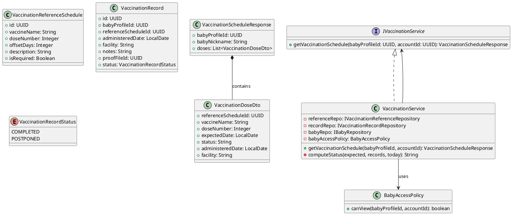
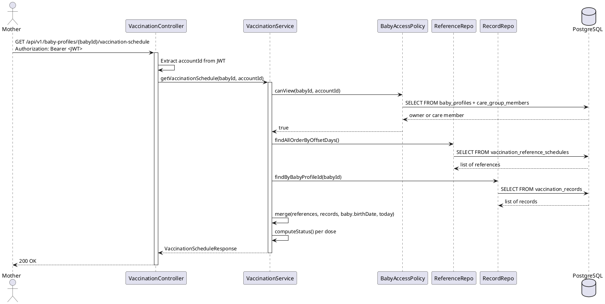
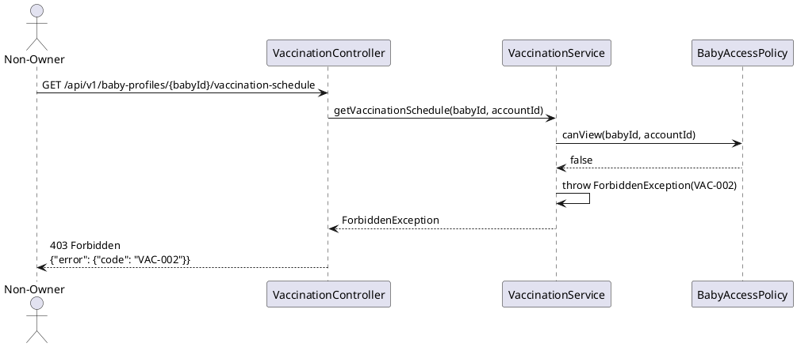

# ENGINEERING DOCUMENTATION STANDARD (EDS) v2.0
# Technical Design Specification — UC-228 View Vaccination Schedule

| Field | Value |
|-------|-------|
| **Document ID** | `CB-VAC-IMP-001` |
| **Version** | `1.0` |
| **Date** | `2026-06-26` |
| **Status** | `Draft` |
| **Document Owner** | `PhuongNT` |
| **Author** | `AI Agent` |
| **Reviewed by** | `[Tech Lead]` |
| **DPO Sign-off** | `[ ] Pending` |
| **Approved by** | `[Principal Architect]` |
| **Last Review** | `2026-06-26` |
| **Based on EDS** | `v2.0` |

---

## CHANGELOG

| Ngày | Người thực hiện | Nội dung thay đổi |
|------|-----------------|-------------------|
| 2026-06-26 | AI Agent | Tạo tài liệu lần đầu cho UC-228 View Vaccination Schedule |

---

## MỤC LỤC

1. [Tổng quan Module](#1-tổng-quan-module)
2. [Ma trận Truy vết](#2-ma-trận-truy-vết-traceability-matrix)
3. [Architecture Decision Records (ADR)](#3-architecture-decision-records-adr)
4. [Non-Functional Requirements & SLA](#4-non-functional-requirements--sla)
5. [Static Modeling](#5-static-modeling-mô-hình-tĩnh)
6. [Dynamic Modeling](#6-dynamic-modeling-mô-hình-động)
7. [Domain Event Catalog](#7-domain-event-catalog)
8. [Interface Specification](#8-interface-specification-đặc-tả-giao-diện)
9. [API Specification](#9-api-specification)
10. [Bảng mã lỗi](#10-bảng-mã-lỗi-error-codes)
11. [Quy trình Triển khai](#11-quy-trình-triển-khai-step-by-step)
12. [Rollback & Incident Runbook](#12-rollback--incident-runbook)
13. [Kịch bản Kiểm thử Chi tiết](#13-kịch-bản-kiểm-thử-chi-tiết)
14. [Phương pháp Xác minh](#14-phương-pháp-xác-minh)
15. [Mẫu thử thực tế (API Verification Samples)](#15-mẫu-thử-thực-tế-api-verification-samples)
16. [Bảng tổng hợp phân quyền (Authorization Matrix)](#16-bảng-tổng-hợp-phân-quyền-authorization-matrix)
17. [AI Prompt Constraints (CASE 2.0)](#17-ai-prompt-constraints-case-20)

---

## 1. Tổng quan Module

| Field | Value |
|-------|-------|
| **Module Name** | `ViewVaccinationSchedule` |
| **Bounded Context** | `vaccination` |
| **UC ID** | `UC-228` |
| **SRS Reference** | `3.3.19.1` |
| **Primary Actor** | `Mother (ROLE_MOTHER)` |
| **Platform** | `Mobile App` |
| **Data Classification** | `Sensitive-PII` |
| **Compliance Scope** | `BR-RBAC, BR-PRIVACY, BR-SAFETY, PDPA` |
| **Upstream Dependencies** | `auth, baby_profiles, vaccination_records, vaccination_reference_schedule` |
| **Downstream Consumers** | `vaccination record actions (add/mark complete/postpone)` |

**Mô tả:** Hiển thị lịch tiêm chủng cho một baby profile, bao gồm các dose theo trạng thái (SCHEDULED/COMPLETED/POSTPONED/OVERDUE) và thời gian dự kiến. Schedule được generate từ reference schedule dựa trên birthDate của baby profile. Hệ thống **KHÔNG** chẩn đoán hay khuyến nghị y tế — chỉ hiển thị reference schedule chuẩn Bộ Y tế Việt Nam.

---

## 2. Ma trận Truy vết (Traceability Matrix)

| Requirement ID | Loại | Mô tả | Thành phần Code | Compliance Target | ADR liên quan |
|----------------|------|-------|-----------------|-------------------|---------------|
| UC-228 | Use Case | Mother xem lịch tiêm chủng | `VaccinationController.getSchedule()` | BR-RBAC | ADR-VAC-001 |
| BR-VAC-001 | Business Rule | Schedule derive từ baby birthDate + reference data | `VaccinationScheduleService.deriveSchedule()` | Data Integrity | ADR-VAC-001 |
| BR-VAC-002 | Business Rule | Chỉ owner của baby profile mới xem được | `BabyAccessPolicy.canView()` | BR-PRIVACY | ADR-VAC-001 |
| BR-VAC-003 | Business Rule | Doses quá hạn (overdue) được highlight với status OVERDUE | `VaccinationScheduleService.computeStatus()` | Data Integrity | — |
| BR-SAFETY-003 | Business Rule | Không đề xuất loại vaccine cụ thể ngoài reference schedule chuẩn | `VaccinationScheduleResponse` | BR-SAFETY | — |

---

## 3. Architecture Decision Records (ADR)

### ADR-VAC-001 — Schedule derived từ Reference Data + Baby BirthDate

| Field | Value |
|-------|-------|
| **Status** | `Accepted` |
| **Deciders** | `Tech Lead` |
| **Date** | `2026-06-26` |

#### Bối cảnh
Việt Nam có lịch tiêm chủng chuẩn của Bộ Y tế. Cần quyết định cách tính lịch cá nhân hóa theo từng baby.

#### Các phương án đã xem xét

| Phương án | Mô tả | Ưu điểm | Nhược điểm |
|-----------|-------|----------|------------|
| A | Lưu lịch tiêm của từng baby khi tạo baby profile | Truy vấn nhanh | Tốn storage; khó cập nhật khi MoH thay đổi lịch |
| B | Tính tại query time từ reference + birthDate | Luôn mới nhất; dễ cập nhật | Compute mỗi request |

#### Quyết định
Chọn **Phương án B**: Vaccination schedule được tính bằng cách: (1) load `vaccination_reference_schedules` (seeded data — Ministry of Health Vietnam standard), (2) compute `expected_date = baby.birthDate + offset_days`, (3) merge với actual `vaccination_records`. Status được compute at query time — không stored.

#### Hệ quả

**Tích cực:**
- Dễ cập nhật khi lịch tiêm quốc gia thay đổi (chỉ cần update seed)
- Không cần data migration khi có baby profile mới

**Tiêu cực / Trade-offs:**
- CPU overhead khi tính lịch — giảm thiểu bằng caching reference schedule (TTL 1hr)

**Compliance Impact:**
- Tuân thủ BR-SAFETY-003: chỉ hiển thị lịch chuẩn, không AI-generated recommendations

---

## 4. Non-Functional Requirements & SLA

### 4.1. Performance & Availability

| Category | Requirement | Target SLA | Measurement Method | Compliance Basis |
|----------|-------------|------------|---------------------|------------------|
| Latency | GET response (compute + query, p99) | `< 300ms` | k6 load test | — |
| Availability | Uptime (monthly) | `99.9%` | Uptime monitor | — |
| Reference data freshness | Re-seed khi MoH update lịch | On update | — | — |

### 4.2. Data Integrity & Retention

| Category | Requirement | Target | Verification Method | Compliance Basis |
|----------|-------------|--------|---------------------|------------------|
| Durability | Read-only; vaccination_records là write path riêng | N/A | — | — |
| Retention | vaccination_records | 18 năm (trẻ đến 18 tuổi) | DB backup | PDPA |

### 4.3. Security

| Category | Requirement | Target | Verification Method | Compliance Basis |
|----------|-------------|--------|---------------------|------------------|
| Access control | Baby owner only | 100% | BabyAccessPolicy | BR-RBAC |
| Safety | No diagnosis/recommendation in response | 100% | Response schema review | BR-SAFETY |

---

## 5. Static Modeling (Mô hình Tĩnh)

### 5.1. Class Diagram (PlantUML)



### 5.2. Data Structure (Flyway SQL Migration)

Tạo file: `src/main/resources/db/migration/V27__create_vaccination_tables.sql`

```sql
-- === VACCINATION SCHEMA ===

CREATE TYPE vac_record_status AS ENUM ('COMPLETED', 'POSTPONED');

CREATE TABLE vaccination_reference_schedules (
  id           UUID         PRIMARY KEY DEFAULT gen_random_uuid(),
  vaccine_name VARCHAR(255) NOT NULL,
  dose_number  INTEGER      NOT NULL,
  offset_days  INTEGER      NOT NULL,       -- days from birth date
  description  TEXT,
  is_required  BOOLEAN      NOT NULL DEFAULT TRUE,
  CONSTRAINT uq_vaccine_dose UNIQUE (vaccine_name, dose_number)
);

CREATE TABLE vaccination_records (
  id                    UUID               PRIMARY KEY DEFAULT gen_random_uuid(),
  baby_profile_id       UUID               NOT NULL REFERENCES baby_profiles(id),
  reference_schedule_id UUID               REFERENCES vaccination_reference_schedules(id),
  administered_date     DATE               NOT NULL,
  facility              VARCHAR(255),
  notes                 TEXT,
  proof_file_id         UUID,
  status                vac_record_status  NOT NULL DEFAULT 'COMPLETED',
  created_at            TIMESTAMPTZ        NOT NULL DEFAULT NOW(),
  created_by            UUID               NOT NULL
);

CREATE INDEX idx_vr_baby_profile_id ON vaccination_records(baby_profile_id);
CREATE INDEX idx_vrs_offset ON vaccination_reference_schedules(offset_days);

-- Seed: Lịch tiêm chuẩn Bộ Y tế VN
INSERT INTO vaccination_reference_schedules (vaccine_name, dose_number, offset_days, description, is_required) VALUES
  ('BCG', 1, 0, 'Sơ sinh — tiêm ngay sau khi sinh', true),
  ('Hepatitis B', 1, 0, 'Sơ sinh — trong 24 giờ đầu', true),
  ('Hepatitis B', 2, 30, 'Tháng 1', true),
  ('Hepatitis B', 3, 60, 'Tháng 2', true),
  ('DTP-HepB-Hib', 1, 60, 'Tháng 2', true),
  ('DTP-HepB-Hib', 2, 90, 'Tháng 3', true),
  ('DTP-HepB-Hib', 3, 120, 'Tháng 4', true);
```

---

## 6. Dynamic Modeling (Mô hình Động)

### 6.1. Sequence Diagram — Happy Path (PlantUML)



### 6.2. Sequence Diagram — Error Path



---

## 7. Domain Event Catalog

### 7.1. Events Published (Phát ra)

| Event Name | Trigger | Publisher | Subscriber(s) | Async? |
|------------|---------|-----------|---------------|--------|
| — | Read-only endpoint — không phát sự kiện | — | — | — |

### 7.2. Events Consumed (Tiêu thụ)

| Event Name | Source | Handler | Action thực hiện |
|------------|--------|---------|------------------|
| `VaccinationRecordAdded` | `VaccinationRecordService` | — | Tạo row trong vaccination_records (ngoài scope UC-228) |

---

## 8. Interface Specification (Đặc tả Giao diện)

### 8.1. Service Interface

```java
// VaccinationDoseDto.java
// @version 1.0
public class VaccinationDoseDto {
    private UUID referenceScheduleId;
    private String vaccineName;
    private Integer doseNumber;
    private LocalDate expectedDate;       // birthDate + offsetDays
    private String status;                // SCHEDULED, COMPLETED, POSTPONED, OVERDUE
    private LocalDate administeredDate;   // null if not completed
    private String facility;
    // getters / setters
}

// VaccinationScheduleResponse.java
public class VaccinationScheduleResponse {
    private UUID babyProfileId;
    private String babyNickname;
    private List<VaccinationDoseDto> doses;
    // No medical recommendations — BR-SAFETY-003
    // getters / setters
}

// IVaccinationService.java
// @version 1.0
public interface IVaccinationService {
    /**
     * @throws NotFoundException (VAC-001) khi baby profile không tồn tại
     * @throws ForbiddenException (VAC-002) khi caller không có quyền xem
     */
    VaccinationScheduleResponse getVaccinationSchedule(UUID babyProfileId, UUID accountId);
}
```

### 8.2. Repository Interface

```java
// IVaccinationReferenceRepository.java
// @version 1.0
public interface IVaccinationReferenceRepository extends JpaRepository<VaccinationReferenceSchedule, UUID> {
    List<VaccinationReferenceSchedule> findAllByOrderByOffsetDaysAsc();
}

// IVaccinationRecordRepository.java
public interface IVaccinationRecordRepository extends JpaRepository<VaccinationRecord, UUID> {
    List<VaccinationRecord> findByBabyProfileId(UUID babyProfileId);
}
```

---

## 9. API Specification

### 9.1. Endpoints Table

| Method | Path | Auth Level | Required Roles | Rate Limit | Idempotent? |
|--------|------|------------|----------------|------------|-------------|
| `GET` | `/api/v1/baby-profiles/{babyId}/vaccination-schedule` | JWT Bearer | `ROLE_MOTHER` | 60/min | Yes |

### 9.2. Request / Response Schemas

#### `GET /api/v1/baby-profiles/{babyId}/vaccination-schedule`

**Response — 200 OK (Happy Path):**
```json
{
  "babyProfileId": "baby-uuid",
  "babyNickname": "Bean",
  "doses": [
    {
      "referenceScheduleId": "ref-uuid-1",
      "vaccineName": "BCG",
      "doseNumber": 1,
      "expectedDate": "2026-01-01",
      "status": "COMPLETED",
      "administeredDate": "2026-01-02",
      "facility": "Bệnh viện Phụ sản TW"
    },
    {
      "referenceScheduleId": "ref-uuid-2",
      "vaccineName": "Hepatitis B",
      "doseNumber": 1,
      "expectedDate": "2026-01-01",
      "status": "OVERDUE",
      "administeredDate": null,
      "facility": null
    }
  ]
}
```

**Response — 403 Forbidden:**
```json
{
  "error": {
    "code": "VAC-002",
    "message": "Insufficient permissions"
  }
}
```

**Response — 404 Not Found:**
```json
{
  "error": {
    "code": "VAC-001",
    "message": "Baby profile not found"
  }
}
```

---

## 10. Bảng mã lỗi (Error Codes)

| Code | HTTP Status | Message (EN) | Message (VI) | Trigger Condition |
|------|-------------|--------------|--------------|-------------------|
| `VAC-001` | 404 | Baby profile not found | Không tìm thấy hồ sơ bé | babyProfileId không tồn tại trong DB |
| `VAC-002` | 403 | Insufficient permissions | Không đủ quyền | Caller không phải owner hoặc care member |
| `VAC-003` | 500 | Internal error | Lỗi hệ thống | DB error hoặc compute error |

---

## 11. Quy trình Triển khai (Step-by-Step)

### 11.1. Prerequisites

- [ ] Table `baby_profiles` đã tồn tại
- [ ] `BabyAccessPolicy` đã implemented (từ UC-211)
- [ ] Môi trường staging sẵn sàng

### 11.2. Pre-Migration Checklist

- [ ] Backup DB production trước khi chạy V27
- [ ] Migration V27 đã chạy thành công trên staging ≥ 24 giờ
- [ ] Rollback script đã test (xem §12)
- [ ] Seed data vaccination reference schedule đã verify

### 11.3. Implementation Steps

#### Chặng 1 — Tạo Flyway migration V27

Tạo file: `src/main/resources/db/migration/V27__create_vaccination_tables.sql`

```bash
./mvnw flyway:migrate
```

> ⚠️ **Chú ý:** Seed data (INSERT statements) trong V27 phải chạy trong cùng transaction. Nếu seed fail, migration fail và rollback tự động.

#### Chặng 2 — Implement `computeStatus()` algorithm

```java
private String computeStatus(
    VaccinationReferenceSchedule ref,
    Map<UUID, VaccinationRecord> recordsByRefId,
    LocalDate birthDate,
    LocalDate today
) {
    LocalDate expected = birthDate.plusDays(ref.getOffsetDays());
    VaccinationRecord record = recordsByRefId.get(ref.getId());
    if (record != null) {
        return record.getStatus().name(); // COMPLETED or POSTPONED
    }
    if (expected.isBefore(today)) {
        return "OVERDUE";
    }
    return "SCHEDULED";
}
```

#### Chặng 3 — Implement Service

```java
@Override
public VaccinationScheduleResponse getVaccinationSchedule(UUID babyProfileId, UUID accountId) {
    BabyProfile baby = babyRepo.findById(babyProfileId)
        .orElseThrow(() -> new NotFoundException("VAC-001"));
    if (!babyAccessPolicy.canView(babyProfileId, accountId)) {
        throw new ForbiddenException("VAC-002");
    }
    List<VaccinationReferenceSchedule> references = referenceRepo.findAllByOrderByOffsetDaysAsc();
    Map<UUID, VaccinationRecord> recordMap = recordRepo.findByBabyProfileId(babyProfileId)
        .stream().collect(Collectors.toMap(r -> r.getReferenceScheduleId(), r -> r));
    LocalDate today = LocalDate.now();
    List<VaccinationDoseDto> doses = references.stream()
        .map(ref -> mapper.toDto(ref, recordMap.get(ref.getId()), baby.getBirthDate(), today))
        .collect(Collectors.toList());
    return new VaccinationScheduleResponse(babyProfileId, baby.getNickname(), doses);
}
```

#### Chặng 4 — Verification sau deploy

```bash
curl -X GET https://[host]/api/v1/health
# Expected: {"status": "ok"}
```

### 11.4. Deployment Checklist

- [ ] Migration V27 chạy thành công
- [ ] Seed data present: `SELECT COUNT(*) FROM vaccination_reference_schedules;` → ≥ 7
- [ ] Health check endpoint trả về 200
- [ ] Thử GET với baby owner → 200
- [ ] Thử GET với non-owner → 403

---

## 12. Rollback & Incident Runbook

### 12.1. Điều kiện kích hoạt Rollback

| Điều kiện | Ngưỡng | Người quyết định |
|-----------|--------|------------------|
| Error rate tăng đột biến | > 5% trong 5 phút | On-call Engineer |
| Latency p99 vượt ngưỡng | > 1s | On-call Engineer |
| Compute error trong status | Bất kỳ case nào | Tech Lead |
| Seed data sai (lịch tiêm không đúng MoH) | Bất kỳ case nào | Tech Lead + Medical Advisor |

### 12.2. Rollback Procedure

```bash
# Bước 1: Revert migration V27
psql -h $DB_HOST -U $DB_USER -d $DB_NAME \
  -c "DROP TABLE IF EXISTS vaccination_records CASCADE;"
psql -h $DB_HOST -U $DB_USER -d $DB_NAME \
  -c "DROP TABLE IF EXISTS vaccination_reference_schedules CASCADE;"
psql -h $DB_HOST -U $DB_USER -d $DB_NAME \
  -c "DROP TYPE IF EXISTS vac_record_status CASCADE;"
psql -h $DB_HOST -U $DB_USER -d $DB_NAME \
  -c "DELETE FROM flyway_schema_history WHERE version = '27';"

# Bước 2: Re-deploy phiên bản cũ
kubectl rollout undo deployment/carebridge-api

# Bước 3: Verify rollback
kubectl rollout status deployment/carebridge-api
curl -X GET https://[host]/api/v1/health

# Bước 4: Smoke test
curl -X GET https://[host]/api/v1/baby-profiles/{babyId}/vaccination-schedule \
  -H "Authorization: Bearer <valid_owner_token>"
```

### 12.3. Notification Protocol

| Thời điểm | Người nhận | Kênh | Template |
|-----------|------------|------|----------|
| Ngay khi phát hiện | On-call team | Slack `#incident` | "🚨 UC-228 vaccination schedule incident" |
| Nếu lịch tiêm hiển thị sai | Medical Advisor | Email | "Vaccination reference data issue" |
| Nếu PII bị leak | DPO | Email | Bắt buộc — PDPA |

---

## 13. Kịch bản Kiểm thử Chi tiết

> **Policy (EDS v2.0):** Mọi test scenario dùng dữ liệu `SYNTHETIC`. Không dùng baby profile production.

### 13.1. Unit Tests

#### TC-UNIT-001 — BCG dose từ reference + birthDate

```gherkin
Feature: View Vaccination Schedule
  Background:
    Given test data classification: SYNTHETIC
    And baby "Bean" với birthDate=2026-01-01
    And vaccination_reference_schedules chứa BCG dose 1 offset_days=0
    And today = 2026-06-26

  Scenario: Scheduled → OVERDUE vì past expected date
    Given không có vaccination record cho BCG
    When getVaccinationSchedule(babyId, ownerId) được gọi
    Then BCG dose có expectedDate=2026-01-01
    And BCG dose có status=OVERDUE (expectedDate < today)

  Scenario: BCG đã tiêm → COMPLETED
    Given có vaccination record cho BCG với status=COMPLETED, administeredDate=2026-01-02
    When getVaccinationSchedule(babyId, ownerId) được gọi
    Then BCG dose có status=COMPLETED
    And BCG dose có administeredDate=2026-01-02
```

**Hàm được test:** `VaccinationService.computeStatus()`

#### TC-UNIT-002 — Non-owner → 403

```gherkin
  Scenario: Non-owner cannot view schedule
    Given ACC-OTHER không phải owner hoặc care member của baby "Bean"
    When getVaccinationSchedule(babyId, ACC-OTHER) được gọi
    Then throws ForbiddenException với code VAC-002
```

#### TC-UNIT-003 — Baby not found → 404

```gherkin
  Scenario: Baby profile not found
    Given babyId=NONEXISTENT
    When getVaccinationSchedule(NONEXISTENT, ownerId) được gọi
    Then throws NotFoundException với code VAC-001
```

#### TC-UNIT-004 — Response không chứa medical recommendations

```gherkin
  Scenario: Response has no medical recommendations
    When getVaccinationSchedule(babyId, ownerId) được gọi
    Then response JSON KHÔNG chứa "recommendation"
    And response JSON KHÔNG chứa "diagnos"
    And response JSON KHÔNG chứa "prescription"
```

### 13.2. Integration Tests

#### TC-INT-001 — Full schedule với DB seed data

```gherkin
  Scenario: BCG COMPLETED + HepB OVERDUE từ seeded data
    Given test data classification: SYNTHETIC
    Given database có baby birthDate=2026-01-01
    And vaccination_reference_schedules seeded với BCG (offset 0) và HepB (offset 0)
    And vaccination_records có BCG COMPLETED
    When getVaccinationSchedule() được gọi
    Then BCG status=COMPLETED
    And HepB status=OVERDUE
```

### 13.3. E2E / Security Tests

#### TC-E2E-001 — Luồng hoàn chỉnh qua API

```gherkin
  Scenario: Baby owner gọi API → 200
    Given test data classification: SYNTHETIC
    And OWNER có JWT hợp lệ
    When GET /api/v1/baby-profiles/{babyId}/vaccination-schedule
    Then response status là 200
    And response chứa doses list
    And response KHÔNG chứa "recommendation"

  Scenario: Gọi không có JWT → 401
    When GET /api/v1/baby-profiles/{babyId}/vaccination-schedule không có JWT
    Then response status là 401
```

---

## 14. Phương pháp Xác minh

### 14.1. Database Inspection

```sql
-- Verify migration V27 thành công
SELECT COUNT(*) FROM vaccination_reference_schedules;
-- Expected: ≥ 7 (BCG, HepB x3, DTP x3)

-- Verify seed data đúng theo MoH schedule
SELECT vaccine_name, dose_number, offset_days FROM vaccination_reference_schedules ORDER BY offset_days;

-- Verify index tồn tại
SELECT indexname FROM pg_indexes WHERE tablename = 'vaccination_records';
```

### 14.2. Log / Audit Verification

```bash
# Verify không có medical recommendations trong log
kubectl logs -l app=carebridge-api | grep -i "recommendation\|diagnosis\|prescription"
# Expected: No output

# Verify access control working
kubectl logs -l app=carebridge-api | grep "VAC-002" | head -5
```

### 14.3. Tool-based Verification

```bash
# Verify status compute logic
# Manually: baby birthDate=2026-01-01, today=2026-06-26, BCG offset=0
# Expected: expectedDate=2026-01-01, today>expected → status=OVERDUE

# Verify JWT claims
echo "<JWT>" | cut -d'.' -f2 | base64 -d | jq '.sub, .roles'
```

---

## 15. Mẫu thử thực tế (API Verification Samples)

### 15.1. Happy Path

```bash
# GET vaccination schedule (baby owner)
curl -X GET https://[host]/api/v1/baby-profiles/BABY-UUID/vaccination-schedule \
  -H "Authorization: Bearer <OWNER_JWT>" \
  -H "X-Correlation-Id: $(uuidgen)"
```

**Expected Response (200):**
```json
{
  "babyProfileId": "BABY-UUID",
  "babyNickname": "Bean",
  "doses": [
    {
      "referenceScheduleId": "ref-uuid-1",
      "vaccineName": "BCG",
      "doseNumber": 1,
      "expectedDate": "2026-01-01",
      "status": "COMPLETED",
      "administeredDate": "2026-01-02",
      "facility": "Bệnh viện Phụ sản TW"
    }
  ]
}
```

### 15.2. Error Paths

```bash
# Non-owner → 403
curl -X GET https://[host]/api/v1/baby-profiles/BABY-UUID/vaccination-schedule \
  -H "Authorization: Bearer <NON_OWNER_JWT>"
```

**Expected Response (403):**
```json
{
  "error": {
    "code": "VAC-002",
    "message": "Insufficient permissions"
  }
}
```

```bash
# Baby not found → 404
curl -X GET https://[host]/api/v1/baby-profiles/NONEXISTENT/vaccination-schedule \
  -H "Authorization: Bearer <VALID_JWT>"
```

---

## 16. Bảng tổng hợp phân quyền (Authorization Matrix)

> Nguyên tắc Least Privilege: Chỉ baby owner (và care group members nếu applicable) xem được.

| Endpoint | `GUEST` | `MOTHER (owner/care member)` | `EXPERT` | `ADMIN` |
|----------|---------|------------------------------|----------|---------|
| `GET /api/v1/baby-profiles/:id/vaccination-schedule` | ❌ | ✅ | ❌ | ✅ All |

**Chú thích:**
- ✅ = Được phép
- ❌ = Bị từ chối (403)

---

## 17. AI Prompt Constraints (CASE 2.0)

### 17.1 Constraint Summary Table

| # | Constraint | Source (ADR/BR) | Last Verified |
|---|-----------|-----------------|---------------|
| C1 | Schedule PHẢI derive từ `vaccination_reference_schedules` + `baby.birthDate` — KHÔNG hardcode lịch tiêm trong code | ADR-VAC-001 | 2026-06-26 |
| C2 | Status OVERDUE được compute khi `expectedDate < today` AND không có COMPLETED record — compute at query time, KHÔNG stored | BR-VAC-003 | 2026-06-26 |
| C3 | Response KHÔNG được chứa vaccine recommendations, diagnosis, hay medical advice ngoài reference schedule chuẩn | BR-SAFETY-003 | 2026-06-26 |
| C4 | `BabyAccessPolicy.canView()` PHẢI check ownership + care group membership — KHÔNG chỉ check ownership | ADR-VAC-001 | 2026-06-26 |
| C5 | `accountId` lấy từ JWT SecurityContext — KHÔNG từ URL path | BR-RBAC | 2026-06-26 |

### 17.2 Constraint Injection Block (Copy-Paste vào AI Prompt)

```
[CONSTRAINT BLOCK — Module: ViewVaccinationSchedule (CB-VAC-IMP-001)]
Theo TDS CB-VAC-IMP-001 và các ADR liên quan:

1. (C1 — ADR-VAC-001) Schedule derive từ DB reference + birthDate — KHÔNG hardcode offsetDays trong Java code.
2. (C2 — BR-VAC-003) computeStatus(): OVERDUE nếu expectedDate < today && no COMPLETED record. Không store status trong DB.
3. (C3 — BR-SAFETY-003) VaccinationScheduleResponse KHÔNG được có field recommendations, diagnosis, hay advice.
4. (C4 — ADR-VAC-001) BabyAccessPolicy.canView() phải check cả ownership lẫn care group membership (ACCEPTED).
5. (C5 — BR-RBAC) accountId extract từ JWT SecurityContext, không nhận từ URL path hay body.

[CONTEXT BLOCK]
- Bounded Context: vaccination
- Data Classification: Sensitive-PII
- Compliance: BR-SAFETY, PDPA
- Existing interfaces: §8 Service Interface + Repository Interface
- Error codes: VAC-001 (404), VAC-002 (403)
- Auth matrix: §16

[TASK BLOCK]
Implement VaccinationService.getVaccinationSchedule() thỏa mãn constraints trên.
Output phải tuân thủ §8 Interface Specification.
Tests phải cover §13 Test Scenarios.
```

### 17.3 Constraint Quality Checklist

- [x] Mỗi constraint traceable về ADR hoặc BR cụ thể
- [x] Không có constraint generic
- [x] Constraint block có ≥ 5 constraints cụ thể
- [x] Reference §8 Interface
- [x] Reference §16 Auth Matrix

### 17.4 Anti-Pattern Detection

| AP-ID | Anti-Pattern | Dấu hiệu | Hành động |
|-------|-------------|-----------|----------|
| AP-AI-001 | Unconstrained Gen | Code hardcode offset_days thay vì query từ DB | Reject — C1 violation |
| AP-AI-003 | Implicit Decision | Response chứa "recommendation" field | Reject — C3/BR-SAFETY violation |
| AP-AI-005 | Hallucinated Contract | Code call IVaccinationService method không có trong §8 | Reject — verify contract |

---

## PHỤ LỤC

### A. Glossary (Thuật ngữ)

| Thuật ngữ | Định nghĩa |
|-----------|------------|
| Offset Days | Số ngày kể từ ngày sinh của bé, dùng để tính thời điểm tiêm |
| Reference Schedule | Lịch tiêm chuẩn do Bộ Y tế Việt Nam quy định |
| OVERDUE | Trạng thái dose: expected date đã qua nhưng chưa tiêm |
| Compute at query time | Tính toán status tại thời điểm truy vấn — không lưu vào DB |
| BR-SAFETY | Business Rule: AI không được đưa ra chẩn đoán y tế |

### B. Tài liệu tham chiếu

| Document | Link / Path |
|----------|-------------|
| Lịch tiêm chủng Bộ Y tế VN | https://moh.gov.vn (tham khảo) |
| EDS v2.0 Template | `08_References/Template/PHASE-3_TDS.md` |
| CASE 2.0 Methodology | `08_References/` |
| BabyAccessPolicy | `05_Development/CareBridgeAPI/src/main/java/com/carebridge/policy/` |

---

*EDS v2.1 — Tích hợp CASE 2.0 AI Prompt Constraints (§17).*
