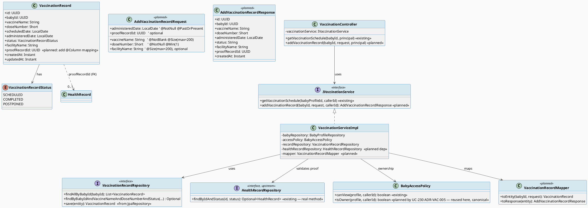
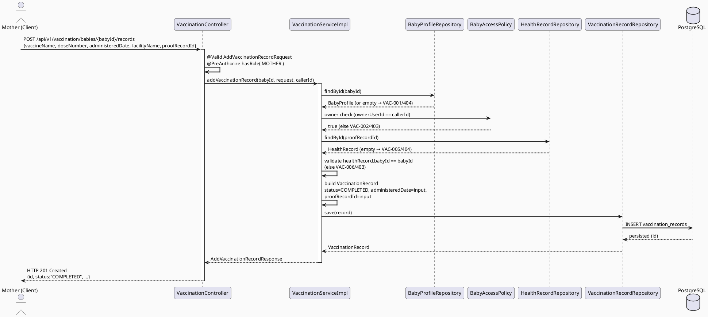
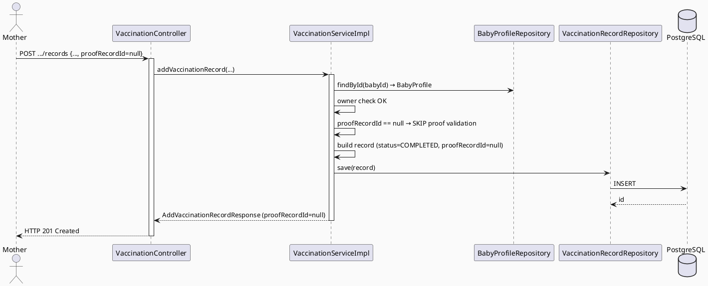
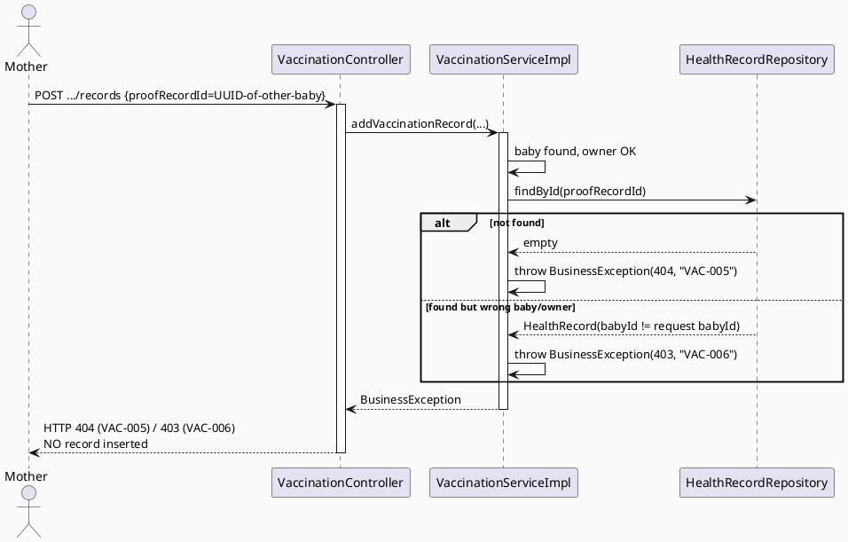
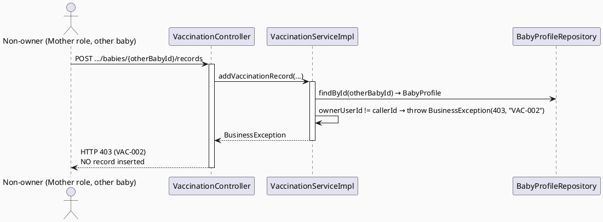
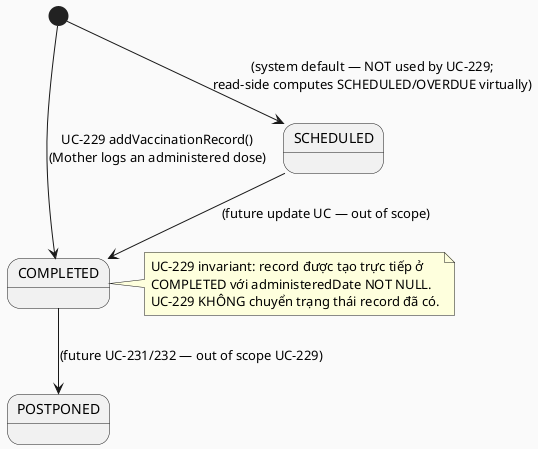

# ENGINEERING DOCUMENTATION STANDARD (EDS) v2.0
# Quy chuẩn Tài liệu Kỹ thuật và Đặc tả Hiện thực hóa — UC-229 Add Vaccination Record

| Field | Value |
|-------|-------|
| **Document ID** | `CB-VAC-IMP-229` |
| **Version** | `1.0` |
| **Date** | `2026-07-03` |
| **Status** | `Draft` |
| **Document Owner** | `LamVH (feature author, per SRS Table 251)` |
| **Author** | `AI Agent (Technical Architect role)` |
| **Reviewed by** | `[Tech Lead — Pending]` |
| **DPO Sign-off** | `[ ] Pending` *(module xử lý PII trẻ em — bắt buộc)* |
| **Approved by** | `[Principal Architect — Pending]` |
| **Last Review** | `2026-07-03` |
| **Based on EDS** | `v2.0` |

---

## CHANGELOG

> **Policy 4.4 — Immutable History:** Không bao giờ xóa thông tin cũ. Mọi thay đổi phải ghi vào bảng này.

| Ngày | Người thực hiện | Nội dung thay đổi |
|------|-----------------|-------------------|
| 2026-07-03 | AI Agent — Technical Architect | Tạo tài liệu lần đầu cho UC-229 Add Vaccination Record. Model theo REAL CODE (`com.carebridge.backend.vaccination`), không theo TDS-doc UC228 (đã drift). |

---

## MỤC LỤC

1. [Tổng quan Module](#1-tổng-quan-module)
2. [Ma trận Truy vết (Traceability Matrix)](#2-ma-trận-truy-vết-traceability-matrix)
3. [Architecture Decision Records (ADR)](#3-architecture-decision-records-adr)
4. [Non-Functional Requirements & SLA](#4-non-functional-requirements--sla)
5. [Static Modeling (Mô hình Tĩnh)](#5-static-modeling-mô-hình-tĩnh)
6. [Dynamic Modeling (Mô hình Động)](#6-dynamic-modeling-mô-hình-động)
7. [Domain Event Catalog](#7-domain-event-catalog)
8. [Interface Specification (Đặc tả Giao diện)](#8-interface-specification-đặc-tả-giao-diện)
9. [API Specification](#9-api-specification)
10. [Bảng mã lỗi (Error Codes)](#10-bảng-mã-lỗi-error-codes)
11. [Quy trình Triển khai (Step-by-Step)](#11-quy-trình-triển-khai-step-by-step)
12. [Rollback & Incident Runbook](#12-rollback--incident-runbook)
13. [Kịch bản Kiểm thử Chi tiết](#13-kịch-bản-kiểm-thử-chi-tiết)
14. [Phương pháp Xác minh](#14-phương-pháp-xác-minh)
15. [Mẫu thử thực tế (API Verification Samples)](#15-mẫu-thử-thực-tế-api-verification-samples)
16. [Bảng tổng hợp phân quyền (Authorization Matrix)](#16-bảng-tổng-hợp-phân-quyền-authorization-matrix)
17. [AI Prompt Constraints (CASE 2.0)](#17-ai-prompt-constraints-case-20)

---

## 1. Tổng quan Module

> UC-229 cho phép **Mother** ghi nhận một mũi tiêm đã thực hiện cho con của mình: tên vaccine, mũi tiêm thứ mấy, ngày tiêm, cơ sở tiêm, và (tùy chọn) ảnh sổ tiêm/giấy chứng nhận. Đây là chức năng **ghi (write-side)** bổ sung vào package `vaccination` vốn hiện chỉ có một endpoint đọc (UC-228 View Vaccination Schedule).

| Field | Value |
|-------|-------|
| **Module Name** | `Vaccination — Add Vaccination Record` |
| **Bounded Context** | `Vaccination & Growth Tracking` |
| **Data Classification** | `Sensitive-PII` *(dữ liệu sức khỏe của trẻ em)* |
| **Compliance Scope** | `PDPA` *(Luật 91/2025 — dữ liệu cá nhân nhạy cảm; BR-PRIVACY, BR-RBAC, BR-SAFETY)* |
| **Upstream Dependencies** | `baby` (BabyProfileRepository, BabyAccessPolicy), `health` (HealthRecord — proof linkage), `common` (SecurityUtils, BusinessException, ApiResponse) |
| **Downstream Consumers** | `vaccination` read-side (`getVaccinationSchedule` khớp record COMPLETED/POSTPONED theo key `vaccineName|doseNumber`) — xem ADR-VAC-229-004 |

**Ground truth nguồn (đã đọc trực tiếp):**
- Controller: `05_Development/CareBridgeAPI/src/main/java/com/carebridge/backend/vaccination/controller/VaccinationController.java`
- Service: `.../vaccination/service/IVaccinationService.java`, `.../vaccination/service/impl/VaccinationServiceImpl.java`
- Entity: `.../vaccination/entity/VaccinationRecord.java`, `VaccinationRecordStatus.java`
- Repository: `.../vaccination/repository/VaccinationRecordRepository.java`
- Policy: `.../baby/policy/BabyAccessPolicy.java`
- Schema: `.../resources/db/migration/V1__init_schema.sql` (bảng `vaccination_records`, dòng 660–672; FK dòng 1730–1734)
- Reference catalog: `.../resources/db/migration/V20260627100500__create_vaccination_reference.sql`
- UI oracle: `03_Design/UI_UX/MobileAppScreen/CB-174 Add Vaccination Record (UC-229)/code.html`
- SRS: `02_Requirements/SRS/3_Functional_Specification.md` §3.3.19.2, Table 251 (dòng ~4924–4943)

---

## 2. Ma trận Truy vết (Traceability Matrix)

> Ánh xạ trực tiếp: [Mã yêu cầu] → [Thành phần Code] → [Mục tiêu Tuân thủ].

| Requirement ID | Loại | Mô tả yêu cầu | Thành phần Code (planned) | Compliance Target | ADR liên quan |
|----------------|------|---------------|---------------------------|-------------------|---------------|
| UC-229 | User Story (SRS Table 251) | "Records vaccination dose, date, facility, and proof file if available." | `VaccinationController.addVaccinationRecord()` | — | ADR-VAC-229-001 |
| BR-RBAC | Business Rule | Chỉ role được phép mới truy cập chức năng | `@PreAuthorize("hasRole('MOTHER')")` | PDPA Điều truy cập | ADR-VAC-229-003 |
| BR-PRIVACY | Business Rule | Chỉ owner của baby mới thêm record; consent/minimum-necessary | `BabyAccessPolicy` + ownership check (VAC-002) | PDPA | ADR-VAC-229-003 |
| BR-SAFETY | Business Rule | Dữ liệu tiêm phải chính xác; không diagnostic/AI guidance | Validation: `administeredDate ≤ today`, dose/date required (VAC-004/VAC-008) | PDPA / safety | ADR-VAC-229-002 |
| ADR-VAC-229-001 | Decision | Model theo REAL CODE, không theo TDS-doc UC228 | Toàn bộ package `vaccination` | — | — |
| ADR-VAC-229-002 | Decision | Record được tạo với `status = COMPLETED` (không phải SCHEDULED) | `VaccinationServiceImpl.addVaccinationRecord()` | BR-SAFETY | — |
| ADR-VAC-229-003 | Decision | Ownership qua `BabyAccessPolicy.isOwner()` (canonical, không dùng canView cho write) | `service` layer | BR-RBAC/BR-PRIVACY | — |
| ADR-VAC-229-004 | Decision | Proof-file linkage qua FK `proof_record_id` → `health_records`; thêm JPA mapping | `VaccinationRecord.proofRecordId` + validation (VAC-005/006) | BR-PRIVACY | — |

---

## 3. Architecture Decision Records (ADR)

### ADR-VAC-229-001 — Ground truth là REAL CODE, không phải TDS-doc UC228 (đã drift)

| Field | Value |
|-------|-------|
| **Status** | `Accepted` |
| **Deciders** | `AI Agent (Technical Architect), pending Principal Architect` |
| **Date** | `2026-07-03` |
| **Supersedes** | — |

#### Bối cảnh (Context)
TDS-doc của UC-228 (`04_Implement/UC228_ViewVaccinationSchedule/UC228_ViewVaccinationSchedule_TDS.md`, Status **Approved**) mô tả một kiến trúc **KHÁC** với code thực đã ship. Các sai lệch đã xác minh trực tiếp:

| Khía cạnh | TDS-doc UC228 (SAI so với code) | REAL CODE (ground truth) |
|-----------|-------------------------------|--------------------------|
| Migration | `V27__create_vaccination_tables.sql` (dòng 219, 494) | `vaccination_records` nằm trong `V1__init_schema.sql` (dòng 660–672); reference nằm trong `V20260627100500__create_vaccination_reference.sql` |
| Enum status | `CREATE TYPE vac_record_status AS ENUM ('COMPLETED','POSTPONED')` (dòng 224) — thiếu SCHEDULED | Column `status varchar(20) DEFAULT 'SCHEDULED'`; enum Java `VaccinationRecordStatus{SCHEDULED, COMPLETED, POSTPONED}` |
| Reference linkage | FK `reference_schedule_id UUID REFERENCES vaccination_reference_schedules(id)` (dòng 239) | KHÔNG có FK; read-side khớp bằng **string-key** `vaccineName + "|" + doseNumber` (`VaccinationServiceImpl` dòng 53–58, 70–71) |
| Proof linkage | `proof_file_id UUID` (dòng 243), không FK rõ | Column thực `proof_record_id uuid` **FK → `health_records(health_record_id)`** (constraint `vaccination_records_proof_record_id_fkey`, V1 dòng 1733–1734) |
| Endpoint path | `/api/v1/baby-profiles/{babyId}/vaccination-schedule` (dòng 409) | `/api/v1/vaccination/babies/{babyId}/schedule` (`VaccinationController` dòng 16, 23) |

#### Các phương án đã xem xét (Options Considered)

| Phương án | Mô tả | Ưu điểm | Nhược điểm |
|-----------|-------|----------|------------|
| A | Copy kiến trúc từ TDS-doc UC228 | + Nhất quán với tài liệu "Approved" | - Không compile/chạy được: type, path, FK không tồn tại trong code thực |
| B | Model theo REAL CODE, ghi rõ divergence | + Đúng với hệ thống đang chạy; + Không cần migration mới cho bảng đã có | - Mâu thuẫn với tài liệu UC228 (chấp nhận, có nêu rõ) |

#### Quyết định (Decision)
Chọn **Phương án B**. **Hệ thống thực đang chạy là ground truth cho spec này** (package `com.carebridge.backend.vaccination`, path prefix `/api/v1/vaccination/...`, enum `VaccinationRecordStatus{SCHEDULED,COMPLETED,POSTPONED}`, string-key reference matching). **TDS-doc UC228 đã drift so với code đã ship và KHÔNG được dùng làm nguồn kiến trúc**; chỉ các mã lỗi `VAC-001`/`VAC-002` của nó còn chính xác và được tái sử dụng ở đây.

#### Hệ quả (Consequences)
**Tích cực:** Spec khớp code chạy được; không cần migration bảng mới.
**Tiêu cực / Trade-offs:** Tồn tại mâu thuẫn tài liệu UC228 ↔ UC229 — cần một issue `docs-policy` để sync/deprecate phần drift của UC228 (nằm ngoài phạm vi UC-229).
**Compliance Impact:** Không thay đổi.

---

### ADR-VAC-229-002 — Record tạo mới có `status = COMPLETED` (không phải mặc định SCHEDULED)

| Field | Value |
|-------|-------|
| **Status** | `Accepted` |
| **Deciders** | `AI Agent (Technical Architect), pending Principal Architect` |
| **Date** | `2026-07-03` |

#### Bối cảnh (Context)
Entity `VaccinationRecord` có `@Builder.Default ... = VaccinationRecordStatus.SCHEDULED` và column default `'SCHEDULED'`. Tuy nhiên SRS Table 251 mô tả UC-229 là *"Records vaccination dose, **date**, facility, and proof file if available"* — tức ghi lại **một sự kiện đã xảy ra** (mũi tiêm vừa được tiêm), khác với các dòng SCHEDULED được sinh động (compute-time) từ reference schedule ở read-side UC-228.

#### Các phương án đã xem xét

| Phương án | Mô tả | Ưu điểm | Nhược điểm |
|-----------|-------|----------|------------|
| A | Lưu `status = SCHEDULED` (theo default entity) | + Không override default | - Sai ngữ nghĩa: read-side (`VaccinationServiceImpl` dòng 75–79) chỉ hiển thị `administeredDate` khi status = COMPLETED; SCHEDULED sẽ nuốt mất ngày tiêm Mother nhập |
| B | Lưu `status = COMPLETED`, set `administeredDate` từ input | + Khớp read-side merge; + Đúng ngữ nghĩa "đã tiêm" | - Cần override default rõ ràng ở service |

#### Quyết định (Decision)
Chọn **Phương án B**. UC-229 tạo record với `status = COMPLETED` và `administeredDate = ngày tiêm người dùng nhập`. Bằng chứng: (1) từ ngữ SRS "Records vaccination dose, date, facility"; (2) UI mockup CB-174 label ngày là **"Ngày tiêm"** (ngày đã tiêm, không phải ngày dự kiến); (3) read-side `VaccinationServiceImpl` chỉ trả `administeredDate` cho nhánh `status == COMPLETED` (dòng 75–77) — nếu lưu SCHEDULED thì ngày tiêm sẽ không hiển thị lại được.

#### Hệ quả
**Tích cực:** Record do Mother thêm sẽ khớp đúng vào lịch đọc UC-228 (nhánh COMPLETED, key `vaccineName|doseNumber`).
**Tiêu cực / Trade-offs:** `scheduledDate` để `null` (Mother-entered completed event không có ngày dự kiến); chấp nhận vì column nullable.
**Compliance Impact:** — (không).

---

### ADR-VAC-229-003 — Ownership cho write dùng owner-only, không dùng `canView`

| Field | Value |
|-------|-------|
| **Status** | `Accepted` |
| **Deciders** | `AI Agent (Technical Architect), pending Principal Architect` |
| **Date** | `2026-07-03` |

#### Bối cảnh (Context)
Read-side UC-228 dùng `BabyAccessPolicy.canView(baby, callerId)` → cho phép **owner HOẶC** thành viên care-group ACCEPTED. Với thao tác **ghi** dữ liệu sức khỏe (UC-229), SRS Primary Actor là **Mother** (chủ sở hữu baby), và `@PreAuthorize` trên write-endpoint health tương tự (`HealthRecordController` dòng 28) dùng `hasRole('MOTHER')`.

#### Các phương án đã xem xét

| Phương án | Mô tả | Ưu điểm | Nhược điểm |
|-----------|-------|----------|------------|
| A | Tái dùng `canView` (owner + care-group member) | + Không thêm method | - Cho phép người không phải Mother ghi record y tế → vi phạm BR-PRIVACY minimum-necessary |
| B | Chỉ owner (`baby.getOwnerUserId().equals(callerId)`) + `@PreAuthorize("hasRole('MOTHER')")` | + Least-privilege; + Khớp Primary Actor = Mother | - Cần check owner riêng ở service (không có method `canOwn` sẵn — xem Open) |

#### Quyết định (Decision)
Chọn **Phương án B**. Controller gắn `@PreAuthorize("hasRole('MOTHER')")`; service kiểm tra ownership qua `BabyAccessPolicy.isOwner(baby, callerId)`, nếu sai → `VAC-002` (403), tái dùng đúng ngữ nghĩa của VAC-002 (access denied) như read-side.

> **RESOLVED (was OPEN-1):** `BabyAccessPolicy` hiện chỉ có `canView` (xác nhận trực tiếp từ `baby/policy/BabyAccessPolicy.java` dòng 22–28 — không có `canOwn`/`canManage`). Tên method đã được **thống nhất trong batch**: `04_Implement/UC230_UpdateVaccinationRecord/UC230_UpdateVaccinationRecord_TDS.md` (ADR-VAC-005, Accepted) quyết định thêm `BabyAccessPolicy.isOwner(BabyProfile, UUID callerId)` làm method owner-only dùng chung cho các write use-case trong package `vaccination` (Add/Update/Delete/Complete/Postpone), thay vì mỗi UC tự đặt tên riêng. UC-229 **tái sử dụng `isOwner()`** làm canonical method — không tự định nghĩa `canOwn` mới. Bằng chứng bổ sung: `04_Implement/UC231_DeleteVaccinationRecord/UC231_DeleteVaccinationRecord_TDS.md` (ADR-VAC-DELETE-002, Accepted) độc lập đi tới cùng kết luận owner-only-cho-write, củng cố đây là quy ước nhất quán của batch UC-229..233.
>
> **Còn lại Open (Category B — câu hỏi giống hệt được lặp ở UC-232/UC-233):** Có nên chính thức hóa `isOwner()` thành convention bắt buộc trên `BabyAccessPolicy` cho *mọi* write use-case tương lai (ngoài vaccination), hay để từng bounded context tự quyết định theo từng trường hợp? Quyết định kiến trúc rộng hơn phạm vi UC-229, cần Principal Architect phê chuẩn một lần cho cả batch — không chặn implementation của UC-229 (đã có `isOwner()` cụ thể để dùng ngay).

#### Hệ quả
**Tích cực:** Least-privilege; ngăn care-group member (non-owner) ghi dữ liệu y tế.
**Tiêu cực / Trade-offs:** Divergence nhỏ giữa quyền đọc (rộng) và ghi (hẹp) — đúng thiết kế.
**Compliance Impact:** Củng cố BR-PRIVACY / PDPA minimum-necessary.

---

### ADR-VAC-229-004 — Proof-file linkage qua FK `proof_record_id` → `health_records` + thêm JPA mapping

| Field | Value |
|-------|-------|
| **Status** | `Accepted` |
| **Deciders** | `AI Agent (Technical Architect), pending Principal Architect` |
| **Date** | `2026-07-03` |

#### Bối cảnh (Context)
SRS yêu cầu "proof file if available". Column `proof_record_id uuid` **đã tồn tại** trong `vaccination_records` (V1 dòng 669) với **FK sẵn** tới `health_records(health_record_id)` (V1 dòng 1733–1734), NHƯNG entity `VaccinationRecord.java` **chưa map** column này. Đây là **thay đổi code (thêm JPA mapping), KHÔNG phải thay đổi schema/migration** — column và FK đã có sẵn.

#### Các phương án đã xem xét

| Phương án | Mô tả | Ưu điểm | Nhược điểm |
|-----------|-------|----------|------------|
| A | Upload file trực tiếp trong request UC-229 | + 1 call | - Trùng lặp storage/consent logic với module health; không khớp FK sẵn |
| B | Client tạo `health_records` trước (`POST /api/v1/health-records`, UC-39), rồi UC-229 nhận `proofRecordId` tùy chọn trỏ tới record đó | + Tái dùng flow health có sẵn; + Khớp FK `proof_record_id` | - Cần 2 bước; cần validate ownership của proof record |

#### Quyết định (Decision)
Chọn **Phương án B**. Thêm field `@Column(name = "proof_record_id") private UUID proofRecordId;` vào entity `VaccinationRecord`. Request UC-229 nhận `proofRecordId` **tùy chọn**. Nếu có, service **validate**: (1) tồn tại một `health_records` row **ở trạng thái `ACTIVE`** với id đó — nếu không → `VAC-005` (404); (2) row đó thuộc cùng baby (`healthRecord.getBabyId().equals(babyId)`) — nếu không → `VAC-006` (403). Health-record creation endpoint đã xác nhận tồn tại: `POST /api/v1/health-records` (`HealthRecordController` dòng 27, UC-39, `hasRole('MOTHER')`), trả `AddHealthRecordResponse.id`. `RecordType.VACCINATION_FORM` (enum `RecordType`) là loại phù hợp cho proof này.
>
> **RESOLVED (query method — cập nhật so với bản đầu):** `HealthRecordRepository.java` (real code) chỉ có đúng MỘT lookup method: `findByIdAndStatus(UUID id, HealthRecordStatus status)` — **không có** `findById` overload riêng cho việc này ngoài `JpaRepository.findById` mặc định (không lọc status). Bản đầu của ADR này gọi `healthRecordRepository.findById(...)` mà không kiểm tra status — bản sửa dùng đúng `findByIdAndStatus(proofRecordId, HealthRecordStatus.ACTIVE)`, khớp chính xác với cách `04_Implement/UC230_UpdateVaccinationRecord/UC230_UpdateVaccinationRecord_TDS.md` (ADR-VAC-006) đã dùng cho cùng bảng `health_records`. Việc thống nhất này ngăn hai UC trong cùng batch validate proof record theo hai tiêu chuẩn khác nhau (UC-229 trước đây không lọc ACTIVE, UC-230 có lọc) — nay cả hai đều yêu cầu `ACTIVE`.

> **Còn Open (Category B, không chặn implementation code, chỉ ảnh hưởng mobile UX):** UX chính xác của luồng upload trên mobile — app tự gọi `POST /api/v1/health-records` (recordType=VACCINATION_FORM, kèm fileIds) để lấy `id` rồi truyền vào `proofRecordId`, hay có wrapper riêng — chưa xác nhận trong tài liệu UI. UI mockup CB-174 chỉ có ô "Tải ảnh lên (Tùy chọn)", không có chi tiết luồng 2 bước. **Câu hỏi này cũng áp dụng cho UC-232** (`MarkVaccinationCompletedRequest.proofRecordId` cùng shape) — xem UC-232 TDS Appendix C OPEN-4, đã được cập nhật để trỏ về đúng một câu hỏi UX này thay vì lặp lại độc lập. **Thiết kế FK-validation phía vaccination KHÔNG Open** (là quyết định chắc chắn ở trên).

#### Hệ quả
**Tích cực:** Tái dùng health flow; giữ FK integrity; không cần migration.
**Tiêu cực / Trade-offs:** Client phải 2 bước khi có ảnh. Consent/scope của file được kế thừa từ module health.
**Compliance Impact:** BR-PRIVACY — proof phải thuộc đúng baby/owner, tránh cross-tenant leak.

---

## 4. Non-Functional Requirements & SLA

> SRS không nêu SLA số cụ thể cho UC-229 → các giá trị dưới đây là **default nội bộ**; mọi giá trị chưa có nguồn được đánh dấu `Open`.

### 4.1. Performance & Availability

| Category | Requirement | Target SLA | Measurement Method | Compliance Basis |
|----------|-------------|------------|---------------------|------------------|
| Latency | POST add record (p99) | `< 300ms` *(Open — chưa có nguồn SRS)* | k6 load test | — |
| Availability | Uptime (monthly) | `99.9%` *(Open)* | Uptime monitor | — |
| Throughput | Concurrent add | `Frequency = Regular` (SRS Table 251) → tải thấp | Load test | — |

### 4.2. Data Integrity & Retention

| Category | Requirement | Target | Verification Method | Compliance Basis |
|----------|-------------|--------|---------------------|------------------|
| Durability | Zero record loss | RPO = 0 | Transaction log (`@Transactional`) | PDPA |
| Atomicity | Insert record trong 1 transaction | 100% | `@Transactional` trên service method | PDPA |
| FK Integrity | `proof_record_id` trỏ tới health_records hợp lệ | 100% | DB FK `vaccination_records_proof_record_id_fkey` + service validate | BR-PRIVACY |

### 4.3. Security

| Category | Requirement | Target | Verification Method | Compliance Basis |
|----------|-------------|--------|---------------------|------------------|
| Access control | Owner-only write | Least privilege | `@PreAuthorize` + owner check (§16) | BR-RBAC / PDPA |
| Encryption in transit | All endpoints | TLS 1.3+ | Infra config | PDPA |
| Cross-tenant isolation | Proof record cùng baby/owner | 100% | VAC-006 validation | BR-PRIVACY |

### 4.4. Scalability & Capacity Planning

> Frequency of Use = **Regular** (SRS Table 251). Số record/baby giới hạn tự nhiên (số mũi tiêm chuẩn). Không cần chiến lược scale đặc biệt; index `idx_vaccination_records_baby_id` đã có (V1 dòng 1609) hỗ trợ truy vấn theo baby.

---

## 5. Static Modeling (Mô hình Tĩnh)

### 5.1. Class Diagram (PlantUML)



**Planned file paths (thay đổi code — KHÔNG có migration mới):**
- `.../vaccination/controller/VaccinationController.java` — **thêm** method `addVaccinationRecord` (POST).
- `.../vaccination/service/IVaccinationService.java` — **thêm** signature `addVaccinationRecord`.
- `.../vaccination/service/impl/VaccinationServiceImpl.java` — **thêm** impl + dependency `HealthRecordRepository`.
- `.../vaccination/entity/VaccinationRecord.java` — **thêm** mapping `@Column(name="proof_record_id") private UUID proofRecordId;`
- `.../vaccination/dto/request/AddVaccinationRecordRequest.java` — **mới**.
- `.../vaccination/dto/response/AddVaccinationRecordResponse.java` — **mới**.
- `.../vaccination/mapper/VaccinationRecordMapper.java` — **mới** (tùy chọn; có thể inline trong service).
- `.../baby/policy/BabyAccessPolicy.java` — **thêm** `isOwner()` (canonical, định nghĩa bởi UC-230 ADR-VAC-005; UC-229 tái sử dụng, không tự thêm method riêng).

### 5.2. Data Structure (Flyway SQL Migration)

> **KHÔNG cần migration mới cho UC-229.** Bảng `vaccination_records`, column `proof_record_id`, và FK `vaccination_records_proof_record_id_fkey` **đã tồn tại** trong `V1__init_schema.sql`. UC-229 chỉ thêm **JPA mapping** (code change), không đổi schema.

Schema hiện có (tham chiếu — KHÔNG tạo lại), `V1__init_schema.sql` dòng 660–672:

```sql
CREATE TABLE public.vaccination_records (
    vaccination_record_id uuid         NOT NULL DEFAULT gen_random_uuid(),
    baby_id               uuid         NOT NULL,          -- FK → baby_profiles(baby_id)
    vaccine_name          varchar(200) NOT NULL,
    dose_number           smallint,                        -- entity: Short
    scheduled_date        date,                            -- null cho Mother-entered COMPLETED record
    administered_date     date,                            -- ngày tiêm (UC-229 set)
    status                varchar(20)  NOT NULL DEFAULT 'SCHEDULED', -- UC-229 set 'COMPLETED'
    facility_name         varchar(200),
    proof_record_id       uuid,                            -- FK → health_records(health_record_id)
    created_at            timestamptz  NOT NULL DEFAULT now(),
    updated_at            timestamptz  NOT NULL DEFAULT now()
);
-- FK (V1 dòng 1730–1734):
-- ADD CONSTRAINT vaccination_records_baby_id_fkey FOREIGN KEY (baby_id) REFERENCES baby_profiles(baby_id);
-- ADD CONSTRAINT vaccination_records_proof_record_id_fkey FOREIGN KEY (proof_record_id) REFERENCES health_records(health_record_id);
-- Index (V1 dòng 1609–1610): idx_vaccination_records_baby_id, idx_vaccination_records_status
```

---

## 6. Dynamic Modeling (Mô hình Động)

### 6.1. Sequence Diagram — Happy Add WITH Proof (PlantUML)



### 6.2. Sequence Diagram — Happy Add WITHOUT Proof



### 6.3. Sequence Diagram — Error: Invalid Proof Record Rejected



### 6.4. Sequence Diagram — Error: Ownership Denied



### 6.5. State Machine — VaccinationRecord (context)



> **⚠️ Invariant bất biến:** UC-229 chỉ **INSERT** một record mới ở trạng thái `COMPLETED`; không UPDATE/DELETE record hiện có. `administeredDate` NOT NULL và `≤ today`.

---

## 7. Domain Event Catalog

### 7.1. Events Published (Phát ra)

| Event Name | Trigger | Publisher | Subscriber(s) | Payload Schema | Async? |
|------------|---------|-----------|---------------|----------------|--------|
| `VaccinationRecordAdded` | Sau khi save thành công | `VaccinationServiceImpl` | *(none confirmed — Open)* | `VaccinationRecordAdded.java` *(planned)* | Yes |

> **RESOLVED (existence check — was OPEN-3):** Đã xác minh trực tiếp: (1) UI mockup `CB-174/code.html` dòng 202 CÓ toggle "Nhắc lịch mũi tiếp theo" — xác nhận nhu cầu tích hợp reminder là có thật, không suy đoán; (2) `04_Implement/UC47_CreateVaccinationReminder/` **tồn tại** (Status: Draft) và package `com.carebridge.backend.reminder` **đã có REAL CODE** (`ReminderType.java` có giá trị `VACCINATION`; `ReminderRepository`, `ReminderServiceImpl`, `Reminder` entity đều tồn tại). Vậy: reminder domain tương thích để tiêu thụ sự kiện vaccination là có cơ sở thật, không phải giả định.
>
> **Còn Open (Category B, thu hẹp phạm vi):** UC-47 hiện là luồng **Mother chủ động tạo reminder** (không tự động theo event). Việc UC-47/reminder domain có nên **đăng ký subscriber** cho `VaccinationRecordAdded` để tự động hủy/điều chỉnh reminder khi một mũi được ghi COMPLETED là một **tính năng liên-module mới**, cần Tech Lead + chủ sở hữu UC-47 quyết định (không phải chỉ "tồn tại hay không" — điều đó đã resolved). UC-229 core (insert record) **không phụ thuộc** quyết định này; event `VaccinationRecordAdded` có thể publish ngay mà chưa cần consumer (không vi phạm YAGNI vì publisher/event infra là chi phí thấp, có thể bổ sung consumer sau).

### 7.2. Events Consumed (Tiêu thụ)

| Event Name | Source | Handler | Action |
|------------|--------|---------|--------|
| *(none)* | — | — | UC-229 không tiêu thụ event nào |

### 7.3. Payload Schema (planned, nếu event được chấp nhận)

```java
// VaccinationRecordAdded.java (planned — pending OPEN-3)
public record VaccinationRecordAdded(
    UUID    eventId,        // UUID.randomUUID()
    String  eventType,      // "VaccinationRecordAdded"
    Instant occurredAt,     // Instant.now()
    String  version,        // "1.0"
    Payload payload,
    Metadata metadata
) {
    public record Payload(
        UUID      recordId,
        UUID      babyId,
        String    vaccineName,
        Short     doseNumber,
        LocalDate administeredDate
    ) {}
    public record Metadata(
        UUID   correlationId,
        String causedBy      // callerId (Mother)
    ) {}
}
```

---

## 8. Interface Specification (Đặc tả Giao diện)

### 8.1. Service Interface

```java
// AddVaccinationRecordRequest.java — Input DTO  (dto/request)
// @version 1.0
public class AddVaccinationRecordRequest {
    @NotBlank @Size(max = 200)
    private String vaccineName;      // UI: "Tên Vaccine *", placeholder "Vd: 6 trong 1 (Hexaxim)"

    @NotNull @Min(1)
    private Short doseNumber;        // UI: "Mũi tiêm thứ *" (1..4). NOTE booster → OPEN-4

    @NotNull @PastOrPresent
    private LocalDate administeredDate; // UI: "Ngày tiêm *"

    @Size(max = 200)
    private String facilityName;     // UI: "Cơ sở tiêm chủng" (optional), placeholder "Vd: VNVC, Trạm y tế phường..."

    private UUID proofRecordId;      // optional — FK tới health_records (đã tạo trước qua UC-39)
    // getters / setters
}

// AddVaccinationRecordResponse.java — Output DTO  (dto/response)
public class AddVaccinationRecordResponse {
    private UUID      id;
    private UUID      babyId;
    private String    vaccineName;
    private Short     doseNumber;
    private LocalDate administeredDate;
    private String    status;        // "COMPLETED"
    private String    facilityName;
    private UUID      proofRecordId;
    private Instant   createdAt;
    // getters / setters
}

// IVaccinationService.java — Service Contract (thêm method)
// @version 1.1  (@breaking-change: KHÔNG — chỉ thêm method mới)
public interface IVaccinationService {
    VaccinationScheduleResponse getVaccinationSchedule(UUID babyProfileId, UUID callerId); // existing

    /**
     * Thêm một vaccination record đã tiêm (COMPLETED) cho baby.
     * @throws BusinessException (VAC-001/404) nếu baby không tồn tại
     * @throws BusinessException (VAC-002/403) nếu caller không phải owner của baby
     * @throws BusinessException (VAC-004/400) nếu field bắt buộc thiếu/không hợp lệ (thường do @Valid)
     * @throws BusinessException (VAC-005/404) nếu proofRecordId không tồn tại
     * @throws BusinessException (VAC-006/403) nếu proof record không thuộc cùng baby/owner
     * @throws BusinessException (VAC-007/409) nếu record COMPLETED trùng (baby+vaccineName+doseNumber)
     * @throws BusinessException (VAC-008/400) nếu administeredDate ở tương lai
     */
    AddVaccinationRecordResponse addVaccinationRecord(UUID babyId, AddVaccinationRecordRequest request, UUID callerId);
}
```

### 8.2. Repository Interface

```java
// VaccinationRecordRepository.java (existing + reuse)
public interface VaccinationRecordRepository extends JpaRepository<VaccinationRecord, UUID> {
    List<VaccinationRecord> findAllByBabyId(UUID babyId);

    // Đã tồn tại — dùng cho duplicate check (VAC-007):
    Optional<VaccinationRecord> findByBabyIdAndVaccineNameAndDoseNumberAndStatus(
        UUID babyId, String vaccineName, short doseNumber, VaccinationRecordStatus status);

    // save(entity) kế thừa từ JpaRepository — dùng để INSERT record mới.
}

// HealthRecordRepository.java (upstream, existing — real method, reused unmodified)
public interface HealthRecordRepository extends JpaRepository<HealthRecord, UUID> {
    Optional<HealthRecord> findByIdAndStatus(UUID id, HealthRecordStatus status); // proof lookup (VAC-005/006), status=ACTIVE
}
```

---

## 9. API Specification

### 9.1. Endpoints Table

| Method | Path | Auth Level | Required Roles | Rate Limit | Idempotent? |
|--------|------|------------|----------------|------------|-------------|
| `POST` | `/api/v1/vaccination/babies/{babyId}/records` | JWT Bearer | `MOTHER` (+ owner của baby) | 60/min *(Open — không có nguồn SRS)* | No |

> **Path rationale:** Nối tiếp convention hiện có của package (`/api/v1/vaccination/babies/{babyId}/schedule` — `VaccinationController` dòng 23). Endpoint mới đặt là `/api/v1/vaccination/babies/{babyId}/records` (danh từ `records` cho collection ghi). **KHÔNG** dùng path `/api/v1/baby-profiles/...` của TDS-doc UC228 (đã drift — ADR-VAC-229-001).

### 9.2. Request / Response Schemas

#### `POST /api/v1/vaccination/babies/{babyId}/records` — Thêm record

**Request Body:**
```json
{
  "vaccineName": "6 trong 1 (Hexaxim)",
  "doseNumber": 1,
  "administeredDate": "2026-07-01",
  "facilityName": "VNVC Hoàng Văn Thụ",
  "proofRecordId": "550e8400-e29b-41d4-a716-446655440000"
}
```

**Response — 201 Created (Happy Path):**
```json
{
  "success": true,
  "message": "Vaccination record added successfully",
  "data": {
    "id": "7b2c1a90-1111-2222-3333-444455556666",
    "babyId": "aaaa1111-...",
    "vaccineName": "6 trong 1 (Hexaxim)",
    "doseNumber": 1,
    "administeredDate": "2026-07-01",
    "status": "COMPLETED",
    "facilityName": "VNVC Hoàng Văn Thụ",
    "proofRecordId": "550e8400-e29b-41d4-a716-446655440000",
    "createdAt": "2026-07-03T02:00:00Z"
  }
}
```
> Response envelope theo `ApiResponse.success(...)` (`common.response.ApiResponse` — như read-side dùng).

**Response — 400 Bad Request (Validation, VAC-004):**
```json
{ "success": false, "error": { "code": "VAC-004", "message": "Validation failed",
  "details": [{ "field": "administeredDate", "message": "administeredDate is required" }] } }
```

**Response — 404 (proof not found, VAC-005):**
```json
{ "success": false, "error": { "code": "VAC-005", "message": "Proof health record not found" } }
```

**Response — 403 (proof not owned by baby, VAC-006):**
```json
{ "success": false, "error": { "code": "VAC-006", "message": "Proof record does not belong to this baby" } }
```

---

## 10. Bảng mã lỗi (Error Codes)

> Tiền tố `VAC-`. UC-229 **tái dùng** `VAC-001`/`VAC-002` (từ read-side, đúng ngữ nghĩa), tái dùng `VAC-003` cho lỗi 500 generic, và cấp mới `VAC-004`..`VAC-008`. Không dùng `VAC-009`+ (dành cho UC-230..233).

| Code | HTTP | Message (EN) | Message (VI) | Trigger Condition |
|------|------|--------------|--------------|-------------------|
| `VAC-001` *(reused)* | 404 | Baby profile not found | Không tìm thấy hồ sơ bé | `babyRepository.findById(babyId)` rỗng |
| `VAC-002` *(reused)* | 403 | Access denied | Không có quyền truy cập | caller không phải owner của baby (ADR-VAC-229-003) |
| `VAC-003` *(reused generic)* | 500 | Internal error | Lỗi hệ thống | lỗi không lường trước khi persist |
| `VAC-004` *(new)* | 400 | Validation failed | Dữ liệu không hợp lệ | thiếu/không hợp lệ `vaccineName`/`doseNumber`/`administeredDate` (từ `@Valid`) |
| `VAC-005` *(new)* | 404 | Proof health record not found | Không tìm thấy hồ sơ minh chứng | `proofRecordId` != null nhưng không có `health_records` row `ACTIVE` tương ứng (`findByIdAndStatus(id, ACTIVE)` rỗng) |
| `VAC-006` *(new)* | 403 | Proof record not owned by baby | Hồ sơ minh chứng không thuộc bé này | proof record `babyId` khác request `babyId` |
| `VAC-007` *(new)* | 409 | Duplicate completed record | Mũi tiêm này đã được ghi | đã tồn tại record COMPLETED cùng `baby+vaccineName+doseNumber` |
| `VAC-008` *(new)* | 400 | Future administered date not allowed | Ngày tiêm không được ở tương lai | `administeredDate > today` (BR-SAFETY, ADR-VAC-229-002) |

---

## 11. Quy trình Triển khai (Step-by-Step)

### 11.1. Prerequisites
- [ ] ADR-VAC-229-001..004 được Accepted (§3)
- [ ] DPO sign-off (module Sensitive-PII)
- [ ] Test-Spec `UC229_AddVaccinationRecord_Test-Spec.md` được review

### 11.2. Pre-Migration Checklist
- [x] **KHÔNG cần migration** — column `proof_record_id` + FK đã có trong V1 (§5.2). Chỉ thêm JPA mapping.
- [ ] Verify FK `vaccination_records_proof_record_id_fkey` tồn tại trên staging DB.

### 11.3. Implementation Steps (TDD — sau khi Approved)

#### Chặng 1 — Thêm JPA mapping proofRecordId
```java
// VaccinationRecord.java — thêm:
@Column(name = "proof_record_id")
private UUID proofRecordId;
```

#### Chặng 2 — Tạo DTO request/response + method interface
`AddVaccinationRecordRequest` (dto/request), `AddVaccinationRecordResponse` (dto/response), thêm signature vào `IVaccinationService`.

#### Chặng 3 — Impl service (order: baby → owner → proof → duplicate → dateGuard → save)
Set `status = COMPLETED`, `administeredDate = request.administeredDate`, `scheduledDate = null`.

#### Chặng 4 — Controller endpoint
`@PostMapping("/babies/{babyId}/records")`, `@PreAuthorize("hasRole('MOTHER')")`, `@Valid`, trả `201 CREATED`.

#### Chặng 5 — Verification sau deploy
```bash
curl -X POST https://[host]/api/v1/vaccination/babies/{babyId}/records \
  -H "Authorization: Bearer $JWT" -H "Content-Type: application/json" \
  -d '{"vaccineName":"BCG","doseNumber":1,"administeredDate":"2026-07-01"}'
# Expected: 201, data.status == "COMPLETED"
```

### 11.4. Deployment Checklist
- [ ] `./mvnw test` xanh
- [ ] Endpoint trả 201 với record COMPLETED
- [ ] Record mới hiển thị đúng ở UC-228 schedule (nhánh COMPLETED)
- [ ] Không PII trong log

---

## 12. Rollback & Incident Runbook

### 12.1. Trigger Conditions

| Điều kiện | Ngưỡng | Người quyết định |
|-----------|--------|------------------|
| Error rate | > 5% / 5 phút | On-call Engineer |
| Latency p99 | > 2x baseline | On-call Engineer |
| Ghi sai baby (cross-tenant) | Bất kỳ case | Tech Lead + DPO |

### 12.2. Rollback Procedure
```bash
# KHÔNG có migration để revert (không thêm bảng/column).
# Chỉ revert code:
git revert <commit-uc229>
# hoặc
git checkout -- 05_Development/CareBridgeAPI/src/main/java/com/carebridge/backend/vaccination/
kubectl rollout undo deployment/carebridge-api
kubectl rollout status deployment/carebridge-api
```
> ⚠️ Record đã insert bởi UC-229 KHÔNG tự xóa khi rollback code. Nếu cần gỡ dữ liệu lỗi: xử lý thủ công có DPO duyệt (append-only cho dữ liệu y tế).

### 12.3. Notification Protocol

| Thời điểm | Người nhận | Kênh |
|-----------|------------|------|
| Ngay khi phát hiện | On-call | Slack `#incident` |
| Trong 72h (nếu PII leak) | DPO | Email (PDPA) |

### 12.4. Post-Incident Review
Hoàn thành PIR trong 48h: Timeline, Root Cause (5 Whys), Impact (số baby/record ảnh hưởng, PII exposure?), Remediation, Prevention.

---

## 13. Kịch bản Kiểm thử Chi tiết

> Test Data Classification: **SYNTHETIC**. Không dùng Production PII.

### 13.1. Unit Tests

#### TC-UNIT-001 — Add record thành công (không proof) set status COMPLETED
```gherkin
Feature: Add Vaccination Record
  Background:
    Given test data classification: SYNTHETIC
    And baby thuộc owner callerId

  Scenario: Happy add without proof
    Given request {vaccineName:"BCG", doseNumber:1, administeredDate: yesterday}
    When addVaccinationRecord(babyId, request, callerId)
    Then record được save với status = COMPLETED
    And administeredDate = request.administeredDate
    And scheduledDate = null
    And response.proofRecordId = null
```
**Hàm test:** `VaccinationServiceImpl.addVaccinationRecord()`
**Invariant:** status luôn COMPLETED, administeredDate NOT NULL.

#### TC-UNIT-002 — Ownership denied → VAC-002
```gherkin
  Scenario: Non-owner
    Given baby.ownerUserId != callerId
    When addVaccinationRecord(...)
    Then throw BusinessException code "VAC-002" status 403
    And repository.save KHÔNG được gọi
```

#### TC-UNIT-003 — administeredDate tương lai → VAC-008
```gherkin
  Scenario: Future date
    Given request.administeredDate = tomorrow
    When addVaccinationRecord(...)
    Then throw BusinessException code "VAC-008" status 400
```

### 13.2. Integration Tests

#### TC-INT-001 — Add with valid proof persists proofRecordId
```gherkin
  Scenario: Proof linkage OK
    Given seed health_records row R (babyId = B, ownerUserId = caller)
    And request.proofRecordId = R.id
    When POST .../babies/B/records
    Then DB vaccination_records có record với proof_record_id = R.id
    And status = 'COMPLETED'
```
**External deps:** PostgreSQL Testcontainer. **Mock:** none (full flow).

### 13.3. E2E / Security Tests

#### TC-E2E-001 — Full flow + cross-tenant proof rejection
```gherkin
  Scenario: Proof của baby khác → VAC-006
    Given health_records row R2 thuộc baby khác
    When POST .../babies/B/records với proofRecordId = R2.id
    Then response 403 code "VAC-006"
    And không có record mới trong vaccination_records

  Scenario: Non-MOTHER role
    Given user role = FAMILY
    When POST .../babies/B/records
    Then response 403 (Spring Security @PreAuthorize)
```

---

## 14. Phương pháp Xác minh

### 14.1. Database Inspection
```sql
-- Verify record tạo đúng
SELECT vaccination_record_id, baby_id, vaccine_name, dose_number,
       administered_date, status, proof_record_id
FROM vaccination_records
WHERE baby_id = '[uuid]' ORDER BY created_at DESC LIMIT 5;
-- Expected: status='COMPLETED', administered_date NOT NULL

-- Verify FK integrity proof
SELECT v.vaccination_record_id, h.health_record_id
FROM vaccination_records v
JOIN health_records h ON v.proof_record_id = h.health_record_id
WHERE v.baby_id = '[uuid]';
```

### 14.2. Log / Audit Verification
```bash
# Không PII (vaccineName/facility có thể log; babyId chỉ ở debug)
grep -i "password\|secret\|token" app.log
# Expected: no output
```

### 14.3. Tool-based Verification
```bash
./mvnw -pl 05_Development/CareBridgeAPI test -Dtest=VaccinationServiceImplTest
```

---

## 15. Mẫu thử thực tế (API Verification Samples)

### 15.1. Happy Path
```bash
curl -X POST https://[host]/api/v1/vaccination/babies/$BABY_ID/records \
  -H "Authorization: Bearer $JWT" \
  -H "Content-Type: application/json" \
  -d '{
    "vaccineName": "6 trong 1 (Hexaxim)",
    "doseNumber": 1,
    "administeredDate": "2026-07-01",
    "facilityName": "VNVC Hoàng Văn Thụ",
    "proofRecordId": "550e8400-e29b-41d4-a716-446655440000"
  }'
```
**Expected (201):** `data.status == "COMPLETED"`, `data.proofRecordId` echo lại.

### 15.2. Error Paths
```bash
# Thiếu administeredDate → 400 VAC-004
curl -X POST https://[host]/api/v1/vaccination/babies/$BABY_ID/records \
  -H "Authorization: Bearer $JWT" -H "Content-Type: application/json" \
  -d '{"vaccineName":"BCG","doseNumber":1}'

# proofRecordId không tồn tại → 404 VAC-005
curl -X POST https://[host]/api/v1/vaccination/babies/$BABY_ID/records \
  -H "Authorization: Bearer $JWT" -H "Content-Type: application/json" \
  -d '{"vaccineName":"BCG","doseNumber":1,"administeredDate":"2026-07-01","proofRecordId":"00000000-0000-0000-0000-000000000000"}'

# Không JWT → 401 (IAM)
curl -X POST https://[host]/api/v1/vaccination/babies/$BABY_ID/records
```

---

## 16. Bảng tổng hợp phân quyền (Authorization Matrix)

| Endpoint | `GUEST` | `MOTHER` (owner) | `MOTHER` (non-owner) | `FAMILY`/care-group | `ADMIN` |
|----------|---------|------------------|----------------------|---------------------|---------|
| `POST /api/v1/vaccination/babies/{babyId}/records` | ❌ 401 | ✅ | ❌ 403 (VAC-002) | ❌ 403 | ❌ 403 *(không phải Mother)* |
| `GET /api/v1/vaccination/babies/{babyId}/schedule` *(UC-228, ref)* | ❌ | ✅ Own | ❌ | ✅ nếu ACCEPTED member (canView) | — |

**Chú thích:** Write (UC-229) hẹp hơn read (UC-228): chỉ **owner Mother** ghi được (ADR-VAC-229-003). ✅ = cho phép; ❌ = từ chối.

---

## 17. AI Prompt Constraints (CASE 2.0)

### 17.1 Constraint Summary Table

| # | Constraint | Source (ADR/BR) | Last Verified |
|---|-----------|-----------------|---------------|
| C1 | PHẢI model theo REAL CODE package `com.carebridge.backend.vaccination`; KHÔNG dùng path/type/FK của TDS-doc UC228 | ADR-VAC-229-001 | 2026-07-03 |
| C2 | Record tạo mới PHẢI có `status = VaccinationRecordStatus.COMPLETED` và `administeredDate` NOT NULL; KHÔNG để default SCHEDULED | ADR-VAC-229-002 | 2026-07-03 |
| C3 | Ownership: `@PreAuthorize("hasRole('MOTHER')")` + kiểm tra `baby.getOwnerUserId().equals(callerId)`; sai → VAC-002 | ADR-VAC-229-003 / BR-RBAC | 2026-07-03 |
| C4 | Nếu `proofRecordId` != null: validate tồn tại **và ACTIVE** (VAC-005, qua `findByIdAndStatus(id, ACTIVE)`) + cùng baby (VAC-006) qua `HealthRecordRepository`; KHÔNG upload file trực tiếp | ADR-VAC-229-004 / BR-PRIVACY | 2026-07-03 |
| C5 | callerId lấy từ `SecurityUtils.requireCurrentUserId(principal)`; lỗi ném `BusinessException(HttpStatus, code, msg)` theo pattern read-side | REAL CODE (Controller/Service) | 2026-07-03 |
| C6 | `administeredDate > today` → VAC-008 (BR-SAFETY: không ghi mũi ở tương lai) | ADR-VAC-229-002 / BR-SAFETY | 2026-07-03 |
| C7 | KHÔNG tạo migration mới; column `proof_record_id` + FK đã có trong V1 — chỉ thêm `@Column` mapping | ADR-VAC-229-004 / §5.2 | 2026-07-03 |

### 17.2 Constraint Injection Block

```
[CONSTRAINT BLOCK — Module: Vaccination / Add Vaccination Record (UC-229)]
Theo TDS CB-VAC-IMP-229 và ADR-VAC-229-001..004:

1. Model theo REAL CODE (package com.carebridge.backend.vaccination, path /api/v1/vaccination/babies/{babyId}/records, enum VaccinationRecordStatus{SCHEDULED,COMPLETED,POSTPONED}, string-key reference). KHÔNG dùng kiến trúc của TDS-doc UC228.
2. Insert record với status=COMPLETED, administeredDate=input (NOT NULL), scheduledDate=null.
3. @PreAuthorize hasRole('MOTHER') + owner check (ownerUserId==callerId) → sai: VAC-002.
4. proofRecordId optional; nếu có: findById trên health_records (VAC-005 nếu thiếu), cùng baby/owner (VAC-006 nếu sai). KHÔNG upload file trực tiếp.
5. callerId = SecurityUtils.requireCurrentUserId(principal); ném BusinessException(HttpStatus, "VAC-xxx", msg).
6. administeredDate > today → VAC-008.
7. KHÔNG tạo Flyway migration; chỉ thêm @Column(name="proof_record_id") vào VaccinationRecord.

[CONTEXT BLOCK]
- Bounded Context: Vaccination & Growth Tracking
- Data Classification: Sensitive-PII
- Compliance: PDPA (BR-RBAC, BR-PRIVACY, BR-SAFETY)
- Existing interfaces: §8; Error codes: §10; Auth matrix: §16

[TASK BLOCK]
Implement addVaccinationRecord thỏa mãn constraints trên. Output tuân thủ §8. Tests cover §13.
```

### 17.3 Constraint Quality Checklist
- [x] Mỗi constraint traceable về ADR/BR
- [x] Không constraint generic
- [x] Last Verified ≤ 2 sprints (2026-07-03)
- [x] ≥ 3 constraints cụ thể
- [x] Reference §8 Interface
- [x] Reference §16 Auth Matrix

### 17.4 Anti-Pattern Detection

| AP-ID | Anti-Pattern | Dấu hiệu | Hành động |
|-------|-------------|-----------|----------|
| AP-AI-001 | Unconstrained Gen | Code không match C1-C7 | Reject — inject lại |
| AP-AI-003 | Implicit Decision | Assume kiến trúc UC228-doc (path/FK/type) | Reject — dùng REAL CODE (ADR-VAC-229-001) |
| AP-AI-005 | Hallucinated Contract | Import type/endpoint không có trong §8 | Reject — verify contract |

---

## PHỤ LỤC

### A. Glossary
| Thuật ngữ | Định nghĩa |
|-----------|------------|
| Proof record | `health_records` row (recordType=VACCINATION_FORM) làm minh chứng, tham chiếu qua `proof_record_id` |
| String-key matching | read-side khớp record ↔ reference bằng `vaccineName + "|" + doseNumber` (không FK) |
| COMPLETED | Trạng thái record do Mother ghi (mũi đã tiêm) |
| PII / Sensitive-PII | Dữ liệu cá nhân / nhạy cảm (sức khỏe trẻ) |

### B. Tài liệu tham chiếu
| Document | Path |
|----------|------|
| SRS UC-229 | `02_Requirements/SRS/3_Functional_Specification.md` §3.3.19.2, Table 251 |
| Schema | `05_Development/.../db/migration/V1__init_schema.sql` (dòng 660–672, 1730–1734) |
| Reference catalog | `V20260627100500__create_vaccination_reference.sql` |
| UI mockup | `03_Design/UI_UX/MobileAppScreen/CB-174 Add Vaccination Record (UC-229)/code.html` |
| Sibling (divergent — không dùng làm nguồn) | `04_Implement/UC228_ViewVaccinationSchedule/UC228_ViewVaccinationSchedule_TDS.md` |

---

### Open Items (tổng hợp)
| ID | Mô tả | Trạng thái |
|----|-------|-----------|
| ~~OPEN-1~~ | ~~Thêm `BabyAccessPolicy.canOwn` vs inline owner check~~ | **RESOLVED** — dùng `isOwner()` (canonical, định nghĩa bởi UC-230 ADR-VAC-005), xem ADR-VAC-229-003. Còn 1 câu hỏi Category B rộng hơn (chuẩn hóa `isOwner()` cho mọi write UC tương lai) — xem ADR-VAC-229-003. |
| OPEN-2 | UX luồng upload proof trên mobile (app tự gọi UC-39 rồi truyền id?) — câu hỏi giống hệt cũng áp dụng cho UC-232 (xem UC-232 Appendix C OPEN-4) | `Open` (Category B — Product/Mobile team) |
| ~~OPEN-3~~ | ~~Event `VaccinationRecordAdded` + consumer reminder UC-47 có tồn tại?~~ | **RESOLVED (tồn tại)** — UC-47 + package `reminder` (real code, `ReminderType.VACCINATION`) tồn tại; xem ADR-VAC-229-004 phụ lục. Còn Open (thu hẹp): có nên wire subscriber tự động hay không — Category B, Tech Lead + UC-47 owner. |
| OPEN-4 | UI (`CB-174/code.html` dòng 164, xác nhận trực tiếp) có `<option value="booster">Mũi nhắc lại</option>` — không phải giả định. Câu hỏi thu hẹp: mã hóa số nào cho `dose_number` (smallint) đại diện "booster" (vd sentinel 99) hay cần field `isBooster` riêng? | `Open` (Category B — Product/Architect, cần quyết định trước khi implement dose selector) |
| OPEN-5 | SLA số (latency/rate-limit) không có nguồn SRS — cần Tech Lead xác nhận số cụ thể (vd p99 < 300ms, 60 req/min) trước khi Accepted | `Open` (Category B) |

*EDS v2.1 — UC-229 Add Vaccination Record. Status: Draft.*
