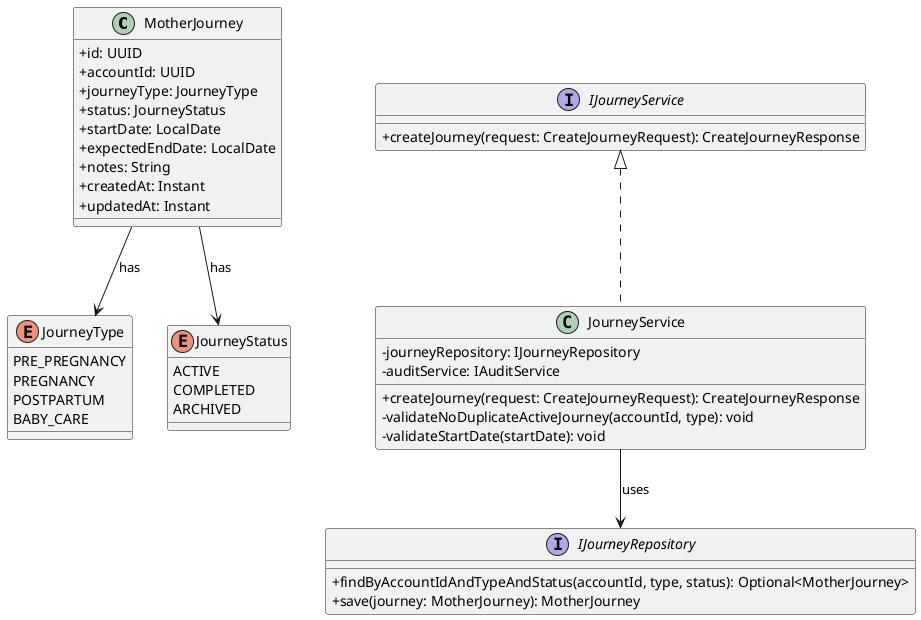
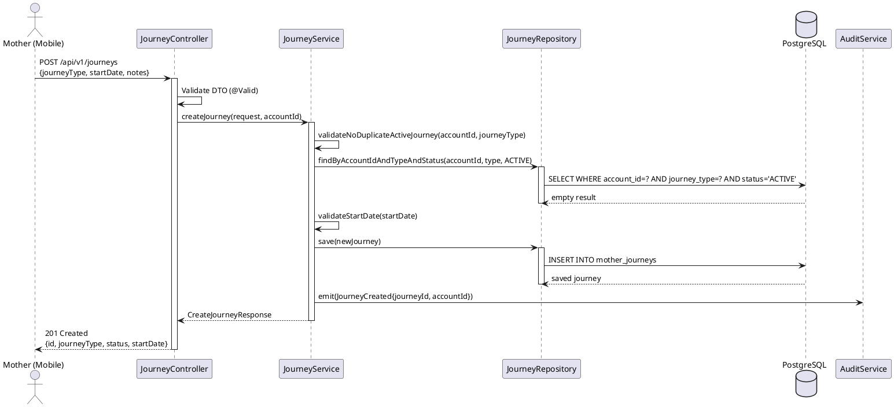
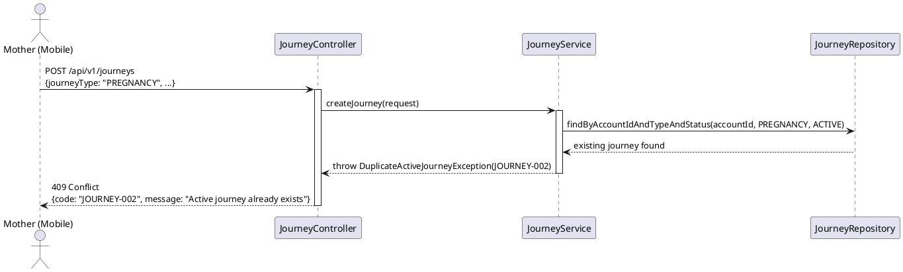
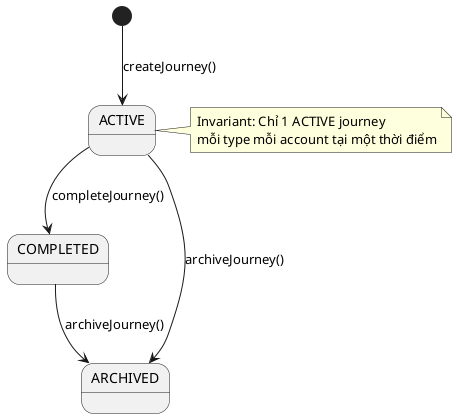

# ENGINEERING DOCUMENTATION STANDARD (EDS) v2.0
# Technical Design Specification — UC-22 Create Mother Journey

| Field | Value |
|-------|-------|
| **Document ID** | `CB-JOURNEY-IMP-001` |
| **Version** | `1.0` |
| **Date** | `2026-06-26` |
| **Status** | `Approved` |
| **Document Owner** | `PhuongNT` |
| **Author** | `AI Agent` |
| **Reviewed by** | `[Tech Lead]` |
| **DPO Sign-off** | `[ ] Pending` |
| **Approved by** | `[Principal Architect]` |
| **Last Review** | `2026-06-26` |
| **Based on EDS** | `v2.0` |

---

## CHANGELOG

| Ngày | Người thực hiện | Nội dung thay đổi |
|------|-----------------|-------------------|
| 2026-06-27 | AI Agent — Amelia (Dev Agent) | Implementation completed — service, controller, tests 🟢 GREEN (45/45) |
| 2026-06-26 | AI Agent | Tạo tài liệu lần đầu cho UC-22 Create Mother Journey |

---

## MỤC LỤC

1. [Tổng quan Module](#1-tổng-quan-module)
2. [Ma trận Truy vết](#2-ma-trận-truy-vết-traceability-matrix)
3. [Architecture Decision Records](#3-architecture-decision-records-adr)
4. [Non-Functional Requirements & SLA](#4-non-functional-requirements--sla)
5. [Static Modeling](#5-static-modeling-mô-hình-tĩnh)
6. [Dynamic Modeling](#6-dynamic-modeling-mô-hình-động)
7. [Domain Event Catalog](#7-domain-event-catalog)
8. [Interface Specification](#8-interface-specification-đặc-tả-giao-diện)
9. [API Specification](#9-api-specification)
10. [Bảng mã lỗi](#10-bảng-mã-lỗi-error-codes)
11. [Quy trình Triển khai](#11-quy-trình-triển-khai-step-by-step)
12. [Rollback & Incident Runbook](#12-rollback--incident-runbook)
13. [Kịch bản Kiểm thử Chi tiết](#13-kịch-bản-kiểm-thử-chi-tiết)
14. [Phương pháp Xác minh](#14-phương-pháp-xác-minh)
15. [Mẫu thử thực tế](#15-mẫu-thử-thực-tế-api-verification-samples)
16. [Bảng tổng hợp phân quyền](#16-bảng-tổng-hợp-phân-quyền-authorization-matrix)
17. [AI Prompt Constraints](#17-ai-prompt-constraints-case-20)

---

## 1. Tổng quan Module

| Field | Value |
|-------|-------|
| **Module Name** | `CreateMotherJourney` |
| **Bounded Context** | `journey` |
| **UC ID** | `UC-22` |
| **SRS Reference** | `3.3.1.1` |
| **Primary Actor** | `Mother (ROLE_MOTHER — authenticated)` |
| **Platform** | `Mobile App` |
| **Data Classification** | `Sensitive-PII` |
| **Compliance Scope** | `BR-RBAC, BR-PRIVACY, PDPA` |
| **Upstream Dependencies** | `auth (JWT validation), profile (accountId lookup)` |
| **Downstream Consumers** | `notification (reminder triggers), audit (SecurityEventLog), journey dashboard` |

**Mô tả:** Cho phép Mother đã xác thực tạo một hành trình chăm sóc (pre-pregnancy, pregnancy, postpartum, hoặc baby-care). Hệ thống kiểm tra xem Mother đã có hành trình ACTIVE cùng loại chưa, rồi lưu journey mới với trạng thái `ACTIVE`. Mỗi Mother chỉ được có một journey ACTIVE mỗi lúc cho mỗi loại.

---

## 2. Ma trận Truy vết (Traceability Matrix)

| Requirement ID | Loại | Mô tả yêu cầu | Thành phần Code | Compliance Target | ADR liên quan |
|----------------|------|---------------|-----------------|-------------------|---------------|
| UC-22 | Use Case | Mother tạo hành trình chăm sóc | `JourneyController.createJourney()` | BR-RBAC | ADR-JOURNEY-001 |
| BR-JOURNEY-001 | Business Rule | Mỗi Mother chỉ có 1 journey ACTIVE mỗi loại | `JourneyService.validateNoDuplicateActiveJourney()` | Data Integrity | ADR-JOURNEY-001 |
| BR-JOURNEY-002 | Business Rule | journeyType phải thuộc enum hợp lệ (PRE_PREGNANCY, PREGNANCY, POSTPARTUM, BABY_CARE) | `@ValidJourneyType` trên DTO | BR-RBAC | — |
| BR-JOURNEY-003 | Business Rule | startDate không được ở tương lai > 7 ngày | `JourneyService.validateStartDate()` | Data Integrity | — |
| BR-JOURNEY-004 | Business Rule | Ghi audit event sau khi tạo thành công | `AuditService.emit(JourneyCreated)` | PDPA | ADR-JOURNEY-002 |
| BR-PRIVACY-001 | Business Rule | Dữ liệu journey thuộc về Mother — không chia sẻ nếu chưa consent | `@PreAuthorize owner check` | PDPA | ADR-JOURNEY-001 |

---

## 3. Architecture Decision Records (ADR)

### ADR-JOURNEY-001 — Một Mother chỉ có một Active Journey mỗi loại

| Field | Value |
|-------|-------|
| **Status** | `Accepted` |
| **Deciders** | `AI Agent, Tech Lead` |
| **Date** | `2026-06-26` |

#### Bối cảnh
Mother cần theo dõi từng giai đoạn riêng biệt. Cho phép nhiều journey ACTIVE cùng lúc sẽ gây xung đột dashboard và reminder logic.

#### Quyết định
Một Mother chỉ được có **1 journey ACTIVE** cho mỗi `journeyType` tại bất kỳ thời điểm nào. Khi tạo mới, service phải kiểm tra tính duy nhất này.

#### Hệ quả
**Tích cực:** Dashboard luôn có context rõ ràng; reminder có thể target đúng giai đoạn.
**Tiêu cực:** Mother muốn song song theo dõi phải archive journey cũ trước.

### ADR-JOURNEY-002 — Audit Event bắt buộc cho thao tác tạo journey

| Field | Value |
|-------|-------|
| **Status** | `Accepted` |
| **Deciders** | `AI Agent` |
| **Date** | `2026-06-26` |

#### Quyết định
Mọi thao tác CREATE journey phải emit `JourneyCreated` event vào audit log (synchronous, không async), ghi rõ `actorId`, `journeyId`, `journeyType`, `occurredAt`.

---

## 4. Non-Functional Requirements & SLA

### 4.1. Performance & Availability

| Category | Requirement | Target SLA | Measurement Method |
|----------|-------------|------------|---------------------|
| Latency | API response (p99) | `< 300ms` | k6 load test |
| Availability | Uptime (monthly) | `99.9%` | Uptime monitor |
| Throughput | Concurrent requests | `200 req/s` | Load test |

### 4.2. Data Integrity & Retention

| Category | Requirement | Target | Compliance Basis |
|----------|-------------|--------|------------------|
| Durability | Zero record loss | RPO = 0 | PDPA |
| Retention | Audit log retention | 7 năm | PDPA |
| Consistency | Journey ↔ Audit sync | 100% | BR-PRIVACY |

### 4.3. Security

| Category | Requirement | Target | Compliance Basis |
|----------|-------------|--------|------------------|
| Encryption at rest | PII fields | AES-256 | PDPA Art. 32 |
| Encryption in transit | All endpoints | TLS 1.3+ | PDPA |
| Access control | ROLE_MOTHER only | Least privilege | BR-RBAC |

---

## 5. Static Modeling (Mô hình Tĩnh)

### 5.1. Class Diagram (PlantUML)



### 5.2. Data Structure (Flyway SQL Migration)

```sql
-- V20__create_mother_journey.sql
CREATE TYPE journey_type AS ENUM ('PRE_PREGNANCY', 'PREGNANCY', 'POSTPARTUM', 'BABY_CARE');
CREATE TYPE journey_status AS ENUM ('ACTIVE', 'COMPLETED', 'ARCHIVED');

CREATE TABLE mother_journeys (
  id                UUID          PRIMARY KEY DEFAULT gen_random_uuid(),
  account_id        UUID          NOT NULL,                        -- FK to accounts
  journey_type      journey_type  NOT NULL,
  status            journey_status NOT NULL DEFAULT 'ACTIVE',
  start_date        DATE          NOT NULL,
  expected_end_date DATE,                                          -- nullable cho PRE_PREGNANCY
  notes             TEXT,
  created_at        TIMESTAMPTZ   NOT NULL DEFAULT NOW(),
  updated_at        TIMESTAMPTZ   NOT NULL DEFAULT NOW(),
  created_by        UUID          NOT NULL,

  CONSTRAINT fk_journey_account FOREIGN KEY (account_id) REFERENCES accounts(id),
  CONSTRAINT uq_journey_active_type UNIQUE (account_id, journey_type, status)
    DEFERRABLE INITIALLY DEFERRED
);

CREATE INDEX idx_journey_account_id ON mother_journeys(account_id);
CREATE INDEX idx_journey_status ON mother_journeys(status);
```

---

## 6. Dynamic Modeling (Mô hình Động)

### 6.1. Sequence Diagram — Happy Path



### 6.2. Sequence Diagram — Error Path (Duplicate Active Journey)



### 6.3. State Machine — Journey Status



---

## 7. Domain Event Catalog

### 7.1. Events Published

| Event Name | Trigger | Publisher | Subscriber(s) | Async? |
|------------|---------|-----------|---------------|--------|
| `JourneyCreated` | Journey được tạo thành công | `JourneyService` | `AuditService, NotificationService` | No |

### 7.2. Events Consumed

| Event Name | Source | Handler | Action |
|------------|--------|---------|--------|
| — | — | — | — |

### 7.3. Payload Schema

```java
public record JourneyCreated(
    UUID    eventId,
    String  eventType,    // "JourneyCreated"
    Instant occurredAt,
    String  version,      // "1.0"
    Payload payload,
    Metadata metadata
) {
    public record Payload(UUID journeyId, UUID accountId, String journeyType, String status) {}
    public record Metadata(UUID correlationId, String causedBy) {}
}
```

---

## 8. Interface Specification

### 8.1. Service Interface

```java
// CreateJourneyRequest.java
public class CreateJourneyRequest {
    @NotNull
    private JourneyType journeyType;

    @NotNull
    @PastOrPresent
    private LocalDate startDate;

    @FutureOrPresent
    private LocalDate expectedEndDate; // optional

    @Size(max = 1000)
    private String notes; // optional
}

// CreateJourneyResponse.java
public class CreateJourneyResponse {
    private UUID id;
    private String journeyType;
    private String status;
    private LocalDate startDate;
    private LocalDate expectedEndDate;
    private Instant createdAt;
}

// IJourneyService.java
public interface IJourneyService {
    /**
     * Creates a new mother journey for the authenticated account.
     * @throws DuplicateActiveJourneyException (JOURNEY-002) when account already has ACTIVE journey of same type
     * @throws InvalidStartDateException (JOURNEY-001) when startDate is in future > 7 days
     */
    CreateJourneyResponse createJourney(CreateJourneyRequest request, UUID accountId);
}
```

### 8.2. Repository Interface

```java
// IJourneyRepository.java
public interface IJourneyRepository extends JpaRepository<MotherJourney, UUID> {
    Optional<MotherJourney> findByAccountIdAndJourneyTypeAndStatus(
        UUID accountId, JourneyType type, JourneyStatus status);
    List<MotherJourney> findByAccountId(UUID accountId);
}
```

---

## 9. API Specification

### 9.1. Endpoints Table

| Method | Path | Auth Level | Required Roles | Rate Limit | Idempotent? |
|--------|------|------------|----------------|------------|-------------|
| `POST` | `/api/v1/journeys` | JWT Bearer | `ROLE_MOTHER` | 20/min | No |

### 9.2. Request / Response Schemas

#### `POST /api/v1/journeys`

**Request Body:**
```json
{
  "journeyType": "PREGNANCY",
  "startDate": "2026-06-01",
  "expectedEndDate": "2027-03-01",
  "notes": "First pregnancy"
}
```

**Response — 201 Created:**
```json
{
  "id": "uuid-v4",
  "journeyType": "PREGNANCY",
  "status": "ACTIVE",
  "startDate": "2026-06-01",
  "expectedEndDate": "2027-03-01",
  "createdAt": "2026-06-26T00:00:00.000Z"
}
```

**Response — 409 Conflict:**
```json
{
  "error": {
    "code": "JOURNEY-002",
    "message": "An active PREGNANCY journey already exists"
  }
}
```

---

## 10. Bảng mã lỗi (Error Codes)

| Code | HTTP Status | Message (EN) | Message (VI) | Trigger Condition |
|------|-------------|--------------|--------------|-------------------|
| `JOURNEY-001` | 400 | Validation failed | Dữ liệu không hợp lệ | Missing required fields or invalid enum |
| `JOURNEY-002` | 409 | Active journey already exists | Hành trình đang hoạt động đã tồn tại | Duplicate active journey same type |
| `JOURNEY-003` | 400 | Invalid start date | Ngày bắt đầu không hợp lệ | startDate > today + 7 days |
| `JOURNEY-004` | 403 | Insufficient permissions | Không đủ quyền | Non-MOTHER role |
| `JOURNEY-005` | 500 | Internal error | Lỗi hệ thống | Unexpected DB error |

---

## 11. Quy trình Triển khai (Step-by-Step)

### 11.1. Prerequisites

- [ ] ADR-JOURNEY-001 và ADR-JOURNEY-002 đã được Accepted
- [ ] DPO đã sign-off (module xử lý Sensitive-PII)
- [ ] Blueprint đã được Principal Architect approve
- [ ] Staging environment sẵn sàng

### 11.2. Pre-Migration Checklist

- [ ] Backup DB: `pg_dump carebridge > backup_20260626.sql`
- [ ] Migration đã chạy thành công trên staging ≥ 24 giờ
- [ ] Rollback script đã test trên staging

### 11.3. Implementation Steps

#### Chặng 1 — Flyway migration
```bash
./mvnw flyway:migrate
# Verify: SELECT COUNT(*) FROM mother_journeys; -- expected: 0
```

#### Chặng 2 — Entity, Repository, Service, Controller
Implement theo thứ tự: Entity → Repository Interface → Service → Controller → DTO/Mapper.

#### Chặng 3 — Verification sau deploy
```bash
curl -X GET https://[host]/api/v1/health
# Expected: {"status": "ok"}
```

### 11.4. Deployment Checklist

- [ ] Migration thành công
- [ ] Health check 200
- [ ] Error rate < 1% trong 10 phút đầu
- [ ] Audit log sinh đúng format

---

## 12. Rollback & Incident Runbook

### 12.1. Trigger Conditions

| Điều kiện | Ngưỡng | Người quyết định |
|-----------|--------|------------------|
| Error rate tăng đột biến | > 5% trong 5 phút | On-call Engineer |
| Duplicate constraint violation | Bất kỳ case nào | Tech Lead |

### 12.2. Rollback Procedure

```bash
psql -h $DB_HOST -U $DB_USER -d $DB_NAME \
  -c "DROP TABLE IF EXISTS mother_journeys CASCADE;"
psql -h $DB_HOST -U $DB_USER -d $DB_NAME \
  -c "DROP TYPE IF EXISTS journey_type CASCADE;"
psql -h $DB_HOST -U $DB_USER -d $DB_NAME \
  -c "DROP TYPE IF EXISTS journey_status CASCADE;"
psql -h $DB_HOST -U $DB_USER -d $DB_NAME \
  -c "DELETE FROM flyway_schema_history WHERE version = '20';"
kubectl rollout undo deployment/carebridge-api
```

---

## 13. Kịch bản Kiểm thử Chi tiết

### 13.1. Unit Tests

```gherkin
Feature: Create Mother Journey
  Background:
    Given test data classification: SYNTHETIC
    And Mother is authenticated with valid JWT

  Scenario: Happy path — create PREGNANCY journey
    Given no existing ACTIVE PREGNANCY journey for account
    When POST /api/v1/journeys with {journeyType: "PREGNANCY", startDate: "2026-06-01"}
    Then response status 201
    And response body contains {status: "ACTIVE", journeyType: "PREGNANCY"}
    And database contains 1 journey record for account

  Scenario: Duplicate active journey → 409
    Given existing ACTIVE PREGNANCY journey for account
    When POST /api/v1/journeys with {journeyType: "PREGNANCY"}
    Then response status 409
    And error code is "JOURNEY-002"

  Scenario: Missing journeyType → 400
    When POST /api/v1/journeys with {}
    Then response status 400
    And error code is "JOURNEY-001"
```

### 13.2. Integration Tests

```gherkin
  Scenario: Full DB persistence after create
    Given test data classification: SYNTHETIC
    And PostgreSQL container running
    When JourneyService.createJourney() called
    Then mother_journeys table contains new row
    And status = 'ACTIVE'
    And audit log contains JourneyCreated event
```

### 13.3. Security Tests

```gherkin
  Scenario: EXPERT role cannot create journey
    Given user with ROLE_EXPERT authenticated
    When POST /api/v1/journeys
    Then response status 403
    And error code "JOURNEY-004"

  Scenario: Unauthenticated request
    Given no JWT token
    When POST /api/v1/journeys
    Then response status 401
```

---

## 14. Phương pháp Xác minh

```sql
SELECT id, account_id, journey_type, status, start_date, created_at
FROM mother_journeys
WHERE account_id = '[uuid]';

SELECT * FROM audit_logs
WHERE entity_type = 'MotherJourney' AND event_type = 'JourneyCreated'
ORDER BY occurred_at DESC LIMIT 5;
```

---

## 15. Mẫu thử thực tế (API Verification Samples)

```bash
# Happy path
curl -X POST https://[host]/api/v1/journeys \
  -H "Authorization: Bearer [JWT_MOTHER_TOKEN]" \
  -H "Content-Type: application/json" \
  -H "X-Correlation-Id: $(uuidgen)" \
  -d '{"journeyType":"PREGNANCY","startDate":"2026-06-01"}'
# Expected: 201 {id, journeyType, status: "ACTIVE"}

# Duplicate → 409
curl -X POST https://[host]/api/v1/journeys \
  -H "Authorization: Bearer [JWT_MOTHER_TOKEN]" \
  -H "Content-Type: application/json" \
  -d '{"journeyType":"PREGNANCY","startDate":"2026-06-01"}'
# Expected: 409 {error.code: "JOURNEY-002"}
```

---

## 16. Bảng tổng hợp phân quyền (Authorization Matrix)

| Endpoint | `GUEST` | `MOTHER` | `EXPERT` | `ADMIN` | `SYSTEM` |
|----------|---------|----------|----------|---------|----------|
| `POST /api/v1/journeys` | ❌ | ✅ Own | ❌ | ✅ All | ✅ All |
| `GET /api/v1/journeys` | ❌ | ✅ Own | ❌ | ✅ All | ✅ All |

---

## 17. AI Prompt Constraints (CASE 2.0)

### 17.1 Constraint Summary Table

| # | Constraint | Source | Last Verified |
|---|-----------|--------|---------------|
| C1 | `JourneyService` PHẢI kiểm tra duplicate active journey trước khi INSERT | ADR-JOURNEY-001 | 2026-06-26 |
| C2 | Controller KHÔNG được chứa business logic — chỉ validate + map | CLAUDE.md | 2026-06-26 |
| C3 | Emit `JourneyCreated` audit event sau mỗi successful create | ADR-JOURNEY-002 | 2026-06-26 |
| C4 | accountId lấy từ JWT SecurityContext — KHÔNG từ request body | BR-RBAC | 2026-06-26 |
| C5 | Chỉ ROLE_MOTHER được gọi endpoint này | BR-RBAC | 2026-06-26 |

### 17.2 Constraint Injection Block

```
[CONSTRAINT BLOCK — Module: CreateMotherJourney]
Theo TDS CB-JOURNEY-IMP-001:

1. JourneyService.createJourney() PHẢI gọi validateNoDuplicateActiveJourney() trước save()
2. Controller chỉ được validate DTO và map — business logic thuộc về Service
3. Sau khi save thành công, PHẢI emit JourneyCreated event qua AuditService
4. accountId phải được lấy từ Spring SecurityContext (JWT claim), không từ request body
5. Endpoint được bảo vệ bởi @PreAuthorize("hasRole('MOTHER')")

[CONTEXT BLOCK]
- Bounded Context: journey
- Data Classification: Sensitive-PII
- Error codes: §10 Error Codes Table
- Auth matrix: §16 Authorization Matrix
```

### 17.3 Constraint Quality Checklist

- [x] Mỗi constraint traceable về ADR hoặc BR cụ thể
- [x] Không có constraint generic
- [x] Constraint block có ≥ 3 constraints cụ thể

### 17.4 Anti-Pattern Detection

| AP-ID | Anti-Pattern | Dấu hiệu | Hành động |
|-------|-------------|-----------|----------|
| AP-AI-001 | Unconstrained Gen | Code không match constraint C1-C5 | Reject — inject lại constraints |
| AP-AI-003 | Implicit Decision | Code assume architecture không có ADR | Reject — viết ADR trước |
| AP-AI-005 | Hallucinated Contract | Code import không có trong §8 | Reject — verify contract |

---

## PHỤ LỤC

### A. Glossary (Thuật ngữ)

| Thuật ngữ | Định nghĩa |
|-----------|------------|
| MotherJourney | Hành trình thai kỳ/chăm sóc bé của người mẹ — mỗi tài khoản chỉ có 1 active journey mỗi loại |
| JourneyType | Loại hành trình (PREGNANCY, POSTPARTUM, BABY_CARE) |
| JourneyStatus | Trạng thái hành trình (ACTIVE, COMPLETED, CANCELLED) |

### B. Tài liệu tham chiếu

| Document | Path |
|----------|------|
| EDS v2.0 Template | `08_References/Template/PHASE-3_TDS.md` |

---

*EDS v2.1 — Tích hợp CASE 2.0 AI Prompt Constraints (§17).*
