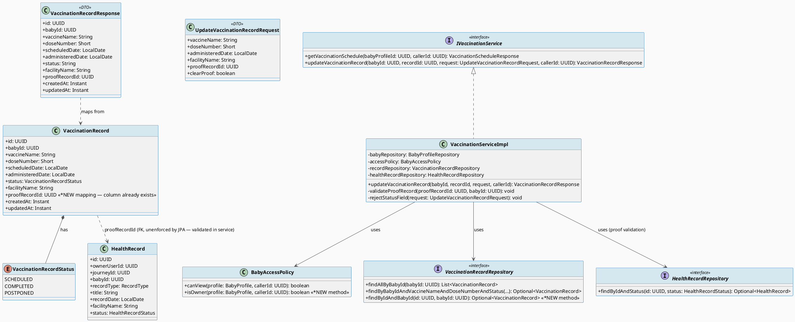
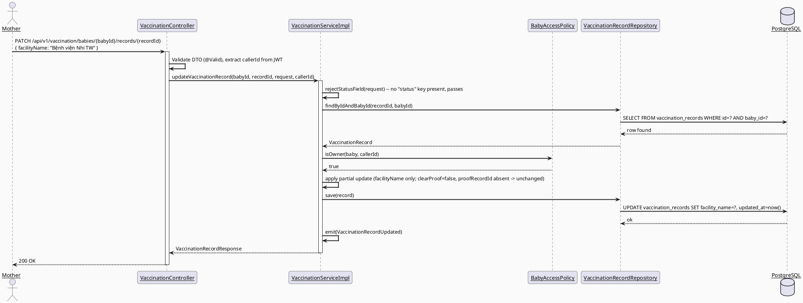
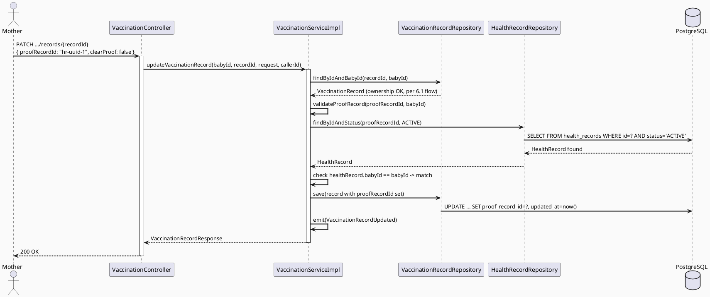
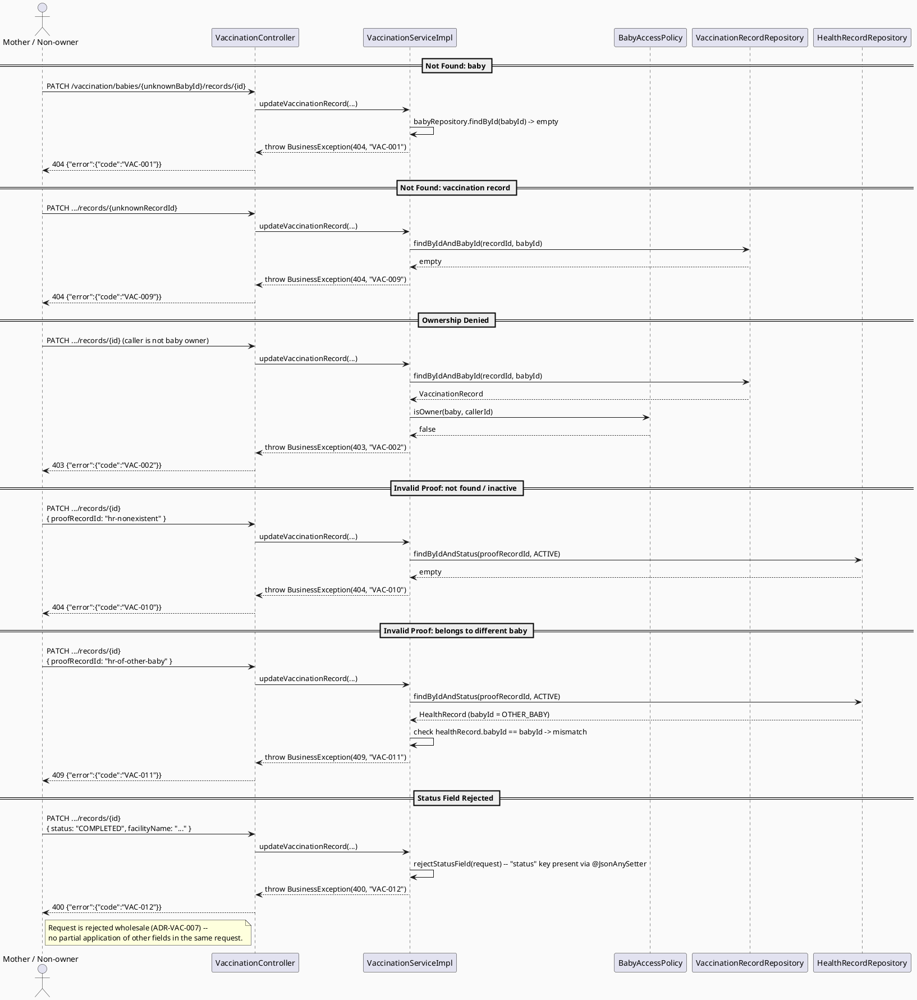

# ENGINEERING DOCUMENTATION STANDARD (EDS) v2.0
# UC-230 — Update Vaccination Record — Technical Design Specification

| Field | Value |
|-------|-------|
| **Document ID** | `CB-VAC-IMP-003` |
| **Version** | `1.0` |
| **Date** | `2026-07-03` |
| **Status** | `Draft` |
| **Document Owner** | `PhuongNT` |
| **Author** | `AI Agent — Technical Architect` |
| **Reviewed by** | `[Tech Lead — Pending]` |
| **DPO Sign-off** | `[ ] Pending` *(module handles child health data — `vaccine_name`, `administered_date`, `facility_name` are Sensitive-PII per UC-228's classification)* |
| **Approved by** | `[Principal Architect — Pending]` |
| **Last Review** | `2026-07-03` |
| **Based on EDS** | `v2.0` |

---

## CHANGELOG

> **Policy 4.4 — Immutable History:** Không bao giờ xóa thông tin cũ. Mọi thay đổi phải ghi vào bảng này.

| Ngày | Người thực hiện | Nội dung thay đổi |
|------|-----------------|-------------------|
| 2026-07-03 | AI Agent — Technical Architect | Tạo tài liệu lần đầu — TDS cho UC-230 Update Vaccination Record |

---

## MỤC LỤC

1. [Tổng quan Module](#1-tổng-quan-module)
2. [Ma trận Truy vết (Traceability Matrix)](#2-ma-trận-truy-vết-traceability-matrix)
3. [Architecture Decision Records (ADR)](#3-architecture-decision-records-adr)
4. [Non-Functional Requirements & SLA](#4-non-functional-requirements--sla)
5. [Static Modeling (Mô hình Tĩnh)](#5-static-modeling-mô-hình-tĩnh)
6. [Dynamic Modeling (Mô hình Động)](#6-dynamic-modeling-mô-hình-động)
7. [Domain Event Catalog](#7-domain-event-catalog)
8. [Interface Specification (Đặc tả Giao diện)](#8-interface-specification-đặc-tả-giao-diện)
9. [API Specification](#9-api-specification)
10. [Bảng mã lỗi (Error Codes)](#10-bảng-mã-lỗi-error-codes)
11. [Quy trình Triển khai (Step-by-Step)](#11-quy-trình-triển-khai-step-by-step)
12. [Rollback & Incident Runbook](#12-rollback--incident-runbook)
13. [Kịch bản Kiểm thử Chi tiết](#13-kịch-bản-kiểm-thử-chi-tiết)
14. [Phương pháp Xác minh](#14-phương-pháp-xác-minh)
15. [Mẫu thử thực tế (API Verification Samples)](#15-mẫu-thử-thực-tế-api-verification-samples)
16. [Bảng tổng hợp phân quyền (Authorization Matrix)](#16-bảng-tổng-hợp-phân-quyền-authorization-matrix)
17. [AI Prompt Constraints (CASE 2.0)](#17-ai-prompt-constraints-case-20)

---

## 1. Tổng quan Module

UC-230 "Update Vaccination Record" lets the Mother edit a vaccination record **she previously
entered** (via UC-229 Add Vaccination Record) — correcting `vaccineName`, `doseNumber`,
`administeredDate`, `facilityName`, and the optional proof-file link (`proofRecordId`). Per SRS
§3.3.19.3 (Table 252), the Description is explicitly **"Updates a Mother-entered vaccination
record"** — this UC does **not** apply to the auto-generated `SCHEDULED`/`OVERDUE` catalog entries
that `VaccinationServiceImpl.getVaccinationSchedule()` synthesizes at query time by merging
`vaccination_reference_schedules` with `baby.birthDate` (see §3 ADR-VAC-004 for the code evidence
of this merge and why those virtual entries have no persisted `VaccinationRecord` row — and
therefore no `id` an Update request could even reference).

This is a **content-only mutation**, mirroring the exact scope split already established in this
project's family-task batch: **UC-222 Update Family Task** (content: title/description/due
date/assignee) is deliberately separated from **UC-85 Update Assigned Task Status** / **UC-223
Cancel Family Task** (lifecycle transitions). UC-230 follows the identical separation-of-concerns
principle: this endpoint **never** changes `VaccinationRecordStatus` — that belongs to **UC-232
Mark Vaccination Completed** and **UC-233 Postpone Vaccination**.

### ⚠️ Divergence from UC-228's documented (but stale) design

`04_Implement/UC228_ViewVaccinationSchedule/UC228_ViewVaccinationSchedule_TDS.md` (Status:
`Approved`) documents a schema/entity shape that **does not match what shipped**:

| UC-228 doc says | Real code (`05_Development/CareBridgeAPI/.../vaccination/`) |
|---|---|
| Migration `V27__create_vaccination_tables.sql`, separate `vac_record_status` PG enum with only `{COMPLETED, POSTPONED}` | Real schema lives in `V1__init_schema.sql` (lines 660-672); `status` is a plain `varchar(20)` column, no PG enum type; Java-side `VaccinationRecordStatus` enum is `{SCHEDULED, COMPLETED, POSTPONED}` (3 values, includes `SCHEDULED`) |
| `VaccinationRecord` fields: `babyProfileId`, `referenceScheduleId` (FK), `facility`, `notes`, `proofFileId` | Real entity fields: `babyId`, no `referenceScheduleId` FK at all (merge is done in-memory by string key `vaccineName\|doseNumber`, not FK), `facilityName` (not `facility`), no `notes` column, `proof_record_id` column exists in DB but is **not yet mapped** in `VaccinationRecord.java` |
| Endpoint path `GET /api/v1/baby-profiles/{babyId}/vaccination-schedule` | Real path: `GET /api/v1/vaccination/babies/{babyId}/schedule` |
| Error codes table stops at `VAC-003` | Real code only defines `VAC-001`/`VAC-002`; no `VAC-003` exists in `VaccinationServiceImpl` |

**Conclusion for this TDS:** all static/dynamic modeling, interfaces, and API spec below are
modeled against the **real, shipped code** — not UC-228's document. See ADR-VAC-004 for the formal
record of this deviation and schema-authority ruling.

| Field | Value |
|-------|-------|
| **Module Name** | `UpdateVaccinationRecord` |
| **Bounded Context** | `vaccination` (package `com.carebridge.backend.vaccination`) |
| **UC ID** | `UC-230` (SRS §3.3.19.3, Table 252) |
| **Primary Actor** | `Mother` |
| **Secondary Actors** | `None` (per SRS) |
| **Platform** | Mobile App (CB-173 Vaccination Detail — shared screen for UC-228/230/231/232/233) |
| **Data Classification** | `Sensitive-PII` (child vaccination/health data) |
| **Compliance Scope** | `BR-RBAC`, `BR-PRIVACY`, `PDPA` (per SRS §3.3.19.3 — note: **no BR-SAFETY** cited for this UC, unlike UC-229, since Update does not introduce new medical content, only corrects existing Mother-entered data) |
| **Upstream Dependencies** | `vaccination` module (`VaccinationRecord`, `VaccinationRecordRepository`), `baby` module (`BabyProfile`, `BabyProfileRepository`, `BabyAccessPolicy`), `health` module (`HealthRecord`, `HealthRecordRepository` — for proof-file validation), `common` (`ApiResponse`, `BusinessException`, `SecurityUtils`) |
| **Downstream Consumers** | CB-173 Vaccination Detail screen (re-fetches `GET .../schedule` after update); UC-228 View Schedule (reflects corrected data on next read) |

### Scope

**IN SCOPE:**
- Updating an existing, persisted `vaccination_records` row's content fields: `vaccineName`,
  `doseNumber`, `administeredDate`, `facilityName`, `proofRecordId` (nullable — can be set, changed,
  or cleared).
- Ownership check: only the baby profile's owner (Mother) may update (ADR-VAC-005).
- Proof-file validation reusing the same "must reference an existing health record owned by the
  same baby" rule as UC-229 (ADR-VAC-006).
- Explicit rejection of any attempt to change `status` via this endpoint (ADR-VAC-007).
- Domain event `VaccinationRecordUpdated`.

**OUT OF SCOPE (explicitly deferred / belongs elsewhere):**
- Creating a new vaccination record (UC-229).
- Deleting a vaccination record (UC-231).
- Changing `status` to `COMPLETED` (UC-232) or `POSTPONED` (UC-233) — status is immutable via this
  endpoint (ADR-VAC-007).
- Updating the virtual `SCHEDULED`/`OVERDUE` catalog entries synthesized by
  `getVaccinationSchedule()` — these have no `VaccinationRecord.id` to address (ADR-VAC-004).
- Any Flyway schema change — `proof_record_id` column and its FK to `health_records` **already
  exist** in `V1__init_schema.sql` (lines 669, 1734); only the JPA entity mapping is new code, not a
  new migration (ADR-VAC-004).
- Care-group-member write access — only the owner may update (ADR-VAC-005), narrower than
  `BabyAccessPolicy.canView()`'s owner-OR-care-member read scope.

---

## 2. Ma trận Truy vết (Traceability Matrix)

| Requirement ID | Loại (BR/ADR/US) | Mô tả yêu cầu | Thành phần Code | Compliance Target | ADR liên quan |
|----------------|------------------|---------------|-----------------|-------------------|---------------|
| SRS §3.3.19.3 (UC-230) | User Story | "Updates a Mother-entered vaccination record" | `VaccinationController.updateVaccinationRecord()`, `VaccinationServiceImpl.updateVaccinationRecord()` | — | ADR-VAC-004/005/006/007 |
| BR-RBAC | Business Rule | Users may access only functions allowed by their role/permission scope | Owner-only check in `VaccinationServiceImpl` (VAC-002) | PDPA minimum-necessary access | ADR-VAC-005 |
| BR-PRIVACY | Business Rule | Health/family data follows consent, purpose, minimum-necessary access | Proof-record cross-baby validation (VAC-011); DTO mapping (no raw entity exposure) | PDPA | ADR-VAC-006 |
| PRE-4 | Precondition | Required reference data exists (record + baby + proof health record) | `VaccinationRecordRepository.findByIdAndBabyId`, `HealthRecordRepository.findByIdAndStatus` | — | ADR-VAC-006 |
| E2 | Exception | Invalid/missing/conflicting data rejected with field/action-level message | `VaccinationServiceImpl` validation → `VAC-009..012` | — | ADR-VAC-006/007 |
| Description ("Mother-entered") | Constraint | Update only applies to persisted rows, not the virtual reference-schedule merge | `VaccinationRecordRepository.findByIdAndBabyId` (real row lookup) | — | ADR-VAC-004 |
| POST-1/2/3 | Postcondition | Operation completed; related records updated; sensitive action audited | `VaccinationRecordUpdated` event, audit log entry | PDPA | ADR-VAC-008 |
| ADR-VAC-001 | Decision (reused, UC-228) | Schedule derived from reference data + birthDate at query time | `VaccinationServiceImpl.getVaccinationSchedule()` (unchanged by this UC) | — | ADR-VAC-004 |
| ADR-VAC-004 | Decision | Schema-authority ruling: real code/migration over UC-228's stale doc | `V1__init_schema.sql`, `VaccinationRecord.java` | — | — |
| ADR-VAC-005 | Decision | Authorization = owner-only (narrower than `canView()`) | `BabyAccessPolicy.isOwner()` (new method) | BR-RBAC | — |
| ADR-VAC-006 | Decision | Proof-record validation: must exist, must be `ACTIVE`, must belong to same baby | `VaccinationServiceImpl.validateProofRecord()` | BR-PRIVACY | — |
| ADR-VAC-007 | Decision | `status` field immutable via this endpoint — rejected, not silently ignored | `UpdateVaccinationRecordRequest` (no `status` field), explicit check | — | — |
| ADR-VAC-008 | Decision | Partial-update semantics: null = no change; `proofRecordId` clearing needs explicit flag | `UpdateVaccinationRecordRequest.clearProof` | — | — |

---

## 3. Architecture Decision Records (ADR)

> This UC **reuses** ADR-VAC-001 (schedule derivation, UC-228) without redefining it, and reuses
> the proof-record validation concept confirmed for UC-229 (folder
> `04_Implement/UC229_AddVaccinationRecord/` was **empty** at authoring time — sibling not yet
> drafted — so ADR-VAC-006 below defines this validation independently and flags it as a
> coordination point for UC-229 to align with). ADR-VAC-004 through ADR-VAC-008 are new decisions
> for UC-230.

### ADR-VAC-004 — Schema Authority: Real Code/Migration Over UC-228's Documented Design

| Field | Value |
|-------|-------|
| **Status** | `Accepted` |
| **Deciders** | `AI Agent — Technical Architect` (flagged for Tech Lead confirmation) |
| **Date** | `2026-07-03` |

#### Bối cảnh
UC-228's Approved TDS documents a `V27__create_vaccination_tables.sql` migration, a `vac_record_status`
Postgres enum limited to `{COMPLETED, POSTPONED}`, and entity fields (`babyProfileId`,
`referenceScheduleId`, `facility`, `notes`, `proofFileId`) that do not exist in the shipped code.
The real migration is `V1__init_schema.sql` (lines 660-672), the real Java enum
`VaccinationRecordStatus` has 3 values including `SCHEDULED` (`vaccination/entity/VaccinationRecordStatus.java`),
and the real entity (`vaccination/entity/VaccinationRecord.java`) uses `babyId`, `facilityName`, no
`referenceScheduleId` FK (merge is by string key `vaccineName|doseNumber` in
`VaccinationServiceImpl.getVaccinationSchedule()`, lines 54-58), and no `notes` field. UC-230 must
build on the shipped foundation, not the stale doc.

#### Các phương án đã xem xét

| Phương án | Mô tả | Ưu điểm | Nhược điểm |
|-----------|-------|----------|------------|
| A | Follow UC-228's documented schema; write a corrective migration to add `reference_schedule_id` FK, `notes`, rename `facility_name`→`facility` | Matches "approved" doc | Destructive rename/migration on a table already in production shape; contradicts CLAUDE.md "never modify applied migration"; no approval to alter shipped schema |
| B | Model UC-230 against the real, shipped `V1__init_schema.sql` + Java code; document the doc/reality gap as this ADR; do not touch existing migrations | Zero-risk; consistent with CareBridge rule "Current code and migrations override historical design notes" | UC-228's doc remains technically inaccurate until someone updates it (out of scope for this TDS) |

#### Quyết định
Chọn **Phương án B**. All of §5-§10 below model the real `VaccinationRecord` entity, the real
`VaccinationRecordStatus` enum, the real `V1__init_schema.sql` table, and the real endpoint prefix
`/api/v1/vaccination/babies/{babyId}/...`. No new Flyway migration is required for this UC's core
fields (all already exist); the only new persistence work is mapping the already-existing
`proof_record_id` column into the JPA entity (see ADR-VAC-006).

#### Hệ quả

**Tích cực:**
- Zero risk of breaking the already-running `V1__init_schema.sql` baseline.
- UC-230's code will actually compile against and interoperate with UC-228's shipped
  `VaccinationServiceImpl`.

**Tiêu cực / Trade-offs:**
- UC-228's TDS document remains stale; a follow-up doc-correction task is recommended but out of
  scope here.

**Compliance Impact:**
- None — no schema change, no new PII field beyond what UC-229 already introduces.

---

### ADR-VAC-005 — Authorization: Owner-Only (Narrower Than `BabyAccessPolicy.canView()`)

| Field | Value |
|-------|-------|
| **Status** | `Accepted` |
| **Deciders** | `AI Agent — Technical Architect` |
| **Date** | `2026-07-03` |

#### Bối cảnh
`BabyAccessPolicy.canView(BabyProfile, UUID callerId)` (existing, `baby/policy/BabyAccessPolicy.java`)
returns `true` for the baby's owner **OR** any `ACCEPTED` care-group member. That is correct for
UC-228's **read** path. UC-230 is a **write/mutation** path on a Mother's own health-record entry;
SRS Primary Actor is `Mother` only, and per BR-RBAC (least-privilege), care-group members
(e.g., Family/Partner roles) must not be able to edit vaccination data they did not enter.

#### Các phương án đã xem xét

| Phương án | Mô tả | Ưu điểm | Nhược điểm |
|-----------|-------|----------|------------|
| A | Reuse `accessPolicy.canView()` as-is for the update path | No new code | Grants write access to non-owner care-group members — violates least-privilege / SRS "Mother" actor |
| B | Add a new `BabyAccessPolicy.isOwner(BabyProfile, UUID callerId)` method (simple ownerUserId equality) and use it for the write path; keep `canView()` unchanged for reads | Minimal, additive change to an existing shared component; correct scope | One more method on a shared policy class |

#### Quyết định
Chọn **Phương án B**. Add `BabyAccessPolicy.isOwner()` (additive, non-breaking). UC-230's service
calls `isOwner()`, not `canView()`. Both use the same `VAC-002` (403) error code as UC-228 — no new
error code needed for this rejection.

#### Hệ quả

**Tích cực:**
- Correct, minimal-privilege authorization for a mutation endpoint.
- `BabyAccessPolicy` remains the single source of truth for baby-access rules (both read and write
  predicates colocated).

**Tiêu cực / Trade-offs:**
- ~~UC-229 (sibling, not yet drafted) must adopt the same `isOwner()` check for consistency — flagged
  as an Open coordination item since that TDS did not exist at authoring time.~~ **RESOLVED**: UC-229's
  TDS now exists (`04_Implement/UC229_AddVaccinationRecord/UC229_AddVaccinationRecord_TDS.md`,
  ADR-VAC-229-003) and has been updated to reuse this exact `isOwner()` method as the canonical
  owner-only write-guard for the batch, rather than its own previously-proposed `canOwn`.
  `04_Implement/UC231_DeleteVaccinationRecord/` (ADR-VAC-DELETE-002) independently reached the same
  owner-only conclusion (2-tier: `canView` then owner check). `isOwner()` as defined here is therefore
  the **canonical, single shared method** for owner-only write authorization across UC-229/230/231;
  UC-232/233 are being aligned to it as well (see their TDS Appendix C — canView vs canManage item).

**Compliance Impact:**
- Strengthens BR-RBAC compliance versus the read-path's broader grant.

---

### ADR-VAC-006 — Proof-Record Validation (Reused Design, Independently Specified)

| Field | Value |
|-------|-------|
| **Status** | `Accepted` |
| **Deciders** | `AI Agent — Technical Architect` |
| **Date** | `2026-07-03` |

#### Bối cảnh
The batch's confirmed decision: "proof-file support IS in scope... `proof_record_id` FK-to-
`health_records` mapping is being added (per UC-229's design)... Update feature should allow
changing/clearing the `proofRecordId` reference too (same validation... reuse UC-229's validation
design, don't reinvent)." At authoring time, `04_Implement/UC229_AddVaccinationRecord/` is **empty**
— UC-229's TDS does not yet exist to cite. This ADR therefore **independently specifies** the
validation rule from the confirmed decision text and the real schema, and flags itself for
reconciliation once UC-229's TDS lands.

`health_records` table (`V1__init_schema.sql` lines 679-693) has `owner_user_id` and `baby_id`
columns; `HealthRecord.java` maps `ownerUserId` and `babyId`; `HealthRecordStatus` supports a
soft-delete-style status (`HealthRecordRepository.findByIdAndStatus` already exists, implying
`ACTIVE` vs some inactive state).

#### Các phương án đã xem xét

| Phương án | Mô tả | Ưu điểm | Nhược điểm |
|-----------|-------|----------|------------|
| A | Validate only that `proofRecordId` exists in `health_records` (any owner/baby) | Simplest | Allows linking another family's/baby's health record — BR-PRIVACY violation |
| B | Validate `proofRecordId` exists, has `status = ACTIVE` (via `findByIdAndStatus`), **and** `healthRecord.getBabyId()` equals the vaccination record's `babyId` | Enforces "owned by the same baby" per the confirmed decision text | Requires baby_id to be populated on the health record (already NOT NULL-enforced by usage pattern, though DB column itself is nullable) |

#### Quyết định
Chọn **Phương án B**. `VaccinationServiceImpl` calls
`healthRecordRepository.findByIdAndStatus(proofRecordId, HealthRecordStatus.ACTIVE)`; if absent →
`VAC-010` (404). If present but `healthRecord.getBabyId()` does not equal the target `babyId` →
`VAC-011` (409, cross-baby reference rejected).

#### Hệ quả

**Tích cực:**
- Matches the confirmed decision text exactly ("must reference an existing health record owned by
  the same baby").
- Reuses an existing repository method (`findByIdAndStatus`) — no new repository code needed on the
  `health` module side.

**Tiêu cực / Trade-offs:**
- ~~Open / coordination risk: this validation was specified independently of UC-229...~~ **RESOLVED**:
  UC-229's TDS now exists and was reconciled against this ADR. UC-229's original proof-validation draft
  (ADR-VAC-229-004) called `healthRecordRepository.findById(...)` without a status filter; it has been
  updated to call `findByIdAndStatus(id, HealthRecordStatus.ACTIVE)` + `babyId` match — **identical**
  to this ADR's Option B. Both UC-229 and UC-230 now validate proof records the same way (must be
  `ACTIVE` and belong to the same `babyId`); no further reconciliation needed.

**Compliance Impact:**
- Prevents cross-family PII linkage (BR-PRIVACY).

---

### ADR-VAC-007 — `status` Is Immutable via This Endpoint (Rejected, Not Silently Ignored)

| Field | Value |
|-------|-------|
| **Status** | `Accepted` |
| **Deciders** | `AI Agent — Technical Architect` |
| **Date** | `2026-07-03` |
| **Supersedes** | — |

#### Bối cảnh
The prompt's firm decision: status transitions belong to UC-232/UC-233, mirroring the UC-222
(content) vs UC-85/UC-223 (status transition) split already established in this project
(`04_Implement/UC222_UpdateFamilyTask/UC222_UpdateFamilyTask_TDS.md`, ADR-FAM-074: "Content-only
mutation; `status` immutable in this UC"). UC-230 must decide the exact mechanics: does a client
request containing a `status` value get silently ignored (like UC-222's `null` = "no change"
pattern), or explicitly rejected?

#### Các phương án đã xem xét

| Phương án | Mô tả | Ưu điểm | Nhược điểm |
|-----------|-------|----------|------------|
| A | `UpdateVaccinationRecordRequest` has no `status` field at all; any `"status"` key in the raw JSON body is silently dropped by Jackson's default deserialization (unknown-property-tolerant) | Simple; matches UC-222's "PATCH partial update, null = no-op" spirit | A client that believes it changed status gets no feedback — silent failure is a worse UX/safety signal for health data than UC-222's task-content case |
| B | `UpdateVaccinationRecordRequest` has no `status` field structurally (same as A), **and** the controller/service explicitly checks for a `status` key in the raw request body (via a lightweight `Map<String,Object>` peek or a dedicated `@JsonAnySetter` catch-all) and **rejects** the whole request with `400 VAC-012` if present | Explicit, auditable rejection — safer for Sensitive-PII health data; client gets a clear signal that status must go through UC-232/233 | Slightly more code (a catch-all deserialization guard) |

#### Quyết định
Chọn **Phương án B**. This is a firm decision (not Open): reject explicitly. Rationale: silent
ignoring of a status-change attempt on medical data risks the Mother believing she marked a dose
complete/postponed when she did not — an avoidable safety-adjacent UX failure, even though this UC
carries no BR-SAFETY tag itself. `UpdateVaccinationRecordRequest` uses `@JsonAnySetter` to capture
any unrecognized property named `status` (or `"status"` differently cased) and the service throws
`BusinessException(400, "VAC-012", ...)` before any persistence occurs.

#### Hệ quả

**Tích cực:**
- Clear, auditable contract: attempting to change status via `PATCH .../records/{id}` always fails
  loudly.
- Directly precedent-consistent with ADR-FAM-074 (UC-222) at the principle level (content vs.
  status-transition separation), while making an explicit, safety-motivated choice on the
  ignore-vs-reject sub-question that UC-222 did not have to resolve (task content has no
  safety-adjacent ambiguity the way vaccination status does).

**Tiêu cực / Trade-offs:**
- Slightly stricter than a typical PATCH partial-update contract; documented so downstream mobile
  client work does not accidentally send a `status` field expecting it to be ignored.

**Compliance Impact:**
- None additional.

---

### ADR-VAC-008 — Partial-Update Semantics; Explicit Clear-Flag for `proofRecordId`

| Field | Value |
|-------|-------|
| **Status** | `Accepted` |
| **Deciders** | `AI Agent — Technical Architect` |
| **Date** | `2026-07-03` |

#### Bối cảnh
For `vaccineName`, `doseNumber`, `administeredDate`, `facilityName`: a `null` value in the request
means "no change" (same convention as ADR-FAM-078, UC-222). But `proofRecordId` has a third,
distinct required state: "explicitly clear the existing link." Plain nullable-field PATCH semantics
cannot distinguish "field omitted" from "field explicitly set to null" without extra machinery
(e.g., `JsonNullable<T>`, not currently used anywhere else in this codebase — introducing it would
be a new dependency pattern, out of scope for a "smallest scoped change").

#### Các phương án đã xem xét

| Phương án | Mô tả | Ưu điểm | Nhược điểm |
|-----------|-------|----------|------------|
| A | Introduce `JsonNullable<UUID> proofRecordId` (new library pattern) | Textbook-correct partial-update solution | New dependency/pattern not used elsewhere in CareBridge — violates "do not... introduce new dependencies without approval" |
| B | Keep `proofRecordId: UUID` (nullable, "no change" when absent) **plus** a boolean `clearProof` (default `false`); if `clearProof == true`, the reference is cleared regardless of `proofRecordId`'s value | No new dependency; explicit; easy to test | One extra boolean field on the DTO |

#### Quyết định
Chọn **Phương án B**. `vaccineName`/`doseNumber`/`administeredDate`/`facilityName`: `null` → leave
unchanged (ADR-FAM-078-style). `proofRecordId` + `clearProof`: `clearProof=true` → set
`proofRecordId=null` on the entity (skip proof validation entirely); `clearProof=false` and
`proofRecordId` non-null → validate per ADR-VAC-006 and set; `clearProof=false` and `proofRecordId`
null/absent → leave the existing proof link unchanged.

#### Hệ quả

**Tích cực:**
- No new dependency introduced.
- Explicit, testable tri-state behavior for the one field that genuinely needs three states.

**Tiêu cực / Trade-offs:**
- Asymmetric DTO design (`clearProof` exists only for one field) — documented here so it is not
  "corrected" into inconsistency by a future refactor without reading this ADR.

**Compliance Impact:**
- None.

---

## 4. Non-Functional Requirements & SLA

### 4.1. Performance & Availability

| Category | Requirement | Target SLA | Measurement Method | Compliance Basis |
|----------|-------------|------------|---------------------|------------------|
| Latency | PATCH response (p99) | `< 300ms` | k6 load test | — *(no SRS-specified SLA; carried from UC-228's template default — Open: confirm with Tech Lead)* |
| Availability | Uptime (monthly) | `99.9%` | Uptime monitor | — |

### 4.2. Data Integrity & Retention

| Category | Requirement | Target | Verification Method | Compliance Basis |
|----------|-------------|--------|---------------------|------------------|
| Durability | Zero record loss on update (single-row `UPDATE`, transactional) | RPO = 0 | Transaction boundary (`@Transactional`) | — |
| Retention | `vaccination_records` retention | 18 years (child to majority), per UC-228's precedent | DB backup policy | PDPA |
| Consistency | `updated_at` reflects every successful mutation | 100% | `@UpdateTimestamp` (existing on entity) | — |

### 4.3. Security

| Category | Requirement | Target | Verification Method | Compliance Basis |
|----------|-------------|--------|---------------------|------------------|
| Access control | Owner-only write (ADR-VAC-005) | 100% | `BabyAccessPolicy.isOwner()` | BR-RBAC |
| Cross-baby data leak prevention | Proof record must belong to same baby | 100% | ADR-VAC-006 check | BR-PRIVACY |
| Status-immutability | No status change possible via this endpoint | 100% | ADR-VAC-007 rejection path | — |

### 4.4. Scalability & Capacity Planning

> Not applicable at meaningful scale for a single-row PATCH keyed by primary key; no dedicated
> capacity plan beyond the existing `vaccination_records` table's indexes
> (`idx_vaccination_records_baby_id`, `idx_vaccination_records_status`, both already present in
> `V1__init_schema.sql`). **Open** — no specific 12-month load projection given in SRS.

---

## 5. Static Modeling (Mô hình Tĩnh)

### 5.1. Class Diagram (PlantUML)



**Planned file paths (new/modified):**

| File | Change |
|------|--------|
| `vaccination/entity/VaccinationRecord.java` | **Modify** — add `proofRecordId` field mapped to existing `proof_record_id` column |
| `vaccination/dto/request/UpdateVaccinationRecordRequest.java` | **New** |
| `vaccination/dto/response/VaccinationRecordResponse.java` | **New** |
| `vaccination/mapper/VaccinationRecordMapper.java` | **New** — entity → `VaccinationRecordResponse` |
| `vaccination/repository/VaccinationRecordRepository.java` | **Modify** — add `findByIdAndBabyId(UUID, UUID)` |
| `vaccination/service/IVaccinationService.java` | **Modify** — add `updateVaccinationRecord(...)` |
| `vaccination/service/impl/VaccinationServiceImpl.java` | **Modify** — add method + private helpers |
| `vaccination/controller/VaccinationController.java` | **Modify** — add `PATCH` endpoint |
| `baby/policy/BabyAccessPolicy.java` | **Modify** — add `isOwner(BabyProfile, UUID)` |
| `vaccination/event/VaccinationRecordUpdated.java` | **New** — domain event record |

### 5.2. Data Structure (Flyway SQL Migration)

**No new migration required.** `proof_record_id` column and its FK to `health_records` already
exist in `V1__init_schema.sql` (applied baseline):

```sql
-- Excerpt — V1__init_schema.sql, lines 660-672 (existing, unmodified)
CREATE TABLE public.vaccination_records (
    vaccination_record_id uuid         NOT NULL DEFAULT gen_random_uuid(),
    baby_id               uuid         NOT NULL,
    vaccine_name          varchar(200) NOT NULL,
    dose_number           smallint,
    scheduled_date        date,
    administered_date     date,
    status                varchar(20)  NOT NULL DEFAULT 'SCHEDULED',
    facility_name         varchar(200),
    proof_record_id       uuid,
    created_at            timestamptz  NOT NULL DEFAULT now(),
    updated_at            timestamptz  NOT NULL DEFAULT now()
);

-- Excerpt — line 1734 (existing, unmodified)
ALTER TABLE ONLY public.vaccination_records
    ADD CONSTRAINT vaccination_records_proof_record_id_fkey
    FOREIGN KEY (proof_record_id) REFERENCES public.health_records(health_record_id);
```

> **CareBridge rule reminder:** "Use Flyway for schema changes. Never modify an applied migration."
> This UC touches zero DDL — only adds the JPA `@Column(name = "proof_record_id")` mapping that was
> previously absent from `VaccinationRecord.java`.

---

## 6. Dynamic Modeling (Mô hình Động)

### 6.1. Sequence Diagram — Happy Path, No Proof Change (PlantUML)



### 6.2. Sequence Diagram — Happy Path, Proof Change (PlantUML)



### 6.3. Sequence Diagram — Error Paths (PlantUML)



### 6.4. State Machine Note (No Transitions in This UC)

> **⚠️ Invariant:** `VaccinationRecordStatus` (`SCHEDULED → COMPLETED → POSTPONED`, full FSM owned
> by UC-232/UC-233) is **never transitioned** by UC-230. The only state-machine-relevant fact for
> this TDS is: **the value of `status` on the row addressed by `{recordId}` is read but never
> written by this endpoint** — enforced by ADR-VAC-007 (explicit rejection if a client attempts to
> set it). A full state diagram is out of scope here and belongs to UC-232/UC-233's TDS.

---

## 7. Domain Event Catalog

### 7.1. Events Published (Phát ra)

| Event Name | Trigger | Publisher | Subscriber(s) | Payload Schema | Async? |
|------------|---------|-----------|---------------|----------------|--------|
| `VaccinationRecordUpdated` | Successful `PATCH .../records/{id}` | `VaccinationServiceImpl` | Audit log (mandatory), none currently registered downstream | `VaccinationRecordUpdated.java` | No (synchronous audit write; no async subscribers exist yet — **Open**, no messaging infra confirmed in this module) |

### 7.2. Events Consumed (Tiêu thụ)

| Event Name | Source | Handler | Action thực hiện |
|------------|--------|---------|------------------|
| — | — | — | This UC consumes no events. |

### 7.3. Payload Schema

```java
// VaccinationRecordUpdated.java
public record VaccinationRecordUpdated(
    UUID    eventId,          // UUID.randomUUID()
    String  eventType,        // "VaccinationRecordUpdated"
    Instant occurredAt,       // Instant.now()
    String  version,          // "1.0"
    Payload payload,
    Metadata metadata
) implements ApplicationEvent {

    public record Payload(
        UUID vaccinationRecordId,
        UUID babyId,
        List<String> changedFields   // e.g. ["facilityName", "proofRecordId"] -- never contains "status"
    ) {}

    public record Metadata(
        UUID   correlationId,
        String causedBy          // callerId (Mother's userId)
    ) {}
}
```

---

## 8. Interface Specification (Đặc tả Giao diện)

### 8.1. Service Interface

```java
// UpdateVaccinationRecordRequest.java — Input DTO
// @version 1.0
public class UpdateVaccinationRecordRequest {
    @Size(max = 200)
    private String vaccineName;          // null = no change

    @Positive
    private Short doseNumber;            // null = no change

    @PastOrPresent // Open: SRS does not state this constraint explicitly; applied as
                   // a defensive default, not a hard business rule -- see Test-Spec §2 Open items
    private LocalDate administeredDate;  // null = no change

    @Size(max = 200)
    private String facilityName;         // null = no change

    private UUID proofRecordId;          // null + clearProof=false = no change
    private boolean clearProof = false;  // true = clear proofRecordId regardless of its value

    // @JsonAnySetter-backed catch-all map (not a real field) used solely to detect
    // an unexpected "status" key in the raw JSON body -> triggers VAC-012 (ADR-VAC-007)
    // getters / setters / @Valid annotations
}

// VaccinationRecordResponse.java — Output DTO
public class VaccinationRecordResponse {
    private UUID id;
    private UUID babyId;
    private String vaccineName;
    private Short doseNumber;
    private LocalDate scheduledDate;
    private LocalDate administeredDate;
    private String status;         // read-only reflection of current value; never settable here
    private String facilityName;
    private UUID proofRecordId;
    private Instant createdAt;
    private Instant updatedAt;
    // getters / setters
}

// IVaccinationService.java — Service Contract
// @version 1.1 (adds updateVaccinationRecord to the UC-228 baseline @version 1.0)
public interface IVaccinationService {

    /** @throws BusinessException (VAC-001/404) if baby not found */
    VaccinationScheduleResponse getVaccinationSchedule(UUID babyProfileId, UUID callerId);

    /**
     * Updates content fields of a Mother-entered vaccination record.
     * @throws BusinessException (VAC-001/404) baby not found
     * @throws BusinessException (VAC-009/404) vaccination record not found for this baby
     * @throws BusinessException (VAC-002/403) caller is not the baby's owner
     * @throws BusinessException (VAC-010/404) proofRecordId does not reference an active health record
     * @throws BusinessException (VAC-011/409) proof record belongs to a different baby
     * @throws BusinessException (VAC-012/400) request attempts to change status
     */
    VaccinationRecordResponse updateVaccinationRecord(
        UUID babyId, UUID recordId, UpdateVaccinationRecordRequest request, UUID callerId);
}
```

### 8.2. Repository Interface

```java
// VaccinationRecordRepository.java
// @version 1.1 (adds findByIdAndBabyId to UC-228's @version 1.0 baseline)
public interface VaccinationRecordRepository extends JpaRepository<VaccinationRecord, UUID> {

    List<VaccinationRecord> findAllByBabyId(UUID babyId);

    Optional<VaccinationRecord> findByBabyIdAndVaccineNameAndDoseNumberAndStatus(
            UUID babyId, String vaccineName, short doseNumber, VaccinationRecordStatus status);

    /** Scoped lookup used by the write path -- ensures the record truly belongs to {babyId}
     *  before any ownership/content mutation (ADR-VAC-004/005). */
    Optional<VaccinationRecord> findByIdAndBabyId(UUID id, UUID babyId);
}

// HealthRecordRepository.java -- existing, reused unmodified for proof validation (ADR-VAC-006)
public interface HealthRecordRepository extends JpaRepository<HealthRecord, UUID> {
    Optional<HealthRecord> findByIdAndStatus(UUID id, HealthRecordStatus status);
}
```

---

## 9. API Specification

### 9.1. Endpoints Table

| Method | Path | Auth Level | Required Roles | Rate Limit | Idempotent? |
|--------|------|------------|----------------|------------|-------------|
| `GET` | `/api/v1/vaccination/babies/{babyId}/schedule` | JWT Bearer | any authenticated (owner or ACCEPTED care member) | — *(existing, UC-228, unchanged)* | Yes |
| `PATCH` | `/api/v1/vaccination/babies/{babyId}/records/{recordId}` | JWT Bearer | Mother (baby owner only — ADR-VAC-005) | 60/min *(Open — no SRS-stated limit; carried as a reasonable default from the template)* | Yes (idempotent per identical body; re-applying the same PATCH twice yields the same end state) |

### 9.2. Request / Response Schemas

#### `PATCH /api/v1/vaccination/babies/{babyId}/records/{recordId}` — Update content fields

**Request Body (all fields optional; only send what changed):**
```json
{
  "vaccineName": "DTP-HepB-Hib",
  "doseNumber": 2,
  "administeredDate": "2026-03-15",
  "facilityName": "Bệnh viện Nhi Trung ương",
  "proofRecordId": "3fa85f64-5717-4562-b3fc-2c963f66afa6",
  "clearProof": false
}
```

**Response — 200 OK (Happy Path):**
```json
{
  "success": true,
  "data": {
    "id": "8e6d4c2a-1111-4c3a-9a2b-000000000001",
    "babyId": "baby-uuid",
    "vaccineName": "DTP-HepB-Hib",
    "doseNumber": 2,
    "scheduledDate": null,
    "administeredDate": "2026-03-15",
    "status": "COMPLETED",
    "facilityName": "Bệnh viện Nhi Trung ương",
    "proofRecordId": "3fa85f64-5717-4562-b3fc-2c963f66afa6",
    "createdAt": "2026-03-16T02:00:00.000Z",
    "updatedAt": "2026-07-03T10:00:00.000Z"
  },
  "timestamp": "2026-07-03T10:00:00.000Z"
}
```

**Response — 400 Bad Request (status field rejected):**
```json
{
  "success": false,
  "status": 400,
  "error": "VAC-012",
  "message": "status cannot be changed via this endpoint; use the Mark Completed or Postpone actions",
  "path": "/api/v1/vaccination/babies/{babyId}/records/{recordId}"
}
```

**Response — 404 Not Found (proof record):**
```json
{
  "success": false,
  "status": 404,
  "error": "VAC-010",
  "message": "Proof health record not found or inactive",
  "path": "/api/v1/vaccination/babies/{babyId}/records/{recordId}"
}
```

**Response — 409 Conflict (proof record belongs to a different baby):**
```json
{
  "success": false,
  "status": 409,
  "error": "VAC-011",
  "message": "Proof health record does not belong to this baby",
  "path": "/api/v1/vaccination/babies/{babyId}/records/{recordId}"
}
```

> Response envelope shapes (`ApiResponse<T>` for success, `ErrorResponse` for errors) are the real,
> existing shapes from `common/response/ApiResponse.java` and `common/response/ErrorResponse.java`
> — not the generic template's `{"error": {...}}` shape (`ErrorResponse` is flat, not nested under
> an `"error"` key). See §15 for `curl` samples using the real shape.

---

## 10. Bảng mã lỗi (Error Codes)

> Prefix `VAC-` reused from UC-228. Per the batch's error-code allocation: UC-230 reuses
> `VAC-001`/`VAC-002` and uses `VAC-009` through `VAC-012` only (UC-229 owns `VAC-004..008`,
> UC-231 owns `VAC-013..016`, UC-232 owns `VAC-017..020`, UC-233 owns `VAC-021..024` — none of
> those ranges are used here).

| Code | HTTP Status | Message (EN) | Message (VI) | Trigger Condition |
|------|-------------|--------------|--------------|-------------------|
| `VAC-001` *(reused)* | 404 | Baby profile not found | Không tìm thấy hồ sơ bé | `babyId` does not exist in `baby_profiles` |
| `VAC-002` *(reused)* | 403 | Insufficient permissions | Không đủ quyền | Caller is not the baby's owner (ADR-VAC-005: owner-only, stricter than UC-228's `canView()`) |
| `VAC-009` | 404 | Vaccination record not found | Không tìm thấy bản ghi tiêm chủng | `recordId` does not exist for this `babyId` (includes attempts to address a virtual `SCHEDULED`/`OVERDUE` catalog entry that has no persisted row — ADR-VAC-004) |
| `VAC-010` | 404 | Proof record not found | Không tìm thấy hồ sơ sức khỏe minh chứng | `proofRecordId` does not resolve to an `ACTIVE` `health_records` row |
| `VAC-011` | 409 | Proof record belongs to a different baby | Hồ sơ minh chứng không thuộc về bé này | Resolved health record's `babyId` ≠ the vaccination record's `babyId` |
| `VAC-012` | 400 | Status cannot be changed via this endpoint | Không thể thay đổi trạng thái qua chức năng này | Request body contains a `status` key (ADR-VAC-007) |

---

## 11. Quy trình Triển khai (Step-by-Step)

### 11.1. Prerequisites

- [ ] ADR-VAC-004..008 reviewed by Tech Lead (schema-authority ruling and owner-only tightening are
      the two items most likely to need sign-off)
- [ ] DPO sign-off pending (Sensitive-PII module)
- [ ] `04_Implement/UC229_AddVaccinationRecord/` TDS reconciled if/when it lands (ADR-VAC-006
      coordination risk)

### 11.2. Pre-Migration Checklist

- [ ] **N/A — no migration in this UC** (ADR-VAC-004; `proof_record_id` column/FK already applied)

### 11.3. Implementation Steps

#### Chặng 1 — Extend `VaccinationRecord` entity

```java
// vaccination/entity/VaccinationRecord.java -- add alongside existing facilityName field
@Column(name = "proof_record_id")
private UUID proofRecordId;
```

#### Chặng 2 — Add `BabyAccessPolicy.isOwner()`

```java
public boolean isOwner(BabyProfile profile, UUID callerId) {
    return profile.getOwnerUserId().equals(callerId);
}
```

#### Chặng 3 — Add repository method

```java
Optional<VaccinationRecord> findByIdAndBabyId(UUID id, UUID babyId);
```

#### Chặng 4 — Implement service method (per §8.1 contract, §6 sequence diagrams)

#### Chặng 5 — Add controller endpoint

```java
@PatchMapping("/babies/{babyId}/records/{recordId}")
@PreAuthorize("isAuthenticated()")
public ResponseEntity<ApiResponse<VaccinationRecordResponse>> updateVaccinationRecord(
        @PathVariable UUID babyId,
        @PathVariable UUID recordId,
        @Valid @RequestBody UpdateVaccinationRecordRequest request,
        Principal principal) {
    var callerId = SecurityUtils.requireCurrentUserId(principal);
    var response = vaccinationService.updateVaccinationRecord(babyId, recordId, request, callerId);
    return ResponseEntity.ok(ApiResponse.success(response));
}
```

#### Chặng 6 — Verification sau deploy

```bash
curl -X GET https://[host]/api/v1/health
# Expected: {"status": "ok"}
```

### 11.4. Deployment Checklist

- [ ] `./mvnw compile` succeeds (no hallucinated imports)
- [ ] Update with owner JWT → 200
- [ ] Update with non-owner JWT → 403 VAC-002
- [ ] Update with unknown `recordId` → 404 VAC-009
- [ ] Update with `status` in body → 400 VAC-012, no partial write occurs

---

## 12. Rollback & Incident Runbook

### 12.1. Điều kiện kích hoạt Rollback

| Điều kiện | Ngưỡng | Người quyết định |
|-----------|--------|------------------|
| Error rate tăng đột biến | > 5% trong 5 phút | On-call Engineer |
| Status field leaking through (ADR-VAC-007 bypassed) | Bất kỳ case nào | Tech Lead (safety-adjacent regression) |
| Cross-baby proof-record leak (ADR-VAC-006 bypassed) | Bất kỳ case nào | Tech Lead + DPO |

### 12.2. Rollback Procedure

```bash
# No migration to revert (ADR-VAC-004 -- zero DDL change).
# Revert application code only:
git checkout -- src/main/java/com/carebridge/backend/vaccination/
git checkout -- src/main/java/com/carebridge/backend/baby/policy/BabyAccessPolicy.java
git checkout -- src/test/java/com/carebridge/backend/vaccination/

kubectl rollout undo deployment/carebridge-api
kubectl rollout status deployment/carebridge-api
curl -X GET https://[host]/api/v1/health
```

### 12.3. Notification Protocol

| Thời điểm | Người nhận | Kênh | Template |
|-----------|------------|------|----------|
| Ngay khi phát hiện | On-call team | Slack `#incident` | "🚨 UC-230 vaccination update incident: [mô tả]" |
| Trong 30 phút | DPO | Email | Bắt buộc nếu proof-record cross-baby leak confirmed |

### 12.4. Post-Incident Review (PIR)

> Bắt buộc hoàn thành PIR trong vòng 48 giờ. Template: Timeline / Root Cause / Impact /
> Remediation / Prevention (xem §12.4 mẫu chuẩn ở PHASE-3_TDS.md).

---

## 13. Kịch bản Kiểm thử Chi tiết

> Full test case specification lives in the companion **Test-Spec** document
> (`UC230_UpdateVaccinationRecord_Test-Spec.md`) per CareBridge's TDS+Test-Spec split. This section
> gives the scenario-level Gherkin outline only; TC-ID-level detail, oracles, and Red Gate tracking
> are in the Test-Spec.

### 13.1. Unit Tests (outline)

```gherkin
Feature: Update Vaccination Record
  Background:
    Given test data classification: SYNTHETIC
    And baby "Bean" owned by ACC-MOTHER
    And a persisted vaccination_records row for "Bean": BCG dose 1, status=COMPLETED

  Scenario: Owner updates facilityName only
    When updateVaccinationRecord(babyId, recordId, {facilityName: "New Clinic"}, ACC-MOTHER) is called
    Then the record's facilityName is "New Clinic"
    And the record's status remains COMPLETED (unchanged)

  Scenario: Non-owner is denied
    When updateVaccinationRecord(babyId, recordId, {...}, ACC-OTHER) is called
    Then throws BusinessException with code VAC-002

  Scenario: Unknown record is rejected
    When updateVaccinationRecord(babyId, "nonexistent-id", {...}, ACC-MOTHER) is called
    Then throws BusinessException with code VAC-009

  Scenario: status field in request is rejected
    When updateVaccinationRecord(babyId, recordId, {status: "POSTPONED"}, ACC-MOTHER) is called
    Then throws BusinessException with code VAC-012
    And the record's status remains unchanged
```

### 13.2. Integration Tests (outline)

```gherkin
  Scenario: Full update with valid proof record change persists correctly
    Given a health_records row owned for the same baby, status=ACTIVE
    When PATCH is applied with proofRecordId = that health record's id
    Then the vaccination_records row's proof_record_id column equals that id
```

### 13.3. E2E / Security Tests (outline)

```gherkin
  Scenario: Cross-baby proof record rejected end-to-end
    Given a health_records row belonging to a different baby
    When PATCH .../records/{id} is called with that proofRecordId
    Then response status is 409 and body error code is VAC-011
```

---

## 14. Phương pháp Xác minh

### 14.1. Database Inspection

```sql
-- Verify update persisted
SELECT vaccination_record_id, vaccine_name, dose_number, administered_date,
       status, facility_name, proof_record_id, updated_at
FROM vaccination_records
WHERE vaccination_record_id = '[uuid]';

-- Verify status untouched by this endpoint across a PATCH call
-- (compare status before/after; only non-status columns + updated_at should change)

-- Verify FK integrity for proof_record_id
SELECT vr.vaccination_record_id, vr.proof_record_id, hr.baby_id AS proof_owner_baby_id, vr.baby_id
FROM vaccination_records vr
JOIN health_records hr ON hr.health_record_id = vr.proof_record_id
WHERE vr.vaccination_record_id = '[uuid]';
-- Expected: proof_owner_baby_id = vr.baby_id
```

### 14.2. Log / Audit Verification

```bash
kubectl logs -l app=carebridge-api | grep '"eventType":"VaccinationRecordUpdated"' | head -5
kubectl logs -l app=carebridge-api | grep "VAC-012" | head -5
# Expected: any status-change attempt is visible as a rejected VAC-012, never as a silent no-op
```

### 14.3. Tool-based Verification

```bash
echo "<JWT>" | cut -d'.' -f2 | base64 -d | jq '.sub'
```

---

## 15. Mẫu thử thực tế (API Verification Samples)

### 15.1. Happy Path

```bash
curl -X PATCH https://[host]/api/v1/vaccination/babies/BABY-UUID/records/RECORD-UUID \
  -H "Authorization: Bearer <OWNER_JWT>" \
  -H "Content-Type: application/json" \
  -d '{
    "facilityName": "Bệnh viện Nhi Trung ương",
    "administeredDate": "2026-03-15"
  }'
```

**Expected Response (200):**
```json
{
  "success": true,
  "data": {
    "id": "RECORD-UUID",
    "babyId": "BABY-UUID",
    "facilityName": "Bệnh viện Nhi Trung ương",
    "administeredDate": "2026-03-15",
    "status": "COMPLETED"
  }
}
```

### 15.2. Error Paths

```bash
# Non-owner -> 403 VAC-002
curl -X PATCH https://[host]/api/v1/vaccination/babies/BABY-UUID/records/RECORD-UUID \
  -H "Authorization: Bearer <NON_OWNER_JWT>" \
  -H "Content-Type: application/json" \
  -d '{"facilityName": "x"}'
```

```bash
# status field present -> 400 VAC-012
curl -X PATCH https://[host]/api/v1/vaccination/babies/BABY-UUID/records/RECORD-UUID \
  -H "Authorization: Bearer <OWNER_JWT>" \
  -H "Content-Type: application/json" \
  -d '{"status": "COMPLETED"}'
```

```bash
# Cross-baby proof record -> 409 VAC-011
curl -X PATCH https://[host]/api/v1/vaccination/babies/BABY-UUID/records/RECORD-UUID \
  -H "Authorization: Bearer <OWNER_JWT>" \
  -H "Content-Type: application/json" \
  -d '{"proofRecordId": "OTHER-BABY-HEALTH-RECORD-UUID"}'
```

```bash
# No JWT -> 401
curl -X PATCH https://[host]/api/v1/vaccination/babies/BABY-UUID/records/RECORD-UUID \
  -H "Content-Type: application/json" -d '{}'
```

---

## 16. Bảng tổng hợp phân quyền (Authorization Matrix)

> Nguyên tắc Least Privilege. Note this endpoint is **stricter** than UC-228's read endpoint:
> care-group members do not get write access here (ADR-VAC-005).

| Endpoint | `GUEST` | `MOTHER (baby owner)` | `MOTHER/FAMILY (care member, non-owner)` | `EXPERT` | `ADMIN` |
|----------|---------|------------------------|-------------------------------------------|----------|---------|
| `GET /vaccination/babies/:id/schedule` | ❌ | ✅ | ✅ *(UC-228, unchanged)* | ❌ | ✅ All |
| `PATCH /vaccination/babies/:id/records/:recordId` | ❌ | ✅ Own | ❌ *(ADR-VAC-005)* | ❌ | ✅ All *(Open — admin override not confirmed by SRS; assumed consistent with project's system-admin bypass pattern elsewhere, not verified for this module)* |

**Chú thích:**
- ✅ = Được phép
- ❌ = Bị từ chối (403)
- `Own` = Chỉ được phép với baby profile mà mình là owner

---

## 17. AI Prompt Constraints (CASE 2.0)

### 17.1 Constraint Summary Table

| # | Constraint | Source (ADR/BR) | Last Verified |
|---|-----------|-----------------|---------------|
| C1 | Model against real `VaccinationRecord` entity / `V1__init_schema.sql` — NOT UC-228's documented `V27` migration or its field names (`facility`, `notes`, `referenceScheduleId` do not exist) | `ADR-VAC-004` | `2026-07-03` |
| C2 | Authorization uses `BabyAccessPolicy.isOwner()` (new, owner-only) — NOT `canView()` (which also grants care-group members) | `ADR-VAC-005` | `2026-07-03` |
| C3 | `proofRecordId`, if non-null, MUST be validated via `HealthRecordRepository.findByIdAndStatus(id, ACTIVE)` AND its `babyId` MUST equal the target baby's id, else `VAC-010`/`VAC-011` | `ADR-VAC-006` | `2026-07-03` |
| C4 | A `status` key anywhere in the request body MUST cause the entire request to be rejected with `VAC-012` (400) — never silently ignored, never partially applied | `ADR-VAC-007` | `2026-07-03` |
| C5 | `callerId` MUST come from `SecurityUtils.requireCurrentUserId(principal)` (JWT), never from the request body or path | BR-RBAC (project convention, see `VaccinationController.getVaccinationSchedule()`) | `2026-07-03` |
| C6 | `clearProof=true` clears `proofRecordId` unconditionally and skips proof validation; `clearProof=false` + null `proofRecordId` leaves the existing value unchanged | `ADR-VAC-008` | `2026-07-03` |

### 17.2 Constraint Injection Block (Copy-Paste vào AI Prompt)

```
[CONSTRAINT BLOCK — Module: UpdateVaccinationRecord (CB-VAC-IMP-003)]
Theo TDS CB-VAC-IMP-003 và các ADR liên quan:

1. (C1 — ADR-VAC-004) Build against the REAL VaccinationRecord entity and V1__init_schema.sql
   fields (babyId, facilityName, proofRecordId) -- do not use UC-228 doc's stale field names.
2. (C2 — ADR-VAC-005) Use BabyAccessPolicy.isOwner() for write authorization, not canView().
3. (C3 — ADR-VAC-006) Validate proofRecordId via HealthRecordRepository.findByIdAndStatus(id,
   ACTIVE) and check babyId match before persisting; VAC-010/VAC-011 otherwise.
4. (C4 — ADR-VAC-007) Reject the whole request with VAC-012 if a "status" key appears in the
   JSON body -- never silently ignore it.
5. (C5 — BR-RBAC) callerId from SecurityUtils.requireCurrentUserId(principal) only.
6. (C6 — ADR-VAC-008) clearProof=true clears proofRecordId unconditionally; otherwise null means
   "no change".

[CONTEXT BLOCK]
- Bounded Context: vaccination
- Data Classification: Sensitive-PII
- Compliance: BR-RBAC, BR-PRIVACY, PDPA
- Existing interfaces: §8 Service Interface + §8.2 Repository Interface
- Error codes: §10 (VAC-001/002 reused, VAC-009..012 new)
- Auth matrix: §16

[TASK BLOCK]
Implement IVaccinationService.updateVaccinationRecord() thỏa mãn constraints trên.
Output phải tuân thủ §8 Interface Specification.
Tests phải cover Test-Spec TCs VAC230-TC-001..NNN.
```

### 17.3 Constraint Quality Checklist

- [x] Mỗi constraint traceable về ADR hoặc BR cụ thể
- [x] Không có constraint generic
- [x] Constraint block có ≥ 3 constraints cụ thể (6 provided)
- [x] Reference §8 Interface
- [x] Reference §16 Auth Matrix

### 17.4 Anti-Pattern Detection (cho AI-Generated Code từ Block này)

| AP-ID | Anti-Pattern | Dấu hiệu | Hành động |
|-------|-------------|-----------|----------|
| AP-AI-001 | Unconstrained Gen | Code uses UC-228 doc's field names (`facility`, `notes`, `referenceScheduleId`) instead of real entity fields | Reject — C1 violation |
| AP-AI-003 | Implicit Decision | Code reuses `canView()` for the write path instead of `isOwner()` | Reject — C2/ADR-VAC-005 violation |
| AP-AI-005 | Hallucinated Contract | Code calls a repository/service method not declared in §8 | Reject — verify contract existence |

---

## PHỤ LỤC

### A. Glossary (Thuật ngữ)

| Thuật ngữ | Định nghĩa |
|-----------|------------|
| Mother-entered record | A `vaccination_records` row created via UC-229 — distinct from the virtual `SCHEDULED`/`OVERDUE` catalog entries synthesized at query time by `getVaccinationSchedule()` |
| Content-only mutation | An update that changes descriptive fields but never the lifecycle `status` — pattern established by UC-222 (ADR-FAM-074) |
| Proof record | A `health_records` row (e.g., a scanned vaccination certificate) linked via `proof_record_id` |
| PDPA | Vietnam's Personal Data Protection Decree (data classification/retention basis used throughout this project) |

### B. Tài liệu tham chiếu

| Document | Link / Path |
|----------|-------------|
| SRS §3.3.19.3 UC-230 (Table 252) | `02_Requirements/SRS/3_Functional_Specification.md` |
| UC-228 TDS (stale, superseded by ADR-VAC-004 for schema facts) | `04_Implement/UC228_ViewVaccinationSchedule/UC228_ViewVaccinationSchedule_TDS.md` |
| UC-222 Update Family Task (content-vs-status precedent) | `04_Implement/UC222_UpdateFamilyTask/UC222_UpdateFamilyTask_TDS.md` |
| CB-173 Vaccination Detail mockup | `03_Design/UI_UX/MobileAppScreen/CB-173 Vaccination Detail (UC-228, UC-230, UC-231, UC-232, UC-233)/code.html` |
| Real schema baseline | `05_Development/CareBridgeAPI/src/main/resources/db/migration/V1__init_schema.sql` |
| EDS v2.0 Template | `08_References/Template/PHASE-3_TDS.md` |

---

*EDS v2.1 — Tích hợp CASE 2.0 AI Prompt Constraints (§17).*
