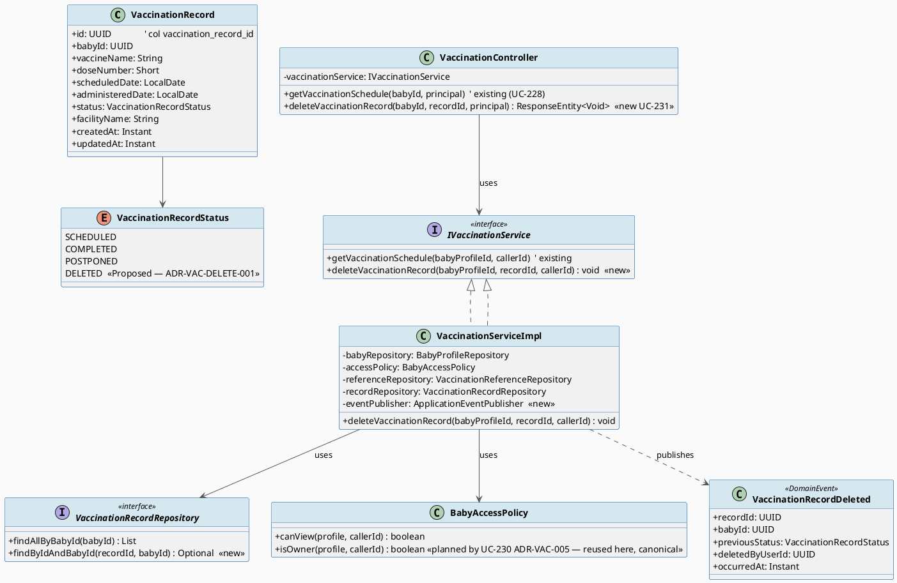
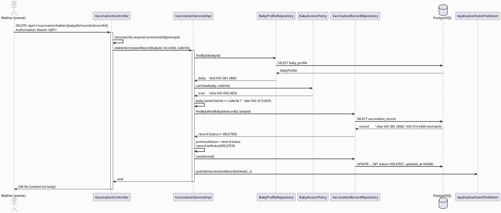
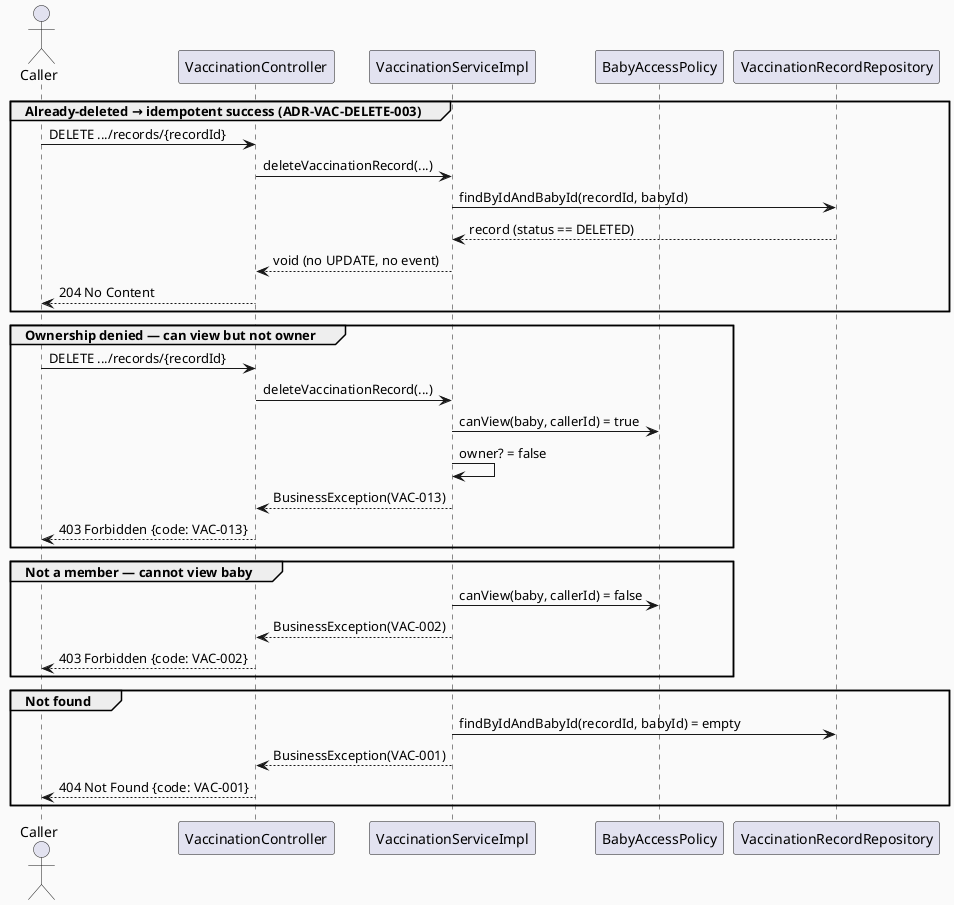
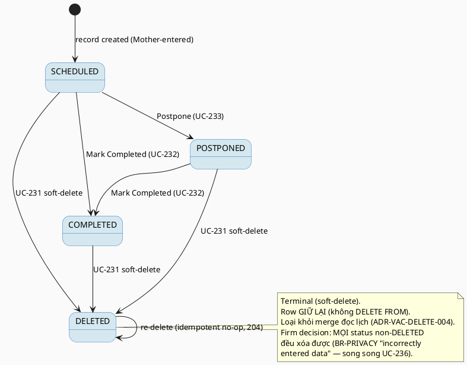

# ENGINEERING DOCUMENTATION STANDARD (EDS) v2.0
# UC-231 Delete Vaccination Record — Technical Design Specification (TDS)

| Field | Value |
|-------|-------|
| **Document ID** | `CB-VAC-IMP-231` |
| **Version** | `1.0` |
| **Date** | `2026-07-03` |
| **Status** | `Partially Implemented` |
| **Document Owner** | `LamVH (Vaccination & Growth Tracking feature owner)` |
| **Author** | `AI Agent — Technical Architect` |
| **Reviewed by** | `[ ] Tech Lead — Pending` |
| **DPO Sign-off** | `[ ] Pending` *(bắt buộc — module xử lý Sensitive-PII sức khỏe trẻ em)* |
| **Approved by** | `[ ] Principal Architect — Pending` |
| **Last Review** | `2026-07-03` |
| **Based on EDS** | `v2.0` |

---

## CHANGELOG

> **Policy 4.4 — Immutable History:** Không bao giờ xóa thông tin cũ. Mọi thay đổi phải ghi vào bảng này.

| Ngày | Người thực hiện | Nội dung thay đổi |
|------|-----------------|-------------------|
| 2026-07-10 | AI Agent | Phase 3: Implementation - 9/14 tests PASS; service-level coverage green, controller/INT/E2E pending |
| 2026-07-03 | AI Agent — Technical Architect | Tạo tài liệu lần đầu cho UC-231 Delete Vaccination Record (soft-delete via new enum value `DELETED`). Model theo REAL CODE hiện tại của package `vaccination`, ghi nhận độ lệch với sibling TDS UC-228 (stale). |

---

## MỤC LỤC

1. [Tổng quan Module](#1-tổng-quan-module)
2. [Ma trận Truy vết (Traceability Matrix)](#2-ma-trận-truy-vết-traceability-matrix)
3. [Architecture Decision Records (ADR)](#3-architecture-decision-records-adr)
4. [Non-Functional Requirements & SLA](#4-non-functional-requirements--sla)
5. [Static Modeling (Mô hình Tĩnh)](#5-static-modeling-mô-hình-tĩnh)
6. [Dynamic Modeling (Mô hình Động)](#6-dynamic-modeling-mô-hình-động)
7. [Domain Event Catalog](#7-domain-event-catalog)
8. [Interface Specification (Đặc tả Giao diện)](#8-interface-specification-đặc-tả-giao-diện)
9. [API Specification](#9-api-specification)
10. [Bảng mã lỗi (Error Codes)](#10-bảng-mã-lỗi-error-codes)
11. [Quy trình Triển khai (Step-by-Step)](#11-quy-trình-triển-khai-step-by-step)
12. [Rollback & Incident Runbook](#12-rollback--incident-runbook)
13. [Kịch bản Kiểm thử Chi tiết](#13-kịch-bản-kiểm-thử-chi-tiết)
14. [Phương pháp Xác minh](#14-phương-pháp-xác-minh)
15. [Mẫu thử thực tế (API Verification Samples)](#15-mẫu-thử-thực-tế-api-verification-samples)
16. [Bảng tổng hợp phân quyền (Authorization Matrix)](#16-bảng-tổng-hợp-phân-quyền-authorization-matrix)
17. [AI Prompt Constraints (CASE 2.0)](#17-ai-prompt-constraints-case-20)

---

## 1. Tổng quan Module

> UC-231 cho phép **Mother** xóa (soft-delete) một bản ghi tiêm chủng do chính mình nhập cho hồ sơ em bé của mình. Thao tác được hiện thực hóa dưới dạng **soft-delete** — chuyển `status` sang giá trị mới `DELETED` thay vì `DELETE FROM vaccination_records` — để bảo toàn audit trail theo BR-PRIVACY và Assumption về retention.

| Field | Value |
|-------|-------|
| **Module Name** | `Vaccination — Delete Vaccination Record (UC-231)` |
| **Bounded Context** | `Vaccination & Growth Tracking` |
| **Data Classification** | `Sensitive-PII` *(dữ liệu sức khỏe/tiêm chủng của trẻ sơ sinh)* |
| **Compliance Scope** | `PDPA` *(+ BR-RBAC, BR-PRIVACY)* |
| **Upstream Dependencies** | `baby` (BabyProfileRepository, BabyAccessPolicy), `common` (SecurityUtils, BusinessException, ApiResponse) |
| **Downstream Consumers** | UC-228 View Vaccination Schedule (đọc — phải loại `DELETED` khỏi merge logic); Audit/Notification context (tiêu thụ event `VaccinationRecordDeleted`) |

**Nguồn yêu cầu (SRS):** `02_Requirements/SRS/3_Functional_Specification.md` §3.3.19.4, Table 253 — *"Soft-deletes a Mother-entered vaccination record."* Priority **Medium**, Frequency **Occasional**, Business Rules **BR-RBAC + BR-PRIVACY**.

**UI/UX Oracle:** `03_Design/UI_UX/MobileAppScreen/CB-276 Delete Vaccination Record (UC-231)/code.html` — màn xác nhận xóa với: (a) card tóm tắt bản ghi (Em bé, Loại Vaccine, Ngày tiêm, Nguồn dữ liệu); (b) checkbox xác nhận bắt buộc (`required`); (c) copy mô tả rõ **"Bản ghi này sẽ không bị xóa vĩnh viễn ngay lập tức. Nó sẽ được chuyển vào Lưu trữ (Soft-delete)"** với chính sách khôi phục 30 ngày; (d) success state hiển thị mã giao dịch + timestamp audit.

> **⚠️ Divergence Note — sibling TDS UC-228 stale.** Sibling `UC228_ViewVaccinationSchedule` (Approved) mô tả một số chi tiết không khớp mã đã ship. TDS này model **trực tiếp theo REAL CODE** trong `05_Development/CareBridgeAPI/src/main/java/com/carebridge/backend/vaccination/`. Các sự thật đã xác minh từ mã nguồn (không lấy từ UC-228):
> - `VaccinationController` **chỉ** có `GET /api/v1/vaccination/babies/{babyId}/schedule` — **chưa có** bất kỳ endpoint delete/POST/PATCH nào.
> - `VaccinationRecordStatus` chỉ gồm `{SCHEDULED, COMPLETED, POSTPONED}` — **không** có `DELETED/CANCELLED/ARCHIVED`.
> - `VaccinationRecord` **không có** cột `created_by`/`owner_user_id` — quyền sở hữu suy ra qua `baby → BabyProfile.ownerUserId`.
> - Cột `status` là `VARCHAR(20)` (`@Enumerated(EnumType.STRING)`), **không** phải Postgres enum type.

---

## 2. Ma trận Truy vết (Traceability Matrix)

> Ánh xạ: [Mã yêu cầu] → [Thành phần Code] → [Mục tiêu Tuân thủ].

| Requirement ID | Loại | Mô tả yêu cầu | Thành phần Code (planned) | Compliance Target | ADR liên quan |
|----------------|------|---------------|---------------------------|-------------------|---------------|
| UC-231 / Table 253 | User Story | Mother soft-delete bản ghi tiêm chủng do mình nhập | `VaccinationController.deleteVaccinationRecord()` | BR-RBAC | ADR-VAC-DELETE-001 |
| BR-RBAC | Business Rule | Chỉ role/scope hợp lệ được thao tác | `VaccinationServiceImpl.deleteVaccinationRecord()` (owner-only) | BR-RBAC, PDPA | ADR-VAC-DELETE-002 |
| BR-PRIVACY | Business Rule | Health data theo consent/purpose/minimum-necessary + retention audit | Soft-delete via `status=DELETED` (giữ row) | BR-PRIVACY, PDPA | ADR-VAC-DELETE-001 |
| ADR-VAC-DELETE-001 | Decision (Proposed) | Soft-delete = thêm enum value `DELETED` (không migration) | `VaccinationRecordStatus.DELETED` | BR-PRIVACY | ADR-VAC-DELETE-001 |
| ADR-VAC-DELETE-002 | Decision | Delete giới hạn owner của baby (nghiêm hơn `canView`) | Owner check trong service | BR-RBAC, BR-PRIVACY | ADR-VAC-DELETE-002 |
| ADR-VAC-DELETE-003 | Decision | Re-delete bản ghi đã `DELETED` là idempotent success (204 no-op) | `VaccinationServiceImpl` guard | — | ADR-VAC-DELETE-003 |
| ADR-VAC-DELETE-004 | Decision (Proposed) | Read/merge logic (UC-228) phải loại `DELETED` khỏi index | `VaccinationServiceImpl.getVaccinationSchedule()` filter | Data Integrity | ADR-VAC-DELETE-004 |
| POST-3 (SRS) | Postcondition | Ghi audit cho hành động nhạy cảm | Domain event `VaccinationRecordDeleted` | BR-PRIVACY, PDPA | ADR-VAC-DELETE-001 |

---

## 3. Architecture Decision Records (ADR)

### ADR-VAC-DELETE-001 — Soft-delete qua giá trị enum mới `DELETED` (không Flyway migration)

| Field | Value |
|-------|-------|
| **Status** | `Proposed` — **cần Tech Lead sign-off trước khi implement** |
| **Deciders** | `Tech Lead + Principal Architect` |
| **Date** | `2026-07-03` |
| **Supersedes** | `—` |

#### Bối cảnh (Context)
SRS (Table 253) mô tả UC-231 **rõ ràng** là *"Soft-deletes a Mother-entered vaccination record"* và gán **BR-PRIVACY** ("health and family data must follow consent, purpose, and minimum-necessary access rules") cùng Assumption "CareBridge retains data according to privacy and audit policies". UI mockup (CB-276) khẳng định soft-delete + retention 30 ngày. Do đó **hard `DELETE FROM` bị loại trừ ngay từ nguồn** (không phải judgment call của tác giả). Enum `VaccinationRecordStatus` thực tế (mã nguồn) chỉ có `{SCHEDULED, COMPLETED, POSTPONED}` — **không** có giá trị soft-delete sẵn. Cột `status` là `VARCHAR(20)` với `@Enumerated(EnumType.STRING)`, **không** phải Postgres enum type.

#### Các phương án đã xem xét (Options Considered)

| Phương án | Mô tả | Ưu điểm | Nhược điểm |
|-----------|-------|----------|------------|
| A | Thêm giá trị enum `DELETED` vào `VaccinationRecordStatus` (Java enum). Set `status=DELETED` khi xóa | + **Không cần Flyway migration** (status là VARCHAR, không phải DB enum → không `ALTER TYPE`); + Nhất quán với mẫu "status-flag soft-delete" đã dùng ở reminder domain (`ReminderStatus.CANCELLED`, UC-215); + Giữ nguyên row → bảo toàn audit trail (BR-PRIVACY) | - Thay đổi **enum dùng chung** → mọi `switch`/`if-else` exhaustive trên `VaccinationRecordStatus` cần default case phòng thủ (xem ADR-VAC-DELETE-004 — rủi ro exhaustiveness) |
| B | Thêm cột tombstone riêng `deleted_at TIMESTAMPTZ NULL` | + Tách biệt "deleted" khỏi lifecycle status | - **Cần Flyway migration mới** (cột mới); - Nhân đôi ngữ nghĩa; - Lệch mẫu soft-delete đã thiết lập của project |
| C | Hard delete `DELETE FROM vaccination_records` | + Đơn giản | - **Vi phạm SRS** (SRS yêu cầu soft-delete); - Mất audit trail (BR-PRIVACY retention) → **loại bỏ** |

#### Quyết định (Decision)
Chọn **Phương án A**: hiện thực soft-delete bằng cách **thêm giá trị enum mới `DELETED`** vào `VaccinationRecordStatus` và set `status=DELETED`. Đây là **thay đổi mã Java (enum addition)**, **KHÔNG phải Flyway migration**, vì cột `status` là `VARCHAR(20)` chứ không phải kiểu enum của Postgres (nhất quán với quy ước "app-level-only enum" của project).

> **Status = Proposed:** Vì `DELETED` là giá trị mới trên một enum **dùng chung** mà mã khác có thể `switch` trên đó, quyết định này **cần Tech Lead sign-off** (§11 Prerequisites). Cơ chế bản thân đã cụ thể (giá trị `DELETED`) — **không** để Open.

#### Hệ quả (Consequences)
**Tích cực:**
- Không cần migration → giảm rủi ro triển khai; tận dụng cột VARCHAR sẵn có.
- Bảo toàn row → đáp ứng BR-PRIVACY retention + hỗ trợ khôi phục 30 ngày (UI mockup) trong tương lai.

**Tiêu cực / Trade-offs:**
- **Rủi ro exhaustiveness (quan trọng):** thêm giá trị vào enum dùng chung buộc mọi nơi phân nhánh trên `VaccinationRecordStatus` phải xử lý giá trị mới. Điểm nóng đã xác minh: `VaccinationServiceImpl.getVaccinationSchedule()` dùng chuỗi `if/else if` (`COMPLETED` → `POSTPONED` → `else`). Nếu **không** cập nhật, một record `DELETED` sẽ rơi vào nhánh `else` và **bị hiển thị lại** như `SCHEDULED/OVERDUE` — tức "xóa nhưng vẫn hiện". Giảm thiểu: **bắt buộc** ADR-VAC-DELETE-004 (loại `DELETED` khỏi merge) đi kèm.
- Row `DELETED` vẫn chiếm dung lượng; các truy vấn "active" phải lọc `status != DELETED`.

**Compliance Impact:**
- BR-PRIVACY/PDPA: soft-delete + retention là cách tuân thủ nghĩa vụ lưu trữ/audit; DPO cần sign-off cơ chế và thời hạn xóa cứng cuối cùng (30 ngày trong UI — **Open**, xem §Open Items).

---

### ADR-VAC-DELETE-002 — Ủy quyền xóa giới hạn owner của baby (nghiêm hơn `canView`)

| Field | Value |
|-------|-------|
| **Status** | `Accepted` |
| **Deciders** | `Tech Lead` |
| **Date** | `2026-07-03` |

#### Bối cảnh (Context)
`BabyAccessPolicy.canView(profile, callerId)` (mã nguồn) trả `true` cho **owner HOẶC** thành viên care-group ở trạng thái `ACCEPTED`. UC-228 (đọc) dùng `canView` là hợp lý. Nhưng UC-231 là hành động **phá hủy** dữ liệu sức khỏe. SRS mô tả *"Mother-entered vaccination record"* và primary actor là **Mother**. `VaccinationRecord` **không có** cột `created_by`, nên "Mother-entered" ánh xạ thực tế sang **owner của BabyProfile** (Mother sở hữu hồ sơ bé).

#### Các phương án đã xem xét

| Phương án | Mô tả | Ưu điểm | Nhược điểm |
|-----------|-------|----------|------------|
| A | Tái dùng `canView` (owner HOẶC care-group member) cho quyền xóa | + Nhất quán với UC-228 | - Cho phép thành viên FAMILY xóa dữ liệu y tế của Mother → vi phạm minimum-necessary (BR-PRIVACY) |
| B | Xóa chỉ dành cho **owner** của baby (2 tầng: `canView` gate + owner gate) | + Đúng minimum-necessary; + Khớp actor "Mother" & "Mother-entered"; + Không leak tồn tại record cho người ngoài | - Cần thêm một bước kiểm tra owner (không có sẵn method `canManage`) |

#### Quyết định (Decision)
Chọn **Phương án B**. Ủy quyền 2 tầng: (1) `canView` fail → **VAC-002 (403)** (người ngoài, không leak tồn tại record); (2) `canView` pass nhưng **không phải owner** → **VAC-013 (403)** (thành viên care-group xem được nhưng không được xóa). Chỉ owner mới soft-delete.

> **RESOLVED (owner-check implementation — cập nhật so với bản đầu):** Bước (2) ("owner gate") dùng
> `BabyAccessPolicy.isOwner(baby, callerId)` — method canonical được `04_Implement/UC230_UpdateVaccinationRecord/UC230_UpdateVaccinationRecord_TDS.md`
> (ADR-VAC-005, Accepted) thêm vào `BabyAccessPolicy` — thay vì inline `baby.getOwnerUserId().equals(callerId)`
> lặp lại logic ở mỗi service. UC-231 **giữ nguyên** kiến trúc 2 tầng độc đáo của mình (canView → VAC-002,
> owner → VAC-013) vì đây là phân biệt lỗi hợp lý (không leak tồn tại record cho non-member) — chỉ thay
> phần triển khai bước owner-check để dùng chung method với UC-229/230/232/233, tránh 5 cách viết khác nhau
> cho cùng một phép so sánh.

#### Hệ quả
**Tích cực:** giảm bề mặt rủi ro phá hủy dữ liệu; đúng BR-PRIVACY; tái sử dụng `isOwner()` canonical giảm trùng lặp code. **Trade-off:** logic auth 2 tầng phức tạp hơn 1 chút; nếu sau này cần cho phép care-group xóa, tạo ADR mới. **Compliance:** củng cố minimum-necessary (PDPA).

---

### ADR-VAC-DELETE-003 — Re-delete idempotent (đã `DELETED` → 204 no-op)

| Field | Value |
|-------|-------|
| **Status** | `Accepted` |
| **Deciders** | `Tech Lead` |
| **Date** | `2026-07-03` |

#### Bối cảnh (Context)
Client mobile có thể gọi DELETE hai lần (double-tap, retry sau timeout). Cần quyết định hành vi khi record đã ở `DELETED`. **Tham chiếu tiền lệ toàn app:** `04_Implement/UC215_DeleteReminder/UC215_DeleteReminder_TDS.md` §ADR-REM-DELETE-002 đã chọn **idempotent success (204 No Content, no-op, không phát lại event/audit)** cho re-delete reminder. Để nhất quán mẫu soft-delete xuyên suốt app, UC-231 **tái dùng CÙNG lựa chọn**.

#### Các phương án đã xem xét

| Phương án | Mô tả | Ưu điểm | Nhược điểm |
|-----------|-------|----------|------------|
| A | Trả 409 "already deleted" | + Phân biệt "vừa xóa" vs "đã xóa" | - UX xấu cho delete; - Lệch tiền lệ UC-215; - Vi phạm tính idempotent của HTTP DELETE (RFC 9110 §9.2.2) |
| B | Idempotent success — no-op, `204 No Content` | + An toàn với retry; + Đúng idempotent DELETE; + **Nhất quán UC-215**; + Không phát lại event/audit trùng | - Không phân biệt "vừa xóa" vs "đã xóa" (chấp nhận được) |

#### Quyết định (Decision)
Chọn **Phương án B** (khớp UC-215 ADR-REM-DELETE-002): DELETE trên record đã `DELETED` trả **`204 No Content`**, **không** phát lại `VaccinationRecordDeleted`, **không** ghi audit trùng.

#### Hệ quả
**Tích cực:** an toàn retry, UX tốt, đồng nhất mẫu app. **Trade-off:** mất khả năng phân biệt trạng thái ở tầng HTTP (bù lại bằng audit log lần xóa đầu). **Compliance:** không tạo audit trùng → audit trail sạch.

---

### ADR-VAC-DELETE-004 — Loại `DELETED` khỏi merge logic đọc lịch (UC-228) — rủi ro exhaustiveness

| Field | Value |
|-------|-------|
| **Status** | `Proposed` — đi kèm bắt buộc với ADR-VAC-DELETE-001 |
| **Deciders** | `Tech Lead` |
| **Date** | `2026-07-03` |

#### Bối cảnh (Context)
`VaccinationServiceImpl.getVaccinationSchedule()` (REAL CODE) index records theo key `vaccineName|doseNumber` rồi phân nhánh trạng thái bằng `if (COMPLETED) … else if (POSTPONED) … else if (expectedDate<today) OVERDUE … else SCHEDULED`. Chuỗi này **không exhaustive** — mọi status không phải COMPLETED/POSTPONED rơi vào default. Khi thêm `DELETED`, một record đã xóa sẽ được đưa vào `recordMap` và rơi vào nhánh default → hiển thị lại như `SCHEDULED/OVERDUE`. Đây là lỗi "xóa nhưng vẫn hiện".

#### Quyết định (Decision)
Read logic **phải** loại `DELETED` **trước khi** index. Hai cách tương đương (chọn 1 khi implement):
- (a) Lọc stream: `records.stream().filter(r -> r.getStatus() != VaccinationRecordStatus.DELETED)` trước `collect(toMap(...))`; hoặc
- (b) Thêm query repository `findAllByBabyIdAndStatusNot(babyId, DELETED)` và thay `findAllByBabyId` trong hàm đọc.

Đồng thời, **mọi** phân nhánh trên `VaccinationRecordStatus` trong codebase phải có default an toàn khi gặp giá trị mới.

#### Hệ quả
**Tích cực:** record đã xóa biến mất khỏi lịch (dose trở lại trạng thái suy ra từ reference catalog). **Trade-off:** UC-231 chạm nhẹ vào code của UC-228 (đọc) — cần regression test UC-228. **Rủi ro (testing consideration):** bất kỳ `switch`/`if-else` nào khác trên enum này (hiện tại chỉ có 1 điểm trong `getVaccinationSchedule`) phải được rà — ghi rõ trong Test-Spec §2.

---

## 4. Non-Functional Requirements & SLA

> ⚠️ Không có SLA số cụ thể cho UC-231 trong SRS/NFR nguồn. Các ngưỡng dưới đây là **giá trị tham chiếu chung** của project cho endpoint CRUD nhẹ; đánh dấu `Open` nơi chưa có nguồn chính thức.

### 4.1. Performance & Availability

| Category | Requirement | Target SLA | Measurement Method | Compliance Basis |
|----------|-------------|------------|---------------------|------------------|
| Latency | API response (p99) | `< 300ms` *(reference — Open)* | k6 load test | — |
| Availability | Uptime | `99.9%` *(reference — Open)* | Uptime monitor | — |
| Throughput | Concurrent requests | Thấp — Frequency = **Occasional** (SRS Table 253) | Load test | — |

### 4.2. Data Integrity & Retention

| Category | Requirement | Target | Verification Method | Compliance Basis |
|----------|-------------|--------|---------------------|------------------|
| Retention | Row giữ lại sau delete (soft-delete) | Row tồn tại với `status=DELETED` | DB inspection §14.1 | BR-PRIVACY, PDPA |
| Audit | Ghi event `VaccinationRecordDeleted` | 1 event / lần xóa **đầu tiên** | Audit/log §14.2 | BR-PRIVACY, POST-3 |
| Consistency | Idempotent re-delete không tạo audit/event trùng | Đúng 1 event | Audit log | ADR-VAC-DELETE-003 |
| Hard-delete cuối cùng (purge 30 ngày) | Xóa cứng sau retention window | `Open` — cần DPO xác định job & thời hạn | — | BR-PRIVACY (UI mockup: 30 ngày) |

### 4.3. Security

| Category | Requirement | Target | Verification Method | Compliance Basis |
|----------|-------------|--------|---------------------|------------------|
| Access control | Owner-only cho delete | Least privilege (2 tầng auth) | Auth Matrix (§16) | BR-RBAC, ADR-VAC-DELETE-002 |
| Encryption in transit | Endpoint qua TLS | TLS 1.2+ *(reference)* | SSL scan | PDPA |
| No health advice in response | Response 204 không body tư vấn | Không có nội dung y tế | Contract test | BR-SAFETY (kế thừa context) |

### 4.4. Scalability & Capacity Planning
> Frequency **Occasional** (SRS). Mỗi thao tác = 1 SELECT + 1 UPDATE + 1 event publish. Không cần chiến lược scale riêng.

---

## 5. Static Modeling (Mô hình Tĩnh)

### 5.1. Class Diagram (PlantUML)



**Planned file paths (REAL CODE tree):**
- `.../vaccination/controller/VaccinationController.java` — thêm method `deleteVaccinationRecord` (sửa file có sẵn)
- `.../vaccination/service/IVaccinationService.java` — thêm signature (sửa)
- `.../vaccination/service/impl/VaccinationServiceImpl.java` — thêm impl + inject `ApplicationEventPublisher` + sửa `getVaccinationSchedule` lọc `DELETED` (sửa)
- `.../vaccination/entity/VaccinationRecordStatus.java` — thêm `DELETED` (sửa — **Proposed**)
- `.../vaccination/repository/VaccinationRecordRepository.java` — thêm `findByIdAndBabyId` (sửa)
- `.../vaccination/event/VaccinationRecordDeleted.java` — **file mới**

### 5.2. Data Structure (Flyway SQL Migration)
> **CareBridge rule:** database structure lấy từ `V1__init_schema.sql` + approved migrations làm nguồn chính.

**KẾT LUẬN SCHEMA-CHANGE: KHÔNG cần Flyway migration cho UC-231.**

Lý do: soft-delete được hiện thực bằng **giá trị enum Java mới** (`DELETED`). Cột `status` đã là `VARCHAR(20)` với `@Enumerated(EnumType.STRING)` (mã nguồn `VaccinationRecord.java` dòng 42–44) — **không** phải Postgres `ENUM` type. Do đó lưu chuỗi `'DELETED'` **không** yêu cầu `ALTER TYPE ... ADD VALUE` hay bất kỳ DDL nào. Đây là thay đổi **mã Java**, được ghi nhận là ADR (`Proposed`) chứ không phải migration.

> Nếu Tech Lead **từ chối** Phương án A và chọn Phương án B (cột `deleted_at`), khi đó — và **chỉ** khi đó — mới cần một Flyway migration `V{n}__add_vaccination_record_deleted_at.sql`. Hiện tại quyết định là Phương án A → **không migration**.

---

## 6. Dynamic Modeling (Mô hình Động)

### 6.1. Sequence Diagram — Happy Path (soft-delete)



### 6.2. Sequence Diagram — Error / Alternate Paths



### 6.3. State Machine



> **⚠️ Invariant:**
> - Không bao giờ `DELETE FROM vaccination_records` (SRS soft-delete).
> - `DELETED` là terminal; không transition rời khỏi `DELETED` (trừ re-delete no-op).
> - Record `DELETED` không được xuất hiện trong response của UC-228.

---

## 7. Domain Event Catalog

### 7.1. Events Published (Phát ra)

| Event Name | Trigger | Publisher | Subscriber(s) | Payload Schema | Async? |
|------------|---------|-----------|---------------|----------------|--------|
| `VaccinationRecordDeleted` | Soft-delete thành công **lần đầu** (không phát khi re-delete no-op) | `VaccinationServiceImpl` | Audit context, (tùy chọn) Notification context | `VaccinationRecordDeleted.java` | No (in-process `ApplicationEventPublisher`) |

### 7.2. Events Consumed (Tiêu thụ)

| Event Name | Source | Handler | Action thực hiện |
|------------|--------|---------|------------------|
| `—` | — | — | UC-231 không tiêu thụ event nào |

### 7.3. Payload Schema

```java
// VaccinationRecordDeleted.java (file mới)
public record VaccinationRecordDeleted(
    UUID    eventId,          // UUID.randomUUID() — deduplicate
    String  eventType,        // "VaccinationRecordDeleted"
    Instant occurredAt,       // Instant.now()
    String  version,          // "1.0"
    Payload payload,
    Metadata metadata
) {
    public record Payload(
        UUID   recordId,        // vaccination_record_id
        UUID   babyId,
        String previousStatus,  // SCHEDULED | COMPLETED | POSTPONED
        UUID   deletedByUserId  // = callerId (Mother owner)
    ) {}

    public record Metadata(
        UUID   correlationId,
        String causedBy         // userId
    ) {}
}
```

---

## 8. Interface Specification (Đặc tả Giao diện)

### 8.1. Service Interface

```java
// I VaccinationService.java — @version 1.1 (thêm method delete)
public interface IVaccinationService {

    // existing (UC-228) — không đổi
    VaccinationScheduleResponse getVaccinationSchedule(UUID babyProfileId, UUID callerId);

    /**
     * UC-231 — Soft-delete một vaccination record do Mother nhập.
     * Ủy quyền owner-only (ADR-VAC-DELETE-002). Idempotent nếu đã DELETED (ADR-VAC-DELETE-003).
     * @throws BusinessException VAC-001 (404) nếu baby/record không tồn tại
     * @throws BusinessException VAC-002 (403) nếu caller không xem được baby (canView=false)
     * @throws BusinessException VAC-013 (403) nếu caller xem được nhưng không phải owner
     * @throws BusinessException VAC-014 (404) nếu record không thuộc babyId trên path
     */
    void deleteVaccinationRecord(UUID babyProfileId, UUID recordId, UUID callerId);
}
```

### 8.2. Repository Interface

```java
// VaccinationRecordRepository.java — @version 1.1
public interface VaccinationRecordRepository extends JpaRepository<VaccinationRecord, UUID> {

    List<VaccinationRecord> findAllByBabyId(UUID babyId);  // existing

    Optional<VaccinationRecord> findByBabyIdAndVaccineNameAndDoseNumberAndStatus(
            UUID babyId, String vaccineName, short doseNumber, VaccinationRecordStatus status); // existing

    // NEW — UC-231: nạp record kèm ràng buộc thuộc về baby (chống nhầm baby)
    Optional<VaccinationRecord> findByIdAndBabyId(UUID id, UUID babyId);

    // OPTIONAL — hỗ trợ ADR-VAC-DELETE-004 (đọc lọc DELETED)
    // List<VaccinationRecord> findAllByBabyIdAndStatusNot(UUID babyId, VaccinationRecordStatus status);
}
```

> **Lưu ý (soft-delete):** Không dùng `deleteById()`/`delete()` của JpaRepository. Xóa = `save(record)` sau khi `record.setStatus(DELETED)` (append-only spirit — chỉ SET trạng thái).

---

## 9. API Specification

### 9.1. Endpoints Table

| Method | Path | Auth Level | Required Roles | Rate Limit | Idempotent? |
|--------|------|------------|----------------|------------|-------------|
| `DELETE` | `/api/v1/vaccination/babies/{babyId}/records/{recordId}` | JWT Bearer (`isAuthenticated()`) | `MOTHER` (owner của baby) | 60/min *(reference — Open)* | **Yes** (soft-delete, re-delete = 204 no-op) |

> Path nested theo babyId để đồng nhất với endpoint hiện có `GET /api/v1/vaccination/babies/{babyId}/schedule` (REAL CODE).

### 9.2. Request / Response Schemas

#### `DELETE /api/v1/vaccination/babies/{babyId}/records/{recordId}`

**Request:** không có body. Path params: `babyId` (UUID), `recordId` (UUID). Header: `Authorization: Bearer <JWT>`.

**Response — 204 No Content (Happy Path / idempotent re-delete):** không body.

**Response — 403 Forbidden (không phải owner):**
```json
{ "error": { "code": "VAC-013", "message": "Delete restricted to the baby owner" } }
```

**Response — 403 Forbidden (không xem được baby):**
```json
{ "error": { "code": "VAC-002", "message": "Access denied to vaccination record" } }
```

**Response — 404 Not Found (baby/record không tồn tại):**
```json
{ "error": { "code": "VAC-001", "message": "Vaccination record not found" } }
```

**Response — 404 Not Found (record không thuộc baby):**
```json
{ "error": { "code": "VAC-014", "message": "Vaccination record does not belong to the specified baby" } }
```

**Response — 400 Bad Request (UUID sai định dạng):**
```json
{ "error": { "code": "VAC-015", "message": "Invalid identifier format" } }
```

> **BR-SAFETY:** Response không chứa bất kỳ tư vấn/khuyến nghị y tế nào. 204 không body.

---

## 10. Bảng mã lỗi (Error Codes)

> Tiền tố `VAC-`. UC-231 **tái dùng** `VAC-001`/`VAC-002` và **cấp mới** `VAC-013..016` (không đụng dải của sibling: UC-229 VAC-004..008, UC-230 VAC-009..012, UC-232 VAC-017..020, UC-233 VAC-021..024).

| Code | HTTP | Message (EN) | Message (VI) | Trigger Condition |
|------|------|--------------|--------------|-------------------|
| `VAC-001` *(reused)* | 404 | Vaccination record not found | Không tìm thấy bản ghi/hồ sơ | `babyId` không tồn tại HOẶC `recordId` không tồn tại |
| `VAC-002` *(reused)* | 403 | Access denied to vaccination record | Không có quyền truy cập | `BabyAccessPolicy.canView(baby, caller) == false` (người ngoài — không leak tồn tại record) |
| `VAC-013` *(new)* | 403 | Delete restricted to the baby owner | Chỉ chủ hồ sơ bé được xóa | `canView == true` nhưng `baby.ownerUserId != callerId` (thành viên care-group) — ADR-VAC-DELETE-002 |
| `VAC-014` *(new)* | 404 | Record does not belong to the specified baby | Bản ghi không thuộc bé chỉ định | `recordId` tồn tại nhưng `record.babyId != {babyId}` trên path |
| `VAC-015` *(new)* | 400 | Invalid identifier format | Định dạng mã không hợp lệ | `babyId`/`recordId` không phải UUID hợp lệ (validation tại controller) |
| `VAC-016` *(new)* | 500 | Failed to delete vaccination record | Lỗi hệ thống khi xóa | Lỗi persistence bất ngờ khi `save(record)` (rollback transaction) |

> **Idempotent re-delete (đã `DELETED`)** → **KHÔNG phải lỗi**: trả `204 No Content` (ADR-VAC-DELETE-003).

---

## 11. Quy trình Triển khai (Step-by-Step)

### 11.1. Prerequisites
- [ ] **ADR-VAC-DELETE-001 (thêm enum `DELETED`) được Tech Lead sign-off** (Proposed → Accepted).
- [ ] **ADR-VAC-DELETE-004 (lọc `DELETED` khỏi merge UC-228) được xác nhận** đi kèm.
- [ ] DPO sign-off cơ chế soft-delete + thời hạn purge cứng (30 ngày — hiện Open).
- [ ] Cả hai file spec (TDS + Test-Spec) ở trạng thái `Approved`.

### 11.2. Pre-Migration Checklist
- [ ] **N/A — không có Flyway migration** (xem §5.2). Chỉ là thay đổi mã Java. Bỏ qua backup-migration; vẫn giữ nguyên quy trình test staging thông thường.

### 11.3. Implementation Steps

#### Chặng 1 — Enum + Repository (Proposed)
```java
// VaccinationRecordStatus.java
public enum VaccinationRecordStatus { SCHEDULED, COMPLETED, POSTPONED, DELETED }

// VaccinationRecordRepository.java
Optional<VaccinationRecord> findByIdAndBabyId(UUID id, UUID babyId);
```

#### Chặng 2 — Service (soft-delete + read filter)
```java
@Transactional
public void deleteVaccinationRecord(UUID babyId, UUID recordId, UUID callerId) {
    BabyProfile baby = babyRepository.findById(babyId)
        .orElseThrow(() -> new BusinessException(NOT_FOUND, "VAC-001", "Vaccination record not found"));
    if (!accessPolicy.canView(baby, callerId))
        throw new BusinessException(FORBIDDEN, "VAC-002", "Access denied to vaccination record");
    if (!accessPolicy.isOwner(baby, callerId))  // canonical method, ADR-VAC-005 (UC-230)
        throw new BusinessException(FORBIDDEN, "VAC-013", "Delete restricted to the baby owner");
    VaccinationRecord rec = recordRepository.findByIdAndBabyId(recordId, babyId)
        .orElseThrow(() -> new BusinessException(NOT_FOUND, "VAC-001", "Vaccination record not found"));
    if (rec.getStatus() == VaccinationRecordStatus.DELETED) return; // idempotent no-op (204)
    var previous = rec.getStatus();
    rec.setStatus(VaccinationRecordStatus.DELETED);
    recordRepository.save(rec);
    eventPublisher.publishEvent(VaccinationRecordDeleted.of(rec, previous, callerId));
}
```
Đồng thời trong `getVaccinationSchedule`: lọc `DELETED` trước khi index (ADR-VAC-DELETE-004).

#### Chặng 3 — Controller
```java
@DeleteMapping("/babies/{babyId}/records/{recordId}")
@PreAuthorize("isAuthenticated()")
public ResponseEntity<Void> deleteVaccinationRecord(@PathVariable UUID babyId,
        @PathVariable UUID recordId, Principal principal) {
    var callerId = SecurityUtils.requireCurrentUserId(principal);
    vaccinationService.deleteVaccinationRecord(babyId, recordId, callerId);
    return ResponseEntity.noContent().build();
}
```

### 11.4. Deployment Checklist
- [ ] `./mvnw test` xanh; regression UC-228 (record `DELETED` không hiện trong lịch).
- [ ] Health check 200.
- [ ] Audit log sinh `VaccinationRecordDeleted` đúng format.
- [ ] Thông báo DPO (thao tác trên Sensitive-PII).

---

## 12. Rollback & Incident Runbook

### 12.1. Trigger Conditions

| Điều kiện | Ngưỡng | Người quyết định |
|-----------|--------|------------------|
| Record `DELETED` vẫn hiện trong lịch (UC-228) | Bất kỳ case | Tech Lead |
| Error rate tăng | > 5% / 5 phút | On-call Engineer |
| Dữ liệu bị hard-delete ngoài ý muốn | Bất kỳ case | Tech Lead + DPO |

### 12.2. Rollback Procedure
```bash
# KHÔNG có migration để revert (§5.2). Chỉ revert mã.
git revert <commit_uc231>
kubectl rollout undo deployment/carebridge-api
kubectl rollout status deployment/carebridge-api

# Data remediation (nếu cần khôi phục record bị soft-delete nhầm):
# Vì là soft-delete, row còn nguyên — khôi phục bằng SET lại status trước đó.
psql -h $DB_HOST -U $DB_USER -d $DB_NAME \
  -c "UPDATE vaccination_records SET status='SCHEDULED' WHERE vaccination_record_id='<id>' AND status='DELETED';"
```
> Ưu điểm soft-delete: rollback dữ liệu là **UPDATE ngược trạng thái**, không mất dữ liệu.

### 12.3. Notification Protocol

| Thời điểm | Người nhận | Kênh |
|-----------|------------|------|
| Ngay khi phát hiện | On-call team | Slack `#incident` |
| Trong 30 phút | DPO | Email (Sensitive-PII bị ảnh hưởng) |

### 12.4. Post-Incident Review
PIR trong 48 giờ: Timeline, Root Cause (5 Whys), Impact (số record ảnh hưởng, có PII exposure?), Remediation, Prevention.

---

## 13. Kịch bản Kiểm thử Chi tiết

> Test Data Classification: **SYNTHETIC** (bắt buộc). ❌ Không dùng Production PII. Chi tiết đầy đủ trong Test-Spec `UC231_DeleteVaccinationRecord_Test-Spec.md`.

### 13.1. Unit Tests
```gherkin
Feature: UC-231 Delete Vaccination Record
  Background:
    Given test data classification: SYNTHETIC

  Scenario: Owner soft-deletes a record (happy path)
    Given a vaccination_record (status=COMPLETED) belongs to baby owned by Mother
    When Mother calls deleteVaccinationRecord(babyId, recordId, motherId)
    Then record.status becomes DELETED
    And no row is physically deleted
    And a VaccinationRecordDeleted event is published once

  Scenario: Re-delete is idempotent
    Given a vaccination_record already has status=DELETED
    When deleteVaccinationRecord is called again
    Then no UPDATE occurs and no event is published
    And the controller returns 204 No Content

  Scenario: Care-group member cannot delete
    Given caller passes canView but is NOT the baby owner
    When deleteVaccinationRecord is called
    Then BusinessException VAC-013 (403) is thrown

  Scenario: Record not found
    When deleteVaccinationRecord targets a non-existent recordId
    Then BusinessException VAC-001 (404) is thrown
```

### 13.2. Integration Tests
```gherkin
  Scenario: Soft-deleted record disappears from schedule view (UC-228 cross-check)
    Given test data classification: SYNTHETIC
    And a COMPLETED record for "BCG|1" that currently surfaces in the schedule
    When the owner soft-deletes it
    And GET /babies/{babyId}/schedule is called
    Then the "BCG|1" dose no longer shows COMPLETED/administeredDate
    And it reverts to the reference-catalog derived status (SCHEDULED/OVERDUE)
```

### 13.3. E2E / Security Tests
```gherkin
  Scenario: Non-member is denied (no existence leak)
    Given a JWT of a user with no relationship to the baby
    When DELETE .../babies/{babyId}/records/{recordId}
    Then status 403 with code VAC-002

  Scenario: No PII / medical advice in response
    When a successful delete returns 204
    Then the response body is empty (no medical guidance)
```

---

## 14. Phương pháp Xác minh

### 14.1. Database Inspection
```sql
-- Verify soft-delete: row VẪN tồn tại, status=DELETED (không bị xóa cứng)
SELECT vaccination_record_id, status, updated_at
FROM vaccination_records
WHERE vaccination_record_id = '<uuid>';
-- Expected: 1 row, status = 'DELETED'

-- Verify KHÔNG hard-delete: count không giảm
SELECT count(*) FROM vaccination_records WHERE baby_id = '<babyId>';
```

### 14.2. Log / Audit Verification
```bash
# Event phát ra đúng 1 lần cho lần xóa đầu; 0 lần cho re-delete
grep '"eventType":"VaccinationRecordDeleted"' app.log | jq '{eventId, payload}'
# Kiểm tra không có PII nhạy cảm/tư vấn y tế trong log
grep -i "diagnos\|prescrib" app.log   # Expected: no output
```

### 14.3. Tool-based Verification
```bash
echo "<JWT>" | cut -d'.' -f2 | base64 -d | jq .   # verify sub/role claims
```

---

## 15. Mẫu thử thực tế (API Verification Samples)

### 15.1. Happy Path
```bash
curl -i -X DELETE \
  "https://<host>/api/v1/vaccination/babies/<babyId>/records/<recordId>" \
  -H "Authorization: Bearer <MOTHER_JWT>" \
  -H "X-Correlation-Id: $(uuidgen)"
# Expected: HTTP/1.1 204 No Content (empty body)
```

### 15.2. Idempotent re-delete
```bash
# Gọi lại lần 2 trên cùng record đã DELETED
curl -i -X DELETE "https://<host>/api/v1/vaccination/babies/<babyId>/records/<recordId>" \
  -H "Authorization: Bearer <MOTHER_JWT>"
# Expected: HTTP/1.1 204 No Content (no new event/audit)
```

### 15.3. Error Paths
```bash
# Care-group member (không owner) → 403 VAC-013
curl -i -X DELETE "https://<host>/api/v1/vaccination/babies/<babyId>/records/<recordId>" \
  -H "Authorization: Bearer <FAMILY_MEMBER_JWT>"
# Expected: 403 {"error":{"code":"VAC-013", ...}}

# Không tồn tại → 404 VAC-001
curl -i -X DELETE "https://<host>/api/v1/vaccination/babies/<babyId>/records/00000000-0000-0000-0000-0000000000ff" \
  -H "Authorization: Bearer <MOTHER_JWT>"
# Expected: 404 {"error":{"code":"VAC-001", ...}}
```

---

## 16. Bảng tổng hợp phân quyền (Authorization Matrix)

> Least Privilege. `Owner` = `baby.ownerUserId == callerId`. `Member` = ACCEPTED care-group member (canView=true, owner=false).

| Endpoint | `GUEST` | `MOTHER (Owner)` | `FAMILY (Member, non-owner)` | Người ngoài | `SYSTEM_ADMIN` |
|----------|---------|------------------|------------------------------|-------------|----------------|
| `DELETE /babies/{babyId}/records/{recordId}` | ❌ 401 | ✅ | ❌ 403 (VAC-013) | ❌ 403 (VAC-002) | ❌ 403 *(không trong scope UC-231; admin dùng công cụ riêng)* |
| `GET /babies/{babyId}/schedule` (UC-228, tham chiếu) | ❌ | ✅ | ✅ (canView) | ❌ | — |

**Chú thích:** ✅ được phép · ❌ từ chối · Delete = **owner-only** (ADR-VAC-DELETE-002); member xem được lịch nhưng không xóa.

---

## 17. AI Prompt Constraints (CASE 2.0)

### 17.1 Constraint Summary Table

| # | Constraint | Source (ADR/BR) | Last Verified |
|---|-----------|-----------------|---------------|
| C1 | Soft-delete **BẮT BUỘC** — set `status=DELETED`; **CẤM** `DELETE FROM`/`deleteById()` | SRS Table 253, ADR-VAC-DELETE-001 | 2026-07-03 |
| C2 | Ủy quyền **owner-only**: `canView` gate (VAC-002) rồi `baby.ownerUserId==callerId` (VAC-013) | ADR-VAC-DELETE-002, BR-RBAC | 2026-07-03 |
| C3 | Re-delete record đã `DELETED` → **204 no-op**, không phát event/audit lần 2 | ADR-VAC-DELETE-003 | 2026-07-03 |
| C4 | `getVaccinationSchedule` **phải** lọc `DELETED` trước khi index (chống re-surface) | ADR-VAC-DELETE-004 | 2026-07-03 |
| C5 | Identity lấy từ `SecurityUtils.requireCurrentUserId(principal)`; response 204 **không** chứa nội dung y tế | REAL CODE, BR-SAFETY | 2026-07-03 |

### 17.2 Constraint Injection Block

```
[CONSTRAINT BLOCK — Module: Vaccination / UC-231 Delete Vaccination Record]
Theo TDS CB-VAC-IMP-231 và các ADR liên quan:

1. Soft-delete BẮT BUỘC: record.setStatus(DELETED) + save(); CẤM hard delete.
2. Owner-only: canView(baby,caller) fail → VAC-002 (403); canView pass nhưng
   không phải owner → VAC-013 (403). Chỉ owner mới xóa.
3. Idempotent: nếu status đã DELETED → return ngay (204), không UPDATE/không event.
4. Sửa getVaccinationSchedule(): loại DELETED khỏi recordMap (filter trước toMap).
5. Identity từ SecurityUtils.requireCurrentUserId(principal). Không migration (status là VARCHAR).

[CONTEXT BLOCK]
- Bounded Context: Vaccination & Growth Tracking
- Data Classification: Sensitive-PII
- Compliance: PDPA, BR-RBAC, BR-PRIVACY
- Existing interfaces: §8 (IVaccinationService, VaccinationRecordRepository)
- Error codes: §10 (VAC-001/002 reused + VAC-013..016)
- Auth matrix: §16

[TASK BLOCK]
Implement deleteVaccinationRecord thỏa các constraint trên.
Output tuân thủ §8; tests cover §13.
```

### 17.3 Constraint Quality Checklist
- [x] Mỗi constraint traceable về ADR/BR cụ thể
- [x] Không có constraint generic
- [x] `Last Verified` = 2026-07-03 (≤ 2 sprints)
- [x] ≥ 3 constraints cụ thể
- [x] Reference §8 Interface
- [x] Reference §16 Auth Matrix

### 17.4 Anti-Pattern Detection

| AP-ID | Anti-Pattern | Dấu hiệu | Hành động |
|-------|-------------|-----------|----------|
| AP-AI-001 | Unconstrained Gen | Code không match C1–C5 | Reject — inject lại |
| AP-AI-003 | Implicit Decision | Code hard-delete hoặc bỏ qua filter DELETED (không có ADR) | Reject — theo ADR-VAC-DELETE-001/004 |
| AP-AI-005 | Hallucinated Contract | Import service/type ngoài §8 (vd `createdBy` không tồn tại trên entity) | Reject — verify contract |

---

## PHỤ LỤC

### A. Glossary

| Thuật ngữ | Định nghĩa |
|-----------|------------|
| Soft-delete | Đánh dấu `status=DELETED`, giữ nguyên row (không `DELETE FROM`) |
| Owner | `baby.ownerUserId == callerId` — Mother sở hữu hồ sơ bé |
| Exhaustiveness risk | Rủi ro khi thêm giá trị enum: nhánh `switch`/`if-else` không xử lý giá trị mới |
| Idempotent DELETE | Gọi DELETE nhiều lần cho cùng kết quả (RFC 9110 §9.2.2) |
| Sensitive-PII | Dữ liệu sức khỏe/tiêm chủng trẻ em |

### B. Open Items

| ID | Mô tả | Trạng thái |
|----|-------|-----------|
| OPEN-1 | Crisp question: "Should there be a scheduled hard-delete job that permanently purges `status=DELETED` vaccination rows after the 30-day window shown in UI mockup CB-276, and if so, what is the exact retention period and who runs the job?" | `Open` (Category B — needs DPO ruling; 30 days is a UI-copy number, not yet an approved data-retention policy) |
| OPEN-2 | Crisp question: "What are the concrete SLA numbers (p99 latency, rate limit, uptime %) for this endpoint?" — no SRS source exists | `Open` (Category B — Tech Lead/NFR owner) |
| OPEN-3 | Crisp question: "Should a `POST .../records/{recordId}/restore` (or similar) endpoint be added to un-delete a `DELETED` record within the retention window, given the UI mockup promises a 30-day recovery policy?" | `Open` (Category B — Product; explicitly out of scope for UC-231 itself, which only implements delete) |

### C. Tài liệu tham chiếu

| Document | Path |
|----------|------|
| SRS §3.3.19.4 (Table 253) | `02_Requirements/SRS/3_Functional_Specification.md` |
| REAL CODE — vaccination domain | `05_Development/CareBridgeAPI/src/main/java/com/carebridge/backend/vaccination/` |
| UI/UX mockup CB-276 | `03_Design/UI_UX/MobileAppScreen/CB-276 Delete Vaccination Record (UC-231)/code.html` |
| Idempotency precedent | `04_Implement/UC215_DeleteReminder/UC215_DeleteReminder_TDS.md` (ADR-REM-DELETE-002) |
| DB baseline | `05_Development/CareBridgeAPI/src/main/resources/db/migration/V1__init_schema.sql` |

---

*EDS v2.1 — TDS UC-231 Delete Vaccination Record. Status: Draft.*
