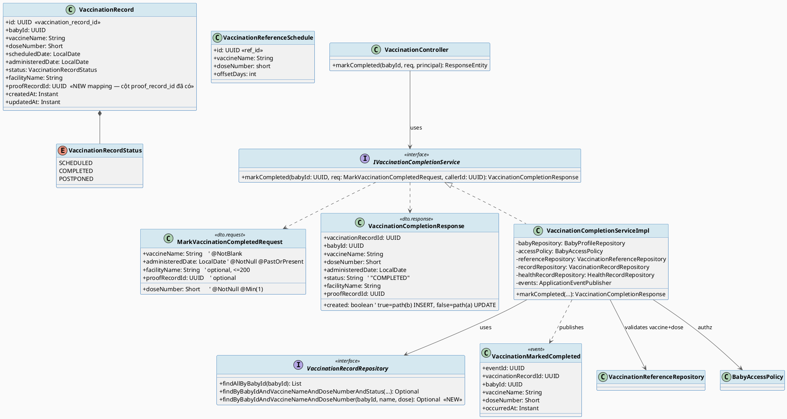
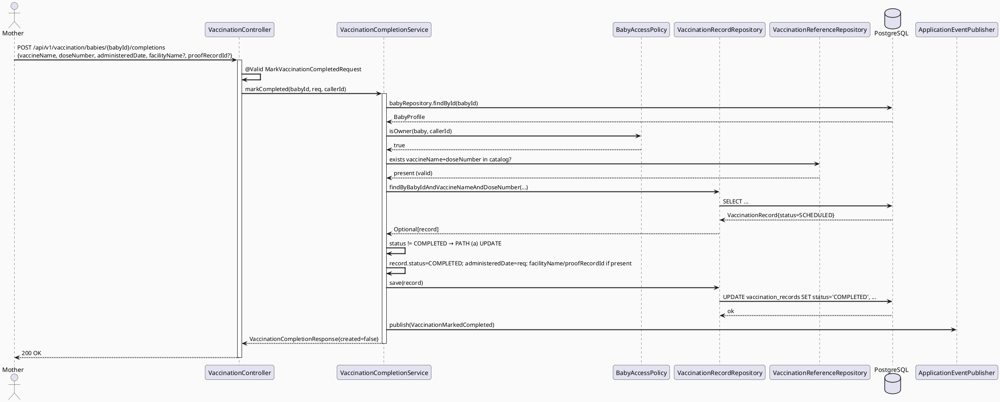
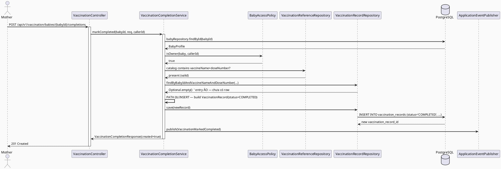
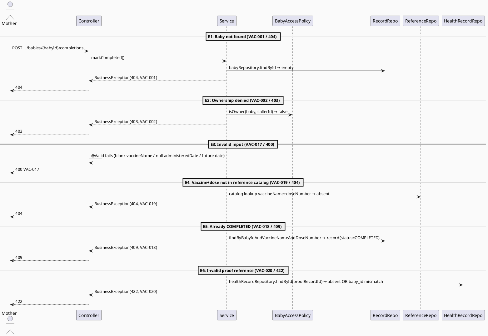
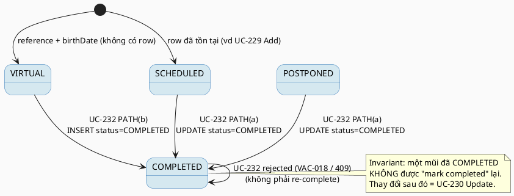

# ENGINEERING DOCUMENTATION STANDARD (EDS) v2.0
# Technical Design Specification — UC-232 Mark Vaccination Completed

| Field | Value |
|-------|-------|
| **Document ID** | `CB-VAC-IMP-005` |
| **Version** | `1.0` |
| **Date** | `2026-07-03` |
| **Status** | `Draft` |
| **Document Owner** | `PhuongNT` |
| **Author** | `AI Agent` |
| **Reviewed by** | `[Tech Lead]` |
| **DPO Sign-off** | `[ ] Pending` *(module xử lý PII sức khỏe)* |
| **Approved by** | `[Principal Architect]` |
| **Last Review** | `2026-07-03` |
| **Based on EDS** | `v2.0` |

---

## CHANGELOG

> **Policy 4.4 — Immutable History:** Không bao giờ xóa thông tin cũ. Mọi thay đổi phải ghi vào bảng này.

| Ngày | Người thực hiện | Nội dung thay đổi |
|------|-----------------|-------------------|
| 2026-07-03 | AI Agent (Technical Architect) | Tạo tài liệu lần đầu cho UC-232 Mark Vaccination Completed — thiết kế dual-path (update-existing / create-new) mô hình theo REAL CODE đang chạy |
| 2026-07-04 | AI Agent (theo chỉ đạo user/product owner) | **Resolve OPEN-4** (Phụ lục C) và cập nhật ADR-VAC-007 Status `Proposed` → `Accepted`: xác nhận giữ nguyên `proofRecordId` do client cung cấp (khớp UC-229/UC-230); checkbox "Tạo hồ sơ y tế tự động" trên mockup CB-277 là tiện ích UX phía client bọc luồng hai bước sẵn có, KHÔNG phải cơ chế auto-create phía server. Không thay đổi API/Interface Spec (§8/§9). Document Status vẫn giữ `Draft`. |

---

## MỤC LỤC

1. [Tổng quan Module](#1-tổng-quan-module)
2. [Ma trận Truy vết (Traceability Matrix)](#2-ma-trận-truy-vết-traceability-matrix)
3. [Architecture Decision Records (ADR)](#3-architecture-decision-records-adr)
4. [Non-Functional Requirements & SLA](#4-non-functional-requirements--sla)
5. [Static Modeling (Mô hình Tĩnh)](#5-static-modeling-mô-hình-tĩnh)
6. [Dynamic Modeling (Mô hình Động)](#6-dynamic-modeling-mô-hình-động)
7. [Domain Event Catalog](#7-domain-event-catalog)
8. [Interface Specification (Đặc tả Giao diện)](#8-interface-specification-đặc-tả-giao-diện)
9. [API Specification](#9-api-specification)
10. [Bảng mã lỗi (Error Codes)](#10-bảng-mã-lỗi-error-codes)
11. [Quy trình Triển khai (Step-by-Step)](#11-quy-trình-triển-khai-step-by-step)
12. [Rollback & Incident Runbook](#12-rollback--incident-runbook)
13. [Kịch bản Kiểm thử Chi tiết](#13-kịch-bản-kiểm-thử-chi-tiết)
14. [Phương pháp Xác minh](#14-phương-pháp-xác-minh)
15. [Mẫu thử thực tế (API Verification Samples)](#15-mẫu-thử-thực-tế-api-verification-samples)
16. [Bảng tổng hợp phân quyền (Authorization Matrix)](#16-bảng-tổng-hợp-phân-quyền-authorization-matrix)
17. [AI Prompt Constraints (CASE 2.0)](#17-ai-prompt-constraints-case-20)

---

## 1. Tổng quan Module

> Cho phép Mother đánh dấu một mũi tiêm đã lên lịch (planned dose) là **đã hoàn thành (COMPLETED)** và liên kết với một `VaccinationRecord`. Vì read-side (UC-228) tổng hợp lịch tiêm bằng cách **merge** danh mục tham chiếu (`vaccination_reference_schedules`) với các bản ghi thực (`vaccination_records`) theo **string key** `vaccineName|doseNumber`, một dose "planned" hiển thị trên màn hình lịch có thể **chưa có** bản ghi tương ứng trong DB (entry ảo/synthesized). Do đó hành động "Mark Completed" phải xử lý **hai đường dẫn**: cập nhật bản ghi có sẵn, hoặc tạo mới bản ghi COMPLETED.

| Field | Value |
|-------|-------|
| **Module Name** | `MarkVaccinationCompleted` |
| **Bounded Context** | `vaccination` |
| **UC ID** | `UC-232` |
| **SRS Reference** | `§3.3.19.5 — Table 254` |
| **Primary Actor** | `Mother (ROLE_MOTHER)` |
| **Data Classification** | `PII` (health data — lịch sử tiêm chủng của trẻ) |
| **Compliance Scope** | `PDPA` · `BR-RBAC` · `BR-PRIVACY` |
| **Upstream Dependencies** | `baby` (BabyProfile, BabyAccessPolicy), `health` (health_records — proof link), `vaccination` (VaccinationReferenceSchedule, VaccinationRecord) |
| **Downstream Consumers** | `vaccination` (UC-228 schedule view — hiển thị status COMPLETED), reminder/notification subscribers (`VaccinationMarkedCompleted` event) |

---

## 2. Ma trận Truy vết (Traceability Matrix)

> Ánh xạ: [Mã yêu cầu] → [Thành phần Code] → [Mục tiêu Tuân thủ].

| Requirement ID | Loại | Mô tả yêu cầu | Thành phần Code | Compliance Target | ADR |
|----------------|------|---------------|-----------------|-------------------|-----|
| UC-232 | User Story | "Marks a planned vaccination as completed and links it to a vaccination record." (SRS Table 254) | `VaccinationCompletionService.markCompleted()` | BR-RBAC | ADR-VAC-005 |
| BR-RBAC | Business Rule | Mother chỉ thao tác trên baby mình sở hữu | `BabyAccessPolicy.isOwner()` (cập nhật từ `canView()`) | PDPA (minimum-necessary) | ADR-VAC-006 |
| BR-PRIVACY | Business Rule | Dữ liệu sức khỏe theo consent, purpose, minimum-necessary | `BabyAccessPolicy`, `@Transactional` service boundary | PDPA | ADR-VAC-006 |
| ADR-VAC-005 | Decision | Dual-path: UPDATE bản ghi SCHEDULED/POSTPONED có sẵn HOẶC INSERT bản ghi COMPLETED mới | `VaccinationCompletionServiceImpl` | — | ADR-VAC-005 |
| ADR-VAC-007 | Decision | Reuse `proof_record_id` (cột đã có trong schema V1) — thêm mapping vào entity, không tạo migration | `VaccinationRecord.proofRecordId`, `HealthRecordRepository` | PDPA (data linkage) | ADR-VAC-007 |
| ADR-VAC-008 | Decision | Schema authority = `V1__init_schema.sql` (không phải UC-228 TDS đã stale) | `vaccination_records` (V1 §660-672) | — | ADR-VAC-008 |

---

## 3. Architecture Decision Records (ADR)

### ADR-VAC-005 — Dual-Path Mark-Completed (Update-Existing vs Create-New) ⭐ CORE DECISION

| Field | Value |
|-------|-------|
| **Status** | `Proposed` |
| **Deciders** | AI Agent (Technical Architect), PhuongNT (Owner) |
| **Date** | `2026-07-03` |
| **Supersedes** | — |

#### Bối cảnh (Context)
Read-side đang chạy (`VaccinationServiceImpl.getVaccinationSchedule`, dòng 50–94) tổng hợp lịch tiêm bằng cách:
1. Nạp toàn bộ `vaccination_reference_schedules` (danh mục MoH VN).
2. Nạp `vaccination_records` của baby, index theo **string key** `vaccineName + "|" + doseNumber` (dòng 54–58, 70).
3. Với mỗi reference: nếu có record COMPLETED → `COMPLETED`; POSTPONED → `POSTPONED`; nếu `expectedDate < today` và không có record → `OVERDUE`; ngược lại → `SCHEDULED`.

Hệ quả then chốt: **một dose ở trạng thái `SCHEDULED`/`OVERDUE` trên màn hình lịch là entry ẢO** — được synthesize từ reference + `birthDate + offsetDays`, **không có** dòng `vaccination_records` tương ứng cho tới khi người dùng tạo. SRS Table 254 mô tả input là "a planned vaccination" (số ít, tham chiếu tới một entry của schedule view) → xác nhận rằng target có thể **chưa tồn tại** dưới dạng bản ghi.

Vì UC-232 nhận diện target bằng `vaccineName + doseNumber + babyId` (khớp key scheme của read-side), **không** bằng `vaccination_record_id`, service phải quyết định tại runtime giữa UPDATE và INSERT.

#### Các phương án đã xem xét (Options Considered)

| Phương án | Mô tả | Ưu điểm | Nhược điểm |
|-----------|-------|----------|------------|
| A | **Dual-path**: tra cứu record theo `(babyId, vaccineName, doseNumber)`; nếu có → UPDATE status=COMPLETED; nếu không → INSERT record mới status=COMPLETED | + Khớp đúng ngữ nghĩa read-side (entry ảo)<br>+ Idempotent-safe qua 409 khi đã COMPLETED<br>+ Không cần backfill bản ghi SCHEDULED | - Hai nhánh persistence → nhiều test hơn |
| B | Chỉ UPDATE — yêu cầu client phải tạo bản ghi SCHEDULED trước | + Một nhánh duy nhất | - **Sai** với read-side: entry ảo không có record để UPDATE → 404 giả<br>- Bắt buộc thêm write UC không có trong SRS |
| C | Luôn INSERT bản ghi COMPLETED mới | + Đơn giản | - Sinh **bản ghi trùng** khi đã có SCHEDULED row (vd đã Add qua UC-229) → phá vỡ read-side dedupe (`toMap` merge `(a,b)->a`) |

#### Quyết định (Decision)
Chọn **Phương án A (Dual-path)**. Đây là **quyết định kiến trúc cốt lõi** của TDS này. Oracle: read-side merge logic (`VaccinationServiceImpl` dòng 54–85) chứng minh cả hai trạng thái tồn tại (record thật vs entry ảo), nên cả hai nhánh persistence là **cần thiết, không phải bịa**.

Lookup dùng `findByBabyIdAndVaccineNameAndDoseNumber(...)` (bỏ filter status) để phát hiện **mọi** record hiện hữu — bao gồm cả record đã `COMPLETED` (để reject 409) và `SCHEDULED/POSTPONED` (để UPDATE).

#### Hệ quả (Consequences)
**Tích cực:**
- Ngữ nghĩa nhất quán với UC-228 schedule view; không sinh bản ghi trùng.
- Không cần thao tác "create SCHEDULED then complete" hai bước.

**Tiêu cực / Trade-offs:**
- Hai nhánh → cần test tường minh cho cả hai (xem §13, Test-Spec TC-002 & TC-003). Giảm thiểu: tách nhánh rõ ràng trong service, mỗi nhánh 1 test.
- Nguy cơ race-condition tạo trùng nếu hai request đồng thời cùng key. Giảm thiểu: `@Transactional` + (khuyến nghị) unique index `(baby_id, vaccine_name, dose_number)` — hiện **CHƯA** có trong V1 → ghi `Open` (OPEN-1).

**Compliance Impact:** Không thay đổi phạm vi PII; vẫn giới hạn theo `BabyAccessPolicy`.

---

### ADR-VAC-006 — Authorization qua BabyAccessPolicy.isOwner() (owner-only, aligned với batch precedent)

| Field | Value |
|-------|-------|
| **Status** | `Accepted` *(cập nhật từ `Proposed`/reuse-canView — xem "Cập nhật quyết định" bên dưới)* |
| **Deciders** | AI Agent, PhuongNT |
| **Date** | `2026-07-03` (cập nhật khi audit cross-cutting batch) |

#### Bối cảnh
UC-228 dùng `BabyAccessPolicy.canView(baby, callerId)` = owner OR ACCEPTED care-group member (`BabyAccessPolicy.java` dòng 22–28). Chưa tồn tại `canManage`/`canEdit` chuyên cho write.

#### Options Considered
| Phương án | Ưu | Nhược |
|-----------|-----|-------|
| A. Reuse `canView` cho write | + Nhất quán batch, không thêm code policy | - Cho phép ACCEPTED member (không chỉ owner) ghi |
| B. Owner-only cho write | + Chặt hơn | - Lệch SRS (Actor = Mother, không cấm member); cần code mới |

#### Quyết định
**Cập nhật quyết định (thay thế lựa chọn A ban đầu):** Chọn **B — owner-only**, dùng `BabyAccessPolicy.isOwner(baby, callerId)`. Lý do đổi: 3 trong 5 tài liệu cùng batch (`UC229_AddVaccinationRecord` ADR-VAC-229-003, `UC230_UpdateVaccinationRecord` ADR-VAC-005, `UC231_DeleteVaccinationRecord` ADR-VAC-DELETE-002 — cả ba `Accepted`) đã độc lập đi tới kết luận owner-only-cho-write, và `UC230` đã thêm sẵn method canonical `BabyAccessPolicy.isOwner()` được các sibling khác tái sử dụng. Để UC-232 (ghi dữ liệu y tế — cùng mức rủi ro) tiếp tục reuse `canView` (rộng hơn) trong khi 3/5 sibling đã siết chặt sẽ tạo lỗ hổng nhất quán ngay trong batch: một mũi tiêm có thể "Add" (UC-229, owner-only) nhưng "Mark Completed" (UC-232) lại cho phép bất kỳ ACCEPTED care-group member nào — không có lý do nghiệp vụ giải thích khác biệt này. **RESOLVED bằng cách align với precedent của batch**: dùng `isOwner()`, không dùng `canView` cho write.

> **Còn Open (Category B — câu hỏi giống hệt cũng xuất hiện ở UC-233 Appendix C OPEN-6):** Có nên chính thức hóa `isOwner()` thành convention/API bắt buộc trên `BabyAccessPolicy` cho mọi write use-case tương lai (ngoài vaccination), hay để từng bounded context tự quyết định theo từng trường hợp? Quyết định kiến trúc rộng hơn phạm vi UC-232, cần Principal Architect phê chuẩn một lần cho cả batch — không chặn implementation của UC-232 (đã có `isOwner()` cụ thể để dùng ngay).

#### Hệ quả
Tích cực: nhất quán authorization trên toàn bộ 5 UC ghi của batch vaccination; giảm rủi ro care-group member (không phải Mother) ghi/hoàn thành dữ liệu y tế nhạy cảm. Trade-off: quyền ghi hẹp hơn quyền đọc (UC-228) — đây là thiết kế đúng (least-privilege), không phải khiếm khuyết.

---

### ADR-VAC-007 — Reuse cột `proof_record_id` (thêm entity mapping, KHÔNG migration)

| Field | Value |
|-------|-------|
| **Status** | `Accepted` *(cập nhật từ `Proposed` — xem "Cập nhật quyết định / OPEN-4 resolution" bên dưới)* |
| **Deciders** | AI Agent, PhuongNT |
| **Date** | `2026-07-03` (cập nhật 2026-07-04 — resolve OPEN-4) |

#### Bối cảnh
Quyết định batch: proof-file support IN scope (theo UC-229). `V1__init_schema.sql` (dòng 669) **đã có** cột `proof_record_id uuid` + FK `vaccination_records_proof_record_id_fkey → health_records(health_record_id)` (dòng 1733–1734). Tuy nhiên **entity `VaccinationRecord.java` hiện KHÔNG map cột này** (chỉ có tới `facilityName`, `createdAt`, `updatedAt`).

#### Options Considered
| Phương án | Ưu | Nhược |
|-----------|-----|-------|
| A. Thêm field `proofRecordId` vào entity map tới cột có sẵn | + 0 migration; dùng FK có sẵn | - Sửa entity dùng chung (nhưng chỉ additive) |
| B. Tạo migration mới thêm cột | — | - **Vi phạm** — cột đã tồn tại; sẽ lỗi Flyway |

#### Quyết định
Chọn **A**. Thêm `private UUID proofRecordId; @Column(name="proof_record_id")` vào `VaccinationRecord`. **Không** tạo Flyway migration. Validation: nếu `proofRecordId != null` → phải là `health_records` row tồn tại **và** `baby_id` trùng target baby (cùng ràng buộc UC-229). Vì FK CSDL chỉ đảm bảo tồn tại, kiểm tra ownership thực hiện ở service (VAC-020).

#### Cập nhật quyết định / OPEN-4 resolution (2026-07-04)
**Accepted by user/product owner, 2026-07-04:** Client-supplied `proofRecordId` **giữ nguyên** là API contract duy nhất (khớp UC-229/UC-230), để nhất quán trên toàn bộ vaccination domain. **KHÔNG** thiết kế cơ chế "server tự tạo health_record inline" cho UC-232. Checkbox "Tạo hồ sơ y tế tự động" trên mockup `CB-277/code.html` (dòng 187–191) được hiểu là tiện ích UX phía **MOBILE CLIENT**: nếu Mother tick checkbox, client tự gọi endpoint tạo health-record có sẵn trước (đúng luồng UC-229 dùng khi Mother muốn đính kèm proof mới), rồi truyền `proofRecordId` thu được vào endpoint Mark-Completed này — tức checkbox bọc lại chính luồng hai bước sẵn có ở phía client, không phải trách nhiệm mới của server. **Không cần thay đổi thiết kế backend**; sự khác biệt so với mockup là vấn đề UI-copy/rõ-ràng-luồng, không phải lỗ hổng thiết kế API. §8/§9 (Interface & API Spec) không thêm nhánh auto-create nào.

#### Hệ quả
Tích cực: không đụng schema. Trade-off: field dùng chung entity → mọi UC vaccination cùng dùng; chấp nhận (additive, backward-compatible). Với resolution OPEN-4: không phát sinh thêm trade-off — API contract không đổi, chỉ làm rõ rằng "auto-create" là hành vi client-side, không phải server-side.

---

### ADR-VAC-008 — Schema Authority = V1__init_schema.sql (UC-228 TDS đã STALE)

| Field | Value |
|-------|-------|
| **Status** | `Proposed` |
| **Deciders** | AI Agent, PhuongNT |
| **Date** | `2026-07-03` |

#### Bối cảnh
Sibling TDS `UC228_ViewVaccinationSchedule` (`CB-VAC-IMP-001`, **Approved**) mô tả thiết kế **lệch** với code đã ship. Divergence xác nhận qua đọc code thật:

| Khía cạnh | UC-228 TDS (stale, theo mô tả) | REAL CODE / SCHEMA (oracle) |
|-----------|-------------------------------|------------------------------|
| Schema `vaccination_records` | (đề xuất trong TDS như module mới) | **Đã tồn tại** trong `V1__init_schema.sql` §660–672 (baseline) |
| Reference table migration | — | `V20260627100500__create_vaccination_reference.sql` (chỉ tạo `vaccination_reference_schedules`) |
| Merge/link | FK-based (ngụ ý) | **String key** `vaccineName\|doseNumber` (`VaccinationServiceImpl` §54–70) — KHÔNG dùng FK giữa record ↔ reference |
| Enum status | (khác) | `VaccinationRecordStatus{SCHEDULED, COMPLETED, POSTPONED}` |
| Endpoint | (khác path) | `GET /api/v1/vaccination/babies/{babyId}/schedule` |

#### Quyết định
**Nguồn chân lý cho schema = `V1__init_schema.sql` + approved Flyway migrations + code thật đang chạy.** Mọi giả định của UC-228 TDS bị override khi mâu thuẫn (theo CLAUDE.md: "Current code and migrations override historical design notes"). TDS này model 100% theo REAL CODE.

#### Hệ quả
Tích cực: tránh implement sai theo tài liệu stale. Trade-off: cần ghi chú divergence rõ (đã làm ở bảng trên).

> *(Thêm ADR mới bên dưới, không xóa ADR cũ.)*

---

## 4. Non-Functional Requirements & SLA

> SRS Table 254 **không** quy định SLA số. Các giá trị dưới đây là **placeholder tham chiếu template**, đánh dấu `Open` cho tới khi có nguồn chính thức. Không được coi là cam kết.

### 4.1. Performance & Availability

| Category | Requirement | Target SLA | Measurement | Compliance Basis |
|----------|-------------|------------|-------------|------------------|
| Latency | `POST .../completions` (p99) | `< 300ms` *(Open — chưa có nguồn)* | k6 load test | — |
| Availability | Uptime | `99.9%` *(Open)* | Uptime monitor | — |

### 4.2. Data Integrity & Retention

| Category | Requirement | Target | Verification | Compliance Basis |
|----------|-------------|--------|--------------|------------------|
| Consistency | Không sinh record trùng `(baby, vaccine, dose)` | 100% | Read-side dedupe + (khuyến nghị) unique index | ADR-VAC-005 |
| Durability | Zero record loss sau commit | RPO = 0 | Transaction log | PDPA |
| FK integrity | `proof_record_id` trỏ tới `health_records` hợp lệ | 100% | FK `vaccination_records_proof_record_id_fkey` (V1 §1733) | ADR-VAC-007 |

### 4.3. Security

| Category | Requirement | Target | Verification | Compliance Basis |
|----------|-------------|--------|--------------|------------------|
| Access control | Owner only (`isOwner()`, cập nhật từ Owner/ACCEPTED member) | Least privilege | `BabyAccessPolicy` (§16) | BR-RBAC, PDPA |
| Transport | TLS | TLS 1.3+ *(Open — hạ tầng)* | SSL scan | PDPA |
| Data minimization | Response chỉ trả field cần thiết | — | DTO mapping (§8) | BR-PRIVACY |

### 4.4. Scalability & Capacity Planning

> Tải dự kiến: thấp (Frequency = Regular, per-baby write). Không cần chiến lược scale đặc biệt. Truy vấn lookup dùng index `idx_vaccination_records_baby_id` (V1 §1609). *(Chi tiết capacity: Open — chưa có nguồn.)*

---

## 5. Static Modeling (Mô hình Tĩnh)

### 5.1. Class Diagram (PlantUML)



**Planned file paths (NEW / MODIFIED):**

| File | Trạng thái |
|------|-----------|
| `vaccination/dto/request/MarkVaccinationCompletedRequest.java` | NEW |
| `vaccination/dto/response/VaccinationCompletionResponse.java` | NEW |
| `vaccination/service/IVaccinationCompletionService.java` | NEW |
| `vaccination/service/impl/VaccinationCompletionServiceImpl.java` | NEW |
| `vaccination/mapper/VaccinationCompletionMapper.java` | NEW (entity→response) |
| `vaccination/event/VaccinationMarkedCompleted.java` | NEW |
| `vaccination/controller/VaccinationController.java` | MODIFIED (thêm POST method) |
| `vaccination/entity/VaccinationRecord.java` | MODIFIED (thêm `proofRecordId` mapping) |
| `vaccination/repository/VaccinationRecordRepository.java` | MODIFIED (thêm derived query) |

### 5.2. Data Structure (Flyway SQL Migration)

> **KẾT LUẬN SCHEMA: KHÔNG cần migration mới.** Bảng `vaccination_records` và cột `proof_record_id` + FK đã tồn tại trong `V1__init_schema.sql` (baseline). UC-232 chỉ thêm **entity mapping** cho cột có sẵn (ADR-VAC-007) — thao tác code, không phải DDL.

Schema hiện hữu (trích `V1__init_schema.sql` §660–672, §1730–1734, §1609–1610 — **read-only reference, KHÔNG sửa**):

```sql
-- Bảng đã có (baseline V1) — KHÔNG tạo lại
CREATE TABLE public.vaccination_records (
    vaccination_record_id uuid         NOT NULL DEFAULT gen_random_uuid(),
    baby_id               uuid         NOT NULL,
    vaccine_name          varchar(200) NOT NULL,
    dose_number           smallint,
    scheduled_date        date,
    administered_date     date,
    status                varchar(20)  NOT NULL DEFAULT 'SCHEDULED',
    facility_name         varchar(200),
    proof_record_id       uuid,                         -- reuse cho proof link (ADR-VAC-007)
    created_at            timestamptz  NOT NULL DEFAULT now(),
    updated_at            timestamptz  NOT NULL DEFAULT now()
);
-- FK đã có:
--   vaccination_records_baby_id_fkey        (baby_id)        -> baby_profiles(baby_id)
--   vaccination_records_proof_record_id_fkey (proof_record_id)-> health_records(health_record_id)
-- Index đã có: idx_vaccination_records_baby_id, idx_vaccination_records_status
```

> **OPEN-1 (khuyến nghị, KHÔNG tự thực hiện):** cân nhắc unique index `(baby_id, vaccine_name, dose_number)` để chống record trùng do race. Cần approval + migration riêng — **ngoài scope UC-232**, chỉ ghi nhận.

---

## 6. Dynamic Modeling (Mô hình Động)

### 6.1. Sequence Diagram — Happy Path (a): Update existing SCHEDULED/POSTPONED row



### 6.2. Sequence Diagram — Happy Path (b): Create new COMPLETED row (virtual entry)



### 6.3. Sequence Diagram — Error Paths



### 6.4. State Machine



> **⚠️ Invariant bất biến:**
> - INV-1: Không tạo hai `vaccination_records` cùng `(baby_id, vaccine_name, dose_number)` qua UC-232 (dual-path lookup ngăn điều này).
> - INV-2: `status=COMPLETED` không thể được set lại bởi UC-232 (reject 409).
> - INV-3: `administered_date` bắt buộc khi chuyển sang COMPLETED.

---

## 7. Domain Event Catalog

### 7.1. Events Published

| Event Name | Trigger | Publisher | Subscriber(s) | Payload Schema | Async? |
|------------|---------|-----------|---------------|----------------|--------|
| `VaccinationMarkedCompleted` | Sau khi UPDATE/INSERT COMPLETED commit | `VaccinationCompletionServiceImpl` | reminder/notification (nếu có) — *(Open: subscriber cụ thể chưa xác định)* | `VaccinationMarkedCompleted.java` | No (in-process `ApplicationEventPublisher`) |

### 7.2. Events Consumed

| Event Name | Source | Handler | Action |
|------------|--------|---------|--------|
| — | — | — | UC-232 không tiêu thụ event nào |

### 7.3. Payload Schema

```java
// VaccinationMarkedCompleted.java
public record VaccinationMarkedCompleted(
    UUID    eventId,               // UUID.randomUUID() — deduplicate
    UUID    vaccinationRecordId,   // record vừa UPDATE/INSERT
    UUID    babyId,
    String  vaccineName,
    Short   doseNumber,
    boolean created,               // true = path(b) INSERT, false = path(a) UPDATE
    Instant occurredAt,            // Instant.now()
    UUID    causedBy               // callerId (Mother)
) { }
```

> **Ghi chú:** Không có audit table chuyên biệt trong schema hiện tại cho vaccination → event chỉ dùng in-process. Ghi **OPEN-3**: nếu cần audit trail bền vững, cần thiết kế bảng audit riêng (ngoài scope).

---

## 8. Interface Specification (Đặc tả Giao diện)

### 8.1. Service Interface

```java
// MarkVaccinationCompletedRequest.java — Input DTO   @version 1.0
public class MarkVaccinationCompletedRequest {
    @NotBlank @Size(max = 200)
    private String vaccineName;      // khớp key read-side vaccineName

    @NotNull @Min(1)
    private Short doseNumber;        // khớp key read-side doseNumber

    @NotNull @PastOrPresent
    private LocalDate administeredDate; // bắt buộc — ngày hoàn thành (UI "Ngày hoàn thành")

    @Size(max = 200)
    private String facilityName;     // optional (UI "Cơ sở tiêm chủng (Tùy chọn)")

    private UUID proofRecordId;      // optional — phải là health_records của cùng baby (ADR-VAC-007)
    // getters / setters
}

// VaccinationCompletionResponse.java — Output DTO   @version 1.0
public class VaccinationCompletionResponse {
    private UUID vaccinationRecordId;
    private UUID babyId;
    private String vaccineName;
    private Short doseNumber;
    private LocalDate administeredDate;
    private String status;          // "COMPLETED"
    private String facilityName;
    private UUID proofRecordId;
    private boolean created;        // true=INSERT (path b), false=UPDATE (path a)
    // getters / setters
}

// IVaccinationCompletionService.java   @version 1.0
public interface IVaccinationCompletionService {
    /**
     * Đánh dấu một mũi tiêm đã lên lịch là COMPLETED (dual-path: update-existing hoặc create-new).
     * @throws BusinessException (VAC-001/404) nếu baby không tồn tại
     * @throws BusinessException (VAC-002/403) nếu caller không có quyền (BabyAccessPolicy)
     * @throws BusinessException (VAC-018/409) nếu mũi đã COMPLETED
     * @throws BusinessException (VAC-019/404) nếu vaccineName+doseNumber không có trong reference catalog
     * @throws BusinessException (VAC-020/422) nếu proofRecordId không hợp lệ / không thuộc baby
     * (VAC-017/400 do @Valid ở controller)
     */
    VaccinationCompletionResponse markCompleted(UUID babyId,
                                                MarkVaccinationCompletedRequest request,
                                                UUID callerId);
}
```

### 8.2. Repository Interface

```java
// VaccinationRecordRepository.java   @version 1.1 (thêm 1 derived query)
public interface VaccinationRecordRepository extends JpaRepository<VaccinationRecord, UUID> {

    List<VaccinationRecord> findAllByBabyId(UUID babyId);                       // existing

    Optional<VaccinationRecord> findByBabyIdAndVaccineNameAndDoseNumberAndStatus(
            UUID babyId, String vaccineName, short doseNumber,
            VaccinationRecordStatus status);                                    // existing

    // NEW — lookup không filter status (phát hiện MỌI record → dual-path + reject 409)
    Optional<VaccinationRecord> findByBabyIdAndVaccineNameAndDoseNumber(
            UUID babyId, String vaccineName, short doseNumber);
}
```

> **Ghi chú entity/type:** `VaccinationRecord.doseNumber` là `Short` (nullable), `VaccinationReferenceSchedule.doseNumber` là `short` (primitive). Derived query nhận `short`; service unbox `request.doseNumber` (đảm bảo non-null bởi `@NotNull`). Thêm mapping mới: `@Column(name="proof_record_id") private UUID proofRecordId;` trong `VaccinationRecord`.

---

## 9. API Specification

### 9.1. Endpoints Table

| Method | Path | Auth Level | Required Roles | Rate Limit | Idempotent? |
|--------|------|------------|----------------|------------|-------------|
| `POST` | `/api/v1/vaccination/babies/{babyId}/completions` | JWT Bearer | `ROLE_MOTHER` (owner/ACCEPTED member) | 60/min *(Open)* | No (create case) / effectively-safe (update case) |

**Justify verb (POST vs PATCH):** target được nhận diện bằng `(vaccineName, doseNumber)` — **không** bằng một resource id đã tồn tại, và path (b) **tạo mới** resource. PATCH ngụ ý sửa resource đã tồn tại tại URI đã biết; điều đó sai với entry ảo (chưa có row → không có URI để PATCH). POST tới sub-collection `/completions` mô tả đúng "tạo một completion", cho phép trả `201 Created` (path b) hoặc `200 OK` (path a). Do đó chọn **POST**.

### 9.2. Request / Response Schemas

#### `POST /api/v1/vaccination/babies/{babyId}/completions`

**Request Body:**
```json
{
  "vaccineName": "DTP-VGB-Hib",
  "doseNumber": 1,
  "administeredDate": "2026-07-01",
  "facilityName": "VNVC Hoàng Văn Thụ",
  "proofRecordId": null
}
```

**Response — 201 Created (Path b — INSERT new COMPLETED):**
```json
{
  "vaccinationRecordId": "550e8400-e29b-41d4-a716-446655440000",
  "babyId": "11111111-1111-1111-1111-111111111111",
  "vaccineName": "DTP-VGB-Hib",
  "doseNumber": 1,
  "administeredDate": "2026-07-01",
  "status": "COMPLETED",
  "facilityName": "VNVC Hoàng Văn Thụ",
  "proofRecordId": null,
  "created": true
}
```

**Response — 200 OK (Path a — UPDATE existing SCHEDULED/POSTPONED):** giống trên với `"created": false`.

**Response — 409 Conflict (đã COMPLETED):**
```json
{ "error": { "code": "VAC-018", "message": "Vaccination dose is already completed" } }
```

**Response — 404 (vaccine+dose không trong catalog):**
```json
{ "error": { "code": "VAC-019", "message": "Vaccine/dose not found in reference schedule" } }
```

> **Wrapper:** response bọc trong `ApiResponse.success(...)` (nhất quán `VaccinationController` hiện tại). Schema trên là phần `data`.

---

## 10. Bảng mã lỗi (Error Codes)

> Tiền tố `VAC-`. UC-232 **reuse** `VAC-001`/`VAC-002` và **dùng riêng** `VAC-017`–`VAC-020`. Không dùng VAC-004..016, VAC-021..024 (thuộc sibling UC).

| Code | HTTP | Message (EN) | Message (VI) | Trigger Condition |
|------|------|--------------|--------------|-------------------|
| `VAC-001` | 404 | Baby profile not found | Không tìm thấy hồ sơ bé | `babyRepository.findById(babyId)` rỗng (reuse UC-228) |
| `VAC-002` | 403 | Access denied to vaccination schedule | Không có quyền truy cập | `BabyAccessPolicy.isOwner` = false (owner-only cho write — khác `canView` của UC-228 read-side; mã lỗi tái dùng VAC-002 nhưng điều kiện trigger đã siết chặt hơn) |
| `VAC-017` | 400 | Validation failed | Dữ liệu không hợp lệ | `@Valid` fail: vaccineName blank, doseNumber null/<1, administeredDate null/future |
| `VAC-018` | 409 | Vaccination dose is already completed | Mũi tiêm đã được hoàn thành | Record tồn tại với `status=COMPLETED` |
| `VAC-019` | 404 | Vaccine/dose not found in reference schedule | Vắc-xin/mũi không có trong danh mục | `(vaccineName, doseNumber)` không khớp `vaccination_reference_schedules` |
| `VAC-020` | 422 | Invalid proof record reference | Hồ sơ minh chứng không hợp lệ | `proofRecordId` không tồn tại trong `health_records` HOẶC `baby_id` không khớp target baby |

---

## 11. Quy trình Triển khai (Step-by-Step)

### 11.1. Prerequisites
- [ ] ADR-VAC-005..008 được Accepted (§3)
- [ ] DPO sign-off (module PII sức khỏe)
- [ ] TDS + Test-Spec `Approved`
- [ ] OPEN-1/2/3 được Principal Architect phân xử

### 11.2. Pre-Migration Checklist
- [x] **Không có migration mới** → mục backup DDL N/A (schema baseline đã có — ADR-VAC-008)
- [ ] Xác nhận cột `proof_record_id` + FK tồn tại trên môi trường target (V1 đã apply)

### 11.3. Implementation Steps

#### Chặng 1 — Entity mapping (KHÔNG migration)
```java
// VaccinationRecord.java — thêm field map tới cột proof_record_id (đã có)
@Column(name = "proof_record_id")
private UUID proofRecordId;
```

#### Chặng 2 — Repository derived query
Thêm `findByBabyIdAndVaccineNameAndDoseNumber(...)` (§8.2).

#### Chặng 3 — Service dual-path
```java
// Rút gọn — logic then chốt
var baby = babyRepository.findById(babyId)
        .orElseThrow(() -> new BusinessException(NOT_FOUND, "VAC-001", ...));
if (!accessPolicy.isOwner(baby, callerId))
        throw new BusinessException(FORBIDDEN, "VAC-002", ...);
// VAC-019: reference catalog validation
if (!referenceExists(req.getVaccineName(), req.getDoseNumber()))
        throw new BusinessException(NOT_FOUND, "VAC-019", ...);
// VAC-020: proof validation (nếu có)
validateProof(req.getProofRecordId(), babyId);
var existing = recordRepository.findByBabyIdAndVaccineNameAndDoseNumber(
        babyId, req.getVaccineName(), req.getDoseNumber());
if (existing.isPresent()) {
    var rec = existing.get();
    if (rec.getStatus() == COMPLETED)                          // VAC-018
        throw new BusinessException(CONFLICT, "VAC-018", ...);
    // PATH (a) UPDATE
    rec.setStatus(COMPLETED); rec.setAdministeredDate(req.getAdministeredDate());
    ... save; created=false; HTTP 200
} else {
    // PATH (b) INSERT
    var rec = VaccinationRecord.builder().babyId(babyId)...status(COMPLETED).build();
    ... save; created=true; HTTP 201
}
events.publishEvent(new VaccinationMarkedCompleted(...));
```

#### Chặng 4 — Controller
```java
@PostMapping("/babies/{babyId}/completions")
@PreAuthorize("isAuthenticated()")
public ResponseEntity<ApiResponse<VaccinationCompletionResponse>> markCompleted(
        @PathVariable UUID babyId,
        @Valid @RequestBody MarkVaccinationCompletedRequest req,
        Principal principal) {
    var callerId = SecurityUtils.requireCurrentUserId(principal);
    var res = completionService.markCompleted(babyId, req, callerId);
    return ResponseEntity.status(res.isCreated() ? HttpStatus.CREATED : HttpStatus.OK)
            .body(ApiResponse.success(res));
}
```

#### Chặng 5 — Verification sau deploy
```bash
curl -X GET https://[host]/api/v1/health
# Expected: {"status":"ok"}
```

### 11.4. Deployment Checklist
- [ ] `./mvnw test` xanh
- [ ] `./mvnw compile` không lỗi contract
- [ ] Không có business logic trong controller (chỉ mapping + status code)
- [ ] Event `VaccinationMarkedCompleted` phát ra đúng payload

---

## 12. Rollback & Incident Runbook

### 12.1. Trigger Conditions
| Điều kiện | Ngưỡng | Người quyết định |
|-----------|--------|------------------|
| Error rate tăng | > 5% / 5 phút | On-call Engineer |
| Sinh record trùng `(baby,vaccine,dose)` | Bất kỳ | Tech Lead + DPO |
| Latency p99 | > 2x baseline | On-call Engineer |

### 12.2. Rollback Procedure
```bash
# KHÔNG có migration → rollback chỉ ở tầng code (không DDL)
git checkout -- 05_Development/CareBridgeAPI/src/main/java/com/carebridge/backend/vaccination/
kubectl rollout undo deployment/carebridge-api
kubectl rollout status deployment/carebridge-api
curl -X GET https://[host]/api/v1/health
```
> Vì UC-232 **không** thêm/xóa cột, rollback không cần thao tác schema. Bản ghi COMPLETED đã tạo trong lúc lỗi: xử lý thủ công theo quyết định Tech Lead (không auto-delete — dữ liệu sức khỏe).

### 12.3. Notification Protocol
| Thời điểm | Người nhận | Kênh |
|-----------|------------|------|
| Ngay khi phát hiện | On-call team | Slack `#incident` |
| Trong 30 phút | DPO | Email (nếu PII bị ảnh hưởng) |

### 12.4. Post-Incident Review
PIR trong 48 giờ: Timeline · Root Cause (5 Whys) · Impact (số baby ảnh hưởng, record trùng?) · Remediation · Prevention (vd triển khai OPEN-1 unique index).

---

## 13. Kịch bản Kiểm thử Chi tiết

> Data Classification: **SYNTHETIC** bắt buộc. Không dùng PII thật.

### 13.1. Unit Tests

#### TC-UNIT-001 — Dual-path service logic
```gherkin
Feature: Mark Vaccination Completed — dual path
  Background:
    Given test data classification: SYNTHETIC
    And baby "B1" owned by caller "M1"

  Scenario: Path (a) — update existing SCHEDULED row
    Given a VaccinationRecord exists (B1, "DTP-VGB-Hib", dose 1, status SCHEDULED)
    When markCompleted(B1, {vaccineName:"DTP-VGB-Hib", doseNumber:1, administeredDate: 2026-07-01})
    Then the record status becomes COMPLETED
    And administeredDate = 2026-07-01
    And response.created = false
    And no new row is inserted (count stays 1)

  Scenario: Path (b) — create new COMPLETED row (virtual entry)
    Given NO VaccinationRecord exists for (B1, "BCG", dose 1)
    And "BCG" dose 1 exists in reference catalog
    When markCompleted(B1, {vaccineName:"BCG", doseNumber:1, administeredDate: 2026-07-01})
    Then a new VaccinationRecord is inserted with status COMPLETED
    And response.created = true

  Scenario: Already completed → reject
    Given a VaccinationRecord exists (B1, "BCG", dose 1, status COMPLETED)
    When markCompleted(...) for the same key
    Then BusinessException VAC-018 (409) is thrown
    And no update occurs

  Scenario: Vaccine/dose not in reference catalog
    Given "UNKNOWN_VAX" dose 9 not in reference catalog
    When markCompleted(B1, {vaccineName:"UNKNOWN_VAX", doseNumber:9, ...})
    Then BusinessException VAC-019 (404) is thrown
```

### 13.2. Integration Tests

#### TC-INT-001 — POST completions persists COMPLETED (Testcontainers)
```gherkin
  Scenario: End-to-end create-new path against real PostgreSQL
    Given test data classification: SYNTHETIC
    And Flyway migrations applied (vaccination_records + reference seeded)
    And baby B1 owned by M1, no record for ("BCG",1)
    When POST /api/v1/vaccination/babies/{B1}/completions {BCG,1,2026-07-01}
    Then response 201
    And vaccination_records has 1 row (B1,BCG,1,status=COMPLETED,administered_date=2026-07-01)
    And event VaccinationMarkedCompleted published with created=true
```

### 13.3. E2E / Security Tests

#### TC-E2E-001 — Ownership + proof validation
```gherkin
  Scenario: Ownership denied
    Given caller M2 is neither owner nor ACCEPTED member of B1
    When POST .../babies/{B1}/completions
    Then 403 with VAC-002

  Scenario: Invalid proof reference
    Given proofRecordId points to a health_record owned by a DIFFERENT baby
    When POST .../completions with that proofRecordId
    Then 422 with VAC-020

  Scenario: Unauthenticated
    Given no JWT
    When POST .../completions
    Then 401 (IAM auth filter)
```

---

## 14. Phương pháp Xác minh

### 14.1. Database Inspection
> Oracle: mọi assertion trace về `V1__init_schema.sql` (§660–672).
```sql
-- Verify COMPLETED persisted
SELECT vaccination_record_id, status, administered_date, facility_name, proof_record_id
FROM vaccination_records
WHERE baby_id = '[uuid]' AND vaccine_name = 'BCG' AND dose_number = 1;
-- Expected: status='COMPLETED', administered_date set

-- Verify no duplicate for the key (INV-1)
SELECT vaccine_name, dose_number, COUNT(*)
FROM vaccination_records WHERE baby_id = '[uuid]'
GROUP BY vaccine_name, dose_number HAVING COUNT(*) > 1;
-- Expected: 0 rows
```

### 14.2. Log / Event Verification
```bash
# Event phát ra đúng
grep '"eventType":"VaccinationMarkedCompleted"' app.log | head -5
# Không có PII nhạy cảm plaintext
grep -i "password\|secret" app.log   # Expected: no output
```

### 14.3. Contract Verification
```bash
./mvnw compile 2>&1 | grep "error:"   # Expected: no output
```

---

## 15. Mẫu thử thực tế (API Verification Samples)

### 15.1. Happy Path
```bash
# Path (b) — create new COMPLETED
curl -X POST https://[host]/api/v1/vaccination/babies/11111111-1111-1111-1111-111111111111/completions \
  -H "Authorization: Bearer [JWT_MOTHER]" \
  -H "Content-Type: application/json" \
  -d '{"vaccineName":"BCG","doseNumber":1,"administeredDate":"2026-07-01"}'
```
**Expected (201):** `data.status="COMPLETED"`, `data.created=true`.

```bash
# Path (a) — update existing SCHEDULED
curl -X POST https://[host]/api/v1/vaccination/babies/11111111-1111-1111-1111-111111111111/completions \
  -H "Authorization: Bearer [JWT_MOTHER]" -H "Content-Type: application/json" \
  -d '{"vaccineName":"DTP-VGB-Hib","doseNumber":1,"administeredDate":"2026-07-01","facilityName":"VNVC"}'
```
**Expected (200):** `data.created=false`.

### 15.2. Error Paths
```bash
# Already completed → 409 VAC-018
curl -X POST .../completions -H "Authorization: Bearer [JWT]" -H "Content-Type: application/json" \
  -d '{"vaccineName":"BCG","doseNumber":1,"administeredDate":"2026-07-01"}'
# Missing administeredDate → 400 VAC-017
curl -X POST .../completions -H "Authorization: Bearer [JWT]" -H "Content-Type: application/json" \
  -d '{"vaccineName":"BCG","doseNumber":1}'
# No JWT → 401
curl -X POST .../completions -H "Content-Type: application/json" -d '{}'
```

---

## 16. Bảng tổng hợp phân quyền (Authorization Matrix)

> Least Privilege. Write dùng `isOwner()` (owner-only, ADR-VAC-006 — cập nhật). `canView` = owner OR ACCEPTED care-group member (`BabyAccessPolicy` dòng 22–28) vẫn dùng cho UC-228 read-side, không dùng cho endpoint ghi này.

| Endpoint | `GUEST` | `MOTHER (owner)` | `MOTHER/FAMILY (ACCEPTED member, non-owner)` | `MOTHER (non-member)` | `ADMIN` |
|----------|---------|------------------|-----------------------------------------------|-----------------------|---------|
| `POST /api/v1/vaccination/babies/{babyId}/completions` | ❌ 401 | ✅ Own | ❌ 403 VAC-002 *(cập nhật — trước đây ✅ per canView)* | ❌ 403 VAC-002 | ❌ 403 *(ngoài scope owner-only)* |

> **RESOLVED (was OPEN-2 in this table):** write siết chặt hơn read — dùng `isOwner()`, không dùng `canView`. Xem ADR-VAC-006 (cập nhật) để biết lý do và Category B còn lại (chuẩn hóa `isOwner()` cho batch tương lai).

---

## 17. AI Prompt Constraints (CASE 2.0)

### 17.1 Constraint Summary Table

| # | Constraint | Source | Last Verified |
|---|-----------|--------|---------------|
| C1 | PHẢI dùng dual-path: lookup `findByBabyIdAndVaccineNameAndDoseNumber`; nếu có & !=COMPLETED → UPDATE status=COMPLETED; nếu rỗng → INSERT record mới status=COMPLETED | ADR-VAC-005 | 2026-07-03 |
| C2 | KHÔNG tạo Flyway migration; cột `proof_record_id` + FK đã có trong V1. Chỉ thêm entity mapping | ADR-VAC-007, ADR-VAC-008 | 2026-07-03 |
| C3 | Authorization qua `BabyAccessPolicy.isOwner(baby, callerId)` (owner-only, cập nhật từ `canView`); VAC-001 (404) khi baby rỗng, VAC-002 (403) khi denied | ADR-VAC-006 | 2026-07-03 (cập nhật) |
| C4 | Identity lấy từ `SecurityUtils.requireCurrentUserId(principal)`; KHÔNG tin babyId/ownerId từ body | ADR-VAC-006 | 2026-07-03 |
| C5 | Reject 409 VAC-018 khi đã COMPLETED; validate reference catalog (VAC-019) và proof ownership (VAC-020) TRƯỚC khi persist. Controller chỉ mapping + chọn 200/201 | ADR-VAC-005, §10 | 2026-07-03 |

### 17.2 Constraint Injection Block

```
[CONSTRAINT BLOCK — Module: MarkVaccinationCompleted (UC-232)]
Theo TDS CB-VAC-IMP-005 và ADR-VAC-005..008:

1. Dual-path: UPDATE bản ghi SCHEDULED/POSTPONED có sẵn HOẶC INSERT bản ghi COMPLETED mới
   (lookup không filter status). Oracle: VaccinationServiceImpl merge logic §54-85.
2. KHÔNG migration — cột proof_record_id + FK đã có trong V1__init_schema.sql. Chỉ thêm entity mapping.
3. Authz qua BabyAccessPolicy.isOwner (owner-only, cập nhật từ canView); VAC-001/404, VAC-002/403.
4. callerId từ SecurityUtils.requireCurrentUserId(principal); không tin ownerId từ body.
5. Reject 409 (VAC-018) nếu đã COMPLETED; validate reference catalog (VAC-019) & proof (VAC-020) trước persist.

[CONTEXT BLOCK]
- Bounded Context: vaccination
- Data Classification: PII (health)
- Compliance: PDPA, BR-RBAC, BR-PRIVACY
- Existing interfaces: §8 Service + §8.2 Repository
- Error codes: §10 (VAC-001/002 reused + VAC-017..020)
- Auth matrix: §16

[TASK BLOCK]
Implement markCompleted() thỏa mãn constraints trên. Output tuân thủ §8. Tests cover §13.
```

### 17.3 Constraint Quality Checklist
- [x] Mỗi constraint traceable về ADR/BR
- [x] Không có constraint generic
- [x] `Last Verified` ≤ 2 sprints
- [x] ≥ 3 constraints cụ thể
- [x] Reference §8 Interface
- [x] Reference §16 Auth Matrix

### 17.4 Anti-Pattern Detection

| AP-ID | Anti-Pattern | Dấu hiệu | Hành động |
|-------|-------------|-----------|----------|
| AP-AI-001 | Unconstrained Gen | Code không match C1–C5 | Reject — inject lại |
| AP-AI-003 | Implicit Decision | Code tự tạo migration (vi phạm C2) hoặc chọn single-path | Reject — theo ADR-VAC-005/007 |
| AP-AI-005 | Hallucinated Contract | Import type/service không có trong §8 (vd `canManage` chưa tồn tại) | Reject — verify contract |

---

## PHỤ LỤC

### A. Glossary
| Thuật ngữ | Định nghĩa |
|-----------|------------|
| Virtual/synthesized entry | Dose hiển thị trên schedule view (SCHEDULED/OVERDUE) chưa có `vaccination_records` row; suy ra từ reference + birthDate |
| Dual-path | Chiến lược UPDATE-existing HOẶC INSERT-new tùy sự tồn tại của record |
| String key | `vaccineName + "|" + doseNumber` — khóa merge read-side |
| PII | Personally Identifiable Information (dữ liệu sức khỏe của trẻ) |

### B. Tài liệu tham chiếu
| Document | Path |
|----------|------|
| Schema baseline | `05_Development/CareBridgeAPI/src/main/resources/db/migration/V1__init_schema.sql` §660-672 |
| Reference migration | `.../db/migration/V20260627100500__create_vaccination_reference.sql` |
| Read-side service (oracle) | `.../vaccination/service/impl/VaccinationServiceImpl.java` §36-101 |
| BabyAccessPolicy | `.../baby/policy/BabyAccessPolicy.java` |
| SRS UC-232 | `02_Requirements/SRS/3_Functional_Specification.md` §3.3.19.5 Table 254 |
| UI mockup | `03_Design/UI_UX/MobileAppScreen/CB-277 Mark Vaccination as Completed (UC-232)/code.html` |
| Sibling (stale) | `04_Implement/UC228_ViewVaccinationSchedule/UC228_ViewVaccinationSchedule_TDS.md` (CB-VAC-IMP-001) |

### C. Open Items
| ID | Mô tả | Trạng thái |
|----|-------|-----------|
| OPEN-1 | **Canonical/consolidated wording (đồng bộ với UC-233 Appendix C OPEN-2 — mô tả GIỐNG HỆT):** Follow-up migration đề xuất — thêm unique index/constraint `UNIQUE (baby_id, vaccine_name, dose_number)` trên bảng `vaccination_records` để chống record trùng do race-condition giữa các request `markCompleted()` (UC-232) và `postpone()` (UC-233) đồng thời trên cùng key. Migration riêng (vd `V{next}__add_vaccination_records_unique_key.sql`), cần Tech Lead + DBA approval; cần xử lý dữ liệu trùng lặp hiện có (nếu có) trước khi thêm UNIQUE constraint. Ngoài phạm vi UC-232/233 hiện tại (application-layer dual-path lookup là biện pháp giảm thiểu tạm thời). | `Open` (Category B — cần DBA/Tech Lead ra quyết định migration) |
| ~~OPEN-2~~ | ~~Write có cần policy chặt hơn (`canManage` owner-only) thay vì reuse `canView`?~~ | **RESOLVED** — đổi sang owner-only qua `isOwner()`, xem ADR-VAC-006 (cập nhật). Còn 1 câu hỏi Category B hẹp hơn (chuẩn hóa `isOwner()` cho batch tương lai) — xem ADR-VAC-006. |
| OPEN-3 | Audit trail bền vững cho vaccination (bảng audit) — hiện chỉ có in-process event | `Open` (Category B) |
| ~~OPEN-4~~ | **Sharpened với bằng chứng UI cụ thể (đã xác minh trực tiếp `CB-277/code.html` dòng 187–191):** mockup có checkbox `id="create-record"` "Tạo hồ sơ y tế tự động" (checked mặc định) với mô tả "CareBridge sẽ tự động cập nhật lịch sử tiêm chủng và lưu thông tin vào Sổ Sức Khỏe của bé" — **không có** field chọn/upload proof thủ công nào trong mockup này. Điều này ban đầu có vẻ **mâu thuẫn** với thiết kế hiện tại của TDS (client tự chọn `proofRecordId` trỏ tới health_record đã tạo trước, giống UC-229): mockup ngụ ý backend/BE tự tạo health_record khi checkbox được tick, KHÔNG nhận `proofRecordId` từ client. Câu hỏi UX luồng upload proof này **giống hệt câu hỏi đã nêu ở `04_Implement/UC229_AddVaccinationRecord/UC229_AddVaccinationRecord_TDS.md` OPEN-2**.<br><br>**✅ RESOLVED — Accepted by user/product owner, 2026-07-04:** Giữ nguyên pattern `proofRecordId` do client cung cấp (đã thiết lập sẵn, khớp UC-229/UC-230) để nhất quán trên toàn bộ vaccination domain. **KHÔNG** thiết kế cơ chế "server tự tạo health_record inline" cho UC-232. Checkbox "Tạo hồ sơ y tế tự động" trên UI được hiểu là: nếu được tick, **MOBILE CLIENT tự** gọi endpoint tạo health-record có sẵn trước (đúng luồng UC-229 dùng khi Mother muốn đính kèm proof mới), rồi truyền `proofRecordId` thu được vào endpoint Mark-Completed này — tức checkbox là tiện ích UX phía client bọc lại chính luồng hai bước sẵn có, KHÔNG phải trách nhiệm mới của server. **Không cần thay đổi thiết kế backend**; discrepancy là vấn đề UI-copy/rõ-ràng-luồng, không phải lỗ hổng thiết kế API. API contract (§9) vẫn chỉ nhận client-supplied `proofRecordId`, không thêm nhánh auto-create. | **RESOLVED** — Accepted by user/product owner, 2026-07-04. Client-supplied `proofRecordId` giữ nguyên (khớp UC-229/UC-230); checkbox = tiện ích UX phía client bọc luồng hai bước sẵn có; không thay đổi backend. Xem ADR-VAC-007 (Accepted). |
| OPEN-5 | SLA số (latency/uptime/rate-limit) không có trong SRS — placeholder | `Open` |

---

*EDS v2.1 — Tài liệu Draft, chưa Approved. Model theo REAL CODE (không theo UC-228 TDS stale).*
