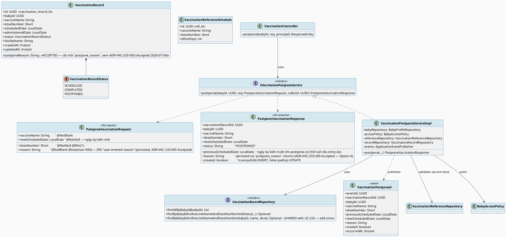
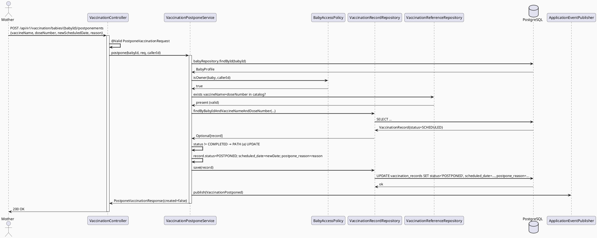
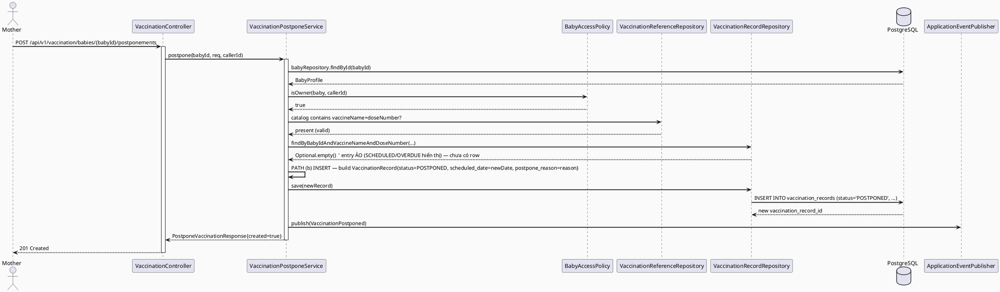
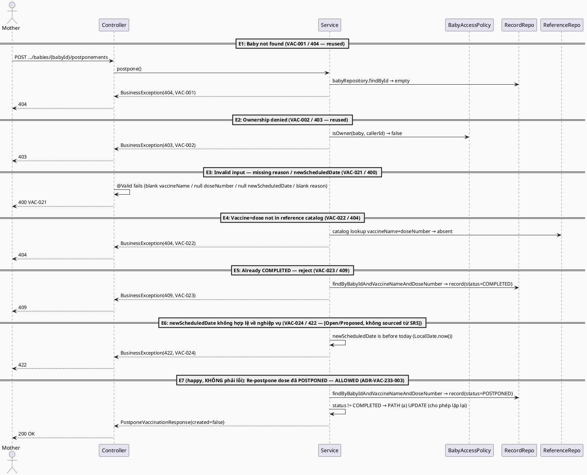
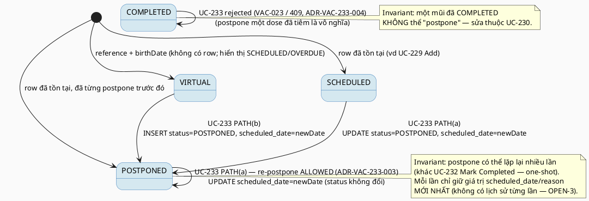

# ENGINEERING DOCUMENTATION STANDARD (EDS) v2.0
# Technical Design Specification — UC-233 Postpone Vaccination

| Field | Value |
|-------|-------|
| **Document ID** | `CB-VAC-IMP-233` |
| **Version** | `1.0` |
| **Date** | `2026-07-03` |
| **Status** | `Partially Implemented` |
| **Document Owner** | `PhuongNT` |
| **Author** | `AI Agent` |
| **Reviewed by** | `[Tech Lead]` |
| **DPO Sign-off** | `[ ] Pending` *(module xử lý PII sức khỏe)* |
| **Approved by** | `[Principal Architect]` |
| **Last Review** | `2026-07-03` |
| **Based on EDS** | `v2.0` |

---

## CHANGELOG

> **Policy 4.4 — Immutable History:** Không bao giờ xóa thông tin cũ. Mọi thay đổi phải ghi vào bảng này.

| Ngày | Người thực hiện | Nội dung thay đổi |
|------|-----------------|-------------------|
| 2026-07-10 | AI Agent | Phase 3: Implementation - 8/17 tests PASS; service-level coverage green, controller/INT/E2E pending |
| 2026-07-03 | AI Agent (Technical Architect) | Tạo tài liệu lần đầu cho UC-233 Postpone Vaccination — thiết kế dual-path (update-existing / create-new, reuse pattern UC-232), repeatable-postpone, và ADR đề xuất migration cho cột `postpone_reason` còn thiếu trong schema |
| 2026-07-04 | AI Agent (Technical Architect) | ADR-VAC-233-005 chuyển `Proposed → Accepted` — user/product owner chọn **Option A** (thêm cột `postpone_reason TEXT` vào `vaccination_records` qua migration `V20260703000001`, không phải audit-log-only). Cập nhật §2 traceability, §4.2 NFR, §5.1/§5.2 schema, §7.3/§8 interface, §11 quy trình, §17 constraints và Phụ lục C (OPEN-4/OPEN-9) để phản ánh quyết định firm; version migration `V20260703000001` re-verify không trùng (migration mới nhất vẫn là `V20260702002000`). Status tài liệu vẫn `Draft`. |

---

## MỤC LỤC

1. [Tổng quan Module](#1-tổng-quan-module)
2. [Ma trận Truy vết (Traceability Matrix)](#2-ma-trận-truy-vết-traceability-matrix)
3. [Architecture Decision Records (ADR)](#3-architecture-decision-records-adr)
4. [Non-Functional Requirements & SLA](#4-non-functional-requirements--sla)
5. [Static Modeling (Mô hình Tĩnh)](#5-static-modeling-mô-hình-tĩnh)
6. [Dynamic Modeling (Mô hình Động)](#6-dynamic-modeling-mô-hình-động)
7. [Domain Event Catalog](#7-domain-event-catalog)
8. [Interface Specification (Đặc tả Giao diện)](#8-interface-specification-đặc-tả-giao-diện)
9. [API Specification](#9-api-specification)
10. [Bảng mã lỗi (Error Codes)](#10-bảng-mã-lỗi-error-codes)
11. [Quy trình Triển khai (Step-by-Step)](#11-quy-trình-triển-khai-step-by-step)
12. [Rollback & Incident Runbook](#12-rollback--incident-runbook)
13. [Kịch bản Kiểm thử Chi tiết](#13-kịch-bản-kiểm-thử-chi-tiết)
14. [Phương pháp Xác minh](#14-phương-pháp-xác-minh)
15. [Mẫu thử thực tế (API Verification Samples)](#15-mẫu-thử-thực-tế-api-verification-samples)
16. [Bảng tổng hợp phân quyền (Authorization Matrix)](#16-bảng-tổng-hợp-phân-quyền-authorization-matrix)
17. [AI Prompt Constraints (CASE 2.0)](#17-ai-prompt-constraints-case-20)

---

## 1. Tổng quan Module

> Cho phép Mother **dời ngày dự kiến** của một mũi tiêm đang ở trạng thái lên lịch (planned dose) sang một ngày mới, kèm **lý do do người dùng nhập** (SRS: "Updates the new expected date and user-entered reason"). Giống UC-232, vì read-side (UC-228, `VaccinationServiceImpl.getVaccinationSchedule`) tổng hợp lịch tiêm bằng cách **merge** danh mục tham chiếu (`vaccination_reference_schedules`) với bản ghi thực (`vaccination_records`) theo khóa chuỗi `vaccineName|doseNumber`, một dose hiển thị `SCHEDULED` hoặc `OVERDUE` trên màn hình có thể **chưa có** bản ghi tương ứng trong DB (entry ảo/synthesized). Hành động "Postpone" do đó cũng phải xử lý **hai đường dẫn** (dual-path, tái sử dụng kiến trúc ADR-VAC-005 của UC-232): cập nhật bản ghi có sẵn (SCHEDULED/POSTPONED), hoặc tạo mới bản ghi POSTPONED khi target là entry ảo.

| Field | Value |
|-------|-------|
| **Module Name** | `PostponeVaccination` |
| **Bounded Context** | `vaccination` |
| **UC ID** | `UC-233` |
| **SRS Reference** | `§3.3.19.6 — Table 255` |
| **Primary Actor** | `Mother (ROLE_MOTHER)` |
| **Data Classification** | `PII` (health data — lịch sử/kế hoạch tiêm chủng của trẻ) |
| **Compliance Scope** | `PDPA` · `BR-RBAC` *(SRS Table 255 liệt kê **chỉ** BR-RBAC — KHÔNG có BR-PRIVACY, khác với UC-229/230/231/232. Xem §2 và ADR-VAC-233-006 để biết xử lý divergence này)* |
| **Upstream Dependencies** | `baby` (BabyProfile, BabyAccessPolicy), `vaccination` (VaccinationReferenceSchedule, VaccinationRecord) |
| **Downstream Consumers** | `vaccination` (UC-228 schedule view — hiển thị status POSTPONED + `scheduled_date` mới), notification/reminder subscribers (`VaccinationPostponed` event) |

---

## 2. Ma trận Truy vết (Traceability Matrix)

> Ánh xạ: [Mã yêu cầu] → [Thành phần Code] → [Mục tiêu Tuân thủ].

| Requirement ID | Loại | Mô tả yêu cầu | Thành phần Code | Compliance Target | ADR |
|----------------|------|---------------|-----------------|-------------------|-----|
| UC-233 | User Story | "Updates the new expected date and user-entered reason." (SRS Table 255) | `VaccinationPostponeService.postpone()` | BR-RBAC | ADR-VAC-233-002 |
| BR-RBAC | Business Rule | Mother chỉ thao tác trên baby mình sở hữu | `BabyAccessPolicy.isOwner()` (cập nhật từ `canView()`) | PDPA (minimum-necessary) | ADR-VAC-233-007 |
| **(GAP)** BR-PRIVACY | *Không có trong SRS Table 255* | Table 255 **không** liệt kê BR-PRIVACY (khác UC-229/230/231/232 đều có). Data vẫn là PII sức khỏe → áp dụng nguyên tắc minimum-necessary như một biện pháp phòng ngừa dù không được SRS này trích dẫn tường minh | `BabyAccessPolicy`, `@Transactional` service boundary | PDPA (thận trọng) | ADR-VAC-233-006 |
| ADR-VAC-233-002 | Decision | Dual-path: UPDATE bản ghi SCHEDULED/POSTPONED có sẵn HOẶC INSERT bản ghi POSTPONED mới | `VaccinationPostponeServiceImpl` | — | ADR-VAC-233-002 |
| ADR-VAC-233-003 | Decision | Postpone lặp lại được phép (POSTPONED → POSTPONED lần nữa với ngày mới) | `VaccinationPostponeServiceImpl` | — | ADR-VAC-233-003 |
| ADR-VAC-233-004 | Decision | Từ chối postpone dose đã COMPLETED (409) | `VaccinationPostponeServiceImpl` | — | ADR-VAC-233-004 |
| ADR-VAC-233-005 | Decision (**Accepted**) | Cột `postpone_reason` **không tồn tại** trong schema hiện tại → **Option A đã chọn**: thêm cột `postpone_reason TEXT` vào `vaccination_records` qua migration mới (không phải audit-log-only) | `V20260703000001__add_vaccination_postpone_reason.sql` | PDPA (PII gián tiếp — free-text) | ADR-VAC-233-005 |
| ADR-VAC-233-001 | Decision | Schema authority = `V1__init_schema.sql` + code thật (UC-228 TDS đã stale) | `vaccination_records` (V1 §660–672) | — | ADR-VAC-233-001 |

---

## 3. Architecture Decision Records (ADR)

### ADR-VAC-233-001 — Schema Authority = V1__init_schema.sql (UC-228 TDS đã STALE)

| Field | Value |
|-------|-------|
| **Status** | `Proposed` |
| **Deciders** | AI Agent (Technical Architect), PhuongNT (Owner) |
| **Date** | `2026-07-03` |
| **Supersedes** | — |

#### Bối cảnh
Sibling TDS `UC228_ViewVaccinationSchedule` (`CB-VAC-IMP-001`, **Approved**) mô tả thiết kế lệch với code đã ship (đã xác nhận bởi UC-229/230/231/232 TDS). Đọc trực tiếp code thật xác nhận cùng divergence cho UC-233:

| Khía cạnh | UC-228 TDS (stale) | REAL CODE / SCHEMA (oracle) |
|-----------|--------------------|------------------------------|
| Bảng `vaccination_records` | (mô tả như module mới) | **Đã tồn tại** trong `V1__init_schema.sql` §660–672 (baseline) |
| Merge/link đọc lịch | FK-based (ngụ ý) | **String key** `vaccineName\|doseNumber` (`VaccinationServiceImpl` §54–70) |
| Enum trạng thái | (khác) | `VaccinationRecordStatus{SCHEDULED, COMPLETED, POSTPONED}` — **không có** trạng thái `OVERDUE` lưu trữ (chỉ tính toán tại query-time, dòng 80–82) |
| Endpoint duy nhất hiện có | (khác) | `GET /api/v1/vaccination/babies/{babyId}/schedule` |
| Cột lưu lý do postpone | (không đề cập) | **KHÔNG tồn tại** — `vaccination_records` chỉ có `scheduled_date`, không có `postpone_reason` (V1 §660–672) |

#### Quyết định
**Nguồn chân lý cho schema = `V1__init_schema.sql` + approved Flyway migrations + code thật đang chạy** (theo CLAUDE.md: "Current code and migrations override historical design notes"). TDS này model 100% theo REAL CODE, cùng cách tiếp cận với ADR-VAC-008 (UC-232).

#### Hệ quả
**Tích cực:** tránh implement sai theo tài liệu stale.
**Tiêu cực / Trade-offs:** cần ghi chú divergence rõ ràng (đã làm ở bảng trên).
**Compliance Impact:** không đổi phạm vi PII.

---

### ADR-VAC-233-002 — Dual-Path Postpone (Update-Existing vs Create-New) ⭐ CORE DECISION

| Field | Value |
|-------|-------|
| **Status** | `Proposed` |
| **Deciders** | AI Agent, PhuongNT |
| **Date** | `2026-07-03` |
| **Supersedes** | — |

#### Bối cảnh
Đọc lại read-side (`VaccinationServiceImpl.getVaccinationSchedule`, dòng 50–94): mỗi reference entry hiển thị `SCHEDULED` hoặc `OVERDUE` **khi không có record** tương ứng trong `vaccination_records` (entry ảo, tính từ `birthDate + offsetDays`). Chỉ khi record tồn tại với `status=COMPLETED` hoặc `status=POSTPONED` thì hiển thị đúng trạng thái đó. Điều này có nghĩa: khi Mother chọn "Postpone" một dose đang hiển thị `SCHEDULED`/`OVERDUE`, target đó **có thể chưa có row** trong DB — giống hệt tình huống UC-232 đã phân tích (ADR-VAC-005).

UC-233 nhận diện target bằng `(babyId, vaccineName, doseNumber)` — không bằng `vaccination_record_id` — nên service phải quyết định UPDATE hay INSERT tại runtime.

#### Các phương án đã xem xét

| Phương án | Mô tả | Ưu điểm | Nhược điểm |
|-----------|-------|----------|------------|
| A | **Dual-path** (tái sử dụng kiến trúc ADR-VAC-005 của UC-232): lookup record theo `(babyId, vaccineName, doseNumber)` bỏ filter status; nếu tồn tại & không phải COMPLETED → UPDATE (`status=POSTPONED`, `scheduled_date=newDate`); nếu không tồn tại → INSERT record mới (`status=POSTPONED`, `scheduled_date=newDate`) | + Khớp đúng ngữ nghĩa read-side (entry ảo)<br>+ Nhất quán kiến trúc với UC-232 (cùng batch, cùng bounded context)<br>+ Không sinh record trùng | - Hai nhánh persistence → nhiều test hơn |
| B | Chỉ UPDATE — yêu cầu record đã tồn tại trước | + Một nhánh | - **Sai** với read-side: entry ảo (SCHEDULED/OVERDUE hiển thị nhưng chưa có row) → 404 giả khi Mother cố postpone dose chưa từng được "Add" |
| C | Luôn INSERT record mới | + Đơn giản | - Sinh **record trùng** nếu đã có row SCHEDULED (vd đã Add qua UC-229) → vi phạm dedupe của read-side |

#### Quyết định
Chọn **Phương án A (Dual-path)**, **tái sử dụng nguyên văn kiến trúc ADR-VAC-005 của UC-232** — cùng lookup method `findByBabyIdAndVaccineNameAndDoseNumber(babyId, vaccineName, doseNumber)` (không filter status), cùng logic phân nhánh UPDATE/INSERT. Đây là **quyết định kiến trúc cốt lõi** của TDS này, kế thừa oracle từ read-side merge logic (`VaccinationServiceImpl` dòng 54–85).

> ✅ **RESOLVED (coordination note — was OPEN-1):** UC-232 TDS (`CB-VAC-IMP-005`, §8.2) cũng đề xuất method `findByBabyIdAndVaccineNameAndDoseNumber(...)` với cùng chữ ký trên `VaccinationRecordRepository`. **Quyết định:** `04_Implement/UC232_MarkVaccinationCompleted/` là **canonical owner** của method này. Lý do chọn UC-232 thay vì UC-233: (1) UC-232 (Mark Completed) có số thứ tự nhỏ hơn UC-233 (Postpone) trong cùng batch — trật tự logic tự nhiên để implement trước; (2) UC-233's chính ADR này (§Quyết định ở trên) đã tự nhận "tái sử dụng nguyên văn kiến trúc ADR-VAC-005 của UC-232", tức UC-233 vốn đã coi UC-232 là nguồn thiết kế gốc. UC-233 **không định nghĩa lại** method — chỉ tái sử dụng `VaccinationRecordRepository.findByBabyIdAndVaccineNameAndDoseNumber(...)` sau khi UC-232 thêm nó vào interface. Nếu UC-233 được implement trước UC-232 trên thực tế, engineer thực hiện chỉ cần thêm method này một lần (bất kể thứ tự) và ghi chú trong code rằng nó được cả hai UC dùng chung — không còn là điểm cần Tech Lead phân xử riêng.

#### Hệ quả
**Tích cực:** Ngữ nghĩa nhất quán với UC-228/UC-232; không sinh record trùng.
**Tiêu cực / Trade-offs:** Hai nhánh → cần test tường minh cho cả hai (xem §13). Race-condition nếu 2 request đồng thời cùng key — giảm thiểu bằng `@Transactional`; unique index `(baby_id, vaccine_name, dose_number)` vẫn **chưa có** trong V1 (đã ghi nhận OPEN-1 tương tự trong UC-232, không lặp lại migration ở đây — xem OPEN-2).
**Compliance Impact:** Không thay đổi phạm vi PII; vẫn giới hạn theo `BabyAccessPolicy`.

---

### ADR-VAC-233-003 — Cho phép Postpone lặp lại (Repeatable Postpone)

| Field | Value |
|-------|-------|
| **Status** | `Proposed` |
| **Deciders** | AI Agent, PhuongNT |
| **Date** | `2026-07-03` |

#### Bối cảnh
Một dose đã ở trạng thái `POSTPONED` (đã dời lịch một lần) có thể cần dời tiếp sang ngày khác nếu Mother tiếp tục không đưa trẻ đi tiêm đúng ngày mới. SRS mô tả hành động là **"Updates the new expected date"** — động từ "Updates" (cập nhật) hàm ý một thao tác có thể lặp lại nhiều lần trên cùng một field, không phải một chuyển trạng thái một-lần (one-shot transition) như "Mark Completed".

#### Các phương án đã xem xét

| Phương án | Mô tả | Ưu điểm | Nhược điểm |
|-----------|-------|----------|------------|
| A | Cho phép postpone một dose đã `POSTPONED` → UPDATE lại `scheduled_date` (status giữ nguyên `POSTPONED`) | + Khớp ngữ nghĩa "Updates" trong SRS<br>+ Phản ánh thực tế: Mother có thể cần dời lịch nhiều lần | - Cần lưu vết postpone-count/lịch sử nếu muốn audit đầy đủ (hiện chưa có cột — xem OPEN-3) |
| B | Chỉ cho phép postpone một lần; postpone-lại bị từ chối (409) | + Đơn giản, một invariant duy nhất | - **Không có cơ sở SRS** để giới hạn 1 lần; sẽ chặn use case hợp lệ (dời lịch nhiều lần do bận, ốm, v.v.) |

#### Quyết định
Chọn **Phương án A — cho phép postpone lặp lại**. Đây là quyết định **firm** (không phải Open), dựa trên cách diễn giải từ ngữ SRS ("Updates the new expected date" — không phải "Sets" hay "Postpones once"). Mỗi lần postpone chỉ UPDATE `scheduled_date` và `postpone_reason` (ADR-VAC-233-005 Accepted — Option A, cột persisted); `status` luôn là `POSTPONED` sau thao tác.

#### Hệ quả
**Tích cực:** hỗ trợ đúng workflow thực tế của Mother.
**Tiêu cực / Trade-offs:** không lưu lịch sử các lần dời trước (chỉ giữ giá trị mới nhất) — nếu cần audit trail đầy đủ từng lần dời, cần bảng lịch sử riêng (ghi **OPEN-3**, ngoài scope UC-233).

---

### ADR-VAC-233-004 — Từ chối Postpone dose đã COMPLETED

| Field | Value |
|-------|-------|
| **Status** | `Proposed` |
| **Deciders** | AI Agent, PhuongNT |
| **Date** | `2026-07-03` |

#### Bối cảnh
Một dose đã `COMPLETED` (đã tiêm thực tế, có `administered_date`) không còn ý nghĩa "dời lịch" — hành động postpone chỉ áp dụng cho dose **chưa tiêm**. Đây là bất biến trạng thái tương tự UC-232 (không cho re-complete một dose đã COMPLETED).

#### Quyết định
Từ chối với `409 Conflict` (`VAC-023`) khi lookup thấy record hiện có `status=COMPLETED`. Sửa dose đã hoàn thành thuộc phạm vi UC-230 (Update Vaccination Record), không phải UC-233.

#### Hệ quả
**Tích cực:** giữ tính toàn vẹn dữ liệu — không "dời lịch" một sự kiện đã xảy ra.
**Tiêu cực / Trade-offs:** không có.

---

### ADR-VAC-233-005 — Cột lưu lý do postpone (`postpone_reason`) CHƯA tồn tại trong schema ⭐ SCHEMA GAP

| Field | Value |
|-------|-------|
| **Status** | `Accepted` *(cập nhật từ `Proposed`)* |
| **Deciders** | AI Agent, PhuongNT |
| **Date** | `2026-07-03` (đề xuất) — **Accepted 2026-07-04** |
| **Acceptance Note** | Accepted by user/product owner, 2026-07-04 — Option A selected (persisted column, not audit-log-only), because SRS explicitly names "user-entered reason" as parallel to "new expected date", implying both are first-class stored fields, not just an audit trail entry. |

#### Bối cảnh
SRS Table 255 mô tả hành động là **"Updates the new expected date and user-entered reason"** — cấu trúc song song (parallel structure) ngụ ý **cả hai** giá trị (ngày mới VÀ lý do) đều là input được ghi nhận như first-class data, không chỉ ngày. Tuy nhiên, đọc trực tiếp `V1__init_schema.sql` (dòng 660–672), bảng `vaccination_records` có đúng các cột:

```
vaccination_record_id, baby_id, vaccine_name, dose_number, scheduled_date,
administered_date, status, facility_name, proof_record_id, created_at, updated_at
```

**Không có cột nào** để lưu "lý do dời lịch" (`postpone_reason` hoặc tương đương). Đây là **schema gap thật**, không phải giả định — đã xác minh bằng cách đọc migration.

#### Các phương án đã xem xét

| Phương án | Mô tả | Ưu điểm | Nhược điểm |
|-----------|-------|----------|------------|
| **A (khuyến nghị)** | Thêm cột mới `postpone_reason TEXT NULL` vào `vaccination_records` qua Flyway migration mới | + Lý do là first-class, queryable, hiển thị lại được trên UI (khớp "Updates ... reason" trong SRS)<br>+ Hỗ trợ báo cáo/thống kê lý do trì hoãn tiêm (an toàn công cộng) | - Cần migration mới + ALTER TABLE trên bảng đang có dữ liệu (rủi ro thấp vì cột NULL-able, không cần backfill) |
| B | Không tạo cột mới — chỉ ghi lý do vào audit/domain-event log (non-queryable field, chỉ tồn tại trong payload sự kiện `VaccinationPostponed`, không có trong bảng chính) | + Không cần migration | - Lý do **không thể truy vấn lại** qua API (vd hiển thị lại lý do postpone trên UI chi tiết) — vi phạm ngụ ý "Updates ... reason" của SRS (lý do trở thành ephemeral, không phải state được lưu cùng record) — không phù hợp với cấu trúc song song trong description |

#### Quyết định
**Phương án A được ACCEPTED (2026-07-04)** bởi user/product owner vì cấu trúc song song trong SRS ("Updates the new expected date **and** user-entered reason") hàm ý lý do được lưu trữ và truy xuất lại được, tương tự ngày mới, chứ không phải một audit trail entry đơn thuần. Đây là quyết định **firm**, không còn `Proposed`:
1. ~~Tech Lead xác nhận phạm vi~~ — **Đã xác nhận**: cột trực tiếp trên `vaccination_records` (không phải audit-only); OPEN-3 (lịch sử từng lần postpone) vẫn Open riêng, không chặn quyết định này.
2. **Không xung đột** với migration khác đang chờ approve trong cùng batch (UC-229..232) — đã kiểm tra: không có TDS nào khác trong batch đề xuất ALTER `vaccination_records` thêm cột `postpone_reason`.

**Tên file migration (Accepted — sẽ tạo khi implement):** `V20260703000001__add_vaccination_postpone_reason.sql`

Xác nhận version number (re-verified 2026-07-04): đã liệt kê lại toàn bộ `05_Development/CareBridgeAPI/src/main/resources/db/migration/` (33 file) — migration mới nhất theo quy ước timestamp `V{YYYYMMDD}{6-digit-seq}` vẫn là `V20260702002000__create_red_flag_rules.sql` (ngày 2026-07-02); không có migration mới nào được thêm kể từ khi TDS này được soạn. Chưa có migration nào cho ngày `20260703` → `V20260703000001` vẫn là version **kế tiếp hợp lệ, không trùng, đã re-verify collision-free**.

**Nội dung migration (Accepted — tạo file khi bước vào implement, KHÔNG tạo trong phạm vi cập nhật TDS này):**
```sql
-- V20260703000001__add_vaccination_postpone_reason.sql (ACCEPTED — tạo file khi implement)
ALTER TABLE public.vaccination_records
    ADD COLUMN IF NOT EXISTS postpone_reason TEXT;
-- Không NOT NULL (backward-compatible với các row COMPLETED/SCHEDULED hiện có, không cần backfill)
-- Không index (trường tự do, không dùng để filter/query theo lý do)
```

**Sync action cho "reference copy" của schema (theo quy ước project):** Dự án có tài liệu snapshot riêng `05_Development/Database/postgres/V1_SCHEMA_BASELINE.md` (frontmatter: `migration_file: V1__init_schema.sql`, phạm vi khai báo rõ là **chỉ** baseline V1, liệt kê **danh sách bảng** — không liệt kê chi tiết cột). Vì migration là `ALTER TABLE ADD COLUMN` trên bảng **đã tồn tại** trong V1 (không tạo bảng mới, không đổi `table_count: 71`), **không cần sửa** `V1_SCHEMA_BASELINE.md` theo phạm vi khai báo hiện tại của chính tài liệu đó (chỉ track bảng, không track cột). Đây là kết luận CG-9 (xem §13/Test-Spec). Nếu sau này dự án mở rộng baseline doc để track cấp cột, cần thêm dòng ghi chú `postpone_reason` vào đó — ghi **OPEN-4**.

#### Hệ quả
**Tích cực:** lý do postpone trở thành dữ liệu có cấu trúc, truy vấn được, hỗ trợ hiển thị lại trên UI và báo cáo.
**Tiêu cực / Trade-offs:** Thêm một migration mới vào pipeline; cần backup trước khi chạy trên production (§11.2, §12).
**Compliance Impact:** `postpone_reason` là free-text do Mother nhập — có thể chứa PII gián tiếp (vd "con tôi bị sốt do X") → phân loại `PII`, áp dụng cùng nguyên tắc minimum-necessary như các trường sức khỏe khác.

> **Phương án B đã bị loại bỏ (không còn active alternative):** giữ lại đoạn này chỉ để tham chiếu lịch sử — trước khi Accepted, TDS có cân nhắc phương án audit-log-only (`reason` chỉ trong payload `VaccinationPostponed`, không có cột riêng). Phương án này **không được chọn**; mọi thiết kế API/entity trong tài liệu này (§8, §9) nay là **firm theo Option A**, không còn điều kiện "nếu B được chọn".

---

### ADR-VAC-233-006 — Xử lý divergence: SRS Table 255 KHÔNG liệt kê BR-PRIVACY

| Field | Value |
|-------|-------|
| **Status** | `Proposed` |
| **Deciders** | AI Agent, PhuongNT |
| **Date** | `2026-07-03` |

#### Bối cảnh
So sánh Business Rules trong SRS giữa các UC cùng nhóm "Vaccination & Growth Tracking":

| UC | Business Rules (SRS) |
|----|----------------------|
| UC-229 Add Vaccination Record | BR-RBAC, BR-PRIVACY |
| UC-230 Update Vaccination Record | BR-RBAC, BR-PRIVACY |
| UC-231 Delete Vaccination Record | BR-RBAC, BR-PRIVACY |
| UC-232 Mark Vaccination Completed | BR-RBAC, BR-PRIVACY |
| **UC-233 Postpone Vaccination** | **BR-RBAC** *(chỉ một)* |

Đây là một divergence **có nguồn** (đọc trực tiếp Table 255, không phải suy đoán): UC-233 là use case **duy nhất** trong nhóm 5 UC vaccination write không liệt kê BR-PRIVACY.

#### Các phương án đã xem xét

| Phương án | Mô tả | Ưu điểm | Nhược điểm |
|-----------|-------|----------|------------|
| A | Coi đây là **lỗi soạn thảo SRS** (thiếu sót), vẫn áp dụng đầy đủ nguyên tắc BR-PRIVACY như các UC sibling vì dữ liệu về bản chất là PII sức khỏe giống hệt | + An toàn hơn cho compliance<br>+ Nhất quán triển khai kỹ thuật giữa các UC cùng bounded context | - Vượt quá những gì SRS yêu cầu tường minh cho UC này |
| B | Tuân thủ đúng SRS như viết — chỉ á p dụng BR-RBAC, không có ràng buộc BR-PRIVACY bổ sung nào ngoài RBAC | + Đúng theo tài liệu nguồn | - Rủi ro: nếu đây thực sự là chủ ý (vd vì "reason" không phải dữ liệu y tế nhạy cảm), việc thêm PRIVACY controls không hại; nhưng nếu bỏ qua khi lẽ ra cần thì vi phạm PDPA |

#### Quyết định
Chọn **Phương án A** làm biện pháp phòng ngừa: kỹ thuật vẫn dùng `BabyAccessPolicy` (minimum-necessary access) như mọi UC vaccination khác, coi việc thiếu BR-PRIVACY trong Table 255 là **Open item cần Product/Legal xác nhận** (không tự ý diễn giải là "cố tình bỏ BR-PRIVACY"). TDS **không** nới lỏng access control chỉ vì SRS thiếu dòng này.

#### Hệ quả
**Tích cực:** không tạo lỗ hổng compliance do đọc SRS quá sát chữ.
**Tiêu cực / Trade-offs:** không có — Phương án A chỉ giữ nguyên mức bảo vệ hiện có, không thêm gì mới.
**Compliance Impact:** Ghi **OPEN-5**: xác nhận với Product/Legal liệu việc SRS Table 255 thiếu BR-PRIVACY là chủ ý hay lỗi soạn thảo.

---

### ADR-VAC-233-007 — Authorization qua BabyAccessPolicy.isOwner() (owner-only, aligned với batch precedent)

| Field | Value |
|-------|-------|
| **Status** | `Accepted` *(cập nhật từ `Proposed`/reuse-canView)* |
| **Deciders** | AI Agent, PhuongNT |
| **Date** | `2026-07-03` (cập nhật khi audit cross-cutting batch) |

#### Bối cảnh
Giống ADR-VAC-006 (UC-232): `BabyAccessPolicy.canView(baby, callerId)` = owner OR ACCEPTED care-group member (`BabyAccessPolicy.java` dòng 22–28). Chưa có `canManage`/`canEdit` chuyên cho write.

#### Quyết định
**Cập nhật quyết định (thay thế "reuse canView" ban đầu):** Chọn **owner-only**, dùng `BabyAccessPolicy.isOwner(baby, callerId)`. Lý do đổi: 3 trong 5 tài liệu batch (UC-229 ADR-VAC-229-003, UC-230 ADR-VAC-005, UC-231 ADR-VAC-DELETE-002 — tất cả `Accepted`) đã độc lập quyết định owner-only-cho-write; UC-232 (sibling gần nhất, cùng dual-path pattern) cũng đã cập nhật ADR-VAC-006 sang owner-only trong đợt audit chéo này. Để UC-233 (Postpone — cùng mức rủi ro dữ liệu y tế) là UC ghi **duy nhất** còn lại reuse `canView` sẽ phá vỡ tính nhất quán toàn batch mà không có lý do nghiệp vụ. **RESOLVED bằng cách align với UC-232 và precedent chung của batch.**

> **Còn Open (Category B — câu hỏi giống hệt cũng xuất hiện ở UC-232 Appendix C, ADR-VAC-006):** Có nên chính thức hóa `isOwner()` thành convention/API bắt buộc trên `BabyAccessPolicy` cho mọi write use-case tương lai (ngoài vaccination), hay để từng bounded context tự quyết định theo từng trường hợp? Quyết định kiến trúc rộng hơn phạm vi UC-233, cần Principal Architect phê chuẩn một lần cho cả batch — không chặn implementation của UC-233 (đã có `isOwner()` cụ thể để dùng ngay).

#### Hệ quả
Tích cực: nhất quán authorization trên toàn bộ 5/5 UC ghi của batch vaccination (Add/Update/Delete/Complete/Postpone đều owner-only). Trade-off: quyền ghi hẹp hơn quyền đọc (UC-228) — thiết kế đúng (least-privilege), không phải khiếm khuyết.

> *(Thêm ADR mới bên dưới, không xóa ADR cũ.)*

---

## 4. Non-Functional Requirements & SLA

> SRS Table 255 **không** quy định SLA số. Các giá trị dưới đây là **placeholder tham chiếu template**, đánh dấu `Open` cho tới khi có nguồn chính thức. Không được coi là cam kết.

### 4.1. Performance & Availability

| Category | Requirement | Target SLA | Measurement | Compliance Basis |
|----------|-------------|------------|-------------|------------------|
| Latency | `POST .../postponements` (p99) | `< 300ms` *(Open — chưa có nguồn)* | k6 load test | — |
| Availability | Uptime | `99.9%` *(Open)* | Uptime monitor | — |

### 4.2. Data Integrity & Retention

| Category | Requirement | Target | Verification | Compliance Basis |
|----------|-------------|--------|--------------|------------------|
| Consistency | Không sinh record trùng `(baby, vaccine, dose)` | 100% | Read-side dedupe + (khuyến nghị, ngoài scope) unique index | ADR-VAC-233-002 |
| Durability | Zero record loss sau commit | RPO = 0 | Transaction log | PDPA |
| Migration integrity (ADR-VAC-233-005 Accepted — Option A) | Cột `postpone_reason` nullable, không backfill bắt buộc | 100% | `\d vaccination_records` sau migrate | ADR-VAC-233-005 |

### 4.3. Security

| Category | Requirement | Target | Verification | Compliance Basis |
|----------|-------------|--------|--------------|------------------|
| Access control | Owner / ACCEPTED member only | Least privilege | `BabyAccessPolicy` (§16) | BR-RBAC |
| Transport | TLS | TLS 1.3+ *(Open — hạ tầng)* | SSL scan | PDPA |
| Data minimization | `reason` free-text — không log plaintext ra ngoài audit có kiểm soát | — | Log scrub check | ADR-VAC-233-006 |

### 4.4. Scalability & Capacity Planning

> Tải dự kiến: thấp (Frequency = Regular, per-baby write, theo SRS Table 255). Không cần chiến lược scale đặc biệt. Truy vấn lookup dùng index `idx_vaccination_records_baby_id` (V1 §1609). *(Chi tiết capacity: Open — chưa có nguồn.)*

---

## 5. Static Modeling (Mô hình Tĩnh)

### 5.1. Class Diagram (PlantUML)



**Planned file paths (NEW / MODIFIED):**

| File | Trạng thái |
|------|-----------|
| `vaccination/dto/request/PostponeVaccinationRequest.java` | NEW |
| `vaccination/dto/response/PostponeVaccinationResponse.java` | NEW |
| `vaccination/service/IVaccinationPostponeService.java` | NEW |
| `vaccination/service/impl/VaccinationPostponeServiceImpl.java` | NEW |
| `vaccination/mapper/VaccinationPostponeMapper.java` | NEW (entity→response) |
| `vaccination/event/VaccinationPostponed.java` | NEW |
| `vaccination/controller/VaccinationController.java` | MODIFIED (thêm POST method) |
| `vaccination/entity/VaccinationRecord.java` | MODIFIED — thêm `postponeReason` mapping (ADR-VAC-233-005 **Accepted**, thực hiện ở Chặng 2 §11.3) |
| `vaccination/repository/VaccinationRecordRepository.java` | MODIFIED — thêm derived query (**shared với UC-232**, xem OPEN-1) |
| `src/main/resources/db/migration/V20260703000001__add_vaccination_postpone_reason.sql` | **ACCEPTED — sẽ tạo khi implement** (ADR-VAC-233-005, Option A) |

### 5.2. Data Structure (Flyway SQL Migration)

> **KẾT LUẬN SCHEMA: migration MỚI đã ACCEPTED (2026-07-04).** Khác với UC-229/230/231/232 (không cần migration), UC-233 là feature **duy nhất** trong batch vaccination cần một cột mới thật sự chưa tồn tại (`postpone_reason`) — SRS yêu cầu lưu "user-entered reason" như first-class input, schema hiện tại không có chỗ chứa, và Option A (cột riêng) đã được user/product owner chấp thuận thay vì audit-log-only (xem ADR-VAC-233-005).

Schema hiện có (trích `V1__init_schema.sql` §660–672, §1609–1610, §1730–1734 — **read-only reference, KHÔNG sửa**):

```sql
-- Bảng đã có (baseline V1) — KHÔNG tạo lại, chỉ tham chiếu
CREATE TABLE public.vaccination_records (
    vaccination_record_id uuid         NOT NULL DEFAULT gen_random_uuid(),
    baby_id               uuid         NOT NULL,
    vaccine_name          varchar(200) NOT NULL,
    dose_number           smallint,
    scheduled_date        date,
    administered_date     date,
    status                varchar(20)  NOT NULL DEFAULT 'SCHEDULED',
    facility_name         varchar(200),
    proof_record_id       uuid,
    created_at            timestamptz  NOT NULL DEFAULT now(),
    updated_at            timestamptz  NOT NULL DEFAULT now()
);
-- Index đã có: idx_vaccination_records_baby_id, idx_vaccination_records_status
-- FK đã có: vaccination_records_baby_id_fkey, vaccination_records_proof_record_id_fkey
```

**Migration ACCEPTED (mô tả text — file .sql thật sẽ được tạo khi bước vào implementation, không trong phạm vi cập nhật spec này):**

```
File: src/main/resources/db/migration/V20260703000001__add_vaccination_postpone_reason.sql

ALTER TABLE public.vaccination_records
    ADD COLUMN IF NOT EXISTS postpone_reason TEXT;
```

- **Version xác nhận (re-verified 2026-07-04):** `V20260703000001` — liệt kê lại trực tiếp toàn bộ `db/migration/` (vẫn 33 file), migration mới nhất vẫn là `V20260702002000__create_red_flag_rules.sql` (2026-07-02); không có migration mới nào phát sinh kể từ bản Draft ban đầu; chưa có migration nào ngày `20260703` → an toàn, không trùng, collision-free đã re-confirm.
- **Không** NOT NULL, không cần backfill (cột mới, mọi row hiện có → NULL hợp lệ).
- **Không** thêm index (không dùng để filter/query).
- **Rollback:** `ALTER TABLE public.vaccination_records DROP COLUMN IF EXISTS postpone_reason;` (xem §12).

> **Lịch sử (không còn active):** Option B (audit-log-only, không migration) đã được cân nhắc nhưng **không được chọn**. Migration này là bắt buộc cho UC-233.

---

## 6. Dynamic Modeling (Mô hình Động)

### 6.1. Sequence Diagram — Happy Path (a): Update existing SCHEDULED/POSTPONED row



### 6.2. Sequence Diagram — Happy Path (b): Create new POSTPONED row (virtual entry)



### 6.3. Sequence Diagram — Error Paths (bao gồm already-completed / re-postpone-allowed / ownership-denied)



### 6.4. State Machine



> **⚠️ Invariant bất biến:**
> - INV-1: Không tạo hai `vaccination_records` cùng `(baby_id, vaccine_name, dose_number)` qua UC-233 (dual-path lookup ngăn điều này, chia sẻ cơ chế với UC-232).
> - INV-2: `status=COMPLETED` không thể chuyển sang `POSTPONED` qua UC-233 (reject 409 VAC-023).
> - INV-3: `POSTPONED` **có thể** postpone lặp lại (không giống COMPLETED) — ADR-VAC-233-003.
> - INV-4: `newScheduledDate` và `reason` đều bắt buộc trên mọi request (VAC-021 nếu thiếu).

---

## 7. Domain Event Catalog

### 7.1. Events Published

| Event Name | Trigger | Publisher | Subscriber(s) | Payload Schema | Async? |
|------------|---------|-----------|---------------|----------------|--------|
| `VaccinationPostponed` | Sau khi UPDATE/INSERT POSTPONED commit | `VaccinationPostponeServiceImpl` | reminder/notification (nếu có) — *(Open: subscriber cụ thể chưa xác định, giống UC-232)* | `VaccinationPostponed.java` | No (in-process `ApplicationEventPublisher`) |

### 7.2. Events Consumed

| Event Name | Source | Handler | Action |
|------------|--------|---------|--------|
| — | — | — | UC-233 không tiêu thụ event nào |

### 7.3. Payload Schema

```java
// VaccinationPostponed.java
public record VaccinationPostponed(
    UUID      eventId,               // UUID.randomUUID() — deduplicate
    UUID      vaccinationRecordId,   // record vừa UPDATE/INSERT
    UUID      babyId,
    String    vaccineName,
    Short     doseNumber,
    LocalDate previousScheduledDate, // giá trị TRƯỚC khi postpone (có thể null nếu path (b))
    LocalDate newScheduledDate,
    String    reason,                // luôn có trong event; source of truth = cột `postpone_reason` (ADR-VAC-233-005 Accepted)
    boolean   created,               // true = path(b) INSERT, false = path(a) UPDATE
    Instant   occurredAt,            // Instant.now()
    UUID      causedBy               // callerId (Mother)
) { }
```

> **Ghi chú (ADR-VAC-233-005 Accepted — Option A):** event vẫn phát `reason` (để consumer không cần query lại DB), nhưng giá trị chân lý (source of truth) là cột `postpone_reason` trên `vaccination_records`.

---

## 8. Interface Specification (Đặc tả Giao diện)

### 8.1. Service Interface

```java
// PostponeVaccinationRequest.java — Input DTO   @version 1.0
public class PostponeVaccinationRequest {
    @NotBlank @Size(max = 200)
    private String vaccineName;      // khớp key read-side vaccineName

    @NotNull @Min(1)
    private Short doseNumber;        // khớp key read-side doseNumber

    @NotNull
    private LocalDate newScheduledDate; // bắt buộc — ngày dự kiến mới (VAC-021 nếu null)
                                          // [Open/Proposed — VAC-024 nếu < today, xem §10]

    @NotBlank @Size(max = 500)
    private String reason;           // bắt buộc — SRS "user-entered reason" (VAC-021 nếu blank)
    // getters / setters
}

// PostponeVaccinationResponse.java — Output DTO   @version 1.0
public class PostponeVaccinationResponse {
    private UUID vaccinationRecordId;
    private UUID babyId;
    private String vaccineName;
    private Short doseNumber;
    private LocalDate previousScheduledDate; // null nếu path(b) — không có giá trị cũ để so sánh
    private LocalDate newScheduledDate;
    private String status;          // "POSTPONED"
    private String reason;          // persisted via `postpone_reason` column (ADR-VAC-233-005 Accepted — Option A);
                                      //  luôn có trong response ngay sau request
    private boolean created;        // true=INSERT (path b), false=UPDATE (path a)
    // getters / setters
}

// IVaccinationPostponeService.java   @version 1.0
public interface IVaccinationPostponeService {
    /**
     * Dời ngày dự kiến của một mũi tiêm sang ngày mới kèm lý do (dual-path: update-existing hoặc create-new).
     * Cho phép postpone lặp lại nhiều lần (ADR-VAC-233-003).
     * @throws BusinessException (VAC-001/404) nếu baby không tồn tại
     * @throws BusinessException (VAC-002/403) nếu caller không có quyền (BabyAccessPolicy)
     * @throws BusinessException (VAC-022/404) nếu vaccineName+doseNumber không có trong reference catalog
     * @throws BusinessException (VAC-023/409) nếu mũi đã COMPLETED (ADR-VAC-233-004)
     * @throws BusinessException (VAC-024/422) nếu newScheduledDate không hợp lệ về nghiệp vụ [Open/Proposed]
     * (VAC-021/400 do @Valid ở controller)
     */
    PostponeVaccinationResponse postpone(UUID babyId,
                                          PostponeVaccinationRequest request,
                                          UUID callerId);
}
```

### 8.2. Repository Interface

```java
// VaccinationRecordRepository.java   @version 1.1 (thêm 1 derived query — SHARED với UC-232)
public interface VaccinationRecordRepository extends JpaRepository<VaccinationRecord, UUID> {

    List<VaccinationRecord> findAllByBabyId(UUID babyId);                       // existing

    Optional<VaccinationRecord> findByBabyIdAndVaccineNameAndDoseNumberAndStatus(
            UUID babyId, String vaccineName, short doseNumber,
            VaccinationRecordStatus status);                                    // existing

    // Canonical owner: UC-232 (CB-VAC-IMP-005 §8.2) — UC-233 REUSES this method, does not redefine it.
    // RESOLVED (was OPEN-1): only add once; UC-232 is the designated owner (see ADR-VAC-233-002).
    Optional<VaccinationRecord> findByBabyIdAndVaccineNameAndDoseNumber(
            UUID babyId, String vaccineName, short doseNumber);
}
```

> **Ghi chú entity/type:** `VaccinationRecord.doseNumber` là `Short` (nullable); derived query nhận `short` — service unbox `request.getDoseNumber()` (đảm bảo non-null bởi `@NotNull`). ADR-VAC-233-005 Accepted (Option A): thêm `@Column(name="postpone_reason") private String postponeReason;` vào `VaccinationRecord`.

---

## 9. API Specification

### 9.1. Endpoints Table

| Method | Path | Auth Level | Required Roles | Rate Limit | Idempotent? |
|--------|------|------------|----------------|------------|-------------|
| `POST` | `/api/v1/vaccination/babies/{babyId}/postponements` | JWT Bearer | `ROLE_MOTHER` (owner/ACCEPTED member) | 60/min *(Open)* | No (create case) / effectively-safe (update case, giá trị cuối cùng thắng — không tích lũy) |

**Justify verb (POST, không phải PATCH):** giống lý do của UC-232 (§9.1, CB-VAC-IMP-005) — target được nhận diện bằng `(vaccineName, doseNumber)`, **không** bằng một resource id đã biết trước, và path (b) **tạo mới** resource khi target là entry ảo. PATCH ngụ ý sửa resource đã tồn tại tại URI đã biết — sai với entry ảo (chưa có row → không có URI để PATCH). POST tới sub-collection `/postponements` mô tả đúng "tạo một lần postpone", cho phép trả `201 Created` (path b) hoặc `200 OK` (path a, kể cả re-postpone).

### 9.2. Request / Response Schemas

#### `POST /api/v1/vaccination/babies/{babyId}/postponements`

**Request Body:**
```json
{
  "vaccineName": "DTP-VGB-Hib",
  "doseNumber": 2,
  "newScheduledDate": "2026-09-15",
  "reason": "Bé bị sốt nhẹ, bác sĩ khuyên hoãn tiêm 2 tuần"
}
```

**Response — 201 Created (Path b — INSERT new POSTPONED):**
```json
{
  "vaccinationRecordId": "550e8400-e29b-41d4-a716-446655440000",
  "babyId": "11111111-1111-1111-1111-111111111111",
  "vaccineName": "DTP-VGB-Hib",
  "doseNumber": 2,
  "previousScheduledDate": null,
  "newScheduledDate": "2026-09-15",
  "status": "POSTPONED",
  "reason": "Bé bị sốt nhẹ, bác sĩ khuyên hoãn tiêm 2 tuần",
  "created": true
}
```

**Response — 200 OK (Path a — UPDATE existing SCHEDULED/POSTPONED, bao gồm re-postpone):** giống trên với `"created": false` và `"previousScheduledDate"` khác `null`.

**Response — 409 Conflict (đã COMPLETED):**
```json
{ "error": { "code": "VAC-023", "message": "Vaccination dose is already completed and cannot be postponed" } }
```

**Response — 404 (vaccine+dose không trong catalog):**
```json
{ "error": { "code": "VAC-022", "message": "Vaccine/dose not found in reference schedule" } }
```

**Response — 400 (thiếu reason hoặc newScheduledDate):**
```json
{
  "error": {
    "code": "VAC-021",
    "message": "Validation failed",
    "details": [
      { "field": "reason", "message": "reason is required" }
    ]
  }
}
```

> **Wrapper:** response bọc trong `ApiResponse.success(...)` (nhất quán `VaccinationController` hiện tại). Schema trên là phần `data`.

---

## 10. Bảng mã lỗi (Error Codes)

> Tiền tố `VAC-`. UC-233 **reuse** `VAC-001`/`VAC-002` và **dùng riêng** `VAC-021`–`VAC-024`. Không dùng VAC-004..020 (thuộc sibling UC-229/230/231/232).

| Code | HTTP | Message (EN) | Message (VI) | Trigger Condition |
|------|------|--------------|--------------|-------------------|
| `VAC-001` | 404 | Baby profile not found | Không tìm thấy hồ sơ bé | `babyRepository.findById(babyId)` rỗng (reuse UC-228/232) |
| `VAC-002` | 403 | Access denied to vaccination schedule | Không có quyền truy cập | `BabyAccessPolicy.isOwner` = false (owner-only cho write — cập nhật từ `canView`; mã lỗi vẫn tái dùng VAC-002) |
| `VAC-021` | 400 | Validation failed | Dữ liệu không hợp lệ | `@Valid` fail: vaccineName blank, doseNumber null/<1, newScheduledDate null, **reason blank** |
| `VAC-022` | 404 | Vaccine/dose not found in reference schedule | Vắc-xin/mũi không có trong danh mục | `(vaccineName, doseNumber)` không khớp `vaccination_reference_schedules` |
| `VAC-023` | 409 | Vaccination dose is already completed and cannot be postponed | Mũi tiêm đã hoàn thành, không thể dời lịch | Record tồn tại với `status=COMPLETED` (ADR-VAC-233-004) |
| `VAC-024` | 422 | New scheduled date must not be earlier than today | Ngày dự kiến mới không được ở quá khứ | `newScheduledDate.isBefore(LocalDate.now())` — **[Open/Proposed]**: quy tắc này KHÔNG có nguồn SRS tường minh, là suy luận kỹ thuật hợp lý ("postpone" = dời tới tương lai); cần Product xác nhận trước khi Accepted |

---

## 11. Quy trình Triển khai (Step-by-Step)

### 11.1. Prerequisites
- [ ] ADR-VAC-233-001..004, 006, 007 được Accepted (§3)
- [x] ~~ADR-VAC-233-005 (migration cột `postpone_reason`) được Tech Lead quyết định Option A hay B **trước khi** code~~ **RESOLVED — Accepted 2026-07-04, Option A** (xem §3 ADR-VAC-233-005)
- [ ] DPO sign-off (module PII sức khỏe)
- [ ] TDS + Test-Spec `Approved`
- [x] ~~OPEN-1 (coordination với UC-232 về `findByBabyIdAndVaccineNameAndDoseNumber`)~~ **RESOLVED** — UC-232 là canonical owner (xem ADR-VAC-233-002)
- [ ] OPEN-5 (BR-PRIVACY omission SRS), OPEN-8 (VAC-024 inferred rule) được Principal Architect/Product/Tech Lead phân xử. ~~OPEN-6 (canManage)~~ và ~~OPEN-9 (postpone_reason migration Option A/B)~~ đã **RESOLVED**.

### 11.2. Pre-Migration Checklist *(ADR-VAC-233-005 Accepted — Option A, migration bắt buộc trước khi code Chặng 2+)*
- [ ] Backup DB: `pg_dump -h $DB_HOST -U $DB_USER $DB_NAME > backup_YYYYMMDD.sql`
- [ ] Xác nhận `V20260703000001` chưa tồn tại trên `flyway_schema_history` môi trường target
- [ ] Migration test trên staging ≥ 24 giờ trước production
- [ ] DPO sign-off vì cột mới lưu free-text có thể chứa PII gián tiếp

### 11.3. Implementation Steps

#### Chặng 1 — Flyway migration (BẮT BUỘC — ADR-VAC-233-005 Accepted, Option A)
```sql
-- V20260703000001__add_vaccination_postpone_reason.sql
ALTER TABLE public.vaccination_records
    ADD COLUMN IF NOT EXISTS postpone_reason TEXT;
```
```bash
./mvnw flyway:migrate
```

#### Chặng 2 — Entity mapping (BẮT BUỘC — Option A Accepted)
```java
// VaccinationRecord.java — thêm field map tới cột mới (Option A)
@Column(name = "postpone_reason")
private String postponeReason;
```

#### Chặng 3 — Repository derived query (canonical owner: UC-232 — xem ADR-VAC-233-002, RESOLVED)
Thêm `findByBabyIdAndVaccineNameAndDoseNumber(...)` (§8.2) **nếu chưa được UC-232 thêm trước đó**; UC-232 là canonical owner của method này.

#### Chặng 4 — Service dual-path
```java
// Rút gọn — logic then chốt
var baby = babyRepository.findById(babyId)
        .orElseThrow(() -> new BusinessException(NOT_FOUND, "VAC-001", ...));
if (!accessPolicy.isOwner(baby, callerId))
        throw new BusinessException(FORBIDDEN, "VAC-002", ...);
// VAC-022: reference catalog validation
if (!referenceExists(req.getVaccineName(), req.getDoseNumber()))
        throw new BusinessException(NOT_FOUND, "VAC-022", ...);
// VAC-024: business-rule date check [Open/Proposed]
if (req.getNewScheduledDate().isBefore(LocalDate.now()))
        throw new BusinessException(UNPROCESSABLE_ENTITY, "VAC-024", ...);
var existing = recordRepository.findByBabyIdAndVaccineNameAndDoseNumber(
        babyId, req.getVaccineName(), req.getDoseNumber());
if (existing.isPresent()) {
    var rec = existing.get();
    if (rec.getStatus() == COMPLETED)                          // VAC-023
        throw new BusinessException(CONFLICT, "VAC-023", ...);
    // PATH (a) UPDATE — cả SCHEDULED→POSTPONED và POSTPONED→POSTPONED (re-postpone, ADR-VAC-233-003)
    var previous = rec.getScheduledDate();
    rec.setStatus(POSTPONED); rec.setScheduledDate(req.getNewScheduledDate());
    rec.setPostponeReason(req.getReason()); // ADR-VAC-233-005 Accepted (Option A) — luôn persist
    ... save; created=false; HTTP 200
} else {
    // PATH (b) INSERT
    var rec = VaccinationRecord.builder().babyId(babyId)...status(POSTPONED)
              .scheduledDate(req.getNewScheduledDate())
              .postponeReason(req.getReason()) // ADR-VAC-233-005 Accepted (Option A) — luôn persist
              .build();
    ... save; created=true; HTTP 201
}
events.publishEvent(new VaccinationPostponed(...));
```

#### Chặng 5 — Controller
```java
@PostMapping("/babies/{babyId}/postponements")
@PreAuthorize("isAuthenticated()")
public ResponseEntity<ApiResponse<PostponeVaccinationResponse>> postpone(
        @PathVariable UUID babyId,
        @Valid @RequestBody PostponeVaccinationRequest req,
        Principal principal) {
    var callerId = SecurityUtils.requireCurrentUserId(principal);
    var res = postponeService.postpone(babyId, req, callerId);
    return ResponseEntity.status(res.isCreated() ? HttpStatus.CREATED : HttpStatus.OK)
            .body(ApiResponse.success(res));
}
```

#### Chặng 6 — Verification sau deploy
```bash
curl -X GET https://[host]/api/v1/health
# Expected: {"status":"ok"}
```

### 11.4. Deployment Checklist
- [ ] `./mvnw test` xanh
- [ ] `./mvnw compile` không lỗi contract
- [ ] Migration `V20260703000001` chạy thành công (ADR-VAC-233-005 Accepted, bắt buộc) — `flyway_schema_history` có `V20260703000001`
- [ ] Không có business logic trong controller (chỉ mapping + status code)
- [ ] Event `VaccinationPostponed` phát ra đúng payload

---

## 12. Rollback & Incident Runbook

### 12.1. Trigger Conditions

| Điều kiện | Ngưỡng | Người quyết định |
|-----------|--------|------------------|
| Error rate tăng | > 5% / 5 phút | On-call Engineer |
| Sinh record trùng `(baby,vaccine,dose)` | Bất kỳ | Tech Lead + DPO |
| Migration lỗi (`V20260703000001`) | Bất kỳ | Tech Lead |
| Latency p99 | > 2x baseline | On-call Engineer |

### 12.2. Rollback Procedure

```bash
# Bước 1 (ADR-VAC-233-005 Accepted, Option A — chỉ áp dụng SAU KHI migration đã chạy trên môi trường đó):
psql -h $DB_HOST -U $DB_USER -d $DB_NAME \
  -c "ALTER TABLE public.vaccination_records DROP COLUMN IF EXISTS postpone_reason;"
psql -h $DB_HOST -U $DB_USER -d $DB_NAME \
  -c "DELETE FROM flyway_schema_history WHERE version = '20260703000001';"

# Bước 2 — Revert code
git checkout -- 05_Development/CareBridgeAPI/src/main/java/com/carebridge/backend/vaccination/
git checkout -- 05_Development/CareBridgeAPI/src/main/resources/db/migration/V20260703000001__add_vaccination_postpone_reason.sql

# Bước 3 — Re-deploy phiên bản cũ
kubectl rollout undo deployment/carebridge-api
kubectl rollout status deployment/carebridge-api

# Bước 4 — Verify
curl -X GET https://[host]/api/v1/health
```
> Bản ghi POSTPONED đã tạo trong lúc lỗi: xử lý thủ công theo quyết định Tech Lead (không auto-delete — dữ liệu sức khỏe).

### 12.3. Notification Protocol

| Thời điểm | Người nhận | Kênh |
|-----------|------------|------|
| Ngay khi phát hiện | On-call team | Slack `#incident` |
| Trong 30 phút | DPO | Email (nếu PII bị ảnh hưởng, bao gồm cột `postpone_reason`) |

### 12.4. Post-Incident Review

PIR trong 48 giờ: Timeline · Root Cause (5 Whys) · Impact (số baby ảnh hưởng, record trùng?, migration rollback cần thiết?) · Remediation · Prevention.

---

## 13. Kịch bản Kiểm thử Chi tiết

> Data Classification: **SYNTHETIC** bắt buộc. Không dùng PII thật. Chi tiết test case đầy đủ nằm trong `UC233_PostponeVaccination_Test-Spec.md` — mục này chỉ tóm tắt kịch bản chính để đối chiếu (traceability) với TDS.

### 13.1. Unit Tests (tóm tắt)

- Path (a) — update existing SCHEDULED row → POSTPONED, `scheduled_date` mới, `created=false`.
- Path (b) — create new POSTPONED row (virtual entry, no prior row) → `created=true`.
- Re-postpone: update existing POSTPONED row → POSTPONED lần nữa (ADR-VAC-233-003), `created=false`.
- Already-completed → reject VAC-023 (409), không có side-effect ghi.
- Vaccine/dose không có trong catalog → VAC-022 (404).
- Thiếu `reason` hoặc `newScheduledDate` → VAC-021 (400).
- `newScheduledDate` ở quá khứ → VAC-024 (422) *(Open/Proposed rule)*.

### 13.2. Integration Tests (tóm tắt)

- POST `/postponements` (path b) persists đúng `status=POSTPONED`, `scheduled_date`, `postpone_reason` (ADR-VAC-233-005 Accepted, bắt buộc) qua Testcontainers PostgreSQL thật.
- POST `/postponements` (path a, re-postpone) cập nhật đúng giá trị mới nhất, không tạo row thứ hai (INV-1).

### 13.3. E2E / Security Tests (tóm tắt)

- Ownership denied (VAC-002/403) khi caller không phải owner/ACCEPTED member.
- Unauthenticated → 401.
- CG-9: kiểm tra migration `V20260703000001` áp dụng thành công trên Testcontainers trước khi chạy integration test (Entry Criteria — xem Test-Spec §6).

> Bảng test case đầy đủ (`VAC233-TC-XXX`), Red-Green-Refactor Tracker, Red Gate stubs nằm trong Test-Spec riêng.

---

## 14. Phương pháp Xác minh

### 14.1. Database Inspection
> Oracle: mọi assertion trace về `V1__init_schema.sql` (§660–672) + migration `V20260703000001` (ADR-VAC-233-005 Accepted).
```sql
-- Verify POSTPONED persisted (path a hoặc b)
SELECT vaccination_record_id, status, scheduled_date, postpone_reason
FROM vaccination_records
WHERE baby_id = '[uuid]' AND vaccine_name = 'DTP-VGB-Hib' AND dose_number = 2;
-- Expected: status='POSTPONED', scheduled_date = ngày mới, postpone_reason = lý do đã nhập

-- Verify không có duplicate cho key (INV-1)
SELECT vaccine_name, dose_number, COUNT(*)
FROM vaccination_records WHERE baby_id = '[uuid]'
GROUP BY vaccine_name, dose_number HAVING COUNT(*) > 1;
-- Expected: 0 rows

-- Verify migration đã áp dụng
SELECT version, description, success FROM flyway_schema_history
WHERE version = '20260703000001';
-- Expected: 1 row, success = true
```

### 14.2. Log / Event Verification
```bash
grep '"eventType":"VaccinationPostponed"' app.log | head -5
grep -i "password\|secret" app.log   # Expected: no output
```

### 14.3. Contract Verification
```bash
./mvnw compile 2>&1 | grep "error:"   # Expected: no output
```

---

## 15. Mẫu thử thực tế (API Verification Samples)

### 15.1. Happy Path

```bash
# Path (b) — create new POSTPONED (virtual entry, chưa từng có row)
curl -X POST https://[host]/api/v1/vaccination/babies/11111111-1111-1111-1111-111111111111/postponements \
  -H "Authorization: Bearer [JWT_MOTHER]" \
  -H "Content-Type: application/json" \
  -d '{"vaccineName":"BCG","doseNumber":1,"newScheduledDate":"2026-08-01","reason":"Be bi sot nhe"}'
```
**Expected (201):** `data.status="POSTPONED"`, `data.created=true`.

```bash
# Path (a) — update existing SCHEDULED
curl -X POST https://[host]/api/v1/vaccination/babies/11111111-1111-1111-1111-111111111111/postponements \
  -H "Authorization: Bearer [JWT_MOTHER]" -H "Content-Type: application/json" \
  -d '{"vaccineName":"DTP-VGB-Hib","doseNumber":1,"newScheduledDate":"2026-08-15","reason":"Ban di cong tac"}'
```
**Expected (200):** `data.created=false`.

```bash
# Re-postpone — update existing POSTPONED (ADR-VAC-233-003)
curl -X POST https://[host]/api/v1/vaccination/babies/11111111-1111-1111-1111-111111111111/postponements \
  -H "Authorization: Bearer [JWT_MOTHER]" -H "Content-Type: application/json" \
  -d '{"vaccineName":"DTP-VGB-Hib","doseNumber":1,"newScheduledDate":"2026-09-01","reason":"Van chua sap xep duoc"}'
```
**Expected (200):** `data.created=false`, `data.newScheduledDate="2026-09-01"`.

### 15.2. Error Paths
```bash
# Already completed → 409 VAC-023
curl -X POST .../postponements -H "Authorization: Bearer [JWT]" -H "Content-Type: application/json" \
  -d '{"vaccineName":"BCG","doseNumber":1,"newScheduledDate":"2026-08-01","reason":"test"}'
# Missing reason → 400 VAC-021
curl -X POST .../postponements -H "Authorization: Bearer [JWT]" -H "Content-Type: application/json" \
  -d '{"vaccineName":"BCG","doseNumber":1,"newScheduledDate":"2026-08-01"}'
# No JWT → 401
curl -X POST .../postponements -H "Content-Type: application/json" -d '{}'
```

---

## 16. Bảng tổng hợp phân quyền (Authorization Matrix)

> Least Privilege. Write dùng `isOwner()` (owner-only, ADR-VAC-233-007 — cập nhật). `canView` = owner OR ACCEPTED care-group member (`BabyAccessPolicy` dòng 22–28) vẫn dùng cho UC-228 read-side, không dùng cho endpoint ghi này.

| Endpoint | `GUEST` | `MOTHER (owner)` | `MOTHER/FAMILY (ACCEPTED member, non-owner)` | `MOTHER (non-member)` | `ADMIN` |
|----------|---------|------------------|-----------------------------------------------|-----------------------|---------|
| `POST /api/v1/vaccination/babies/{babyId}/postponements` | ❌ 401 | ✅ Own | ❌ 403 VAC-002 *(cập nhật — trước đây ✅ per canView)* | ❌ 403 VAC-002 | ❌ 403 *(ngoài scope owner-only)* |

> **RESOLVED (was OPEN-6):** write siết chặt hơn read — dùng `isOwner()`, không dùng `canView`; xem ADR-VAC-233-007 (cập nhật) để biết lý do và Category B còn lại (chuẩn hóa `isOwner()` cho batch tương lai).

---

## 17. AI Prompt Constraints (CASE 2.0)

### 17.1 Constraint Summary Table

| # | Constraint | Source | Last Verified |
|---|-----------|--------|---------------|
| C1 | PHẢI dùng dual-path: lookup `findByBabyIdAndVaccineNameAndDoseNumber`; nếu có & !=COMPLETED → UPDATE status=POSTPONED + scheduled_date mới; nếu rỗng → INSERT record mới status=POSTPONED | ADR-VAC-233-002 | 2026-07-03 |
| C2 | Cho phép postpone lặp lại (POSTPONED→POSTPONED); KHÔNG coi đây là lỗi | ADR-VAC-233-003 | 2026-07-03 |
| C3 | Reject 409 VAC-023 nếu record hiện tại đã COMPLETED | ADR-VAC-233-004 | 2026-07-03 |
| C4 | ADR-VAC-233-005 **Accepted** (Option A) — PHẢI tạo và chạy migration `V20260703000001__add_vaccination_postpone_reason.sql` (ALTER TABLE ADD COLUMN `postpone_reason TEXT`) TRƯỚC khi map entity field `postponeReason` hoặc implement service persist logic | ADR-VAC-233-005 | 2026-07-04 (cập nhật — Accepted) |
| C5 | Authorization qua `BabyAccessPolicy.isOwner(baby, callerId)` (owner-only, cập nhật từ `canView`); VAC-001 (404) khi baby rỗng, VAC-002 (403) khi denied; identity từ `SecurityUtils.requireCurrentUserId(principal)` | ADR-VAC-233-007 | 2026-07-03 (cập nhật) |

### 17.2 Constraint Injection Block

```
[CONSTRAINT BLOCK — Module: PostponeVaccination (UC-233)]
Theo TDS CB-VAC-IMP-233 và ADR-VAC-233-001..007:

1. Dual-path: UPDATE bản ghi SCHEDULED/POSTPONED có sẵn HOẶC INSERT bản ghi POSTPONED mới
   (lookup không filter status, method dùng chung với UC-232 — không định nghĩa lại nếu đã có).
2. Cho phép postpone lặp lại (POSTPONED → POSTPONED) — KHÔNG chặn re-postpone.
3. Reject 409 (VAC-023) nếu record đã COMPLETED.
4. ADR-VAC-233-005 Accepted (Option A) — TẠO và CHẠY migration V20260703000001
   (ADD COLUMN postpone_reason TEXT) TRƯỚC khi map entity field postponeReason.
5. Authz qua BabyAccessPolicy.isOwner (owner-only, cập nhật từ canView); VAC-001/404, VAC-002/403; callerId từ
   SecurityUtils.requireCurrentUserId(principal), không tin ownerId từ body.

[CONTEXT BLOCK]
- Bounded Context: vaccination
- Data Classification: PII (health)
- Compliance: PDPA, BR-RBAC (SRS Table 255 — BR-PRIVACY KHÔNG được liệt kê, xem OPEN-5)
- Existing interfaces: §8 Service + §8.2 Repository
- Error codes: §10 (VAC-001/002 reused + VAC-021..024)
- Auth matrix: §16

[TASK BLOCK]
Implement postpone() thỏa mãn constraints trên. Output tuân thủ §8. Tests cover §13/Test-Spec.
```

### 17.3 Constraint Quality Checklist
- [x] Mỗi constraint traceable về ADR/BR
- [x] Không có constraint generic
- [x] `Last Verified` ≤ 2 sprints
- [x] ≥ 3 constraints cụ thể
- [x] Reference §8 Interface
- [x] Reference §16 Auth Matrix

### 17.4 Anti-Pattern Detection

| AP-ID | Anti-Pattern | Dấu hiệu | Hành động |
|-------|-------------|-----------|----------|
| AP-AI-001 | Unconstrained Gen | Code không match C1–C5 | Reject — inject lại |
| AP-AI-003 | Implicit Decision | Code map entity field `postponeReason` hoặc persist `reason` TRƯỚC KHI migration `V20260703000001` chạy thành công (vi phạm C4), hoặc chặn re-postpone (vi phạm C2) | Reject — theo ADR-VAC-233-003/005 |
| AP-AI-005 | Hallucinated Contract | Import type/service không có trong §8 (vd `canManage` chưa tồn tại, hoặc field `postponeReason` trên entity trước khi migration chạy) | Reject — verify contract |

---

## PHỤ LỤC

### A. Glossary

| Thuật ngữ | Định nghĩa |
|-----------|------------|
| Virtual/synthesized entry | Dose hiển thị trên schedule view (SCHEDULED/OVERDUE) chưa có `vaccination_records` row; suy ra từ reference + birthDate |
| Dual-path | Chiến lược UPDATE-existing HOẶC INSERT-new tùy sự tồn tại của record (tái sử dụng từ UC-232) |
| Repeatable postpone | Một dose đã POSTPONED có thể được postpone tiếp sang ngày khác (không phải one-shot transition) |
| String key | `vaccineName + "\|" + doseNumber` — khóa merge read-side |
| PII | Personally Identifiable Information (dữ liệu sức khỏe của trẻ) |

### B. Tài liệu tham chiếu

| Document | Path |
|----------|------|
| Schema baseline | `05_Development/CareBridgeAPI/src/main/resources/db/migration/V1__init_schema.sql` §660-672, §1609-1610, §1730-1734 |
| Reference migration | `.../db/migration/V20260627100500__create_vaccination_reference.sql` |
| Latest migration (đối chiếu version kế tiếp) | `.../db/migration/V20260702002000__create_red_flag_rules.sql` |
| Schema baseline doc (reference copy) | `05_Development/Database/postgres/V1_SCHEMA_BASELINE.md` |
| Read-side service (oracle) | `.../vaccination/service/impl/VaccinationServiceImpl.java` §36-101 |
| BabyAccessPolicy | `.../baby/policy/BabyAccessPolicy.java` |
| SRS UC-233 | `02_Requirements/SRS/3_Functional_Specification.md` §3.3.19.6 Table 255 |
| UI mockup (chung UC-228,230,231,232,233) | `03_Design/UI_UX/MobileAppScreen/CB-173 Vaccination Detail (UC-228, UC-230, UC-231, UC-232, UC-233)/code.html` (dòng 210-212: nút "Dời lịch") |
| Sibling (stale) | `04_Implement/UC228_ViewVaccinationSchedule/UC228_ViewVaccinationSchedule_TDS.md` (CB-VAC-IMP-001) |
| Sibling (cùng batch, pattern tái sử dụng) | `04_Implement/UC232_MarkVaccinationCompleted/UC232_MarkVaccinationCompleted_TDS.md` (CB-VAC-IMP-005) |

### C. Open Items

| ID | Mô tả | Trạng thái |
|----|-------|-----------|
| ~~OPEN-1~~ | ~~Coordination: method `findByBabyIdAndVaccineNameAndDoseNumber` được đề xuất trùng bởi cả UC-232 và UC-233~~ | **RESOLVED** — UC-232 là canonical owner; UC-233 tái sử dụng. Xem ADR-VAC-233-002. |
| OPEN-2 | **Canonical/consolidated wording (đồng bộ với UC-232 Appendix C OPEN-1 — mô tả GIỐNG HỆT):** Follow-up migration đề xuất — thêm unique index/constraint `UNIQUE (baby_id, vaccine_name, dose_number)` trên bảng `vaccination_records` để chống record trùng do race-condition giữa các request `markCompleted()` (UC-232) và `postpone()` (UC-233) đồng thời trên cùng key. Migration riêng (vd `V{next}__add_vaccination_records_unique_key.sql`), cần Tech Lead + DBA approval; cần xử lý dữ liệu trùng lặp hiện có (nếu có) trước khi thêm UNIQUE constraint. Ngoài phạm vi UC-232/233 hiện tại. | `Open` (Category B — cần DBA/Tech Lead ra quyết định migration) |
| OPEN-3 | Không lưu lịch sử từng lần postpone (chỉ giá trị mới nhất) — nếu cần audit trail đầy đủ, cần bảng lịch sử riêng, ngoài scope UC-233 | `Open` (Category B) |
| OPEN-4 | ADR-VAC-233-005 nay đã **Accepted (Option A)** — điều kiện đầu tiên của OPEN-4 đã thỏa. Vẫn còn `Open` một phần hẹp hơn: chỉ cần hành động NẾU dự án sau này mở rộng `V1_SCHEMA_BASELINE.md` để track cấp cột (hiện tại tài liệu đó chỉ track bảng, không cần sửa ngay — xem ADR-VAC-233-005 §Sync action). | `Open (narrow, non-blocking)` — không còn phụ thuộc OPEN-9 (đã Resolved); chỉ chờ nếu baseline doc convention mở rộng |
| OPEN-5 | **Đã xác minh trực tiếp SRS gốc (không chỉ lặp lại claim của chính TDS này):** đọc `02_Requirements/SRS/3_Functional_Specification.md` dòng 5023 (Table 255, UC-233) xác nhận **Business Rules** chỉ liệt kê "BR-RBAC: users may access only functions allowed by their role and permission scope." — KHÔNG có BR-PRIVACY. Đối chiếu dòng 5002 (Table 254, UC-232 — sibling liền kề) xác nhận Table 254 liệt kê **cả hai** "BR-RBAC... BR-PRIVACY: health and family data must follow consent, purpose, and minimum-necessary access rules." Đây là khác biệt **có thật** trong văn bản SRS, không phải lỗi transcribe của TDS. Câu hỏi chính xác cho Product/Legal: "SRS Table 255 (UC-233) cố ý không yêu cầu BR-PRIVACY (vì lý do nào đó, vd 'reason' text không được coi là dữ liệu y tế nhạy cảm), hay đây là một lỗi soạn thảo cần sửa SRS để bổ sung BR-PRIVACY cho nhất quán với 4 UC sibling?" | `Open` (Category B — đã verify bằng chứng, quyết định thuộc Product/Legal) |
| ~~OPEN-6~~ | ~~Write có cần policy chặt hơn (`canManage` owner-only) thay vì reuse `canView`?~~ | **RESOLVED** — đổi sang owner-only qua `isOwner()`, xem ADR-VAC-233-007 (cập nhật). Còn 1 câu hỏi Category B hẹp hơn (chuẩn hóa `isOwner()` cho batch tương lai, giống hệt UC-232 ADR-VAC-006) — xem ADR-VAC-233-007. |
| OPEN-7 | **Đã xác minh trực tiếp (Category A — factual confirmation):** đọc `03_Design/UI_UX/MobileAppScreen/CB-173 Vaccination Detail (UC-228, UC-230, UC-231, UC-232, UC-233)/code.html` xác nhận chỉ có nút "Dời lịch" (dòng 211) — **không có** modal/form/date-picker/reason-field nào trong static HTML. Claim ban đầu của TDS là **chính xác**, không phải giả định chưa kiểm chứng. DTO (§8.1) vẫn ở trạng thái thiết kế hợp lý dựa trên SRS, cần UI mockup chi tiết (modal) trước khi finalize field labels/placeholders cho mobile team. | `Open` (Category B — cần UI/UX team tạo mockup chi tiết; đã verified là gap thật, không phải nghi ngờ) |
| OPEN-8 | Crisp question: "Có nên chặn `newScheduledDate` ở quá khứ (VAC-024/422) hay không? Đây là suy luận kỹ thuật (postpone = dời tới tương lai), không có nguồn SRS/AC tường minh nào yêu cầu." | `Open` (Category B — Product xác nhận trước khi Accepted; nếu bác bỏ, xóa VAC-024 và TC-008 khỏi Exit Criteria) |
| ~~OPEN-9~~ | ~~Crisp question: "Nên thêm cột `postpone_reason TEXT` mới vào `vaccination_records` qua Flyway migration (Option A) hay chỉ lưu `reason` trong payload event `VaccinationPostponed` (Option B)?"~~ | **RESOLVED — Accepted 2026-07-04 by user/product owner: Option A** (persisted column). Xem ADR-VAC-233-005 §Quyết định. Không còn blocking. |

---

*EDS v2.1 — Tài liệu Draft, chưa Approved (Status field không đổi bởi cập nhật 2026-07-04). Model theo REAL CODE (không theo UC-228 TDS stale). ADR-VAC-233-005 nay **Accepted** (Option A, 2026-07-04) — migration `V20260703000001` là kế hoạch chính thức (firm), file `.sql` thật sẽ được tạo khi bước vào Implementation Phase (§11), không trong phạm vi cập nhật spec này.*
