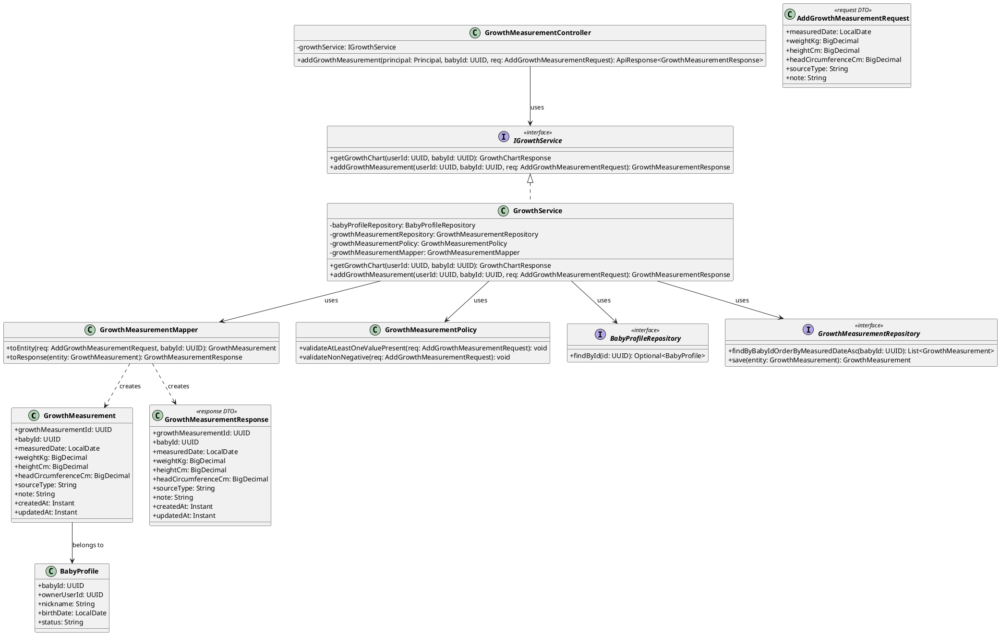
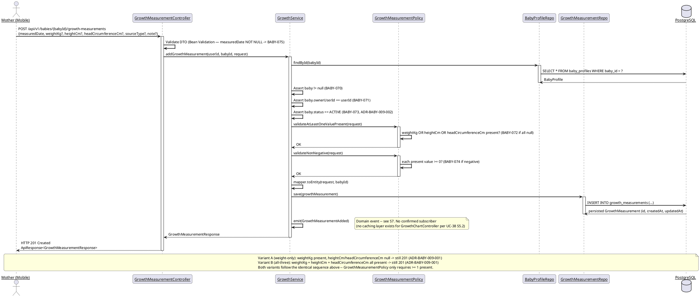
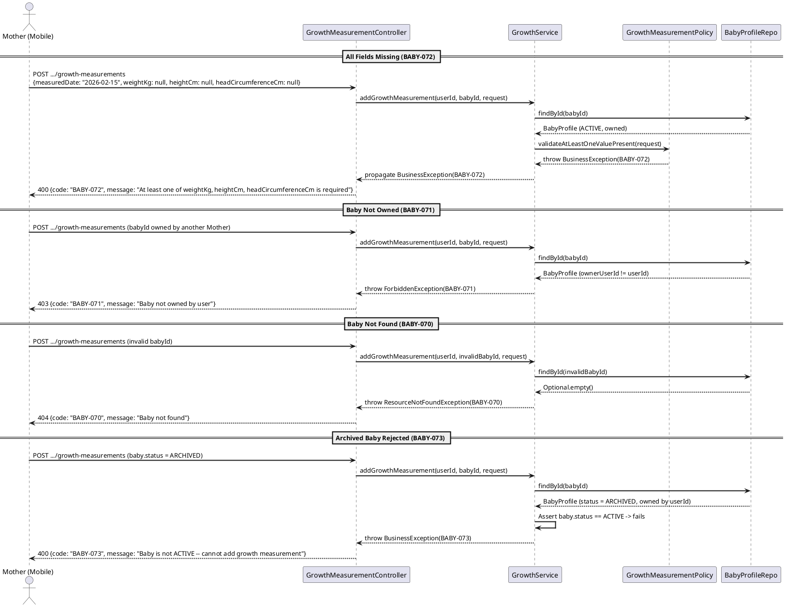

# ENGINEERING DOCUMENTATION STANDARD (EDS) v2.0
# Technical Design Specification — UC-234 Add Growth Measurement

| Field | Value |
|-------|-------|
| **Document ID** | `CB-BABY-IMP-009` |
| **Version** | `1.0` |
| **Date** | `2026-07-03` |
| **Status** | `Partially Implemented` |
| **Document Owner** | `PhuongNT` |
| **Author** | `AI Agent` |
| **Reviewed by** | `[Tech Lead]` |
| **DPO Sign-off** | `[ ] Pending` |
| **Approved by** | `[Principal Architect]` |
| **Last Review** | `2026-07-03` |
| **Based on EDS** | `v2.0` |

---

## CHANGELOG

| Ngay | Nguoi thuc hien | Noi dung thay doi |
|------|-----------------|-------------------|
| 2026-07-10 | AI Agent | Phase 3 sync: backend service coverage added in `GrowthServiceTest`; `GrowthServiceTest` 19/19 PASS and carejourney suite 65/65 PASS. Controller/integration/full Test-Spec matrix still pending. |
| 2026-07-03 | AI Agent | Tao tai lieu lan dau cho UC-234 Add Growth Measurement |

---

## MUC LUC

1. [Tong quan Module](#1-tong-quan-module)
2. [Ma tran Truy vet](#2-ma-tran-truy-vet)
3. [Architecture Decision Records](#3-architecture-decision-records-adr)
4. [Non-Functional Requirements & SLA](#4-non-functional-requirements--sla)
5. [Static Modeling](#5-static-modeling)
6. [Dynamic Modeling](#6-dynamic-modeling)
7. [Domain Event Catalog](#7-domain-event-catalog)
8. [Interface Specification](#8-interface-specification)
9. [API Specification](#9-api-specification)
10. [Bang ma loi](#10-bang-ma-loi)
11. [Quy trinh Trien khai](#11-quy-trinh-trien-khai)
12. [Rollback & Incident Runbook](#12-rollback--incident-runbook)
13. [Kich ban Kiem thu](#13-kich-ban-kiem-thu)
14. [Phuong phap Xac minh](#14-phuong-phap-xac-minh)
15. [Mau thu thuc te](#15-mau-thu-thuc-te)
16. [Authorization Matrix](#16-bang-tong-hop-phan-quyen)
17. [AI Prompt Constraints](#17-ai-prompt-constraints-case-20)

---

## 1. Tong quan Module

| Field | Value |
|-------|-------|
| **Module Name** | `AddGrowthMeasurement` |
| **Bounded Context** | `carejourney` (same bounded context as UC-38 `ViewGrowthChart`) |
| **UC ID** | `UC-234` |
| **SRS Reference** | `3.3.19.7` (Table 256) |
| **Primary Actor** | `Mother (ROLE_MOTHER — authenticated)` |
| **Platform** | `Mobile App` |
| **Data Classification** | `PII` (health data) |
| **Compliance Scope** | `BR-RBAC, BR-PRIVACY` |
| **Upstream Dependencies** | `auth (JWT), baby (baby_profiles — cross-context repository, see L5 in Test-Spec §2), growth_measurements` |
| **Downstream Consumers** | `UC-38 ViewGrowthChart (renders newly added point), UC-237 ViewGrowthMeasurementHistory, audit` |

**Mo ta:** Cho phep Mother ghi nhan mot ban ghi do luong tang truong moi cho baby (`growth_measurements`): can nang (`weightKg`), chieu cao (`heightCm`), va/hoac chu vi vong dau (`headCircumferenceCm`) tai mot ngay do (`measuredDate`) cu the. SRS dung tu "weight, height, or head circumference" (Table 256) — duoc dien giai la **it nhat mot** trong ba gia tri phai duoc cung cap, khong bat buoc ca ba (xem ADR-BABY-009-001). `sourceType` va `note` la tuy chon. Endpoint nay CHI tao moi ban ghi — khong sua/xoa (xem UC-235/UC-236).

---

## 2. Ma tran Truy vet

| Requirement ID | Loai | Mo ta yeu cau | Thanh phan Code | Compliance Target | ADR lien quan |
|----------------|------|---------------|-----------------|-------------------|---------------|
| UC-234 | Use Case | Mother ghi nhan chi so tang truong moi | `GrowthMeasurementController.addGrowthMeasurement()` | BR-RBAC | ADR-BABY-009-003 |
| BR-RBAC | Business Rule | Chi Mother so huu baby moi duoc ghi | `GrowthService.addGrowthMeasurement()` ownership check | BR-RBAC | ADR-BABY-009-003 |
| BR-PRIVACY | Business Rule | Du lieu tang truong la du lieu suc khoe cua baby, gan voi Mother so huu | ownership gate on `baby_profiles` | BR-PRIVACY | — |
| SRS Table 256 | Requirement | "Records baby weight, height, or head circumference" — it nhat 1 gia tri | `GrowthMeasurementPolicy.validateAtLeastOneValuePresent()` | Data Integrity | ADR-BABY-009-001 |
| BABY-070 (reused) | Error Code | Baby khong ton tai | `GrowthService.addGrowthMeasurement()` -- `findById` | Data Integrity | — |
| BABY-071 (reused) | Error Code | Baby khong thuoc so huu cua Mother | `GrowthService.addGrowthMeasurement()` -- ownership check | BR-RBAC | ADR-BABY-009-003 |
| BABY-072 (new) | Error Code | Khong co gia tri do luong nao duoc cung cap | `GrowthMeasurementPolicy.validateAtLeastOneValuePresent()` | Data Integrity | ADR-BABY-009-001 |
| BABY-073 (new) | Error Code | Baby khong o trang thai ACTIVE (vd: ARCHIVED) — tu choi ghi | `GrowthService.addGrowthMeasurement()` -- status gate | Data Integrity | ADR-BABY-009-002 |
| BABY-074 (new) | Error Code | Gia tri do luong am (invalid range) | `GrowthMeasurementPolicy.validateNonNegative()` | Data Integrity | — |
| BABY-075 (new) | Error Code | `measuredDate` thieu hoac khong hop le | Bean Validation tren `AddGrowthMeasurementRequest` | Data Integrity | — |

---

## 3. Architecture Decision Records (ADR)

### ADR-BABY-009-001 — At-Least-One-Value Required (Inclusive-OR Interpretation)

| Field | Value |
|-------|-------|
| **Status** | `Accepted` |
| **Deciders** | `AI Agent (per user-confirmed batch decision)` |
| **Date** | `2026-07-03` |

#### Boi canh (Context)
SRS Table 256 mo ta UC-234: "Records baby weight, height, or head circumference." Tu "or" co the doc theo 2 huong: (a) exclusive — chinh xac 1 trong 3 gia tri moi lan ghi, hoac (b) inclusive — it nhat 1 trong 3, cho phep ca 2 hoac ca 3 cung luc (vd: lan kham dinh ky do ca 3 chi so). Schema `growth_measurements` co 3 cot doc lap nullable (`weight_kg`, `height_cm`, `head_circumference_cm`) — khong co CHECK constraint rang buoc "chinh xac 1 cot".

#### Cac phuong an da xem xet

| Phuong an | Mo ta | Uu diem | Nhuoc diem |
|-----------|-------|----------|------------|
| A | Exclusive — chi cho phep dung 1 trong 3 gia tri moi request | Khop sat nghia den cua "or" | Khong thuc te — buoc Mother goi 3 API rieng cho 1 lan kham dinh ky |
| B | Inclusive — it nhat 1, cho phep ca 3 | Khop voi cau truc schema (3 cot doc lap), thuc te hon | "or" trong SRS co the bi hieu la lac huong neu khong chu thich |

#### Quyet dinh
Chon **Phuong an B**. Validation: tu choi request neu **ca 3** truong `weightKg`, `heightCm`, `headCircumferenceCm` deu null/absent (loi `BABY-072`). Chap nhan bat ky to hop nao co it nhat 1 gia tri.

#### He qua
**Tich cuc:** Khop voi schema thuc te, ho tro use case kham dinh ky do ca 3 chi so cung luc.
**Tieu cuc / Trade-offs:** Khong co — day la dien giai hop ly nhat cua yeu cau, khong lam mat chuc nang nao.

---

### ADR-BABY-009-002 — Require Baby Status ACTIVE for Write (Accepted)

| Field | Value |
|-------|-------|
| **Status** | `Accepted` |
| **Deciders** | `AI Agent (proposed 2026-07-03); user/product owner (accepted 2026-07-04)` |
| **Date** | `2026-07-03` (proposed) / `2026-07-04` (accepted) |

> **Acceptance Note (2026-07-04):** Accepted by user/product owner, 2026-07-04 — consistent with the established read-vs-write asymmetry pattern (UC-38's ADR-BABY-008-002 already allows reads for ACTIVE or ARCHIVED babies, but writes are stricter); an archived baby profile should not receive new health-tracking mutations.

#### Boi canh (Context)
`CB-BABY-IMP-008` (UC-38 ViewGrowthChart) — thao tac **doc** — trong ADR-BABY-008-002 ghi nhan ro: "Khac voi cac UC ghi du lieu (UC32, UC34) yeu cau baby ACTIVE, xem growth chart la thao tac doc (read-only)." Dieu nay xac nhan mot pattern da thiet lap: **cac UC ghi (write) yeu cau baby ACTIVE**, con cac UC doc (read) thi khong. Tien le cu the: `CB-BABY-IMP-002` (UC-32 UpdateBabyProfile) ADR-BABY-004 — "Baby profile da ARCHIVED khong duoc phep cap nhat. Tra ve loi BABY-012 (400)." UC-234 la mot thao tac **ghi** (tao moi ban ghi do luong) — vi vay, ap dung cung pattern la hop ly.

#### Cac phuong an da xem xet

| Phuong an | Mo ta | Uu diem | Nhuoc diem |
|-----------|-------|----------|------------|
| A | Khong check status — cho phep them measurement cho ca ARCHIVED baby | Don gian | Vi pham pattern da thiet lap (write yeu cau ACTIVE); khong hop ly nghiep vu — khong nen "ghi du lieu moi" cho ho so da luu tru |
| B | Yeu cau baby.status == ACTIVE, tu choi neu ARCHIVED | Nhat quan voi UC32/UC34; ho so ARCHIVED la "dong bang", khong nen co du lieu moi | Can dinh nghia ma loi rieng (BABY-073) |

#### Quyet dinh
Chon **Phuong an B**. Neu `baby.status != ACTIVE` → tu choi voi loi `BABY-073` (400 Bad Request, cung HTTP status voi tien le BABY-012 cua UC-32).

#### He qua
**Tich cuc:** Nhat quan voi established read-vs-write asymmetry pattern (ADR-BABY-008-002 contrast note + ADR-BABY-004 precedent).
**Tieu cuc / Trade-offs:** Ban dau la suy luan cua AI Agent — nay da duoc user/product owner **Accepted (2026-07-04)**, khong con la quyet dinh treo (Proposed). Neu tuong lai co yeu cau nghiep vu cho phep ghi len ho so ARCHIVED, se can ADR moi de Supersede.

---

### ADR-BABY-009-003 — Reuse Owner-Only Ownership Check Pattern (Cited from UC-38)

| Field | Value |
|-------|-------|
| **Status** | `Accepted` (tai su dung nguyen ban tu UC-38, khong dinh nghia lai) |
| **Deciders** | `AI Agent (cited from CB-BABY-IMP-008 §3 / BR-RBAC)` |
| **Date** | `2026-07-03` |

#### Boi canh (Context)
UC-38 (`CB-BABY-IMP-008` §8, §16) da thiet lap pattern ownership check chuan cho module `carejourney`: `baby.ownerUserId == JWT userId`, tra ve `BABY-070` (404) neu baby khong ton tai, `BABY-071` (403) neu ton tai nhung khong thuoc so huu. UC-234 tai su dung **nguyen ban** pattern nay — khong sua doi.

#### Quyet dinh
Ap dung dung thu tu kiem tra nhu UC-38: (1) `findById(babyId)` → neu rong, throw `ResourceNotFoundException` (BABY-070); (2) neu `baby.ownerUserId != userId`, throw `ForbiddenException` (BABY-071) — **RESOLVED 2026-07-04**: class thuc te trong codebase la `com.carebridge.backend.common.exception.AccessDeniedBusinessException` (khong co class `ForbiddenException`); ten nay van duoc dung trong TDS nhu ten conceptual ke thua tu UC-38, map sang `AccessDeniedBusinessException` khi implement (xem Test-Spec §2 L4); (3) rieng cho UC-234 — them buoc (3) kiem tra `baby.status == ACTIVE` (ADR-BABY-009-002) truoc khi cho ghi.

#### He qua
**Tich cuc:** Khong trung lap logic, nhat quan RBAC toan bo bounded context `carejourney`.
**Tieu cuc / Trade-offs:** Khong co.

---

### ADR-BABY-009-004 — New `GrowthMeasurementController` for Measurement CRUD (Proposed)

| Field | Value |
|-------|-------|
| **Status** | `Proposed` *(quyet dinh cau truc moi cho batch UC-234..237, can dong bo voi cac agent sibling)* |
| **Deciders** | `AI Agent` |
| **Date** | `2026-07-03` |

#### Boi canh (Context)
UC-38 dinh nghia `GrowthChartController` chi cho **doc** (`GET /api/v1/babies/{babyId}/growth-chart` — tra ve toan bo time-series de ve chart). UC-234 (Add), UC-235 (Update), UC-236 (Delete) la cac thao tac **CRUD tren tung ban ghi** (`growth_measurements` row), khac muc dich voi endpoint chart tong hop. Dat chung vao `GrowthChartController` se vi pham single-responsibility va lam ten class gay hieu lam (controller "Chart" nhung lai co POST/PUT/DELETE ban ghi).

#### Cac phuong an da xem xet

| Phuong an | Mo ta | Uu diem | Nhuoc diem |
|-----------|-------|----------|------------|
| A | Them method vao `GrowthChartController` co san | Tai su dung class hien co | Vi pham SRP, ten class gay hieu lam |
| B | Tao class moi `GrowthMeasurementController` rieng cho CRUD tung ban ghi, dung chung `IGrowthService`/`GrowthService` | Ro rang, tach biet read (chart) vs write (measurement CRUD); van tai su dung Service layer | Them 1 class moi — can dong bo ten voi UC-235/236 (cung dung chung controller nay cho PUT/DELETE) |

#### Quyet dinh
Chon **Phuong an B**. Tao `GrowthMeasurementController` (`@RequestMapping("/api/v1/babies/{babyId}/growth-measurements")`) — UC-234 dung `POST`, UC-235 se dung `PUT /{growthMeasurementId}`, UC-236 se dung `DELETE /{growthMeasurementId}`. Van tiep tuc dung chung `IGrowthService`/`GrowthService` (mo rong them method moi) nhu UC-38 da dinh nghia — khong tao Service moi.

#### He qua
**Tich cuc:** Tach biet ro rang read vs write, de bao tri, khong pha vo `GrowthChartController` cua UC-38.
**Tieu cuc / Trade-offs:** Day la quyet dinh cau truc moi — **can UC-235/UC-236/UC-237 (sibling agents) dong bo cung ten class nay** de tranh xung dot khi implement. Neu Principal Architect co quyet dinh khac, ADR nay se bi Supersede.

---

### ADR-BABY-009-005 — `sourceType` as Open Free-Text String (No Enum)

| Field | Value |
|-------|-------|
| **Status** | `Proposed` / **Open** — gia tri hop le chua duoc xac nhan |
| **Deciders** | `AI Agent` |
| **Date** | `2026-07-03` |

#### Boi canh (Context)
Schema `growth_measurements.source_type` la `varchar(30)`, khong co CHECK constraint enum. Khong tim thay enum/constant nao lien quan den "source type" cho growth measurement trong codebase hien tai (chi co `development_milestones.source_type varchar(30)` tuong tu, cung khong co enum rang buoc).

#### Quyet dinh
`sourceType` la truong tuy chon (`Optional<String>`, max length 30, khong co whitelist enum ap dung o tang validation). Danh sach gia tri hop le cu the (vd: `HOME_SCALE`, `CLINIC`) **duoc danh dau Open** — khong dua vao spec nay, de Product/BA quyet dinh sau. Neu can enum trong tuong lai, se can ADR rieng + migration CHECK constraint.

#### He qua
**Tich cuc:** Khong chan tinh nang MVP boi mot enum chua duoc xac dinh.
**Tieu cuc / Trade-offs:** Du lieu co the khong nhat quan (vd: "Home", "home_scale", "HOME") cho den khi co enum chinh thuc — chap nhan duoc cho MVP.

---

## 4. Non-Functional Requirements & SLA

### 4.1. Performance & Availability

| Category | Requirement | Target SLA | Measurement Method | Compliance Basis |
|----------|-------------|------------|---------------------|------------------|
| Latency | POST add measurement (p99) | `< 300ms` | k6 load test | — |
| Availability | Uptime (monthly) | `99.9%` | Uptime monitor | — |
| Throughput | Concurrent write requests | `100 req/s` (write-path, lower than read UC-38's 200 req/s) | Load test | — |

### 4.2. Data Integrity & Retention

| Category | Requirement | Target | Verification Method | Compliance Basis |
|----------|-------------|--------|---------------------|------------------|
| Consistency | It nhat 1 trong 3 gia tri do luong phai co mat | 100% | Unit + integration test | ADR-BABY-009-001 |
| Consistency | `measuredDate` bat buoc (NOT NULL trong schema) | 100% | Bean Validation + integration test | Schema `V1__init_schema.sql` L650 |
| Accuracy | Gia tri do luong khong am (weightKg/heightCm/headCircumferenceCm >= 0 neu co mat) | 100% | Unit test | Sanity check — khong co clinical range cu the nao duoc nguon hoa (Open, ngoai pham vi) |
| Durability | Zero record loss sau khi 201 tra ve | RPO = 0 | Transaction log | Data Integrity |

### 4.3. Security

| Category | Requirement | Target | Verification Method | Compliance Basis |
|----------|-------------|--------|---------------------|------------------|
| Access control | Role-based + ownership + status gate | Least privilege | Auth Matrix (§16) | BR-RBAC |
| Encryption in transit | All endpoints | TLS 1.3+ | SSL Labs scan | BR-PRIVACY |

### 4.4. Scalability & Capacity Planning

Khong co du lieu tai thuc te cho module nay (greenfield). Uoc tinh so bo: moi baby co the co vai chuc ban ghi/nam (kham dinh ky). Khong can horizontal scaling dac biet cho MVP.

---

## 5. Static Modeling

### 5.1. Class Diagram (PlantUML)



### 5.2. Data Structure (Existing Schema)

Table `growth_measurements` da ton tai (`V1__init_schema.sql` dong ~647-658). **Khong can Flyway migration moi** — tat ca cot can thiet (`weight_kg`, `height_cm`, `head_circumference_cm`, `source_type`, `note`, `measured_date NOT NULL`) da co san.

```sql
-- Existing table: growth_measurements (V1__init_schema.sql, ~L647)
CREATE TABLE public.growth_measurements (
    growth_measurement_id uuid    NOT NULL DEFAULT gen_random_uuid(),
    baby_id               uuid    NOT NULL,
    measured_date         date    NOT NULL,
    weight_kg             numeric,
    height_cm             numeric,
    head_circumference_cm numeric,
    source_type           varchar(30),
    note                  text,
    created_at            timestamptz NOT NULL DEFAULT now(),
    updated_at            timestamptz NOT NULL DEFAULT now()
);
```

> **Luu y:** Khong co CHECK constraint DB-level cho rang buoc "it nhat 1 trong 3 cot do luong khac NULL" (ADR-BABY-009-001) — rang buoc nay duoc thuc thi hoan toan o tang application (`GrowthMeasurementPolicy`). Viec them CHECK constraint la **tuy chon defense-in-depth, Open/out-of-scope** cho UC nay — khong bat buoc boi bat ky nguon nao da xac nhan.

---

## 6. Dynamic Modeling

### 6.1. Sequence Diagram — Happy Path



### 6.2. Sequence Diagram — Error Paths



### 6.3. State Machine

Khong ap dung. `growth_measurements` khong co cot `status` (khac voi `vaccination_records` co state machine SCHEDULED/COMPLETED) — day la ban ghi CRUD phang (plain record), khong co state transitions.

---

## 7. Domain Event Catalog

### 7.1. Events Published

| Event Name | Trigger | Publisher | Subscriber(s) | Payload Schema | Async? |
|------------|---------|-----------|---------------|-----------------|--------|
| `GrowthMeasurementAdded` | Sau khi `growth_measurements` row duoc INSERT thanh cong | `GrowthService.addGrowthMeasurement()` | **Khong xac dinh — Open** (xem ghi chu duoi) | `GrowthMeasurementAdded.java` | No (MVP: synchronous, in-process) |

> **Open:** UC-38 (`ViewGrowthChart`) khong co caching layer — moi request GET doc truc tiep tu DB (`CB-BABY-IMP-008` §5.2/§11.3, khong co Redis/cache nao duoc mo ta). Vi vay, **hien tai khong co nhu cau cache invalidation** cho su kien nay. Neu trong tuong lai UC-38 duoc bo sung caching layer, `GrowthMeasurementAdded` se can duoc UC-38 subscribe de invalidate cache — danh dau **Open**, khong trien khai subscriber nao trong pham vi UC-234 nay.

> **RESOLVED 2026-07-04 — Audit logging (cross-cutting with UC-236):** UC-236 (`CB-BABY-IMP-012`, Delete) explicitly calls `auditService.log(AuditAction.GROWTH_MEASUREMENT_DELETED, ...)` for its write, citing POST-3 ("Sensitive actions are recorded for audit"). UC-234 (Add) is also a write to the same PII health-data table (`growth_measurements`) under the same BR-PRIVACY compliance scope, so for consistency it SHOULD also record an audit entry. Verified against the real enum `05_Development/CareBridgeAPI/src/main/java/com/carebridge/backend/audit/entity/AuditAction.java`: no `GROWTH_MEASUREMENT_ADDED` (or similarly-named) constant exists yet, and it does not collide with any of the 59 existing constants (nearest neighbors: `HEALTH_RECORD_ADDED`, `BABY_PROFILE_CREATED`, `JOURNEY_CREATED`). **Action:** add `GROWTH_MEASUREMENT_ADDED` to `AuditAction` and call `auditService.log(AuditAction.GROWTH_MEASUREMENT_ADDED, userId, "GrowthMeasurement", growthMeasurementId.toString(), "added")` in `GrowthService.addGrowthMeasurement()` (Chang 4, step 8, alongside the existing `emit(GrowthMeasurementAdded)` domain event). This is a routine, non-blocking addition — not left dangling as Open.

### 7.2. Events Consumed

Khong co. UC-234 khong tieu thu su kien nao tu module khac.

### 7.3. Payload Schema

```java
// GrowthMeasurementAdded.java
public record GrowthMeasurementAdded(
    UUID    eventId,
    String  eventType,        // "GrowthMeasurementAdded"
    Instant occurredAt,
    String  version,          // "1.0"
    Payload payload,
    Metadata metadata
) implements ApplicationEvent {

    public record Payload(
        UUID growthMeasurementId,
        UUID babyId,
        LocalDate measuredDate,
        BigDecimal weightKg,
        BigDecimal heightCm,
        BigDecimal headCircumferenceCm,
        String sourceType,
        String note
    ) {}

    public record Metadata(
        UUID   correlationId,
        String causedBy        // Mother's userId
    ) {}
}
```

---

## 8. Interface Specification

### 8.1. Service Interface

```java
// AddGrowthMeasurementRequest.java -- Input DTO
// package com.carebridge.backend.carejourney.dto.request
// @version 1.0
public class AddGrowthMeasurementRequest {

    @NotNull(message = "measuredDate is required")     // BABY-075 if null
    private LocalDate measuredDate;

    @DecimalMin(value = "0", message = "weightKg must be >= 0")     // BABY-074 if negative
    private BigDecimal weightKg;                        // optional

    @DecimalMin(value = "0", message = "heightCm must be >= 0")     // BABY-074 if negative
    private BigDecimal heightCm;                        // optional

    @DecimalMin(value = "0", message = "headCircumferenceCm must be >= 0")  // BABY-074 if negative
    private BigDecimal headCircumferenceCm;             // optional

    @Size(max = 30, message = "sourceType max length is 30")
    private String sourceType;                          // optional, open free-text (ADR-BABY-009-005)

    private String note;                                // optional, free-text

    // Note: cross-field "at least one of weightKg/heightCm/headCircumferenceCm present"
    // is NOT a Bean Validation annotation -- enforced in GrowthMeasurementPolicy (service layer),
    // to keep the BABY-072 error code and message consistent with S10.
    // getters / setters
}

// GrowthMeasurementResponse.java -- Output DTO
// package com.carebridge.backend.carejourney.dto.response
// @version 1.0
public class GrowthMeasurementResponse {

    private UUID growthMeasurementId;
    private UUID babyId;
    private LocalDate measuredDate;
    private BigDecimal weightKg;
    private BigDecimal heightCm;
    private BigDecimal headCircumferenceCm;
    private String sourceType;
    private String note;
    private Instant createdAt;
    private Instant updatedAt;

    // getters / setters
}

// IGrowthService.java -- Service Contract (extended from UC-38 CB-BABY-IMP-008)
// @version 1.1
// @breaking-change None -- addGrowthMeasurement() is a new method added to the existing interface
public interface IGrowthService {

    /**
     * (Existing from UC-38) Returns growth chart data for a baby.
     */
    GrowthChartResponse getGrowthChart(UUID userId, UUID babyId);

    /**
     * Creates a new growth measurement record for a baby.
     * At least one of weightKg/heightCm/headCircumferenceCm must be present (ADR-BABY-009-001).
     * Baby must be owned by userId and status == ACTIVE (ADR-BABY-009-002, ADR-BABY-009-003).
     *
     * @param userId Mother's userId from JWT
     * @param babyId baby's UUID
     * @param request measurement data
     * @return GrowthMeasurementResponse of the newly created record
     * @throws ResourceNotFoundException (BABY-070) when baby not found
     * @throws ForbiddenException (BABY-071) when baby not owned by user
     * @throws BusinessException (BABY-072) when all three measurement values are absent
     * @throws BusinessException (BABY-073) when baby.status != ACTIVE
     * @throws BusinessException (BABY-074) when any present measurement value is negative
     */
    GrowthMeasurementResponse addGrowthMeasurement(UUID userId, UUID babyId, AddGrowthMeasurementRequest request);
}
```

### 8.2. Repository Interface

```java
// GrowthMeasurementRepository.java (existing from UC-38, no changes needed --
// JpaRepository already provides save())
// @version 1.0
public interface GrowthMeasurementRepository extends JpaRepository<GrowthMeasurement, UUID> {

    List<GrowthMeasurement> findByBabyIdOrderByMeasuredDateAsc(UUID babyId);
    // save(GrowthMeasurement) inherited from JpaRepository -- used by UC-234
}
```

### 8.3. Policy Interface

```java
// GrowthMeasurementPolicy.java
// package com.carebridge.backend.carejourney.policy
// @version 1.0
@Component
public class GrowthMeasurementPolicy {

    /**
     * @throws BusinessException (BABY-072) if weightKg, heightCm, and headCircumferenceCm are all null
     */
    public void validateAtLeastOneValuePresent(AddGrowthMeasurementRequest request) { /* ... */ }

    /**
     * @throws BusinessException (BABY-074) if any present value is negative
     */
    public void validateNonNegative(AddGrowthMeasurementRequest request) { /* ... */ }
}
```

---

## 9. API Specification

### 9.1. Endpoints Table

| Method | Path | Auth Level | Required Roles | Rate Limit | Idempotent? |
|--------|------|------------|----------------|------------|-------------|
| `POST` | `/api/v1/babies/{babyId}/growth-measurements` | JWT Bearer | `MOTHER` (own baby, ACTIVE) | 60/min | No |

### 9.2. Request / Response Schemas

#### `POST /api/v1/babies/{babyId}/growth-measurements` — Add Growth Measurement

**Path Parameters:**
| Name | Type | Required | Description |
|------|------|----------|-------------|
| `babyId` | `UUID` | Yes | The baby's unique identifier |

**Request Body (Variant A — weight only):**
```json
{
  "measuredDate": "2026-02-15",
  "weightKg": 4.2,
  "sourceType": "HOME_SCALE",
  "note": "1 month checkup"
}
```

**Request Body (Variant B — all three):**
```json
{
  "measuredDate": "2026-02-15",
  "weightKg": 4.2,
  "heightCm": 52,
  "headCircumferenceCm": 35,
  "sourceType": "CLINIC",
  "note": "1 month checkup"
}
```

**Response — 201 Created (Happy Path):**
```json
{
  "success": true,
  "data": {
    "growthMeasurementId": "aaaa0003-0000-0000-0000-000000000003",
    "babyId": "bbbbbbbb-0000-0000-0000-000000000234",
    "measuredDate": "2026-02-15",
    "weightKg": 4.2,
    "heightCm": null,
    "headCircumferenceCm": null,
    "sourceType": "HOME_SCALE",
    "note": "1 month checkup",
    "createdAt": "2026-07-03T08:00:00.000Z",
    "updatedAt": "2026-07-03T08:00:00.000Z"
  }
}
```

**Response — 400 Bad Request (All values missing — BABY-072):**
```json
{
  "success": false,
  "error": {
    "code": "BABY-072",
    "message": "At least one of weightKg, heightCm, headCircumferenceCm is required"
  }
}
```

**Response — 400 Bad Request (Archived baby — BABY-073):**
```json
{
  "success": false,
  "error": {
    "code": "BABY-073",
    "message": "Baby is not ACTIVE -- cannot add growth measurement"
  }
}
```

**Response — 403 Forbidden (Not owner — BABY-071):**
```json
{
  "success": false,
  "error": {
    "code": "BABY-071",
    "message": "Baby not owned by user"
  }
}
```

**Response — 404 Not Found (BABY-070):**
```json
{
  "success": false,
  "error": {
    "code": "BABY-070",
    "message": "Baby not found"
  }
}
```

---

## 10. Bang ma loi

| Code | HTTP Status | Message (EN) | Trigger Condition |
|------|-------------|--------------|-------------------|
| `BABY-070` *(reused from UC-38)* | 404 | Baby not found | babyId does not exist in baby_profiles |
| `BABY-071` *(reused from UC-38)* | 403 | Baby not owned by user | baby.ownerUserId != JWT userId |
| `BABY-072` *(new)* | 400 | At least one of weightKg, heightCm, headCircumferenceCm is required | weightKg, heightCm, headCircumferenceCm all null/absent (ADR-BABY-009-001) |
| `BABY-073` *(new)* | 400 | Baby is not ACTIVE -- cannot add growth measurement | baby.status != ACTIVE (e.g. ARCHIVED) (ADR-BABY-009-002) |
| `BABY-074` *(new)* | 400 | Measurement value must be non-negative | any present value among weightKg/heightCm/headCircumferenceCm < 0 |
| `BABY-075` *(new)* | 400 | measuredDate is required | measuredDate missing or malformed in request body |

---

## 11. Quy trinh Trien khai

### 11.1. Prerequisites

- [ ] ADR-BABY-009-001..005 da duoc review (ADR-BABY-009-002 da `Accepted` 2026-07-04; ADR-BABY-009-004 van `Proposed` — can Principal Architect confirm truoc khi code)
- [ ] Table `growth_measurements` da ton tai trong DB (xac nhan — khong can migration moi)
- [ ] Table `baby_profiles` da ton tai trong DB
- [ ] `IGrowthService`/`GrowthService` tu UC-38 (neu da implement) san sang de mo rong them method `addGrowthMeasurement`

### 11.2. Pre-Migration Checklist

Khong can migration moi. Table da ton tai voi day du cot can thiet.

### 11.3. Implementation Steps

#### Chang 1 — Tao DTOs

Tao `AddGrowthMeasurementRequest.java` (`dto.request`) va `GrowthMeasurementResponse.java` (`dto.response`) trong package `com.carebridge.backend.carejourney`.

#### Chang 2 — Tao Policy

Tao `GrowthMeasurementPolicy.java` trong package `com.carebridge.backend.carejourney.policy` voi 2 method: `validateAtLeastOneValuePresent()`, `validateNonNegative()`.

#### Chang 3 — Tao Mapper

Tao `GrowthMeasurementMapper.java` trong package `com.carebridge.backend.carejourney.mapper`.

#### Chang 4 — Mo rong Service

Mo rong `IGrowthService`/`GrowthService` (neu da ton tai tu UC-38) hoac tao moi neu chua co, them method `addGrowthMeasurement`:

```java
@Service
@RequiredArgsConstructor
public class GrowthService implements IGrowthService {

    @Override
    @Transactional
    public GrowthMeasurementResponse addGrowthMeasurement(UUID userId, UUID babyId, AddGrowthMeasurementRequest request) {
        // 1. Find baby or throw BABY-070
        // 2. Check ownership (baby.ownerUserId == userId) or throw BABY-071
        // 3. Check baby.status == ACTIVE or throw BABY-073 (ADR-BABY-009-002)
        // 4. growthMeasurementPolicy.validateAtLeastOneValuePresent(request) -- throws BABY-072
        // 5. growthMeasurementPolicy.validateNonNegative(request) -- throws BABY-074
        // 6. entity = growthMeasurementMapper.toEntity(request, babyId)
        // 7. saved = growthMeasurementRepository.save(entity)
        // 8. emit(GrowthMeasurementAdded) -- no confirmed subscriber (S7, Open)
        // 8b. auditService.log(AuditAction.GROWTH_MEASUREMENT_ADDED, userId, "GrowthMeasurement", saved.getGrowthMeasurementId().toString(), "added") -- S7 resolved note, mirrors UC-236 pattern
        // 9. return growthMeasurementMapper.toResponse(saved)
    }
}
```

#### Chang 5 — Tao Controller

Tao `GrowthMeasurementController.java` trong package `com.carebridge.backend.carejourney.controller` (ADR-BABY-009-004).

```java
@RestController
@RequestMapping("/api/v1/babies/{babyId}/growth-measurements")
@RequiredArgsConstructor
public class GrowthMeasurementController {

    private final IGrowthService growthService;

    @PostMapping
    public ResponseEntity<ApiResponse<GrowthMeasurementResponse>> addGrowthMeasurement(
            Principal principal,
            @PathVariable UUID babyId,
            @Valid @RequestBody AddGrowthMeasurementRequest request) {
        UUID userId = SecurityUtils.requireCurrentUserId(principal);
        GrowthMeasurementResponse response = growthService.addGrowthMeasurement(userId, babyId, request);
        return ResponseEntity.status(HttpStatus.CREATED).body(ApiResponse.success(response));
    }
}
```

#### Chang 6 — Verification sau deploy

```bash
curl -X POST https://[host]/api/v1/babies/{babyId}/growth-measurements \
  -H "Authorization: Bearer [JWT_TOKEN]" \
  -H "Content-Type: application/json" \
  -d '{"measuredDate":"2026-02-15","weightKg":4.2}'
# Expected: 201 Created with GrowthMeasurementResponse
```

### 11.4. Deployment Checklist

- [ ] Health check endpoint tra ve 200
- [ ] POST add measurement voi weight-only tra ve 201
- [ ] POST add measurement voi all-three tra ve 201
- [ ] 400 khi ca 3 gia tri deu thieu (BABY-072)
- [ ] 400 khi baby ARCHIVED (BABY-073)
- [ ] 403 khi Mother khong so huu baby (BABY-071)
- [ ] 404 khi baby khong ton tai (BABY-070)

---

## 12. Rollback & Incident Runbook

### 12.1. Dieu kien kich hoat Rollback

| Dieu kien | Nguong | Nguoi quyet dinh |
|-----------|--------|------------------|
| Error rate tang dot bien | > 5% trong 5 phut | On-call Engineer |
| Ghi sai du lieu (vd: BABY-072 khong duoc enforce, du lieu rong duoc luu) | Bat ky case nao | Tech Lead |

### 12.2. Rollback Procedure

```bash
# Buoc 1: Revert code changes
git revert [commit-hash]

# Buoc 2: Re-deploy phien ban cu
kubectl rollout undo deployment/carebridge-api

# Buoc 3: Verify rollback thanh cong
curl -X GET https://[host]/api/v1/health

# Khong can revert migration -- table growth_measurements da ton tai truoc UC nay
```

### 12.3. Notification Protocol

| Thoi diem | Nguoi nhan | Kenh |
|-----------|------------|------|
| Ngay khi phat hien | On-call team | Slack #incident |
| Trong 30 phut | Tech Lead | Slack DM |

### 12.4. Post-Incident Review (PIR)

Bat buoc hoan thanh trong 48 gio sau khi incident duoc resolve — theo template chung cua EDS §12.4.

---

## 13. Kich ban Kiem thu

> Chi tiet test case day du xem `UC234_AddGrowthMeasurement_Test-Spec.md`. Section nay tom tat scenario chinh.

### 13.1. Unit Tests

```gherkin
Feature: Add Growth Measurement
  Background:
    Given test data classification: SYNTHETIC
    And Mother owns a baby profile with status ACTIVE

  Scenario: Add weight-only measurement
    When addGrowthMeasurement() called with weightKg=4.2, heightCm=null, headCircumferenceCm=null
    Then a new growth_measurements row is created with 201-equivalent response

  Scenario: Add all-three measurement
    When addGrowthMeasurement() called with weightKg, heightCm, headCircumferenceCm all present
    Then a new growth_measurements row is created with all three values persisted

  Scenario: All values missing rejected
    When addGrowthMeasurement() called with weightKg=null, heightCm=null, headCircumferenceCm=null
    Then BusinessException(BABY-072) is thrown

  Scenario: Archived baby rejected
    Given baby.status = ARCHIVED
    When addGrowthMeasurement() called
    Then BusinessException(BABY-073) is thrown

  Scenario: Ownership denied
    Given baby.ownerUserId != callerUserId
    When addGrowthMeasurement() called
    Then ForbiddenException(BABY-071) is thrown
```

### 13.2. Integration Tests

```gherkin
  Scenario: Full flow persists correct DB row
    Given PostgreSQL container running, baby_profiles seeded with ACTIVE baby
    When POST /api/v1/babies/{babyId}/growth-measurements with weightKg=4.2, heightCm=52
    Then response status is 201
    And growth_measurements table contains 1 new row with baby_id, weight_kg=4.2, height_cm=52, head_circumference_cm=NULL
```

---

## 14. Phuong phap Xac minh

### 14.1. Database Inspection

```sql
-- Verify measurement row created
SELECT growth_measurement_id, baby_id, measured_date, weight_kg, height_cm, head_circumference_cm, source_type, note, created_at
FROM growth_measurements
WHERE baby_id = '[babyId]'
ORDER BY created_at DESC
LIMIT 1;

-- Verify no row created when validation should have rejected the request
SELECT COUNT(*) FROM growth_measurements WHERE baby_id = '[babyId]';
-- Expected: unchanged count after a rejected (400/403/404) request
```

### 14.2. Log / Audit Verification

```bash
# Verify no PII leak in log
grep -i "password\|secret" application.log
# Expected: No output
```

---

## 15. Mau thu thuc te

### 15.1. Happy Path

```bash
# POST -- Add weight-only measurement
curl -X POST https://[host]/api/v1/babies/bbbbbbbb-0000-0000-0000-000000000234/growth-measurements \
  -H "Authorization: Bearer [JWT_TOKEN]" \
  -H "Content-Type: application/json" \
  -d '{"measuredDate":"2026-02-15","weightKg":4.2,"sourceType":"HOME_SCALE","note":"1 month checkup"}'
```

**Expected Response (201):**
```json
{
  "success": true,
  "data": {
    "growthMeasurementId": "aaaa0003-0000-0000-0000-000000000003",
    "babyId": "bbbbbbbb-0000-0000-0000-000000000234",
    "measuredDate": "2026-02-15",
    "weightKg": 4.2,
    "heightCm": null,
    "headCircumferenceCm": null,
    "sourceType": "HOME_SCALE",
    "note": "1 month checkup",
    "createdAt": "2026-07-03T08:00:00.000Z",
    "updatedAt": "2026-07-03T08:00:00.000Z"
  }
}
```

### 15.2. Error Paths

```bash
# POST -- All values missing -> 400 BABY-072
curl -X POST https://[host]/api/v1/babies/bbbbbbbb-0000-0000-0000-000000000234/growth-measurements \
  -H "Authorization: Bearer [JWT_TOKEN]" \
  -H "Content-Type: application/json" \
  -d '{"measuredDate":"2026-02-15"}'
```

**Expected Response (400):**
```json
{
  "success": false,
  "error": { "code": "BABY-072", "message": "At least one of weightKg, heightCm, headCircumferenceCm is required" }
}
```

```bash
# POST -- No JWT -> 401
curl -X POST https://[host]/api/v1/babies/bbbbbbbb-0000-0000-0000-000000000234/growth-measurements \
  -H "Content-Type: application/json" \
  -d '{"measuredDate":"2026-02-15","weightKg":4.2}'
```

**Expected Response (401):**
```json
{
  "success": false,
  "error": { "code": "IAM-001", "message": "Authentication required" }
}
```

---

## 16. Bang tong hop phan quyen

| Endpoint | `MOTHER` | `EXPERT` | `ADMIN` | `GUEST` |
|----------|----------|----------|---------|---------|
| `POST /api/v1/babies/{babyId}/growth-measurements` | ✅ Own baby, status ACTIVE only | ❌ | ❌ | ❌ |

**Chu thich:**
- Own baby = Chi duoc phep voi baby ma Mother so huu (`ownerUserId == JWT userId`)
- status ACTIVE only: khac voi UC-38 (doc, cho phep ca ARCHIVED), UC-234 la ghi (write) — yeu cau ACTIVE (ADR-BABY-009-002, Accepted 2026-07-04)
- ❌ = Bi tu choi (403 neu authenticated nhung sai role/ownership; 404 neu baby khong ton tai)

---

## 17. AI Prompt Constraints (CASE 2.0)

### 17.1 Constraint Summary Table

| # | Constraint | Source (ADR/BR) | Last Verified |
|---|-----------|-----------------|---------------|
| C1 | Mother phai so huu baby (`ownerUserId == JWT userId`) truoc khi ghi measurement | `BR-RBAC / ADR-BABY-009-003` | `2026-07-03` |
| C2 | Baby phai o trang thai ACTIVE — tu choi voi BABY-073 neu ARCHIVED | `ADR-BABY-009-002 (Accepted 2026-07-04)` | `2026-07-04` |
| C3 | It nhat 1 trong 3 (weightKg/heightCm/headCircumferenceCm) phai co mat — tu choi voi BABY-072 neu ca 3 null | `ADR-BABY-009-001` | `2026-07-03` |
| C4 | Gia tri do luong (neu co mat) phai >= 0 — tu choi voi BABY-074 neu am | `S4.2 Data Integrity` | `2026-07-03` |
| C5 | `measuredDate` bat buoc (NOT NULL) — tu choi voi BABY-075 neu thieu | `Schema V1__init_schema.sql L650` | `2026-07-03` |
| C6 | Dung `GrowthMeasurementController` moi (khong sua `GrowthChartController` cua UC-38) | `ADR-BABY-009-004 (Proposed)` | `2026-07-03` |

### 17.2 Constraint Injection Block

```
[CONSTRAINT BLOCK -- Module: AddGrowthMeasurement]
Theo TDS CB-BABY-IMP-009 va cac ADR lien quan:

1. C1: Mother phai so huu baby (baby.ownerUserId == JWT userId). Neu khong -> 403 BABY-071.
2. C2: Baby phai status == ACTIVE. Neu ARCHIVED (hoac khac ACTIVE) -> 400 BABY-073.
3. C3: it nhat 1 trong weightKg/heightCm/headCircumferenceCm phai khac null. Neu ca 3 null -> 400 BABY-072.
4. C4: Neu weightKg/heightCm/headCircumferenceCm co mat, gia tri phai >= 0. Neu am -> 400 BABY-074.
5. C5: measuredDate la bat buoc (@NotNull). Neu thieu -> 400 BABY-075.
6. C6: Endpoint nam trong GrowthMeasurementController moi (POST /api/v1/babies/{babyId}/growth-measurements), KHONG sua GrowthChartController cua UC-38.

[CONTEXT BLOCK]
- Bounded Context: carejourney
- Data Classification: PII
- Compliance: BR-RBAC, BR-PRIVACY
- Existing interfaces: S8 Service Interface + S8.2 Repository Interface + S8.3 Policy Interface
- Error codes: S10 Error Codes Table (BABY-070/071 reused, BABY-072..075 new)
- Auth matrix: S16 Authorization Matrix

[TASK BLOCK]
Implement addGrowthMeasurement thoa man constraints tren.
Output phai tuan thu S8 Interface Specification.
Tests phai cover S13 Test Scenarios (chi tiet trong Test-Spec).
```

### 17.3 Constraint Quality Checklist

- [x] Moi constraint traceable ve ADR hoac BR cu the
- [x] Khong co constraint generic
- [x] Moi constraint co Last Verified date <= 2 sprints
- [x] Constraint block co >= 3 constraints cu the (6 constraints)
- [x] Constraint block reference S8 Interface
- [x] Constraint block reference S16 Auth Matrix

### 17.4 Anti-Pattern Detection

| AP-ID | Anti-Pattern | Dau hieu | Hanh dong |
|-------|-------------|-----------|----------|
| AP-AI-001 | Unconstrained Gen | Code khong match bat ky constraint C1-C6 nao | Reject -- inject lai constraints |
| AP-AI-003 | Implicit Decision | Code assume architecture khong co trong S3 ADR (vd: bo qua ACTIVE-check ADR-BABY-009-002) | Reject -- viet ADR truoc |
| AP-AI-005 | Hallucinated Contract | Code import service/type khong co trong S8 | Reject -- verify contract existence |

---

## PHU LUC

### A. Glossary

| Thuat ngu | Dinh nghia |
|-----------|------------|
| Growth Measurement | Mot ban ghi do luong tang truong (weight/height/head circumference) tai 1 thoi diem |
| Inclusive-OR | it nhat 1 trong nhieu gia tri, khong loai tru cac gia tri con lai (ADR-BABY-009-001) |
| Write gate | Dieu kien trang thai (vd: baby.status == ACTIVE) phai thoa truoc khi cho phep thao tac ghi |

### B. Tai lieu tham chieu

| Document | Link / Path |
|----------|-------------|
| SRS Table 256 (UC-234) | `02_Requirements/SRS/3_Functional_Specification.md` ~L5031 |
| UC-38 ViewGrowthChart TDS (exemplar, ownership pattern) | `04_Implement/UC38_ViewGrowthChart/UC38_ViewGrowthChart_TDS.md` (CB-BABY-IMP-008) |
| UC-32 UpdateBabyProfile TDS (write-requires-ACTIVE precedent) | `04_Implement/UC32_UpdateBabyProfile/UC32_UpdateBabyProfile_TDS.md` (CB-BABY-IMP-002) |
| UI Mockup CB-176 | `03_Design/UI_UX/MobileAppScreen/CB-176 Growth Measurement Detail (UC-234, UC-235, UC-236)/code.html` |
| CASE 2.0 Methodology | `vii_reports/FPT-EDU-REP-METH-002_CASE_AI_METHODOLOGY_v1.1.md` |

---

*EDS v2.0 -- Tich hop CASE 2.0 AI Prompt Constraints (S17).*
