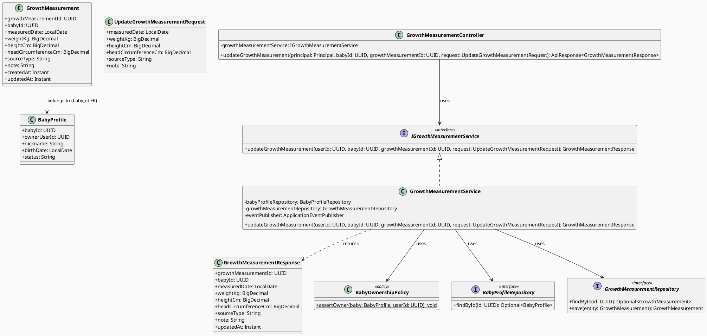
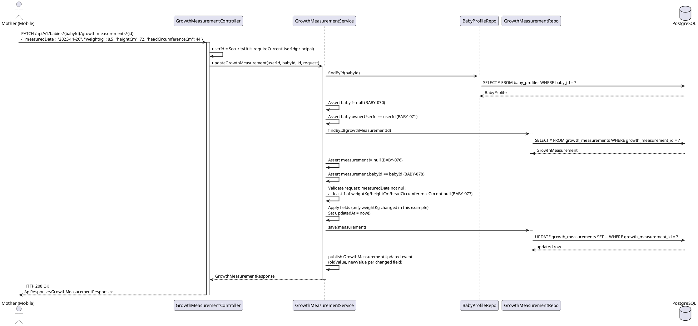
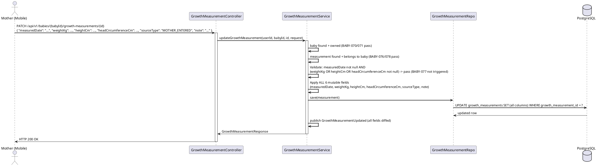
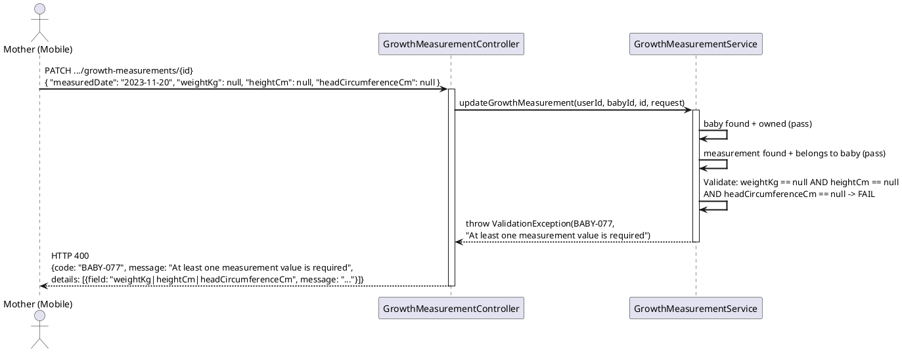
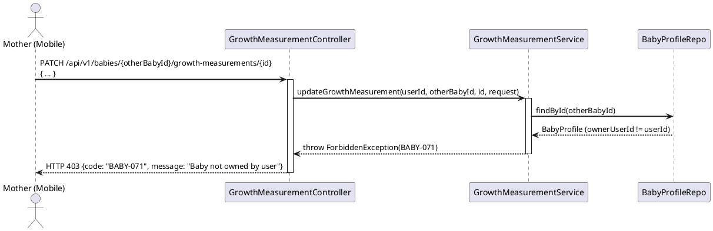
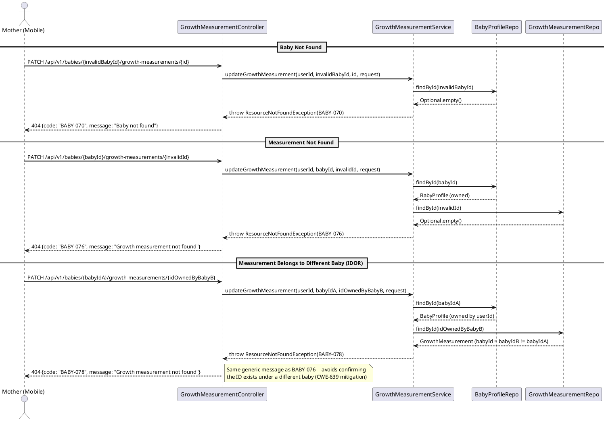

# ENGINEERING DOCUMENTATION STANDARD (EDS) v2.0
# Technical Design Specification — UC-235 Update Growth Measurement

| Field | Value |
|-------|-------|
| **Document ID** | `CB-BABY-IMP-010` |
| **Version** | `1.0` |
| **Date** | `2026-07-03` |
| **Status** | `Partially Implemented` |
| **Document Owner** | `PhuongNT` |
| **Author** | `AI Agent` |
| **Reviewed by** | `[Tech Lead]` |
| **DPO Sign-off** | `[ ] Pending` |
| **Approved by** | `[Principal Architect]` |
| **Last Review** | `2026-07-03` |
| **Based on EDS** | `v2.0` |

---

## CHANGELOG

| Ngay | Nguoi thuc hien | Noi dung thay doi |
|------|-----------------|-------------------|
| 2026-07-10 | AI Agent | Phase 3 sync: backend service coverage added in `GrowthServiceTest`; `GrowthServiceTest` 19/19 PASS and carejourney suite 65/65 PASS. Controller/integration/full Test-Spec matrix still pending. |
| 2026-07-03 | AI Agent | Tao tai lieu lan dau cho UC-235 Update Growth Measurement |

---

## MUC LUC

1. [Tong quan Module](#1-tong-quan-module)
2. [Ma tran Truy vet](#2-ma-tran-truy-vet)
3. [Architecture Decision Records](#3-architecture-decision-records-adr)
4. [Non-Functional Requirements & SLA](#4-non-functional-requirements--sla)
5. [Static Modeling](#5-static-modeling)
6. [Dynamic Modeling](#6-dynamic-modeling)
7. [Domain Event Catalog](#7-domain-event-catalog)
8. [Interface Specification](#8-interface-specification)
9. [API Specification](#9-api-specification)
10. [Bang ma loi](#10-bang-ma-loi)
11. [Quy trinh Trien khai](#11-quy-trinh-trien-khai)
12. [Rollback & Incident Runbook](#12-rollback--incident-runbook)
13. [Kich ban Kiem thu](#13-kich-ban-kiem-thu)
14. [Phuong phap Xac minh](#14-phuong-phap-xac-minh)
15. [Mau thu thuc te](#15-mau-thu-thuc-te)
16. [Authorization Matrix](#16-bang-tong-hop-phan-quyen)
17. [AI Prompt Constraints](#17-ai-prompt-constraints-case-20)

---

## 1. Tong quan Module

| Field | Value |
|-------|-------|
| **Module Name** | `UpdateGrowthMeasurement` |
| **Bounded Context** | `carejourney` |
| **UC ID** | `UC-235` |
| **SRS Reference** | `3.3.19.8` (Table 257, `02_Requirements/SRS/3_Functional_Specification.md` line ~5050-5069) |
| **Primary Actor** | `Mother (ROLE_MOTHER — authenticated)` |
| **Platform** | `Mobile App` |
| **Data Classification** | `PII` |
| **Compliance Scope** | `BR-RBAC, BR-PRIVACY` |
| **Upstream Dependencies** | `auth (JWT), baby (baby_profiles), growth_measurements` |
| **Downstream Consumers** | `Mobile app growth chart (UC-38), growth history list (UC-237), audit/event listeners (future, none confirmed)` |

**Mo ta (SRS):** "Updates a Mother-entered growth measurement." (Table 257). Priority Medium, Frequency Regular. Business Rules: BR-RBAC, BR-PRIVACY.

**Pham vi:** Cho phep Mother cap nhat mot ban ghi `growth_measurements` da ton tai, thuoc ve baby cua chinh minh. Vi SRS ghi ro "Mother-entered", tat ca cac ban ghi trong scope UC nay deu do Mother tao (khong co virtual/auto-generated entries nhu domain vaccination — xem ADR-BABY-010-001 doi voi ly do khong can dual-path). Day la thao tac field-level update don gian: `findById` -> ownership check -> validate -> apply -> save -> emit event. Khong co status/lifecycle column tren `growth_measurements` (khac voi vaccination domain co trang thai PENDING/COMPLETED/POSTPONED) nen khong co state-transition boundary can xu ly.

---

## 2. Ma tran Truy vet

| Requirement ID | Loai | Mo ta yeu cau | Thanh phan Code | Compliance Target | ADR lien quan |
|----------------|------|---------------|-----------------|-------------------|---------------|
| UC-235 | Use Case | Mother cap nhat mot growth measurement da ton tai | `GrowthMeasurementController.updateGrowthMeasurement()` | BR-RBAC, BR-PRIVACY | ADR-BABY-010-002 |
| BR-RBAC | Business Rule | Chi Mother so huu baby moi duoc cap nhat measurement cua baby do | `GrowthMeasurementService.updateGrowthMeasurement()` ownership check | BR-RBAC | ADR-BABY-010-002 |
| BR-PRIVACY | Business Rule | Du lieu tang truong cua baby thuoc ve Mother, khong lo ra ngoai | ownership gate on baby_profiles | BR-PRIVACY | — |
| UC-234 (reused rule) | Business Rule | It nhat 1 trong 3 gia tri do (weightKg/heightCm/headCircumferenceCm) phai khac null | `UpdateGrowthMeasurementRequest` validation | Data Integrity | ADR-BABY-010-003 |
| UC-38 (reused pattern) | Architecture Decision | Owner-only check pattern (`baby.ownerUserId == JWT userId`) | `GrowthMeasurementService` | BR-RBAC | ADR-BABY-010-002 |
| ADR-BABY-010-001 | Decision | Khong can dual-path (Mother-entered vs virtual) — moi ban ghi growth deu do Mother tao | `GrowthMeasurementService.updateGrowthMeasurement()` | Simplicity | — |
| ADR-BABY-010-004 | Decision | Validate path `babyId` khop voi `measurement.babyId` truoc khi update (IDOR defense) | `GrowthMeasurementService` | CWE-639 | — |
| ADR-BABY-010-005 | Decision | Khong tao bang audit/history moi trong migration nay — chi phat domain event | `GrowthMeasurementUpdated` event | Schema Scope | — |

---

## 3. Architecture Decision Records (ADR)

### ADR-BABY-010-001 — No Dual-Path Complexity (Contrast with Vaccination Domain)

| Field | Value |
|-------|-------|
| **Status** | `Accepted` |
| **Deciders** | `PhuongNT — Developer` |
| **Date** | `2026-07-03` |

#### Boi canh (Context)
Trong vaccination domain (UC-232/UC-233), mot "vaccination record" co the la ban ghi that su do Mother tao HOAC mot ban ghi "virtual" duoc merge tu reference schedule (lich tiem chuan), dan den logic 2 nhanh (dual-path) khi update/postpone. SRS cho UC-235 ghi ro: "Updates a **Mother-entered** growth measurement" — khong co khai niem "reference growth schedule" nao duoc merge vao. Moi hang trong `growth_measurements` deu duoc Mother tao truc tiep qua UC-234 (Add).

#### Cac phuong an da xem xet

| Phuong an | Mo ta | Uu diem | Nhuoc diem |
|-----------|-------|----------|------------|
| A | Ap dung dual-path check giong vaccination (kiem tra "is this a virtual/reference row?") | Nhat quan code style voi vaccination module | Them complexity khong can thiet — khong co virtual growth row nao ton tai trong schema |
| B | Straightforward single-path: `findById` -> ownership check -> update | Don gian, dung schema thuc te (khong co cot phan biet nguon virtual) | Khong ap dung neu sau nay them WHO reference growth curve merge (khong nam trong scope MVP) |

#### Quyet dinh
Chon **Phuong an B**. Vi schema `growth_measurements` khong co bat ky co che merge/virtual-row nao (khac han `vaccination_records` neu co field nhu the), va SRS xac nhan tat ca ban ghi la "Mother-entered", khong can dual-path check.

#### He qua
**Tich cuc:** Service logic don gian, de test, de audit.
**Tieu cuc / Trade-offs:** Neu tuong lai them tinh nang "so sanh voi chuan WHO percentile" tren cung bang, se can ADR moi de xu ly phan biet nguon du lieu.

---

### ADR-BABY-010-002 — Reuse UC-38 Owner-Only Check Pattern

| Field | Value |
|-------|-------|
| **Status** | `Accepted` |
| **Deciders** | `PhuongNT — Developer` |
| **Date** | `2026-07-03` |
| **Supersedes** | — |

#### Boi canh (Context)
UC-38 (View Growth Chart) da thiet lap pattern: `findById(babyId)` -> neu khong ton tai throw `BABY-070` (404) -> neu `baby.ownerUserId != userId` throw `BABY-071` (403). UC-235 (ghi/update) can cung mot muc do bao ve RBAC/privacy nhu UC-38 (doc), vi ca hai deu thao tac tren du lieu PII cua baby thuoc ve Mother.

#### Cac phuong an da xem xet

| Phuong an | Mo ta | Uu diem | Nhuoc diem |
|-----------|-------|----------|------------|
| A | Tao ownership-check logic rieng cho module growth-measurement | Co the tuy bien | Trung lap code, risk khong dong bo error code voi UC-38 |
| B | Tai su dung chinh xac pattern va ma loi `BABY-070`/`BABY-071` tu UC-38 | Nhat quan toan bo `carejourney` bounded context, giam risk sai lech RBAC | Phai dam bao ca hai UC dung chung 1 helper/policy class |

#### Quyet dinh
Chon **Phuong an B** — tai su dung nguyen ven `BABY-070` (404 Baby not found) va `BABY-071` (403 Baby not owned by user) tu `CB-BABY-IMP-008` (UC-38 TDS). Khuyen nghi trich xuat logic ownership-check thanh 1 shared helper (vi du `BabyOwnershipPolicy.assertOwner(baby, userId)`) trong package `com.carebridge.backend.carejourney.policy` de tranh trung lap giua UC-38, UC-234, UC-235, UC-236, UC-237.

#### He qua
**Tich cuc:** Nhat quan RBAC toan bo bounded context; giam so luong ma loi can quan ly.
**Tieu cuc / Trade-offs:** Can coordinate voi implementer cua UC-38/UC-234 de dam bao helper class duoc tao dung 1 lan (tranh duplicate class neu ca 2 task code song song).
**Compliance Impact:** BR-RBAC duoc thuc thi dong nhat.

---

### ADR-BABY-010-003 — Reuse "At Least One Measurement Value Required" Rule from UC-234

| Field | Value |
|-------|-------|
| **Status** | `Accepted` |
| **Deciders** | `PhuongNT — Developer` |
| **Date** | `2026-07-03` |

#### Boi canh (Context)
UC-234 (Add Growth Measurement) thiet lap rule: mot growth measurement phai co it nhat 1 trong 3 gia tri (`weightKg`, `heightCm`, `headCircumferenceCm`) khac null — khong cho phep tao 1 ban ghi rong hoan toan. UC-235 (Update) phai ton trong cung invariant nay: khong cho phep 1 thao tac update lam cho ca 3 gia tri deu thanh null dong thoi (vi du user xoa het du lieu trong form roi submit).

#### Cac phuong an da xem xet

| Phuong an | Mo ta | Uu diem | Nhuoc diem |
|-----------|-------|----------|------------|
| A | Validate rule tren merged state (so sanh voi gia tri cu trong DB neu request khong gui field do) | Ho tro PATCH partial semantics that su | Phuc tap hon — can phan biet "field khong gui" vs "field gui null" (Jackson mac dinh khong phan biet duoc neu khong dung `JsonNullable`/wrapper, va du an chua co thu vien nay) |
| B | Validate truc tiep tren request DTO (full-replace-style): client luon gui du 3 field hien tai (nhu UI mockup CB-278 da pre-fill san), request coi la "trang thai moi mong muon" | Don gian, khop voi UI thuc te (form luon hien thi va cho phep sua ca 3 gia tri cung luc) | Client bat buoc phai gui lai gia tri hien tai cho field khong doi (khong the omit) |

#### Quyet dinh
Chon **Phuong an B** — ap dung rule truc tiep tren `UpdateGrowthMeasurementRequest`: neu `weightKg == null && heightCm == null && headCircumferenceCm == null` sau khi request duoc parse -> throw 400 `BABY-077`. Ly do: mockup CB-278 (`code.html`) hien thi form voi ca 3 truong luon duoc pre-fill gia tri hien tai (vi du "Lan truoc: 8.5 kg" hint + input da co value), nghia la client luon gui full snapshot, khong can partial-merge semantics phuc tap.

#### He qua
**Tich cuc:** Logic don gian, khong can thu vien `JsonNullable`, nhat quan voi UC-234's tao-moi rule.
**Tieu cuc / Trade-offs:** Neu sau nay co web client muon gui partial PATCH (chi 1 field), se can ADR moi de doi sang JsonNullable pattern.
**Open:** Xac nhan voi UC-234 implementer rang request DTO field naming (`weightKg`, `heightCm`, `headCircumferenceCm`) giu nguyen — neu UC-234 dung ten khac, TDS nay can dong bo lai.

---

### ADR-BABY-010-004 — Path `babyId` vs `measurement.babyId` Cross-Check (IDOR Defense)

| Field | Value |
|-------|-------|
| **Status** | `Accepted` |
| **Deciders** | `PhuongNT — Developer` |
| **Date** | `2026-07-03` |

#### Boi canh (Context)
Endpoint duoc long vao duoi baby resource: `PATCH /api/v1/babies/{babyId}/growth-measurements/{growthMeasurementId}`. Ca 2 ID duoc truyen doc lap tu path. Neu chi kiem tra ownership cua `babyId` ma khong kiem tra `growthMeasurementId` co thuc su thuoc ve `babyId` do, ke tan cong co the doan `growthMeasurementId` cua nguoi khac va gan no vao 1 `babyId` ma minh so huu de bypass ownership check tren baby, dan den IDOR (CWE-639).

#### Cac phuong an da xem xet

| Phuong an | Mo ta | Uu diem | Nhuoc diem |
|-----------|-------|----------|------------|
| A | Chi dung `growthMeasurementId` de tim ban ghi, join nguoc len baby de check owner, bo qua path `babyId` | Don gian hon | Path `babyId` tro thanh "trang tri", khong duoc validate — misleading API contract |
| B | Tim baby theo path `babyId` truoc (check ton tai + ownership), sau do tim measurement theo `growthMeasurementId`, roi so sanh `measurement.babyId == path babyId` — neu lech thi tra 404 `BABY-078` (khong phai 400, de khong lo thong tin ve viec ID co ton tai o baby khac hay khong) | Bao ve day du ca 2 truc: baby ownership + measurement-baby binding | Them 1 buoc kiem tra, nhung chi phi khong dang ke |

#### Quyet dinh
Chon **Phuong an B**.

#### He qua
**Tich cuc:** Ngan IDOR (CWE-639) — khong the update measurement cua baby khac bang cach doi path babyId.
**Tieu cuc / Trade-offs:** Khong dang ke — chi them 1 so sanh UUID.
**Compliance Impact:** Cung co BR-PRIVACY.

---

### ADR-BABY-010-005 — No New Audit/History Table (Domain Event Only)

| Field | Value |
|-------|-------|
| **Status** | `Accepted` |
| **Deciders** | `PhuongNT — Developer` |
| **Date** | `2026-07-03` |

#### Boi canh (Context)
Mockup CB-278 (`03_Design/UI_UX/MobileAppScreen/CB-278 Update Growth Measurement (UC-235)/code.html`, dong 246-277) co panel "Lich su thay doi" (Edit History) hien thi vi du "Thay doi can nang tu 8.4kg thanh 8.5kg — Hom nay, 10:30". Day la UI-only static mockup data — schema `growth_measurements` duoc cung cap cho batch nay KHONG co bang audit/history rieng (chi co `created_at`/`updated_at` tren chinh row do). Tao 1 bang audit moi se yeu cau Flyway migration moi, ngoai pham vi "schema-change conclusion: KHONG can migration moi" da duoc xac nhan cho UC nay.

#### Cac phuong an da xem xet

| Phuong an | Mo ta | Uu diem | Nhuoc diem |
|-----------|-------|----------|------------|
| A | Tao bang `growth_measurement_audit_log` moi + Flyway migration de luu tung thay doi field-level | Backend cho UI "Lich su thay doi" hoat dong that (khong phai mock) | Vuot pham vi UC-235 (chi la "update mot field"), can them ADR/DPO review cho bang moi luu lich su PII |
| B | Chi phat domain event `GrowthMeasurementUpdated` voi payload chua old/new value cho tung field da thay doi; KHONG tao bang moi. UI "Lich su thay doi" duoc ghi nhan la **Open** — can quyet dinh rieng (co the dung generic audit service neu he thong da co, hoac defer sang backlog) | Dung dung pham vi UC-235, khong dam ADR/schema ngoai y | UI mockup's "Lich su thay doi" panel se khong co du lieu that cho toi khi 1 UC/ADR rieng giai quyet |

#### Quyet dinh
Chon **Phuong an B**. `GrowthMeasurementUpdated` event duoc phat voi day du old/new value (xem S7) de bat ky audit consumer nao trong tuong lai co the subscribe, nhung KHONG tao bang moi trong UC-235.

#### He qua
**Tich cuc:** Giu dung pham vi migration = 0 cho UC nay.
**Tieu cuc / Trade-offs:** Panel "Lich su thay doi" tren mobile UI (CB-278) se khong co du lieu that — **Open item**, can Product/UX quyet dinh co bo panel nay khoi MVP hay tao UC audit rieng.
**Compliance Impact:** Khong anh huong — event payload khong luu tru lau dai neu khong co consumer, do do khong tao them noi luu PII moi.

> **RESOLVED 2026-07-04 — Audit logging (cross-cutting with UC-236):** UC-236 (`CB-BABY-IMP-012`, Delete) explicitly calls `auditService.log(AuditAction.GROWTH_MEASUREMENT_DELETED, ...)`. For consistency across the same PII-write batch, UC-235 SHOULD also log an audit entry on successful update. Verified against `AuditAction.java`: no `GROWTH_MEASUREMENT_UPDATED` constant exists yet; does not collide with any existing constant (nearest: `CONTENT_UPDATED`, `JOURNEY_UPDATED`, `PROFILE_UPDATED`). **Action:** add `GROWTH_MEASUREMENT_UPDATED` to `AuditAction` and call `auditService.log(AuditAction.GROWTH_MEASUREMENT_UPDATED, userId, "GrowthMeasurement", growthMeasurementId.toString(), "updated")` in `GrowthMeasurementService.updateGrowthMeasurement()` (§11.3 Chang 3, alongside publishing `GrowthMeasurementUpdated`). Routine, non-blocking — not left dangling as Open.

---

### ADR-BABY-010-006 — Require Baby Status ACTIVE for Update (Accepted — reconciled with UC-234 ADR-BABY-009-002)

| Field | Value |
|-------|-------|
| **Status** | `Accepted` |
| **Deciders** | `AI Agent (reconciled 2026-07-04); user/product owner (accepted 2026-07-04)` |
| **Date** | `2026-07-04` |

> **Acceptance Note (2026-07-04):** Accepted by user/product owner, 2026-07-04 — consistent with the established read-vs-write asymmetry pattern (UC-38's ADR-BABY-008-002 already allows reads for ACTIVE or ARCHIVED babies, but writes are stricter); an archived baby profile should not receive new health-tracking mutations.

#### Boi canh (Context)
UC-234 (`CB-BABY-IMP-009`) proposes ADR-BABY-009-002: write operations on `growth_measurements` require `baby.status == ACTIVE` (inferred from the read-vs-write asymmetry pattern of ADR-BABY-008-002 and the UC-32 precedent ADR-BABY-004), rejecting with `BABY-073` (400) otherwise. This UC-235 TDS, as originally drafted, took the **opposite** default: §16 stated "Khong co status gate ... TDS nay gia dinh update duoc phep bat ke baby ACTIVE/ARCHIVED" — i.e., it silently diverged from UC-234's proposed rule instead of stating the identical precondition. Since UC-234, UC-235, and UC-236 are all write operations on the same table under the same batch, they must state a **consistent** precondition.

#### Cac phuong an da xem xet

| Phuong an | Mo ta | Uu diem | Nhuoc diem |
|-----------|-------|----------|------------|
| A | Giu nguyen divergence — UC-234 yeu cau ACTIVE, UC-235 khong | Khong can them ADR | Ba UC ghi tren cung 1 bang co 2 quy tac khac nhau — thieu nhat quan, de gay bug khi mot Mother update duoc measurement cua baby ARCHIVED nhung khong the them measurement moi cho cung baby do |
| B | Ap dung cung ADR-BABY-009-002 cho UC-235 — reuse ma loi `BABY-073` | Nhat quan toan batch UC-234/235/236 | Can them 1 buoc kiem tra + 1 dong throws trong Interface |

#### Quyet dinh
Chon **Phuong an B**. UC-235 nay tu day **thong nhat** voi UC-234: `updateGrowthMeasurement()` phai kiem tra `baby.status == ACTIVE` sau buoc ownership check va truoc buoc tim measurement; neu khac ACTIVE (vd ARCHIVED) → throw `BusinessException` voi ma loi tai su dung `BABY-073` (400), cung message pattern nhu UC-234 ("Baby is not ACTIVE -- cannot update growth measurement"). **Nay da duoc Accepted (2026-07-04)** boi user/product owner — day la reconciliation ve mat tai lieu (dam bao 3 UC-234/235/236 khong tu mau thuan nhau) va dong thoi la xac nhan nghiep vu chinh thuc, khong con la quyet dinh treo.

#### He qua
**Tich cuc:** UC-234/235/236 gio noi cung mot dieu kien tien quyet cho write — khong con silent divergence. Quyet dinh nay khong con phu thuoc treo vao ADR-BABY-009-002 cua UC-234 — ca hai da duoc Accepted dong thoi (2026-07-04) voi cung mot ly do.
**Tieu cuc / Trade-offs:** Khong con — ca ADR-BABY-009-002 va ADR-BABY-010-006 deu da Accepted, dong bo hoan toan.
**Compliance Impact:** Khong doi — van la BR-RBAC/Data Integrity, khong phai quy tac moi ngoai batch.

---

## 4. Non-Functional Requirements & SLA

### 4.1. Performance & Availability

| Category | Requirement | Target SLA | Measurement Method | Compliance Basis |
|----------|-------------|------------|---------------------|------------------|
| Latency | PATCH update growth measurement (p99) | `< 300ms` | k6 load test | — |
| Throughput | Concurrent requests | `100 req/s` | Load test | — |

### 4.2. Data Integrity & Retention

| Category | Requirement | Target | Verification Method | Compliance Basis |
|----------|-------------|--------|---------------------|------------------|
| Consistency | Khong cho phep update lam ca 3 gia tri do (`weightKg`/`heightCm`/`headCircumferenceCm`) deu null | 100% | Unit test | ADR-BABY-010-003 |
| Consistency | `updated_at` phai duoc set lai moi lan update thanh cong | 100% | Integration test | Data Integrity |
| Integrity | `measurement.babyId` phai khop voi path `babyId` truoc khi update | 100% | Unit + Integration test | ADR-BABY-010-004 |

### 4.3. Security

| Category | Requirement | Target | Verification Method | Compliance Basis |
|----------|-------------|--------|---------------------|------------------|
| Access control | Role-based + ownership (Own baby only) | Least privilege | Auth Matrix (S16) | BR-RBAC |
| IDOR defense | Path `babyId`/`growthMeasurementId` mismatch tra 404, khong lo thong tin ton tai | CWE-639 mitigated | Security test | ADR-BABY-010-004 |
| Encryption in transit | All endpoints | TLS 1.3+ | SSL Labs scan | BR-PRIVACY |

### 4.4. Scalability & Capacity Planning

Khong co du lieu tai san xuat de du bao — `Open`. Uoc tinh tai thap (1 Mother thuong chi update vai lan/thang cho moi baby).

---

## 5. Static Modeling

### 5.1. Class Diagram (PlantUML)



### 5.2. Data Structure (Existing Schema — No New Migration)

**Ket luan Schema-change:** Bang `growth_measurements` da ton tai (dung nhu UC-38's TDS `CB-BABY-IMP-008` da ghi nhan). UC-235 (Update) chi doi cac cot da co tren row da ton tai — **KHONG can Flyway migration moi**.

```sql
-- Existing table: growth_measurements (no changes)
-- Columns: growth_measurement_id, baby_id, measured_date, weight_kg, height_cm,
--          head_circumference_cm, source_type, note, created_at, updated_at
-- UC-235 chi thuc hien UPDATE tren cac cot: measured_date, weight_kg, height_cm,
--          head_circumference_cm, source_type, note, updated_at
-- growth_measurement_id, baby_id, created_at khong bao gio bi thay doi (immutable identity fields)
```

---

## 6. Dynamic Modeling

### 6.1. Sequence Diagram — Happy Path: Update Single Field



### 6.2. Sequence Diagram — Happy Path: Update All Fields



### 6.3. Sequence Diagram — Error Path: All Measurement Fields Nulled (Rejected)



### 6.4. Sequence Diagram — Error Path: Ownership Denied



### 6.5. Sequence Diagram — Error Path: Not Found (Baby or Measurement)



### 6.6. State Machine

Not applicable. `growth_measurements` khong co status/lifecycle column — khong co state-transition boundary de mo hinh hoa (khac voi vaccination domain co PENDING/COMPLETED/POSTPONED).

---

## 7. Domain Event Catalog

### 7.1. Events Published

| Event Name | Trigger | Publisher | Subscriber(s) | Payload Schema | Async? |
|------------|---------|-----------|---------------|-----------------|--------|
| `GrowthMeasurementUpdated` | Sau khi `growth_measurements` row duoc UPDATE thanh cong | `GrowthMeasurementService` | Khong co consumer xac nhan trong batch nay — `Open` (du phong cho audit/notification tuong lai) | `GrowthMeasurementUpdated.java` | No (in-process `ApplicationEventPublisher`, synchronous trong MVP) |

### 7.2. Events Consumed

None.

### 7.3. Payload Schema

```java
// GrowthMeasurementUpdated.java
public record GrowthMeasurementUpdated(
    UUID    eventId,          // UUID.randomUUID()
    String  eventType,        // "GrowthMeasurementUpdated"
    Instant occurredAt,       // Instant.now()
    String  version,          // "1.0"
    Payload payload,
    Metadata metadata
) implements ApplicationEvent {

    public record Payload(
        UUID growthMeasurementId,
        UUID babyId,
        FieldChange<LocalDate>   measuredDate,
        FieldChange<BigDecimal>  weightKg,
        FieldChange<BigDecimal>  heightCm,
        FieldChange<BigDecimal>  headCircumferenceCm,
        FieldChange<String>      sourceType,
        FieldChange<String>      note
    ) {}

    // Generic old/new wrapper -- null if field was not changed by this update
    public record FieldChange<T>(T oldValue, T newValue) {}

    public record Metadata(
        UUID   correlationId,
        String causedBy          // Mother's userId
    ) {}
}
```

> **Open:** Payload thiet ke de ho tro 1 audit consumer tuong lai (xem ADR-BABY-010-005), nhung khong co consumer nao duoc xac nhan trong batch UC-234..237 nay.

---

## 8. Interface Specification

### 8.1. Service Interface

```java
// UpdateGrowthMeasurementRequest.java -- Input DTO
// @version 1.0
public class UpdateGrowthMeasurementRequest {

    @NotNull(message = "measuredDate is required")
    private LocalDate measuredDate;

    private BigDecimal weightKg;              // nullable
    private BigDecimal heightCm;              // nullable
    private BigDecimal headCircumferenceCm;   // nullable
    private String sourceType;                // nullable -- preserved if not overridden by caller (Open: no UI trigger yet, see S6.2)
    private String note;                      // nullable

    // getters / setters
    // Cross-field validation (weightKg/heightCm/headCircumferenceCm not all null)
    // enforced in service layer per ADR-BABY-010-003, not via @AssertTrue on DTO,
    // to keep error code + message construction consistent with BABY-077.
}

// GrowthMeasurementResponse.java -- Output DTO
// @version 1.0
public class GrowthMeasurementResponse {
    private UUID growthMeasurementId;
    private UUID babyId;
    private LocalDate measuredDate;
    private BigDecimal weightKg;
    private BigDecimal heightCm;
    private BigDecimal headCircumferenceCm;
    private String sourceType;
    private String note;
    private Instant updatedAt;
    // getters / setters
}

// IGrowthMeasurementService.java -- Service Contract
// @version 1.0
public interface IGrowthMeasurementService {

    /**
     * Updates an existing Mother-entered growth measurement.
     * Full-replace-style semantics for the 6 mutable fields (ADR-BABY-010-003):
     * caller sends the desired resulting state, not a partial diff.
     *
     * @param userId Mother's userId from JWT
     * @param babyId baby's UUID (path parameter)
     * @param growthMeasurementId measurement's UUID (path parameter)
     * @param request updated field values
     * @return GrowthMeasurementResponse reflecting the persisted state
     * @throws ResourceNotFoundException (BABY-070) when baby not found
     * @throws ForbiddenException (BABY-071) when baby not owned by user (real class: AccessDeniedBusinessException, see Test-Spec L4)
     * @throws BusinessException (BABY-073) when baby.status != ACTIVE (ADR-BABY-010-006, Accepted 2026-07-04 -- reconciled with UC-234 ADR-BABY-009-002)
     * @throws ResourceNotFoundException (BABY-076) when growth measurement not found
     * @throws ResourceNotFoundException (BABY-078) when measurement does not belong to babyId
     * @throws ValidationException (BABY-077) when measuredDate is null or all 3 measurement values are null
     */
    GrowthMeasurementResponse updateGrowthMeasurement(
        UUID userId, UUID babyId, UUID growthMeasurementId, UpdateGrowthMeasurementRequest request);
}
```

### 8.2. Repository Interface

```java
// GrowthMeasurementRepository.java
// @version 1.0
public interface GrowthMeasurementRepository extends JpaRepository<GrowthMeasurement, UUID> {

    // findById(UUID) inherited from JpaRepository -- used for BABY-076 lookup
    // save(GrowthMeasurement) inherited from JpaRepository -- used to persist update
}
```

---

## 9. API Specification

### 9.1. Endpoints Table

| Method | Path | Auth Level | Required Roles | Rate Limit | Idempotent? |
|--------|------|------------|----------------|------------|-------------|
| `PATCH` | `/api/v1/babies/{babyId}/growth-measurements/{growthMeasurementId}` | JWT Bearer | `MOTHER` (own baby) | 60/min | Yes |

> **Method choice note:** `PATCH` chosen over `PUT` because the endpoint targets a single existing resource identified by `growthMeasurementId` and does not replace collection membership; however semantics are full-replace for the 6 mutable fields per ADR-BABY-010-003 (client must resend unchanged field values). Repeated identical requests produce the same end state -- idempotent.

### 9.2. Request / Response Schemas

#### `PATCH /api/v1/babies/{babyId}/growth-measurements/{growthMeasurementId}` — Update Growth Measurement

**Path Parameters:**
| Name | Type | Required | Description |
|------|------|----------|-------------|
| `babyId` | `UUID` | Yes | The baby's unique identifier |
| `growthMeasurementId` | `UUID` | Yes | The growth measurement's unique identifier |

**Request Body:**
```json
{
  "measuredDate": "2023-11-20",
  "weightKg": 8.5,
  "heightCm": 72,
  "headCircumferenceCm": 44,
  "sourceType": "MOTHER_ENTERED",
  "note": "Do buoi sang sau khi thuc day"
}
```

**Response — 200 OK (Happy Path):**
```json
{
  "success": true,
  "data": {
    "growthMeasurementId": "aaaa0001-0000-0000-0000-000000000001",
    "babyId": "bbbbbbbb-0000-0000-0000-000000000038",
    "measuredDate": "2023-11-20",
    "weightKg": 8.5,
    "heightCm": 72,
    "headCircumferenceCm": 44,
    "sourceType": "MOTHER_ENTERED",
    "note": "Do buoi sang sau khi thuc day",
    "updatedAt": "2026-07-03T10:30:00.000Z"
  }
}
```

**Response — 400 Bad Request (All measurement values nulled — ADR-BABY-010-003):**
```json
{
  "success": false,
  "error": {
    "code": "BABY-077",
    "message": "At least one measurement value (weightKg, heightCm, headCircumferenceCm) is required",
    "details": [
      { "field": "weightKg", "message": "weightKg, heightCm and headCircumferenceCm cannot all be null" }
    ]
  }
}
```

**Response — 403 Forbidden (Not owner):**
```json
{
  "success": false,
  "error": {
    "code": "BABY-071",
    "message": "Baby not owned by user"
  }
}
```

**Response — 404 Not Found (Baby or measurement):**
```json
{
  "success": false,
  "error": {
    "code": "BABY-076",
    "message": "Growth measurement not found"
  }
}
```

---

## 10. Bang ma loi

| Code | HTTP Status | Message (EN) | Trigger Condition |
|------|-------------|--------------|-------------------|
| `BABY-070` *(reused from UC-38)* | 404 | Baby not found | `babyId` does not exist in `baby_profiles` |
| `BABY-071` *(reused from UC-38)* | 403 | Baby not owned by user | `baby.ownerUserId != JWT userId` |
| `BABY-073` *(reused from UC-234, Accepted — ADR-BABY-010-006)* | 400 | Baby is not ACTIVE -- cannot update growth measurement | `baby.status != ACTIVE` (e.g. ARCHIVED). Same code/HTTP status as UC-234's write-gate, reconciled 2026-07-04 |
| `BABY-076` | 404 | Growth measurement not found | `growthMeasurementId` does not exist in `growth_measurements` |
| `BABY-077` | 400 | Validation failed for growth measurement update | `measuredDate` is null, OR `weightKg`/`heightCm`/`headCircumferenceCm` are all null (ADR-BABY-010-003) |
| `BABY-078` | 404 | Growth measurement not found | Measurement exists but `measurement.babyId != path babyId` (IDOR defense — returns identical message/status to `BABY-076` per ADR-BABY-010-004, distinct internal code for logging/audit only) |
| `BABY-079` | — | *Reserved* | `Open` — no confirmed use case in this UC. Not invented; reserved for a future validation rule (e.g. numeric range checks) pending product/architect decision. |

---

## 11. Quy trinh Trien khai

### 11.1. Prerequisites

- [x] ADR-BABY-010-001 .. 006 da duoc Accepted (xem S3) — ADR-BABY-010-006 (ACTIVE-required) da `Accepted` 2026-07-04, dong bo voi ADR-BABY-009-002 cua UC-234
- [ ] Table `growth_measurements` da ton tai trong DB (confirmed — xem `CB-BABY-IMP-008` S5.2)
- [x] `UC-234` (Add Growth Measurement) da xac nhan entity/DTO field naming (`weightKg`, `heightCm`, `headCircumferenceCm`, `measuredDate`, `sourceType`, `note`) — **RESOLVED 2026-07-04**, ten field khop nhau, khong con Open (xem ADR-BABY-010-003)
- [ ] Shared ownership-check helper: **RESOLVED 2026-07-04** — package thuc te cua `BabyProfileRepository`/`BabyProfile` la `com.carebridge.backend.baby.{repository,entity}` (xac nhan tren dia), KHONG phai `carejourney`. Chua co class `BabyOwnershipPolicy` san co trong codebase (chi co `BabyAccessPolicy` trong `com.carebridge.backend.baby.policy`, nhung logic cua no la `canView()` — cho phep ca ACCEPTED care-group member, RONG hon owner-only can cho write; KHONG tai su dung truc tiep cho UC-235 neu muon giu strict owner-only — xem NEEDS-DECISION). Van can tao `BabyOwnershipPolicy` moi (hoac inline check) trong `carejourney.policy`, thong nhat vi tri voi UC-234/236/237

### 11.2. Pre-Migration Checklist

Khong can migration moi — table da ton tai (xem S5.2).

### 11.3. Implementation Steps

#### Chang 1 — Tao/tai su dung DTOs

Tao `UpdateGrowthMeasurementRequest.java` va `GrowthMeasurementResponse.java` trong package `com.carebridge.backend.carejourney.dto.request` / `dto.response`.

#### Chang 2 — Tao/tai su dung Policy

Tai su dung hoac tao `BabyOwnershipPolicy.java` trong package `com.carebridge.backend.carejourney.policy` (dung chung voi UC-38 neu chua ton tai).

#### Chang 3 — Tao Service Interface va Implementation

Tao `IGrowthMeasurementService.java` va `GrowthMeasurementService.java` trong package `com.carebridge.backend.carejourney.service`.

```java
@Service
@RequiredArgsConstructor
public class GrowthMeasurementService implements IGrowthMeasurementService {

    @Override
    @Transactional
    public GrowthMeasurementResponse updateGrowthMeasurement(
            UUID userId, UUID babyId, UUID growthMeasurementId, UpdateGrowthMeasurementRequest request) {
        // 1. Find baby or throw BABY-070
        // 2. BabyOwnershipPolicy.assertOwner(baby, userId) or throw BABY-071
        // 2b. Assert baby.status == ACTIVE or throw BABY-073 (ADR-BABY-010-006, Accepted 2026-07-04 -- reconciled with UC-234)
        // 3. Find measurement by id or throw BABY-076
        // 4. Assert measurement.babyId == babyId or throw BABY-078 (same message as BABY-076)
        // 5. Validate request.measuredDate != null AND
        //    not(weightKg == null && heightCm == null && headCircumferenceCm == null)
        //    else throw BABY-077
        // 6. Capture old values for event payload (FieldChange per field)
        // 7. Apply all 6 mutable fields onto measurement entity
        // 8. Save via repository -- updatedAt auto-managed by @UpdateTimestamp or explicit set
        // 9. Publish GrowthMeasurementUpdated event with old/new diffs
        // 9b. auditService.log(AuditAction.GROWTH_MEASUREMENT_UPDATED, userId, "GrowthMeasurement", growthMeasurementId.toString(), "updated") -- S7 resolved note, mirrors UC-236 pattern
        // 10. Map to GrowthMeasurementResponse and return
    }
}
```

#### Chang 4 — Tao Controller

Tao `GrowthMeasurementController.java` trong package `com.carebridge.backend.carejourney.controller`.

```java
@RestController
@RequestMapping("/api/v1/babies/{babyId}/growth-measurements")
@RequiredArgsConstructor
public class GrowthMeasurementController {

    private final IGrowthMeasurementService growthMeasurementService;

    @PatchMapping("/{growthMeasurementId}")
    public ResponseEntity<ApiResponse<GrowthMeasurementResponse>> updateGrowthMeasurement(
            Principal principal,
            @PathVariable UUID babyId,
            @PathVariable UUID growthMeasurementId,
            @Valid @RequestBody UpdateGrowthMeasurementRequest request) {
        UUID userId = SecurityUtils.requireCurrentUserId(principal);
        GrowthMeasurementResponse response = growthMeasurementService.updateGrowthMeasurement(
            userId, babyId, growthMeasurementId, request);
        return ResponseEntity.ok(ApiResponse.success(response));
    }
}
```

#### Chang 5 — Verification sau deploy

```bash
curl -X PATCH https://[host]/api/v1/babies/{babyId}/growth-measurements/{id} \
  -H "Authorization: Bearer [JWT_TOKEN]" \
  -H "Content-Type: application/json" \
  -d '{"measuredDate":"2023-11-20","weightKg":8.5,"heightCm":72,"headCircumferenceCm":44}'
# Expected: 200 OK with updated fields
```

### 11.4. Deployment Checklist

- [ ] Health check endpoint tra ve 200
- [ ] PATCH update thanh cong tra ve du lieu moi
- [ ] 403 khi Mother khong so huu baby
- [ ] 404 khi babyId hoac growthMeasurementId khong ton tai
- [ ] 404 (BABY-078) khi measurement thuoc baby khac
- [ ] 400 (BABY-077) khi ca 3 gia tri do bi null

---

## 12. Rollback & Incident Runbook

### 12.1. Dieu kien kich hoat Rollback

| Dieu kien | Nguong | Nguoi quyet dinh |
|-----------|--------|------------------|
| Error rate tang dot bien | > 5% trong 5 phut | On-call Engineer |
| Du lieu update sai (vi du: mat field khong lien quan) | Bat ky case nao | Tech Lead |

### 12.2. Rollback Procedure

```bash
# Buoc 1: Revert code changes
git checkout -- src/main/java/com/carebridge/backend/carejourney/controller/GrowthMeasurementController.java
git checkout -- src/main/java/com/carebridge/backend/carejourney/service/GrowthMeasurementService.java
git checkout -- src/main/java/com/carebridge/backend/carejourney/service/IGrowthMeasurementService.java
git checkout -- src/main/java/com/carebridge/backend/carejourney/dto/request/UpdateGrowthMeasurementRequest.java
git checkout -- src/main/java/com/carebridge/backend/carejourney/dto/response/GrowthMeasurementResponse.java
git checkout -- src/test/java/com/carebridge/backend/carejourney/

# Buoc 2: Re-deploy phien ban cu
kubectl rollout undo deployment/carebridge-backend

# Buoc 3: Verify rollback thanh cong
curl -X GET https://[host]/api/v1/health
```

No migration rollback needed — no schema change (S5.2/S11.2).

### 12.3. Notification Protocol

| Thoi diem | Nguoi nhan | Kenh |
|-----------|------------|------|
| Ngay khi phat hien | On-call team | Slack #incident |
| Trong 30 phut | Tech Lead | Slack DM |

---

## 13. Kich ban Kiem thu

### 13.1. Unit Tests

#### TC-UNIT-001 — Happy path: update single field

```gherkin
Feature: Update Growth Measurement
  Background:
    Given test data classification: SYNTHETIC
    And Mother owns a baby profile with an existing growth measurement

  Scenario: Update weightKg only (other fields resent unchanged)
    Given measurement exists with weightKg=8.4, heightCm=72, headCircumferenceCm=44
    When updateGrowthMeasurement() is called with weightKg=8.5, heightCm=72, headCircumferenceCm=44
    Then measurement.weightKg is updated to 8.5
    And measurement.updatedAt is refreshed
```

#### TC-UNIT-002 — Happy path: update all fields

```gherkin
  Scenario: Update all 6 mutable fields at once
    When updateGrowthMeasurement() is called with new measuredDate, weightKg, heightCm,
         headCircumferenceCm, sourceType, note
    Then all 6 fields are persisted with new values
    And growthMeasurementId, babyId, createdAt remain unchanged (immutable identity fields)
```

#### TC-UNIT-003 — All measurement values nulled -> rejected

```gherkin
  Scenario: Reject update that nulls weightKg, heightCm and headCircumferenceCm simultaneously
    When updateGrowthMeasurement() is called with weightKg=null, heightCm=null, headCircumferenceCm=null
    Then ValidationException is thrown with code BABY-077
    And no DB write occurs
```

### 13.2. Integration Tests

#### TC-INT-001 — Full flow update via API

```gherkin
  Scenario: PATCH endpoint persists update and returns 200
    Given test data classification: SYNTHETIC
    And database seeded with baby (owned by MOTHER_ID) and 1 growth measurement
    When PATCH /api/v1/babies/{babyId}/growth-measurements/{id} with valid JWT and full body
    Then response status is 200
    And database row reflects new values
    And updated_at column is newer than created_at
```

---

## 14. Phuong phap Xac minh

### 14.1. Database Inspection

```sql
-- Verify measurement updated
SELECT growth_measurement_id, baby_id, measured_date, weight_kg, height_cm,
       head_circumference_cm, source_type, note, created_at, updated_at
FROM growth_measurements
WHERE growth_measurement_id = '[id]';

-- Verify updated_at > created_at after update
SELECT updated_at > created_at AS was_updated
FROM growth_measurements
WHERE growth_measurement_id = '[id]';
```

### 14.2. Log / Audit Verification

```bash
# Verify GrowthMeasurementUpdated event is logged
kubectl logs -l app=carebridge-backend | grep '"eventType":"GrowthMeasurementUpdated"'

# Verify no PII leak in log
kubectl logs -l app=carebridge-backend | grep -i "password\|secret"
# Expected: No output
```

---

## 15. Mau thu thuc te

### 15.1. Happy Path

```bash
curl -X PATCH https://[host]/api/v1/babies/bbbbbbbb-0000-0000-0000-000000000038/growth-measurements/aaaa0001-0000-0000-0000-000000000001 \
  -H "Authorization: Bearer [JWT_TOKEN]" \
  -H "Content-Type: application/json" \
  -d '{
    "measuredDate": "2023-11-20",
    "weightKg": 8.5,
    "heightCm": 72,
    "headCircumferenceCm": 44,
    "sourceType": "MOTHER_ENTERED",
    "note": "Do buoi sang sau khi thuc day"
  }'
```

**Expected Response (200):**
```json
{
  "success": true,
  "data": {
    "growthMeasurementId": "aaaa0001-0000-0000-0000-000000000001",
    "babyId": "bbbbbbbb-0000-0000-0000-000000000038",
    "measuredDate": "2023-11-20",
    "weightKg": 8.5,
    "heightCm": 72,
    "headCircumferenceCm": 44,
    "sourceType": "MOTHER_ENTERED",
    "note": "Do buoi sang sau khi thuc day",
    "updatedAt": "2026-07-03T10:30:00.000Z"
  }
}
```

### 15.2. Error Paths

```bash
# All measurement values null -> 400 BABY-077
curl -X PATCH https://[host]/api/v1/babies/{babyId}/growth-measurements/{id} \
  -H "Authorization: Bearer [JWT_TOKEN]" \
  -H "Content-Type: application/json" \
  -d '{"measuredDate":"2023-11-20","weightKg":null,"heightCm":null,"headCircumferenceCm":null}'
```

**Expected Response (400):**
```json
{
  "success": false,
  "error": {
    "code": "BABY-077",
    "message": "At least one measurement value (weightKg, heightCm, headCircumferenceCm) is required"
  }
}
```

```bash
# Not owner -> 403
curl -X PATCH https://[host]/api/v1/babies/{otherBabyId}/growth-measurements/{id} \
  -H "Authorization: Bearer [JWT_TOKEN]" -H "Content-Type: application/json" -d '{"measuredDate":"2023-11-20","weightKg":8.5}'
```

**Expected Response (403):**
```json
{
  "success": false,
  "error": { "code": "BABY-071", "message": "Baby not owned by user" }
}
```

```bash
# No JWT -> 401
curl -X PATCH https://[host]/api/v1/babies/{babyId}/growth-measurements/{id}
```

**Expected Response (401):**
```json
{
  "success": false,
  "error": { "code": "IAM-001", "message": "Authentication required" }
}
```

---

## 16. Bang tong hop phan quyen

| Endpoint | `MOTHER` | `EXPERT` | `ADMIN` | `GUEST` |
|----------|----------|----------|---------|---------|
| `PATCH /api/v1/babies/{babyId}/growth-measurements/{id}` | Own baby only | — | — | — |

**Chu thich:**
- Own baby only = `baby.ownerUserId == JWT userId`, otherwise 403 `BABY-071`
- — = Bi tu choi (403, hoac 401 neu unauthenticated)
- **RESOLVED 2026-07-04 (reconciliation + acceptance):** UC-235 nay THEO ADR-BABY-010-006 (Accepted 2026-07-04) — giong UC-234/UC-236, baby PHAI o trang thai ACTIVE cho write; neu ARCHIVED -> 400 `BABY-073` (reused). Truoc day muc nay ghi "Khong co status gate" — da sua de nhat quan voi UC-234/236 trong cung batch. Quyet dinh nghiep vu goc da duoc user/product owner Accept ngay 2026-07-04 — khong con la NEEDS-DECISION.

---

## 17. AI Prompt Constraints (CASE 2.0)

### 17.1 Constraint Summary Table

| # | Constraint | Source (ADR/BR) | Last Verified |
|---|-----------|-----------------|---------------|
| C1 | Mother phai so huu baby (`baby.ownerUserId == JWT userId`) truoc khi update — reuse UC-38 pattern, ma loi `BABY-070`/`BABY-071` | `ADR-BABY-010-002` | `2026-07-03` |
| C2 | Khong cho phep update lam `weightKg`, `heightCm`, `headCircumferenceCm` deu null cung luc — reuse UC-234 rule | `ADR-BABY-010-003` | `2026-07-03` |
| C3 | Phai kiem tra `measurement.babyId == path babyId` truoc khi apply update, tra 404 `BABY-078` (khong phai 400) neu lech | `ADR-BABY-010-004` | `2026-07-03` |
| C4 | Khong tao bang audit/history moi — chi phat domain event `GrowthMeasurementUpdated` | `ADR-BABY-010-005` | `2026-07-03` |
| C5 | Khong can dual-path (virtual vs Mother-entered) logic nhu vaccination domain — luon single-path `findById` -> check -> update | `ADR-BABY-010-001` | `2026-07-03` |
| C6 | Baby phai status == ACTIVE truoc khi update — neu ARCHIVED, tu choi voi `BABY-073` (reused tu UC-234) | `ADR-BABY-010-006 (Accepted 2026-07-04, reconciled voi UC-234 ADR-BABY-009-002)` | `2026-07-04` |

### 17.2 Constraint Injection Block

```
[CONSTRAINT BLOCK -- Module: UpdateGrowthMeasurement]
Theo TDS CB-BABY-IMP-010 va cac ADR lien quan:

1. C1: Mother phai so huu baby (baby.ownerUserId == JWT userId). Neu khong -> 403 BABY-071.
   Neu baby khong ton tai -> 404 BABY-070. Reuse pattern tu CB-BABY-IMP-008 (UC-38).
2. C2: Request phai co measuredDate != null VA it nhat 1 trong weightKg/heightCm/headCircumferenceCm
   != null. Neu vi pham -> 400 BABY-077. Reuse rule tu UC-234 (Add Growth Measurement).
3. C3: Sau khi tim thay measurement theo growthMeasurementId, PHAI so sanh measurement.babyId
   voi path babyId. Neu lech -> 404 BABY-078 (dung message giong BABY-076, khong duoc lo ID
   ton tai o baby khac -- CWE-639 mitigation).
4. C4: KHONG tao Flyway migration moi, KHONG tao bang audit moi. Chi phat
   ApplicationEvent GrowthMeasurementUpdated voi old/new value cho tung field da thay doi.
5. C5: KHONG viet logic dual-path (virtual/reference row check). growth_measurements
   luon la Mother-entered row -- chi can single findById -> ownership check -> update.
6. C6: Sau ownership check, PHAI kiem tra baby.status == ACTIVE. Neu khac ACTIVE (vd ARCHIVED)
   -> 400 BABY-073 (reused tu UC-234, Accepted -- ADR-BABY-010-006).

[CONTEXT BLOCK]
- Bounded Context: carejourney
- Data Classification: PII
- Compliance: BR-RBAC, BR-PRIVACY
- Existing interfaces: S8 Service Interface + S8.2 Repository Interface
- Error codes: S10 Error Codes Table (BABY-070, BABY-071, BABY-073 reused; BABY-076..079 new)
- Auth matrix: S16 Authorization Matrix

[TASK BLOCK]
Implement updateGrowthMeasurement thoa man constraints tren.
Output phai tuan thu S8 Interface Specification.
Tests phai cover S13 Test Scenarios.
```

### 17.3 Constraint Quality Checklist

- [x] Moi constraint traceable ve ADR hoac BR cu the
- [x] Khong co constraint generic
- [x] Moi constraint co Last Verified date <= 2 sprints
- [x] Constraint block co >= 3 constraints cu the (5 constraints)
- [x] Constraint block reference S8 Interface
- [x] Constraint block reference S16 Auth Matrix

### 17.4 Anti-Pattern Detection

| AP-ID | Anti-Pattern | Dau hieu | Hanh dong |
|-------|-------------|-----------|----------|
| AP-AI-001 | Unconstrained Gen | Code khong match bat ky constraint C1-C5 nao | Reject -- inject lai constraints |
| AP-AI-003 | Implicit Decision | Code assume architecture khong co trong S3 ADR (vi du: tu them dual-path logic) | Reject -- viet ADR truoc |
| AP-AI-005 | Hallucinated Contract | Code import service/type khong co trong S8 (vi du: `JsonNullable` chua duoc approve) | Reject -- verify contract existence |

---

## PHU LUC

### A. Glossary

| Thuat ngu | Dinh nghia |
|-----------|------------|
| Mother-entered | Ban ghi do chinh Mother nhap, khong phai virtual/auto-generated (khac voi vaccination reference schedule) |
| Full-replace-style PATCH | Client gui lai toan bo 6 truong mutable (khong chi field thay doi), server ghi de toan bo |
| IDOR | Insecure Direct Object Reference (CWE-639) -- truy cap trai phep tai nguyen bang cach doi ID trong request |
| FieldChange | Wrapper record chua old/new value cho 1 field, dung trong domain event payload |

### B. Tai lieu tham chieu

| Document | Link / Path |
|----------|-------------|
| SRS Table 257 (UC-235) | `02_Requirements/SRS/3_Functional_Specification.md` line ~5050-5069 |
| UC-38 View Growth Chart TDS (owner-only pattern, BABY-070/071) | `04_Implement/UC38_ViewGrowthChart/UC38_ViewGrowthChart_TDS.md` (`CB-BABY-IMP-008`) |
| UC-234 Add Growth Measurement TDS (at-least-one-value rule) | `04_Implement/UC234_AddGrowthMeasurement/UC234_AddGrowthMeasurement_TDS.md` -- **Open**: not yet available at time of writing; field naming assumed consistent, verify when sibling doc lands |
| UI Mockup — Growth Measurement Detail (UC-234/235/236) | `03_Design/UI_UX/MobileAppScreen/CB-176 Growth Measurement Detail (UC-234, UC-235, UC-236)/code.html` |
| UI Mockup — Update Growth Measurement (UC-235) | `03_Design/UI_UX/MobileAppScreen/CB-278 Update Growth Measurement (UC-235)/code.html` |
| CASE 2.0 Methodology | `vii_reports/FPT-EDU-REP-METH-002_CASE_AI_METHODOLOGY_v1.1.md` |

---

*EDS v2.0 -- Tich hop CASE 2.0 AI Prompt Constraints (S17).*
