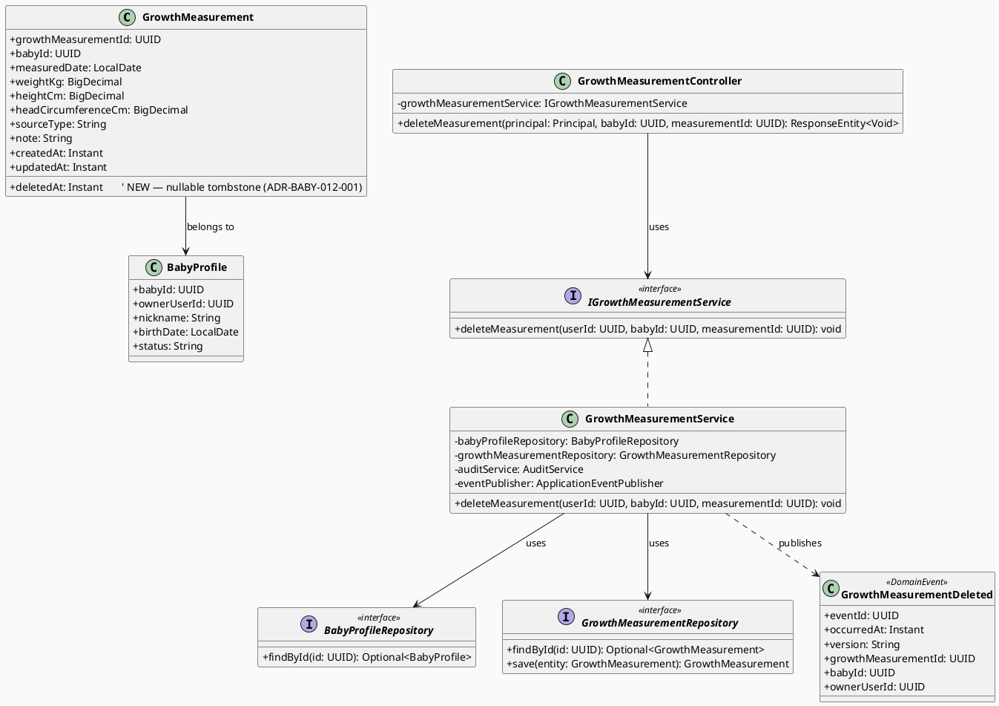
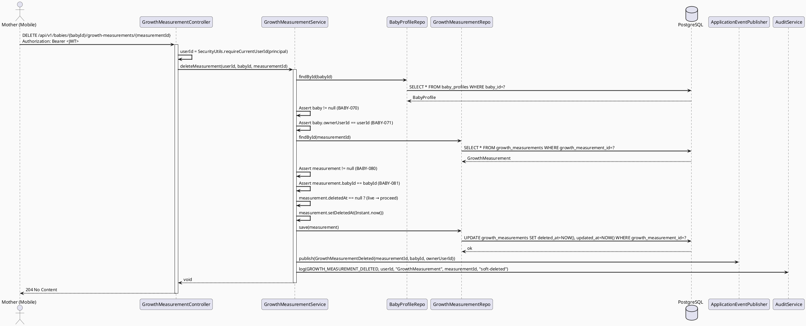
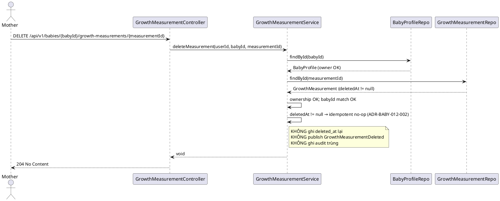
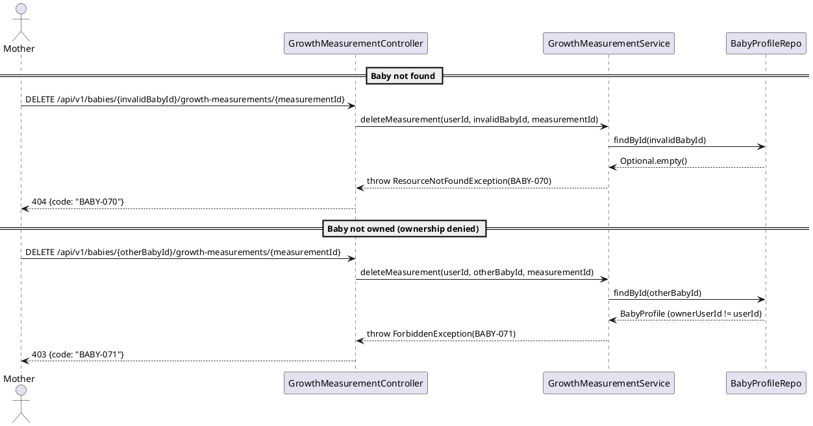
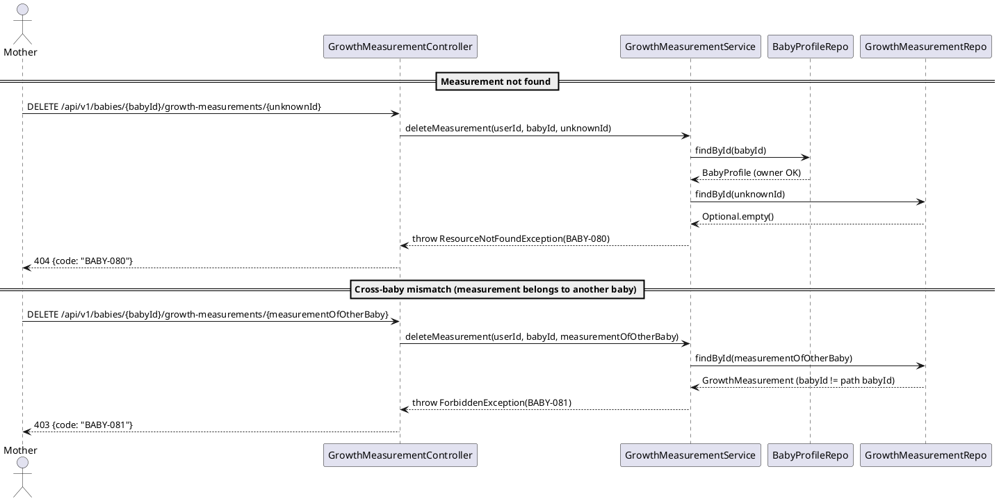
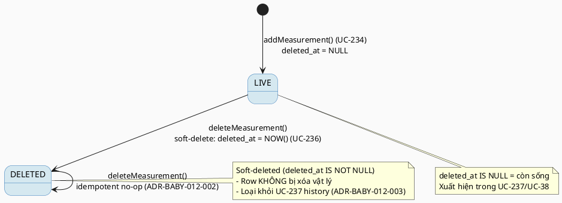

# ENGINEERING DOCUMENTATION STANDARD (EDS) v2.0
# Technical Design Specification — UC-236 Delete Growth Measurement

| Field | Value |
|-------|-------|
| **Document ID** | `CB-BABY-IMP-012` |
| **Version** | `1.0` |
| **Date** | `2026-07-03` |
| **Status** | `Partially Implemented` |
| **Document Owner** | `PhuongNT` |
| **Author** | `AI Agent` |
| **Reviewed by** | `[Tech Lead]` |
| **DPO Sign-off** | `[ ] Pending` |
| **Approved by** | `[Principal Architect]` |
| **Last Review** | `2026-07-03` |
| **Based on EDS** | `v2.0` |

---

## CHANGELOG

> **Policy 4.4 — Immutable History:** Không bao giờ xóa thông tin cũ. Mọi thay đổi phải ghi vào bảng này.

| Ngày | Người thực hiện | Nội dung thay đổi |
|------|-----------------|-------------------|
| 2026-07-10 | AI Agent | Phase 3 sync: backend service coverage added in `GrowthServiceTest`; `GrowthServiceTest` 19/19 PASS and carejourney suite 65/65 PASS. Controller/integration/full Test-Spec matrix still pending. |
| 2026-07-03 | AI Agent | Tạo tài liệu lần đầu cho UC-236 Delete Growth Measurement (soft-delete via new `deleted_at` column) |

---

## MỤC LỤC

1. [Tổng quan Module](#1-tổng-quan-module)
2. [Ma trận Truy vết (Traceability Matrix)](#2-ma-trận-truy-vết-traceability-matrix)
3. [Architecture Decision Records (ADR)](#3-architecture-decision-records-adr)
4. [Non-Functional Requirements & SLA](#4-non-functional-requirements--sla)
5. [Static Modeling](#5-static-modeling-mô-hình-tĩnh)
6. [Dynamic Modeling](#6-dynamic-modeling-mô-hình-động)
7. [Domain Event Catalog](#7-domain-event-catalog)
8. [Interface Specification](#8-interface-specification-đặc-tả-giao-diện)
9. [API Specification](#9-api-specification)
10. [Bảng mã lỗi](#10-bảng-mã-lỗi-error-codes)
11. [Quy trình Triển khai](#11-quy-trình-triển-khai-step-by-step)
12. [Rollback & Incident Runbook](#12-rollback--incident-runbook)
13. [Kịch bản Kiểm thử Chi tiết](#13-kịch-bản-kiểm-thử-chi-tiết)
14. [Phương pháp Xác minh](#14-phương-pháp-xác-minh)
15. [Mẫu thử thực tế (API Verification Samples)](#15-mẫu-thử-thực-tế-api-verification-samples)
16. [Bảng tổng hợp phân quyền (Authorization Matrix)](#16-bảng-tổng-hợp-phân-quyền-authorization-matrix)
17. [AI Prompt Constraints (CASE 2.0)](#17-ai-prompt-constraints-case-20)

---

## 1. Tổng quan Module

> Mother xóa một growth measurement nhập sai. SRS mô tả rõ đây là **soft-delete** ("Soft-deletes an incorrectly entered growth measurement" — Table 258). Khác với reminders/vaccination (đã có sẵn cột `status`), bảng `growth_measurements` **không có** bất kỳ cột trạng thái/cờ/timestamp nào để biểu diễn trạng thái đã-xóa-mềm → **cần một Flyway migration thật** để thêm cột `deleted_at` (xem §3 ADR-BABY-012-001, §5.2).

| Field | Value |
|-------|-------|
| **Module Name** | `DeleteGrowthMeasurement` |
| **Bounded Context** | `carejourney` |
| **UC ID** | `UC-236` |
| **SRS Reference** | `3.3.19.9` (Table 258) |
| **Primary Actor** | `Mother (ROLE_MOTHER — authenticated)` |
| **Secondary Actors** | `None` (SRS Table 258) |
| **Platform** | `Mobile App` |
| **Priority / Frequency** | `Medium` / `Occasional` (SRS Table 258) |
| **Data Classification** | `PII` |
| **Compliance Scope** | `BR-RBAC` (SRS Table 258 chỉ liệt kê BR-RBAC — KHÔNG có BR-PRIVACY, khác với UC-234/UC-235) |
| **Upstream Dependencies** | `auth (JWT), baby (baby_profiles), growth_measurements` |
| **Downstream Consumers** | `UC-237 View Growth Measurement History (phải loại trừ row đã soft-delete), audit` |

**Mô tả (SRS):** "Soft-deletes an incorrectly entered growth measurement." Chỉ Mother sở hữu baby mới được xóa measurement của baby đó (BR-RBAC + owner-only, kế thừa pattern từ UC-38 CB-BABY-IMP-008). Thao tác **soft-delete** — đánh dấu `deleted_at = NOW()` thay vì `DELETE FROM growth_measurements` — để bảo toàn dữ liệu cho audit theo Assumption "CareBridge retains data according to privacy and audit policies" (SRS Table 258). Backend **không** đưa ra bất kỳ nhận định y khoa nào (BR-SAFETY — kế thừa từ growth context, xem ADR-BABY-008-003 của UC-38).

---

## 2. Ma trận Truy vết (Traceability Matrix)

| Requirement ID | Loại (BR/ADR/US) | Mô tả yêu cầu | Thành phần Code | Compliance Target | ADR liên quan |
|----------------|------------------|---------------|-----------------|-------------------|---------------|
| UC-236 | Use Case | Mother soft-delete một growth measurement nhập sai | `GrowthMeasurementController.deleteMeasurement()` | BR-RBAC | ADR-BABY-012-001 |
| BR-RBAC | Business Rule | Users chỉ truy cập chức năng theo role/scope | `@PreAuthorize("hasRole('MOTHER')")` + ownership check | BR-RBAC | ADR-BABY-008-004 (reuse) |
| BR-OWNER | Business Rule | Chỉ Mother sở hữu baby (`baby.ownerUserId == caller`) được xóa measurement | `GrowthMeasurementService.deleteMeasurement()` ownership guard | BR-RBAC | ADR-BABY-008-004 (reuse) |
| BR-SAFETY | Business Rule | Không đưa ra nhận định y khoa trong response | Service — không phân tích dữ liệu | BR-SAFETY | ADR-BABY-008-003 (reuse) |
| ADR-BABY-012-001 | Decision | Soft-delete qua cột mới `deleted_at` (cần Flyway migration) | `V20260703000100__add_growth_measurement_deleted_at.sql` + `GrowthMeasurementService` | Data Retention | — |
| ADR-BABY-012-002 | Decision | Re-delete (đã soft-delete) là idempotent success `204` | `GrowthMeasurementService.deleteMeasurement()` | REST semantics | — |
| ADR-BABY-012-003 | Decision | Cross-cutting: UC-237 phải loại trừ row có `deleted_at IS NOT NULL` | `GrowthMeasurementRepository` query filter (UC-237) | Data Integrity | — |
| ADR-BABY-012-004 | Decision | Baby ACTIVE-required cho delete — chưa quyết định, ghi rõ tường minh (reconciled 2026-07-04 với UC-234/235) | `GrowthMeasurementService.deleteMeasurement()` (chưa implement gate) | NEEDS-DECISION | — |
| ADR-BABY-008-004 | Decision | Owner-only access cho growth data *(reuse — CB-BABY-IMP-008)* | ownership gate on `baby_profiles` | BR-RBAC | — |

> **Ghi chú compliance scope:** SRS Table 258 của UC-236 chỉ liệt kê **BR-RBAC** trong ô Business Rules (không có BR-PRIVACY). Việc soft-delete bảo toàn audit trail được neo vào **Assumption** của chính Table 258 ("CareBridge retains data according to privacy and audit policies") và **POST-3** ("Sensitive actions are recorded for audit... where required"), KHÔNG phát minh thêm BR-PRIVACY.

---

## 3. Architecture Decision Records (ADR)

### ADR-BABY-008-004 — Owner-only access cho growth data *(reuse — xem CB-BABY-IMP-008)*

| Field | Value |
|-------|-------|
| **Status** | `Accepted` |
| **Deciders** | `PhuongNT — Developer` |
| **Date** | `2026-06-26` |

> Kế thừa nguyên trạng từ UC-38 (`CB-BABY-IMP-008 §2/§17 C1`). Growth data thuộc về Mother sở hữu baby; kiểm tra `baby.ownerUserId == callerId` sau khi tải baby. UC-236 **tái sử dụng** quyết định này để ràng buộc rằng chỉ owner của baby mới được xóa measurement. Không định nghĩa lại — chỉ trích dẫn. `callerId` lấy từ JWT SecurityContext, KHÔNG từ path/body.

---

### ADR-BABY-012-001 — Soft-delete qua cột mới `deleted_at` (Proposed — cần Tech Lead + DBA sign-off)

| Field | Value |
|-------|-------|
| **Status** | `Proposed` — quyết định thay đổi schema thật, cần Tech Lead + DBA sign-off |
| **Deciders** | `Tech Lead (pending), DBA (pending), Principal Architect (pending)` |
| **Date** | `2026-07-03` |

#### Bối cảnh (Context)
SRS Table 258 mô tả UC-236 rõ ràng là **"Soft-deletes an incorrectly entered growth measurement"** — bắt buộc soft-delete, KHÔNG được hard-delete. Tuy nhiên bảng thực tế `public.growth_measurements` (baseline `V1__init_schema.sql` dòng 647–658) chỉ có các cột: `growth_measurement_id, baby_id, measured_date, weight_kg, height_cm, head_circumference_cm, source_type, note, created_at, updated_at` — **KHÔNG có** cột `status`, cờ boolean, hay timestamp nào để biểu diễn trạng thái đã-xóa-mềm. Khác với `reminders` (có `status VARCHAR(20)` với giá trị `CANCELLED` sẵn — xem UC-215) và `vaccination_records` (có `status VARCHAR(20)`), growth_measurements **không thể** soft-delete bằng cột sẵn có. Do đó **bắt buộc phải thêm cột mới qua Flyway migration thật**.

#### Các phương án đã xem xét (Options Considered)

| Phương án | Mô tả | Ưu điểm | Nhược điểm |
|-----------|-------|----------|------------|
| A | Hard delete: `DELETE FROM growth_measurements WHERE growth_measurement_id=?` | + Đơn giản, không cần migration | - **Vi phạm trực tiếp SRS** ("Soft-deletes..."); - Mất dữ liệu khỏi audit scope (vi phạm Assumption retention của Table 258) |
| B | Thêm cột `status VARCHAR(...)` (kiểu như reminders) | + Nhất quán tên với reminders/vaccination | - Over-engineered: growth measurement chỉ có 2 trạng thái sống/xóa; enum status thừa; - Cần migration + backfill default cho mọi row |
| C | Thêm cột `deleted_at timestamptz NULL` (tombstone timestamp) | + Đúng ngữ nghĩa soft-delete tối giản; + `NULL` = còn sống, non-NULL = đã xóa + giữ luôn thời điểm xóa (audit); + Không cần backfill (mọi row cũ mặc định NULL = còn sống); + Pattern phổ biến, dễ query `WHERE deleted_at IS NULL` | - **Cần Flyway migration mới** (chấp nhận được — SRS yêu cầu soft-delete thì schema change là bắt buộc) |

#### Quyết định (Decision)
Chọn **Phương án C**: thêm cột `deleted_at timestamptz NULL` vào `public.growth_measurements` qua Flyway migration mới. Soft-delete = `UPDATE ... SET deleted_at = NOW(), updated_at = NOW() WHERE growth_measurement_id=? AND deleted_at IS NULL`. `deleted_at IS NULL` biểu thị row còn sống; non-NULL biểu thị đã xóa mềm và giữ luôn timestamp xóa cho audit. Không hard-delete. Không dùng `status` enum (over-engineered cho ngữ nghĩa 2 trạng thái).

**Migration — version verified (không đoán):** migration mới nhất hiện tại là `V20260702002000` (2026-07-02). Ngày hôm nay 2026-07-03. **KHÔNG tồn tại** file `V20260703*` nào → version tiếp theo an toàn, không va chạm:

```
File (KHÔNG tạo trong phase spec — chỉ mô tả): 
  05_Development/CareBridgeAPI/src/main/resources/db/migration/V20260703000100__add_growth_measurement_deleted_at.sql
```

```sql
-- UC-236: DeleteGrowthMeasurement — soft-delete tombstone column
ALTER TABLE public.growth_measurements
    ADD COLUMN IF NOT EXISTS deleted_at timestamptz NULL;

-- (Optional / Proposed) Partial index để tối ưu truy vấn "live rows" của UC-237.
-- Đánh dấu Proposed vì lượng dữ liệu growth measurement/baby là nhỏ (Occasional);
-- index có thể không cần thiết ở giai đoạn MVP. DBA quyết định khi sign-off.
-- CREATE INDEX IF NOT EXISTS idx_growth_measurements_live
--     ON public.growth_measurements (baby_id, measured_date)
--     WHERE deleted_at IS NULL;
```

**Sync action cho `V1__init_schema.sql` — theo convention dự án (đã kiểm chứng, không phát minh):**
> Kiểm tra 2 migration additive gần đây cho thấy convention của dự án là **giữ riêng, KHÔNG fold cột mới vào V1**:
> - `V20260627100300__add_reminder_columns.sql` thêm `recurrence_type, recurrence_end_date, fcm_job_id` vào `reminders` — grep `V1__init_schema.sql` xác nhận các cột này **KHÔNG** xuất hiện trong V1 (giữ nguyên baseline).
> - `V20260627100500__create_vaccination_reference.sql` cũng đứng riêng, không sửa V1.
>
> **Kết luận sync:** **KHÔNG sửa `V1__init_schema.sql`.** Cột `deleted_at` được giao dưới dạng một migration additive độc lập (`V20260703000100`), đúng convention của `V20260627100300` / `V20260627100500`. V1 vẫn là baseline bất biến.

#### Hệ quả (Consequences)
**Tích cực:**
- Đáp ứng đúng yêu cầu SRS ("Soft-deletes"); dữ liệu được giữ lại cho audit (Assumption retention của Table 258).
- Migration additive, nullable, không cần backfill → an toàn, không khóa bảng lâu (`ADD COLUMN ... NULL` trên Postgres là metadata-only, nhanh).

**Tiêu cực / Trade-offs:**
- Mọi truy vấn đọc growth measurement (đặc biệt **UC-237**) phải thêm điều kiện `deleted_at IS NULL` để loại trừ row đã xóa mềm (xem ADR-BABY-012-003).
- Là schema change thật → cần DBA + Tech Lead sign-off trước khi implement (Status = `Proposed`).

**Compliance Impact:**
- BR-RBAC không đổi. Retention: dữ liệu growth không bị xóa cứng khỏi audit scope (đáp ứng Assumption Table 258).

> **Status = Proposed:** đây là thay đổi schema thật có hệ quả (cột mới + ràng buộc lọc downstream), cần **Tech Lead + DBA sign-off** (§11.1). Cơ chế (`deleted_at`) đã cụ thể — KHÔNG để Open.

---

### ADR-BABY-012-002 — Idempotent re-delete (đã soft-delete → success no-op `204`)

| Field | Value |
|-------|-------|
| **Status** | `Proposed` — cần Tech Lead sign-off |
| **Deciders** | `Tech Lead (pending)` |
| **Date** | `2026-07-03` |

#### Bối cảnh
Client mobile có thể gọi DELETE hai lần (double-tap, retry sau timeout mạng). Cần quyết định hành vi khi measurement mục tiêu **đã** có `deleted_at IS NOT NULL`.

#### Các phương án đã xem xét

| Phương án | Mô tả | Ưu điểm | Nhược điểm |
|-----------|-------|----------|------------|
| A | Trả 409 "already deleted" | + Rõ ràng trạng thái đã xóa | - UX xấu cho thao tác delete; - Vi phạm tính idempotent của HTTP DELETE (RFC 9110 §9.2.2) |
| B | Idempotent success — no-op, trả `204 No Content` | + An toàn với retry; + Đúng ngữ nghĩa idempotent của DELETE; + UX tốt | - Không phân biệt "vừa xóa" với "đã xóa từ trước" (chấp nhận được cho delete) |

#### Quyết định
Chọn **Phương án B**: DELETE trên measurement đã soft-delete (`deleted_at IS NOT NULL`) trả về **`204 No Content`** (idempotent success), **không** ghi `deleted_at` lại (giữ nguyên timestamp xóa lần đầu), **không** phát lại event `GrowthMeasurementDeleted`, **không** ghi audit trùng. Nhất quán với ADR-REM-DELETE-002 của UC-215.

#### Hệ quả
- Tích cực: retry-safe; đúng chuẩn REST.
- Trade-off: audit chỉ ghi 1 lần (ở lần xóa đầu). Chấp nhận được — không mất thông tin.

---

### ADR-BABY-012-003 — Cross-cutting: UC-237 phải loại trừ row đã soft-delete

| Field | Value |
|-------|-------|
| **Status** | `Proposed` — cần Tech Lead sign-off; ràng buộc cho sibling UC-237 |
| **Deciders** | `Tech Lead (pending)` |
| **Date** | `2026-07-03` |

#### Bối cảnh
Soft-delete chỉ có ý nghĩa nếu tầng đọc **loại trừ** row đã xóa. UC-237 (View Growth Measurement History — sibling trong cùng batch) là consumer chính. Tại thời điểm viết TDS này, thư mục `04_Implement/UC237_ViewGrowthMeasurementHistory/` **rỗng** (chưa có spec) → ADR này là **phát biểu đầu tiên** của yêu cầu cross-cutting để UC-237 áp dụng khi được soạn.

#### Quyết định
Mọi truy vấn đọc growth measurement dùng cho hiển thị (UC-237 History, và bất kỳ list/detail nào) **phải** thêm điều kiện `deleted_at IS NULL`. Cụ thể UC-237 phải dùng repository method dạng `findByBabyIdAndDeletedAtIsNullOrderByMeasuredDateDesc(babyId, Pageable pageable)` (paginated — hoàn thiện chữ ký 2026-07-04 sau khi UC-237 TDS được soạn và xác nhận khớp) thay vì `findByBabyId(...)` thuần. Lưu ý: UC-38 View Growth Chart (`CB-BABY-IMP-008`) hiện dùng `findByBabyIdOrderByMeasuredDateAsc` **không** lọc `deleted_at` — khi ADR này được Accepted, UC-38 cũng cần cập nhật filter tương ứng (ghi vào § Open Items O2).

#### Hệ quả
- **Tích cực:** dữ liệu đã xóa mềm không xuất hiện trong lịch sử người dùng thấy; audit vẫn giữ row.
- **Trade-off / phụ thuộc chéo:** UC-237 (và UC-38) phải tuân theo filter này. Nếu UC-237 được implement trước khi cột `deleted_at` tồn tại, filter sẽ lỗi → thứ tự triển khai: migration `V20260703000100` phải merge trước hoặc cùng lúc.

> **RESOLVED 2026-07-04 — xác nhận cross-doc:** UC-237 (`CB-BABY-IMP-013`) nay đã được soạn và xác nhận dùng ĐÚNG tên cột `deleted_at` + tên method `findByBabyIdAndDeletedAtIsNullOrderByMeasuredDateDesc` + migration filename `V20260703000100__add_growth_measurement_deleted_at.sql` do UC-236 (tài liệu này) định nghĩa — khớp 100%, không còn drift. UC-236 là chủ sở hữu (authoritative owner) của migration/tên cột này; UC-237 tiêu thụ theo đúng hợp đồng.

---

### ADR-BABY-012-004 — Require Baby Status ACTIVE for Delete (Proposed — reconciled with UC-234/UC-235)

| Field | Value |
|-------|-------|
| **Status** | `Proposed` *(reconciliation added 2026-07-04 — UC-236 ban đầu không đề cập điều kiện này; nay được đồng bộ với ADR-BABY-009-002 của UC-234 và ADR-BABY-010-006 của UC-235, cùng chờ Principal Architect xác nhận)* |
| **Deciders** | `AI Agent` |
| **Date** | `2026-07-04` |

#### Bối cảnh (Context)
UC-234 (Add) đề xuất ADR-BABY-009-002: mọi thao tác ghi trên `growth_measurements` yêu cầu `baby.status == ACTIVE`. UC-235 (Update) nay đã được đồng bộ theo cùng quy tắc (ADR-BABY-010-006). UC-236 (Delete) — bản TDS gốc — hoàn toàn không đề cập điều kiện trạng thái baby cho thao tác xóa, tạo ra một divergence thứ ba trong cùng batch ghi. Về mặt logic, "xóa một bản ghi nhập sai" có thể hợp lý ngay cả khi baby đã ARCHIVED (dọn dẹp dữ liệu lịch sử), nên đây KHÔNG phải là một kết luận hiển nhiên như UC-234/235 — nhưng để 3 tài liệu không tự mâu thuẫn ngầm, cần nêu rõ cùng một câu hỏi thay vì im lặng.

#### Các phương án đã xem xét

| Phương án | Mô tả | Ưu điểm | Nhược điểm |
|-----------|-------|----------|------------|
| A | Không yêu cầu ACTIVE cho delete (giữ nguyên bản gốc) | Cho phép dọn dẹp measurement sai ngay cả trên baby đã ARCHIVED — hợp lý cho use case "sửa lỗi lịch sử" | Không nhất quán với UC-234/235 nếu nhìn từ góc "mọi write cần ACTIVE" |
| B | Áp dụng cùng ADR-BABY-009-002 (Proposed), reuse mã lỗi `BABY-073` | Nhất quán tuyệt đối với UC-234/235 | Có thể chặn nhầm một thao tác dọn-dẹp hợp lệ trên baby ARCHIVED |

#### Quyết định
**Chưa chọn phương án cuối cùng** — đây là mục cần Principal Architect/Product quyết định (xem NEEDS-DECISION trong báo cáo). Tài liệu này tạm **giữ Phương án A làm mặc định hiện tại** (không thêm status gate cho DELETE — khác với UC-234/235) nhưng ghi rõ ràng, có chủ đích, thay vì im lặng như bản gốc, để tránh gây hiểu lầm là một thiếu sót chưa được xem xét. Nếu Principal Architect sau này quyết định Phương án B, cần thêm bước kiểm tra `baby.status == ACTIVE` (reuse `BABY-073`) vào `deleteMeasurement()` trước bước tìm measurement.

#### Hệ quả
**Tích cực:** Sự khác biệt giữa UC-236 và UC-234/235 (nếu có) nay là một quyết định tường minh, không phải một lỗ hổng tài liệu bị bỏ sót.
**Tiêu cực / Trade-offs:** Batch UC-234/235/236 hiện có 2 quy tắc viết khác nhau cho đến khi được thống nhất chính thức — chấp nhận được vì đây là read của một genuine business question, không phải lỗi tài liệu.

---

### ADR-BABY-008-003 — No Medical Interpretation *(reuse — xem CB-BABY-IMP-008)*

| Field | Value |
|-------|-------|
| **Status** | `Accepted` |
| **Deciders** | `PhuongNT — Developer` |
| **Date** | `2026-06-26` |

> Kế thừa từ UC-38. Backend không đưa ra bất kỳ nhận định y khoa nào. Với delete, response chỉ là `204 No Content` — không có payload chứa đánh giá. Trích dẫn để ràng buộc, không định nghĩa lại.

---

## 4. Non-Functional Requirements & SLA

### 4.1. Performance & Availability

| Category | Requirement | Target SLA | Measurement Method | Compliance Basis |
|----------|-------------|------------|---------------------|------------------|
| Latency | DELETE response (p99) | `< 200ms` | k6 load test | — |
| Availability | Uptime (monthly) | `99.9%` | Uptime monitor | — |

> Frequency of Use = **Occasional** (SRS Table 258) → không đặt throughput cao; không có SLA riêng ngoài baseline. Không phát minh SLA không có trong nguồn.

### 4.2. Data Integrity & Retention

| Category | Requirement | Target | Verification Method | Compliance Basis |
|----------|-------------|--------|---------------------|------------------|
| Retention | Measurement row giữ lại sau delete (soft-delete) | Row tồn tại với `deleted_at IS NOT NULL` | DB inspection §14.1 | Assumption Table 258 (retention) |
| Audit | Ghi `GROWTH_MEASUREMENT_DELETED` audit event | 1 event / lần xóa đầu tiên | Audit log §14.2 | POST-3 (Table 258) |
| Consistency | Idempotent re-delete không tạo audit trùng | Đúng 1 audit event | Audit log | ADR-BABY-012-002 |
| Consistency | Row đã soft-delete bị loại khỏi UC-237 history | 0 row deleted xuất hiện | Integration test §13.2 | ADR-BABY-012-003 |

### 4.3. Security

| Category | Requirement | Target | Verification Method | Compliance Basis |
|----------|-------------|--------|---------------------|------------------|
| Access control | Owner-only delete (baby ownership) | 100% | Auth Matrix §16 | BR-RBAC, ADR-BABY-008-004 |
| Encryption in transit | Endpoint qua TLS | TLS 1.2+ | Infra baseline | — |

### 4.4. Scalability & Capacity Planning

> Tải dự kiến thấp (Occasional). Soft-delete chỉ là 1 UPDATE + 1 event publish. Không cần chiến lược scale riêng. Partial index (§3 ADR-BABY-012-001) là Proposed, DBA quyết định.

---

## 5. Static Modeling (Mô hình Tĩnh)

### 5.1. Class Diagram (PlantUML)



### 5.2. Data Structure (Flyway SQL Migration)

> **CareBridge rule:** For actual database structure, use `V1__init_schema.sql` and approved Flyway migrations as the primary source.
>
> **Kết luận schema change: CẦN migration mới cho UC-236** (khác UC-38/UC-215).
> - Bảng `growth_measurements` (V1 dòng 647–658) **KHÔNG có** cột trạng thái/cờ/timestamp nào biểu diễn soft-delete → phải thêm cột `deleted_at`.
> - Version tiếp theo đã kiểm chứng (không đoán): mới nhất `V20260702002000`; hôm nay 2026-07-03; không tồn tại `V20260703*` → dùng **`V20260703000100`**.
> - Convention V1 sync: **KHÔNG fold vào V1** — giữ migration riêng (theo `V20260627100300__add_reminder_columns.sql`).

**File migration (mô tả — KHÔNG tạo `.sql` trong phase spec):**
`05_Development/CareBridgeAPI/src/main/resources/db/migration/V20260703000100__add_growth_measurement_deleted_at.sql`

```sql
-- UC-236: DeleteGrowthMeasurement — soft-delete tombstone column
-- ADR-BABY-012-001 (Proposed — cần Tech Lead + DBA sign-off)
ALTER TABLE public.growth_measurements
    ADD COLUMN IF NOT EXISTS deleted_at timestamptz NULL;

-- (Optional / Proposed) partial index cho "live rows" — DBA quyết định khi sign-off:
-- CREATE INDEX IF NOT EXISTS idx_growth_measurements_live
--     ON public.growth_measurements (baby_id, measured_date)
--     WHERE deleted_at IS NULL;
```

> **Quy tắc đặt tên:** column dùng snake_case (`deleted_at`). Entity JPA map `deletedAt: Instant` ↔ `deleted_at timestamptz`.
>
> **Baseline `growth_measurements` (V1__init_schema.sql — read-only, để verify):**
> ```sql
> CREATE TABLE public.growth_measurements (
>   growth_measurement_id uuid    NOT NULL DEFAULT gen_random_uuid(),
>   baby_id               uuid    NOT NULL,
>   measured_date         date    NOT NULL,
>   weight_kg             numeric,
>   height_cm             numeric,
>   head_circumference_cm numeric,
>   source_type           varchar(30),
>   note                  text,
>   created_at            timestamptz NOT NULL DEFAULT now(),
>   updated_at            timestamptz NOT NULL DEFAULT now()
> );  -- NO status / flag / deleted_at column → migration bắt buộc
> ```

---

## 6. Dynamic Modeling (Mô hình Động)

### 6.1. Sequence Diagram — Happy Path (soft-delete live measurement)



### 6.2. Sequence Diagram — Already-deleted (idempotent no-op)



### 6.3. Sequence Diagram — Ownership denied (403) & Baby not found (404)



### 6.4. Sequence Diagram — Measurement not found (404) & Cross-baby mismatch (403)



### 6.5. State Machine — GrowthMeasurement lifecycle (UC-236 view)



> **⚠️ Invariant bất biến:**
> - I1: Delete **không bao giờ** thực hiện `DELETE FROM growth_measurements` (soft-delete only) — ADR-BABY-012-001.
> - I2: `deleted_at IS NOT NULL` → không transition ngược về LIVE qua endpoint này (không "undelete" trong scope UC-236).
> - I3: `baby.ownerUserId != caller` → 403 BABY-071, không lộ chi tiết measurement — ADR-BABY-008-004.
> - I4: Row đã soft-delete phải bị loại khỏi mọi truy vấn đọc hiển thị (UC-237/UC-38) — ADR-BABY-012-003.

---

## 7. Domain Event Catalog

### 7.1. Events Published (Phát ra)

| Event Name | Trigger | Publisher | Subscriber(s) | Payload Schema | Async? |
|------------|---------|-----------|---------------|----------------|--------|
| `GrowthMeasurementDeleted` | Measurement chuyển LIVE→DELETED thành công (lần đầu) | `GrowthMeasurementService` | Audit (optional); analytics tương lai | `GrowthMeasurementDeleted.java` | Yes (after-commit khuyến nghị) |

### 7.2. Events Consumed (Tiêu thụ)

None. UC-236 không consume event nào.

### 7.3. Payload Schema

```java
// GrowthMeasurementDeleted.java
public record GrowthMeasurementDeleted(
    UUID    eventId,              // UUID.randomUUID() — dùng để deduplicate
    Instant occurredAt,          // Instant.now()
    String  version,             // "1.0"
    UUID    growthMeasurementId, // measurement vừa soft-delete
    UUID    babyId,              // baby chứa measurement
    UUID    ownerUserId          // owner_user_id của baby (== caller)
) {}
```

---

## 8. Interface Specification (Đặc tả Giao diện)

### 8.1. Service Interface

```java
// IGrowthMeasurementService.java — Service Contract
// @version 1.0
public interface IGrowthMeasurementService {

    /**
     * UC-236 — Soft-delete một growth measurement nhập sai của baby mà Mother sở hữu.
     * Đánh dấu deleted_at = NOW() (KHÔNG hard-delete). Idempotent: xóa lại một measurement
     * đã soft-delete là no-op success (204).
     *
     * @param userId        Mother's userId từ JWT SecurityContext
     * @param babyId        baby's UUID (path)
     * @param measurementId growth_measurement_id (path)
     * @throws ResourceNotFoundException (BABY-070) khi baby không tồn tại
     * @throws ForbiddenException        (BABY-071) khi baby không thuộc userId
     * @throws ResourceNotFoundException (BABY-080) khi measurement không tồn tại
     * @throws ForbiddenException        (BABY-081) khi measurement.babyId != babyId (cross-baby)
     */
    void deleteMeasurement(UUID userId, UUID babyId, UUID measurementId);
}
```

### 8.2. Repository Interface

```java
// GrowthMeasurementRepository.java
// @version 1.1 (bổ sung method cho soft-delete flow; method của UC-38 giữ nguyên)
public interface GrowthMeasurementRepository extends JpaRepository<GrowthMeasurement, UUID> {

    // Sẵn có (UC-38 CB-BABY-IMP-008):
    List<GrowthMeasurement> findByBabyIdOrderByMeasuredDateAsc(UUID babyId);

    // Dùng lại findById + save từ JpaRepository cho soft-delete:
    //   findById(measurementId) → phân biệt 404 (BABY-080)
    //   save(measurement)       → UPDATE ... SET deleted_at=NOW()
    // KHÔNG dùng deleteById() — soft-delete only (ADR-BABY-012-001)

    // PROPOSED cho UC-237 (cross-cutting ADR-BABY-012-003), khai báo tại đây làm reference:
    //   Page<GrowthMeasurement> findByBabyIdAndDeletedAtIsNullOrderByMeasuredDateDesc(UUID babyId, Pageable pageable);
    //   -- CHÚ Ý: chữ ký PHẢI khớp CHÍNH XÁC với CB-BABY-IMP-013 (UC-237) §8.2 -- trả Page<> và nhận Pageable,
    //      KHÔNG phải List<>/không tham số Pageable (đã sửa 2026-07-04 -- bản nháp trước đó bị lệch chữ ký
    //      so với UC-237, có thể gây xung đột khai báo trùng tên method với chữ ký khác nhau trên cùng
    //      repository interface nếu cả hai UC cùng khai báo độc lập).
}
```

> **Lưu ý cross-cutting (ADR-BABY-012-003):** UC-237 phải dùng biến thể `...AndDeletedAtIsNull...` VỚI chữ ký `Page<GrowthMeasurement> ...(UUID babyId, Pageable pageable)` -- xác nhận khớp 100% với `CB-BABY-IMP-013` §8.2 (2026-07-04). UC-38 (`findByBabyIdOrderByMeasuredDateAsc`) hiện KHÔNG lọc `deleted_at` → cần cập nhật khi ADR-BABY-012-001 Accepted (§ Open Items O2).

---

## 9. API Specification

### 9.1. Endpoints Table

| Method | Path | Auth Level | Required Roles | Rate Limit | Idempotent? |
|--------|------|------------|----------------|------------|-------------|
| `DELETE` | `/api/v1/babies/{babyId}/growth-measurements/{measurementId}` | JWT Bearer | `MOTHER` (own baby) | 30/min | Yes (ADR-BABY-012-002) |

> **Chọn HTTP verb — `DELETE`:** Ý định người dùng là "xóa bản ghi này" (UI mockup CB-176 nút "Xóa bản ghi này"). HTTP `DELETE` là verb tự nhiên và **idempotent** theo RFC 9110 §9.2.2, khớp ADR-BABY-012-002 (re-delete = no-op success). Dù server hiện thực soft-delete (set `deleted_at`), verb `DELETE` vẫn đúng về ngữ nghĩa ý định. Path nested dưới `{babyId}` nhất quán với UC-38 (`/api/v1/babies/{babyId}/growth-chart`).
>
> **Response body:** Trả **`204 No Content`** (không body) cho cả happy-path và idempotent no-op — chuẩn REST cho delete không có payload.

### 9.2. Request / Response Schemas

#### `DELETE /api/v1/babies/{babyId}/growth-measurements/{measurementId}` — Soft-delete measurement

**Path Parameters:**
| Name | Type | Required | Description |
|------|------|----------|-------------|
| `babyId` | `UUID` | Yes | Baby's unique identifier |
| `measurementId` | `UUID` | Yes | growth_measurement_id cần xóa |

**Request Body:** None. Header `Authorization: Bearer <JWT>`.

**Response — 204 No Content (Happy Path & Idempotent no-op):** không body.

**Response — 403 Forbidden (baby không thuộc user):**
```json
{ "success": false, "error": { "code": "BABY-071", "message": "Baby not owned by user" } }
```

**Response — 403 Forbidden (measurement thuộc baby khác):**
```json
{ "success": false, "error": { "code": "BABY-081", "message": "Growth measurement does not belong to the specified baby" } }
```

**Response — 404 Not Found (baby không tồn tại):**
```json
{ "success": false, "error": { "code": "BABY-070", "message": "Baby not found" } }
```

**Response — 404 Not Found (measurement không tồn tại):**
```json
{ "success": false, "error": { "code": "BABY-080", "message": "Growth measurement not found" } }
```

---

## 10. Bảng mã lỗi (Error Codes)

> Tiền tố `BABY-`. UC-236 **tái sử dụng** `BABY-070`/`BABY-071` (từ UC-38) và được cấp phát **`BABY-080` → `BABY-083`** cho code mới (tránh trùng: UC-234 = BABY-072..075, UC-235 = BABY-076..079, UC-237 = BABY-084..087).

| Code | HTTP Status | Message (EN) | Message (VI) | Trigger Condition |
|------|-------------|--------------|--------------|-------------------|
| `BABY-070` | 404 | Baby not found | Không tìm thấy em bé | `babyId` không tồn tại trong `baby_profiles` (reuse UC-38) |
| `BABY-071` | 403 | Baby not owned by user | Em bé không thuộc về người dùng | `baby.ownerUserId != JWT userId` (reuse UC-38, ADR-BABY-008-004) |
| `BABY-080` | 404 | Growth measurement not found | Không tìm thấy bản ghi tăng trưởng | `measurementId` không tồn tại trong `growth_measurements` |
| `BABY-081` | 403 | Growth measurement does not belong to the specified baby | Bản ghi tăng trưởng không thuộc em bé này | `measurement.babyId != path babyId` (cross-baby guard) |
| `BABY-082` | 500 | Growth measurement deletion failed | Xóa bản ghi tăng trưởng thất bại | Lỗi DB khi UPDATE `deleted_at`, hoặc lỗi không mong đợi trong flow |
| `BABY-083` | — | *(Reserved)* | *(Dành riêng)* | Đã cấp cho range UC-236 nhưng **chưa** phát sinh điều kiện lỗi tương ứng trong UC này — reserved để tránh phát minh lỗi không có trong nguồn |

> **Note:** Idempotent re-delete (`deleted_at IS NOT NULL` → xóa lại) **không** phải lỗi → trả `204`, không có mã lỗi (ADR-BABY-012-002). `BABY-083` được giữ reserved thay vì gán một điều kiện lỗi bịa ra.

---

## 11. Quy trình Triển khai (Step-by-Step)

### 11.1. Prerequisites

- [ ] **ADR-BABY-012-001/002/003** được Tech Lead + **DBA** chuyển `Proposed → Accepted` (schema change thật).
- [ ] Bảng `growth_measurements` và `baby_profiles` đã tồn tại (V1) — đã thỏa.
- [ ] JWT filter + `SecurityUtils.requireCurrentUserId` sẵn có — đã thỏa.
- [ ] Xác nhận cách UC-237/UC-38 áp dụng filter `deleted_at IS NULL` (§ Open Items O2).

### 11.2. Pre-Migration Checklist *(bắt buộc — UC-236 CÓ migration thật)*

- [ ] Đã backup DB staging trước khi chạy `V20260703000100`.
- [ ] `ADD COLUMN ... NULL` xác nhận là metadata-only (không rewrite bảng lớn trên Postgres).
- [ ] Rollback script (§12.2) đã test trên staging.
- [ ] DBA sign-off cho ADR-BABY-012-001 (và quyết định partial index optional).

### 11.3. Implementation Steps

#### Chặng 1 — Tạo Flyway migration
File: `src/main/resources/db/migration/V20260703000100__add_growth_measurement_deleted_at.sql`
```sql
ALTER TABLE public.growth_measurements
    ADD COLUMN IF NOT EXISTS deleted_at timestamptz NULL;
-- (Optional partial index — DBA quyết định, xem §5.2)
```
Chạy: `./mvnw flyway:migrate`
> ⚠️ Không sửa `V1__init_schema.sql` (convention: migration additive giữ riêng — theo `V20260627100300`).

#### Chặng 2 — Cập nhật entity + audit action (code-only)
- Thêm field `deletedAt: Instant` (map `deleted_at`) vào entity `GrowthMeasurement`.
- Thêm `GROWTH_MEASUREMENT_DELETED` vào enum `com.carebridge.backend.audit.entity.AuditAction`.
- **RESOLVED 2026-07-04 — verified against real file:** `05_Development/CareBridgeAPI/.../audit/entity/AuditAction.java` hiện có 59 constants, KHÔNG có `GROWTH_MEASUREMENT_DELETED` (hay biến thể nào của `GROWTH_MEASUREMENT_*`) — không xung đột. Cũng xác nhận không trùng với `GROWTH_MEASUREMENT_ADDED` (đề xuất mới của UC-234) hay `GROWTH_MEASUREMENT_UPDATED` (đề xuất mới của UC-235) — 3 constants của cả batch là phân biệt, an toàn để thêm cùng lúc.

#### Chặng 3 — Domain event
Tạo `GrowthMeasurementDeleted` record (§7.3) trong `carejourney` context.

#### Chặng 4 — Service
```java
@Override
@Transactional
public void deleteMeasurement(UUID userId, UUID babyId, UUID measurementId) {
    BabyProfile baby = babyProfileRepository.findById(babyId)
        .orElseThrow(() -> new ResourceNotFoundException("BABY-070", "Baby not found"));

    // ADR-BABY-008-004 — owner-only
    if (!baby.getOwnerUserId().equals(userId)) {
        throw new ForbiddenException("BABY-071", "Baby not owned by user");
    }

    GrowthMeasurement m = growthMeasurementRepository.findById(measurementId)
        .orElseThrow(() -> new ResourceNotFoundException("BABY-080", "Growth measurement not found"));

    // Cross-baby guard
    if (!m.getBabyId().equals(babyId)) {
        throw new ForbiddenException("BABY-081",
            "Growth measurement does not belong to the specified baby");
    }

    // ADR-BABY-012-002 — idempotent no-op nếu đã soft-delete
    if (m.getDeletedAt() != null) {
        return;
    }

    // ADR-BABY-012-001 — soft-delete
    m.setDeletedAt(Instant.now());
    growthMeasurementRepository.save(m);

    // Domain event + audit (POST-3)
    eventPublisher.publishEvent(new GrowthMeasurementDeleted(
        UUID.randomUUID(), Instant.now(), "1.0",
        m.getGrowthMeasurementId(), babyId, baby.getOwnerUserId()));
    auditService.log(AuditAction.GROWTH_MEASUREMENT_DELETED, userId,
        "GrowthMeasurement", measurementId.toString(), "soft-deleted");
}
```

#### Chặng 5 — Controller
```java
@DeleteMapping("/api/v1/babies/{babyId}/growth-measurements/{measurementId}")
@PreAuthorize("hasRole('MOTHER')")
public ResponseEntity<Void> deleteMeasurement(
        Principal principal,
        @PathVariable UUID babyId,
        @PathVariable UUID measurementId) {
    UUID userId = SecurityUtils.requireCurrentUserId(principal);
    growthMeasurementService.deleteMeasurement(userId, babyId, measurementId);
    return ResponseEntity.noContent().build(); // 204
}
```

#### Chặng 6 — Cập nhật consumer (cross-cutting)
- UC-237 dùng `findByBabyIdAndDeletedAtIsNullOrderByMeasuredDateDesc` (ADR-BABY-012-003).
- Cập nhật UC-38 query để lọc `deleted_at IS NULL` (§ Open Items O2).

### 11.4. Deployment Checklist

- [ ] Migration `V20260703000100` chạy thành công; cột `deleted_at` tồn tại.
- [ ] DELETE live measurement của owner → 204; DB `deleted_at IS NOT NULL`.
- [ ] DELETE lại measurement đã xóa → 204 (no-op, không audit trùng).
- [ ] DELETE với baby của người khác → 403 BABY-071.
- [ ] DELETE baby không tồn tại → 404 BABY-070; measurement không tồn tại → 404 BABY-080.
- [ ] DELETE measurement của baby khác (mismatch) → 403 BABY-081.
- [ ] Row **không** bị xóa cứng (SELECT vẫn thấy, `deleted_at` set).
- [ ] Row đã soft-delete KHÔNG xuất hiện trong UC-237 history.
- [ ] Audit log có `GROWTH_MEASUREMENT_DELETED`.

---

## 12. Rollback & Incident Runbook

### 12.1. Điều kiện kích hoạt Rollback

| Điều kiện | Ngưỡng | Người quyết định |
|-----------|--------|------------------|
| Error rate DELETE | > 5% trong 5 phút | On-call Engineer |
| Measurement bị hard-delete ngoài ý muốn (mất row) | Bất kỳ case | Tech Lead |
| Migration `V20260703000100` gây lỗi bảng | Bất kỳ | Tech Lead + DBA |
| Audit log ngừng ghi `GROWTH_MEASUREMENT_DELETED` | > 1 phút | On-call Engineer |

### 12.2. Rollback Procedure

```bash
# --- Rollback CODE ---
git checkout -- 05_Development/CareBridgeAPI/src/main/java/com/carebridge/backend/carejourney/
git checkout -- 05_Development/CareBridgeAPI/src/main/java/com/carebridge/backend/audit/entity/AuditAction.java

# --- Rollback MIGRATION (Flyway không auto-rollback) ---
# Chỉ khi cần revert schema. Cột nullable → drop an toàn (dữ liệu deleted_at bị mất, các row trở lại "live").
psql -h $DB_HOST -U $DB_USER -d $DB_NAME \
  -c "ALTER TABLE public.growth_measurements DROP COLUMN IF EXISTS deleted_at;"
psql -h $DB_HOST -U $DB_USER -d $DB_NAME \
  -c "DELETE FROM flyway_schema_history WHERE version = '20260703000100';"

# --- Re-deploy phiên bản trước ---
kubectl rollout undo deployment/carebridge-api
kubectl rollout status deployment/carebridge-api
curl -X GET https://[host]/api/v1/health   # Expected: 200
```

> **Cảnh báo dữ liệu:** DROP COLUMN `deleted_at` sẽ khiến các measurement đã soft-delete "sống lại" (mất dấu xóa). Chỉ rollback migration khi thực sự cần và đã đánh giá tác động với DBA. Soft-delete không mất row → rủi ro mất measurement gốc = 0.

### 12.3. Notification Protocol

| Thời điểm | Người nhận | Kênh |
|-----------|------------|------|
| Ngay khi phát hiện | On-call team | Slack `#incident` |
| Nếu phát hiện hard-delete/mất dữ liệu PII | Tech Lead | Slack DM |

### 12.4. Post-Incident Review (PIR)
Hoàn thành PIR trong 48 giờ: Timeline, Root Cause (5 Whys), Impact (số measurement bị xóa sai), Remediation, Prevention.

---

## 13. Kịch bản Kiểm thử Chi tiết

> Mọi scenario dùng dữ liệu `SYNTHETIC`. Không dùng Production PII.

### 13.1. Unit Tests

#### TC-UNIT-001 — Owner soft-delete live measurement → deleted_at set
```gherkin
Feature: Delete Growth Measurement
  Background:
    Given test data classification: SYNTHETIC
    And MOTHER_ID sở hữu BABY_ID
    And measurement MEAS_ID thuộc BABY_ID, deleted_at = null

  Scenario: Owner soft-deletes live measurement
    When deleteMeasurement(MOTHER_ID, BABY_ID, MEAS_ID) được gọi
    Then measurement.deletedAt != null
    And growthMeasurementRepository.save() được gọi đúng 1 lần
    And KHÔNG gọi deleteById()
    And event GrowthMeasurementDeleted được publish
    And audit log chứa GROWTH_MEASUREMENT_DELETED
```

#### TC-UNIT-002 — Idempotent: xóa measurement đã soft-delete → no-op
```gherkin
  Scenario: Re-delete already soft-deleted measurement → idempotent success
    Given MEAS_ID có deleted_at != null, thuộc BABY_ID owner MOTHER_ID
    When deleteMeasurement(MOTHER_ID, BABY_ID, MEAS_ID) được gọi
    Then không throw
    And growthMeasurementRepository.save() KHÔNG được gọi
    And event GrowthMeasurementDeleted KHÔNG được publish
    And KHÔNG ghi audit trùng
```

#### TC-UNIT-003 — Baby not owned → 403 BABY-071
```gherkin
  Scenario: Non-owner deletes → 403
    Given BABY_ID thuộc OTHER_USER_ID
    When deleteMeasurement(MOTHER_ID, BABY_ID, MEAS_ID) được gọi
    Then throws ForbiddenException code BABY-071 (403)
    And measurement.deletedAt vẫn null (không đổi)
```

#### TC-UNIT-004 — Baby not found → 404 BABY-070
```gherkin
  Scenario: Baby không tồn tại → 404
    When deleteMeasurement(MOTHER_ID, UNKNOWN_BABY_ID, MEAS_ID) được gọi
    Then throws ResourceNotFoundException code BABY-070 (404)
```

#### TC-UNIT-005 — Measurement not found → 404 BABY-080
```gherkin
  Scenario: Measurement không tồn tại → 404
    Given BABY_ID owner MOTHER_ID
    When deleteMeasurement(MOTHER_ID, BABY_ID, UNKNOWN_MEAS_ID) được gọi
    Then throws ResourceNotFoundException code BABY-080 (404)
```

#### TC-UNIT-006 — Cross-baby mismatch → 403 BABY-081
```gherkin
  Scenario: Measurement thuộc baby khác → 403
    Given BABY_ID owner MOTHER_ID
    And MEAS_ID có babyId = OTHER_BABY_ID (khác path babyId)
    When deleteMeasurement(MOTHER_ID, BABY_ID, MEAS_ID) được gọi
    Then throws ForbiddenException code BABY-081 (403)
    And measurement.deletedAt vẫn null
```

### 13.2. Integration Tests

#### TC-INT-001 — Full flow: soft-delete, row còn tồn tại, loại khỏi UC-237 history
```gherkin
  Scenario: Service + Repository — soft-delete + history exclusion
    Given test data classification: SYNTHETIC
    And PostgreSQL container running, migration V20260703000100 applied
    And DB có BABY_ID owner MOTHER_ID với 2 measurement (M1 live, M2 live)
    When DELETE /api/v1/babies/{BABY_ID}/growth-measurements/{M1}
    Then response 204
    And SELECT M1 vẫn trả 1 row với deleted_at IS NOT NULL
    And COUNT growth_measurements của BABY_ID vẫn = 2 (không hard-delete)
    And findByBabyIdAndDeletedAtIsNullOrderByMeasuredDateDesc(BABY_ID, Pageable.unpaged()) chỉ trả M2
```

### 13.3. E2E / Security Tests

```gherkin
  Scenario: DELETE measurement của owner → 204
    Given MOTHER_ID có JWT hợp lệ, sở hữu BABY_ID, MEAS_ID live
    When DELETE /api/v1/babies/{BABY_ID}/growth-measurements/{MEAS_ID}
    Then response 204
    And DB row deleted_at IS NOT NULL

  Scenario: DELETE không có JWT → 401
    When DELETE /api/v1/babies/{BABY_ID}/growth-measurements/{MEAS_ID} không Authorization header
    Then response 401

  Scenario: IDOR — DELETE measurement của baby người khác → 403
    Given OTHER_MOTHER có JWT hợp lệ (không sở hữu BABY_ID)
    When DELETE /api/v1/babies/{BABY_ID}/growth-measurements/{MEAS_ID}
    Then response 403 code BABY-071
    And MEAS_ID.deleted_at vẫn null (không đổi)
```

---

## 14. Phương pháp Xác minh

### 14.1. Database Inspection
> **Oracle rule:** mọi assertion về persistence trace về `growth_measurements` thực tế (cột mới `deleted_at timestamptz` từ `V20260703000100`, `baby_id`, `updated_at`).

```sql
-- Verify cột deleted_at tồn tại sau migration
SELECT column_name, data_type, is_nullable
FROM information_schema.columns
WHERE table_name = 'growth_measurements' AND column_name = 'deleted_at';
-- Expected: deleted_at | timestamp with time zone | YES

-- Verify soft-delete: row vẫn tồn tại, deleted_at set
SELECT growth_measurement_id, baby_id, deleted_at, updated_at
FROM growth_measurements WHERE growth_measurement_id = '<uuid>';
-- Expected: 1 row, deleted_at IS NOT NULL

-- Verify KHÔNG hard-delete: count không giảm
SELECT COUNT(*) FROM growth_measurements WHERE growth_measurement_id = '<uuid>';
-- Expected: 1

-- Verify live-only query (UC-237 filter)
SELECT growth_measurement_id FROM growth_measurements
WHERE baby_id = '<babyId>' AND deleted_at IS NULL
ORDER BY measured_date DESC;
```

### 14.2. Log / Audit Verification
```bash
# Verify audit GROWTH_MEASUREMENT_DELETED
kubectl logs -l app=carebridge-api | grep 'GROWTH_MEASUREMENT_DELETED' | head -5

# Verify idempotent re-delete KHÔNG tạo audit trùng (đếm = 1 cho 2 lần delete)
# Verify không PII leak
grep -i "password\|secret" application.log   # Expected: no output
```

---

## 15. Mẫu thử thực tế (API Verification Samples)

### 15.1. Happy Path
```bash
# DELETE measurement (owner) → 204
curl -i -X DELETE "https://[host]/api/v1/babies/bbbbbbbb-0000-0000-0000-000000000236/growth-measurements/aaaa0001-0000-0000-0000-000000000001" \
  -H "Authorization: Bearer <OWNER_MOTHER_JWT>" \
  -H "X-Correlation-Id: $(uuidgen)"
# Expected: HTTP/1.1 204 No Content

# DELETE lại (idempotent) → 204 lần nữa
curl -i -X DELETE "https://[host]/api/v1/babies/bbbbbbbb-0000-0000-0000-000000000236/growth-measurements/aaaa0001-0000-0000-0000-000000000001" \
  -H "Authorization: Bearer <OWNER_MOTHER_JWT>"
# Expected: HTTP/1.1 204 No Content (no-op, không audit trùng)
```

### 15.2. Error Paths
```bash
# Baby không thuộc user → 403 BABY-071
curl -i -X DELETE "https://[host]/api/v1/babies/bbbbbbbb-0000-0000-0000-000000000236/growth-measurements/aaaa0001-0000-0000-0000-000000000001" \
  -H "Authorization: Bearer <OTHER_MOTHER_JWT>"
# Expected: 403 {"error":{"code":"BABY-071"}}

# Measurement không tồn tại → 404 BABY-080
curl -i -X DELETE "https://[host]/api/v1/babies/bbbbbbbb-0000-0000-0000-000000000236/growth-measurements/00000000-0000-0000-0000-0000000000ff" \
  -H "Authorization: Bearer <OWNER_MOTHER_JWT>"
# Expected: 404 {"error":{"code":"BABY-080"}}

# No JWT → 401
curl -i -X DELETE "https://[host]/api/v1/babies/bbbbbbbb-0000-0000-0000-000000000236/growth-measurements/aaaa0001-0000-0000-0000-000000000001"
# Expected: 401
```

---

## 16. Bảng tổng hợp phân quyền (Authorization Matrix)

| Endpoint | `GUEST` | `MOTHER (owner)` | `MOTHER (non-owner)` | `EXPERT` | `ADMIN` |
|----------|---------|------------------|----------------------|----------|---------|
| `DELETE /api/v1/babies/{babyId}/growth-measurements/{measurementId}` | ❌ (401) | ✅ Own baby | ❌ (403 BABY-071) | ❌ (403) | ❌ *(không trong scope UC-236)* |

**Chú thích:**
- ✅ = Được phép; ❌ = Từ chối.
- `Own baby` = chỉ với measurement của baby có `ownerUserId == caller`.
- ADMIN/EXPERT không được cấp quyền delete growth measurement trong UC-236 (SRS Table 258 chỉ định Primary Actor = Mother, Secondary Actors = None). Không phát minh quyền.

---

## 17. AI Prompt Constraints (CASE 2.0)

### 17.1 Constraint Summary Table

| # | Constraint | Source (ADR/BR) | Last Verified |
|---|-----------|-----------------|---------------|
| C1 | Delete PHẢI soft-delete: `measurement.setDeletedAt(now)` + `save()`. TUYỆT ĐỐI KHÔNG gọi `deleteById()` / `DELETE FROM growth_measurements` | ADR-BABY-012-001, SRS Table 258 ("Soft-deletes") | 2026-07-03 |
| C2 | Ownership: throw BABY-071 (403) nếu `baby.ownerUserId != userId`; `userId` lấy từ JWT SecurityContext, KHÔNG từ path/body | ADR-BABY-008-004, BR-RBAC | 2026-07-03 |
| C3 | Idempotent: measurement đã có `deletedAt != null` → return no-op (204), KHÔNG save, KHÔNG publish event, KHÔNG audit trùng | ADR-BABY-012-002 | 2026-07-03 |
| C4 | Cross-baby guard: `measurement.babyId != path babyId` → throw BABY-081 (403). Measurement không tồn tại → BABY-080 (404). Baby không tồn tại → BABY-070 (404) | §10 Error Codes | 2026-07-03 |
| C5 | Sau soft-delete thành công: publish `GrowthMeasurementDeleted` + audit `AuditAction.GROWTH_MEASUREMENT_DELETED`. Row đã xóa PHẢI bị loại khỏi UC-237 (`deleted_at IS NULL` filter) | ADR-BABY-012-003, POST-3 | 2026-07-03 |

> ⚠️ `Last Verified` > 2 sprints → re-verify trước khi inject.

### 17.2 Constraint Injection Block (Copy-Paste vào AI Prompt)

```
[CONSTRAINT BLOCK — Module: DeleteGrowthMeasurement (CB-BABY-IMP-012)]
Theo TDS CB-BABY-IMP-012 và các ADR liên quan:

1. (C1 — ADR-BABY-012-001) deleteMeasurement() PHẢI soft-delete: measurement.setDeletedAt(Instant.now()) + save(). CẤM deleteById()/DELETE FROM growth_measurements. SRS Table 258 yêu cầu "Soft-deletes".
2. (C2 — ADR-BABY-008-004 / BR-RBAC) throw ForbiddenException(403,"BABY-071") nếu baby.ownerUserId != userId. userId từ SecurityUtils.requireCurrentUserId(principal), KHÔNG từ path/body.
3. (C3 — ADR-BABY-012-002) measurement.deletedAt != null → return ngay (no-op 204). Không save, không publish, không audit.
4. (C4 — §10) baby không tồn tại → BABY-070 (404); measurement không tồn tại → BABY-080 (404); measurement.babyId != path babyId → BABY-081 (403).
5. (C5 — ADR-BABY-012-003 / POST-3) sau save: eventPublisher.publishEvent(GrowthMeasurementDeleted{...}) + auditService.log(GROWTH_MEASUREMENT_DELETED,...). UC-237/UC-38 phải lọc deleted_at IS NULL.

[CONTEXT BLOCK]
- Bounded Context: carejourney
- Data Classification: PII
- Compliance: BR-RBAC (SRS Table 258 — KHÔNG có BR-PRIVACY)
- Existing interfaces: §8 (IGrowthMeasurementService, GrowthMeasurementRepository)
- Error codes: §10 (BABY-070/071 reused; BABY-080..083)
- Auth matrix: §16
- Flyway migration BẮT BUỘC: V20260703000100__add_growth_measurement_deleted_at.sql (ADD COLUMN deleted_at timestamptz NULL). KHÔNG sửa V1.

[TASK BLOCK]
Implement deleteMeasurement(UUID userId, UUID babyId, UUID measurementId)
+ DELETE /api/v1/babies/{babyId}/growth-measurements/{measurementId} thỏa constraints trên.
Output tuân thủ §8. Tests cover §13.
```

### 17.3 Constraint Quality Checklist

- [x] Mỗi constraint traceable về ADR/BR cụ thể
- [x] Không có constraint generic
- [x] Mỗi constraint có `Last Verified` ≤ 2 sprints
- [x] Constraint block có ≥ 5 constraints cụ thể
- [x] Reference §8 Interface + §16 Auth Matrix

### 17.4 Anti-Pattern Detection (cho AI-Generated Code)

| AP-ID | Anti-Pattern | Dấu hiệu | Hành động |
|-------|-------------|-----------|----------|
| AP-AI-001 | Unconstrained Gen | Code gọi `deleteById()` / hard delete | Reject — vi phạm C1/ADR-BABY-012-001 (SRS yêu cầu soft-delete) |
| AP-AI-003 | Implicit Decision | Code bỏ qua cross-baby guard hoặc không lọc `deleted_at` ở UC-237 | Reject — vi phạm C4/C5/ADR-BABY-012-003 |
| AP-AI-005 | Hallucinated Contract | Code import service/type không có trong §8, hoặc dùng cột `status` (không tồn tại) thay vì `deleted_at` | Reject — verify contract; growth_measurements KHÔNG có `status` |

---

## PHỤ LỤC

### A. Glossary

| Thuật ngữ | Định nghĩa |
|-----------|------------|
| Soft-delete | Đánh dấu record đã xóa (`deleted_at = NOW()`) thay vì xóa vật lý |
| `deleted_at` | Cột tombstone mới (nullable timestamptz): NULL = còn sống, non-NULL = đã xóa + thời điểm xóa |
| Idempotent | Gọi nhiều lần cho cùng kết quả — re-delete = 204 no-op |
| Cross-baby guard | Kiểm tra measurement thực sự thuộc baby trong path (chống IDOR chéo baby) |
| Tombstone | Row đánh dấu đã xóa nhưng vẫn giữ trong bảng cho audit |

### B. Open Items

| # | Open Item | Lý do | Owner đề xuất |
|---|-----------|-------|---------------|
| O1 | ADR-BABY-012-001/002/003 đang `Proposed` — cần sign-off (đặc biệt DBA cho schema change) | Thay đổi schema thật có hệ quả | Tech Lead / DBA / Principal Architect |
| O2 | Cập nhật UC-38 (View Growth Chart) để lọc `deleted_at IS NULL` | UC-38 hiện dùng `findByBabyIdOrderByMeasuredDateAsc` không lọc; cần đồng bộ khi ADR-BABY-012-001 Accepted | Tech Lead (batch owner) |
| O3 | Partial index `idx_growth_measurements_live` — cần hay không | Dữ liệu nhỏ (Occasional); DBA cân nhắc | DBA |
| O4 | Xác nhận range mã lỗi UC-234=BABY-072..075, UC-235=BABY-076..079, UC-237=BABY-084..087 khớp khi các sibling được soạn | **RESOLVED 2026-07-04** — đã xác nhận không va chạm: UC-234 (072-075), UC-235 (076-079, +073 reused), UC-236 (080-083), UC-237 (084-087). Không có overlap | Tech Lead (batch owner) |
| O5 *(new)* | ADR-BABY-012-004 (baby ACTIVE-required cho delete) — chưa quyết định phương án A hay B | Xem NEEDS-DECISION trong báo cáo reconciliation 2026-07-04 | Principal Architect / Product |

### C. Tài liệu tham chiếu

| Document | Path |
|----------|------|
| EDS v2.0 Template | `08_References/Template/PHASE-3_TDS.md` |
| UC-38 TDS (ADR reuse: owner-only, no medical interpretation) | `04_Implement/UC38_ViewGrowthChart/UC38_ViewGrowthChart_TDS.md` |
| UC-215 TDS (soft-delete + idempotent precedent) | `04_Implement/UC215_DeleteReminder/UC215_DeleteReminder_TDS.md` |
| SRS §3.3.19.9 (Table 258) | `02_Requirements/SRS/3_Functional_Specification.md` |
| growth_measurements baseline | `05_Development/CareBridgeAPI/src/main/resources/db/migration/V1__init_schema.sql` (dòng 647–658) |
| Migration convention precedent | `.../db/migration/V20260627100300__add_reminder_columns.sql` |
| UI/UX — Growth Measurement Detail (nút "Xóa bản ghi này") | `03_Design/UI_UX/MobileAppScreen/CB-176 Growth Measurement Detail (UC-234, UC-235, UC-236)/code.html` |

---

*EDS v2.1 — Tích hợp CASE 2.0 AI Prompt Constraints (§17). Status: Partially Implemented.*
