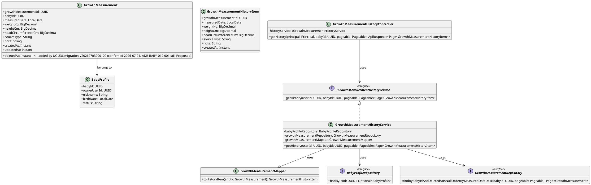
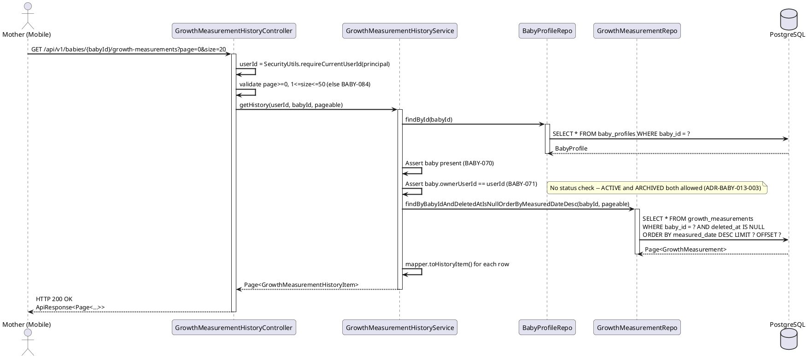
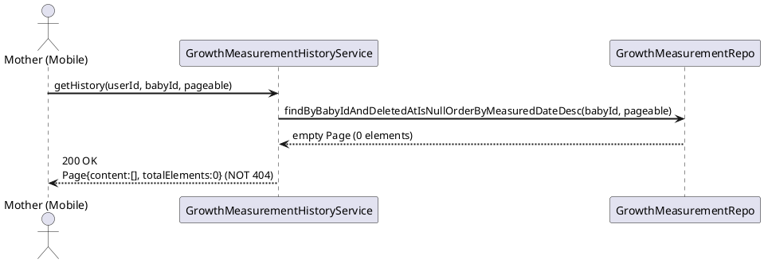
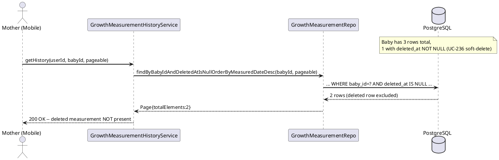
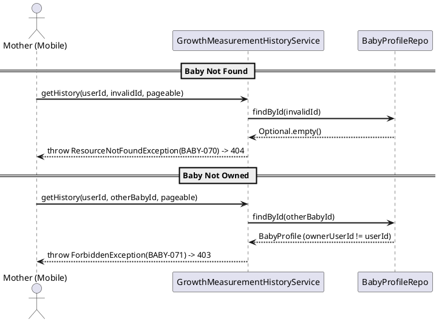
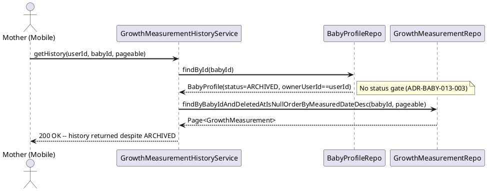

# ENGINEERING DOCUMENTATION STANDARD (EDS) v2.0
# Technical Design Specification -- UC-237 View Growth Measurement History

| Field | Value |
|-------|-------|
| **Document ID** | `CB-BABY-IMP-013` |
| **Version** | `1.0` |
| **Date** | `2026-07-03` |
| **Status** | `Draft` |
| **Document Owner** | `PhuongNT` |
| **Author** | `AI Agent` |
| **Reviewed by** | `[Tech Lead]` |
| **DPO Sign-off** | `[ ] Pending` |
| **Approved by** | `[Principal Architect]` |
| **Last Review** | `2026-07-03` |
| **Based on EDS** | `v2.0` |

---

## CHANGELOG

| Ngay | Nguoi thuc hien | Noi dung thay doi |
|------|-----------------|-------------------|
| 2026-07-03 | AI Agent | Tao tai lieu lan dau cho UC-237 View Growth Measurement History |

---

## MUC LUC

1. [Tong quan Module](#1-tong-quan-module)
2. [Ma tran Truy vet](#2-ma-tran-truy-vet)
3. [Architecture Decision Records](#3-architecture-decision-records-adr)
4. [Non-Functional Requirements & SLA](#4-non-functional-requirements--sla)
5. [Static Modeling](#5-static-modeling)
6. [Dynamic Modeling](#6-dynamic-modeling)
7. [Domain Event Catalog](#7-domain-event-catalog)
8. [Interface Specification](#8-interface-specification)
9. [API Specification](#9-api-specification)
10. [Bang ma loi](#10-bang-ma-loi)
11. [Quy trinh Trien khai](#11-quy-trinh-trien-khai)
12. [Rollback & Incident Runbook](#12-rollback--incident-runbook)
13. [Kich ban Kiem thu](#13-kich-ban-kiem-thu)
14. [Phuong phap Xac minh](#14-phuong-phap-xac-minh)
15. [Mau thu thuc te](#15-mau-thu-thuc-te)
16. [Authorization Matrix](#16-bang-tong-hop-phan-quyen)
17. [AI Prompt Constraints](#17-ai-prompt-constraints-case-20)

---

## 1. Tong quan Module

| Field | Value |
|-------|-------|
| **Module Name** | `ViewGrowthMeasurementHistory` |
| **Bounded Context** | `carejourney` |
| **UC ID** | `UC-237` |
| **SRS Reference** | `3.3.19.10 (Table 259)` |
| **Primary Actor** | `Mother (ROLE_MOTHER -- authenticated)` |
| **Platform** | `Mobile App` |
| **Data Classification** | `PII` |
| **Compliance Scope** | `BR-RBAC` (SRS Table 259 -- BR-RBAC only) |
| **Upstream Dependencies** | `auth (JWT), baby (baby_profiles), growth_measurements, UC-236 deleted_at column (soft-delete)` |
| **Downstream Consumers** | `Mobile app list/history screen (CB-175), UC-38 View Growth Chart (aggregates the same rows)` |

**Mo ta:** Tra ve danh sach cac ban ghi do luong tang truong (`growth_measurements`) cua mot em be duoi dang phan trang (paginated), sap xep theo `measured_date DESC` (moi nhat len dau). Day la nguon du lieu tho ("the source for growth charts" -- SRS Table 259) ma tren do UC-38 View Growth Chart tong hop/dinh dang lai thanh chart. Endpoint chi doc (read-only), khong dua ra nhan dinh y khoa, khong ghi bat ky su thay doi trang thai nao. Cac ban ghi da bi xoa mem (`deleted_at IS NOT NULL`, cot do UC-236 them vao) PHAI bi loai khoi ket qua.

**Quan he UC-237 <-> UC-38 (clarification bat buoc):**
- **UC-237 (module nay):** tra ve *danh sach tho* tung ban ghi do luong (raw list of individual entries), phan trang, DESC -- phuc vu man hinh "Lich su ghi nhan" (CB-175).
- **UC-38:** tra ve du lieu da *tong hop/dinh dang chart* (time-series ASC, kem `ageInDays`) tren cung bang `growth_measurements`.
- Ca hai deu read-only tren `growth_measurements` va deu ap dung owner-only check + read-side leniency (ADR-BABY-008-002). Do khac biet ve shape (raw-list-DESC-paginated vs chart-ASC-full) va do UC-38 chua loc `deleted_at`, UC-237 dung **repository method rieng** (xem ADR-BABY-013-001). Neu UC-38 sau nay can dong bo soft-delete, se refactor chung -- ngoai pham vi UC-237.

---

## 2. Ma tran Truy vet

| Requirement ID | Loai | Mo ta yeu cau | Thanh phan Code | Compliance Target | ADR lien quan |
|----------------|------|---------------|-----------------|-------------------|---------------|
| UC-237 | Use Case | Mother xem lich su do luong tang truong (paginated list) | `GrowthMeasurementHistoryController.getHistory()` | BR-RBAC | ADR-BABY-013-001 |
| BR-RBAC | Business Rule | Chi Mother so huu baby moi duoc xem | `GrowthMeasurementHistoryService` ownership check | BR-RBAC | ADR-BABY-008-002 (reused) |
| ADR-BABY-013-001 | Decision | Tra ve raw list paginated DESC (khac chart shape UC-38); dung repository method rieng | `GrowthMeasurementHistoryService` / `GrowthMeasurementRepository` | UX / Data Access | -- |
| ADR-BABY-013-002 | Decision | Loai bo cac ban ghi soft-deleted (`deleted_at IS NULL`) | repository query filter | Data Integrity | ADR-BABY-013-003 (dep) |
| ADR-BABY-013-003 | Decision | Cho phep xem cho baby ACTIVE lan ARCHIVED (read-side leniency) | Service -- no status gate | Data Access | ADR-BABY-008-002 (reused) |
| AF2 (SRS) | Alternative Flow | Khong co du lieu -> empty page (khong phai 404) | Service returns empty `Page` | UX | -- |

---

## 3. Architecture Decision Records (ADR)

### ADR-BABY-013-001 -- Raw Paginated List vs Chart-Shaped Data (UC-237 vs UC-38)

| Field | Value |
|-------|-------|
| **Status** | `Accepted` |
| **Deciders** | `PhuongNT -- Developer` |
| **Date** | `2026-07-03` |

#### Boi canh (Context)
UC-38 (CB-BABY-IMP-008) da tra ve du lieu growth-chart tren cung bang `growth_measurements` bang method `findByBabyIdOrderByMeasuredDateAsc(babyId)` (full list, ASC, khong phan trang, khong loc `deleted_at`). UC-237 can hien thi *lich su* dang danh sach tho tung ban ghi cho man hinh CB-175: sap xep moi-nhat-len-dau (DESC), phan trang (frequency = Frequent -> danh sach co the dai), va loc bo cac ban ghi da xoa mem.

#### Cac phuong an da xem xet

| Phuong an | Mo ta | Uu diem | Nhuoc diem |
|-----------|-------|----------|------------|
| A | Tai su dung nguyen method UC-38 (`...OrderByMeasuredDateAsc`) roi dao/paginate trong Java | Khong them method repo | Sai sort semantics, tai het rows vao memory, khong loc `deleted_at` -> ro ri du lieu da xoa |
| B | Them repository method rieng: paginated, DESC, filter `deleted_at IS NULL` | Dung sort/pagination/soft-delete o tang DB, an toan | Them 1 method repo moi |

#### Quyet dinh
Chon **Phuong an B**. UC-237 dung method rieng `findByBabyIdAndDeletedAtIsNullOrderByMeasuredDateDesc(babyId, Pageable)` tra ve `Page<GrowthMeasurement>`. Method UC-38 giu nguyen (khong sua trong pham vi UC-237). Ca hai UC deu doc tren `growth_measurements` va cung ap dung owner-only + read-side leniency.

#### He qua
**Tich cuc:** Sort/pagination/soft-delete duoc xu ly o DB; khong tai thua du lieu; khong ro ri ban ghi da xoa.
**Tieu cuc / Trade-offs:** Ton tai hai method doc gan giong nhau (ASC-full cho UC-38, DESC-paginated-filtered cho UC-237). Chap nhan trung lap nho de tranh sua UC-38 ngoai pham vi.

---

### ADR-BABY-013-002 -- Exclude Soft-Deleted Rows (`deleted_at IS NULL`)

| Field | Value |
|-------|-------|
| **Status** | `Accepted` |
| **Deciders** | `PhuongNT -- Developer` |
| **Date** | `2026-07-03` |

#### Boi canh (Context)
UC-236 Delete Growth Measurement thuc hien **soft-delete** bang cach them cot `deleted_at TIMESTAMPTZ NULL` vao `growth_measurements` (qua Flyway migration moi cua UC-236). Bang hien tai (`V1__init_schema.sql`, dong 647-658) CHUA co cot nay. Man hinh lich su khong duoc hien thi cac ban ghi ma Mother da xoa.

#### Quyet dinh
Moi truy van cua UC-237 PHAI loc `deleted_at IS NULL`. Ap dung tai tang DB thong qua derived query method (`...AndDeletedAtIsNull...`). Neu sap xep hoac loc trong Java, coi la anti-pattern (rui ro ro ri).

#### He qua
**Tich cuc:** Ban ghi da xoa khong bao gio xuat hien trong lich su hoac feed sang chart.
**Tieu cuc / Trade-offs:** Tao **dependency thu tu** vao migration cua UC-236. Neu cot `deleted_at` chua ton tai luc build, code UC-237 se khong compile/chay. Xem `Open` items (S4.4) va `Prerequisites` (S11.1).

> **RESOLVED 2026-07-04:** UC-236 (`CB-BABY-IMP-012`) TDS nay da duoc soan xong (Draft). Xac nhan doi chieu truc tiep: ten cot `deleted_at timestamptz NULL`, migration filename `V20260703000100__add_growth_measurement_deleted_at.sql` (`CB-BABY-IMP-012` S5.2) — khop 100% voi gia dinh ban dau cua UC-237, khong con drift. UC-236 la chu so huu (authoritative owner) cua migration nay; UC-237 chi tieu thu. Luu y: ADR-BABY-012-001 (UC-236) van o trang thai `Proposed`, chua duoc Tech Lead + DBA Accept — day la dependency con lai (xem Prerequisites S11.1), khong con la "ten cot chua xac nhan".

---

### ADR-BABY-013-003 -- Allow Viewing ACTIVE or ARCHIVED Baby (Read-Side Leniency, reused from ADR-BABY-008-002)

| Field | Value |
|-------|-------|
| **Status** | `Accepted` |
| **Deciders** | `PhuongNT -- Developer` |
| **Date** | `2026-07-03` |
| **Supersedes** | `-- (reuses ADR-BABY-008-002 rationale)` |

#### Boi canh (Context)
Giong UC-38, xem lich su la thao tac doc. Cac UC ghi du lieu (UC-234 Add, UC-235 Update) yeu cau baby ACTIVE, nhung read-side it han che hon: Mother nen xem duoc lich su cua ca baby da ARCHIVED (du lieu lich su van co gia tri).

#### Quyet dinh
Cho phep GET lich su cho ca baby ACTIVE lan ARCHIVED. Khong ap dung status gate cho thao tac doc nay -- tai su dung nguyen tac cua ADR-BABY-008-002 (UC-38).

#### He qua
**Tich cuc:** Nhat quan hanh vi read giua UC-237 va UC-38. Mother xem lai lich su baby da archive.
**Tieu cuc / Trade-offs:** Khong co -- day la thao tac read-only, khong rui ro.

---

## 4. Non-Functional Requirements & SLA

> **Luu y:** Cac gia tri SLA duoi day tai su dung baseline cua UC-38 (CB-BABY-IMP-008) va UC-202 (pagination default/max). SRS Table 259 KHONG dinh nghia SLA rieng cho UC-237; do do cac muc so cu the (latency, throughput) mang tinh baseline ke thua, khong phai yeu cau moi tu SRS.

### 4.1. Performance & Availability

| Category | Requirement | Target SLA | Measurement Method | Compliance Basis |
|----------|-------------|------------|---------------------|------------------|
| Latency | GET history (p99) | `< 300ms` (baseline UC-38) | k6 load test | -- |
| Throughput | Concurrent requests | `200 req/s` (baseline UC-38) | Load test | -- |
| Pagination | Default page size / max | `20 / 50` (baseline UC-202) | Integration test | -- |

### 4.2. Data Integrity & Retention

| Category | Requirement | Target | Verification Method | Compliance Basis |
|----------|-------------|--------|---------------------|------------------|
| Consistency | measurements sorted by `measured_date DESC` | 100% | Integration test | ADR-BABY-013-001 |
| Soft-delete | Rows `deleted_at IS NOT NULL` never returned | 100% | Integration test | ADR-BABY-013-002 |

### 4.3. Security

| Category | Requirement | Target | Verification Method | Compliance Basis |
|----------|-------------|--------|---------------------|------------------|
| Access control | Role-based + ownership | Least privilege | Auth Matrix (S16) | BR-RBAC |
| Encryption in transit | All endpoints | TLS 1.3+ | SSL Labs scan | BR-RBAC |

### 4.4. Scalability & Capacity Planning

Frequency of Use = **Frequent** (SRS Table 259). Danh sach lich su co the tang theo thoi gian (moi lan do la 1 row). Giai phap: phan trang o tang DB (`Pageable`), tan dung index hien co `idx_growth_measurements_baby_id` (`V1__init_schema.sql` dong 1608). Cac hang muc `Open`:

| Open Item | Mo ta | Trang thai |
|-----------|-------|-----------|
| O1 | Cot `deleted_at` + so hieu migration cua UC-236 chua xac nhan | **RESOLVED 2026-07-04** -- UC-236 (`CB-BABY-IMP-012`) da soan xong, ten cot/migration khop 100% (xem ADR-BABY-013-002 ghi chu resolved). Con lai: ADR-BABY-012-001 van `Proposed`, chua duoc Accept -- xem Prerequisites S11.1 |
| O2 | SRS khong dinh nghia SLA/latency rieng cho UC-237 | `Open` -- dung baseline UC-38, cho stakeholder xac nhan |
| O3 | UI CB-175 co filter theo loai chi so (Chieu cao/Can nang/Vong dau) -- SRS khong dinh nghia BR loc; xem AF3 | `Open` -- ngoai MVP UC-237, xem S9.3 |

---

## 5. Static Modeling

### 5.1. Class Diagram (PlantUML)



**Planned file paths (package `com.carebridge.backend.carejourney`):**

| Artifact | Planned Path |
|----------|--------------|
| Controller | `src/main/java/com/carebridge/backend/carejourney/controller/GrowthMeasurementHistoryController.java` |
| Service interface | `src/main/java/com/carebridge/backend/carejourney/service/IGrowthMeasurementHistoryService.java` |
| Service impl | `src/main/java/com/carebridge/backend/carejourney/service/GrowthMeasurementHistoryService.java` |
| Repository | `src/main/java/com/carebridge/backend/carejourney/repository/GrowthMeasurementRepository.java` |
| Entity | `src/main/java/com/carebridge/backend/carejourney/entity/GrowthMeasurement.java` |
| Response DTO | `src/main/java/com/carebridge/backend/carejourney/dto/response/GrowthMeasurementHistoryItem.java` |
| Mapper | `src/main/java/com/carebridge/backend/carejourney/mapper/GrowthMeasurementMapper.java` |

> Cac artifact `GrowthMeasurement` (entity), `BabyProfile` (entity), `BabyProfileRepository`, `GrowthMeasurementRepository` la **greenfield** cho toan bo growth batch (khong co code growth nao ton tai). UC-237 tao/mo rong theo dung interface tai S8. Repository method cua UC-38 (neu ton tai) duoc giu nguyen.

### 5.2. Data Structure (Existing + UC-236 dependency)

Bang `growth_measurements` va `baby_profiles` da ton tai (`V1__init_schema.sql`). UC-237 **khong tao migration moi**. Tuy nhien UC-237 phu thuoc cot `deleted_at` do **UC-236 migration** them vao.

```sql
-- Existing (V1__init_schema.sql, dong 647-658):
CREATE TABLE public.growth_measurements (
    growth_measurement_id uuid    NOT NULL DEFAULT gen_random_uuid(),
    baby_id               uuid    NOT NULL,
    measured_date         date    NOT NULL,
    weight_kg             numeric,
    height_cm             numeric,
    head_circumference_cm numeric,
    source_type           varchar(30),
    note                  text,
    created_at            timestamptz NOT NULL DEFAULT now(),
    updated_at            timestamptz NOT NULL DEFAULT now()
);
-- Index hien co: idx_growth_measurements_baby_id ON (baby_id)  (dong 1608)
-- FK: growth_measurements_baby_id_fkey (baby_id) -> baby_profiles(baby_id)  (dong 1727)

-- Added by UC-236 migration (OPEN -- owned by UC-236, NOT UC-237):
-- ALTER TABLE public.growth_measurements ADD COLUMN deleted_at timestamptz NULL;
```

> **Quy uoc dat ten:** column snake_case. UC-237 KHONG viet migration; chi tieu thu cot `deleted_at` do UC-236 dinh nghia.

---

## 6. Dynamic Modeling

### 6.1. Sequence Diagram -- Happy Path (view with measurements)



### 6.2. Sequence Diagram -- Happy Path (empty state, AF2)



### 6.3. Sequence Diagram -- Soft-deleted rows excluded



### 6.4. Sequence Diagram -- Ownership denied



### 6.5. Sequence Diagram -- Archived baby still viewable



### 6.6. State Machine

Not applicable. Read-only endpoint -- no state transitions.

---

## 7. Domain Event Catalog

**Not applicable -- pure read.** Endpoint chi doc; khong phat ra (publish) va khong tieu thu (consume) bat ky domain event nao.

### 7.1. Events Published

| Event Name | Trigger | Publisher | Subscriber(s) | Payload Schema | Async? |
|------------|---------|-----------|---------------|----------------|--------|
| -- | Read-only endpoint | -- | -- | -- | -- |

### 7.2. Events Consumed

| Event Name | Source | Handler | Action |
|------------|--------|---------|--------|
| -- | -- | -- | -- |

---

## 8. Interface Specification

### 8.1. Service Interface

```java
// GrowthMeasurementHistoryItem.java -- Output DTO (one row)
// @version 1.0
public class GrowthMeasurementHistoryItem {

    private UUID growthMeasurementId;
    private LocalDate measuredDate;
    private BigDecimal weightKg;
    private BigDecimal heightCm;
    private BigDecimal headCircumferenceCm;
    private String sourceType;
    private String note;
    private Instant createdAt;

    // getters / setters
}

// IGrowthMeasurementHistoryService.java -- Service Contract
// @version 1.0
public interface IGrowthMeasurementHistoryService {

    /**
     * Returns the paginated history of growth measurements for a baby,
     * sorted by measured_date DESC (newest first), excluding soft-deleted rows.
     *
     * @param userId   Mother's userId from JWT
     * @param babyId   baby's UUID
     * @param pageable page/size (size clamped to <= 50; see BABY-084)
     * @return Page of GrowthMeasurementHistoryItem (empty Page when no rows)
     * @throws ResourceNotFoundException (BABY-070) when baby not found
     * @throws ForbiddenException        (BABY-071) when baby not owned by user
     */
    Page<GrowthMeasurementHistoryItem> getHistory(UUID userId, UUID babyId, Pageable pageable);
}
```

### 8.2. Repository Interface

```java
// GrowthMeasurementRepository.java
// @version 1.0
public interface GrowthMeasurementRepository extends JpaRepository<GrowthMeasurement, UUID> {

    // UC-237: paginated, newest-first, soft-deleted rows excluded (ADR-BABY-013-001/002)
    Page<GrowthMeasurement> findByBabyIdAndDeletedAtIsNullOrderByMeasuredDateDesc(
            UUID babyId, Pageable pageable);

    // NOTE: UC-38's method (findByBabyIdOrderByMeasuredDateAsc) -- if present --
    // remains unchanged; UC-237 does not modify it (ADR-BABY-013-001).
}
```

---

## 9. API Specification

### 9.1. Endpoints Table

| Method | Path | Auth Level | Required Roles | Rate Limit | Idempotent? |
|--------|------|------------|----------------|------------|-------------|
| `GET` | `/api/v1/babies/{babyId}/growth-measurements` | JWT Bearer | `MOTHER` (own baby) | 300/min | Yes |

### 9.2. Request / Response Schemas

#### `GET /api/v1/babies/{babyId}/growth-measurements` -- View Growth Measurement History

**Path Parameters:**
| Name | Type | Required | Description |
|------|------|----------|-------------|
| `babyId` | `UUID` | Yes | The baby's unique identifier |

**Query Parameters:**
| Name | Type | Required | Default | Description |
|------|------|----------|---------|-------------|
| `page` | `int` | No | `0` | Zero-based page index (>= 0, else BABY-084) |
| `size` | `int` | No | `20` | Page size (1..50, else BABY-084) |

> Sort la co dinh `measured_date DESC` (khong nhan client sort param trong MVP). Neu client gui sort param khong hop le -> BABY-085 (xem S10).

**Response -- 200 OK (with measurements):**
```json
{
  "success": true,
  "data": {
    "content": [
      {
        "growthMeasurementId": "aaaa0002-0000-0000-0000-000000000002",
        "measuredDate": "2026-03-15",
        "weightKg": 5.1,
        "heightCm": 55,
        "headCircumferenceCm": 37,
        "sourceType": "MANUAL",
        "note": "2 month checkup",
        "createdAt": "2026-03-15T09:00:00Z"
      },
      {
        "growthMeasurementId": "aaaa0001-0000-0000-0000-000000000001",
        "measuredDate": "2026-02-15",
        "weightKg": 4.2,
        "heightCm": 52,
        "headCircumferenceCm": 35,
        "sourceType": "MANUAL",
        "note": "1 month checkup",
        "createdAt": "2026-02-15T09:00:00Z"
      }
    ],
    "totalElements": 2,
    "totalPages": 1,
    "number": 0,
    "size": 20
  }
}
```

**Response -- 200 OK (empty history, AF2):**
```json
{
  "success": true,
  "data": {
    "content": [],
    "totalElements": 0,
    "totalPages": 0,
    "number": 0,
    "size": 20
  }
}
```

**Response -- 400 Bad Request (invalid pagination):**
```json
{
  "success": false,
  "error": { "code": "BABY-084", "message": "Invalid pagination parameter" }
}
```

**Response -- 403 Forbidden (not owner):**
```json
{
  "success": false,
  "error": { "code": "BABY-071", "message": "Baby not owned by user" }
}
```

**Response -- 404 Not Found:**
```json
{
  "success": false,
  "error": { "code": "BABY-070", "message": "Baby not found" }
}
```

### 9.3. Out-of-scope note (AF3 / UI filters)

Man hinh CB-175 co cac tab loc theo loai chi so (Tat ca / Chieu cao / Can nang / Vong dau) va nut "Sap xep". SRS Table 259 chi liet ke BR-RBAC va khong dinh nghia business rule loc/sort tuy chinh. Do do:
- MVP UC-237 tra ve **tat ca** cac chi so cua moi row (mot row chua ca 3 chi so); loc theo loai la **UI-side** (client an/hien cot).
- Sort la co dinh `measured_date DESC` (khop mac dinh "moi nhat len dau"). Client-driven sort => `Open` (O3), khong nam trong MVP.

---

## 10. Bang ma loi

| Code | HTTP Status | Message (EN) | Message (VI) | Trigger Condition |
|------|-------------|--------------|--------------|-------------------|
| `BABY-070` | 404 | Baby not found | Khong tim thay em be | babyId khong ton tai trong baby_profiles (reused UC-38) |
| `BABY-071` | 403 | Baby not owned by user | Em be khong thuoc ve nguoi dung | baby.ownerUserId != JWT userId (reused UC-38) |
| `BABY-084` | 400 | Invalid pagination parameter | Tham so phan trang khong hop le | page < 0 hoac size ngoai [1..50] |
| `BABY-085` | 400 | Invalid sort parameter | Tham so sap xep khong hop le | client gui sort field khong duoc ho tro |
| `BABY-086` | -- | Reserved (UC-237) | Danh rieng | Chua su dung -- danh cho mo rong UC-237 |
| `BABY-087` | -- | Reserved (UC-237) | Danh rieng | Chua su dung -- danh cho mo rong UC-237 |

> `BABY-072..083` da duoc phan cho UC-234/235/236 -- KHONG dung o day. UC-237 dung `BABY-084..087`, cong `BABY-070/071` tai su dung.

---

## 11. Quy trinh Trien khai

### 11.1. Prerequisites

- [ ] ADR-BABY-013-001, 013-002, 013-003 da duoc Accepted (xem S3)
- [ ] Table `growth_measurements` da ton tai (V1) -- **da xac nhan** (dong 647)
- [ ] Table `baby_profiles` da ton tai (V1) -- **da xac nhan** (dong 607)
- [ ] **Cot `deleted_at` do UC-236 migration da apply** -- ten cot/migration filename da RESOLVED 2026-07-04 (O1); van block implementation cho toi khi ADR-BABY-012-001 (UC-236) duoc Tech Lead + DBA chuyen `Proposed -> Accepted` va migration `V20260703000100` thuc su chay tren staging
- [ ] Index `idx_growth_measurements_baby_id` ton tai -- **da xac nhan** (dong 1608)

### 11.2. Pre-Migration Checklist

Khong co migration moi thuoc UC-237. UC-237 phu thuoc migration cua UC-236 (`deleted_at`). Neu chay UC-237 truoc UC-236 -> query se loi (cot khong ton tai).

### 11.3. Implementation Steps

#### Chang 1 -- Tao Response DTO
Tao `GrowthMeasurementHistoryItem.java` trong `com.carebridge.backend.carejourney.dto.response`.

#### Chang 2 -- Tao/mo rong Entity + Repository
Tao (neu greenfield) `GrowthMeasurement.java` (entity, mapping cot `deleted_at`) va `GrowthMeasurementRepository.java` voi method `findByBabyIdAndDeletedAtIsNullOrderByMeasuredDateDesc(babyId, Pageable)`.

#### Chang 3 -- Tao Mapper
`GrowthMeasurementMapper.toHistoryItem(entity)` map 8 fields: growthMeasurementId, measuredDate, weightKg, heightCm, headCircumferenceCm, sourceType, note, createdAt.

#### Chang 4 -- Tao Service Interface + Impl

```java
@Service
@RequiredArgsConstructor
public class GrowthMeasurementHistoryService implements IGrowthMeasurementHistoryService {

    @Override
    @Transactional(readOnly = true)
    public Page<GrowthMeasurementHistoryItem> getHistory(UUID userId, UUID babyId, Pageable pageable) {
        // 1. Find baby or throw BABY-070
        // 2. Check ownership or throw BABY-071
        // 3. NO status check -- ACTIVE and ARCHIVED both allowed (ADR-BABY-013-003)
        // 4. Fetch page: findByBabyIdAndDeletedAtIsNullOrderByMeasuredDateDesc(babyId, pageable)
        // 5. map(mapper::toHistoryItem) -> return Page<GrowthMeasurementHistoryItem>
    }
}
```

#### Chang 5 -- Tao Controller

```java
@RestController
@RequestMapping("/api/v1/babies/{babyId}/growth-measurements")
@RequiredArgsConstructor
public class GrowthMeasurementHistoryController {

    private final IGrowthMeasurementHistoryService historyService;

    @GetMapping
    public ResponseEntity<ApiResponse<Page<GrowthMeasurementHistoryItem>>> getHistory(
            Principal principal,
            @PathVariable UUID babyId,
            @PageableDefault(size = 20) Pageable pageable) {
        UUID userId = SecurityUtils.requireCurrentUserId(principal);
        // validate size <= 50 else BABY-084
        Page<GrowthMeasurementHistoryItem> page = historyService.getHistory(userId, babyId, pageable);
        return ResponseEntity.ok(ApiResponse.success(page));
    }
}
```

#### Chang 6 -- Verification sau deploy

```bash
curl -X GET "https://[host]/api/v1/babies/{babyId}/growth-measurements?page=0&size=20" \
  -H "Authorization: Bearer [JWT_TOKEN]"
# Expected: 200 OK, content sorted measured_date DESC, no soft-deleted rows
```

### 11.4. Deployment Checklist

- [ ] Health check endpoint tra ve 200
- [ ] GET history tra ve rows sorted DESC
- [ ] Soft-deleted rows khong xuat hien
- [ ] 200 voi empty page khi chua co du lieu (khong 404)
- [ ] 200 cho baby ARCHIVED (ADR-BABY-013-003)
- [ ] 403 khi Mother khong so huu baby
- [ ] 400 (BABY-084) khi size > 50

---

## 12. Rollback & Incident Runbook

### 12.1. Dieu kien kich hoat Rollback

| Dieu kien | Nguong | Nguoi quyet dinh |
|-----------|--------|------------------|
| Error rate tang dot bien | > 5% trong 5 phut | On-call Engineer |
| Soft-deleted rows bi lo trong response | Bat ky case nao | Tech Lead + DPO |
| Response tra ve du lieu baby cua nguoi khac | Bat ky case nao | Tech Lead + DPO |

### 12.2. Rollback Procedure

```bash
# Buoc 1: Revert code changes (read-only endpoint -- no data impact)
git revert [commit-hash]

# Buoc 2: Re-deploy phien ban cu
# UC-237 khong tao migration -> KHONG drop cot deleted_at (thuoc UC-236)

# Buoc 3: Verify rollback thanh cong
curl -X GET https://[host]/api/v1/health
```

### 12.3. Notification Protocol

| Thoi diem | Nguoi nhan | Kenh |
|-----------|------------|------|
| Ngay khi phat hien | On-call team | Slack #incident |
| Trong 30 phut | Tech Lead (+ DPO neu lo PII/soft-deleted) | Slack DM / Email |

---

## 13. Kich ban Kiem thu

### 13.1. Unit Tests

#### TC-UNIT-001 -- Happy path: history with measurements sorted DESC

```gherkin
Feature: View Growth Measurement History
  Background:
    Given test data classification: SYNTHETIC
    And Mother owns a baby profile

  Scenario: View history with measurements
    Given 2 growth measurements exist for baby (2026-02-15, 2026-03-15), none deleted
    When getHistory(MOTHER_ID, BABY_ID, page0size20) is called
    Then response content size = 2
    And content[0].measuredDate = 2026-03-15 (DESC -- newest first)
    And content[1].measuredDate = 2026-02-15
    And each item exposes growthMeasurementId, weightKg, heightCm, headCircumferenceCm, sourceType, note, createdAt
```

#### TC-UNIT-002 -- Empty history -> empty page (not 404)

```gherkin
  Scenario: View history with no measurements
    Given no non-deleted growth measurements exist for baby
    When getHistory() is called
    Then response is empty Page (totalElements = 0), no exception, 200 semantics
```

#### TC-UNIT-003 -- Soft-deleted rows excluded

```gherkin
  Scenario: Soft-deleted measurement excluded
    Given baby has 3 measurements, 1 with deleted_at NOT NULL
    When getHistory() is called
    Then response content size = 2 (the deleted row is absent)
```

#### TC-UNIT-004 -- Archived baby allowed

```gherkin
  Scenario: View history for archived baby
    Given baby status = ARCHIVED with existing measurements
    When getHistory() is called
    Then response returns measurements (no status gate) -- ADR-BABY-013-003
```

#### TC-UNIT-005 -- Not owner -> BABY-071

```gherkin
  Scenario: Baby owned by another user
    Given baby.ownerUserId = OTHER_USER_ID
    When getHistory(MOTHER_ID, BABY_ID) is called
    Then ForbiddenException with code BABY-071 is thrown
```

#### TC-UNIT-006 -- Not found -> BABY-070

```gherkin
  Scenario: Baby does not exist
    Given babyProfileRepository.findById(id) returns empty
    When getHistory() is called
    Then ResourceNotFoundException with code BABY-070 is thrown
```

### 13.2. Integration Tests

#### TC-INT-001 -- Sorted DESC + pagination + soft-delete over PostgreSQL

```gherkin
  Scenario: Real DB, sorted DESC, deleted excluded, pagination correct
    Given test data classification: SYNTHETIC
    And PostgreSQL container running with UC-236 deleted_at column present
    And baby (ownerUserId = MOTHER_ID, status ACTIVE)
    And 4 growth_measurements seeded: 2026-01-15, 2026-02-15, 2026-03-15, 2026-04-15
    And the 2026-03-15 row has deleted_at = now()
    When GET /api/v1/babies/{babyId}/growth-measurements?page=0&size=2
    Then status 200
    And content = [2026-04-15, 2026-02-15]  (DESC over 3 non-deleted rows, first page of 2)
    And totalElements = 3 (deleted row excluded)
```

### 13.3. Security Tests

#### TC-SEC-001 -- No JWT -> 401

```gherkin
  Scenario: Unauthenticated access
    Given no Authorization header
    When GET /api/v1/babies/{babyId}/growth-measurements
    Then status 401, no service method invoked
```

---

## 14. Phuong phap Xac minh

### 14.1. Database Inspection

```sql
-- Verify non-deleted rows sorted DESC
SELECT growth_measurement_id, measured_date, weight_kg, height_cm, head_circumference_cm, source_type, note, created_at
FROM growth_measurements
WHERE baby_id = '[babyId]' AND deleted_at IS NULL
ORDER BY measured_date DESC;

-- Verify soft-deleted rows are excluded by the query above
SELECT count(*) FROM growth_measurements
WHERE baby_id = '[babyId]' AND deleted_at IS NOT NULL;
```

### 14.2. Log / Audit Verification

```bash
# Read-only endpoint -- no audit events expected
grep -i "password\|secret" application.log
# Expected: No output
```

---

## 15. Mau thu thuc te

### 15.1. Happy Path

```bash
curl -X GET "https://[host]/api/v1/babies/bbbbbbbb-0000-0000-0000-000000000237/growth-measurements?page=0&size=20" \
  -H "Authorization: Bearer [JWT_TOKEN]"
```

**Expected Response (200):**
```json
{
  "success": true,
  "data": {
    "content": [
      { "growthMeasurementId": "...", "measuredDate": "2026-03-15", "weightKg": 5.1, "heightCm": 55, "headCircumferenceCm": 37, "sourceType": "MANUAL", "note": "2 month checkup", "createdAt": "2026-03-15T09:00:00Z" }
    ],
    "totalElements": 2,
    "totalPages": 1,
    "number": 0,
    "size": 20
  }
}
```

### 15.2. Error Paths

```bash
# Not owner -> 403
curl -X GET "https://[host]/api/v1/babies/other-baby-id/growth-measurements" \
  -H "Authorization: Bearer [JWT_TOKEN]"
```
```json
{ "success": false, "error": { "code": "BABY-071", "message": "Baby not owned by user" } }
```

```bash
# Invalid page size -> 400
curl -X GET "https://[host]/api/v1/babies/{babyId}/growth-measurements?size=999" \
  -H "Authorization: Bearer [JWT_TOKEN]"
```
```json
{ "success": false, "error": { "code": "BABY-084", "message": "Invalid pagination parameter" } }
```

```bash
# No JWT -> 401
curl -X GET "https://[host]/api/v1/babies/{babyId}/growth-measurements"
```
```json
{ "success": false, "error": { "code": "IAM-001", "message": "Authentication required" } }
```

---

## 16. Bang tong hop phan quyen

| Endpoint | `MOTHER` | `EXPERT` | `ADMIN` | `GUEST` |
|----------|----------|----------|---------|---------|
| `GET /api/v1/babies/{babyId}/growth-measurements` | Own baby (ACTIVE or ARCHIVED) | -- (needs consent, out of scope) | -- | -- (401) |

**Chu thich:**
- Own baby = Chi voi baby ma Mother so huu (`ownerUserId == JWT userId`) -- else 403 BABY-071.
- ACTIVE or ARCHIVED: Ca hai deu duoc phep cho read-only view (ADR-BABY-013-003).
- Soft-deleted rows luon bi loai khoi ket qua bat ke role.
- -- = Bi tu choi (403); GUEST = 401.

---

## 17. AI Prompt Constraints (CASE 2.0)

### 17.1 Constraint Summary Table

| # | Constraint | Source (ADR/BR) | Last Verified |
|---|-----------|-----------------|---------------|
| C1 | Mother phai so huu baby (`baby.ownerUserId == JWT userId`) truoc khi xem lich su; else 403 BABY-071 | `BR-RBAC` | `2026-07-03` |
| C2 | Cho phep xem cho baby ARCHIVED lan ACTIVE -- KHONG check status | `ADR-BABY-013-003` (reuse ADR-BABY-008-002) | `2026-07-03` |
| C3 | Truy van PHAI loc `deleted_at IS NULL` (loai soft-deleted) tai tang DB, KHONG loc trong Java | `ADR-BABY-013-002` | `2026-07-03` |
| C4 | Sort co dinh `measured_date DESC`; phan trang qua Pageable (size <= 50 else BABY-084); empty -> empty Page (khong 404) | `ADR-BABY-013-001` | `2026-07-03` |
| C5 | Read-only: KHONG phat domain event, KHONG dua ra nhan dinh y khoa, chi tra ve du lieu tho | `BR-RBAC / SRS Table 259` | `2026-07-03` |

### 17.2 Constraint Injection Block

```
[CONSTRAINT BLOCK -- Module: ViewGrowthMeasurementHistory (CB-BABY-IMP-013)]
Theo TDS CB-BABY-IMP-013 va cac ADR lien quan:

1. C1: Mother phai so huu baby (baby.ownerUserId == JWT userId). Neu khong -> 403 BABY-071.
   Neu baby khong ton tai -> 404 BABY-070.
2. C2: Cho phep xem cho ca baby ACTIVE lan ARCHIVED (ADR-BABY-013-003). KHONG check status.
3. C3: Repository method findByBabyIdAndDeletedAtIsNullOrderByMeasuredDateDesc(babyId, Pageable).
   PHAI loc deleted_at IS NULL o tang DB. KHONG tai het rows roi loc trong Java.
4. C4: Sort co dinh measured_date DESC. Phan trang qua Pageable, size <= 50 (else BABY-084).
   Empty result -> empty Page (200), KHONG throw 404.
5. C5: Read-only. KHONG publish event. KHONG nhan dinh y khoa. Chi map 8 fields tho
   (growthMeasurementId, measuredDate, weightKg, heightCm, headCircumferenceCm, sourceType, note, createdAt).

[CONTEXT BLOCK]
- Bounded Context: carejourney
- Data Classification: PII
- Compliance: BR-RBAC
- Existing interfaces: S8 Service Interface + S8.2 Repository Interface
- Error codes: S10 (BABY-070, BABY-071 reused; BABY-084/085 new; 086/087 reserved)
- Auth matrix: S16 Authorization Matrix
- Dependency: cot deleted_at do UC-236 migration them (OPEN -- verify truoc khi build)

[TASK BLOCK]
Implement getHistory thoa man constraints tren.
Output phai tuan thu S8 Interface Specification.
Tests phai cover S13 Test Scenarios.
```

### 17.3 Constraint Quality Checklist

- [x] Moi constraint traceable ve ADR hoac BR cu the
- [x] Khong co constraint generic
- [x] Moi constraint co Last Verified date <= 2 sprints
- [x] Constraint block co >= 3 constraints cu the (5 constraints)
- [x] Constraint block reference S8 Interface
- [x] Constraint block reference S16 Auth Matrix

### 17.4 Anti-Pattern Detection

| AP-ID | Anti-Pattern | Dau hieu | Hanh dong |
|-------|-------------|-----------|----------|
| AP-AI-001 | Unconstrained Gen | Code khong match bat ky constraint C1-C5 nao | Reject -- inject lai constraints |
| AP-AI-003 | Implicit Decision | Code assume architecture khong co trong S3 ADR (vd: bo qua soft-delete filter) | Reject -- viet/tuan ADR truoc |
| AP-AI-005 | Hallucinated Contract | Code import service/type/method khong co trong S8 | Reject -- verify contract existence |
| AP-AI-DATA | Data Leak | Load all rows roi loc deleted_at/sort trong Java | Reject -- vi pham C3, rui ro ro ri |

---

## PHU LUC

### A. Glossary

| Thuat ngu | Dinh nghia |
|-----------|------------|
| Growth Measurement History | Danh sach tho tung ban ghi do luong (weight, height, head circumference) sorted DESC |
| Raw list vs Chart | UC-237 = danh sach tho tung entry; UC-38 = du lieu da tong hop cho chart (nguon: cung bang) |
| Soft-delete | Danh dau xoa bang `deleted_at IS NOT NULL` (cot do UC-236 them); khong xoa vat ly |
| Read-side leniency | Read cho phep ARCHIVED, khac write yeu cau ACTIVE (ADR-BABY-013-003) |
| Page / Pageable | Spring Data pagination -- content + totalElements + totalPages |

### B. Tai lieu tham chieu

| Document | Link / Path |
|----------|-------------|
| SRS 3.3.19.10 (Table 259) | `02_Requirements/SRS/3_Functional_Specification.md` (dong ~5094) |
| UC-38 View Growth Chart TDS | `04_Implement/UC38_ViewGrowthChart/UC38_ViewGrowthChart_TDS.md` (CB-BABY-IMP-008) |
| UC-202 pagination precedent | `04_Implement/UC202_ViewConsultationList/UC202_ViewConsultationList_TDS.md` |
| UC-236 Delete Growth Measurement (soft-delete migration) | `04_Implement/UC236_DeleteGrowthMeasurement/UC236_DeleteGrowthMeasurement_TDS.md` (`CB-BABY-IMP-012`) -- RESOLVED 2026-07-04, authored, migration V20260703000100 confirmed |
| DB Schema | `05_Development/CareBridgeAPI/src/main/resources/db/migration/V1__init_schema.sql` (dong 607, 647, 1608, 1727) |
| UI/UX mockup CB-175 | `03_Design/UI_UX/MobileAppScreen/CB-175 Growth Measurement History (UC-237)/code.html` |
| CASE 2.0 Methodology | `vii_reports/FPT-EDU-REP-METH-002_CASE_AI_METHODOLOGY_v1.1.md` |

---

*EDS v2.0 -- Tich hop CASE 2.0 AI Prompt Constraints (S17).*
