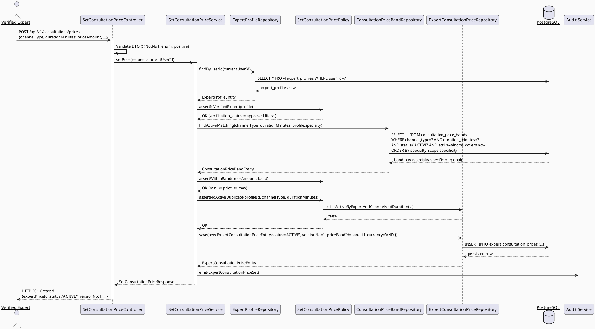
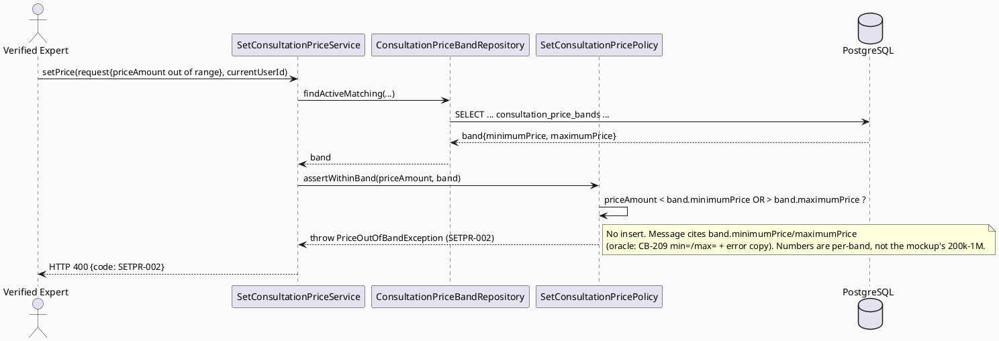
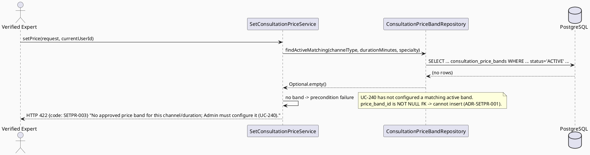
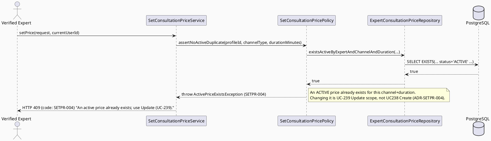
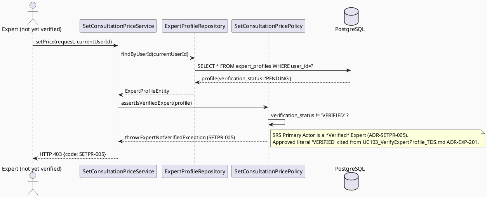
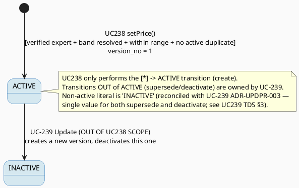

# ENGINEERING DOCUMENTATION STANDARD (EDS) v2.0
# UC238 — Set Consultation Price — Technical Design Specification

| Field | Value |
|-------|-------|
| **Document ID** | `CB-CONSULTATION-IMP-238` |
| **Version** | `1.0` |
| **Date** | `2026-07-03` |
| **Status** | `Draft` |
| **Document Owner** | `TV4-Lâm` |
| **Author** | `AI Agent (Technical Architect)` |
| **Reviewed by** | `[Tech Lead — Pending]` |
| **DPO Sign-off** | `[ ] Pending` *(pricing data is Internal/commercial, not health-PII; but it feeds the payment/commission chain — see §1)* |
| **Approved by** | `[Principal Architect — Pending]` |
| **Last Review** | `2026-07-03` |
| **Based on EDS** | `v2.0` |

---

## CHANGELOG

> **Policy 4.4 — Immutable History:** Không bao giờ xóa thông tin cũ.

| Ngày | Người thực hiện | Nội dung thay đổi |
|------|-----------------|-------------------|
| 2026-07-03 | AI Agent — Technical Architect | Tạo tài liệu lần đầu (Draft) cho UC238 Set Consultation Price |

---

## MỤC LỤC

1. [Tổng quan Module](#1-tổng-quan-module)
2. [Ma trận Truy vết (Traceability Matrix)](#2-ma-trận-truy-vết-traceability-matrix)
3. [Architecture Decision Records (ADR)](#3-architecture-decision-records-adr)
4. [Non-Functional Requirements & SLA](#4-non-functional-requirements--sla)
5. [Static Modeling (Mô hình Tĩnh)](#5-static-modeling-mô-hình-tĩnh)
6. [Dynamic Modeling (Mô hình Động)](#6-dynamic-modeling-mô-hình-động)
7. [Domain Event Catalog](#7-domain-event-catalog)
8. [Interface Specification (Đặc tả Giao diện)](#8-interface-specification-đặc-tả-giao-diện)
9. [API Specification](#9-api-specification)
10. [Bảng mã lỗi (Error Codes)](#10-bảng-mã-lỗi-error-codes)
11. [Quy trình Triển khai (Step-by-Step)](#11-quy-trình-triển-khai-step-by-step)
12. [Rollback & Incident Runbook](#12-rollback--incident-runbook)
13. [Kịch bản Kiểm thử Chi tiết](#13-kịch-bản-kiểm-thử-chi-tiết)
14. [Phương pháp Xác minh](#14-phương-pháp-xác-minh)
15. [Mẫu thử thực tế (API Verification Samples)](#15-mẫu-thử-thực-tế-api-verification-samples)
16. [Bảng tổng hợp phân quyền (Authorization Matrix)](#16-bảng-tổng-hợp-phân-quyền-authorization-matrix)
17. [AI Prompt Constraints (CASE 2.0)](#17-ai-prompt-constraints-case-20)

---

## 1. Tổng quan Module

| Field | Value |
|-------|-------|
| **Module Name** | `Consultation — Set Consultation Price` |
| **Bounded Context** | `Consultation` (package `com.carebridge.backend.consultation`) |
| **Function ID / UC** | `3.2.7.1 Set Consultation Price` / `UC-238` (SRS Table 100, L1711-1730) |
| **Primary Actor** | Verified Expert (owns an `expert_profiles` row with `verification_status = 'VERIFIED'` — literal resolved, see ADR-SETPR-005; sourced from `UC103_VerifyExpertProfile_TDS.md` ADR-EXP-201, the expert-profile module's own TDS) |
| **Secondary Actor** | VNPay Payment Gateway (per SRS Table 100 — a downstream consumer of the price at *booking/payment* time, **NOT** invoked by UC238 itself; documented for traceability only) |
| **Platform** | Expert Portal (Web, CB-213) + Expert App (Mobile, CB-209) |
| **Priority** | Medium (per SRS) |
| **Frequency of Use** | Regular (per SRS) |
| **Sprint / Owner** | UC238→UC241 consultation-pricing batch — TV4-Lâm |
| **Data Classification** | `Internal` (commercial pricing config; not health data; not directly PII — the actor identity is via `expert_profile_id`) |
| **Compliance Scope** | internal `BR-RBAC`, `BR-CONSULTATION` |
| **Upstream Dependencies** | **UC-240 Configure Consultation Price Bands (HARD PREREQUISITE — see §1.2)** populates `consultation_price_bands`; expert-profile module owns `expert_profiles.verification_status` and the JWT→`expert_profile_id` resolution |
| **Downstream Consumers** | UC-75 Book Private Consultation reads the ACTIVE `expert_consultation_prices` row and snapshots `price_amount`→`consultation_bookings.price_snapshot_amount` and the band's `commission_rate`→`consultation_bookings.commission_rate_snapshot`; UC-239 Update Consultation Price supersedes the row created here; UC-241 View Consultation Price reads it |

### 1.1 Scope Statement — Greenfield within an existing schema contract

This use case is greenfield at the code level: the `com.carebridge.backend.consultation`
package contains no pricing code (the entire consultation domain is Draft-only
specs). However, the PostgreSQL schema in `V1__init_schema.sql` already models the
full pricing domain — `consultation_price_bands` (L842-857) and
`expert_consultation_prices` (L859-874) — with all constraints (`V1__init_schema.sql`
L1416-1421, L1814-1821). This TDS therefore designs UC238 **against the applied
schema contract only** and reuses the sibling consultation-batch package convention
(`controller/service/repository/entity/dto.request/dto.response/mapper/policy`).

UC238's sole write is a single `INSERT` into `expert_consultation_prices`. It never
mutates `consultation_price_bands` (that is UC-240's exclusive scope) and never
supersedes/updates an existing price (that is UC-239's scope — see ADR-SETPR-004).

### 1.2 Entry-Criteria Blocker (Open — MUST be resolved before implementation)

> ⚠️ **UC238 cannot be implemented or exercised standalone.** `expert_consultation_prices.price_band_id`
> is **`NOT NULL`** and is a **foreign key** to `consultation_price_bands`
> (`V1__init_schema.sql` L862, L1820-1821). An Expert therefore **cannot** create a
> price row until an Admin has configured a matching **ACTIVE** price band via
> **UC-240** first. Consequences:
> - **UC-240 is a hard prerequisite dependency.** Without at least one active,
>   matching `consultation_price_bands` row for the requested `channel_type` +
>   `duration_minutes` (+ optional `specialty_scope`), every UC238 request MUST fail
>   the "no matching active price band" precondition (SETPR-003 / 422 — ADR-SETPR-001).
>   This mirrors the Entry-Criteria Blocker pattern used by the earlier consultation
>   batch (e.g. UC78/UC126 blocker sections).
> - The expert-profile module (verification status + JWT→`expert_profile_id`
>   resolution) must exist so ADR-SETPR-005's verified-expert gate can be enforced.
>
> **Marked `Open` — Product/Tech Lead must confirm UC-240 (price bands) and the
> expert-profile verification/resolution services are implemented and stable before
> UC238 Sprint work starts.**

---

## 2. Ma trận Truy vết (Traceability Matrix)

> **Policy:** Không viết code nếu không biết code đó phục vụ Rule nào.

| Requirement ID | Loại (BR/ADR/US) | Mô tả yêu cầu | Thành phần Code | Compliance Target | ADR liên quan |
|----------------|------------------|---------------|-----------------|-------------------|---------------|
| UC-238 (SRS Table 100) | Use Case | "Creates the initial price for a consultation package within the CareBridge allowed price band." | `SetConsultationPriceController.POST /prices`, `SetConsultationPriceService.setPrice()` | BR-CONSULTATION | ADR-SETPR-001, ADR-SETPR-003, ADR-SETPR-006 |
| BR-RBAC | Business Rule | Users may access only functions allowed by role/permission scope | `SetConsultationPricePolicy.assertIsVerifiedExpert()` | Authorization | ADR-SETPR-005 |
| BR-CONSULTATION | Business Rule | Booking, payment, dispute, refund, **pricing** actions keep an auditable lifecycle state | `ExpertConsultationPriceEntity.status`, `version_no`, `ExpertConsultationPriceSet` event | BR-AUDIT | ADR-SETPR-002, ADR-SETPR-004 |
| SRS E2 (invalid/conflicting data rejected) | Exception Flow | Out-of-band price / duplicate active price rejected with a field/action-level message | `SetConsultationPricePolicy.assertWithinBand()`, `assertNoActiveDuplicate()` | BR-CONSULTATION | ADR-SETPR-003, ADR-SETPR-004 |
| SRS E1 (access denied when unauthenticated/unauthorized) | Exception Flow | Non-verified or non-expert actor denied | `SetConsultationPricePolicy.assertIsVerifiedExpert()` | BR-RBAC | ADR-SETPR-005 |
| Schema FK: `expert_consultation_prices.price_band_id NOT NULL` → `consultation_price_bands` (`V1__init_schema.sql` L862, L1820-1821) | Schema Contract | Price cannot exist without a configured band (UC-240 dependency) | `ConsultationPriceBandRepository.findActiveMatching(...)`, `SetConsultationPriceService` | — | ADR-SETPR-001 |
| Commission inheritance chain: `consultation_price_bands.commission_rate` → (via `price_band_id`) → snapshotted to `consultation_bookings.commission_rate_snapshot` at booking | Design Rule | `expert_consultation_prices` has NO commission column; commission is Admin-controlled on the band, inherited transitively, never set by the Expert | `ExpertConsultationPriceEntity` (no commission field), `ConsultationPriceBandEntity.commissionRate` (read-only here) | BR-CONSULTATION | ADR-SETPR-002 |
| Price-band range: `[minimum_price, maximum_price]` (`V1__init_schema.sql` L848-849) | Schema/Policy | `price_amount` must fall inside the resolved band's min/max | `SetConsultationPricePolicy.assertWithinBand()` | BR-CONSULTATION | ADR-SETPR-003 |
| Scope boundary vs UC-239 | Cross-Document | UC238 creates the FIRST active price; a pre-existing ACTIVE price for the same channel+duration is UC-239's Update scope → reject 409 | `SetConsultationPricePolicy.assertNoActiveDuplicate()` | — | ADR-SETPR-004 |
| CB-209/CB-213 mockups (band-guidance copy, `min=`/`max=` input attrs) | UI Oracle | Band-range enforcement exists in UI; the concrete 200k–1M numbers are illustrative, not normative | `SetConsultationPriceService` (server-side re-validation) | — | ADR-SETPR-003 |
| Entry-Criteria Blocker (§1.2) | Open Item | UC-240 price bands + expert-profile verification services must exist first | N/A — blocking dependency | — | ADR-SETPR-001, ADR-SETPR-005 |

---

## 3. Architecture Decision Records (ADR)

### ADR-SETPR-001 — UC-240 price band is a hard prerequisite; "no matching active band" is an explicit precondition-failure (422)

| Field | Value |
|-------|-------|
| **Status** | `Accepted` *(mechanism — derived directly from the NOT NULL FK); the exact HTTP status choice justified below)* |
| **Deciders** | `AI Agent — derived from schema FK constraint` |
| **Date** | `2026-07-03` |

#### Bối cảnh (Context)
`expert_consultation_prices.price_band_id` is `uuid NOT NULL` (`V1__init_schema.sql`
L862) with an FK to `consultation_price_bands` (L1820-1821). The database **cannot**
persist an expert price row without a valid, existing band id. Therefore an Expert
(UC238) is structurally blocked until an Admin (UC-240) has configured a band. UC238
must resolve a band by matching an **ACTIVE** `consultation_price_bands` row for the
requested `channel_type` + `duration_minutes` (+ optional `specialty_scope` — see
ADR-SETPR-006) whose active window (`effective_from` ≤ now, `effective_to` NULL or >
now) currently covers the request. If none is found, this is a **precondition
failure**, not a client payload error and not a missing-endpoint error.

#### Các phương án đã xem xét (Options Considered)

| Phương án | Mô tả | Ưu điểm | Nhược điểm |
|-----------|-------|----------|------------|
| A | Return `404 Not Found` when no band matches | Simple | Misleading — 404 implies the *endpoint/resource path* is absent; here the endpoint is fine and the request is well-formed, only server-side reference state is missing |
| B | **Return `422 Unprocessable Entity` (SETPR-003)**: the request is syntactically valid but cannot be processed because a required server-side precondition (an active configured band) does not exist yet | Correct semantics — "your inputs are valid but system state can't fulfill them yet"; matches the UC-240 hard-dependency blocker | 422 is slightly less common than 400/404 in some client stacks |
| C | Auto-create a default band on the fly | Never blocks the Expert | Violates UC-240 Admin ownership of commission/band config; a security/finance hole; rejected |

#### Quyết định (Decision)
Chọn **Phương án B** — `422 SETPR-003` with a message directing the Expert that no
approved price band exists for the requested channel/duration (Admin must configure
it via UC-240 first). The band-resolution lookup lives in
`ConsultationPriceBandRepository.findActiveMatching(...)` and is invoked by
`SetConsultationPriceService` before any insert. **§1.2 records the UC-240 dependency
as a blocking `Open` entry-criteria item.**

#### Hệ quả (Consequences)
**Tích cực:** Honest error semantics; the FK can never be violated at the DB layer.
**Tiêu cực / Trade-offs:** UC238 is not testable end-to-end until UC-240 seeds bands (mitigated: unit tests mock the band repo).
**Compliance Impact:** Supports BR-CONSULTATION auditable, Admin-governed pricing.

---

### ADR-SETPR-002 — Commission lives ONLY on `consultation_price_bands`; `expert_consultation_prices` has NO commission column (inheritance chain)

| Field | Value |
|-------|-------|
| **Status** | `Accepted` *(confirmed batch-level decision)* |
| **Deciders** | `AI Agent — confirmed pricing-batch decision (user-approved)` |
| **Date** | `2026-07-03` |

#### Bối cảnh (Context)
`consultation_price_bands` has a `commission_rate numeric NOT NULL` column
(`V1__init_schema.sql` L850). `expert_consultation_prices` has **no** commission
column at all (L859-874). `consultation_bookings` has a `commission_rate_snapshot
numeric NOT NULL` column (L889). The commission is thus an **Admin-controlled** value
on the band, and UC238 must **never** set or expose it. It is inherited transitively:
band → (via `expert_consultation_prices.price_band_id`) → snapshotted onto
`consultation_bookings.commission_rate_snapshot` at booking time (UC-75), **not** at
price-setting time.

#### Quyết định (Decision)
UC238 (a) reads the resolved band for range validation only, (b) stores only
`price_band_id` on the new `expert_consultation_prices` row, (c) **never** reads,
copies, or writes any commission value. The commission-inheritance chain is:
`consultation_price_bands.commission_rate` --(price_band_id FK)--> [inherited, not
copied] --(booking time, UC-75)--> `consultation_bookings.commission_rate_snapshot`.
This is recorded in the §2 traceability matrix.

#### Hệ quả (Consequences)
**Tích cực:** Single source of truth for commission (the band); Experts cannot self-lower commission.
**Tiêu cực / Trade-offs:** Commission is not visible on the price row (must join the band to see it — acceptable; UC-241 handles display).
**Compliance Impact:** Financial governance — commission is Admin-only (BR-CONSULTATION).

---

### ADR-SETPR-003 — `price_amount` MUST be within the resolved band's `[minimum_price, maximum_price]`; out-of-band → 400

| Field | Value |
|-------|-------|
| **Status** | `Accepted` |
| **Deciders** | `AI Agent — derived from schema (min/max columns) + SRS description + CB-209 mockup` |
| **Date** | `2026-07-03` |

#### Bối cảnh (Context)
SRS UC-238 Description: *"Creates the initial price for a consultation package
**within the CareBridge allowed price band**."* The band supplies the bounds:
`consultation_price_bands.minimum_price` and `maximum_price`
(`V1__init_schema.sql` L848-849). The CB-209 mobile mockup encodes this with
`<input ... min="200000" max="1000000">`, a band-guidance caption *"Band: 200k - 1M
IDR"*, and an inline error *"Price must be between 200,000 and 1,000,000."*
**(`03_Design/UI_UX/MobileAppScreen/CB-209 Set Consultation Price (UC-238)/code.html`
L228-234, L272-291).** These specific numbers and the `IDR/Rp` label are **UI
placeholders only** — the authoritative bounds are the resolved band row, and the
authoritative currency is `VND` (schema default `V1__init_schema.sql` L851/L866; the
mockup's `IDR/Rp` label is an illustrative inconsistency and MUST NOT be hard-coded).

#### Các phương án đã xem xét (Options Considered)

| Phương án | Mô tả | Ưu điểm | Nhược điểm |
|-----------|-------|----------|------------|
| A | Hard-code `200000..1000000` from the mockup | Fast | Invents bounds not in SRS; mockup copy is illustrative; every band has its own min/max |
| B | **Validate `minimum_price ≤ price_amount ≤ maximum_price` against the resolved band row, server-side, inclusive of both endpoints; reject `400 SETPR-002` otherwise** | Uses the real per-band authority; endpoint-inclusive matches the mockup's `min=`/`max=` (which are inclusive HTML bounds) | Requires the band to be resolved first (ADR-SETPR-001) |
| C | Client-side validation only (rely on the mockup's JS) | Zero server code | Trivially bypassable (curl); financial-integrity hole; rejected |

#### Quyết định (Decision)
Chọn **Phương án B**. `SetConsultationPricePolicy.assertWithinBand(priceAmount, band)`
enforces `band.minimumPrice ≤ priceAmount ≤ band.maximumPrice` (both bounds
**inclusive**, oracle: the mockup's inclusive `min=`/`max=` attributes and error
copy). Out-of-band → `400 SETPR-002`, message citing the band's min/max. Client-side
validation (CB-209 JS) is a UX convenience; the server re-validates authoritatively.

#### Hệ quả (Consequences)
**Tích cực:** No invented numbers; bounds follow the Admin-configured band.
**Tiêu cực / Trade-offs:** None material.
**Compliance Impact:** Prevents out-of-policy pricing (BR-CONSULTATION).

---

### ADR-SETPR-004 — No duplicate ACTIVE price for the same channel+duration (scope boundary vs UC-239) → 409

| Field | Value |
|-------|-------|
| **Status** | `Accepted` *(mechanism); exact "same combo" key justified below)* |
| **Deciders** | `AI Agent — derived from the UC238/UC239 scope split (SRS Table 100 vs Table 101)` |
| **Date** | `2026-07-03` |

#### Bối cảnh (Context)
SRS Table 100 (UC-238) is *"Creates the **initial** price"*; SRS Table 101 (UC-239) is
*"Creates a **new price version** for future bookings without changing locked booking
prices."* Setting a price when an ACTIVE one already exists for the same
channel+duration is therefore **UC-239's Update scope, not UC238's Create scope**.
The schema has **no** DB unique constraint enforcing one-active-price-per-combo (only
PK on `expert_price_id`, verified: `V1__init_schema.sql` L1419-1420 is the only
constraint on the table besides FKs) — so this must be a **service-level guard**. The
identity of a "duplicate" is `(expert_profile_id, channel_type, duration_minutes)`
with `status='ACTIVE'`.

#### Các phương án đã xem xét (Options Considered)

| Phương án | Mô tả | Ưu điểm | Nhược điểm |
|-----------|-------|----------|------------|
| A | Allow multiple ACTIVE rows for the same combo | Simplest | Ambiguous which price applies at booking; violates the Create-vs-Update split; rejected |
| B | **Reject `409 SETPR-004` if an ACTIVE `expert_consultation_prices` row already exists for `(expert_profile_id, channel_type, duration_minutes)`; the caller must use UC-239 to change it** | Clean Create/Update boundary; deterministic active price; matches SRS wording | Requires a lookup before insert (one query) |
| C | Add a partial unique index `WHERE status='ACTIVE'` in a new migration | DB-level guarantee | New migration on a shared table; not a genuine gap for THIS UC (service guard suffices, and specialty_scope nuance makes the exact key `Open`); deferred to a coordinated batch migration |

#### Quyết định (Decision)
Chọn **Phương án B** (service-level guard). `SetConsultationPricePolicy.assertNoActiveDuplicate(...)`
queries `ExpertConsultationPriceRepository.existsActiveByExpertAndChannelAndDuration(...)`
and throws `409 SETPR-004` if one exists, with a message pointing to UC-239 Update.
The DB-level partial-unique-index option (C) is noted as a **proposed follow-up
migration** (§5.3, `Open`) but is NOT created by this TDS.

#### Hệ quả (Consequences)
**Tích cực:** Enforces the Create/Update boundary; unambiguous active price.
**Tiêu cực / Trade-offs:** Service-level only (a raw SQL insert could bypass — accepted, same posture as other status guards in this schema).
**Compliance Impact:** Auditable, single-active-price lifecycle (BR-CONSULTATION).

---

### ADR-SETPR-005 — Verified-expert-only gate; the "verified" status literal is `'VERIFIED'` (resolved, cited from UC-103)

| Field | Value |
|-------|-------|
| **Status** | `Accepted` *(mechanism accepted; the `verification_status` literal is resolved from the expert-profile module's own TDS — see below)* |
| **Deciders** | `AI Agent — literal sourced from UC-103 (expert-profile module owner), not invented here` |
| **Date** | `2026-07-03` (resolved during UC-238/239/240/241 cross-doc audit) |

#### Bối cảnh (Context)
SRS UC-238 Primary Actor is **Verified Expert**. `expert_profiles.verification_status`
is `varchar(30) NOT NULL DEFAULT 'PENDING'` (`V1__init_schema.sql` L794) with **no DB
CHECK constraint** on allowed values. The default `'PENDING'` alone is confirmable
from the schema DDL. The exact string for an *approved/verified* expert is owned by
the expert-profile module — and that module's own TDS, `04_Implement/UC103_VerifyExpertProfile/UC103_VerifyExpertProfile_TDS.md`
(ADR-EXP-201, §5.3, §14.1), already defines and uses the literal **`'VERIFIED'`**
as one of exactly four application-layer enum values
(`PENDING`/`VERIFIED`/`REJECTED`/`NEEDS_MORE_INFO`) for this same column. UC-104
(`UC104_RevokeExpertBadge_TDS.md`) independently reuses `'VERIFIED'` as the
precondition state for badge revocation, confirming the literal is already the
established convention for this column across the codebase, not merely proposed.
It is therefore **not invented here** — it is cited from the module that owns it.

#### Các phương án đã xem xét (Options Considered)

| Phương án | Mô tả | Ưu điểm | Nhược điểm |
|-----------|-------|----------|------------|
| A | Hard-code `verification_status == 'VERIFIED'` without citing a source | Fast | The literal would be unsourced from UC-238's own perspective — rejected as originally written |
| B | **Gate on `expertProfile.verificationStatus == 'VERIFIED'`, citing `UC103_VerifyExpertProfile_TDS.md` ADR-EXP-201 as the source of truth; isolate the literal in one constant (never scattered)** | No invented literal — sourced from the module that owns the column; single point of change if UC-103's enum ever changes | None material — UC-103 is Draft, not yet Approved, so a residual (non-blocking) risk exists if UC-103 changes its enum before either ships (tracked, not blocking) |
| C | Skip the verification gate (any EXPERT role passes) | Simplest | Violates SRS "**Verified** Expert"; a non-verified expert could set prices; rejected |

#### Quyết định (Decision)
Chọn **Phương án B**. `SetConsultationPricePolicy.assertIsVerifiedExpert(expertProfile)`
denies (`403 SETPR-005`) unless `expertProfile.verificationStatus.equals("VERIFIED")`.
The literal `'VERIFIED'` is isolated in one constant (never scattered), sourced from
`UC103_VerifyExpertProfile_TDS.md` ADR-EXP-201. A non-EXPERT role is denied
earlier by RBAC (`403 SETPR-006`, ADR handled in §16).

**Residual (non-blocking) note:** `UC103_VerifyExpertProfile_TDS.md` is itself
`Draft` (not yet `Approved`) at the time of this resolution — if UC-103's enum
values are renamed before either UC ships, both must be updated together. This is
a cross-document coordination risk, not a business-decision gap, and is tracked
via the shared literal constant (single point of change).

**Remaining genuinely open item (Category B, out of UC238 scope):**
- Whether an expired credential/re-verification affects eligibility — owned by the expert-profile module (UC-103/UC-104), not decided by any existing doc; out of UC238 scope.

#### Hệ quả (Consequences)
**Tích cực:** No invented literal — sourced from the module that owns the column; correct actor gate.
**Tiêu cực / Trade-offs:** Depends on UC-103's Draft enum remaining stable (tracked, non-blocking).
**Compliance Impact:** BR-RBAC — only verified experts price.

---

### ADR-SETPR-006 — Price-band resolution lookup: match ACTIVE band by channel+duration, with specialty_scope precedence (specific over global)

| Field | Value |
|-------|-------|
| **Status** | `Accepted` *(mechanism AND the specialty_scope precedence rule are both firm; the residual overlapping-band tie-break concern is resolved by citing UC-240's overlap-prevention guarantee — see below)* |
| **Deciders** | `AI Agent — derived from schema (nullable specialty_scope) + ADR-SETPR-001; precedence rule reconciled with `UC240_ConfigureConsultationPriceBands_TDS.md` ADR-PBAND-001/003` |
| **Date** | `2026-07-03` (precedence firmed up during UC-238/239/240/241 cross-doc audit) |

#### Bối cảnh (Context)
`consultation_price_bands.specialty_scope` is `varchar(100)` **nullable**
(`V1__init_schema.sql` L847). A band may be **global** (`specialty_scope IS NULL`,
applies to any specialty) or **specialty-specific** (e.g. `'PEDIATRICS'`). An Expert's
specialty comes from `expert_profiles.specialty` (L789, nullable). UC238 must
deterministically pick exactly one band for a given `(channel_type, duration_minutes,
expert.specialty)` at "now". `UC240_ConfigureConsultationPriceBands_TDS.md`
ADR-PBAND-003 fixes `specialty_scope = NULL` as meaning "applies to all specialties"
and explicitly defers the specific-vs-universal precedence choice to UC-238 ("that
precedence rule is UC-238's to define"). This ADR is where that precedence is fixed.

#### Các phương án đã xem xét (Options Considered)

| Phương án | Mô tả | Ưu điểm | Nhược điểm |
|-----------|-------|----------|------------|
| A | Match only exact `specialty_scope == expert.specialty` | Precise | Breaks when only a global band exists → false SETPR-003 |
| B | Match only global bands (ignore specialty) | Simple | Ignores specialty-specific pricing intent of the nullable column |
| C | **Prefer a specialty-specific ACTIVE band matching `channel+duration+expert.specialty`; fall back to a global ACTIVE band (`specialty_scope IS NULL`) for the same `channel+duration`; the band's active window must currently cover "now" (`effective_from ≤ now AND (effective_to IS NULL OR effective_to > now)`) and `status='ACTIVE'`** | Uses the nullable column as designed; deterministic precedence; graceful global fallback; matches the standard "most-specific-match-wins" precedence rule used throughout rule/config resolution systems (e.g. CSS specificity, routing-table longest-prefix-match) — the same rationale applies here: a more specific configuration (a named specialty) should override a more general one (universal) when both could apply | None material — see tie-break resolution below |

#### Quyết định (Decision)
Chọn **Phương án C** — **firm, not merely proposed**. `ConsultationPriceBandRepository.findActiveMatching(channelType,
durationMinutes, specialty)` returns the specialty-specific ACTIVE band if present,
else the global ACTIVE band, else empty → `422 SETPR-003` (ADR-SETPR-001). The
active-window predicate and the specialty-over-universal precedence are both firm
design decisions, citing the standard "most-specific-match-wins" rationale.

**Tie-break for multiple overlapping same-scope active bands — resolved, not `Open`:**
The scenario "two ACTIVE bands with the *same* `(channel_type, duration_minutes,
specialty_scope)` key have overlapping effective windows" **cannot occur** by
construction: `UC240_ConfigureConsultationPriceBands_TDS.md` ADR-PBAND-001
(`Accepted`) rejects, at band-creation time, any new `ACTIVE` band whose
`(channel_type, duration_minutes, specialty_scope)` key matches an existing
`ACTIVE` band with an overlapping `[effective_from, effective_to)` range. Since
UC-238's lookup key for the "specific" branch is exactly this same triple, UC-240's
write-time guarantee eliminates the ambiguity UC-238 previously flagged as `Open`.
(UC-240's ADR-PBAND-001 separately flags a residual *concurrency* risk — a
`SELECT ... FOR UPDATE`/serializable-transaction posture for simultaneous
double-create — as `Open` for Tech Lead; that is a UC-240 implementation-hardening
concern, not a UC-238 band-selection ambiguity, and does not reopen this ADR.)

#### Hệ quả (Consequences)
**Tích cực:** Deterministic single-band resolution; supports both global and specialty pricing; overlap-freedom guaranteed by UC-240's own write-time invariant, not merely assumed.
**Tiêu cực / Trade-offs:** None material for band *selection*; UC-240's residual concurrency-hardening item is tracked in that document, not here.
**Compliance Impact:** Auditable band provenance for each price (BR-CONSULTATION).

---

## 4. Non-Functional Requirements & SLA

> No SRS/BR source specifies numeric SLA targets for UC238. Values below are
> **`Open` — proposed defaults**; must be confirmed by Tech Lead before being treated
> as binding.

### 4.1. Performance & Availability

| Category | Requirement | Target SLA | Measurement Method | Compliance Basis |
|----------|-------------|------------|---------------------|------------------|
| Latency | `POST /prices` p99 (band lookup + duplicate check + single insert) | `< 300ms` *(Open — proposed)* | API test timing | — |
| Availability | Dependent on UC-240 price-band data + expert-profile service (§1.2 blocker) | N/A until dependencies implemented | — | — |

### 4.2. Data Integrity & Retention

| Category | Requirement | Target | Verification Method | Compliance Basis |
|----------|-------------|--------|---------------------|------------------|
| Referential integrity | Every price row references a real, existing band (`price_band_id` FK) | 100% (DB FK-enforced) | Schema constraint L1820-1821 | BR-CONSULTATION |
| Durability | No price-row loss | RPO = 0 (single insert in one transaction) | Transaction log | BR-CONSULTATION |
| Consistency | At most one ACTIVE price per `(expert_profile_id, channel_type, duration_minutes)` | 100% (service guard, ADR-SETPR-004) | Reconciliation query (§14.1) | BR-CONSULTATION |
| Versioning | New price row starts `version_no = 1` | 100% | Integration assert | BR-CONSULTATION |

### 4.3. Security

| Category | Requirement | Target | Verification Method | Compliance Basis |
|----------|-------------|--------|---------------------|------------------|
| Access control | Verified Expert only; caller may set price only for their own `expert_profile_id` (from JWT, never client-supplied) | Least privilege | Auth Matrix (§16) | BR-RBAC |
| Transport | All endpoints over TLS | TLS 1.2+ (platform default) | Infra config | — |
| Input safety | Numeric bounds + enum validation on `channel_type`/`duration_minutes` | Server-side re-validation | DTO + policy | BR-CONSULTATION |

### 4.4. Scalability & Capacity Planning

Price-setting is "Regular" but low-volume (an expert configures a small set of
channel×duration prices, then rarely). No special scaling design beyond standard
Spring Boot request handling.

---

## 5. Static Modeling (Mô hình Tĩnh)

### 5.1. Component Responsibilities & Planned File Paths

| Layer | File Path | Responsibility |
|-------|-----------|----------------|
| Controller | `src/main/java/com/carebridge/backend/consultation/controller/SetConsultationPriceController.java` | HTTP mapping, DTO validation only |
| Service | `src/main/java/com/carebridge/backend/consultation/service/SetConsultationPriceService.java` | Workflow: resolve expert profile, verified-expert gate, band resolution, duplicate guard, range validation, insert, event emission |
| Policy | `src/main/java/com/carebridge/backend/consultation/policy/SetConsultationPricePolicy.java` | `assertIsVerifiedExpert` (ADR-SETPR-005), `assertWithinBand` (ADR-SETPR-003), `assertNoActiveDuplicate` (ADR-SETPR-004) |
| Repository | `src/main/java/com/carebridge/backend/consultation/repository/ExpertConsultationPriceRepository.java` | Insert/read `expert_consultation_prices`; active-duplicate existence query |
| Repository | `src/main/java/com/carebridge/backend/consultation/repository/ConsultationPriceBandRepository.java` | Read-only band resolution (`findActiveMatching`) — UC-240-owned table, referenced |
| Repository | `src/main/java/com/carebridge/backend/consultation/repository/ExpertProfileRepository.java` | Read-only resolve `expert_profile_id` + `verification_status` + `specialty` (expert-profile-module-owned, referenced) |
| Entity | `src/main/java/com/carebridge/backend/consultation/entity/ExpertConsultationPriceEntity.java` | JPA mapping for `expert_consultation_prices` (**no commission field** — ADR-SETPR-002) |
| Entity | `src/main/java/com/carebridge/backend/consultation/entity/ConsultationPriceBandEntity.java` | JPA mapping for `consultation_price_bands` (owned by UC-240; referenced read-only) |
| DTO | `src/main/java/com/carebridge/backend/consultation/dto/request/SetConsultationPriceRequest.java` | Inbound payload |
| DTO | `src/main/java/com/carebridge/backend/consultation/dto/response/SetConsultationPriceResponse.java` | Outbound payload |
| Mapper | `src/main/java/com/carebridge/backend/consultation/mapper/ConsultationPriceMapper.java` | Entity ↔ DTO; never expose entity |
| Event | `src/main/java/com/carebridge/backend/consultation/event/ExpertConsultationPriceSet.java` | Domain event (§7) |
| Mobile | `05_Development/CareBridgeMobileApp/lib/features/consultation/screens/set_consultation_price.dart` | Set-price form (CB-209) |
| Web | `05_Development/CareBridgeWebApp/src/features/consultation/` (CB-213 Set Consultation Price) | Set-price form |

### 5.2. Class Diagram (PlantUML)

```plantuml
@startuml UC238_SetPrice_ClassDiagram
skinparam classAttributeIconSize 0
skinparam classFontStyle bold
skinparam backgroundColor #FAFAFA
skinparam ArrowColor #555555
skinparam ClassBorderColor #2E75B6
skinparam ClassHeaderBackgroundColor #D5E8F0

' === ENTITIES (mirror V1__init_schema.sql split-table pricing model) ===
class ExpertConsultationPriceEntity {
  + expertPriceId: UUID
  + expertProfileId: UUID
  + priceBandId: UUID
  + channelType: String
  + durationMinutes: short
  + priceAmount: BigDecimal
  + currency: String
  + cancellationPolicy: String
  + effectiveFrom: Instant
  + effectiveTo: Instant
  + status: String
  + versionNo: int
  + createdAt: Instant
  + updatedAt: Instant
  ' NOTE: NO commission column (ADR-SETPR-002)
}

class ConsultationPriceBandEntity {
  + priceBandId: UUID
  + configuredBy: UUID
  + channelType: String
  + durationMinutes: short
  + specialtyScope: String
  + minimumPrice: BigDecimal
  + maximumPrice: BigDecimal
  + commissionRate: BigDecimal
  + currency: String
  + effectiveFrom: Instant
  + effectiveTo: Instant
  + status: String
}

class ExpertProfileEntity <<referenced>> {
  + expertProfileId: UUID
  + userId: UUID
  + specialty: String
  + verificationStatus: String
}

' === VALUE OBJECTS ===
enum PriceStatus <<ValueObject>> {
  ACTIVE
  ' INACTIVE (superseded or deactivated) — literal reconciled with UC-239 ADR-UPDPR-003
}

enum ChannelType <<ValueObject>> {
  VIDEO
  AUDIO
  CHAT
  IN_PERSON
}

' === SERVICES ===
interface ISetConsultationPriceService <<interface>> {
  + setPrice(request: SetConsultationPriceRequest, currentUserId: UUID): SetConsultationPriceResponse
}

class SetConsultationPriceService implements ISetConsultationPriceService {
  - priceRepository: ExpertConsultationPriceRepository
  - bandRepository: ConsultationPriceBandRepository
  - expertProfileRepository: ExpertProfileRepository
  - pricePolicy: SetConsultationPricePolicy
  - mapper: ConsultationPriceMapper
  - eventPublisher: ApplicationEventPublisher
  + setPrice(...): SetConsultationPriceResponse
}

' === POLICY ===
class SetConsultationPricePolicy {
  + assertIsVerifiedExpert(profile: ExpertProfileEntity): void
  + assertWithinBand(priceAmount: BigDecimal, band: ConsultationPriceBandEntity): void
  + assertNoActiveDuplicate(expertProfileId: UUID, channelType: String, durationMinutes: short): void
}

' === REPOSITORIES ===
interface ExpertConsultationPriceRepository <<interface>> {
  + save(entity: ExpertConsultationPriceEntity): ExpertConsultationPriceEntity
  + existsByExpertProfileIdAndChannelTypeAndDurationMinutesAndStatus(id: UUID, ch: String, dur: short, status: String): boolean
}

interface ConsultationPriceBandRepository <<interface>> {
  + findActiveMatching(channelType: String, durationMinutes: short, specialty: String): Optional<ConsultationPriceBandEntity>
}

interface ExpertProfileRepository <<interface, referenced>> {
  + findByUserId(userId: UUID): Optional<ExpertProfileEntity>
}

' === RELATIONSHIPS ===
SetConsultationPriceService --> ExpertProfileRepository : resolve caller profile
SetConsultationPriceService --> ConsultationPriceBandRepository : resolve band (ADR-SETPR-006)
SetConsultationPriceService --> SetConsultationPricePolicy : validate
SetConsultationPriceService --> ExpertConsultationPriceRepository : insert
ExpertConsultationPriceEntity "many" --> "1" ConsultationPriceBandEntity : price_band_id (NOT NULL FK)
ExpertConsultationPriceEntity --> PriceStatus : status (app-level)
ConsultationPriceBandEntity ..> "commission_rate\n(inherited, not copied)" : ADR-SETPR-002

@enduml
```



### 5.3. Data Structure — Schema/Migration Details

> **CareBridge rule:** `V1__init_schema.sql` and approved Flyway migrations are the
> primary source of truth. ERD is supporting context only.

**No new migration is required for UC238.** All needed tables/columns already exist.
UC238 only performs a single `INSERT` into `expert_consultation_prices` and read-only
`SELECT`s on `consultation_price_bands` / `expert_profiles`:

```sql
-- expert_consultation_prices (V1__init_schema.sql L859-874) — INSERT target
-- expert_price_id    uuid PK DEFAULT gen_random_uuid() (L860, PK L1419-1420)
-- expert_profile_id  uuid NOT NULL FK->expert_profiles (L861, L1817-1818) -> from JWT-resolved profile
-- price_band_id      uuid NOT NULL FK->consultation_price_bands (L862, L1820-1821) -> ADR-SETPR-001/006
-- channel_type       varchar(30) NOT NULL (L863)
-- duration_minutes   smallint    NOT NULL (L864)
-- price_amount       numeric     NOT NULL (L865) -> validated within band (ADR-SETPR-003)
-- currency           varchar(10) NOT NULL DEFAULT 'VND' (L866) -> authoritative currency (NOT mockup's IDR)
-- cancellation_policy text (L867, nullable)
-- effective_from     timestamptz NOT NULL (L868)
-- effective_to       timestamptz (L869, nullable)
-- status             varchar(20) NOT NULL DEFAULT 'ACTIVE' (L870) -> 'ACTIVE' on create
-- version_no         integer     NOT NULL DEFAULT 1 (L871) -> starts at 1 (ADR / §4.2)
-- NO commission column (ADR-SETPR-002)

-- consultation_price_bands (V1__init_schema.sql L842-857) — READ-only band resolution
-- minimum_price / maximum_price numeric NOT NULL (L848-849) -> range oracle (ADR-SETPR-003)
-- commission_rate numeric NOT NULL (L850) -> Admin-owned; NOT read/copied by UC238 (ADR-SETPR-002)
-- specialty_scope varchar(100) NULLABLE (L847) -> global vs specialty band (ADR-SETPR-006)
-- status varchar(20) NOT NULL DEFAULT 'ACTIVE' (L854); effective_from/effective_to active window
-- PK price_band_id (L1416-1417)

-- expert_profiles (V1__init_schema.sql L786-800) — READ-only actor resolution
-- verification_status varchar(30) NOT NULL DEFAULT 'PENDING' (L794) -> verified gate (ADR-SETPR-005; approved literal = 'VERIFIED', cited from UC103_VerifyExpertProfile_TDS.md ADR-EXP-201)
-- specialty varchar(100) nullable (L789) -> band resolution input
```

**Genuine gaps identified (Open — non-blocking):**
1. `expert_consultation_prices` has **no index** on `(expert_profile_id, channel_type,
   duration_minutes)` (only the PK on `expert_price_id`). The duplicate-check query
   (ADR-SETPR-004) and later UC-241 reads would benefit from one.
2. There is **no** DB partial-unique constraint enforcing one ACTIVE price per combo
   (ADR-SETPR-004 is a service-level guard).

```sql
-- PROPOSED (Open — requires Tech Lead approval; NOT created by this TDS; coordinate as a shared pricing-batch migration):
-- CREATE INDEX idx_expert_consultation_prices_lookup
--   ON public.expert_consultation_prices(expert_profile_id, channel_type, duration_minutes);
-- Optionally, to enforce ADR-SETPR-004 at DB level:
-- CREATE UNIQUE INDEX uq_expert_price_active_combo
--   ON public.expert_consultation_prices(expert_profile_id, channel_type, duration_minutes)
--   WHERE status = 'ACTIVE';
```

**Schema-change conclusion:** UC238 requires **no schema change**. No new migration
file is created by this TDS. (Two index improvements are proposed as `Open`
follow-ups only.)

---

## 6. Dynamic Modeling (Mô hình Động)

### 6.1. Sequence Diagram — Happy Path: Set price within band (created ACTIVE)



### 6.2. Sequence Diagram — Error Path: Out-of-band price (400 SETPR-002)



### 6.3. Sequence Diagram — Error Path: No matching active band (422 SETPR-003)



### 6.4. Sequence Diagram — Error Path: Duplicate active price (409 SETPR-004)



### 6.5. Sequence Diagram — Error Path: Unverified expert (403 SETPR-005)



### 6.6. State Machine — Expert consultation price status (UC238 relevant)



**⚠️ Invariant bất biến:**
1. A new price row is always created with `status='ACTIVE'` and `version_no=1` (§4.2).
2. `price_band_id` is always non-null and references an ACTIVE, matching band at creation time (ADR-SETPR-001/006).
3. `price_amount` always lies within the resolved band's `[minimum_price, maximum_price]` (ADR-SETPR-003).
4. At most one ACTIVE price per `(expert_profile_id, channel_type, duration_minutes)` (ADR-SETPR-004, service-level).
5. UC238 never writes any commission value; `expert_consultation_prices` has no commission column (ADR-SETPR-002).
6. `expert_profile_id` is always the caller's own JWT-resolved profile — never client-supplied.

---

## 7. Domain Event Catalog

### 7.1. Events Published (Phát ra)

| Event Name | Trigger | Publisher | Subscriber(s) | Payload Schema | Async? |
|------------|---------|-----------|---------------|----------------|--------|
| `ExpertConsultationPriceSet` | A new ACTIVE `expert_consultation_prices` row is created | `SetConsultationPriceService` | Audit log; expert-pricing read-model/cache (out of scope); Notification (optional "price published") | `ExpertConsultationPriceSet.java` | Yes |

### 7.2. Events Consumed (Tiêu thụ)

| Event Name | Source | Handler | Action thực hiện |
|------------|--------|---------|------------------|
| — | — | — | UC238 consumes no domain events (it is a leaf create operation) |

### 7.3. Payload Schema

```java
// ExpertConsultationPriceSet.java
public record ExpertConsultationPriceSet(
    UUID    eventId,          // UUID.randomUUID() — dedupe
    String  eventType,        // "ExpertConsultationPriceSet"
    Instant occurredAt,       // Instant.now()
    String  version,          // "1.0"
    Payload payload,
    Metadata metadata
) implements ApplicationEvent {

    public record Payload(
        UUID       expertPriceId,
        UUID       expertProfileId,
        UUID       priceBandId,       // provenance — which band bounded/authorized this price
        String     channelType,
        short      durationMinutes,
        BigDecimal priceAmount,
        String     currency,          // "VND"
        String     status,            // "ACTIVE"
        int        versionNo          // 1 on create
        // NOTE: no commission field — commission is band-owned (ADR-SETPR-002)
    ) {}

    public record Metadata(
        UUID   correlationId,
        String causedBy                // userId of the setting expert
    ) {}
}
```

---

## 8. Interface Specification (Đặc tả Giao diện)

> **Policy (EDS v2.0):** Mỗi interface phải khai báo `@version`.

### 8.1. Service Interface

```java
// SetConsultationPriceRequest.java — Input DTO
// @version 1.0
public class SetConsultationPriceRequest {
    @NotBlank
    private String channelType;        // VIDEO | AUDIO | CHAT | IN_PERSON (CB-209 options)
    @NotNull @Positive
    private Short durationMinutes;      // 15 | 30 | 45 | 60 (CB-209 options)
    @NotNull @DecimalMin(value = "0", inclusive = false)
    private BigDecimal priceAmount;     // validated within band at service layer (ADR-SETPR-003)
    private String currency;            // optional; defaults to 'VND' if omitted (schema default L866)
    @Size(max = 2000)
    private String cancellationPolicy;  // optional free text (schema L867 nullable)
    private Instant effectiveFrom;      // optional; defaults to now() if omitted (schema NOT NULL L868)
    private Instant effectiveTo;        // optional (schema nullable L869)
    // getters / setters / @Valid annotations
}

// SetConsultationPriceResponse.java — Output DTO
public class SetConsultationPriceResponse {
    private UUID       expertPriceId;
    private UUID       priceBandId;      // band provenance (no commission exposed)
    private String     channelType;
    private short      durationMinutes;
    private BigDecimal priceAmount;
    private String     currency;
    private Instant    effectiveFrom;
    private Instant    effectiveTo;
    private String     status;           // "ACTIVE"
    private int        versionNo;        // 1
    private Instant    createdAt;
    // getters / setters — never expose entity internals or any commission value
}

// ISetConsultationPriceService.java — Service Contract
// @version 1.0
public interface ISetConsultationPriceService {
    /**
     * Creates the initial ACTIVE consultation price for the calling verified expert,
     * within the resolved Admin-configured price band's [minimum_price, maximum_price].
     * @throws ExpertNotVerifiedException   (SETPR-005) if caller's expert profile is not verified
     * @throws PriceBandNotFoundException   (SETPR-003) if no ACTIVE matching band exists (UC-240 not configured)
     * @throws PriceOutOfBandException      (SETPR-002) if priceAmount is outside the band's min/max
     * @throws ActivePriceExistsException   (SETPR-004) if an ACTIVE price already exists for this channel+duration (use UC-239)
     * @throws SetPriceValidationException  (SETPR-001) if request payload is invalid
     */
    SetConsultationPriceResponse setPrice(SetConsultationPriceRequest request, UUID currentUserId);
}
```

### 8.2. Repository Interface

```java
// ExpertConsultationPriceRepository.java
// @version 1.0
public interface ExpertConsultationPriceRepository extends JpaRepository<ExpertConsultationPriceEntity, UUID> {
    // Duplicate-active guard (ADR-SETPR-004). 'ACTIVE' passed by service (status literal).
    boolean existsByExpertProfileIdAndChannelTypeAndDurationMinutesAndStatus(
        UUID expertProfileId, String channelType, short durationMinutes, String status);
    // No delete() — price rows are an auditable lifecycle trail; supersede is UC-239's concern.
}

// ConsultationPriceBandRepository.java  (UC-240-owned table — referenced read-only)
// @version 1.0
public interface ConsultationPriceBandRepository extends JpaRepository<ConsultationPriceBandEntity, UUID> {
    /**
     * Resolve the single applicable ACTIVE band (ADR-SETPR-006):
     * specialty-specific match preferred, else global (specialty_scope IS NULL),
     * within the active window (effective_from <= now AND (effective_to IS NULL OR effective_to > now)).
     * Overlap tie-break resolved: UC-240 ADR-PBAND-001 rejects overlapping ACTIVE
     * bands for the same (channel_type, duration_minutes, specialty_scope) key at
     * creation time, so this query can never see two ambiguous candidates.
     */
    @Query("""
        SELECT b FROM ConsultationPriceBandEntity b
        WHERE b.channelType = :channelType AND b.durationMinutes = :durationMinutes
          AND b.status = 'ACTIVE'
          AND b.effectiveFrom <= :now
          AND (b.effectiveTo IS NULL OR b.effectiveTo > :now)
          AND (b.specialtyScope = :specialty OR b.specialtyScope IS NULL)
        ORDER BY CASE WHEN b.specialtyScope = :specialty THEN 0 ELSE 1 END
        """)
    List<ConsultationPriceBandEntity> findActiveMatching(String channelType, short durationMinutes,
                                                         String specialty, Instant now);
    // Service takes the first row (specialty-specific precedence) or empty -> SETPR-003.
}

// ExpertProfileRepository.java  (expert-profile-module-owned — referenced read-only)
// @version 1.0
public interface ExpertProfileRepository extends JpaRepository<ExpertProfileEntity, UUID> {
    Optional<ExpertProfileEntity> findByUserId(UUID userId);
}
```

---

## 9. API Specification

### 9.1. Endpoints Table

| Method | Path | Auth Level | Required Roles | Rate Limit | Idempotent? |
|--------|------|------------|----------------|------------|-------------|
| `POST` | `/api/v1/consultations/prices` | JWT Bearer | `EXPERT` (verified) | 30/min | No — a second identical call hits the active-duplicate guard → `409 SETPR-004` |

### 9.2. Request / Response Schemas

#### `POST /api/v1/consultations/prices` — Set (create) initial consultation price

**Request Body:**
```json
{
  "channelType": "VIDEO",
  "durationMinutes": 30,
  "priceAmount": 350000,
  "currency": "VND",
  "cancellationPolicy": "Full refund if cancelled 24h before the appointment.",
  "effectiveFrom": "2026-07-04T00:00:00.000Z"
}
```

**Response — 201 Created (Happy Path):**
```json
{
  "expertPriceId": "550e8400-e29b-41d4-a716-446655440000",
  "priceBandId": "3fa85f64-5717-4562-b3fc-2c963f66afa6",
  "channelType": "VIDEO",
  "durationMinutes": 30,
  "priceAmount": 350000,
  "currency": "VND",
  "effectiveFrom": "2026-07-04T00:00:00.000Z",
  "effectiveTo": null,
  "status": "ACTIVE",
  "versionNo": 1,
  "createdAt": "2026-07-03T08:00:00.000Z"
}
```
> Note: `350000` is illustrative. The authoritative bounds are the resolved band's
> `minimum_price`/`maximum_price` (ADR-SETPR-003). Currency is `VND` (schema default;
> the CB-209 mockup's `IDR/Rp` label is illustrative only).

**Response — 400 Bad Request (out of band):**
```json
{ "error": { "code": "SETPR-002", "message": "Price must be within the allowed band [200000, 1000000] VND for VIDEO / 30 min." } }
```

**Response — 422 Unprocessable Entity (no matching active band):**
```json
{ "error": { "code": "SETPR-003", "message": "No approved price band exists for VIDEO / 30 min. An administrator must configure a price band first." } }
```

**Response — 409 Conflict (active price already exists):**
```json
{ "error": { "code": "SETPR-004", "message": "An active price already exists for VIDEO / 30 min. Use Update Consultation Price to change it." } }
```

**Response — 403 Forbidden (not a verified expert):**
```json
{ "error": { "code": "SETPR-005", "message": "Only a verified expert may set a consultation price." } }
```

---

## 10. Bảng mã lỗi (Error Codes)

> Prefix `SETPR-` for Set Consultation Price (UC-238). Fresh, no collision with sibling
> pricing codes (`UPDPR-` UC-239, `PBAND-` UC-240, `VIEWPR-` UC-241) or the
> consultation-lifecycle batch (`CANC-`, `CON-`, `DISP-`, etc.). Unauthenticated `401`
> is handled by the global Spring Security filter (not a `SETPR-` code).

| Code | HTTP Status | Message (EN) | Message (VI) | Trigger Condition |
|------|-------------|--------------|--------------|-------------------|
| `SETPR-001` | 400 | Validation failed | Dữ liệu không hợp lệ | Missing/invalid `channelType`/`durationMinutes`/`priceAmount`, non-positive price, or bad enum value |
| `SETPR-002` | 400 | Price outside allowed band | Giá nằm ngoài khung cho phép | `priceAmount` < band `minimum_price` or > `maximum_price` — ADR-SETPR-003 (endpoints inclusive) |
| `SETPR-003` | 422 | No matching active price band | Không có khung giá đang áp dụng phù hợp | No ACTIVE `consultation_price_bands` row matches channel/duration(/specialty) — UC-240 prerequisite unmet (ADR-SETPR-001) |
| `SETPR-004` | 409 | Active price already exists | Đã tồn tại mức giá đang áp dụng | An ACTIVE `expert_consultation_prices` row already exists for this `(expert_profile_id, channel_type, duration_minutes)` — use UC-239 Update (ADR-SETPR-004) |
| `SETPR-005` | 403 | Expert is not verified | Chuyên gia chưa được xác minh | Caller's `expert_profiles.verification_status` is not `'VERIFIED'` (cited from `UC103_VerifyExpertProfile_TDS.md` ADR-EXP-201) — ADR-SETPR-005 |
| `SETPR-006` | 403 | Insufficient permissions | Không đủ quyền | Caller is authenticated but is not an EXPERT-role user (RBAC) — §16 |

---

## 11. Quy trình Triển khai (Step-by-Step)

### 11.1. Prerequisites

- [ ] **BLOCKING:** UC-240 Configure Consultation Price Bands implemented; `consultation_price_bands` carries at least one ACTIVE band per supported channel/duration (§1.2)
- [ ] **BLOCKING:** Expert-profile module implemented — JWT→`expert_profile_id` resolution + `verification_status` readable
- [ ] ADR-SETPR-005 (`verification_status = 'VERIFIED'`, cited from UC-103) and ADR-SETPR-006 (band precedence + overlap tie-break, cited from UC-240 ADR-PBAND-001) — both now `Accepted`; residual coordination risk is UC-103 still being `Draft` (tracked, non-blocking)
- [ ] Principal Architect approves this TDS

### 11.2. Pre-Migration Checklist

- [ ] **N/A** — no new migration required (§5.3). No `V{n}__` file is created by UC238. (Two index improvements are `Open` follow-ups only.)

### 11.3. Implementation Steps

#### Chặng 1 — Entities + Repositories
Create `ExpertConsultationPriceEntity` (1:1 to `expert_consultation_prices`, **no
commission field**) and reference `ConsultationPriceBandEntity` (UC-240-owned) +
`ExpertProfileEntity` (expert-profile-owned) read-only mappings. Add
`ConsultationPriceBandRepository.findActiveMatching` and the duplicate-existence query.
No migration.

#### Chặng 2 — Policy
Implement `SetConsultationPricePolicy` (`assertIsVerifiedExpert` ADR-SETPR-005,
`assertWithinBand` ADR-SETPR-003, `assertNoActiveDuplicate` ADR-SETPR-004).

#### Chặng 3 — Service
Implement `SetConsultationPriceService` (resolve profile → verify → resolve band →
range check → duplicate check → insert `status='ACTIVE'`, `version_no=1`, `currency`
default `VND` → emit `ExpertConsultationPriceSet`).

#### Chặng 4 — Controller + Clients
Wire `SetConsultationPriceController`, then Mobile `set_consultation_price.dart`
(CB-209) and Web CB-213 form. Client-side band-range hints mirror the resolved band;
server re-validates.

#### Chặng 5 — Verification sau deploy
```bash
curl -X GET https://[host]/api/v1/health
# Expected: {"status": "ok"}
```

### 11.4. Deployment Checklist

- [ ] `./mvnw test` green
- [ ] Health check 200
- [ ] Error rate < 1% in first 10 minutes
- [ ] Audit log emits `ExpertConsultationPriceSet` in correct format
- [ ] No price row persisted with a commission value (schema has none — sanity check on entity mapping)
- [ ] No duplicate ACTIVE price per combo (reconciliation query, §14.1)

---

## 12. Rollback & Incident Runbook

### 12.1. Điều kiện kích hoạt Rollback

| Điều kiện | Ngưỡng | Người quyết định |
|-----------|--------|------------------|
| Error rate tăng đột biến | > 5% trong 5 phút | On-call Engineer |
| Out-of-band price persisted (validation bypass) | Any single occurrence | Tech Lead (financial-integrity) |
| Duplicate ACTIVE price per combo detected | Any single occurrence | Tech Lead |

### 12.2. Rollback Procedure

```bash
# No new migration in scope — code-only rollback:
git checkout -- 05_Development/CareBridgeAPI/src/main/java/com/carebridge/backend/consultation/
git checkout -- 05_Development/CareBridgeAPI/src/test/java/com/carebridge/backend/consultation/
git checkout -- 05_Development/CareBridgeMobileApp/lib/features/consultation/
git checkout -- 05_Development/CareBridgeWebApp/src/features/consultation/

# Re-deploy previous version
kubectl rollout undo deployment/carebridge-api
kubectl rollout status deployment/carebridge-api
curl -X GET https://[host]/api/v1/health
```

> If a bad price row was persisted, remediation is a targeted `UPDATE ... SET
> status='INACTIVE'` (or the UC-239 supersede path once available) — never a hard
> DELETE (audit trail). Coordinate with the pricing-batch owner.

### 12.3. Notification Protocol

| Thời điểm | Người nhận | Kênh | Template |
|-----------|------------|------|----------|
| Ngay khi phát hiện out-of-band / duplicate-active | On-call + Finance | Slack `#incident` | "🚨 Pricing-integrity issue on expert_consultation_prices for expert [id]" |

### 12.4. Post-Incident Review (PIR)

Standard PIR within 48h for any pricing-integrity incident (out-of-band persisted,
duplicate active price, commission leakage). Include Timeline, Root Cause (5 Whys),
Impact, Remediation, Prevention.

---

## 13. Kịch bản Kiểm thử Chi tiết

> Detailed test cases live in `UC238_SetConsultationPrice_Test-Spec.md`. This section
> references condition IDs only.

| Condition Ref | Summary |
|----------------|---------|
| TC-COND-001 | Happy path — verified expert sets price within band → 201, ACTIVE, version 1 |
| TC-COND-002 | Price below band minimum → 400 `SETPR-002` |
| TC-COND-003 | Price above band maximum → 400 `SETPR-002` |
| TC-COND-004 | Price exactly at min/max boundary → accepted (inclusive) |
| TC-COND-005 | No matching active band → 422 `SETPR-003` (UC-240 dependency) |
| TC-COND-006 | Duplicate active price for channel+duration → 409 `SETPR-004` (scope vs UC-239) |
| TC-COND-007 | Unverified expert → 403 `SETPR-005` |
| TC-COND-008 | Non-expert role (MOTHER) → 403 `SETPR-006` |
| TC-COND-009 | `version_no` starts at 1; `status='ACTIVE'` |
| TC-COND-010 | `price_band_id` resolved and persisted (FK provenance) |
| TC-COND-011 | Currency defaults to `VND` when omitted |
| TC-COND-012 | No commission value written on the price row (ADR-SETPR-002) |
| TC-COND-013 | Band resolution — specialty-specific preferred over global; global fallback |
| TC-COND-014 | `ExpertConsultationPriceSet` event emitted with correct payload |
| TC-COND-015 | Missing required field → 400 `SETPR-001` |
| TC-COND-016 | Unauthenticated → 401 |
| TC-COND-017 | Response never leaks raw entity/commission fields |
| TC-COND-018 | E2E — full set-price API flow via Testcontainers |

---

## 14. Phương pháp Xác minh

### 14.1. Database Inspection

```sql
-- New ACTIVE price persisted with version 1 and a real band FK
SELECT expert_price_id, expert_profile_id, price_band_id, channel_type, duration_minutes,
       price_amount, currency, status, version_no
FROM expert_consultation_prices WHERE expert_price_id = '[uuid]';
-- Expected: status='ACTIVE', version_no=1, currency='VND', price_band_id NOT NULL

-- Persisted price is within the resolved band's range (integrity check)
SELECT p.price_amount, b.minimum_price, b.maximum_price
FROM expert_consultation_prices p JOIN consultation_price_bands b ON p.price_band_id = b.price_band_id
WHERE p.expert_price_id = '[uuid]';
-- Expected: minimum_price <= price_amount <= maximum_price

-- No duplicate ACTIVE price per combo
SELECT expert_profile_id, channel_type, duration_minutes, COUNT(*)
FROM expert_consultation_prices WHERE status='ACTIVE'
GROUP BY expert_profile_id, channel_type, duration_minutes HAVING COUNT(*) > 1;
-- Expected: no rows
```

### 14.2. Log / Audit Verification

```bash
kubectl logs -l app=carebridge-api | grep '"eventType":"ExpertConsultationPriceSet"' | head -5
# Verify payload contains no commission value (band-owned only)
kubectl logs -l app=carebridge-api | jq 'select(.eventType=="ExpertConsultationPriceSet") | .payload' | grep -i commission
# Expected: no output
```

### 14.3. Tool-based Verification

```bash
# Verify JWT actor (expert) claims
echo "[JWT_TOKEN]" | cut -d'.' -f2 | base64 -d | jq .
```

---

## 15. Mẫu thử thực tế (API Verification Samples)

### 15.1. Happy Path

```bash
curl -X POST https://[host]/api/v1/consultations/prices \
  -H "Authorization: Bearer [JWT_TOKEN — expert@carebridge.dev]" \
  -H "Content-Type: application/json" \
  -H "X-Correlation-Id: $(uuidgen)" \
  -d '{
    "channelType": "VIDEO",
    "durationMinutes": 30,
    "priceAmount": 350000,
    "currency": "VND",
    "cancellationPolicy": "Full refund if cancelled 24h before.",
    "effectiveFrom": "2026-07-04T00:00:00.000Z"
  }'
```

**Expected Response (201):** see §9.2 Happy Path.

### 15.2. Error Paths

```bash
# Out-of-band price → 400
curl -X POST https://[host]/api/v1/consultations/prices \
  -H "Authorization: Bearer [JWT_TOKEN — verified expert]" \
  -H "Content-Type: application/json" \
  -d '{ "channelType":"VIDEO", "durationMinutes":30, "priceAmount":50 }'
```
**Expected Response (400):** `SETPR-002`.

```bash
# Same combo already has an ACTIVE price → 409
curl -X POST https://[host]/api/v1/consultations/prices \
  -H "Authorization: Bearer [JWT_TOKEN — verified expert]" \
  -H "Content-Type: application/json" \
  -d '{ "channelType":"VIDEO", "durationMinutes":30, "priceAmount":350000 }'
```
**Expected Response (409):** `SETPR-004` (use UC-239 Update).

```bash
# No JWT → 401 (global security filter)
curl -X POST https://[host]/api/v1/consultations/prices \
  -H "Content-Type: application/json" -d '{}'
```
**Expected Response (401).**

---

## 16. Bảng tổng hợp phân quyền (Authorization Matrix)

| Endpoint | `GUEST` | `MOTHER` | `FAMILY` | `EXPERT` (unverified) | `EXPERT` (verified) | `PARTNER` | `SYSTEM_ADMIN` / `CONTENT_ADMIN` |
|----------|---------|----------|----------|------------------------|----------------------|-----------|-----------------------------------|
| `POST /consultations/prices` | ❌ (401) | ❌ (`SETPR-006`) | ❌ (`SETPR-006`) | ❌ (`SETPR-005`) | ✅ Own profile only | ❌ (`SETPR-006`) | ❌ *(admins configure bands via UC-240, not expert prices)* |

**Chú thích:**
- ✅ = Được phép; ❌ = Bị từ chối. `Own profile only` = the price is created for the caller's own JWT-resolved `expert_profile_id`; the client never supplies another expert's id.
- The distinction between `SETPR-005` (authenticated EXPERT but not verified) and `SETPR-006` (authenticated non-EXPERT role) is deliberate — the SRS Primary Actor is a **Verified** Expert.
- Admin roles set price **bands** (UC-240), not individual expert prices; hence ❌ here.

---

## 17. AI Prompt Constraints (CASE 2.0)

### 17.1 Constraint Summary Table

| # | Constraint | Source (ADR/BR) | Last Verified |
|---|-----------|-----------------|---------------|
| C1 | UC238 INSERTs into `expert_consultation_prices` with `price_band_id` resolved from an ACTIVE `consultation_price_bands` row (channel+duration, specialty-specific-then-global); if none matches, fail `422 SETPR-003` — NEVER auto-create a band, NEVER null the FK | `ADR-SETPR-001` / `ADR-SETPR-006` / `V1__init_schema.sql` L862, L1820-1821 | `2026-07-03` |
| C2 | NEVER read, copy, or write any commission value on `expert_consultation_prices` — it has no commission column; commission is Admin-owned on the band and inherited transitively via `price_band_id`, snapshotted only at booking time onto `consultation_bookings.commission_rate_snapshot` | `ADR-SETPR-002` / `V1__init_schema.sql` L850, L859-874, L889 | `2026-07-03` |
| C3 | Validate `band.minimum_price ≤ priceAmount ≤ band.maximum_price` (both endpoints inclusive) server-side; out-of-band → `400 SETPR-002`; do NOT hard-code the CB-209 mockup's 200k–1M numbers or its `IDR/Rp` label (currency is `VND`, schema default) | `ADR-SETPR-003` / CB-209 `code.html` L228-234 | `2026-07-03` |
| C4 | Reject `409 SETPR-004` if an ACTIVE `expert_consultation_prices` row already exists for `(expert_profile_id, channel_type, duration_minutes)` — that is UC-239 Update scope, not UC238 Create; new rows are created `status='ACTIVE'`, `version_no=1` | `ADR-SETPR-004` | `2026-07-03` |
| C5 | Gate on verified expert: deny `403 SETPR-005` unless `expert_profiles.verification_status.equals("VERIFIED")` (literal cited from `UC103_VerifyExpertProfile_TDS.md` ADR-EXP-201, not invented); resolve `expert_profile_id` from JWT, never client-supplied; use package `com.carebridge.backend.consultation` (`controller/service/repository/entity/dto/mapper/policy`); never expose JPA entities | `ADR-SETPR-005` / `BR-RBAC` / `CLAUDE.md` | `2026-07-03` |

> ⚠️ **`Last Verified` > 2 sprints → constraint cần được re-verify trước khi inject.**

### 17.2 Constraint Injection Block (Copy-Paste vào AI Prompt)

```
[CONSTRAINT BLOCK — Module: Set Consultation Price (UC238)]
Theo TDS CB-CONSULTATION-IMP-238 và các ADR liên quan:

1. (C1) INSERT vào expert_consultation_prices với price_band_id lấy từ một consultation_price_bands
   ACTIVE khớp (channel+duration, ưu tiên specialty rồi global). Không khớp -> 422 SETPR-003.
   KHÔNG tự tạo band; KHÔNG để price_band_id null (FK NOT NULL).
2. (C2) KHÔNG đọc/ghi bất kỳ giá trị commission nào trên expert_consultation_prices (bảng này KHÔNG có cột commission).
   Commission do Admin quản lý trên band, kế thừa qua price_band_id, chỉ snapshot lúc booking vào
   consultation_bookings.commission_rate_snapshot.
3. (C3) Validate band.minimum_price <= priceAmount <= band.maximum_price (bao gồm 2 đầu mút) ở server;
   ngoài khung -> 400 SETPR-002. KHÔNG hard-code số 200k-1M hay nhãn IDR/Rp của mockup CB-209 (currency là VND).
4. (C4) Nếu đã có price ACTIVE cho (expert_profile_id, channel_type, duration_minutes) -> 409 SETPR-004
   (đó là phạm vi UC-239 Update). Row mới tạo với status='ACTIVE', version_no=1.
5. (C5) Chỉ Verified Expert: từ chối 403 SETPR-005 nếu verification_status != 'VERIFIED' (literal
   trích dẫn từ UC103_VerifyExpertProfile_TDS.md ADR-EXP-201, KHÔNG bịa). Lấy expert_profile_id từ JWT; đúng package
   com.carebridge.backend.consultation; KHÔNG trả JPA entity trực tiếp.

[CONTEXT BLOCK]
- Bounded Context: Consultation
- Data Classification: Internal
- Compliance: BR-RBAC, BR-CONSULTATION
- Existing interfaces: §8 Service Interface + §8.2 Repository Interface
- Error codes: §10 Error Codes Table
- Auth matrix: §16 Authorization Matrix

[TASK BLOCK]
Implement {feature/method} thỏa mãn constraints trên.
Output phải tuân thủ §8 Interface Specification.
Tests phải cover §13 Test Scenarios (see Test-Spec document).
```

### 17.3 Constraint Quality Checklist

- [x] Mỗi constraint traceable về ADR hoặc BR cụ thể
- [x] Không có constraint generic
- [x] Mỗi constraint có `Last Verified` date ≤ 2 sprints
- [x] Constraint block có ≥ 3 constraints cụ thể
- [x] Constraint block reference §8 Interface
- [x] Constraint block reference §16 Auth Matrix

### 17.4 Anti-Pattern Detection (cho AI-Generated Code từ Block này)

| AP-ID | Anti-Pattern | Dấu hiệu | Hành động |
|-------|-------------|-----------|----------|
| AP-AI-001 | Unconstrained Gen | Code không match bất kỳ constraint C1-C5 nào | Reject — inject lại constraints |
| AP-AI-003 | Implicit Decision | Code hard-codes a verified-status literal not sourced from ADR-SETPR-005/UC-103, or a refund/commission number not in an ADR | Reject — the only sanctioned literal is `'VERIFIED'` (ADR-SETPR-005, cited from UC-103); commission is band-owned (ADR-SETPR-002) |
| AP-AI-005 | Hallucinated Contract | Code references a `consultations` unified table, or a commission field on `expert_consultation_prices` | Reject — use split-table schema; no commission column exists |
| AP-CB-007 *(project-specific)* | **Commission leakage** | Code writes/reads commission on the expert price row or exposes it in the response | Reject — violates ADR-SETPR-002 |
| AP-CB-008 *(project-specific)* | **Band bypass** | Code inserts a price without resolving/validating against an ACTIVE band, or nulls `price_band_id` | Reject — violates ADR-SETPR-001/003 |
| AP-CB-009 *(project-specific)* | **Create/Update boundary breach** | Code overwrites/updates an existing ACTIVE price instead of rejecting `SETPR-004` | Reject — that is UC-239 scope (ADR-SETPR-004) |

---

## PHỤ LỤC

### A. Glossary

| Thuật ngữ | Định nghĩa |
|-----------|------------|
| Price band | An Admin-configured `consultation_price_bands` row bounding allowed prices (`minimum_price`/`maximum_price`) and holding the Admin-owned `commission_rate`, for a channel+duration(+specialty) |
| Commission inheritance | `commission_rate` lives only on the band; inherited transitively via `price_band_id`; snapshotted to `consultation_bookings.commission_rate_snapshot` at booking (ADR-SETPR-002) — never set by UC238 |
| Band resolution | Selecting the single applicable ACTIVE band (specialty-specific-then-global, active-window) for a request (ADR-SETPR-006) |
| Create/Update boundary | UC238 creates the FIRST active price; changing an existing active price is UC-239's Update scope (ADR-SETPR-004) |
| Verified Expert | An `expert_profiles` row whose `verification_status = 'VERIFIED'` (cited from `UC103_VerifyExpertProfile_TDS.md` ADR-EXP-201) |

### B. Tài liệu tham chiếu

| Document | Link / Path |
|----------|-------------|
| SRS Table 100 (UC-238) | `02_Requirements/SRS/3_Functional_Specification.md` L1711-1730 |
| Schema source of truth | `05_Development/CareBridgeAPI/src/main/resources/db/migration/V1__init_schema.sql` L786-800 (expert_profiles), L842-874 (pricing), L1416-1421, L1814-1821 (constraints) |
| UC-240 Configure Price Bands (hard prerequisite) | SRS Table 102 (§3.2.8.1, L1755+) — code Draft-only (blocking dependency) |
| UC-239 Update Consultation Price (scope boundary) | SRS Table 101 (§3.2.7.2, L1732-1751) |
| UC205 ADR-writing style reference | `04_Implement/UC205_CancelConsultation/UC205_CancelConsultation_TDS.md` |
| UC202 read-model/DTO/ownership conventions | `04_Implement/UC202_ViewConsultationList/UC202_ViewConsultationList_TDS.md` |
| UC75 contradiction (unified `consultations` table — WRONG) | `04_Implement/UC75_BookPrivateConsultation/UC75_BookPrivateConsultation_TDS.md` (style ref only — real schema is split-table) |
| Set-price mockup (Mobile) — band-guidance copy, min=/max= attrs | `03_Design/UI_UX/MobileAppScreen/CB-209 Set Consultation Price (UC-238)/code.html` L228-234, L272-291 |
| Consultation Pricing (Mobile) | `03_Design/UI_UX/MobileAppScreen/CB-208 Consultation Pricing (UC-238, UC-239)/code.html` |
| Set-price / pricing mockups (Web) | `03_Design/UI_UX/WebAppScreen/CB-213 Set Consultation Price (UC-238)/`, `CB-212 Consultation Pricing (UC-238, UC-239)/` |
| CareBridge project rules | `CLAUDE.md` |

---

*TDS UC238 v1.0 — Draft. ADR-SETPR-005 (`verification_status = 'VERIFIED'`, cited
from UC-103) and ADR-SETPR-006 (band precedence + overlap tie-break, cited from
UC-240 ADR-PBAND-001) are now `Accepted` — resolved during the UC-238/239/240/241
cross-doc audit; residual coordination risk: UC-103 remains `Draft` itself, so both
literals should be re-verified if UC-103 changes before ship (tracked, non-blocking).
Still requires Product/Tech Lead sign-off on the §1.2 Entry-Criteria Blocker
(UC-240 price bands + expert-profile services actually implemented and stable),
before Status may change to Approved. Schema-change conclusion: no migration
required (two index improvements proposed as `Open` follow-ups only).*
