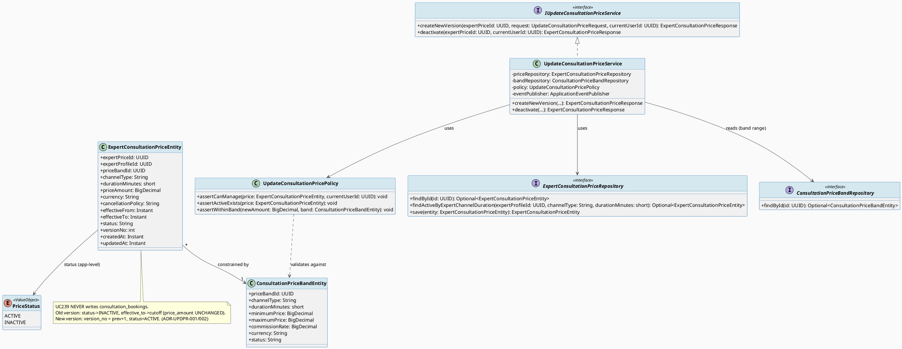
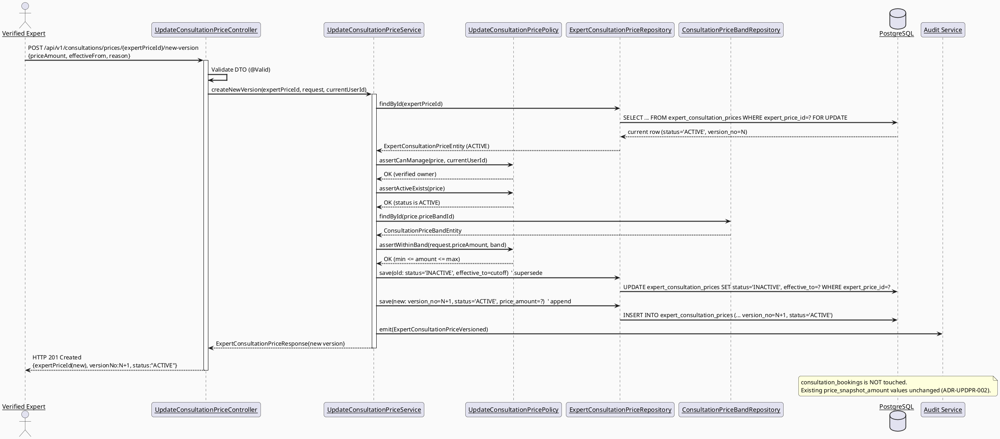
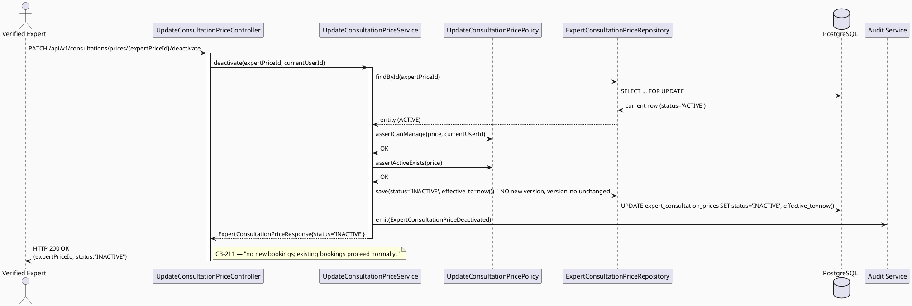
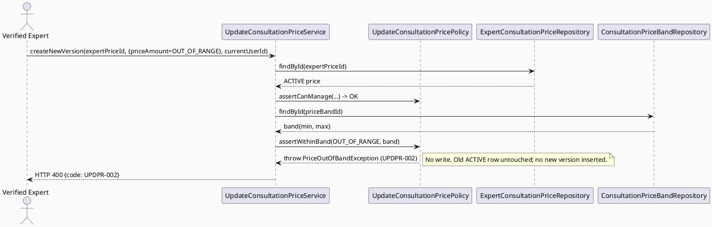
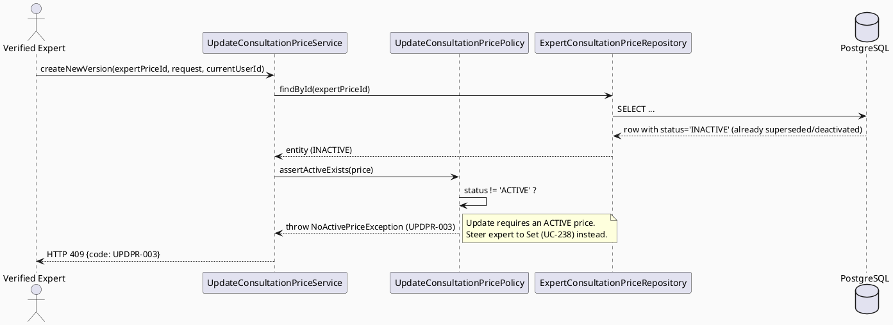
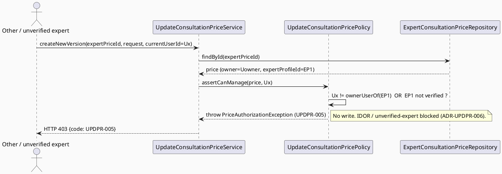
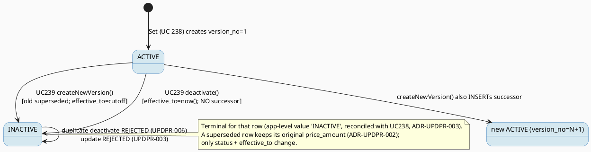

# ENGINEERING DOCUMENTATION STANDARD (EDS) v2.0
# UC239 — Update Consultation Price — Technical Design Specification

| Field | Value |
|-------|-------|
| **Document ID** | `CB-CONSULTATION-IMP-239` |
| **Version** | `1.0` |
| **Date** | `2026-07-03` |
| **Status** | `Draft` |
| **Document Owner** | `LamVH` |
| **Author** | `AI Agent (Technical Architect)` |
| **Reviewed by** | `[Tech Lead — Pending]` |
| **DPO Sign-off** | `[ ] Pending` *(pricing data is Confidential-financial, not personal PII; the versioning invariant protects locked booking prices — see §1)* |
| **Approved by** | `[Principal Architect — Pending]` |
| **Last Review** | `2026-07-03` |
| **Based on EDS** | `v2.0` |

---

## CHANGELOG

> **Policy 4.4 — Immutable History:** Không bao giờ xóa thông tin cũ.

| Ngày | Người thực hiện | Nội dung thay đổi |
|------|-----------------|-------------------|
| 2026-07-03 | AI Agent — Technical Architect | Tạo tài liệu lần đầu (Draft) cho UC239 Update Consultation Price |

---

## MỤC LỤC

1. [Tổng quan Module](#1-tổng-quan-module)
2. [Ma trận Truy vết (Traceability Matrix)](#2-ma-trận-truy-vết-traceability-matrix)
3. [Architecture Decision Records (ADR)](#3-architecture-decision-records-adr)
4. [Non-Functional Requirements & SLA](#4-non-functional-requirements--sla)
5. [Static Modeling (Mô hình Tĩnh)](#5-static-modeling-mô-hình-tĩnh)
6. [Dynamic Modeling (Mô hình Động)](#6-dynamic-modeling-mô-hình-động)
7. [Domain Event Catalog](#7-domain-event-catalog)
8. [Interface Specification (Đặc tả Giao diện)](#8-interface-specification-đặc-tả-giao-diện)
9. [API Specification](#9-api-specification)
10. [Bảng mã lỗi (Error Codes)](#10-bảng-mã-lỗi-error-codes)
11. [Quy trình Triển khai (Step-by-Step)](#11-quy-trình-triển-khai-step-by-step)
12. [Rollback & Incident Runbook](#12-rollback--incident-runbook)
13. [Kịch bản Kiểm thử Chi tiết](#13-kịch-bản-kiểm-thử-chi-tiết)
14. [Phương pháp Xác minh](#14-phương-pháp-xác-minh)
15. [Mẫu thử thực tế (API Verification Samples)](#15-mẫu-thử-thực-tế-api-verification-samples)
16. [Bảng tổng hợp phân quyền (Authorization Matrix)](#16-bảng-tổng-hợp-phân-quyền-authorization-matrix)
17. [AI Prompt Constraints (CASE 2.0)](#17-ai-prompt-constraints-case-20)

---

## 1. Tổng quan Module

| Field | Value |
|-------|-------|
| **Module Name** | `Consultation — Update Consultation Price` |
| **Bounded Context** | `Consultation` (package `com.carebridge.backend.consultation`) |
| **Function ID / UC** | `3.2.7.2 Update Consultation Price` / `UC-239` (SRS Table 101) |
| **Primary Actor** | Verified Expert (owner of the price) |
| **Secondary Actor** | VNPay Payment Gateway *(per SRS — but UC239 does NOT itself call VNPay; see §1.3)* |
| **Platform** | Expert Portal (Web) + Expert App (Mobile) |
| **Priority** | Medium (per SRS) |
| **Frequency of Use** | Regular (per SRS) |
| **Sprint / Owner** | UC238→UC241 consultation-pricing batch — LamVH |
| **Data Classification** | `Confidential` (commercial pricing; not personal PII) |
| **Compliance Scope** | internal `BR-RBAC`, `BR-CONSULTATION` |
| **Upstream Dependencies** | `Set Consultation Price (UC-238)` seeds the initial ACTIVE `expert_consultation_prices` row; `Configure Consultation Price Bands (UC-240)` maintains the `consultation_price_bands` that constrain the allowed price range; expert-profile module resolves `expert_profile_id → owning user_id` and verified status |
| **Downstream Consumers** | `Book Private Consultation (UC-75)` reads the ACTIVE price at booking time and snapshots it into `consultation_bookings.price_snapshot_amount`; `View Consultation Price (UC-241)` reads the price version history; Notification service (price-change notice — out of scope consumer) |

### 1.1 Scope Statement — Greenfield within an existing schema contract

This use case is greenfield at the code level (the `com.carebridge.backend.consultation`
package contains no pricing code yet). The PostgreSQL schema in
`V1__init_schema.sql` already models the domain in full:
`public.expert_consultation_prices` (L859-874) — including a
**`version_no integer NOT NULL DEFAULT 1`** column (L871) that is the schema-level
anchor of the versioning design — and `public.consultation_price_bands`
(L842-857) which supplies the `minimum_price`/`maximum_price` range and the
`commission_rate`. UC239 is therefore designed **against the applied schema
contract only** and against the sibling UC238 (Set) design conventions.

### 1.2 Relationship to sibling UC238 (Set Consultation Price)

UC238 **creates the initial** ACTIVE price row (`version_no = 1`). UC239 is its
natural counterpart: it **supersedes** an existing ACTIVE row and appends a new
version (`version_no = previous + 1`), OR **deactivates** the current ACTIVE row.
UC238's entity (`ExpertConsultationPriceEntity`), repository, band-range
validation, and the "no duplicate ACTIVE price for the same
expert+channel+duration" rule are **reused** by UC239 (they are the same domain
objects). UC238's TDS (`04_Implement/UC238_SetConsultationPrice/UC238_SetConsultationPrice_TDS.md`)
has since been authored and its state-machine (§6.6) now cites the exact same
non-active status literal, `'INACTIVE'`, that this document proposes below
(ADR-UPDPR-003) — the cross-document dependency is **reconciled**, not `Open`.

### 1.3 VNPay secondary-actor clarification (Open)

SRS lists "VNPay Payment Gateway" as a Secondary Actor for UC-239, identically to
UC-238 and every other pricing UC in the batch. **Updating a price version does
not move money** — no charge, no refund — so UC239 makes **no VNPay call**. The
VNPay linkage is relevant only indirectly: a *future* booking made against the
new ACTIVE version will be paid via VNPay (UC-75/UC-76), and existing bookings
already paid via VNPay must remain untouched (the core invariant, ADR-UPDPR-002).
The presence of VNPay as a secondary actor in the SRS row is treated as
boilerplate carried across the pricing batch; **whether UC239 has any direct
payment-gateway responsibility is `Open`** (assessed: none).

### 1.4 Entry-Criteria note (Open dependency)

UC239 cannot run standalone: it requires an **already-existing ACTIVE**
`expert_consultation_prices` row for the target expert+channel+duration, which is
produced by UC238 (Set). If UC238 is not yet implemented, UC239's
"update"/"deactivate" paths have nothing to operate on. This is a firm
precondition (ADR-UPDPR-007), not a code coupling — UC239 reads/writes the shared
table directly.

---

## 2. Ma trận Truy vết (Traceability Matrix)

> **Policy:** Không viết code nếu không biết code đó phục vụ Rule nào.

| Requirement ID | Loại (BR/ADR/US) | Mô tả yêu cầu | Thành phần Code | Compliance Target | ADR liên quan |
|----------------|------------------|---------------|-----------------|-------------------|---------------|
| UC-239 (SRS Table 101) | Use Case | "Creates a new price version for future bookings without changing locked booking prices." | `UpdateConsultationPriceController.POST /new-version`, `UpdateConsultationPriceService.createNewVersion()` | BR-CONSULTATION | ADR-UPDPR-001, ADR-UPDPR-002, ADR-UPDPR-003 |
| UC-239 Deactivate sub-action (mockup CB-211) | Use Case (UI-derived) | Expert stops offering a channel/duration package — set current ACTIVE price INACTIVE, no new version | `UpdateConsultationPriceController.PATCH /deactivate`, `UpdateConsultationPriceService.deactivate()` | BR-CONSULTATION | ADR-UPDPR-004 |
| BR-RBAC | Business Rule | Users may access only functions allowed by role/permission scope | `UpdateConsultationPricePolicy.assertCanManage()` | Authorization | ADR-UPDPR-006 |
| BR-CONSULTATION | Business Rule | Pricing actions keep an auditable lifecycle state | `ExpertConsultationPriceEntity.status`/`version_no`/`effective_to`, domain-event emission | BR-AUDIT | ADR-UPDPR-001, ADR-UPDPR-003 |
| SRS "without changing locked booking prices" | Invariant | Existing `consultation_bookings.price_snapshot_amount` MUST NOT be altered by a price update | Append-new-version design; no write path to `consultation_bookings` | BR-CONSULTATION | ADR-UPDPR-002 |
| SRS E2 (invalid/conflicting data rejected) | Exception Flow | New price outside band range rejected; no-active-price rejected | `UpdateConsultationPricePolicy.assertWithinBand()`, `assertActiveExists()` | BR-CONSULTATION | ADR-UPDPR-005, ADR-UPDPR-007 |
| SRS E1 (access denied outside scope) | Exception Flow | Non-owner / unverified expert denied | `UpdateConsultationPricePolicy.assertCanManage()` | BR-RBAC | ADR-UPDPR-006 |
| Schema: `expert_consultation_prices` (`price_amount`, `status`, `version_no`, `effective_from`, `effective_to`, `price_band_id`) `V1__init_schema.sql` L859-874 | Schema Contract | Versioned price persistence | `ExpertConsultationPriceEntity` | — | ADR-UPDPR-001, ADR-UPDPR-003 |
| Schema: `consultation_price_bands` (`minimum_price`, `maximum_price`) L842-857 | Schema Contract | Allowed price range for validation | `ConsultationPriceBandEntity` (read-only) | — | ADR-UPDPR-005 |
| Entry-Criteria dependency (§1.4) | Open Item | An ACTIVE price (from UC238) must exist first | N/A — precondition | — | ADR-UPDPR-007 |

---

## 3. Architecture Decision Records (ADR)

### ADR-UPDPR-001 — "Update" is an append-new-version + supersede-old, NOT an in-place UPDATE of `price_amount`

| Field | Value |
|-------|-------|
| **Status** | `Accepted` *(directly mandated by the SRS wording)* |
| **Deciders** | `AI Agent — derived from SRS Table 101 Description + schema version_no column` |
| **Date** | `2026-07-03` |

#### Bối cảnh (Context)
SRS UC-239 Description states verbatim: *"Creates a **new price version** for
future bookings **without changing locked booking prices**."* The schema backs
this exactly: `expert_consultation_prices.version_no` is `integer NOT NULL DEFAULT
1` (`V1__init_schema.sql` L871), and the table carries `effective_from` /
`effective_to` / `status` columns — the classic shape of an append-only,
temporally-versioned price ledger. An in-place `UPDATE expert_consultation_prices
SET price_amount = ...` on the existing row would (a) discard price history that
UC-241 (View Price) needs, and (b) risk retroactively changing the amount any
in-flight logic reads — the opposite of "new version".

#### Các phương án đã xem xét (Options Considered)

| Phương án | Mô tả | Ưu điểm | Nhược điểm |
|-----------|-------|----------|------------|
| A | In-place `UPDATE` of `price_amount` on the existing ACTIVE row | Simplest write | Destroys version history; contradicts SRS "new price version"; `version_no` column left meaningless |
| B | **Two-step versioning in one transaction: (1) supersede current ACTIVE row (`effective_to = cutoff`, `status = 'INACTIVE'`); (2) INSERT a new row with `version_no = previous.version_no + 1`, new `price_amount`, `effective_from`, `status = 'ACTIVE'`, same `price_band_id`/`channel_type`/`duration_minutes`** | Matches SRS + `version_no` schema intent; full auditable history; future bookings read the new ACTIVE row, past bookings keep their snapshot | Two row writes per update; must guard the "exactly one ACTIVE" invariant at app level |
| C | Keep a single row but store a JSON array of historical prices | One row | Non-relational; breaks UC-241 querying; ignores the existing `version_no`/`effective_*` columns |

#### Quyết định (Decision)
Chọn **Phương án B**. `createNewVersion` runs in a single DB transaction: load the
current ACTIVE row → set its `effective_to = newEffectiveFrom` (or `now()` if the
new version is immediate) and `status = 'INACTIVE'` → INSERT the successor row
with `version_no = previous.version_no + 1` and `status = 'ACTIVE'`. The
`consultation_bookings` table is **never** part of this transaction (ADR-UPDPR-002).

#### Hệ quả (Consequences)
**Tích cực:** Full price history; SRS-faithful; future bookings pick up the new price automatically via UC-75's read of the ACTIVE row.
**Tiêu cực / Trade-offs:** The "exactly one ACTIVE per expert+channel+duration" invariant is enforced at the service layer (no DB partial-unique index exists — see §5.3); a raw concurrent double-update could momentarily create two ACTIVE rows (mitigated by ADR-UPDPR-007 + optimistic transaction).
**Compliance Impact:** Supports BR-CONSULTATION auditable pricing lifecycle.

---

### ADR-UPDPR-002 — Locked-booking-price immutability: a price update MUST NEVER alter `consultation_bookings.price_snapshot_amount`

| Field | Value |
|-------|-------|
| **Status** | `Accepted` *(the primary tested invariant of this feature)* |
| **Deciders** | `AI Agent — derived directly from SRS "without changing locked booking prices"` |
| **Date** | `2026-07-03` |

#### Bối cảnh (Context)
When a booking is created (UC-75), the price in force is copied into
`consultation_bookings.price_snapshot_amount` (`numeric NOT NULL`,
`V1__init_schema.sql` L888) and the moment of locking is recorded in
`price_locked_at` (L892). The booking FK `expert_price_id`
(`consultation_bookings_expert_price_id_fkey` → `expert_consultation_prices`,
L1833) points at the price *version* used. Because UC239 **supersedes** the old
version rather than mutating it, and because the booking already carries its own
`price_snapshot_amount` copy, an existing booking's charged amount is protected by
**two independent mechanisms**: (1) it reads its own snapshot column, not the live
price; (2) even the price *row* it references is preserved (only its `status`/
`effective_to` change, never its `price_amount`).

#### Quyết định (Decision)
UC239's write scope is **strictly** limited to `expert_consultation_prices` rows.
There is **no code path** in this feature that issues an `UPDATE`/`DELETE` against
`consultation_bookings`. The superseded price row keeps its original
`price_amount` unchanged (only `status`→`INACTIVE` and `effective_to`→cutoff are
written), so any booking still FK-referencing it also sees an unchanged amount.
This invariant is asserted by a dedicated regression test
(`UPDPR-TC-005`, §13) that snapshots a `consultation_bookings` row before an
update and asserts byte-for-byte equality of `price_snapshot_amount` afterwards.

#### Hệ quả (Consequences)
**Tích cực:** Contractual/financial integrity for already-paid consultations; no retroactive re-pricing.
**Tiêu cực / Trade-offs:** None — this is a hard business constraint, not a trade-off.
**Compliance Impact:** BR-CONSULTATION auditable, non-retroactive pricing.

---

### ADR-UPDPR-003 — Non-active status literal = `INACTIVE`; `version_no` increments by exactly 1

| Field | Value |
|-------|-------|
| **Status** | `Accepted` *(literal reconciled with `UC238_SetConsultationPrice_TDS.md` §6.6 state machine, which cites this same value — no divergence found)* |
| **Deciders** | `AI Agent — reconciled with UC238 TDS during the UC-238/239/240/241 cross-doc audit` |
| **Date** | `2026-07-03` (reconciled) |

#### Bối cảnh (Context)
`expert_consultation_prices.status` is `varchar(20) NOT NULL DEFAULT 'ACTIVE'`
(`V1__init_schema.sql` L870) with **no DB `CHECK` constraint** (verified — the
consultation-pricing tables carry no CHECK; application-level enum is the
established CareBridge pattern). SRS never names the non-active value. Two
non-active situations arise: (a) a row superseded by a newer version (this ADR /
ADR-UPDPR-001), and (b) a row stopped by an expert deactivation (ADR-UPDPR-004).
UC238's TDS (`UC238_SetConsultationPrice_TDS.md` §6.6 state machine) independently
references this same non-active concept and, after cross-doc reconciliation, cites
`'INACTIVE'` as the literal, matching this ADR — UC238 does **not** propose a
different literal (it originally deferred to whichever value UC239 defined).

#### Các phương án đã xem xét (Options Considered)

| Phương án | Mô tả | Ưu điểm | Nhược điểm |
|-----------|-------|----------|------------|
| A | Single non-active value `'INACTIVE'` for both supersede and deactivate | Simplest enum; fits `varchar(20)`; distinction recoverable (a superseded row has a newer ACTIVE successor, a deactivated row has none); matches UC205's `CANCELLED_STATUS` single-value isolation pattern | Cannot tell "superseded" from "deactivated" by the status column alone |
| B | Two values: `'SUPERSEDED'` (versioned) vs `'INACTIVE'`/`'DEACTIVATED'` (stopped) | Self-describing status | `'SUPERSEDED'` (10) / `'DEACTIVATED'` (11) fit `varchar(20)`, but invents a two-value enum not shared by UC238; risks drift with the sibling spec |
| C | Add a DB CHECK enumerating the status set now | DB-level guarantee | New migration on a table three sibling specs touch; not a genuine gap — app-level enum is the pattern; rejected |

#### Quyết định (Decision)
Chọn **Phương án A** — use `'INACTIVE'` as the single non-active value for both the
superseded-old-version case and the deactivation case, at the application layer
(no migration, no CHECK). The successor row is written with `version_no =
previous.version_no + 1` (a strict +1 increment, never a re-computed max). **The
literal is now cross-doc reconciled with UC238** (§6.6 state machine uses the same
`'INACTIVE'` value) — both TDS documents use this literal identically. The
versioned-vs-deactivated distinction, when needed by reporting, is derived from
*whether a newer ACTIVE successor exists*, not from the status string.

**Residual note (non-blocking):** this reconciliation is a cross-document
consistency fix, not a Product/Tech-Lead sign-off — final business approval of the
literal is still pending formal Approved status on both TDS documents (tracked at
the document `Status: Draft` level, not as an open business question).

#### Hệ quả (Consequences)
**Tích cực:** Minimal enum; now consistent with UC238 verbatim; no schema change.
**Tiêu cực / Trade-offs:** Status column alone is not self-describing (mitigated by successor-existence lookup + domain events §7).
**Compliance Impact:** Auditable via `version_no` + `effective_*` + events.

---

### ADR-UPDPR-004 — Deactivate is a DISTINCT sub-action (no new version), on its own endpoint

| Field | Value |
|-------|-------|
| **Status** | `Accepted` *(mechanism); status literal inherits ADR-UPDPR-003, now `Accepted`/reconciled with UC238* |
| **Deciders** | `AI Agent — derived from mockup CB-211 (separate confirmation screen)` |
| **Date** | `2026-07-03` |

#### Bối cảnh (Context)
The mobile mockup **CB-211 "Deactivate Consultation Price Confirmation (UC-239)"**
is a *separate* confirmation sheet from **CB-210 "Update Consultation Price"**. Its
copy: *"Dừng gói tư vấn?" … "Khách hàng sẽ không thể đặt lịch mới với gói này. Các
lịch đã đặt trước đó vẫn sẽ diễn ra bình thường."* ("Stop this consultation
package? Customers can no longer book new appointments with this package;
previously-booked appointments proceed normally.") This is semantically **not** a
price change — no new amount, no new version — it is the expert *ceasing to offer*
a channel/duration package. It also re-states the ADR-UPDPR-002 invariant in
user-facing language ("previously-booked appointments proceed normally").

#### Các phương án đã xem xét (Options Considered)

| Phương án | Mô tả | Ưu điểm | Nhược điểm |
|-----------|-------|----------|------------|
| A | Model deactivate as "update to a null/zero price version" | One endpoint | Nonsensical price row; pollutes version history; CB-211 clearly is not a price entry |
| B | **Distinct endpoint `PATCH .../deactivate`: set current ACTIVE row `status='INACTIVE'`, `effective_to=now()`, create NO successor row (`version_no` unchanged)** | Matches CB-211 semantics exactly; clean separation from `new-version`; expert can later re-Set (UC238) to resume | Two endpoints to secure/test (accepted) |
| C | Reuse a generic "status PATCH" endpoint | Fewer methods | Over-generic; invites arbitrary status transitions not in scope |

#### Quyết định (Decision)
Chọn **Phương án B**. `deactivate(expertPriceId)` sets the current ACTIVE row's
`status = 'INACTIVE'` and `effective_to = now()` and **creates no new version**.
After deactivation there is *no* ACTIVE price for that expert+channel+duration, so
UC-75 booking against it is blocked upstream, faithfully matching CB-211's "no new
bookings" copy. Resuming the package is a fresh **UC-238 Set** (a new
`version_no = 1` lineage or a continued increment — UC238-owned decision), not an
UC239 update.

#### Hệ quả (Consequences)
**Tích cực:** Clean, testable separation of "change price" vs "stop offering"; UI-faithful.
**Tiêu cực / Trade-offs:** Deactivate is idempotent-guarded (ADR-UPDPR-007) so a double-deactivate is a clean 409, not a silent no-op.
**Compliance Impact:** Auditable via `ExpertConsultationPriceDeactivated` event (§7).

---

### ADR-UPDPR-005 — Band-range validation reused from UC238; band assignment is fixed at Set-time (scope boundary)

| Field | Value |
|-------|-------|
| **Status** | `Accepted` |
| **Deciders** | `AI Agent — derived from schema FK price_band_id + UC238 parity` |
| **Date** | `2026-07-03` |

#### Bối cảnh (Context)
`expert_consultation_prices.price_band_id` is `uuid NOT NULL` FK to
`consultation_price_bands` (`V1__init_schema.sql` L871 col + FK L1820-1821). The
band carries `minimum_price`/`maximum_price` (L847-848). A new price version's
`price_amount` must fall within `[minimum_price, maximum_price]` of the band the
existing ACTIVE price already references — the identical rule UC238 applies at
creation. **`commission_rate` lives only on `consultation_price_bands` and is NOT
touched by UC239** (confirmed batch decision).

#### Quyết định (Decision)
`UpdateConsultationPricePolicy.assertWithinBand(newAmount, band)` rejects
(`UPDPR-002`, 400) any `price_amount` outside `[band.minimumPrice,
band.maximumPrice]`. **The band (`price_band_id`), `channel_type`, and
`duration_minutes` are carried over unchanged from the superseded row** — UC239
does not let the expert change the band, channel, or duration. Changing the
channel or duration is a **new Set (UC-238)**, not an Update. This is a firm
**scope boundary**: UC239 varies `price_amount` (+ `effective_from`, optional
`cancellation_policy`) only.

**Resolved (not `Open`):** the band boundary is **inclusive** `[min, max]` — confirmed
aligned with `UC238_SetConsultationPrice_TDS.md` ADR-SETPR-003, which independently
fixes `band.minimumPrice ≤ priceAmount ≤ band.maximumPrice` with both endpoints
inclusive. No divergence between the two documents.

#### Hệ quả (Consequences)
**Tích cực:** Consistent band enforcement across Set and Update; no band drift.
**Tiêu cực / Trade-offs:** Expert must use UC238 to re-band — accepted (clearer audit).
**Compliance Impact:** Keeps expert pricing inside admin-approved bands (BR-CONSULTATION).

---

### ADR-UPDPR-006 — Authorization: only the verified owning Expert may update/deactivate their own price

| Field | Value |
|-------|-------|
| **Status** | `Accepted` |
| **Deciders** | `AI Agent — derived from schema FK + BR-RBAC + SRS "Verified Expert"` |
| **Date** | `2026-07-03` |

#### Bối cảnh (Context)
SRS Primary Actor is **Verified Expert**. `expert_consultation_prices.expert_profile_id`
(`uuid NOT NULL`, FK to `expert_profiles`, L1817-1818) identifies the owning
expert. Editing another expert's price is an IDOR (same class as UC205's ownership
guard). "Verified" is an expert-profile status owned by the expert module.

#### Quyết định (Decision)
`UpdateConsultationPricePolicy.assertCanManage(price, currentUserId)` must confirm
both: (1) `currentUserId == ownerUserOf(price.expertProfileId)` and (2) that
expert profile's `verification_status` equals `'VERIFIED'` — the literal cited from
`UC103_VerifyExpertProfile_TDS.md` ADR-EXP-201, the same literal UC-238 resolves to
in its ADR-SETPR-005 (cross-doc reconciled, not independently invented here).
Failure → `403` (`UPDPR-005`). The `expert_profile_id → owning user_id` mapping and
the verified flag are consumed **read-only** from the expert-profile module
(interface only; UC239 does not own verification).

#### Hệ quả (Consequences)
**Tích cực:** Prevents cross-expert price tampering; enforces verified-only pricing.
**Tiêu cực / Trade-offs:** One extra read to resolve ownership + verified status (negligible).
**Compliance Impact:** BR-RBAC.

---

### ADR-UPDPR-007 — Precondition + idempotency: an ACTIVE price must already exist; guard against no-active and duplicate-active

| Field | Value |
|-------|-------|
| **Status** | `Accepted` |
| **Deciders** | `AI Agent — derived from SRS E2 + ADR-UPDPR-001 single-ACTIVE invariant` |
| **Date** | `2026-07-03` |

#### Bối cảnh (Context)
UC239 operates on an existing ACTIVE price. Two hazards: (1) there is **no** ACTIVE
price for the expert+channel+duration (the expert never Set one, or already
deactivated it) — updating/deactivating is meaningless; the correct action is
UC-238 Set. (2) The append-new-version step must not leave **two** ACTIVE rows for
the same expert+channel+duration (the "exactly one ACTIVE" invariant of
ADR-UPDPR-001). No DB partial-unique index enforces this (see §5.3), so it is a
service-level guard.

#### Quyết định (Decision)
Two guards:
1. **No-active guard:** `assertActiveExists(...)` — `createNewVersion` and
   `deactivate` reject (`UPDPR-003`, 409) when no ACTIVE row exists for the target.
   The rejection message steers the expert to **Set (UC-238)** instead.
2. **Single-ACTIVE guard:** within the versioning transaction, the old ACTIVE row
   is set `INACTIVE` **before** the new ACTIVE row is inserted, in one transaction;
   the load of the current ACTIVE row uses a locking read (or optimistic
   `version`/`updated_at` check) so two concurrent updates cannot both insert an
   ACTIVE successor. A duplicate/replayed deactivate on an already-`INACTIVE` row
   is rejected (`UPDPR-006`, 409).

**Open sub-item:** a follow-up partial-unique index
`UNIQUE (expert_profile_id, channel_type, duration_minutes) WHERE status='ACTIVE'`
would make the single-ACTIVE invariant DB-enforced. Proposed, **not** created by
this TDS (needs Tech Lead + UC238 coordination).

#### Hệ quả (Consequences)
**Tích cực:** No orphaned "update nothing"; no double-ACTIVE; clean deactivate idempotency.
**Tiêu cực / Trade-offs:** Requires a locking/optimistic read of the current ACTIVE row.
**Compliance Impact:** Data-integrity for pricing lifecycle (BR-CONSULTATION).

---

## 4. Non-Functional Requirements & SLA

> No SRS/BR source specifies numeric SLA targets for UC239. Values below are
> **`Open` — proposed defaults**, consistent with sibling consultation TDS
> baselines; must be confirmed by Tech Lead before being treated as binding.

### 4.1. Performance & Availability

| Category | Requirement | Target SLA | Measurement Method | Compliance Basis |
|----------|-------------|------------|---------------------|------------------|
| Latency | `POST /new-version` p99 (supersede-old + insert-new, single tx) | `< 300ms` *(Open — proposed)* | API test timing | — |
| Latency | `PATCH /deactivate` p99 (single row update) | `< 250ms` *(Open — proposed)* | API test timing | — |
| Availability | Uptime | `99.9%` *(Open — proposed)* | Uptime monitor | — |

### 4.2. Data Integrity & Retention

| Category | Requirement | Target | Verification Method | Compliance Basis |
|----------|-------------|--------|---------------------|------------------|
| Durability | No price-version loss | RPO = 0 (single tx for supersede + insert) | Transaction log | BR-CONSULTATION |
| Atomicity | Supersede-old + insert-new either both commit or both roll back | 100% | Integration test | BR-CONSULTATION |
| Immutability | `consultation_bookings.price_snapshot_amount` never mutated by a price update | 100% | Regression test `UPDPR-TC-005` | BR-CONSULTATION |
| Consistency | Exactly one ACTIVE price per expert+channel+duration | 100% (service guard, ADR-UPDPR-007) | Reconciliation query (§14.1) | BR-CONSULTATION |

### 4.3. Security

| Category | Requirement | Target | Verification Method | Compliance Basis |
|----------|-------------|--------|---------------------|------------------|
| Access control | Verified owning expert only | Least privilege | Auth Matrix (§16) | BR-RBAC |
| Transport | All endpoints over TLS | TLS 1.2+ (platform default) | Infra config | — |
| Audit | Every version/deactivate emits a domain event | 100% | Log grep (§14.2) | BR-CONSULTATION |

### 4.4. Scalability & Capacity Planning

Price updates are low-frequency (an expert changes prices occasionally). No special
scaling design beyond standard Spring Boot request handling. Version history grows
by one row per update — bounded and small per expert.

---

## 5. Static Modeling (Mô hình Tĩnh)

### 5.1. Component Responsibilities & Planned File Paths

| Layer | File Path | Responsibility |
|-------|-----------|----------------|
| Controller | `src/main/java/com/carebridge/backend/consultation/controller/UpdateConsultationPriceController.java` | HTTP mapping, DTO validation only (both endpoints) |
| Service | `src/main/java/com/carebridge/backend/consultation/service/UpdateConsultationPriceService.java` | Versioning workflow (supersede-old + insert-new), deactivate workflow, event emission, tx boundary |
| Policy | `src/main/java/com/carebridge/backend/consultation/policy/UpdateConsultationPricePolicy.java` | Ownership+verified check (ADR-UPDPR-006), band-range check (ADR-UPDPR-005), active-exists/idempotency guards (ADR-UPDPR-007) |
| Repository | `src/main/java/com/carebridge/backend/consultation/repository/ExpertConsultationPriceRepository.java` | Read/write `expert_consultation_prices` (shared w/ UC238/UC241) |
| Repository | `src/main/java/com/carebridge/backend/consultation/repository/ConsultationPriceBandRepository.java` | Read-only `consultation_price_bands` for range check (shared w/ UC238/UC240) |
| Entity | `src/main/java/com/carebridge/backend/consultation/entity/ExpertConsultationPriceEntity.java` | JPA mapping for `expert_consultation_prices` (owned jointly with UC238) |
| Entity | `src/main/java/com/carebridge/backend/consultation/entity/ConsultationPriceBandEntity.java` | JPA mapping for `consultation_price_bands` (owned by UC240; referenced) |
| DTO | `src/main/java/com/carebridge/backend/consultation/dto/request/UpdateConsultationPriceRequest.java` | Inbound payload for `new-version` (priceAmount, effectiveFrom, reason, optional cancellationPolicy) |
| DTO | `src/main/java/com/carebridge/backend/consultation/dto/response/ExpertConsultationPriceResponse.java` | Outbound payload (new version summary) |
| Mapper | `src/main/java/com/carebridge/backend/consultation/mapper/ExpertConsultationPriceMapper.java` | Entity ↔ DTO, never expose entity |
| Mobile Repository | `05_Development/CareBridgeMobileApp/lib/features/consultation/repositories/update_consultation_price_repository.dart` | API client (new-version + deactivate) |
| Mobile Screen | `05_Development/CareBridgeMobileApp/lib/features/consultation/screens/update_consultation_price_screen.dart` | Update Price form (CB-210) |
| Mobile Screen | `05_Development/CareBridgeMobileApp/lib/features/consultation/screens/deactivate_price_confirmation.dart` | Deactivate confirmation sheet (CB-211) |
| Web | `05_Development/CareBridgeWebApp/src/features/consultation/` (Update Price CB-214 / Deactivate CB-215) | Web equivalents |

### 5.2. Class Diagram (PlantUML)



### 5.3. Data Structure — Schema/Migration Details

> **CareBridge rule:** `V1__init_schema.sql` and approved Flyway migrations are the
> primary source of truth. ERD is supporting context only.

**No new migration is required for UC239.** All needed tables/columns already
exist. UC239 performs `UPDATE` (supersede old / deactivate) and `INSERT` (new
version) on `expert_consultation_prices`, and a read-only `SELECT` on
`consultation_price_bands`:

```sql
-- expert_consultation_prices (V1__init_schema.sql L859-874) — write target
-- price_amount      numeric      NOT NULL              (L865) -> new version's amount (band-validated)
-- status            varchar(20)  NOT NULL DEFAULT 'ACTIVE' (L870) -> old->'INACTIVE', new->'ACTIVE'
-- version_no        integer      NOT NULL DEFAULT 1    (L871) -> new = previous + 1
-- effective_from    timestamptz  NOT NULL              (L867) -> new version's start
-- effective_to      timestamptz                        (L868) -> set on the superseded/deactivated row (cutoff)
-- price_band_id     uuid         NOT NULL              (L861) -> carried over unchanged (ADR-UPDPR-005)
-- channel_type / duration_minutes                      (L862/863) -> carried over unchanged
-- PK expert_price_id (L1419-1420);
-- FK expert_profile_id->expert_profiles (L1817-1818), price_band_id->consultation_price_bands (L1820-1821)

-- consultation_price_bands (V1__init_schema.sql L842-857) — READ ONLY
-- minimum_price / maximum_price numeric NOT NULL (L847/848) -> band-range check (ADR-UPDPR-005)
-- commission_rate numeric NOT NULL (L849) -> NOT touched by UC239 (batch decision)

-- consultation_bookings (V1__init_schema.sql L876-895) — NEVER WRITTEN by UC239
-- price_snapshot_amount numeric NOT NULL (L888) -> immutable per ADR-UPDPR-002
-- expert_price_id FK -> expert_consultation_prices (L1833) -> superseded row preserved, not deleted
```

**Genuine gap identified (Open — non-blocking):** no partial-unique index enforces
"exactly one ACTIVE price per expert+channel+duration"; the invariant is a
service-level guard (ADR-UPDPR-007). A follow-up migration is *proposed* but **not
created** by this TDS (requires Tech Lead + UC238 coordination):

```sql
-- PROPOSED (Open — NOT created by this TDS; coordinate with UC238):
-- CREATE UNIQUE INDEX uq_expert_price_active
--   ON public.expert_consultation_prices (expert_profile_id, channel_type, duration_minutes)
--   WHERE status = 'ACTIVE';
```

**Schema-change conclusion:** UC239 requires **no schema change**. No new migration
file is created by this TDS.

---

## 6. Dynamic Modeling (Mô hình Động)

### 6.1. Sequence Diagram — Happy Path A: create new version (old inactivated)



### 6.2. Sequence Diagram — Happy Path B: deactivate (no new version)



### 6.3. Sequence Diagram — Error Path: new price out of band range (400 UPDPR-002)



### 6.4. Sequence Diagram — Error Path: no active price exists (409 UPDPR-003)



### 6.5. Sequence Diagram — Error Path: unverified / non-owner expert denied (403 UPDPR-005)



### 6.6. State Machine — Price row status (UC239 relevant transitions)



**⚠️ Invariant bất biến:**
1. A price update NEVER writes `consultation_bookings.price_snapshot_amount` (ADR-UPDPR-002).
2. The superseded old row keeps its original `price_amount` (only `status`→INACTIVE, `effective_to`→cutoff).
3. The new version has `version_no = previous.version_no + 1` (strict +1).
4. At most one ACTIVE price exists per expert+channel+duration at any time (ADR-UPDPR-001/007).
5. `price_band_id`, `channel_type`, `duration_minutes` are carried over unchanged; only `price_amount` (+ effective/policy) varies (ADR-UPDPR-005).
6. Deactivate creates NO successor row (`version_no` unchanged) (ADR-UPDPR-004).

---

## 7. Domain Event Catalog

### 7.1. Events Published (Phát ra)

| Event Name | Trigger | Publisher | Subscriber(s) | Payload Schema | Async? |
|------------|---------|-----------|---------------|----------------|--------|
| `ExpertConsultationPriceVersioned` | A new price version is created (old superseded) | `UpdateConsultationPriceService` | Notification service (price-change notice), View-Price cache invalidation (out of scope), Audit log | `ExpertConsultationPriceVersioned.java` | Yes |
| `ExpertConsultationPriceDeactivated` | An ACTIVE price is deactivated (no successor) | `UpdateConsultationPriceService` | Notification service, Booking-availability refresh (out of scope), Audit log | `ExpertConsultationPriceDeactivated.java` | Yes |

### 7.2. Events Consumed (Tiêu thụ)

| Event Name | Source | Handler | Action thực hiện |
|------------|--------|---------|------------------|
| `ExpertConsultationPriceVersioned` | Internal (same module) | Notification handler (out of scope) | Notify the expert (and optionally followers) that pricing changed for future bookings |
| `ExpertConsultationPriceDeactivated` | Internal | Booking-availability handler (out of scope) | Stop offering new bookings for that channel/duration package |

### 7.3. Payload Schema

```java
// ExpertConsultationPriceVersioned.java
public record ExpertConsultationPriceVersioned(
    UUID    eventId,          // UUID.randomUUID() — dedupe
    String  eventType,        // "ExpertConsultationPriceVersioned"
    Instant occurredAt,       // Instant.now()
    String  version,          // "1.0"
    Payload payload,
    Metadata metadata
) implements ApplicationEvent {

    public record Payload(
        UUID       expertProfileId,
        UUID       supersededPriceId,   // old row (now INACTIVE)
        UUID       newPriceId,          // new ACTIVE row
        int        previousVersionNo,
        int        newVersionNo,        // previousVersionNo + 1
        String     channelType,
        short      durationMinutes,
        BigDecimal previousAmount,      // unchanged on the old row (audit only)
        BigDecimal newAmount,
        String     currency,
        Instant    effectiveFrom
    ) {}

    public record Metadata(
        UUID   correlationId,
        String causedBy                 // userId of the verified expert
    ) {}
}

// ExpertConsultationPriceDeactivated.java
public record ExpertConsultationPriceDeactivated(
    UUID    eventId,
    String  eventType,        // "ExpertConsultationPriceDeactivated"
    Instant occurredAt,
    String  version,          // "1.0"
    Payload payload,
    Metadata metadata
) implements ApplicationEvent {

    public record Payload(
        UUID    expertProfileId,
        UUID    priceId,        // the row set to INACTIVE
        int     versionNo,      // unchanged (no successor)
        String  channelType,
        short   durationMinutes,
        Instant deactivatedAt
    ) {}

    public record Metadata(
        UUID   correlationId,
        String causedBy
    ) {}
}
```

---

## 8. Interface Specification (Đặc tả Giao diện)

> **Policy (EDS v2.0):** Mỗi interface phải khai báo `@version`. The
> `ExpertConsultationPriceEntity` / repository are **shared with UC238 (Set) and
> UC241 (View)** — UC239 reuses them, adding only the query it needs.

### 8.1. Service Interface

```java
// UpdateConsultationPriceRequest.java — Input DTO (new-version)
// @version 1.0
public class UpdateConsultationPriceRequest {
    @NotNull @DecimalMin(value = "0.0", inclusive = false)
    private BigDecimal priceAmount;    // must fall within band [min,max] (ADR-UPDPR-005)

    @NotNull
    private Instant effectiveFrom;     // when the new version takes effect (>= now, boundary Open)

    @Size(max = 500)
    private String reason;             // "Reason for Change" (CB-210) — optional free text

    @Size(max = 2000)
    private String cancellationPolicy; // optional; carried onto the new version if provided
    // getters / setters / @Valid annotations
    // NOTE: priceBandId, channelType, durationMinutes are NOT accepted here —
    // they are carried over from the superseded row (scope boundary, ADR-UPDPR-005).
}

// ExpertConsultationPriceResponse.java — Output DTO
public class ExpertConsultationPriceResponse {
    private UUID       expertPriceId;      // for new-version: the NEW row's id
    private UUID       expertProfileId;
    private UUID       priceBandId;
    private String     channelType;
    private short      durationMinutes;
    private BigDecimal priceAmount;
    private String     currency;
    private String     status;             // "ACTIVE" (new version) | "INACTIVE" (deactivated)
    private int        versionNo;
    private Instant    effectiveFrom;
    private Instant    effectiveTo;         // null on a live ACTIVE row
    // getters / setters — never expose entity internals
}

// IUpdateConsultationPriceService.java — Service Contract
// @version 1.0
public interface IUpdateConsultationPriceService {
    /**
     * Creates a new price version (version_no = previous + 1, status=ACTIVE) and
     * supersedes the current ACTIVE row (status=INACTIVE, effective_to=cutoff), in
     * one transaction. NEVER alters consultation_bookings.price_snapshot_amount.
     * @throws PriceOutOfBandException      (UPDPR-002) if priceAmount outside band [min,max]
     * @throws NoActivePriceException       (UPDPR-003) if no ACTIVE price exists (use Set/UC-238)
     * @throws PriceNotFoundException       (UPDPR-004) if expertPriceId does not exist
     * @throws PriceAuthorizationException  (UPDPR-005) if caller is not the verified owning expert
     * @throws UpdatePriceValidationException (UPDPR-001) if request payload invalid
     */
    ExpertConsultationPriceResponse createNewVersion(UUID expertPriceId,
                                                     UpdateConsultationPriceRequest request,
                                                     UUID currentUserId);

    /**
     * Deactivates the current ACTIVE price (status=INACTIVE, effective_to=now()).
     * Creates NO successor version. Idempotency-guarded.
     * @throws PriceNotFoundException          (UPDPR-004) if expertPriceId does not exist
     * @throws PriceAuthorizationException     (UPDPR-005) if caller is not the verified owning expert
     * @throws PriceAlreadyInactiveException   (UPDPR-006) if the price is already INACTIVE
     */
    ExpertConsultationPriceResponse deactivate(UUID expertPriceId, UUID currentUserId);
}
```

### 8.2. Repository Interface

```java
// ExpertConsultationPriceRepository.java  (shared w/ UC238/UC241)
// @version 1.0
public interface ExpertConsultationPriceRepository extends JpaRepository<ExpertConsultationPriceEntity, UUID> {

    Optional<ExpertConsultationPriceEntity> findById(UUID expertPriceId);

    // Single-ACTIVE guard / no-active guard (ADR-UPDPR-007). A locking variant
    // (@Lock(PESSIMISTIC_WRITE)) is used inside the versioning transaction.
    Optional<ExpertConsultationPriceEntity> findByExpertProfileIdAndChannelTypeAndDurationMinutesAndStatus(
        UUID expertProfileId, String channelType, short durationMinutes, String status);

    // No delete() — price rows are an append-only version ledger.
}

// ConsultationPriceBandRepository.java  (shared w/ UC238/UC240 — read only for UC239)
// @version 1.0
public interface ConsultationPriceBandRepository extends JpaRepository<ConsultationPriceBandEntity, UUID> {
    Optional<ConsultationPriceBandEntity> findById(UUID priceBandId);
}
```

---

## 9. API Specification

### 9.1. Endpoints Table

| Method | Path | Auth Level | Required Roles | Rate Limit | Idempotent? |
|--------|------|------------|----------------|------------|-------------|
| `POST` | `/api/v1/consultations/prices/{expertPriceId}/new-version` | JWT Bearer | `EXPERT` (verified, owner) | 30/min | No (each call appends a new version) |
| `PATCH` | `/api/v1/consultations/prices/{expertPriceId}/deactivate` | JWT Bearer | `EXPERT` (verified, owner) | 30/min | Effectively yes — a second deactivate on an already-`INACTIVE` price returns `409 UPDPR-006` (ADR-UPDPR-007) |

### 9.2. Request / Response Schemas

#### `POST /api/v1/consultations/prices/{expertPriceId}/new-version` — Create new price version

**Request Body:**
```json
{
  "priceAmount": 130.00,
  "effectiveFrom": "2026-08-01T00:00:00.000Z",
  "reason": "Annual inflation adjustment.",
  "cancellationPolicy": "REFUND_100_IF_BEFORE_24H"
}
```

**Response — 201 Created (Happy Path A):**
```json
{
  "expertPriceId": "9c1f0b2a-1111-2222-3333-444455556666",
  "expertProfileId": "3fa85f64-5717-4562-b3fc-2c963f66afa6",
  "priceBandId": "band-uuid",
  "channelType": "VIDEO_CALL",
  "durationMinutes": 30,
  "priceAmount": 130.00,
  "currency": "VND",
  "status": "ACTIVE",
  "versionNo": 2,
  "effectiveFrom": "2026-08-01T00:00:00.000Z",
  "effectiveTo": null
}
```
> Note: `priceAmount` `130.00` / `versionNo` `2` are illustrative (CB-210 shows a
> "$120 → new" change with price history). The `versionNo` is always
> `previous + 1`; the amount is caller-supplied, band-validated (ADR-UPDPR-005).

**Response — 400 Bad Request (out of band):**
```json
{ "error": { "code": "UPDPR-002", "message": "Price is outside the allowed band range" } }
```

**Response — 409 Conflict (no active price):**
```json
{ "error": { "code": "UPDPR-003", "message": "No active price to update; set a price first" } }
```

#### `PATCH /api/v1/consultations/prices/{expertPriceId}/deactivate` — Deactivate price

**Request Body:** *(none)*

**Response — 200 OK:**
```json
{
  "expertPriceId": "9c1f0b2a-1111-2222-3333-444455556666",
  "channelType": "VIDEO_CALL",
  "durationMinutes": 30,
  "priceAmount": 130.00,
  "currency": "VND",
  "status": "INACTIVE",
  "versionNo": 2,
  "effectiveTo": "2026-07-03T08:00:00.000Z"
}
```

**Response — 409 Conflict (already inactive):**
```json
{ "error": { "code": "UPDPR-006", "message": "This price is already inactive" } }
```

**Response — 403 Forbidden (not verified owner):**
```json
{ "error": { "code": "UPDPR-005", "message": "You are not authorized to manage this price" } }
```

---

## 10. Bảng mã lỗi (Error Codes)

> Prefix `UPDPR-` for Update Consultation Price. Sibling pricing UCs use distinct
> prefixes to avoid collision: UC-238 `SETPR-0xx`, UC-240 `PBAND-0xx`, UC-241
> `VIEWPR-0xx`.

| Code | HTTP Status | Message (EN) | Message (VI) | Trigger Condition |
|------|-------------|--------------|--------------|-------------------|
| `UPDPR-001` | 400 | Validation failed | Dữ liệu không hợp lệ | Missing/malformed `priceAmount` or `effectiveFrom`, non-positive amount, `reason`/`cancellationPolicy` too long |
| `UPDPR-002` | 400 | Price is outside the allowed band range | Giá nằm ngoài khoảng cho phép của band | New `priceAmount` < `minimum_price` or > `maximum_price` of the referenced band — ADR-UPDPR-005 |
| `UPDPR-003` | 409 | No active price to update; set a price first | Chưa có mức giá đang áp dụng để cập nhật; hãy đặt giá trước | No ACTIVE price row exists for this expert+channel+duration — ADR-UPDPR-007 (use Set/UC-238) |
| `UPDPR-004` | 404 | Consultation price not found | Không tìm thấy mức giá tư vấn | `expertPriceId` does not exist |
| `UPDPR-005` | 403 | You are not authorized to manage this price | Bạn không có quyền quản lý mức giá này | Caller is not the verified owning expert of the price — ADR-UPDPR-006 |
| `UPDPR-006` | 409 | This price is already inactive | Mức giá này đã ngừng áp dụng | Deactivate requested on an already-`INACTIVE` price (idempotency) — ADR-UPDPR-007 |
| `UPDPR-500` | 500 | Internal error | Lỗi hệ thống | Unexpected failure |

---

## 11. Quy trình Triển khai (Step-by-Step)

### 11.1. Prerequisites

- [ ] **BLOCKING:** UC-238 (Set) implemented so an ACTIVE `expert_consultation_prices` row exists to update (§1.4)
- [ ] Expert-profile module exposes `expert_profile_id → owning user_id` + verified-status read (ADR-UPDPR-006)
- [ ] UC-240 (price bands) present so `consultation_price_bands` has `minimum_price`/`maximum_price` to validate against
- [ ] ADR-UPDPR-003 non-active status literal (`'INACTIVE'`) reconciled with UC-238 TDS when authored
- [ ] Principal Architect approves this TDS

### 11.2. Pre-Migration Checklist

- [ ] **N/A** — no new migration required (§5.3). No `V{n}__` file is created by UC239.

### 11.3. Implementation Steps

#### Chặng 1 — Entities + Repositories
Confirm/reuse `ExpertConsultationPriceEntity` and `ConsultationPriceBandEntity`
JPA mappings (1:1 with existing schema, §5.3). Add the `findActive...` query +
locking variant to `ExpertConsultationPriceRepository`. No migration.

#### Chặng 2 — Policy
Implement `UpdateConsultationPricePolicy` — `assertCanManage` (ownership+verified,
ADR-UPDPR-006), `assertActiveExists` (ADR-UPDPR-007), `assertWithinBand`
(ADR-UPDPR-005).

#### Chặng 3 — Service
Implement `UpdateConsultationPriceService.createNewVersion` (transactional
supersede-old + insert-new + event) and `deactivate` (single-row update + event).

#### Chặng 4 — Controller + Clients
Wire `UpdateConsultationPriceController` (both endpoints), then Mobile
`update_consultation_price_screen.dart` (CB-210) +
`deactivate_price_confirmation.dart` (CB-211), and Web CB-214/CB-215.

#### Chặng 5 — Verification sau deploy
```bash
curl -X GET https://[host]/api/v1/health
# Expected: {"status": "ok"}
```

### 11.4. Deployment Checklist

- [ ] `./mvnw test` green
- [ ] Health check 200
- [ ] Reconciliation query (§14.1) shows exactly one ACTIVE price per expert+channel+duration
- [ ] Audit log emits `ExpertConsultationPriceVersioned` / `ExpertConsultationPriceDeactivated`
- [ ] Regression `UPDPR-TC-005` confirms no `consultation_bookings` mutation

---

## 12. Rollback & Incident Runbook

### 12.1. Điều kiện kích hoạt Rollback

| Điều kiện | Ngưỡng | Người quyết định |
|-----------|--------|------------------|
| Error rate tăng đột biến | > 5% trong 5 phút | On-call Engineer |
| Two ACTIVE prices detected for one expert+channel+duration | Any single occurrence | Tech Lead |
| A price update mutated a `consultation_bookings.price_snapshot_amount` | Any case | Tech Lead (financial incident) |

### 12.2. Rollback Procedure

```bash
# No new migration in scope — code-only rollback:
git checkout -- 05_Development/CareBridgeAPI/src/main/java/com/carebridge/backend/consultation/
git checkout -- 05_Development/CareBridgeAPI/src/test/java/com/carebridge/backend/consultation/
git checkout -- 05_Development/CareBridgeMobileApp/lib/features/consultation/
git checkout -- 05_Development/CareBridgeWebApp/src/features/consultation/

# Re-deploy previous version
kubectl rollout undo deployment/carebridge-api
kubectl rollout status deployment/carebridge-api
curl -X GET https://[host]/api/v1/health
```

> **Data note:** if a bad new version was created, it can be manually reversed by
> setting the erroneous new row `INACTIVE` and the superseded row back to `ACTIVE`
> (`effective_to=NULL`) — a manual DB correction, since the append-only ledger has
> no automatic undo. Never delete a price row that a booking FK-references.

### 12.3. Notification Protocol

| Thời điểm | Người nhận | Kênh | Template |
|-----------|------------|------|----------|
| Ngay khi phát hiện double-ACTIVE hoặc booking-price mutation | On-call + Tech Lead | Slack `#incident` | "🚨 Pricing invariant violation for expert [id]" |

### 12.4. Post-Incident Review (PIR)

Standard PIR within 48h for any pricing-integrity incident (double-ACTIVE, mutated
booking snapshot, wrong version increment). Include Timeline, Root Cause (5 Whys),
Impact, Remediation, Prevention.

---

## 13. Kịch bản Kiểm thử Chi tiết

> Detailed test cases live in `UC239_UpdateConsultationPrice_Test-Spec.md`. This
> section references condition IDs only.

| Condition Ref | Summary |
|----------------|---------|
| TC-COND-001 | Happy path A — new version created; old row `INACTIVE`, new `version_no = prev+1`, `ACTIVE` |
| TC-COND-002 | Happy path B — deactivate; ACTIVE→`INACTIVE`, no successor row |
| TC-COND-003 | Out-of-band `priceAmount` → 400 `UPDPR-002` |
| TC-COND-004 | No active price exists → 409 `UPDPR-003` |
| TC-COND-005 | **Invariant** — existing `consultation_bookings.price_snapshot_amount` unaffected by an update |
| TC-COND-006 | Unverified / non-owner expert → 403 `UPDPR-005` |
| TC-COND-007 | Price id not found → 404 `UPDPR-004` |
| TC-COND-008 | Deactivate already-`INACTIVE` price → 409 `UPDPR-006` (idempotency) |
| TC-COND-009 | Band-boundary values (min, max inclusive; min-1, max+1 rejected) |
| TC-COND-010 | Superseded old row keeps original `price_amount` (only status/effective_to change) |
| TC-COND-011 | `ExpertConsultationPriceVersioned` event emitted with correct payload |
| TC-COND-012 | `ExpertConsultationPriceDeactivated` event emitted with correct payload |
| TC-COND-013 | Response never leaks raw entity fields |
| TC-COND-014 | Unauthenticated → 401 |
| TC-COND-015 | E2E — new-version + deactivate API flow via Testcontainers, asserting booking snapshot unchanged |

---

## 14. Phương pháp Xác minh

### 14.1. Database Inspection

```sql
-- New version created correctly (old superseded, new active)
SELECT expert_price_id, version_no, status, price_amount, effective_from, effective_to
FROM expert_consultation_prices
WHERE expert_profile_id = '[uuid]' AND channel_type = 'VIDEO_CALL' AND duration_minutes = 30
ORDER BY version_no;
-- Expected: exactly one row with status='ACTIVE' (highest version_no); older rows 'INACTIVE'

-- Exactly one ACTIVE per expert+channel+duration (invariant, ADR-UPDPR-007)
SELECT expert_profile_id, channel_type, duration_minutes, COUNT(*)
FROM expert_consultation_prices
WHERE status = 'ACTIVE'
GROUP BY expert_profile_id, channel_type, duration_minutes
HAVING COUNT(*) > 1;
-- Expected: no rows

-- Locked booking prices NOT touched by an update (invariant, ADR-UPDPR-002)
SELECT booking_id, price_snapshot_amount, expert_price_id
FROM consultation_bookings
WHERE expert_price_id = '[superseded_price_uuid]';
-- Expected: price_snapshot_amount unchanged vs pre-update snapshot
```

### 14.2. Log / Audit Verification

```bash
kubectl logs -l app=carebridge-api | grep '"eventType":"ExpertConsultationPriceVersioned"' | head -5
kubectl logs -l app=carebridge-api | grep '"eventType":"ExpertConsultationPriceDeactivated"' | head -5
```

### 14.3. Tool-based Verification

```bash
# Verify JWT actor (expert) claims
echo "[JWT_TOKEN]" | cut -d'.' -f2 | base64 -d | jq .
```

---

## 15. Mẫu thử thực tế (API Verification Samples)

### 15.1. Happy Path

```bash
# Create a new price version
curl -X POST https://[host]/api/v1/consultations/prices/{expertPriceId}/new-version \
  -H "Authorization: Bearer [JWT_TOKEN — expert@carebridge.dev]" \
  -H "Content-Type: application/json" \
  -H "X-Correlation-Id: $(uuidgen)" \
  -d '{ "priceAmount": 130.00, "effectiveFrom": "2026-08-01T00:00:00.000Z", "reason": "Annual inflation adjustment." }'
```
**Expected Response (201):** see §9.2 (new ACTIVE version `versionNo = prev+1`).

```bash
# Deactivate a price
curl -X PATCH https://[host]/api/v1/consultations/prices/{expertPriceId}/deactivate \
  -H "Authorization: Bearer [JWT_TOKEN — expert@carebridge.dev]"
```
**Expected Response (200):** `status: "INACTIVE"`.

### 15.2. Error Paths

```bash
# Out-of-band price → 400
curl -X POST https://[host]/api/v1/consultations/prices/{expertPriceId}/new-version \
  -H "Authorization: Bearer [JWT_TOKEN — owner expert]" \
  -H "Content-Type: application/json" \
  -d '{ "priceAmount": 9999999.00, "effectiveFrom": "2026-08-01T00:00:00.000Z" }'
```
**Expected Response (400):** `UPDPR-002`.

```bash
# Update with no active price → 409
curl -X POST https://[host]/api/v1/consultations/prices/{inactivePriceId}/new-version \
  -H "Authorization: Bearer [JWT_TOKEN — owner expert]" \
  -H "Content-Type: application/json" \
  -d '{ "priceAmount": 130.00, "effectiveFrom": "2026-08-01T00:00:00.000Z" }'
```
**Expected Response (409):** `UPDPR-003`.

---

## 16. Bảng tổng hợp phân quyền (Authorization Matrix)

| Endpoint | `GUEST` | `MOTHER` | `EXPERT` (unverified) | `EXPERT` (verified, non-owner) | `EXPERT` (verified, owner) | `SYSTEM_ADMIN` |
|----------|---------|----------|------------------------|--------------------------------|-----------------------------|-----------------|
| `POST /consultations/prices/{id}/new-version` | ❌ (401) | ❌ (`UPDPR-005`) | ❌ (`UPDPR-005`) | ❌ (`UPDPR-005`) | ✅ Own | ❌ *(admin pricing is UC-240 band scope — Open, not UC239)* |
| `PATCH /consultations/prices/{id}/deactivate` | ❌ (401) | ❌ (`UPDPR-005`) | ❌ (`UPDPR-005`) | ❌ (`UPDPR-005`) | ✅ Own | ❌ *(as above)* |

**Chú thích:**
- ✅ = Được phép; ❌ = Bị từ chối; `Own` = only the price's owning verified expert.
- SYSTEM_ADMIN price authority is over **bands** (UC-240), not individual expert prices — admin involvement in UC239 is **Open** / out of scope.

---

## 17. AI Prompt Constraints (CASE 2.0)

### 17.1 Constraint Summary Table

| # | Constraint | Source (ADR/BR) | Last Verified |
|---|-----------|-----------------|---------------|
| C1 | "Update" MUST be append-new-version + supersede-old (old row `status='INACTIVE'`, `effective_to=cutoff`, `price_amount` UNCHANGED; new row `version_no = previous + 1`, `status='ACTIVE'`) in ONE transaction — NOT an in-place `UPDATE` of `price_amount` | `ADR-UPDPR-001` / SRS Table 101 / `V1__init_schema.sql` L871 | `2026-07-03` |
| C2 | NEVER write `consultation_bookings` in this feature; existing `price_snapshot_amount` values MUST remain byte-for-byte unchanged after any price update/deactivate | `ADR-UPDPR-002` / SRS "without changing locked booking prices" | `2026-07-03` |
| C3 | Deactivate is a SEPARATE endpoint/sub-action that sets the ACTIVE row `INACTIVE` (`effective_to=now()`) and creates NO successor (`version_no` unchanged) — do NOT model it as a zero/null price version | `ADR-UPDPR-004` / mockup CB-211 | `2026-07-03` |
| C4 | New `price_amount` MUST be validated within `[minimum_price, maximum_price]` of the SAME band the current row references; `price_band_id`/`channel_type`/`duration_minutes` are carried over UNCHANGED (changing them = new Set/UC-238); `commission_rate` is NOT touched | `ADR-UPDPR-005` | `2026-07-03` |
| C5 | Only the VERIFIED OWNING expert may act (`currentUserId == ownerUserOf(expertProfileId)` AND profile verified); reject no-active-price with `UPDPR-003`; use package `com.carebridge.backend.consultation` (`controller/service/repository/entity/dto/mapper/policy`); never expose JPA entities in responses | `ADR-UPDPR-006` / `ADR-UPDPR-007` / `CLAUDE.md` | `2026-07-03` |

> ⚠️ **`Last Verified` > 2 sprints → constraint cần được re-verify trước khi inject.**

### 17.2 Constraint Injection Block (Copy-Paste vào AI Prompt)

```
[CONSTRAINT BLOCK — Module: Update Consultation Price (UC239)]
Theo TDS CB-CONSULTATION-IMP-239 và các ADR liên quan:

1. (C1) "Update giá" PHẢI là append version mới + supersede version cũ trong 1 transaction:
   row cũ -> status='INACTIVE', effective_to=cutoff, price_amount GIỮ NGUYÊN;
   row mới -> version_no = previous + 1, status='ACTIVE'. KHÔNG UPDATE tại chỗ price_amount.
2. (C2) TUYỆT ĐỐI KHÔNG ghi vào consultation_bookings; price_snapshot_amount của booking cũ
   PHẢI giữ nguyên sau mọi update/deactivate ("without changing locked booking prices").
3. (C3) Deactivate là endpoint/sub-action RIÊNG: đặt row ACTIVE thành INACTIVE (effective_to=now()),
   KHÔNG tạo version kế tiếp (version_no giữ nguyên). Không mô hình hóa như một version giá 0/null.
4. (C4) price_amount mới PHẢI nằm trong [minimum_price, maximum_price] của band mà row hiện tại tham chiếu;
   price_band_id/channel_type/duration_minutes GIỮ NGUYÊN (đổi = Set mới/UC-238); KHÔNG đụng commission_rate.
5. (C5) CHỈ expert sở hữu ĐÃ verified mới được thao tác; reject no-active-price bằng UPDPR-003;
   dùng đúng package com.carebridge.backend.consultation; KHÔNG trả JPA entity trực tiếp.

[CONTEXT BLOCK]
- Bounded Context: Consultation
- Data Classification: Confidential (commercial pricing, not personal PII)
- Compliance: BR-RBAC, BR-CONSULTATION
- Existing interfaces: §8 Service Interface + §8.2 Repository Interface (entity shared w/ UC238/UC241)
- Error codes: §10 Error Codes Table (UPDPR-001..006)
- Auth matrix: §16 Authorization Matrix

[TASK BLOCK]
Implement {feature/method} thỏa mãn constraints trên.
Output phải tuân thủ §8 Interface Specification.
Tests phải cover §13 Test Scenarios (see Test-Spec document).
```

### 17.3 Constraint Quality Checklist

- [x] Mỗi constraint traceable về ADR hoặc BR cụ thể
- [x] Không có constraint generic
- [x] Mỗi constraint có `Last Verified` date ≤ 2 sprints
- [x] Constraint block có ≥ 3 constraints cụ thể
- [x] Constraint block reference §8 Interface
- [x] Constraint block reference §16 Auth Matrix

### 17.4 Anti-Pattern Detection (cho AI-Generated Code từ Block này)

| AP-ID | Anti-Pattern | Dấu hiệu | Hành động |
|-------|-------------|-----------|----------|
| AP-AI-001 | Unconstrained Gen | Code không match bất kỳ constraint C1-C5 nào | Reject — inject lại constraints |
| AP-AI-003 | Implicit Decision | Code assumes a status literal / band boundary not in an ADR | Reject — the only sanctioned values are `'INACTIVE'` (ADR-UPDPR-003, reconciled with UC238) and inclusive `[min,max]` (ADR-UPDPR-005, reconciled with UC238 ADR-SETPR-003) |
| AP-AI-005 | Hallucinated Contract | Code references a `consultations` unified table or a `commission_rate` on `expert_consultation_prices` | Reject — use the real split-table schema; commission lives on bands |
| AP-CB-007 *(project-specific)* | **In-place price UPDATE** | Code mutates `price_amount` on the existing row instead of appending a new version | Reject — violates ADR-UPDPR-001 |
| AP-CB-008 *(project-specific)* | **Locked-booking-price mutation** | Any write path touches `consultation_bookings.price_snapshot_amount` | Reject — violates ADR-UPDPR-002 (release-blocking) |

---

## PHỤ LỤC

### A. Glossary

| Thuật ngữ | Định nghĩa |
|-----------|------------|
| Price version | A row in `expert_consultation_prices` with a `version_no`; a lineage of versions for one expert+channel+duration, only one of which is `ACTIVE` |
| Supersede | Marking the current ACTIVE version `INACTIVE` (with `effective_to`) when a newer version is appended |
| Deactivate | Stopping an ACTIVE price with no successor — the expert ceases offering that package (CB-211) |
| Locked booking price | `consultation_bookings.price_snapshot_amount` — the amount captured at booking time; immutable to price updates (ADR-UPDPR-002) |
| Band range | `[minimum_price, maximum_price]` from `consultation_price_bands` — the admin-approved bounds a price must fall within |
| IDOR | Insecure Direct Object Reference — editing another expert's price by manipulating an id |

### B. Tài liệu tham chiếu

| Document | Link / Path |
|----------|-------------|
| SRS §3.2.7.2 (UC-239, Table 101) | `02_Requirements/SRS/3_Functional_Specification.md` |
| Schema source of truth | `05_Development/CareBridgeAPI/src/main/resources/db/migration/V1__init_schema.sql` L842-874 (pricing), L876-895 (bookings), L1416-1421 (PKs), L1817-1833 (FKs) |
| Sibling UC238 Set Price (counterpart; TDS not yet authored) | `04_Implement/UC238_SetConsultationPrice/` |
| UC205 Cancel (ADR/versioning-reasoning style reference) | `04_Implement/UC205_CancelConsultation/UC205_CancelConsultation_TDS.md` |
| UC202 read-model/DTO conventions | `04_Implement/UC202_ViewConsultationList/UC202_ViewConsultationList_TDS.md` |
| Update Price mockup (Mobile) | `03_Design/UI_UX/MobileAppScreen/CB-210 Update Consultation Price (UC-239)/code.html` |
| Deactivate confirmation mockup (Mobile) | `03_Design/UI_UX/MobileAppScreen/CB-211 Deactivate Consultation Price Confirmation (UC-239)/code.html` |
| Web equivalents | `CB-214` (Update Price) / `CB-215` (Deactivate) |
| CareBridge project rules | `CLAUDE.md` |

---

*TDS UC239 v1.0 — Draft. Requires reconciliation of ADR-UPDPR-003 (non-active status literal `'INACTIVE'`) with the UC-238 TDS when authored, and Product/Tech-Lead sign-off, before Status may change to Approved. Schema-change conclusion: no migration required.*
