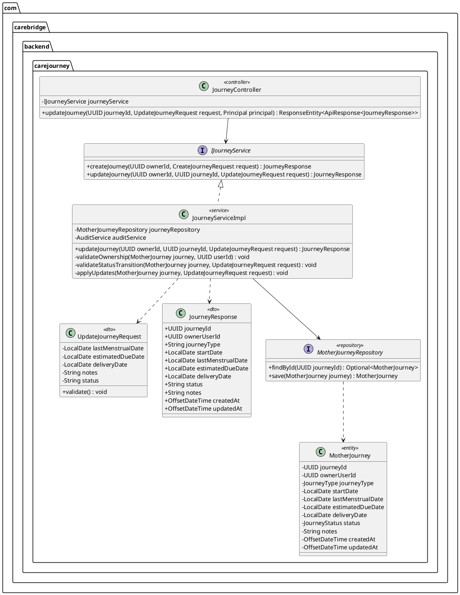
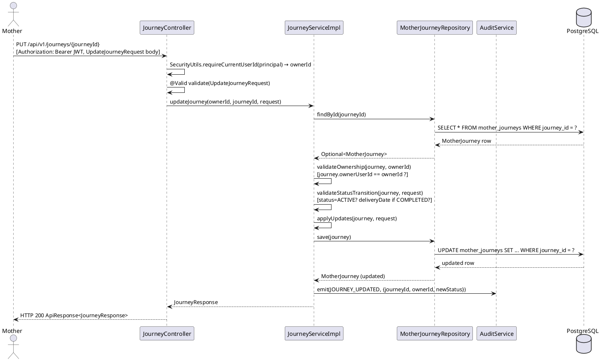
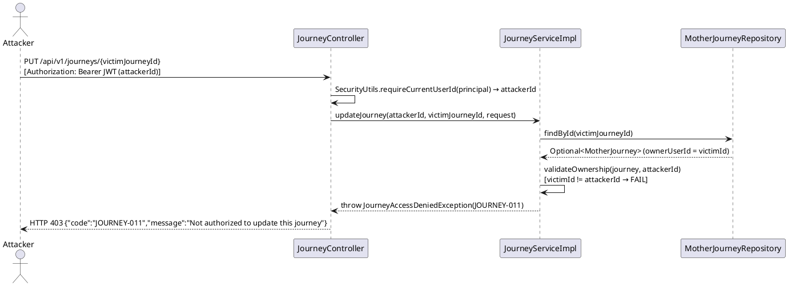

# Technical Design Specification — UC23: Update Mother Journey

| Field            | Value                                      |
|------------------|--------------------------------------------|
| Document ID      | CB-JOURNEY-IMP-002                         |
| Version          | 1.0                                        |
| Date             | 2026-06-27                                 |
| Status           | Approved                                   |
| Document Owner   | PhuongNT                                   |
| Author           | AI Agent — Amelia (Dev Agent)              |
| Based on EDS     | v2.0                                       |
| SRS Reference    | SRS 3.3.1.2 — Update Mother Journey        |
| Related UC       | UC22 (Create Journey), UC24 (Dashboard)    |

---

## 1. Tổng Quan (Overview)

### 1.1 Mô Tả Use Case

UC23 cho phép người dùng có vai trò **ROLE_MOTHER** cập nhật thông tin chuyến hành trình thai kỳ của chính mình. Các trường có thể cập nhật bao gồm ngày kinh cuối (`last_menstrual_date`), ngày dự sinh (`estimated_due_date`), ngày sinh (`delivery_date`), trạng thái (`status`), và ghi chú (`notes`). Người dùng **không thể** thay đổi loại hành trình (`journey_type`) hoặc chủ sở hữu (`owner_user_id`).

### 1.2 Bounded Context

| Property         | Value                                         |
|------------------|-----------------------------------------------|
| Bounded Context  | `journey`                                     |
| Package          | `com.carebridge.backend.carejourney`          |
| HTTP Method      | PUT                                           |
| Endpoint         | `/api/v1/journeys/{journeyId}`                |
| Platform         | Mobile App                                    |
| Actor            | Mother (ROLE_MOTHER)                          |

### 1.3 Mutable vs. Immutable Fields

| Field               | Mutable by User | Notes                                    |
|---------------------|-----------------|------------------------------------------|
| `last_menstrual_date` | Yes           | Optional update                          |
| `estimated_due_date`  | Yes           | Must be after lastMenstrualDate if both set |
| `delivery_date`       | Yes           | Required when status → COMPLETED         |
| `status`              | Yes (partial) | Only ACTIVE→COMPLETED; ARCHIVED is system-only |
| `notes`               | Yes           | Max 2000 chars                           |
| `journey_type`        | No            | Immutable after creation                 |
| `owner_user_id`       | No            | Immutable — always from JWT              |

---

## 2. Traceability

### 2.1 SRS Requirements

| SRS ID         | Description                                                                   |
|----------------|-------------------------------------------------------------------------------|
| SRS-3.3.1.2    | Update Mother Journey — Updates LMP, expected due date, birth date, or status |

### 2.2 Business Rules

| Rule ID          | Description                                                                              | Enforcement Layer           |
|------------------|------------------------------------------------------------------------------------------|-----------------------------|
| BR-JOURNEY-010   | Mother can only update her own journeys (owner_user_id == userId from JWT)               | JourneyServiceImpl          |
| BR-JOURNEY-011   | Cannot update a COMPLETED or ARCHIVED journey — only ACTIVE journeys may be updated      | JourneyServiceImpl          |
| BR-JOURNEY-012   | `delivery_date` is required when changing status to COMPLETED                            | JourneyServiceImpl          |
| BR-JOURNEY-013   | `estimated_due_date` must be after `last_menstrual_date` if both are provided            | UpdateJourneyRequest (Bean Validation + service) |
| BR-JOURNEY-014   | Emit audit event `JOURNEY_UPDATED` on every successful update                            | JourneyServiceImpl → AuditService |
| BR-RBAC          | Only authenticated users with ROLE_MOTHER may call this endpoint                        | Spring Security              |
| BR-PRIVACY       | Journey data is personal health information — enforce ownership check before access      | JourneyServiceImpl          |

### 2.3 Non-Functional Requirements

| ID     | Requirement                                            |
|--------|--------------------------------------------------------|
| NFR-01 | Response latency P95 < 300 ms under normal load        |
| NFR-02 | Sensitive health data — TLS required for all transport |
| NFR-03 | Audit trail required for all state mutations           |

---

## 3. Architectural Decision Records (ADRs)

### ADR-JOURNEY-002-001: PUT Semantics (Full Replace of Mutable Fields)

**Decision:** Use `PUT` (not `PATCH`) — the client sends all mutable fields; any field sent as `null` is stored as `null` (except fields with server-enforced rules).

**Rationale:** Mobile clients benefit from simpler state management — they always send the full current form state rather than computing a diff. PATCH's partial-update semantics introduce edge cases (null vs. absent) that are error-prone on mobile.

**Consequence:** Client must always include all mutable fields it wants to preserve. Fields omitted (null) are cleared from DB unless service applies keep-existing logic for null-protected fields.

---

### ADR-JOURNEY-002-002: Status Transition — ACTIVE → COMPLETED Requires delivery_date

**Decision:** Transitioning `status` to `COMPLETED` is only accepted when `delivery_date` is non-null in the request.

**Rationale:** A completed journey without a delivery date would leave the domain model in an inconsistent state and prevent downstream analytics on birth outcomes.

**Consequence:** Clients must capture delivery date before marking a pregnancy journey complete.

---

### ADR-JOURNEY-002-003: ARCHIVED Status is System-Only

**Decision:** Users cannot set `status = ARCHIVED` through this endpoint. Attempts to do so are rejected with HTTP 400.

**Rationale:** Archival is a system lifecycle operation (e.g., triggered by admin cleanup jobs) — not a user action. Exposing it to the user could cause irreversible data hiding.

**Consequence:** JourneyServiceImpl validates that any user-supplied status is one of `{ACTIVE, COMPLETED}`.

---

## 4. Non-Functional Requirements Detail

| ID      | Metric               | Target            | Measurement                    |
|---------|----------------------|-------------------|--------------------------------|
| NFR-01  | P95 Latency          | < 300 ms          | APM trace on PUT endpoint      |
| NFR-02  | Transport Security   | TLS 1.2+          | HTTPS enforced in API Gateway  |
| NFR-03  | Audit Log            | 100% of updates   | AuditService.emit() call count |
| NFR-04  | Input Validation     | All fields validated before DB write | Bean Validation + custom service checks |

---

## 5. Static Modeling



---

## 6. Dynamic Modeling

### 6.1 Happy Path — Successful Update



### 6.2 Error Path — Wrong Owner (IDOR Attempt)



---

## 7. Domain Events

| Event Name        | Trigger                                    | Payload                                               | Consumer              |
|-------------------|--------------------------------------------|-------------------------------------------------------|-----------------------|
| `JOURNEY_UPDATED` | Successful PUT /api/v1/journeys/{journeyId} | `{journeyId, userId, oldStatus, newStatus, timestamp}` | AuditService, Notification (future) |

Event emission is synchronous within the same transaction via `AuditService.emit()`. No async queue is used in MVP.

---

## 8. Interface Specification

### 8.1 UpdateJourneyRequest DTO

```java
package com.carebridge.backend.carejourney.dto;

import com.fasterxml.jackson.annotation.JsonFormat;
import jakarta.validation.constraints.Size;
import lombok.Data;
import java.time.LocalDate;

@Data
public class UpdateJourneyRequest {

    @JsonFormat(pattern = "yyyy-MM-dd")
    private LocalDate lastMenstrualDate;

    @JsonFormat(pattern = "yyyy-MM-dd")
    private LocalDate estimatedDueDate;

    @JsonFormat(pattern = "yyyy-MM-dd")
    private LocalDate deliveryDate;

    @Size(max = 2000, message = "Notes must not exceed 2000 characters")
    private String notes;

    /**
     * User-settable statuses: ACTIVE, COMPLETED only.
     * ARCHIVED is system-only and will be rejected.
     */
    private String status;
}
```

### 8.2 IJourneyService — updateJourney Method

```java
package com.carebridge.backend.carejourney.service;

import com.carebridge.backend.carejourney.dto.JourneyResponse;
import com.carebridge.backend.carejourney.dto.UpdateJourneyRequest;
import java.util.UUID;

public interface IJourneyService {

    /**
     * UC22 — Create a new mother journey.
     */
    JourneyResponse createJourney(UUID ownerId, CreateJourneyRequest request);

    /**
     * UC23 — Update an existing mother journey.
     *
     * @param ownerId    UUID extracted from JWT; used for ownership verification
     * @param journeyId  UUID from URL path
     * @param request    Mutable fields to apply
     * @return           Updated JourneyResponse
     * @throws JourneyNotFoundException      if journeyId does not exist (JOURNEY-010)
     * @throws JourneyAccessDeniedException  if ownerId != journey.ownerUserId (JOURNEY-011)
     * @throws JourneyStateException         if journey status is not ACTIVE (JOURNEY-012)
     *                                       or deliveryDate missing for COMPLETED (JOURNEY-013)
     */
    JourneyResponse updateJourney(UUID ownerId, UUID journeyId, UpdateJourneyRequest request);
}
```

### 8.3 JourneyController — PUT Endpoint Signature

```java
@PutMapping("/{journeyId}")
@PreAuthorize("hasRole('MOTHER')")
public ResponseEntity<ApiResponse<JourneyResponse>> updateJourney(
        @PathVariable UUID journeyId,
        @Valid @RequestBody UpdateJourneyRequest request,
        Principal principal) {

    UUID ownerId = SecurityUtils.requireCurrentUserId(principal);
    JourneyResponse response = journeyService.updateJourney(ownerId, journeyId, request);
    return ResponseEntity.ok(ApiResponse.success(response));
}
```

---

## 9. API Specification

### 9.1 Endpoint

| Property        | Value                                |
|-----------------|--------------------------------------|
| Method          | PUT                                  |
| Path            | `/api/v1/journeys/{journeyId}`       |
| Authentication  | Bearer JWT (ROLE_MOTHER)             |
| Content-Type    | `application/json`                   |
| Idempotent      | Yes (PUT semantics)                  |

### 9.2 Path Parameters

| Parameter    | Type   | Required | Description                  |
|--------------|--------|----------|------------------------------|
| `journeyId`  | UUID   | Yes      | ID of the journey to update  |

### 9.3 Request Body

```json
{
  "lastMenstrualDate": "2025-12-01",
  "estimatedDueDate": "2026-09-07",
  "deliveryDate": null,
  "notes": "Feeling well, 20 weeks along.",
  "status": "ACTIVE"
}
```

### 9.4 Success Response — HTTP 200

```json
{
  "success": true,
  "message": "Journey updated successfully",
  "data": {
    "journeyId": "cccccccc-0000-0000-0000-000000000023",
    "ownerUserId": "00000000-0000-0000-0000-000000000023",
    "journeyType": "PREGNANCY",
    "startDate": "2026-01-01",
    "lastMenstrualDate": "2025-12-01",
    "estimatedDueDate": "2026-09-07",
    "deliveryDate": null,
    "status": "ACTIVE",
    "notes": "Feeling well, 20 weeks along.",
    "createdAt": "2026-01-01T00:00:00Z",
    "updatedAt": "2026-06-26T10:00:00Z"
  }
}
```

### 9.5 Complete Journey — Request Body

```json
{
  "lastMenstrualDate": "2025-12-01",
  "estimatedDueDate": "2026-09-07",
  "deliveryDate": "2026-09-05",
  "notes": "Baby delivered safely.",
  "status": "COMPLETED"
}
```

### 9.6 Error Responses

| Scenario                           | HTTP | Error Code    | Message                                        |
|------------------------------------|------|---------------|------------------------------------------------|
| Journey not found                  | 404  | JOURNEY-010   | Journey not found                              |
| Not owner of this journey          | 403  | JOURNEY-011   | Not authorized to update this journey          |
| Journey is COMPLETED or ARCHIVED   | 400  | JOURNEY-012   | Cannot update a completed or archived journey  |
| status=COMPLETED, no deliveryDate  | 400  | JOURNEY-013   | delivery_date is required to complete journey  |
| Invalid status value (e.g. ARCHIVED by user) | 400 | JOURNEY-014 | Invalid status transition                   |
| No JWT / expired token             | 401  | —             | Unauthorized                                   |

---

## 10. Error Codes

| Code        | HTTP | Description                                              | Recovery Hint                                    |
|-------------|------|----------------------------------------------------------|--------------------------------------------------|
| JOURNEY-010 | 404  | Journey with the given ID does not exist                 | Verify journeyId; call GET /journeys/me first    |
| JOURNEY-011 | 403  | Caller is not the owner of this journey                  | Use the journey belonging to the authenticated user |
| JOURNEY-012 | 400  | Journey status is COMPLETED or ARCHIVED — no updates allowed | Create a new journey if needed               |
| JOURNEY-013 | 400  | `delivery_date` is required when setting status to COMPLETED | Provide delivery_date in request body        |
| JOURNEY-014 | 400  | User attempted to set status to ARCHIVED (system-only)   | Only ACTIVE or COMPLETED are valid user statuses |

---

## 11. Implementation Plan

### 11.1 Files to Create / Modify

| File                                                                                   | Action   | Notes                                           |
|----------------------------------------------------------------------------------------|----------|-------------------------------------------------|
| `UpdateJourneyRequest.java`                                                             | Create   | DTO with Bean Validation annotations             |
| `IJourneyService.java`                                                                  | Modify   | Add `updateJourney()` method signature           |
| `JourneyServiceImpl.java`                                                               | Modify   | Implement `updateJourney()` with all business rules |
| `JourneyController.java`                                                                | Modify   | Add `PUT /{journeyId}` endpoint                  |
| `JourneyNotFoundException.java`                                                         | Create   | Maps to JOURNEY-010 / 404                        |
| `JourneyAccessDeniedException.java`                                                     | Create   | Maps to JOURNEY-011 / 403                        |
| `JourneyStateException.java`                                                            | Create   | Maps to JOURNEY-012, JOURNEY-013 / 400           |
| `GlobalExceptionHandler.java`                                                           | Modify   | Add handlers for new exception types             |

### 11.2 No Database Migration Required

The `mother_journeys` table (V1 migration) already contains all required columns. No Flyway migration is needed for UC23.

### 11.3 Implementation Steps

```
1. Create UpdateJourneyRequest DTO
2. Add updateJourney() signature to IJourneyService
3. Implement JourneyServiceImpl.updateJourney():
   a. findById(journeyId) → Optional; throw JOURNEY-010 if empty
   b. Check journey.ownerUserId == ownerId → throw JOURNEY-011 if mismatch
   c. Check journey.status == ACTIVE → throw JOURNEY-012 if not
   d. If request.status == "ARCHIVED" → throw JOURNEY-014
   e. If request.status == "COMPLETED" && request.deliveryDate == null → throw JOURNEY-013
   f. If both lastMenstrualDate and estimatedDueDate provided → validate estimatedDueDate.isAfter(lastMenstrualDate)
   g. Apply updates: set all mutable fields from request
   h. journeyRepository.save(journey)
   i. auditService.emit(JOURNEY_UPDATED, payload)
   j. return JourneyMapper.toResponse(updated)
4. Add PUT /{journeyId} to JourneyController
5. Register new exception handlers in GlobalExceptionHandler
```

---

## 12. Rollback Plan

| Scenario                    | Rollback Steps                                                                 |
|-----------------------------|--------------------------------------------------------------------------------|
| Code defect post-deployment | Revert commits on `PhuongNT` branch; no DB migration to roll back              |
| Data corruption             | Restore `mother_journeys` from pre-deployment snapshot; no structural change   |
| Emergency                   | Feature flag / disable PUT endpoint in API Gateway routing rules               |

---

## 13. Test Scenarios Summary

Full test cases are defined in `UC23_UpdateMotherJourney_Test-Spec.md` (CB-JOURNEY-IMP-002-TEST).

| Test ID                  | Type        | Description                                      | Expected Result |
|--------------------------|-------------|--------------------------------------------------|-----------------|
| JOURNEY-TC-023-001       | Unit        | Update notes + estimatedDueDate (happy path)     | HTTP 200        |
| JOURNEY-TC-023-002       | Unit        | Complete journey with deliveryDate               | HTTP 200, status=COMPLETED |
| JOURNEY-TC-023-003       | Unit        | Complete journey without deliveryDate            | HTTP 400 JOURNEY-013 |
| JOURNEY-TC-023-004       | Unit        | Update another user's journey (IDOR)             | HTTP 403 JOURNEY-011 |
| JOURNEY-TC-023-005       | Unit        | Journey ID not found                             | HTTP 404 JOURNEY-010 |
| JOURNEY-TC-023-006       | Unit        | Update a COMPLETED journey                       | HTTP 400 JOURNEY-012 |
| JOURNEY-TC-023-007       | Unit        | No JWT token                                     | HTTP 401        |
| JOURNEY-TC-023-INT-001   | Integration | DB updated_at changes, status stored correctly   | DB row verified  |

---

## 14. Verification SQL

After executing an update, verify the database state:

```sql
-- Verify updated_at changed and new status/fields are stored
SELECT
    journey_id,
    status,
    last_menstrual_date,
    estimated_due_date,
    delivery_date,
    notes,
    updated_at
FROM mother_journeys
WHERE journey_id = '[journey-uuid]';

-- Verify owner has not changed (immutability check)
SELECT owner_user_id, journey_type
FROM mother_journeys
WHERE journey_id = '[journey-uuid]';
```

---

## 15. API Sample (cURL)

### Update Notes and Estimated Due Date

```bash
curl -X PUT "https://api.carebridge.local/api/v1/journeys/cccccccc-0000-0000-0000-000000000023" \
  -H "Authorization: Bearer <JWT_TOKEN>" \
  -H "Content-Type: application/json" \
  -d '{
    "lastMenstrualDate": "2025-12-01",
    "estimatedDueDate": "2026-09-07",
    "deliveryDate": null,
    "notes": "All checkups normal. Week 20.",
    "status": "ACTIVE"
  }'
```

### Complete a Journey

```bash
curl -X PUT "https://api.carebridge.local/api/v1/journeys/cccccccc-0000-0000-0000-000000000023" \
  -H "Authorization: Bearer <JWT_TOKEN>" \
  -H "Content-Type: application/json" \
  -d '{
    "lastMenstrualDate": "2025-12-01",
    "estimatedDueDate": "2026-09-07",
    "deliveryDate": "2026-09-05",
    "notes": "Baby delivered, 3.2kg healthy.",
    "status": "COMPLETED"
  }'
```

### Attempt Without Auth (Expect 401)

```bash
curl -X PUT "https://api.carebridge.local/api/v1/journeys/cccccccc-0000-0000-0000-000000000023" \
  -H "Content-Type: application/json" \
  -d '{"notes": "test"}'
# Expected: HTTP 401 Unauthorized
```

---

## 16. Authorization Matrix

| Role         | Own Journey | Other's Journey | Notes                           |
|--------------|-------------|------------------|---------------------------------|
| ROLE_MOTHER  | Allowed     | Denied (403)     | Ownership enforced in service   |
| ROLE_EXPERT  | Denied      | Denied           | Experts cannot modify journeys  |
| ROLE_ADMIN   | Denied      | Denied           | Admin uses internal tooling     |
| GUEST        | Denied      | Denied           | No JWT → 401                   |

---

## 17. CASE 2.0 Safety Constraints

| Constraint | ID | Description                                                                                   | Enforcement Point         |
|------------|----|-----------------------------------------------------------------------------------------------|---------------------------|
| C1         | BR-JOURNEY-010 | Verify `owner_user_id == JWT userId` before ANY mutation — prevents IDOR attacks        | `JourneyServiceImpl.validateOwnership()` |
| C2         | BR-JOURNEY-011 | Check `journey.status == ACTIVE` before allowing update — prevents mutation of closed journeys | `JourneyServiceImpl.validateStatusTransition()` |
| C3         | BR-JOURNEY-012 | If `request.status == COMPLETED`, then `request.deliveryDate` must not be null                | `JourneyServiceImpl.validateStatusTransition()` |
| C4         | —              | `journey_type` and `owner_user_id` are never updated — applied fields whitelist in `applyUpdates()` | `JourneyServiceImpl.applyUpdates()` |
| C5         | BR-JOURNEY-014 | Emit `JOURNEY_UPDATED` audit event after every successful save                                | `JourneyServiceImpl` → `AuditService.emit()` |

---

*End of CB-JOURNEY-IMP-002 — UC23 Update Mother Journey TDS v1.0*

## Story 6.10 OV-01 Traceability Addendum

| OV-01 branch | Story AC | Canonical decision | Test-Spec contract | Executable evidence |
| --- | --- | --- | --- | --- |
| `OV01-B03/B04` dating/outcome revision | Story 6.3 AC1-AC5 | Outcome changes preserve provenance, actor, reason, old/new state and effective time; ongoing/unknown remain PREGNANCY, final outcomes enter POSTPARTUM under approved policy | `OV01-TS-23-001` | `JourneyPregnancyOutcomePolicyTest`, `PregnancyOutcomeServiceTest`, `PregnancyOutcomeIntegrationTest`, `PregnancyOutcomeConcurrencyIntegrationTest` |
| `OV01-B13` complete and preserve history | Story 6.10 AC2/AC5 | Eligible ACTIVE journey may become COMPLETED; completion is excluded from active selection and records a STATUS_CHANGED history event | `OV01-TS-23-002` | `JourneyCanonicalLifecycleIntegrationTest#ov01Be019_completionPersistsStatusHistoryAndRemovesActiveSelection` |
| `OV01-B14` archive boundary | Story 6.10 AC2/AC5 | User `ARCHIVED` remains rejected with `JOURNEY-014`; archived fixtures are inactive/immutable and retained history is not deleted. No production retention trigger is approved. | `OV01-TS-23-003` | unit user-rejection contract plus `JourneyCanonicalLifecycleIntegrationTest#ov01Be020_archivedFixtureIsInactiveImmutableAndPreservesHistory` |

### `OV01-DEC-ARCHIVE-001` — current-release archive boundary

`COMPLETED -> ARCHIVED` is `NOT_APPLICABLE` as an executable production transition in this release until a separately approved retention authority, threshold and trigger exist. Users may request eligible `ACTIVE -> COMPLETED`, but a user request for `ARCHIVED` remains rejected with `JOURNEY-014`. Completed or archived records are excluded from active selection, remain immutable through the user update path, and retain append-only history. The archived fixture test is boundary evidence, not a simulated system transition. Legal/DPO approval, a retention duration, and a production system trigger remain external decisions and are not inferred by this TDS.
