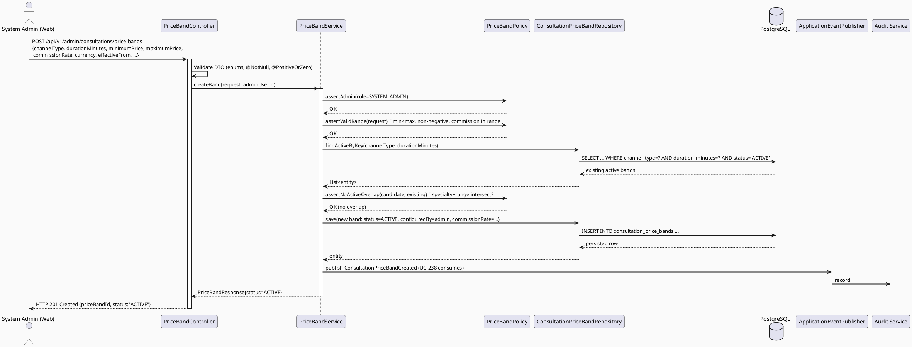
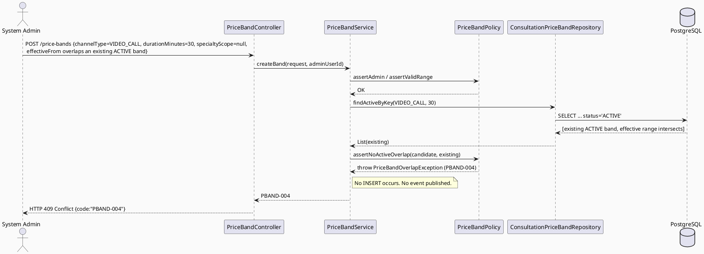
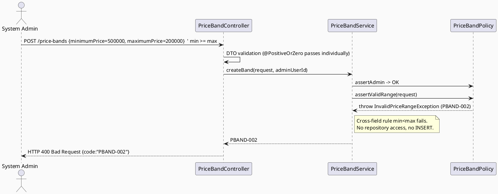
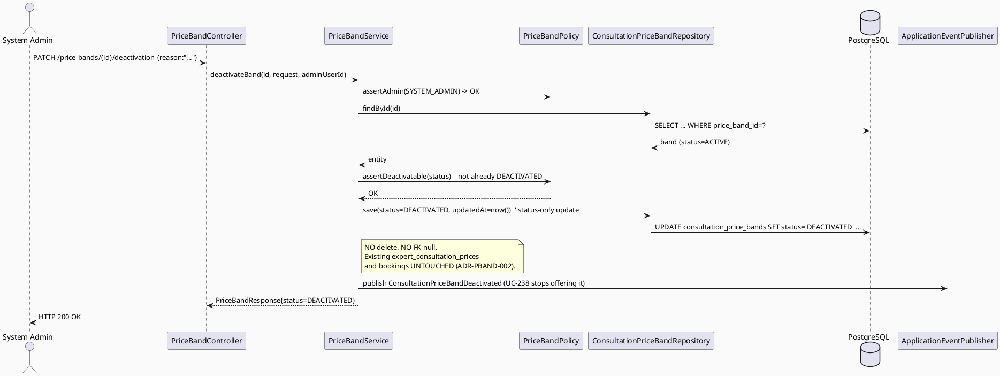
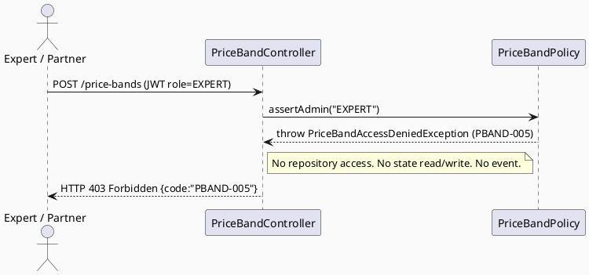
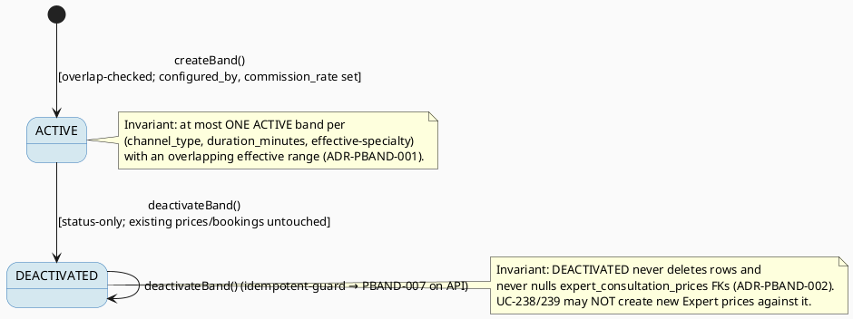

# ENGINEERING DOCUMENTATION STANDARD (EDS) v2.0
# UC-240 — Configure Consultation Price Bands — Technical Design Specification

| Field | Value |
|-------|-------|
| **Document ID** | `CB-CONSULTATION-IMP-240` |
| **Version** | `1.0` |
| **Date** | `2026-07-03` |
| **Status** | `Draft` |
| **Document Owner** | `TV4-Lâm` |
| **Author** | `AI Agent (Technical Architect)` |
| **Reviewed by** | `[Tech Lead — Pending]` |
| **DPO Sign-off** | `[ ] N/A` *(no personal data — price/commission configuration only; `configured_by` is an internal admin userId, not subject PII — see §1)* |
| **Approved by** | `[Principal Architect — Pending]` |
| **Last Review** | `2026-07-03` |
| **Based on EDS** | `v2.0` |

---

## CHANGELOG

> **Policy 4.4 — Immutable History:** Không bao giờ xóa thông tin cũ.

| Ngày | Người thực hiện | Nội dung thay đổi |
|------|-----------------|-------------------|
| 2026-07-03 | AI Agent — Technical Architect | Tạo tài liệu lần đầu (Draft) cho UC-240 — the **upstream** price-band configuration feature that UC-238 (Set Consultation Price) and UC-239 (Update Consultation Price) depend on for their min/max bounds and commission rate. Greenfield: no consultation-domain backend code exists yet. |

---

## MỤC LỤC

1. [Tổng quan Module](#1-tổng-quan-module)
2. [Ma trận Truy vết (Traceability Matrix)](#2-ma-trận-truy-vết-traceability-matrix)
3. [Architecture Decision Records (ADR)](#3-architecture-decision-records-adr)
4. [Non-Functional Requirements & SLA](#4-non-functional-requirements--sla)
5. [Static Modeling (Mô hình Tĩnh)](#5-static-modeling-mô-hình-tĩnh)
6. [Dynamic Modeling (Mô hình Động)](#6-dynamic-modeling-mô-hình-động)
7. [Domain Event Catalog](#7-domain-event-catalog)
8. [Interface Specification (Đặc tả Giao diện)](#8-interface-specification-đặc-tả-giao-diện)
9. [API Specification](#9-api-specification)
10. [Bảng mã lỗi (Error Codes)](#10-bảng-mã-lỗi-error-codes)
11. [Quy trình Triển khai (Step-by-Step)](#11-quy-trình-triển-khai-step-by-step)
12. [Rollback & Incident Runbook](#12-rollback--incident-runbook)
13. [Kịch bản Kiểm thử Chi tiết](#13-kịch-bản-kiểm-thử-chi-tiết)
14. [Phương pháp Xác minh](#14-phương-pháp-xác-minh)
15. [Mẫu thử thực tế (API Verification Samples)](#15-mẫu-thử-thực-tế-api-verification-samples)
16. [Bảng tổng hợp phân quyền (Authorization Matrix)](#16-bảng-tổng-hợp-phân-quyền-authorization-matrix)
17. [AI Prompt Constraints (CASE 2.0)](#17-ai-prompt-constraints-case-20)

---

## 1. Tổng quan Module

| Field | Value |
|-------|-------|
| **Module Name** | `Consultation — Configure Price Bands (Admin)` |
| **Bounded Context** | `Consultation` (package `com.carebridge.backend.consultation`) |
| **Function ID / UC** | `3.2.8.1 Configure Consultation Price Bands` / `UC-240` (SRS §3.2.8, Table 102) |
| **Primary Actor** | System Admin (only) |
| **Secondary Actor** | VNPay Payment Gateway (SRS — named as secondary actor; **not invoked by this UC** — see note below) |
| **Platform** | Admin Portal (Web — React + TypeScript + Vite) |
| **Priority** | Medium (SRS Table 102) |
| **Frequency of Use** | Regular (SRS Table 102) |
| **Sprint / Owner** | Consultation Pricing batch UC-238→UC-241 — TV4-Lâm |
| **Data Classification** | `Internal` (pricing/commission policy configuration — no subject health/family PII; `configured_by` is an admin userId only) |
| **Compliance Scope** | `BR-RBAC`, `BR-CONSULTATION` (auditable pricing lifecycle) — SRS Table 102 Business Rules |
| **Upstream Dependencies** | Identity/RBAC (`SYSTEM_ADMIN` role resolution) — schema-contract only |
| **Downstream Consumers** | **UC-238 Set Consultation Price** and **UC-239 Update Consultation Price** (both look up the applicable `consultation_price_bands` row via `price_band_id` to bound the Expert's `price_amount` and to inherit `commission_rate`), Notification/Audit |

### 1.1 Scope Statement — UC-240 is the UPSTREAM prerequisite of UC-238/UC-239

> ⚠️ **Dependency direction (firm):** UC-240 is the **producer** of price bands.
> UC-238 (Set Consultation Price) and UC-239 (Update Consultation Price) are
> **consumers** — each Expert price row (`expert_consultation_prices`) carries a
> **NOT NULL** `price_band_id` FK (`V1__init_schema.sql` L860) and must fall inside
> the band's `[minimum_price, maximum_price]`. UC-240 must exist and have at least
> one `ACTIVE` band before an Expert can set a price. This TDS is therefore the
> prerequisite spec for the whole pricing batch; UC-238/239 are drafted against the
> contract defined here (band lookup + commission inheritance).

UC-240 owns the full lifecycle of a `consultation_price_bands` row: **create** a
new band and **deactivate** an existing one. It is the **sole writer** of
`consultation_price_bands`.

### 1.2 Commission rate — single source of truth (confirmed batch decision)

> **Confirmed cross-cutting decision for the UC-238→UC-241 pricing batch (user-approved).**

`commission_rate` is set **HERE**, on the price band. It is the **sole source of
truth** for platform commission. UC-238/UC-239 **never set and never read**
`commission_rate` directly — they only reference the band by `price_band_id` and
inherit the commission transitively. Downstream, `consultation_bookings` snapshots
the commission at booking time into `commission_rate_snapshot`
(`V1__init_schema.sql` L892) — that snapshot is derived from the band via the
Expert price, not from any commission field UC-238/239 own. See ADR-PBAND-005.

### 1.3 Note on the "VNPay" secondary actor

The SRS lists VNPay as a secondary actor for the whole `3.2.8 Consultation Pricing
& Commission` group. **UC-240 itself does not call VNPay** — it only stores the
commission-rate policy that later governs how VNPay-settled booking payments are
split. No `VnPayGatewayClient` is constructed or invoked by this module (mirrors
the financial-safety posture of UC-209/UC-210: configuration is decoupled from
money movement). Marked as a deliberate scope exclusion, not an omission.

---

## 2. Ma trận Truy vết (Traceability Matrix)

| Requirement ID | Loại (BR/ADR/US) | Mô tả yêu cầu | Thành phần Code | Compliance Target | ADR liên quan |
|----------------|------------------|---------------|-----------------|-------------------|---------------|
| UC-240 (SRS §3.2.8.1, Table 102) | Use Case | Admin manages platform price limits and commission rates by consultation modality and duration | `PriceBandController`, `PriceBandService.createBand()/deactivateBand()` | BR-CONSULTATION | ADR-PBAND-001..006 |
| BR-RBAC (SRS Table 102) | Business Rule | Only `SYSTEM_ADMIN` may configure price bands | `PriceBandPolicy.assertAdmin()` | Authorization | ADR-PBAND-004 |
| BR-CONSULTATION (SRS Table 102) | Business Rule | Pricing actions keep an auditable lifecycle state (`ACTIVE`/`DEACTIVATED`; append-of-status) | `PriceBandEntity.status`, `ConsultationPriceBandCreated`/`ConsultationPriceBandDeactivated` events | BR-AUDIT | ADR-PBAND-002 |
| ADR-PBAND-001 | Decision | Reject a new ACTIVE band overlapping an existing ACTIVE band (same channel+duration+specialtyScope, overlapping effective range) | `PriceBandPolicy.assertNoActiveOverlap()` | BR-CONSULTATION | — |
| ADR-PBAND-002 | Decision | Deactivation does NOT cascade — existing Expert prices/bookings referencing the band stay valid; only NEW Expert prices are blocked | `PriceBandService.deactivateBand()` (status-only update) | BR-CONSULTATION | — |
| ADR-PBAND-003 | Decision | `specialty_scope = NULL` means "applies to ALL specialties" (universal band) | `PriceBandPolicy` overlap/lookup logic treats NULL as universal | — | — |
| ADR-PBAND-004 | Decision | UC-240 is `SYSTEM_ADMIN`-only (distinct from the Expert-role gates of UC-238/239) | `PriceBandPolicy.assertAdmin()` | BR-RBAC | — |
| ADR-PBAND-005 | Decision | `commission_rate` lives on the band and is the sole source of truth; UC-238/239 inherit via `price_band_id`, never set it | `PriceBandEntity.commissionRate` (written only here) | BR-CONSULTATION | — |
| ADR-PBAND-006 | Decision | Price ranges validated: `minimum_price ≥ 0`, `maximum_price ≥ 0`, `minimum_price < maximum_price`; `commission_rate` is a fraction within `[0.0, 0.5]` (e.g. `0.15` = 15%) | `PriceBandPolicy.assertValidRange()` | — | — |
| CB-217 mockup (configure form) | UI Oracle | Channel radios Video/Voice/Chat; duration 15/30/45/60; min/max price (VND); commission slider 0–50% (default 15, "platform default 10–20%"); effective from–to; note | `CreatePriceBandRequest` field set + validation | — | ADR-PBAND-006 |
| CB-216 mockup (list) | UI Oracle | Columns: channel, duration, price min–max, commission, effective period, status, version, actions | `PriceBandController.GET /price-bands` (read view) | — | — |
| CB-218 mockup (deactivate confirm) | UI Oracle | "Prevents Experts creating new prices under this band. Prices already set and bookings already made are **NOT** affected." | `PriceBandService.deactivateBand()` copy/behavior | — | ADR-PBAND-002 |
| Schema: `consultation_price_bands` (`V1__init_schema.sql` L842-859) | Schema Contract | Persistence of all band fields | `PriceBandEntity` | — | — |
| Schema: `expert_consultation_prices.price_band_id` NOT NULL (`V1__init_schema.sql` L860) | Schema Contract | FK proving UC-238/239 depend on a band existing | Referential-integrity basis for ADR-PBAND-002 | — | — |

---

## 3. Architecture Decision Records (ADR)

> All ADRs below are **new** to UC-240 (greenfield — no prior consultation-pricing
> code or ADRs exist). Values sourced from SRS Table 102, the CB-216/217/218
> mockups, and `V1__init_schema.sql`. Unsourced items are marked `Open`.

### ADR-PBAND-001 — Reject creation of a new ACTIVE band that overlaps an existing ACTIVE band

| Field | Value |
|-------|-------|
| **Status** | `Accepted` *(necessary for UC-238's unambiguous band lookup — firm design decision)* |
| **Deciders** | `AI Agent (proposal) — pending TV4-Lâm / Tech Lead confirmation` |
| **Date** | `2026-07-03` |

#### Bối cảnh (Context)
When an Expert sets a price (UC-238), the system must resolve **exactly one**
applicable price band for a given `(channel_type, duration_minutes, specialty)` at a
given moment, to obtain the min/max bounds and the commission rate. If two `ACTIVE`
bands with the same key had overlapping effective ranges, the lookup would be
ambiguous and commission attribution would be non-deterministic.

#### Các phương án đã xem xét (Options Considered)

| Phương án | Mô tả | Ưu điểm | Nhược điểm |
|-----------|-------|----------|------------|
| A | Allow overlaps; let UC-238 pick "latest `effective_from`" | Fewer create-time checks | Silent ambiguity; commission depends on tie-break rule; hard to audit |
| B | **Reject at create time any new `ACTIVE` band whose `(channel_type, duration_minutes, specialty_scope)` key matches an existing `ACTIVE` band with an overlapping `[effective_from, effective_to)` range (`effective_to = NULL` = open-ended)** | Deterministic single-band lookup for UC-238; overlap error surfaced to the admin immediately (`PBAND-004`) | Admin must deactivate/expire the old band before creating a replacement (supersession workflow) |
| C | Enforce via a DB exclusion constraint (`btree_gist`) | DB-guaranteed | Requires a new migration + `btree_gist` extension; NULL `specialty_scope`/`effective_to` semantics are awkward in an exclusion constraint; heavier than needed for an Admin-only, low-frequency write |

#### Quyết định (Decision)
Chọn **Phương án B** — application-level overlap rejection in
`PriceBandPolicy.assertNoActiveOverlap()`. Two bands **overlap** iff: same
`channel_type` AND same `duration_minutes` AND same effective-`specialty_scope`
(NULL treated as universal — see ADR-PBAND-003) AND their `[effective_from,
effective_to)` intervals intersect (open-ended when `effective_to` is NULL). A
matching overlap on an `ACTIVE` band → reject with `PBAND-004` (409). Deactivated
bands never participate in the overlap check.

#### Hệ quả (Consequences)
**Tích cực:** UC-238 band lookup is guaranteed to return at most one band; deterministic commission. This write-time guarantee also **resolves** the "tie-break for multiple overlapping same-scope active bands" concern `UC238_SetConsultationPrice_TDS.md` ADR-SETPR-006 previously flagged as `Open` — since this ADR rejects overlapping ACTIVE bands sharing the same `(channel_type, duration_minutes, specialty_scope)` key at creation time, UC-238's lookup can never encounter two ambiguous same-scope candidates (see UC-238 ADR-SETPR-006 for the corresponding resolution on that side).
**Tiêu cực / Trade-offs:** No DB-level guarantee (a concurrent double-create could theoretically both pass the check). Given Admin-only, low-frequency writes this is acceptable; a `SELECT ... FOR UPDATE` guard or serializable transaction is recommended (marked `Open` — Tech Lead to confirm concurrency posture; this residual concurrency-hardening item is distinct from the band-selection ambiguity, which is resolved).
**Compliance Impact:** Supports auditable, unambiguous pricing (BR-CONSULTATION).

---

### ADR-PBAND-002 — Deactivation does NOT cascade to existing Expert prices or bookings

| Field | Value |
|-------|-------|
| **Status** | `Accepted` *(directly confirmed by the CB-218 confirmation-dialog copy)* |
| **Deciders** | `AI Agent — derived from CB-218 mockup + referential-integrity reasoning` |
| **Date** | `2026-07-03` |

#### Bối cảnh (Context)
`expert_consultation_prices.price_band_id` is a **NOT NULL** column
(`V1__init_schema.sql` L860) — every Expert price permanently references the band it
was created under. If deactivating a band deleted it or nulled that FK, existing
Expert prices and the bookings snapshotted from them would break. The CB-218 dialog
states verbatim: *"Hành động này sẽ ngăn chuyên gia tạo giá mới theo khung này. Các
mức giá đã được chuyên gia thiết lập và các lịch hẹn đã đặt sẽ **KHÔNG** bị ảnh
hưởng."* ("This action prevents Experts from creating new prices under this band.
Prices already set by Experts and bookings already made will **NOT** be affected.")

#### Quyết định (Decision)
Deactivation is a **status-only** update: `status` `ACTIVE → DEACTIVATED`, set
`effective_to = now()` if still open-ended (optional — marked `Open`), touch
`updated_at`. **No row is deleted; no FK is nulled.** Existing
`expert_consultation_prices` rows keep their `price_band_id` and remain valid;
existing `consultation_bookings` are unaffected (they already carry
`price_snapshot_amount` / `commission_rate_snapshot`). Deactivation's only forward
effect: UC-238/239 must refuse to create a **new** Expert price against a
non-`ACTIVE` band.

#### Hệ quả (Consequences)
**Tích cực:** Referential integrity preserved; historical prices/bookings stay intact and auditable; matches the mockup's user-facing promise.
**Tiêu cực / Trade-offs:** A deactivated band's data lingers (by design — it is history, not garbage).
**Compliance Impact:** Auditable lifecycle (BR-CONSULTATION); no data loss.

---

### ADR-PBAND-003 — `specialty_scope = NULL` means "applies to ALL specialties"

| Field | Value |
|-------|-------|
| **Status** | `Accepted` *(interpretation of the nullable schema column; firm design decision)* |
| **Deciders** | `AI Agent — derived from schema + CB-217 (form has no specialty picker → universal default)` |
| **Date** | `2026-07-03` |

#### Bối cảnh (Context)
`consultation_price_bands.specialty_scope` is `varchar(100)` **NULLABLE**
(`V1__init_schema.sql` L847). The CB-217 configuration form exposes only channel,
duration, price, commission, and effective dates — **no specialty selector** —
implying the common case is a specialty-agnostic (universal) band. The schema must
still support specialty-specific bands (the column exists), so NULL vs. a value must
have a defined meaning.

#### Quyết định (Decision)
`specialty_scope = NULL` is interpreted as **"applies to all specialties"** (a
universal band). A non-null value scopes the band to that specific specialty. This
interpretation is used consistently in (a) the overlap check (ADR-PBAND-001 — a
universal band overlaps any same-channel/duration band regardless of the other's
specialty) and (b) UC-238's downstream band lookup. **Resolved (cross-doc audit):**
`UC238_SetConsultationPrice_TDS.md` ADR-SETPR-006 (now `Accepted`) confirms the
exact precedence: a specialty-specific ACTIVE band takes precedence over a
universal (NULL-scope) band for the same channel+duration, following the standard
"most-specific-match-wins" design rationale used across rule/config resolution
systems. UC-240 guarantees the NULL-means-universal semantics; UC-238 owns and has
now fixed the precedence order — the two documents are consistent, not left
ambiguous in either.

#### Hệ quả (Consequences)
**Tích cực:** One firm, documented meaning for NULL; overlap logic is well-defined; specific-over-universal precedence is now a firm, cited decision in both this document and UC-238's.
**Tiêu cực / Trade-offs:** None material — precedence is UC-238-owned but now resolved, not merely deferred.
**Compliance Impact:** None.

---

### ADR-PBAND-004 — UC-240 is `SYSTEM_ADMIN`-only (Admin-role gate, distinct from UC-238/239's Expert gate)

| Field | Value |
|-------|-------|
| **Status** | `Accepted` *(SRS Table 102 Primary Actor = System Admin; BR-RBAC)* |
| **Deciders** | `AI Agent — from SRS + BR-RBAC` |
| **Date** | `2026-07-03` |

#### Bối cảnh (Context)
SRS Table 102 names the Primary Actor strictly as **System Admin**. This is a
platform-governance action (setting price ceilings/floors and commission for the
whole marketplace), the inverse of UC-238/239 which are **Expert**-role actions
(an Expert setting *their own* price within the band). Confusing the two gates would
let an Expert alter platform commission — a critical authorization defect.

#### Quyết định (Decision)
All UC-240 endpoints require role `SYSTEM_ADMIN`, enforced in
`PriceBandPolicy.assertAdmin()`. Experts, Partners, Moderators, and Content-Admins
are denied `403 PBAND-005`. (`MODERATOR`/`CONTENT_ADMIN` scope is **not** named by
the SRS and is conservatively denied — flagged `Open` for Product confirmation.)

#### Hệ quả (Consequences)
**Tích cực:** Clear separation of platform-governance (Admin) vs. per-Expert pricing (Expert).
**Tiêu cực / Trade-offs:** If Product later wants a pricing-manager sub-role, an ADR update is needed.
**Compliance Impact:** Least-privilege (BR-RBAC).

---

### ADR-PBAND-005 — `commission_rate` is owned by the band and is the sole source of truth

| Field | Value |
|-------|-------|
| **Status** | `Accepted` *(confirmed batch decision, user-approved)* |
| **Deciders** | `Product/Tech Lead (confirmed) — transcribed by AI Agent` |
| **Date** | `2026-07-03` |

#### Bối cảnh (Context)
Commission could conceptually be set per-band, per-Expert-price, or per-booking. If
more than one layer could set it, attribution would be ambiguous and an Expert could
influence platform revenue. The pricing batch confirmed a single owner.

#### Quyết định (Decision)
`commission_rate` is written **only** by UC-240, on `consultation_price_bands`.
UC-238/239 **never** expose, set, or read a commission field — they reference the
band via `price_band_id` and inherit commission transitively. At booking time,
`consultation_bookings.commission_rate_snapshot` captures the effective rate derived
from the band (via the Expert price), freezing it for that booking. UC-240 never
writes `expert_consultation_prices` or `consultation_bookings`.

#### Hệ quả (Consequences)
**Tích cực:** Single-writer discipline for commission; deterministic revenue split; Experts cannot alter commission.
**Tiêu cực / Trade-offs:** Changing commission requires an Admin band change (by design — governance).
**Compliance Impact:** Auditable, tamper-resistant commission policy (BR-CONSULTATION).

---

### ADR-PBAND-006 — Price/commission validation rules (`commission_rate` = fraction in `[0.0, 0.5]`)

| Field | Value |
|-------|-------|
| **Status** | `Accepted` *(range rules firm; commission numeric representation now RESOLVED)* |
| **Deciders** | `AI Agent (proposal) → Accepted by user/product owner, 2026-07-04` |
| **Date** | `2026-07-03` (proposed) / `2026-07-04` (accepted) |
| **Acceptance Note** | Accepted by user/product owner, 2026-07-04 — fraction representation (0.0-0.5), e.g. 0.15 = 15%. Rationale: avoids repeated /100 division in calculation code (commission = price * commission_rate directly), and matches how `commissionRateSnapshot`-style calculations elsewhere in the consultation domain are structured. |

#### Bối cảnh (Context)
`minimum_price`, `maximum_price`, `commission_rate` are all `numeric` (unbounded
precision, no declared scale/precision) with **no CHECK constraint** in the schema
(`V1__init_schema.sql` L848-850 for `consultation_price_bands`; L889 for
`consultation_bookings.commission_rate_snapshot` — same unqualified `numeric` type).
CB-217 shows: min/max in VND with a "valid" hint *"Biên độ < 300%"* (band width
under 300%) and a commission slider `min=0 max=50` default `15` labelled *"Mặc định
nền tảng (10–20%)"* (platform default 10–20%). No sample JSON/example value for
`commission_rate` was found anywhere else in the repo — checked
`04_Implement/UC143_RespondToConsultationRequest/`, `UC204_RescheduleConsultation/`
(both reference the `commission_rate_snapshot` *column name* only, never a sample
numeric value) and `UC75_BookPrivateConsultation/`/`UC126_ProcessPaymentTransaction/`
(no `commission_rate` example values present). Whether `commission_rate` is stored
as a whole-number percent (`15`) or a fraction (`0.15`) was not determinable from
schema, SRS, or any sibling spec — a real business convention choice that was raised
for decision.

**RESOLVED (2026-07-04, user/product-owner decision):** `commission_rate` (and its
snapshot counterpart `consultation_bookings.commission_rate_snapshot`) is persisted
as a **fraction in the range `[0.0, 0.5]`** (e.g. `0.15` means 15%), **NOT** as a
whole-number percent (`15`). This was previously flagged in this ADR as a non-binding
suggestion; it is now the accepted decision.

**Rationale (accepted):** a fraction multiplies directly against `price_amount` to
derive the platform's cut (`commission = price_amount * commission_rate`) without a
`/100` conversion at every read site — this avoids repeated `/100` division in
calculation code and matches how `commissionRateSnapshot`-style calculations
elsewhere in the consultation domain are structured (the inheritance chain
`consultation_price_bands.commission_rate` → `consultation_bookings.commission_rate_snapshot`
stays fraction-consistent end to end). It also reduces rounding-conversion bugs.
The CB-217 UI's `0..50` slider (default `15`) maps to `0.00..0.50` for storage
(default `0.15`), with the UI layer doing the `×100` display conversion. Sibling
specs UC-238/UC-239 already express band `commissionRate` as a fraction (`0.15`,
`0.12`) in their fixtures — this decision makes UC-240 consistent with them.

#### Quyết định (Decision)
Enforce app-level (no DB CHECK added):
- `minimum_price ≥ 0` and `maximum_price ≥ 0` (both non-negative) — **firm**.
- `minimum_price < maximum_price` (strict) — **firm**.
- `commission_rate` is a **fraction** validated against the concrete inclusive
  bound `[0.0, 0.5]` — reject `< 0.0` or `> 0.5` with `PBAND-003`; accept e.g.
  `0.15` (the platform default, = 15%). This maps CB-217's `0..50` percent slider
  (default `15`) to `0.00..0.50` storage (default `0.15`), the UI doing the `×100`
  display conversion. The bound is still read from configuration
  (`pricing.commission.min=0.0`, `pricing.commission.max=0.5`) so the cap is tunable,
  but the representation (fraction) and default cap (`0.5`) are now **firm**
  (RESOLVED 2026-07-04 — see Context above).
- Band-width hint (`max/min < 300%`, i.e. `maximum_price < 3 × minimum_price`) is a
  CB-217 **UI advisory** — server-side enforcement is **`Open`** (recommend advisory
  only, not a hard reject, until Product confirms). Not implemented as a blocking
  rule in v1.0.

#### Hệ quả (Consequences)
**Tích cực:** Core invariants (non-negative, min<max) firmly enforced; commission bound is pinnable via config once representation is confirmed; a concrete non-binding suggestion is on record to speed Product's decision.
**Tiêu cực / Trade-offs:** Commission representation must be confirmed before GREEN (tests assert behavior, using a config-driven bound — see Test-Spec `PBAND-TC-006`).
**Compliance Impact:** None material.

---

## 4. Non-Functional Requirements & SLA

> No SRS/BR source specifies numeric SLA targets for UC-240. Values below are
> **Open — proposed defaults** consistent with the consultation batch; confirm with
> Tech Lead.

### 4.1. Performance & Availability

| Category | Requirement | Target SLA | Measurement Method | Compliance Basis |
|----------|-------------|------------|---------------------|------------------|
| Latency | `POST /price-bands` (p99) | `< 400ms` *(Open — proposed)* | API test timing | — |
| Latency | `PATCH /price-bands/{id}/deactivation` (p99) | `< 300ms` *(Open — proposed)* | API test timing | — |
| Latency | `GET /price-bands` list (p99) | `< 300ms` *(Open — proposed)* | API test timing | — |
| Availability | Admin portal endpoints uptime | `99.9%` *(Open — proposed)* | Uptime monitor | — |

### 4.2. Data Integrity & Retention

| Category | Requirement | Target | Verification Method | Compliance Basis |
|----------|-------------|--------|---------------------|------------------|
| Durability | No lost band configuration | RPO = 0 (single PostgreSQL transaction) | Transaction log | BR-CONSULTATION |
| Consistency | At most one ACTIVE band per `(channel, duration, effective-specialty)` at any instant | 100% (overlap guard, ADR-PBAND-001) | Reconciliation query (§14.1) | BR-CONSULTATION |
| Referential integrity | Deactivation never orphans `expert_consultation_prices` | 100% (status-only update) | FK inspection (§14.1) | BR-CONSULTATION |
| Retention | Deactivated bands retained (audit/history) | Indefinite (status-only, no DELETE) | DB inspection | BR-CONSULTATION |

### 4.3. Security

| Category | Requirement | Target | Verification Method | Compliance Basis |
|----------|-------------|--------|---------------------|------------------|
| Access control | `SYSTEM_ADMIN` only for all UC-240 endpoints | Least privilege | Auth Matrix (§16) | BR-RBAC |
| Audit | Every create/deactivate recorded with actor + timestamp | 100% via events + `configured_by`/`updated_at` | Log/DB inspection | BR-CONSULTATION |
| Transport | All endpoints over TLS | TLS 1.2+ (platform default) | Infra config | — |
| Input validation | Reject invalid ranges/enums before persistence | 100% (`PBAND-001/002/003`) | Validation tests | — |

### 4.4. Scalability & Capacity Planning

SRS marks UC-240 "Frequency of Use: **Regular**" but this is an Admin-only
governance action — write volume is very low (a handful of bands per channel/duration
across the platform). Reads (UC-238 band lookup) are far more frequent but are that
UC's concern. Standard Spring Boot request handling suffices; no caching/scaling
design required in UC-240 (a read cache for band lookup, if needed, belongs to UC-238).

---

## 5. Static Modeling (Mô hình Tĩnh)

### 5.1. Component Responsibilities & Planned File Paths

> Greenfield: all files below are **new**. Package root
> `com.carebridge.backend.consultation.*`.

| Layer | File Path | Responsibility |
|-------|-----------|----------------|
| Controller | `src/main/java/com/carebridge/backend/consultation/controller/PriceBandController.java` | HTTP mapping + DTO validation for create/deactivate/list/detail |
| Service | `src/main/java/com/carebridge/backend/consultation/service/PriceBandService.java` | Create/deactivate workflow, overlap orchestration, event emission (impl of `IPriceBandService`) |
| Policy | `src/main/java/com/carebridge/backend/consultation/policy/PriceBandPolicy.java` | Admin RBAC (ADR-PBAND-004); range validation (ADR-PBAND-006); overlap check (ADR-PBAND-001); NULL-specialty-is-universal (ADR-PBAND-003) |
| Mapper | `src/main/java/com/carebridge/backend/consultation/mapper/PriceBandMapper.java` | `CreatePriceBandRequest` → entity; entity → response DTO (never leak entity) |
| Repository | `src/main/java/com/carebridge/backend/consultation/repository/ConsultationPriceBandRepository.java` | Persistence + overlap query (`findActiveOverlaps(...)`), paged list |
| Entity | `src/main/java/com/carebridge/backend/consultation/entity/ConsultationPriceBandEntity.java` | JPA mapping for `consultation_price_bands` |
| DTO (in) | `src/main/java/com/carebridge/backend/consultation/dto/request/CreatePriceBandRequest.java` | Inbound create payload |
| DTO (in) | `src/main/java/com/carebridge/backend/consultation/dto/request/DeactivatePriceBandRequest.java` | Inbound deactivate payload (`reason` note — CB-218) |
| DTO (out) | `src/main/java/com/carebridge/backend/consultation/dto/response/PriceBandResponse.java` | Single-band response (create/detail) |
| DTO (out) | `src/main/java/com/carebridge/backend/consultation/dto/response/PriceBandListItemResponse.java` | List row (CB-216 columns) |
| Event | `src/main/java/com/carebridge/backend/consultation/event/ConsultationPriceBandCreated.java` | Published on create — **consumed by UC-238 band lookup / cache** |
| Event | `src/main/java/com/carebridge/backend/consultation/event/ConsultationPriceBandDeactivated.java` | Published on deactivate — **consumed by UC-238 (stop offering the band)** |
| Web | `05_Development/CareBridgeWebApp/src/features/consultation/pricing/PriceBandListPage.tsx` | CB-216 list view |
| Web | `05_Development/CareBridgeWebApp/src/features/consultation/pricing/ConfigurePriceBandDrawer.tsx` | CB-217 configure form |
| Web | `05_Development/CareBridgeWebApp/src/features/consultation/pricing/DeactivateBandDialog.tsx` | CB-218 deactivation confirmation |

### 5.2. Class Diagram (PlantUML)

```plantuml
@startuml UC240_ConfigurePriceBands_ClassDiagram
skinparam classAttributeIconSize 0
skinparam classFontStyle bold
skinparam backgroundColor #FAFAFA
skinparam ArrowColor #555555
skinparam ClassBorderColor #2E75B6
skinparam ClassHeaderBackgroundColor #D5E8F0

' === ENTITY ===
class ConsultationPriceBandEntity {
  + priceBandId: UUID
  + configuredBy: UUID
  + channelType: String        ' VIDEO_CALL | VOICE_CALL | CHAT
  + durationMinutes: short
  + specialtyScope: String     ' nullable => universal (ADR-PBAND-003)
  + minimumPrice: BigDecimal
  + maximumPrice: BigDecimal
  + commissionRate: BigDecimal ' sole source of truth (ADR-PBAND-005)
  + currency: String           ' default VND
  + effectiveFrom: Instant
  + effectiveTo: Instant        ' nullable => open-ended
  + status: String             ' ACTIVE | DEACTIVATED
  + createdAt: Instant
  + updatedAt: Instant
}

' === VALUE OBJECTS (app-level enums; NO DB CHECK) ===
enum ChannelType <<ValueObject>> {
  VIDEO_CALL
  VOICE_CALL
  CHAT
}
enum PriceBandStatus <<ValueObject>> {
  ACTIVE
  DEACTIVATED
}

' === SERVICE ===
interface IPriceBandService <<interface>> {
  + createBand(request: CreatePriceBandRequest, admin: UUID): PriceBandResponse
  + deactivateBand(priceBandId: UUID, request: DeactivatePriceBandRequest, admin: UUID): PriceBandResponse
  + listBands(filter: PriceBandFilter, admin: UUID): Page<PriceBandListItemResponse>
  + getBand(priceBandId: UUID, admin: UUID): PriceBandResponse
}

class PriceBandService implements IPriceBandService {
  - priceBandRepository: ConsultationPriceBandRepository
  - priceBandPolicy: PriceBandPolicy
  - priceBandMapper: PriceBandMapper
  - eventPublisher: ApplicationEventPublisher
}

' === POLICY ===
class PriceBandPolicy {
  + assertAdmin(role: String): void                 ' PBAND-005 (403)
  + assertValidRange(req: CreatePriceBandRequest): void ' PBAND-002 / PBAND-003
  + assertNoActiveOverlap(candidate, existing: List): void ' PBAND-004 (409)
  + assertDeactivatable(current: String): void      ' PBAND-007 (already deactivated)
  + isUniversal(specialtyScope: String): boolean    ' null => true (ADR-PBAND-003)
}

' === MAPPER ===
class PriceBandMapper {
  + toEntity(req: CreatePriceBandRequest, admin: UUID): ConsultationPriceBandEntity
  + toResponse(e: ConsultationPriceBandEntity): PriceBandResponse
  + toListItem(e: ConsultationPriceBandEntity): PriceBandListItemResponse
}

' === REPOSITORY ===
interface ConsultationPriceBandRepository <<interface>> {
  + findById(id: UUID): Optional<ConsultationPriceBandEntity>
  + findActiveByKey(channelType, durationMinutes): List<ConsultationPriceBandEntity>
  + findByStatus(status: String, pageable): Page<ConsultationPriceBandEntity>
  + save(e: ConsultationPriceBandEntity): ConsultationPriceBandEntity
}

PriceBandService --> ConsultationPriceBandRepository : uses
PriceBandService --> PriceBandPolicy : uses
PriceBandService --> PriceBandMapper : uses
PriceBandService ..> ConsultationPriceBandCreated : publishes (UC-238 consumes)
PriceBandService ..> ConsultationPriceBandDeactivated : publishes (UC-238 consumes)
ConsultationPriceBandEntity --> ChannelType : channelType (app-level)
ConsultationPriceBandEntity --> PriceBandStatus : status (app-level)

@enduml
```



### 5.3. Data Structure — Schema/Migration Details

> **CareBridge rule:** `V1__init_schema.sql` and approved Flyway migrations are the
> primary source of truth.

**No new migration is required.** `consultation_price_bands` already exists in the
baseline schema with every column UC-240 needs. Verified against `V1__init_schema.sql`
L842-859:

```sql
-- consultation_price_bands (V1__init_schema.sql L842-859) — UC-240 is the SOLE writer
CREATE TABLE public.consultation_price_bands (
    price_band_id    uuid        NOT NULL DEFAULT gen_random_uuid(),  -- PK
    configured_by    uuid        NOT NULL,                            -- admin userId (set here)
    channel_type     varchar(30) NOT NULL,                           -- VIDEO_CALL | VOICE_CALL | CHAT (app-level enum)
    duration_minutes smallint    NOT NULL,                           -- 15 | 30 | 45 | 60 (CB-217 options)
    specialty_scope  varchar(100),                                   -- NULL => applies to ALL specialties (ADR-PBAND-003)
    minimum_price    numeric     NOT NULL,                           -- >= 0 (ADR-PBAND-006)
    maximum_price    numeric     NOT NULL,                           -- >= 0 and > minimum_price
    commission_rate  numeric     NOT NULL,                           -- sole source of truth (ADR-PBAND-005); fraction [0.0,0.5] (ADR-PBAND-006, Accepted)
    currency         varchar(10) NOT NULL DEFAULT 'VND',
    effective_from   timestamptz NOT NULL,
    effective_to     timestamptz,                                    -- NULL => open-ended
    status           varchar(20) NOT NULL DEFAULT 'ACTIVE',          -- ACTIVE | DEACTIVATED (app-level)
    created_at       timestamptz NOT NULL DEFAULT now(),
    updated_at       timestamptz NOT NULL DEFAULT now()
);
-- NOTE: no CHECK constraints on channel_type / status / prices — deliberate CareBridge
-- pattern (app-level validation). UC-240 does NOT add any. No PK/FK declarations are
-- present in this baseline block; entity maps price_band_id as @Id. NO new migration.
```

> **Schema-vs-mockup discrepancy (flagged, no schema change):** CB-216 shows a
> "Phiên bản" (version, e.g. `v2.1`) column, but `consultation_price_bands` has **no
> version column**. UC-240 does **not** add one. "Version" is a display concept
> realized by the supersession workflow (deactivate old + create new); a
> version/label field is **`Open`** for a future migration if Product requires a
> first-class version string. v1.0 renders the column as blank/derived.

**Confirmed: no schema change needed.** No sync action for `V1__init_schema.sql`.

---

## 6. Dynamic Modeling (Mô hình Động)

### 6.1. Sequence — Happy Path: Create Price Band



### 6.2. Sequence — Error Path: Overlapping ACTIVE band rejected



### 6.3. Sequence — Error Path: Invalid min/max range rejected



### 6.4. Sequence — Happy Path: Deactivate Price Band (non-cascading)



### 6.5. Sequence — Error Path: Non-admin denied



### 6.6. State Machine — Price Band Status



> **⚠️ Invariant bất biến:**
> 1. At most one `ACTIVE` band per `(channel_type, duration_minutes, effective-specialty)` with overlapping effective range (ADR-PBAND-001).
> 2. `commission_rate` is written only by UC-240 (ADR-PBAND-005).
> 3. Deactivation is status-only — never deletes rows, never nulls FKs (ADR-PBAND-002).
> 4. `specialty_scope = NULL` means universal (ADR-PBAND-003) — applied consistently in overlap logic.
> 5. `minimum_price < maximum_price`, both `≥ 0` (ADR-PBAND-006).

---

## 7. Domain Event Catalog

### 7.1. Events Published (Phát ra)

| Event Name | Trigger | Publisher | Subscriber(s) | Payload Schema | Async? |
|------------|---------|-----------|---------------|----------------|--------|
| `ConsultationPriceBandCreated` | Successful band creation | `PriceBandService` | **UC-238 Set Consultation Price** (band lookup / cache warm), Audit log | `ConsultationPriceBandCreated.java` | Yes |
| `ConsultationPriceBandDeactivated` | Successful deactivation | `PriceBandService` | **UC-238** (stop offering band for new Expert prices), Audit log | `ConsultationPriceBandDeactivated.java` | Yes |

> **Downstream dependency (firm):** UC-238's band-lookup logic is the primary
> consumer of both events. `ConsultationPriceBandCreated` tells UC-238 a new band is
> selectable; `ConsultationPriceBandDeactivated` tells it to remove the band from the
> set an Expert may price against. UC-240 does not consume events from UC-238/239
> (dependency is one-directional: UC-240 → UC-238).

### 7.2. Events Consumed (Tiêu thụ)

| Event Name | Source | Handler | Action thực hiện |
|------------|--------|---------|------------------|
| *(none)* | — | — | UC-240 originates band lifecycle; it does not react to any consultation-pricing event. |

### 7.3. Payload Schema

```java
// ConsultationPriceBandCreated.java — consumed by UC-238 band lookup
public record ConsultationPriceBandCreated(
    UUID    eventId,          // UUID.randomUUID() — dedupe
    String  eventType,        // "ConsultationPriceBandCreated"
    Instant occurredAt,       // Instant.now()
    String  version,          // "1.0"
    Payload payload,
    Metadata metadata
) implements ApplicationEvent {

    public record Payload(
        UUID       priceBandId,
        String     channelType,       // VIDEO_CALL | VOICE_CALL | CHAT
        short      durationMinutes,
        String     specialtyScope,    // nullable => universal
        BigDecimal minimumPrice,
        BigDecimal maximumPrice,
        BigDecimal commissionRate,    // sole source of truth (ADR-PBAND-005)
        String     currency,
        Instant    effectiveFrom,
        Instant    effectiveTo,       // nullable
        UUID       configuredBy
    ) {}

    public record Metadata(
        UUID   correlationId,
        String causedBy               // admin userId
    ) {}
}

// ConsultationPriceBandDeactivated.java — consumed by UC-238 (stop offering)
public record ConsultationPriceBandDeactivated(
    UUID eventId, String eventType, Instant occurredAt, String version,
    Payload payload, Metadata metadata
) implements ApplicationEvent {
    public record Payload(
        UUID    priceBandId,
        String  channelType,
        short   durationMinutes,
        String  specialtyScope,
        Instant deactivatedAt,
        UUID    deactivatedBy,
        String  reason               // CB-218 note (nullable)
    ) {}
    public record Metadata(UUID correlationId, String causedBy) {}
}
```

---

## 8. Interface Specification (Đặc tả Giao diện)

### 8.1. Service Interface

```java
// CreatePriceBandRequest.java — Input DTO
// @version 1.0
public class CreatePriceBandRequest {
    @NotBlank
    @Pattern(regexp = "VIDEO_CALL|VOICE_CALL|CHAT")   // CB-217 Video/Voice/Chat radios
    private String channelType;

    @NotNull
    @Positive
    private Short durationMinutes;                     // CB-217 options: 15|30|45|60 (see ADR-PBAND-006 note)

    @Size(max = 100)
    private String specialtyScope;                    // nullable => universal (ADR-PBAND-003)

    @NotNull
    @PositiveOrZero
    private BigDecimal minimumPrice;                  // >= 0

    @NotNull
    @PositiveOrZero
    private BigDecimal maximumPrice;                  // >= 0 and (cross-field) > minimumPrice

    @NotNull
    @DecimalMin(value = "0.0", inclusive = true)
    @DecimalMax(value = "0.5", inclusive = true)
    private BigDecimal commissionRate;                // fraction [0.0, 0.5], e.g. 0.15 = 15% (ADR-PBAND-006, Accepted)

    @Size(max = 10)
    private String currency;                          // default "VND" if null

    @NotNull
    private Instant effectiveFrom;

    private Instant effectiveTo;                      // nullable => open-ended

    @Size(max = 500)
    private String note;                              // CB-217 "Lý do thay đổi / Ghi chú" (not persisted as a column; audit/event only)
    // getters / setters / @Valid — cross-field rules enforced in PriceBandPolicy.assertValidRange()
}

// DeactivatePriceBandRequest.java — Input DTO
// @version 1.0
public class DeactivatePriceBandRequest {
    @Size(max = 500)
    private String reason;                            // CB-218 optional note
    // getters / setters
}

// PriceBandFilter.java — list query params
// @version 1.0
public class PriceBandFilter {
    private String status;      // default null => all; or "ACTIVE" / "DEACTIVATED"
    private String channelType; // optional
    private int page = 0;
    private int size = 20;      // max 50
}

// PriceBandResponse.java — Output DTO (create / detail)
public class PriceBandResponse {
    private UUID priceBandId;
    private String channelType;
    private short durationMinutes;
    private String specialtyScope;      // nullable
    private BigDecimal minimumPrice;
    private BigDecimal maximumPrice;
    private BigDecimal commissionRate;
    private String currency;
    private Instant effectiveFrom;
    private Instant effectiveTo;        // nullable
    private String status;              // ACTIVE | DEACTIVATED
    private UUID configuredBy;
    private Instant createdAt;
    private Instant updatedAt;
    // getters / setters
}

// PriceBandListItemResponse.java — Output DTO (CB-216 columns)
public class PriceBandListItemResponse {
    private UUID priceBandId;
    private String channelType;
    private short durationMinutes;
    private BigDecimal minimumPrice;
    private BigDecimal maximumPrice;
    private BigDecimal commissionRate;  // CB-216 "Chiết khấu" column
    private Instant effectiveFrom;
    private Instant effectiveTo;
    private String status;
    // getters / setters
}

// IPriceBandService.java — Service Contract
// @version 1.0
public interface IPriceBandService {
    /** Create a new ACTIVE price band. SYSTEM_ADMIN only.
     *  @throws PriceBandValidationException (PBAND-001) malformed input
     *  @throws InvalidPriceRangeException (PBAND-002) min>=max or negative
     *  @throws InvalidCommissionException (PBAND-003) commission out of range
     *  @throws PriceBandOverlapException (PBAND-004) overlapping ACTIVE band exists
     *  @throws PriceBandAccessDeniedException (PBAND-005) caller not SYSTEM_ADMIN */
    PriceBandResponse createBand(CreatePriceBandRequest request, UUID adminUserId);

    /** Deactivate a band (status-only; non-cascading — ADR-PBAND-002). SYSTEM_ADMIN only.
     *  @throws PriceBandAccessDeniedException (PBAND-005)
     *  @throws PriceBandNotFoundException (PBAND-006) id does not exist
     *  @throws PriceBandAlreadyDeactivatedException (PBAND-007) already DEACTIVATED */
    PriceBandResponse deactivateBand(UUID priceBandId, DeactivatePriceBandRequest request, UUID adminUserId);

    /** List bands for the admin table (CB-216). SYSTEM_ADMIN only. */
    Page<PriceBandListItemResponse> listBands(PriceBandFilter filter, UUID adminUserId);

    /** Single-band detail. SYSTEM_ADMIN only.
     *  @throws PriceBandNotFoundException (PBAND-006) */
    PriceBandResponse getBand(UUID priceBandId, UUID adminUserId);
}
```

### 8.2. Repository Interface

```java
// ConsultationPriceBandRepository.java
// @version 1.0
public interface ConsultationPriceBandRepository
        extends JpaRepository<ConsultationPriceBandEntity, UUID> {

    Optional<ConsultationPriceBandEntity> findById(UUID priceBandId);

    // Overlap candidate set: same key, still ACTIVE (specialty + range intersection
    // decided in PriceBandPolicy.assertNoActiveOverlap — ADR-PBAND-001/003)
    List<ConsultationPriceBandEntity> findByChannelTypeAndDurationMinutesAndStatus(
            String channelType, short durationMinutes, String status);

    // CB-216 admin list
    Page<ConsultationPriceBandEntity> findByStatus(String status, Pageable pageable);
    Page<ConsultationPriceBandEntity> findAll(Pageable pageable);

    // Status transition via save() on a managed entity (append-of-status; no delete()).
}
```

---

## 9. API Specification

### 9.1. Endpoints Table

| Method | Path | Auth Level | Required Roles | Rate Limit | Idempotent? |
|--------|------|------------|----------------|------------|-------------|
| `POST` | `/api/v1/admin/consultations/price-bands` | JWT Bearer | `SYSTEM_ADMIN` | 60/min | No |
| `PATCH` | `/api/v1/admin/consultations/price-bands/{priceBandId}/deactivation` | JWT Bearer | `SYSTEM_ADMIN` | 60/min | Yes (idempotent-guarded: `PBAND-007` if already deactivated) |
| `GET` | `/api/v1/admin/consultations/price-bands` | JWT Bearer | `SYSTEM_ADMIN` | 300/min | Yes |
| `GET` | `/api/v1/admin/consultations/price-bands/{priceBandId}` | JWT Bearer | `SYSTEM_ADMIN` | 300/min | Yes |

> **In-place edit is NOT an endpoint (v1.0).** Changing a band's economics is done by
> deactivate-then-create (supersession), preserving history and referential integrity
> (ADR-PBAND-002). A dedicated `PUT`/`PATCH` field-edit endpoint is **`Open`** for a
> future iteration if Product confirms the CB-216 "edit" pencil should mutate in place.

### 9.2. Request / Response Schemas

#### `POST /api/v1/admin/consultations/price-bands` — Create

**Request Body:**
```json
{
  "channelType": "VIDEO_CALL",
  "durationMinutes": 30,
  "specialtyScope": null,
  "minimumPrice": 200000,
  "maximumPrice": 500000,
  "commissionRate": 0.15,
  "currency": "VND",
  "effectiveFrom": "2026-08-01T00:00:00.000Z",
  "effectiveTo": null,
  "note": "Initial video-call 30-min platform band."
}
```

**Response — 201 Created:**
```json
{
  "priceBandId": "550e8400-e29b-41d4-a716-446655440000",
  "channelType": "VIDEO_CALL",
  "durationMinutes": 30,
  "specialtyScope": null,
  "minimumPrice": 200000,
  "maximumPrice": 500000,
  "commissionRate": 0.15,
  "currency": "VND",
  "effectiveFrom": "2026-08-01T00:00:00.000Z",
  "effectiveTo": null,
  "status": "ACTIVE",
  "createdAt": "2026-07-03T02:30:00.000Z"
}
```

**Response — 400 Bad Request (invalid range):**
```json
{ "error": { "code": "PBAND-002", "message": "minimumPrice must be less than maximumPrice and both must be non-negative" } }
```

**Response — 409 Conflict (overlap):**
```json
{ "error": { "code": "PBAND-004", "message": "An active price band already covers this channel, duration, specialty and effective period" } }
```

#### `PATCH /api/v1/admin/consultations/price-bands/{priceBandId}/deactivation`

**Request Body:**
```json
{ "reason": "Superseded by 2026-Q3 pricing update." }
```

**Response — 200 OK:**
```json
{
  "priceBandId": "550e8400-e29b-41d4-a716-446655440000",
  "status": "DEACTIVATED",
  "updatedAt": "2026-07-03T02:40:00.000Z"
}
```

**Response — 404 Not Found:**
```json
{ "error": { "code": "PBAND-006", "message": "Price band not found" } }
```

**Response — 409 Conflict (already deactivated):**
```json
{ "error": { "code": "PBAND-007", "message": "Price band is already deactivated" } }
```

**Response — 403 Forbidden (non-admin):**
```json
{ "error": { "code": "PBAND-005", "message": "Only a System Admin may configure consultation price bands" } }
```

---

## 10. Bảng mã lỗi (Error Codes)

> Prefix `PBAND-` (Price BAND) — the UC-240 module surface. Sibling pricing UCs use
> distinct prefixes: UC-238 `SETPR-0xx`, UC-239 `UPDPR-0xx`, UC-241 `VIEWPR-0xx`.

| Code | HTTP Status | Message (EN) | Message (VI) | Trigger Condition |
|------|-------------|--------------|--------------|-------------------|
| `PBAND-001` | 400 | Validation failed | Dữ liệu không hợp lệ | Missing/malformed field, bad `channelType`/`durationMinutes` enum |
| `PBAND-002` | 400 | Invalid price range | Khoảng giá không hợp lệ | `minimumPrice >= maximumPrice`, or either price negative (ADR-PBAND-006) |
| `PBAND-003` | 400 | Invalid commission rate | Tỷ lệ chiết khấu không hợp lệ | `commissionRate` outside `[0.0, 0.5]` fraction range (ADR-PBAND-006, Accepted) |
| `PBAND-004` | 409 | Overlapping active price band | Khung giá đang hiệu lực bị trùng lặp | New ACTIVE band overlaps an existing ACTIVE band (same channel+duration+effective-specialty, overlapping range) — ADR-PBAND-001 |
| `PBAND-005` | 403 | Only a System Admin may configure price bands | Chỉ Quản trị viên hệ thống mới được cấu hình khung giá | Caller is not `SYSTEM_ADMIN` (e.g. Expert/Partner) — ADR-PBAND-004 |
| `PBAND-006` | 404 | Price band not found | Không tìm thấy khung giá | `priceBandId` does not exist (deactivate/detail) |
| `PBAND-007` | 409 | Price band already deactivated | Khung giá đã bị ngừng áp dụng | Deactivating a band whose `status` is already `DEACTIVATED` |
| `PBAND-008` | 500 | Internal error | Lỗi hệ thống | Unexpected failure |

---

## 11. Quy trình Triển khai (Step-by-Step)

### 11.1. Prerequisites

- [ ] ADR-PBAND-001..006 confirmed by Product/Tech Lead (all `Accepted`; ADR-PBAND-006 commission representation pinned 2026-07-04 — fraction `[0.0, 0.5]`)
- [ ] Identity/RBAC provides `SYSTEM_ADMIN` role resolution (platform baseline — available)
- [ ] Principal Architect approves this TDS
- [ ] No DPO sign-off required (no subject PII — see header)

### 11.2. Pre-Migration Checklist

- [ ] **N/A** — no new migration required (§5.3). `consultation_price_bands` already exists in `V1__init_schema.sql`.

### 11.3. Implementation Steps

#### Chặng 1 — Entity + Repository
Create `ConsultationPriceBandEntity` (JPA mapping to `consultation_price_bands`) and
`ConsultationPriceBandRepository` (overlap-candidate query + paged list). No migration.

#### Chặng 2 — Policy + Service + Mapper
Implement `PriceBandPolicy` (admin RBAC + range validation + overlap check +
NULL-specialty-universal), `PriceBandService` (create/deactivate/list/detail + event
emission), `PriceBandMapper` (request→entity, entity→DTO). Assert **no**
`expert_consultation_prices` / `consultation_bookings` write and **no**
`VnPayGatewayClient` reference in this feature.

#### Chặng 3 — Controller + Web
Wire `PriceBandController`; then Web `PriceBandListPage.tsx` (CB-216),
`ConfigurePriceBandDrawer.tsx` (CB-217), `DeactivateBandDialog.tsx` (CB-218).

#### Chặng 4 — Verification sau deploy
```bash
curl -X GET https://[host]/api/v1/health
# Expected: {"status": "ok"}
```

### 11.4. Deployment Checklist

- [ ] `./mvnw test` green (incl. `PBAND-TC-002` overlap guard + `PBAND-TC-012` non-cascade)
- [ ] Health check 200; error rate < 1% in first 10 minutes
- [ ] Audit log emits `ConsultationPriceBandCreated` / `ConsultationPriceBandDeactivated`
- [ ] At least one ACTIVE band exists before UC-238 goes live (prerequisite ordering)

---

## 12. Rollback & Incident Runbook

### 12.1. Điều kiện kích hoạt Rollback

| Điều kiện | Ngưỡng | Người quyết định |
|-----------|--------|------------------|
| Error rate tăng đột biến | > 5% trong 5 phút | On-call Engineer |
| Overlap guard regression (two ACTIVE overlapping bands persisted) | Any single occurrence | Tech Lead |
| Deactivation deleted a row / nulled an FK (cascade regression) | Any single occurrence | Tech Lead (data-integrity incident) |
| Band created with commission outside policy range | Any single occurrence | Tech Lead |

### 12.2. Rollback Procedure

```bash
# No migration in scope — code-only rollback:
git checkout -- 05_Development/CareBridgeAPI/src/main/java/com/carebridge/backend/consultation/
git checkout -- 05_Development/CareBridgeWebApp/src/features/consultation/pricing/
# Bands already created remain (append-of-status; no data rollback). A bad ACTIVE band
# can be safely DEACTIVATED via the endpoint rather than deleted (preserves history).
```

### 12.3. Notification Protocol

| Thời điểm | Người nhận | Kênh | Template |
|-----------|------------|------|----------|
| Ngay khi phát hiện overlap regression | On-call + Tech Lead | Slack `#incident` | "🚨 Two overlapping ACTIVE price bands persisted — channel/duration [x]" |
| Ngay khi phát hiện cascade regression | On-call + Finance + Tech Lead | Slack `#incident` | "🚨 Band deactivation deleted/orphaned expert_consultation_prices — band [id]" |

### 12.4. Post-Incident Review (PIR)

Standard PIR within 48h for any overlap or cascade regression.

---

## 13. Kịch bản Kiểm thử Chi tiết

> Detailed test cases live in `UC240_ConfigureConsultationPriceBands_Test-Spec.md`.
> This section references condition IDs only.

| Condition Ref | Summary |
|---------------|---------|
| TC-COND-001 | Happy — create ACTIVE band, commission set |
| TC-COND-002 | Overlapping ACTIVE band rejected → PBAND-004 |
| TC-COND-003 | Invalid range (min>=max) rejected → PBAND-002 |
| TC-COND-004 | Negative price rejected → PBAND-002 (boundary) |
| TC-COND-005 | Commission out of range rejected → PBAND-003 |
| TC-COND-006 | Commission within range accepted (config-driven bound) |
| TC-COND-007 | `specialtyScope = null` treated as universal in overlap logic |
| TC-COND-008 | Specialty-specific band does not overlap a different specialty |
| TC-COND-009 | Happy — deactivate band (status-only) |
| TC-COND-010 | Deactivated band not selectable by NEW Expert prices (cross-cutting) |
| TC-COND-011 | Deactivation does NOT affect existing Expert prices/bookings |
| TC-COND-012 | Non-admin (Expert/Partner) denied → PBAND-005 (403) |
| TC-COND-013 | Unauthenticated → 401 |
| TC-COND-014 | Deactivate not-found → PBAND-006 |
| TC-COND-015 | Deactivate already-deactivated → PBAND-007 |
| TC-COND-016 | `ConsultationPriceBandCreated` event payload correct |
| TC-COND-017 | `ConsultationPriceBandDeactivated` event payload correct |
| TC-COND-018 | commission_rate written only on band; no expert-price/booking write |
| TC-COND-019 | Invalid channelType/duration enum rejected → PBAND-001 |
| TC-COND-020 | E2E — create then deactivate via MockMvc + Testcontainers |

---

## 14. Phương pháp Xác minh

### 14.1. Database Inspection

```sql
-- Verify band persisted correctly
SELECT price_band_id, channel_type, duration_minutes, specialty_scope,
       minimum_price, maximum_price, commission_rate, currency,
       effective_from, effective_to, status, configured_by
FROM consultation_price_bands
WHERE price_band_id = '[uuid]';

-- Invariant: no two ACTIVE bands overlap on the same key (universal treated as matching all)
SELECT a.price_band_id, b.price_band_id
FROM consultation_price_bands a
JOIN consultation_price_bands b
  ON a.price_band_id < b.price_band_id
 AND a.channel_type = b.channel_type
 AND a.duration_minutes = b.duration_minutes
 AND a.status = 'ACTIVE' AND b.status = 'ACTIVE'
 AND (a.specialty_scope IS NOT DISTINCT FROM b.specialty_scope
      OR a.specialty_scope IS NULL OR b.specialty_scope IS NULL)
 AND a.effective_from < COALESCE(b.effective_to, 'infinity'::timestamptz)
 AND b.effective_from < COALESCE(a.effective_to, 'infinity'::timestamptz);
-- Expected: no rows

-- Referential integrity: deactivating a band must NOT orphan expert prices
SELECT e.expert_price_id
FROM expert_consultation_prices e
LEFT JOIN consultation_price_bands b ON b.price_band_id = e.price_band_id
WHERE b.price_band_id IS NULL;
-- Expected: no rows (deactivation never deletes bands — ADR-PBAND-002)
```

### 14.2. Log / Audit Verification

```bash
kubectl logs -l app=carebridge-api | grep '"eventType":"ConsultationPriceBandCreated"' | head -5
kubectl logs -l app=carebridge-api | grep '"eventType":"ConsultationPriceBandDeactivated"' | head -5
```

---

## 15. Mẫu thử thực tế (API Verification Samples)

### 15.1. Happy Path

```bash
# Create a price band (VIDEO_CALL, 30 min, universal specialty)
curl -X POST https://[host]/api/v1/admin/consultations/price-bands \
  -H "Authorization: Bearer [JWT — admin@carebridge.dev]" \
  -H "Content-Type: application/json" \
  -H "X-Correlation-Id: $(uuidgen)" \
  -d '{
    "channelType": "VIDEO_CALL",
    "durationMinutes": 30,
    "specialtyScope": null,
    "minimumPrice": 200000,
    "maximumPrice": 500000,
    "commissionRate": 0.15,
    "currency": "VND",
    "effectiveFrom": "2026-08-01T00:00:00.000Z"
  }'

# Deactivate a band
curl -X PATCH https://[host]/api/v1/admin/consultations/price-bands/{priceBandId}/deactivation \
  -H "Authorization: Bearer [JWT — admin@carebridge.dev]" \
  -H "Content-Type: application/json" \
  -d '{"reason": "Superseded by 2026-Q3 update."}'
```

### 15.2. Error Paths

```bash
# Overlapping ACTIVE band -> 409 PBAND-004
curl -X POST https://[host]/api/v1/admin/consultations/price-bands \
  -H "Authorization: Bearer [JWT — admin@carebridge.dev]" \
  -H "Content-Type: application/json" \
  -d '{"channelType":"VIDEO_CALL","durationMinutes":30,"specialtyScope":null,
       "minimumPrice":150000,"maximumPrice":400000,"commissionRate":0.12,
       "effectiveFrom":"2026-08-15T00:00:00.000Z"}'

# Non-admin (Expert) -> 403 PBAND-005
curl -X POST https://[host]/api/v1/admin/consultations/price-bands \
  -H "Authorization: Bearer [JWT — expert@carebridge.dev]" \
  -H "Content-Type: application/json" \
  -d '{"channelType":"CHAT","durationMinutes":15,"minimumPrice":50000,
       "maximumPrice":100000,"commissionRate":0.10,"effectiveFrom":"2026-08-01T00:00:00.000Z"}'
```

---

## 16. Bảng tổng hợp phân quyền (Authorization Matrix)

> Least Privilege. UC-240 is a **System-Admin-only** platform-governance use case
> (SRS Table 102 Primary Actor). Experts price *within* bands via UC-238/239 — they
> never configure the bands themselves.

| Endpoint | `GUEST` | `EXPERT` | `PARTNER` | `MODERATOR` | `CONTENT_ADMIN` | `SYSTEM_ADMIN` |
|----------|---------|----------|-----------|-------------|-----------------|-----------------|
| `POST /admin/consultations/price-bands` | ❌ | ❌ (`PBAND-005`) | ❌ (`PBAND-005`) | ❌ *(Open)* | ❌ *(Open)* | ✅ |
| `PATCH /admin/consultations/price-bands/{id}/deactivation` | ❌ | ❌ (`PBAND-005`) | ❌ | ❌ *(Open)* | ❌ *(Open)* | ✅ |
| `GET /admin/consultations/price-bands` | ❌ | ❌ (`PBAND-005`) | ❌ | ❌ *(Open)* | ❌ *(Open)* | ✅ |
| `GET /admin/consultations/price-bands/{id}` | ❌ | ❌ (`PBAND-005`) | ❌ | ❌ *(Open)* | ❌ *(Open)* | ✅ |

**Chú thích:**
- ✅ = Được phép; ❌ = Bị từ chối (403 `PBAND-005`).
- **Open — MODERATOR / CONTENT_ADMIN scope:** SRS names the actor strictly as "System
  Admin". Whether other admin sub-roles may read/configure bands is **not stated**;
  conservatively denied. Flag for Product confirmation.

---

## 17. AI Prompt Constraints (CASE 2.0)

### 17.1 Constraint Summary Table

| # | Constraint | Source (ADR/BR) | Last Verified |
|---|-----------|-----------------|---------------|
| C1 | Only `SYSTEM_ADMIN` may call any UC-240 endpoint; enforce in `PriceBandPolicy.assertAdmin`. Experts/Partners get `403 PBAND-005`. This is the Admin gate — do NOT copy UC-238/239's Expert gate. | `ADR-PBAND-004` / `BR-RBAC` | `2026-07-03` |
| C2 | On create, reject a new ACTIVE band overlapping an existing ACTIVE band (same `channel_type`+`duration_minutes`+effective-`specialty_scope`, overlapping `[effective_from, effective_to)`) with `PBAND-004`. `specialty_scope = NULL` means universal (matches all specialties). | `ADR-PBAND-001` / `ADR-PBAND-003` | `2026-07-03` |
| C3 | Deactivation is status-only (`ACTIVE → DEACTIVATED`). NEVER delete the row, NEVER null `expert_consultation_prices.price_band_id`. Existing Expert prices/bookings stay valid. | `ADR-PBAND-002` | `2026-07-03` |
| C4 | `commission_rate` is written ONLY here, on the band. UC-240 MUST NOT write `expert_consultation_prices` or `consultation_bookings`, MUST NOT construct/call `VnPayGatewayClient`. | `ADR-PBAND-005` | `2026-07-03` |
| C5 | Use package `com.carebridge.backend.consultation.{controller,service,repository,entity,dto.request,dto.response,mapper,policy,event}`. Validate `minimumPrice ≥ 0`, `maximumPrice ≥ 0`, `minimumPrice < maximumPrice`; `channelType ∈ {VIDEO_CALL, VOICE_CALL, CHAT}`; `commissionRate` is a fraction in `[0.0, 0.5]` (e.g. `0.15` = 15%) — all app-level (no DB CHECK). No new migration. | `CLAUDE.md` / `ADR-PBAND-006` | `2026-07-04` |

### 17.2 Constraint Injection Block (Copy-Paste vào AI Prompt)

```
[CONSTRAINT BLOCK — Module: Consultation Configure Price Bands (UC-240)]
Theo TDS CB-CONSULTATION-IMP-240 và các ADR-PBAND-001..006:

1. (C1) CHỈ SYSTEM_ADMIN được gọi endpoint UC-240 — kiểm tra trong PriceBandPolicy.assertAdmin;
   Expert/Partner nhận 403 PBAND-005. ĐÂY là cổng Admin, KHÔNG dùng cổng Expert của UC-238/239.
2. (C2) Khi tạo, TỪ CHỐI band ACTIVE mới trùng với band ACTIVE hiện có
   (cùng channel_type + duration_minutes + specialty hiệu lực, khoảng effective giao nhau) -> PBAND-004.
   specialty_scope = NULL nghĩa là áp dụng cho MỌI chuyên khoa (universal).
3. (C3) Deactivate CHỈ đổi status (ACTIVE -> DEACTIVATED). TUYỆT ĐỐI KHÔNG xóa row,
   KHÔNG null expert_consultation_prices.price_band_id. Giá Expert/booking cũ giữ nguyên hiệu lực.
4. (C4) commission_rate CHỈ ghi ở đây, trên band. UC-240 KHÔNG ghi expert_consultation_prices/
   consultation_bookings, KHÔNG gọi VnPayGatewayClient.
5. (C5) Dùng đúng package com.carebridge.backend.consultation.{controller,service,repository,entity,
   dto.request,dto.response,mapper,policy,event}. Validate min>=0, max>=0, min<max app-level;
   channelType ∈ {VIDEO_CALL, VOICE_CALL, CHAT}; commissionRate là fraction trong [0.0, 0.5] (vd 0.15 = 15%).
   Không thêm migration/DB CHECK.

[CONTEXT BLOCK]
- Bounded Context: Consultation
- Data Classification: Internal
- Compliance: BR-RBAC, BR-CONSULTATION
- Existing interfaces: §8 Service + §8.2 Repository
- Error codes: §10 (PBAND-0xx)
- Auth matrix: §16 (SYSTEM_ADMIN only)

[TASK BLOCK]
Implement {feature/method} thỏa mãn constraints trên.
Output phải tuân thủ §8 Interface Specification.
Tests phải cover §13 Test Scenarios (see Test-Spec document).
```

### 17.3 Constraint Quality Checklist

- [x] Mỗi constraint traceable về ADR hoặc BR cụ thể
- [x] Không có constraint generic
- [x] Mỗi constraint có `Last Verified` date ≤ 2 sprints
- [x] Constraint block có ≥ 3 constraints cụ thể
- [x] Constraint block reference §8 Interface
- [x] Constraint block reference §16 Auth Matrix

### 17.4 Anti-Pattern Detection (cho AI-Generated Code từ Block này)

| AP-ID | Anti-Pattern | Dấu hiệu | Hành động |
|-------|-------------|-----------|----------|
| AP-AI-001 | Unconstrained Gen | Code không match bất kỳ constraint C1-C5 nào | Reject — inject lại constraints |
| AP-AI-003 | Implicit Decision | Code invents a new status, or a specialty-precedence rule not in §3 ADR | Reject — viết ADR trước |
| AP-AI-005 | Hallucinated Contract | Code imports an Expert-price/VNPay type into UC-240 | Reject — that belongs to UC-238/239 |
| AP-CB-006 *(project-specific)* | **Deactivation cascade** | Deactivation deletes the band row or nulls `expert_consultation_prices.price_band_id` | Reject — violates ADR-PBAND-002; asserted by `PBAND-TC-011`/`PBAND-TC-012` |
| AP-CB-007 *(project-specific)* | **Overlap allowed** | Two ACTIVE bands with same key + overlapping range persist | Reject — violates ADR-PBAND-001; asserted by `PBAND-TC-002` |
| AP-CB-008 *(project-specific)* | **Commission leak** | UC-240 writes commission onto `expert_consultation_prices`/booking, or reads it back from there | Reject — violates ADR-PBAND-005; asserted by `PBAND-TC-018` |

---

## PHỤ LỤC

### A. Glossary

| Thuật ngữ | Định nghĩa |
|-----------|------------|
| Price band | A platform-set `(channel, duration, specialty)` price range + commission rate that bounds Expert pricing |
| Universal band | A band with `specialty_scope = NULL` — applies to all specialties (ADR-PBAND-003) |
| Overlap | Two ACTIVE bands sharing a key with intersecting effective ranges (rejected — ADR-PBAND-001) |
| Supersession | Replacing a band by deactivating the old one and creating a new one (preserves history) |
| Commission source of truth | The band's `commission_rate`, the sole place commission is set (ADR-PBAND-005) |

### B. Tài liệu tham chiếu

| Document | Link / Path |
|----------|-------------|
| SRS §3.2.8.1 (UC-240, Table 102) | `02_Requirements/SRS/3_Functional_Specification.md` §3.2.8 |
| Schema source of truth | `05_Development/CareBridgeAPI/src/main/resources/db/migration/V1__init_schema.sql` L842-860 |
| channel_type literal set (VIDEO_CALL/VOICE_CALL/CHAT) | `04_Implement/UC143_RespondToConsultationRequest/UC143_RespondToConsultationRequest_TDS.md` (proposedChannelType) |
| UC-209 TDS (Admin authorization/audit reference) | `04_Implement/UC209_ResolveConsultationDispute/UC209_ResolveConsultationDispute_TDS.md` |
| UC-202 TDS (read-model/DTO conventions) | `04_Implement/UC202_ViewConsultationList/UC202_ViewConsultationList_TDS.md` |
| CB-216 mockup (list) | `03_Design/UI_UX/WebAppScreen/CB-216 Consultation Price Bands (UC-240)/code.html` |
| CB-217 mockup (configure form) | `03_Design/UI_UX/WebAppScreen/CB-217 Configure Consultation Price Band (UC-240)/code.html` |
| CB-218 mockup (deactivate confirm) | `03_Design/UI_UX/WebAppScreen/CB-218 Deactivate Price Band Confirmation (UC-240)/code.html` |
| CareBridge project rules | `CLAUDE.md` |

---

*TDS UC-240 v1.0 — Draft. UC-240 is the UPSTREAM prerequisite of UC-238/UC-239 (band
lookup + commission inheritance). Greenfield: no consultation-pricing code exists.
`commission_rate` is the sole source of truth here (ADR-PBAND-005), stored as a
fraction in `[0.0, 0.5]` (ADR-PBAND-006, Accepted 2026-07-04). Requires
Product/Tech Lead sign-off on ADR-PBAND-001..006 before Status may change to
Approved. No schema
change required.*
