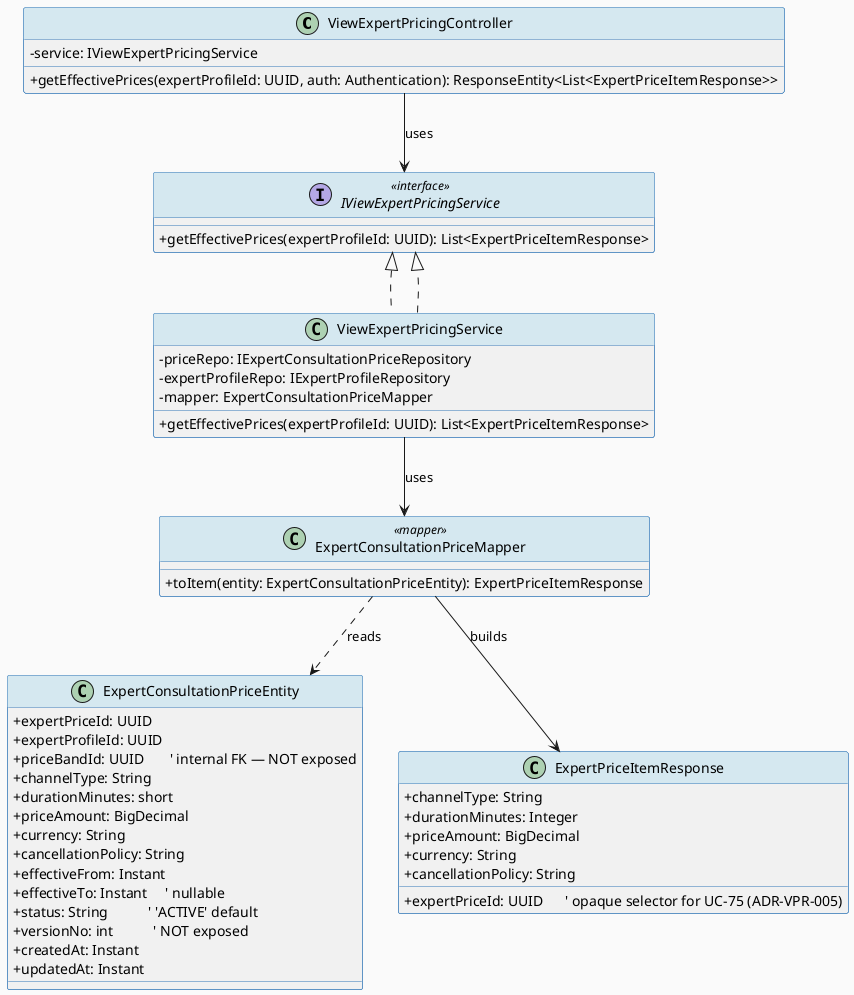
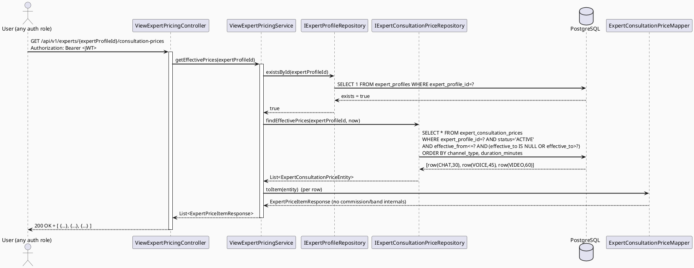
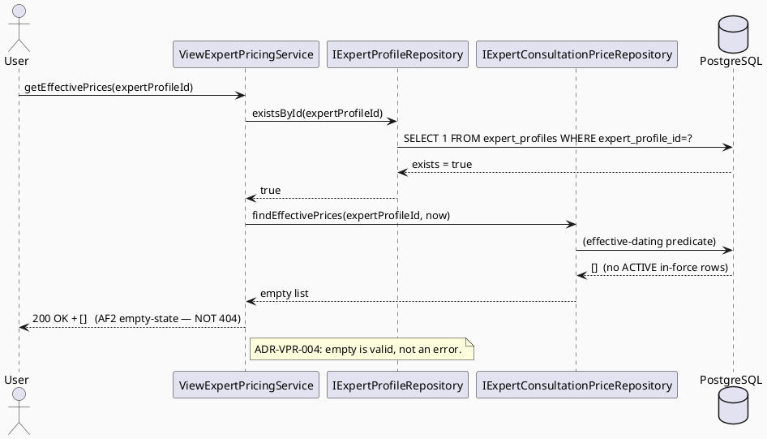
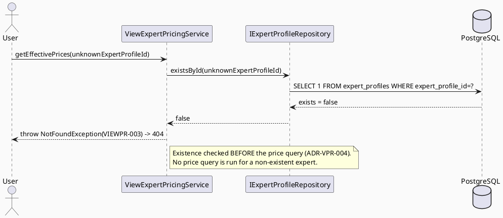

# ENGINEERING DOCUMENTATION STANDARD (EDS) v2.0
# UC-241 View Expert Consultation Pricing

| Field | Value |
|-------|-------|
| **Document ID** | `CB-CON-IMP-011` |
| **Version** | `1.0` |
| **Date** | `2026-07-03` |
| **Status** | `Draft` |
| **Document Owner** | `LamVH — Consultation Domain Lead` |
| **Author** | `AI Agent — Technical Architect` |
| **Reviewed by** | `[Tech Lead] — Pending` |
| **DPO Sign-off** | `[ ] Pending` *(no end-user PII in payload; internal price-band economics are business-confidential — see ADR-VPR-003)* |
| **Approved by** | `[Principal Architect] — Pending` |
| **Last Review** | `2026-07-03` |
| **Based on EDS** | `v2.0` |

---

## CHANGELOG

> **Policy 4.4 — Immutable History:** Không bao giờ xóa thông tin cũ.

| Ngày | Người thực hiện | Nội dung thay đổi |
|------|-----------------|-------------------|
| 2026-07-03 | AI Agent | Khởi tạo TDS cho UC-241 View Expert Consultation Pricing (read-only, effective-dated price list for one expert; non-ownership-gated; commission/band internals excluded) |

---

## MỤC LỤC

1. [Tổng quan Module](#1-tổng-quan-module)
2. [Ma trận Truy vết](#2-ma-trận-truy-vết-traceability-matrix)
3. [Architecture Decision Records (ADR)](#3-architecture-decision-records-adr)
4. [Non-Functional Requirements & SLA](#4-non-functional-requirements--sla)
5. [Static Modeling](#5-static-modeling-mô-hình-tĩnh)
6. [Dynamic Modeling](#6-dynamic-modeling-mô-hình-động)
7. [Domain Event Catalog](#7-domain-event-catalog)
8. [Interface Specification](#8-interface-specification-đặc-tả-giao-diện)
9. [API Specification](#9-api-specification)
10. [Bảng mã lỗi](#10-bảng-mã-lỗi-error-codes)
11. [Quy trình Triển khai](#11-quy-trình-triển-khai-step-by-step)
12. [Rollback & Incident Runbook](#12-rollback--incident-runbook)
13. [Kịch bản Kiểm thử Chi tiết](#13-kịch-bản-kiểm-thử-chi-tiết)
14. [Phương pháp Xác minh](#14-phương-pháp-xác-minh)
15. [Mẫu thử thực tế](#15-mẫu-thử-thực-tế-api-verification-samples)
16. [Bảng tổng hợp phân quyền](#16-bảng-tổng-hợp-phân-quyền-authorization-matrix)
17. [AI Prompt Constraints (CASE 2.0)](#17-ai-prompt-constraints-case-20)

---

## 1. Tổng quan Module

> Displays the **currently effective** consultation price list for **one specific expert**, so a user can review channel/duration/price before confirming a booking. Pure read-only GET over the applied `expert_consultation_prices` table. No state is mutated. The response exposes only the fields an end-user needs to choose a package; internal platform economics (commission rate, price-band min/max range) are **never** surfaced.

| Field | Value |
|-------|-------|
| **Module Name** | `ViewExpertConsultationPricing` |
| **Bounded Context** | `consultation` |
| **Data Classification** | `Internal` (public-within-app: any authenticated user may read any expert's effective prices; **contains no end-user PII**. Internal price-band economics are `Confidential` and excluded — ADR-VPR-003) |
| **Compliance Scope** | `BR-RBAC` (any authenticated role), `BR-CONSULTATION` (pricing is part of the auditable consultation lifecycle — SRS Table 260), `BR-PRIVACY` (business-confidentiality: commission/band internals not disclosed) |
| **Upstream Dependencies** | `expert_consultation_prices`, `consultation_price_bands` (FK, internals only), `expert_profiles` (existence check) |
| **Downstream Consumers** | Mobile screen `CB-204 Expert Consultation Pricing (UC-241)`; `CB-205 Booking Review (UC-75, UC-241)`; UC-75 Book Private Consultation (consumes `expertPriceId` to lock the price snapshot) |

**Mô tả:** SRS UC-241 (§3.3.20.1, Table 260): *"Displays the currently effective consultation price list before the user confirms booking."* Primary Actor: **User** (any authenticated role). Secondary Actor: VNPay Payment Gateway (downstream of booking, not invoked by this read). The User opens an expert's profile, requests that expert's pricing; the system returns the list of `ACTIVE`, currently-effective price rows for that `expertProfileId`, each carrying `channelType`, `durationMinutes`, `priceAmount`, `currency`, `cancellationPolicy`, plus the opaque `expertPriceId` selector used by UC-75.

**Related-but-out-of-scope:** UC-238 Set Consultation Price (the **write** side that produces the rows this UC reads), UC-239 Update Price, UC-240 Manage Price Bands, UC-75 Book Private Consultation (consumes the selected `expertPriceId`). This UC is the **read** side only — it neither writes prices nor initiates booking.

> **Footnote (SRS source correction):** The SRS heading at `02_Requirements/SRS/3_Functional_Specification.md` line 5117 reads *"UC-241 View Expert Consultatioểm ie Pricing"* — a title typo/mojibake. It is normalized here to **"View Expert Consultation Pricing"**, consistent with the section heading §3.3.20.1 (line 5115) and Table 260 caption (line 5134). No requirement content is changed by this normalization.

---

## 2. Ma trận Truy vết (Traceability Matrix)

| Requirement ID | Loại (BR/ADR/US) | Mô tả yêu cầu | Thành phần Code | Compliance Target | ADR liên quan |
|----------------|------------------|---------------|-----------------|-------------------|---------------|
| UC-241 | Use Case | Display currently-effective consultation price list for an expert before booking — SRS §3.3.20.1 (Table 260) | `ViewExpertPricingController`, `ViewExpertPricingService` | BR-RBAC | ADR-VPR-001 |
| BR-RBAC | Business Rule | Any authenticated user may access this function (no ownership scope) | `ViewExpertPricingController` (auth-only) | BR-RBAC | ADR-VPR-002 |
| BR-CONSULTATION | Business Rule | Pricing is part of the auditable consultation lifecycle; read from the canonical price table | `ViewExpertPricingService` | BR-CONSULTATION | ADR-VPR-001 |
| BR-PRIVACY (business-confidentiality) | Business Rule | Commission rate & price-band min/max range are internal platform economics — never exposed to end-users | `ExpertConsultationPriceMapper`, `ExpertPriceItemResponse` | BR-PRIVACY | ADR-VPR-003 |
| EFF-DATING | Decision | "Currently effective" = `status='ACTIVE'` AND `effective_from <= now` AND (`effective_to IS NULL` OR `effective_to > now`) | `IExpertConsultationPriceRepository` (`@Query`) | BR-CONSULTATION | ADR-VPR-001 |
| AF2 (SRS UC-241) | Alternative Flow | No prices set → empty state / next allowed action → valid `200 []` (not an error) | `ViewExpertPricingService` | — | ADR-VPR-004 |
| E1 (SRS UC-241) | Exception | Access denied when unauthenticated → `401 VIEWPR-002` | Security filter | BR-RBAC | ADR-VPR-002 |
| E2 (SRS UC-241) | Exception | Unknown `expertProfileId` → `404 VIEWPR-003`; malformed id → `400 VIEWPR-001` | `ViewExpertPricingService` | — | ADR-VPR-004 |
| XREF-UC75 | Decision | Expose `expertPriceId` opaque selector so UC-75 can lock the price snapshot (`consultation_bookings.expert_price_id` FK) | `ExpertPriceItemResponse` | BR-CONSULTATION | ADR-VPR-005 |

---

## 3. Architecture Decision Records (ADR)

### ADR-VPR-001 — Effective-dating filter enforced in the repository query

| Field | Value |
|-------|-------|
| **Status** | `Accepted` |
| **Deciders** | `AI Agent (Technical Architect)`, `Consultation Domain Lead` |
| **Date** | `2026-07-03` |
| **Supersedes** | — |

#### Bối cảnh (Context)
`expert_consultation_prices` is an **effective-dated, versioned** table (`status`, `version_no`, `effective_from timestamptz NOT NULL`, `effective_to timestamptz` nullable — `V1__init_schema.sql` lines 859–874). A single expert can have historical rows (superseded), future-dated rows (scheduled to take effect later), and expired rows (`effective_to` in the past). SRS UC-241 requires displaying only the **currently effective** list "before the user confirms booking." Returning stale/future prices would let a user book at a price that is not actually in force — a BR-CONSULTATION lifecycle violation and a mis-pricing risk for UC-75.

#### Các phương án đã xem xét (Options Considered)

| Phương án | Mô tả | Ưu điểm | Nhược điểm |
|-----------|-------|----------|------------|
| A | `findByExpertProfileId(...)` then filter effectiveness in Java service | + Simple JPQL | - Loads superseded/expired/future rows into memory; effectiveness logic scattered; easy to forget a clause |
| B | Single derived/`@Query` repository method that applies the full effective-dating predicate in SQL, ordered deterministically | + One choke-point; DB does the filtering with `idx`-friendly predicates; least memory; testable in isolation | - Requires an explicit `@Query` (not a pure derived name) |

#### Quyết định (Decision)
Chọn **Phương án B**. The repository exposes a single method whose predicate is exactly:
```
WHERE expert_profile_id = :expertProfileId
  AND status = 'ACTIVE'
  AND effective_from <= :now
  AND (effective_to IS NULL OR effective_to > :now)
ORDER BY channel_type, duration_minutes
```
`:now` is passed in from the service (`Instant.now()`), never taken from the client. The mechanism is the schema's effective-dating columns (`status`, `effective_from`, `effective_to`). Ordering is deterministic (`channel_type`, then `duration_minutes`) to give a stable list for the UI cards.

#### Hệ quả (Consequences)
**Tích cực:** Only in-force prices are ever returned; effectiveness logic lives in one place; matches the schema's designed semantics.
**Tiêu cực / Trade-offs:** An explicit `@Query` must be kept in sync with the column names; covered by an integration test that seeds a future-dated and an expired row and asserts they are excluded.
**Compliance Impact:** Upholds BR-CONSULTATION (only auditable, in-force pricing reaches the booking flow).

---

### ADR-VPR-002 — Non-ownership-gated, public-within-app read (any authenticated user)

| Field | Value |
|-------|-------|
| **Status** | `Accepted` |
| **Deciders** | `AI Agent (Technical Architect)`, `Consultation Domain Lead` |
| **Date** | `2026-07-03` |

#### Bối cảnh (Context)
Sibling read UCs in this domain are deliberately **IDOR-sensitive**: UC-203 View Consultation Detail (`ADR-CDT-001`) and UC-221 gate every record to the participant/owner, because those records contain the caller's own bookings and counterpart PII. UC-241 is fundamentally different: an expert's consultation prices are **catalog information intended to be shown to prospective buyers**. The whole point of the screen (CB-204) is that a shopper who is *not yet* in any relationship with the expert can view the price list to decide whether to book. Applying an ownership gate here would break the primary flow.

#### Các phương án đã xem xét (Options Considered)

| Phương án | Mô tả | Ưu điểm | Nhược điểm |
|-----------|-------|----------|------------|
| A | Ownership/participant gate (copy UC-203 `assertCanView`) | + Consistent with UC-203 code | - **Wrong for a catalog**: blocks the shopper the feature exists for; contradicts SRS "before the user confirms booking" |
| B | Authentication-only (JWT required); **no** per-record ownership predicate; any authenticated role sees any expert's effective prices | + Matches the SRS intent and CB-204 flow; no IDOR concern because the data is non-sensitive catalog info carrying no end-user PII | - Must be documented explicitly to avoid a reviewer "fixing" it into an ownership gate |
| C | Fully public (no auth) | + Simplest for shoppers | - SRS PRE-3 requires the actor be authenticated; also loses rate-limit/abuse attribution. Rejected. |

#### Quyết định (Decision)
Chọn **Phương án B**. The endpoint requires a valid JWT (SRS PRE-3, E1 → `401 VIEWPR-002` when absent) but applies **no ownership/participant predicate**. There is intentionally **no** `assertCanView`-style policy on this path. This is an explicit, documented contrast with UC-203/UC-221: those guard PII-bearing owned records; UC-241 serves non-PII catalog data.

#### Hệ quả (Consequences)
**Tích cực:** Primary flow (a prospective buyer views prices) works; no accidental IDOR because there is no per-user private data to leak; simplest correct design.
**Tiêu cực / Trade-offs:** A reviewer familiar with UC-203 might mistake the absence of an ownership check for a bug — mitigated by this ADR, §16 auth matrix, and constraint C2/C6 in §17. `Open`: if the product later restricts pricing visibility (e.g., only to verified members), a scope predicate would be added — out of scope now.
**Compliance Impact:** BR-RBAC satisfied by authentication; no PDPA/PII exposure because the payload carries no personal data.

---

### ADR-VPR-003 — Commission rate & price-band internals excluded from the response

| Field | Value |
|-------|-------|
| **Status** | `Accepted` |
| **Deciders** | `AI Agent (Technical Architect)`, `DPO (pending sign-off)`, `Finance/Platform-economics owner` |
| **Date** | `2026-07-03` |

#### Bối cảnh (Context)
`expert_consultation_prices.price_band_id` FKs into `consultation_price_bands`, which holds `commission_rate NOT NULL`, `minimum_price`, and `maximum_price` (`V1__init_schema.sql` lines 842–857). These are **internal platform economics**: the commission the platform takes and the allowed price corridor set by admins (UC-240). They are needed to *validate* a price at write time (UC-238), but disclosing them to end-users viewing pricing would leak the platform's margin structure and negotiating band — business-confidential information with no purpose on the buyer-facing card.

#### Quyết định (Decision)
The `ExpertPriceItemResponse` exposes **only**: `expertPriceId`, `channelType`, `durationMinutes`, `priceAmount`, `currency`, `cancellationPolicy`. It **never** contains `commission_rate`, `minimum_price`, `maximum_price`, `price_band_id`, `specialty_scope`, `version_no`, or any other price-band column. The mapper builds the DTO field-by-field from `ExpertConsultationPriceEntity` only; it must **not** join to or serialize any `consultation_price_bands` field, and must never serialize a JPA entity directly (CareBridge rule: never expose entities).

#### Hệ quả (Consequences)
**Tích cực:** Platform margin and band internals stay confidential; DTO is minimal and stable; matches CB-204 which shows only channel/duration/price.
**Tiêu cực / Trade-offs:** A negative-assertion test is required (serialized JSON must not contain `commission`, `minimum_price`, `maximum_price`, `price_band_id`) — see Test-Spec VIEWPR-TC-004. The mapper must be hand-audited.
**Compliance Impact:** BR-PRIVACY (business-confidentiality). No end-user PII involved.

---

### ADR-VPR-004 — Empty price list is a valid 200 `[]`; only unknown expert is a 404

| Field | Value |
|-------|-------|
| **Status** | `Accepted` |
| **Deciders** | `AI Agent (Technical Architect)`, `Consultation Domain Lead` |
| **Date** | `2026-07-03` |

#### Bối cảnh (Context)
An expert may exist but have set **no** prices yet (or all their prices are currently out of the effective window). SRS UC-241 AF2 says: *"No matching data is available; the system displays an empty state with the next allowed action."* CB-204's card list simply renders nothing / an empty state — an empty list is a normal, expected outcome, not a failure.

#### Các phương án đã xem xét (Options Considered)

| Phương án | Mô tả | Ưu điểm | Nhược điểm |
|-----------|-------|----------|------------|
| A | Return `404` when an expert has no effective prices | + "Nothing to show" is explicit | - Conflates "expert doesn't exist" with "expert has no prices"; breaks the empty-state UX; AF2 says empty state, not error |
| B | `200` with an empty JSON array `[]` when the expert exists but has no effective rows; `404 VIEWPR-003` only when the `expertProfileId` itself does not exist | + Distinguishes the two cases cleanly; matches AF2 empty-state | - Requires an explicit expert-existence check before the price query |

#### Quyết định (Decision)
Chọn **Phương án B**. Order of operations in the service:
1. Validate `expertProfileId` is a UUID (else `400 VIEWPR-001`, handled by the framework/`@PathVariable` binding).
2. Check the expert exists (`expertProfileRepo.existsById(expertProfileId)`) → if not, `404 VIEWPR-003`.
3. Query effective prices (ADR-VPR-001). If none, return `200 []`; otherwise `200 [ ...items ]`.

An empty result at step 3 is **never** an error.

#### Hệ quả (Consequences)
**Tích cực:** Clean AF2 empty-state; `404` unambiguously means "no such expert."
**Tiêu cực / Trade-offs:** One extra `existsById` lookup (indexed PK — negligible).
**Compliance Impact:** None (read-only).

---

### ADR-VPR-005 — Expose `expertPriceId` as an opaque selector for UC-75 price locking

| Field | Value |
|-------|-------|
| **Status** | `Accepted` |
| **Deciders** | `AI Agent (Technical Architect)`, `Consultation Domain Lead` |
| **Date** | `2026-07-03` |

#### Bối cảnh (Context)
CB-204 each card has a "Chọn gói" (select package) action; CB-205 Booking Review then shows the locked total and cancellation policy. UC-75 Book Private Consultation persists `consultation_bookings.expert_price_id` (FK → `expert_consultation_prices.expert_price_id`, `V1__init_schema.sql` line 1833) to **snapshot** the price the buyer saw. For the client to pass the chosen package to UC-75, the pricing response must carry a stable identifier per row.

#### Quyết định (Decision)
Each `ExpertPriceItemResponse` carries `expertPriceId` (the row PK). It is an **opaque selector only** — the client echoes it into the UC-75 booking request. Exposing the PK is safe: it is not PII, not confidential, and is already the FK target used by bookings. This is a **cross-reference** to UC-75, not a redesign of it; UC-241 does not initiate booking or touch VNPay.

#### Hệ quả (Consequences)
**Tích cực:** Enables the "price locked at booking" guarantee shown in CB-204's "Giá được bảo lưu" notice via UC-75; no extra round-trip to re-resolve the price.
**Tiêu cực / Trade-offs:** UC-75 must re-validate that the supplied `expertPriceId` is still effective at booking time (UC-75's responsibility, noted here as an integration boundary, not implemented in UC-241).
**Compliance Impact:** None.

---

## 4. Non-Functional Requirements & SLA

### 4.1. Performance & Availability

| Category | Requirement | Target SLA | Measurement Method | Compliance Basis |
|----------|-------------|------------|---------------------|------------------|
| Latency | `GET /experts/{expertProfileId}/consultation-prices` (p99) | `< 300ms` | k6 / Spring Actuator timer | — |
| Availability | Uptime (monthly) | `99.9%` | Uptime monitor | — |
| Query cost | Bounded: 1 existence check + 1 effective-price query | ≤ 2 indexed lookups per request | Query plan review | — |

> **Note:** SLA targets above are the batch-standard defaults inherited from the sibling read UCs (UC-202/UC-203). The SRS UC-241 (Table 260) does **not** specify numeric SLAs (Frequency = "Frequent"; no latency/throughput figures). Any figure not in the SRS is marked as a project default, not a sourced requirement.

### 4.2. Data Integrity & Retention

| Category | Requirement | Target | Verification Method | Compliance Basis |
|----------|-------------|--------|---------------------|------------------|
| Read-only | Zero mutation on this path | No `INSERT/UPDATE/DELETE` | Code review + `@Transactional(readOnly=true)` | BR-CONSULTATION |
| Effective-dating correctness | Only in-force rows returned | 100% | §14 SQL cross-check + integration test | BR-CONSULTATION |

### 4.3. Security

| Category | Requirement | Target | Verification Method | Compliance Basis |
|----------|-------------|--------|---------------------|------------------|
| Access control | Authentication required; no ownership scope | Any authenticated role (§16) | Auth Matrix + VIEWPR-TC-006 | BR-RBAC |
| Confidentiality | No commission/band internals in response | 0 leaks | Serialization assertion (VIEWPR-TC-004) | BR-PRIVACY (business-confidentiality) |
| Encryption in transit | All endpoints | TLS 1.3+ | SSL scan | — |

### 4.4. Scalability & Capacity Planning
Read-only, keyed by `expert_profile_id` (indexed FK) with a small per-expert row count (a handful of channel/duration combinations). Scales horizontally with the API tier; no write contention. Effective-price results are cache-friendly (short TTL keyed by `expertProfileId`) if load demands it, but no caching is required in the 12-month horizon given the bounded query.

---

## 5. Static Modeling (Mô hình Tĩnh)

### 5.1. Class Diagram (PlantUML)



### 5.2. Planned File Paths (no implementation code here)

```
05_Development/CareBridgeAPI/src/main/java/com/carebridge/backend/consultation/
├── controller/ViewExpertPricingController.java
├── service/IViewExpertPricingService.java
├── service/ViewExpertPricingService.java
├── mapper/ExpertConsultationPriceMapper.java
├── dto/response/ExpertPriceItemResponse.java
├── entity/ExpertConsultationPriceEntity.java         (shared with UC-238/239 write side)
└── repository/IExpertConsultationPriceRepository.java (add effective-price finder)
    repository/IExpertProfileRepository.java           (reused — existsById)
```

> There is **no request DTO** — the only input is the `expertProfileId` path variable + JWT identity (authentication only). Package convention: `com.carebridge.backend.consultation.{controller,service,repository,entity,dto.request,dto.response,mapper,policy}`. There is intentionally **no `policy` class** on this path (non-ownership-gated — ADR-VPR-002).

### 5.3. Data Structure (Flyway SQL Migration)

**Not applicable — no schema change required.** The source tables `expert_consultation_prices` (lines 859–874), `consultation_price_bands` (lines 842–857), `expert_profiles`, and the FK/PK constraints (`expert_consultation_prices_pkey`, `expert_consultation_prices_expert_profile_id_fkey`, `expert_consultation_prices_price_band_id_fkey`) already exist in the baseline `V1__init_schema.sql`. This is a pure read-only feature over existing schema. (If no index on `expert_consultation_prices(expert_profile_id)` exists, adding one is an **optional** performance follow-up, not required for correctness — marked `Open`.)

---

## 6. Dynamic Modeling (Mô hình Động)

### 6.1. Sequence — Happy Path (view with prices)



### 6.2. Sequence — Happy Path (view empty: expert exists, no effective prices)



### 6.3. Sequence — Expert Not Found (unknown expertProfileId → 404)



### 6.4. State Machine

**Not applicable — this feature mutates no state.** The `status`/effective-dating *values* it filters on are owned by the write UCs (UC-238 Set Price, UC-239 Update Price) and their state transitions. UC-241 only reads rows that are currently `ACTIVE` and in-force.

---

## 7. Domain Event Catalog

**Not applicable.** UC-241 is a read-only pricing endpoint; it publishes and consumes **no** domain events (no state change to announce). Any read-access auditing, if mandated by policy, is handled by the cross-cutting access-audit interceptor (out of scope for this UC); no new event contract is defined here.

### 7.1. Events Published
| Event Name | Trigger | Publisher | Subscriber(s) | Payload | Async? |
|------------|---------|-----------|---------------|---------|--------|
| — | Read-only pricing endpoint — no domain events | — | — | — | — |

### 7.2. Events Consumed
| Event Name | Source | Handler | Action |
|------------|--------|---------|--------|
| — | — | — | — |

---

## 8. Interface Specification (Đặc tả Giao diện)

```java
// ExpertPriceItemResponse.java — Output DTO (buyer-facing, minimal)
// @version 1.0
public class ExpertPriceItemResponse {
    private UUID       expertPriceId;      // opaque selector for UC-75 (ADR-VPR-005)
    private String     channelType;        // e.g. "CHAT" | "VOICE" | "VIDEO" (from channel_type)
    private Integer    durationMinutes;    // from duration_minutes
    private BigDecimal priceAmount;        // from price_amount
    private String     currency;           // from currency (default 'VND')
    private String     cancellationPolicy; // from cancellation_policy (nullable text)
    // getters only — immutable response.
    // MUST NOT expose commissionRate / minimumPrice / maximumPrice / priceBandId / versionNo.
}

// IViewExpertPricingService.java — Service Contract
// @version 1.0
public interface IViewExpertPricingService {
    /**
     * Return the currently-effective consultation price list for one expert.
     * "Effective" = status='ACTIVE' AND effective_from <= now AND (effective_to IS NULL OR effective_to > now).
     * @throws NotFoundException (VIEWPR-003) when expertProfileId does not exist.
     * @return possibly-empty list (empty is a valid result, ADR-VPR-004 — never null, never throws for "no prices").
     */
    List<ExpertPriceItemResponse> getEffectivePrices(UUID expertProfileId);
}
```

### 8.2. Repository Interfaces (read-only; price finder is the effective-dating choke-point)

```java
// IExpertConsultationPriceRepository.java
// @version 1.0 — no delete/update on this path
public interface IExpertConsultationPriceRepository
        extends JpaRepository<ExpertConsultationPriceEntity, UUID> {

    @Query("""
        SELECT p FROM ExpertConsultationPriceEntity p
        WHERE p.expertProfileId = :expertProfileId
          AND p.status = 'ACTIVE'
          AND p.effectiveFrom <= :now
          AND (p.effectiveTo IS NULL OR p.effectiveTo > :now)
        ORDER BY p.channelType, p.durationMinutes
        """)
    List<ExpertConsultationPriceEntity> findEffectivePrices(
            @Param("expertProfileId") UUID expertProfileId,
            @Param("now") Instant now);
}

// IExpertProfileRepository.java (reused)
public interface IExpertProfileRepository extends JpaRepository<ExpertProfileEntity, UUID> {
    boolean existsById(UUID expertProfileId); // expert-existence check (ADR-VPR-004)
}
```

---

## 9. API Specification

### 9.1. Endpoints Table

| Method | Path | Auth Level | Required Roles | Rate Limit | Idempotent? |
|--------|------|------------|----------------|------------|-------------|
| `GET` | `/api/v1/experts/{expertProfileId}/consultation-prices` | JWT Bearer | Any authenticated role (`ROLE_MOTHER`, `ROLE_FAMILY`, `ROLE_EXPERT`, `ROLE_PARTNER`, admins) | 300/min | Yes (read-only) |

### 9.2. Request / Response Schemas

#### `GET /api/v1/experts/{expertProfileId}/consultation-prices`

**Path variable:** `expertProfileId` — UUID. No request body. No ownership scope (ADR-VPR-002).

**Response — 200 OK (expert has effective prices):**
```json
[
  {
    "expertPriceId": "aaaaaaaa-0000-0000-0000-000000000001",
    "channelType": "CHAT",
    "durationMinutes": 30,
    "priceAmount": 200000,
    "currency": "VND",
    "cancellationPolicy": "Free cancellation up to 2 hours before the session."
  },
  {
    "expertPriceId": "aaaaaaaa-0000-0000-0000-000000000002",
    "channelType": "VOICE",
    "durationMinutes": 45,
    "priceAmount": 350000,
    "currency": "VND",
    "cancellationPolicy": "Free cancellation up to 2 hours before the session."
  },
  {
    "expertPriceId": "aaaaaaaa-0000-0000-0000-000000000003",
    "channelType": "VIDEO",
    "durationMinutes": 60,
    "priceAmount": 500000,
    "currency": "VND",
    "cancellationPolicy": "Free cancellation up to 2 hours before the session."
  }
]
```
> Oracle for the three rows: CB-204 mockup cards — Chat 30 phút 200.000đ, Cuộc gọi 45 phút 350.000đ, Video 60 phút 500.000đ. `cancellationPolicy` surfaced per CB-205 "Chính sách hủy & Hoàn tiền". **No `commissionRate` / `minimumPrice` / `maximumPrice` / `priceBandId` present.**

**Response — 200 OK (expert exists, no effective prices — AF2 empty-state):**
```json
[]
```

**Response — 404 Not Found (unknown expertProfileId):**
```json
{ "error": { "code": "VIEWPR-003", "message": "Expert not found" } }
```

**Response — 400 Bad Request (malformed expertProfileId):**
```json
{ "error": { "code": "VIEWPR-001", "message": "Invalid expert profile id format" } }
```

**Response — 401 Unauthorized (missing/invalid JWT):**
```json
{ "error": { "code": "VIEWPR-002", "message": "Authentication required" } }
```

---

## 10. Bảng mã lỗi (Error Codes)

> Prefix `VIEWPR-` (VIEW PRicing). Fresh range `VIEWPR-001..004`, chosen to avoid collision with siblings: UC-238 `SETPR-0xx`, UC-239 `UPDPR-0xx`, UC-240 `PBAND-0xx`, and the read siblings `CON-0xx`/`CDT-0xx`. Pure-read feature → small range.

| Code | HTTP Status | Message (EN) | Message (VI) | Trigger Condition |
|------|-------------|--------------|--------------|-------------------|
| `VIEWPR-001` | 400 | Invalid expert profile id format | Định dạng mã hồ sơ chuyên gia không hợp lệ | Path variable is not a valid UUID |
| `VIEWPR-002` | 401 | Authentication required | Yêu cầu đăng nhập | Missing/invalid JWT (SRS E1) |
| `VIEWPR-003` | 404 | Expert not found | Không tìm thấy chuyên gia | No `expert_profiles` row for the given `expertProfileId` (ADR-VPR-004) |
| `VIEWPR-004` | 500 | Internal error | Lỗi hệ thống | Unexpected server/persistence failure |

> **Note:** There is **no `403`** on this endpoint — the read is non-ownership-gated (ADR-VPR-002). An empty price list is **not** an error (it is `200 []`, ADR-VPR-004), so there is no dedicated "no prices" code.

---

## 11. Quy trình Triển khai (Step-by-Step)

### 11.1. Prerequisites
- [ ] ADR-VPR-001..005 Accepted (§3).
- [ ] `expert_consultation_prices`, `consultation_price_bands`, `expert_profiles` present in the applied schema (they are — `V1__init_schema.sql`).
- [ ] `ExpertConsultationPriceEntity` present or created (shared with UC-238/239 write side).

### 11.2. Pre-Migration Checklist
**Not applicable — no migration.** Read-only over existing `V1__init_schema.sql` tables. No `pg_dump`/rollback-script prerequisite for schema.

### 11.3. Implementation Steps

#### Chặng 1 — Read-only entity & repository
Confirm/reuse `ExpertConsultationPriceEntity` mapping `expert_consultation_prices`. Add `findEffectivePrices(expertProfileId, now)` (§8.2) to `IExpertConsultationPriceRepository`. Confirm `existsById` on `IExpertProfileRepository`. No `@Modifying` queries.

#### Chặng 2 — `ExpertConsultationPriceMapper` (confidentiality minimization)
Build `ExpertPriceItemResponse` field-by-field from the price entity **only**. Never join to `consultation_price_bands`; never serialize `commission_rate`/`minimum_price`/`maximum_price`/`price_band_id`/`version_no`; never serialize the JPA entity.

#### Chặng 3 — `ViewExpertPricingService`
`@Transactional(readOnly = true)`. Order: `existsById` → (throw `VIEWPR-003` if absent) → `findEffectivePrices(expertProfileId, Instant.now())` → map each row → return list (possibly empty). No ownership/policy check (ADR-VPR-002).

#### Chặng 4 — `ViewExpertPricingController`
`@PathVariable UUID expertProfileId` (malformed → `400 VIEWPR-001` via binding). Require authentication (`401 VIEWPR-002` when absent). Delegate to service; return `200` with the list. No business logic in controller.

#### Chặng 5 — Verification
```bash
curl -X GET "https://[host]/api/v1/experts/<expertProfileId>/consultation-prices" \
  -H "Authorization: Bearer <ANY_AUTH_JWT>"
# Expected: 200 + array of {expertPriceId, channelType, durationMinutes, priceAmount, currency, cancellationPolicy}
```

### 11.4. Deployment Checklist
- [ ] Any authenticated user can read an expert's effective prices.
- [ ] Future-dated and expired prices are excluded.
- [ ] Superseded/non-`ACTIVE` rows are excluded.
- [ ] Response contains **no** `commissionRate`/`minimum_price`/`maximum_price`/`priceBandId`.
- [ ] Expert with no prices → `200 []` (not 404).
- [ ] Unknown expertProfileId → `404 VIEWPR-003`.
- [ ] No JWT → `401 VIEWPR-002`.

---

## 12. Rollback & Incident Runbook

### 12.1. Điều kiện kích hoạt Rollback

| Điều kiện | Ngưỡng | Người quyết định |
|-----------|--------|------------------|
| Commission/band internals present in response | Any single occurrence | Tech Lead + DPO |
| Stale/future/expired price returned as effective | Any single occurrence | Tech Lead |
| Error rate spike | > 5% trong 5 phút | On-call Engineer |
| Latency p99 | > 2x baseline | On-call Engineer |

### 12.2. Rollback Procedure
```bash
# No migration to revert (read-only feature). Roll back code only.
kubectl rollout undo deployment/carebridge-api
kubectl rollout status deployment/carebridge-api
curl -X GET https://[host]/api/v1/health   # expect {"status":"ok"}
```

### 12.3. Notification Protocol

| Thời điểm | Người nhận | Kênh | Template |
|-----------|------------|------|----------|
| Ngay khi phát hiện | On-call team | Slack `#incident` | "Pricing leak/mis-effective in UC-241: [mô tả]" |
| Trong 30 phút | Finance/Platform-economics owner | Email | *(Bắt buộc nếu commission/band internals were exposed)* |

### 12.4. Post-Incident Review (PIR)
Complete PIR within 48h: Timeline, Root Cause (5 Whys), Impact (was any commission/band internal exposed? for how long? how many experts' pricing mis-rendered?), Remediation, Prevention (add regression test on the mapper's negative assertion and on the effective-dating predicate).

---

## 13. Kịch bản Kiểm thử Chi tiết

> Full case list in `UC241_ViewExpertConsultationPricing_Test-Spec.md`. Summary here.

```gherkin
Feature: View Expert Consultation Pricing
  Background:
    Given test data classification: SYNTHETIC

  Scenario: View with multiple effective prices (happy path)
    Given expert EXP-001 has 3 ACTIVE in-force prices (CHAT/30, VOICE/45, VIDEO/60)
    When any authenticated user GET /experts/EXP-001/consultation-prices
    Then 200 and 3 items ordered by channelType, durationMinutes
    And each item has channelType, durationMinutes, priceAmount, currency, cancellationPolicy

  Scenario: View empty (expert exists, no effective prices)
    Given expert EXP-002 exists but has no ACTIVE in-force prices
    When user GET /experts/EXP-002/consultation-prices
    Then 200 and body == []

  Scenario: Effective-dating excludes future-dated and expired
    Given EXP-003 has 1 in-force, 1 future-dated (effective_from > now), 1 expired (effective_to < now)
    When user GET /experts/EXP-003/consultation-prices
    Then exactly 1 item is returned (the in-force one)

  Scenario: Commission and band internals never exposed
    Then serialized response contains no 'commission', 'minimum_price', 'maximum_price', 'priceBandId', 'version'

  Scenario: Expert not found
    When user GET /experts/<random-uuid>/consultation-prices
    Then 404 with code VIEWPR-003

  Scenario: Non-ownership-gated (any authenticated role)
    Given a user with NO relationship to EXP-001
    When that user GET /experts/EXP-001/consultation-prices
    Then 200 (NOT 403) — pricing is catalog info

  Scenario: Unauthenticated
    When GET /experts/EXP-001/consultation-prices with no JWT
    Then 401 with code VIEWPR-002
```

---

## 14. Phương pháp Xác minh

### 14.1. Database Inspection
> **Oracle rule:** Every asserted table/column traces to `V1__init_schema.sql` (`expert_consultation_prices` 859–874, `consultation_price_bands` 842–857).

```sql
-- Effective prices for an expert (mirrors the repository predicate)
SELECT expert_price_id, channel_type, duration_minutes, price_amount, currency, cancellation_policy
FROM expert_consultation_prices
WHERE expert_profile_id = '<uuid>'
  AND status = 'ACTIVE'
  AND effective_from <= now()
  AND (effective_to IS NULL OR effective_to > now())
ORDER BY channel_type, duration_minutes;

-- Confirm excluded rows exist but are NOT returned above (future/expired/non-active)
SELECT expert_price_id, status, effective_from, effective_to
FROM expert_consultation_prices
WHERE expert_profile_id = '<uuid>';

-- Confirm commission/band internals live only on the band (must never reach the DTO)
SELECT price_band_id, commission_rate, minimum_price, maximum_price
FROM consultation_price_bands
WHERE price_band_id = '<uuid>';
```

### 14.2. Manual Steps
1. Log in as `mother@carebridge.dev`; open an expert with prices → verify 200 + card list matching CB-204.
2. Log in as `family@carebridge.dev` (no relationship to that expert) → same expert → verify 200 (non-ownership-gated).
3. Open an expert with no prices → verify `200 []` (empty state), not 404.
4. Random UUID → verify `404 VIEWPR-003`.
5. Inspect JSON — confirm no `commission`, `minimum_price`, `maximum_price`, `priceBandId`, `version` keys.
6. Seed a future-dated and an expired price → confirm they are absent from the response.

---

## 15. Mẫu thử thực tế (API Verification Samples)

### 15.1. Happy Path
```bash
curl -X GET "https://[host]/api/v1/experts/<expertProfileId>/consultation-prices" \
  -H "Authorization: Bearer <ANY_AUTH_JWT>" \
  -H "X-Correlation-Id: $(uuidgen)"
# Expected 200: [ { expertPriceId, channelType, durationMinutes, priceAmount, currency, cancellationPolicy }, ... ]
```

### 15.2. Error / Edge Paths
```bash
# Expert has no prices -> 200 []
curl -X GET "https://[host]/api/v1/experts/<expertWithNoPrices>/consultation-prices" \
  -H "Authorization: Bearer <ANY_AUTH_JWT>"
# Expected 200: []

# Unknown expert -> 404
curl -X GET "https://[host]/api/v1/experts/00000000-0000-0000-0000-0000000000ff/consultation-prices" \
  -H "Authorization: Bearer <ANY_AUTH_JWT>"
# Expected 404: { "error": { "code": "VIEWPR-003" } }

# No JWT -> 401
curl -X GET "https://[host]/api/v1/experts/<expertProfileId>/consultation-prices"
# Expected 401: { "error": { "code": "VIEWPR-002" } }
```

---

## 16. Bảng tổng hợp phân quyền (Authorization Matrix)

| Endpoint | `GUEST` | `ROLE_MOTHER` | `ROLE_FAMILY` | `ROLE_EXPERT` | `ROLE_PARTNER` | Admins |
|----------|---------|---------------|---------------|---------------|----------------|--------|
| `GET /api/v1/experts/{expertProfileId}/consultation-prices` | ❌ (401 VIEWPR-002) | ✅ All experts | ✅ All experts | ✅ All experts | ✅ All experts | ✅ All experts |

**Chú thích:** No `Own`-scoping. Any authenticated role may read **any** expert's effective prices (ADR-VPR-002 — catalog info, no end-user PII). Explicit contrast with UC-203/UC-221, where the same "read" pattern is ownership-gated because those records carry the caller's private bookings and counterpart PII. Only `GUEST` (unauthenticated) is denied, per SRS PRE-3 / E1.

---

## 17. AI Prompt Constraints (CASE 2.0)

### 17.1 Constraint Summary Table

| # | Constraint | Source (ADR/BR) | Last Verified |
|---|-----------|-----------------|---------------|
| C1 | MUST filter with `status='ACTIVE' AND effective_from <= :now AND (effective_to IS NULL OR effective_to > :now)` in the repository query; `:now` from server `Instant.now()`, never from the client | `ADR-VPR-001` (V1__init_schema.sql 859–874) | `2026-07-03` |
| C2 | MUST require authentication but MUST NOT apply any ownership/participant predicate; MUST NOT add an `assertCanView`-style policy | `ADR-VPR-002` / `BR-RBAC` | `2026-07-03` |
| C3 | MUST NOT expose `commission_rate`, `minimum_price`, `maximum_price`, `price_band_id`, `specialty_scope`, or `version_no`; DTO carries only expertPriceId/channelType/durationMinutes/priceAmount/currency/cancellationPolicy; never serialize a JPA entity or join to `consultation_price_bands` for the payload | `ADR-VPR-003` / `BR-PRIVACY` | `2026-07-03` |
| C4 | Expert-existence checked BEFORE the price query: unknown `expertProfileId` → `404 VIEWPR-003`; expert-with-no-prices → `200 []` (never 404, never throw) | `ADR-VPR-004` | `2026-07-03` |
| C5 | Layering: Controller = binding/auth/mapping only; Service = `@Transactional(readOnly=true)` + assembly; Mapper = field-by-field DTO build. Package `com.carebridge.backend.consultation.{controller,service,repository,entity,dto.response,mapper}` (no `policy` on this path) | `CLAUDE.md` architecture rules | `2026-07-03` |
| C6 | Expose `expertPriceId` as an opaque selector for UC-75; MUST NOT initiate booking or call VNPay in this endpoint | `ADR-VPR-005` | `2026-07-03` |

> ⚠️ `Last Verified` ≤ 2 sprints (2026-07-03). Re-verify before injection if stale.

### 17.2 Constraint Injection Block (Copy-Paste)

```
[CONSTRAINT BLOCK — Module: ViewExpertConsultationPricing (CB-CON-IMP-011)]
Theo TDS CB-CON-IMP-011 và ADR-VPR-001..005:
1. (C1) Filter effective prices in the repository query:
   status='ACTIVE' AND effective_from <= :now AND (effective_to IS NULL OR effective_to > :now),
   :now = server Instant.now(), ORDER BY channel_type, duration_minutes.
2. (C2) Authentication required, but NO ownership/participant gate. Do NOT add assertCanView.
   Any authenticated role sees any expert's effective prices (contrast UC-203/UC-221).
3. (C3) NEVER expose commission_rate/minimum_price/maximum_price/price_band_id/version_no.
   DTO = {expertPriceId, channelType, durationMinutes, priceAmount, currency, cancellationPolicy}.
   Build from ExpertConsultationPriceEntity only; never serialize a JPA entity.
4. (C4) existsById(expertProfileId) BEFORE the price query. Unknown expert -> 404 VIEWPR-003.
   Expert with no effective prices -> 200 [] (never 404, never throw).
5. (C5) Controller mapping/auth only; Service readOnly transaction + assembly; no policy class.
6. (C6) Expose expertPriceId as opaque selector for UC-75. Do NOT book or call VNPay here.

[CONTEXT BLOCK]
- Bounded Context: consultation
- Data Classification: Internal (no end-user PII); band internals are Confidential (excluded)
- Compliance: BR-RBAC / BR-CONSULTATION / BR-PRIVACY(business-confidentiality)
- Interfaces: §8; Error codes: §10 (VIEWPR-001..004); Auth matrix: §16
- No schema change (read-only over existing tables).

[TASK BLOCK]
Implement GET /api/v1/experts/{expertProfileId}/consultation-prices satisfying constraints above.
Output must conform to §8 Interface Spec; tests must cover §13 / Test-Spec.
```

### 17.3 Constraint Quality Checklist
- [x] Mỗi constraint traceable về ADR-VPR-00x hoặc BR/CLAUDE.md.
- [x] Không có constraint generic.
- [x] Mỗi constraint có `Last Verified` ≤ 2 sprints (2026-07-03).
- [x] Constraint block có ≥ 3 constraints cụ thể (6).
- [x] Reference §8 Interface + §16 Auth Matrix.

### 17.4 Anti-Pattern Detection

| AP-ID | Anti-Pattern | Dấu hiệu | Hành động |
|-------|-------------|-----------|----------|
| AP-AI-001 | Unconstrained Gen | `findByExpertProfileId` returned without the effective-dating predicate | Reject — violates C1/ADR-VPR-001 |
| AP-AI-003 | Implicit Decision | Code adds an ownership/participant gate (copied from UC-203) | Reject — violates C2/ADR-VPR-002 |
| AP-AI-005 | Hallucinated Contract | Response serializes `commissionRate`/`minimum_price`/`maximum_price`/`priceBandId`, or serializes the JPA entity | Reject — violates C3, no such contract in §8 |

---

## PHỤ LỤC

### A. Glossary

| Thuật ngữ | Định nghĩa |
|-----------|------------|
| Effective-dating | Filtering rows by `status='ACTIVE'` and the `[effective_from, effective_to)` window against the current instant |
| Currently effective | A price that is `ACTIVE` AND `effective_from <= now` AND (`effective_to IS NULL` OR `effective_to > now`) |
| Price band | `consultation_price_bands` row holding internal economics (commission_rate, min/max price) — never shown to end-users |
| Opaque selector | `expertPriceId` echoed by the client into UC-75 to lock the price snapshot; not PII, not confidential |
| Non-ownership-gated | Any authenticated user may read; no per-record participant/owner predicate (contrast UC-203/UC-221) |

### B. Tài liệu tham chiếu

| Document | Path |
|----------|------|
| Applied schema (authority) | `05_Development/CareBridgeAPI/src/main/resources/db/migration/V1__init_schema.sql` (842–874, 1416–1420, 1817–1833) |
| SRS UC-241 | `02_Requirements/SRS/3_Functional_Specification.md` §3.3.20.1 (Table 260, line ~5115) — title typo normalized (see §1 footnote) |
| Sibling read (list, ownership-scoped contrast) | `04_Implement/UC202_ViewConsultationList/UC202_ViewConsultationList_TDS.md` |
| Sibling read (detail, IDOR contrast) | `04_Implement/UC203_ViewConsultationDetail/UC203_ViewConsultationDetail_TDS.md` (ADR-CDT-001) |
| Cross-reference (booking / price lock) | UC-75 Book Private Consultation (`consultation_bookings.expert_price_id` FK) |
| UI mockups (field oracle) | `03_Design/UI_UX/MobileAppScreen/CB-204 Expert Consultation Pricing (UC-241)/code.html`; `.../CB-205 Booking Review (UC-75, UC-241)/code.html` |
| EDS Template | `08_References/Template/PHASE-3_TDS.md` |

---

*EDS v2.1 — Tích hợp CASE 2.0 AI Prompt Constraints (§17). Status: Draft.*
