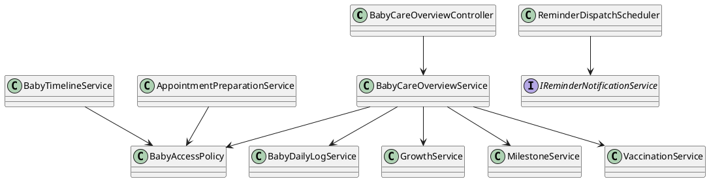
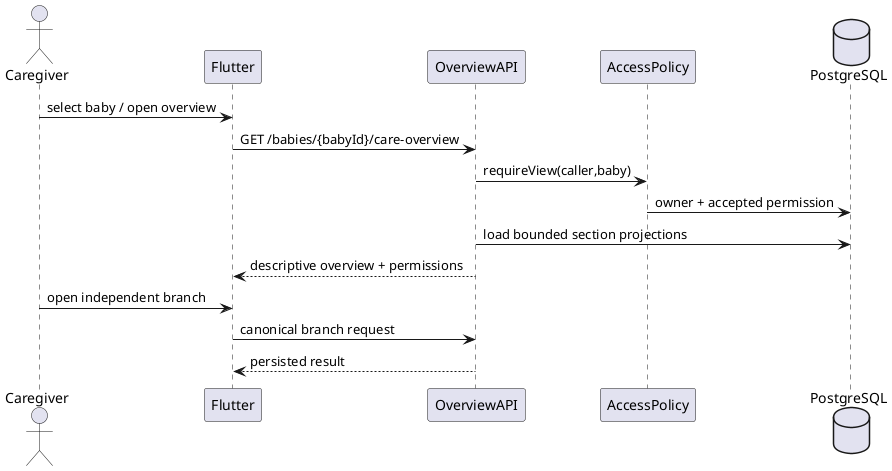
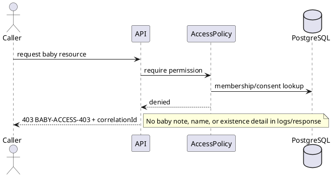
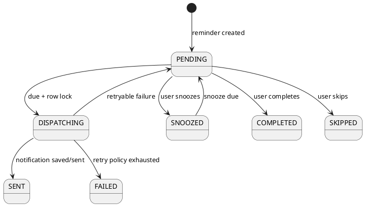

# ENGINEERING DOCUMENTATION STANDARD (EDS) v2.0
# Technical Design Specification — UC-242 Complete Baby Care Workflow

| Metadata | Value |
|---|---|
| **Version** | `0.6` |
| **Status** | `Partially Implemented — Sprint 1 in progress` |
| **Approval Record** | `Project owner approval recorded 2026-07-15` |
| **Created** | `2026-07-15` |
| **Last Updated** | `2026-07-15` |
| **Document Owner** | `PhuongNT` |
| **Author** | `OpenAI Codex — Specification Author` |
| **Approvers** | `Project owner: Approved 2026-07-15; Tech Lead, QA Lead, DPO: role sign-offs pending` |
| **DPO Sign-off** | `[ ] Pending` |
| **Implementation Authorization** | `[x] Approved by project owner; production release remains gated by required role sign-offs` |

---

## CHANGELOG

| Version | Date | Author | Change |
|---|---|---|---|
| `0.3` | `2026-07-15` | `OpenAI Codex` | Sprint 1 implementation started: baby-scoped permission policy, journal/growth guards, observation-only summary, mobile create-log/chart contracts. Targeted tests pass; full backend regression has pre-existing unrelated failures. |
| `0.4` | `2026-07-15` | `OpenAI Codex` | Closed a journal detail/delete path-IDOR: the `{babyId}` route is now validated against the stored log before loading or mutating it; regression tests added. |
| `0.5` | `2026-07-15` | `OpenAI Codex` | Added controller/caregiver permission and revocation coverage, required growth source/date validation, and fail-fast mobile parsing for missing measurement dates. 60 targeted backend and 37 full mobile tests pass. |
| `0.6` | `2026-07-15` | `OpenAI Codex` | Corrected controller role to canonical `FAMILY`, fixed JSONB permission persistence, and passed four full-stack PostgreSQL security integration tests. |
| 0.1 | 2026-07-15 | OpenAI Codex | Initial composite implementation design aligned with MF-03 and current code evidence. |
| 0.2 | 2026-07-15 | OpenAI Codex | Recorded project-owner approval; retained explicit Tech Lead, QA Lead, and DPO release gates. |

---

## MỤC LỤC

1. Tổng quan Module
2. Ma trận Truy vết
3. Architecture Decision Records
4. Non-Functional Requirements & SLA
5. Static Modeling
6. Dynamic Modeling
7. Domain Event Catalog
8. Interface Specification
9. API Specification
10. Bảng mã lỗi
11. Quy trình Triển khai
12. Rollback & Incident Runbook
13. Kịch bản Kiểm thử Chi tiết
14. Phương pháp Xác minh
15. Mẫu thử thực tế
16. Bảng tổng hợp phân quyền
17. AI Prompt Constraints

---

## 1. Tổng quan Module

| Field | Value |
|---|---|
| **UC ID** | `UC-242` |
| **Name** | Complete Baby Care Workflow |
| **Parent Workflow** | `MF-03 — Baby Care Journey, Growth & Vaccination` |
| **Primary Actor** | Mother |
| **Secondary Actor** | Accepted family caregiver with explicit baby permission |
| **Platforms** | Spring Boot API + Flutter Mother Mobile App |
| **Web Scope** | Out of scope |
| **Priority** | P0 integration closure delivered in three ordered sprints |
| **Data Classification** | Sensitive private baby-care and health-support data |
| **Compliance Scope** | PDPA, ownership/consent, RBAC, audit, health-support boundary |

UC-242 closes the gap between the MF-03 activity workflow and the deployed application. It provides one baby-care dashboard from which an authorized caregiver can switch the active baby and independently use profile, journal, growth, milestone, vaccination, reminder, timeline, and appointment-preparation capabilities.

The dashboard is a hub, not a mandatory wizard. A user may enter any permitted branch and return to the overview. The backend is the system of record; production UI must not use hard-coded summary, chart, milestone, vaccination, or reminder data.

**Preconditions**

- Caller is authenticated.
- The selected baby exists, is not hidden by archive policy, and is accessible through ownership or active accepted-family consent.
- Required vaccination/reference data is active when that branch is opened.

**Postconditions**

- A requested write is committed once and audited, or no persistent change occurs and a stable error is returned.
- Read models reflect current authorized data for the selected baby.
- Reminders respect notification preferences and do not disclose sensitive detail in lock-screen text.

**Out of scope**

- Diagnosis, prescription, dosage instruction, developmental-disorder assessment, or a claim that a child is developing normally/abnormally.
- Replacement of official vaccination documentation or pediatric consultation.
- Persisting “night mode” as a medical/daily-log category; night mode is only a Flutter presentation preference.
- Web Portal implementation and offline writes/synchronization.

## 2. Ma trận Truy vết (Traceability Matrix)

| Requirement | Source / Oracle | Design Element | Verification |
|---|---|---|---|
| FR-032…FR-045 | Detailed Scope 121UC, MF-03 | Baby hub and feature services | UC242-TC-INT-001 |
| UC-32…UC-34 | Profile create/update/archive/switch | Existing baby APIs + active-baby state | UC242-TC-001 |
| UC-35 / BR-BABY-04 | Descriptive overview only | `BabyCareOverviewService` | UC242-TC-002, UC242-TC-SEC-006 |
| UC-36…UC-38 / BR-BABY-05…07 | Daily journal and 24h/7d summary | Canonical daily-log endpoints | UC242-TC-003…005 |
| UC-39…UC-40 / BR-DEVELOPMENT-01…02 | Observed milestones only | Add + new list/detail + update/delete | UC242-TC-006…008 |
| UC-41…UC-43 / BR-GROWTH-01…03 | Growth measurement/history/chart | Existing growth APIs, neutral labels | UC242-TC-009…011 |
| UC-44…UC-45 / BR-VACCINE-01…02 | Vaccination record/reference/reminder state | Existing vaccination base route | UC242-TC-012…014 |
| MF-03 workflow | Timeline and appointment preparation | New read-model endpoints | UC242-TC-015…017 |
| BR-OWNERSHIP | Private by default | Corrected `BabyAccessPolicy` + permission matrix | UC242-TC-SEC-001…004 |
| UC-158 / notification preference rules | Due reminder delivery | Idempotent dispatcher + notification module | UC242-TC-INT-004 |
| Approved UI direction | Warm Claymorphism, WCAG 2.1 AA | Flutter tabbed hub and state components | UC242-TC-E2E-001…003 |

Evidence-only legacy artifacts include UC34–UC38, UC45, UC47, UC50, UC158, UC192–UC197, UC228–UC237 TDS/Test-Spec files. Where they conflict with the current Detailed Scope 121UC or current canonical routes, this document takes precedence only after human approval.

## 3. Architecture Decision Records (ADR)

### ADR-242-001 — Composite hub with independent feature branches

#### Bối cảnh (Context)

MF-03 depicts related care activities but users do not need to complete them linearly. Current code already separates baby, care-journey, vaccination, reminder, and notification modules.

#### Các phương án đã xem xét (Options Considered)

1. One mandatory end-to-end wizard.
2. One dashboard that composes independent domain services.
3. A new monolithic baby-care persistence model.

#### Quyết định (Decision)

Use option 2. Flutter owns active navigation state; Spring services retain domain ownership. New overview, timeline, and preparation-summary services compose read-only projections and do not duplicate source records.

#### Hệ quả (Consequences)

- Existing domain APIs remain backward compatible.
- Partial failure is represented per dashboard section; one failed branch does not erase successful sections.
- New composite reads must enforce one centralized access decision before querying child data.

### ADR-242-002 — Central baby access policy, permission-aware caregiver writes

#### Bối cảnh (Context)

Controllers previously mixed `MOTHER`, non-canonical `FAMILY_MEMBER`, and `isAuthenticated()`. The existing `BabyAccessPolicy.canView()` also queried a care-group ID using `babyId`, which was not a valid ownership relation.

#### Các phương án đã xem xét (Options Considered)

1. Keep controller role checks and owner-only service checks.
2. Authorize all authenticated users and trust the client.
3. Centralize owner/accepted-member lookup and apply explicit read/write permissions per domain.

#### Quyết định (Decision)

Use option 3. `BabyAccessPolicy` must resolve groups through the baby owner/care-space relation, require `InviteStatus.ACCEPTED`, require unexpired consent/permission, and expose `canViewBaby`, `canWriteJournal`, `canManageGrowth`, `canManageMilestone`, and `canManageVaccination`. Controller annotations permit canonical roles `MOTHER` and `FAMILY`; service policy remains authoritative.

#### Hệ quả (Consequences)

- Pending/revoked/expired membership always returns 403 without leaking baby existence.
- Owner retains full permitted functionality.
- Permission vocabulary and current family schema must be validated in Sprint 1 before feature writes are enabled.

### ADR-242-003 — Derived timeline and preparation summary

#### Bối cảnh (Context)

MF-03 requires a baby-care timeline and appointment-preparation summary, but no dedicated canonical source currently exists.

#### Quyết định (Decision)

Build deterministic, read-only projections from baby daily logs, growth measurements, milestones, vaccination records, and appointment/vaccination reminders. Sort by event time descending, then stable type/id tie-breakers. Do not persist a duplicate timeline table. The preparation summary contains facts, user notes, due items, and source labels only.

#### Hệ quả (Consequences)

- Source changes appear immediately.
- Pagination uses a stable opaque cursor.
- Missing source sections are returned as empty arrays with `partial=false`; infrastructure failures return an error, not fabricated data.

### ADR-242-004 — Idempotent scheduled reminder dispatch

#### Bối cảnh (Context)

Reminder creation currently receives `dummy-job-id`; a real notification module exists but is not connected to a due-reminder scheduler.

#### Quyết định (Decision)

Add a database-locked due-reminder dispatcher that calls `IReminderNotificationService`. Enforce one notification record per `(reference_type='REMINDER', reference_id, occurrence_at)` using `occurrence_at` metadata promoted to a typed column or an equivalent unique delivery-key column. Preferences are checked at dispatch time. Dummy transport is enabled only in `local`/`test` profiles.

#### Hệ quả (Consequences)

- Scheduler retries cannot duplicate pushes.
- Delivery failure is recorded and retryable without changing the reminder to completed.
- Production startup fails fast if only dummy transport is configured.

### ADR-242-005 — Neutral health-support copy and reference provenance

#### Quyết định (Decision)

Growth, milestone, vaccination, overview, and summary responses may describe entered facts, dates, trends, due/overdue reference status, and provenance. They must not output “healthy,” “normal,” “developing well,” a diagnosis, a risk score, or treatment advice. Reference content includes source name/version/effective date and a consult-qualified-provider notice.

## 4. Non-Functional Requirements & SLA

### 4.1. Performance & Availability

| Metric | Draft target | Measurement |
|---|---|---|
| Single-domain read p95 | ≤ 500 ms in staging dataset | API telemetry |
| Composite overview/timeline p95 | ≤ 1,000 ms in staging dataset | API telemetry |
| Mobile first meaningful state | ≤ 2 s on supported test device/network | Flutter integration timing |
| Availability | Inherit project API SLO; numeric target remains `OPEN-PRODUCT-01` | Operations approval |

### 4.2. Data Integrity & Retention

- All writes are transactional and scoped by `babyId` plus record ID.
- Soft-delete/archive behavior follows the owning UC; composite reads exclude deleted/archived entries by default.
- Timeline is derived and has no independent retention period.
- Retention duration remains `OPEN-DPO-01`; implementation must not invent deletion windows.
- Store instants in UTC and render in the user's configured timezone.

### 4.3. Security

- JWT subject is the caller identity; never accept owner/user ID from request data.
- Apply object-level access checks before returning 404-vs-403-sensitive detail.
- Audit create/update/delete, permission denial, reminder dispatch result, and reference schedule version; do not put free-text baby notes in logs.
- Push title/body use generic wording; detailed data is fetched after authenticated app opening.

### 4.4. Scalability & Capacity Planning

- All history endpoints are paginated; maximum page size 50.
- Index source tables by `(baby_id, event_timestamp DESC)` and reminder dispatch by `(status, effective_scheduled_at)`.
- Scheduler processes bounded batches with database skip-locked semantics.
- Concrete volume assumptions remain `OPEN-ARCH-01` for Tech Lead approval.

## 5. Static Modeling (Mô hình Tĩnh)

### 5.1. Class Diagram (PlantUML)



### 5.2. Data Structure (Flyway SQL Migration)

Existing source tables remain authoritative: `baby_profiles`, `baby_daily_logs`, `development_milestones`, `growth_measurements`, `vaccination_records`, `vaccination_reference_schedule`, `reminders`, `notification_records`, care-group membership/permission tables, and `audit_logs`.

One forward-only migration is required for notification idempotency and query indexes; the implementer must choose the next available timestamped Flyway filename after checking the branch:

```sql
ALTER TABLE public.notification_records
  ADD COLUMN occurrence_at timestamptz;

CREATE UNIQUE INDEX uq_notification_reminder_occurrence
  ON public.notification_records(reference_type, reference_id, occurrence_at)
  WHERE reference_type = 'REMINDER' AND occurrence_at IS NOT NULL;

CREATE INDEX idx_reminders_due_dispatch
  ON public.reminders(status, COALESCE(snoozed_until, scheduled_at));
```

Before migration approval, confirm production duplicates. If duplicates exist, migration must stop and a reviewed reconciliation script must run; never silently delete notification history. No timeline table is created.

## 6. Dynamic Modeling (Mô hình Động)

### 6.1. Sequence Diagram — Happy Path (PlantUML)



### 6.2. Sequence Diagram — Error Path (PlantUML)



### 6.3. State Machine



## 7. Domain Event Catalog

### 7.1. Events Published (Phát ra)

| Event | Producer | Minimum payload | Consumer |
|---|---|---|---|
| `BabyCareRecordChanged` | Owning write service | recordType, recordId, babyId, occurredAt, actorId | audit/cache invalidation |
| `ReminderDue` | Dispatcher | reminderId, ownerUserId, occurrenceAt | notification service |
| `ReminderNotificationResult` | Notification service | reminderId, occurrenceAt, status, attemptCount | audit/operations |

Payloads must exclude free-text notes and measurements unless an approved consumer explicitly requires them.

### 7.2. Events Consumed (Tiêu thụ)

| Event | Consumer | Behavior |
|---|---|---|
| `ReminderDue` | `ReminderNotificationService` | preference gate, idempotency claim, FCM attempt, result persistence |

### 7.3. Payload Schema

```json
{
  "eventType": "ReminderDue",
  "eventVersion": 1,
  "reminderId": "uuid",
  "ownerUserId": "uuid",
  "occurrenceAt": "2026-07-15T03:00:00Z",
  "correlationId": "uuid"
}
```

## 8. Interface Specification (Đặc tả Giao diện)

### 8.1. Service Interface

```java
interface BabyCareOverviewService {
  BabyCareOverviewResponse getOverview(UUID babyId, UUID callerId);
}
interface BabyTimelineService {
  BabyTimelinePage getTimeline(UUID babyId, String cursor, int size, UUID callerId);
}
interface AppointmentPreparationService {
  AppointmentPreparationSummary getSummary(UUID babyId, UUID callerId);
}
interface BabyAccessPolicy {
  BabyPermissions requirePermissions(UUID babyId, UUID callerId);
}
```

### 8.2. Repository Interface

Repositories expose bounded, baby-scoped queries only. Timeline adapters normalize `sourceType`, `sourceId`, `occurredAt`, `displayLabel`, and `sourceVersion`. The dispatcher repository must atomically claim due rows and query existing delivery keys.

### 8.3. Flutter Interface

`BabyCareHubScreen` contains Overview, Journal, Growth, Milestone, Vaccine, and Timeline tabs. It uses shared Warm Claymorphism tokens/components, semantic labels, 48dp touch targets, text scaling, visible focus, and distinct loading/error/empty/permission-denied states. Night mode changes theme only. Production flavors reject mock repositories.

## 9. API Specification

### 9.1. Endpoints Table

| Method | Endpoint | Purpose | Access |
|---|---|---|---|
| GET | `/api/v1/babies/{babyId}/care-overview` | Composite descriptive hub | view permission |
| GET | `/api/v1/babies/{babyId}/care-timeline?cursor=&size=` | Stable derived timeline | view permission |
| GET | `/api/v1/babies/{babyId}/appointment-preparation-summary` | Appointment fact summary | view permission |
| GET | `/api/v1/babies/{babyId}/milestones` | Paginated milestone list | view permission |
| GET | `/api/v1/babies/{babyId}/milestones/{milestoneId}` | Milestone detail | view permission |
| Existing | `/api/v1/babies/{babyId}/daily-logs/**` | Journal CRUD/detail/summary | per-operation permission |
| Existing | `/api/v1/babies/{babyId}/growth-measurements/**` | Growth CRUD/history | per-operation permission |
| Existing | `/api/v1/babies/{babyId}/growth-chart` | Neutral chart | view permission |
| Existing | `/api/v1/vaccination/babies/{babyId}/**` | Vaccination canonical route | per-operation permission |

### 9.2. Request / Response Schemas

#### `GET /api/v1/babies/{babyId}/care-overview`

```json
{
  "data": {
    "babyId": "uuid",
    "asOf": "2026-07-15T03:00:00Z",
    "permissions": {"view": true, "journalWrite": true, "growthWrite": false},
    "recentJournal": [],
    "latestGrowth": null,
    "recentMilestones": [],
    "vaccination": {"dueCount": 0, "overdueCount": 0, "referenceVersion": "string"},
    "reminders": [],
    "notice": "For observation and appointment preparation; not a medical assessment."
  }
}
```

#### `GET /api/v1/babies/{babyId}/care-timeline`

```json
{
  "data": {
    "items": [{"sourceType":"DAILY_LOG","sourceId":"uuid","occurredAt":"2026-07-15T02:00:00Z","label":"Feeding entry"}],
    "nextCursor": null
  }
}
```

#### `GET /api/v1/babies/{babyId}/appointment-preparation-summary`

Returns baby identity context, recent user-entered observations, latest measurements with source/time, recorded milestones, vaccination/reference status, active reminders, and user notes. It returns no generated diagnosis, recommendation, or clinical priority.

## 10. Bảng mã lỗi (Error Codes)

| Code | HTTP | Meaning | Client behavior |
|---|---:|---|---|
| `BABY-ACCESS-401` | 401 | Missing/invalid authentication | Re-authenticate |
| `BABY-ACCESS-403` | 403 | Permission/consent absent, pending, expired, or revoked | Permission state; do not retry |
| `BABY-404` | 404 | Authorized scope contains no baby | Safe not-found state |
| `BABY-LOG-400` | 400 | Invalid journal payload | Field errors |
| `BABY-GROWTH-400` | 400 | Invalid measurement/source/date | Field errors |
| `BABY-MILESTONE-404` | 404 | Milestone absent in authorized baby | Not-found state |
| `BABY-VACCINE-REFERENCE-503` | 503 | Reference data unavailable | Retry/reference unavailable notice |
| `BABY-CURSOR-400` | 400 | Invalid/expired cursor | Reload first page |
| `REMINDER-DISPATCH-CONFLICT` | 409 | Occurrence already claimed | Treat as idempotent success internally |
| `INTERNAL-500` | 500 | Unexpected failure with correlation ID | Generic retry state |

## 11. Quy trình Triển khai (Step-by-Step)

### 11.1. Prerequisites

- [ ] TDS and Test-Spec approved by Product Owner, Tech Lead, QA Lead, and DPO.
- [ ] Family permission vocabulary and baby-to-care-group relation confirmed.
- [ ] Current API/mobile route inventory baselined.
- [ ] Production Firebase configuration and notification preference category confirmed.
- [ ] Reference schedule provenance approved.

### 11.2. Pre-Migration Checklist

- [ ] Backup/restore rehearsal completed in non-production.
- [ ] Duplicate reminder-occurrence query returns zero or reviewed reconciliation exists.
- [ ] Next Flyway timestamp/name confirmed; no edit to applied migration.
- [ ] DPO approves new typed notification occurrence metadata.

### 11.3. Implementation Steps

#### Chặng 1 — Sprint 1: access foundation, journal, growth

1. Correct `BabyAccessPolicy` relation and introduce permission-aware service guards.
2. Normalize controller roles to `MOTHER`/`FAMILY` plus service authorization.
3. Complete Flutter daily-log create/list/summary using backend data; remove dashboard constants.
4. Complete growth history/chart routing and replace diagnostic/WHO conclusion copy with neutral source-labelled context.
5. Add unit/integration/security tests; no Sprint 2 work starts until Sprint 1 gate passes.

#### Chặng 2 — Sprint 2: milestone, vaccination, dashboard

1. Add milestone list/detail endpoints and Flutter screens.
2. Align Flutter vaccination service to `/api/v1/vaccination/babies/{babyId}/...`; complete schedule/record flows.
3. Implement composite overview and tabbed mobile hub with loading/error/empty/access states.
4. Verify active-baby switching updates every tab without changing ownership.

#### Chặng 3 — Sprint 3: dispatcher, timeline, preparation, E2E

1. Apply notification idempotency migration and repository claim query.
2. Connect due-reminder scheduler to real notification service; profile-gate dummy transport.
3. Implement timeline and appointment-preparation projections.
4. Add Flutter timeline/summary views and generic push deep-link flow.
5. Run backend, Flutter, integration, security, and E2E regression suite.

#### Chặng 4 — Verification sau deploy

Run health check, migration validation, an authorized/denied overview smoke test, a no-duplicate scheduler test, and a sensitive-log scan. Feature flags remain available for composite views and reminder dispatch.

### 11.4. Deployment Checklist

- [ ] `mvnw.cmd test` and `mvnw.cmd clean package` pass.
- [ ] `flutter analyze` and `flutter test` pass.
- [ ] API contract tests and supported-device smoke tests pass.
- [ ] No production mock/dummy data path is reachable.
- [ ] Dashboards/alerts cover dispatch failures and API error rate.

## 12. Rollback & Incident Runbook

### 12.1. Điều kiện kích hoạt Rollback (Trigger Conditions)

Rollback/disable when unauthorized baby data is exposed, writes target the wrong baby, duplicate pushes occur, migrations fail, or health-boundary copy is violated. Privacy exposure immediately triggers the security/privacy incident process.

### 12.2. Rollback Procedure

1. Disable `baby-care-composite-views` and/or `reminder-dispatch-v2` feature flags.
2. Stop dispatcher before reverting application code.
3. Re-deploy the previous API/mobile version while retaining new nullable columns/index unless a DBA-approved forward migration removes them.
4. Do not delete notification/audit evidence.
5. Verify legacy canonical domain endpoints and run access-control smoke tests.

### 12.3. Notification Protocol

| When | Notify | Content |
|---|---|---|
| Immediate | On-call + Tech Lead | Correlation IDs, affected feature, containment |
| Immediate for suspected privacy issue | Security + DPO | Minimum necessary incident facts; no sensitive notes in chat |
| Before re-enable | Product + QA + DPO | Root cause, fix evidence, regression result |

### 12.4. Post-Incident Review (PIR)

Complete within the project incident-policy window (`OPEN-OPS-01`): root cause, affected records/users, control failure, corrective tests, owner, and due date.

## 13. Kịch bản Kiểm thử Chi tiết

### 13.1. Unit Tests

#### TC-UNIT-001 — Permission decision

Owner and accepted unexpired caregiver receive exact permissions; pending/revoked/expired membership receives none.

#### TC-UNIT-002 — Neutral projection

Overview/growth/milestone/preparation output contains facts and provenance and rejects forbidden clinical conclusion vocabulary.

#### TC-UNIT-003 — Timeline ordering

Mixed records order by event time descending with deterministic tie-breakers and no deleted entries.

#### TC-UNIT-004 — Reminder idempotency

Two claims for one reminder occurrence create at most one notification record/send attempt owner.

### 13.2. Integration Tests

#### TC-INT-001 — Complete authorized MF-03 traversal

Create/select baby, add journal/growth/milestone/vaccination data, load overview/timeline/preparation, and verify persisted backend values.

#### TC-INT-002 — Cross-baby isolation

Record IDs from baby A cannot be read or mutated through baby B routes.

#### TC-INT-003 — Partial source conditions

Empty optional sources return valid empty sections; database/service failure returns a stable error and no fabricated section.

#### TC-INT-004 — Scheduler to FCM record

Due reminder, enabled preference, and active token create one auditable delivery result; disabled preference creates no push.

### 13.3. E2E / Security Tests

#### TC-E2E-001 — Mobile hub

Switch active baby and verify all tabs refresh, back navigation is preserved, and no previous baby's content flashes.

#### TC-E2E-002 — UI states and accessibility

Verify loading, empty, retry, offline-read failure, permission denial, text scaling, screen reader labels, contrast, and 48dp targets.

#### TC-E2E-003 — Safe notification deep link

Lock-screen message is generic; opening requires authentication and re-checks baby permission.

## 14. Phương pháp Xác minh

### 14.1. Database Inspection

Verify foreign keys, new unique/index definitions, no duplicate delivery key, correct `baby_id` scoping, and no physical timeline duplication.

### 14.2. Log / Audit Verification

Search structured logs for correlation IDs and expected audit actions. Scan logs for baby names, free-text notes, measurements, tokens, and notification bodies; expected result is no sensitive payload leakage.

### 14.3. Tool-based Verification

- Backend: Maven unit/integration/package commands.
- Mobile: Dart format, Flutter analyze/test, supported-device integration test.
- Contract: OpenAPI diff and mobile service route assertions.
- Security: unauthorized object-ID substitution, expired consent, token expiry, push deep-link reauthorization.

## 15. Mẫu thử thực tế (API Verification Samples)

### 15.1. Happy Path

```http
GET /api/v1/babies/11111111-1111-1111-1111-111111111111/care-overview HTTP/1.1
Authorization: Bearer <owner-or-permitted-caregiver-token>
```

Expected: `200`, persisted sections, explicit permissions, neutral notice, no diagnosis.

### 15.2. Error Paths

```http
GET /api/v1/babies/11111111-1111-1111-1111-111111111111/care-timeline HTTP/1.1
Authorization: Bearer <unauthorized-token>
```

Expected: `403 BABY-ACCESS-403`, correlation ID, no baby-identifying detail.

## 16. Bảng tổng hợp phân quyền (Authorization Matrix)

| Capability | MOTHER owner | FAMILY accepted + explicit permission | Other authenticated | Guest | SYSTEM |
|---|---:|---:|---:|---:|---:|
| View overview/timeline/summary | Allow | Allow: `BABY_VIEW` | Deny | 401 | Service-only |
| Write daily journal | Allow | Allow: `BABY_JOURNAL_WRITE` | Deny | 401 | Deny |
| Manage growth | Allow | Allow: `BABY_GROWTH_WRITE` | Deny | 401 | Deny |
| Manage milestone | Allow | Allow: `BABY_MILESTONE_WRITE` | Deny | 401 | Deny |
| Manage vaccination record | Allow | Allow: `BABY_VACCINATION_WRITE` | Deny | 401 | Deny |
| Dispatch due reminder | Deny | Deny | Deny | Deny | Allow |

Exact permission identifiers are a proposed contract and must be reconciled with the existing family permission enum in Sprint 1; behavioral meanings above are mandatory.

## 17. AI Prompt Constraints (CASE 2.0)

### 17.1 Constraint Summary Table

| ID | Constraint | Oracle | Date |
|---|---|---|---|
| C1 | Backend persisted data is the production source of truth; no hard-coded/mock feature data. | Approved UC242 direction | 2026-07-15 |
| C2 | Never diagnose, prescribe, assess development, or claim healthy/normal status. | BR-HEALTH-BOUNDARY, BR-BABY-04/07, BR-DEVELOPMENT-01, BR-GROWTH-03 | 2026-07-15 |
| C3 | Every baby read/write requires object-level owner or accepted explicit permission. | BR-OWNERSHIP, ADR-242-002 | 2026-07-15 |
| C4 | Use canonical existing route `/api/v1/vaccination/babies/{babyId}/...`. | Current code evidence | 2026-07-15 |
| C5 | Night mode is UI-only and never a daily-log type. | Approved UC242 direction | 2026-07-15 |
| C6 | Timeline/preparation are derived read models; do not create duplicate clinical facts. | ADR-242-003 | 2026-07-15 |
| C7 | Reminder delivery is preference-gated, generic, auditable, and idempotent per occurrence. | ADR-242-004 | 2026-07-15 |

### 17.2 Constraint Injection Block (Copy-Paste vào AI Prompt)

```text
Implement UC-242 only from the approved TDS/Test-Spec and in sprint order.
Preserve canonical domain routes and use the backend as source of truth.
Authorize every baby object through BabyAccessPolicy; JWT subject is caller identity.
Do not produce diagnosis, prescription, developmental assessment, or healthy/normal conclusions.
Treat night mode as Flutter presentation state only.
Derive timeline and appointment preparation from existing records; do not duplicate them.
Dispatch one generic, preference-gated notification per reminder occurrence and persist the result.
Stop when an OPEN item would require inventing policy, retention, permission semantics, or clinical content.
```

### 17.3 Constraint Quality Checklist

- [x] Each constraint is binary and testable.
- [x] Safety/privacy constraints cite an oracle.
- [x] No retention, availability, or capacity number is invented.
- [x] Production mock data and clinical inference are explicitly prohibited.
- [ ] Human approvers accept all proposed contracts and OPEN items.

### 17.4 Anti-Pattern Detection (cho AI-Generated Code từ Block này)

| Anti-pattern | Detection | Required action |
|---|---|---|
| Role-only authorization | Controller role exists but no baby policy call | Reject |
| Diagnostic UI copy | “healthy”, “normal”, “developing well”, diagnosis/risk conclusion | Reject |
| Mock production repository | constants/fake data reachable outside test/demo | Reject |
| Cross-baby IDOR | query by record ID without `babyId`/policy scope | Reject |
| Duplicate reminder | multiple delivery keys for one occurrence | Reject |
| Sensitive push/log | baby detail in push or structured logs | Reject |

## PHỤ LỤC

### A. Glossary (Thuật ngữ)

| Term | Meaning |
|---|---|
| MF-03 | Baby Care Journey, Growth & Vaccination workflow |
| Care hub | Non-linear mobile entry point to independent baby-care branches |
| Reference schedule | Informational vaccination source, not a clinical order |
| Occurrence | One effective scheduled execution of a reminder |

### B. Tài liệu tham chiếu

- `03_Design/ActivityDiagram/CareBridge-Main-Workflows.drawio` — MF-03 workflow evidence.
- `02_Requirements/SRS/3_Functional_Specification_Detailed_Scope_121UC.md` — approved behavior/business-rule oracle.
- `02_Requirements/SRS/4_Functional_Requirements_Detailed_Scope_121UC.md` — FR-032…FR-045.
- Related artifacts under `04_Implement/` — legacy supporting evidence only.
- Current Spring Boot and Flutter source — implementation evidence only, not requirement authority.

### C. Open Items Requiring Human Approval

| ID | Decision owner | Item | Blocks |
|---|---|---|---|
| OPEN-PRODUCT-01 | Product/Operations | Numeric availability SLO | Release gate only |
| OPEN-DPO-01 | DPO/Product | Baby-care retention/deletion periods | Production release |
| OPEN-ARCH-01 | Tech Lead | Capacity assumptions and scheduler batch size | Performance approval |
| OPEN-OPS-01 | Operations | PIR completion window/channel names | Operations runbook |
| OPEN-PERM-01 | Product/Tech Lead | Map proposed permission meanings to existing family schema | Sprint 1 caregiver writes |

## Review Findings

- [x] [Review][Patch] Archived care groups no longer grant baby access; `BabyAccessPolicy` filters linked groups to `ACTIVE`.
- [x] [Review][Patch] Accepted caregiver memberships with expired consent are denied by `CareGroupAuthorizationPolicy`.
- [x] [Review][Patch] Journal and growth write-denial attempts emit `SECURITY_EVENT` audit records.
- [x] [Review][Patch] Daily-log collection endpoint and mobile service are implemented with active-record filtering.
- [x] [Review][Patch] `SYMPTOM` is accepted by the backend and included in summary zero-fill types.
- [x] [Review][Patch] Growth measurement parsing safely handles missing or malformed dates.
- [x] [Review][Patch] Milestone update/delete now reject a mismatched `{babyId}` path with neutral not-found semantics; regression tests cover both operations.
- [x] [Patch] Reminder state transitions now treat completed/skipped as immutable, allow snoozed reminders to be completed/skipped, and create the next recurring occurrence with audit and push scheduling.
