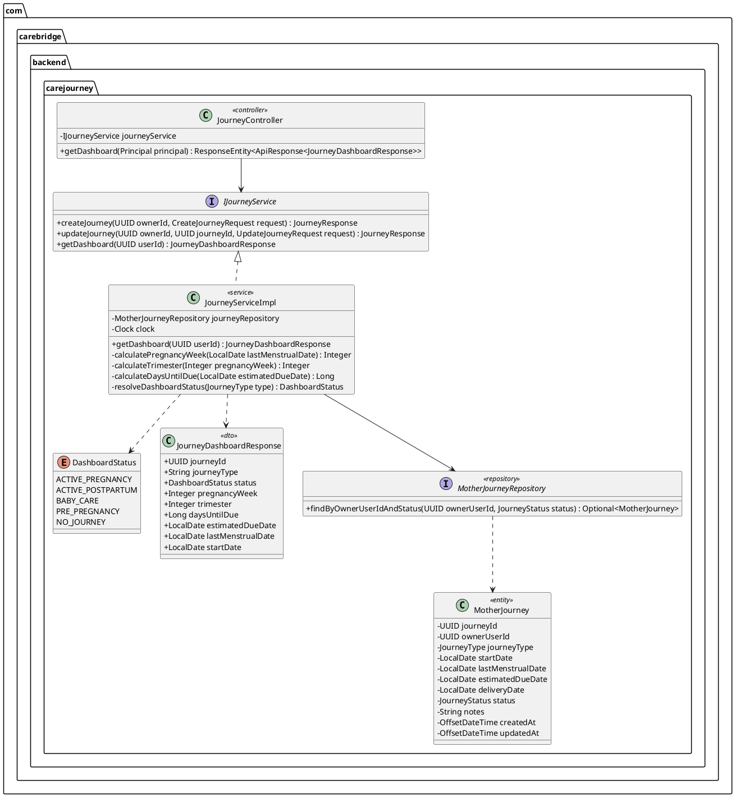
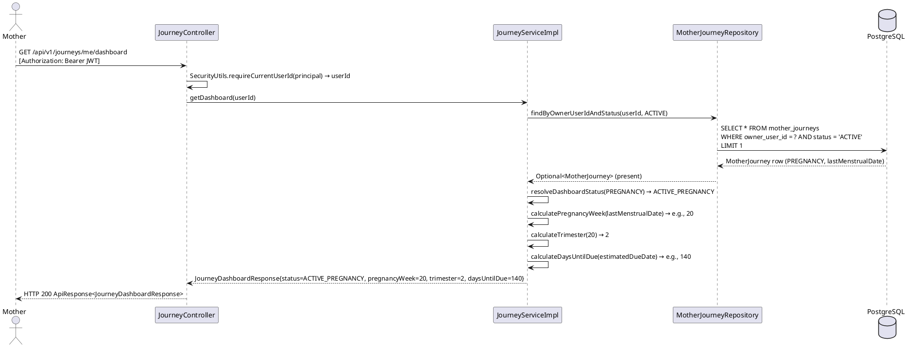
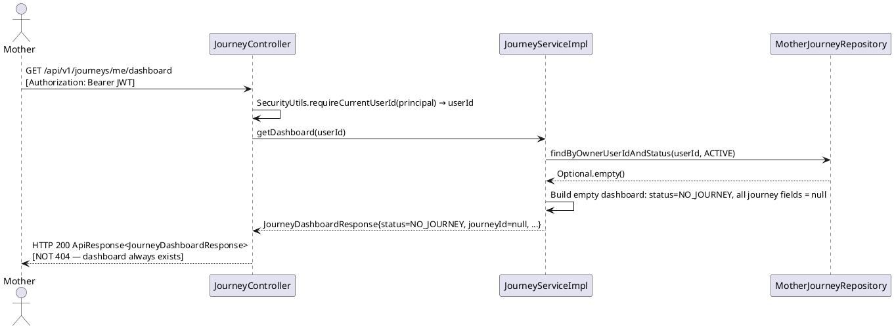

# Technical Design Specification — UC24: View Mother Journey Dashboard

| Field            | Value                                                     |
|------------------|-----------------------------------------------------------|
| Document ID      | CB-JOURNEY-IMP-003                                        |
| Version          | 1.0                                                       |
| Date             | 2026-06-26                                                |
| Status           | Draft                                                     |
| Document Owner   | PhuongNT                                                  |
| Author           | AI Agent                                                  |
| Based on EDS     | v2.0                                                      |
| SRS Reference    | SRS 3.3.1.3 — View Mother Journey Dashboard               |
| Related UC       | UC22 (Create Journey), UC23 (Update Journey)              |
| Secondary Actor  | Firebase Cloud Messaging (future — not MVP)               |

---

## 1. Tổng Quan (Overview)

### 1.1 Mô Tả Use Case

UC24 cung cấp cho người dùng có vai trò **ROLE_MOTHER** một màn hình tổng quan (dashboard) về hành trình thai kỳ hiện tại của họ. Dashboard tổng hợp thông tin từ hành trình đang hoạt động (status = ACTIVE), tính toán tuần thai nghén hoặc giai đoạn sau sinh, và trả về số liệu như trimester, số ngày đến ngày dự sinh.

Endpoint sử dụng mẫu `/me` (ví dụ `/journeys/me/dashboard`) để tự động giải quyết người dùng hiện tại từ JWT — loại bỏ IDOR vì không có `{userId}` trong URL.

Nếu không có hành trình đang hoạt động, endpoint trả về **HTTP 200** với `status = NO_JOURNEY` (không phải 404).

### 1.2 Bounded Context

| Property         | Value                                             |
|------------------|---------------------------------------------------|
| Bounded Context  | `journey`                                         |
| Package          | `com.carebridge.backend.carejourney`              |
| HTTP Method      | GET                                               |
| Endpoint         | `/api/v1/journeys/me/dashboard`                   |
| Platform         | Mobile App                                        |
| Actor            | Mother (ROLE_MOTHER)                              |
| Read-Only        | Yes — no writes performed in this endpoint        |

### 1.3 Dashboard Status Values

| Dashboard Status     | Condition                                              |
|----------------------|--------------------------------------------------------|
| `ACTIVE_PREGNANCY`   | Active journey with `journey_type = PREGNANCY`         |
| `ACTIVE_POSTPARTUM`  | Active journey with `journey_type = POSTPARTUM`        |
| `BABY_CARE`          | Active journey with `journey_type = BABY_CARE`         |
| `PRE_PREGNANCY`      | Active journey with `journey_type = PRE_PREGNANCY`     |
| `NO_JOURNEY`         | No active journey found for the authenticated user     |

---

## 2. Traceability

### 2.1 SRS Requirements

| SRS ID         | Description                                                                                                      |
|----------------|------------------------------------------------------------------------------------------------------------------|
| SRS-3.3.1.3    | View Mother Journey Dashboard — Displays pregnancy week or postpartum stage, tasks, reminders, and suggested content |

### 2.2 Business Rules

| Rule ID          | Description                                                                                                       | Enforcement Layer           |
|------------------|-------------------------------------------------------------------------------------------------------------------|-----------------------------|
| BR-JOURNEY-020   | Dashboard shows only the authenticated Mother's OWN journey — userId extracted exclusively from JWT               | JourneyServiceImpl          |
| BR-JOURNEY-021   | If no active journey exists, return HTTP 200 with `status = NO_JOURNEY` and all journey fields null              | JourneyServiceImpl          |
| BR-JOURNEY-022   | Pregnancy week = `floor((today - lastMenstrualDate) / 7)` using `ChronoUnit.WEEKS.between()`                     | JourneyServiceImpl (Java)   |
| BR-JOURNEY-023   | Only query journeys with `status = ACTIVE` — completed and archived journeys are excluded from dashboard          | JourneyRepository query      |
| BR-RBAC          | Only authenticated users with ROLE_MOTHER may access this endpoint                                               | Spring Security              |
| BR-PRIVACY       | Health data is personal — no user ID in URL prevents cross-user data access                                       | ADR-JOURNEY-003-003          |
| BR-CONSULTATION  | Dashboard is read-only — no clinical decisions or modifications made                                              | Architecture constraint      |

### 2.3 Non-Functional Requirements

| ID     | Requirement                                                        |
|--------|--------------------------------------------------------------------|
| NFR-01 | Response latency P95 < 400 ms (aggregation query)                 |
| NFR-02 | Caching not required for MVP — acceptable to query DB on each call |
| NFR-03 | Sensitive health data — TLS required for all transport             |
| NFR-04 | Pregnancy week calculation in Java service layer (not SQL)         |

---

## 3. Architectural Decision Records (ADRs)

### ADR-JOURNEY-003-001: Dashboard is Read-Only — No Writes

**Decision:** `GET /api/v1/journeys/me/dashboard` performs no writes, no side effects, and emits no events.

**Rationale:** Separating reads from writes keeps the dashboard endpoint idempotent and cacheable in the future. Dashboard queries must not accidentally trigger state changes.

**Consequence:** Any business logic that requires a write (e.g., auto-archiving old journeys) is handled by a scheduled service, not by the dashboard endpoint.

---

### ADR-JOURNEY-003-002: Pregnancy Week Calculated in Java Service Layer, Not SQL

**Decision:** Pregnancy week is computed using `ChronoUnit.WEEKS.between(lastMenstrualDate, LocalDate.now())` in `JourneyServiceImpl`, not via a SQL `DATE_PART` expression.

**Rationale:** Java-layer calculation is unit-testable with fixed clocks (`Clock`). SQL-layer calculation would require integration tests to verify. The service can be tested deterministically by injecting a `Clock` mock.

**Consequence:** `JourneyServiceImpl` should accept a `Clock` dependency (injectable, defaults to `Clock.systemDefaultZone()`). Tests inject a fixed clock to produce deterministic week numbers.

---

### ADR-JOURNEY-003-003: Use /me Pattern to Prevent IDOR

**Decision:** Endpoint path is `/api/v1/journeys/me/dashboard` — the `me` segment signals "current authenticated user." There is no `{userId}` path variable for the dashboard.

**Rationale:** Placing `{userId}` in the URL for a personal dashboard creates an IDOR vector if authorization is misconfigured. The `/me` pattern eliminates this risk by design.

**Consequence:** `JourneyController.getDashboard()` extracts `userId` exclusively from `SecurityUtils.requireCurrentUserId(principal)` — no user-supplied ID parameter.

---

## 4. Non-Functional Requirements Detail

| ID      | Metric               | Target            | Measurement                                      |
|---------|----------------------|-------------------|--------------------------------------------------|
| NFR-01  | P95 Latency          | < 400 ms          | APM trace on GET /me/dashboard                   |
| NFR-02  | Caching              | None (MVP)        | No Cache-Control header required for MVP         |
| NFR-03  | Transport Security   | TLS 1.2+          | HTTPS enforced in API Gateway                    |
| NFR-04  | Calculation Layer    | Java service only | Pregnancy week not computed in SQL               |
| NFR-05  | Read-Only            | No DB writes      | No `@Transactional` write path in this endpoint  |

---

## 5. Static Modeling



---

## 6. Dynamic Modeling

### 6.1 Happy Path — Active PREGNANCY Journey



### 6.2 No Active Journey — NO_JOURNEY Response



---

## 7. Domain Events

No domain events are emitted by the dashboard endpoint. This is a read-only operation.

| Trigger            | Event | Reason                                              |
|--------------------|-------|-----------------------------------------------------|
| GET /me/dashboard  | None  | Read-only; no state mutation; no audit required for reads |

---

## 8. Interface Specification

### 8.1 JourneyDashboardResponse DTO

```java
package com.carebridge.backend.carejourney.dto;

import com.carebridge.backend.carejourney.enums.DashboardStatus;
import com.fasterxml.jackson.annotation.JsonFormat;
import lombok.Builder;
import lombok.Data;
import java.time.LocalDate;
import java.util.UUID;

@Data
@Builder
public class JourneyDashboardResponse {

    /** null if no active journey */
    private UUID journeyId;

    /** PREGNANCY, POSTPARTUM, BABY_CARE, PRE_PREGNANCY — null if no active journey */
    private String journeyType;

    /** Dashboard status: ACTIVE_PREGNANCY, ACTIVE_POSTPARTUM, BABY_CARE, PRE_PREGNANCY, NO_JOURNEY */
    private DashboardStatus status;

    /** Pregnancy week (floor of days / 7). null if journey type is not PREGNANCY */
    private Integer pregnancyWeek;

    /** 1, 2, or 3. null if not a PREGNANCY journey */
    private Integer trimester;

    /** Days from today to estimatedDueDate. Negative if past due. null if no estimatedDueDate */
    private Long daysUntilDue;

    @JsonFormat(pattern = "yyyy-MM-dd")
    private LocalDate estimatedDueDate;

    @JsonFormat(pattern = "yyyy-MM-dd")
    private LocalDate lastMenstrualDate;

    @JsonFormat(pattern = "yyyy-MM-dd")
    private LocalDate startDate;
}
```

### 8.2 IJourneyService — getDashboard Method

```java
package com.carebridge.backend.carejourney.service;

import com.carebridge.backend.carejourney.dto.JourneyDashboardResponse;
import java.util.UUID;

public interface IJourneyService {

    /**
     * UC24 — Return the dashboard view for the authenticated mother.
     *
     * <p>Always returns HTTP 200. If no active journey exists, returns
     * a response with {@code status = NO_JOURNEY} and all journey fields null.
     *
     * @param userId UUID extracted from JWT (never from URL parameter)
     * @return       JourneyDashboardResponse — never null
     */
    JourneyDashboardResponse getDashboard(UUID userId);
}
```

### 8.3 Pregnancy Calculation Logic

```java
// Pregnancy week: floor division using ChronoUnit
private Integer calculatePregnancyWeek(LocalDate lastMenstrualDate) {
    if (lastMenstrualDate == null) return null;
    long weeks = ChronoUnit.WEEKS.between(lastMenstrualDate, LocalDate.now(clock));
    return (int) Math.max(0, weeks);
}

// Trimester: standard obstetric definition
private Integer calculateTrimester(Integer pregnancyWeek) {
    if (pregnancyWeek == null) return null;
    if (pregnancyWeek <= 13) return 1;
    if (pregnancyWeek <= 27) return 2;
    return 3;
}

// Days until estimated due date (can be negative if past due)
private Long calculateDaysUntilDue(LocalDate estimatedDueDate) {
    if (estimatedDueDate == null) return null;
    return ChronoUnit.DAYS.between(LocalDate.now(clock), estimatedDueDate);
}

// Resolve dashboard status string from journey type
private DashboardStatus resolveDashboardStatus(JourneyType type) {
    return switch (type) {
        case PREGNANCY     -> DashboardStatus.ACTIVE_PREGNANCY;
        case POSTPARTUM    -> DashboardStatus.ACTIVE_POSTPARTUM;
        case BABY_CARE     -> DashboardStatus.BABY_CARE;
        case PRE_PREGNANCY -> DashboardStatus.PRE_PREGNANCY;
    };
}
```

### 8.4 JourneyController — GET Endpoint Signature

```java
@GetMapping("/me/dashboard")
@PreAuthorize("hasRole('MOTHER')")
public ResponseEntity<ApiResponse<JourneyDashboardResponse>> getDashboard(Principal principal) {
    UUID userId = SecurityUtils.requireCurrentUserId(principal);
    JourneyDashboardResponse dashboard = journeyService.getDashboard(userId);
    return ResponseEntity.ok(ApiResponse.success(dashboard));
}
```

---

## 9. API Specification

### 9.1 Endpoint

| Property        | Value                                       |
|-----------------|---------------------------------------------|
| Method          | GET                                         |
| Path            | `/api/v1/journeys/me/dashboard`             |
| Authentication  | Bearer JWT (ROLE_MOTHER)                    |
| Content-Type    | `application/json` (response)               |
| Idempotent      | Yes                                         |
| Side Effects    | None                                        |

### 9.2 Path / Query Parameters

None. User identity is derived from JWT.

### 9.3 Success Response — Active PREGNANCY Journey (HTTP 200)

```json
{
  "success": true,
  "data": {
    "journeyId": "cccccccc-0000-0000-0000-000000000024",
    "journeyType": "PREGNANCY",
    "status": "ACTIVE_PREGNANCY",
    "pregnancyWeek": 20,
    "trimester": 2,
    "daysUntilDue": 140,
    "estimatedDueDate": "2026-11-15",
    "lastMenstrualDate": "2026-02-01",
    "startDate": "2026-02-01"
  }
}
```

### 9.4 Success Response — No Active Journey (HTTP 200)

```json
{
  "success": true,
  "data": {
    "journeyId": null,
    "journeyType": null,
    "status": "NO_JOURNEY",
    "pregnancyWeek": null,
    "trimester": null,
    "daysUntilDue": null,
    "estimatedDueDate": null,
    "lastMenstrualDate": null,
    "startDate": null
  }
}
```

### 9.5 Success Response — Active POSTPARTUM Journey (HTTP 200)

```json
{
  "success": true,
  "data": {
    "journeyId": "dddddddd-0000-0000-0000-000000000024",
    "journeyType": "POSTPARTUM",
    "status": "ACTIVE_POSTPARTUM",
    "pregnancyWeek": null,
    "trimester": null,
    "daysUntilDue": null,
    "estimatedDueDate": null,
    "lastMenstrualDate": null,
    "startDate": "2026-05-01"
  }
}
```

### 9.6 Error Responses

| Scenario              | HTTP | Description                    |
|-----------------------|------|--------------------------------|
| No JWT / expired JWT  | 401  | Unauthorized                   |
| Role is not MOTHER    | 403  | Access denied                  |

---

## 10. Error Codes

| Code          | HTTP | Description                    | Recovery Hint                             |
|---------------|------|--------------------------------|-------------------------------------------|
| JOURNEY-020   | 401  | No JWT or JWT expired          | Re-authenticate and retry with valid token |
| (No 404)      | 200  | No active journey              | Response body has `status = NO_JOURNEY`    |

**Important:** There is no JOURNEY-NOT-FOUND error for the dashboard. The dashboard always returns HTTP 200. Mobile clients must check `data.status` to determine whether to show the onboarding flow or an active journey view.

---

## 11. Implementation Plan

### 11.1 Files to Create / Modify

| File                                                                              | Action   | Notes                                                        |
|-----------------------------------------------------------------------------------|----------|--------------------------------------------------------------|
| `JourneyDashboardResponse.java`                                                    | Create   | DTO with all dashboard fields                                |
| `DashboardStatus.java`                                                             | Create   | Enum: ACTIVE_PREGNANCY, ACTIVE_POSTPARTUM, BABY_CARE, PRE_PREGNANCY, NO_JOURNEY |
| `IJourneyService.java`                                                             | Modify   | Add `getDashboard(UUID userId)` method                       |
| `JourneyServiceImpl.java`                                                          | Modify   | Implement `getDashboard()` with calculation helpers          |
| `MotherJourneyRepository.java`                                                     | Modify   | Add `findByOwnerUserIdAndStatus()` query method              |
| `JourneyController.java`                                                           | Modify   | Add `GET /me/dashboard` endpoint                             |

### 11.2 No Database Migration Required

No new columns or tables. The `mother_journeys` table (V1) has all required fields.

### 11.3 Implementation Steps

```
1. Create DashboardStatus enum
2. Create JourneyDashboardResponse DTO
3. Add findByOwnerUserIdAndStatus() to MotherJourneyRepository
4. Add getDashboard(UUID userId) to IJourneyService
5. Implement JourneyServiceImpl.getDashboard():
   a. findByOwnerUserIdAndStatus(userId, ACTIVE) → Optional<MotherJourney>
   b. If Optional.empty() → return JourneyDashboardResponse.builder().status(NO_JOURNEY).build()
   c. Else → resolveDashboardStatus(journey.getJourneyType())
   d. If journey type == PREGNANCY and lastMenstrualDate != null:
      - pregnancyWeek = calculatePregnancyWeek(lastMenstrualDate)
      - trimester = calculateTrimester(pregnancyWeek)
   e. If estimatedDueDate != null → daysUntilDue = calculateDaysUntilDue(estimatedDueDate)
   f. Build and return JourneyDashboardResponse
6. Add GET /me/dashboard to JourneyController
```

---

## 12. Rollback Plan

| Scenario                    | Rollback Steps                                                            |
|-----------------------------|---------------------------------------------------------------------------|
| Code defect post-deployment | Revert commits on `PhuongNT` branch; no DB migration to roll back         |
| Incorrect calculation       | Fix calculation logic in `JourneyServiceImpl` — deploy hotfix             |
| Emergency                   | Disable GET endpoint in API Gateway; mobile falls back to journey list page |

---

## 13. Test Scenarios Summary

Full test cases are defined in `UC24_ViewMotherJourneyDashboard_Test-Spec.md` (CB-JOURNEY-IMP-003-TEST).

| Test ID                    | Type        | Description                                          | Expected Result             |
|----------------------------|-------------|------------------------------------------------------|-----------------------------|
| JOURNEY-TC-024-001         | Unit        | Active PREGNANCY journey — full dashboard            | HTTP 200, pregnancyWeek set |
| JOURNEY-TC-024-002         | Unit        | Active POSTPARTUM journey — no pregnancy fields      | HTTP 200, pregnancyWeek=null |
| JOURNEY-TC-024-003         | Unit        | No active journey — NO_JOURNEY                       | HTTP 200, status=NO_JOURNEY |
| JOURNEY-TC-024-004         | Unit        | Pregnancy week calculation — 140 days ago            | pregnancyWeek=20, trimester=2 |
| JOURNEY-TC-024-005         | Unit        | No JWT                                               | HTTP 401                    |
| JOURNEY-TC-024-INT-001     | Integration | Full GET flow with Testcontainers                    | DB-verified response        |

---

## 14. Verification SQL

```sql
-- Check active journey data for manual dashboard verification
SELECT
    journey_id,
    owner_user_id,
    journey_type,
    status,
    last_menstrual_date,
    estimated_due_date,
    start_date,
    -- Compute pregnancy week (approximate, for manual check only)
    EXTRACT(DAY FROM (CURRENT_DATE - last_menstrual_date)) / 7 AS approx_pregnancy_week,
    CURRENT_DATE - estimated_due_date AS days_past_due
FROM mother_journeys
WHERE owner_user_id = '[user-uuid]'
  AND status = 'ACTIVE'
LIMIT 1;
```

---

## 15. API Sample (cURL)

### Get Dashboard — Active Journey

```bash
curl -X GET "https://api.carebridge.local/api/v1/journeys/me/dashboard" \
  -H "Authorization: Bearer <JWT_TOKEN>"
```

### Get Dashboard — No Active Journey (Always 200)

```bash
# User with no active journey
curl -X GET "https://api.carebridge.local/api/v1/journeys/me/dashboard" \
  -H "Authorization: Bearer <JWT_TOKEN_NO_JOURNEY>"
# Response: { "data": { "status": "NO_JOURNEY", ... all null } }
```

### Attempt Without Auth (Expect 401)

```bash
curl -X GET "https://api.carebridge.local/api/v1/journeys/me/dashboard"
# Expected: HTTP 401 Unauthorized
```

---

## 16. Authorization Matrix

| Role         | Own Dashboard | Notes                                              |
|--------------|---------------|----------------------------------------------------|
| ROLE_MOTHER  | Allowed       | /me pattern ensures only own data is returned      |
| ROLE_EXPERT  | Denied (403)  | Experts do not have access to mother dashboard     |
| ROLE_ADMIN   | Denied (403)  | Admin uses internal tooling for data inspection    |
| GUEST        | Denied (401)  | No JWT → 401 before reaching service layer         |

---

## 17. CASE 2.0 Safety Constraints

| Constraint | ID               | Description                                                                                                          | Enforcement Point                     |
|------------|------------------|----------------------------------------------------------------------------------------------------------------------|---------------------------------------|
| C1         | BR-JOURNEY-020   | `userId` is extracted exclusively from JWT via `SecurityUtils.requireCurrentUserId(principal)` — no user-supplied ID | `JourneyController.getDashboard()`    |
| C2         | ADR-JOURNEY-003-002 | Pregnancy week is calculated in Java using `ChronoUnit.WEEKS.between()` with an injectable `Clock` — not in SQL    | `JourneyServiceImpl.calculatePregnancyWeek()` |
| C3         | BR-JOURNEY-021   | If `findByOwnerUserIdAndStatus()` returns `Optional.empty()`, response is HTTP 200 with `status = NO_JOURNEY` — never HTTP 404 | `JourneyServiceImpl.getDashboard()` |
| C4         | ADR-JOURNEY-003-001 | Dashboard endpoint must not perform any writes, transactions, or side effects — it is strictly read-only            | No `@Transactional` on `getDashboard()` |

---

*End of CB-JOURNEY-IMP-003 — UC24 View Mother Journey Dashboard TDS v1.0*
