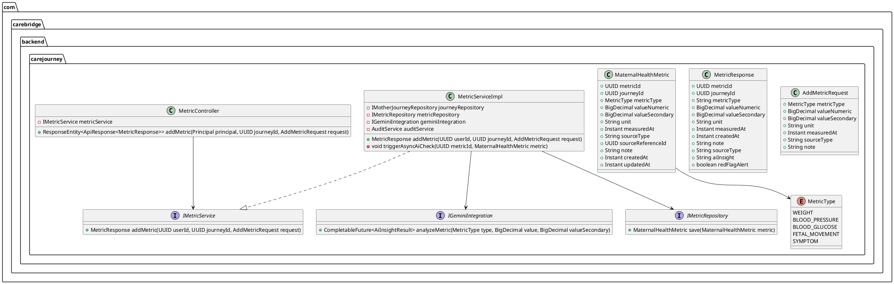
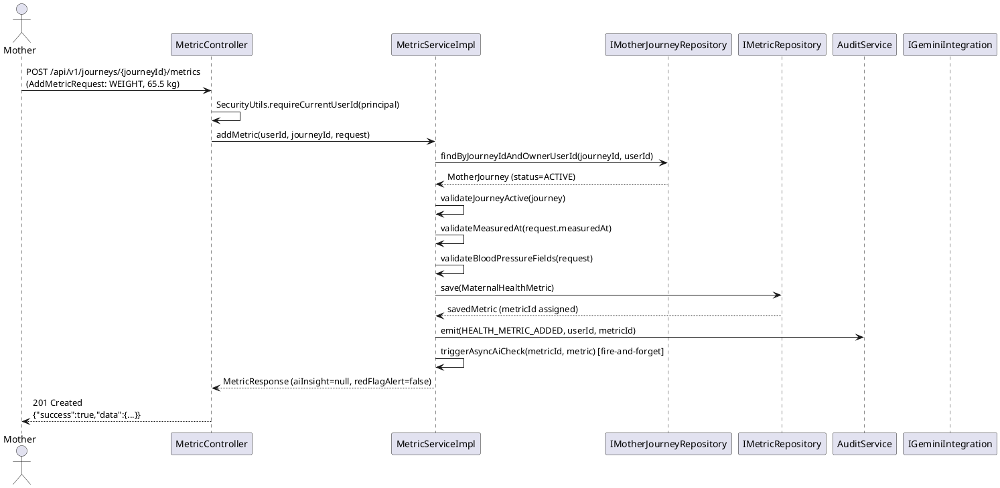
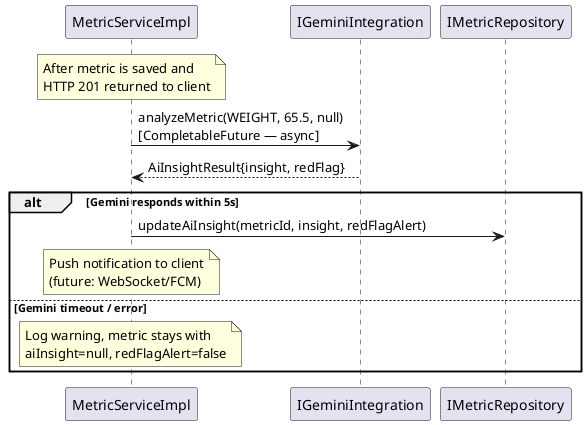

# UC25 — Add Maternal Health Metric: Technical Design Specification

| Field            | Value                                      |
|------------------|--------------------------------------------|
| Document ID      | CB-JOURNEY-IMP-004                         |
| Version          | 1.0                                        |
| Date             | 2026-06-26                                 |
| Status           | Approved                                   |
| Document Owner   | PhuongNT                                   |
| Author           | AI Agent                                   |
| Based on EDS     | v2.0                                       |
| SRS Reference    | SRS 3.3.1.4                                |

---

## 1. Tổng Quan (Overview)

**Use Case:** UC25 — Add Maternal Health Metric

**Endpoint:** `POST /api/v1/journeys/{journeyId}/metrics`

**Actor:** Mother (authenticated via JWT)
**Secondary Actor:** Gemini AI Service (async red-flag detection)
**Platform:** Mobile App

**Summary:**
A Mother records a health metric (weight, blood pressure, blood glucose, fetal movement, or symptom) for one of her active journeys. The system validates that the journey belongs to the authenticated Mother and that the journey is currently in ACTIVE status. Upon successful persistence, a Gemini AI call is triggered asynchronously to analyze the metric value for potential red flags or health concerns. If the AI detects an abnormal value, `redFlagAlert=true` is set in the response; however, the AI result is purely advisory and never blocks saving the metric or delays emergency routing (BR-SAFETY).

**Data Classification:** Sensitive-PII — all metric data is protected under privacy policy (BR-PRIVACY).

**Compliance:** BR-RBAC, BR-PRIVACY, BR-SAFETY

---

## 2. Traceability (Business Rules)

| Rule ID        | Description                                                                                                      |
|----------------|------------------------------------------------------------------------------------------------------------------|
| BR-METRIC-001  | The journey identified by `{journeyId}` must be owned by the authenticated Mother (`owner_user_id == JWT userId`). |
| BR-METRIC-002  | The journey must have `status = ACTIVE`. Metrics cannot be added to COMPLETED or CANCELLED journeys.            |
| BR-METRIC-003  | `metric_type` must be a valid value in the `MetricType` enum: `WEIGHT`, `BLOOD_PRESSURE`, `BLOOD_GLUCOSE`, `FETAL_MOVEMENT`, `SYMPTOM`. |
| BR-METRIC-004  | `measured_at` cannot be more than 5 minutes in the future relative to server time. Past entries within 7 days are allowed (manual entry of past readings). |
| BR-METRIC-005  | For `metric_type = BLOOD_PRESSURE`: both `value_numeric` (diastolic) and `value_secondary` (systolic) are required. |
| BR-METRIC-006  | After persisting the metric, the system triggers an async Gemini AI analysis to detect red flags. The AI call is non-blocking. If the AI detects an abnormal value, `redFlagAlert=true` is returned. The AI result is guidance only — never diagnostic. |
| BR-METRIC-007  | The system emits a `HEALTH_METRIC_ADDED` audit event after successful persistence (audit is independent of AI result). |
| BR-SAFETY      | Gemini AI provides guidance only. It must never diagnose, prescribe treatment, or delay emergency routing. |

---

## 3. Architectural Decision Records (ADRs)

### ADR-JOURNEY-004-001: Dual Value Field for Blood Pressure

**Decision:** Use existing `value_numeric` and `value_secondary` columns for blood pressure diastolic and systolic respectively, rather than adding BP-specific columns.

**Rationale:** Avoids a schema migration. The column semantics are documented by convention (diastolic = `value_numeric`, systolic = `value_secondary`) and enforced at the service layer via validation.

**Trade-off:** Less self-documenting at the DB level; mitigated by `metric_type` column indicating the reading type.

---

### ADR-JOURNEY-004-002: Async Gemini AI Call (Fire-and-Forget)

**Decision:** The Gemini AI red-flag check is executed asynchronously using `CompletableFuture`. The metric is persisted and the HTTP response is returned before the AI call completes.

**Rationale:** BR-SAFETY prohibits AI from blocking or delaying any user action. AI latency (1–5 s) would unacceptably degrade UX if synchronous.

**Fail-safe:** If Gemini AI times out (timeout = 5 s) or returns an error, the metric is saved normally with `aiInsight=null` and `redFlagAlert=false`. No exception is propagated to the client.

---

### ADR-JOURNEY-004-003: Client-Provided `measured_at` with Server-Side Range Validation

**Decision:** `measured_at` is provided by the client but validated server-side to be within the range [now() − 7 days, now() + 5 minutes].

**Rationale:** Mothers may record a reading manually after the fact (e.g., a morning reading entered later in the day). Unlimited past timestamps are rejected to prevent data falsification. A 5-minute future allowance covers slight clock skew on devices.

---

### ADR-JOURNEY-004-004: `source_type` Field

**Decision:** Persist `source_type = MANUAL` for all user-entered metrics. Reserve `DEVICE` for future device integration flows.

**Rationale:** Provides traceability for data provenance (manual entry vs. connected device) without requiring additional tables.

---

## 4. Non-Functional Requirements (NFR)

| NFR               | Requirement                                                                               |
|-------------------|-------------------------------------------------------------------------------------------|
| Latency           | p99 API response < 500 ms (AI call is async — does not add to synchronous latency).       |
| AI call timeout   | Gemini AI call capped at 5 s; fail-open on timeout.                                      |
| Data retention    | Health metric data retained for 7 years per healthcare data regulations.                  |
| Data privacy      | All metric data classified Sensitive-PII; access restricted to owning Mother and authorized clinical personnel. |
| Audit             | Every successful add emits an immutable audit event.                                      |
| Availability      | 99.5% uptime (inherits platform SLA).                                                    |

---

## 5. Static Modeling



---

## 6. Dynamic Modeling

### 6.1 Happy Path — Add Weight Metric



### 6.2 Async Gemini AI Path



---

## 7. Domain Events

### Event: `HealthMetricAdded`

| Field        | Type    | Description                                  |
|--------------|---------|----------------------------------------------|
| eventType    | String  | `HEALTH_METRIC_ADDED`                        |
| journeyId    | UUID    | Owning journey                               |
| metricId     | UUID    | Newly created metric                         |
| metricType   | String  | e.g., `WEIGHT`, `BLOOD_PRESSURE`             |
| userId       | UUID    | Authenticated Mother who added the metric    |
| occurredAt   | Instant | Server timestamp of the event                |

---

## 8. Interface Specifications

### 8.1 AddMetricRequest DTO

```java
package com.carebridge.backend.carejourney.dto;

import jakarta.validation.constraints.NotNull;
import jakarta.validation.constraints.Size;
import java.math.BigDecimal;
import java.time.Instant;

public class AddMetricRequest {

    @NotNull(message = "metricType is required")
    private MetricType metricType;

    // Required for WEIGHT, BLOOD_GLUCOSE, BLOOD_PRESSURE (diastolic for BP)
    private BigDecimal valueNumeric;

    // Required for BLOOD_PRESSURE (systolic); null for other types
    private BigDecimal valueSecondary;

    @Size(max = 30)
    private String unit; // e.g., "kg", "mmHg", "mg/dL"

    @NotNull(message = "measuredAt is required")
    private Instant measuredAt; // Must be within [now()-7days, now()+5min]

    // Defaults to "MANUAL" if null; "DEVICE" for integrations
    private String sourceType;

    @Size(max = 2000)
    private String note;

    // Getters and setters omitted for brevity
}
```

### 8.2 MetricResponse DTO

```java
package com.carebridge.backend.carejourney.dto;

import java.math.BigDecimal;
import java.time.Instant;
import java.util.UUID;

public class MetricResponse {

    private UUID metricId;
    private UUID journeyId;
    private String metricType;
    private BigDecimal valueNumeric;
    private BigDecimal valueSecondary;
    private String unit;
    private Instant measuredAt;
    private Instant createdAt;
    private String note;
    private String sourceType;

    // Populated asynchronously; may be null immediately after creation
    private String aiInsight;

    // true if Gemini AI detected an abnormal/red-flag value
    private boolean redFlagAlert;

    // Getters and setters omitted for brevity
}
```

### 8.3 IMetricService Interface

```java
package com.carebridge.backend.carejourney.service;

import com.carebridge.backend.carejourney.dto.AddMetricRequest;
import com.carebridge.backend.carejourney.dto.MetricResponse;
import java.util.UUID;

public interface IMetricService {

    /**
     * Records a new health metric for the specified journey.
     *
     * @param userId    Authenticated Mother's user ID (from JWT)
     * @param journeyId Target journey ID
     * @param request   Metric data
     * @return Saved metric response (aiInsight may be null — populated async)
     * @throws JourneyNotFoundException    if journey does not exist or is not owned by userId
     * @throws JourneyNotActiveException   if journey.status != ACTIVE
     * @throws InvalidMeasuredAtException  if measuredAt is out of allowed range
     * @throws BloodPressureFieldException if BLOOD_PRESSURE and valueSecondary is missing
     */
    MetricResponse addMetric(UUID userId, UUID journeyId, AddMetricRequest request);
}
```

### 8.4 IGeminiIntegration Interface

```java
package com.carebridge.backend.carejourney.integration;

import java.math.BigDecimal;
import java.util.concurrent.CompletableFuture;

public interface IGeminiIntegration {

    /**
     * Asynchronously analyzes a health metric value for red flags.
     * Returns guidance only — never diagnostic or prescriptive.
     * Callers must handle TimeoutException and CompletionException gracefully.
     *
     * @param metricType     e.g., WEIGHT, BLOOD_PRESSURE
     * @param valueNumeric   Primary value (or diastolic for BLOOD_PRESSURE)
     * @param valueSecondary Systolic for BLOOD_PRESSURE; null for others
     */
    CompletableFuture<AiInsightResult> analyzeMetric(
            MetricType metricType,
            BigDecimal valueNumeric,
            BigDecimal valueSecondary
    );
}
```

---

## 9. API Specification

### Endpoint

```
POST /api/v1/journeys/{journeyId}/metrics
Authorization: Bearer <JWT>
Content-Type: application/json
```

### Path Parameters

| Parameter  | Type | Required | Description          |
|------------|------|----------|----------------------|
| journeyId  | UUID | Yes      | Target journey ID    |

### Request Body

```json
{
  "metricType": "BLOOD_PRESSURE",
  "valueNumeric": 80,
  "valueSecondary": 120,
  "unit": "mmHg",
  "measuredAt": "2026-06-26T10:00:00Z",
  "sourceType": "MANUAL",
  "note": "Measured after breakfast"
}
```

### Success Response — 201 Created

```json
{
  "success": true,
  "data": {
    "metricId": "a1b2c3d4-0000-0000-0000-000000000025",
    "journeyId": "dddddddd-0000-0000-0000-000000000025",
    "metricType": "BLOOD_PRESSURE",
    "valueNumeric": 80,
    "valueSecondary": 120,
    "unit": "mmHg",
    "measuredAt": "2026-06-26T10:00:00Z",
    "createdAt": "2026-06-26T10:01:00Z",
    "sourceType": "MANUAL",
    "note": "Measured after breakfast",
    "aiInsight": null,
    "redFlagAlert": false
  }
}
```

### Weight Metric Example — 201 Created

```json
{
  "success": true,
  "data": {
    "metricId": "b2c3d4e5-0000-0000-0000-000000000025",
    "journeyId": "dddddddd-0000-0000-0000-000000000025",
    "metricType": "WEIGHT",
    "valueNumeric": 65.5,
    "valueSecondary": null,
    "unit": "kg",
    "measuredAt": "2026-06-26T08:00:00Z",
    "createdAt": "2026-06-26T08:01:00Z",
    "sourceType": "MANUAL",
    "note": null,
    "aiInsight": null,
    "redFlagAlert": false
  }
}
```

---

## 10. Error Codes

| Error Code  | HTTP Status | Condition                                                                             |
|-------------|-------------|---------------------------------------------------------------------------------------|
| METRIC-001  | 404         | Journey `{journeyId}` not found in the system.                                       |
| METRIC-002  | 403         | Journey exists but `owner_user_id != JWT userId` (authorization failure).             |
| METRIC-003  | 400         | Journey `status != ACTIVE` (e.g., COMPLETED or CANCELLED).                           |
| METRIC-004  | 400         | `measuredAt` is more than 5 minutes in the future, or more than 7 days in the past.  |
| METRIC-005  | 400         | `metricType = BLOOD_PRESSURE` but `valueSecondary` (systolic) is null or missing.    |

### Error Response Format

```json
{
  "success": false,
  "errorCode": "METRIC-002",
  "message": "Access denied: you do not own this journey.",
  "timestamp": "2026-06-26T10:01:00Z"
}
```

---

## 11. Implementation Plan

### 11.1 Files to Create / Modify

| Action | Path                                                                                                      | Description                                    |
|--------|-----------------------------------------------------------------------------------------------------------|------------------------------------------------|
| Create | `carejourney/entity/MaternalHealthMetric.java`                                                            | JPA entity for `maternal_health_metrics`       |
| Create | `carejourney/entity/MetricType.java`                                                                      | Enum: WEIGHT, BLOOD_PRESSURE, BLOOD_GLUCOSE, FETAL_MOVEMENT, SYMPTOM |
| Create | `carejourney/dto/AddMetricRequest.java`                                                                   | Request DTO with validation annotations        |
| Create | `carejourney/dto/MetricResponse.java`                                                                     | Response DTO                                   |
| Create | `carejourney/repository/IMetricRepository.java`                                                           | JPA repository for metrics                     |
| Create | `carejourney/service/IMetricService.java`                                                                 | Service interface                              |
| Create | `carejourney/service/impl/MetricServiceImpl.java`                                                         | Service implementation                         |
| Create | `carejourney/controller/MetricController.java`                                                            | REST controller for POST endpoint              |
| Create | `carejourney/integration/IGeminiIntegration.java`                                                         | Async AI integration interface                 |
| Create | `carejourney/integration/GeminiIntegrationImpl.java`                                                      | Gemini integration implementation              |
| Create | `carejourney/exception/JourneyNotFoundException.java`                                                     | 404 exception                                  |
| Create | `carejourney/exception/JourneyNotActiveException.java`                                                    | 400 exception                                  |
| Create | `carejourney/exception/BloodPressureFieldException.java`                                                  | 400 BP validation exception                    |

### 11.2 No Migration Required

The `maternal_health_metrics` table already exists in the V1 migration. No Flyway migration file is needed for this UC.

### 11.3 Key Implementation Notes

- `MetricServiceImpl.addMetric()` must be `@Transactional` for the save operation.
- The async Gemini call is fired after the transaction commits (use `@TransactionalEventListener` or call after `save()` returns).
- `sourceType` defaults to `"MANUAL"` when null in the request.
- Use `SecurityUtils.requireCurrentUserId(principal)` in the controller to extract `userId` from JWT.

---

## 12. Rollback Plan

This UC adds new code only (no migrations). Rollback = revert all files listed in section 11 to their previous state via git revert or branch checkout. No DB rollback is needed unless test data was inserted.

---

## 13. Test Scenarios Summary

| Test ID                | Scenario                                              | Expected Result              |
|------------------------|-------------------------------------------------------|------------------------------|
| METRIC-TC-025-001      | Happy path — WEIGHT metric                            | 201 Created, DB row exists   |
| METRIC-TC-025-002      | BLOOD_PRESSURE with both values                       | 201 Created                  |
| METRIC-TC-025-003      | BLOOD_PRESSURE missing valueSecondary                 | 400 METRIC-005               |
| METRIC-TC-025-004      | Journey not owned by user                             | 403 METRIC-002               |
| METRIC-TC-025-005      | Journey status = COMPLETED                            | 400 METRIC-003               |
| METRIC-TC-025-006      | measuredAt > now + 5 min                              | 400 METRIC-004               |
| METRIC-TC-025-007      | No JWT token                                          | 401 Unauthorized             |
| METRIC-TC-025-008      | Gemini AI throws exception                            | 201 Created, graceful degrade|
| METRIC-TC-025-INT-001  | Integration — DB confirmed + Gemini mocked            | 201 + row in DB              |

---

## 14. Verification SQL

After adding a metric, verify persistence with:

```sql
-- Confirm metric was created
SELECT
    metric_id,
    journey_id,
    metric_type,
    value_numeric,
    value_secondary,
    unit,
    measured_at,
    source_type,
    created_at
FROM public.maternal_health_metrics
WHERE journey_id = '[target-journey-uuid]'
ORDER BY created_at DESC
LIMIT 5;

-- Confirm journey ownership
SELECT
    mj.journey_id,
    mj.owner_user_id,
    mj.status,
    COUNT(m.metric_id) AS metric_count
FROM public.mother_journeys mj
LEFT JOIN public.maternal_health_metrics m ON mj.journey_id = m.journey_id
WHERE mj.journey_id = '[target-journey-uuid]'
GROUP BY mj.journey_id, mj.owner_user_id, mj.status;
```

---

## 15. API Sample Collection

### Sample 1 — Add WEIGHT metric

```bash
curl -X POST "https://api.carebridge.vn/api/v1/journeys/dddddddd-0000-0000-0000-000000000025/metrics" \
  -H "Authorization: Bearer <JWT>" \
  -H "Content-Type: application/json" \
  -d '{
    "metricType": "WEIGHT",
    "valueNumeric": 65.5,
    "unit": "kg",
    "measuredAt": "2026-06-26T08:00:00Z",
    "sourceType": "MANUAL"
  }'
```

### Sample 2 — Add BLOOD_PRESSURE metric

```bash
curl -X POST "https://api.carebridge.vn/api/v1/journeys/dddddddd-0000-0000-0000-000000000025/metrics" \
  -H "Authorization: Bearer <JWT>" \
  -H "Content-Type: application/json" \
  -d '{
    "metricType": "BLOOD_PRESSURE",
    "valueNumeric": 80,
    "valueSecondary": 120,
    "unit": "mmHg",
    "measuredAt": "2026-06-26T10:00:00Z",
    "note": "Measured after breakfast"
  }'
```

### Sample 3 — Add BLOOD_GLUCOSE metric

```bash
curl -X POST "https://api.carebridge.vn/api/v1/journeys/dddddddd-0000-0000-0000-000000000025/metrics" \
  -H "Authorization: Bearer <JWT>" \
  -H "Content-Type: application/json" \
  -d '{
    "metricType": "BLOOD_GLUCOSE",
    "valueNumeric": 95,
    "unit": "mg/dL",
    "measuredAt": "2026-06-26T07:30:00Z",
    "note": "Fasting glucose"
  }'
```

### Sample 4 — Error: Missing valueSecondary for BLOOD_PRESSURE

```bash
# Expected: 400 METRIC-005
curl -X POST "https://api.carebridge.vn/api/v1/journeys/dddddddd-0000-0000-0000-000000000025/metrics" \
  -H "Authorization: Bearer <JWT>" \
  -H "Content-Type: application/json" \
  -d '{
    "metricType": "BLOOD_PRESSURE",
    "valueNumeric": 80,
    "unit": "mmHg",
    "measuredAt": "2026-06-26T10:00:00Z"
  }'
```

---

## 16. Authorization Matrix

| Role    | Can Call This Endpoint | Scope                                      |
|---------|------------------------|--------------------------------------------|
| MOTHER  | Yes                    | Own journeys only (`owner_user_id == JWT userId`) |
| EXPERT  | No                     | Cannot add metrics on behalf of a patient  |
| ADMIN   | No                     | Read-only access to health data            |
| GUEST   | No                     | Unauthenticated — 401                      |

---

## 17. CASE 2.0 Constraints

| ID | Constraint                                                                                                               |
|----|--------------------------------------------------------------------------------------------------------------------------|
| C1 | **Journey Ownership:** Before inserting any metric, verify `journey.owner_user_id == userId` from the JWT. Do NOT trust request body alone. |
| C2 | **Active Journey:** Verify `journey.status == ACTIVE` before insert. Reject COMPLETED/CANCELLED journeys with 400 METRIC-003. |
| C3 | **Blood Pressure Dual Value:** For `BLOOD_PRESSURE`, `value_numeric` = diastolic (lower number), `value_secondary` = systolic (higher number). Both are mandatory. |
| C4 | **Async AI — Metric First:** The Gemini AI call is fire-and-forget. The metric MUST be saved and the 201 response returned before the AI call result is awaited. |
| C5 | **AI is Guidance Only:** The AI insight is advisory. It must NEVER block saving the metric, NEVER return a diagnostic conclusion, and NEVER influence emergency routing decisions. |
| C6 | **Audit Independence:** The `HEALTH_METRIC_ADDED` audit event is emitted immediately after save, regardless of the AI call outcome. |
| C7 | **BR-SAFETY Red Flag:** If the AI detects a red flag, set `redFlagAlert=true` in the stored metric and response. Do NOT suppress the save, add latency to the response, or override emergency protocols. |
