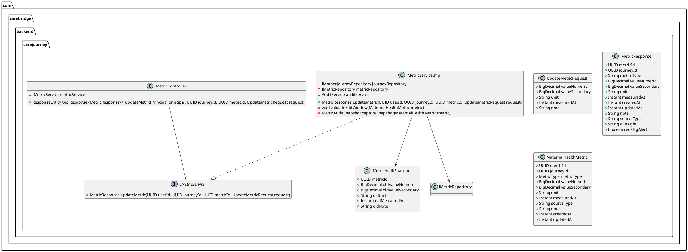
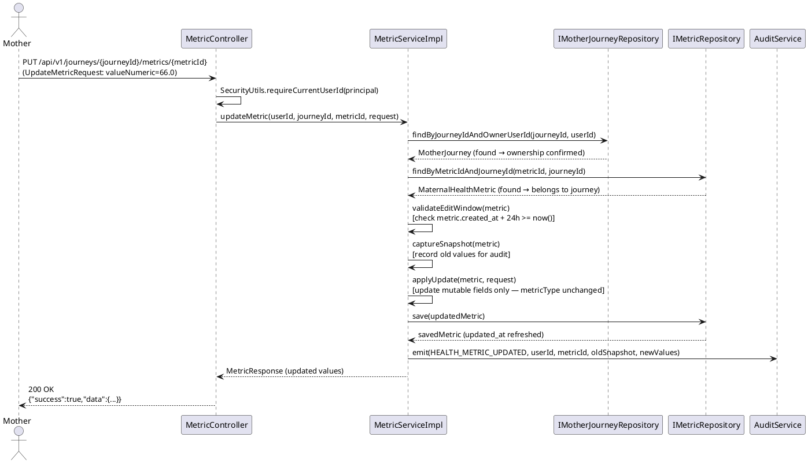
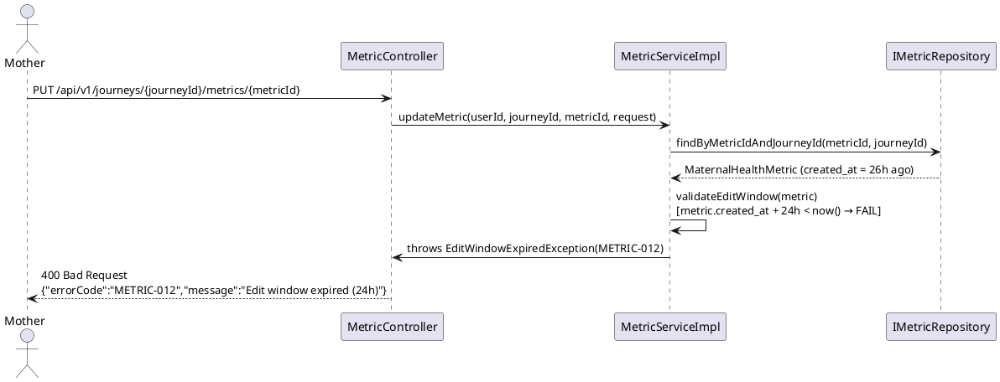

# UC26 — Update Maternal Health Metric: Technical Design Specification

| Field            | Value                                      |
|------------------|--------------------------------------------|
| Document ID      | CB-JOURNEY-IMP-005                         |
| Version          | 1.0                                        |
| Date             | 2026-06-26                                 |
| Status           | Draft                                      |
| Document Owner   | PhuongNT                                   |
| Author           | AI Agent                                   |
| Based on EDS     | v2.0                                       |
| SRS Reference    | SRS 3.3.1.5                                |

---

## 1. Tổng Quan (Overview)

**Use Case:** UC26 — Update Maternal Health Metric

**Endpoint:** `PUT /api/v1/journeys/{journeyId}/metrics/{metricId}`

**Actor:** Mother (authenticated via JWT)
**Platform:** Mobile App

**Summary:**
A Mother corrects an erroneously recorded health metric within a 24-hour edit window. The system verifies that the journey is owned by the authenticated Mother, that the metric belongs to the specified journey, and that the metric was created within the last 24 hours. The following fields may be updated: `value_numeric`, `value_secondary`, `unit`, `measured_at`, `note`. The `metric_type` is immutable after creation. An audit event is emitted capturing both old and new values for forensic comparison.

**Data Classification:** Sensitive-PII — all metric data is protected under privacy policy (BR-PRIVACY).

**Compliance:** BR-RBAC, BR-PRIVACY, BR-SAFETY

---

## 2. Traceability (Business Rules)

| Rule ID        | Description                                                                                                                       |
|----------------|-----------------------------------------------------------------------------------------------------------------------------------|
| BR-METRIC-010  | The journey identified by `{journeyId}` must be owned by the authenticated Mother (`owner_user_id == JWT userId`).                |
| BR-METRIC-011  | The metric identified by `{metricId}` must belong to the journey identified by `{journeyId}` (`metric.journey_id == journeyId`). |
| BR-METRIC-012  | The metric must have been created within the last 24 hours (`metric.created_at + 24h >= now()`). Edits outside this window are rejected to prevent retroactive data falsification. |
| BR-METRIC-013  | `metric_type` is immutable after creation. It cannot be changed via this endpoint. Any attempt to include `metricType` in the request body must be silently ignored. |
| BR-METRIC-014  | On successful update, the system emits a `HEALTH_METRIC_UPDATED` audit event that includes a snapshot of old values and new values for forensic purposes. |

---

## 3. Architectural Decision Records (ADRs)

### ADR-JOURNEY-005-001: 24-Hour Edit Window

**Decision:** Health metric records may only be corrected within 24 hours of creation (`created_at`, not `measured_at`).

**Rationale:** Healthcare data integrity requires preventing retroactive alteration of clinical readings. A 24-hour window accommodates genuine data entry mistakes (wrong decimal, wrong unit) while preventing long-term falsification. The window is based on `created_at` (system-recorded time) rather than `measured_at` (user-provided time) to prevent manipulation.

**Alternative rejected:** Unlimited edit window — creates audit and regulatory risk for patient health records.

---

### ADR-JOURNEY-005-002: `metric_type` is Immutable

**Decision:** `metric_type` cannot be changed after the metric is created. If the wrong type was selected, the user must delete and re-add the metric (future UC).

**Rationale:** Changing the metric type would invalidate the semantic meaning of `value_numeric` and `value_secondary` (e.g., turning a WEIGHT record into a BLOOD_PRESSURE record). This would corrupt data without a schema guarantee of correctness.

**Implementation note:** The `UpdateMetricRequest` DTO must NOT include a `metricType` field. The service layer must also guard against reflective or manually injected type changes.

---

### ADR-JOURNEY-005-003: Audit Includes Old Value Snapshot

**Decision:** The `HEALTH_METRIC_UPDATED` audit event captures both old and new values of all mutable fields before the update is applied.

**Rationale:** In a healthcare context, the ability to reconstruct what a value was before an edit is essential for clinical audits, patient safety investigations, and regulatory compliance.

**Implementation note:** The service must read the current entity state before calling `save()`, capture old values into the event, then persist the update.

---

## 4. Non-Functional Requirements (NFR)

| NFR               | Requirement                                                                               |
|-------------------|-------------------------------------------------------------------------------------------|
| Latency           | p99 API response < 300 ms (no async AI call — faster than add).                          |
| Data retention    | Health metric data and audit logs retained for 7 years per healthcare data regulations.   |
| Data privacy      | All metric data classified Sensitive-PII; access restricted to owning Mother.             |
| Audit             | Every successful update emits an immutable audit event with old+new value snapshot.       |
| Availability      | 99.5% uptime (inherits platform SLA).                                                    |
| Idempotency       | PUT is not strictly idempotent — repeated calls with the same body will update `updated_at` and emit audit events each time. Design note only — no special handling required. |

---

## 5. Static Modeling



---

## 6. Dynamic Modeling

### 6.1 Happy Path — Update WEIGHT Metric Within 24h



### 6.2 Edit Window Expired Path



---

## 7. Domain Events

### Event: `HealthMetricUpdated`

| Field               | Type    | Description                                      |
|---------------------|---------|--------------------------------------------------|
| eventType           | String  | `HEALTH_METRIC_UPDATED`                          |
| journeyId           | UUID    | Owning journey                                   |
| metricId            | UUID    | Updated metric                                   |
| userId              | UUID    | Authenticated Mother who performed the update    |
| occurredAt          | Instant | Server timestamp of the event                    |
| oldValueNumeric     | Decimal | Previous primary value                           |
| oldValueSecondary   | Decimal | Previous secondary value (may be null)           |
| oldUnit             | String  | Previous unit                                    |
| oldMeasuredAt       | Instant | Previous measured_at                             |
| oldNote             | String  | Previous note (may be null)                      |
| newValueNumeric     | Decimal | Updated primary value                            |
| newValueSecondary   | Decimal | Updated secondary value (may be null)            |
| newUnit             | String  | Updated unit                                     |
| newMeasuredAt       | Instant | Updated measured_at                              |
| newNote             | String  | Updated note (may be null)                       |

---

## 8. Interface Specifications

### 8.1 UpdateMetricRequest DTO

```java
package com.carebridge.backend.carejourney.dto;

import jakarta.validation.constraints.Size;
import java.math.BigDecimal;
import java.time.Instant;

/**
 * Request body for PUT /api/v1/journeys/{journeyId}/metrics/{metricId}.
 * Note: metricType is intentionally excluded — it is immutable after creation (ADR-JOURNEY-005-002).
 * All fields are optional; only non-null fields are applied to the metric.
 */
public class UpdateMetricRequest {

    // For WEIGHT, BLOOD_GLUCOSE: the main value.
    // For BLOOD_PRESSURE: diastolic (lower value).
    private BigDecimal valueNumeric;

    // For BLOOD_PRESSURE: systolic (higher value). Null for other metric types.
    private BigDecimal valueSecondary;

    @Size(max = 30)
    private String unit; // e.g., "kg", "mmHg", "mg/dL"

    // Must satisfy the same range as addMetric: [now()-7days, now()+5min]
    private Instant measuredAt;

    @Size(max = 2000)
    private String note;

    // Getters and setters omitted for brevity
}
```

### 8.2 IMetricService — Update Method

```java
package com.carebridge.backend.carejourney.service;

import com.carebridge.backend.carejourney.dto.MetricResponse;
import com.carebridge.backend.carejourney.dto.UpdateMetricRequest;
import java.util.UUID;

public interface IMetricService {

    MetricResponse addMetric(UUID userId, UUID journeyId, AddMetricRequest request);

    /**
     * Updates mutable fields of an existing health metric within the 24-hour edit window.
     *
     * @param userId    Authenticated Mother's user ID (from JWT)
     * @param journeyId Journey that owns the metric
     * @param metricId  Metric to update
     * @param request   Fields to update (metricType is immutable and ignored)
     * @return Updated metric response
     * @throws JourneyNotFoundException    if journey not found or not owned by userId
     * @throws MetricNotFoundException     if metric not found or not in this journey
     * @throws EditWindowExpiredException  if metric.created_at + 24h < now()
     */
    MetricResponse updateMetric(UUID userId, UUID journeyId, UUID metricId, UpdateMetricRequest request);
}
```

### 8.3 MetricServiceImpl — updateMetric Implementation Sketch

```java
@Override
@Transactional
public MetricResponse updateMetric(UUID userId, UUID journeyId, UUID metricId, UpdateMetricRequest request) {

    // C1: Verify journey ownership
    motherJourneyRepository.findByJourneyIdAndOwnerUserId(journeyId, userId)
        .orElseThrow(() -> new JourneyNotFoundException("METRIC-013"));

    // C2: Verify metric belongs to this journey
    MaternalHealthMetric metric = metricRepository.findByMetricIdAndJourneyId(metricId, journeyId)
        .orElseThrow(() -> new MetricNotFoundException("METRIC-010 / METRIC-011"));

    // C3: Verify 24-hour edit window (based on created_at, not measured_at)
    if (metric.getCreatedAt().plus(24, ChronoUnit.HOURS).isBefore(Instant.now())) {
        throw new EditWindowExpiredException("METRIC-012");
    }

    // C5: Capture old values snapshot for audit BEFORE applying changes
    MetricAuditSnapshot oldSnapshot = captureSnapshot(metric);

    // Apply mutable fields (metricType is NOT applied — C4)
    if (request.getValueNumeric() != null)   metric.setValueNumeric(request.getValueNumeric());
    if (request.getValueSecondary() != null) metric.setValueSecondary(request.getValueSecondary());
    if (request.getUnit() != null)           metric.setUnit(request.getUnit());
    if (request.getMeasuredAt() != null)     metric.setMeasuredAt(request.getMeasuredAt());
    if (request.getNote() != null)           metric.setNote(request.getNote());

    MaternalHealthMetric saved = metricRepository.save(metric);

    // C5: Emit audit with old + new values
    auditService.emit("HEALTH_METRIC_UPDATED", userId, metricId, oldSnapshot, toSnapshot(saved));

    return metricMapper.toResponse(saved);
}
```

---

## 9. API Specification

### Endpoint

```
PUT /api/v1/journeys/{journeyId}/metrics/{metricId}
Authorization: Bearer <JWT>
Content-Type: application/json
```

### Path Parameters

| Parameter  | Type | Required | Description              |
|------------|------|----------|--------------------------|
| journeyId  | UUID | Yes      | Journey that owns the metric |
| metricId   | UUID | Yes      | Metric to update         |

### Request Body

```json
{
  "valueNumeric": 66.0,
  "unit": "kg",
  "measuredAt": "2026-06-26T08:15:00Z",
  "note": "Corrected — scale was set to lbs initially"
}
```

### Success Response — 200 OK

```json
{
  "success": true,
  "data": {
    "metricId": "a1b2c3d4-0000-0000-0000-000000000025",
    "journeyId": "eeeeeeee-0000-0000-0000-000000000026",
    "metricType": "WEIGHT",
    "valueNumeric": 66.0,
    "valueSecondary": null,
    "unit": "kg",
    "measuredAt": "2026-06-26T08:15:00Z",
    "createdAt": "2026-06-26T08:00:00Z",
    "updatedAt": "2026-06-26T08:30:00Z",
    "sourceType": "MANUAL",
    "note": "Corrected — scale was set to lbs initially",
    "aiInsight": null,
    "redFlagAlert": false
  }
}
```

### BLOOD_PRESSURE Update Example

```json
{
  "valueNumeric": 82,
  "valueSecondary": 122,
  "unit": "mmHg",
  "note": "Re-measured after 5-minute rest"
}
```

---

## 10. Error Codes

| Error Code  | HTTP Status | Condition                                                                              |
|-------------|-------------|----------------------------------------------------------------------------------------|
| METRIC-010  | 404         | Metric `{metricId}` not found in the system.                                           |
| METRIC-011  | 404         | Metric exists but does not belong to journey `{journeyId}`.                            |
| METRIC-012  | 400         | Edit window expired — `metric.created_at + 24h < now()`.                              |
| METRIC-013  | 403         | Journey `{journeyId}` not owned by the authenticated user.                             |

### Error Response Format

```json
{
  "success": false,
  "errorCode": "METRIC-012",
  "message": "Edit window expired: metrics can only be corrected within 24 hours of creation.",
  "timestamp": "2026-06-26T10:01:00Z"
}
```

---

## 11. Implementation Plan

### 11.1 Files to Create / Modify

| Action | Path                                                                                             | Description                                           |
|--------|--------------------------------------------------------------------------------------------------|-------------------------------------------------------|
| Create | `carejourney/dto/UpdateMetricRequest.java`                                                       | Request DTO (no `metricType` field)                   |
| Modify | `carejourney/service/IMetricService.java`                                                        | Add `updateMetric()` method signature                 |
| Modify | `carejourney/service/impl/MetricServiceImpl.java`                                                | Implement `updateMetric()`                            |
| Modify | `carejourney/controller/MetricController.java`                                                   | Add PUT endpoint                                      |
| Create | `carejourney/exception/EditWindowExpiredException.java`                                          | 400 exception for expired edit window                 |
| Create | `carejourney/exception/MetricNotFoundException.java`                                             | 404 exception for metric not found / wrong journey    |
| Modify | `carejourney/repository/IMetricRepository.java`                                                  | Add `findByMetricIdAndJourneyId()` query method       |

### 11.2 No Migration Required

The `maternal_health_metrics` table already has `updated_at` which is refreshed on save. No Flyway migration is needed.

### 11.3 Key Implementation Notes

- `updateMetric()` must be `@Transactional`.
- Capture old-value snapshot BEFORE calling `save()` — JPA will overwrite the entity fields in memory.
- The `updated_at` field is managed by JPA `@UpdateTimestamp` or equivalent.
- Partial update semantics: only non-null fields in `UpdateMetricRequest` are applied. Null fields are left unchanged.
- `metric_type` must NOT be modifiable — enforce at both DTO level (field absent) and service level (never apply it).

---

## 12. Rollback Plan

This UC modifies existing code files (adds methods + endpoint) but requires no migration. Rollback = revert all modified files listed in section 11 via git revert or branch checkout. No DB rollback is needed unless test data was inserted.

---

## 13. Test Scenarios Summary

| Test ID                  | Scenario                                                  | Expected Result                       |
|--------------------------|-----------------------------------------------------------|---------------------------------------|
| METRIC-TC-026-001        | Happy path — update value within 24h                      | 200 OK, DB updated                    |
| METRIC-TC-026-002        | Update metric older than 24h                              | 400 METRIC-012                        |
| METRIC-TC-026-003        | Metric belongs to different journey                       | 404 METRIC-011                        |
| METRIC-TC-026-004        | Journey not owned by user                                 | 403 METRIC-013                        |
| METRIC-TC-026-005        | Metric not found                                          | 404 METRIC-010                        |
| METRIC-TC-026-006        | No JWT token                                              | 401 Unauthorized                      |
| METRIC-TC-026-INT-001    | Integration — DB value updated, `updated_at` changes      | 200 + verified DB state               |

---

## 14. Verification SQL

After updating a metric, verify the change:

```sql
-- Confirm metric values were updated
SELECT
    metric_id,
    metric_type,
    value_numeric,
    value_secondary,
    unit,
    measured_at,
    note,
    created_at,
    updated_at
FROM public.maternal_health_metrics
WHERE metric_id = '[target-metric-uuid]';

-- Confirm updated_at > created_at (meaning update occurred)
SELECT
    metric_id,
    created_at,
    updated_at,
    (updated_at > created_at) AS was_updated
FROM public.maternal_health_metrics
WHERE metric_id = '[target-metric-uuid]';

-- Confirm metric_type was NOT changed
SELECT metric_type FROM public.maternal_health_metrics WHERE metric_id = '[target-metric-uuid]';
```

---

## 15. API Sample Collection

### Sample 1 — Update WEIGHT metric value

```bash
curl -X PUT "https://api.carebridge.vn/api/v1/journeys/eeeeeeee-0000-0000-0000-000000000026/metrics/ffffffff-0000-0000-0000-000000000026" \
  -H "Authorization: Bearer <JWT>" \
  -H "Content-Type: application/json" \
  -d '{
    "valueNumeric": 66.0,
    "unit": "kg",
    "note": "Corrected — scale was set to lbs initially"
  }'
```

### Sample 2 — Update BLOOD_PRESSURE values

```bash
curl -X PUT "https://api.carebridge.vn/api/v1/journeys/eeeeeeee-0000-0000-0000-000000000026/metrics/ffffffff-0000-0000-0000-000000000026" \
  -H "Authorization: Bearer <JWT>" \
  -H "Content-Type: application/json" \
  -d '{
    "valueNumeric": 82,
    "valueSecondary": 122,
    "unit": "mmHg",
    "note": "Re-measured after 5-minute rest"
  }'
```

### Sample 3 — Error: Edit window expired (> 24h old)

```bash
# Expected: 400 METRIC-012
curl -X PUT "https://api.carebridge.vn/api/v1/journeys/eeeeeeee-0000-0000-0000-000000000026/metrics/ffffffff-0000-0000-0000-000000000026" \
  -H "Authorization: Bearer <JWT>" \
  -H "Content-Type: application/json" \
  -d '{"valueNumeric": 65.0}'
# Response: {"success":false,"errorCode":"METRIC-012","message":"Edit window expired: metrics can only be corrected within 24 hours of creation."}
```

### Sample 4 — Error: Metric not in this journey

```bash
# Expected: 404 METRIC-011
curl -X PUT "https://api.carebridge.vn/api/v1/journeys/wrongjrn-0000-0000-0000-000000000026/metrics/ffffffff-0000-0000-0000-000000000026" \
  -H "Authorization: Bearer <JWT>" \
  -H "Content-Type: application/json" \
  -d '{"valueNumeric": 65.0}'
```

---

## 16. Authorization Matrix

| Role    | Can Call This Endpoint | Scope                                            |
|---------|------------------------|--------------------------------------------------|
| MOTHER  | Yes                    | Own journeys and metrics only                    |
| EXPERT  | No                     | Cannot edit patient metrics                      |
| ADMIN   | No                     | Read-only access to health data                  |
| GUEST   | No                     | Unauthenticated — 401                            |

---

## 17. CASE 2.0 Constraints

| ID | Constraint                                                                                                                                          |
|----|-----------------------------------------------------------------------------------------------------------------------------------------------------|
| C1 | **Journey Ownership:** Before any update, verify `journey.owner_user_id == userId` from the JWT. Return 403 METRIC-013 if check fails.              |
| C2 | **Metric-to-Journey Binding:** Verify `metric.journey_id == journeyId` from the path parameter. Return 404 METRIC-011 if mismatch.                  |
| C3 | **24-Hour Edit Window:** Check `metric.created_at + 24 hours >= now()`. The window is based on `created_at` (server-recorded), NOT `measured_at` (user-provided). Return 400 METRIC-012 if window expired. |
| C4 | **`metric_type` Immutability:** The service MUST NOT apply any `metricType` field from the request. The `UpdateMetricRequest` DTO must not include a `metricType` field. |
| C5 | **Audit with Old+New Snapshot:** Capture the old values (`value_numeric`, `value_secondary`, `unit`, `measured_at`, `note`) BEFORE calling `save()`. Emit `HEALTH_METRIC_UPDATED` with both old and new values. |
