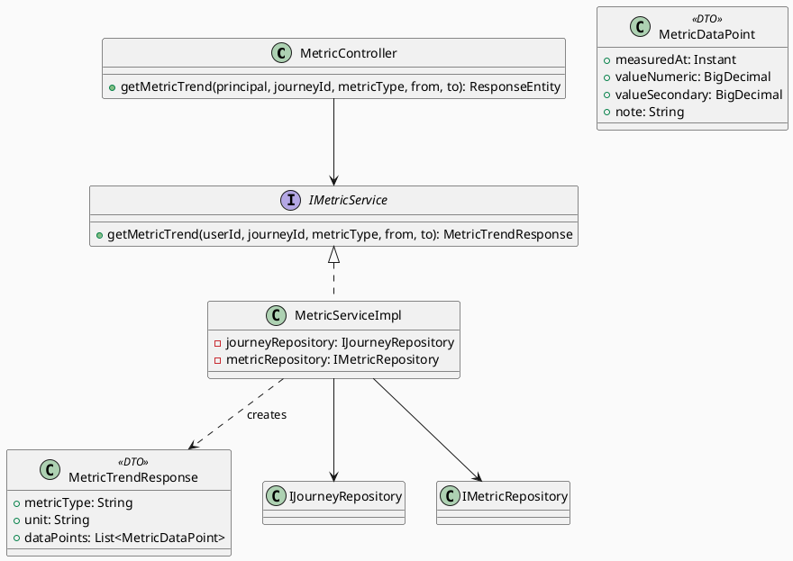
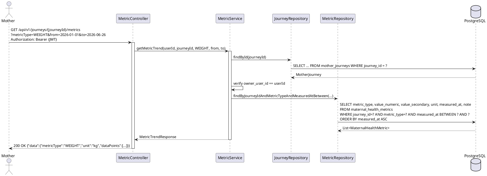

# ENGINEERING DOCUMENTATION STANDARD (EDS) v2.0
# Technical Design Specification — UC-27 View Maternal Health Trend

| Field              | Value                   |
| ------------------ | ----------------------- |
| **Document ID**    | `CB-JOURNEY-IMP-006`    |
| **Version**        | `1.0`                   |
| **Date**           | `2026-06-26`            |
| **Status**         | `Draft`                 |
| **Document Owner** | `PhuongNT`              |
| **Author**         | `AI Agent`              |
| **Reviewed by**    | `[Tech Lead]`           |
| **DPO Sign-off**   | `[ ] Pending`           |
| **Approved by**    | `[Principal Architect]` |
| **Last Review**    | `2026-06-26`            |
| **Based on EDS**   | `v2.0`                  |

---

## CHANGELOG

| Ngày       | Người thực hiện | Nội dung thay đổi                                    |
| ---------- | --------------- | ---------------------------------------------------- |
| 2026-06-26 | AI Agent        | Tạo tài liệu lần đầu cho UC-27 View Maternal Health Trend |

---

## MỤC LỤC

1. [Tổng quan Module](#1-tổng-quan-module)
2. [Ma trận Truy vết](#2-ma-trận-truy-vết-traceability-matrix)
3. [Architecture Decision Records](#3-architecture-decision-records-adr)
4. [Non-Functional Requirements & SLA](#4-non-functional-requirements--sla)
5. [Static Modeling](#5-static-modeling-mô-hình-tĩnh)
6. [Dynamic Modeling](#6-dynamic-modeling-mô-hình-động)
7. [Domain Event Catalog](#7-domain-event-catalog)
8. [Interface Specification](#8-interface-specification-đặc-tả-giao-diện)
9. [API Specification](#9-api-specification)
10. [Bảng mã lỗi](#10-bảng-mã-lỗi-error-codes)
11. [Quy trình Triển khai](#11-quy-trình-triển-khai-step-by-step)
12. [Rollback & Incident Runbook](#12-rollback--incident-runbook)
13. [Kịch bản Kiểm thử Chi tiết](#13-kịch-bản-kiểm-thử-chi-tiết)
14. [Phương pháp Xác minh](#14-phương-pháp-xác-minh)
15. [Mẫu thử thực tế](#15-mẫu-thử-thực-tế-api-verification-samples)
16. [Bảng tổng hợp phân quyền](#16-bảng-tổng-hợp-phân-quyền-authorization-matrix)
17. [AI Prompt Constraints](#17-ai-prompt-constraints-case-20)

---

## 1. Tổng quan Module

| Field                     | Value                                                                        |
| ------------------------- | ---------------------------------------------------------------------------- |
| **Module Name**           | `ViewMaternalHealthTrend`                                                    |
| **Bounded Context**       | `journey`                                                                    |
| **UC ID**                 | `UC-27`                                                                      |
| **SRS Reference**         | `3.3.1.6`                                                                    |
| **Primary Actor**         | `Mother (ROLE_MOTHER — authenticated)`                                       |
| **Platform**              | `Mobile App`                                                                 |
| **Data Classification**   | `Sensitive-PII`                                                              |
| **Compliance Scope**      | `BR-RBAC, BR-PRIVACY, BR-SAFETY (non-diagnostic)`                           |
| **Upstream Dependencies** | `UC-25 AddMaternalHealthMetric (data source)`, `auth (JWT)`                  |
| **Downstream Consumers**  | `Mobile chart rendering (client-side)`                                       |

**Mô tả:** Cho phép Mother xem xu hướng (trend) các chỉ số sức khỏe thai kỳ theo thời gian dưới dạng time-series data. Hệ thống trả về danh sách data points từ bảng `maternal_health_metrics` cho một `metricType` cụ thể, trong khoảng thời gian chỉ định. **Không đưa ra chẩn đoán hoặc kết luận y khoa** — chỉ trả raw data để client render biểu đồ.

---

## 2. Ma trận Truy vết (Traceability Matrix)

| Requirement ID  | Loại          | Mô tả yêu cầu                                                    | Thành phần Code                          | Compliance Target | ADR liên quan     |
| --------------- | ------------- | ---------------------------------------------------------------- | ---------------------------------------- | ----------------- | ----------------- |
| UC-27           | Use Case      | Hiển thị xu hướng chỉ số sức khỏe theo thời gian                | `MetricController.getMetricTrend()`      | BR-RBAC           | ADR-JOURNEY-006-001 |
| BR-TREND-001    | Business Rule | Chỉ xem được journey của chính mình                             | `MetricServiceImpl` ownership check      | BR-PRIVACY        | ADR-JOURNEY-006-001 |
| BR-TREND-002    | Business Rule | Filter bắt buộc theo metricType                                  | `@RequestParam metricType`               | Performance       | ADR-JOURNEY-006-002 |
| BR-TREND-003    | Business Rule | Không đưa ra diagnostic/interpretation trong response            | Response chỉ chứa raw data points       | BR-SAFETY         | ADR-JOURNEY-006-001 |
| BR-TREND-004    | Business Rule | Empty data = 200 OK với empty list, KHÔNG 404                   | Controller return logic                  | UX                | —                  |

---

## 3. Architecture Decision Records (ADR)

### ADR-JOURNEY-006-001 — Trả raw time-series data, không compute trend/regression

| Field        | Value                     |
| ------------ | ------------------------- |
| **Status**   | `Accepted`                |
| **Deciders** | `PhuongNT — Tech Lead`    |
| **Date**     | `2026-06-26`              |

#### Quyết định
Trả về danh sách data points (measuredAt, valueNumeric, valueSecondary) dưới dạng JSON array. Client (Flutter/React) sẽ tự render chart. Server KHÔNG compute regression line, moving average, hay bất kỳ statistical analysis nào.

#### Hệ quả
**Tích cực:** Đơn giản, BR-SAFETY compliant (không có medical interpretation từ server). Client có thể dùng chart library (fl_chart, recharts) tùy ý.
**Tiêu cực:** Client phải tự xử lý chart rendering. Acceptable cho MVP.

---

### ADR-JOURNEY-006-002 — metricType bắt buộc trong query

| Field        | Value                     |
| ------------ | ------------------------- |
| **Status**   | `Accepted`                |
| **Deciders** | `PhuongNT — Tech Lead`    |
| **Date**     | `2026-06-26`              |

#### Quyết định
`metricType` là required parameter. Không cho phép fetch ALL metric types cùng lúc — tránh query chậm và response quá lớn.

---

### ADR-JOURNEY-006-003 — Default date range = 90 ngày

| Field        | Value                     |
| ------------ | ------------------------- |
| **Status**   | `Accepted`                |
| **Deciders** | `PhuongNT — Tech Lead`    |
| **Date**     | `2026-06-26`              |

#### Quyết định
Nếu `from` và `to` không được cung cấp: `from = now() - 90 days`, `to = now()`. Giới hạn max range = 365 ngày.

---

## 4. Non-Functional Requirements & SLA

| Category    | Requirement                   | Target     | Measurement        | Compliance Basis |
| ----------- | ----------------------------- | ---------- | ------------------- | ---------------- |
| Latency     | API response (p99)            | `< 400ms`  | Indexed query       | —                |
| Scalability | Max data points per response  | `1000`     | Pagination/limit    | —                |
| Data        | No medical interpretation     | Zero       | Code review         | BR-SAFETY        |

---

## 5. Static Modeling (Mô hình Tĩnh)

### 5.1. Class Diagram (PlantUML)



---

## 6. Dynamic Modeling (Mô hình Động)

### 6.1. Sequence Diagram — Happy Path



---

## 7. Domain Event Catalog

Không có event — UC-27 là read-only, không publish domain events.

---

## 8. Interface Specification (Đặc tả Giao diện)

```java
// IMetricService — thêm method
MetricTrendResponse getMetricTrend(UUID userId, UUID journeyId,
                                    MetricType metricType,
                                    Instant from, Instant to);

// MetricTrendResponse.java
public record MetricTrendResponse(
    String metricType,
    String unit,
    List<MetricDataPoint> dataPoints
) {}

// MetricDataPoint.java
public record MetricDataPoint(
    Instant measuredAt,
    BigDecimal valueNumeric,
    BigDecimal valueSecondary,
    String note
) {}
```

---

## 9. API Specification

| Method | Path                                   | Auth Level | Required Roles | Rate Limit |
| ------ | -------------------------------------- | ---------- | -------------- | ---------- |
| `GET`  | `/api/v1/journeys/{journeyId}/metrics` | JWT Bearer | `ROLE_MOTHER`  | 30/min     |

### Request

```
GET /api/v1/journeys/{journeyId}/metrics?metricType=WEIGHT&from=2026-01-01T00:00:00Z&to=2026-06-26T23:59:59Z
Authorization: Bearer {JWT}
```

**Query Params:**
| Param       | Type    | Required | Default          | Description                        |
| ----------- | ------- | -------- | ---------------- | ---------------------------------- |
| metricType  | String  | ✅       | —                | WEIGHT, BLOOD_PRESSURE, etc.      |
| from        | Instant | ❌       | now() - 90 days  | Start of date range               |
| to          | Instant | ❌       | now()            | End of date range                 |

### Response — 200 OK

```json
{
  "success": true,
  "data": {
    "metricType": "WEIGHT",
    "unit": "kg",
    "dataPoints": [
      {"measuredAt": "2026-01-15T08:00:00Z", "valueNumeric": 62.0, "valueSecondary": null, "note": null},
      {"measuredAt": "2026-02-15T09:30:00Z", "valueNumeric": 64.5, "valueSecondary": null, "note": "After breakfast"},
      {"measuredAt": "2026-03-15T08:15:00Z", "valueNumeric": 66.0, "valueSecondary": null, "note": null}
    ]
  }
}
```

### Response — Empty (200, not 404)

```json
{
  "success": true,
  "data": {
    "metricType": "BLOOD_GLUCOSE",
    "unit": null,
    "dataPoints": []
  }
}
```

---

## 10. Bảng mã lỗi (Error Codes)

| Code        | HTTP | Message (VI)                                | Trigger                         |
| ----------- | ---- | ------------------------------------------- | ------------------------------- |
| `METRIC-020` | 404  | Hành trình không tồn tại                    | Journey not found               |
| `METRIC-021` | 403  | Không có quyền xem hành trình này           | owner_user_id != JWT userId     |
| `METRIC-022` | 400  | Loại chỉ số không hợp lệ                   | Invalid MetricType enum         |
| `METRIC-023` | 400  | Khoảng thời gian không hợp lệ (max 365 ngày)| from-to range > 365 days       |

---

## 11. Quy trình Triển khai (Step-by-Step)

### 11.1. Prerequisites
- [x] `maternal_health_metrics` table tồn tại (V1 migration)
- [ ] Index trên `(journey_id, metric_type, measured_at)` — cần thêm

### 11.2. Implementation Steps

1. Thêm DB index (Flyway migration):
```sql
CREATE INDEX IF NOT EXISTS idx_maternal_health_metrics_trend
ON maternal_health_metrics (journey_id, metric_type, measured_at DESC);
```

2. Tạo `MetricTrendResponse` + `MetricDataPoint` DTOs
3. Thêm `getMetricTrend()` vào `IMetricService` + `MetricServiceImpl`
4. Thêm GET endpoint vào `MetricController`

---

## 12. Rollback & Incident Runbook

```bash
# Drop index nếu gây performance issue
psql -c "DROP INDEX IF EXISTS idx_maternal_health_metrics_trend;"
# Revert code
git checkout -- src/main/java/com/carebridge/backend/carejourney/
```

---

## 13. Kịch bản Kiểm thử Chi tiết

> Xem `UC27_ViewMaternalHealthTrend_Test-Spec.md`

| TC ID              | Mô tả                                 | Kết quả mong đợi |
| ------------------ | -------------------------------------- | ---------------- |
| METRIC-TC-027-001  | Happy path WEIGHT trend                | 200 + data       |
| METRIC-TC-027-002  | Empty date range                       | 200 + empty list |
| METRIC-TC-027-003  | Missing metricType                     | 400 METRIC-022   |
| METRIC-TC-027-004  | Journey not owned                      | 403 METRIC-021   |
| METRIC-TC-027-005  | BLOOD_PRESSURE trend (dual values)     | 200 + both vals  |
| METRIC-TC-027-006  | No JWT                                 | 401              |

---

## 14. Phương pháp Xác minh

```sql
-- Verify data points returned match DB
SELECT metric_type, value_numeric, value_secondary, unit, measured_at
FROM maternal_health_metrics
WHERE journey_id = '[uuid]' AND metric_type = 'WEIGHT'
AND measured_at BETWEEN '2026-01-01' AND '2026-06-26'
ORDER BY measured_at ASC;

-- Verify index exists
SELECT indexname FROM pg_indexes WHERE tablename = 'maternal_health_metrics';
```

---

## 15. Mẫu thử thực tế (API Verification Samples)

```bash
# Happy path
curl -X GET "https://[host]/api/v1/journeys/[journeyId]/metrics?metricType=WEIGHT" \
  -H "Authorization: Bearer [JWT]"
# Expected: 200 with data points

# Empty result
curl -X GET "https://[host]/api/v1/journeys/[journeyId]/metrics?metricType=BLOOD_GLUCOSE&from=2025-01-01T00:00:00Z&to=2025-01-02T00:00:00Z" \
  -H "Authorization: Bearer [JWT]"
# Expected: 200 with empty dataPoints array
```

---

## 16. Bảng tổng hợp phân quyền (Authorization Matrix)

| Endpoint                                         | `GUEST` | `MOTHER` | `EXPERT` | `ADMIN` |
| ------------------------------------------------ | ------- | -------- | -------- | ------- |
| `GET /api/v1/journeys/{journeyId}/metrics`       | ❌      | ✅ Own   | ❌       | ❌      |

---

## 17. AI Prompt Constraints (CASE 2.0)

### 17.1 Constraint Summary Table

| # | Constraint                                                               | Source          | Last Verified |
| - | ------------------------------------------------------------------------ | --------------- | ------------- |
| C1 | PHẢI verify owner_user_id == userId từ JWT trước khi query metrics      | BR-TREND-001    | 2026-06-26    |
| C2 | metricType là required param — KHÔNG cho phép fetch all types cùng lúc  | ADR-JOURNEY-006-002 | 2026-06-26 |
| C3 | KHÔNG đưa ra medical diagnosis/interpretation trong response            | BR-SAFETY       | 2026-06-26    |
| C4 | Empty data → 200 OK với empty array, KHÔNG trả 404                     | BR-TREND-004    | 2026-06-26    |
| C5 | Data sorted by measuredAt ASC (cho chart rendering)                     | ADR-JOURNEY-006-001 | 2026-06-26 |

### 17.2 Anti-Pattern Detection

| AP-ID     | Anti-Pattern          | Dấu hiệu                                         | Hành động         |
| --------- | --------------------- | ------------------------------------------------- | ----------------- |
| AP-AI-001 | Unconstrained Gen     | Code không check ownership                        | Reject — thêm C1  |
| AP-AI-003 | Implicit Decision     | Code tự compute trend line/regression             | Reject — raw data |
| AP-AI-005 | Hallucinated Contract | Code import class không tồn tại trong §8          | Reject            |

---

*EDS v2.0 — UC-27 View Maternal Health Trend*
*Status: Draft — chờ Tech Lead review.*
