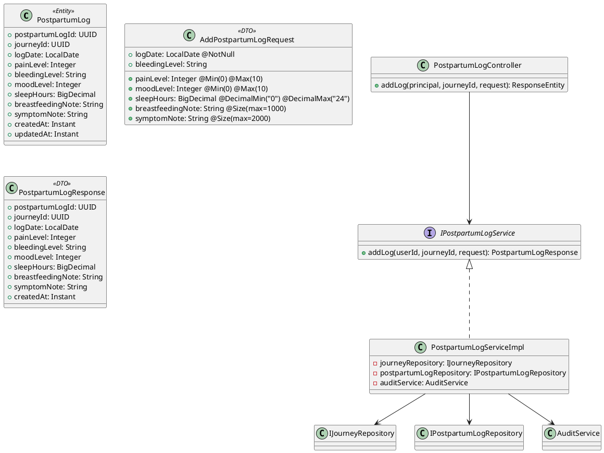
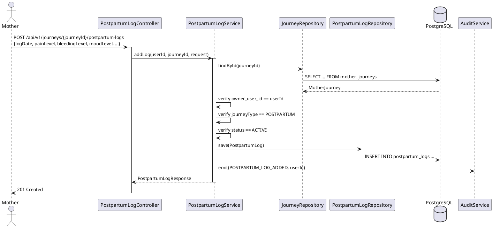

# ENGINEERING DOCUMENTATION STANDARD (EDS) v2.0
# Technical Design Specification — UC-28 Add Postpartum Log

| Field              | Value                   |
| ------------------ | ----------------------- |
| **Document ID**    | `CB-JOURNEY-IMP-007`    |
| **Version**        | `1.0`                   |
| **Date**           | `2026-06-26`            |
| **Status**         | `Draft`                 |
| **Document Owner** | `PhuongNT`              |
| **Author**         | `AI Agent`              |
| **Reviewed by**    | `[Tech Lead]`           |
| **DPO Sign-off**   | `[ ] Pending`           |
| **Approved by**    | `[Principal Architect]` |
| **Last Review**    | `2026-06-26`            |
| **Based on EDS**   | `v2.0`                  |

---

## CHANGELOG

| Ngày       | Người thực hiện | Nội dung thay đổi                               |
| ---------- | --------------- | ----------------------------------------------- |
| 2026-06-26 | AI Agent        | Tạo tài liệu lần đầu cho UC-28 Add Postpartum Log |

---

## 1. Tổng quan Module

| Field                     | Value                                                                  |
| ------------------------- | ---------------------------------------------------------------------- |
| **Module Name**           | `AddPostpartumLog`                                                     |
| **Bounded Context**       | `journey`                                                              |
| **UC ID**                 | `UC-28`                                                                |
| **SRS Reference**         | `3.3.1.7`                                                              |
| **Primary Actor**         | `Mother (ROLE_MOTHER — authenticated)`                                 |
| **Secondary Actors**      | `Gemini AI Service (async red-flag detection)`                         |
| **Platform**              | `Mobile App`                                                           |
| **Data Classification**   | `Sensitive-PII`                                                        |
| **Compliance Scope**      | `BR-RBAC, BR-PRIVACY, BR-SAFETY (non-diagnostic, escalation-aware)`   |
| **Upstream Dependencies** | `UC-22 CreateMotherJourney (journey must exist, type=POSTPARTUM)`      |
| **Downstream Consumers**  | `AuditService`, `Gemini AI (async)`, `UC-24 Dashboard`                 |

**Mô tả:** Cho phép Mother ghi nhận nhật ký hồi phục sau sinh hàng ngày bao gồm: mức đau (pain_level), mức chảy máu (bleeding_level), tâm trạng (mood_level), giờ ngủ, ghi chú cho con bú, và triệu chứng. Journey **phải** có type = POSTPARTUM và status = ACTIVE. Gemini AI kiểm tra red-flag bất đồng bộ (async, fail-open — log được lưu bất kể AI response). **BR-SAFETY:** AI chỉ cung cấp guidance, không chẩn đoán.

---

## 2. Ma trận Truy vết (Traceability Matrix)

| Requirement ID | Loại          | Mô tả yêu cầu                                              | Thành phần Code                           | Compliance    | ADR              |
| -------------- | ------------- | ----------------------------------------------------------- | ----------------------------------------- | ------------- | ---------------- |
| UC-28          | Use Case      | Ghi nhật ký hồi phục sau sinh                              | `PostpartumLogController.addLog()`        | BR-RBAC       | ADR-JOURNEY-007-001 |
| BR-POST-001    | Business Rule | Ownership: owner_user_id == JWT userId                     | `PostpartumLogServiceImpl` check          | BR-PRIVACY    | —                |
| BR-POST-002    | Business Rule | Journey phải là POSTPARTUM type                            | Service validation                        | Data Integrity| ADR-JOURNEY-007-003 |
| BR-POST-003    | Business Rule | Journey phải ACTIVE                                         | Service validation                        | Data Integrity| —                |
| BR-POST-004    | Business Rule | pain_level 0–10                                            | `@Min(0) @Max(10)` Bean Validation        | —             | —                |
| BR-POST-005    | Business Rule | bleeding_level ∈ {NONE, LIGHT, MEDIUM, HEAVY}             | Enum validation                           | —             | —                |
| BR-POST-006    | Business Rule | mood_level 0–10                                            | `@Min(0) @Max(10)` Bean Validation        | —             | —                |
| BR-POST-007    | Business Rule | Gemini AI async red-flag — fail-open                       | `@Async` + CompletableFuture              | BR-SAFETY     | ADR-JOURNEY-007-002 |
| BR-POST-008    | Business Rule | Emit POSTPARTUM_LOG_ADDED audit event                      | `AuditService.emit()`                     | Audit         | —                |

---

## 3. Architecture Decision Records (ADR)

### ADR-JOURNEY-007-001 — Cho phép nhiều log cùng ngày

| Field | Value |
|-------|-------|
| **Status** | `Accepted` |
| **Date** | `2026-06-26` |

#### Quyết định
Không enforce unique constraint trên `(journey_id, log_date)`. Mother có thể ghi nhiều log trong cùng ngày (sáng và tối). Recommended 1 log/ngày nhưng không bắt buộc.

---

### ADR-JOURNEY-007-002 — Gemini AI fail-open

| Field | Value |
|-------|-------|
| **Status** | `Accepted` |
| **Date** | `2026-06-26` |

#### Quyết định
Gemini AI call là async (CompletableFuture với timeout 5s). Nếu AI fail/timeout → log vẫn được lưu. AI insight là optional field trong response (có thể null).

---

### ADR-JOURNEY-007-003 — Journey type = POSTPARTUM bắt buộc

| Field | Value |
|-------|-------|
| **Status** | `Accepted` |
| **Date** | `2026-06-26` |

#### Quyết định
Postpartum logs chỉ áp dụng cho journey type POSTPARTUM. Nếu journey là PREGNANCY hoặc PRE_PREGNANCY → 400 error. Đây là domain constraint — postpartum log cho pregnancy journey không có nghĩa.

---

## 4. Non-Functional Requirements & SLA

| Category | Requirement | Target | Compliance |
|----------|------------|--------|------------|
| Latency | p99 response | < 500ms | — |
| Data | Sensitive-PII retention | 7 years | PDPA |
| Safety | AI insight is guidance only | Zero diagnosis | BR-SAFETY |

---

## 5. Static Modeling (Mô hình Tĩnh)



---

## 6. Dynamic Modeling (Mô hình Động)



---

## 7. Domain Event Catalog

| Event Name          | Trigger                  | Publisher                  | Payload                     |
| ------------------- | ------------------------ | -------------------------- | --------------------------- |
| PostpartumLogAdded  | Log saved successfully   | PostpartumLogServiceImpl   | {logId, journeyId, userId}  |

---

## 8. Interface Specification

```java
// AddPostpartumLogRequest.java
public class AddPostpartumLogRequest {
    @NotNull
    @JsonFormat(pattern = "yyyy-MM-dd")
    private LocalDate logDate;

    @Min(0) @Max(10)
    private Integer painLevel;

    private String bleedingLevel; // NONE, LIGHT, MEDIUM, HEAVY

    @Min(0) @Max(10)
    private Integer moodLevel;

    @DecimalMin("0") @DecimalMax("24")
    private BigDecimal sleepHours;

    @Size(max = 1000)
    private String breastfeedingNote;

    @Size(max = 2000)
    private String symptomNote;
}

// IPostpartumLogService.java
public interface IPostpartumLogService {
    PostpartumLogResponse addLog(UUID userId, UUID journeyId, AddPostpartumLogRequest request);
}
```

---

## 9. API Specification

| Method | Path                                              | Auth     | Role          |
| ------ | ------------------------------------------------- | -------- | ------------- |
| `POST` | `/api/v1/journeys/{journeyId}/postpartum-logs`    | JWT      | `ROLE_MOTHER` |

### Request

```json
{
  "logDate": "2026-06-26",
  "painLevel": 3,
  "bleedingLevel": "LIGHT",
  "moodLevel": 7,
  "sleepHours": 6.5,
  "breastfeedingNote": "Cho bú 4 lần, em bé bú tốt",
  "symptomNote": "Đau nhẹ vùng bụng dưới"
}
```

### Response — 201 Created

```json
{
  "success": true,
  "data": {
    "postpartumLogId": "uuid...",
    "journeyId": "uuid...",
    "logDate": "2026-06-26",
    "painLevel": 3,
    "bleedingLevel": "LIGHT",
    "moodLevel": 7,
    "sleepHours": 6.5,
    "createdAt": "2026-06-26T10:00:00Z"
  }
}
```

---

## 10. Bảng mã lỗi (Error Codes)

| Code      | HTTP | Message (VI)                                         | Trigger                             |
| --------- | ---- | ---------------------------------------------------- | ----------------------------------- |
| POST-001  | 404  | Hành trình không tồn tại                             | Journey not found                   |
| POST-002  | 400  | Hành trình không phải loại sau sinh (POSTPARTUM)     | journey.type != POSTPARTUM          |
| POST-003  | 400  | Hành trình đã kết thúc hoặc lưu trữ                 | journey.status != ACTIVE            |
| POST-004  | 400  | Mức đau phải từ 0 đến 10                             | painLevel out of range              |
| POST-005  | 400  | Mức chảy máu không hợp lệ                           | Invalid bleedingLevel enum          |
| POST-006  | 403  | Không có quyền thêm log cho hành trình này           | owner_user_id != JWT userId         |

---

## 11. Quy trình Triển khai

Không cần migration mới — bảng `postpartum_logs` đã có trong V1.

1. Tạo `PostpartumLog` entity mapping bảng `postpartum_logs`
2. Tạo `IPostpartumLogRepository` extends `JpaRepository`
3. Tạo `IPostpartumLogService` + `PostpartumLogServiceImpl`
4. Tạo `PostpartumLogController` với `@PostMapping`
5. Tạo DTOs: `AddPostpartumLogRequest`, `PostpartumLogResponse`

---

## 12. Rollback & Incident Runbook

```bash
git checkout -- src/main/java/com/carebridge/backend/carejourney/
```

---

## 13. Kịch bản Kiểm thử Chi tiết

> Xem `UC28_AddPostpartumLog_Test-Spec.md`

---

## 14. Phương pháp Xác minh

```sql
SELECT postpartum_log_id, log_date, pain_level, bleeding_level, mood_level
FROM postpartum_logs WHERE journey_id = '[uuid]' ORDER BY log_date DESC LIMIT 5;
```

---

## 15. Mẫu thử thực tế

```bash
curl -X POST "https://[host]/api/v1/journeys/[journeyId]/postpartum-logs" \
  -H "Authorization: Bearer [JWT]" \
  -H "Content-Type: application/json" \
  -d '{"logDate":"2026-06-26","painLevel":3,"bleedingLevel":"LIGHT","moodLevel":7,"sleepHours":6.5}'
```

---

## 16. Bảng tổng hợp phân quyền

| Endpoint                                                | GUEST | MOTHER   | EXPERT | ADMIN |
| ------------------------------------------------------- | ----- | -------- | ------ | ----- |
| `POST /api/v1/journeys/{journeyId}/postpartum-logs`     | ❌    | ✅ Own   | ❌     | ❌    |

---

## 17. AI Prompt Constraints (CASE 2.0)

| # | Constraint                                                              | Source          |
| - | ----------------------------------------------------------------------- | --------------- |
| C1 | PHẢI verify journey.type == POSTPARTUM trước khi insert                | BR-POST-002     |
| C2 | PHẢI verify journey.status == ACTIVE                                   | BR-POST-003     |
| C3 | PHẢI verify ownership (owner_user_id == JWT userId)                    | BR-POST-001     |
| C4 | Gemini AI call là async — log saved bất kể AI response                 | ADR-JOURNEY-007-002 |
| C5 | AI insight là GUIDANCE ONLY — không block save, không chẩn đoán        | BR-SAFETY       |
| C6 | Emit POSTPARTUM_LOG_ADDED audit event (không phụ thuộc AI)             | BR-POST-008     |

---

*EDS v2.0 — UC-28 Add Postpartum Log*
*Status: Draft*
