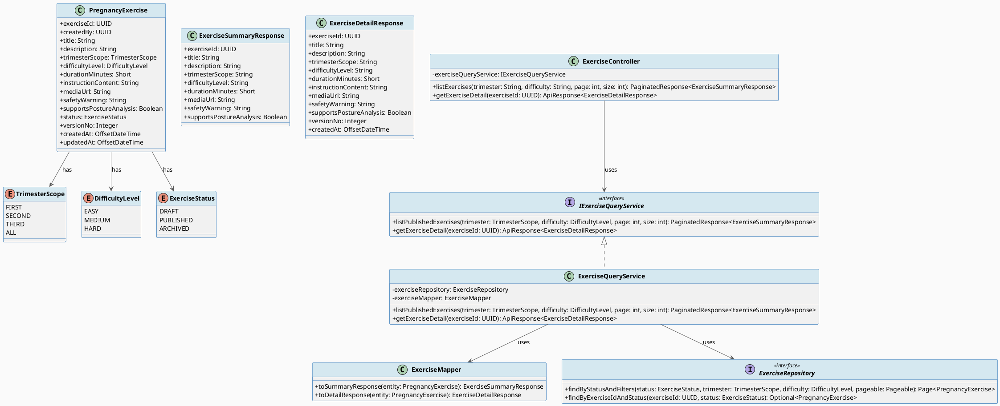
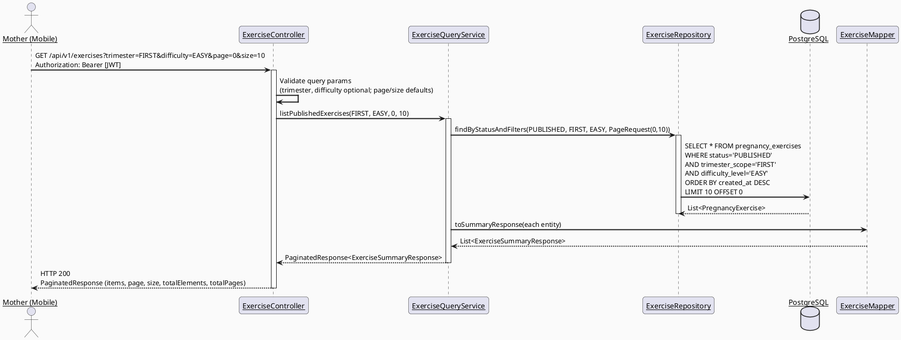
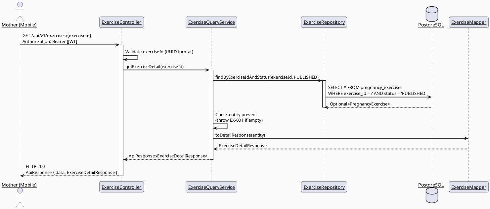
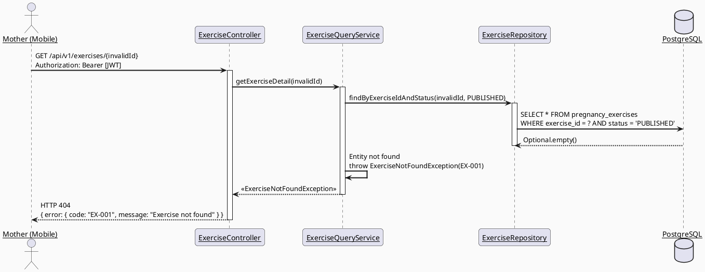
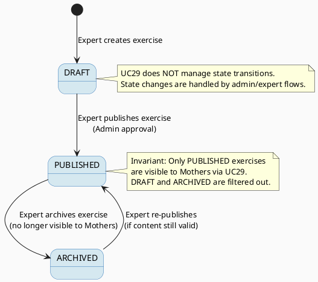

# ENGINEERING DOCUMENTATION STANDARD (EDS) v2.0
# UC29 — View and Select Pregnancy Exercise — Technical Design Specification

| Field | Value |
|-------|-------|
| **Document ID** | `CB-EXERCISE-IMP-001` |
| **Version** | `1.0` |
| **Date** | `2026-06-26` |
| **Status** | `Draft` |
| **Document Owner** | `PhuongNT` |
| **Author** | `AI Agent — Developer` |
| **Reviewed by** | `[ ] Pending` |
| **DPO Sign-off** | `[ ] Pending` |
| **Approved by** | `[ ] Pending` |
| **Last Review** | `2026-06-26` |
| **Based on EDS** | `v2.0` |

---

## CHANGELOG

> **Policy 4.4 — Immutable History:** Không bao giờ xóa thông tin cũ. Mọi thay đổi phải ghi vào bảng này.

| Ngày | Người thực hiện | Nội dung thay đổi |
|------|-----------------|-------------------|
| 2026-06-26 | AI Agent — Developer | Tạo tài liệu lần đầu |

---

## MỤC LỤC

1. [Tổng quan Module](#1-tổng-quan-module)
2. [Ma trận Truy vết (Traceability Matrix)](#2-ma-trận-truy-vết-traceability-matrix)
3. [Architecture Decision Records (ADR)](#3-architecture-decision-records-adr)
4. [Non-Functional Requirements & SLA](#4-non-functional-requirements--sla)
5. [Static Modeling (Mô hình Tĩnh)](#5-static-modeling-mô-hình-tĩnh)
6. [Dynamic Modeling (Mô hình Động)](#6-dynamic-modeling-mô-hình-động)
7. [Domain Event Catalog](#7-domain-event-catalog)
8. [Interface Specification (Đặc tả Giao diện)](#8-interface-specification-đặc-tả-giao-diện)
9. [API Specification](#9-api-specification)
10. [Bảng mã lỗi (Error Codes)](#10-bảng-mã-lỗi-error-codes)
11. [Quy trình Triển khai (Step-by-Step)](#11-quy-trình-triển-khai-step-by-step)
12. [Rollback & Incident Runbook](#12-rollback--incident-runbook)
13. [Kịch bản Kiểm thử Chi tiết](#13-kịch-bản-kiểm-thử-chi-tiết)
14. [Phương pháp Xác minh](#14-phương-pháp-xác-minh)
15. [Mẫu thử thực tế (API Verification Samples)](#15-mẫu-thử-thực-tế-api-verification-samples)
16. [Bảng tổng hợp phân quyền (Authorization Matrix)](#16-bảng-tổng-hợp-phân-quyền-authorization-matrix)
17. [AI Prompt Constraints (CASE 2.0)](#17-ai-prompt-constraints-case-20)

---

## 1. Tổng quan Module

> Hiển thị danh sách bài tập thai kỳ phù hợp và cho phép Mother chọn xem chi tiết hoặc bắt đầu bài tập.
> SRS 3.3.2.1: "View and Select Pregnancy Exercise — Displays suitable exercises and lets the Mother choose one to view or start."

| Field | Value |
|-------|-------|
| **Module Name** | `View and Select Pregnancy Exercise` |
| **Bounded Context** | `exercise` |
| **Data Classification** | `Internal` |
| **Compliance Scope** | `BR-RBAC, BR-PRIVACY, BR-SAFETY` |
| **Upstream Dependencies** | `IAM (authentication), pregnancy_exercises table (V1 migration)` |
| **Downstream Consumers** | `UC30 — Analyze Exercise Posture (session start depends on exercise selection)` |

**Phạm vi chức năng:**
- GET /api/v1/exercises — liệt kê danh sách bài tập đã được PUBLISHED, hỗ trợ filter theo `trimester_scope` và `difficulty_level`.
- GET /api/v1/exercises/{exerciseId} — xem chi tiết một bài tập bao gồm `instruction_content`.
- Chỉ hiển thị bài tập có `status = PUBLISHED`. Bài tập `DRAFT` và `ARCHIVED` bị ẩn hoàn toàn.
- Actor: **Mother**. Platform: **Mobile App**.

---

## 2. Ma trận Truy vết (Traceability Matrix)

> Ánh xạ trực tiếp: [Mã yêu cầu] → [Thành phần Code] → [Mục tiêu Tuân thủ].

| Requirement ID | Loại (BR/ADR/US) | Mô tả yêu cầu | Thành phần Code | Compliance Target | ADR liên quan |
|----------------|------------------|---------------|-----------------|-------------------|---------------|
| BR-EXERCISE-001 | Business Rule | Chỉ bài tập PUBLISHED mới hiển thị cho Mother | `ExerciseRepository.findPublished()`, `ExerciseService.listExercises()` | BR-SAFETY | ADR-EXERCISE-001 |
| BR-EXERCISE-002 | Business Rule | Filter theo trimester dựa trên tuần thai kỳ hiện tại của Mother (nếu có journey) | `ExerciseService.listExercises()` | BR-PRIVACY | ADR-EXERCISE-002 |
| BR-EXERCISE-003 | Business Rule | safety_warning luôn hiển thị nổi bật, không bao giờ bị ẩn hoặc suppress | `ExerciseSummaryResponse`, `ExerciseDetailResponse` | BR-SAFETY | — |
| BR-EXERCISE-004 | Business Rule | Không tự động bắt đầu bài tập mà không qua safety check | `ExerciseController` (UC29 chỉ view, start thuộc UC30) | BR-SAFETY | ADR-EXERCISE-003 |
| US-EXERCISE-001 | User Story | Mother xem danh sách bài tập phù hợp với tam cá nguyệt | `ExerciseController.GET /api/v1/exercises` | — | ADR-EXERCISE-001 |
| US-EXERCISE-002 | User Story | Mother xem chi tiết bài tập bao gồm hướng dẫn đầy đủ | `ExerciseController.GET /api/v1/exercises/{exerciseId}` | — | — |

---

## 3. Architecture Decision Records (ADR)

### ADR-EXERCISE-001 — Paginated List with Filter (No Full-text Search)

| Field | Value |
|-------|-------|
| **Status** | `Accepted` |
| **Deciders** | `PhuongNT — Developer, AI Agent` |
| **Date** | `2026-06-26` |

#### Bối cảnh (Context)
> Bài tập thai kỳ là catalog được curate bởi chuyên gia. Số lượng bài tập giới hạn (hàng trăm, không phải hàng nghìn). Mother cần browse theo danh mục hơn là tìm kiếm tự do.

#### Các phương án đã xem xét (Options Considered)

| Phương án | Mô tả | Ưu điểm | Nhược điểm |
|-----------|-------|----------|------------|
| A | Paginated list + filter by trimester/difficulty | + Đơn giản, phù hợp catalog nhỏ, UX dễ dùng | - Không hỗ trợ tìm kiếm text |
| B | Full-text search với PostgreSQL tsvector | + Tìm kiếm linh hoạt | - Over-engineered cho catalog nhỏ, cần maintain search index |

#### Quyết định (Decision)
> Chọn **Phương án A** vì exercises là curated catalog với số lượng giới hạn. Filter theo trimester_scope và difficulty_level đủ đáp ứng nhu cầu browse của Mother.

#### Hệ quả (Consequences)

**Tích cực:**
- Implementation đơn giản, ít dependency
- Performance tốt với catalog nhỏ
- UX phù hợp cho mobile app

**Tiêu cực / Trade-offs:**
- Nếu catalog mở rộng lớn (>1000 bài tập), có thể cần thêm search. Giảm thiểu: đánh giá lại khi catalog > 500.

**Compliance Impact:**
- Không ảnh hưởng đến compliance.

---

### ADR-EXERCISE-002 — Trimester Auto-detect from Mother's Journey

| Field | Value |
|-------|-------|
| **Status** | `Accepted` |
| **Deciders** | `PhuongNT — Developer, AI Agent` |
| **Date** | `2026-06-26` |

#### Bối cảnh (Context)
> Mother có thể có một pregnancy journey với thông tin tuần thai. Khi browse bài tập, hệ thống có thể tự động suggest bài tập phù hợp trimester hiện tại. Tuy nhiên, filter vẫn là optional — Mother có quyền xem tất cả bài tập.

#### Các phương án đã xem xét (Options Considered)

| Phương án | Mô tả | Ưu điểm | Nhược điểm |
|-----------|-------|----------|------------|
| A | Trimester filter là optional query param, client gửi | + Đơn giản, không coupling với journey module | - Client phải biết trimester |
| B | Server auto-detect trimester từ journey, fallback ALL | + Tự động UX tốt | - Coupling với journey module |

#### Quyết định (Decision)
> Chọn **Phương án A** vì giảm coupling giữa exercise và journey module. Client (mobile app) có thể lấy thông tin trimester từ journey rồi gửi filter. Server chỉ filter, không lookup journey.

#### Hệ quả (Consequences)

**Tích cực:**
- Exercise module độc lập, không phụ thuộc journey module
- Dễ test, dễ maintain

**Tiêu cực / Trade-offs:**
- Client cần 2 calls (lấy journey info + lấy exercises). Giảm thiểu: client cache journey info locally.

**Compliance Impact:**
- Không truy cập thêm dữ liệu PII của Mother.

---

### ADR-EXERCISE-003 — Safety Check Required Before Starting Exercise Session

| Field | Value |
|-------|-------|
| **Status** | `Accepted` |
| **Deciders** | `PhuongNT — Developer, AI Agent` |
| **Date** | `2026-06-26` |

#### Bối cảnh (Context)
> Bài tập thai kỳ có nguy cơ tiềm ẩn. Trước khi bắt đầu bất kỳ bài tập nào, Mother phải hoàn thành safety check questionnaire. UC29 chỉ view/select; UC30 xử lý safety check và session.

#### Các phương án đã xem xét (Options Considered)

| Phương án | Mô tả | Ưu điểm | Nhược điểm |
|-----------|-------|----------|------------|
| A | Safety check là endpoint riêng, gọi trước khi start session | + Tách biệt, rõ ràng | - Cần nhiều API calls |
| B | Safety check embedded trong session start | + Ít API calls | - Logic phức tạp, khó test riêng |

#### Quyết định (Decision)
> Chọn **Phương án A** (xử lý trong UC30). UC29 không có logic start — chỉ view và select. Safety check endpoint riêng giúp audit trail rõ ràng.

#### Hệ quả (Consequences)

**Tích cực:**
- Audit trail cho safety check rõ ràng
- Có thể reuse safety check cho các mục đích khác
- UC29 đơn giản, chỉ read-only

**Tiêu cực / Trade-offs:**
- Mother cần thêm bước trước khi bắt đầu bài tập. Giảm thiểu: UX flow tự động chuyển.

**Compliance Impact:**
- BR-SAFETY: đảm bảo Mother được cảnh báo trước khi tập.

---

## 4. Non-Functional Requirements & SLA

### 4.1. Performance & Availability

| Category | Requirement | Target SLA | Measurement Method | Compliance Basis |
|----------|-------------|------------|---------------------|------------------|
| Latency | GET /api/v1/exercises (p99) | `< 200ms` | k6 load test | — |
| Latency | GET /api/v1/exercises/{id} (p99) | `< 150ms` | k6 load test | — |
| Availability | Uptime (monthly) | `99.9%` | Uptime monitor | — |
| Throughput | Concurrent requests | `300 req/s` | Load test | — |

### 4.2. Data Integrity & Retention

| Category | Requirement | Target | Verification Method | Compliance Basis |
|----------|-------------|--------|---------------------|------------------|
| Consistency | Only PUBLISHED exercises visible | 100% | Integration test | BR-EXERCISE-001 |
| Retention | Exercise data retention | Indefinite (catalog data) | DB policy | — |

### 4.3. Security

| Category | Requirement | Target | Verification Method | Compliance Basis |
|----------|-------------|--------|---------------------|------------------|
| Authentication | JWT required for all endpoints | 100% | Security test | BR-RBAC |
| Authorization | MOTHER role required | Least privilege | Auth Matrix (S16) | BR-RBAC |
| Encryption in transit | All endpoints | TLS 1.3+ | SSL Labs scan | BR-PRIVACY |

### 4.4. Scalability & Capacity Planning

> Dự kiến tải: ~500 active Mothers, ~200 exercises in catalog. Read-heavy workload. Caching strategy: Spring Cache with TTL 5 min cho exercise list (optional future optimization).

---

## 5. Static Modeling (Mô hình Tĩnh)

### 5.1. Class Diagram (PlantUML)



### 5.2. Data Structure (Existing V1 Migration)

> Schema đã tồn tại trong V1 migration. Không cần tạo migration mới cho UC29.

```sql
-- === PREGNANCY EXERCISES TABLE (existing) ===
CREATE TABLE public.pregnancy_exercises (
    exercise_id uuid NOT NULL DEFAULT gen_random_uuid(),
    created_by uuid NOT NULL,
    title varchar(255) NOT NULL,
    description text,
    trimester_scope varchar(50),      -- FIRST, SECOND, THIRD, ALL
    difficulty_level varchar(30),      -- EASY, MEDIUM, HARD
    duration_minutes smallint,
    instruction_content text,
    media_url text,
    safety_warning text,
    supports_posture_analysis boolean NOT NULL DEFAULT false,
    status varchar(20) NOT NULL DEFAULT 'DRAFT',  -- DRAFT, PUBLISHED, ARCHIVED
    version_no integer NOT NULL DEFAULT 1,
    created_at timestamptz NOT NULL DEFAULT now(),
    updated_at timestamptz NOT NULL DEFAULT now()
);

-- Recommended index for UC29 queries
CREATE INDEX idx_pregnancy_exercises_status_trimester
    ON public.pregnancy_exercises(status, trimester_scope);
CREATE INDEX idx_pregnancy_exercises_status_difficulty
    ON public.pregnancy_exercises(status, difficulty_level);
```

---

## 6. Dynamic Modeling (Mô hình Động)

### 6.1. Sequence Diagram — Happy Path: List Exercises



### 6.2. Sequence Diagram — Happy Path: Get Exercise Detail



### 6.3. Sequence Diagram — Error Path: Exercise Not Found



### 6.4. State Machine — Exercise Status (Reference only, managed by admin)



---

## 7. Domain Event Catalog

### 7.1. Events Published (Phát ra)

> UC29 is read-only. No domain events are published by this module.

| Event Name | Trigger | Publisher | Subscriber(s) | Payload Schema | Async? |
|------------|---------|-----------|---------------|----------------|--------|
| _(none)_ | — | — | — | — | — |

### 7.2. Events Consumed (Tiêu thụ)

> UC29 does not consume events. It reads directly from the `pregnancy_exercises` table.

| Event Name | Source | Handler | Action thực hiện |
|------------|--------|---------|------------------|
| _(none)_ | — | — | — |

---

## 8. Interface Specification (Đặc tả Giao diện)

### 8.1. Service Interface

```java
// ExerciseSummaryResponse.java — Summary DTO for list view
// @version 1.0
public class ExerciseSummaryResponse {
    private UUID exerciseId;        // Primary key
    private String title;           // Exercise title, not null
    private String description;     // Short description
    private String trimesterScope;  // FIRST, SECOND, THIRD, ALL
    private String difficultyLevel; // EASY, MEDIUM, HARD
    private Short durationMinutes;  // Estimated duration
    private String mediaUrl;        // URL to instructional media (video/image)
    private String safetyWarning;   // Always included, never null (empty string if none)
    private Boolean supportsPostureAnalysis; // Whether posture analysis is available
    // getters / setters
}

// ExerciseDetailResponse.java — Full detail DTO
// @version 1.0
public class ExerciseDetailResponse {
    private UUID exerciseId;
    private String title;
    private String description;
    private String trimesterScope;
    private String difficultyLevel;
    private Short durationMinutes;
    private String instructionContent; // Full instruction text (not in summary)
    private String mediaUrl;
    private String safetyWarning;      // Always included, never null
    private Boolean supportsPostureAnalysis;
    private Integer versionNo;
    private OffsetDateTime createdAt;
    // getters / setters
}

// IExerciseQueryService.java — Service Contract
// @version 1.0
public interface IExerciseQueryService {
    /**
     * List published exercises with optional filters.
     * Only exercises with status=PUBLISHED are returned.
     * @param trimester optional filter by trimester scope
     * @param difficulty optional filter by difficulty level
     * @param page zero-based page number
     * @param size page size (default 20, max 50)
     * @return paginated list of exercise summaries
     */
    PaginatedResponse<ExerciseSummaryResponse> listPublishedExercises(
        TrimesterScope trimester, DifficultyLevel difficulty, int page, int size);

    /**
     * Get full detail of a single published exercise.
     * @param exerciseId UUID of the exercise
     * @return exercise detail
     * @throws ExerciseNotFoundException (EX-001) when exercise not found or not PUBLISHED
     */
    ApiResponse<ExerciseDetailResponse> getExerciseDetail(UUID exerciseId);
}
```

### 8.2. Repository Interface

```java
// ExerciseRepository.java
// @version 1.0
public interface ExerciseRepository extends JpaRepository<PregnancyExercise, UUID> {

    /**
     * Find published exercises with optional trimester and difficulty filters.
     * Uses dynamic query — null parameters are ignored in WHERE clause.
     */
    @Query("SELECT e FROM PregnancyExercise e WHERE e.status = :status "
         + "AND (:trimester IS NULL OR e.trimesterScope = :trimester) "
         + "AND (:difficulty IS NULL OR e.difficultyLevel = :difficulty) "
         + "ORDER BY e.createdAt DESC")
    Page<PregnancyExercise> findByStatusAndFilters(
        @Param("status") ExerciseStatus status,
        @Param("trimester") TrimesterScope trimester,
        @Param("difficulty") DifficultyLevel difficulty,
        Pageable pageable);

    /**
     * Find a single exercise by ID and status.
     * Used to ensure only PUBLISHED exercises are accessible.
     */
    Optional<PregnancyExercise> findByExerciseIdAndStatus(UUID exerciseId, ExerciseStatus status);
}
```

---

## 9. API Specification

### 9.1. Endpoints Table

| Method | Path | Auth Level | Required Roles | Rate Limit | Idempotent? |
|--------|------|------------|----------------|------------|-------------|
| `GET` | `/api/v1/exercises` | JWT Bearer | `MOTHER` | 300/min | Yes |
| `GET` | `/api/v1/exercises/{exerciseId}` | JWT Bearer | `MOTHER` | 300/min | Yes |

### 9.2. Request / Response Schemas

#### `GET /api/v1/exercises` — Liệt kê bài tập

**Query Parameters:**

| Parameter | Type | Required | Default | Description |
|-----------|------|----------|---------|-------------|
| `trimester` | String | No | (all) | Filter: `FIRST`, `SECOND`, `THIRD`, `ALL` |
| `difficulty` | String | No | (all) | Filter: `EASY`, `MEDIUM`, `HARD` |
| `page` | Integer | No | 0 | Zero-based page number |
| `size` | Integer | No | 20 | Page size (max 50) |

**Response — 200 OK (Happy Path):**
```json
{
  "items": [
    {
      "exerciseId": "550e8400-e29b-41d4-a716-446655440001",
      "title": "Prenatal Yoga - First Trimester",
      "description": "Gentle yoga poses suitable for early pregnancy",
      "trimesterScope": "FIRST",
      "difficultyLevel": "EASY",
      "durationMinutes": 20,
      "mediaUrl": "https://cdn.carebridge.com/exercises/prenatal-yoga-t1.mp4",
      "safetyWarning": "Stop immediately if you feel dizzy or experience pain.",
      "supportsPostureAnalysis": true
    }
  ],
  "page": 0,
  "size": 20,
  "totalElements": 15,
  "totalPages": 1
}
```

**Response — 401 Unauthorized (No JWT):**
```json
{
  "error": {
    "code": "IAM-001",
    "message": "Authentication required"
  }
}
```

---

#### `GET /api/v1/exercises/{exerciseId}` — Chi tiết bài tập

**Path Parameters:**

| Parameter | Type | Required | Description |
|-----------|------|----------|-------------|
| `exerciseId` | UUID | Yes | Exercise primary key |

**Response — 200 OK (Happy Path):**
```json
{
  "data": {
    "exerciseId": "550e8400-e29b-41d4-a716-446655440001",
    "title": "Prenatal Yoga - First Trimester",
    "description": "Gentle yoga poses suitable for early pregnancy",
    "trimesterScope": "FIRST",
    "difficultyLevel": "EASY",
    "durationMinutes": 20,
    "instructionContent": "Step 1: Start in a comfortable seated position...",
    "mediaUrl": "https://cdn.carebridge.com/exercises/prenatal-yoga-t1.mp4",
    "safetyWarning": "Stop immediately if you feel dizzy or experience pain.",
    "supportsPostureAnalysis": true,
    "versionNo": 1,
    "createdAt": "2026-06-01T10:00:00.000Z"
  }
}
```

**Response — 404 Not Found:**
```json
{
  "error": {
    "code": "EX-001",
    "message": "Exercise not found"
  }
}
```

---

## 10. Bảng mã lỗi (Error Codes)

| Code | HTTP Status | Message (EN) | Message (VI) | Trigger Condition |
|------|-------------|--------------|--------------|-------------------|
| `EX-001` | 404 | Exercise not found | Không tìm thấy bài tập | exerciseId does not exist or status is not PUBLISHED |
| `EX-002` | 403 | Exercise not accessible | Bài tập không khả dụng | Exercise exists but status is DRAFT or ARCHIVED (returned as 404 for security — no information leakage) |
| `IAM-001` | 401 | Authentication required | Yêu cầu xác thực | No JWT token or token expired |
| `IAM-002` | 403 | Insufficient permissions | Không đủ quyền | User does not have MOTHER role |

> **Note:** EX-002 is mapped to 404 in implementation to prevent information leakage about DRAFT/ARCHIVED exercises. Internally logged as EX-002 for audit.

---

## 11. Quy trình Triển khai (Step-by-Step)

### 11.1. Prerequisites

- [ ] ADR-EXERCISE-001, 002, 003 đã được Accepted (xem S3)
- [ ] V1 migration with pregnancy_exercises table đã chạy thành công
- [ ] Package `com.carebridge.backend.exercise` đã tồn tại

### 11.2. Pre-Migration Checklist

> Không cần migration mới cho UC29. Sử dụng schema hiện có.

- [x] pregnancy_exercises table đã tồn tại từ V1 migration
- [ ] Index cho status + trimester_scope đã được tạo (hoặc thêm vào migration mới)

### 11.3. Implementation Steps

#### Chặng 1 — Entity & Enums

Tạo files trong `com.carebridge.backend.exercise.entity`:
- `PregnancyExercise.java` — JPA entity mapping to `pregnancy_exercises` table
- `TrimesterScope.java` — Enum: FIRST, SECOND, THIRD, ALL
- `DifficultyLevel.java` — Enum: EASY, MEDIUM, HARD
- `ExerciseStatus.java` — Enum: DRAFT, PUBLISHED, ARCHIVED

#### Chặng 2 — Repository

Tạo `ExerciseRepository.java` trong `com.carebridge.backend.exercise.repository`:
- Extend `JpaRepository<PregnancyExercise, UUID>`
- Custom query `findByStatusAndFilters` with dynamic filters

#### Chặng 3 — DTOs & Mapper

Tạo DTOs trong `com.carebridge.backend.exercise.dto`:
- `ExerciseSummaryResponse.java`
- `ExerciseDetailResponse.java`

Tạo mapper trong `com.carebridge.backend.exercise.mapper`:
- `ExerciseMapper.java` (MapStruct or manual)

#### Chặng 4 — Service

Tạo service trong `com.carebridge.backend.exercise.service`:
- `IExerciseQueryService.java` — interface
- `ExerciseQueryService.java` — implementation

#### Chặng 5 — Controller

Tạo controller trong `com.carebridge.backend.exercise.controller`:
- `ExerciseController.java` — REST endpoints

#### Chặng 6 — Verification sau deploy

```bash
# Health check
curl -X GET https://[host]/api/v1/health

# Smoke test — list exercises
curl -X GET https://[host]/api/v1/exercises \
  -H "Authorization: Bearer [JWT_TOKEN]"
# Expected: 200 with paginated list
```

### 11.4. Deployment Checklist

- [ ] Build thành công: `./mvnw clean package`
- [ ] Unit tests pass: `./mvnw test`
- [ ] Integration tests pass: `./mvnw verify`
- [ ] Health check endpoint trả về 200
- [ ] Exercise list endpoint trả về 200 với data phù hợp

---

## 12. Rollback & Incident Runbook

### 12.1. Điều kiện kích hoạt Rollback (Trigger Conditions)

| Điều kiện | Ngưỡng | Người quyết định |
|-----------|--------|------------------|
| Error rate tăng đột biến | > 5% trong 5 phút | On-call Engineer |
| Latency p99 vượt ngưỡng | > 2x baseline (>400ms) | On-call Engineer |
| DRAFT exercises visible to Mothers | Bất kỳ case nào | Tech Lead |

### 12.2. Rollback Procedure

```bash
# UC29 is read-only — rollback is low risk
# Bước 1: Revert deployment to previous version
kubectl rollout undo deployment/carebridge-api

# Bước 2: Verify rollback
kubectl rollout status deployment/carebridge-api
curl -X GET https://[host]/api/v1/health

# No DB migration to revert — UC29 uses existing schema
```

### 12.3. Notification Protocol

| Thời điểm | Người nhận | Kênh | Template |
|-----------|------------|------|----------|
| Ngay khi phát hiện | On-call team | Slack #incident | "EXERCISE module incident: [description]" |

### 12.4. Post-Incident Review (PIR)

> Standard PIR process. Low data risk since UC29 is read-only and no PII is exposed through exercise catalog.

---

## 13. Kịch bản Kiểm thử Chi tiết

> **Policy (EDS v2.0 — Test Data):** Mọi test scenario phải dùng `SYNTHETIC` data.

### 13.1. Unit Tests

#### TC-UNIT-001 — ExerciseQueryService.listPublishedExercises — Happy Path

```gherkin
Feature: List published pregnancy exercises
  Background:
    Given test data classification: SYNTHETIC
    And ExerciseRepository is mocked

  Scenario: List exercises with trimester filter
    Given repository returns 2 PUBLISHED exercises with trimester=FIRST
    When listPublishedExercises(FIRST, null, 0, 20) is called
    Then result contains 2 ExerciseSummaryResponse items
    And each item has safetyWarning field populated (not null)
    And each item has trimesterScope = "FIRST"
```

**Hàm được test:** `ExerciseQueryService.listPublishedExercises()`
**Invariant kiểm tra:** Only PUBLISHED exercises returned; safetyWarning never null

#### TC-UNIT-002 — ExerciseQueryService.getExerciseDetail — Exercise Not Found

```gherkin
Feature: Get exercise detail
  Background:
    Given test data classification: SYNTHETIC
    And ExerciseRepository is mocked

  Scenario: Exercise ID not found
    Given repository returns Optional.empty() for given exerciseId
    When getExerciseDetail(exerciseId) is called
    Then ExerciseNotFoundException is thrown with code EX-001
```

**Hàm được test:** `ExerciseQueryService.getExerciseDetail()`
**Invariant kiểm tra:** Non-existent exercise returns EX-001 error

### 13.2. Integration Tests

#### TC-INT-001 — Full list with mixed statuses

```gherkin
  Scenario: Only PUBLISHED exercises appear in list
    Given test data classification: SYNTHETIC
    And database contains 3 exercises:
      | title     | status    | trimester |
      | Exercise1 | PUBLISHED | FIRST     |
      | Exercise2 | PUBLISHED | SECOND    |
      | Exercise3 | DRAFT     | FIRST     |
    When GET /api/v1/exercises is called with valid JWT (MOTHER role)
    Then response status is 200
    And response contains exactly 2 exercises
    And Exercise3 (DRAFT) is not in the response
```

**External dependencies:** PostgreSQL (Testcontainers)
**Mock strategy:** Testcontainers PostgreSQL with Spring Boot Test

### 13.3. E2E / Security Tests

#### TC-E2E-001 — No JWT returns 401

```gherkin
  Scenario: Unauthenticated access blocked
    Given test data classification: SYNTHETIC
    When GET /api/v1/exercises is called without Authorization header
    Then response status is 401
    And response body contains error code IAM-001
```

---

## 14. Phương pháp Xác minh

### 14.1. Database Inspection

```sql
-- Verify only PUBLISHED exercises are returned by query
SELECT exercise_id, title, status, trimester_scope
FROM pregnancy_exercises
WHERE status = 'PUBLISHED'
ORDER BY created_at DESC;

-- Verify DRAFT exercises exist but should NOT appear in API response
SELECT count(*) FROM pregnancy_exercises WHERE status = 'DRAFT';
```

### 14.2. Log / Audit Verification

```bash
# UC29 is read-only — verify no sensitive data in logs
kubectl logs -l app=carebridge-api | grep -i "exercise" | head -10

# Verify no PII in exercise query logs
kubectl logs -l app=carebridge-api | grep -i "password\|secret\|ssn"
# Expected: No output
```

---

## 15. Mẫu thử thực tế (API Verification Samples)

### 15.1. Happy Path — List Exercises

```bash
# List all published exercises
curl -X GET "https://[host]/api/v1/exercises?page=0&size=10" \
  -H "Authorization: Bearer [JWT_TOKEN]" \
  -H "Content-Type: application/json"
```

**Expected Response (200):**
```json
{
  "items": [
    {
      "exerciseId": "550e8400-e29b-41d4-a716-446655440001",
      "title": "Prenatal Yoga - First Trimester",
      "description": "Gentle yoga poses suitable for early pregnancy",
      "trimesterScope": "FIRST",
      "difficultyLevel": "EASY",
      "durationMinutes": 20,
      "mediaUrl": "https://cdn.carebridge.com/exercises/prenatal-yoga-t1.mp4",
      "safetyWarning": "Stop immediately if you feel dizzy or experience pain.",
      "supportsPostureAnalysis": true
    }
  ],
  "page": 0,
  "size": 10,
  "totalElements": 1,
  "totalPages": 1
}
```

### 15.2. Happy Path — Exercise Detail

```bash
curl -X GET "https://[host]/api/v1/exercises/550e8400-e29b-41d4-a716-446655440001" \
  -H "Authorization: Bearer [JWT_TOKEN]"
```

**Expected Response (200):**
```json
{
  "data": {
    "exerciseId": "550e8400-e29b-41d4-a716-446655440001",
    "title": "Prenatal Yoga - First Trimester",
    "description": "Gentle yoga poses suitable for early pregnancy",
    "trimesterScope": "FIRST",
    "difficultyLevel": "EASY",
    "durationMinutes": 20,
    "instructionContent": "Step 1: Start in a comfortable seated position...",
    "mediaUrl": "https://cdn.carebridge.com/exercises/prenatal-yoga-t1.mp4",
    "safetyWarning": "Stop immediately if you feel dizzy or experience pain.",
    "supportsPostureAnalysis": true,
    "versionNo": 1,
    "createdAt": "2026-06-01T10:00:00.000Z"
  }
}
```

### 15.3. Error Paths

```bash
# Exercise not found
curl -X GET "https://[host]/api/v1/exercises/00000000-0000-0000-0000-000000000000" \
  -H "Authorization: Bearer [JWT_TOKEN]"
```

**Expected Response (404):**
```json
{
  "error": {
    "code": "EX-001",
    "message": "Exercise not found"
  }
}
```

```bash
# No JWT → 401
curl -X GET "https://[host]/api/v1/exercises"
```

**Expected Response (401):**
```json
{
  "error": {
    "code": "IAM-001",
    "message": "Authentication required"
  }
}
```

---

## 16. Bảng tổng hợp phân quyền (Authorization Matrix)

| Endpoint | `GUEST` | `MOTHER` | `EXPERT` | `ADMIN` | `SYSTEM` |
|----------|---------|----------|----------|---------|----------|
| `GET /api/v1/exercises` | ❌ | ✅ | ❌ | ❌ | ❌ |
| `GET /api/v1/exercises/{exerciseId}` | ❌ | ✅ | ❌ | ❌ | ❌ |

**Chú thích:**
- ✅ = Được phép
- ❌ = Bị từ chối (403) hoặc sử dụng endpoint admin riêng
- EXPERT/ADMIN quản lý exercises qua admin endpoints riêng biệt (không thuộc UC29)

---

## 17. AI Prompt Constraints (CASE 2.0)

### 17.1 Constraint Summary Table

| # | Constraint | Source (ADR/BR) | Last Verified |
|---|-----------|-----------------|---------------|
| C1 | Chỉ trả về exercises có `status = PUBLISHED`. DRAFT và ARCHIVED PHẢI bị filter hoàn toàn, không xuất hiện trong response. | `BR-EXERCISE-001`, `ADR-EXERCISE-001` | `2026-06-26` |
| C2 | `safety_warning` PHẢI luôn được include trong response (cả summary và detail). Không bao giờ suppress hoặc set null. Nếu DB value là null, trả về empty string `""`. | `BR-EXERCISE-003` | `2026-06-26` |
| C3 | Exercise guidance only — PHẢI include disclaimer rằng exercises không thay thế tư vấn y tế. Không auto-start exercise, không diagnose, không prescribe. | `BR-SAFETY` | `2026-06-26` |
| C4 | Identity lấy từ JWT Bearer token qua `SecurityUtils.requireCurrentUserId(principal)`. Chỉ MOTHER role được access. | `BR-RBAC` | `2026-06-26` |
| C5 | Controller CHỈ xử lý validation và mapping. Business logic (filtering, authorization) nằm trong Service layer. | `ADR-EXERCISE-001` | `2026-06-26` |
| C6 | Pagination PHẢI dùng `PaginatedResponse<T>` wrapper. Default page size = 20, max = 50. | `ADR-EXERCISE-001` | `2026-06-26` |
| C7 | Trimester và difficulty filters là OPTIONAL. Khi không truyền, trả về TẤT CẢ bài tập PUBLISHED. | `ADR-EXERCISE-002` | `2026-06-26` |

### 17.2 Constraint Injection Block (Copy-Paste vào AI Prompt)

```
[CONSTRAINT BLOCK — Module: View and Select Pregnancy Exercise]
Theo TDS CB-EXERCISE-IMP-001 và các ADR liên quan:

1. C1: Chỉ return exercises với status=PUBLISHED. Repository query PHẢI filter bằng WHERE status='PUBLISHED'. DRAFT/ARCHIVED exercises KHÔNG BAO GIỜ xuất hiện trong response.
2. C2: safety_warning field PHẢI luôn populated trong response DTO. Nếu DB null → map thành empty string "". KHÔNG suppress.
3. C3: Exercise là guidance only. Include disclaimer trong API response hoặc client-side. KHÔNG auto-start session, KHÔNG diagnose.
4. C4: Lấy userId từ SecurityUtils.requireCurrentUserId(principal). Chỉ MOTHER role access. Check via @PreAuthorize hoặc SecurityPolicy.
5. C5: Controller = validation + mapping ONLY. Service = business logic + repository calls. KHÔNG đặt business logic trong controller.
6. C6: Dùng PaginatedResponse<T> cho list endpoint. Default size=20, max=50.
7. C7: Trimester và difficulty filters là optional query params. Null = no filter = return all PUBLISHED.

[CONTEXT BLOCK]
- Bounded Context: exercise
- Data Classification: Internal
- Compliance: BR-RBAC, BR-PRIVACY, BR-SAFETY
- Existing interfaces: S8 Service Interface + S8.2 Repository Interface
- Error codes: S10 Error Codes Table
- Auth matrix: S16 Authorization Matrix

[TASK BLOCK]
Implement UC29 View and Select Pregnancy Exercise thỏa mãn constraints trên.
Output phải tuân thủ S8 Interface Specification.
Tests phải cover S13 Test Scenarios.
```

### 17.3 Constraint Quality Checklist

- [x] Mỗi constraint traceable về ADR hoặc BR cụ thể
- [x] Không có constraint generic
- [x] Mỗi constraint có `Last Verified` date <= 2 sprints
- [x] Constraint block có >= 3 constraints cụ thể (7 constraints)
- [x] Constraint block reference S8 Interface
- [x] Constraint block reference S16 Auth Matrix

### 17.4 Anti-Pattern Detection (cho AI-Generated Code từ Block này)

| AP-ID | Anti-Pattern | Dấu hiệu | Hành động |
|-------|-------------|-----------|----------|
| AP-AI-001 | Unconstrained Gen | Code không match bất kỳ constraint C1-C7 nào | Reject — inject lại constraints |
| AP-AI-002 | DRAFT Leakage | Code không filter status=PUBLISHED trong repository query | Critical reject — fix query immediately |
| AP-AI-003 | Implicit Decision | Code assume architecture không có trong S3 ADR | Reject — viết ADR trước |
| AP-AI-004 | Safety Warning Suppression | Code set safetyWarning=null hoặc skip field | Reject — violates C2 |
| AP-AI-005 | Hallucinated Contract | Code import service/type không có trong S8 | Reject — verify contract existence |
| AP-AI-006 | Business Logic in Controller | Controller chứa filtering/authorization logic | Reject — move to Service layer (C5) |

---

## PHỤ LỤC

### A. Glossary (Thuật ngữ)

| Thuật ngữ | Định nghĩa |
|-----------|------------|
| Mother | Người dùng có vai trò MOTHER — phụ nữ mang thai sử dụng hệ thống |
| Exercise | Bài tập thai kỳ — nội dung được curate bởi chuyên gia |
| Trimester | Tam cá nguyệt: FIRST (1-12 tuần), SECOND (13-26 tuần), THIRD (27-40 tuần), ALL |
| PUBLISHED | Trạng thái bài tập đã được phê duyệt và hiển thị cho Mother |
| Safety Warning | Cảnh báo an toàn đi kèm bài tập — bắt buộc hiển thị |
| Posture Analysis | Phân tích tư thế trong khi tập — thuộc UC30 |

### B. Tài liệu tham chiếu

| Document | Link / Path |
|----------|-------------|
| SRS 3.3.2.1 | `01_Requirements/SRS.md` |
| CASE 2.0 Methodology | `vii_reports/FPT-EDU-REP-METH-002_CASE_AI_METHODOLOGY_v1.1.md` |
| EDS v2.0 Template | `08_References/Template/PHASE-3_TDS.md` |
| Exercise Package | `05_Development/CareBridgeAPI/src/main/java/com/carebridge/backend/exercise/` |

---

*EDS v2.0 — Tích hợp CASE 2.0 AI Prompt Constraints (S17).*
*UC29 — View and Select Pregnancy Exercise — Read-only module, no state mutation.*
