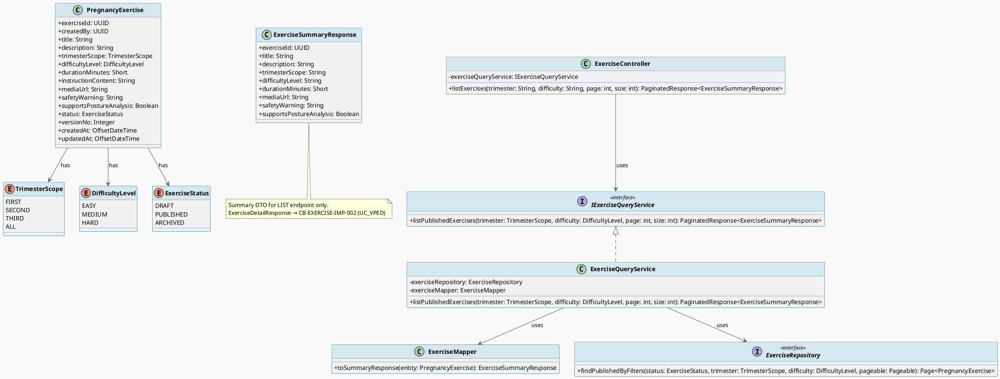
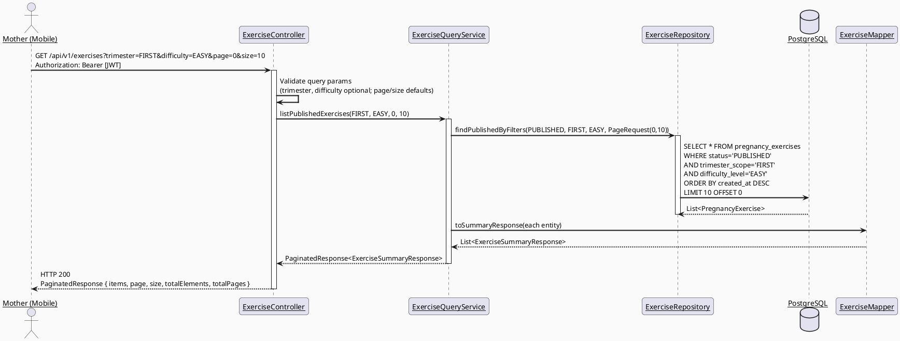
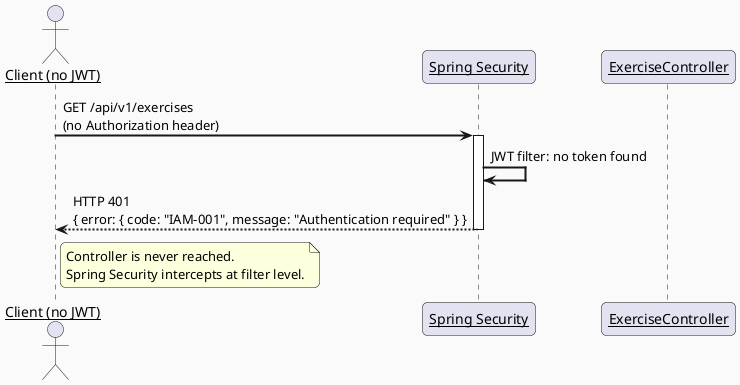
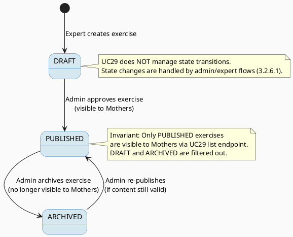

# ENGINEERING DOCUMENTATION STANDARD (EDS) v2.0
# UC29 — View and Select Pregnancy Exercise — Technical Design Specification

| Field | Value |
|-------|-------|
| **Document ID** | `CB-EXERCISE-IMP-001` |
| **Version** | `1.1` |
| **Date** | `2026-06-27` |
| **Status** | `Implemented` |
| **Document Owner** | `PhuongNT` |
| **Author** | `AI Agent — Developer` |
| **Reviewed by** | `[ ] Pending` |
| **DPO Sign-off** | `[ ] Pending` |
| **Approved by** | `[ ] Pending` |
| **Last Review** | `2026-06-27` |
| **Based on EDS** | `v2.0` |

---

## CHANGELOG

> **Policy 4.4 — Immutable History:** Không bao giờ xóa thông tin cũ. Mọi thay đổi phải ghi vào bảng này.

| Ngày | Người thực hiện | Nội dung thay đổi |
|------|-----------------|-------------------|
| 2026-06-26 | AI Agent — Developer | Tạo tài liệu lần đầu |
| 2026-06-27 | AI Agent — Developer | v1.1: Tách 3.3.2.3 (View Pregnancy Exercise Detail) ra thành CB-EXERCISE-IMP-002. UC29 giờ chỉ cover 3.3.2.1 (list/browse/select). Xóa `getExerciseDetail`, `ExerciseDetailResponse`, và endpoint GET /api/v1/exercises/{exerciseId} khỏi scope này. |
| 2026-06-27 | AI Agent — Developer | Phase 3: Implementation — 8/8 tests PASS. Red Gate verified → Green Gate PASS. |

---

## MỤC LỤC

1. [Tổng quan Module](#1-tổng-quan-module)
2. [Ma trận Truy vết (Traceability Matrix)](#2-ma-trận-truy-vết-traceability-matrix)
3. [Architecture Decision Records (ADR)](#3-architecture-decision-records-adr)
4. [Non-Functional Requirements & SLA](#4-non-functional-requirements--sla)
5. [Static Modeling (Mô hình Tĩnh)](#5-static-modeling-mô-hình-tĩnh)
6. [Dynamic Modeling (Mô hình Động)](#6-dynamic-modeling-mô-hình-động)
7. [Domain Event Catalog](#7-domain-event-catalog)
8. [Interface Specification (Đặc tả Giao diện)](#8-interface-specification-đặc-tả-giao-diện)
9. [API Specification](#9-api-specification)
10. [Bảng mã lỗi (Error Codes)](#10-bảng-mã-lỗi-error-codes)
11. [Quy trình Triển khai (Step-by-Step)](#11-quy-trình-triển-khai-step-by-step)
12. [Rollback & Incident Runbook](#12-rollback--incident-runbook)
13. [Kịch bản Kiểm thử Chi tiết](#13-kịch-bản-kiểm-thử-chi-tiết)
14. [Phương pháp Xác minh](#14-phương-pháp-xác-minh)
15. [Mẫu thử thực tế (API Verification Samples)](#15-mẫu-thử-thực-tế-api-verification-samples)
16. [Bảng tổng hợp phân quyền (Authorization Matrix)](#16-bảng-tổng-hợp-phân-quyền-authorization-matrix)
17. [AI Prompt Constraints (CASE 2.0)](#17-ai-prompt-constraints-case-20)

---

## 1. Tổng quan Module

> Hiển thị danh sách bài tập thai kỳ phù hợp và cho phép Mother chọn một bài tập để xem chi tiết hoặc bắt đầu.
> SRS 3.3.2.1: "View and Select Pregnancy Exercise — Displays suitable exercises and lets the Mother choose one to view or start."
>
> **Scope của UC29 (v1.1):** Chỉ bao gồm luồng liệt kê (list/browse/select) — `GET /api/v1/exercises`.
> Chi tiết bài tập (SRS 3.3.2.3) được tách ra thành CB-EXERCISE-IMP-002: `04_Implement/UC177_ViewPregnancyExerciseDetail/`.

| Field | Value |
|-------|-------|
| **Module Name** | `View and Select Pregnancy Exercise` |
| **Bounded Context** | `exercise` |
| **Data Classification** | `Internal` |
| **Compliance Scope** | `BR-RBAC, BR-PRIVACY, BR-SAFETY` |
| **Upstream Dependencies** | `IAM (authentication), pregnancy_exercises table (V1 migration)` |
| **Downstream Consumers** | `UC30 — Analyze Exercise Posture, CB-EXERCISE-IMP-002 — View Exercise Detail` |

**Phạm vi chức năng (UC29 v1.1):**
- `GET /api/v1/exercises` — liệt kê danh sách bài tập đã được PUBLISHED, hỗ trợ filter theo `trimester_scope` và `difficulty_level`, phân trang.
- Chỉ hiển thị bài tập có `status = PUBLISHED`. Bài tập `DRAFT` và `ARCHIVED` bị ẩn hoàn toàn.
- Actor: **Mother**. Platform: **Mobile App**.
- ❌ Xem chi tiết từng bài tập (GET /api/v1/exercises/{id}) → thuộc `CB-EXERCISE-IMP-002` (SRS 3.3.2.3).

---

## 2. Ma trận Truy vết (Traceability Matrix)

> Ánh xạ trực tiếp: [Mã yêu cầu] → [Thành phần Code] → [Mục tiêu Tuân thủ].

| Requirement ID | Loại (BR/ADR/US) | Mô tả yêu cầu | Thành phần Code | Compliance Target | ADR liên quan |
|----------------|------------------|---------------|-----------------|-------------------|---------------|
| BR-EXERCISE-001 | Business Rule | Chỉ bài tập PUBLISHED mới hiển thị cho Mother | `ExerciseRepository.findPublishedByFilters()`, `ExerciseQueryService.listPublishedExercises()` | BR-SAFETY | ADR-EXERCISE-001 |
| BR-EXERCISE-002 | Business Rule | Filter theo trimester là optional query param từ client (không auto-detect từ journey) | `ExerciseController.listExercises()` | — | ADR-EXERCISE-002 |
| BR-EXERCISE-003 | Business Rule | safety_warning luôn hiển thị nổi bật, không bao giờ bị ẩn hoặc null trong response | `ExerciseSummaryResponse`, `ExerciseMapper.toSummaryResponse()` | BR-SAFETY | — |
| BR-EXERCISE-004 | Business Rule | Không tự động bắt đầu bài tập mà không qua safety check | `ExerciseController` (UC29 chỉ list/select, start thuộc UC30) | BR-SAFETY | ADR-EXERCISE-003 |
| US-EXERCISE-001 | User Story | Mother xem danh sách bài tập phù hợp với tam cá nguyệt | `ExerciseController.GET /api/v1/exercises` | — | ADR-EXERCISE-001 |

---

## 3. Architecture Decision Records (ADR)

### ADR-EXERCISE-001 — Paginated List with Filter (No Full-text Search)

| Field | Value |
|-------|-------|
| **Status** | `Accepted` |
| **Deciders** | `PhuongNT — Developer, AI Agent` |
| **Date** | `2026-06-26` |

#### Bối cảnh (Context)
> Bài tập thai kỳ là catalog được curate bởi chuyên gia. Số lượng bài tập giới hạn (hàng trăm, không phải hàng nghìn). Mother cần browse theo danh mục hơn là tìm kiếm tự do.

#### Các phương án đã xem xét (Options Considered)

| Phương án | Mô tả | Ưu điểm | Nhược điểm |
|-----------|-------|----------|------------|
| A | Paginated list + filter by trimester/difficulty | + Đơn giản, phù hợp catalog nhỏ, UX dễ dùng | - Không hỗ trợ tìm kiếm text |
| B | Full-text search với PostgreSQL tsvector | + Tìm kiếm linh hoạt | - Over-engineered cho catalog nhỏ, cần maintain search index |

#### Quyết định (Decision)
> Chọn **Phương án A** vì exercises là curated catalog với số lượng giới hạn. Filter theo trimester_scope và difficulty_level đủ đáp ứng nhu cầu browse của Mother.

#### Hệ quả (Consequences)

**Tích cực:**
- Implementation đơn giản, ít dependency
- Performance tốt với catalog nhỏ
- UX phù hợp cho mobile app

**Tiêu cực / Trade-offs:**
- Nếu catalog mở rộng lớn (>1000 bài tập), có thể cần thêm search. Đánh giá lại khi catalog > 500.

**Compliance Impact:**
- Không ảnh hưởng đến compliance.

---

### ADR-EXERCISE-002 — Trimester Auto-detect from Mother's Journey

| Field | Value |
|-------|-------|
| **Status** | `Accepted` |
| **Deciders** | `PhuongNT — Developer, AI Agent` |
| **Date** | `2026-06-26` |

#### Bối cảnh (Context)
> Mother có thể có một pregnancy journey với thông tin tuần thai. Tuy nhiên, filter trimester vẫn là optional — Mother có quyền xem tất cả bài tập.

#### Các phương án đã xem xét (Options Considered)

| Phương án | Mô tả | Ưu điểm | Nhược điểm |
|-----------|-------|----------|------------|
| A | Trimester filter là optional query param, client gửi | + Đơn giản, không coupling với journey module | - Client phải biết trimester |
| B | Server auto-detect trimester từ journey, fallback ALL | + Tự động UX tốt | - Coupling với journey module |

#### Quyết định (Decision)
> Chọn **Phương án A** — client (mobile app) có thể lấy thông tin trimester từ journey rồi gửi filter. Server chỉ filter, không lookup journey.

#### Hệ quả (Consequences)

**Tích cực:**
- Exercise module độc lập, không phụ thuộc journey module
- Dễ test, dễ maintain

**Tiêu cực / Trade-offs:**
- Client cần 2 calls (lấy journey info + lấy exercises). Client cache journey info locally để giảm thiểu.

**Compliance Impact:**
- Không truy cập thêm dữ liệu PII của Mother.

---

### ADR-EXERCISE-003 — Safety Check Required Before Starting Exercise Session

| Field | Value |
|-------|-------|
| **Status** | `Accepted` |
| **Deciders** | `PhuongNT — Developer, AI Agent` |
| **Date** | `2026-06-26` |

#### Bối cảnh (Context)
> UC29 chỉ view/select; UC30 xử lý safety check và session start. Không bao giờ bắt đầu session từ list endpoint.

#### Quyết định (Decision)
> UC29 là read-only (list only). Safety check và session start thuộc UC30 (SRS 3.3.2.4 và 3.3.2.5).

#### Hệ quả (Consequences)

**Tích cực:**
- UC29 đơn giản, chỉ read-only
- Audit trail cho safety check rõ ràng (trong UC30)

**Tiêu cực / Trade-offs:**
- Mother cần thêm bước (UC30 detail/start flow). UX flow tự động chuyển từ UC29 list → (UC_VPED detail) → UC30 safety/start.

**Compliance Impact:**
- BR-SAFETY: đảm bảo Mother được cảnh báo trước khi tập.

---

## 4. Non-Functional Requirements & SLA

### 4.1. Performance & Availability

| Category | Requirement | Target SLA | Measurement Method | Compliance Basis |
|----------|-------------|------------|---------------------|------------------|
| Latency | GET /api/v1/exercises (p99) | `< 200ms` | k6 load test | — |
| Availability | Uptime (monthly) | `99.9%` | Uptime monitor | — |
| Throughput | Concurrent requests | `300 req/s` | Load test | — |

### 4.2. Data Integrity & Retention

| Category | Requirement | Target | Verification Method | Compliance Basis |
|----------|-------------|--------|---------------------|------------------|
| Consistency | Only PUBLISHED exercises visible | 100% | Integration test | BR-EXERCISE-001 |
| Retention | Exercise data retention | Indefinite (catalog data) | DB policy | — |

### 4.3. Security

| Category | Requirement | Target | Verification Method | Compliance Basis |
|----------|-------------|--------|---------------------|------------------|
| Authentication | JWT required | 100% | Security test | BR-RBAC |
| Authorization | MOTHER role required | Least privilege | Auth Matrix (§16) | BR-RBAC |
| Encryption in transit | All endpoints | TLS 1.3+ | SSL Labs scan | BR-PRIVACY |

### 4.4. Scalability & Capacity Planning

> Dự kiến tải: ~500 active Mothers, ~200 exercises in catalog. Read-heavy workload. Caching strategy: Spring Cache với TTL 5 min cho exercise list (optional future optimization).

---

## 5. Static Modeling (Mô hình Tĩnh)

### 5.1. Class Diagram (PlantUML)



### 5.2. Data Structure (Existing V1 Migration)

> Schema đã tồn tại trong V1 migration. Không cần tạo migration mới cho UC29.
> Tham chiếu: `05_Development/CareBridgeAPI/src/main/resources/db/migration/V1__init_schema.sql`

```sql
-- === PREGNANCY EXERCISES TABLE (existing) ===
CREATE TABLE public.pregnancy_exercises (
    exercise_id uuid NOT NULL DEFAULT gen_random_uuid(),
    created_by uuid NOT NULL,
    title varchar(255) NOT NULL,
    description text,
    trimester_scope varchar(50),      -- FIRST, SECOND, THIRD, ALL
    difficulty_level varchar(30),      -- EASY, MEDIUM, HARD
    duration_minutes smallint,
    instruction_content text,
    media_url text,
    safety_warning text,
    supports_posture_analysis boolean NOT NULL DEFAULT false,
    status varchar(20) NOT NULL DEFAULT 'DRAFT',  -- DRAFT, PUBLISHED, ARCHIVED
    version_no integer NOT NULL DEFAULT 1,
    created_at timestamptz NOT NULL DEFAULT now(),
    updated_at timestamptz NOT NULL DEFAULT now()
);

-- Index cho UC29 queries (list by status + filters)
CREATE INDEX idx_pregnancy_exercises_status_trimester
    ON public.pregnancy_exercises(status, trimester_scope);
CREATE INDEX idx_pregnancy_exercises_status_difficulty
    ON public.pregnancy_exercises(status, difficulty_level);
```

---

## 6. Dynamic Modeling (Mô hình Động)

### 6.1. Sequence Diagram — Happy Path: List Exercises



### 6.2. Sequence Diagram — Error Path: Unauthenticated / No JWT



### 6.3. State Machine — Exercise Status (Reference only, managed by admin)



---

## 7. Domain Event Catalog

### 7.1. Events Published (Phát ra)

> UC29 is read-only. No domain events are published.

| Event Name | Trigger | Publisher | Subscriber(s) | Payload Schema | Async? |
|------------|---------|-----------|---------------|----------------|--------|
| _(none)_ | — | — | — | — | — |

### 7.2. Events Consumed (Tiêu thụ)

> UC29 does not consume events. It reads directly from the `pregnancy_exercises` table.

| Event Name | Source | Handler | Action thực hiện |
|------------|--------|---------|------------------|
| _(none)_ | — | — | — |

---

## 8. Interface Specification (Đặc tả Giao diện)

### 8.1. Service Interface

```java
// ExerciseSummaryResponse.java — Summary DTO for list view
// @version 1.0
public class ExerciseSummaryResponse {
    private UUID exerciseId;                 // Primary key
    private String title;                    // Exercise title, not null
    private String description;             // Short description
    private String trimesterScope;          // FIRST, SECOND, THIRD, ALL
    private String difficultyLevel;         // EASY, MEDIUM, HARD
    private Short durationMinutes;          // Estimated duration
    private String mediaUrl;                // URL to instructional media (video/image)
    private String safetyWarning;           // Always included — empty string if none, NEVER null
    private Boolean supportsPostureAnalysis; // Whether posture analysis is available
    // getters / setters
}

// IExerciseQueryService.java — Service Contract (list only)
// @version 1.1
public interface IExerciseQueryService {
    /**
     * List published exercises with optional filters.
     * Only exercises with status=PUBLISHED are returned.
     * @param trimester optional filter — null means all trimesters
     * @param difficulty optional filter — null means all difficulty levels
     * @param page zero-based page number (default 0)
     * @param size page size (default 20, max 50)
     * @return paginated list of exercise summaries
     */
    PaginatedResponse<ExerciseSummaryResponse> listPublishedExercises(
        TrimesterScope trimester, DifficultyLevel difficulty, int page, int size);
}
```

### 8.2. Repository Interface

```java
// ExerciseRepository.java
// @version 1.0
public interface ExerciseRepository extends JpaRepository<PregnancyExercise, UUID> {

    /**
     * Find published exercises with optional trimester and difficulty filters.
     * Null parameters are ignored (treated as "no filter").
     */
    @Query("SELECT e FROM PregnancyExercise e WHERE e.status = :status "
         + "AND (:trimester IS NULL OR e.trimesterScope = :trimester) "
         + "AND (:difficulty IS NULL OR e.difficultyLevel = :difficulty) "
         + "ORDER BY e.createdAt DESC")
    Page<PregnancyExercise> findPublishedByFilters(
        @Param("status") ExerciseStatus status,
        @Param("trimester") TrimesterScope trimester,
        @Param("difficulty") DifficultyLevel difficulty,
        Pageable pageable);
}
```

---

## 9. API Specification

### 9.1. Endpoints Table

| Method | Path | Auth Level | Required Roles | Rate Limit | Idempotent? |
|--------|------|------------|----------------|------------|-------------|
| `GET` | `/api/v1/exercises` | JWT Bearer | `MOTHER` | 300/min | Yes |

> **Note:** `GET /api/v1/exercises/{exerciseId}` (detail) thuộc `CB-EXERCISE-IMP-002` (SRS 3.3.2.3).

### 9.2. Request / Response Schemas

#### `GET /api/v1/exercises` — Liệt kê bài tập

**Query Parameters:**

| Parameter | Type | Required | Default | Description |
|-----------|------|----------|---------|-------------|
| `trimester` | String | No | (all) | Filter: `FIRST`, `SECOND`, `THIRD`, `ALL` |
| `difficulty` | String | No | (all) | Filter: `EASY`, `MEDIUM`, `HARD` |
| `page` | Integer | No | 0 | Zero-based page number |
| `size` | Integer | No | 20 | Page size (max 50) |

**Response — 200 OK (Happy Path):**
```json
{
  "items": [
    {
      "exerciseId": "550e8400-e29b-41d4-a716-446655440001",
      "title": "Prenatal Yoga - First Trimester",
      "description": "Gentle yoga poses suitable for early pregnancy",
      "trimesterScope": "FIRST",
      "difficultyLevel": "EASY",
      "durationMinutes": 20,
      "mediaUrl": "https://cdn.carebridge.com/exercises/prenatal-yoga-t1.mp4",
      "safetyWarning": "Stop immediately if you feel dizzy or experience pain.",
      "supportsPostureAnalysis": true
    }
  ],
  "page": 0,
  "size": 20,
  "totalElements": 15,
  "totalPages": 1
}
```

**Response — 200 OK (Empty list — no exercises match filter):**
```json
{
  "items": [],
  "page": 0,
  "size": 20,
  "totalElements": 0,
  "totalPages": 0
}
```

**Response — 401 Unauthorized (No JWT):**
```json
{
  "error": {
    "code": "IAM-001",
    "message": "Authentication required"
  }
}
```

**Response — 403 Forbidden (Wrong role):**
```json
{
  "error": {
    "code": "IAM-002",
    "message": "Insufficient permissions"
  }
}
```

---

## 10. Bảng mã lỗi (Error Codes)

| Code | HTTP Status | Message (EN) | Message (VI) | Trigger Condition |
|------|-------------|--------------|--------------|-------------------|
| `IAM-001` | 401 | Authentication required | Yêu cầu xác thực | No JWT token or token expired |
| `IAM-002` | 403 | Insufficient permissions | Không đủ quyền | User does not have MOTHER role |
| `EX-003` | 400 | Invalid filter value | Giá trị lọc không hợp lệ | trimester or difficulty value not in allowed enum |

> **Note:** `EX-001` (Exercise not found) thuộc `CB-EXERCISE-IMP-002` (SRS 3.3.2.3 — detail endpoint).

---

## 11. Quy trình Triển khai (Step-by-Step)

### 11.1. Prerequisites

- [ ] ADR-EXERCISE-001, 002, 003 đã được Accepted (xem §3)
- [ ] V1 migration với pregnancy_exercises table đã chạy thành công
- [ ] Package `com.carebridge.backend.exercise` đã tồn tại

### 11.2. Pre-Migration Checklist

> Không cần migration mới cho UC29. Sử dụng schema hiện có từ V1.

- [x] pregnancy_exercises table đã tồn tại từ V1 migration
- [ ] Index `idx_pregnancy_exercises_status_trimester` đã tồn tại hoặc được thêm vào migration mới

### 11.3. Implementation Steps

#### Chặng 1 — Entity & Enums

Tạo files trong `com.carebridge.backend.exercise.entity`:
- `PregnancyExercise.java` — JPA entity mapping `pregnancy_exercises` table
- `TrimesterScope.java` — Enum: FIRST, SECOND, THIRD, ALL
- `DifficultyLevel.java` — Enum: EASY, MEDIUM, HARD
- `ExerciseStatus.java` — Enum: DRAFT, PUBLISHED, ARCHIVED

#### Chặng 2 — Repository

Tạo `ExerciseRepository.java` trong `com.carebridge.backend.exercise.repository`:
- Extend `JpaRepository<PregnancyExercise, UUID>`
- Custom query `findPublishedByFilters` với dynamic filters

#### Chặng 3 — DTO & Mapper

Tạo DTOs trong `com.carebridge.backend.exercise.dto`:
- `ExerciseSummaryResponse.java`

Tạo mapper trong `com.carebridge.backend.exercise.mapper`:
- `ExerciseMapper.java` — method `toSummaryResponse()`, null safetyWarning → `""`

#### Chặng 4 — Service

Tạo service trong `com.carebridge.backend.exercise.service`:
- `IExerciseQueryService.java` — interface với `listPublishedExercises()`
- `ExerciseQueryService.java` — implementation

#### Chặng 5 — Controller

Tạo controller trong `com.carebridge.backend.exercise.controller`:
- `ExerciseController.java` — `GET /api/v1/exercises`, delegate to service, no business logic

#### Chặng 6 — Verification sau deploy

```bash
# Smoke test — list exercises
curl -X GET "https://[host]/api/v1/exercises?trimester=FIRST&page=0&size=5" \
  -H "Authorization: Bearer [JWT_TOKEN]"
# Expected: 200 with paginated list

# Verify DRAFT exercises not returned
curl -X GET "https://[host]/api/v1/exercises" \
  -H "Authorization: Bearer [JWT_TOKEN]"
# Expected: Only PUBLISHED exercises in items
```

### 11.4. Deployment Checklist

- [ ] Build thành công: `./mvnw clean package`
- [ ] Unit tests pass: `./mvnw test`
- [ ] Integration tests pass: `./mvnw verify`
- [ ] Health check endpoint trả về 200
- [ ] Exercise list endpoint trả về 200 với data phù hợp

---

## 12. Rollback & Incident Runbook

### 12.1. Điều kiện kích hoạt Rollback (Trigger Conditions)

| Điều kiện | Ngưỡng | Người quyết định |
|-----------|--------|------------------|
| Error rate tăng đột biến | > 5% trong 5 phút | On-call Engineer |
| Latency p99 vượt ngưỡng | > 2x baseline (>400ms) | On-call Engineer |
| DRAFT exercises visible to Mothers | Bất kỳ case nào | Tech Lead |

### 12.2. Rollback Procedure

```bash
# UC29 là read-only — rollback low risk
# Bước 1: Revert deployment
kubectl rollout undo deployment/carebridge-api

# Bước 2: Verify rollback
kubectl rollout status deployment/carebridge-api
curl -X GET https://[host]/api/v1/health

# No DB migration to revert — UC29 uses existing schema
```

### 12.3. Notification Protocol

| Thời điểm | Người nhận | Kênh | Template |
|-----------|------------|------|----------|
| Ngay khi phát hiện | On-call team | Slack #incident | "EXERCISE list module incident: [description]" |

### 12.4. Post-Incident Review (PIR)

> Standard PIR process. Low data risk since UC29 is read-only and exercise catalog contains no PII.

---

## 13. Kịch bản Kiểm thử Chi tiết

> **Policy (EDS v2.0 — Test Data):** Mọi test scenario phải dùng `SYNTHETIC` data. Không dùng PII thật.

### 13.1. Unit Tests

#### TC-UNIT-001 — ExerciseQueryService.listPublishedExercises — Happy Path

```gherkin
Feature: List published pregnancy exercises
  Background:
    Given test data classification: SYNTHETIC
    And ExerciseRepository is mocked

  Scenario: List exercises filtered by trimester
    Given repository returns 2 PUBLISHED exercises with trimester=FIRST
    When listPublishedExercises(FIRST, null, 0, 20) is called
    Then result contains 2 ExerciseSummaryResponse items
    And each item has safetyWarning field not null
    And each item has trimesterScope = "FIRST"

  Scenario: No filter — all PUBLISHED exercises returned
    Given repository returns 5 PUBLISHED exercises with mixed trimesters
    When listPublishedExercises(null, null, 0, 20) is called
    Then result contains 5 items
```

**Hàm được test:** `ExerciseQueryService.listPublishedExercises()`
**Invariant kiểm tra:** Only PUBLISHED exercises returned; safetyWarning never null

#### TC-UNIT-002 — ExerciseMapper.toSummaryResponse — null safetyWarning maps to empty string

```gherkin
Feature: Exercise mapper safety_warning handling
  Background:
    Given test data classification: SYNTHETIC

  Scenario: DB safety_warning is null
    Given a PregnancyExercise entity with safetyWarning = null
    When toSummaryResponse(entity) is called
    Then result.safetyWarning = "" (empty string, not null)

  Scenario: DB safety_warning is populated
    Given a PregnancyExercise entity with safetyWarning = "Stop if dizzy"
    When toSummaryResponse(entity) is called
    Then result.safetyWarning = "Stop if dizzy"
```

**Hàm được test:** `ExerciseMapper.toSummaryResponse()`
**Invariant kiểm tra:** `safetyWarning` never null in response (BR-EXERCISE-003)

### 13.2. Integration Tests

#### TC-INT-001 — Full list with mixed statuses

```gherkin
  Scenario: Only PUBLISHED exercises appear in list
    Given test data classification: SYNTHETIC
    And database contains 3 exercises:
      | title     | status    | trimester |
      | Exercise1 | PUBLISHED | FIRST     |
      | Exercise2 | PUBLISHED | SECOND    |
      | Exercise3 | DRAFT     | FIRST     |
    When GET /api/v1/exercises is called with valid JWT (MOTHER role)
    Then response status is 200
    And response contains exactly 2 exercises
    And "Exercise3" (DRAFT) is NOT in the response
```

**External dependencies:** PostgreSQL (Testcontainers)
**Mock strategy:** `@Testcontainers` với Flyway migration tự động apply

### 13.3. E2E / Security Tests

#### TC-E2E-001 — No JWT returns 401

```gherkin
  Scenario: Unauthenticated access blocked
    Given test data classification: SYNTHETIC
    When GET /api/v1/exercises is called without Authorization header
    Then response status is 401
    And response body contains error code "IAM-001"
```

#### TC-E2E-002 — Non-MOTHER role returns 403

```gherkin
  Scenario: Wrong role blocked
    Given user has role EXPERT (not MOTHER)
    When GET /api/v1/exercises is called with EXPERT JWT
    Then response status is 403
    And response body contains error code "IAM-002"
```

---

## 14. Phương pháp Xác minh

### 14.1. Database Inspection

```sql
-- Verify only PUBLISHED exercises returned
SELECT exercise_id, title, status, trimester_scope
FROM pregnancy_exercises
WHERE status = 'PUBLISHED'
ORDER BY created_at DESC;

-- Verify mixed-status seed for integration test
SELECT status, COUNT(*)
FROM pregnancy_exercises
GROUP BY status;
-- Expected: PUBLISHED=N, DRAFT=M — only PUBLISHED should appear in API

-- Verify no PII in exercise catalog
SELECT exercise_id, title, safety_warning
FROM pregnancy_exercises
WHERE created_by IS NULL;
-- Expected: no rows (created_by always references a user)
```

### 14.2. Log / Audit Verification

```bash
# Verify no PII in logs
kubectl logs -l app=carebridge-api | grep -i "password\|secret\|ssn"
# Expected: no output
```

### 14.3. Tool-based Verification

```bash
# Verify JWT required
curl -X GET https://[host]/api/v1/exercises
# Expected: 401

# Verify MOTHER JWT works
curl -X GET "https://[host]/api/v1/exercises?trimester=FIRST" \
  -H "Authorization: Bearer [MOTHER_JWT]"
# Expected: 200 with paginated list
```

---

## 15. Mẫu thử thực tế (API Verification Samples)

### 15.1. Happy Path

```bash
# List all PUBLISHED exercises
curl -X GET "https://[host]/api/v1/exercises?page=0&size=20" \
  -H "Authorization: Bearer [JWT_TOKEN]" \
  -H "X-Correlation-Id: $(uuidgen)"
```

**Expected Response (200):**
```json
{
  "items": [
    {
      "exerciseId": "550e8400-e29b-41d4-a716-446655440001",
      "title": "Prenatal Yoga - First Trimester",
      "description": "Gentle yoga poses suitable for early pregnancy",
      "trimesterScope": "FIRST",
      "difficultyLevel": "EASY",
      "durationMinutes": 20,
      "mediaUrl": "https://cdn.carebridge.com/exercises/prenatal-yoga-t1.mp4",
      "safetyWarning": "Stop immediately if you feel dizzy or experience pain.",
      "supportsPostureAnalysis": true
    }
  ],
  "page": 0,
  "size": 20,
  "totalElements": 5,
  "totalPages": 1
}
```

### 15.2. Error Paths

```bash
# No JWT → 401
curl -X GET https://[host]/api/v1/exercises
```

**Expected Response (401):**
```json
{
  "error": {
    "code": "IAM-001",
    "message": "Authentication required"
  }
}
```

```bash
# Invalid trimester value → 400
curl -X GET "https://[host]/api/v1/exercises?trimester=INVALID" \
  -H "Authorization: Bearer [JWT_TOKEN]"
```

**Expected Response (400):**
```json
{
  "error": {
    "code": "EX-003",
    "message": "Invalid filter value",
    "details": [{ "field": "trimester", "message": "Must be one of: FIRST, SECOND, THIRD, ALL" }]
  }
}
```

---

## 16. Bảng tổng hợp phân quyền (Authorization Matrix)

| Endpoint | `GUEST` | `MOTHER` | `EXPERT` | `ADMIN` | `SYSTEM` |
|----------|---------|----------|----------|---------|----------|
| `GET /api/v1/exercises` | ❌ | ✅ | ❌ | ✅ | ✅ |

**Chú thích:**
- ✅ = Được phép
- ❌ = Bị từ chối (401 nếu không có JWT; 403 nếu có JWT nhưng sai role)
- MOTHER là role bắt buộc cho browse exercise catalog

---

## 17. AI Prompt Constraints (CASE 2.0)

### 17.1 Constraint Summary Table

| # | Constraint | Source (ADR/BR) | Last Verified |
|---|-----------|-----------------|---------------|
| C1 | Chỉ bài tập `status = PUBLISHED` được trả về trong list. Service PHẢI luôn pass `status=PUBLISHED` vào repository query — không bao giờ fetch-all-filter-in-memory. | `BR-EXERCISE-001`, `ADR-EXERCISE-001` | `2026-06-27` |
| C2 | `safetyWarning` trong `ExerciseSummaryResponse` KHÔNG BAO GIỜ null. Mapper phải convert null DB value thành empty string `""`. | `BR-EXERCISE-003` | `2026-06-27` |
| C3 | UC29 là read-only — không có POST/PUT/DELETE endpoint. Không có session-start logic. Start session thuộc UC30. | `ADR-EXERCISE-003`, `BR-EXERCISE-004` | `2026-06-27` |
| C4 | Identity của Mother lấy từ JWT token (Spring Security context). Service không nhận userId từ request body hoặc query param. | `BR-RBAC` | `2026-06-27` |
| C5 | Controller chỉ validate input và delegate. Không có business logic trong Controller. Không trả về entity trực tiếp — chỉ DTO. | `CLAUDE.md Architecture Rules` | `2026-06-27` |
| C6 | Response list phải là `PaginatedResponse<ExerciseSummaryResponse>` với fields: `items`, `page`, `size`, `totalElements`, `totalPages`. | `CB-EXERCISE-IMP-001 §9.2` | `2026-06-27` |
| C7 | Trimester filter là optional query param. Server không auto-detect từ Mother's journey. Null param = no filter (return all). | `ADR-EXERCISE-002` | `2026-06-27` |

### 17.2 Constraint Injection Block

```
[CONSTRAINT BLOCK — Module: View and Select Pregnancy Exercise (UC29 v1.1)]
Theo TDS CB-EXERCISE-IMP-001 v1.1 và các ADR liên quan:

1. Chỉ PUBLISHED exercises được list. Luôn pass status=PUBLISHED vào repository. Không filter in-memory.
2. safetyWarning KHÔNG BAO GIỜ null trong response. Convert null → "" trong mapper.
3. UC29 là read-only list endpoint. Không có start/create logic.
4. userId lấy từ SecurityContext, không từ request param.
5. Không có business logic trong Controller.
6. Response format: PaginatedResponse<ExerciseSummaryResponse>.
7. Trimester/difficulty là optional params. Null = no filter.

[CONTEXT BLOCK]
- Bounded Context: exercise
- Data Classification: Internal
- Compliance: BR-RBAC, BR-SAFETY
- Existing interfaces: §8 Service Interface + §8.2 Repository Interface
- Error codes: §10 Error Codes Table
- Auth matrix: §16 Authorization Matrix
- Detail view: CB-EXERCISE-IMP-002 (SRS 3.3.2.3)

[TASK BLOCK]
Implement listPublishedExercises() thỏa mãn constraints trên.
Output phải tuân thủ §8 Interface Specification.
Tests phải cover §13 Test Scenarios.
```

### 17.3 Constraint Quality Checklist

- [x] Mỗi constraint traceable về ADR hoặc BR cụ thể
- [x] Không có constraint generic
- [x] Mỗi constraint có Last Verified date ≤ 2 sprints
- [x] Constraint block có ≥ 3 constraints cụ thể
- [x] Constraint block reference §8 Interface
- [x] Constraint block reference §16 Auth Matrix

### 17.4 Anti-Pattern Detection

| AP-ID | Anti-Pattern | Dấu hiệu | Hành động |
|-------|-------------|-----------|----------|
| AP-AI-001 | Unconstrained Gen | Code không match bất kỳ constraint C1-C7 nào | Reject — inject lại constraints |
| AP-AI-003 | Implicit Decision | Code assume architecture không có trong §3 ADR | Reject — viết ADR trước |
| AP-AI-005 | Hallucinated Contract | Code import ExerciseDetailResponse (belongs to CB-EXERCISE-IMP-002) | Reject — verify contract existence |

---

## PHỤ LỤC

### A. Glossary

| Thuật ngữ | Định nghĩa |
|-----------|------------|
| PUBLISHED | Exercise status visible to Mothers |
| DRAFT | Exercise created but not yet approved/published |
| ARCHIVED | Exercise no longer available (hidden from Mothers) |
| PaginatedResponse | Wrapper with items, page, size, totalElements, totalPages |
| TrimesterScope | Pregnancy trimester: FIRST (1-13w), SECOND (14-27w), THIRD (28w+), ALL |
| DPO | Data Protection Officer |

### B. Tài liệu tham chiếu

| Document | Path |
|----------|------|
| SRS 3.3.2.1 | `01_Requirements/SRS/Report3_Software Requirement Specification.docx.md` |
| SRS 3.3.2.3 (View Detail) | `04_Implement/UC177_ViewPregnancyExerciseDetail/` |
| V1 Schema | `05_Development/CareBridgeAPI/src/main/resources/db/migration/V1__init_schema.sql` |
| Function spec allocation | `04_Implement/implement_artifacts/function-spec-task-allocation.md` |
| UC30 (Safety check / session) | `04_Implement/UC30_AnalyzeExercisePosture/` |
