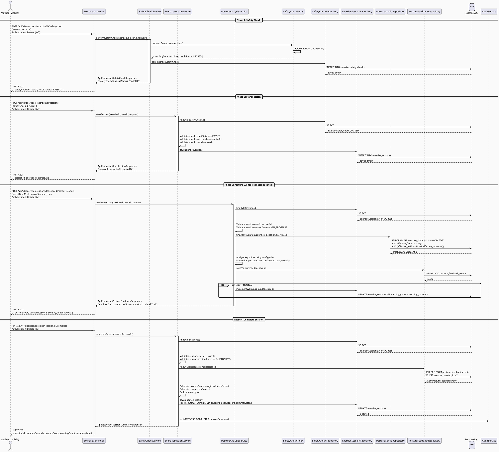
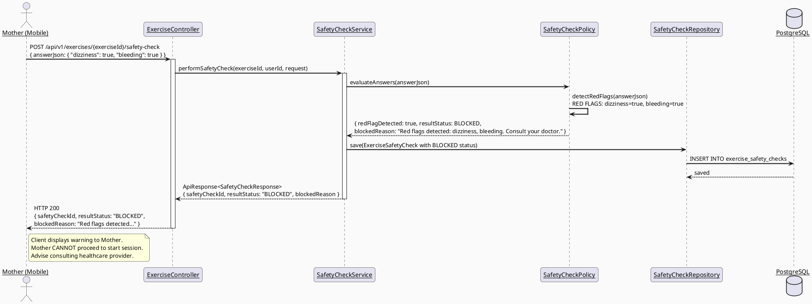
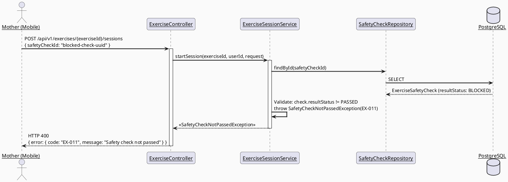
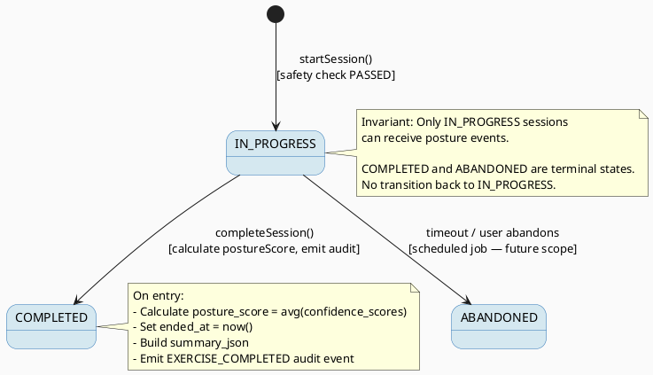
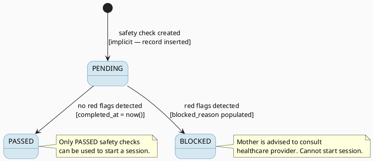

# ENGINEERING DOCUMENTATION STANDARD (EDS) v2.0
# UC30 — Analyze Exercise Posture — Technical Design Specification

| Field | Value |
|-------|-------|
| **Document ID** | `CB-EXERCISE-IMP-002` |
| **Version** | `1.0` |
| **Date** | `2026-06-26` |
| **Status** | `Draft` |
| **Document Owner** | `PhuongNT` |
| **Author** | `AI Agent — Developer` |
| **Reviewed by** | `[ ] Pending` |
| **DPO Sign-off** | `[ ] Pending` |
| **Approved by** | `[ ] Pending` |
| **Last Review** | `2026-06-26` |
| **Based on EDS** | `v2.0` |

---

## CHANGELOG

> **Policy 4.4 — Immutable History:** Không bao giờ xóa thông tin cũ. Mọi thay đổi phải ghi vào bảng này.

| Ngày | Người thực hiện | Nội dung thay đổi |
|------|-----------------|-------------------|
| 2026-06-26 | AI Agent — Developer | Tạo tài liệu lần đầu |

---

## MỤC LỤC

1. [Tổng quan Module](#1-tổng-quan-module)
2. [Ma trận Truy vết (Traceability Matrix)](#2-ma-trận-truy-vết-traceability-matrix)
3. [Architecture Decision Records (ADR)](#3-architecture-decision-records-adr)
4. [Non-Functional Requirements & SLA](#4-non-functional-requirements--sla)
5. [Static Modeling (Mô hình Tĩnh)](#5-static-modeling-mô-hình-tĩnh)
6. [Dynamic Modeling (Mô hình Động)](#6-dynamic-modeling-mô-hình-động)
7. [Domain Event Catalog](#7-domain-event-catalog)
8. [Interface Specification (Đặc tả Giao diện)](#8-interface-specification-đặc-tả-giao-diện)
9. [API Specification](#9-api-specification)
10. [Bảng mã lỗi (Error Codes)](#10-bảng-mã-lỗi-error-codes)
11. [Quy trình Triển khai (Step-by-Step)](#11-quy-trình-triển-khai-step-by-step)
12. [Rollback & Incident Runbook](#12-rollback--incident-runbook)
13. [Kịch bản Kiểm thử Chi tiết](#13-kịch-bản-kiểm-thử-chi-tiết)
14. [Phương pháp Xác minh](#14-phương-pháp-xác-minh)
15. [Mẫu thử thực tế (API Verification Samples)](#15-mẫu-thử-thực-tế-api-verification-samples)
16. [Bảng tổng hợp phân quyền (Authorization Matrix)](#16-bảng-tổng-hợp-phân-quyền-authorization-matrix)
17. [AI Prompt Constraints (CASE 2.0)](#17-ai-prompt-constraints-case-20)

---

## 1. Tổng quan Module

> Phân tích dữ liệu body landmark và trả về phản hồi tư thế gần real-time bằng rule-based hoặc ML-based logic.
> SRS 3.3.2.2: "Analyze Exercise Posture — Analyzes body landmark data and returns near-real-time posture feedback using rule-based or ML-based logic."

| Field | Value |
|-------|-------|
| **Module Name** | `Analyze Exercise Posture` |
| **Bounded Context** | `exercise` |
| **Data Classification** | `Internal` |
| **Compliance Scope** | `BR-RBAC, BR-SAFETY` |
| **Upstream Dependencies** | `UC29 (exercise selection), IAM (authentication), pregnancy_exercises table, exercise_safety_checks table, exercise_sessions table, posture_analysis_configs table, posture_feedback_events table` |
| **Downstream Consumers** | `Audit Service (EXERCISE_COMPLETED event), Mother's exercise history` |

**Phạm vi chức năng:**

UC30 quản lý toàn bộ posture analysis session lifecycle gồm 4 endpoints chính:

1. **POST /api/v1/exercises/{exerciseId}/safety-check** — Safety pre-check questionnaire trước khi bắt đầu bài tập. Red flag → BLOCK.
2. **POST /api/v1/exercises/{exerciseId}/sessions** — Bắt đầu exercise session. Yêu cầu safety check PASSED.
3. **POST /api/v1/exercises/sessions/{sessionId}/posture-events** — Gửi body landmark data, nhận feedback tư thế real-time.
4. **PUT /api/v1/exercises/sessions/{sessionId}/complete** — Kết thúc session với summary.

**Actors:** Mother (primary), Smartwatch/Wearable Device (secondary — data source).
**Platform:** Mobile App.

---

## 2. Ma trận Truy vết (Traceability Matrix)

| Requirement ID | Loại (BR/ADR/US) | Mô tả yêu cầu | Thành phần Code | Compliance Target | ADR liên quan |
|----------------|------------------|---------------|-----------------|-------------------|---------------|
| BR-POSTURE-001 | Business Rule | Safety check must PASS before session start | `ExerciseSessionService.startSession()` | BR-SAFETY | ADR-EXERCISE-002-001 |
| BR-POSTURE-002 | Business Rule | Posture feedback based on config — RULE_BASED or ML_BASED | `PostureAnalysisService.analyzePose()` | BR-SAFETY | ADR-EXERCISE-002-002 |
| BR-POSTURE-003 | Business Rule | CRITICAL severity → immediate audio/haptic warning suggested to client | `PostureFeedbackResponse.severity` | BR-SAFETY | — |
| BR-POSTURE-004 | Business Rule | Session auto-timeout after 60 min of inactivity | _(Scheduled job — not in UC30 scope)_ | — | — |
| BR-POSTURE-005 | Business Rule | posture_score = average confidence across all posture events | `ExerciseSessionService.completeSession()` | — | — |
| BR-POSTURE-006 | Business Rule | Emit EXERCISE_COMPLETED audit event with session summary | `AuditService.emit()` | BR-SAFETY | — |
| US-POSTURE-001 | User Story | Mother completes safety questionnaire before exercise | `SafetyCheckController.POST /safety-check` | — | ADR-EXERCISE-002-001 |
| US-POSTURE-002 | User Story | Mother starts exercise session after passing safety check | `ExerciseSessionController.POST /sessions` | — | — |
| US-POSTURE-003 | User Story | Mother receives posture feedback during exercise | `PostureEventController.POST /posture-events` | — | ADR-EXERCISE-002-002 |
| US-POSTURE-004 | User Story | Mother completes session and views summary | `ExerciseSessionController.PUT /complete` | — | — |

---

## 3. Architecture Decision Records (ADR)

### ADR-EXERCISE-002-001 — Safety Check as Separate Step

| Field | Value |
|-------|-------|
| **Status** | `Accepted` |
| **Deciders** | `PhuongNT — Developer, AI Agent` |
| **Date** | `2026-06-26` |

#### Bối cảnh (Context)
> Bài tập thai kỳ có nguy cơ tiềm ẩn. Trước khi bắt đầu session, Mother phải trả lời safety questionnaire. Nếu phát hiện red flag (ví dụ: đau bụng, chảy máu, chóng mặt), session bị BLOCK.

#### Các phương án đã xem xét (Options Considered)

| Phương án | Mô tả | Ưu điểm | Nhược điểm |
|-----------|-------|----------|------------|
| A | Safety check là endpoint riêng biệt, kết quả lưu trong `exercise_safety_checks` | + Audit trail rõ ràng, reusable, testable riêng | - Cần thêm API call |
| B | Safety check embedded trong start session request | + Ít API calls | - Logic phức tạp, khó audit, khó test riêng |

#### Quyết định (Decision)
> Chọn **Phương án A** — safety check là endpoint riêng. Kết quả lưu vào `exercise_safety_checks` table với `result_status` (PENDING → PASSED / BLOCKED). Session start yêu cầu `safetyCheckId` tham chiếu đến safety check đã PASSED.

#### Hệ quả (Consequences)

**Tích cực:**
- Audit trail đầy đủ cho mỗi safety check
- Có thể phân tích red flag patterns theo thời gian
- Dễ test riêng safety check logic

**Tiêu cực / Trade-offs:**
- Thêm 1 API call trước khi start session. Giảm thiểu: client UX tự động flow.

**Compliance Impact:**
- BR-SAFETY: đảm bảo Mother được screening trước khi tập.

---

### ADR-EXERCISE-002-002 — Synchronous Posture Feedback per Event

| Field | Value |
|-------|-------|
| **Status** | `Accepted` |
| **Deciders** | `PhuongNT — Developer, AI Agent` |
| **Date** | `2026-06-26` |

#### Bối cảnh (Context)
> Posture analysis cần phản hồi gần real-time. Client gửi body landmark data (keypoint_summary_json) cho mỗi frame/event. Server phân tích và trả feedback ngay lập tức.

#### Các phương án đã xem xét (Options Considered)

| Phương án | Mô tả | Ưu điểm | Nhược điểm |
|-----------|-------|----------|------------|
| A | Synchronous request-response per event, <100ms latency target | + Đơn giản, predictable, dễ debug | - Không scale tốt nếu volume rất cao |
| B | WebSocket streaming | + Real-time, less overhead | - Phức tạp, khó test, khó maintain |
| C | Async queue (Kafka/RabbitMQ) | + Scale tốt | - Latency cao, phức tạp |

#### Quyết định (Decision)
> Chọn **Phương án A** — synchronous REST per event. Target latency <100ms. Đủ cho mobile app gửi 1-2 events/second.

#### Hệ quả (Consequences)

**Tích cực:**
- Implementation đơn giản
- Dễ test và debug
- Predictable latency

**Tiêu cực / Trade-offs:**
- Không phù hợp nếu cần >10 events/second. Giảm thiểu: client throttle events.

**Compliance Impact:**
- Không ảnh hưởng compliance.

---

### ADR-EXERCISE-002-003 — Posture Analysis Config Versioning

| Field | Value |
|-------|-------|
| **Status** | `Accepted` |
| **Deciders** | `PhuongNT — Developer, AI Agent` |
| **Date** | `2026-06-26` |

#### Bối cảnh (Context)
> Posture analysis rules có thể thay đổi theo thời gian. Cần truy vết phiên bản config nào được dùng cho session nào để đảm bảo reproducibility.

#### Các phương án đã xem xét (Options Considered)

| Phương án | Mô tả | Ưu điểm | Nhược điểm |
|-----------|-------|----------|------------|
| A | Config lưu trong `posture_analysis_configs` table, có `effective_from/to`, `status`, version | + Reproducible, auditable | - Cần lookup config mỗi session |
| B | Config hardcode trong code | + Đơn giản | - Không flexible, không reproducible |

#### Quyết định (Decision)
> Chọn **Phương án A** — config trong DB table. Mỗi posture feedback event ghi lại `posture_config_id` để trace back.

#### Hệ quả (Consequences)

**Tích cực:**
- Reproducible analysis results
- Có thể A/B test different rule sets

**Tiêu cực / Trade-offs:**
- Cần quản lý config lifecycle. Giảm thiểu: admin UI (separate UC).

---

### ADR-EXERCISE-002-004 — Session State Machine: IN_PROGRESS → COMPLETED / ABANDONED

| Field | Value |
|-------|-------|
| **Status** | `Accepted` |
| **Deciders** | `PhuongNT — Developer, AI Agent` |
| **Date** | `2026-06-26` |

#### Bối cảnh (Context)
> Exercise session có lifecycle: bắt đầu → đang tập → hoàn thành hoặc bỏ dở. Cần state machine để quản lý transitions hợp lệ.

#### Các phương án đã xem xét (Options Considered)

| Phương án | Mô tả | Ưu điểm | Nhược điểm |
|-----------|-------|----------|------------|
| A | Simple enum status with validation: only IN_PROGRESS → COMPLETED/ABANDONED | + Đơn giản, clear invariants | - Không hỗ trợ PAUSED state |
| B | Complex FSM with PAUSED intermediate state | + Flexible | - Over-engineered cho MVP |

#### Quyết định (Decision)
> Chọn **Phương án A** — simple state machine. `paused_seconds` field track pause duration without separate state.

#### Hệ quả (Consequences)

**Tích cực:**
- Rõ ràng: chỉ IN_PROGRESS → COMPLETED hoặc ABANDONED
- Dễ validate, dễ test

**Tiêu cực / Trade-offs:**
- Không có explicit PAUSED state. Giảm thiểu: `paused_seconds` field bù đắp.

---

## 4. Non-Functional Requirements & SLA

### 4.1. Performance & Availability

| Category | Requirement | Target SLA | Measurement Method | Compliance Basis |
|----------|-------------|------------|---------------------|------------------|
| Latency | POST /safety-check (p99) | `< 200ms` | k6 load test | — |
| Latency | POST /sessions (p99) | `< 200ms` | k6 load test | — |
| Latency | POST /posture-events (p99) | `< 100ms` | k6 load test | ADR-EXERCISE-002-002 |
| Latency | PUT /complete (p99) | `< 300ms` | k6 load test | — |
| Availability | Uptime (monthly) | `99.9%` | Uptime monitor | — |
| Throughput | Posture events | `50 req/s per user` | Load test | — |

### 4.2. Data Integrity & Retention

| Category | Requirement | Target | Verification Method | Compliance Basis |
|----------|-------------|--------|---------------------|------------------|
| Consistency | Safety check → session linkage | 100% | Foreign key + integration test | BR-POSTURE-001 |
| Consistency | Posture score calculation | Accurate average | Unit test | BR-POSTURE-005 |
| Retention | Session data | 2 years | DB retention policy | — |
| Retention | Posture feedback events | 1 year | DB retention policy | — |

### 4.3. Security

| Category | Requirement | Target | Verification Method | Compliance Basis |
|----------|-------------|--------|---------------------|------------------|
| Authentication | JWT required for all endpoints | 100% | Security test | BR-RBAC |
| Authorization | MOTHER role, own sessions only | Resource-level ownership | Auth test | BR-RBAC |
| Data isolation | Mother can only access own sessions/checks | 100% | Integration test | BR-RBAC |
| Encryption in transit | All endpoints | TLS 1.3+ | SSL Labs scan | BR-SAFETY |

### 4.4. Scalability & Capacity Planning

> Dự kiến tải: ~100 concurrent exercise sessions, ~2 posture events/second per session = ~200 events/second total. Synchronous processing sufficient for MVP. Consider async processing if >500 events/second.

---

## 5. Static Modeling (Mô hình Tĩnh)

### 5.1. Class Diagram (PlantUML)

```plantuml
@startuml UC30_ClassDiagram
skinparam classAttributeIconSize 0
skinparam classFontStyle bold
skinparam backgroundColor #FAFAFA
skinparam ArrowColor #555555
skinparam ClassBorderColor #2E75B6
skinparam ClassHeaderBackgroundColor #D5E8F0

' === ENTITIES ===
class ExerciseSafetyCheck {
  + safetyCheckId: UUID
  + exerciseId: UUID
  + journeyId: UUID
  + userId: UUID
  + answerJson: JsonNode
  + redFlagDetected: Boolean
  + resultStatus: SafetyCheckStatus
  + blockedReason: String
  + completedAt: OffsetDateTime
  + createdAt: OffsetDateTime
}

class ExerciseSession {
  + exerciseSessionId: UUID
  + exerciseId: UUID
  + journeyId: UUID
  + userId: UUID
  + safetyCheckId: UUID
  + startedAt: OffsetDateTime
  + endedAt: OffsetDateTime
  + pausedSeconds: Integer
  + completionPercent: BigDecimal
  + postureScore: BigDecimal
  + sessionStatus: SessionStatus
  + warningCount: Integer
  + summaryJson: JsonNode
  + createdAt: OffsetDateTime
  + updatedAt: OffsetDateTime
}

class PostureAnalysisConfig {
  + postureConfigId: UUID
  + exerciseId: UUID
  + configuredBy: UUID
  + analysisMode: AnalysisMode
  + ruleOrModelVersion: String
  + confidenceThreshold: BigDecimal
  + feedbackLevel: FeedbackLevel
  + configJson: JsonNode
  + effectiveFrom: OffsetDateTime
  + effectiveTo: OffsetDateTime
  + status: ConfigStatus
  + createdAt: OffsetDateTime
  + updatedAt: OffsetDateTime
}

class PostureFeedbackEvent {
  + feedbackEventId: UUID
  + exerciseSessionId: UUID
  + postureConfigId: UUID
  + eventTimeMs: Long
  + postureCode: String
  + confidenceScore: BigDecimal
  + severity: PostureSeverity
  + feedbackText: String
  + keypointSummaryJson: JsonNode
  + createdAt: OffsetDateTime
}

' === ENUMS ===
enum SafetyCheckStatus {
  PENDING
  PASSED
  BLOCKED
}

enum SessionStatus {
  IN_PROGRESS
  COMPLETED
  ABANDONED
}

enum AnalysisMode {
  RULE_BASED
  ML_BASED
}

enum FeedbackLevel {
  BASIC
  DETAILED
}

enum PostureSeverity {
  INFO
  WARNING
  CRITICAL
}

' === DTOs ===
class SafetyCheckRequest {
  + answerJson: JsonNode
}

class SafetyCheckResponse {
  + safetyCheckId: UUID
  + resultStatus: String
  + blockedReason: String
}

class StartSessionRequest {
  + safetyCheckId: UUID
}

class StartSessionResponse {
  + sessionId: UUID
  + exerciseId: UUID
  + startedAt: OffsetDateTime
}

class PostureEventRequest {
  + eventTimeMs: Long
  + keypointSummaryJson: JsonNode
}

class PostureFeedbackResponse {
  + postureCode: String
  + confidenceScore: BigDecimal
  + severity: String
  + feedbackText: String
}

class SessionSummaryResponse {
  + sessionId: UUID
  + exerciseId: UUID
  + durationSeconds: Long
  + completionPercent: BigDecimal
  + postureScore: BigDecimal
  + warningCount: Integer
  + summaryJson: JsonNode
}

' === SERVICES ===
interface ISafetyCheckService <<interface>> {
  + performSafetyCheck(exerciseId: UUID, userId: UUID, request: SafetyCheckRequest): ApiResponse<SafetyCheckResponse>
}

interface IExerciseSessionService <<interface>> {
  + startSession(exerciseId: UUID, userId: UUID, request: StartSessionRequest): ApiResponse<StartSessionResponse>
  + completeSession(sessionId: UUID, userId: UUID): ApiResponse<SessionSummaryResponse>
}

interface IPostureAnalysisService <<interface>> {
  + analyzePosture(sessionId: UUID, userId: UUID, request: PostureEventRequest): ApiResponse<PostureFeedbackResponse>
}

class SafetyCheckService implements ISafetyCheckService
class ExerciseSessionService implements IExerciseSessionService
class PostureAnalysisService implements IPostureAnalysisService

' === REPOSITORIES ===
interface SafetyCheckRepository <<interface>> {
  + findById(id: UUID): Optional<ExerciseSafetyCheck>
  + save(entity: ExerciseSafetyCheck): ExerciseSafetyCheck
}

interface ExerciseSessionRepository <<interface>> {
  + findById(id: UUID): Optional<ExerciseSession>
  + save(entity: ExerciseSession): ExerciseSession
}

interface PostureConfigRepository <<interface>> {
  + findActiveConfigByExerciseId(exerciseId: UUID): Optional<PostureAnalysisConfig>
}

interface PostureFeedbackRepository <<interface>> {
  + save(entity: PostureFeedbackEvent): PostureFeedbackEvent
  + findByExerciseSessionId(sessionId: UUID): List<PostureFeedbackEvent>
}

' === POLICY ===
class SafetyCheckPolicy {
  + evaluateAnswers(answerJson: JsonNode): SafetyCheckResult
  + detectRedFlags(answerJson: JsonNode): Boolean
}

' === RELATIONSHIPS ===
SafetyCheckService --> SafetyCheckRepository : uses
SafetyCheckService --> SafetyCheckPolicy : uses
ExerciseSessionService --> ExerciseSessionRepository : uses
ExerciseSessionService --> SafetyCheckRepository : validates
ExerciseSessionService --> PostureFeedbackRepository : calculates score
PostureAnalysisService --> PostureConfigRepository : loads config
PostureAnalysisService --> PostureFeedbackRepository : saves events
PostureAnalysisService --> ExerciseSessionRepository : validates session

ExerciseSafetyCheck --> SafetyCheckStatus : has
ExerciseSession --> SessionStatus : has
PostureAnalysisConfig --> AnalysisMode : has
PostureFeedbackEvent --> PostureSeverity : has

@enduml
```



### 5.2. Data Structure (Existing V1 Migration)

> Schema đã tồn tại trong V1 migration. Không cần tạo migration mới cho UC30.

```sql
-- === EXERCISE SAFETY CHECKS TABLE (existing) ===
CREATE TABLE public.exercise_safety_checks (
    safety_check_id uuid NOT NULL DEFAULT gen_random_uuid(),
    exercise_id uuid NOT NULL,
    journey_id uuid,
    user_id uuid NOT NULL,
    answer_json jsonb,
    red_flag_detected boolean NOT NULL DEFAULT false,
    result_status varchar(20) NOT NULL DEFAULT 'PENDING',  -- PENDING, PASSED, BLOCKED
    blocked_reason text,
    completed_at timestamptz,
    created_at timestamptz NOT NULL DEFAULT now()
);

-- === EXERCISE SESSIONS TABLE (existing) ===
CREATE TABLE public.exercise_sessions (
    exercise_session_id uuid NOT NULL DEFAULT gen_random_uuid(),
    exercise_id uuid NOT NULL,
    journey_id uuid,
    user_id uuid NOT NULL,
    safety_check_id uuid,
    started_at timestamptz NOT NULL,
    ended_at timestamptz,
    paused_seconds integer NOT NULL DEFAULT 0,
    completion_percent numeric,
    posture_score numeric,
    session_status varchar(20) NOT NULL DEFAULT 'IN_PROGRESS',
    warning_count integer NOT NULL DEFAULT 0,
    summary_json jsonb,
    created_at timestamptz NOT NULL DEFAULT now(),
    updated_at timestamptz NOT NULL DEFAULT now()
);

-- === POSTURE ANALYSIS CONFIGS TABLE (existing) ===
CREATE TABLE public.posture_analysis_configs (
    posture_config_id uuid NOT NULL DEFAULT gen_random_uuid(),
    exercise_id uuid NOT NULL,
    configured_by uuid NOT NULL,
    analysis_mode varchar(30) NOT NULL,   -- RULE_BASED, ML_BASED
    rule_or_model_version varchar(80),
    confidence_threshold numeric,
    feedback_level varchar(30),           -- BASIC, DETAILED
    config_json jsonb,
    effective_from timestamptz NOT NULL,
    effective_to timestamptz,
    status varchar(20) NOT NULL DEFAULT 'ACTIVE',
    created_at timestamptz NOT NULL DEFAULT now(),
    updated_at timestamptz NOT NULL DEFAULT now()
);

-- === POSTURE FEEDBACK EVENTS TABLE (existing) ===
CREATE TABLE public.posture_feedback_events (
    feedback_event_id uuid NOT NULL DEFAULT gen_random_uuid(),
    exercise_session_id uuid NOT NULL,
    posture_config_id uuid NOT NULL,
    event_time_ms bigint NOT NULL,
    posture_code varchar(80),
    confidence_score numeric,
    severity varchar(20),     -- INFO, WARNING, CRITICAL
    feedback_text text,
    keypoint_summary_json jsonb,
    created_at timestamptz NOT NULL DEFAULT now()
);

-- Recommended indexes for UC30 queries
CREATE INDEX idx_safety_checks_exercise_user ON exercise_safety_checks(exercise_id, user_id);
CREATE INDEX idx_sessions_user ON exercise_sessions(user_id);
CREATE INDEX idx_posture_config_exercise ON posture_analysis_configs(exercise_id, status);
CREATE INDEX idx_feedback_events_session ON posture_feedback_events(exercise_session_id);
```

---

## 6. Dynamic Modeling (Mô hình Động)

### 6.1. Sequence Diagram — Happy Path: Safety Check → Session → Posture Events → Complete



### 6.2. Sequence Diagram — Error Path: Safety Check BLOCKED



### 6.3. Sequence Diagram — Error Path: Start Session without PASSED Safety Check



### 6.4. State Machine — Exercise Session



### 6.5. State Machine — Safety Check



---

## 7. Domain Event Catalog

### 7.1. Events Published (Phát ra)

| Event Name | Trigger | Publisher | Subscriber(s) | Payload Schema | Async? |
|------------|---------|-----------|---------------|----------------|--------|
| `ExerciseSessionCompleted` | Session completes successfully | `ExerciseSessionService` | `AuditService` | `ExerciseSessionCompletedEvent.java` | No (sync audit emit) |

### 7.2. Events Consumed (Tiêu thụ)

| Event Name | Source | Handler | Action thực hiện |
|------------|--------|---------|------------------|
| _(none)_ | — | — | — |

### 7.3. Payload Schema

```java
// ExerciseSessionCompletedEvent.java
public record ExerciseSessionCompletedEvent(
    UUID    eventId,          // UUID.randomUUID()
    String  eventType,        // "EXERCISE_COMPLETED"
    Instant occurredAt,       // Instant.now()
    String  version,          // "1.0"
    Payload payload,
    Metadata metadata
) {
    public record Payload(
        UUID       sessionId,
        UUID       exerciseId,
        UUID       userId,
        Long       durationSeconds,
        BigDecimal completionPercent,
        BigDecimal postureScore,
        Integer    warningCount,
        JsonNode   summaryJson
    ) {}

    public record Metadata(
        UUID   correlationId,
        String causedBy       // userId
    ) {}
}
```

---

## 8. Interface Specification (Đặc tả Giao diện)

### 8.1. Service Interfaces

```java
// === SAFETY CHECK SERVICE ===

// SafetyCheckRequest.java — Input DTO
// @version 1.0
public class SafetyCheckRequest {
    @NotNull
    private JsonNode answerJson;   // Safety questionnaire answers (JSONB)
    // getters / setters
}

// SafetyCheckResponse.java — Output DTO
// @version 1.0
public class SafetyCheckResponse {
    private UUID safetyCheckId;        // Generated UUID
    private String resultStatus;       // PASSED or BLOCKED
    private String blockedReason;      // Null if PASSED, reason if BLOCKED
    // getters / setters
}

// ISafetyCheckService.java
// @version 1.0
public interface ISafetyCheckService {
    /**
     * Perform safety check before starting exercise session.
     * Evaluates safety questionnaire answers for red flags.
     * @param exerciseId exercise to check for
     * @param userId Mother's user ID
     * @param request safety questionnaire answers
     * @return safety check result (PASSED or BLOCKED)
     */
    ApiResponse<SafetyCheckResponse> performSafetyCheck(
        UUID exerciseId, UUID userId, SafetyCheckRequest request);
}

// === EXERCISE SESSION SERVICE ===

// StartSessionRequest.java — Input DTO
// @version 1.0
public class StartSessionRequest {
    @NotNull
    private UUID safetyCheckId;   // Must reference a PASSED safety check
    // getters / setters
}

// StartSessionResponse.java — Output DTO
// @version 1.0
public class StartSessionResponse {
    private UUID sessionId;
    private UUID exerciseId;
    private OffsetDateTime startedAt;
    // getters / setters
}

// SessionSummaryResponse.java — Output DTO
// @version 1.0
public class SessionSummaryResponse {
    private UUID sessionId;
    private UUID exerciseId;
    private Long durationSeconds;         // Total duration in seconds
    private BigDecimal completionPercent;  // 0-100
    private BigDecimal postureScore;      // Average confidence across all events
    private Integer warningCount;          // Number of CRITICAL severity events
    private JsonNode summaryJson;          // Additional summary data
    // getters / setters
}

// IExerciseSessionService.java
// @version 1.0
public interface IExerciseSessionService {
    /**
     * Start a new exercise session. Requires a PASSED safety check.
     * @param exerciseId exercise to start
     * @param userId Mother's user ID
     * @param request contains safetyCheckId
     * @return new session details
     * @throws SafetyCheckNotPassedException (EX-011) when safety check not PASSED
     * @throws ExerciseNotFoundException (EX-010) when exercise not found
     */
    ApiResponse<StartSessionResponse> startSession(
        UUID exerciseId, UUID userId, StartSessionRequest request);

    /**
     * Complete an exercise session. Calculates posture score and emits audit event.
     * @param sessionId session to complete
     * @param userId Mother's user ID (ownership check)
     * @return session summary
     * @throws SessionNotFoundException (EX-012) when session not found
     * @throws SessionAlreadyCompletedException (EX-013) when session not IN_PROGRESS
     */
    ApiResponse<SessionSummaryResponse> completeSession(UUID sessionId, UUID userId);
}

// === POSTURE ANALYSIS SERVICE ===

// PostureEventRequest.java — Input DTO
// @version 1.0
public class PostureEventRequest {
    @NotNull
    private Long eventTimeMs;           // Timestamp in milliseconds
    @NotNull
    private JsonNode keypointSummaryJson;  // Body landmarks from camera/device
    // getters / setters
}

// PostureFeedbackResponse.java — Output DTO
// @version 1.0
public class PostureFeedbackResponse {
    private String postureCode;          // Identified posture code (e.g., "GOOD_FORM", "ROUND_BACK")
    private BigDecimal confidenceScore;  // 0.0 - 1.0 confidence
    private String severity;             // INFO, WARNING, CRITICAL
    private String feedbackText;         // Human-readable feedback
    // getters / setters
}

// IPostureAnalysisService.java
// @version 1.0
public interface IPostureAnalysisService {
    /**
     * Analyze posture from keypoint data and return feedback.
     * Uses posture_analysis_config for the exercise to determine rules.
     * @param sessionId active session
     * @param userId Mother's user ID (ownership check)
     * @param request keypoint data
     * @return posture feedback with severity
     * @throws SessionNotFoundException (EX-012) when session not found
     * @throws SessionAlreadyCompletedException (EX-013) when session not IN_PROGRESS
     * @throws PostureConfigNotFoundException (EX-014) when no active config for exercise
     */
    ApiResponse<PostureFeedbackResponse> analyzePosture(
        UUID sessionId, UUID userId, PostureEventRequest request);
}
```

### 8.2. Repository Interfaces

```java
// SafetyCheckRepository.java
// @version 1.0
public interface SafetyCheckRepository extends JpaRepository<ExerciseSafetyCheck, UUID> {
    Optional<ExerciseSafetyCheck> findBySafetyCheckId(UUID safetyCheckId);
}

// ExerciseSessionRepository.java
// @version 1.0
public interface ExerciseSessionRepository extends JpaRepository<ExerciseSession, UUID> {
    Optional<ExerciseSession> findByExerciseSessionId(UUID sessionId);
}

// PostureConfigRepository.java
// @version 1.0
public interface PostureConfigRepository extends JpaRepository<PostureAnalysisConfig, UUID> {
    /**
     * Find active posture analysis config for an exercise.
     * Active = status='ACTIVE' AND effective_from <= now() AND (effective_to IS NULL OR effective_to > now())
     */
    @Query("SELECT c FROM PostureAnalysisConfig c WHERE c.exerciseId = :exerciseId "
         + "AND c.status = 'ACTIVE' "
         + "AND c.effectiveFrom <= CURRENT_TIMESTAMP "
         + "AND (c.effectiveTo IS NULL OR c.effectiveTo > CURRENT_TIMESTAMP) "
         + "ORDER BY c.effectiveFrom DESC")
    Optional<PostureAnalysisConfig> findActiveConfigByExerciseId(@Param("exerciseId") UUID exerciseId);
}

// PostureFeedbackRepository.java
// @version 1.0
public interface PostureFeedbackRepository extends JpaRepository<PostureFeedbackEvent, UUID> {
    List<PostureFeedbackEvent> findByExerciseSessionId(UUID sessionId);
}
```

### 8.3. Policy Interface

```java
// SafetyCheckPolicy.java
// @version 1.0
// Package: com.carebridge.backend.exercise.policy
public class SafetyCheckPolicy {
    /**
     * Evaluate safety questionnaire answers for red flags.
     * Red flags: dizziness, bleeding, severe pain, contractions, etc.
     * @param answerJson questionnaire answers
     * @return evaluation result
     */
    public SafetyCheckResult evaluateAnswers(JsonNode answerJson) {
        boolean redFlag = detectRedFlags(answerJson);
        if (redFlag) {
            return new SafetyCheckResult(SafetyCheckStatus.BLOCKED, buildBlockedReason(answerJson));
        }
        return new SafetyCheckResult(SafetyCheckStatus.PASSED, null);
    }

    /**
     * Detect red flags in safety questionnaire answers.
     * Currently checks for boolean true values on known risk fields.
     */
    public boolean detectRedFlags(JsonNode answerJson) {
        // Check known red flag fields
        // Implementation will check specific fields in answerJson
        return false; // stub
    }

    public record SafetyCheckResult(SafetyCheckStatus status, String blockedReason) {}
}
```

---

## 9. API Specification

### 9.1. Endpoints Table

| Method | Path | Auth Level | Required Roles | Rate Limit | Idempotent? |
|--------|------|------------|----------------|------------|-------------|
| `POST` | `/api/v1/exercises/{exerciseId}/safety-check` | JWT Bearer | `MOTHER` | 30/min | No |
| `POST` | `/api/v1/exercises/{exerciseId}/sessions` | JWT Bearer | `MOTHER` | 10/min | No |
| `POST` | `/api/v1/exercises/sessions/{sessionId}/posture-events` | JWT Bearer | `MOTHER` | 300/min | No |
| `PUT` | `/api/v1/exercises/sessions/{sessionId}/complete` | JWT Bearer | `MOTHER` | 10/min | Yes |

### 9.2. Request / Response Schemas

#### `POST /api/v1/exercises/{exerciseId}/safety-check` — Safety Pre-check

**Path Parameters:**

| Parameter | Type | Required | Description |
|-----------|------|----------|-------------|
| `exerciseId` | UUID | Yes | Exercise to perform safety check for |

**Request Body:**
```json
{
  "answerJson": {
    "dizziness": false,
    "bleeding": false,
    "severePain": false,
    "contractions": false,
    "breathlessness": false
  }
}
```

**Response — 200 OK (PASSED):**
```json
{
  "data": {
    "safetyCheckId": "a1b2c3d4-e5f6-7890-abcd-ef1234567890",
    "resultStatus": "PASSED",
    "blockedReason": null
  }
}
```

**Response — 200 OK (BLOCKED — red flag detected):**
```json
{
  "data": {
    "safetyCheckId": "a1b2c3d4-e5f6-7890-abcd-ef1234567891",
    "resultStatus": "BLOCKED",
    "blockedReason": "Red flags detected: dizziness, bleeding. Please consult your healthcare provider before exercising."
  }
}
```

---

#### `POST /api/v1/exercises/{exerciseId}/sessions` — Start Exercise Session

**Path Parameters:**

| Parameter | Type | Required | Description |
|-----------|------|----------|-------------|
| `exerciseId` | UUID | Yes | Exercise to start session for |

**Request Body:**
```json
{
  "safetyCheckId": "a1b2c3d4-e5f6-7890-abcd-ef1234567890"
}
```

**Response — 201 Created:**
```json
{
  "data": {
    "sessionId": "b2c3d4e5-f6a7-8901-bcde-f12345678901",
    "exerciseId": "550e8400-e29b-41d4-a716-446655440001",
    "startedAt": "2026-06-26T10:00:00.000Z"
  }
}
```

**Response — 400 Bad Request (EX-011 — safety check not passed):**
```json
{
  "error": {
    "code": "EX-011",
    "message": "Safety check not passed. Complete a safety check first."
  }
}
```

---

#### `POST /api/v1/exercises/sessions/{sessionId}/posture-events` — Submit Posture Data

**Path Parameters:**

| Parameter | Type | Required | Description |
|-----------|------|----------|-------------|
| `sessionId` | UUID | Yes | Active session ID |

**Request Body:**
```json
{
  "eventTimeMs": 1719392400000,
  "keypointSummaryJson": {
    "nose": {"x": 0.5, "y": 0.2, "confidence": 0.95},
    "leftShoulder": {"x": 0.3, "y": 0.4, "confidence": 0.92},
    "rightShoulder": {"x": 0.7, "y": 0.4, "confidence": 0.90},
    "spine": {"x": 0.5, "y": 0.6, "confidence": 0.88}
  }
}
```

**Response — 200 OK:**
```json
{
  "data": {
    "postureCode": "GOOD_FORM",
    "confidenceScore": 0.91,
    "severity": "INFO",
    "feedbackText": "Great posture! Keep maintaining this form."
  }
}
```

**Response — 200 OK (CRITICAL severity):**
```json
{
  "data": {
    "postureCode": "ROUND_BACK",
    "confidenceScore": 0.85,
    "severity": "CRITICAL",
    "feedbackText": "Warning: Rounded back detected. Please straighten your spine to avoid strain."
  }
}
```

---

#### `PUT /api/v1/exercises/sessions/{sessionId}/complete` — Complete Session

**Path Parameters:**

| Parameter | Type | Required | Description |
|-----------|------|----------|-------------|
| `sessionId` | UUID | Yes | Session to complete |

**Request Body:** _(empty or optional notes)_

**Response — 200 OK:**
```json
{
  "data": {
    "sessionId": "b2c3d4e5-f6a7-8901-bcde-f12345678901",
    "exerciseId": "550e8400-e29b-41d4-a716-446655440001",
    "durationSeconds": 1200,
    "completionPercent": 85.0,
    "postureScore": 0.87,
    "warningCount": 2,
    "summaryJson": {
      "totalEvents": 15,
      "infoCount": 10,
      "warningCount": 3,
      "criticalCount": 2,
      "averageConfidence": 0.87
    }
  }
}
```

**Response — 400 Bad Request (EX-013 — already completed):**
```json
{
  "error": {
    "code": "EX-013",
    "message": "Session already completed"
  }
}
```

---

## 10. Bảng mã lỗi (Error Codes)

| Code | HTTP Status | Message (EN) | Message (VI) | Trigger Condition |
|------|-------------|--------------|--------------|-------------------|
| `EX-010` | 404 | Exercise not found | Không tìm thấy bài tập | exerciseId does not exist |
| `EX-011` | 400 | Safety check not passed | Safety check chưa pass | safetyCheckId not PASSED, or check does not exist, or check belongs to different exercise/user |
| `EX-012` | 404 | Session not found | Không tìm thấy phiên tập | sessionId does not exist or does not belong to requesting user |
| `EX-013` | 400 | Session already completed | Phiên tập đã kết thúc | Session status is COMPLETED or ABANDONED (not IN_PROGRESS) |
| `EX-014` | 500 | Posture config not found | Không tìm thấy cấu hình phân tích | No active posture_analysis_config for the exercise. Fallback to RULE_BASED default (see L2 in logic issues). |
| `EX-015` | 400 | Safety check blocked — red flag | Safety check bị chặn — phát hiện dấu hiệu nguy hiểm | Red flag detected in safety questionnaire answers. Mother cannot start session. |
| `IAM-001` | 401 | Authentication required | Yêu cầu xác thực | No JWT token or token expired |
| `IAM-002` | 403 | Insufficient permissions | Không đủ quyền | User does not have MOTHER role |

> **Note:** EX-015 is informational — the safety check endpoint returns 200 with `resultStatus: "BLOCKED"`. The error code is used when attempting to start a session with a BLOCKED safety check (mapped via EX-011).

---

## 11. Quy trình Triển khai (Step-by-Step)

### 11.1. Prerequisites

- [ ] ADR-EXERCISE-002-001 through 004 đã được Accepted (xem S3)
- [ ] UC29 implementation completed (dependency: ExerciseRepository, PregnancyExercise entity)
- [ ] V1 migration with all required tables đã chạy thành công
- [ ] Package `com.carebridge.backend.exercise` đã tồn tại

### 11.2. Pre-Migration Checklist

> Không cần migration mới cho UC30. Sử dụng schema hiện có từ V1.

- [x] exercise_safety_checks table đã tồn tại
- [x] exercise_sessions table đã tồn tại
- [x] posture_analysis_configs table đã tồn tại
- [x] posture_feedback_events table đã tồn tại

### 11.3. Implementation Steps

#### Chặng 1 — Entities & Enums

Tạo/extend files trong `com.carebridge.backend.exercise.entity`:
- `ExerciseSafetyCheck.java` — JPA entity
- `ExerciseSession.java` — JPA entity
- `PostureAnalysisConfig.java` — JPA entity
- `PostureFeedbackEvent.java` — JPA entity
- `SafetyCheckStatus.java` — Enum: PENDING, PASSED, BLOCKED
- `SessionStatus.java` — Enum: IN_PROGRESS, COMPLETED, ABANDONED
- `AnalysisMode.java` — Enum: RULE_BASED, ML_BASED
- `FeedbackLevel.java` — Enum: BASIC, DETAILED
- `PostureSeverity.java` — Enum: INFO, WARNING, CRITICAL

#### Chặng 2 — Repositories

Tạo trong `com.carebridge.backend.exercise.repository`:
- `SafetyCheckRepository.java`
- `ExerciseSessionRepository.java`
- `PostureConfigRepository.java`
- `PostureFeedbackRepository.java`

#### Chặng 3 — Policy

Tạo trong `com.carebridge.backend.exercise.policy`:
- `SafetyCheckPolicy.java` — Red flag detection logic

#### Chặng 4 — DTOs & Mapper

Tạo DTOs trong `com.carebridge.backend.exercise.dto`:
- `SafetyCheckRequest.java`, `SafetyCheckResponse.java`
- `StartSessionRequest.java`, `StartSessionResponse.java`
- `PostureEventRequest.java`, `PostureFeedbackResponse.java`
- `SessionSummaryResponse.java`

Tạo mapper trong `com.carebridge.backend.exercise.mapper`:
- `SafetyCheckMapper.java`
- `ExerciseSessionMapper.java`

#### Chặng 5 — Services

Tạo services trong `com.carebridge.backend.exercise.service`:
- `ISafetyCheckService.java` + `SafetyCheckService.java`
- `IExerciseSessionService.java` + `ExerciseSessionService.java`
- `IPostureAnalysisService.java` + `PostureAnalysisService.java`

#### Chặng 6 — Controller

Extend controller trong `com.carebridge.backend.exercise.controller`:
- `ExerciseController.java` — add safety-check, session, posture-event, complete endpoints

#### Chặng 7 — Verification sau deploy

```bash
# Health check
curl -X GET https://[host]/api/v1/health

# Smoke test — safety check
curl -X POST "https://[host]/api/v1/exercises/{exerciseId}/safety-check" \
  -H "Authorization: Bearer [JWT_TOKEN]" \
  -H "Content-Type: application/json" \
  -d '{"answerJson": {"dizziness": false}}'
# Expected: 200 with PASSED
```

### 11.4. Deployment Checklist

- [ ] Build thành công: `./mvnw clean package`
- [ ] Unit tests pass: `./mvnw test`
- [ ] Integration tests pass: `./mvnw verify`
- [ ] Health check endpoint trả về 200
- [ ] Safety check → session → posture events → complete flow works end-to-end
- [ ] Audit log generates EXERCISE_COMPLETED event

---

## 12. Rollback & Incident Runbook

### 12.1. Điều kiện kích hoạt Rollback (Trigger Conditions)

| Điều kiện | Ngưỡng | Người quyết định |
|-----------|--------|------------------|
| Error rate tăng đột biến | > 5% trong 5 phút | On-call Engineer |
| Posture event latency > 200ms (p99) | > 2x target | On-call Engineer |
| Safety check bypassed | Bất kỳ case nào | Tech Lead |
| Session data inconsistency | Bất kỳ case nào | Tech Lead |
| Audit log ngừng hoạt động | > 1 phút | On-call Engineer |

### 12.2. Rollback Procedure

```bash
# Bước 1: Revert deployment to previous version
kubectl rollout undo deployment/carebridge-api

# Bước 2: Verify rollback
kubectl rollout status deployment/carebridge-api
curl -X GET https://[host]/api/v1/health

# Bước 3: Verify no orphaned sessions
psql -h $DB_HOST -U $DB_USER -d $DB_NAME \
  -c "SELECT count(*) FROM exercise_sessions WHERE session_status = 'IN_PROGRESS' AND started_at < NOW() - INTERVAL '2 hours';"
# If count > 0, manually set to ABANDONED

# No DB migration to revert — UC30 uses existing schema
```

### 12.3. Notification Protocol

| Thời điểm | Người nhận | Kênh | Template |
|-----------|------------|------|----------|
| Ngay khi phát hiện | On-call team | Slack #incident | "EXERCISE POSTURE module incident: [description]" |
| Safety check bypass | Tech Lead + Security | Slack #security | "CRITICAL: Safety check bypass detected in exercise module" |

### 12.4. Post-Incident Review (PIR)

> Standard PIR process. Special attention to:
> - Was safety check ever bypassed? (BR-SAFETY violation)
> - Were any sessions started without PASSED safety check?
> - Posture feedback accuracy impacted?

---

## 13. Kịch bản Kiểm thử Chi tiết

> **Policy (EDS v2.0 — Test Data):** Mọi test scenario phải dùng `SYNTHETIC` data.

### 13.1. Unit Tests

#### TC-UNIT-001 — SafetyCheckPolicy.evaluateAnswers — No Red Flags

```gherkin
Feature: Safety check evaluation
  Background:
    Given test data classification: SYNTHETIC

  Scenario: All answers safe — no red flags
    Given answerJson: { "dizziness": false, "bleeding": false, "severePain": false }
    When evaluateAnswers(answerJson) is called
    Then result.status = PASSED
    And result.blockedReason is null
```

**Hàm được test:** `SafetyCheckPolicy.evaluateAnswers()`
**Invariant kiểm tra:** No red flags → PASSED

#### TC-UNIT-002 — SafetyCheckPolicy.evaluateAnswers — Red Flag Detected

```gherkin
  Scenario: Red flag detected — dizziness
    Given answerJson: { "dizziness": true, "bleeding": false }
    When evaluateAnswers(answerJson) is called
    Then result.status = BLOCKED
    And result.blockedReason contains "dizziness"
    And result.redFlagDetected = true
```

**Hàm được test:** `SafetyCheckPolicy.evaluateAnswers()`
**Invariant kiểm tra:** Red flag → BLOCKED with reason

#### TC-UNIT-003 — ExerciseSessionService.completeSession — Posture Score Calculation

```gherkin
  Scenario: Posture score = average of confidence scores
    Given session has 3 posture feedback events with confidence: 0.9, 0.8, 0.7
    When completeSession(sessionId) is called
    Then postureScore = (0.9 + 0.8 + 0.7) / 3 = 0.8
    And warningCount matches CRITICAL event count
```

**Hàm được test:** `ExerciseSessionService.completeSession()`
**Invariant kiểm tra:** posture_score = average(confidence_scores)

### 13.2. Integration Tests

#### TC-INT-001 — Full lifecycle: safety check → start → posture events → complete

```gherkin
  Scenario: Complete exercise session lifecycle
    Given test data classification: SYNTHETIC
    And database has PUBLISHED exercise with posture analysis config
    And Mother user with valid JWT
    When POST /safety-check with no red flags → 200 PASSED
    And POST /sessions with safetyCheckId → 201 session created
    And POST /posture-events × 3 events → 200 feedback each
    And PUT /complete → 200 summary
    Then session in DB has:
      | sessionStatus | COMPLETED |
      | postureScore  | avg of 3 confidence scores |
      | warningCount  | count of CRITICAL events |
    And EXERCISE_COMPLETED audit event was emitted
```

**External dependencies:** PostgreSQL (Testcontainers)
**Mock strategy:** Testcontainers PostgreSQL, AuditService may be mocked or verified

### 13.3. E2E / Security Tests

#### TC-E2E-001 — No JWT returns 401

```gherkin
  Scenario: Unauthenticated access blocked on all UC30 endpoints
    Given test data classification: SYNTHETIC
    When any UC30 endpoint is called without Authorization header
    Then response status is 401
```

#### TC-E2E-002 — Session ownership check

```gherkin
  Scenario: Mother A cannot submit posture events to Mother B's session
    Given Mother A has session S1
    And Mother B has valid JWT
    When Mother B calls POST /posture-events on session S1
    Then response status is 404 (session not found for this user)
```

---

## 14. Phương pháp Xác minh

### 14.1. Database Inspection

```sql
-- Verify safety check record
SELECT safety_check_id, exercise_id, user_id, result_status, red_flag_detected, blocked_reason
FROM exercise_safety_checks
WHERE user_id = '[userId]'
ORDER BY created_at DESC;

-- Verify session record
SELECT exercise_session_id, exercise_id, user_id, safety_check_id, session_status,
       posture_score, warning_count, started_at, ended_at
FROM exercise_sessions
WHERE user_id = '[userId]'
ORDER BY created_at DESC;

-- Verify posture feedback events for a session
SELECT feedback_event_id, posture_code, confidence_score, severity, feedback_text
FROM posture_feedback_events
WHERE exercise_session_id = '[sessionId]'
ORDER BY event_time_ms;

-- Verify posture score calculation
SELECT AVG(confidence_score) as expected_posture_score
FROM posture_feedback_events
WHERE exercise_session_id = '[sessionId]';
```

### 14.2. Log / Audit Verification

```bash
# Verify EXERCISE_COMPLETED audit event
kubectl logs -l app=carebridge-api | grep '"eventType":"EXERCISE_COMPLETED"' | head -5

# Verify audit event contains required fields
kubectl logs -l app=carebridge-api | jq 'select(.eventType == "EXERCISE_COMPLETED") | {sessionId, exerciseId, postureScore, warningCount}'

# Verify no PII in logs
kubectl logs -l app=carebridge-api | grep -i "password\|secret\|ssn"
# Expected: No output
```

---

## 15. Mẫu thử thực tế (API Verification Samples)

### 15.1. Happy Path — Full Lifecycle

```bash
# Step 1: Safety Check
curl -X POST "https://[host]/api/v1/exercises/550e8400-e29b-41d4-a716-446655440001/safety-check" \
  -H "Authorization: Bearer [JWT_TOKEN]" \
  -H "Content-Type: application/json" \
  -d '{"answerJson": {"dizziness": false, "bleeding": false, "severePain": false}}'
# Expected: 200 with resultStatus="PASSED"

# Step 2: Start Session (use safetyCheckId from step 1)
curl -X POST "https://[host]/api/v1/exercises/550e8400-e29b-41d4-a716-446655440001/sessions" \
  -H "Authorization: Bearer [JWT_TOKEN]" \
  -H "Content-Type: application/json" \
  -d '{"safetyCheckId": "[safetyCheckId-from-step-1]"}'
# Expected: 201 with sessionId

# Step 3: Submit Posture Events (use sessionId from step 2)
curl -X POST "https://[host]/api/v1/exercises/sessions/[sessionId]/posture-events" \
  -H "Authorization: Bearer [JWT_TOKEN]" \
  -H "Content-Type: application/json" \
  -d '{"eventTimeMs": 1719392400000, "keypointSummaryJson": {"spine": {"x": 0.5, "y": 0.6, "confidence": 0.88}}}'
# Expected: 200 with posture feedback

# Step 4: Complete Session
curl -X PUT "https://[host]/api/v1/exercises/sessions/[sessionId]/complete" \
  -H "Authorization: Bearer [JWT_TOKEN]"
# Expected: 200 with session summary
```

### 15.2. Error Paths

```bash
# Safety check with red flags
curl -X POST "https://[host]/api/v1/exercises/550e8400-e29b-41d4-a716-446655440001/safety-check" \
  -H "Authorization: Bearer [JWT_TOKEN]" \
  -H "Content-Type: application/json" \
  -d '{"answerJson": {"dizziness": true, "bleeding": true}}'
# Expected: 200 with resultStatus="BLOCKED"

# Start session without safety check
curl -X POST "https://[host]/api/v1/exercises/550e8400-e29b-41d4-a716-446655440001/sessions" \
  -H "Authorization: Bearer [JWT_TOKEN]" \
  -H "Content-Type: application/json" \
  -d '{"safetyCheckId": "00000000-0000-0000-0000-000000000000"}'
# Expected: 400 with EX-011

# Complete already-completed session
curl -X PUT "https://[host]/api/v1/exercises/sessions/[completedSessionId]/complete" \
  -H "Authorization: Bearer [JWT_TOKEN]"
# Expected: 400 with EX-013

# No JWT
curl -X POST "https://[host]/api/v1/exercises/550e8400-e29b-41d4-a716-446655440001/safety-check" \
  -H "Content-Type: application/json" \
  -d '{"answerJson": {}}'
# Expected: 401
```

---

## 16. Bảng tổng hợp phân quyền (Authorization Matrix)

| Endpoint | `GUEST` | `MOTHER` | `EXPERT` | `ADMIN` | `SYSTEM` |
|----------|---------|----------|----------|---------|----------|
| `POST /api/v1/exercises/{id}/safety-check` | ❌ | ✅ Own | ❌ | ❌ | ❌ |
| `POST /api/v1/exercises/{id}/sessions` | ❌ | ✅ Own | ❌ | ❌ | ❌ |
| `POST /api/v1/exercises/sessions/{id}/posture-events` | ❌ | ✅ Own | ❌ | ❌ | ❌ |
| `PUT /api/v1/exercises/sessions/{id}/complete` | ❌ | ✅ Own | ❌ | ❌ | ❌ |

**Chú thích:**
- ✅ Own = Chỉ được phép với safety check / session của chính mình
- ❌ = Bị từ chối (401 if no JWT, 403 if wrong role, 404 if not owner — to prevent enumeration)

---

## 17. AI Prompt Constraints (CASE 2.0)

### 17.1 Constraint Summary Table

| # | Constraint | Source (ADR/BR) | Last Verified |
|---|-----------|-----------------|---------------|
| C1 | PHẢI hoàn thành safety check với resultStatus=PASSED trước khi start session. KHÔNG cho phép bypass. | `BR-POSTURE-001`, `ADR-EXERCISE-002-001` | `2026-06-26` |
| C2 | Posture analysis dùng RULE_BASED by default. Chỉ dùng ML_BASED nếu config tồn tại và chỉ định. Nếu không có config → fallback RULE_BASED default. | `BR-POSTURE-002`, `ADR-EXERCISE-002-002` | `2026-06-26` |
| C3 | CRITICAL severity posture feedback PHẢI increment warning_count trong session. Client PHẢI được thông báo severity=CRITICAL để trigger audio/haptic warning. | `BR-POSTURE-003` | `2026-06-26` |
| C4 | Session state machine: chỉ IN_PROGRESS → COMPLETED hoặc ABANDONED. KHÔNG cho phép chuyển từ COMPLETED/ABANDONED về IN_PROGRESS. | `ADR-EXERCISE-002-004` | `2026-06-26` |
| C5 | Posture feedback là guidance only, KHÔNG phải medical advice. PHẢI include disclaimer. KHÔNG diagnose, KHÔNG prescribe. | `BR-SAFETY` | `2026-06-26` |
| C6 | Red flag trong safety check → BLOCK session start. blockedReason PHẢI chỉ ra lý do cụ thể và khuyên Mother tham khảo bác sĩ. | `BR-POSTURE-001`, `BR-SAFETY` | `2026-06-26` |
| C7 | Identity lấy từ JWT Bearer token qua `SecurityUtils.requireCurrentUserId(principal)`. Chỉ MOTHER role access. Resource ownership check bắt buộc (userId match). | `BR-RBAC` | `2026-06-26` |
| C8 | posture_score = average của tất cả confidence_score trong posture_feedback_events cho session đó. | `BR-POSTURE-005` | `2026-06-26` |
| C9 | Emit EXERCISE_COMPLETED audit event khi session hoàn thành thành công. Dùng `AuditService.emit()`. | `BR-POSTURE-006` | `2026-06-26` |
| C10 | Controller CHỈ xử lý validation và mapping. Business logic nằm trong Service layer. Policy logic nằm trong Policy layer. | `CLAUDE.md Architecture Rules` | `2026-06-26` |

### 17.2 Constraint Injection Block (Copy-Paste vào AI Prompt)

```
[CONSTRAINT BLOCK — Module: Analyze Exercise Posture]
Theo TDS CB-EXERCISE-IMP-002 và các ADR liên quan:

1. C1: PHẢI validate safety check PASSED trước khi cho phép startSession(). Check resultStatus==PASSED, exerciseId match, userId match. Throw EX-011 nếu không pass.
2. C2: Posture analysis dùng RULE_BASED default. Load PostureAnalysisConfig từ DB. Nếu không có active config → dùng default RULE_BASED logic. KHÔNG throw error cho missing config — log warning và fallback.
3. C3: Khi posture event có severity=CRITICAL → increment session.warningCount. PostureFeedbackResponse PHẢI include severity field để client handle.
4. C4: Session state machine: IN_PROGRESS → COMPLETED (via completeSession) hoặc ABANDONED (via timeout job). Reject operation trên session đã COMPLETED/ABANDONED với EX-013.
5. C5: Feedback là guidance only. feedbackText PHẢI dùng non-medical language. KHÔNG diagnose.
6. C6: Red flag → BLOCK. blockedReason = specific reason + "Consult your healthcare provider." Nếu BLOCKED safety check được dùng cho startSession → throw EX-011.
7. C7: Lấy userId từ SecurityUtils.requireCurrentUserId(principal). MOTHER role only. Check resource ownership: session.userId == requestingUserId. Return 404 (not 403) nếu không match (prevent enumeration).
8. C8: completeSession: postureScore = AVG(posture_feedback_events.confidence_score WHERE exercise_session_id = sessionId). Nếu không có events → postureScore = null.
9. C9: completeSession: emit EXERCISE_COMPLETED audit event via AuditService.emit() với session summary payload.
10. C10: Controller = validation + mapping. Service = business logic. Policy = domain rules (SafetyCheckPolicy). Repository = persistence.

[CONTEXT BLOCK]
- Bounded Context: exercise
- Data Classification: Internal
- Compliance: BR-RBAC, BR-SAFETY
- Existing interfaces: S8 Service Interface + S8.2 Repository Interface + S8.3 Policy Interface
- Error codes: S10 Error Codes Table
- Auth matrix: S16 Authorization Matrix

[TASK BLOCK]
Implement UC30 Analyze Exercise Posture thỏa mãn constraints trên.
Output phải tuân thủ S8 Interface Specification.
Tests phải cover S13 Test Scenarios.
```

### 17.3 Constraint Quality Checklist

- [x] Mỗi constraint traceable về ADR hoặc BR cụ thể
- [x] Không có constraint generic
- [x] Mỗi constraint có `Last Verified` date <= 2 sprints
- [x] Constraint block có >= 3 constraints cụ thể (10 constraints)
- [x] Constraint block reference S8 Interface
- [x] Constraint block reference S16 Auth Matrix

### 17.4 Anti-Pattern Detection (cho AI-Generated Code từ Block này)

| AP-ID | Anti-Pattern | Dấu hiệu | Hành động |
|-------|-------------|-----------|----------|
| AP-AI-001 | Unconstrained Gen | Code không match bất kỳ constraint C1-C10 nào | Reject — inject lại constraints |
| AP-AI-002 | Safety Bypass | Code allows session start without PASSED safety check | Critical reject — BR-SAFETY violation |
| AP-AI-003 | Implicit Decision | Code assume architecture không có trong S3 ADR | Reject — viết ADR trước |
| AP-AI-004 | State Machine Violation | Code allows COMPLETED → IN_PROGRESS transition | Reject — violates C4 |
| AP-AI-005 | Hallucinated Contract | Code import service/type không có trong S8 | Reject — verify contract existence |
| AP-AI-006 | Business Logic in Controller | Controller chứa safety check / posture analysis logic | Reject — move to Service/Policy layer (C10) |
| AP-AI-007 | Medical Language | feedbackText uses medical terminology or diagnostic language | Reject — violates C5/BR-SAFETY |
| AP-AI-008 | Missing Ownership Check | Session operations don't verify userId match | Reject — violates C7 (security risk) |

---

## PHỤ LỤC

### A. Glossary (Thuật ngữ)

| Thuật ngữ | Định nghĩa |
|-----------|------------|
| Safety Check | Kiểm tra an toàn trước khi bắt đầu bài tập — questionnaire phát hiện red flags |
| Red Flag | Dấu hiệu nguy hiểm (chóng mặt, chảy máu, đau dữ dội) ngăn Mother tập |
| Exercise Session | Phiên tập luyện — từ khi start đến khi complete/abandon |
| Posture Analysis | Phân tích tư thế dựa trên body landmark data |
| Body Landmark | Điểm nhận dạng trên cơ thể (vai, cột sống, đầu gối...) từ camera/sensor |
| Posture Score | Điểm tư thế = trung bình confidence_score của tất cả feedback events |
| RULE_BASED | Phân tích tư thế dựa trên rules đã định nghĩa (góc, khoảng cách) |
| ML_BASED | Phân tích tư thế dựa trên machine learning model |
| Severity | Mức độ nghiêm trọng của feedback: INFO (ok), WARNING (cần điều chỉnh), CRITICAL (nguy hiểm) |
| State Machine | Máy trạng thái: IN_PROGRESS → COMPLETED / ABANDONED |

### B. Tài liệu tham chiếu

| Document | Link / Path |
|----------|-------------|
| SRS 3.3.2.2 | `01_Requirements/SRS.md` |
| UC29 TDS | `04_Implement/UC29_ViewAndSelectPregnancyExercise/UC29_ViewAndSelectPregnancyExercise_TDS.md` |
| CASE 2.0 Methodology | `vii_reports/FPT-EDU-REP-METH-002_CASE_AI_METHODOLOGY_v1.1.md` |
| EDS v2.0 Template | `08_References/Template/PHASE-3_TDS.md` |
| Exercise Package | `05_Development/CareBridgeAPI/src/main/java/com/carebridge/backend/exercise/` |

---

*EDS v2.0 — Tích hợp CASE 2.0 AI Prompt Constraints (S17).*
*UC30 — Analyze Exercise Posture — Complex multi-endpoint lifecycle with safety check, session management, and posture analysis.*
