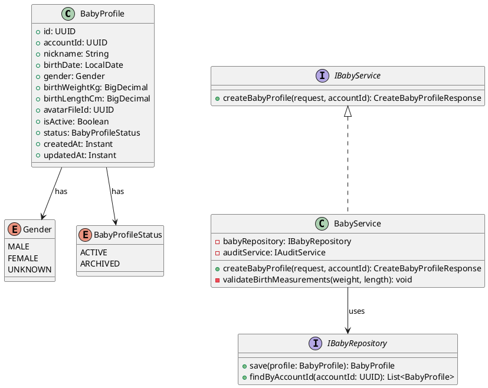
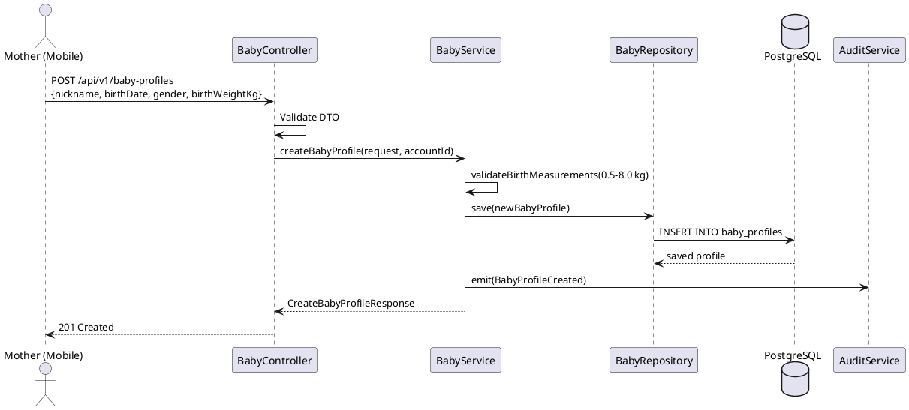
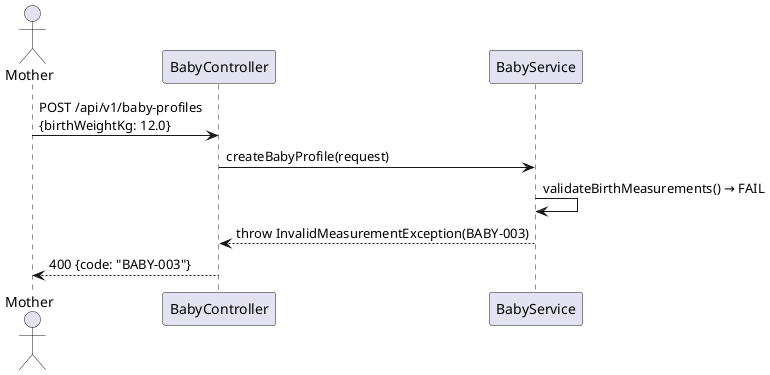

# ENGINEERING DOCUMENTATION STANDARD (EDS) v2.0
# Technical Design Specification — UC-31 Create Baby Profile

| Field | Value |
|-------|-------|
| **Document ID** | `CB-BABY-IMP-001` |
| **Version** | `1.0` |
| **Date** | `2026-06-26` |
| **Status** | `Approved` |
| **Document Owner** | `PhuongNT` |
| **Author** | `AI Agent` |
| **Reviewed by** | `[Tech Lead]` |
| **DPO Sign-off** | `[ ] Pending` |
| **Approved by** | `[Principal Architect]` |
| **Last Review** | `2026-06-26` |
| **Based on EDS** | `v2.0` |

---

## CHANGELOG

| Ngày | Người thực hiện | Nội dung thay đổi |
|------|-----------------|-------------------|
| 2026-06-27 | AI Agent — Amelia (Dev Agent) | Implementation completed — service, controller, tests 🟢 GREEN (45/45) |
| 2026-06-26 | AI Agent | Tạo tài liệu lần đầu cho UC-31 Create Baby Profile |

---

## MỤC LỤC

1. [Tổng quan Module](#1-tổng-quan-module)
2. [Ma trận Truy vết](#2-ma-trận-truy-vết)
3. [Architecture Decision Records](#3-architecture-decision-records-adr)
4. [Non-Functional Requirements & SLA](#4-non-functional-requirements--sla)
5. [Static Modeling](#5-static-modeling)
6. [Dynamic Modeling](#6-dynamic-modeling)
7. [Domain Event Catalog](#7-domain-event-catalog)
8. [Interface Specification](#8-interface-specification)
9. [API Specification](#9-api-specification)
10. [Bảng mã lỗi](#10-bảng-mã-lỗi)
11. [Quy trình Triển khai](#11-quy-trình-triển-khai)
12. [Rollback & Incident Runbook](#12-rollback--incident-runbook)
13. [Kịch bản Kiểm thử](#13-kịch-bản-kiểm-thử)
14. [Phương pháp Xác minh](#14-phương-pháp-xác-minh)
15. [Mẫu thử thực tế](#15-mẫu-thử-thực-tế)
16. [Authorization Matrix](#16-bảng-tổng-hợp-phân-quyền)
17. [AI Prompt Constraints](#17-ai-prompt-constraints-case-20)

---

## 1. Tổng quan Module

| Field | Value |
|-------|-------|
| **Module Name** | `CreateBabyProfile` |
| **Bounded Context** | `baby` |
| **UC ID** | `UC-31` |
| **SRS Reference** | `3.3.1.8` |
| **Primary Actor** | `Mother (ROLE_MOTHER — authenticated)` |
| **Platform** | `Mobile App` |
| **Data Classification** | `Sensitive-PII` |
| **Compliance Scope** | `BR-RBAC, BR-PRIVACY, PDPA` |
| **Upstream Dependencies** | `auth (JWT), journey (parent journey linkage)` |
| **Downstream Consumers** | `baby daily log, vaccination, growth tracking, audit` |

**Mô tả:** Cho phép Mother tạo hồ sơ em bé với nickname, ngày sinh, giới tính, cân nặng và chiều cao lúc sinh. Một account có thể có nhiều baby profiles (phục vụ sinh đôi, sinh ba). Baby profile được liên kết với Mother's account và (tuỳ chọn) với journey đang ACTIVE.

---

## 2. Ma trận Truy vết

| Requirement ID | Loại | Mô tả yêu cầu | Thành phần Code | Compliance Target | ADR liên quan |
|----------------|------|---------------|-----------------|-------------------|---------------|
| UC-31 | Use Case | Mother tạo hồ sơ em bé | `BabyController.createBabyProfile()` | BR-RBAC | ADR-BABY-001 |
| BR-BABY-001 | Business Rule | Nickname ≤ 50 ký tự, không trống | `@NotBlank @Size(max=50)` trên DTO | Data Integrity | — |
| BR-BABY-002 | Business Rule | birthDate phải là quá khứ hoặc hiện tại | `@PastOrPresent` trên DTO | Data Integrity | — |
| BR-BABY-003 | Business Rule | gender thuộc enum: MALE, FEMALE, UNKNOWN | `@ValidGender` trên DTO | Data Integrity | ADR-BABY-001 |
| BR-BABY-004 | Business Rule | birthWeight: 0.5kg – 8.0kg nếu được cung cấp | `BabyService.validateBirthMeasurements()` | BR-SAFETY | ADR-BABY-002 |
| BR-BABY-005 | Business Rule | Ghi audit event sau tạo thành công | `AuditService.emit(BabyProfileCreated)` | PDPA | — |
| BR-PRIVACY-001 | Business Rule | Baby data thuộc về Mother | `@PreAuthorize owner check` | PDPA | — |

---

## 3. Architecture Decision Records (ADR)

### ADR-BABY-001 — Cho phép nhiều Baby Profile cho một account

| Field | Value |
|-------|-------|
| **Status** | `Accepted` |
| **Date** | `2026-06-26` |

#### Quyết định
Một Mother account được phép có **nhiều** baby profiles (không giới hạn). Điều này hỗ trợ sinh đôi, sinh ba. Không áp dụng unique constraint trên `(accountId, nickname)`. Switch active profile được handle ở UC-193.

### ADR-BABY-002 — Validate birth measurements theo chuẩn WHO

| Field | Value |
|-------|-------|
| **Status** | `Accepted` |
| **Date** | `2026-06-26` |

#### Quyết định
birthWeight phải trong khoảng 0.5–8.0 kg; birthLength phải trong khoảng 20–60 cm nếu được cung cấp. Values ngoài range này bị reject với BABY-003. AI không được suggest diagnosis dựa trên measurements.

---

## 4. Non-Functional Requirements & SLA

### 4.1. Performance & Availability

| Category | Requirement | Target SLA |
|----------|-------------|------------|
| Latency | API response (p99) | `< 300ms` |
| Availability | Uptime | `99.9%` |

### 4.2. Security

| Category | Requirement | Target |
|----------|-------------|--------|
| Access control | ROLE_MOTHER only | Least privilege |
| Data isolation | Own data only | BR-RBAC |

---

## 5. Static Modeling

### 5.1. Class Diagram



### 5.2. Data Structure

```sql
-- V21__create_baby_profiles.sql
CREATE TYPE gender_enum AS ENUM ('MALE', 'FEMALE', 'UNKNOWN');
CREATE TYPE baby_profile_status AS ENUM ('ACTIVE', 'ARCHIVED');

CREATE TABLE baby_profiles (
  id                UUID              PRIMARY KEY DEFAULT gen_random_uuid(),
  account_id        UUID              NOT NULL,
  nickname          VARCHAR(50)       NOT NULL,
  birth_date        DATE              NOT NULL,
  gender            gender_enum       NOT NULL DEFAULT 'UNKNOWN',
  birth_weight_kg   NUMERIC(4,2),                                -- optional, 0.50-8.00
  birth_length_cm   NUMERIC(4,1),                                -- optional, 20.0-60.0
  avatar_file_id    UUID,                                        -- FK to files
  is_active         BOOLEAN           NOT NULL DEFAULT TRUE,
  status            baby_profile_status NOT NULL DEFAULT 'ACTIVE',
  created_at        TIMESTAMPTZ       NOT NULL DEFAULT NOW(),
  updated_at        TIMESTAMPTZ       NOT NULL DEFAULT NOW(),
  created_by        UUID              NOT NULL,

  CONSTRAINT fk_baby_account FOREIGN KEY (account_id) REFERENCES accounts(id)
);

CREATE INDEX idx_baby_account_id ON baby_profiles(account_id);
CREATE INDEX idx_baby_status ON baby_profiles(status);
```

---

## 6. Dynamic Modeling

### 6.1. Sequence Diagram — Happy Path



### 6.2. Error Path — Invalid Birth Weight



---

## 7. Domain Event Catalog

### 7.1. Events Published

| Event Name | Trigger | Publisher | Subscriber(s) | Async? |
|------------|---------|-----------|---------------|--------|
| `BabyProfileCreated` | Profile saved | `BabyService` | `AuditService, VaccinationService` | No |

### 7.3. Payload Schema

```java
public record BabyProfileCreated(
    UUID    eventId,
    String  eventType,   // "BabyProfileCreated"
    Instant occurredAt,
    String  version,     // "1.0"
    Payload payload,
    Metadata metadata
) {
    public record Payload(UUID profileId, UUID accountId, String nickname, String gender) {}
    public record Metadata(UUID correlationId, String causedBy) {}
}
```

---

## 8. Interface Specification

```java
// CreateBabyProfileRequest.java
public class CreateBabyProfileRequest {
    @NotBlank @Size(max = 50)
    private String nickname;

    @NotNull @PastOrPresent
    private LocalDate birthDate;

    @NotNull
    private Gender gender;

    @DecimalMin("0.50") @DecimalMax("8.00")
    private BigDecimal birthWeightKg; // optional

    @DecimalMin("20.0") @DecimalMax("60.0")
    private BigDecimal birthLengthCm; // optional
}

// CreateBabyProfileResponse.java
public class CreateBabyProfileResponse {
    private UUID id;
    private String nickname;
    private LocalDate birthDate;
    private String gender;
    private BigDecimal birthWeightKg;
    private BigDecimal birthLengthCm;
    private String status;
    private Instant createdAt;
}

// IBabyService.java
public interface IBabyService {
    /**
     * @throws InvalidMeasurementException (BABY-003) when birth measurements out of range
     */
    CreateBabyProfileResponse createBabyProfile(CreateBabyProfileRequest request, UUID accountId);
}
```

---

## 9. API Specification

### 9.1. Endpoints Table

| Method | Path | Auth Level | Required Roles | Rate Limit | Idempotent? |
|--------|------|------------|----------------|------------|-------------|
| `POST` | `/api/v1/baby-profiles` | JWT Bearer | `ROLE_MOTHER` | 10/min | No |

### 9.2. Schemas

**Request:**
```json
{
  "nickname": "Bean",
  "birthDate": "2026-01-15",
  "gender": "MALE",
  "birthWeightKg": 3.2,
  "birthLengthCm": 50.0
}
```

**Response 201:**
```json
{
  "id": "uuid-v4",
  "nickname": "Bean",
  "birthDate": "2026-01-15",
  "gender": "MALE",
  "birthWeightKg": 3.2,
  "birthLengthCm": 50.0,
  "status": "ACTIVE",
  "createdAt": "2026-06-26T00:00:00.000Z"
}
```

---

## 10. Bảng mã lỗi

| Code | HTTP Status | Message (EN) | Trigger Condition |
|------|-------------|--------------|-------------------|
| `BABY-001` | 400 | Validation failed | Missing/invalid required fields |
| `BABY-002` | 403 | Insufficient permissions | Non-MOTHER role |
| `BABY-003` | 400 | Birth measurement out of range | Weight/length outside WHO bounds |
| `BABY-004` | 404 | Baby profile not found | Referenced profile does not exist |
| `BABY-005` | 500 | Internal error | Unexpected DB error |

---

## 11. Quy trình Triển khai

### 11.3. Implementation Steps

1. Flyway migration `V21__create_baby_profiles.sql`
2. `BabyProfile` entity với enum mappings
3. `IBabyRepository` extends JpaRepository
4. `BabyService.createBabyProfile()` với validation
5. `BabyController.POST /api/v1/baby-profiles`

---

## 12. Rollback & Incident Runbook

```bash
psql -h $DB_HOST -U $DB_USER -d $DB_NAME \
  -c "DROP TABLE IF EXISTS baby_profiles CASCADE;"
psql -h $DB_HOST -U $DB_USER -d $DB_NAME \
  -c "DROP TYPE IF EXISTS gender_enum, baby_profile_status CASCADE;"
psql -h $DB_HOST -U $DB_USER -d $DB_NAME \
  -c "DELETE FROM flyway_schema_history WHERE version = '21';"
```

---

## 13. Kịch bản Kiểm thử

```gherkin
Feature: Create Baby Profile
  Scenario: Happy path
    Given Mother authenticated with JWT
    When POST /api/v1/baby-profiles with valid data
    Then 201 response with baby profile data
    And database contains 1 row in baby_profiles

  Scenario: Invalid birth weight → 400
    When POST with birthWeightKg = 12.0
    Then response 400, error BABY-003

  Scenario: EXPERT role → 403
    When EXPERT calls POST /api/v1/baby-profiles
    Then response 403
```

---

## 14. Phương pháp Xác minh

```sql
SELECT id, nickname, birth_date, gender, status FROM baby_profiles
WHERE account_id = '[uuid]';
```

---

## 15. Mẫu thử thực tế

```bash
curl -X POST https://[host]/api/v1/baby-profiles \
  -H "Authorization: Bearer [JWT_MOTHER_TOKEN]" \
  -H "Content-Type: application/json" \
  -d '{"nickname":"Bean","birthDate":"2026-01-15","gender":"MALE","birthWeightKg":3.2}'
# Expected: 201
```

---

## 16. Bảng tổng hợp phân quyền

| Endpoint | `GUEST` | `MOTHER` | `EXPERT` | `ADMIN` |
|----------|---------|----------|----------|---------|
| `POST /api/v1/baby-profiles` | ❌ | ✅ Own | ❌ | ✅ All |
| `GET /api/v1/baby-profiles` | ❌ | ✅ Own | ❌ | ✅ All |

---

## 17. AI Prompt Constraints (CASE 2.0)

### 17.1 Constraint Summary Table

| # | Constraint | Source | Last Verified |
|---|-----------|--------|---------------|
| C1 | validateBirthMeasurements() phải reject weight ngoài 0.5–8.0 kg | ADR-BABY-002, BR-SAFETY | 2026-06-26 |
| C2 | Controller không chứa business logic | CLAUDE.md | 2026-06-26 |
| C3 | Emit BabyProfileCreated audit event sau save | BR-PRIVACY | 2026-06-26 |
| C4 | accountId từ JWT SecurityContext — không từ body | BR-RBAC | 2026-06-26 |
| C5 | AI không được suggest diagnosis từ birth measurements | BR-SAFETY | 2026-06-26 |

### 17.2 Constraint Injection Block

```
[CONSTRAINT BLOCK — Module: CreateBabyProfile (CB-BABY-IMP-001)]
1. validateBirthMeasurements() PHẢI reject weight ngoài 0.5–8.0 kg và length ngoài 25–65 cm — ADR-BABY-002
2. Controller chỉ validate DTO và map — business logic thuộc về Service — CLAUDE.md
3. Emit BabyProfileCreated audit event sau mỗi save thành công — BR-PRIVACY
4. accountId từ JWT SecurityContext, KHÔNG từ request body — BR-RBAC
5. AI KHÔNG được suggest diagnosis từ birth measurements — BR-SAFETY

[CONTEXT BLOCK]
- Bounded Context: baby
- Data Classification: Sensitive-PII
- Error codes: §10 Error Codes Table
- Auth matrix: §16 Authorization Matrix
```

### 17.3 Constraint Quality Checklist

- [x] Mỗi constraint traceable về ADR hoặc BR cụ thể
- [x] Không có constraint generic
- [x] Constraint block có ≥ 3 constraints cụ thể

### 17.4 Anti-Pattern Detection

| AP-ID | Anti-Pattern | Dấu hiệu | Hành động |
|-------|-------------|-----------|----------|
| AP-AI-001 | Unconstrained Gen | Code không match constraint C1-C5 | Reject — inject lại constraints |
| AP-AI-003 | Implicit Decision | Code assume architecture không có ADR | Reject — viết ADR trước |
| AP-AI-005 | Hallucinated Contract | Code import không có trong §8 | Reject — verify contract |

---

## PHỤ LỤC

### A. Glossary (Thuật ngữ)

| Thuật ngữ | Định nghĩa |
|-----------|------------|
| BabyProfile | Hồ sơ em bé — lưu thông tin sinh, cân nặng, chiều dài, và trạng thái |
| WHO Bounds | Ngưỡng cân nặng/chiều dài sơ sinh theo WHO — dùng để validate input |
| PII Masking | Ẩn thông tin nhận dạng cá nhân trong API responses và logs |

### B. Tài liệu tham chiếu

| Document | Path |
|----------|------|
| EDS v2.0 Template | `08_References/Template/PHASE-3_TDS.md` |

---

*EDS v2.1 — Tích hợp CASE 2.0 AI Prompt Constraints (§17).*
