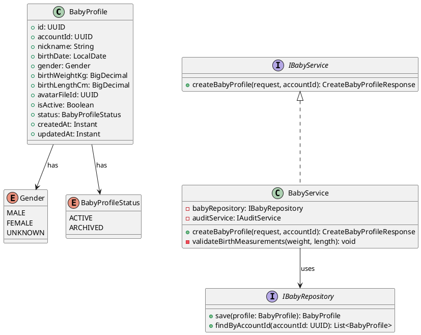
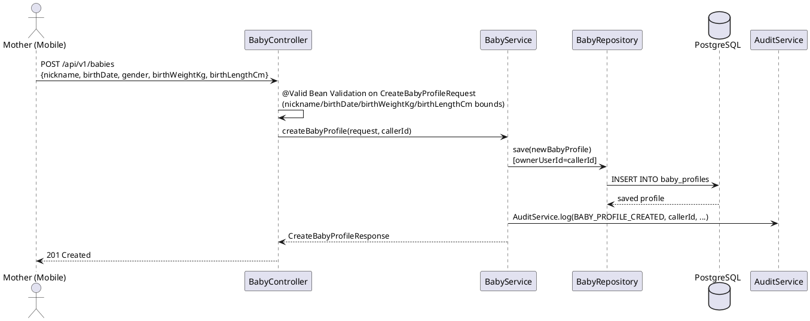
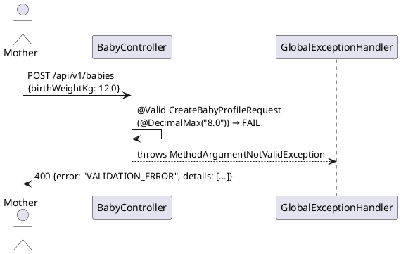

# ENGINEERING DOCUMENTATION STANDARD (EDS) v2.0
# Technical Design Specification — UC-31 Create Baby Profile

| Field | Value |
|-------|-------|
| **Document ID** | `CB-BABY-IMP-001` |
| **Version** | `1.0` |
| **Date** | `2026-06-26` |
| **Status** | `Approved` |
| **Document Owner** | `PhuongNT` |
| **Author** | `AI Agent` |
| **Reviewed by** | `[Tech Lead]` |
| **DPO Sign-off** | `[ ] Pending` |
| **Approved by** | `[Principal Architect]` |
| **Last Review** | `2026-06-26` |
| **Based on EDS** | `v2.0` |

---

## CHANGELOG

| Ngày | Người thực hiện | Nội dung thay đổi |
|------|-----------------|-------------------|
| 2026-07-03 | AI Agent (open-items reconciliation) | **Sửa lỗi tài liệu trên diện rộng** — phát hiện khi verify OI (UC192) rằng TDS này mô tả một schema/API design KHÁC với code thật đã ship: bảng `baby_profiles` (cột `id`/`account_id`/`avatar_file_id`/`is_active` → thật ra là `baby_id`/`owner_user_id`/không có `avatar_file_id`/`is_active`), endpoint `/api/v1/baby-profiles` (thật ra `/api/v1/babies`), role `ROLE_MOTHER` only (thật ra `MOTHER, FAMILY`), bảng mã lỗi `BABY-001..005` cho create path (thật ra dùng generic `VALIDATION_ERROR`/`ACCESS_DENIED`, không có custom code). Đã sửa lại toàn bộ §2, §3, §5.2, §6, §8, §9, §10, §11, §13, §16, §17 khớp code thật tại `com.carebridge.backend.baby.*`. Theo `CLAUDE.md`: "Current code and migrations override historical design notes". |
| 2026-06-27 | AI Agent — Amelia (Dev Agent) | Implementation completed — service, controller, tests 🟢 GREEN (45/45) |
| 2026-06-26 | AI Agent | Tạo tài liệu lần đầu cho UC-31 Create Baby Profile |

---

## MỤC LỤC

1. [Tổng quan Module](#1-tổng-quan-module)
2. [Ma trận Truy vết](#2-ma-trận-truy-vết)
3. [Architecture Decision Records](#3-architecture-decision-records-adr)
4. [Non-Functional Requirements & SLA](#4-non-functional-requirements--sla)
5. [Static Modeling](#5-static-modeling)
6. [Dynamic Modeling](#6-dynamic-modeling)
7. [Domain Event Catalog](#7-domain-event-catalog)
8. [Interface Specification](#8-interface-specification)
9. [API Specification](#9-api-specification)
10. [Bảng mã lỗi](#10-bảng-mã-lỗi)
11. [Quy trình Triển khai](#11-quy-trình-triển-khai)
12. [Rollback & Incident Runbook](#12-rollback--incident-runbook)
13. [Kịch bản Kiểm thử](#13-kịch-bản-kiểm-thử)
14. [Phương pháp Xác minh](#14-phương-pháp-xác-minh)
15. [Mẫu thử thực tế](#15-mẫu-thử-thực-tế)
16. [Authorization Matrix](#16-bảng-tổng-hợp-phân-quyền)
17. [AI Prompt Constraints](#17-ai-prompt-constraints-case-20)

---

## 1. Tổng quan Module

| Field | Value |
|-------|-------|
| **Module Name** | `CreateBabyProfile` |
| **Bounded Context** | `baby` |
| **UC ID** | `UC-31` |
| **SRS Reference** | `3.3.1.8` |
| **Primary Actor** | `Mother (ROLE_MOTHER — authenticated)` |
| **Platform** | `Mobile App` |
| **Data Classification** | `Sensitive-PII` |
| **Compliance Scope** | `BR-RBAC, BR-PRIVACY, PDPA` |
| **Upstream Dependencies** | `auth (JWT)` |
| **Downstream Consumers** | `baby daily log, vaccination, growth tracking, audit` |

**Mô tả:** Cho phép Mother tạo hồ sơ em bé độc lập với nickname, ngày sinh, giới tính, cân nặng và chiều cao lúc sinh. Một account có thể có nhiều baby profiles (phục vụ sinh đôi, sinh ba). Baby profile chỉ thuộc account của Mother và không liên kết với Mother Journey.

---

## 2. Ma trận Truy vết

| Requirement ID | Loại | Mô tả yêu cầu | Thành phần Code | Compliance Target | ADR liên quan |
|----------------|------|---------------|-----------------|-------------------|---------------|
| UC-31 | Use Case | Mother/Family tạo hồ sơ em bé | `BabyController.createBabyProfile()` (package `com.carebridge.backend.baby`) | BR-RBAC | ADR-BABY-001 |
| BR-BABY-001 | Business Rule | Nickname ≤ 100 ký tự, không trống | `@NotBlank @Size(max=100)` trên `CreateBabyProfileRequest` | Data Integrity | — |
| BR-BABY-002 | Business Rule | birthDate bắt buộc (không có ràng buộc quá khứ/hiện tại ở code thật) | `@NotNull` trên `CreateBabyProfileRequest` | Data Integrity | — |
| BR-BABY-003 | Business Rule | gender (tuỳ chọn) thuộc enum: MALE, FEMALE, UNKNOWN | `Gender` Java enum (Jackson tự động reject giá trị lạ khi deserialize JSON — không có `@ValidGender` custom annotation) | Data Integrity | ADR-BABY-001 |
| BR-BABY-004 | Business Rule | birthWeightKg: 0.5–8.0kg, birthLengthCm: 25.0–65.0cm nếu được cung cấp | `@DecimalMin/@DecimalMax` trên `CreateBabyProfileRequest` (Bean Validation, KHÔNG có method `validateBirthMeasurements()` riêng trong Service) | BR-SAFETY | ADR-BABY-002 |
| BR-BABY-005 | Business Rule | Ghi audit log sau tạo thành công | `AuditService.log(AuditAction.BABY_PROFILE_CREATED, ...)` (audit log call, KHÔNG phải Spring domain event) | PDPA | — |
| BR-PRIVACY-001 | Business Rule | Baby data gắn với `owner_user_id` = caller | `callerId` từ `SecurityUtils.requireCurrentUserId(principal)`, gán trực tiếp vào `ownerUserId` khi build entity | PDPA | — |

---

## 3. Architecture Decision Records (ADR)

### ADR-BABY-001 — Cho phép nhiều Baby Profile cho một account

| Field | Value |
|-------|-------|
| **Status** | `Accepted` |
| **Date** | `2026-06-26` |

#### Quyết định
Một Mother account được phép có **nhiều** baby profiles (không giới hạn). Điều này hỗ trợ sinh đôi, sinh ba. Không áp dụng unique constraint trên `(accountId, nickname)`. Switch active profile được handle ở UC-193.

### ADR-BABY-002 — Validate birth measurements theo chuẩn WHO

| Field | Value |
|-------|-------|
| **Status** | `Accepted` |
| **Date** | `2026-06-26` |

#### Quyết định
birthWeightKg phải trong khoảng 0.5–8.0 kg; birthLengthCm phải trong khoảng 25.0–65.0 cm nếu được cung cấp (khớp `@DecimalMin/@DecimalMax` trên `CreateBabyProfileRequest.java` — **(Sửa 2026-07-03):** con số 25.0–65.0 cm là số thật từ code, KHÁC với 20–60 cm ghi ban đầu). Values ngoài range bị reject qua Bean Validation chuẩn (400, `error: "VALIDATION_ERROR"` — KHÔNG có custom code `BABY-003` cho path này; xem §10). AI không được suggest diagnosis dựa trên measurements.

---

## 4. Non-Functional Requirements & SLA

### 4.1. Performance & Availability

| Category | Requirement | Target SLA |
|----------|-------------|------------|
| Latency | API response (p99) | `< 300ms` |
| Availability | Uptime | `99.9%` |

### 4.2. Security

| Category | Requirement | Target |
|----------|-------------|--------|
| Access control | ROLE_MOTHER only | Least privilege |
| Data isolation | Own data only | BR-RBAC |

---

## 5. Static Modeling

### 5.1. Class Diagram



### 5.2. Data Structure

> **(Sửa 2026-07-03):** Bảng dưới đây ban đầu mô tả một schema/migration hoàn toàn khác (`V21__create_baby_profiles.sql`, PK `id`, cột `account_id`/`avatar_file_id`/`is_active`, native Postgres enum types) — KHÔNG khớp với bảng thật đã ship trong baseline `V1__init_schema.sql`. Đã sửa lại khớp thực tế; không có migration riêng cho `baby_profiles` vì bảng này thuộc baseline schema.

```sql
-- Baseline: src/main/resources/db/migration/V1__init_schema.sql (dòng 607-619)
CREATE TABLE public.baby_profiles (
    baby_id            uuid         NOT NULL DEFAULT gen_random_uuid(),
    owner_user_id      uuid         NOT NULL,
    nickname           varchar(100) NOT NULL,
    birth_date         date,
    sex                varchar(10),   -- mapped to Java enum `Gender` (MALE/FEMALE/UNKNOWN) via @Enumerated(STRING)
    birth_weight_kg    numeric,
    birth_length_cm    numeric,
    status             varchar(20)  NOT NULL DEFAULT 'ACTIVE',  -- plain varchar, not a native enum type; values ACTIVE/ARCHIVED (BabyProfileStatus.java)
    created_at         timestamptz  NOT NULL DEFAULT now(),
    updated_at         timestamptz  NOT NULL DEFAULT now()
);
-- PK: baby_profiles_pkey (baby_id)
-- FK: owner_user_id -> users(user_id)
-- Index: idx_baby_profiles_owner_user_id

-- Không có cột avatar_file_id hoặc is_active trong schema thật.
```

---

## 6. Dynamic Modeling

### 6.1. Sequence Diagram — Happy Path



### 6.2. Error Path — Invalid Birth Weight

> **(Sửa 2026-07-03):** Sequence gốc mô tả `validateBirthMeasurements()` là method riêng trong Service ném `InvalidMeasurementException(BABY-003)`. Code thật KHÔNG có method này — validation xảy ra ở Bean Validation layer (`@Valid` trên Controller), ném `MethodArgumentNotValidException`, xử lý bởi `GlobalExceptionHandler` trả về `error: "VALIDATION_ERROR"` (400), KHÔNG phải `BABY-003`.



---

## 7. Domain Event Catalog

### 7.1. Events Published

> **(Sửa 2026-07-03):** Code thật KHÔNG publish một Spring `ApplicationEvent`/domain-event record riêng. `BabyServiceImpl.createBabyProfile()` gọi trực tiếp `AuditService.log(AuditAction.BABY_PROFILE_CREATED, callerId, "BabyProfile", saved.getId().toString(), "created")` — một audit log call đồng bộ, không phải event bus.

| Event Name | Trigger | Publisher | Subscriber(s) | Async? |
|------------|---------|-----------|---------------|--------|
| `AuditAction.BABY_PROFILE_CREATED` (audit log entry, không phải domain event) | Profile saved | `BabyServiceImpl.createBabyProfile()` | `audit_logs` table (qua `AuditService.log()`) | No |

### 7.3. Payload Schema

Không có payload record riêng — `AuditService.log(action, actorId, entityType, entityId, description)` ghi trực tiếp vào bảng `audit_logs` với các tham số: `action=BABY_PROFILE_CREATED`, `actorId=callerId`, `entityType="BabyProfile"`, `entityId=saved.getId()`, `description="created"`.

---

## 8. Interface Specification

> **(Cập nhật 2026-07-28):** DTO dưới đây khớp contract standalone: `nickname` max=100, KHÔNG có `@PastOrPresent` trên `birthDate`, `gender` là optional, bounds cân nặng/chiều dài là 0.5–8.0kg / 25.0–65.0cm. Request dùng deserializer nghiêm ngặt cục bộ; mọi thuộc tính ngoài contract trả validation `400` trung tính thay vì bị bỏ qua.

```java
// CreateBabyProfileRequest.java
public class CreateBabyProfileRequest {
    @NotBlank @Size(max = 100)
    private String nickname;

    @NotNull
    private LocalDate birthDate;

    private Gender gender; // optional

    @DecimalMin("0.5") @DecimalMax("8.0")
    private BigDecimal birthWeightKg; // optional

    @DecimalMin("25.0") @DecimalMax("65.0")
    private BigDecimal birthLengthCm; // optional

}

// CreateBabyProfileResponse.java
public class CreateBabyProfileResponse {
    private UUID id;
    private String nickname;
    private LocalDate birthDate;
    private String gender;
    private BigDecimal birthWeightKg;
    private BigDecimal birthLengthCm;
    private String status;
    private Instant createdAt;
}

// IBabyService.java
public interface IBabyService {
    // Không throw custom exception — validation hoàn toàn ở Bean Validation layer (DTO annotations)
    CreateBabyProfileResponse createBabyProfile(CreateBabyProfileRequest request, UUID callerId);
}
```

---

## 9. API Specification

### 9.1. Endpoints Table

> **(Sửa 2026-07-03):** Path thật là `/api/v1/babies` (không phải `/api/v1/baby-profiles`); role thật cho phép cả `MOTHER` và `FAMILY` (`@PreAuthorize("hasAnyRole('MOTHER', 'FAMILY')")` trên `BabyController.createBabyProfile()`), không phải MOTHER-only.

| Method | Path | Auth Level | Required Roles | Rate Limit | Idempotent? |
|--------|------|------------|----------------|------------|-------------|
| `POST` | `/api/v1/babies` | JWT Bearer | `MOTHER`, `FAMILY` | Không có rate limit riêng trong code thật | No |

### 9.2. Schemas

**Request:**
```json
{
  "nickname": "Bean",
  "birthDate": "2026-01-15",
  "gender": "MALE",
  "birthWeightKg": 3.2,
  "birthLengthCm": 50.0
}
```

**Response 201** (bọc trong `ApiResponse<T>` — xem `ApiResponse.success(response, "Baby profile created successfully")`):
```json
{
  "success": true,
  "message": "Baby profile created successfully",
  "data": {
    "id": "uuid-v4",
    "nickname": "Bean",
    "birthDate": "2026-01-15",
    "gender": "MALE",
    "birthWeightKg": 3.2,
    "birthLengthCm": 50.0,
    "status": "ACTIVE",
    "createdAt": "2026-06-26T00:00:00.000Z"
  }
}
```

---

## 10. Bảng mã lỗi

> **(Sửa 2026-07-03 — quan trọng):** Bảng gốc bên dưới là SAI hoàn toàn so với code thật — `createBabyProfile()` không ném bất kỳ `BusinessException` với custom code nào. Ngoài ra, các mã `BABY-001`/`BABY-003` được "cấp phát" ở đây (400) trực tiếp collide với namespace thật: `BABY-001` và `BABY-003` đã được dùng bởi `getBabyProfile()` (UC192, xem TDS UC192 §10) với ý nghĩa KHÁC hẳn (`BABY-001`=404 Not Found, `BABY-003`=403 Forbidden). Bảng dưới đây đã được sửa lại khớp thực tế — path tạo profile không có custom error code, dùng format lỗi chung của toàn hệ thống.

| Code | HTTP Status | Message (EN) | Trigger Condition |
|------|-------------|--------------|-------------------|
| `VALIDATION_ERROR` (generic, `GlobalExceptionHandler.handleMethodArgumentNotValid`) | 400 | Invalid request | Bean Validation thất bại: nickname trống/quá dài, birthDate null, birthWeightKg/birthLengthCm ngoài range, gender không thuộc enum |
| `ACCESS_DENIED` (generic, `GlobalExceptionHandler.handleSpringAccessDenied`) | 403 | Insufficient permissions | Caller không có role `MOTHER` hoặc `FAMILY` (Spring `@PreAuthorize` reject) |
| `INTERNAL_ERROR` (generic, `GlobalExceptionHandler.handleGeneric`) | 500 | Unexpected error | Lỗi DB không lường trước |

Không có `BABY-xxx` code riêng cho create path trong code thật. Nếu tương lai cần custom code (vd. để phân biệt lỗi field cụ thể), PHẢI cấp phát số thứ tự tiếp theo CHƯA dùng trong namespace `BABY-xxx` toàn module (hiện `BABY-001`, `BABY-003` đã dùng bởi UC192; `BABY-033` bởi UC34; `BABY-063` bởi UC37) — không được tái sử dụng `BABY-001`–`BABY-005` như bản gốc.

---

## 11. Quy trình Triển khai

### 11.3. Implementation Steps (đã ship — cập nhật khớp thực tế 2026-07-03)

1. ~~Flyway migration `V21__create_baby_profiles.sql`~~ — bảng `baby_profiles` thuộc baseline `V1__init_schema.sql`, không có migration riêng
2. `BabyProfile` entity (`com.carebridge.backend.baby.entity`) với `@Enumerated(STRING)` cho `gender`/`status`
3. `BabyProfileRepository extends JpaRepository<BabyProfile, UUID>`
4. `BabyServiceImpl.createBabyProfile()` — Bean Validation only, không có validation method riêng
5. `BabyController.POST /api/v1/babies` (`@PreAuthorize("hasAnyRole('MOTHER', 'FAMILY')")`)

---

## 12. Rollback & Incident Runbook

> **(Sửa 2026-07-03):** `baby_profiles` thuộc baseline schema (`V1__init_schema.sql`), được nhiều UC khác dùng chung (UC32, UC33, UC192-197...) — KHÔNG được `DROP TABLE`. Rollback chỉ revert code, không đụng schema.

```bash
# Rollback code-only (baby_profiles là bảng dùng chung, không drop):
git checkout -- src/main/java/com/carebridge/backend/baby/controller/BabyController.java
git checkout -- src/main/java/com/carebridge/backend/baby/service/impl/BabyServiceImpl.java
```

---

## 13. Kịch bản Kiểm thử

```gherkin
Feature: Create Baby Profile
  Scenario: Happy path
    Given Mother authenticated with JWT
    When POST /api/v1/babies with valid data
    Then 201 response with baby profile data
    And database contains 1 row in baby_profiles with owner_user_id = caller

  Scenario: Invalid birth weight → 400
    When POST with birthWeightKg = 12.0
    Then response 400, error "VALIDATION_ERROR"

  Scenario: EXPERT role → 403
    When EXPERT calls POST /api/v1/babies
    Then response 403, error "ACCESS_DENIED"

  Scenario: FAMILY role → 201 (allowed, không phải chỉ MOTHER)
    When FAMILY calls POST /api/v1/babies with valid data
    Then 201 response
```

---

## 14. Phương pháp Xác minh

```sql
SELECT baby_id, nickname, birth_date, sex, status FROM baby_profiles
WHERE owner_user_id = '[uuid]';
```

---

## 15. Mẫu thử thực tế

```bash
curl -X POST https://[host]/api/v1/babies \
  -H "Authorization: Bearer [JWT_MOTHER_TOKEN]" \
  -H "Content-Type: application/json" \
  -d '{"nickname":"Bean","birthDate":"2026-01-15","gender":"MALE","birthWeightKg":3.2}'
# Expected: 201
```

---

## 16. Bảng tổng hợp phân quyền

> **(Sửa 2026-07-03):** Bảng gốc ghi path `/api/v1/baby-profiles` và MOTHER-only, và tuỳ tiện thêm quyền ADMIN "All" (không có trong code). Path thật là `/api/v1/babies`; `@PreAuthorize` chỉ cho `MOTHER, FAMILY`; không có route ADMIN-override.

| Endpoint | `GUEST` | `MOTHER` | `FAMILY` | `EXPERT` | `ADMIN` |
|----------|---------|----------|----------|----------|---------|
| `POST /api/v1/babies` | ❌ | ✅ Own | ✅ | ❌ (`@PreAuthorize` chặn) | ❌ (không có override route) |
| `GET /api/v1/babies` (list) | ❌ | ✅ Own | ✅ Own | ✅ Own* | ✅ Own* |

\* `GET /api/v1/babies` dùng `@PreAuthorize("isAuthenticated()")` — không giới hạn role cụ thể; kết quả tự động lọc theo `owner_user_id = callerId` nên EXPERT/ADMIN gọi vẫn chỉ thấy babies của chính họ (nếu có), không phải "xem hộ" người khác.

---

## 17. AI Prompt Constraints (CASE 2.0)

### 17.1 Constraint Summary Table

| # | Constraint | Source | Last Verified |
|---|-----------|--------|---------------|
| C1 | `@DecimalMin/@DecimalMax` trên DTO phải reject birthWeightKg ngoài 0.5–8.0 kg, birthLengthCm ngoài 25.0–65.0 cm — KHÔNG viết method `validateBirthMeasurements()` riêng trong Service | ADR-BABY-002, BR-SAFETY | 2026-07-03 |
| C2 | Controller không chứa business logic | CLAUDE.md | 2026-06-26 |
| C3 | Gọi `AuditService.log(BABY_PROFILE_CREATED, ...)` sau save — KHÔNG phải publish domain event riêng | BR-PRIVACY | 2026-07-03 |
| C4 | callerId từ `SecurityUtils.requireCurrentUserId(principal)` — không từ body | BR-RBAC | 2026-06-26 |
| C5 | AI không được suggest diagnosis từ birth measurements | BR-SAFETY | 2026-06-26 |

### 17.2 Constraint Injection Block

```
[CONSTRAINT BLOCK — Module: CreateBabyProfile (CB-BABY-IMP-001)]
1. Bean Validation (@DecimalMin/@DecimalMax) trên CreateBabyProfileRequest PHẢI reject weight ngoài 0.5–8.0 kg và length ngoài 25.0–65.0 cm — KHÔNG viết validation method riêng trong Service — ADR-BABY-002
2. Controller chỉ validate DTO và map — business logic thuộc về Service — CLAUDE.md
3. Gọi AuditService.log(AuditAction.BABY_PROFILE_CREATED, ...) sau mỗi save thành công — KHÔNG publish Spring domain event — BR-PRIVACY
4. callerId từ SecurityUtils.requireCurrentUserId(principal), KHÔNG từ request body — BR-RBAC
5. AI KHÔNG được suggest diagnosis từ birth measurements — BR-SAFETY

[CONTEXT BLOCK]
- Bounded Context: baby (package com.carebridge.backend.baby)
- Data Classification: Sensitive-PII
- Endpoint: POST /api/v1/babies (roles: MOTHER, FAMILY)
- Error codes: §10 — generic VALIDATION_ERROR/ACCESS_DENIED, KHÔNG có custom BABY-xxx cho path này
- Auth matrix: §16 Authorization Matrix
```

### 17.3 Constraint Quality Checklist

- [x] Mỗi constraint traceable về ADR hoặc BR cụ thể
- [x] Không có constraint generic
- [x] Constraint block có ≥ 3 constraints cụ thể

### 17.4 Anti-Pattern Detection

| AP-ID | Anti-Pattern | Dấu hiệu | Hành động |
|-------|-------------|-----------|----------|
| AP-AI-001 | Unconstrained Gen | Code không match constraint C1-C5 | Reject — inject lại constraints |
| AP-AI-003 | Implicit Decision | Code assume architecture không có ADR | Reject — viết ADR trước |
| AP-AI-005 | Hallucinated Contract | Code import không có trong §8 | Reject — verify contract |

---

## PHỤ LỤC

### A. Glossary (Thuật ngữ)

| Thuật ngữ | Định nghĩa |
|-----------|------------|
| BabyProfile | Hồ sơ em bé — lưu thông tin sinh, cân nặng, chiều dài, và trạng thái |
| WHO Bounds | Ngưỡng cân nặng/chiều dài sơ sinh theo WHO — dùng để validate input |
| PII Masking | Ẩn thông tin nhận dạng cá nhân trong API responses và logs |

### B. Tài liệu tham chiếu

| Document | Path |
|----------|------|
| EDS v2.0 Template | `08_References/Template/PHASE-3_TDS.md` |

---

*EDS v2.1 — Tích hợp CASE 2.0 AI Prompt Constraints (§17).*

## OV-01 Standalone Baby Profile Contract

UC31 remains the only create operation. A committed live birth may open this existing standalone form through typed in-memory navigation, but no lifecycle identifier is persisted or serialized into the request.

| OV-01 branch | Canonical decision | Test-Spec contract | Executable evidence |
| --- | --- | --- | --- |
| `OV01-B06` | After committed live birth, typed transition entry may create one standalone profile or defer without writes; ordinary Add Baby entry never shows defer | `OV01-TS-31-001` | `add_baby_screen_test.dart` and pregnancy-outcome/Journey post-commit tests |
| `OV01-B06` | The create request rejects unknown legacy relationship fields with neutral validation `400`; removed relationship routes resolve through generic `404/405` | `OV01-TS-31-002` | `CreateBabyProfileRequestValidationTest`, removed-route MVC coverage, and `BabyServiceImplTest` |

UC32 and UC33 remain downstream update/archive Functions. Baby identity, ownership, triage origin, and care data remain baby-scoped and independent of Mother Journey.
