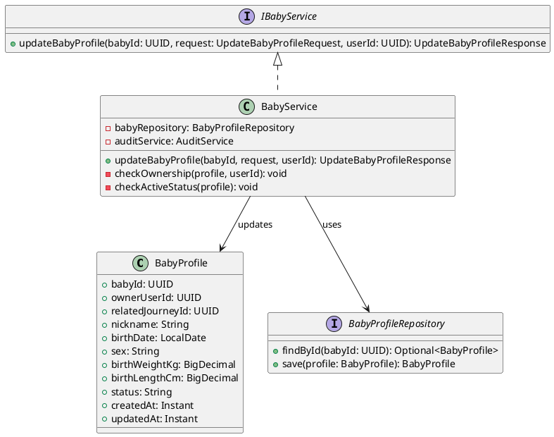
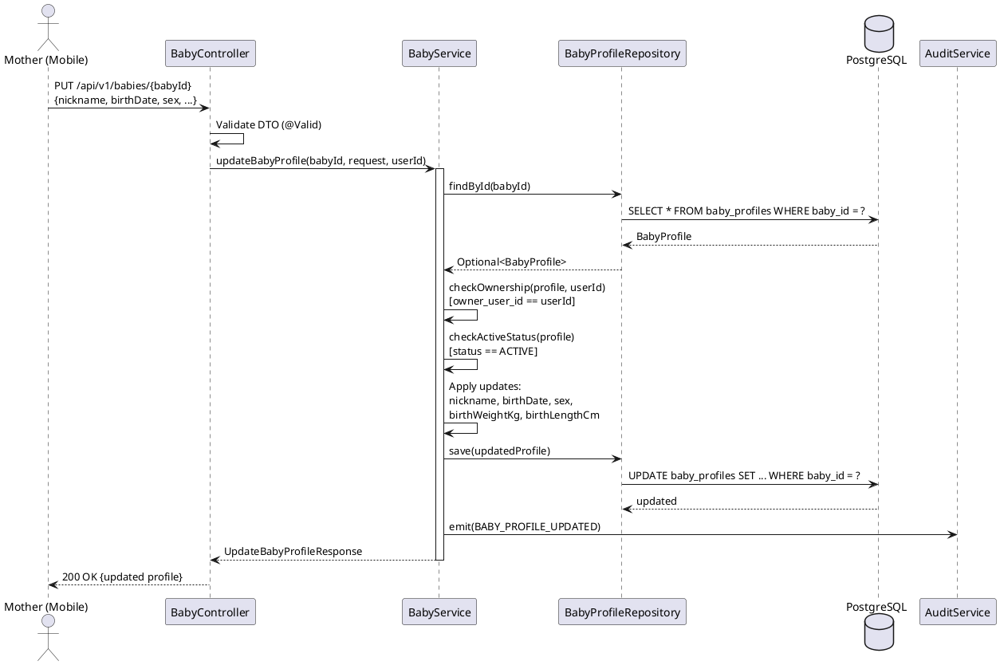
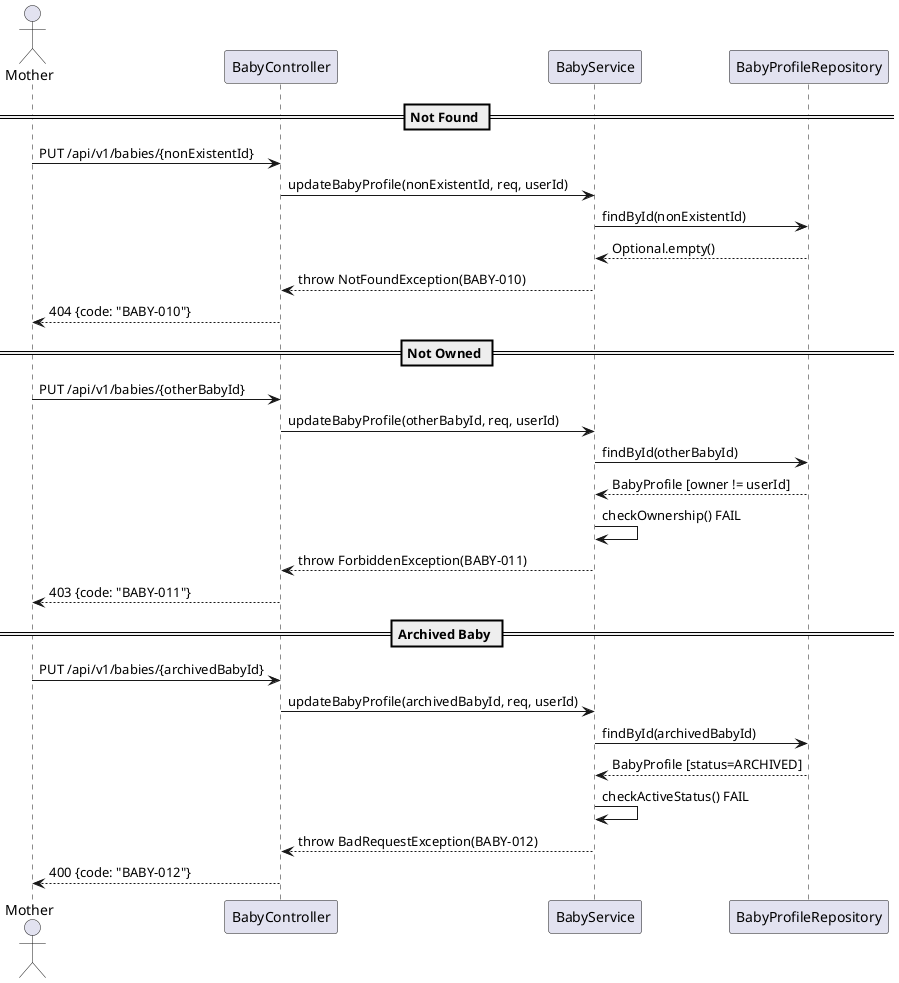

# ENGINEERING DOCUMENTATION STANDARD (EDS) v2.0
# Technical Design Specification — UC-32 Update Baby Profile

| Field | Value |
|-------|-------|
| **Document ID** | `CB-BABY-IMP-002` |
| **Version** | `1.0` |
| **Date** | `2026-06-26` |
| **Status** | `Draft` |
| **Document Owner** | `PhuongNT` |
| **Author** | `AI Agent` |
| **Reviewed by** | `[Tech Lead]` |
| **DPO Sign-off** | `[ ] Pending` |
| **Approved by** | `[Principal Architect]` |
| **Last Review** | `2026-06-26` |
| **Based on EDS** | `v2.0` |

---

## CHANGELOG

| Ngay | Nguoi thuc hien | Noi dung thay doi |
|------|-----------------|-------------------|
| 2026-07-03 | AI Agent (open-items reconciliation) | Xac nhan: `updateBabyProfile()` CHUA duoc implement trong code that (`BabyController.java` chi co `createBabyProfile`, `listBabyProfiles`, `getBabyProfile` — khong co PUT endpoint). Sua 2 loi trong tai lieu de tranh lech huong khi implement: (1) package sai — tai lieu ghi `com.carebridge.backend.carejourney.*`, package that cua module baby la `com.carebridge.backend.baby.*` (xem UC31/UC192 da ship); (2) `sex` validation dung `@Pattern(regexp = "MALE\|FEMALE\|OTHER")` nhung `Gender` enum that (`Gender.java`) la MALE/FEMALE/UNKNOWN — khong co gia tri OTHER. Ma loi BABY-010/011/012 khong dung hang voi cac ma da cap phat that (BABY-001/003 boi UC192, BABY-033 boi UC34, BABY-063 boi UC37) nen giu nguyen duoc. |
| 2026-06-26 | AI Agent | Tao tai lieu lan dau cho UC-32 Update Baby Profile |

---

## MUC LUC

1. [Tong quan Module](#1-tong-quan-module)
2. [Ma tran Truy vet](#2-ma-tran-truy-vet)
3. [Architecture Decision Records](#3-architecture-decision-records-adr)
4. [Non-Functional Requirements & SLA](#4-non-functional-requirements--sla)
5. [Static Modeling](#5-static-modeling)
6. [Dynamic Modeling](#6-dynamic-modeling)
7. [Domain Event Catalog](#7-domain-event-catalog)
8. [Interface Specification](#8-interface-specification)
9. [API Specification](#9-api-specification)
10. [Bang ma loi](#10-bang-ma-loi)
11. [Quy trinh Trien khai](#11-quy-trinh-trien-khai)
12. [Rollback & Incident Runbook](#12-rollback--incident-runbook)
13. [Kich ban Kiem thu](#13-kich-ban-kiem-thu)
14. [Phuong phap Xac minh](#14-phuong-phap-xac-minh)
15. [Mau thu thuc te](#15-mau-thu-thuc-te)
16. [Authorization Matrix](#16-bang-tong-hop-phan-quyen)
17. [AI Prompt Constraints](#17-ai-prompt-constraints-case-20)

---

## 1. Tong quan Module

| Field | Value |
|-------|-------|
| **Module Name** | `UpdateBabyProfile` |
| **Bounded Context** | `baby` — package `com.carebridge.backend.baby` *(sửa 2026-07-03; bản gốc ghi nhầm `carejourney`, không khớp package thật của UC31/UC192)* |
| **UC ID** | `UC-32` |
| **SRS Reference** | `3.3.1.9` |
| **Primary Actor** | `Mother (authenticated)` |
| **Platform** | `Mobile App` |
| **Data Classification** | `Sensitive-PII` |
| **Compliance Scope** | `BR-RBAC, BR-PRIVACY, PDPA` |
| **Upstream Dependencies** | `auth (JWT), UC-31 (baby_profiles table must exist)` |
| **Downstream Consumers** | `baby daily log, growth tracking, audit` |

**Mo ta:** Cho phep Mother cap nhat thong tin ho so em be da ton tai. Chi cap nhat duoc cac truong: nickname, birth_date, sex, birth_weight_kg, birth_length_cm. Khong duoc thay doi owner_user_id, status (dung UC-33 de archive), hoac related_journey_id. Baby phai dang o trang thai ACTIVE.

---

## 2. Ma tran Truy vet

| Requirement ID | Loai | Mo ta yeu cau | Thanh phan Code | Compliance Target | ADR lien quan |
|----------------|------|---------------|-----------------|-------------------|---------------|
| UC-32 | Use Case | Mother cap nhat ho so em be | `BabyController.updateBabyProfile()` | BR-RBAC | ADR-BABY-003 |
| BR-BABY-010 | Business Rule | Baby phai ton tai | `BabyService.findById()` | Data Integrity | — |
| BR-BABY-011 | Business Rule | owner_user_id phai match JWT userId | `BabyService.checkOwnership()` | BR-RBAC, PDPA | — |
| BR-BABY-012 | Business Rule | Baby phai ACTIVE, khong duoc ARCHIVED | `BabyService.checkActiveStatus()` | Data Integrity | ADR-BABY-003 |
| BR-BABY-013 | Business Rule | Khong duoc cap nhat owner_user_id, status, related_journey_id | `UpdateBabyProfileRequest` (immutable fields excluded) | Data Integrity | ADR-BABY-003 |
| BR-BABY-014 | Business Rule | Ghi audit event BABY_PROFILE_UPDATED | `AuditService.emit()` | PDPA | — |

---

## 3. Architecture Decision Records (ADR)

### ADR-BABY-003 — Immutable fields on baby profile update

| Field | Value |
|-------|-------|
| **Status** | `Accepted` |
| **Date** | `2026-06-26` |

#### Boi canh (Context)
Khi Mother cap nhat baby profile, mot so truong khong duoc phep thay doi de dam bao tinh nhat quan du lieu va an toan: owner_user_id (da thuoc ve Mother), status (chi thay doi qua UC-33 Archive), va related_journey_id (linked khi tao profile).

#### Cac phuong an da xem xet

| Phuong an | Mo ta | Uu diem | Nhuoc diem |
|-----------|-------|---------|------------|
| A | Cho phep update tat ca truong | Linh hoat | Risk thay doi ownership, status bypass |
| B | DTO chi chua truong cho phep update | An toan, immutable fields loai tru | Client phai biet truong nao immutable |

#### Quyet dinh
Chon **Phuong an B**. UpdateBabyProfileRequest DTO chi chua nickname, birth_date, sex, birth_weight_kg, birth_length_cm. Cac truong owner_user_id, status, related_journey_id KHONG co trong DTO.

#### He qua
**Tich cuc:** Ngan chan viec thay doi ownership hoac bypass archive flow.
**Tieu cuc:** Client can biet truong nao immutable (document trong API docs).

### ADR-BABY-004 — Reject update on ARCHIVED baby

| Field | Value |
|-------|-------|
| **Status** | `Accepted` |
| **Date** | `2026-06-26` |

#### Quyet dinh
Baby profile da ARCHIVED khong duoc phep cap nhat. Tra ve loi BABY-012 (400). Neu Mother muon update, phai unarchive truoc (neu co UC ho tro).

---

## 4. Non-Functional Requirements & SLA

### 4.1. Performance & Availability

| Category | Requirement | Target SLA |
|----------|-------------|------------|
| Latency | API response (p99) | `< 300ms` |
| Availability | Uptime | `99.9%` |

### 4.2. Security

| Category | Requirement | Target |
|----------|-------------|--------|
| Access control | Ownership check | owner_user_id == JWT userId |
| Data isolation | Own data only | BR-RBAC |

---

## 5. Static Modeling

### 5.1. Class Diagram



### 5.2. Data Structure

No new migration required. UC-32 operates on the existing `baby_profiles` table created by UC-31.

```sql
-- Existing table: baby_profiles
-- Updatable columns: nickname, birth_date, sex, birth_weight_kg, birth_length_cm, updated_at
-- Immutable columns: baby_id, owner_user_id, related_journey_id, status, created_at
```

---

## 6. Dynamic Modeling

### 6.1. Sequence Diagram — Happy Path



### 6.2. Sequence Diagram — Error Paths



### 6.3. State Machine

No new state transitions introduced by UC-32. The baby profile remains in its current state (ACTIVE). Only UC-33 transitions to ARCHIVED.

---

## 7. Domain Event Catalog

### 7.1. Events Published

| Event Name | Trigger | Publisher | Subscriber(s) | Async? |
|------------|---------|-----------|---------------|--------|
| `BABY_PROFILE_UPDATED` | Profile updated successfully | `BabyService` | `AuditService` | No |

### 7.3. Payload Schema

```java
public record BabyProfileUpdatedEvent(
    UUID    eventId,
    String  eventType,   // "BABY_PROFILE_UPDATED"
    Instant occurredAt,
    String  version,     // "1.0"
    Payload payload,
    Metadata metadata
) {
    public record Payload(
        UUID   babyId,
        UUID   ownerUserId,
        String nickname,
        String fieldsChanged  // comma-separated list of changed fields
    ) {}

    public record Metadata(UUID correlationId, String causedBy) {}
}
```

---

## 8. Interface Specification

```java
// UpdateBabyProfileRequest.java
// @version 1.0
public class UpdateBabyProfileRequest {
    @Size(max = 100)
    private String nickname;           // optional — update if provided

    @PastOrPresent
    private LocalDate birthDate;       // optional — update if provided

    private Gender gender;              // optional — update if provided. (sửa 2026-07-03: dùng Gender enum thật MALE/FEMALE/UNKNOWN, không phải String + @Pattern("MALE|FEMALE|OTHER") — giá trị OTHER không tồn tại trong Gender.java)

    @DecimalMin("0.00")
    private BigDecimal birthWeightKg;  // optional — update if provided

    @DecimalMin("0.00")
    private BigDecimal birthLengthCm;  // optional — update if provided

    // NOTE: owner_user_id, status, related_journey_id are NOT in this DTO (immutable)
    // getters / setters
}

// UpdateBabyProfileResponse.java
public class UpdateBabyProfileResponse {
    private UUID babyId;
    private String nickname;
    private LocalDate birthDate;
    private String gender;   // (sửa 2026-07-03: tên field khớp convention "gender" của UC31/UC192, không phải "sex")
    private BigDecimal birthWeightKg;
    private BigDecimal birthLengthCm;
    private String status;
    private Instant updatedAt;
}

// IBabyService.java (extended)
// @version 1.0
public interface IBabyService {
    /**
     * Updates an existing baby profile.
     * @throws NotFoundException (BABY-010) when baby not found
     * @throws ForbiddenException (BABY-011) when baby not owned by userId
     * @throws BadRequestException (BABY-012) when baby is ARCHIVED
     */
    UpdateBabyProfileResponse updateBabyProfile(UUID babyId, UpdateBabyProfileRequest request, UUID userId);
}
```

### 8.2. Repository Interface

```java
// BabyProfileRepository.java (existing — no new methods needed)
public interface BabyProfileRepository extends JpaRepository<BabyProfile, UUID> {
    Optional<BabyProfile> findById(UUID babyId);
    // save() inherited from JpaRepository
}
```

---

## 9. API Specification

### 9.1. Endpoints Table

> **Lưu ý (2026-07-03):** UC31 (Create, đã ship) cho phép cả `MOTHER` và `FAMILY` (`@PreAuthorize("hasAnyRole('MOTHER', 'FAMILY')")`). UC32 dưới đây ghi `ROLE_MOTHER` only — chưa rõ đây là chủ ý (chỉ Mother được sửa) hay nên nhất quán với UC31. Vì UC32 chưa implement, đây là quyết định còn mở — cần Tech Lead/Product xác nhận trước khi code, không tự ý đổi.

| Method | Path | Auth Level | Required Roles | Rate Limit | Idempotent? |
|--------|------|------------|----------------|------------|-------------|
| `PUT` | `/api/v1/babies/{babyId}` | JWT Bearer | `MOTHER` (xem lưu ý ở trên) | 30/min | Yes |

### 9.2. Request / Response Schemas

#### `PUT /api/v1/babies/{babyId}` — Update baby profile

**Path Parameters:**
| Param | Type | Required | Description |
|-------|------|----------|-------------|
| `babyId` | UUID | Yes | ID of the baby profile to update |

**Request Body:**
```json
{
  "nickname": "Updated Name",
  "birthDate": "2026-02-10",
  "gender": "FEMALE",
  "birthWeightKg": 3.5,
  "birthLengthCm": 51.0
}
```

**Response — 200 OK (Happy Path):**
```json
{
  "success": true,
  "data": {
    "babyId": "bbbbbbbb-0000-0000-0000-000000000001",
    "nickname": "Updated Name",
    "birthDate": "2026-02-10",
    "gender": "FEMALE",
    "birthWeightKg": 3.5,
    "birthLengthCm": 51.0,
    "status": "ACTIVE",
    "updatedAt": "2026-06-26T12:00:00.000Z"
  }
}
```

**Response — 404 Not Found:**
```json
{
  "success": false,
  "error": {
    "code": "BABY-010",
    "message": "Baby profile not found"
  }
}
```

**Response — 403 Forbidden:**
```json
{
  "success": false,
  "error": {
    "code": "BABY-011",
    "message": "You do not own this baby profile"
  }
}
```

**Response — 400 Bad Request (Archived):**
```json
{
  "success": false,
  "error": {
    "code": "BABY-012",
    "message": "Cannot update an archived baby profile"
  }
}
```

---

## 10. Bang ma loi

| Code | HTTP Status | Message (EN) | Message (VI) | Trigger Condition |
|------|-------------|--------------|--------------|-------------------|
| `BABY-010` | 404 | Baby profile not found | Khong tim thay ho so em be | babyId does not exist in baby_profiles |
| `BABY-011` | 403 | You do not own this baby profile | Ban khong so huu ho so em be nay | owner_user_id != JWT userId |
| `BABY-012` | 400 | Cannot update an archived baby profile | Khong the cap nhat ho so em be da luu tru | baby_profiles.status = 'ARCHIVED' |

---

## 11. Quy trinh Trien khai

### 11.3. Implementation Steps

1. `UpdateBabyProfileRequest` DTO with validation annotations
2. `UpdateBabyProfileResponse` DTO
3. `BabyService.updateBabyProfile()` with ownership + status checks
4. `BabyController.PUT /api/v1/babies/{babyId}` endpoint
5. Emit `BABY_PROFILE_UPDATED` audit event

No Flyway migration needed — operates on existing `baby_profiles` table.

---

## 12. Rollback & Incident Runbook

### 12.1. Trigger Conditions

| Dieu kien | Nguong | Nguoi quyet dinh |
|-----------|--------|------------------|
| Error rate tang dot bien | > 5% trong 5 phut | On-call Engineer |
| Ownership check bypass | Bat ky case nao | Tech Lead |

### 12.2. Rollback Procedure

```bash
# No migration to revert. Revert code only. (sửa 2026-07-03: package thật là com.carebridge.backend.baby, không phải carejourney)
git checkout -- src/main/java/com/carebridge/backend/baby/controller/BabyController.java
git checkout -- src/main/java/com/carebridge/backend/baby/service/impl/BabyServiceImpl.java
git checkout -- src/main/java/com/carebridge/backend/baby/dto/UpdateBabyProfileRequest.java
git checkout -- src/main/java/com/carebridge/backend/baby/dto/UpdateBabyProfileResponse.java
```

---

## 13. Kich ban Kiem thu

```gherkin
Feature: Update Baby Profile
  Background:
    Given test data classification: SYNTHETIC

  Scenario: Happy path — update nickname and birthDate
    Given Mother authenticated with JWT
    And baby profile exists with status ACTIVE and owner = Mother
    When PUT /api/v1/babies/{babyId} with {nickname: "New Name", birthDate: "2026-02-10"}
    Then 200 response with updated profile
    And database baby_profiles row has nickname = "New Name"
    And audit event BABY_PROFILE_UPDATED emitted

  Scenario: Baby not found -> 404
    When PUT /api/v1/babies/{nonExistentId}
    Then 404 with error code BABY-010

  Scenario: Baby not owned -> 403
    Given baby profile owned by another Mother
    When PUT /api/v1/babies/{babyId}
    Then 403 with error code BABY-011

  Scenario: Baby archived -> 400
    Given baby profile with status ARCHIVED
    When PUT /api/v1/babies/{babyId}
    Then 400 with error code BABY-012

  Scenario: No JWT -> 401
    When PUT /api/v1/babies/{babyId} without Authorization header
    Then 401 Unauthorized
```

---

## 14. Phuong phap Xac minh

```sql
-- Verify profile updated
SELECT baby_id, nickname, birth_date, sex, birth_weight_kg, birth_length_cm, status, updated_at
FROM baby_profiles
WHERE baby_id = '[uuid]';

-- Verify immutable fields unchanged
SELECT owner_user_id, related_journey_id, status, created_at
FROM baby_profiles
WHERE baby_id = '[uuid]';
-- owner_user_id, related_journey_id, status, created_at must remain unchanged
```

---

## 15. Mau thu thuc te

### 15.1. Happy Path

```bash
curl -X PUT https://[host]/api/v1/babies/bbbbbbbb-0000-0000-0000-000000000001 \
  -H "Authorization: Bearer [JWT_MOTHER_TOKEN]" \
  -H "Content-Type: application/json" \
  -d '{"nickname":"Updated Bean","gender":"FEMALE"}'
# Expected: 200
```

### 15.2. Error Paths

```bash
# Not found -> 404
curl -X PUT https://[host]/api/v1/babies/00000000-0000-0000-0000-999999999999 \
  -H "Authorization: Bearer [JWT_MOTHER_TOKEN]" \
  -H "Content-Type: application/json" \
  -d '{"nickname":"Test"}'
# Expected: 404 BABY-010

# No JWT -> 401
curl -X PUT https://[host]/api/v1/babies/bbbbbbbb-0000-0000-0000-000000000001 \
  -H "Content-Type: application/json" \
  -d '{"nickname":"Test"}'
# Expected: 401
```

---

## 16. Bang tong hop phan quyen

| Endpoint | `GUEST` | `MOTHER` | `EXPERT` | `ADMIN` |
|----------|---------|----------|----------|---------|
| `PUT /api/v1/babies/{babyId}` | --- | Own only | --- | All |

**Chu thich:**
- Own only = chi cap nhat baby profile co owner_user_id == JWT userId
- `---` = 403 Forbidden

---

## 17. AI Prompt Constraints (CASE 2.0)

### 17.1 Constraint Summary Table

| # | Constraint | Source | Last Verified |
|---|-----------|--------|---------------|
| C1 | Ownership check: owner_user_id PHAI match JWT userId truoc khi update | BR-RBAC, PDPA | 2026-06-26 |
| C2 | ACTIVE status check: chi update baby co status = ACTIVE; reject ARCHIVED voi BABY-012 | ADR-BABY-004, BR-BABY-012 | 2026-06-26 |
| C3 | Immutable fields: DTO KHONG chua owner_user_id, status, related_journey_id | ADR-BABY-003, BR-BABY-013 | 2026-06-26 |
| C4 | Emit BABY_PROFILE_UPDATED audit event sau save thanh cong | BR-BABY-014, PDPA | 2026-06-26 |
| C5 | Controller chi validate DTO va map — business logic thuoc ve Service | CLAUDE.md | 2026-06-26 |

### 17.2 Constraint Injection Block

```
[CONSTRAINT BLOCK — Module: UpdateBabyProfile (CB-BABY-IMP-002)]
Theo TDS CB-BABY-IMP-002 va cac ADR lien quan:

1. Ownership check: owner_user_id PHAI match JWT userId (SecurityUtils.requireCurrentUserId) — BABY-011 neu vi pham — BR-RBAC
2. ACTIVE status check: reject update neu status = ARCHIVED — tra ve BABY-012 — ADR-BABY-004
3. DTO chi chua nickname, birthDate, sex, birthWeightKg, birthLengthCm — KHONG co owner_user_id, status, related_journey_id — ADR-BABY-003
4. Emit BABY_PROFILE_UPDATED audit event sau moi update thanh cong — PDPA
5. Controller chi validate DTO va delegate cho Service — KHONG co business logic — CLAUDE.md

[CONTEXT BLOCK]
- Bounded Context: baby
- Data Classification: Sensitive-PII
- Package: com.carebridge.backend.baby (sửa 2026-07-03: không phải carejourney)
- Common: ApiResponse<T>, SecurityUtils.requireCurrentUserId(principal), AuditService.log(...)
- Error codes: S10 Error Codes Table
- Auth matrix: S16 Authorization Matrix
```

### 17.3 Constraint Quality Checklist

- [x] Moi constraint traceable ve ADR hoac BR cu the
- [x] Khong co constraint generic
- [x] Constraint block co >= 3 constraints cu the
- [x] Constraint block reference S8 Interface
- [x] Constraint block reference S16 Auth Matrix

### 17.4 Anti-Pattern Detection

| AP-ID | Anti-Pattern | Dau hieu | Hanh dong |
|-------|-------------|----------|----------|
| AP-AI-001 | Unconstrained Gen | Code khong match constraint C1-C5 | Reject — inject lai constraints |
| AP-AI-003 | Implicit Decision | Code allow update cua owner_user_id hoac status | Reject — viet ADR truoc |
| AP-AI-005 | Hallucinated Contract | Code import service/type khong co trong S8 | Reject — verify contract |

---

## PHU LUC

### A. Glossary

| Thuat ngu | Dinh nghia |
|-----------|------------|
| BabyProfile | Ho so em be — luu thong tin sinh, can nang, chieu dai, va trang thai |
| Immutable Fields | Cac truong khong duoc phep thay doi qua update API |
| Ownership Check | Xac minh nguoi goi API la chu so huu cua baby profile |

### B. Tai lieu tham chieu

| Document | Path |
|----------|------|
| EDS v2.0 Template | `08_References/Template/PHASE-3_TDS.md` |
| UC-31 TDS (Create Baby Profile) | `04_Implement/UC31_CreateBabyProfile/UC31_CreateBabyProfile_TDS.md` |

---

*EDS v2.1 — Tich hop CASE 2.0 AI Prompt Constraints (S17).*
