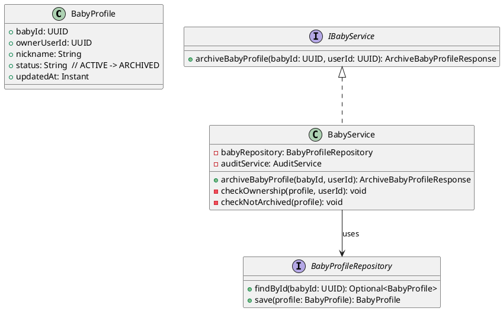
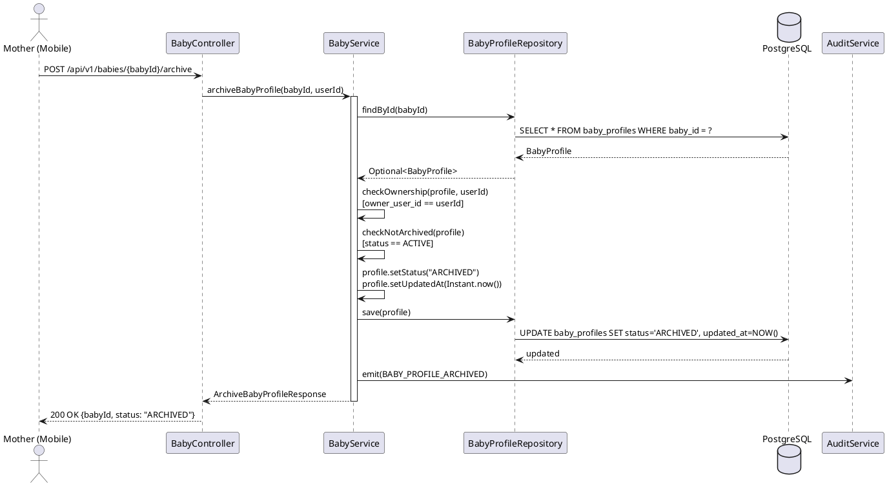
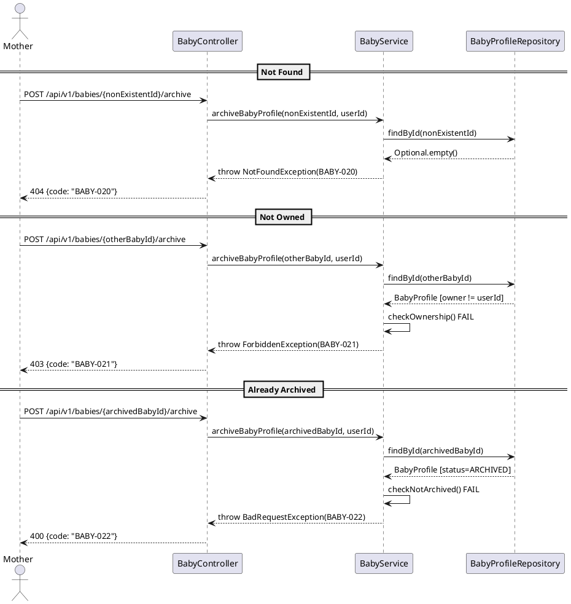
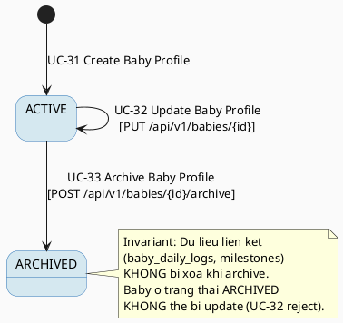

# ENGINEERING DOCUMENTATION STANDARD (EDS) v2.0
# Technical Design Specification — UC-33 Archive Baby Profile

| Field | Value |
|-------|-------|
| **Document ID** | `CB-BABY-IMP-003` |
| **Version** | `1.0` |
| **Date** | `2026-06-26` |
| **Status** | `Draft` |
| **Document Owner** | `PhuongNT` |
| **Author** | `AI Agent` |
| **Reviewed by** | `[Tech Lead]` |
| **DPO Sign-off** | `[ ] Pending` |
| **Approved by** | `[Principal Architect]` |
| **Last Review** | `2026-06-26` |
| **Based on EDS** | `v2.0` |

---

## CHANGELOG

| Ngay | Nguoi thuc hien | Noi dung thay doi |
|------|-----------------|-------------------|
| 2026-06-26 | AI Agent | Tao tai lieu lan dau cho UC-33 Archive Baby Profile |

---

## MUC LUC

1. [Tong quan Module](#1-tong-quan-module)
2. [Ma tran Truy vet](#2-ma-tran-truy-vet)
3. [Architecture Decision Records](#3-architecture-decision-records-adr)
4. [Non-Functional Requirements & SLA](#4-non-functional-requirements--sla)
5. [Static Modeling](#5-static-modeling)
6. [Dynamic Modeling](#6-dynamic-modeling)
7. [Domain Event Catalog](#7-domain-event-catalog)
8. [Interface Specification](#8-interface-specification)
9. [API Specification](#9-api-specification)
10. [Bang ma loi](#10-bang-ma-loi)
11. [Quy trinh Trien khai](#11-quy-trinh-trien-khai)
12. [Rollback & Incident Runbook](#12-rollback--incident-runbook)
13. [Kich ban Kiem thu](#13-kich-ban-kiem-thu)
14. [Phuong phap Xac minh](#14-phuong-phap-xac-minh)
15. [Mau thu thuc te](#15-mau-thu-thuc-te)
16. [Authorization Matrix](#16-bang-tong-hop-phan-quyen)
17. [AI Prompt Constraints](#17-ai-prompt-constraints-case-20)

---

## 1. Tong quan Module

| Field | Value |
|-------|-------|
| **Module Name** | `ArchiveBabyProfile` |
| **Bounded Context** | `carejourney` (baby care sub-domain) |
| **UC ID** | `UC-33` |
| **SRS Reference** | `3.3.1.10` |
| **Primary Actor** | `Mother (authenticated)` |
| **Platform** | `Mobile App` |
| **Data Classification** | `Sensitive-PII` |
| **Compliance Scope** | `BR-RBAC, BR-PRIVACY, PDPA` |
| **Upstream Dependencies** | `auth (JWT), UC-31 (baby_profiles table)` |
| **Downstream Consumers** | `UC-32 (blocks update on archived), baby daily log, audit` |

**Mo ta:** Cho phep Mother an hoac luu tru (archive) ho so em be khong con duoc theo doi tich cuc ma KHONG xoa du lieu lien ket. Archive la chuyen trang thai tu ACTIVE sang ARCHIVED. Du lieu trong baby_daily_logs, development_milestones, growth_measurements van duoc giu nguyen trong DB (soft archive).

---

## 2. Ma tran Truy vet

| Requirement ID | Loai | Mo ta yeu cau | Thanh phan Code | Compliance Target | ADR lien quan |
|----------------|------|---------------|-----------------|-------------------|---------------|
| UC-33 | Use Case | Mother archive ho so em be | `BabyController.archiveBabyProfile()` | BR-RBAC | ADR-BABY-005 |
| BR-BABY-020 | Business Rule | Baby phai ton tai | `BabyService.findById()` | Data Integrity | — |
| BR-BABY-021 | Business Rule | owner_user_id phai match JWT userId | `BabyService.checkOwnership()` | BR-RBAC, PDPA | — |
| BR-BABY-022 | Business Rule | Baby phai ACTIVE (da ARCHIVED thi reject) | `BabyService.checkNotArchived()` | Data Integrity | ADR-BABY-005 |
| BR-BABY-023 | Business Rule | Chi set status = ARCHIVED, KHONG xoa data | `BabyService.archiveBabyProfile()` | PDPA, Data Retention | ADR-BABY-005 |
| BR-BABY-024 | Business Rule | Du lieu lien ket (logs, milestones) van giu nguyen | No cascading delete | PDPA | ADR-BABY-005 |
| BR-BABY-025 | Business Rule | Ghi audit event BABY_PROFILE_ARCHIVED | `AuditService.emit()` | PDPA | — |

---

## 3. Architecture Decision Records (ADR)

### ADR-BABY-005 — POST (not DELETE) for archive operation

| Field | Value |
|-------|-------|
| **Status** | `Accepted` |
| **Date** | `2026-06-26` |

#### Boi canh (Context)
Archive baby profile la mot state transition (ACTIVE -> ARCHIVED), KHONG phai xoa du lieu. Can chon HTTP method phu hop.

#### Cac phuong an da xem xet

| Phuong an | Mo ta | Uu diem | Nhuoc diem |
|-----------|-------|---------|------------|
| A | DELETE /api/v1/babies/{babyId} | RESTful for removal | Misleading — data is not deleted |
| B | PATCH /api/v1/babies/{babyId} with {status: "ARCHIVED"} | Standard REST update | Allows arbitrary status changes |
| C | POST /api/v1/babies/{babyId}/archive | Clear intent, dedicated action | Non-standard REST |

#### Quyet dinh
Chon **Phuong an C** — `POST /api/v1/babies/{babyId}/archive`. Ly do:
1. Archive la mot domain action, khong phai generic update.
2. POST phan anh dung semantic: tao mot "archive action" cho baby.
3. Ngan chan viec client tu y set status qua PATCH.

#### He qua
**Tich cuc:** Clear API contract, khong nham lan voi delete.
**Tieu cuc:** Non-standard REST — can document ro.

### ADR-BABY-006 — No cascading delete on archive

| Field | Value |
|-------|-------|
| **Status** | `Accepted` |
| **Date** | `2026-06-26` |

#### Quyet dinh
Khi archive baby profile:
- Chi SET `status = 'ARCHIVED'` va `updated_at = NOW()`
- KHONG DELETE bat ky record nao trong baby_daily_logs, development_milestones, growth_measurements
- Du lieu lien ket van co the duoc truy van (read-only) sau khi archive
- Day la "soft archive" — du lieu van ton tai de phuc vu lich su va bao cao

---

## 4. Non-Functional Requirements & SLA

### 4.1. Performance & Availability

| Category | Requirement | Target SLA |
|----------|-------------|------------|
| Latency | API response (p99) | `< 300ms` |
| Availability | Uptime | `99.9%` |

### 4.2. Security

| Category | Requirement | Target |
|----------|-------------|--------|
| Access control | Ownership check | owner_user_id == JWT userId |
| Data preservation | No data deletion | Soft archive only |

---

## 5. Static Modeling

### 5.1. Class Diagram



### 5.2. Data Structure

No new migration required. UC-33 operates on the existing `baby_profiles` table. Only updates the `status` column from `'ACTIVE'` to `'ARCHIVED'`.

---

## 6. Dynamic Modeling

### 6.1. Sequence Diagram — Happy Path



### 6.2. Sequence Diagram — Error Paths



### 6.3. State Machine



**Invariant bat bien:**
- ARCHIVED -> ACTIVE transition hien tai KHONG duoc ho tro (no unarchive UC)
- ARCHIVED baby KHONG the bi update (UC-32 reject voi BABY-012)
- Du lieu lien ket van ton tai sau archive

---

## 7. Domain Event Catalog

### 7.1. Events Published

| Event Name | Trigger | Publisher | Subscriber(s) | Async? |
|------------|---------|-----------|---------------|--------|
| `BABY_PROFILE_ARCHIVED` | Profile status set to ARCHIVED | `BabyService` | `AuditService` | No |

### 7.3. Payload Schema

```java
public record BabyProfileArchivedEvent(
    UUID    eventId,
    String  eventType,   // "BABY_PROFILE_ARCHIVED"
    Instant occurredAt,
    String  version,     // "1.0"
    Payload payload,
    Metadata metadata
) {
    public record Payload(
        UUID   babyId,
        UUID   ownerUserId,
        String previousStatus,  // "ACTIVE"
        String newStatus        // "ARCHIVED"
    ) {}

    public record Metadata(UUID correlationId, String causedBy) {}
}
```

---

## 8. Interface Specification

```java
// ArchiveBabyProfileResponse.java
// @version 1.0
public class ArchiveBabyProfileResponse {
    private UUID babyId;
    private String status;      // "ARCHIVED"
    private Instant archivedAt; // updated_at timestamp
}

// IBabyService.java (extended)
// @version 1.0
public interface IBabyService {
    /**
     * Archives a baby profile (sets status to ARCHIVED).
     * Does NOT delete any linked data (baby_daily_logs, milestones, measurements).
     * @throws NotFoundException (BABY-020) when baby not found
     * @throws ForbiddenException (BABY-021) when baby not owned by userId
     * @throws BadRequestException (BABY-022) when baby is already ARCHIVED
     */
    ArchiveBabyProfileResponse archiveBabyProfile(UUID babyId, UUID userId);
}
```

Note: No request body DTO needed. The archive action requires only the babyId (path param) and userId (from JWT).

### 8.2. Repository Interface

```java
// BabyProfileRepository.java (existing — no new methods needed)
public interface BabyProfileRepository extends JpaRepository<BabyProfile, UUID> {
    Optional<BabyProfile> findById(UUID babyId);
    // save() inherited from JpaRepository
}
```

---

## 9. API Specification

### 9.1. Endpoints Table

| Method | Path | Auth Level | Required Roles | Rate Limit | Idempotent? |
|--------|------|------------|----------------|------------|-------------|
| `POST` | `/api/v1/babies/{babyId}/archive` | JWT Bearer | `ROLE_MOTHER` | 10/min | No |

### 9.2. Request / Response Schemas

#### `POST /api/v1/babies/{babyId}/archive` — Archive baby profile

**Path Parameters:**
| Param | Type | Required | Description |
|-------|------|----------|-------------|
| `babyId` | UUID | Yes | ID of the baby profile to archive |

**Request Body:** None (empty body)

**Response — 200 OK (Happy Path):**
```json
{
  "success": true,
  "data": {
    "babyId": "bbbbbbbb-0000-0000-0000-000000000001",
    "status": "ARCHIVED",
    "archivedAt": "2026-06-26T12:00:00.000Z"
  }
}
```

**Response — 404 Not Found:**
```json
{
  "success": false,
  "error": {
    "code": "BABY-020",
    "message": "Baby profile not found"
  }
}
```

**Response — 403 Forbidden:**
```json
{
  "success": false,
  "error": {
    "code": "BABY-021",
    "message": "You do not own this baby profile"
  }
}
```

**Response — 400 Bad Request (Already Archived):**
```json
{
  "success": false,
  "error": {
    "code": "BABY-022",
    "message": "Baby profile is already archived"
  }
}
```

---

## 10. Bang ma loi

| Code | HTTP Status | Message (EN) | Message (VI) | Trigger Condition |
|------|-------------|--------------|--------------|-------------------|
| `BABY-020` | 404 | Baby profile not found | Khong tim thay ho so em be | babyId does not exist |
| `BABY-021` | 403 | You do not own this baby profile | Ban khong so huu ho so em be nay | owner_user_id != JWT userId |
| `BABY-022` | 400 | Baby profile is already archived | Ho so em be da duoc luu tru | baby_profiles.status = 'ARCHIVED' |

---

## 11. Quy trinh Trien khai

### 11.3. Implementation Steps

1. `ArchiveBabyProfileResponse` DTO
2. `BabyService.archiveBabyProfile()` with ownership + not-archived checks
3. `BabyController.POST /api/v1/babies/{babyId}/archive` endpoint
4. Emit `BABY_PROFILE_ARCHIVED` audit event

No Flyway migration needed — operates on existing `baby_profiles` table, only updates `status` column.

---

## 12. Rollback & Incident Runbook

### 12.1. Trigger Conditions

| Dieu kien | Nguong | Nguoi quyet dinh |
|-----------|--------|------------------|
| Error rate tang dot bien | > 5% trong 5 phut | On-call Engineer |
| Data accidentally deleted | Bat ky case nao | Tech Lead + DPO |
| Ownership check bypass | Bat ky case nao | Tech Lead |

### 12.2. Rollback Procedure

```bash
# No migration to revert. Revert code only:
git checkout -- src/main/java/com/carebridge/backend/carejourney/controller/BabyController.java
git checkout -- src/main/java/com/carebridge/backend/carejourney/service/BabyService.java
git checkout -- src/main/java/com/carebridge/backend/carejourney/dto/ArchiveBabyProfileResponse.java

# If baby was incorrectly archived, restore status manually:
psql -h $DB_HOST -U $DB_USER -d $DB_NAME \
  -c "UPDATE baby_profiles SET status = 'ACTIVE', updated_at = NOW() WHERE baby_id = '[uuid]';"
```

---

## 13. Kich ban Kiem thu

```gherkin
Feature: Archive Baby Profile
  Background:
    Given test data classification: SYNTHETIC

  Scenario: Happy path — archive active baby profile
    Given Mother authenticated with JWT
    And baby profile exists with status ACTIVE and owner = Mother
    When POST /api/v1/babies/{babyId}/archive
    Then 200 response with status "ARCHIVED"
    And database baby_profiles row has status = "ARCHIVED"
    And baby_daily_logs rows for this baby still exist
    And audit event BABY_PROFILE_ARCHIVED emitted

  Scenario: Baby not found -> 404
    When POST /api/v1/babies/{nonExistentId}/archive
    Then 404 with error code BABY-020

  Scenario: Baby not owned -> 403
    Given baby profile owned by another Mother
    When POST /api/v1/babies/{babyId}/archive
    Then 403 with error code BABY-021

  Scenario: Baby already archived -> 400
    Given baby profile with status ARCHIVED
    When POST /api/v1/babies/{babyId}/archive
    Then 400 with error code BABY-022

  Scenario: No JWT -> 401
    When POST /api/v1/babies/{babyId}/archive without Authorization header
    Then 401 Unauthorized
```

---

## 14. Phuong phap Xac minh

```sql
-- Verify status changed to ARCHIVED
SELECT baby_id, status, updated_at
FROM baby_profiles
WHERE baby_id = '[uuid]';
-- Expected: status = 'ARCHIVED'

-- Verify linked baby_daily_logs NOT deleted
SELECT COUNT(*) FROM baby_daily_logs WHERE baby_id = '[uuid]';
-- Expected: count >= 0 (rows preserved, not deleted)

-- Verify no cascading deletes occurred
SELECT baby_id, log_type, created_at FROM baby_daily_logs
WHERE baby_id = '[uuid]' ORDER BY created_at;
-- Expected: all pre-existing rows still present
```

---

## 15. Mau thu thuc te

### 15.1. Happy Path

```bash
curl -X POST https://[host]/api/v1/babies/bbbbbbbb-0000-0000-0000-000000000001/archive \
  -H "Authorization: Bearer [JWT_MOTHER_TOKEN]"
# Expected: 200 {status: "ARCHIVED"}
```

### 15.2. Error Paths

```bash
# Already archived -> 400
curl -X POST https://[host]/api/v1/babies/bbbbbbbb-0000-0000-0000-000000000001/archive \
  -H "Authorization: Bearer [JWT_MOTHER_TOKEN]"
# Expected: 400 BABY-022

# No JWT -> 401
curl -X POST https://[host]/api/v1/babies/bbbbbbbb-0000-0000-0000-000000000001/archive
# Expected: 401
```

---

## 16. Bang tong hop phan quyen

| Endpoint | `GUEST` | `MOTHER` | `EXPERT` | `ADMIN` |
|----------|---------|----------|----------|---------|
| `POST /api/v1/babies/{babyId}/archive` | --- | Own only | --- | All |

**Chu thich:**
- Own only = chi archive baby profile co owner_user_id == JWT userId
- `---` = 403 Forbidden

---

## 17. AI Prompt Constraints (CASE 2.0)

### 17.1 Constraint Summary Table

| # | Constraint | Source | Last Verified |
|---|-----------|--------|---------------|
| C1 | Ownership check: owner_user_id PHAI match JWT userId truoc khi archive | BR-RBAC, PDPA | 2026-06-26 |
| C2 | Chi SET status = ARCHIVED — KHONG DELETE bat ky record nao | ADR-BABY-005, ADR-BABY-006 | 2026-06-26 |
| C3 | Du lieu lien ket (baby_daily_logs, milestones, measurements) PHAI duoc giu nguyen | ADR-BABY-006, PDPA | 2026-06-26 |
| C4 | Emit BABY_PROFILE_ARCHIVED audit event sau archive thanh cong | BR-BABY-025, PDPA | 2026-06-26 |
| C5 | Already ARCHIVED -> reject voi BABY-022, KHONG idempotent | BR-BABY-022 | 2026-06-26 |

### 17.2 Constraint Injection Block

```
[CONSTRAINT BLOCK — Module: ArchiveBabyProfile (CB-BABY-IMP-003)]
Theo TDS CB-BABY-IMP-003 va cac ADR lien quan:

1. Ownership check: owner_user_id PHAI match JWT userId (SecurityUtils.requireCurrentUserId) — BABY-021 neu vi pham — BR-RBAC
2. Chi SET status = 'ARCHIVED' — KHONG DELETE bat ky record nao trong DB — ADR-BABY-005
3. Du lieu lien ket (baby_daily_logs, development_milestones, growth_measurements) PHAI duoc giu nguyen sau archive — ADR-BABY-006
4. Emit BABY_PROFILE_ARCHIVED audit event sau moi archive thanh cong — PDPA
5. Baby da ARCHIVED thi reject voi BABY-022 (400) — KHONG idempotent — BR-BABY-022

[CONTEXT BLOCK]
- Bounded Context: carejourney (baby)
- Data Classification: Sensitive-PII
- Package: com.carebridge.backend.carejourney
- Common: ApiResponse<T>, SecurityUtils.requireCurrentUserId(principal), AuditService.emit()
- Error codes: S10 Error Codes Table
- Auth matrix: S16 Authorization Matrix
- HTTP Method: POST (not DELETE) — archive is state transition, not deletion — ADR-BABY-005
```

### 17.3 Constraint Quality Checklist

- [x] Moi constraint traceable ve ADR hoac BR cu the
- [x] Khong co constraint generic
- [x] Constraint block co >= 3 constraints cu the
- [x] Constraint block reference S8 Interface
- [x] Constraint block reference S16 Auth Matrix

### 17.4 Anti-Pattern Detection

| AP-ID | Anti-Pattern | Dau hieu | Hanh dong |
|-------|-------------|----------|----------|
| AP-AI-001 | Unconstrained Gen | Code khong match constraint C1-C5 | Reject — inject lai constraints |
| AP-AI-003 | Implicit Decision | Code dung DELETE thay vi SET status | Reject — review ADR-BABY-005 |
| AP-AI-005 | Hallucinated Contract | Code import service/type khong co trong S8 | Reject — verify contract |

---

## PHU LUC

### A. Glossary

| Thuat ngu | Dinh nghia |
|-----------|------------|
| Archive | Chuyen trang thai tu ACTIVE sang ARCHIVED — du lieu van ton tai |
| Soft Archive | Chi thay doi status, khong xoa bat ky record nao |
| Cascading Delete | Xoa du lieu lien ket khi xoa record cha — KHONG ap dung o day |
| Linked Data | baby_daily_logs, development_milestones, growth_measurements |

### B. Tai lieu tham chieu

| Document | Path |
|----------|------|
| EDS v2.0 Template | `08_References/Template/PHASE-3_TDS.md` |
| UC-31 TDS (Create Baby Profile) | `04_Implement/UC31_CreateBabyProfile/UC31_CreateBabyProfile_TDS.md` |
| UC-32 TDS (Update Baby Profile) | `04_Implement/UC32_UpdateBabyProfile/UC32_UpdateBabyProfile_TDS.md` |

---

*EDS v2.1 — Tich hop CASE 2.0 AI Prompt Constraints (S17).*
