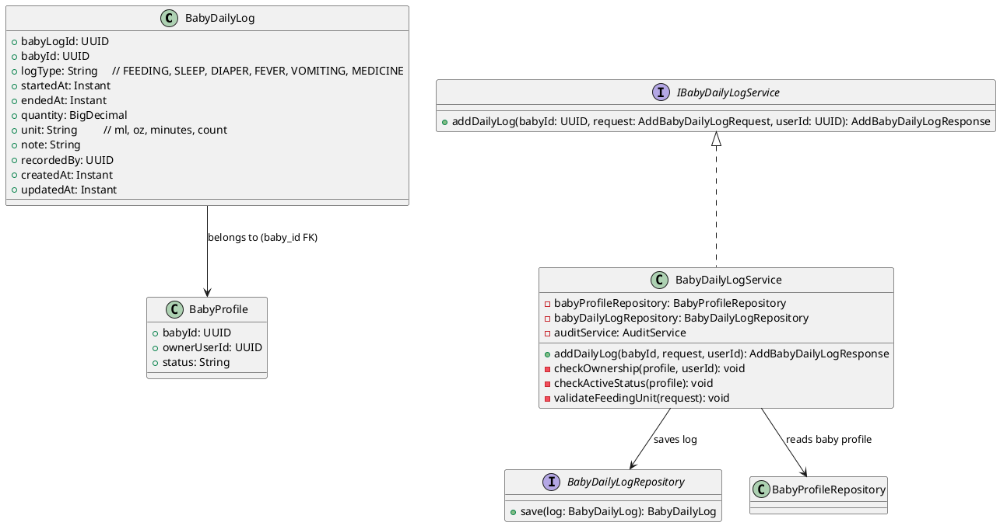
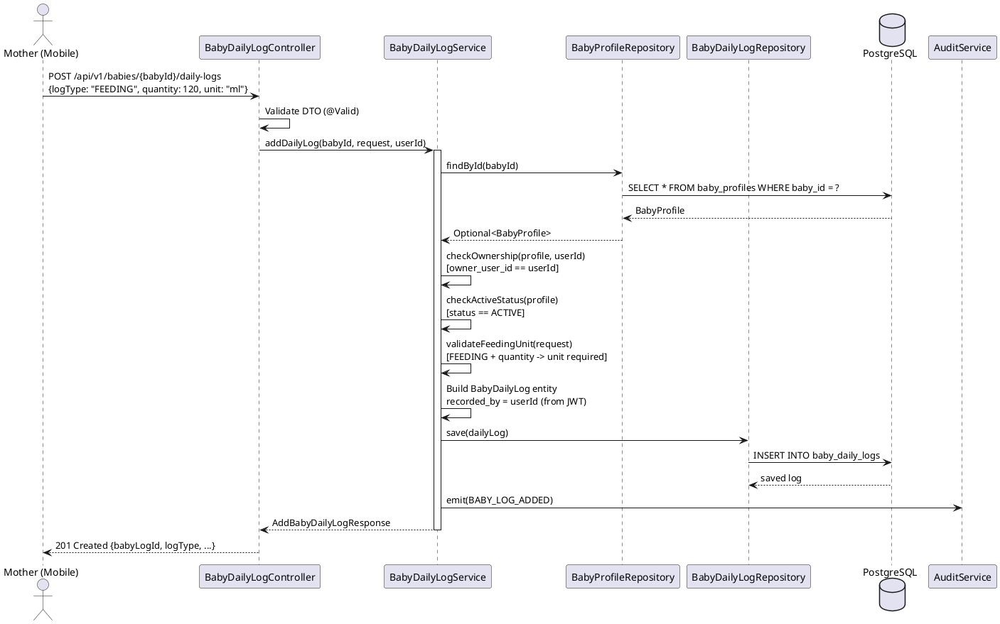
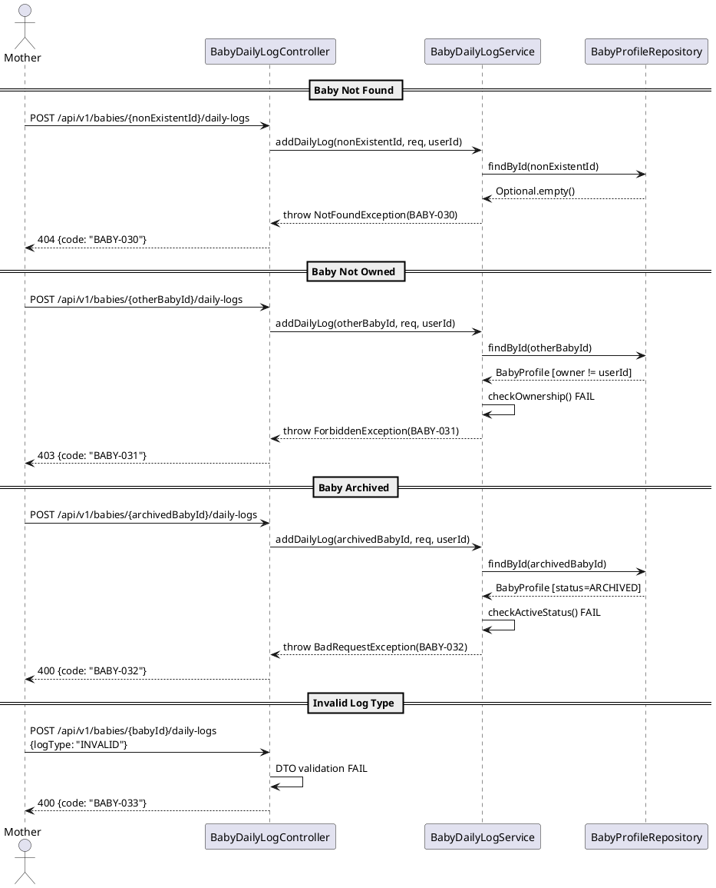

# ENGINEERING DOCUMENTATION STANDARD (EDS) v2.0
# Technical Design Specification — UC-34 Add Feeding Sleep Diaper Log

| Field | Value |
|-------|-------|
| **Document ID** | `CB-BABY-IMP-004` |
| **Version** | `1.0` |
| **Date** | `2026-06-26` |
| **Status** | `Draft` |
| **Document Owner** | `PhuongNT` |
| **Author** | `AI Agent` |
| **Reviewed by** | `[Tech Lead]` |
| **DPO Sign-off** | `[ ] Pending` |
| **Approved by** | `[Principal Architect]` |
| **Last Review** | `2026-06-26` |
| **Based on EDS** | `v2.0` |

---

## CHANGELOG

| Ngay | Nguoi thuc hien | Noi dung thay doi |
|------|-----------------|-------------------|
| 2026-06-26 | AI Agent | Tao tai lieu lan dau cho UC-34 Add Feeding Sleep Diaper Log |

---

## MUC LUC

1. [Tong quan Module](#1-tong-quan-module)
2. [Ma tran Truy vet](#2-ma-tran-truy-vet)
3. [Architecture Decision Records](#3-architecture-decision-records-adr)
4. [Non-Functional Requirements & SLA](#4-non-functional-requirements--sla)
5. [Static Modeling](#5-static-modeling)
6. [Dynamic Modeling](#6-dynamic-modeling)
7. [Domain Event Catalog](#7-domain-event-catalog)
8. [Interface Specification](#8-interface-specification)
9. [API Specification](#9-api-specification)
10. [Bang ma loi](#10-bang-ma-loi)
11. [Quy trinh Trien khai](#11-quy-trinh-trien-khai)
12. [Rollback & Incident Runbook](#12-rollback--incident-runbook)
13. [Kich ban Kiem thu](#13-kich-ban-kiem-thu)
14. [Phuong phap Xac minh](#14-phuong-phap-xac-minh)
15. [Mau thu thuc te](#15-mau-thu-thuc-te)
16. [Authorization Matrix](#16-bang-tong-hop-phan-quyen)
17. [AI Prompt Constraints](#17-ai-prompt-constraints-case-20)

---

## 1. Tong quan Module

| Field | Value |
|-------|-------|
| **Module Name** | `AddFeedingSleepDiaperLog` |
| **Bounded Context** | `carejourney` (baby care sub-domain) |
| **UC ID** | `UC-34` |
| **SRS Reference** | `3.3.1.11` |
| **Primary Actor** | `Mother (authenticated)` |
| **Platform** | `Mobile App` |
| **Data Classification** | `PII` |
| **Compliance Scope** | `BR-RBAC, BR-PRIVACY, PDPA` |
| **Upstream Dependencies** | `auth (JWT), UC-31 (baby_profiles table)` |
| **Downstream Consumers** | `growth tracking, health summary, audit` |

**Mo ta:** Cho phep Mother ghi nhanh cac hoat dong hang ngay cua em be: cho an (FEEDING), ngu (SLEEP), thay ta (DIAPER), sot (FEVER), non (VOMITING), hoac uong thuoc (MEDICINE). Thiet ke "quick-entry" — chi yeu cau log_type + baby_id; cac truong khac la optional de ghi nhanh. Mot em be co the co nhieu log cung ngay, cung loai.

---

## 2. Ma tran Truy vet

| Requirement ID | Loai | Mo ta yeu cau | Thanh phan Code | Compliance Target | ADR lien quan |
|----------------|------|---------------|-----------------|-------------------|---------------|
| UC-34 | Use Case | Mother ghi nhanh hoat dong hang ngay | `BabyDailyLogController.addDailyLog()` | BR-RBAC | ADR-BABY-007 |
| BR-BABY-030 | Business Rule | Baby phai ton tai | `BabyDailyLogService.findBaby()` | Data Integrity | — |
| BR-BABY-031 | Business Rule | Baby phai thuoc ve Mother (ownership via baby_profiles) | `BabyDailyLogService.checkOwnership()` | BR-RBAC, PDPA | — |
| BR-BABY-032 | Business Rule | Baby phai ACTIVE (khong duoc ARCHIVED) | `BabyDailyLogService.checkActiveStatus()` | Data Integrity | — |
| BR-BABY-033 | Business Rule | log_type phai thuoc enum hop le | DTO validation | Data Integrity | — |
| BR-BABY-034 | Business Rule | recorded_by = JWT userId (khong tu request body) | `BabyDailyLogService.addDailyLog()` | BR-RBAC | ADR-BABY-008 |
| BR-BABY-035 | Business Rule | Nhieu log cung ngay, cung loai duoc phep | No unique constraint | Data Integrity | ADR-BABY-007 |
| BR-BABY-036 | Business Rule | FEEDING: unit required khi quantity co gia tri | Validation logic | Data Integrity | — |
| BR-BABY-037 | Business Rule | Ghi audit event BABY_LOG_ADDED | `AuditService.emit()` | PDPA | — |

---

## 3. Architecture Decision Records (ADR)

### ADR-BABY-007 — Quick-entry design: minimal required fields per log_type

| Field | Value |
|-------|-------|
| **Status** | `Accepted` |
| **Date** | `2026-06-26` |

#### Boi canh (Context)
Mother can ghi nhanh hoat dong cua em be trong ngay. Viec bat buoc nhieu field se lam cham qua trinh ghi chep va giam trai nghiem su dung tren mobile.

#### Cac phuong an da xem xet

| Phuong an | Mo ta | Uu diem | Nhuoc diem |
|-----------|-------|---------|------------|
| A | Bat buoc tat ca fields theo tung log_type | Du lieu day du | UX kem, cham |
| B | Chi bat buoc log_type + baby_id, con lai optional | Nhanh, flexible | Du lieu co the khong day du |

#### Quyet dinh
Chon **Phuong an B** — Quick-entry design. Chi bat buoc `log_type` (va `baby_id` tu path). Cac truong `started_at`, `ended_at`, `quantity`, `unit`, `note` deu la optional.

**Ngoai le:** Khi `quantity` duoc cung cap cho FEEDING, truong `unit` cung PHAI duoc cung cap (ml hoac oz).

#### He qua
**Tich cuc:** Mother co the ghi log chi voi 1 tap — log_type.
**Tieu cuc:** Du lieu co the thieu chi tiet. Xu ly phia client de suggest nhung khong bat buoc.

### ADR-BABY-008 — recorded_by set from JWT, not request body

| Field | Value |
|-------|-------|
| **Status** | `Accepted` |
| **Date** | `2026-06-26` |

#### Quyet dinh
Truong `recorded_by` trong `baby_daily_logs` PHAI duoc set tu JWT userId (server-side). Client KHONG duoc gui `recorded_by` trong request body. Neu client gui, gia tri se bi bo qua (overwritten by server).

Ly do: Ngan chan viec gia mao nguoi ghi log (impersonation attack).

---

## 4. Non-Functional Requirements & SLA

### 4.1. Performance & Availability

| Category | Requirement | Target SLA |
|----------|-------------|------------|
| Latency | API response (p99) | `< 300ms` |
| Availability | Uptime | `99.9%` |
| Throughput | Quick entry support | Responsive on mobile network |

### 4.2. Security

| Category | Requirement | Target |
|----------|-------------|--------|
| Access control | Ownership via baby_profiles | owner_user_id == JWT userId |
| Data integrity | recorded_by = JWT userId | Server-side enforcement |

---

## 5. Static Modeling

### 5.1. Class Diagram



### 5.2. Data Structure

No new migration required. UC-34 operates on the existing `baby_daily_logs` table.

```sql
-- Existing table: baby_daily_logs
-- baby_log_id UUID PK
-- baby_id UUID NOT NULL (FK to baby_profiles)
-- log_type VARCHAR(30) NOT NULL — FEEDING, SLEEP, DIAPER, FEVER, VOMITING, MEDICINE
-- started_at TIMESTAMPTZ — optional
-- ended_at TIMESTAMPTZ — optional
-- quantity NUMERIC — optional
-- unit VARCHAR(20) — ml, oz, minutes, count (required when quantity provided for FEEDING)
-- note TEXT — optional
-- recorded_by UUID — set from JWT userId (server-side)
-- created_at TIMESTAMPTZ NOT NULL DEFAULT NOW()
-- updated_at TIMESTAMPTZ NOT NULL DEFAULT NOW()

-- No unique constraint on (baby_id, log_type, date) — multiple logs per day per type allowed
```

**Log type usage guide:**

| log_type | quantity meaning | unit examples | started_at/ended_at |
|----------|-----------------|---------------|---------------------|
| FEEDING | Amount consumed | ml, oz | Optional start time |
| SLEEP | Duration or n/a | minutes | start = sleep, end = wake |
| DIAPER | Count | count | Optional time |
| FEVER | Temperature | celsius | Time of measurement |
| VOMITING | Count or n/a | count | Time of occurrence |
| MEDICINE | Dosage | ml, mg | Time administered |

---

## 6. Dynamic Modeling

### 6.1. Sequence Diagram — Happy Path (FEEDING)



### 6.2. Sequence Diagram — Error Paths



---

## 7. Domain Event Catalog

### 7.1. Events Published

| Event Name | Trigger | Publisher | Subscriber(s) | Async? |
|------------|---------|-----------|---------------|--------|
| `BABY_LOG_ADDED` | Daily log saved | `BabyDailyLogService` | `AuditService` | No |

### 7.3. Payload Schema

```java
public record BabyLogAddedEvent(
    UUID    eventId,
    String  eventType,   // "BABY_LOG_ADDED"
    Instant occurredAt,
    String  version,     // "1.0"
    Payload payload,
    Metadata metadata
) {
    public record Payload(
        UUID   babyLogId,
        UUID   babyId,
        String logType,
        UUID   recordedBy
    ) {}

    public record Metadata(UUID correlationId, String causedBy) {}
}
```

---

## 8. Interface Specification

```java
// AddBabyDailyLogRequest.java
// @version 1.0
public class AddBabyDailyLogRequest {

    @NotNull
    @Pattern(regexp = "FEEDING|SLEEP|DIAPER|FEVER|VOMITING|MEDICINE",
             message = "log_type must be one of: FEEDING, SLEEP, DIAPER, FEVER, VOMITING, MEDICINE")
    private String logType;

    private Instant startedAt;          // optional

    private Instant endedAt;            // optional — for SLEEP windows

    @DecimalMin("0.00")
    private BigDecimal quantity;        // optional — ml/oz for FEEDING, temp for FEVER, etc.

    @Size(max = 20)
    private String unit;               // optional — required when quantity provided for FEEDING

    @Size(max = 2000)
    private String note;               // optional — free text

    // NOTE: recorded_by is NOT in the request DTO — set from JWT userId server-side
    // getters / setters
}

// AddBabyDailyLogResponse.java
public class AddBabyDailyLogResponse {
    private UUID babyLogId;
    private UUID babyId;
    private String logType;
    private Instant startedAt;
    private Instant endedAt;
    private BigDecimal quantity;
    private String unit;
    private String note;
    private UUID recordedBy;
    private Instant createdAt;
}

// IBabyDailyLogService.java
// @version 1.0
public interface IBabyDailyLogService {
    /**
     * Adds a daily log entry for a baby.
     * Baby must exist, be owned by userId, and be ACTIVE.
     * recorded_by is set from userId (JWT), not from request.
     *
     * @throws NotFoundException (BABY-030) when baby not found
     * @throws ForbiddenException (BABY-031) when baby not owned by userId
     * @throws BadRequestException (BABY-032) when baby is ARCHIVED
     * @throws BadRequestException (BABY-033) when log_type is invalid
     */
    AddBabyDailyLogResponse addDailyLog(UUID babyId, AddBabyDailyLogRequest request, UUID userId);
}
```

### 8.2. Repository Interface

```java
// BabyDailyLogRepository.java
// @version 1.0
public interface BabyDailyLogRepository extends JpaRepository<BabyDailyLog, UUID> {
    List<BabyDailyLog> findByBabyId(UUID babyId);
    // save() inherited from JpaRepository
}
```

---

## 9. API Specification

### 9.1. Endpoints Table

| Method | Path | Auth Level | Required Roles | Rate Limit | Idempotent? |
|--------|------|------------|----------------|------------|-------------|
| `POST` | `/api/v1/babies/{babyId}/daily-logs` | JWT Bearer | `ROLE_MOTHER` | 60/min | No |

### 9.2. Request / Response Schemas

#### `POST /api/v1/babies/{babyId}/daily-logs` — Add daily log

**Path Parameters:**
| Param | Type | Required | Description |
|-------|------|----------|-------------|
| `babyId` | UUID | Yes | ID of the baby to log for |

**Request Body (FEEDING example):**
```json
{
  "logType": "FEEDING",
  "quantity": 120,
  "unit": "ml",
  "note": "Breast milk"
}
```

**Request Body (SLEEP example):**
```json
{
  "logType": "SLEEP",
  "startedAt": "2026-06-26T13:00:00Z",
  "endedAt": "2026-06-26T15:30:00Z"
}
```

**Request Body (DIAPER minimal — quick entry):**
```json
{
  "logType": "DIAPER"
}
```

**Request Body (FEVER example):**
```json
{
  "logType": "FEVER",
  "quantity": 38.5,
  "unit": "celsius",
  "note": "Mild fever after vaccination"
}
```

**Response — 201 Created (Happy Path):**
```json
{
  "success": true,
  "data": {
    "babyLogId": "dddddddd-0000-0000-0000-000000000001",
    "babyId": "bbbbbbbb-0000-0000-0000-000000000001",
    "logType": "FEEDING",
    "startedAt": null,
    "endedAt": null,
    "quantity": 120,
    "unit": "ml",
    "note": "Breast milk",
    "recordedBy": "00000000-0000-0000-0000-000000000034",
    "createdAt": "2026-06-26T12:00:00.000Z"
  }
}
```

**Response — 404 Not Found:**
```json
{
  "success": false,
  "error": {
    "code": "BABY-030",
    "message": "Baby profile not found"
  }
}
```

**Response — 403 Forbidden:**
```json
{
  "success": false,
  "error": {
    "code": "BABY-031",
    "message": "You do not own this baby profile"
  }
}
```

**Response — 400 Bad Request (Archived):**
```json
{
  "success": false,
  "error": {
    "code": "BABY-032",
    "message": "Cannot add log for an archived baby"
  }
}
```

**Response — 400 Bad Request (Invalid log_type):**
```json
{
  "success": false,
  "error": {
    "code": "BABY-033",
    "message": "Invalid log type. Must be one of: FEEDING, SLEEP, DIAPER, FEVER, VOMITING, MEDICINE"
  }
}
```

---

## 10. Bang ma loi

| Code | HTTP Status | Message (EN) | Message (VI) | Trigger Condition |
|------|-------------|--------------|--------------|-------------------|
| `BABY-030` | 404 | Baby profile not found | Khong tim thay ho so em be | babyId does not exist in baby_profiles |
| `BABY-031` | 403 | You do not own this baby profile | Ban khong so huu ho so em be nay | owner_user_id != JWT userId |
| `BABY-032` | 400 | Cannot add log for an archived baby | Khong the ghi log cho em be da luu tru | baby_profiles.status = 'ARCHIVED' |
| `BABY-033` | 400 | Invalid log type | Loai log khong hop le | log_type not in enum {FEEDING, SLEEP, DIAPER, FEVER, VOMITING, MEDICINE} |

---

## 11. Quy trinh Trien khai

### 11.3. Implementation Steps

1. `AddBabyDailyLogRequest` DTO with validation annotations
2. `AddBabyDailyLogResponse` DTO
3. `BabyDailyLog` entity mapping to `baby_daily_logs` table
4. `BabyDailyLogRepository` extends JpaRepository
5. `BabyDailyLogService.addDailyLog()` with ownership + status + log_type validation
6. `BabyDailyLogController.POST /api/v1/babies/{babyId}/daily-logs` endpoint
7. Emit `BABY_LOG_ADDED` audit event

No new Flyway migration needed — `baby_daily_logs` table already exists.

---

## 12. Rollback & Incident Runbook

### 12.1. Trigger Conditions

| Dieu kien | Nguong | Nguoi quyet dinh |
|-----------|--------|------------------|
| Error rate tang dot bien | > 5% trong 5 phut | On-call Engineer |
| Ownership check bypass | Bat ky case nao | Tech Lead |
| recorded_by mismatch | Bat ky case nao | Tech Lead |

### 12.2. Rollback Procedure

```bash
# No migration to revert. Revert code only:
git checkout -- src/main/java/com/carebridge/backend/carejourney/controller/BabyDailyLogController.java
git checkout -- src/main/java/com/carebridge/backend/carejourney/service/BabyDailyLogService.java
git checkout -- src/main/java/com/carebridge/backend/carejourney/repository/BabyDailyLogRepository.java
git checkout -- src/main/java/com/carebridge/backend/carejourney/entity/BabyDailyLog.java
git checkout -- src/main/java/com/carebridge/backend/carejourney/dto/AddBabyDailyLogRequest.java
git checkout -- src/main/java/com/carebridge/backend/carejourney/dto/AddBabyDailyLogResponse.java

# If incorrect logs were created, clean up:
psql -h $DB_HOST -U $DB_USER -d $DB_NAME \
  -c "DELETE FROM baby_daily_logs WHERE created_at > '[deploy_timestamp]';"
```

---

## 13. Kich ban Kiem thu

```gherkin
Feature: Add Feeding Sleep Diaper Log
  Background:
    Given test data classification: SYNTHETIC

  Scenario: Happy path — FEEDING log with quantity and unit
    Given Mother authenticated with JWT
    And baby profile exists with status ACTIVE and owner = Mother
    When POST /api/v1/babies/{babyId}/daily-logs with {logType: "FEEDING", quantity: 120, unit: "ml"}
    Then 201 response with babyLogId
    And database baby_daily_logs contains new row
    And recorded_by = JWT userId (not from request body)
    And audit event BABY_LOG_ADDED emitted

  Scenario: SLEEP log with start/end times
    When POST with {logType: "SLEEP", startedAt: "...", endedAt: "..."}
    Then 201 response

  Scenario: DIAPER minimal (quick entry)
    When POST with {logType: "DIAPER"}
    Then 201 response (quantity and unit are optional)

  Scenario: FEVER log with temperature
    When POST with {logType: "FEVER", quantity: 38.5, unit: "celsius"}
    Then 201 response

  Scenario: Baby not found -> 404
    When POST /api/v1/babies/{nonExistentId}/daily-logs
    Then 404 with error code BABY-030

  Scenario: Baby not owned -> 403
    Given baby profile owned by another Mother
    When POST /api/v1/babies/{babyId}/daily-logs
    Then 403 with error code BABY-031

  Scenario: Baby archived -> 400
    Given baby profile with status ARCHIVED
    When POST /api/v1/babies/{babyId}/daily-logs
    Then 400 with error code BABY-032

  Scenario: Invalid log_type -> 400
    When POST with {logType: "INVALID"}
    Then 400 with error code BABY-033

  Scenario: No JWT -> 401
    When POST without Authorization header
    Then 401 Unauthorized
```

---

## 14. Phuong phap Xac minh

```sql
-- Verify daily log created
SELECT baby_log_id, baby_id, log_type, quantity, unit, recorded_by, created_at
FROM baby_daily_logs
WHERE baby_id = '[uuid]'
ORDER BY created_at DESC
LIMIT 5;

-- Verify recorded_by matches JWT userId (not client-supplied value)
SELECT recorded_by FROM baby_daily_logs
WHERE baby_log_id = '[log_uuid]';
-- Expected: matches JWT userId

-- Verify multiple logs per day per type allowed
SELECT COUNT(*) FROM baby_daily_logs
WHERE baby_id = '[uuid]' AND log_type = 'FEEDING'
AND DATE(created_at) = CURRENT_DATE;
-- Expected: >= 1 (no unique constraint)
```

---

## 15. Mau thu thuc te

### 15.1. Happy Path — FEEDING

```bash
curl -X POST https://[host]/api/v1/babies/bbbbbbbb-0000-0000-0000-000000000001/daily-logs \
  -H "Authorization: Bearer [JWT_MOTHER_TOKEN]" \
  -H "Content-Type: application/json" \
  -d '{"logType":"FEEDING","quantity":120,"unit":"ml","note":"Breast milk"}'
# Expected: 201
```

### 15.2. Quick Entry — DIAPER (minimal)

```bash
curl -X POST https://[host]/api/v1/babies/bbbbbbbb-0000-0000-0000-000000000001/daily-logs \
  -H "Authorization: Bearer [JWT_MOTHER_TOKEN]" \
  -H "Content-Type: application/json" \
  -d '{"logType":"DIAPER"}'
# Expected: 201
```

### 15.3. Error Paths

```bash
# Invalid log_type -> 400
curl -X POST https://[host]/api/v1/babies/bbbbbbbb-0000-0000-0000-000000000001/daily-logs \
  -H "Authorization: Bearer [JWT_MOTHER_TOKEN]" \
  -H "Content-Type: application/json" \
  -d '{"logType":"INVALID"}'
# Expected: 400 BABY-033

# No JWT -> 401
curl -X POST https://[host]/api/v1/babies/bbbbbbbb-0000-0000-0000-000000000001/daily-logs \
  -H "Content-Type: application/json" \
  -d '{"logType":"FEEDING"}'
# Expected: 401
```

---

## 16. Bang tong hop phan quyen

| Endpoint | `GUEST` | `MOTHER` | `EXPERT` | `ADMIN` |
|----------|---------|----------|----------|---------|
| `POST /api/v1/babies/{babyId}/daily-logs` | --- | Own only | --- | All |

**Chu thich:**
- Own only = chi ghi log cho baby profile co owner_user_id == JWT userId (checked via baby_profiles)
- `---` = 403 Forbidden

---

## 17. AI Prompt Constraints (CASE 2.0)

### 17.1 Constraint Summary Table

| # | Constraint | Source | Last Verified |
|---|-----------|--------|---------------|
| C1 | Ownership check via baby_profiles: owner_user_id PHAI match JWT userId truoc khi add log | BR-RBAC, PDPA | 2026-06-26 |
| C2 | Baby ACTIVE check: reject log cho baby co status ARCHIVED voi BABY-032 | BR-BABY-032 | 2026-06-26 |
| C3 | recorded_by = JWT userId — KHONG lay tu request body, server-side set | ADR-BABY-008, BR-BABY-034 | 2026-06-26 |
| C4 | Emit BABY_LOG_ADDED audit event sau save thanh cong | BR-BABY-037, PDPA | 2026-06-26 |
| C5 | log_type PHAI thuoc enum {FEEDING, SLEEP, DIAPER, FEVER, VOMITING, MEDICINE} | BR-BABY-033 | 2026-06-26 |
| C6 | FEEDING + quantity provided -> unit PHAI duoc cung cap | BR-BABY-036 | 2026-06-26 |

### 17.2 Constraint Injection Block

```
[CONSTRAINT BLOCK — Module: AddFeedingSleepDiaperLog (CB-BABY-IMP-004)]
Theo TDS CB-BABY-IMP-004 va cac ADR lien quan:

1. Ownership check via baby_profiles: owner_user_id PHAI match JWT userId (SecurityUtils.requireCurrentUserId) — BABY-031 neu vi pham — BR-RBAC
2. Baby ACTIVE check: reject log cho baby co status = ARCHIVED — tra ve BABY-032 — BR-BABY-032
3. recorded_by = JWT userId (server-side) — KHONG lay tu request body — ngan chan impersonation — ADR-BABY-008
4. Emit BABY_LOG_ADDED audit event sau moi log thanh cong — PDPA
5. log_type enum: FEEDING, SLEEP, DIAPER, FEVER, VOMITING, MEDICINE — BABY-033 cho gia tri khong hop le — BR-BABY-033
6. FEEDING: khi quantity co gia tri, unit PHAI duoc cung cap (ml hoac oz) — BR-BABY-036

[CONTEXT BLOCK]
- Bounded Context: carejourney (baby)
- Data Classification: PII
- Package: com.carebridge.backend.carejourney
- Common: ApiResponse<T>, SecurityUtils.requireCurrentUserId(principal), AuditService.emit()
- Quick-entry design: chi bat buoc log_type, con lai optional — ADR-BABY-007
- Multiple logs per day per type allowed — no unique constraint — ADR-BABY-007
- Error codes: S10 Error Codes Table
- Auth matrix: S16 Authorization Matrix
```

### 17.3 Constraint Quality Checklist

- [x] Moi constraint traceable ve ADR hoac BR cu the
- [x] Khong co constraint generic
- [x] Constraint block co >= 3 constraints cu the (co 6)
- [x] Constraint block reference S8 Interface
- [x] Constraint block reference S16 Auth Matrix

### 17.4 Anti-Pattern Detection

| AP-ID | Anti-Pattern | Dau hieu | Hanh dong |
|-------|-------------|----------|----------|
| AP-AI-001 | Unconstrained Gen | Code khong match constraint C1-C6 | Reject — inject lai constraints |
| AP-AI-003 | Implicit Decision | Code accept recorded_by tu request body | Reject — review ADR-BABY-008 |
| AP-AI-005 | Hallucinated Contract | Code import service/type khong co trong S8 | Reject — verify contract |

---

## PHU LUC

### A. Glossary

| Thuat ngu | Dinh nghia |
|-----------|------------|
| BabyDailyLog | Ban ghi hoat dong hang ngay cua em be (cho an, ngu, thay ta, sot, non, uong thuoc) |
| Quick-entry | Thiet ke ghi nhanh — chi bat buoc log_type, con lai optional |
| recorded_by | UUID cua nguoi ghi log — lay tu JWT, khong tu request body |
| Log Type | Enum: FEEDING, SLEEP, DIAPER, FEVER, VOMITING, MEDICINE |

### B. Tai lieu tham chieu

| Document | Path |
|----------|------|
| EDS v2.0 Template | `08_References/Template/PHASE-3_TDS.md` |
| UC-31 TDS (Create Baby Profile) | `04_Implement/UC31_CreateBabyProfile/UC31_CreateBabyProfile_TDS.md` |
| UC-33 TDS (Archive Baby Profile) | `04_Implement/UC33_ArchiveBabyProfile/UC33_ArchiveBabyProfile_TDS.md` |

---

*EDS v2.1 — Tich hop CASE 2.0 AI Prompt Constraints (S17).*
