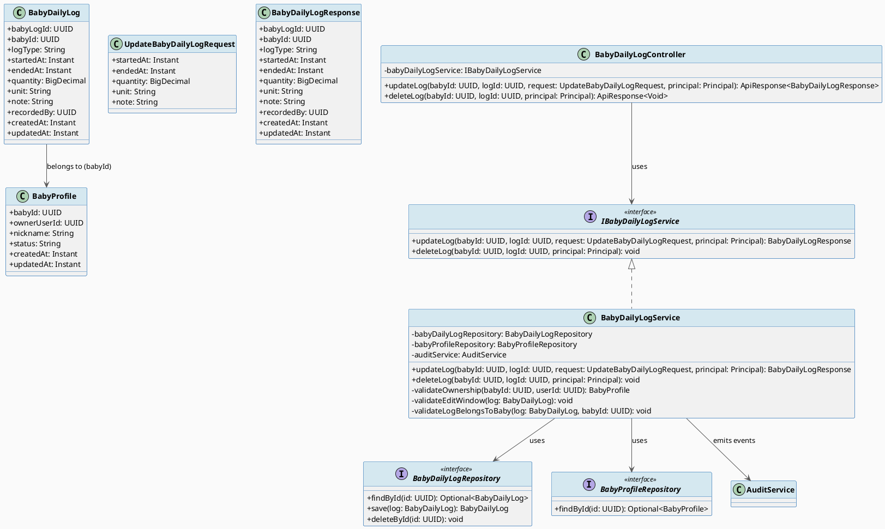
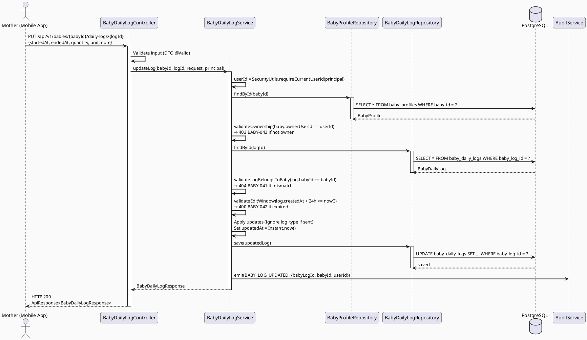
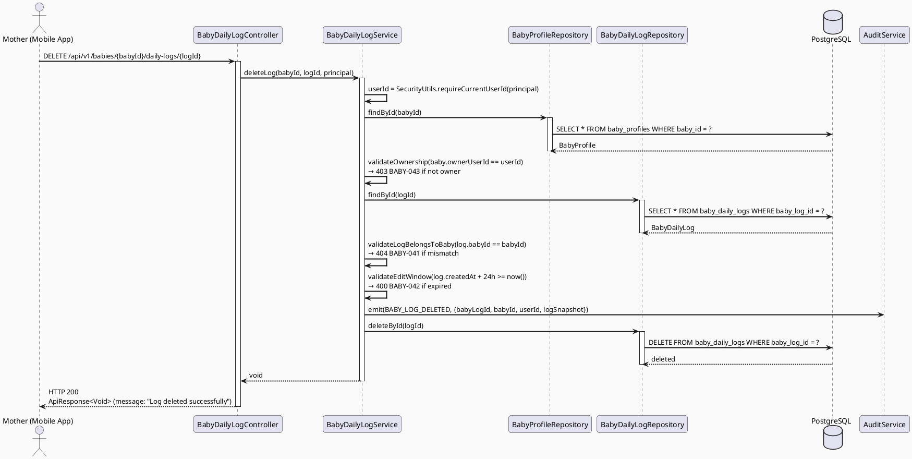
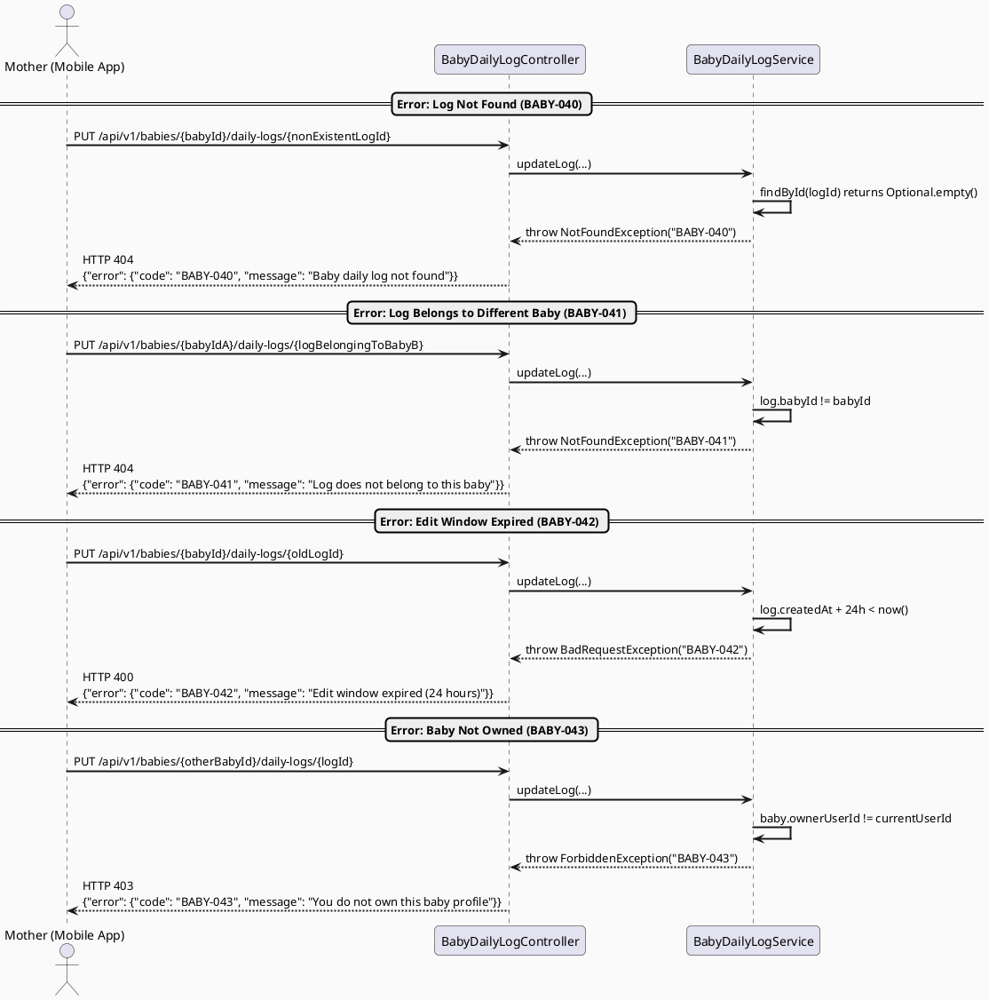

# ENGINEERING DOCUMENTATION STANDARD (EDS) v2.0
# UC35 — Update Baby Daily Log: Technical Design Specification

| Field | Value |
|-------|-------|
| **Document ID** | `CB-BABY-IMP-005` |
| **Version** | `1.0` |
| **Date** | `2026-06-26` |
| **Status** | `Draft` |
| **Document Owner** | `PhuongNT` |
| **Author** | `AI Agent` |
| **Reviewed by** | `[ ] Pending` |
| **DPO Sign-off** | `[ ] Pending` |
| **Approved by** | `[ ] Pending` |
| **Last Review** | `2026-06-26` |
| **Based on EDS** | `v2.0` |

---

## CHANGELOG

> **Policy 4.4 — Immutable History:** Mọi thay đổi phải ghi vào bảng này.

| Ngày | Người thực hiện | Nội dung thay đổi |
|------|-----------------|-------------------|
| 2026-06-26 | AI Agent | Tạo tài liệu lần đầu — TDS cho UC35 Update Baby Daily Log |

---

## MỤC LỤC

1. [Tổng quan Module](#1-tổng-quan-module)
2. [Ma trận Truy vết (Traceability Matrix)](#2-ma-trận-truy-vết-traceability-matrix)
3. [Architecture Decision Records (ADR)](#3-architecture-decision-records-adr)
4. [Non-Functional Requirements & SLA](#4-non-functional-requirements--sla)
5. [Static Modeling (Mô hình Tĩnh)](#5-static-modeling-mô-hình-tĩnh)
6. [Dynamic Modeling (Mô hình Động)](#6-dynamic-modeling-mô-hình-động)
7. [Domain Event Catalog](#7-domain-event-catalog)
8. [Interface Specification (Đặc tả Giao diện)](#8-interface-specification-đặc-tả-giao-diện)
9. [API Specification](#9-api-specification)
10. [Bảng mã lỗi (Error Codes)](#10-bảng-mã-lỗi-error-codes)
11. [Quy trình Triển khai (Step-by-Step)](#11-quy-trình-triển-khai-step-by-step)
12. [Rollback & Incident Runbook](#12-rollback--incident-runbook)
13. [Kịch bản Kiểm thử Chi tiết](#13-kịch-bản-kiểm-thử-chi-tiết)
14. [Phương pháp Xác minh](#14-phương-pháp-xác-minh)
15. [Mẫu thử thực tế (API Verification Samples)](#15-mẫu-thử-thực-tế-api-verification-samples)
16. [Bảng tổng hợp phân quyền (Authorization Matrix)](#16-bảng-tổng-hợp-phân-quyền-authorization-matrix)
17. [AI Prompt Constraints (CASE 2.0)](#17-ai-prompt-constraints-case-20)

---

## 1. Tổng quan Module

> Mother can update or delete an incorrectly entered baby daily log record within a 24-hour edit window. The log_type field is immutable after creation. Deletion is a hard delete since baby logs are not legal records.

| Field | Value |
|-------|-------|
| **Module Name** | `UpdateBabyDailyLog` |
| **Bounded Context** | `CareJourney` |
| **Data Classification** | `Internal` |
| **Compliance Scope** | `BR-RBAC, BR-PRIVACY, BR-SAFETY` |
| **Upstream Dependencies** | `BabyProfileModule, BabyDailyLogModule (UC34 — Create Baby Daily Log)` |
| **Downstream Consumers** | `ViewBabyLogSummary (UC36), AuditService` |

**SRS Reference:** SRS 3.3.1.12 — "Update Baby Daily Log — Updates or deletes an incorrectly entered baby daily log record."

**Actor:** Mother

---

## 2. Ma trận Truy vết (Traceability Matrix)

| Requirement ID | Loại (BR/ADR/US) | Mô tả yêu cầu | Thành phần Code | Compliance Target | ADR liên quan |
|----------------|------------------|---------------|-----------------|-------------------|---------------|
| BR-RBAC | Business Rule | Mother must own the baby to update/delete logs | `BabyDailyLogService.validateOwnership()` | BR-RBAC | — |
| BR-PRIVACY | Business Rule | Only owner can access baby log data | `BabyDailyLogService.validateOwnership()` | BR-PRIVACY | — |
| BR-SAFETY | Business Rule | 24-hour edit window for data integrity | `BabyDailyLogService.validateEditWindow()` | BR-SAFETY | ADR-BABY-005-001 |
| SRS-3.3.1.12 | User Story | Update or delete incorrectly entered baby daily log | `BabyDailyLogController.updateLog()`, `BabyDailyLogController.deleteLog()` | — | — |
| ADR-BABY-005-001 | Decision | 24h edit window for data integrity | `BabyDailyLogService.validateEditWindow()` | BR-SAFETY | — |
| ADR-BABY-005-002 | Decision | Hard delete allowed for baby logs | `BabyDailyLogRepository.deleteById()` | — | — |
| ADR-BABY-005-003 | Decision | log_type immutable after creation | `BabyDailyLogService.updateLog()` | — | — |

---

## 3. Architecture Decision Records (ADR)

### ADR-BABY-005-001 — 24-Hour Edit Window for Baby Daily Logs

| Field | Value |
|-------|-------|
| **Status** | `Accepted` |
| **Deciders** | `PhuongNT — Developer` |
| **Date** | `2026-06-26` |

#### Bối cảnh (Context)
> Baby daily logs record feeding, sleep, diaper changes, and symptoms. Mothers may make data entry errors. However, unrestricted editing could compromise data integrity and confuse caregivers relying on historical data for health tracking. A time-bounded edit window balances error correction with data integrity.

#### Các phương án đã xem xét (Options Considered)

| Phương án | Mô tả | Ưu điểm | Nhược điểm |
|-----------|-------|----------|------------|
| A | Unlimited editing | + Maximum flexibility | - Data integrity risk, confusing audit trail |
| B | 24-hour edit window from created_at | + Balances correction with integrity | - Cannot fix older errors |
| C | No editing allowed | + Immutable records | - Poor UX for typos and mistakes |

#### Quyết định (Decision)
> Chọn **Phương án B** — 24-hour edit window calculated from `created_at`. This is consistent with the existing pattern used in UC26 for health metrics. After 24 hours, the mother must delete and re-create if correction is needed.

#### Hệ quả (Consequences)

**Tích cực:**
- Data integrity maintained after 24-hour window
- Consistent with existing edit window pattern (UC26)
- Mothers can still correct recent mistakes

**Tiêu cực / Trade-offs:**
- Older errors cannot be corrected in-place (must delete and re-add)

**Compliance Impact:**
- No direct compliance impact — baby logs are not PII or legal records

---

### ADR-BABY-005-002 — Hard Delete Allowed for Baby Logs

| Field | Value |
|-------|-------|
| **Status** | `Accepted` |
| **Deciders** | `PhuongNT — Developer` |
| **Date** | `2026-06-26` |

#### Bối cảnh (Context)
> Unlike health records or consent records that require append-only storage for legal compliance, baby daily logs are personal tracking data entered by mothers. They are not subject to GDPR retention requirements or medical record regulations.

#### Các phương án đã xem xét (Options Considered)

| Phương án | Mô tả | Ưu điểm | Nhược điểm |
|-----------|-------|----------|------------|
| A | Soft delete (status = DELETED) | + Recoverable | - Unnecessary complexity for non-legal data |
| B | Hard delete (DELETE FROM) | + Simple, clean data | - Irrecoverable |

#### Quyết định (Decision)
> Chọn **Phương án B** — Hard delete. Baby logs are not legal records. Simplicity is preferred. An audit event (`BABY_LOG_DELETED`) is emitted before deletion for traceability.

#### Hệ quả (Consequences)

**Tích cực:**
- Simpler data model, no orphaned "deleted" records
- Mother has full control over her data

**Tiêu cực / Trade-offs:**
- Deleted data is irrecoverable (mitigated by audit event recording the deletion)

---

### ADR-BABY-005-003 — log_type Immutable After Creation

| Field | Value |
|-------|-------|
| **Status** | `Accepted` |
| **Deciders** | `PhuongNT — Developer` |
| **Date** | `2026-06-26` |

#### Bối cảnh (Context)
> Changing `log_type` after creation (e.g., FEEDING to SLEEP) fundamentally changes the meaning of the record. Different log types may have different required/optional fields and validation rules. Allowing type changes would create data inconsistency.

#### Các phương án đã xem xét (Options Considered)

| Phương án | Mô tả | Ưu điểm | Nhược điểm |
|-----------|-------|----------|------------|
| A | Allow log_type changes | + Flexible | - Data inconsistency, complex validation |
| B | log_type immutable — delete and re-add | + Clean data model | - Extra steps for user |

#### Quyết định (Decision)
> Chọn **Phương án B** — `log_type` is immutable. If the mother logged the wrong type, she should delete the entry and create a new one with the correct type. The update endpoint silently ignores `log_type` if included in the request body.

#### Hệ quả (Consequences)

**Tích cực:**
- Data consistency guaranteed per log type
- Simpler validation logic in update path

**Tiêu cực / Trade-offs:**
- Requires two operations (delete + create) to fix a wrong log_type

---

## 4. Non-Functional Requirements & SLA

### 4.1. Performance & Availability

| Category | Requirement | Target SLA | Measurement Method | Compliance Basis |
|----------|-------------|------------|---------------------|------------------|
| Latency | PUT/DELETE API response (p99) | `< 300ms` | k6 load test | — |
| Availability | Uptime (monthly) | `99.9%` | Uptime monitor | — |
| Throughput | Concurrent requests | `100 req/s` | Load test | — |

### 4.2. Data Integrity & Retention

| Category | Requirement | Target | Verification Method | Compliance Basis |
|----------|-------------|--------|---------------------|------------------|
| Edit Window | 24-hour edit constraint | 100% enforced | Unit test + integration test | ADR-BABY-005-001 |
| Immutability | log_type cannot be changed | 100% enforced | Unit test | ADR-BABY-005-003 |
| Audit | All update/delete events logged | 100% coverage | Audit log verification | BR-SAFETY |

### 4.3. Security

| Category | Requirement | Target | Verification Method | Compliance Basis |
|----------|-------------|--------|---------------------|------------------|
| Access control | Ownership-based access | Least privilege | Auth Matrix (§16) | BR-RBAC |
| Encryption in transit | All endpoints | TLS 1.3+ | SSL Labs scan | — |
| Authentication | JWT required | All endpoints | 401 test case | — |

### 4.4. Scalability & Capacity Planning

> Expected load: ~500 active mothers, ~50 update/delete operations per day. Current architecture is sufficient. No scaling concerns for this module.

---

## 5. Static Modeling (Mô hình Tĩnh)

### 5.1. Class Diagram (PlantUML)



### 5.2. Data Structure (Existing Tables — No Migration Required)

> Tables `baby_profiles` and `baby_daily_logs` already exist. No new Flyway migration is needed for UC35.

```sql
-- Existing table: baby_daily_logs (used by update/delete operations)
-- See DB Schema in project context for full DDL
-- Key columns for UC35:
--   baby_log_id  UUID PK
--   baby_id      UUID FK → baby_profiles
--   log_type     VARCHAR(30) — IMMUTABLE after creation
--   created_at   TIMESTAMPTZ — used for 24h edit window calculation
--   updated_at   TIMESTAMPTZ — set to NOW() on update
```

---

## 6. Dynamic Modeling (Mô hình Động)

### 6.1. Sequence Diagram — Happy Path: Update Log (PlantUML)



### 6.2. Sequence Diagram — Happy Path: Delete Log (PlantUML)



### 6.3. Sequence Diagram — Error Paths (PlantUML)



---

## 7. Domain Event Catalog

### 7.1. Events Published (Phát ra)

| Event Name | Trigger | Publisher | Subscriber(s) | Payload Schema | Async? |
|------------|---------|-----------|---------------|----------------|--------|
| `BABY_LOG_UPDATED` | Mother updates a baby daily log | `BabyDailyLogService` | `AuditService` | See §7.3 | No |
| `BABY_LOG_DELETED` | Mother deletes a baby daily log | `BabyDailyLogService` | `AuditService` | See §7.3 | No |

### 7.2. Events Consumed (Tiêu thụ)

| Event Name | Source | Handler | Action thực hiện |
|------------|--------|---------|------------------|
| — | — | — | This module does not consume external events |

### 7.3. Payload Schema

```java
// BABY_LOG_UPDATED event payload
{
    "eventType": "BABY_LOG_UPDATED",
    "babyLogId": "uuid",
    "babyId": "uuid",
    "userId": "uuid",
    "changedFields": ["startedAt", "endedAt", "quantity", "unit", "note"],
    "occurredAt": "2026-06-26T10:00:00Z"
}

// BABY_LOG_DELETED event payload
{
    "eventType": "BABY_LOG_DELETED",
    "babyLogId": "uuid",
    "babyId": "uuid",
    "userId": "uuid",
    "logSnapshot": {
        "logType": "FEEDING",
        "startedAt": "...",
        "endedAt": "...",
        "quantity": 150,
        "unit": "ml",
        "note": "..."
    },
    "occurredAt": "2026-06-26T10:00:00Z"
}
```

---

## 8. Interface Specification (Đặc tả Giao diện)

### 8.1. Service Interface

```java
// UpdateBabyDailyLogRequest.java — Input DTO
// @version 1.0
public class UpdateBabyDailyLogRequest {
    // NOTE: log_type is NOT included — immutable after creation (ADR-BABY-005-003)
    private Instant startedAt;      // Optional — start time of the activity
    private Instant endedAt;        // Optional — end time of the activity
    private BigDecimal quantity;    // Optional — e.g., ml for feeding
    private String unit;            // Optional — e.g., "ml", "celsius"
    private String note;            // Optional — free text, max 500 chars
    // getters / setters / @Valid annotations
}

// BabyDailyLogResponse.java — Output DTO
// @version 1.0
public class BabyDailyLogResponse {
    private UUID babyLogId;
    private UUID babyId;
    private String logType;
    private Instant startedAt;
    private Instant endedAt;
    private BigDecimal quantity;
    private String unit;
    private String note;
    private UUID recordedBy;
    private Instant createdAt;
    private Instant updatedAt;
    // getters / setters
}

// IBabyDailyLogService.java — Service Contract (update/delete methods)
// @version 1.0
public interface IBabyDailyLogService {
    /**
     * Updates a baby daily log within the 24-hour edit window.
     * log_type is immutable and ignored if sent in request.
     * recorded_by remains the original recorder.
     * @throws NotFoundException (BABY-040) when log not found
     * @throws NotFoundException (BABY-041) when log does not belong to the specified baby
     * @throws BadRequestException (BABY-042) when edit window (24h) has expired
     * @throws ForbiddenException (BABY-043) when mother does not own the baby
     */
    BabyDailyLogResponse updateLog(UUID babyId, UUID logId, UpdateBabyDailyLogRequest request, Principal principal);

    /**
     * Hard-deletes a baby daily log within the 24-hour edit window.
     * Emits BABY_LOG_DELETED audit event with log snapshot before deletion.
     * @throws NotFoundException (BABY-040) when log not found
     * @throws NotFoundException (BABY-041) when log does not belong to the specified baby
     * @throws BadRequestException (BABY-042) when edit window (24h) has expired
     * @throws ForbiddenException (BABY-043) when mother does not own the baby
     */
    void deleteLog(UUID babyId, UUID logId, Principal principal);
}
```

### 8.2. Repository Interface

```java
// BabyDailyLogRepository.java
// @version 1.0
public interface BabyDailyLogRepository extends JpaRepository<BabyDailyLog, UUID> {

    Optional<BabyDailyLog> findById(UUID babyLogId);

    // Hard delete is permitted for baby logs (ADR-BABY-005-002)
    void deleteById(UUID babyLogId);
}

// BabyProfileRepository.java (existing — used for ownership check)
// @version 1.0
public interface BabyProfileRepository extends JpaRepository<BabyProfile, UUID> {

    Optional<BabyProfile> findById(UUID babyId);
}
```

---

## 9. API Specification

### 9.1. Endpoints Table

| Method | Path | Auth Level | Required Roles | Rate Limit | Idempotent? |
|--------|------|------------|----------------|------------|-------------|
| `PUT` | `/api/v1/babies/{babyId}/daily-logs/{logId}` | JWT Bearer | `MOTHER` (own baby) | 60/min | Yes |
| `DELETE` | `/api/v1/babies/{babyId}/daily-logs/{logId}` | JWT Bearer | `MOTHER` (own baby) | 60/min | No |

### 9.2. Request / Response Schemas

#### `PUT /api/v1/babies/{babyId}/daily-logs/{logId}` — Update Log

**Path Parameters:**
- `babyId` (UUID, required) — ID of the baby profile
- `logId` (UUID, required) — ID of the daily log entry

**Request Body:**
```json
{
  "startedAt": "2026-06-26T08:00:00Z",
  "endedAt": "2026-06-26T08:30:00Z",
  "quantity": 180,
  "unit": "ml",
  "note": "Breastfed well, no fussing"
}
```

> **Note:** `logType` is NOT accepted in the request body. It is immutable (ADR-BABY-005-003). If sent, it is silently ignored.

**Response — 200 OK (Happy Path):**
```json
{
  "success": true,
  "data": {
    "babyLogId": "550e8400-e29b-41d4-a716-446655440001",
    "babyId": "550e8400-e29b-41d4-a716-446655440000",
    "logType": "FEEDING",
    "startedAt": "2026-06-26T08:00:00Z",
    "endedAt": "2026-06-26T08:30:00Z",
    "quantity": 180,
    "unit": "ml",
    "note": "Breastfed well, no fussing",
    "recordedBy": "660e8400-e29b-41d4-a716-446655440000",
    "createdAt": "2026-06-26T07:00:00Z",
    "updatedAt": "2026-06-26T10:00:00Z"
  },
  "message": "Baby daily log updated successfully"
}
```

#### `DELETE /api/v1/babies/{babyId}/daily-logs/{logId}` — Delete Log

**Path Parameters:**
- `babyId` (UUID, required) — ID of the baby profile
- `logId` (UUID, required) — ID of the daily log entry

**Request Body:** None

**Response — 200 OK (Happy Path):**
```json
{
  "success": true,
  "data": null,
  "message": "Baby daily log deleted successfully"
}
```

#### Error Responses

**Response — 400 Bad Request (Edit Window Expired):**
```json
{
  "error": {
    "code": "BABY-042",
    "message": "Edit window expired. Logs can only be modified within 24 hours of creation."
  }
}
```

**Response — 403 Forbidden (Baby Not Owned):**
```json
{
  "error": {
    "code": "BABY-043",
    "message": "You do not own this baby profile"
  }
}
```

**Response — 404 Not Found (Log Not Found):**
```json
{
  "error": {
    "code": "BABY-040",
    "message": "Baby daily log not found"
  }
}
```

**Response — 404 Not Found (Log Not in Baby):**
```json
{
  "error": {
    "code": "BABY-041",
    "message": "Log does not belong to this baby"
  }
}
```

**Response — 401 Unauthorized (No JWT):**
```json
{
  "error": {
    "code": "AUTH-001",
    "message": "Authentication required"
  }
}
```

---

## 10. Bảng mã lỗi (Error Codes)

| Code | HTTP Status | Message (EN) | Message (VI) | Trigger Condition |
|------|-------------|--------------|--------------|-------------------|
| `BABY-040` | 404 | Baby daily log not found | Không tìm thấy bản ghi nhật ký | `logId` does not exist in `baby_daily_logs` |
| `BABY-041` | 404 | Log does not belong to this baby | Bản ghi không thuộc em bé này | `log.baby_id != babyId` path param |
| `BABY-042` | 400 | Edit window expired (24 hours) | Quá thời hạn chỉnh sửa (24 giờ) | `log.created_at + 24h < now()` |
| `BABY-043` | 403 | You do not own this baby profile | Bạn không sở hữu hồ sơ em bé này | `baby.owner_user_id != currentUserId` |
| `AUTH-001` | 401 | Authentication required | Yêu cầu xác thực | No JWT token in request |

---

## 11. Quy trình Triển khai (Step-by-Step)

### 11.1. Prerequisites

- [ ] ADR-BABY-005-001, 002, 003 đã được Accepted (xem §3)
- [ ] Tables `baby_profiles` and `baby_daily_logs` already exist
- [ ] UC34 (Create Baby Daily Log) is implemented

### 11.2. Pre-Migration Checklist

> No new migration required. Tables already exist.

### 11.3. Implementation Steps

#### Chặng 1 — DTO Layer

Create `UpdateBabyDailyLogRequest.java` with validation annotations. Ensure `logType` is NOT a field in the update DTO.

```java
// com.carebridge.backend.carejourney.dto.UpdateBabyDailyLogRequest
@Data
public class UpdateBabyDailyLogRequest {
    private Instant startedAt;
    private Instant endedAt;
    @DecimalMin("0")
    private BigDecimal quantity;
    @Size(max = 20)
    private String unit;
    @Size(max = 500)
    private String note;
}
```

#### Chặng 2 — Service Layer

Implement `updateLog()` and `deleteLog()` in `BabyDailyLogService` with ownership validation, edit window check, and audit emission.

#### Chặng 3 — Controller Layer

Add `PUT` and `DELETE` endpoints to `BabyDailyLogController`. Controller only handles validation, request/response mapping, and delegation to service.

#### Chặng 4 — Verification

```bash
./mvnw test -pl 05_Development/CareBridgeAPI -Dtest="*BabyDailyLog*"
```

### 11.4. Deployment Checklist

- [ ] All unit tests passing
- [ ] Integration tests passing
- [ ] Health check endpoint returns 200
- [ ] Audit log emitting BABY_LOG_UPDATED and BABY_LOG_DELETED events

---

## 12. Rollback & Incident Runbook

### 12.1. Điều kiện kích hoạt Rollback (Trigger Conditions)

| Điều kiện | Ngưỡng | Người quyết định |
|-----------|--------|------------------|
| Error rate tăng đột biến | > 5% trong 5 phút | On-call Engineer |
| Edit window bypass detected | Any case | Tech Lead |
| Unauthorized deletion | Any case | Tech Lead |

### 12.2. Rollback Procedure

```bash
# No migration to revert. Rollback is code-only:
git revert <commit-hash>

# Redeploy previous version
./mvnw clean package -DskipTests
# Deploy previous JAR
```

### 12.3. Notification Protocol

| Thời điểm | Người nhận | Kênh |
|-----------|------------|------|
| Ngay khi phát hiện | On-call team | Slack #incident |
| Trong 30 phút | Tech Lead | Direct message |

### 12.4. Post-Incident Review (PIR)

> Standard PIR template applies. Complete within 48 hours of resolution.

---

## 13. Kịch bản Kiểm thử Chi tiết

> **Policy (EDS v2.0 — Test Data):** All test data is SYNTHETIC.

### 13.1. Unit Tests

#### TC-UNIT-001 — Update Log Happy Path

```gherkin
Feature: Update Baby Daily Log
  Background:
    Given test data classification: SYNTHETIC
    And a baby profile owned by mother "user-001"
    And a FEEDING log created 2 hours ago

  Scenario: Mother updates log within 24h window
    Given the log exists with quantity=150, unit="ml"
    When mother "user-001" sends PUT /api/v1/babies/{babyId}/daily-logs/{logId}
      with {"quantity": 180, "unit": "ml", "note": "Updated amount"}
    Then response status is 200
    And response contains quantity=180 and updated note
    And updatedAt has changed
    And logType remains "FEEDING" (unchanged)
    And recordedBy remains original recorder
```

#### TC-UNIT-002 — Delete Log Happy Path

```gherkin
  Scenario: Mother deletes log within 24h window
    Given a SLEEP log created 1 hour ago
    When mother "user-001" sends DELETE /api/v1/babies/{babyId}/daily-logs/{logId}
    Then response status is 200
    And log no longer exists in database
    And BABY_LOG_DELETED audit event is emitted with log snapshot
```

#### TC-UNIT-003 — Edit Window Expired

```gherkin
  Scenario: Mother tries to update log older than 24h
    Given a FEEDING log created 25 hours ago
    When mother "user-001" sends PUT /api/v1/babies/{babyId}/daily-logs/{logId}
    Then response status is 400
    And error code is "BABY-042"
```

### 13.2. Integration Tests

#### TC-INT-001 — Full Update Flow with DB Verification

```gherkin
  Scenario: Update persists in database with correct timestamps
    Given test data classification: SYNTHETIC
    And PostgreSQL container running
    And a seeded FEEDING log with quantity=100
    When PUT /api/v1/babies/{babyId}/daily-logs/{logId} with quantity=200
    Then database record has quantity=200
    And updated_at is newer than created_at
    And log_type remains "FEEDING"
```

#### TC-INT-002 — Full Delete Flow with DB Verification

```gherkin
  Scenario: Delete removes record from database
    Given test data classification: SYNTHETIC
    And PostgreSQL container running
    And a seeded DIAPER log
    When DELETE /api/v1/babies/{babyId}/daily-logs/{logId}
    Then SELECT COUNT(*) FROM baby_daily_logs WHERE baby_log_id = ? returns 0
```

---

## 14. Phương pháp Xác minh

### 14.1. Database Inspection

```sql
-- Verify log updated with new values
SELECT baby_log_id, log_type, quantity, unit, note, updated_at
FROM baby_daily_logs
WHERE baby_log_id = '{logId}';

-- Verify log deleted (hard delete)
SELECT COUNT(*) FROM baby_daily_logs WHERE baby_log_id = '{logId}';
-- Expected: 0

-- Verify log_type was NOT changed
SELECT log_type FROM baby_daily_logs WHERE baby_log_id = '{logId}';
-- Expected: original log_type value
```

### 14.2. Log / Audit Verification

```bash
# Verify BABY_LOG_UPDATED event emitted
grep '"eventType":"BABY_LOG_UPDATED"' application.log | tail -5

# Verify BABY_LOG_DELETED event emitted with snapshot
grep '"eventType":"BABY_LOG_DELETED"' application.log | tail -5
```

---

## 15. Mẫu thử thực tế (API Verification Samples)

### 15.1. Happy Path — Update

```bash
# PUT — Update a baby daily log
curl -X PUT http://localhost:8080/api/v1/babies/550e8400-e29b-41d4-a716-446655440000/daily-logs/550e8400-e29b-41d4-a716-446655440001 \
  -H "Authorization: Bearer ${JWT_TOKEN}" \
  -H "Content-Type: application/json" \
  -d '{
    "startedAt": "2026-06-26T08:00:00Z",
    "endedAt": "2026-06-26T08:30:00Z",
    "quantity": 180,
    "unit": "ml",
    "note": "Corrected feeding amount"
  }'
```

**Expected Response (200):**
```json
{
  "success": true,
  "data": {
    "babyLogId": "550e8400-e29b-41d4-a716-446655440001",
    "babyId": "550e8400-e29b-41d4-a716-446655440000",
    "logType": "FEEDING",
    "quantity": 180,
    "unit": "ml",
    "note": "Corrected feeding amount",
    "updatedAt": "2026-06-26T10:30:00Z"
  },
  "message": "Baby daily log updated successfully"
}
```

### 15.2. Happy Path — Delete

```bash
# DELETE — Delete a baby daily log
curl -X DELETE http://localhost:8080/api/v1/babies/550e8400-e29b-41d4-a716-446655440000/daily-logs/550e8400-e29b-41d4-a716-446655440001 \
  -H "Authorization: Bearer ${JWT_TOKEN}"
```

**Expected Response (200):**
```json
{
  "success": true,
  "data": null,
  "message": "Baby daily log deleted successfully"
}
```

### 15.3. Error Paths

```bash
# PUT — Edit window expired → 400
curl -X PUT http://localhost:8080/api/v1/babies/{babyId}/daily-logs/{oldLogId} \
  -H "Authorization: Bearer ${JWT_TOKEN}" \
  -H "Content-Type: application/json" \
  -d '{"quantity": 200}'
```

**Expected Response (400):**
```json
{
  "error": {
    "code": "BABY-042",
    "message": "Edit window expired. Logs can only be modified within 24 hours of creation."
  }
}
```

```bash
# PUT — No JWT → 401
curl -X PUT http://localhost:8080/api/v1/babies/{babyId}/daily-logs/{logId} \
  -H "Content-Type: application/json" \
  -d '{"quantity": 200}'
```

**Expected Response (401):**
```json
{
  "error": {
    "code": "AUTH-001",
    "message": "Authentication required"
  }
}
```

---

## 16. Bảng tổng hợp phân quyền (Authorization Matrix)

| Endpoint | `MOTHER` | `EXPERT` | `ADMIN` | `SYSTEM` |
|----------|----------|----------|---------|----------|
| `PUT /api/v1/babies/{babyId}/daily-logs/{logId}` | ✅ Own baby | ❌ | ❌ | ❌ |
| `DELETE /api/v1/babies/{babyId}/daily-logs/{logId}` | ✅ Own baby | ❌ | ❌ | ❌ |

**Chú thích:**
- ✅ = Được phép (with ownership constraint)
- ❌ = Bị từ chối (403)
- `Own baby` = `baby_profiles.owner_user_id == currentUserId`

---

## 17. AI Prompt Constraints (CASE 2.0)

### 17.1 Constraint Summary Table

| # | Constraint | Source (ADR/BR) | Last Verified |
|---|-----------|-----------------|---------------|
| C1 | Mother must own the baby — verify `baby_profiles.owner_user_id == currentUserId` before any update/delete | `BR-RBAC` | `2026-06-26` |
| C2 | Log must belong to the specified baby — verify `baby_daily_logs.baby_id == babyId` path param | `BR-PRIVACY` | `2026-06-26` |
| C3 | 24-hour edit window — reject if `log.created_at + 24h < now()`. Use `created_at`, NOT `started_at` | `ADR-BABY-005-001` | `2026-06-26` |
| C4 | `log_type` is immutable — silently ignore if sent in update request body. Do NOT change log_type | `ADR-BABY-005-003` | `2026-06-26` |
| C5 | Emit `BABY_LOG_UPDATED` or `BABY_LOG_DELETED` audit event via `AuditService.emit()` | `BR-SAFETY` | `2026-06-26` |
| C6 | `recorded_by` must remain the original recorder — do NOT update to current user on edit | `BR-PRIVACY` | `2026-06-26` |
| C7 | Hard delete for `BABY_LOG_DELETED` — use `deleteById()`, not soft delete | `ADR-BABY-005-002` | `2026-06-26` |

### 17.2 Constraint Injection Block (Copy-Paste vào AI Prompt)

```
[CONSTRAINT BLOCK — Module: UpdateBabyDailyLog]
Theo TDS CB-BABY-IMP-005 và các ADR liên quan:

1. C1 — Verify baby ownership: baby_profiles.owner_user_id == currentUserId (403 BABY-043 if not)
2. C2 — Verify log belongs to baby: baby_daily_logs.baby_id == babyId path param (404 BABY-041 if not)
3. C3 — Enforce 24h edit window: log.created_at + 24h >= now() (400 BABY-042 if expired). Use created_at NOT started_at.
4. C4 — log_type is immutable: silently ignore if sent in update request (ADR-BABY-005-003)
5. C5 — Emit BABY_LOG_UPDATED or BABY_LOG_DELETED audit event via AuditService.emit()
6. C6 — recorded_by must remain original recorder — never update to current user
7. C7 — Use hard delete (deleteById), not soft delete — baby logs are not legal records (ADR-BABY-005-002)

[CONTEXT BLOCK]
- Bounded Context: CareJourney
- Data Classification: Internal
- Compliance: BR-RBAC, BR-PRIVACY, BR-SAFETY
- Existing interfaces: §8 Service Interface + §8.2 Repository Interface
- Error codes: §10 Error Codes Table
- Auth matrix: §16 Authorization Matrix

[TASK BLOCK]
Implement updateLog() and deleteLog() methods satisfying constraints above.
Output must conform to §8 Interface Specification.
Tests must cover §13 Test Scenarios.
```

### 17.3 Constraint Quality Checklist

- [x] Mỗi constraint traceable về ADR hoặc BR cụ thể
- [x] Không có constraint generic
- [x] Mỗi constraint có `Last Verified` date ≤ 2 sprints
- [x] Constraint block có ≥ 3 constraints cụ thể (7 constraints)
- [x] Constraint block reference §8 Interface
- [x] Constraint block reference §16 Auth Matrix

### 17.4 Anti-Pattern Detection (cho AI-Generated Code từ Block này)

| AP-ID | Anti-Pattern | Dấu hiệu | Hành động |
|-------|-------------|-----------|----------|
| AP-AI-001 | Unconstrained Gen | Code does not check ownership (C1) | Reject — inject C1 constraint |
| AP-AI-003 | Implicit Decision | Code uses soft delete instead of hard delete without ADR | Reject — follow ADR-BABY-005-002 |
| AP-AI-005 | Hallucinated Contract | Code imports service/type not in §8 | Reject — verify contract existence |
| AP-AI-006 | Edit Window Wrong Field | Code uses `started_at` instead of `created_at` for 24h window | Reject — follow C3 constraint |
| AP-AI-007 | Mutable log_type | Code allows changing log_type in update | Reject — follow C4 / ADR-BABY-005-003 |

---

## PHỤ LỤC

### A. Glossary (Thuật ngữ)

| Thuật ngữ | Định nghĩa |
|-----------|------------|
| Edit Window | 24-hour period from `created_at` during which a log can be modified or deleted |
| Hard Delete | Permanent removal of a database record (DELETE FROM) |
| log_type | Immutable classification of a baby daily log (FEEDING, SLEEP, DIAPER, FEVER, VOMITING, MEDICINE) |
| Ownership | Relationship between a mother (user) and a baby profile via `owner_user_id` |

### B. Tài liệu tham chiếu

| Document | Link / Path |
|----------|-------------|
| SRS 3.3.1.12 — Update Baby Daily Log | `01_Requirements/SRS.md` |
| UC34 — Create Baby Daily Log | `04_Implement/UC34_CreateBabyDailyLog/` |
| CASE 2.0 Methodology | `vii_reports/FPT-EDU-REP-METH-002_CASE_AI_METHODOLOGY_v1.1.md` |
| EDS v2.0 Template | `08_References/Template/PHASE-3_TDS.md` |

---

*EDS v2.0 — UC35 Update Baby Daily Log Technical Design Specification.*
*Sections marked with ADR are Architecture Decision Records per EDS v2.0.*
*CASE 2.0 AI Prompt Constraints defined in §17.*
