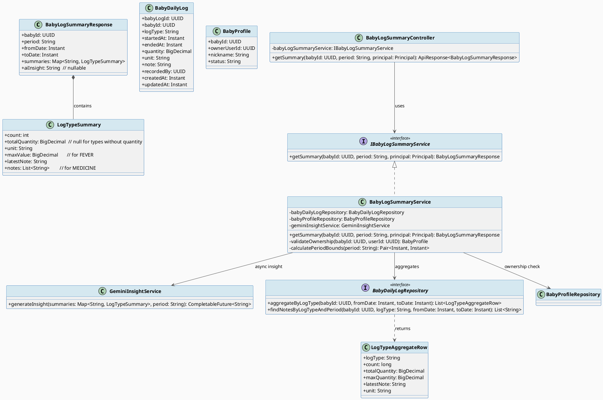
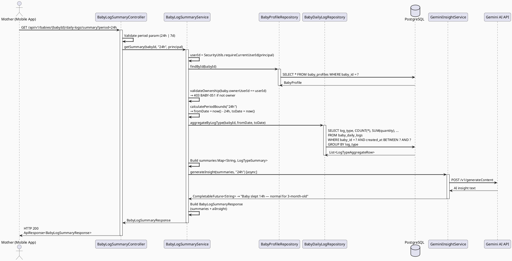
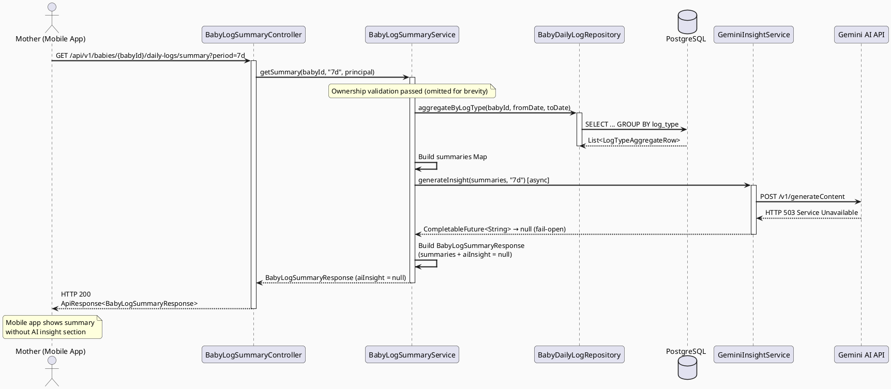
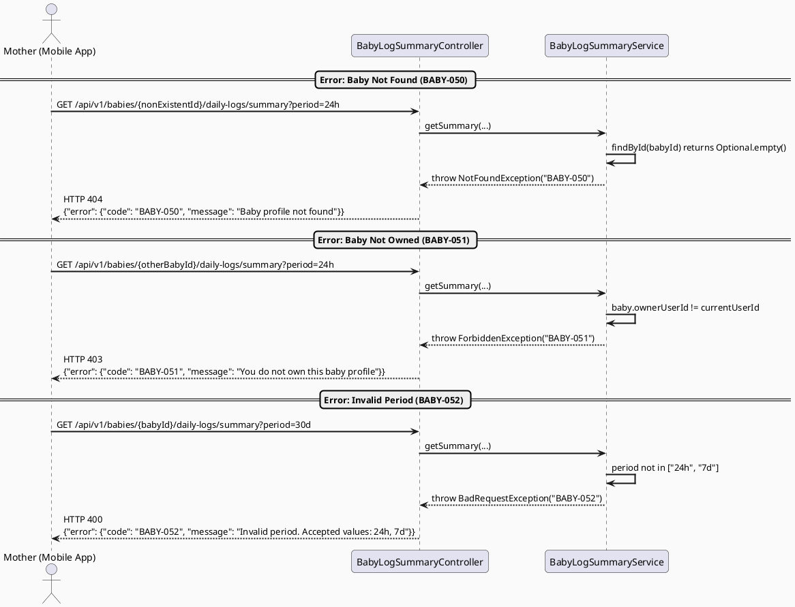

# ENGINEERING DOCUMENTATION STANDARD (EDS) v2.0
# UC36 — View Baby Log Summary: Technical Design Specification

| Field | Value |
|-------|-------|
| **Document ID** | `CB-BABY-IMP-006` |
| **Version** | `1.0` |
| **Date** | `2026-06-26` |
| **Status** | `Draft` |
| **Document Owner** | `PhuongNT` |
| **Author** | `AI Agent` |
| **Reviewed by** | `[ ] Pending` |
| **DPO Sign-off** | `[ ] Pending` |
| **Approved by** | `[ ] Pending` |
| **Last Review** | `2026-06-26` |
| **Based on EDS** | `v2.0` |

---

## CHANGELOG

> **Policy 4.4 — Immutable History:** Mọi thay đổi phải ghi vào bảng này.

| Ngày | Người thực hiện | Nội dung thay đổi |
|------|-----------------|-------------------|
| 2026-06-26 | AI Agent | Tạo tài liệu lần đầu — TDS cho UC36 View Baby Log Summary |

---

## MỤC LỤC

1. [Tổng quan Module](#1-tổng-quan-module)
2. [Ma trận Truy vết (Traceability Matrix)](#2-ma-trận-truy-vết-traceability-matrix)
3. [Architecture Decision Records (ADR)](#3-architecture-decision-records-adr)
4. [Non-Functional Requirements & SLA](#4-non-functional-requirements--sla)
5. [Static Modeling (Mô hình Tĩnh)](#5-static-modeling-mô-hình-tĩnh)
6. [Dynamic Modeling (Mô hình Động)](#6-dynamic-modeling-mô-hình-động)
7. [Domain Event Catalog](#7-domain-event-catalog)
8. [Interface Specification (Đặc tả Giao diện)](#8-interface-specification-đặc-tả-giao-diện)
9. [API Specification](#9-api-specification)
10. [Bảng mã lỗi (Error Codes)](#10-bảng-mã-lỗi-error-codes)
11. [Quy trình Triển khai (Step-by-Step)](#11-quy-trình-triển-khai-step-by-step)
12. [Rollback & Incident Runbook](#12-rollback--incident-runbook)
13. [Kịch bản Kiểm thử Chi tiết](#13-kịch-bản-kiểm-thử-chi-tiết)
14. [Phương pháp Xác minh](#14-phương-pháp-xác-minh)
15. [Mẫu thử thực tế (API Verification Samples)](#15-mẫu-thử-thực-tế-api-verification-samples)
16. [Bảng tổng hợp phân quyền (Authorization Matrix)](#16-bảng-tổng-hợp-phân-quyền-authorization-matrix)
17. [AI Prompt Constraints (CASE 2.0)](#17-ai-prompt-constraints-case-20)

---

## 1. Tổng quan Module

> Displays a 24-hour or 7-day summary of feeding, sleep, diaper, and symptom logs for a baby. Aggregated data is computed per log_type. Optionally, Gemini AI provides an insight comment (async, fail-open). This is a read-only module; no writes occur.

| Field | Value |
|-------|-------|
| **Module Name** | `ViewBabyLogSummary` |
| **Bounded Context** | `CareJourney` |
| **Data Classification** | `Internal` |
| **Compliance Scope** | `BR-RBAC, BR-PRIVACY, BR-SAFETY` |
| **Upstream Dependencies** | `BabyProfileModule, BabyDailyLogModule (UC34 — Create Baby Daily Log)` |
| **Downstream Consumers** | `Mobile App (Flutter), Gemini AI Service (optional)` |

**SRS Reference:** SRS 3.3.1.13 — "View Baby Log Summary — Displays a 24-hour or 7-day summary of feeding, sleep, diaper, and symptom logs."

**Actor:** Mother (primary), Gemini AI Service (secondary)

**Platform:** Mobile App (Flutter)

---

## 2. Ma trận Truy vết (Traceability Matrix)

| Requirement ID | Loại (BR/ADR/US) | Mô tả yêu cầu | Thành phần Code | Compliance Target | ADR liên quan |
|----------------|------------------|---------------|-----------------|-------------------|---------------|
| BR-RBAC | Business Rule | Mother must own the baby to view summary | `BabyLogSummaryService.validateOwnership()` | BR-RBAC | — |
| BR-PRIVACY | Business Rule | Only owner can access baby data | `BabyLogSummaryService.validateOwnership()` | BR-PRIVACY | — |
| BR-SAFETY | Business Rule | AI insight is guidance only — never diagnose or prescribe | `GeminiInsightService` | BR-SAFETY | ADR-BABY-006-003 |
| SRS-3.3.1.13 | User Story | View aggregated baby log summary for 24h or 7d | `BabyLogSummaryController.getSummary()` | — | — |
| ADR-BABY-006-001 | Decision | Aggregation in SQL, not Java | `BabyDailyLogRepository.aggregateByPeriod()` | Performance | — |
| ADR-BABY-006-002 | Decision | Period param: 24h or 7d | `BabyLogSummaryService.getSummary()` | — | — |
| ADR-BABY-006-003 | Decision | Gemini insight async, fail-open | `GeminiInsightService` | BR-SAFETY | — |

---

## 3. Architecture Decision Records (ADR)

### ADR-BABY-006-001 — Aggregation in SQL, Not Java

| Field | Value |
|-------|-------|
| **Status** | `Accepted` |
| **Deciders** | `PhuongNT — Developer` |
| **Date** | `2026-06-26` |

#### Bối cảnh (Context)
> Baby daily logs can accumulate rapidly (10-20 entries per day). Aggregating in Java after fetching all individual records is wasteful. SQL-level aggregation reduces data transfer and leverages PostgreSQL's optimized aggregation functions.

#### Các phương án đã xem xét (Options Considered)

| Phương án | Mô tả | Ưu điểm | Nhược điểm |
|-----------|-------|----------|------------|
| A | Fetch all logs, aggregate in Java | + Simple code | - Poor performance, high memory for large datasets |
| B | SQL aggregation with GROUP BY | + Efficient, minimal data transfer | - More complex query |

#### Quyết định (Decision)
> Chọn **Phương án B** — SQL aggregation using `GROUP BY log_type` with aggregate functions (COUNT, SUM, MAX). This leverages PostgreSQL's built-in optimization for aggregate queries and minimizes data transfer between DB and application.

#### Hệ quả (Consequences)

**Tích cực:**
- O(1) memory in Java (single result row per log_type)
- Faster response times for large log datasets
- PostgreSQL handles time-range filtering efficiently with indexes

**Tiêu cực / Trade-offs:**
- Repository query is more complex
- Testing requires real SQL execution (integration tests with Testcontainers)

---

### ADR-BABY-006-002 — Period Parameter: 24h and 7d

| Field | Value |
|-------|-------|
| **Status** | `Accepted` |
| **Deciders** | `PhuongNT — Developer` |
| **Date** | `2026-06-26` |

#### Bối cảnh (Context)
> The mobile app needs to display summary data for two time windows: a quick recent overview (last 24 hours) and a weekly trend (last 7 days). The API should accept a `period` query parameter to select the window.

#### Các phương án đã xem xét (Options Considered)

| Phương án | Mô tả | Ưu điểm | Nhược điểm |
|-----------|-------|----------|------------|
| A | Separate endpoints for 24h and 7d | + Clear routing | - Code duplication |
| B | Single endpoint with `period` query param | + DRY, flexible | - Requires validation |
| C | Custom date range (fromDate, toDate) | + Maximum flexibility | - Over-engineering for 2 fixed windows |

#### Quyết định (Decision)
> Chọn **Phương án B** — Single endpoint with `period` query parameter accepting `24h` or `7d`. The period is relative to `now()`:
> - `24h` = `now() - 24 hours` to `now()`
> - `7d` = `now() - 7 days` to `now()`

#### Hệ quả (Consequences)

**Tích cực:**
- Single endpoint, clean API design
- Easy to extend with new periods in the future (e.g., `30d`)

**Tiêu cực / Trade-offs:**
- Must validate `period` parameter and return `BABY-052` for invalid values

---

### ADR-BABY-006-003 — Gemini AI Insight: Async and Fail-Open

| Field | Value |
|-------|-------|
| **Status** | `Accepted` |
| **Deciders** | `PhuongNT — Developer` |
| **Date** | `2026-06-26` |

#### Bối cảnh (Context)
> Gemini AI can provide contextual insights about baby health patterns (e.g., "Baby slept 14 hours in 24h — within normal range for 3-month-old"). However, AI services can be slow or unavailable. The summary must always return, even if the AI service fails. Additionally, per BR-SAFETY, AI provides guidance only and must never diagnose or prescribe.

#### Các phương án đã xem xét (Options Considered)

| Phương án | Mô tả | Ưu điểm | Nhược điểm |
|-----------|-------|----------|------------|
| A | Synchronous Gemini call, block until response | + Simple | - Increased latency, single point of failure |
| B | Async Gemini call, fail-open (return null on error) | + Resilient, fast baseline response | - AI insight may be missing |
| C | No AI insight | + Simplest | - Missing value-add feature |

#### Quyết định (Decision)
> Chọn **Phương án B** — Gemini insight is fetched asynchronously. If the Gemini service returns an error, times out, or is unavailable, the `aiInsight` field in the response is set to `null`. The summary data (counts, totals) is always returned regardless of AI availability.

#### Hệ quả (Consequences)

**Tích cực:**
- Summary always available (no dependency on AI service)
- AI insight is a bonus, not a requirement
- Consistent with BR-SAFETY: AI provides guidance only

**Tiêu cực / Trade-offs:**
- Sometimes `aiInsight` will be `null` — mobile app must handle gracefully

**Compliance Impact:**
- BR-SAFETY: AI insight must include disclaimer that it is guidance only, not medical advice

---

## 4. Non-Functional Requirements & SLA

### 4.1. Performance & Availability

| Category | Requirement | Target SLA | Measurement Method | Compliance Basis |
|----------|-------------|------------|---------------------|------------------|
| Latency | GET summary response (p99) without AI | `< 200ms` | k6 load test | ADR-BABY-006-001 |
| Latency | GET summary response (p99) with AI | `< 2000ms` | k6 load test | ADR-BABY-006-003 |
| Availability | Uptime (monthly) | `99.9%` | Uptime monitor | — |
| Throughput | Concurrent requests | `200 req/s` | Load test | — |

### 4.2. Data Integrity & Retention

| Category | Requirement | Target | Verification Method | Compliance Basis |
|----------|-------------|--------|---------------------|------------------|
| Aggregation accuracy | SQL counts/sums match raw data | 100% | Integration test | ADR-BABY-006-001 |
| Period boundary | Strict time window (no off-by-one) | 100% | Boundary value test | ADR-BABY-006-002 |

### 4.3. Security

| Category | Requirement | Target | Verification Method | Compliance Basis |
|----------|-------------|--------|---------------------|------------------|
| Access control | Ownership-based access | Least privilege | Auth Matrix (§16) | BR-RBAC |
| Encryption in transit | All endpoints | TLS 1.3+ | SSL Labs scan | — |
| Authentication | JWT required | All endpoints | 401 test case | — |

### 4.4. Scalability & Capacity Planning

> Expected load: ~500 active mothers, ~200 summary requests per hour (peak morning/evening). SQL aggregation ensures consistent performance regardless of log volume. Gemini AI has its own rate limits handled by the GeminiInsightService.

---

## 5. Static Modeling (Mô hình Tĩnh)

### 5.1. Class Diagram (PlantUML)



### 5.2. Data Structure (Existing Tables — No Migration Required)

> Tables `baby_profiles` and `baby_daily_logs` already exist. No new Flyway migration is needed for UC36. The aggregate query operates on existing columns.

```sql
-- Aggregate query for summary (ADR-BABY-006-001)
SELECT
    log_type,
    COUNT(*) AS count,
    SUM(quantity) AS total_quantity,
    MAX(quantity) AS max_quantity,
    MAX(unit) AS unit,
    (SELECT note FROM baby_daily_logs sub
     WHERE sub.baby_id = :babyId AND sub.log_type = bdl.log_type
       AND sub.created_at BETWEEN :fromDate AND :toDate
     ORDER BY sub.created_at DESC LIMIT 1) AS latest_note
FROM baby_daily_logs bdl
WHERE bdl.baby_id = :babyId
  AND bdl.created_at BETWEEN :fromDate AND :toDate
GROUP BY bdl.log_type;
```

---

## 6. Dynamic Modeling (Mô hình Động)

### 6.1. Sequence Diagram — Happy Path: 24h Summary with AI Insight (PlantUML)



### 6.2. Sequence Diagram — Gemini AI Failure (Fail-Open) (PlantUML)



### 6.3. Sequence Diagram — Error Paths (PlantUML)



---

## 7. Domain Event Catalog

### 7.1. Events Published (Phát ra)

| Event Name | Trigger | Publisher | Subscriber(s) | Payload Schema | Async? |
|------------|---------|-----------|---------------|----------------|--------|
| — | — | — | — | — | — |

> This is a read-only module. No domain events are published.

### 7.2. Events Consumed (Tiêu thụ)

| Event Name | Source | Handler | Action thực hiện |
|------------|--------|---------|------------------|
| — | — | — | This module does not consume events. It reads from `baby_daily_logs` directly. |

---

## 8. Interface Specification (Đặc tả Giao diện)

### 8.1. Service Interface

```java
// BabyLogSummaryResponse.java — Output DTO
// @version 1.0
public class BabyLogSummaryResponse {
    private UUID babyId;
    private String period;        // "24h" or "7d"
    private Instant fromDate;
    private Instant toDate;
    private Map<String, LogTypeSummary> summaries;  // keyed by log_type
    private String aiInsight;     // nullable — Gemini-generated, fail-open
    // getters / setters
}

// LogTypeSummary.java — Per-type aggregation
// @version 1.0
public class LogTypeSummary {
    private int count;
    private BigDecimal totalQuantity;  // null for types without quantity (DIAPER, VOMITING)
    private String unit;               // e.g., "ml", "celsius", null
    private BigDecimal maxValue;       // for FEVER: max temperature; null for others
    private String latestNote;         // most recent note entry
    private List<String> notes;        // for MEDICINE: all note entries; null for others
    // getters / setters
}

// IBabyLogSummaryService.java — Service Contract
// @version 1.0
public interface IBabyLogSummaryService {
    /**
     * Returns aggregated summary of baby daily logs for the specified period.
     * Gemini AI insight is optional and fail-open (null on error).
     *
     * @param babyId the baby profile ID
     * @param period "24h" or "7d"
     * @param principal the authenticated user
     * @return aggregated summary with optional AI insight
     * @throws NotFoundException (BABY-050) when baby profile not found
     * @throws ForbiddenException (BABY-051) when mother does not own the baby
     * @throws BadRequestException (BABY-052) when period param is invalid
     */
    BabyLogSummaryResponse getSummary(UUID babyId, String period, Principal principal);
}
```

### 8.2. Repository Interface

```java
// BabyDailyLogRepository.java — Aggregate query (addition to existing repo)
// @version 1.0

// Custom query for SQL aggregation (ADR-BABY-006-001)
@Query(value = """
    SELECT log_type AS logType,
           COUNT(*) AS count,
           COALESCE(SUM(quantity), 0) AS totalQuantity,
           MAX(quantity) AS maxQuantity,
           MAX(unit) AS unit
    FROM baby_daily_logs
    WHERE baby_id = :babyId
      AND created_at >= :fromDate
      AND created_at <= :toDate
    GROUP BY log_type
    """, nativeQuery = true)
List<LogTypeAggregateRow> aggregateByLogType(
    @Param("babyId") UUID babyId,
    @Param("fromDate") Instant fromDate,
    @Param("toDate") Instant toDate
);

// For MEDICINE notes list
@Query("SELECT bdl.note FROM BabyDailyLog bdl WHERE bdl.babyId = :babyId AND bdl.logType = 'MEDICINE' AND bdl.createdAt >= :fromDate AND bdl.createdAt <= :toDate ORDER BY bdl.createdAt DESC")
List<String> findMedicineNotes(
    @Param("babyId") UUID babyId,
    @Param("fromDate") Instant fromDate,
    @Param("toDate") Instant toDate
);

// For latest note per log_type
@Query("SELECT bdl.note FROM BabyDailyLog bdl WHERE bdl.babyId = :babyId AND bdl.logType = :logType AND bdl.createdAt >= :fromDate AND bdl.createdAt <= :toDate ORDER BY bdl.createdAt DESC")
List<String> findNotesByLogTypeAndPeriod(
    @Param("babyId") UUID babyId,
    @Param("logType") String logType,
    @Param("fromDate") Instant fromDate,
    @Param("toDate") Instant toDate
);

// LogTypeAggregateRow.java — Projection interface
public interface LogTypeAggregateRow {
    String getLogType();
    long getCount();
    BigDecimal getTotalQuantity();
    BigDecimal getMaxQuantity();
    String getUnit();
}
```

### 8.3. Gemini Insight Service Interface

```java
// GeminiInsightService.java
// @version 1.0
@Service
public class GeminiInsightService {
    /**
     * Generates a contextual insight about baby health patterns using Gemini AI.
     * This is async and fail-open: returns null on any error.
     *
     * IMPORTANT (BR-SAFETY): The prompt must include the disclaimer that
     * the insight is guidance only and not medical advice.
     *
     * @return CompletableFuture containing the insight string, or null on failure
     */
    public CompletableFuture<String> generateInsight(
        Map<String, LogTypeSummary> summaries,
        String period
    ) {
        // Async call to Gemini API
        // On error/timeout: return CompletableFuture.completedFuture(null)
    }
}
```

---

## 9. API Specification

### 9.1. Endpoints Table

| Method | Path | Auth Level | Required Roles | Rate Limit | Idempotent? |
|--------|------|------------|----------------|------------|-------------|
| `GET` | `/api/v1/babies/{babyId}/daily-logs/summary` | JWT Bearer | `MOTHER` (own baby) | 300/min | Yes |

### 9.2. Request / Response Schemas

#### `GET /api/v1/babies/{babyId}/daily-logs/summary?period=24h` — Get Summary

**Path Parameters:**
- `babyId` (UUID, required) — ID of the baby profile

**Query Parameters:**
- `period` (String, required) — `24h` or `7d`

**Request Body:** None

**Response — 200 OK (Happy Path with AI Insight):**
```json
{
  "success": true,
  "data": {
    "babyId": "550e8400-e29b-41d4-a716-446655440000",
    "period": "24h",
    "fromDate": "2026-06-25T10:00:00Z",
    "toDate": "2026-06-26T10:00:00Z",
    "summaries": {
      "FEEDING": {
        "count": 6,
        "totalQuantity": 720,
        "unit": "ml",
        "maxValue": null,
        "latestNote": "Good appetite",
        "notes": null
      },
      "SLEEP": {
        "count": 3,
        "totalQuantity": 14.5,
        "unit": "hours",
        "maxValue": null,
        "latestNote": "Napped well",
        "notes": null
      },
      "DIAPER": {
        "count": 8,
        "totalQuantity": null,
        "unit": null,
        "maxValue": null,
        "latestNote": "Normal",
        "notes": null
      },
      "FEVER": {
        "count": 1,
        "totalQuantity": null,
        "unit": "celsius",
        "maxValue": 37.8,
        "latestNote": "Mild fever after vaccination",
        "notes": null
      },
      "VOMITING": {
        "count": 0,
        "totalQuantity": null,
        "unit": null,
        "maxValue": null,
        "latestNote": null,
        "notes": null
      },
      "MEDICINE": {
        "count": 2,
        "totalQuantity": null,
        "unit": null,
        "maxValue": null,
        "latestNote": "Paracetamol 60mg",
        "notes": ["Paracetamol 60mg", "Vitamin D drops"]
      }
    },
    "aiInsight": "Baby slept 14.5 hours in 24h — within normal range for a 3-month-old. Mild fever (37.8C) noted; monitor and consult pediatrician if it persists beyond 48 hours. This is guidance only and not medical advice."
  },
  "message": "Baby log summary retrieved successfully"
}
```

**Response — 200 OK (No Logs in Period):**
```json
{
  "success": true,
  "data": {
    "babyId": "550e8400-e29b-41d4-a716-446655440000",
    "period": "24h",
    "fromDate": "2026-06-25T10:00:00Z",
    "toDate": "2026-06-26T10:00:00Z",
    "summaries": {
      "FEEDING": { "count": 0, "totalQuantity": null, "unit": null, "maxValue": null, "latestNote": null, "notes": null },
      "SLEEP": { "count": 0, "totalQuantity": null, "unit": null, "maxValue": null, "latestNote": null, "notes": null },
      "DIAPER": { "count": 0, "totalQuantity": null, "unit": null, "maxValue": null, "latestNote": null, "notes": null },
      "FEVER": { "count": 0, "totalQuantity": null, "unit": null, "maxValue": null, "latestNote": null, "notes": null },
      "VOMITING": { "count": 0, "totalQuantity": null, "unit": null, "maxValue": null, "latestNote": null, "notes": null },
      "MEDICINE": { "count": 0, "totalQuantity": null, "unit": null, "maxValue": null, "latestNote": null, "notes": null }
    },
    "aiInsight": null
  },
  "message": "Baby log summary retrieved successfully"
}
```

**Response — 200 OK (Gemini AI Failed — aiInsight is null):**
```json
{
  "success": true,
  "data": {
    "babyId": "...",
    "period": "24h",
    "summaries": { "...aggregated data..." },
    "aiInsight": null
  },
  "message": "Baby log summary retrieved successfully"
}
```

#### Error Responses

**Response — 400 Bad Request (Invalid Period):**
```json
{
  "error": {
    "code": "BABY-052",
    "message": "Invalid period. Accepted values: 24h, 7d"
  }
}
```

**Response — 403 Forbidden (Baby Not Owned):**
```json
{
  "error": {
    "code": "BABY-051",
    "message": "You do not own this baby profile"
  }
}
```

**Response — 404 Not Found (Baby Not Found):**
```json
{
  "error": {
    "code": "BABY-050",
    "message": "Baby profile not found"
  }
}
```

**Response — 401 Unauthorized (No JWT):**
```json
{
  "error": {
    "code": "AUTH-001",
    "message": "Authentication required"
  }
}
```

---

## 10. Bảng mã lỗi (Error Codes)

| Code | HTTP Status | Message (EN) | Message (VI) | Trigger Condition |
|------|-------------|--------------|--------------|-------------------|
| `BABY-050` | 404 | Baby profile not found | Không tìm thấy hồ sơ em bé | `babyId` does not exist in `baby_profiles` |
| `BABY-051` | 403 | You do not own this baby profile | Bạn không sở hữu hồ sơ em bé này | `baby.owner_user_id != currentUserId` |
| `BABY-052` | 400 | Invalid period. Accepted values: 24h, 7d | Khoảng thời gian không hợp lệ. Giá trị chấp nhận: 24h, 7d | `period` not in `["24h", "7d"]` |
| `AUTH-001` | 401 | Authentication required | Yêu cầu xác thực | No JWT token in request |

---

## 11. Quy trình Triển khai (Step-by-Step)

### 11.1. Prerequisites

- [ ] ADR-BABY-006-001, 002, 003 đã được Accepted (xem §3)
- [ ] Tables `baby_profiles` and `baby_daily_logs` already exist
- [ ] UC34 (Create Baby Daily Log) is implemented (logs exist to summarize)
- [ ] Gemini AI integration is available (or fail-open is tested)

### 11.2. Pre-Migration Checklist

> No new migration required. Existing tables are sufficient.

### 11.3. Implementation Steps

#### Chặng 1 — Repository Layer: Aggregate Query

Add native SQL aggregate query to `BabyDailyLogRepository` with `@Query` annotation. Create `LogTypeAggregateRow` projection interface.

```java
// ADR-BABY-006-001: Aggregation in SQL, not Java
@Query(value = """
    SELECT log_type AS logType, COUNT(*) AS count,
           COALESCE(SUM(quantity), 0) AS totalQuantity,
           MAX(quantity) AS maxQuantity, MAX(unit) AS unit
    FROM baby_daily_logs
    WHERE baby_id = :babyId AND created_at >= :fromDate AND created_at <= :toDate
    GROUP BY log_type
    """, nativeQuery = true)
List<LogTypeAggregateRow> aggregateByLogType(...);
```

#### Chặng 2 — DTO Layer

Create `BabyLogSummaryResponse.java` and `LogTypeSummary.java` DTOs.

#### Chặng 3 — Service Layer

Implement `BabyLogSummaryService.getSummary()` with:
- Ownership validation
- Period bounds calculation (24h = now - 24 hours, 7d = now - 7 days)
- SQL aggregation call
- Build summaries map with all 6 log types (zero counts for missing)
- Async Gemini insight call (fail-open)

#### Chặng 4 — Gemini Insight Service

Implement `GeminiInsightService.generateInsight()` with:
- Async execution (`CompletableFuture`)
- Timeout handling (3 second timeout)
- Error catching (return null on any exception)
- BR-SAFETY: include "guidance only" disclaimer in prompt

#### Chặng 5 — Controller Layer

Add `GET /api/v1/babies/{babyId}/daily-logs/summary` endpoint to controller.

#### Chặng 6 — Verification

```bash
./mvnw test -pl 05_Development/CareBridgeAPI -Dtest="*BabyLogSummary*"
```

### 11.4. Deployment Checklist

- [ ] All unit tests passing
- [ ] Integration tests passing (Testcontainers)
- [ ] Health check endpoint returns 200
- [ ] Summary endpoint returns valid aggregated data
- [ ] Gemini AI failure does not break summary response

---

## 12. Rollback & Incident Runbook

### 12.1. Điều kiện kích hoạt Rollback (Trigger Conditions)

| Điều kiện | Ngưỡng | Người quyết định |
|-----------|--------|------------------|
| Error rate tăng đột biến | > 5% trong 5 phút | On-call Engineer |
| Incorrect aggregation data | Any case | Tech Lead |
| Gemini AI returning unsafe content | Any case | Tech Lead + DPO |

### 12.2. Rollback Procedure

```bash
# No migration to revert. Rollback is code-only:
git revert <commit-hash>

# If Gemini AI returning unsafe content, disable AI insight:
# Set feature flag or environment variable:
# BABY_LOG_SUMMARY_AI_ENABLED=false
```

### 12.3. Notification Protocol

| Thời điểm | Người nhận | Kênh |
|-----------|------------|------|
| Ngay khi phát hiện | On-call team | Slack #incident |
| Trong 30 phút | Tech Lead | Direct message |
| If AI safety issue | DPO | Email |

### 12.4. Post-Incident Review (PIR)

> Standard PIR template applies. Complete within 48 hours of resolution.

---

## 13. Kịch bản Kiểm thử Chi tiết

> **Policy (EDS v2.0 — Test Data):** All test data is SYNTHETIC.

### 13.1. Unit Tests

#### TC-UNIT-001 — 24h Summary Happy Path

```gherkin
Feature: View Baby Log Summary
  Background:
    Given test data classification: SYNTHETIC
    And a baby profile owned by mother "user-001"
    And 6 FEEDING logs, 3 SLEEP logs, 8 DIAPER logs in the last 24 hours

  Scenario: Mother views 24h summary
    When mother "user-001" sends GET /api/v1/babies/{babyId}/daily-logs/summary?period=24h
    Then response status is 200
    And FEEDING summary has count=6 and totalQuantity=720
    And SLEEP summary has count=3 and totalQuantity=14.5
    And DIAPER summary has count=8
    And aiInsight is present (or null if Gemini unavailable)
```

#### TC-UNIT-002 — No Logs Returns Zero Counts

```gherkin
  Scenario: No logs in period returns 200 with zero counts
    Given no baby daily logs exist in the last 24 hours
    When mother "user-001" sends GET /api/v1/babies/{babyId}/daily-logs/summary?period=24h
    Then response status is 200
    And all log type counts are 0
    And response is NOT 404
```

### 13.2. Integration Tests

#### TC-INT-001 — Aggregation Accuracy with Seeded Data

```gherkin
  Scenario: Seed 5 logs across 2 types, verify aggregation
    Given test data classification: SYNTHETIC
    And PostgreSQL container running
    And 3 FEEDING logs (quantities: 100, 150, 200) in last 24h
    And 2 SLEEP logs (quantities: 3.5, 4.0 hours) in last 24h
    When GET /api/v1/babies/{babyId}/daily-logs/summary?period=24h
    Then FEEDING count=3, totalQuantity=450
    And SLEEP count=2, totalQuantity=7.5
    And DIAPER count=0 (not in seed data)
```

---

## 14. Phương pháp Xác minh

### 14.1. Database Inspection

```sql
-- Verify aggregate query matches raw data
SELECT log_type, COUNT(*), SUM(quantity)
FROM baby_daily_logs
WHERE baby_id = '{babyId}'
  AND created_at >= NOW() - INTERVAL '24 hours'
GROUP BY log_type;

-- Compare with API response to validate consistency
```

### 14.2. Log / Audit Verification

```bash
# Verify Gemini AI insight generation (or graceful failure)
grep "GeminiInsightService" application.log | tail -5

# Verify no errors prevent summary from returning
grep "BABY-05" application.log | tail -5
```

---

## 15. Mẫu thử thực tế (API Verification Samples)

### 15.1. Happy Path — 24h Summary

```bash
# GET — 24h summary
curl -X GET "http://localhost:8080/api/v1/babies/550e8400-e29b-41d4-a716-446655440000/daily-logs/summary?period=24h" \
  -H "Authorization: Bearer ${JWT_TOKEN}"
```

**Expected Response (200):**
```json
{
  "success": true,
  "data": {
    "babyId": "550e8400-e29b-41d4-a716-446655440000",
    "period": "24h",
    "fromDate": "2026-06-25T10:00:00Z",
    "toDate": "2026-06-26T10:00:00Z",
    "summaries": {
      "FEEDING": { "count": 6, "totalQuantity": 720, "unit": "ml", "maxValue": null, "latestNote": "Good appetite", "notes": null },
      "SLEEP": { "count": 3, "totalQuantity": 14.5, "unit": "hours", "maxValue": null, "latestNote": "Napped well", "notes": null },
      "DIAPER": { "count": 8, "totalQuantity": null, "unit": null, "maxValue": null, "latestNote": "Normal", "notes": null }
    },
    "aiInsight": "Baby is feeding and sleeping well within normal ranges."
  }
}
```

### 15.2. Happy Path — 7d Summary

```bash
# GET — 7d summary
curl -X GET "http://localhost:8080/api/v1/babies/550e8400-e29b-41d4-a716-446655440000/daily-logs/summary?period=7d" \
  -H "Authorization: Bearer ${JWT_TOKEN}"
```

### 15.3. Error Paths

```bash
# Invalid period → 400
curl -X GET "http://localhost:8080/api/v1/babies/{babyId}/daily-logs/summary?period=30d" \
  -H "Authorization: Bearer ${JWT_TOKEN}"
```

**Expected Response (400):**
```json
{
  "error": {
    "code": "BABY-052",
    "message": "Invalid period. Accepted values: 24h, 7d"
  }
}
```

```bash
# No JWT → 401
curl -X GET "http://localhost:8080/api/v1/babies/{babyId}/daily-logs/summary?period=24h"
```

**Expected Response (401):**
```json
{
  "error": {
    "code": "AUTH-001",
    "message": "Authentication required"
  }
}
```

---

## 16. Bảng tổng hợp phân quyền (Authorization Matrix)

| Endpoint | `MOTHER` | `EXPERT` | `ADMIN` | `SYSTEM` |
|----------|----------|----------|---------|----------|
| `GET /api/v1/babies/{babyId}/daily-logs/summary` | ✅ Own baby | ❌ | ❌ | ❌ |

**Chú thích:**
- ✅ = Được phép (with ownership constraint)
- ❌ = Bị từ chối (403)
- `Own baby` = `baby_profiles.owner_user_id == currentUserId`

---

## 17. AI Prompt Constraints (CASE 2.0)

### 17.1 Constraint Summary Table

| # | Constraint | Source (ADR/BR) | Last Verified |
|---|-----------|-----------------|---------------|
| C1 | Mother must own the baby — verify `baby_profiles.owner_user_id == currentUserId` before returning summary | `BR-RBAC` | `2026-06-26` |
| C2 | Aggregation scope must use strict period boundary — `24h` = `now() - 24 hours`, `7d` = `now() - 7 days`. Do NOT use calendar day boundaries | `ADR-BABY-006-002` | `2026-06-26` |
| C3 | Gemini AI insight is fail-open — summary MUST work without AI. Set `aiInsight = null` on any Gemini error | `ADR-BABY-006-003` | `2026-06-26` |
| C4 | AI insight is guidance only — per BR-SAFETY, never diagnose, prescribe, or delay emergency routing | `BR-SAFETY` | `2026-06-26` |
| C5 | Aggregation must be done in SQL (GROUP BY), not in Java — per ADR-BABY-006-001 for performance | `ADR-BABY-006-001` | `2026-06-26` |
| C6 | Empty period (no logs) returns HTTP 200 with zero counts per log type — NOT 404 | `SRS-3.3.1.13` | `2026-06-26` |
| C7 | Period parameter must be validated: only `"24h"` and `"7d"` accepted. Return BABY-052 for invalid values | `ADR-BABY-006-002` | `2026-06-26` |

### 17.2 Constraint Injection Block (Copy-Paste vào AI Prompt)

```
[CONSTRAINT BLOCK — Module: ViewBabyLogSummary]
Theo TDS CB-BABY-IMP-006 và các ADR liên quan:

1. C1 — Verify baby ownership: baby_profiles.owner_user_id == currentUserId (403 BABY-051 if not)
2. C2 — Aggregation uses strict period: 24h = now()-24h, 7d = now()-7d. NOT calendar day boundaries.
3. C3 — Gemini AI fail-open: aiInsight = null on any Gemini error. Summary always returns.
4. C4 — BR-SAFETY: AI insight is guidance only. Never diagnose, prescribe, or delay emergency.
5. C5 — Aggregation in SQL (GROUP BY log_type), NOT in Java. Use native query (ADR-BABY-006-001).
6. C6 — No logs in period = 200 with zero counts. NOT 404.
7. C7 — Validate period param: only "24h" and "7d". Return BABY-052 for invalid values.

[CONTEXT BLOCK]
- Bounded Context: CareJourney
- Data Classification: Internal
- Compliance: BR-RBAC, BR-PRIVACY, BR-SAFETY
- Existing interfaces: §8 Service Interface + §8.2 Repository Interface + §8.3 Gemini Service
- Error codes: §10 Error Codes Table
- Auth matrix: §16 Authorization Matrix

[TASK BLOCK]
Implement getSummary() method satisfying constraints above.
Output must conform to §8 Interface Specification.
Tests must cover §13 Test Scenarios.
```

### 17.3 Constraint Quality Checklist

- [x] Mỗi constraint traceable về ADR hoặc BR cụ thể
- [x] Không có constraint generic
- [x] Mỗi constraint có `Last Verified` date ≤ 2 sprints
- [x] Constraint block có ≥ 3 constraints cụ thể (7 constraints)
- [x] Constraint block reference §8 Interface
- [x] Constraint block reference §16 Auth Matrix

### 17.4 Anti-Pattern Detection (cho AI-Generated Code từ Block này)

| AP-ID | Anti-Pattern | Dấu hiệu | Hành động |
|-------|-------------|-----------|----------|
| AP-AI-001 | Unconstrained Gen | Code does not check ownership (C1) | Reject — inject C1 constraint |
| AP-AI-003 | Implicit Decision | Code aggregates in Java loop instead of SQL | Reject — follow ADR-BABY-006-001 (C5) |
| AP-AI-005 | Hallucinated Contract | Code imports Gemini service not in §8.3 | Reject — verify contract existence |
| AP-AI-008 | Calendar Day Boundary | Code uses start-of-day instead of now()-24h | Reject — follow C2 |
| AP-AI-009 | 404 on Empty | Code returns 404 when no logs exist in period | Reject — follow C6 (200 with zero counts) |
| AP-AI-010 | AI Required | Code blocks or fails if Gemini unavailable | Reject — follow C3 (fail-open) |

---

## PHỤ LỤC

### A. Glossary (Thuật ngữ)

| Thuật ngữ | Định nghĩa |
|-----------|------------|
| Period | Time window for aggregation: "24h" (last 24 hours) or "7d" (last 7 days) |
| Fail-Open | Design pattern where a dependent service failure does not block the primary operation |
| SQL Aggregation | Using database GROUP BY, COUNT, SUM, MAX functions instead of Java-side computation |
| LogTypeSummary | Per-type aggregation of daily log entries (count, total, max, notes) |
| aiInsight | Optional Gemini AI-generated contextual comment about baby health patterns |
| log_type | Classification of baby daily log: FEEDING, SLEEP, DIAPER, FEVER, VOMITING, MEDICINE |

### B. Tài liệu tham chiếu

| Document | Link / Path |
|----------|-------------|
| SRS 3.3.1.13 — View Baby Log Summary | `01_Requirements/SRS.md` |
| UC34 — Create Baby Daily Log | `04_Implement/UC34_CreateBabyDailyLog/` |
| UC35 — Update Baby Daily Log | `04_Implement/UC35_UpdateBabyDailyLog/` |
| Gemini AI Integration | `05_Development/CareBridgeAPI/` |
| CASE 2.0 Methodology | `vii_reports/FPT-EDU-REP-METH-002_CASE_AI_METHODOLOGY_v1.1.md` |
| EDS v2.0 Template | `08_References/Template/PHASE-3_TDS.md` |

---

*EDS v2.0 — UC36 View Baby Log Summary Technical Design Specification.*
*Sections marked with ADR are Architecture Decision Records per EDS v2.0.*
*CASE 2.0 AI Prompt Constraints defined in §17.*
