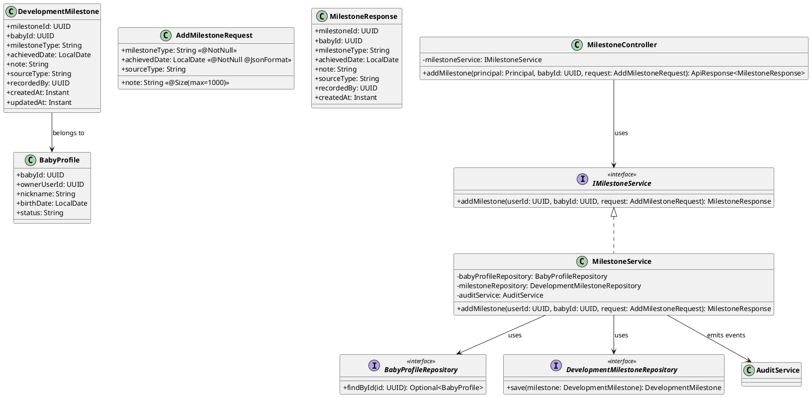
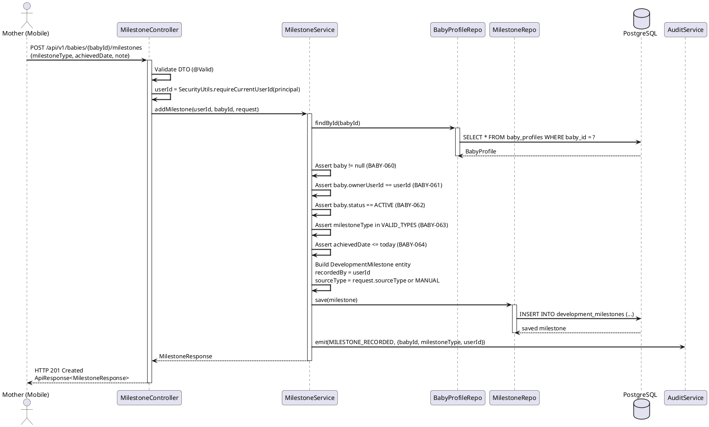
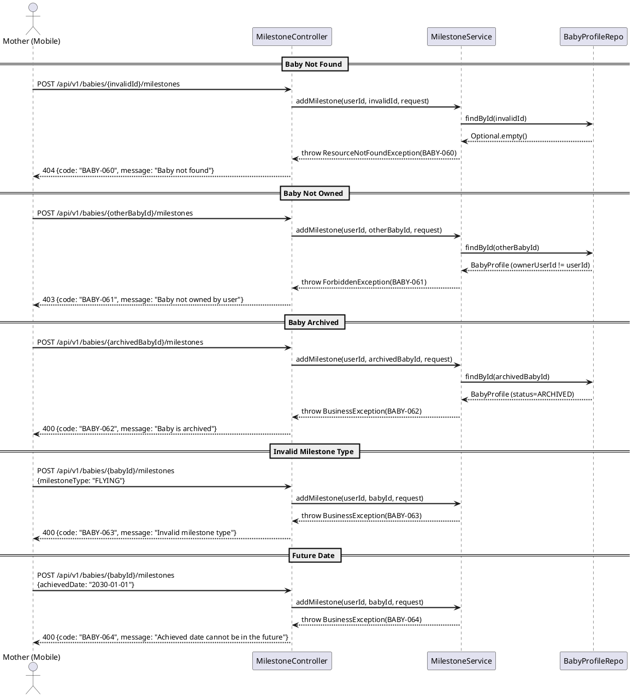

# ENGINEERING DOCUMENTATION STANDARD (EDS) v2.0
# Technical Design Specification — UC-37 Record Development Milestone

| Field | Value |
|-------|-------|
| **Document ID** | `CB-BABY-IMP-007` |
| **Version** | `1.0` |
| **Date** | `2026-06-26` |
| **Status** | `Draft` |
| **Document Owner** | `PhuongNT` |
| **Author** | `AI Agent` |
| **Reviewed by** | `[Tech Lead]` |
| **DPO Sign-off** | `[ ] Pending` |
| **Approved by** | `[Principal Architect]` |
| **Last Review** | `2026-06-26` |
| **Based on EDS** | `v2.0` |

---

## CHANGELOG

| Ngay | Nguoi thuc hien | Noi dung thay doi |
|------|-----------------|-------------------|
| 2026-06-26 | AI Agent | Tao tai lieu lan dau cho UC-37 Record Development Milestone |

---

## MUC LUC

1. [Tong quan Module](#1-tong-quan-module)
2. [Ma tran Truy vet](#2-ma-tran-truy-vet)
3. [Architecture Decision Records](#3-architecture-decision-records-adr)
4. [Non-Functional Requirements & SLA](#4-non-functional-requirements--sla)
5. [Static Modeling](#5-static-modeling)
6. [Dynamic Modeling](#6-dynamic-modeling)
7. [Domain Event Catalog](#7-domain-event-catalog)
8. [Interface Specification](#8-interface-specification)
9. [API Specification](#9-api-specification)
10. [Bang ma loi](#10-bang-ma-loi)
11. [Quy trinh Trien khai](#11-quy-trinh-trien-khai)
12. [Rollback & Incident Runbook](#12-rollback--incident-runbook)
13. [Kich ban Kiem thu](#13-kich-ban-kiem-thu)
14. [Phuong phap Xac minh](#14-phuong-phap-xac-minh)
15. [Mau thu thuc te](#15-mau-thu-thuc-te)
16. [Authorization Matrix](#16-bang-tong-hop-phan-quyen)
17. [AI Prompt Constraints](#17-ai-prompt-constraints-case-20)

---

## 1. Tong quan Module

| Field | Value |
|-------|-------|
| **Module Name** | `RecordDevelopmentMilestone` |
| **Bounded Context** | `carejourney` |
| **UC ID** | `UC-37` |
| **SRS Reference** | `3.3.1.14` |
| **Primary Actor** | `Mother (ROLE_MOTHER -- authenticated)` |
| **Platform** | `Mobile App` |
| **Data Classification** | `PII` |
| **Compliance Scope** | `BR-RBAC, BR-PRIVACY` |
| **Upstream Dependencies** | `auth (JWT), baby (baby_profiles)` |
| **Downstream Consumers** | `growth tracking, baby timeline, audit` |

**Mo ta:** Cho phep Mother ghi lai cac moc phat trien cua em be (lat nguoi, bo, di, noi, moc rang, an dam, cuoi, ngoi, dung) voi ngay dat duoc va ghi chu. Thong tin nay phuc vu theo doi phat trien em be theo thoi gian. He thong chi ghi nhan su kien, khong dua ra bat ky dieu gi mang tinh y khoa.

---

## 2. Ma tran Truy vet

| Requirement ID | Loai | Mo ta yeu cau | Thanh phan Code | Compliance Target | ADR lien quan |
|----------------|------|---------------|-----------------|-------------------|---------------|
| UC-37 | Use Case | Mother ghi lai moc phat trien em be | `MilestoneController.addMilestone()` | BR-RBAC | ADR-BABY-007-001 |
| BR-RBAC | Business Rule | Chi Mother so huu baby moi duoc ghi milestone | `MilestoneService.addMilestone()` ownership check | BR-RBAC | -- |
| BR-PRIVACY | Business Rule | Du lieu baby thuoc ve Mother | ownership gate on baby_profiles | BR-PRIVACY | -- |
| BR-SAFETY | Business Rule | Khong dua ra nhan dinh y khoa -- chi ghi nhan su kien | Service layer -- no medical interpretation | BR-SAFETY | ADR-BABY-007-003 |
| ADR-BABY-007-001 | Decision | Cho phep duplicate milestone_type cho cung baby | `MilestoneService` -- no uniqueness check | Data Integrity | -- |
| ADR-BABY-007-002 | Decision | achievedDate khong duoc o tuong lai | `@PastOrPresent` + service validation | Data Integrity | -- |

---

## 3. Architecture Decision Records (ADR)

### ADR-BABY-007-001 -- Allow Duplicate Milestone Types

| Field | Value |
|-------|-------|
| **Status** | `Accepted` |
| **Deciders** | `PhuongNT -- Developer` |
| **Date** | `2026-06-26` |

#### Boi canh (Context)
Mot so moc phat trien co the xay ra nhieu lan. Vi du: TEETHING xay ra nhieu lan khi moi rang moc. WALKING co the duoc ghi nhan nhieu lan (buoc dau tien, di tu lap, v.v.).

#### Cac phuong an da xem xet

| Phuong an | Mo ta | Uu diem | Nhuoc diem |
|-----------|-------|----------|------------|
| A | Unique constraint (baby_id, milestone_type) | Don gian | Khong phu hop voi thuc te -- TEETHING xay ra nhieu lan |
| B | Cho phep duplicate milestone_type | Phan anh thuc te cham soc tre | Nhieu ban ghi hon |

#### Quyet dinh
Chon **Phuong an B** -- cho phep duplicate milestone_type. Mot em be co the dat duoc cung mot loai milestone nhieu lan (vi du: nhieu rang moc o cac thoi diem khac nhau).

#### He qua
**Tich cuc:** Phan anh chinh xac qua trinh phat trien thuc te cua tre.
**Tieu cuc / Trade-offs:** Nhieu ban ghi hon trong DB -- chap nhan duoc vi du lieu milestone it.

---

### ADR-BABY-007-002 -- achievedDate Must Not Be in Future

| Field | Value |
|-------|-------|
| **Status** | `Accepted` |
| **Deciders** | `PhuongNT -- Developer` |
| **Date** | `2026-06-26` |

#### Boi canh (Context)
Milestone la su kien da xay ra. Ngay dat duoc phai la ngay trong qua khu hoac hom nay.

#### Quyet dinh
achievedDate phai <= today. He thong tu choi request voi ngay trong tuong lai (BABY-064).

#### He qua
**Tich cuc:** Dam bao tinh chinh xac cua du lieu lich su.

---

### ADR-BABY-007-003 -- No Medical Interpretation

| Field | Value |
|-------|-------|
| **Status** | `Accepted` |
| **Deciders** | `PhuongNT -- Developer` |
| **Date** | `2026-06-26` |

#### Boi canh (Context)
He thong chi ghi nhan su kien milestone. Khong dua ra bat ky danh gia y khoa nao ve tien do phat trien cua tre.

#### Quyet dinh
Backend chi luu tru va tra ve du lieu. Moi y kien chuyen mon phai thong qua Expert (UC khac). Khong co logic so sanh voi chuan WHO trong service nay.

#### He qua
**Tich cuc:** Tranh rui ro phap ly va y khoa.
**Tieu cuc / Trade-offs:** Client app muon hien thi "on track / delayed" phai tu xu ly hoac hoi Expert.

---

## 4. Non-Functional Requirements & SLA

### 4.1. Performance & Availability

| Category | Requirement | Target SLA | Measurement Method | Compliance Basis |
|----------|-------------|------------|---------------------|------------------|
| Latency | POST milestone (p99) | `< 300ms` | k6 load test | -- |
| Throughput | Concurrent requests | `100 req/s` | Load test | -- |

### 4.2. Data Integrity & Retention

| Category | Requirement | Target | Verification Method | Compliance Basis |
|----------|-------------|--------|---------------------|------------------|
| Durability | No milestone record loss | RPO = 0 | Transaction log | Data Integrity |
| Retention | Milestone data retained while baby exists | Indefinite | DB backup policy | BR-PRIVACY |

### 4.3. Security

| Category | Requirement | Target | Verification Method | Compliance Basis |
|----------|-------------|--------|---------------------|------------------|
| Access control | Role-based + ownership | Least privilege | Auth Matrix (S16) | BR-RBAC |
| Encryption in transit | All endpoints | TLS 1.3+ | SSL Labs scan | BR-PRIVACY |

---

## 5. Static Modeling

### 5.1. Class Diagram (PlantUML)



### 5.2. Data Structure (Existing Schema)

Tables `baby_profiles` and `development_milestones` already exist. No new Flyway migration required.

```sql
-- Existing table: development_milestones
-- See DB Schema in project context
-- milestone_type values: ROLLING, CRAWLING, WALKING, SPEAKING, TEETHING, WEANING, FIRST_SMILE, SITTING, STANDING
```

---

## 6. Dynamic Modeling

### 6.1. Sequence Diagram -- Happy Path



### 6.2. Sequence Diagram -- Error Path



### 6.3. State Machine

Milestone entity does not have state transitions. It is an immutable event record (insert-only). No state machine required.

---

## 7. Domain Event Catalog

### 7.1. Events Published

| Event Name | Trigger | Publisher | Subscriber(s) | Payload Schema | Async? |
|------------|---------|-----------|---------------|----------------|--------|
| `MILESTONE_RECORDED` | Mother records a milestone | `MilestoneService` | `AuditService` | See 7.3 | No |

### 7.2. Events Consumed

None. This module does not consume events from other modules.

### 7.3. Payload Schema

```java
// MILESTONE_RECORDED audit event payload
{
    "eventType": "MILESTONE_RECORDED",
    "babyId": "UUID",
    "milestoneId": "UUID",
    "milestoneType": "WALKING",
    "achievedDate": "2026-06-15",
    "recordedBy": "UUID (Mother's userId)",
    "occurredAt": "2026-06-26T10:00:00Z"
}
```

---

## 8. Interface Specification

### 8.1. Service Interface

```java
// AddMilestoneRequest.java -- Input DTO
// @version 1.0
public class AddMilestoneRequest {

    @NotNull(message = "Milestone type is required")
    private String milestoneType;    // ROLLING, CRAWLING, WALKING, SPEAKING, TEETHING, WEANING, FIRST_SMILE, SITTING, STANDING

    @NotNull(message = "Achieved date is required")
    @JsonFormat(pattern = "yyyy-MM-dd")
    private LocalDate achievedDate;

    @Size(max = 1000, message = "Note must not exceed 1000 characters")
    private String note;

    private String sourceType;       // default MANUAL if not provided

    // getters / setters
}

// MilestoneResponse.java -- Output DTO
// @version 1.0
public class MilestoneResponse {

    private UUID milestoneId;
    private UUID babyId;
    private String milestoneType;
    private LocalDate achievedDate;
    private String note;
    private String sourceType;
    private UUID recordedBy;
    private Instant createdAt;

    // getters / setters
}

// IMilestoneService.java -- Service Contract
// @version 1.0
public interface IMilestoneService {

    /**
     * Records a developmental milestone for a baby.
     * @param userId Mother's userId from JWT
     * @param babyId baby's UUID
     * @param request milestone details
     * @return MilestoneResponse with created milestone data
     * @throws ResourceNotFoundException (BABY-060) when baby not found
     * @throws ForbiddenException (BABY-061) when baby not owned by user
     * @throws BusinessException (BABY-062) when baby is archived
     * @throws BusinessException (BABY-063) when milestone type is invalid
     * @throws BusinessException (BABY-064) when achieved date is in future
     */
    MilestoneResponse addMilestone(UUID userId, UUID babyId, AddMilestoneRequest request);
}
```

### 8.2. Repository Interface

```java
// DevelopmentMilestoneRepository.java
// @version 1.0
public interface DevelopmentMilestoneRepository extends JpaRepository<DevelopmentMilestone, UUID> {

    List<DevelopmentMilestone> findByBabyIdOrderByAchievedDateDesc(UUID babyId);
}
```

---

## 9. API Specification

### 9.1. Endpoints Table

| Method | Path | Auth Level | Required Roles | Rate Limit | Idempotent? |
|--------|------|------------|----------------|------------|-------------|
| `POST` | `/api/v1/babies/{babyId}/milestones` | JWT Bearer | `MOTHER` (own baby) | 60/min | No |

### 9.2. Request / Response Schemas

#### `POST /api/v1/babies/{babyId}/milestones` -- Record Milestone

**Path Parameters:**
| Name | Type | Required | Description |
|------|------|----------|-------------|
| `babyId` | `UUID` | Yes | The baby's unique identifier |

**Request Body:**
```json
{
  "milestoneType": "WALKING",
  "achievedDate": "2026-06-15",
  "note": "First steps in living room",
  "sourceType": "MANUAL"
}
```

**Response -- 201 Created (Happy Path):**
```json
{
  "success": true,
  "data": {
    "milestoneId": "550e8400-e29b-41d4-a716-446655440000",
    "babyId": "bbbbbbbb-0000-0000-0000-000000000037",
    "milestoneType": "WALKING",
    "achievedDate": "2026-06-15",
    "note": "First steps in living room",
    "sourceType": "MANUAL",
    "recordedBy": "00000000-0000-0000-0000-000000000037",
    "createdAt": "2026-06-26T10:00:00Z"
  }
}
```

**Response -- 400 Bad Request (Invalid milestone type):**
```json
{
  "success": false,
  "error": {
    "code": "BABY-063",
    "message": "Invalid milestone type. Valid types: ROLLING, CRAWLING, WALKING, SPEAKING, TEETHING, WEANING, FIRST_SMILE, SITTING, STANDING"
  }
}
```

**Response -- 400 Bad Request (Future date):**
```json
{
  "success": false,
  "error": {
    "code": "BABY-064",
    "message": "Achieved date cannot be in the future"
  }
}
```

**Response -- 403 Forbidden (Not owner):**
```json
{
  "success": false,
  "error": {
    "code": "BABY-061",
    "message": "Baby not owned by user"
  }
}
```

**Response -- 404 Not Found:**
```json
{
  "success": false,
  "error": {
    "code": "BABY-060",
    "message": "Baby not found"
  }
}
```

---

## 10. Bang ma loi

| Code | HTTP Status | Message (EN) | Trigger Condition |
|------|-------------|--------------|-------------------|
| `BABY-060` | 404 | Baby not found | babyId does not exist in baby_profiles |
| `BABY-061` | 403 | Baby not owned by user | baby.ownerUserId != JWT userId |
| `BABY-062` | 400 | Baby is archived | baby.status == ARCHIVED |
| `BABY-063` | 400 | Invalid milestone type | milestoneType not in enum set |
| `BABY-064` | 400 | Achieved date cannot be in the future | achievedDate > today |

---

## 11. Quy trinh Trien khai

### 11.1. Prerequisites

- [ ] ADR-BABY-007-001, 002, 003 da duoc Accepted (xem S3)
- [ ] Table `development_milestones` da ton tai trong DB
- [ ] Table `baby_profiles` da ton tai trong DB

### 11.2. Pre-Migration Checklist

No new migration required. Tables already exist.

### 11.3. Implementation Steps

#### Chang 1 -- Tao DTOs

Tao `AddMilestoneRequest.java` va `MilestoneResponse.java` trong package `com.carebridge.backend.carejourney.dto`.

#### Chang 2 -- Tao Service Interface va Implementation

Tao `IMilestoneService.java` va `MilestoneService.java` trong package `com.carebridge.backend.carejourney.service`.

```java
@Service
@RequiredArgsConstructor
public class MilestoneService implements IMilestoneService {

    private static final Set<String> VALID_MILESTONE_TYPES = Set.of(
        "ROLLING", "CRAWLING", "WALKING", "SPEAKING", "TEETHING",
        "WEANING", "FIRST_SMILE", "SITTING", "STANDING"
    );

    @Override
    @Transactional
    public MilestoneResponse addMilestone(UUID userId, UUID babyId, AddMilestoneRequest request) {
        // 1. Find baby or throw BABY-060
        // 2. Check ownership or throw BABY-061
        // 3. Check baby ACTIVE or throw BABY-062
        // 4. Validate milestoneType or throw BABY-063
        // 5. Validate achievedDate <= today or throw BABY-064
        // 6. Build entity with recordedBy = userId, sourceType = MANUAL if null
        // 7. Save
        // 8. Emit MILESTONE_RECORDED audit event
        // 9. Return MilestoneResponse
    }
}
```

#### Chang 3 -- Tao Controller

Tao `MilestoneController.java` trong package `com.carebridge.backend.carejourney.controller`.

```java
@RestController
@RequestMapping("/api/v1/babies/{babyId}/milestones")
@RequiredArgsConstructor
public class MilestoneController {

    private final IMilestoneService milestoneService;

    @PostMapping
    public ResponseEntity<ApiResponse<MilestoneResponse>> addMilestone(
            Principal principal,
            @PathVariable UUID babyId,
            @Valid @RequestBody AddMilestoneRequest request) {
        UUID userId = SecurityUtils.requireCurrentUserId(principal);
        MilestoneResponse response = milestoneService.addMilestone(userId, babyId, request);
        return ResponseEntity.status(HttpStatus.CREATED)
                .body(ApiResponse.success(response));
    }
}
```

#### Chang 4 -- Verification sau deploy

```bash
curl -X POST https://[host]/api/v1/babies/{babyId}/milestones \
  -H "Authorization: Bearer [JWT_TOKEN]" \
  -H "Content-Type: application/json" \
  -d '{"milestoneType":"WALKING","achievedDate":"2026-06-15","note":"First steps"}'
# Expected: 201 Created
```

### 11.4. Deployment Checklist

- [ ] Health check endpoint tra ve 200
- [ ] POST milestone thanh cong voi valid data
- [ ] 403 khi Mother khong so huu baby
- [ ] 400 khi milestoneType khong hop le
- [ ] Audit log ghi nhan MILESTONE_RECORDED event

---

## 12. Rollback & Incident Runbook

### 12.1. Dieu kien kich hoat Rollback

| Dieu kien | Nguong | Nguoi quyet dinh |
|-----------|--------|------------------|
| Error rate tang dot bien | > 5% trong 5 phut | On-call Engineer |
| Milestone data corruption | Bat ky case nao | Tech Lead |

### 12.2. Rollback Procedure

```bash
# Buoc 1: Revert code changes
git revert [commit-hash]

# Buoc 2: Re-deploy phien ban cu
# Milestone data da insert van duoc giu nguyen (no data loss)

# Buoc 3: Verify rollback thanh cong
curl -X GET https://[host]/api/v1/health
```

### 12.3. Notification Protocol

| Thoi diem | Nguoi nhan | Kenh |
|-----------|------------|------|
| Ngay khi phat hien | On-call team | Slack #incident |
| Trong 30 phut | Tech Lead | Slack DM |

---

## 13. Kich ban Kiem thu

### 13.1. Unit Tests

#### TC-UNIT-001 -- Happy path: record WALKING milestone

```gherkin
Feature: Record Development Milestone
  Background:
    Given test data classification: SYNTHETIC
    And Mother owns an ACTIVE baby profile

  Scenario: Record WALKING milestone successfully
    Given a valid AddMilestoneRequest with milestoneType=WALKING, achievedDate=3 days ago
    When addMilestone() is called with Mother's userId and babyId
    Then a DevelopmentMilestone is saved with recordedBy = Mother's userId
    And sourceType defaults to MANUAL
    And MILESTONE_RECORDED audit event is emitted
```

#### TC-UNIT-002 -- Future achievedDate rejected

```gherkin
  Scenario: Reject future achievedDate
    Given a request with achievedDate = tomorrow
    When addMilestone() is called
    Then BusinessException is thrown with code BABY-064
    And no milestone is saved
```

### 13.2. Integration Tests

#### TC-INT-001 -- DB row with correct data

```gherkin
  Scenario: Milestone persisted correctly
    Given test data classification: SYNTHETIC
    And PostgreSQL container running
    And Mother with ACTIVE baby exists in DB
    When POST /api/v1/babies/{babyId}/milestones with valid request
    Then response status is 201
    And development_milestones table contains row with baby_id = babyId
    And recorded_by = Mother's userId
```

---

## 14. Phuong phap Xac minh

### 14.1. Database Inspection

```sql
-- Verify milestone record exists
SELECT milestone_id, baby_id, milestone_type, achieved_date, recorded_by, created_at
FROM development_milestones
WHERE baby_id = '[babyId]'
ORDER BY created_at DESC;

-- Verify recorded_by matches JWT userId
SELECT dm.milestone_id, dm.recorded_by, bp.owner_user_id
FROM development_milestones dm
JOIN baby_profiles bp ON dm.baby_id = bp.baby_id
WHERE dm.baby_id = '[babyId]';
```

### 14.2. Log / Audit Verification

```bash
# Verify MILESTONE_RECORDED event in audit log
grep "MILESTONE_RECORDED" application.log | tail -5

# Verify no PII leak in log
grep -i "password\|secret" application.log
# Expected: No output
```

---

## 15. Mau thu thuc te

### 15.1. Happy Path

```bash
# POST -- Record WALKING milestone
curl -X POST https://[host]/api/v1/babies/bbbbbbbb-0000-0000-0000-000000000037/milestones \
  -H "Authorization: Bearer [JWT_TOKEN]" \
  -H "Content-Type: application/json" \
  -d '{
    "milestoneType": "WALKING",
    "achievedDate": "2026-06-15",
    "note": "First steps in living room",
    "sourceType": "MANUAL"
  }'
```

**Expected Response (201):**
```json
{
  "success": true,
  "data": {
    "milestoneId": "...",
    "babyId": "bbbbbbbb-0000-0000-0000-000000000037",
    "milestoneType": "WALKING",
    "achievedDate": "2026-06-15",
    "note": "First steps in living room",
    "sourceType": "MANUAL",
    "recordedBy": "00000000-0000-0000-0000-000000000037",
    "createdAt": "2026-06-26T10:00:00Z"
  }
}
```

### 15.2. Error Paths

```bash
# POST -- Invalid milestone type -> 400
curl -X POST https://[host]/api/v1/babies/bbbbbbbb-0000-0000-0000-000000000037/milestones \
  -H "Authorization: Bearer [JWT_TOKEN]" \
  -H "Content-Type: application/json" \
  -d '{"milestoneType": "FLYING", "achievedDate": "2026-06-15"}'
```

**Expected Response (400):**
```json
{
  "success": false,
  "error": {
    "code": "BABY-063",
    "message": "Invalid milestone type"
  }
}
```

```bash
# POST -- No JWT -> 401
curl -X POST https://[host]/api/v1/babies/bbbbbbbb-0000-0000-0000-000000000037/milestones \
  -H "Content-Type: application/json" \
  -d '{"milestoneType": "WALKING", "achievedDate": "2026-06-15"}'
```

**Expected Response (401):**
```json
{
  "success": false,
  "error": {
    "code": "IAM-001",
    "message": "Authentication required"
  }
}
```

---

## 16. Bang tong hop phan quyen

| Endpoint | `MOTHER` | `EXPERT` | `ADMIN` | `GUEST` |
|----------|----------|----------|---------|---------|
| `POST /api/v1/babies/{babyId}/milestones` | Own baby | -- | -- | -- |

**Chu thich:**
- Own baby = Chi duoc phep voi baby ma Mother so huu (ownerUserId == JWT userId)
- -- = Bi tu choi (403)

---

## 17. AI Prompt Constraints (CASE 2.0)

### 17.1 Constraint Summary Table

| # | Constraint | Source (ADR/BR) | Last Verified |
|---|-----------|-----------------|---------------|
| C1 | Mother phai so huu baby (ownerUserId == JWT userId) truoc khi ghi milestone | `BR-RBAC` | `2026-06-26` |
| C2 | Baby phai co status ACTIVE -- khong cho ghi milestone cho baby ARCHIVED | `BR-PRIVACY` | `2026-06-26` |
| C3 | achievedDate phai <= today -- khong cho ngay tuong lai | `ADR-BABY-007-002` | `2026-06-26` |
| C4 | recordedBy = JWT userId (tu dong, khong lay tu request body) | `BR-RBAC` | `2026-06-26` |
| C5 | Emit MILESTONE_RECORDED audit event sau khi luu thanh cong | `BR-PRIVACY` | `2026-06-26` |

### 17.2 Constraint Injection Block

```
[CONSTRAINT BLOCK -- Module: RecordDevelopmentMilestone]
Theo TDS CB-BABY-IMP-007 va cac ADR lien quan:

1. C1: Mother phai so huu baby (baby.ownerUserId == JWT userId). Neu khong -> 403 BABY-061.
2. C2: Baby phai co status ACTIVE. Baby ARCHIVED -> 400 BABY-062.
3. C3: achievedDate <= today. Ngay tuong lai -> 400 BABY-064.
4. C4: recorded_by = JWT userId (lay tu SecurityUtils.requireCurrentUserId, KHONG tu request body).
5. C5: Sau khi save milestone, goi AuditService.emit("MILESTONE_RECORDED", payload).

[CONTEXT BLOCK]
- Bounded Context: carejourney
- Data Classification: PII
- Compliance: BR-RBAC, BR-PRIVACY
- Existing interfaces: S8 Service Interface + S8.2 Repository Interface
- Error codes: S10 Error Codes Table (BABY-060 to BABY-064)
- Auth matrix: S16 Authorization Matrix

[TASK BLOCK]
Implement addMilestone thoa man constraints tren.
Output phai tuan thu S8 Interface Specification.
Tests phai cover S13 Test Scenarios.
```

### 17.3 Constraint Quality Checklist

- [x] Moi constraint traceable ve ADR hoac BR cu the
- [x] Khong co constraint generic
- [x] Moi constraint co Last Verified date <= 2 sprints
- [x] Constraint block co >= 3 constraints cu the (5 constraints)
- [x] Constraint block reference S8 Interface
- [x] Constraint block reference S16 Auth Matrix

### 17.4 Anti-Pattern Detection

| AP-ID | Anti-Pattern | Dau hieu | Hanh dong |
|-------|-------------|-----------|----------|
| AP-AI-001 | Unconstrained Gen | Code khong match bat ky constraint C1-C5 nao | Reject -- inject lai constraints |
| AP-AI-003 | Implicit Decision | Code assume architecture khong co trong S3 ADR | Reject -- viet ADR truoc |
| AP-AI-005 | Hallucinated Contract | Code import service/type khong co trong S8 | Reject -- verify contract existence |

---

## PHU LUC

### A. Glossary

| Thuat ngu | Dinh nghia |
|-----------|------------|
| Milestone | Moc phat trien cua tre (lat nguoi, bo, di, noi, v.v.) |
| TEETHING | Moc rang -- co the xay ra nhieu lan |
| recorded_by | UUID cua Mother ghi nhan milestone (tu JWT) |
| sourceType | Nguon ghi nhan: MANUAL (nguoi nhap) hoac DEVICE (thiet bi) |

### B. Tai lieu tham chieu

| Document | Link / Path |
|----------|-------------|
| SRS 3.3.1.14 | Record Development Milestone |
| Baby Profile TDS | `04_Implement/UC31_CreateBabyProfile/UC31_CreateBabyProfile_TDS.md` |
| CASE 2.0 Methodology | `vii_reports/FPT-EDU-REP-METH-002_CASE_AI_METHODOLOGY_v1.1.md` |

---

*EDS v2.0 -- Tich hop CASE 2.0 AI Prompt Constraints (S17).*
