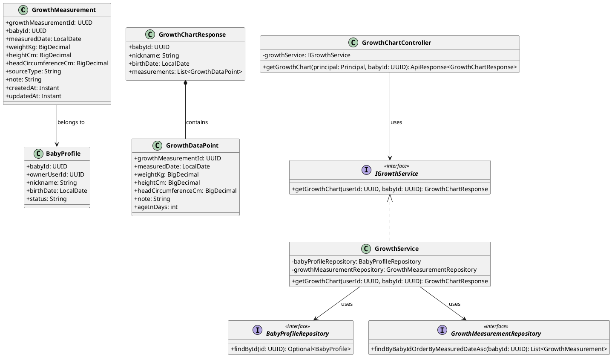
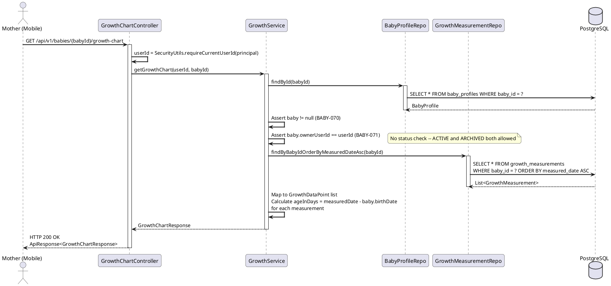
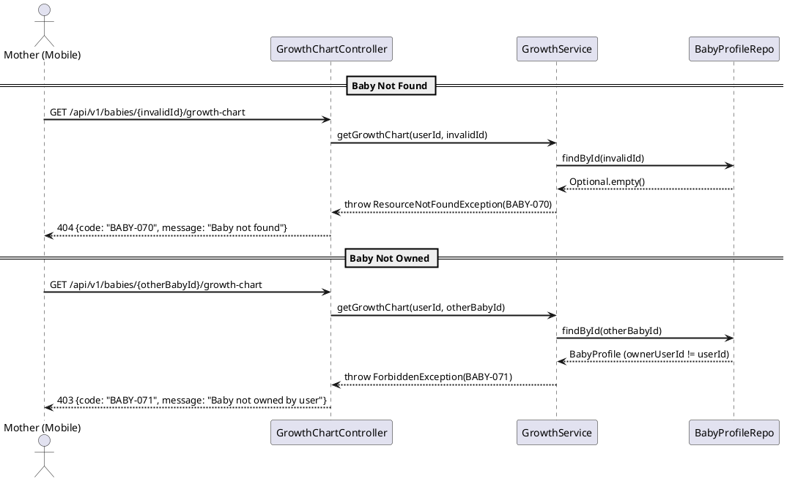

# ENGINEERING DOCUMENTATION STANDARD (EDS) v2.0
# Technical Design Specification — UC-38 View Growth Chart

| Field | Value |
|-------|-------|
| **Document ID** | `CB-BABY-IMP-008` |
| **Version** | `1.0` |
| **Date** | `2026-06-26` |
| **Status** | `Approved` |
| **Document Owner** | `PhuongNT` |
| **Author** | `AI Agent` |
| **Reviewed by** | `[Tech Lead]` |
| **DPO Sign-off** | `[ ] Pending` |
| **Approved by** | `[Principal Architect]` |
| **Last Review** | `2026-06-26` |
| **Based on EDS** | `v2.0` |

---

## CHANGELOG

| Ngay | Nguoi thuc hien | Noi dung thay doi |
|------|-----------------|-------------------|
| 2026-06-26 | AI Agent | Tao tai lieu lan dau cho UC-38 View Growth Chart |
| 2026-07-04 | AI Agent — Amelia (Dev Agent) | Implemented GrowthServiceImpl, GrowthMeasurement entity/repository, GrowthChartController, DTOs — 5/5 service unit tests GREEN |

---

## MUC LUC

1. [Tong quan Module](#1-tong-quan-module)
2. [Ma tran Truy vet](#2-ma-tran-truy-vet)
3. [Architecture Decision Records](#3-architecture-decision-records-adr)
4. [Non-Functional Requirements & SLA](#4-non-functional-requirements--sla)
5. [Static Modeling](#5-static-modeling)
6. [Dynamic Modeling](#6-dynamic-modeling)
7. [Domain Event Catalog](#7-domain-event-catalog)
8. [Interface Specification](#8-interface-specification)
9. [API Specification](#9-api-specification)
10. [Bang ma loi](#10-bang-ma-loi)
11. [Quy trinh Trien khai](#11-quy-trinh-trien-khai)
12. [Rollback & Incident Runbook](#12-rollback--incident-runbook)
13. [Kich ban Kiem thu](#13-kich-ban-kiem-thu)
14. [Phuong phap Xac minh](#14-phuong-phap-xac-minh)
15. [Mau thu thuc te](#15-mau-thu-thuc-te)
16. [Authorization Matrix](#16-bang-tong-hop-phan-quyen)
17. [AI Prompt Constraints](#17-ai-prompt-constraints-case-20)

---

## 1. Tong quan Module

| Field | Value |
|-------|-------|
| **Module Name** | `ViewGrowthChart` |
| **Bounded Context** | `carejourney` |
| **UC ID** | `UC-38` |
| **SRS Reference** | `3.3.1.15` |
| **Primary Actor** | `Mother (ROLE_MOTHER -- authenticated)` |
| **Platform** | `Mobile App` |
| **Data Classification** | `PII` |
| **Compliance Scope** | `BR-RBAC, BR-PRIVACY` |
| **Upstream Dependencies** | `auth (JWT), baby (baby_profiles), growth_measurements` |
| **Downstream Consumers** | `Mobile app chart rendering, audit` |

**Mo ta:** Hien thi du lieu can nang, chieu cao va chu vi vong dau cua em be theo thoi gian duoi dang chuoi thoi gian (time-series) de client rendering chart. Bao gom tinh toan tuoi tinh theo ngay (ageInDays) tu ngay sinh cua be. Khong dua ra bat ky nhan dinh y khoa nao -- chi tra ve du lieu tho. Loi khuyen "hoi chuyen gia" la UI logic phia client, khong phai backend.

---

## 2. Ma tran Truy vet

| Requirement ID | Loai | Mo ta yeu cau | Thanh phan Code | Compliance Target | ADR lien quan |
|----------------|------|---------------|-----------------|-------------------|---------------|
| UC-38 | Use Case | Mother xem bieu do tang truong | `GrowthChartController.getGrowthChart()` | BR-RBAC | ADR-BABY-008-001 |
| BR-RBAC | Business Rule | Chi Mother so huu baby moi duoc xem | `GrowthService.getGrowthChart()` ownership check | BR-RBAC | -- |
| BR-PRIVACY | Business Rule | Du lieu baby thuoc ve Mother | ownership gate on baby_profiles | BR-PRIVACY | -- |
| BR-SAFETY | Business Rule | Khong dua ra nhan dinh y khoa ve du lieu tang truong | Service layer -- raw data only | BR-SAFETY | ADR-BABY-008-003 |
| ADR-BABY-008-001 | Decision | Tra ve du lieu tho -- client tu render chart | `GrowthService` returns data points | UX | -- |
| ADR-BABY-008-002 | Decision | Cho phep xem growth chart cua baby ARCHIVED | `GrowthService` -- no status gate | Data Access | -- |

---

## 3. Architecture Decision Records (ADR)

### ADR-BABY-008-001 -- Return Raw Data, Client Renders Chart

| Field | Value |
|-------|-------|
| **Status** | `Accepted` |
| **Deciders** | `PhuongNT -- Developer` |
| **Date** | `2026-06-26` |

#### Boi canh (Context)
Growth chart co the duoc hien thi duoi nhieu dang (line chart, area chart, so sanh voi WHO). Backend khong nen tao anh/SVG ma chi tra ve du lieu time-series de client linh hoat render.

#### Cac phuong an da xem xet

| Phuong an | Mo ta | Uu diem | Nhuoc diem |
|-----------|-------|----------|------------|
| A | Server-side chart generation (SVG/PNG) | Thong nhat UI | Backend phuc tap, khong linh hoat |
| B | Return raw data points, client renders | Don gian, linh hoat, reusable | Client can chart library |

#### Quyet dinh
Chon **Phuong an B** -- Backend chi tra ve danh sach cac diem do (measured_date, weight_kg, height_cm, head_circumference_cm). Client app (Flutter) su dung chart library de render.

#### He qua
**Tich cuc:** Backend don gian. Client co the tuy chinh chart theo y muon.
**Tieu cuc / Trade-offs:** Client phai tu xu ly chart rendering.

---

### ADR-BABY-008-002 -- Allow Viewing ARCHIVED Baby Growth Chart

| Field | Value |
|-------|-------|
| **Status** | `Accepted` |
| **Deciders** | `PhuongNT -- Developer` |
| **Date** | `2026-06-26` |

#### Boi canh (Context)
Khac voi cac UC ghi du lieu (UC32, UC34) yeu cau baby ACTIVE, xem growth chart la thao tac doc (read-only). Du lieu tang truong co gia tri lich su va Mother nen duoc xem bat ke trang thai baby.

#### Quyet dinh
Cho phep GET growth chart cho ca baby ACTIVE lan ARCHIVED. Khong ap dung status gate cho thao tac doc nay.

#### He qua
**Tich cuc:** Mother co the xem lai du lieu tang truong cua baby da duoc archive.
**Tieu cuc / Trade-offs:** Khong co -- day la thao tac read-only, khong rui ro.

---

### ADR-BABY-008-003 -- No Medical Interpretation

| Field | Value |
|-------|-------|
| **Status** | `Accepted` |
| **Deciders** | `PhuongNT -- Developer` |
| **Date** | `2026-06-26` |

#### Boi canh (Context)
SRS de cap "prompts to ask an expert when needed". Day la UI prompt phia client, khong phai backend logic. Backend chi tra ve du lieu tho -- khong so sanh voi chuan WHO, khong dua ra danh gia "on track / delayed".

#### Quyet dinh
Backend khong thuc hien bat ky phan tich y khoa nao. "Ask an expert" la feature UI-only (client-side button/prompt).

#### He qua
**Tich cuc:** Tranh rui ro phap ly va y khoa.
**Tieu cuc / Trade-offs:** WHO percentile comparison la future enhancement, khong nam trong MVP.

---

## 4. Non-Functional Requirements & SLA

### 4.1. Performance & Availability

| Category | Requirement | Target SLA | Measurement Method | Compliance Basis |
|----------|-------------|------------|---------------------|------------------|
| Latency | GET growth chart (p99) | `< 300ms` | k6 load test | -- |
| Throughput | Concurrent requests | `200 req/s` | Load test | -- |

### 4.2. Data Integrity & Retention

| Category | Requirement | Target | Verification Method | Compliance Basis |
|----------|-------------|--------|---------------------|------------------|
| Consistency | measurements sorted by measured_date ASC | 100% | Integration test | Data Integrity |
| Accuracy | ageInDays = measuredDate - birthDate | 100% | Unit test | Data Integrity |

### 4.3. Security

| Category | Requirement | Target | Verification Method | Compliance Basis |
|----------|-------------|--------|---------------------|------------------|
| Access control | Role-based + ownership | Least privilege | Auth Matrix (S16) | BR-RBAC |
| Encryption in transit | All endpoints | TLS 1.3+ | SSL Labs scan | BR-PRIVACY |

---

## 5. Static Modeling

### 5.1. Class Diagram (PlantUML)



### 5.2. Data Structure (Existing Schema)

Tables `baby_profiles` and `growth_measurements` already exist. No new Flyway migration required.

```sql
-- Existing table: growth_measurements
-- See DB Schema in project context
-- Columns: growth_measurement_id, baby_id, measured_date, weight_kg, height_cm, head_circumference_cm, source_type, note, created_at, updated_at
```

---

## 6. Dynamic Modeling

### 6.1. Sequence Diagram -- Happy Path



### 6.2. Sequence Diagram -- Error Path



### 6.3. State Machine

Not applicable. This is a read-only endpoint with no state transitions.

---

## 7. Domain Event Catalog

### 7.1. Events Published

None. This is a read-only endpoint -- no domain events are published.

### 7.2. Events Consumed

None.

---

## 8. Interface Specification

### 8.1. Service Interface

```java
// GrowthChartResponse.java -- Output DTO
// @version 1.0
public class GrowthChartResponse {

    private UUID babyId;
    private String nickname;
    private LocalDate birthDate;
    private List<GrowthDataPoint> measurements;

    // getters / setters
}

// GrowthDataPoint.java -- Nested DTO
// @version 1.0
public class GrowthDataPoint {

    private UUID growthMeasurementId;
    private LocalDate measuredDate;
    private BigDecimal weightKg;
    private BigDecimal heightCm;
    private BigDecimal headCircumferenceCm;
    private String note;
    private int ageInDays;    // calculated: measuredDate - baby.birthDate (in service, not DB)

    // getters / setters
}

// IGrowthService.java -- Service Contract
// @version 1.0
public interface IGrowthService {

    /**
     * Returns growth chart data for a baby.
     * Measurements sorted by measured_date ASC for time-series charting.
     * ageInDays is calculated from baby.birthDate in the service layer.
     *
     * @param userId Mother's userId from JWT
     * @param babyId baby's UUID
     * @return GrowthChartResponse with baby info and measurements list
     * @throws ResourceNotFoundException (BABY-070) when baby not found
     * @throws ForbiddenException (BABY-071) when baby not owned by user
     */
    GrowthChartResponse getGrowthChart(UUID userId, UUID babyId);
}
```

### 8.2. Repository Interface

```java
// GrowthMeasurementRepository.java
// @version 1.0
public interface GrowthMeasurementRepository extends JpaRepository<GrowthMeasurement, UUID> {

    List<GrowthMeasurement> findByBabyIdOrderByMeasuredDateAsc(UUID babyId);
}
```

---

## 9. API Specification

### 9.1. Endpoints Table

| Method | Path | Auth Level | Required Roles | Rate Limit | Idempotent? |
|--------|------|------------|----------------|------------|-------------|
| `GET` | `/api/v1/babies/{babyId}/growth-chart` | JWT Bearer | `MOTHER` (own baby) | 300/min | Yes |

### 9.2. Request / Response Schemas

#### `GET /api/v1/babies/{babyId}/growth-chart` -- View Growth Chart

**Path Parameters:**
| Name | Type | Required | Description |
|------|------|----------|-------------|
| `babyId` | `UUID` | Yes | The baby's unique identifier |

**Request Body:** None (GET request)

**Response -- 200 OK (Happy Path -- with measurements):**
```json
{
  "success": true,
  "data": {
    "babyId": "bbbbbbbb-0000-0000-0000-000000000038",
    "nickname": "Growth Baby",
    "birthDate": "2026-01-15",
    "measurements": [
      {
        "growthMeasurementId": "aaaa0001-0000-0000-0000-000000000001",
        "measuredDate": "2026-02-15",
        "weightKg": 4.2,
        "heightCm": 52,
        "headCircumferenceCm": 35,
        "note": "1 month checkup",
        "ageInDays": 31
      },
      {
        "growthMeasurementId": "aaaa0002-0000-0000-0000-000000000002",
        "measuredDate": "2026-03-15",
        "weightKg": 5.1,
        "heightCm": 55,
        "headCircumferenceCm": 37,
        "note": "2 month checkup",
        "ageInDays": 59
      }
    ]
  }
}
```

**Response -- 200 OK (No measurements yet):**
```json
{
  "success": true,
  "data": {
    "babyId": "bbbbbbbb-0000-0000-0000-000000000038",
    "nickname": "Growth Baby",
    "birthDate": "2026-01-15",
    "measurements": []
  }
}
```

**Response -- 403 Forbidden (Not owner):**
```json
{
  "success": false,
  "error": {
    "code": "BABY-071",
    "message": "Baby not owned by user"
  }
}
```

**Response -- 404 Not Found:**
```json
{
  "success": false,
  "error": {
    "code": "BABY-070",
    "message": "Baby not found"
  }
}
```

---

## 10. Bang ma loi

| Code | HTTP Status | Message (EN) | Trigger Condition |
|------|-------------|--------------|-------------------|
| `BABY-070` | 404 | Baby not found | babyId does not exist in baby_profiles |
| `BABY-071` | 403 | Baby not owned by user | baby.ownerUserId != JWT userId |

---

## 11. Quy trinh Trien khai

### 11.1. Prerequisites

- [x] ADR-BABY-008-001, 002, 003 da duoc Accepted (xem S3)
- [x] Table `growth_measurements` da ton tai trong DB
- [x] Table `baby_profiles` da ton tai trong DB

### 11.2. Pre-Migration Checklist

No new migration required. Tables already exist.

### 11.3. Implementation Steps

#### Chang 1 -- Tao DTOs

Tao `GrowthChartResponse.java` va `GrowthDataPoint.java` trong package `com.carebridge.backend.carejourney.dto`.

#### Chang 2 -- Tao Service Interface va Implementation

Tao `IGrowthService.java` va `GrowthService.java` trong package `com.carebridge.backend.carejourney.service`.

```java
@Service
@RequiredArgsConstructor
public class GrowthService implements IGrowthService {

    @Override
    @Transactional(readOnly = true)
    public GrowthChartResponse getGrowthChart(UUID userId, UUID babyId) {
        // 1. Find baby or throw BABY-070
        // 2. Check ownership or throw BABY-071
        // 3. NO status check -- ACTIVE and ARCHIVED both allowed (ADR-BABY-008-002)
        // 4. Fetch measurements sorted by measured_date ASC
        // 5. Map to GrowthDataPoint list
        //    - Calculate ageInDays = ChronoUnit.DAYS.between(baby.birthDate, m.measuredDate)
        //    - If baby.birthDate is null, ageInDays = 0 (defensive)
        // 6. Build and return GrowthChartResponse
    }
}
```

#### Chang 3 -- Tao Controller

Tao `GrowthChartController.java` trong package `com.carebridge.backend.carejourney.controller`.

```java
@RestController
@RequestMapping("/api/v1/babies/{babyId}/growth-chart")
@RequiredArgsConstructor
public class GrowthChartController {

    private final IGrowthService growthService;

    @GetMapping
    public ResponseEntity<ApiResponse<GrowthChartResponse>> getGrowthChart(
            Principal principal,
            @PathVariable UUID babyId) {
        UUID userId = SecurityUtils.requireCurrentUserId(principal);
        GrowthChartResponse response = growthService.getGrowthChart(userId, babyId);
        return ResponseEntity.ok(ApiResponse.success(response));
    }
}
```

#### Chang 4 -- Verification sau deploy

```bash
curl -X GET https://[host]/api/v1/babies/{babyId}/growth-chart \
  -H "Authorization: Bearer [JWT_TOKEN]"
# Expected: 200 OK with measurements array
```

### 11.4. Deployment Checklist

- [ ] Health check endpoint tra ve 200
- [ ] GET growth chart tra ve du lieu dung
- [ ] 403 khi Mother khong so huu baby
- [ ] 200 voi empty measurements khi chua co du lieu
- [ ] 200 cho baby ARCHIVED (per ADR-BABY-008-002)

---

## 12. Rollback & Incident Runbook

### 12.1. Dieu kien kich hoat Rollback

| Dieu kien | Nguong | Nguoi quyet dinh |
|-----------|--------|------------------|
| Error rate tang dot bien | > 5% trong 5 phut | On-call Engineer |
| Response data corruption | Bat ky case nao | Tech Lead |

### 12.2. Rollback Procedure

```bash
# Buoc 1: Revert code changes
git revert [commit-hash]

# Buoc 2: Re-deploy phien ban cu
# Read-only endpoint -- no data impact

# Buoc 3: Verify rollback thanh cong
curl -X GET https://[host]/api/v1/health
```

### 12.3. Notification Protocol

| Thoi diem | Nguoi nhan | Kenh |
|-----------|------------|------|
| Ngay khi phat hien | On-call team | Slack #incident |
| Trong 30 phut | Tech Lead | Slack DM |

---

## 13. Kich ban Kiem thu

### 13.1. Unit Tests

#### TC-UNIT-001 -- Happy path: GET growth chart with measurements

```gherkin
Feature: View Growth Chart
  Background:
    Given test data classification: SYNTHETIC
    And Mother owns a baby profile

  Scenario: View growth chart with measurements
    Given 2 growth measurements exist for baby, measured on 2026-02-15 and 2026-03-15
    And baby birthDate is 2026-01-15
    When getGrowthChart() is called with Mother's userId and babyId
    Then response contains 2 measurements sorted by measured_date ASC
    And ageInDays for first measurement is 31 (2026-02-15 - 2026-01-15)
    And ageInDays for second measurement is 59 (2026-03-15 - 2026-01-15)
```

#### TC-UNIT-002 -- No measurements -> empty list

```gherkin
  Scenario: View growth chart with no measurements
    Given no growth measurements exist for baby
    When getGrowthChart() is called
    Then response contains empty measurements list
    And response status is 200 (not 404)
```

#### TC-UNIT-003 -- Archived baby allowed

```gherkin
  Scenario: View growth chart for archived baby
    Given baby has status ARCHIVED with existing measurements
    When getGrowthChart() is called
    Then response contains measurements (no status gate)
```

### 13.2. Integration Tests

#### TC-INT-001 -- Sorted data with ageInDays

```gherkin
  Scenario: Growth data sorted and ageInDays calculated
    Given test data classification: SYNTHETIC
    And PostgreSQL container running
    And Mother with baby (birthDate 2026-01-15) exists in DB
    And 3 growth measurements seeded for dates: 2026-04-15, 2026-02-15, 2026-03-15
    When GET /api/v1/babies/{babyId}/growth-chart
    Then response status is 200
    And measurements are sorted: 2026-02-15, 2026-03-15, 2026-04-15
    And ageInDays = [31, 59, 90] respectively
```

---

## 14. Phuong phap Xac minh

### 14.1. Database Inspection

```sql
-- Verify measurements exist for baby
SELECT growth_measurement_id, baby_id, measured_date, weight_kg, height_cm, head_circumference_cm
FROM growth_measurements
WHERE baby_id = '[babyId]'
ORDER BY measured_date ASC;

-- Verify sort order
SELECT measured_date FROM growth_measurements
WHERE baby_id = '[babyId]'
ORDER BY measured_date ASC;
```

### 14.2. Log / Audit Verification

```bash
# Read-only endpoint -- no audit events expected
# Verify no PII leak in log
grep -i "password\|secret" application.log
# Expected: No output
```

---

## 15. Mau thu thuc te

### 15.1. Happy Path

```bash
# GET -- View growth chart
curl -X GET https://[host]/api/v1/babies/bbbbbbbb-0000-0000-0000-000000000038/growth-chart \
  -H "Authorization: Bearer [JWT_TOKEN]"
```

**Expected Response (200):**
```json
{
  "success": true,
  "data": {
    "babyId": "bbbbbbbb-0000-0000-0000-000000000038",
    "nickname": "Growth Baby",
    "birthDate": "2026-01-15",
    "measurements": [
      {
        "growthMeasurementId": "...",
        "measuredDate": "2026-02-15",
        "weightKg": 4.2,
        "heightCm": 52,
        "headCircumferenceCm": 35,
        "note": "1 month checkup",
        "ageInDays": 31
      }
    ]
  }
}
```

### 15.2. Error Paths

```bash
# GET -- Baby not owned -> 403
curl -X GET https://[host]/api/v1/babies/other-baby-id/growth-chart \
  -H "Authorization: Bearer [JWT_TOKEN]"
```

**Expected Response (403):**
```json
{
  "success": false,
  "error": {
    "code": "BABY-071",
    "message": "Baby not owned by user"
  }
}
```

```bash
# GET -- No JWT -> 401
curl -X GET https://[host]/api/v1/babies/bbbbbbbb-0000-0000-0000-000000000038/growth-chart
```

**Expected Response (401):**
```json
{
  "success": false,
  "error": {
    "code": "IAM-001",
    "message": "Authentication required"
  }
}
```

---

## 16. Bang tong hop phan quyen

| Endpoint | `MOTHER` | `EXPERT` | `ADMIN` | `GUEST` |
|----------|----------|----------|---------|---------|
| `GET /api/v1/babies/{babyId}/growth-chart` | Own baby (ACTIVE or ARCHIVED) | -- (needs consent) | -- | -- |

**Chu thich:**
- Own baby = Chi duoc phep voi baby ma Mother so huu (ownerUserId == JWT userId)
- ACTIVE or ARCHIVED: Ca hai trang thai deu duoc phep cho read-only view
- -- = Bi tu choi (403)

---

## 17. AI Prompt Constraints (CASE 2.0)

### 17.1 Constraint Summary Table

| # | Constraint | Source (ADR/BR) | Last Verified |
|---|-----------|-----------------|---------------|
| C1 | Mother phai so huu baby (ownerUserId == JWT userId) truoc khi xem growth chart | `BR-RBAC` | `2026-06-26` |
| C2 | Cho phep xem growth chart cho baby ARCHIVED -- khong ap dung status gate | `ADR-BABY-008-002` | `2026-06-26` |
| C3 | Measurements phai duoc sap xep theo measured_date ASC (cho time-series charting) | `ADR-BABY-008-001` | `2026-06-26` |
| C4 | ageInDays = measuredDate - birthDate, tinh trong service layer (KHONG tinh trong DB query) | `ADR-BABY-008-001` | `2026-06-26` |
| C5 | Khong dua ra bat ky nhan dinh y khoa nao ve du lieu tang truong -- chi tra ve du lieu tho | `BR-SAFETY / ADR-BABY-008-003` | `2026-06-26` |

### 17.2 Constraint Injection Block

```
[CONSTRAINT BLOCK -- Module: ViewGrowthChart]
Theo TDS CB-BABY-IMP-008 va cac ADR lien quan:

1. C1: Mother phai so huu baby (baby.ownerUserId == JWT userId). Neu khong -> 403 BABY-071.
2. C2: Cho phep xem growth chart cho ca baby ACTIVE lan ARCHIVED (ADR-BABY-008-002). KHONG check status.
3. C3: Measurements phai sorted theo measured_date ASC. Su dung repository method findByBabyIdOrderByMeasuredDateAsc().
4. C4: ageInDays = ChronoUnit.DAYS.between(baby.birthDate, measurement.measuredDate). Tinh trong service, KHONG trong DB. Neu birthDate null -> ageInDays = 0.
5. C5: KHONG dua ra nhan dinh y khoa. KHONG so sanh voi WHO percentiles. Chi tra ve du lieu tho.

[CONTEXT BLOCK]
- Bounded Context: carejourney
- Data Classification: PII
- Compliance: BR-RBAC, BR-PRIVACY
- Existing interfaces: S8 Service Interface + S8.2 Repository Interface
- Error codes: S10 Error Codes Table (BABY-070, BABY-071)
- Auth matrix: S16 Authorization Matrix

[TASK BLOCK]
Implement getGrowthChart thoa man constraints tren.
Output phai tuan thu S8 Interface Specification.
Tests phai cover S13 Test Scenarios.
```

### 17.3 Constraint Quality Checklist

- [x] Moi constraint traceable ve ADR hoac BR cu the
- [x] Khong co constraint generic
- [x] Moi constraint co Last Verified date <= 2 sprints
- [x] Constraint block co >= 3 constraints cu the (5 constraints)
- [x] Constraint block reference S8 Interface
- [x] Constraint block reference S16 Auth Matrix

### 17.4 Anti-Pattern Detection

| AP-ID | Anti-Pattern | Dau hieu | Hanh dong |
|-------|-------------|-----------|----------|
| AP-AI-001 | Unconstrained Gen | Code khong match bat ky constraint C1-C5 nao | Reject -- inject lai constraints |
| AP-AI-003 | Implicit Decision | Code assume architecture khong co trong S3 ADR | Reject -- viet ADR truoc |
| AP-AI-005 | Hallucinated Contract | Code import service/type khong co trong S8 | Reject -- verify contract existence |

---

## PHU LUC

### A. Glossary

| Thuat ngu | Dinh nghia |
|-----------|------------|
| Growth Chart | Bieu do tang truong -- hien thi weight, height, head circumference theo thoi gian |
| ageInDays | Tuoi tinh theo ngay: measuredDate - birthDate |
| Time-series | Du lieu theo chuoi thoi gian, sorted ASC |
| WHO Percentile | Chuan tang truong cua WHO -- KHONG nam trong MVP |

### B. Tai lieu tham chieu

| Document | Link / Path |
|----------|-------------|
| SRS 3.3.1.15 | View Growth Chart |
| Baby Profile TDS | `04_Implement/UC31_CreateBabyProfile/UC31_CreateBabyProfile_TDS.md` |
| CASE 2.0 Methodology | `vii_reports/FPT-EDU-REP-METH-002_CASE_AI_METHODOLOGY_v1.1.md` |

---

*EDS v2.0 -- Tich hop CASE 2.0 AI Prompt Constraints (S17).*
