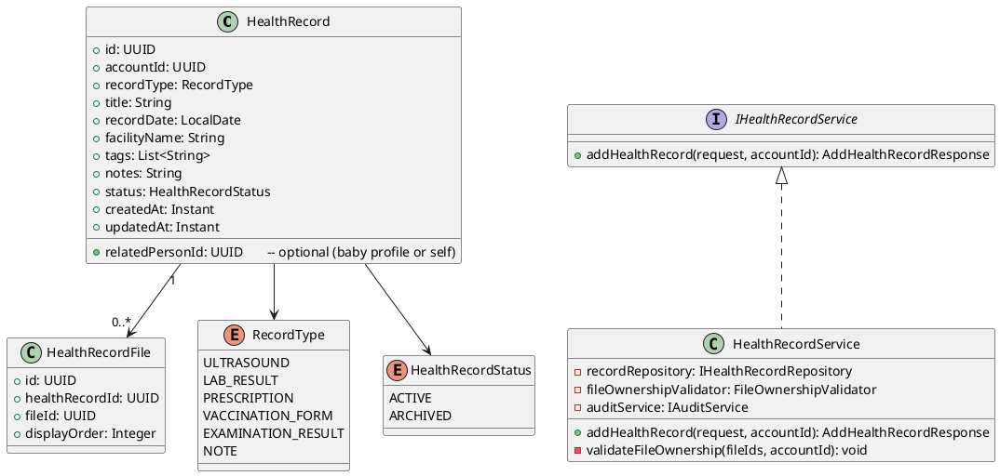
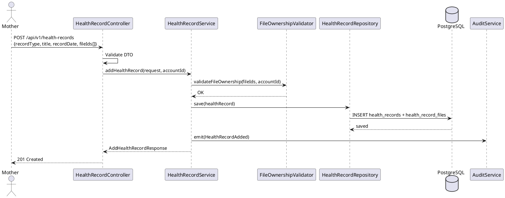
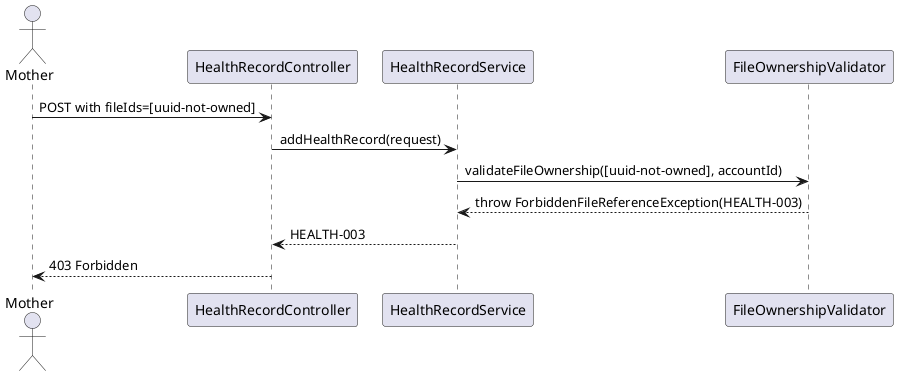

# ENGINEERING DOCUMENTATION STANDARD (EDS) v2.0
# Technical Design Specification — UC-39 Add Health Record

| Field | Value |
|-------|-------|
| **Document ID** | `CB-HEALTH-IMP-001` |
| **Version** | `1.0` |
| **Date** | `2026-06-26` |
| **Status** | `Draft` |
| **Document Owner** | `PhuongNT` |
| **Author** | `AI Agent` |
| **Reviewed by** | `[Tech Lead]` |
| **DPO Sign-off** | `[ ] Pending` |
| **Approved by** | `[Principal Architect]` |
| **Last Review** | `2026-06-26` |
| **Based on EDS** | `v2.0` |

---

## CHANGELOG

| Ngày | Người thực hiện | Nội dung thay đổi |
|------|-----------------|-------------------|
| 2026-06-26 | AI Agent | Tạo tài liệu lần đầu cho UC-39 Add Health Record |

---

## MỤC LỤC

1. [Tổng quan Module](#1-tổng-quan-module)
2. [Ma trận Truy vết](#2-ma-trận-truy-vết)
3. [Architecture Decision Records](#3-architecture-decision-records)
4. [Non-Functional Requirements & SLA](#4-non-functional-requirements--sla)
5. [Static Modeling](#5-static-modeling)
6. [Dynamic Modeling](#6-dynamic-modeling)
7. [Domain Event Catalog](#7-domain-event-catalog)
8. [Interface Specification](#8-interface-specification)
9. [API Specification](#9-api-specification)
10. [Bảng mã lỗi](#10-bảng-mã-lỗi)
11. [Quy trình Triển khai](#11-quy-trình-triển-khai)
12. [Rollback & Incident Runbook](#12-rollback--incident-runbook)
13. [Kịch bản Kiểm thử](#13-kịch-bản-kiểm-thử)
14. [Phương pháp Xác minh](#14-phương-pháp-xác-minh)
15. [Mẫu thử thực tế](#15-mẫu-thử-thực-tế)
16. [Authorization Matrix](#16-authorization-matrix)
17. [AI Prompt Constraints](#17-ai-prompt-constraints-case-20)

---

## 1. Tổng quan Module

| Field | Value |
|-------|-------|
| **Module Name** | `AddHealthRecord` |
| **Bounded Context** | `health` |
| **UC ID** | `UC-39` |
| **SRS Reference** | `3.3.1.16` |
| **Primary Actor** | `Mother (ROLE_MOTHER)` |
| **Platform** | `Mobile App` |
| **Data Classification** | `Sensitive-PII` |
| **Compliance Scope** | `BR-RBAC, BR-PRIVACY, BR-SAFETY, PDPA` |
| **Upstream Dependencies** | `auth, file (UC-167 UploadFile), journey, baby` |
| **Downstream Consumers** | `health record detail (UC-211), audit, expert consultation` |

**Mô tả:** Cho phép Mother tạo bản ghi sức khỏe (health record) gồm siêu âm, kết quả xét nghiệm, đơn thuốc, phiếu tiêm chủng, kết quả khám hoặc ghi chú. Record có thể đính kèm files đã upload (tham chiếu `fileId`). Hệ thống lưu metadata và ghi audit.

---

## 2. Ma trận Truy vết

| Requirement ID | Loại | Mô tả | Thành phần Code | Compliance Target | ADR liên quan |
|----------------|------|-------|-----------------|-------------------|---------------|
| UC-39 | Use Case | Mother thêm health record | `HealthRecordController.addRecord()` | BR-RBAC | ADR-HEALTH-001 |
| BR-HEALTH-001 | Business Rule | recordType phải thuộc enum hợp lệ | `@ValidRecordType` | Data Integrity | ADR-HEALTH-001 |
| BR-HEALTH-002 | Business Rule | recordDate không được ở tương lai | `@PastOrPresent` | Data Integrity | — |
| BR-HEALTH-003 | Business Rule | fileIds (nếu có) phải thuộc sở hữu của account | `FileOwnershipValidator` | BR-PRIVACY | ADR-HEALTH-002 |
| BR-HEALTH-004 | Business Rule | Không được chẩn đoán bệnh dựa trên record | Policy ghi trong response | BR-SAFETY | — |
| BR-HEALTH-005 | Business Rule | Ghi audit event `HealthRecordAdded` | `AuditService` | PDPA | — |
| BR-PRIVACY-001 | Business Rule | Health records thuộc về account — không expose tới bên thứ ba không có consent | `@PreAuthorize` | PDPA | — |

---

## 3. Architecture Decision Records

### ADR-HEALTH-001 — Record Type Enum thay vì free-text

| Field | Value |
|-------|-------|
| **Status** | `Accepted` |
| **Date** | `2026-06-26` |

#### Quyết định
`recordType` được định nghĩa là enum: `ULTRASOUND, LAB_RESULT, PRESCRIPTION, VACCINATION_FORM, EXAMINATION_RESULT, NOTE`. Không dùng free-text để đảm bảo consistent filtering và querying.

### ADR-HEALTH-002 — File Ownership Validation trước khi link

| Field | Value |
|-------|-------|
| **Status** | `Accepted` |
| **Date** | `2026-06-26` |

#### Quyết định
Trước khi link `fileId` vào health record, Service PHẢI xác minh file đó thuộc về cùng `accountId`. Nếu không, trả về HEALTH-003 (forbidden file reference).

---

## 4. Non-Functional Requirements & SLA

| Category | Requirement | Target SLA |
|----------|-------------|------------|
| Latency (p99) | API response | `< 400ms` (do file validation overhead) |
| Availability | Uptime | `99.9%` |
| Data Retention | Audit log | 7 năm |

---

## 5. Static Modeling

### 5.1. Class Diagram



### 5.2. Data Structure

```sql
-- V22__create_health_records.sql
CREATE TYPE record_type_enum AS ENUM (
  'ULTRASOUND', 'LAB_RESULT', 'PRESCRIPTION',
  'VACCINATION_FORM', 'EXAMINATION_RESULT', 'NOTE'
);
CREATE TYPE health_record_status AS ENUM ('ACTIVE', 'ARCHIVED');

CREATE TABLE health_records (
  id                UUID                 PRIMARY KEY DEFAULT gen_random_uuid(),
  account_id        UUID                 NOT NULL,
  related_person_id UUID,                                  -- baby_profile.id or null (self)
  record_type       record_type_enum     NOT NULL,
  title             VARCHAR(255)         NOT NULL,
  record_date       DATE                 NOT NULL,
  facility_name     VARCHAR(255),
  tags              TEXT[],
  notes             TEXT,
  status            health_record_status NOT NULL DEFAULT 'ACTIVE',
  created_at        TIMESTAMPTZ          NOT NULL DEFAULT NOW(),
  updated_at        TIMESTAMPTZ          NOT NULL DEFAULT NOW(),
  created_by        UUID                 NOT NULL,

  CONSTRAINT fk_hr_account FOREIGN KEY (account_id) REFERENCES accounts(id)
);

CREATE TABLE health_record_files (
  id               UUID    PRIMARY KEY DEFAULT gen_random_uuid(),
  health_record_id UUID    NOT NULL REFERENCES health_records(id),
  file_id          UUID    NOT NULL,
  display_order    INTEGER NOT NULL DEFAULT 0,
  created_at       TIMESTAMPTZ NOT NULL DEFAULT NOW()
);

CREATE INDEX idx_hr_account_id ON health_records(account_id);
CREATE INDEX idx_hr_record_date ON health_records(record_date DESC);
CREATE INDEX idx_hrf_health_record_id ON health_record_files(health_record_id);
```

---

## 6. Dynamic Modeling

### 6.1. Sequence Diagram — Happy Path



### 6.2. Error Path — File Not Owned



---

## 7. Domain Event Catalog

| Event Name | Trigger | Publisher | Subscriber(s) | Async? |
|------------|---------|-----------|---------------|--------|
| `HealthRecordAdded` | Record saved | `HealthRecordService` | `AuditService` | No |

---

## 8. Interface Specification

```java
// AddHealthRecordRequest.java
public class AddHealthRecordRequest {
    @NotNull
    private RecordType recordType;

    @NotBlank @Size(max = 255)
    private String title;

    @NotNull @PastOrPresent
    private LocalDate recordDate;

    @Size(max = 255)
    private String facilityName;

    private List<String> tags;         // optional
    private List<UUID> fileIds;        // optional — must be owned by caller
    @Size(max = 2000)
    private String notes;
    private UUID relatedPersonId;      // optional — baby profile ID
}

// AddHealthRecordResponse.java
public class AddHealthRecordResponse {
    private UUID id;
    private String recordType;
    private String title;
    private LocalDate recordDate;
    private String status;
    private List<UUID> fileIds;
    private Instant createdAt;
}

// IHealthRecordService.java
public interface IHealthRecordService {
    /**
     * @throws ForbiddenFileReferenceException (HEALTH-003) when fileId not owned by caller
     * @throws InvalidRecordDateException (HEALTH-002) when recordDate in future
     */
    AddHealthRecordResponse addHealthRecord(AddHealthRecordRequest request, UUID accountId);
}
```

---

## 9. API Specification

| Method | Path | Auth Level | Required Roles | Rate Limit |
|--------|------|------------|----------------|------------|
| `POST` | `/api/v1/health-records` | JWT Bearer | `ROLE_MOTHER` | 30/min |

**Request:**
```json
{
  "recordType": "LAB_RESULT",
  "title": "Blood Test Q2 2026",
  "recordDate": "2026-06-15",
  "facilityName": "FV Hospital",
  "fileIds": ["file-uuid-1"],
  "notes": "All normal"
}
```

**Response 201:**
```json
{
  "id": "uuid-v4",
  "recordType": "LAB_RESULT",
  "title": "Blood Test Q2 2026",
  "recordDate": "2026-06-15",
  "status": "ACTIVE",
  "fileIds": ["file-uuid-1"],
  "createdAt": "2026-06-26T00:00:00.000Z"
}
```

---

## 10. Bảng mã lỗi

| Code | HTTP Status | Message (EN) | Trigger Condition |
|------|-------------|--------------|-------------------|
| `HEALTH-001` | 400 | Validation failed | Missing required fields |
| `HEALTH-002` | 400 | Invalid record date | recordDate in future |
| `HEALTH-003` | 403 | Forbidden file reference | fileId not owned by caller |
| `HEALTH-004` | 403 | Insufficient permissions | Non-MOTHER role |
| `HEALTH-005` | 500 | Internal error | Unexpected DB error |

---

## 11. Quy trình Triển khai

1. Flyway `V22__create_health_records.sql`
2. `HealthRecord` entity + `HealthRecordFile` join entity
3. `IHealthRecordRepository` extends JpaRepository
4. `FileOwnershipValidator` component
5. `HealthRecordService.addHealthRecord()`
6. `HealthRecordController.POST /api/v1/health-records`

---

## 12. Rollback & Incident Runbook

```bash
psql -h $DB_HOST -U $DB_USER -d $DB_NAME \
  -c "DROP TABLE IF EXISTS health_record_files CASCADE;"
psql -h $DB_HOST -U $DB_USER -d $DB_NAME \
  -c "DROP TABLE IF EXISTS health_records CASCADE;"
psql -h $DB_HOST -U $DB_USER -d $DB_NAME \
  -c "DELETE FROM flyway_schema_history WHERE version = '22';"
```

---

## 13. Kịch bản Kiểm thử

```gherkin
Feature: Add Health Record
  Scenario: Happy path with file attachment
    Given Mother authenticated, file owned by Mother
    When POST /api/v1/health-records with recordType="LAB_RESULT" and fileIds
    Then 201, record in DB, file linked in health_record_files
    And audit log contains HealthRecordAdded

  Scenario: File not owned → 403
    When POST with fileId belonging to another account
    Then response 403, error HEALTH-003

  Scenario: Future recordDate → 400
    When POST with recordDate in future
    Then response 400, error HEALTH-001

  Scenario: No JWT → 401
    When POST without Authorization header
    Then response 401
```

---

## 14. Phương pháp Xác minh

```sql
SELECT id, record_type, title, status, created_at FROM health_records WHERE account_id='[uuid]';
SELECT hrf.file_id FROM health_record_files hrf WHERE hrf.health_record_id='[uuid]';
```

---

## 15. Mẫu thử thực tế

```bash
curl -X POST https://[host]/api/v1/health-records \
  -H "Authorization: Bearer [JWT_MOTHER_TOKEN]" \
  -H "Content-Type: application/json" \
  -d '{"recordType":"LAB_RESULT","title":"Blood Test","recordDate":"2026-06-15"}'
```

---

## 16. Authorization Matrix

| Endpoint | `GUEST` | `MOTHER` | `EXPERT` | `ADMIN` |
|----------|---------|----------|----------|---------|
| `POST /api/v1/health-records` | ❌ | ✅ Own | ❌ | ✅ All |

---

## 17. AI Prompt Constraints (CASE 2.0)

### 17.1 Constraint Summary Table

| # | Constraint | Source | Last Verified |
|---|-----------|--------|---------------|
| C1 | validateFileOwnership() PHẢI chạy trước save() | ADR-HEALTH-002 | 2026-06-26 |
| C2 | Controller không chứa business logic | CLAUDE.md | 2026-06-26 |
| C3 | Emit HealthRecordAdded event sau thành công | BR-PRIVACY | 2026-06-26 |
| C4 | accountId từ JWT — không từ body | BR-RBAC | 2026-06-26 |
| C5 | Response không được chứa diagnosis hay medical interpretation | BR-SAFETY | 2026-06-26 |

### 17.2 Constraint Injection Block

```
[CONSTRAINT BLOCK — Module: AddHealthRecord (CB-HEALTH-IMP-001)]
1. validateFileOwnership() PHẢI chạy TRƯỚC save() — reject nếu fileId không thuộc caller — ADR-HEALTH-002
2. Controller chỉ validate DTO và map — business logic thuộc về Service — CLAUDE.md
3. Emit HealthRecordAdded event sau save thành công — BR-PRIVACY
4. accountId từ JWT SecurityContext, KHÔNG từ request body — BR-RBAC
5. Response KHÔNG chứa diagnosis hay medical interpretation — BR-SAFETY

[CONTEXT BLOCK]
- Bounded Context: health
- Data Classification: Sensitive-PII
- Error codes: §10 Error Codes Table
- Auth matrix: §16 Authorization Matrix
```

### 17.3 Constraint Quality Checklist

- [x] Mỗi constraint traceable về ADR hoặc BR cụ thể
- [x] Không có constraint generic
- [x] Constraint block có ≥ 3 constraints cụ thể

### 17.4 Anti-Pattern Detection

| AP-ID | Anti-Pattern | Dấu hiệu | Hành động |
|-------|-------------|-----------|----------|
| AP-AI-001 | Unconstrained Gen | Code không match constraint C1-C5 | Reject — inject lại constraints |
| AP-AI-003 | Implicit Decision | Code assume architecture không có ADR | Reject — viết ADR trước |
| AP-AI-005 | Hallucinated Contract | Code import không có trong §8 | Reject — verify contract |

---

## PHỤ LỤC

### A. Glossary (Thuật ngữ)

| Thuật ngữ | Định nghĩa |
|-----------|------------|
| HealthRecord | Hồ sơ sức khỏe — lưu kết quả xét nghiệm, đơn thuốc, ghi chú y tế |
| FileOwnership | Kiểm tra quyền sở hữu file — đảm bảo file thuộc về caller trước khi link |
| RecordType | Loại hồ sơ (LAB_RESULT, PRESCRIPTION, ULTRASOUND, etc.) |

### B. Tài liệu tham chiếu

| Document | Path |
|----------|------|
| EDS v2.0 Template | `08_References/Template/PHASE-3_TDS.md` |

---

*EDS v2.1 — Tích hợp CASE 2.0 AI Prompt Constraints (§17).*
