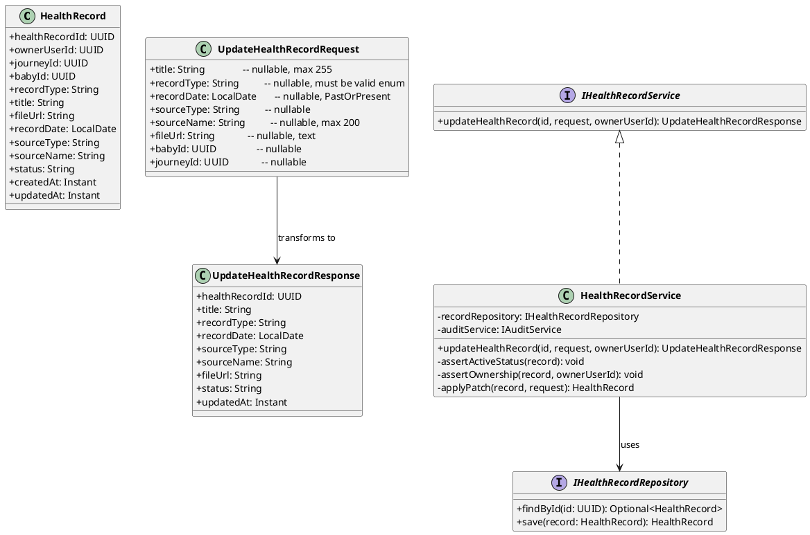
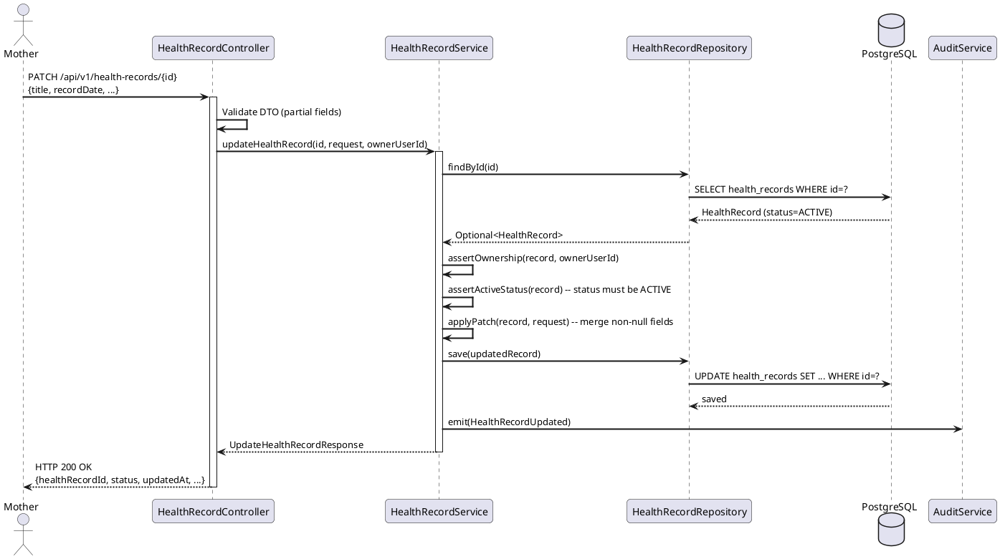
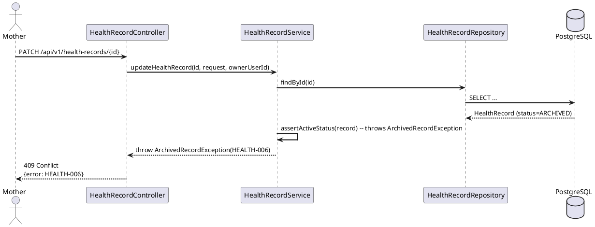
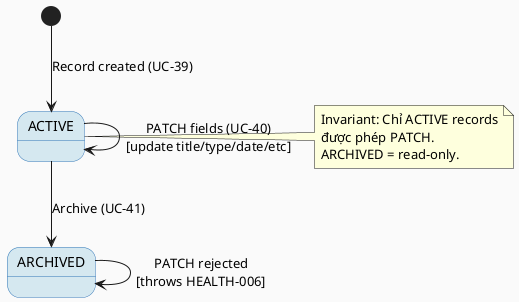

# ENGINEERING DOCUMENTATION STANDARD (EDS) v2.0
# Technical Design Specification — UC-40 Update Health Record

| Field | Value |
|-------|-------|
| **Document ID** | `CB-HEALTH-IMP-002` |
| **Version** | `1.0` |
| **Date** | `2026-06-26` |
| **Status** | `Approved` |
| **Document Owner** | `TV2 - Bách` |
| **Author** | `AI Agent` |
| **Reviewed by** | `[Tech Lead]` |
| **DPO Sign-off** | `[ ] Pending` |
| **Approved by** | `[Principal Architect]` |
| **Last Review** | `2026-06-26` |
| **Based on EDS** | `v2.0` |

---

## CHANGELOG

| Ngày | Người thực hiện | Nội dung thay đổi |
|------|-----------------|-------------------|
| 2026-06-26 | AI Agent | Tạo tài liệu lần đầu cho UC-40 Update Health Record |
| 2026-07-04 | AI Agent — Amelia (Dev Agent) | Implemented updateHealthRecord() in HealthRecordServiceImpl, UpdateHealthRecordRequest/Response DTOs, PATCH endpoint — 5/5 service unit tests GREEN |

---

## MỤC LỤC

1. [Tổng quan Module](#1-tổng-quan-module)
2. [Ma trận Truy vết](#2-ma-trận-truy-vết)
3. [Architecture Decision Records](#3-architecture-decision-records)
4. [Non-Functional Requirements & SLA](#4-non-functional-requirements--sla)
5. [Static Modeling](#5-static-modeling)
6. [Dynamic Modeling](#6-dynamic-modeling)
7. [Domain Event Catalog](#7-domain-event-catalog)
8. [Interface Specification](#8-interface-specification)
9. [API Specification](#9-api-specification)
10. [Bảng mã lỗi](#10-bảng-mã-lỗi)
11. [Quy trình Triển khai](#11-quy-trình-triển-khai)
12. [Rollback & Incident Runbook](#12-rollback--incident-runbook)
13. [Kịch bản Kiểm thử](#13-kịch-bản-kiểm-thử)
14. [Phương pháp Xác minh](#14-phương-pháp-xác-minh)
15. [Mẫu thử thực tế](#15-mẫu-thử-thực-tế)
16. [Authorization Matrix](#16-authorization-matrix)
17. [AI Prompt Constraints (CASE 2.0)](#17-ai-prompt-constraints-case-20)

---

## 1. Tổng quan Module

| Field | Value |
|-------|-------|
| **Module Name** | `UpdateHealthRecord` |
| **Bounded Context** | `health` |
| **UC ID** | `UC-40` |
| **SRS Reference** | `3.3.1.17` |
| **Primary Actor** | `Mother (ROLE_MOTHER)` |
| **Platform** | `Mobile App` |
| **Data Classification** | `Sensitive-PII` |
| **Compliance Scope** | `BR-RBAC, BR-PRIVACY, BR-HEALTH-UPDATE, PDPA` |
| **Upstream Dependencies** | `auth, UC-39 AddHealthRecord, journey, baby` |
| **Downstream Consumers** | `health record detail, timeline (UC-42), audit` |

**Mô tả:** Cho phép Mother cập nhật một health record hiện có. Các trường có thể chỉnh sửa: `title`, `record_type`, `record_date`, `source_name`, `source_type`, `file_url`, hoặc ghi chú tương đương. Chỉ các record có `status = 'ACTIVE'` mới được phép cập nhật. Nếu record đang ở trạng thái `ARCHIVED`, hệ thống trả về lỗi `HEALTH-006 (409 Conflict)`. Endpoint sử dụng PATCH (partial update) — chỉ các trường được gửi mới được cập nhật.

---

## 2. Ma trận Truy vết

| Requirement ID | Loại | Mô tả | Thành phần Code | Compliance Target | ADR liên quan |
|----------------|------|-------|-----------------|-------------------|---------------|
| UC-40 | Use Case | Mother cập nhật health record | `HealthRecordController.updateRecord()` | BR-RBAC | ADR-HEALTH-003 |
| BR-HEALTH-UPDATE | Business Rule | Chỉ record ACTIVE mới được cập nhật | `HealthRecordService.updateRecord()` | Data Integrity | ADR-HEALTH-003 |
| BR-RBAC | Business Rule | Chỉ owner mới được sửa record của mình | `@PreAuthorize` owner check | PDPA | — |
| BR-PRIVACY | Business Rule | Không expose record của user khác | JWT-based owner filter | PDPA | — |
| BR-SAFETY | Business Rule | Response không chứa diagnose hay medical interpretation | Policy trong response | BR-SAFETY | — |
| UC-40-BR-001 | Business Rule | Audit event `HealthRecordUpdated` sau mỗi lần PATCH thành công | `AuditService` | PDPA | — |
| UC-40-BR-002 | Business Rule | `updated_at` được cập nhật tự động khi PATCH | JPA `@UpdateTimestamp` | Data Integrity | — |

---

## 3. Architecture Decision Records

### ADR-HEALTH-003 — PATCH (Partial Update) thay vì PUT (Full Replace)

| Field | Value |
|-------|-------|
| **Status** | `Accepted` |
| **Deciders** | `AI Agent — Tech Design` |
| **Date** | `2026-06-26` |

#### Bối cảnh (Context)
Mobile client không luôn gửi đầy đủ toàn bộ record fields — nhiều trường là optional (`file_url`, `source_name`, v.v.). Dùng PUT full-replace dễ bị mất dữ liệu nếu client không gửi field nào đó.

#### Các phương án đã xem xét (Options Considered)

| Phương án | Mô tả | Ưu điểm | Nhược điểm |
|-----------|-------|----------|------------|
| A | PATCH — partial update | Chỉ cập nhật field được gửi, an toàn với optional fields | Cần merge logic ở Service |
| B | PUT — full replace | Đơn giản hơn về contract | Mất dữ liệu nếu client bỏ sót field |

#### Quyết định (Decision)
Chọn **Phương án A (PATCH)** vì payload mobile thường chỉ gửi những gì thay đổi. Service merge fields khác từ entity hiện có.

#### Hệ quả (Consequences)

**Tích cực:**
- Client mobile chỉ cần gửi fields thay đổi
- Ít rủi ro mất dữ liệu hơn PUT

**Tiêu cực / Trade-offs:**
- Service phải kiểm tra null/undefined cho từng field trước khi ghi đè

**Compliance Impact:**
- Mọi lần PATCH cần ghi audit event với diff — để trace thay đổi PII theo PDPA.

---

### ADR-HEALTH-004 — Chặn update khi status = ARCHIVED

| Field | Value |
|-------|-------|
| **Status** | `Accepted` |
| **Date** | `2026-06-26` |

#### Quyết định
`BR-HEALTH-UPDATE`: Khi caller PATCH một record ARCHIVED, Service ném `ArchivedRecordException` → HTTP 409. Không có auto-unarchive. Nếu cần restore, dùng endpoint riêng (ngoài scope UC-40).

---

## 4. Non-Functional Requirements & SLA

### 4.1. Performance & Availability

| Category | Requirement | Target SLA | Measurement Method |
|----------|-------------|------------|--------------------|
| Latency (p99) | API response | `< 300ms` | k6 load test |
| Availability | Uptime | `99.9%` | Uptime monitor |

### 4.2. Data Integrity & Retention

| Category | Requirement | Target | Compliance Basis |
|----------|-------------|--------|------------------|
| Audit | Mọi PATCH ghi audit event | 100% | PDPA |
| Consistency | `updated_at` phải cập nhật | 100% | Data Integrity |

### 4.3. Security

| Category | Requirement | Target |
|----------|-------------|--------|
| Access control | Chỉ owner mới PATCH được | Least privilege |
| Encryption in transit | TLS 1.3+ | TLS 1.3+ |

---

## 5. Static Modeling

### 5.1. Class Diagram



### 5.2. Data Structure

> Không cần migration mới. Bảng `health_records` trong `V1__init_schema.sql` đã đủ:

```sql
-- Không có Flyway migration mới cho UC-40.
-- Tất cả columns cần thiết đã có trong:
-- 05_Development/CareBridgeAPI/src/main/resources/db/migration/V1__init_schema.sql

-- health_records:
--   health_record_id  uuid
--   owner_user_id     uuid   NOT NULL (FK → users)
--   journey_id        uuid   (FK → mother_journeys)
--   baby_id           uuid   (FK → baby_profiles)
--   record_type       varchar(50) NOT NULL
--   title             varchar(255) NOT NULL
--   file_url          text
--   record_date       date
--   source_type       varchar(30)
--   source_name       varchar(200)
--   status            varchar(20) NOT NULL DEFAULT 'ACTIVE'
--   created_at        timestamptz NOT NULL
--   updated_at        timestamptz NOT NULL
```

> **Oracle rule:** Schema trên là source of truth. Không tạo thêm bảng.

---

## 6. Dynamic Modeling

### 6.1. Sequence Diagram — Happy Path



### 6.2. Sequence Diagram — Error Path (ARCHIVED record)



### 6.3. State Machine



---

## 7. Domain Event Catalog

### 7.1. Events Published

| Event Name | Trigger | Publisher | Subscriber(s) | Async? |
|------------|---------|-----------|---------------|--------|
| `HealthRecordUpdated` | PATCH thành công | `HealthRecordService` | `AuditService` | No |

### 7.2. Events Consumed

| Event Name | Source | Handler | Action |
|------------|--------|---------|--------|
| Not applicable | — | — | UC-40 không consume events từ module khác |

### 7.3. Payload Schema

```java
// HealthRecordUpdated.java
public record HealthRecordUpdated(
    UUID    eventId,
    String  eventType,       // "HealthRecordUpdated"
    Instant occurredAt,
    String  version,         // "1.0"
    Payload payload,
    Metadata metadata
) {
    public record Payload(
        UUID   healthRecordId,
        UUID   ownerUserId,
        String previousStatus,   // "ACTIVE"
        String newStatus,        // "ACTIVE" (no status change in UC-40)
        List<String> updatedFields  // e.g. ["title", "recordDate"]
    ) {}

    public record Metadata(
        UUID   correlationId,
        String causedBy          // ownerUserId
    ) {}
}
```

---

## 8. Interface Specification

```java
// UpdateHealthRecordRequest.java
// @version 1.0
public class UpdateHealthRecordRequest {
    @Size(max = 255)
    private String title;            // nullable — only update if non-null

    @Pattern(regexp = "ULTRASOUND|LAB_RESULT|PRESCRIPTION|VACCINATION_FORM|EXAMINATION_RESULT|NOTE")
    private String recordType;       // nullable

    @PastOrPresent
    private LocalDate recordDate;    // nullable

    @Size(max = 30)
    private String sourceType;       // nullable

    @Size(max = 200)
    private String sourceName;       // nullable

    private String fileUrl;          // nullable, text field per V1 schema

    private UUID babyId;             // nullable
    private UUID journeyId;          // nullable
    // getters / setters
}

// UpdateHealthRecordResponse.java
public class UpdateHealthRecordResponse {
    private UUID    healthRecordId;
    private String  title;
    private String  recordType;
    private LocalDate recordDate;
    private String  sourceType;
    private String  sourceName;
    private String  fileUrl;
    private String  status;
    private Instant updatedAt;
    // getters / setters
}

// IHealthRecordService.java (extension)
// @version 1.0
public interface IHealthRecordService {
    /**
     * Partially update an existing health record.
     * @throws RecordNotFoundException (HEALTH-007) when id not found
     * @throws ForbiddenRecordAccessException (HEALTH-004) when ownerUserId != record.ownerUserId
     * @throws ArchivedRecordException (HEALTH-006) when record.status == 'ARCHIVED'
     */
    UpdateHealthRecordResponse updateHealthRecord(UUID id,
                                                  UpdateHealthRecordRequest request,
                                                  UUID ownerUserId);
}
```

### 8.2. Repository Interface

```java
// IHealthRecordRepository.java
// @version 1.0
public interface IHealthRecordRepository extends JpaRepository<HealthRecord, UUID> {
    Optional<HealthRecord> findByHealthRecordIdAndOwnerUserId(UUID id, UUID ownerUserId);
    // Không có delete() — soft-delete only via status field
}
```

---

## 9. API Specification

### 9.1. Endpoints Table

| Method | Path | Auth Level | Required Roles | Rate Limit | Idempotent? |
|--------|------|------------|----------------|------------|-------------|
| `PATCH` | `/api/v1/health-records/{id}` | JWT Bearer | `ROLE_MOTHER` | 60/min | Yes |

### 9.2. Request / Response Schemas

#### `PATCH /api/v1/health-records/{id}` — Cập nhật một phần

**Path Parameter:** `id` — UUID của health record.

**Request Body (tất cả fields đều optional — chỉ gửi field cần thay đổi):**
```json
{
  "title": "Updated Blood Test Q2 2026",
  "recordDate": "2026-06-20",
  "sourceName": "FV Hospital — Lab Dept"
}
```

**Response — 200 OK (Happy Path):**
```json
{
  "healthRecordId": "550e8400-e29b-41d4-a716-446655440010",
  "title": "Updated Blood Test Q2 2026",
  "recordType": "LAB_RESULT",
  "recordDate": "2026-06-20",
  "sourceType": "CLINIC",
  "sourceName": "FV Hospital — Lab Dept",
  "fileUrl": null,
  "status": "ACTIVE",
  "updatedAt": "2026-06-26T10:30:00.000Z"
}
```

**Response — 400 Bad Request (Validation Error):**
```json
{
  "error": {
    "code": "HEALTH-001",
    "message": "Validation failed",
    "details": [
      { "field": "recordDate", "message": "recordDate must not be in the future" }
    ]
  }
}
```

**Response — 404 Not Found:**
```json
{
  "error": {
    "code": "HEALTH-007",
    "message": "Health record not found"
  }
}
```

**Response — 409 Conflict (ARCHIVED record):**
```json
{
  "error": {
    "code": "HEALTH-006",
    "message": "Cannot update an archived health record"
  }
}
```

---

## 10. Bảng mã lỗi

| Code | HTTP Status | Message (EN) | Message (VI) | Trigger Condition |
|------|-------------|--------------|--------------|-------------------|
| `HEALTH-001` | 400 | Validation failed | Dữ liệu không hợp lệ | recordDate ở tương lai hoặc recordType không hợp lệ |
| `HEALTH-004` | 403 | Insufficient permissions | Không đủ quyền | User không phải owner của record |
| `HEALTH-005` | 500 | Internal error | Lỗi hệ thống | Lỗi DB không mong đợi |
| `HEALTH-006` | 409 | Cannot update archived record | Không thể sửa hồ sơ đã lưu trữ | record.status == 'ARCHIVED' |
| `HEALTH-007` | 404 | Health record not found | Không tìm thấy hồ sơ | healthRecordId không tồn tại trong DB |
| `IAM-001` | 401 | Authentication required | Yêu cầu xác thực | Không có JWT / JWT hết hạn |

---

## 11. Quy trình Triển khai

### 11.1. Prerequisites

- [x] ADR-HEALTH-003 và ADR-HEALTH-004 đã được Accepted
- [x] UC-39 `HealthRecord` entity và repository đã tồn tại
- [x] Không cần Flyway migration mới

### 11.2. Pre-Migration Checklist

> Không applicable — không có schema thay đổi cho UC-40.

### 11.3. Implementation Steps

#### Chặng 1 — Service Method

```java
// HealthRecordService.java
@Transactional
public UpdateHealthRecordResponse updateHealthRecord(UUID id,
                                                     UpdateHealthRecordRequest request,
                                                     UUID ownerUserId) {
    HealthRecord record = recordRepository.findById(id)
        .orElseThrow(() -> new RecordNotFoundException(id));

    assertOwnership(record, ownerUserId);   // BR-RBAC
    assertActiveStatus(record);             // BR-HEALTH-UPDATE

    applyPatch(record, request);            // merge non-null fields only
    record.setUpdatedAt(Instant.now());

    HealthRecord saved = recordRepository.save(record);
    auditService.emit(new HealthRecordUpdated(...));

    return mapper.toUpdateResponse(saved);
}

private void assertActiveStatus(HealthRecord record) {
    if (!"ACTIVE".equals(record.getStatus())) {
        throw new ArchivedRecordException(record.getHealthRecordId());
    }
}

private void assertOwnership(HealthRecord record, UUID ownerUserId) {
    if (!record.getOwnerUserId().equals(ownerUserId)) {
        throw new ForbiddenRecordAccessException(record.getHealthRecordId());
    }
}
```

#### Chặng 2 — Controller

```java
// HealthRecordController.java
@PatchMapping("/{id}")
@PreAuthorize("hasRole('MOTHER')")
public ResponseEntity<UpdateHealthRecordResponse> updateRecord(
        @PathVariable UUID id,
        @Valid @RequestBody UpdateHealthRecordRequest request,
        @AuthenticationPrincipal UserPrincipal principal) {
    return ResponseEntity.ok(
        healthRecordService.updateHealthRecord(id, request, principal.getUserId())
    );
}
```

#### Chặng 3 — Verification sau deploy

```bash
curl -X PATCH https://[host]/api/v1/health-records/[uuid] \
  -H "Authorization: Bearer [JWT_MOTHER_TOKEN]" \
  -H "Content-Type: application/json" \
  -d '{"title":"Verification Test"}'
# Expected: 200 OK with updated title
```

### 11.4. Deployment Checklist

- [ ] Health check endpoint trả về 200
- [ ] PATCH thành công với ACTIVE record
- [ ] 409 trả về với ARCHIVED record
- [ ] Audit log ghi `HealthRecordUpdated` event

---

## 12. Rollback & Incident Runbook

### 12.1. Điều kiện kích hoạt Rollback

| Điều kiện | Ngưỡng | Người quyết định |
|-----------|--------|------------------|
| Error rate tăng đột biến | > 5% trong 5 phút | On-call Engineer |
| PATCH update sai record (ownership bypass) | Bất kỳ 1 case | Tech Lead + DPO |

### 12.2. Rollback Procedure

```bash
# UC-40 không có migration — rollback chỉ là code revert
git checkout -- src/main/java/com/carebridge/backend/health/service/HealthRecordService.java
git checkout -- src/main/java/com/carebridge/backend/health/controller/HealthRecordController.java

# Re-deploy phiên bản cũ
kubectl rollout undo deployment/carebridge-api
kubectl rollout status deployment/carebridge-api
```

### 12.3. Notification Protocol

| Thời điểm | Người nhận | Kênh | Ghi chú |
|-----------|------------|------|---------|
| Ngay khi phát hiện | On-call team | Slack `#incident` | Mô tả lỗi cụ thể |
| Trong 30 phút | DPO | Email | Bắt buộc nếu PII bị ảnh hưởng |

### 12.4. Post-Incident Review

> Bắt buộc hoàn thành PIR trong 48 giờ sau khi incident được resolve theo template chuẩn.

---

## 13. Kịch bản Kiểm thử

```gherkin
Feature: Update Health Record (UC-40)
  Background:
    Given test data classification: SYNTHETIC
    And Mother authenticated with JWT (ACC-001, ROLE_MOTHER)

  Scenario: Happy path — partial update title and recordDate
    Given health record HR-001 owned by ACC-001, status=ACTIVE
    When PATCH /api/v1/health-records/HR-001 with {title: "Updated", recordDate: "2026-06-20"}
    Then response status 200
    And response body contains title="Updated", recordDate="2026-06-20"
    And DB: health_records.title = "Updated" for HR-001
    And audit log contains HealthRecordUpdated for HR-001

  Scenario: Update ARCHIVED record → 409
    Given health record HR-002 owned by ACC-001, status=ARCHIVED
    When PATCH /api/v1/health-records/HR-002 with {title: "Anything"}
    Then response status 409
    And response body contains error code HEALTH-006
    And DB: record HR-002 unchanged

  Scenario: Update record of another user → 403
    Given health record HR-003 owned by ACC-999
    When PATCH /api/v1/health-records/HR-003 (caller is ACC-001)
    Then response status 403
    And response body contains error code HEALTH-004

  Scenario: Record not found → 404
    When PATCH /api/v1/health-records/non-existent-uuid
    Then response status 404
    And response body contains error code HEALTH-007

  Scenario: Invalid recordType value → 400
    When PATCH with recordType="INVALID_TYPE"
    Then response status 400
    And response body contains error code HEALTH-001

  Scenario: Future recordDate → 400
    When PATCH with recordDate="2030-01-01"
    Then response status 400
    And response body contains error code HEALTH-001

  Scenario: No JWT → 401
    When PATCH without Authorization header
    Then response status 401
```

---

## 14. Phương pháp Xác minh

### 14.1. Database Inspection

```sql
-- Verify record updated correctly
SELECT health_record_id, title, record_type, record_date, status, updated_at
FROM health_records
WHERE health_record_id = '[uuid]';

-- Verify no physical DELETE occurred (append-only pattern)
SELECT COUNT(*) FROM health_records WHERE health_record_id = '[uuid]';
-- Expected: 1 (record exists, status unchanged unless archived)

-- Verify updated_at changed after PATCH
SELECT updated_at FROM health_records WHERE health_record_id = '[uuid]';
-- Expected: timestamp > created_at
```

### 14.2. Log / Audit Verification

```bash
# Verify HealthRecordUpdated event emitted
kubectl logs -l app=carebridge-api | grep '"eventType":"HealthRecordUpdated"' | head -5

# Verify no PII leak in logs
kubectl logs -l app=carebridge-api | grep -i "fileUrl\|sourceName" | head -10
# Review: PII fields should not appear plaintext in logs
```

---

## 15. Mẫu thử thực tế

### 15.1. Happy Path

```bash
# PATCH — cập nhật title và sourceName
curl -X PATCH https://[host]/api/v1/health-records/550e8400-e29b-41d4-a716-446655440010 \
  -H "Authorization: Bearer [JWT_MOTHER_TOKEN]" \
  -H "Content-Type: application/json" \
  -d '{
    "title": "Updated Blood Test Q2 2026",
    "sourceName": "FV Hospital — Lab Dept"
  }'
```

**Expected Response (200):**
```json
{
  "healthRecordId": "550e8400-e29b-41d4-a716-446655440010",
  "title": "Updated Blood Test Q2 2026",
  "status": "ACTIVE",
  "updatedAt": "2026-06-26T10:30:00.000Z"
}
```

### 15.2. Error Paths

```bash
# PATCH ARCHIVED record → 409
curl -X PATCH https://[host]/api/v1/health-records/[archived-uuid] \
  -H "Authorization: Bearer [JWT_MOTHER_TOKEN]" \
  -H "Content-Type: application/json" \
  -d '{"title": "Try update archived"}'
```

**Expected Response (409):**
```json
{
  "error": {
    "code": "HEALTH-006",
    "message": "Cannot update an archived health record"
  }
}
```

```bash
# PATCH without JWT → 401
curl -X PATCH https://[host]/api/v1/health-records/[uuid] \
  -H "Content-Type: application/json" \
  -d '{"title": "No auth"}'
```

**Expected Response (401):**
```json
{
  "error": {
    "code": "IAM-001",
    "message": "Authentication required"
  }
}
```

---

## 16. Authorization Matrix

| Endpoint | `GUEST` | `MOTHER` | `EXPERT` | `ADMIN` |
|----------|---------|----------|----------|---------|
| `PATCH /api/v1/health-records/{id}` | ❌ | ✅ Own | ❌ | ✅ All |
| `GET /api/v1/health-records/{id}` | ❌ | ✅ Own | ❌ | ✅ All |

**Chú thích:**
- ✅ Own = Chỉ được phép với record của chính mình (owner_user_id = JWT sub)
- ❌ = 403 Forbidden

---

## 17. AI Prompt Constraints (CASE 2.0)

### 17.1 Constraint Summary Table

| # | Constraint | Source | Last Verified |
|---|-----------|--------|---------------|
| C1 | assertActiveStatus() PHẢI chạy trước applyPatch() — từ chối nếu status='ARCHIVED' | BR-HEALTH-UPDATE, ADR-HEALTH-004 | 2026-06-26 |
| C2 | assertOwnership() PHẢI chạy trước applyPatch() — từ chối nếu ownerUserId != JWT sub | BR-RBAC | 2026-06-26 |
| C3 | Sử dụng PATCH (partial update) — chỉ merge non-null fields, không overwrite với null | ADR-HEALTH-003 | 2026-06-26 |
| C4 | ownerUserId phải lấy từ JWT SecurityContext, KHÔNG từ request body | BR-RBAC | 2026-06-26 |
| C5 | Emit HealthRecordUpdated event sau save thành công | UC-40-BR-001 | 2026-06-26 |
| C6 | Response KHÔNG chứa diagnosis hay medical interpretation | BR-SAFETY | 2026-06-26 |

### 17.2 Constraint Injection Block

```
[CONSTRAINT BLOCK — Module: UpdateHealthRecord (CB-HEALTH-IMP-002)]
Theo TDS CB-HEALTH-IMP-002 và ADR liên quan:

1. assertActiveStatus() PHẢI chạy TRƯỚC applyPatch() — ném ArchivedRecordException(HEALTH-006) nếu status='ARCHIVED' — BR-HEALTH-UPDATE, ADR-HEALTH-004
2. assertOwnership() PHẢI chạy TRƯỚC applyPatch() — ném ForbiddenRecordAccessException(HEALTH-004) nếu ownerUserId != JWT sub — BR-RBAC
3. Dùng PATCH semantics — chỉ update fields != null trong request, giữ nguyên fields khác — ADR-HEALTH-003
4. ownerUserId từ JWT SecurityContext (@AuthenticationPrincipal), KHÔNG từ body — BR-RBAC
5. Emit HealthRecordUpdated event sau save() thành công — UC-40-BR-001
6. Response KHÔNG chứa diagnose hay medical interpretation — BR-SAFETY

[CONTEXT BLOCK]
- Bounded Context: health
- Data Classification: Sensitive-PII
- Compliance: BR-RBAC, BR-PRIVACY, BR-HEALTH-UPDATE, PDPA
- Error codes: §10 Error Codes Table
- Auth matrix: §16 Authorization Matrix
- Schema source: V1__init_schema.sql (table: health_records)

[TASK BLOCK]
Implement HealthRecordService.updateHealthRecord() thỏa mãn constraints trên.
Output phải tuân thủ §8 Interface Specification.
Tests phải cover §13 Test Scenarios.
```

### 17.3 Constraint Quality Checklist

- [x] Mỗi constraint traceable về ADR hoặc BR cụ thể
- [x] Không có constraint generic
- [x] Mỗi constraint có `Last Verified` date ≤ 2 sprints
- [x] Constraint block có ≥ 3 constraints cụ thể
- [x] Constraint block reference §8 Interface
- [x] Constraint block reference §16 Auth Matrix

### 17.4 Anti-Pattern Detection

| AP-ID | Anti-Pattern | Dấu hiệu | Hành động |
|-------|-------------|-----------|----------|
| AP-AI-001 | Unconstrained Gen | Code không match C1-C6 | Reject — inject lại constraints |
| AP-AI-003 | Implicit Decision | PATCH logic không có ADR-HEALTH-003 | Reject — viết ADR trước |
| AP-AI-004 | Layer Violation | assertActiveStatus() nằm trong Controller | Reject — chuyển vào Service |
| AP-AI-005 | Hallucinated Contract | Code import `HealthRecordFile` (không có trong V1 schema) | Reject — verify V1 schema |

---

## PHỤ LỤC

### A. Glossary

| Thuật ngữ | Định nghĩa |
|-----------|------------|
| PATCH | HTTP method partial update — chỉ cập nhật fields được gửi |
| ARCHIVED | Trạng thái cuối của health record (soft-delete theo UC-41) |
| ACTIVE | Trạng thái hoạt động — record có thể được cập nhật |
| ownerUserId | `owner_user_id` trong DB — UUID của Mother sở hữu record |
| applyPatch | Method nội bộ trong Service để merge non-null fields từ request vào entity |

### B. Tài liệu tham chiếu

| Document | Path |
|----------|------|
| EDS v2.0 Template | `08_References/Template/PHASE-3_TDS.md` |
| V1 Schema (source of truth) | `05_Development/CareBridgeAPI/src/main/resources/db/migration/V1__init_schema.sql` |
| UC-39 TDS (AddHealthRecord) | `04_Implement/UC39_AddHealthRecord/UC39_AddHealthRecord_TDS.md` |

---

*EDS v2.1 — Tích hợp CASE 2.0 AI Prompt Constraints (§17).*
