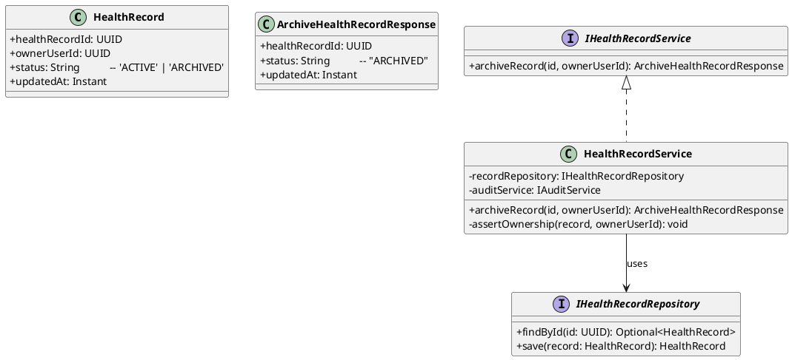
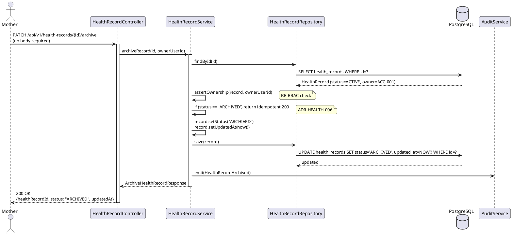
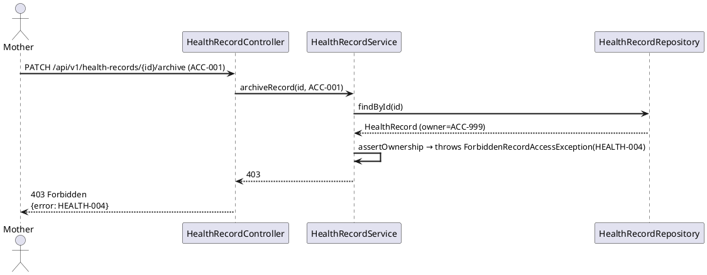
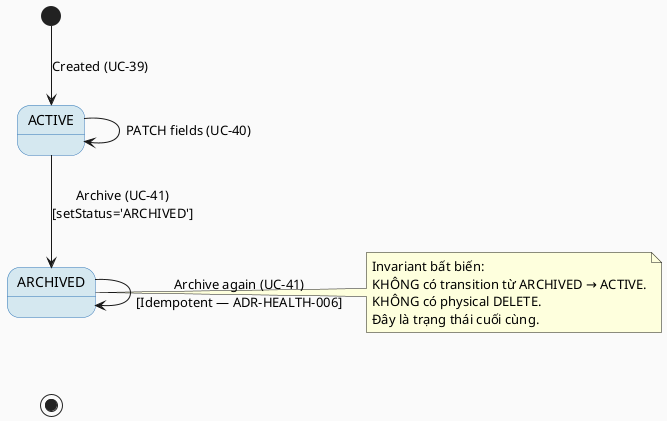

# ENGINEERING DOCUMENTATION STANDARD (EDS) v2.0
# Technical Design Specification — UC-41 Delete or Archive Health Record

| Field | Value |
|-------|-------|
| **Document ID** | `CB-HEALTH-IMP-003` |
| **Version** | `1.0` |
| **Date** | `2026-06-26` |
| **Status** | `Approved` |
| **Document Owner** | `TV2 - Bách` |
| **Author** | `AI Agent` |
| **Reviewed by** | `[Tech Lead]` |
| **DPO Sign-off** | `[ ] Pending` |
| **Approved by** | `[Principal Architect]` |
| **Last Review** | `2026-06-26` |
| **Based on EDS** | `v2.0` |

---

## CHANGELOG

| Ngày | Người thực hiện | Nội dung thay đổi |
|------|-----------------|-------------------|
| 2026-06-26 | AI Agent | Tạo tài liệu lần đầu cho UC-41 Delete or Archive Health Record |
| 2026-07-04 | AI Agent — Amelia (Dev Agent) | Implemented archiveRecord() in HealthRecordServiceImpl (soft-delete, idempotent), ArchiveHealthRecordResponse DTO, PATCH /archive endpoint — 4/4 service unit tests GREEN |

---

## MỤC LỤC

1. [Tổng quan Module](#1-tổng-quan-module)
2. [Ma trận Truy vết](#2-ma-trận-truy-vết)
3. [Architecture Decision Records](#3-architecture-decision-records)
4. [Non-Functional Requirements & SLA](#4-non-functional-requirements--sla)
5. [Static Modeling](#5-static-modeling)
6. [Dynamic Modeling](#6-dynamic-modeling)
7. [Domain Event Catalog](#7-domain-event-catalog)
8. [Interface Specification](#8-interface-specification)
9. [API Specification](#9-api-specification)
10. [Bảng mã lỗi](#10-bảng-mã-lỗi)
11. [Quy trình Triển khai](#11-quy-trình-triển-khai)
12. [Rollback & Incident Runbook](#12-rollback--incident-runbook)
13. [Kịch bản Kiểm thử](#13-kịch-bản-kiểm-thử)
14. [Phương pháp Xác minh](#14-phương-pháp-xác-minh)
15. [Mẫu thử thực tế](#15-mẫu-thử-thực-tế)
16. [Authorization Matrix](#16-authorization-matrix)
17. [AI Prompt Constraints (CASE 2.0)](#17-ai-prompt-constraints-case-20)

---

## 1. Tổng quan Module

| Field | Value |
|-------|-------|
| **Module Name** | `DeleteOrArchiveHealthRecord` |
| **Bounded Context** | `health` |
| **UC ID** | `UC-41` |
| **SRS Reference** | `3.3.1.18` |
| **Primary Actor** | `Mother (ROLE_MOTHER)` |
| **Platform** | `Mobile App` |
| **Data Classification** | `Sensitive-PII` |
| **Compliance Scope** | `BR-RBAC, BR-PRIVACY, BR-HEALTH-ARCHIVE, PDPA` |
| **Upstream Dependencies** | `auth, UC-39 AddHealthRecord, UC-40 UpdateHealthRecord` |
| **Downstream Consumers** | `UC-42 ViewHealthRecordTimeline (exclude ARCHIVED), audit` |

**Mô tả:** Cho phép Mother soft-delete (archive) một health record bằng cách chuyển `status` từ `'ACTIVE'` sang `'ARCHIVED'`. Không có physical DELETE — dữ liệu luôn được giữ lại theo yêu cầu audit/PDPA. Mobile app hiển thị confirmation dialog trước khi gửi request. Endpoint là `PATCH /api/v1/health-records/{id}/archive`. Nếu record đã là `ARCHIVED`, hệ thống idempotently trả về 200 (đã ở trạng thái đúng).

---

## 2. Ma trận Truy vết

| Requirement ID | Loại | Mô tả | Thành phần Code | Compliance Target | ADR liên quan |
|----------------|------|-------|-----------------|-------------------|---------------|
| UC-41 | Use Case | Mother archive health record | `HealthRecordController.archiveRecord()` | BR-RBAC | ADR-HEALTH-005 |
| BR-HEALTH-ARCHIVE | Business Rule | Soft-delete: set status='ARCHIVED', không DELETE | `HealthRecordService.archiveRecord()` | PDPA | ADR-HEALTH-005 |
| BR-RBAC | Business Rule | Chỉ owner mới archive được record của mình | `@PreAuthorize` + ownership check | PDPA | — |
| BR-PRIVACY | Business Rule | Không expose record của user khác | JWT-based owner filter | PDPA | — |
| UC-41-BR-001 | Business Rule | Ghi audit event `HealthRecordArchived` sau khi archive | `AuditService` | PDPA | — |
| UC-41-BR-002 | Business Rule | Cần user confirmation trước khi archive (mobile UX) | Mobile client — ngoài scope backend | UX | — |
| UC-41-BR-003 | Business Rule | Archive một record đã ARCHIVED → idempotent 200 | `HealthRecordService` | Idempotency | ADR-HEALTH-006 |

---

## 3. Architecture Decision Records

### ADR-HEALTH-005 — Soft-delete bằng PATCH status='ARCHIVED', không DELETE

| Field | Value |
|-------|-------|
| **Status** | `Accepted` |
| **Deciders** | `AI Agent — Tech Design` |
| **Date** | `2026-06-26` |

#### Bối cảnh (Context)
Health records là dữ liệu y tế nhạy cảm. PDPA và yêu cầu audit nội bộ đòi hỏi dữ liệu không được xóa vật lý. User có thể cần truy vấn lại lịch sử kể cả khi đã "xóa". Physical DELETE sẽ vi phạm yêu cầu audit.

#### Các phương án đã xem xét

| Phương án | Mô tả | Ưu điểm | Nhược điểm |
|-----------|-------|----------|------------|
| A | Physical DELETE | Đơn giản | Vi phạm PDPA audit, không có lịch sử |
| B | Soft-delete: `status = 'ARCHIVED'` | Giữ data, có audit trail | Cần filter ở tầng query |
| C | Separate `archived_at` column | Rõ ràng về thời điểm archive | Thêm schema — không cần thiết với V1 |

#### Quyết định
Chọn **Phương án B** — soft-delete qua `status = 'ARCHIVED'`. V1 schema đã có `status varchar(20)` với default `'ACTIVE'`. Không cần migration mới.

#### Hệ quả

**Tích cực:**
- Không mất dữ liệu, đáp ứng PDPA audit
- Không cần migration mới

**Tiêu cực / Trade-offs:**
- Query timeline (UC-42) phải luôn filter `status = 'ACTIVE'`
- ARCHIVED records vẫn chiếm storage

**Compliance Impact:**
- Đáp ứng PDPA yêu cầu retention — không xóa PII

---

### ADR-HEALTH-006 — Idempotent archive: ARCHIVED → ARCHIVED trả về 200

| Field | Value |
|-------|-------|
| **Status** | `Accepted` |
| **Date** | `2026-06-26` |

#### Quyết định
Nếu client gọi archive trên record đã `ARCHIVED` (vd: retry sau network failure), hệ thống trả về 200 thay vì 409 hay 400. Điều này đảm bảo idempotency cho mobile retry logic.

---

## 4. Non-Functional Requirements & SLA

### 4.1. Performance & Availability

| Category | Requirement | Target SLA |
|----------|-------------|------------|
| Latency (p99) | API response | `< 200ms` (simple status update) |
| Availability | Uptime | `99.9%` |

### 4.2. Data Integrity & Retention

| Category | Requirement | Compliance Basis |
|----------|-------------|------------------|
| Retention | Physical DELETE không được thực hiện | PDPA |
| Audit | Mọi archive ghi event `HealthRecordArchived` | PDPA |

### 4.3. Security

| Category | Requirement |
|----------|-------------|
| Access control | Chỉ owner mới archive được |
| Idempotency | Retry-safe — 2x archive = 200 |

---

## 5. Static Modeling

### 5.1. Class Diagram



### 5.2. Data Structure

> Không cần migration mới. `status varchar(20)` trong V1 schema đã đủ:

```sql
-- Không có Flyway migration mới cho UC-41.
-- V1__init_schema.sql đã có:
--
-- health_records.status VARCHAR(20) NOT NULL DEFAULT 'ACTIVE'
--
-- UC-41 chỉ thực hiện UPDATE:
--   UPDATE health_records
--   SET status = 'ARCHIVED', updated_at = NOW()
--   WHERE health_record_id = :id
--     AND owner_user_id = :ownerUserId;
--
-- KHÔNG có DELETE statement.
```

> **Oracle rule:** Không tạo thêm bảng. `status` column là đủ để phân biệt ACTIVE / ARCHIVED.

---

## 6. Dynamic Modeling

### 6.1. Sequence Diagram — Happy Path



### 6.2. Sequence Diagram — Error Path (unauthorized)



### 6.3. State Machine



---

## 7. Domain Event Catalog

### 7.1. Events Published

| Event Name | Trigger | Publisher | Subscriber(s) | Async? |
|------------|---------|-----------|---------------|--------|
| `HealthRecordArchived` | Archive thành công | `HealthRecordService` | `AuditService` | No |

### 7.2. Events Consumed

| Event Name | Source | Handler | Action |
|------------|--------|---------|--------|
| Not applicable | — | — | UC-41 không consume events |

### 7.3. Payload Schema

```java
// HealthRecordArchived.java
public record HealthRecordArchived(
    UUID    eventId,
    String  eventType,      // "HealthRecordArchived"
    Instant occurredAt,
    String  version,        // "1.0"
    Payload payload,
    Metadata metadata
) {
    public record Payload(
        UUID   healthRecordId,
        UUID   ownerUserId,
        String previousStatus,   // "ACTIVE"
        String newStatus         // "ARCHIVED"
    ) {}

    public record Metadata(
        UUID   correlationId,
        String causedBy          // ownerUserId
    ) {}
}
```

---

## 8. Interface Specification

```java
// ArchiveHealthRecordResponse.java
// @version 1.0
public class ArchiveHealthRecordResponse {
    private UUID    healthRecordId;
    private String  status;       // always "ARCHIVED"
    private Instant updatedAt;
    // getters / setters
}

// IHealthRecordService.java (extension)
// @version 1.0
public interface IHealthRecordService {
    /**
     * Soft-delete a health record by setting status to 'ARCHIVED'.
     * Idempotent: if already ARCHIVED, returns 200 without re-auditing.
     * @throws RecordNotFoundException (HEALTH-007) when id not found
     * @throws ForbiddenRecordAccessException (HEALTH-004) when ownerUserId != record.ownerUserId
     */
    ArchiveHealthRecordResponse archiveRecord(UUID id, UUID ownerUserId);
}
```

### 8.2. Repository Interface

```java
// IHealthRecordRepository.java (no new methods needed)
// archiveRecord uses findById() + save() — already in §8.2 of UC-40 TDS.
// No physical delete method. Append-only pattern per ADR-HEALTH-005.
public interface IHealthRecordRepository extends JpaRepository<HealthRecord, UUID> {
    Optional<HealthRecord> findById(UUID id);
    HealthRecord save(HealthRecord record);
    // No delete() method — soft-delete only
}
```

---

## 9. API Specification

### 9.1. Endpoints Table

| Method | Path | Auth Level | Required Roles | Rate Limit | Idempotent? |
|--------|------|------------|----------------|------------|-------------|
| `PATCH` | `/api/v1/health-records/{id}/archive` | JWT Bearer | `ROLE_MOTHER` | 30/min | Yes |

> **Lý do dùng PATCH `/archive` thay vì DELETE:** Soft-delete semantics — không có physical deletion. DELETE HTTP verb ngụ ý xóa vật lý, không phù hợp với ADR-HEALTH-005.

### 9.2. Request / Response Schemas

#### `PATCH /api/v1/health-records/{id}/archive`

**Path Parameter:** `id` — UUID của health record cần archive.

**Request Body:** Không cần body (empty hoặc `{}`).

**Response — 200 OK (Happy Path — ACTIVE → ARCHIVED):**
```json
{
  "healthRecordId": "550e8400-e29b-41d4-a716-446655440010",
  "status": "ARCHIVED",
  "updatedAt": "2026-06-26T11:00:00.000Z"
}
```

**Response — 200 OK (Idempotent — already ARCHIVED):**
```json
{
  "healthRecordId": "550e8400-e29b-41d4-a716-446655440010",
  "status": "ARCHIVED",
  "updatedAt": "2026-06-26T09:00:00.000Z"
}
```

**Response — 404 Not Found:**
```json
{
  "error": {
    "code": "HEALTH-007",
    "message": "Health record not found"
  }
}
```

**Response — 403 Forbidden:**
```json
{
  "error": {
    "code": "HEALTH-004",
    "message": "Insufficient permissions to archive this record"
  }
}
```

---

## 10. Bảng mã lỗi

| Code | HTTP Status | Message (EN) | Message (VI) | Trigger Condition |
|------|-------------|--------------|--------------|-------------------|
| `HEALTH-004` | 403 | Insufficient permissions | Không đủ quyền | ownerUserId != JWT sub |
| `HEALTH-005` | 500 | Internal error | Lỗi hệ thống | Lỗi DB không mong đợi |
| `HEALTH-007` | 404 | Health record not found | Không tìm thấy hồ sơ | healthRecordId không tồn tại |
| `IAM-001` | 401 | Authentication required | Yêu cầu xác thực | Không có JWT / JWT hết hạn |

> **Lưu ý:** Archive khi đã ARCHIVED → 200 (idempotent), không phải lỗi. Không có error code đặc biệt cho case này.

---

## 11. Quy trình Triển khai

### 11.1. Prerequisites

- [x] ADR-HEALTH-005 và ADR-HEALTH-006 đã được Accepted
- [x] UC-39 `HealthRecord` entity đã tồn tại
- [x] Không cần Flyway migration mới

### 11.2. Pre-Migration Checklist

> Không applicable — không có schema thay đổi cho UC-41.

### 11.3. Implementation Steps

#### Chặng 1 — Service Method

```java
// HealthRecordService.java
@Transactional
public ArchiveHealthRecordResponse archiveRecord(UUID id, UUID ownerUserId) {
    HealthRecord record = recordRepository.findById(id)
        .orElseThrow(() -> new RecordNotFoundException(id));

    assertOwnership(record, ownerUserId);  // BR-RBAC

    // Idempotent: if already ARCHIVED, return current state — ADR-HEALTH-006
    if ("ARCHIVED".equals(record.getStatus())) {
        return mapper.toArchiveResponse(record);
    }

    record.setStatus("ARCHIVED");
    record.setUpdatedAt(Instant.now());

    HealthRecord saved = recordRepository.save(record);

    // Emit audit event only on first-time archive (not on idempotent call)
    auditService.emit(new HealthRecordArchived(
        UUID.randomUUID(), "HealthRecordArchived", Instant.now(), "1.0",
        new HealthRecordArchived.Payload(id, ownerUserId, "ACTIVE", "ARCHIVED"),
        new HealthRecordArchived.Metadata(UUID.randomUUID(), ownerUserId.toString())
    ));

    return mapper.toArchiveResponse(saved);
}
```

#### Chặng 2 — Controller

```java
// HealthRecordController.java
@PatchMapping("/{id}/archive")
@PreAuthorize("hasRole('MOTHER')")
public ResponseEntity<ArchiveHealthRecordResponse> archiveRecord(
        @PathVariable UUID id,
        @AuthenticationPrincipal UserPrincipal principal) {
    return ResponseEntity.ok(
        healthRecordService.archiveRecord(id, principal.getUserId())
    );
}
```

#### Chặng 3 — Verification

```bash
# Archive record
curl -X PATCH https://[host]/api/v1/health-records/[uuid]/archive \
  -H "Authorization: Bearer [JWT_MOTHER_TOKEN]"
# Expected: 200 {status: "ARCHIVED"}

# Verify no physical DELETE
curl -X GET https://[host]/api/v1/health-records/[uuid] \
  -H "Authorization: Bearer [JWT_MOTHER_TOKEN]"
# Expected: 200 với status: "ARCHIVED" (record vẫn còn trong DB)
```

### 11.4. Deployment Checklist

- [ ] Health check endpoint trả về 200
- [ ] Archive ACTIVE record → 200, status=ARCHIVED
- [ ] Archive ARCHIVED record → 200 idempotent
- [ ] No physical DELETE in DB logs
- [ ] Audit log ghi `HealthRecordArchived` event

---

## 12. Rollback & Incident Runbook

### 12.1. Điều kiện kích hoạt Rollback

| Điều kiện | Ngưỡng | Người quyết định |
|-----------|--------|------------------|
| Physical DELETE phát hiện | Bất kỳ 1 case | Tech Lead + DPO ngay lập tức |
| Ownership bypass | Bất kỳ 1 case | Tech Lead + DPO |

### 12.2. Rollback Procedure

```bash
# Không có migration — revert code
git checkout -- src/main/java/com/carebridge/backend/health/service/HealthRecordService.java
git checkout -- src/main/java/com/carebridge/backend/health/controller/HealthRecordController.java

kubectl rollout undo deployment/carebridge-api
kubectl rollout status deployment/carebridge-api
```

### 12.3. Notification Protocol

| Thời điểm | Người nhận | Kênh |
|-----------|------------|------|
| Ngay khi phát hiện physical DELETE | On-call + DPO | Slack + Email ngay |
| Trong 30 phút | DPO | Email (PDPA Art. breach notification) |

---

## 13. Kịch bản Kiểm thử

```gherkin
Feature: Archive Health Record (UC-41)
  Background:
    Given test data classification: SYNTHETIC
    And Mother authenticated with JWT (ACC-001, ROLE_MOTHER)

  Scenario: Happy path — archive ACTIVE record
    Given health record HR-001 owned by ACC-001, status=ACTIVE
    When PATCH /api/v1/health-records/HR-001/archive
    Then response status 200
    And response body contains status="ARCHIVED"
    And DB: health_records.status = "ARCHIVED" for HR-001
    And DB: health_records row still EXISTS (no physical DELETE)
    And audit log contains HealthRecordArchived for HR-001

  Scenario: Archive already ARCHIVED record → idempotent 200
    Given health record HR-002 owned by ACC-001, status=ARCHIVED
    When PATCH /api/v1/health-records/HR-002/archive
    Then response status 200
    And response body contains status="ARCHIVED"
    And DB: record unchanged (updatedAt same as before second call)

  Scenario: Archive another user's record → 403
    Given health record HR-003 owned by ACC-999
    When PATCH /api/v1/health-records/HR-003/archive (caller ACC-001)
    Then response status 403
    And response body contains error code HEALTH-004
    And DB: HR-003 status still ACTIVE

  Scenario: Record not found → 404
    When PATCH /api/v1/health-records/non-existent-uuid/archive
    Then response status 404
    And response body contains error code HEALTH-007

  Scenario: No JWT → 401
    When PATCH /api/v1/health-records/HR-001/archive without Authorization header
    Then response status 401

  Scenario: EXPERT role tries archive → 403
    Given JWT with role=EXPERT
    When PATCH /api/v1/health-records/HR-001/archive
    Then response status 403
```

---

## 14. Phương pháp Xác minh

### 14.1. Database Inspection

```sql
-- Verify status = 'ARCHIVED' (not physically deleted)
SELECT health_record_id, status, updated_at
FROM health_records
WHERE health_record_id = '[uuid]';
-- Expected: 1 row, status = 'ARCHIVED'

-- Verify no physical DELETE occurred
SELECT COUNT(*)
FROM health_records
WHERE health_record_id = '[uuid]';
-- Expected: 1 (not 0 — physical DELETE would return 0)

-- Verify no other fields changed during archive
SELECT title, record_type, owner_user_id
FROM health_records
WHERE health_record_id = '[uuid]';
-- Expected: same values as before archive
```

### 14.2. Log / Audit Verification

```bash
# Verify HealthRecordArchived emitted
kubectl logs -l app=carebridge-api | grep '"eventType":"HealthRecordArchived"' | head -5

# Verify NO DELETE SQL in logs
kubectl logs -l app=carebridge-api | grep -i "DELETE FROM health_records"
# Expected: No output — should be UPDATE only
```

---

## 15. Mẫu thử thực tế

### 15.1. Happy Path

```bash
# Archive ACTIVE record
curl -X PATCH https://[host]/api/v1/health-records/550e8400-e29b-41d4-a716-446655440010/archive \
  -H "Authorization: Bearer [JWT_MOTHER_TOKEN]"
```

**Expected Response (200):**
```json
{
  "healthRecordId": "550e8400-e29b-41d4-a716-446655440010",
  "status": "ARCHIVED",
  "updatedAt": "2026-06-26T11:00:00.000Z"
}
```

### 15.2. Idempotent Call

```bash
# Archive already-ARCHIVED record (retry scenario)
curl -X PATCH https://[host]/api/v1/health-records/550e8400-e29b-41d4-a716-446655440010/archive \
  -H "Authorization: Bearer [JWT_MOTHER_TOKEN]"
```

**Expected Response (200 — same status):**
```json
{
  "healthRecordId": "550e8400-e29b-41d4-a716-446655440010",
  "status": "ARCHIVED",
  "updatedAt": "2026-06-26T11:00:00.000Z"
}
```

### 15.3. Error Paths

```bash
# Archive another user's record → 403
curl -X PATCH https://[host]/api/v1/health-records/[other-user-uuid]/archive \
  -H "Authorization: Bearer [JWT_MOTHER_TOKEN]"
```

**Expected Response (403):**
```json
{
  "error": {
    "code": "HEALTH-004",
    "message": "Insufficient permissions to archive this record"
  }
}
```

---

## 16. Authorization Matrix

| Endpoint | `GUEST` | `MOTHER` | `EXPERT` | `ADMIN` |
|----------|---------|----------|----------|---------|
| `PATCH /api/v1/health-records/{id}/archive` | ❌ | ✅ Own | ❌ | ✅ All |
| `GET /api/v1/health-records/{id}` | ❌ | ✅ Own | ❌ | ✅ All |

**Chú thích:**
- ✅ Own = Chỉ được phép với record của chính mình
- ❌ = 403 Forbidden
- Physical DELETE = không tồn tại trong hệ thống

---

## 17. AI Prompt Constraints (CASE 2.0)

### 17.1 Constraint Summary Table

| # | Constraint | Source | Last Verified |
|---|-----------|--------|---------------|
| C1 | Soft-delete bằng `setStatus("ARCHIVED")` — KHÔNG dùng `delete()` hay `deleteById()` | BR-HEALTH-ARCHIVE, ADR-HEALTH-005 | 2026-06-26 |
| C2 | assertOwnership() PHẢI chạy trước setStatus() — 403 nếu không phải owner | BR-RBAC | 2026-06-26 |
| C3 | Idempotent: nếu status đã là 'ARCHIVED', trả về 200 ngay không save lại | ADR-HEALTH-006 | 2026-06-26 |
| C4 | ownerUserId từ JWT SecurityContext — KHÔNG từ request body | BR-RBAC | 2026-06-26 |
| C5 | Emit `HealthRecordArchived` event chỉ khi thực sự chuyển trạng thái (không emit khi idempotent) | UC-41-BR-001 | 2026-06-26 |
| C6 | Không có DELETE endpoint — `PATCH /{id}/archive` là endpoint duy nhất cho UC-41 | ADR-HEALTH-005 | 2026-06-26 |

### 17.2 Constraint Injection Block

```
[CONSTRAINT BLOCK — Module: DeleteOrArchiveHealthRecord (CB-HEALTH-IMP-003)]
Theo TDS CB-HEALTH-IMP-003 và ADR liên quan:

1. Soft-delete: setStatus("ARCHIVED") + save() — KHÔNG gọi repository.delete() hoặc deleteById() — BR-HEALTH-ARCHIVE, ADR-HEALTH-005
2. assertOwnership() PHẢI chạy trước setStatus() — ném ForbiddenRecordAccessException(HEALTH-004) nếu không phải owner — BR-RBAC
3. Idempotent: kiểm tra record.getStatus().equals("ARCHIVED") trước khi thay đổi — nếu đã ARCHIVED, return response ngay không save — ADR-HEALTH-006
4. ownerUserId từ JWT SecurityContext (@AuthenticationPrincipal), KHÔNG từ body — BR-RBAC
5. Emit HealthRecordArchived event CHỈ khi record chuyển ACTIVE → ARCHIVED, không emit khi idempotent — UC-41-BR-001
6. KHÔNG tạo DELETE endpoint — endpoint duy nhất là PATCH /{id}/archive — ADR-HEALTH-005

[CONTEXT BLOCK]
- Bounded Context: health
- Data Classification: Sensitive-PII
- Compliance: BR-RBAC, BR-PRIVACY, BR-HEALTH-ARCHIVE, PDPA
- Error codes: §10 Error Codes Table
- Auth matrix: §16 Authorization Matrix
- Schema: V1__init_schema.sql — status VARCHAR(20) DEFAULT 'ACTIVE'

[TASK BLOCK]
Implement HealthRecordService.archiveRecord() thỏa mãn constraints trên.
Output phải tuân thủ §8 Interface Specification.
Tests phải cover §13 Test Scenarios.
```

### 17.3 Constraint Quality Checklist

- [x] Mỗi constraint traceable về ADR hoặc BR cụ thể
- [x] Không có constraint generic
- [x] Constraint block có ≥ 3 constraints cụ thể
- [x] Constraint block reference §8 Interface
- [x] Constraint block reference §16 Auth Matrix

### 17.4 Anti-Pattern Detection

| AP-ID | Anti-Pattern | Dấu hiệu | Hành động |
|-------|-------------|-----------|----------|
| AP-AI-001 | Unconstrained Gen | Code gọi `deleteById()` | Reject ngay — vi phạm C1 và BR-HEALTH-ARCHIVE |
| AP-AI-003 | Implicit Decision | Tạo DELETE endpoint thay vì PATCH | Reject — viết ADR-HEALTH-005 reference |
| AP-AI-004 | Layer Violation | Idempotent check trong Controller | Reject — phải nằm trong Service |
| AP-AI-005 | Hallucinated Contract | `HealthRecordFile.delete()` | Reject — không có bảng này trong V1 schema |

---

## PHỤ LỤC

### A. Glossary

| Thuật ngữ | Định nghĩa |
|-----------|------------|
| Soft-delete | Xóa mềm — chuyển `status = 'ARCHIVED'`, không xóa vật lý khỏi DB |
| Archive | Tên nghiệp vụ cho soft-delete trong CareBridge health module |
| Idempotent | Gọi nhiều lần với cùng input → cùng kết quả, không có side effect thêm |
| Physical DELETE | Xóa vật lý row khỏi DB — **bị cấm** trong UC-41 |
| ARCHIVED | Trạng thái cuối của health record — chỉ xem, không sửa, không xóa tiếp |

### B. Tài liệu tham chiếu

| Document | Path |
|----------|------|
| EDS v2.0 Template | `08_References/Template/PHASE-3_TDS.md` |
| V1 Schema | `05_Development/CareBridgeAPI/src/main/resources/db/migration/V1__init_schema.sql` |
| UC-39 TDS | `04_Implement/UC39_AddHealthRecord/UC39_AddHealthRecord_TDS.md` |
| UC-40 TDS | `04_Implement/UC40_UpdateHealthRecord/UC40_UpdateHealthRecord_TDS.md` |

---

*EDS v2.1 — Tích hợp CASE 2.0 AI Prompt Constraints (§17).*
